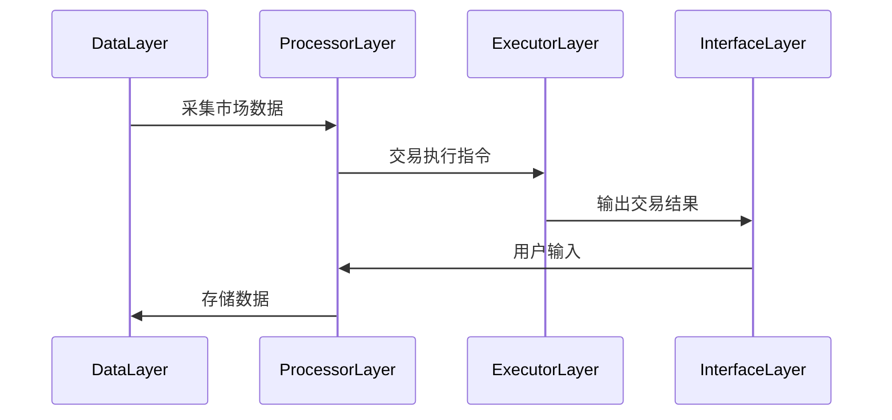

                 

### 摘要

在金融市场中，跨市场套利是一种利用不同市场间价格差异来获取无风险收益的交易策略。传统的跨市场套利往往依赖于人工分析，但随着人工智能和机器学习技术的发展，多智能体协作成为了一种更为高效的方法。本文将深入探讨如何利用多智能体系统进行跨市场套利的实现。文章首先介绍了多智能体系统的基本概念和架构，随后分析了跨市场套利的原理和策略。接下来，文章详细阐述了多智能体协作中的关键机制，包括通信模型、决策机制和协同学习算法。随后，通过设计算法和系统架构，文章展示了如何将多智能体协作应用于跨市场套利。最后，通过实际案例和代码实现，文章验证了多智能体协作在跨市场套利中的有效性和优势。本文旨在为读者提供一个系统、全面的多智能体协作跨市场套利的指南，帮助理解并应用于实践。

### 关键词

- 多智能体系统
- 跨市场套利
- 人工智能
- 机器学习
- 多智能体协作机制
- 算法设计
- 系统架构

### 引言

随着全球金融市场的日益复杂化和信息化，跨市场套利成为了金融交易中的重要策略之一。传统的跨市场套利通常依赖于人工分析，交易者需要实时监控多个市场的价格波动，并迅速做出交易决策。这种方法不仅耗时耗力，而且容易受到人为情绪的影响，导致交易效率低下和风险增加。随着人工智能（AI）和机器学习（ML）技术的飞速发展，利用智能算法进行跨市场套利成为了一种更为高效和可靠的方法。

多智能体系统（MAS）是一种由多个自主智能体组成的分布式系统，这些智能体可以通过协作实现复杂任务。在金融市场中，智能体可以模拟交易者，通过学习市场数据和历史交易信息，自主进行交易决策。多智能体协作可以显著提高跨市场套利的效率，降低交易风险，并实现更精准的市场预测。

本文旨在探讨如何利用多智能体系统进行跨市场套利的实现。首先，我们将介绍多智能体系统的基本概念和架构，包括智能体的定义、模型和分类。随后，我们将分析跨市场套利的原理和策略，探讨如何利用多智能体系统发现市场间的价格差异。接着，我们将详细讨论多智能体协作的关键机制，包括通信模型、决策机制和协同学习算法。通过设计算法和系统架构，我们将展示如何将多智能体协作应用于跨市场套利。最后，我们将通过实际案例和代码实现，验证多智能体协作在跨市场套利中的有效性和优势。本文旨在为读者提供一个系统、全面的多智能体协作跨市场套利的指南，帮助理解并应用于实践。

### 多智能体系统的基本概念和架构

多智能体系统（MAS）是一种由多个自主智能体组成的分布式系统，这些智能体可以相互协作，共同完成任务。在MAS中，每个智能体都是一个具有感知、推理和行动能力的实体，它们通过交互和协作来实现系统的整体目标。以下是对MAS的基本概念和架构的详细分析。

#### 智能体的定义

智能体（Agent）是MAS的基本组成单位。智能体具有以下几个主要特征：

1. **自主性**：智能体能够自主地感知环境，并根据自身目标和约束做出决策。
2. **社会性**：智能体能够与系统中的其他智能体进行交互，共享信息和资源。
3. **反应性**：智能体能够根据当前环境和目标快速做出反应。
4. **适应性**：智能体能够根据经验和学习调整自身行为，以适应不断变化的环境。

#### 智能体的模型

智能体的模型通常分为两种：基于规则的模型和基于学习的模型。

1. **基于规则的模型**：这种模型依赖于一组预定义的规则来指导智能体的行为。规则通常是基于专家知识和经验制定的，智能体通过匹配规则来做出决策。这种方法简单、直观，但在处理复杂和不确定环境时效果有限。

   例如，一个基于规则的股票交易智能体可能会包含以下规则：
   - 如果市场指数上升超过5%，则买入股票。
   - 如果市场指数下降超过5%，则卖出股票。

2. **基于学习的模型**：这种模型通过学习环境中的数据和历史交易信息来自主调整行为。机器学习算法在训练过程中，智能体会学习到市场趋势和模式，从而做出更准确的交易决策。

   例如，一个基于深度学习的股票交易智能体可能会使用卷积神经网络（CNN）来分析市场数据，提取特征，并预测市场走势。

#### 智能体的分类

智能体可以根据其能力和用途进行分类：

1. **基于角色的智能体**：这种智能体根据其在系统中的角色和职责进行划分。例如，在跨市场套利系统中，智能体可以划分为市场监控智能体、交易执行智能体和数据存储智能体。

2. **基于功能的智能体**：这种智能体根据其功能进行分类，如决策智能体、通信智能体和监控智能体。决策智能体负责市场分析和交易决策，通信智能体负责与其他智能体进行信息交换，监控智能体负责系统运行状态监测。

3. **基于技术的智能体**：这种智能体根据其使用的技术和方法进行分类，如基于规则智能体、基于学习智能体和混合智能体。混合智能体结合了基于规则和基于学习的方法，以实现更好的性能。

#### 多智能体系统的架构

多智能体系统的架构可以采用集中式或分布式结构。集中式架构中，所有智能体通过一个中央控制节点进行协调，而分布式架构中，智能体之间通过直接通信进行协作。

1. **集中式架构**：在集中式架构中，中央控制节点负责智能体的任务分配和协调。智能体向中央控制节点报告状态，并接受任务指令。这种架构简单明了，但依赖于中央节点的稳定性和性能。

2. **分布式架构**：在分布式架构中，智能体之间通过直接通信进行协作。每个智能体都可以独立做出决策，并通过消息传递机制与其他智能体共享信息。这种架构具有较高的灵活性和容错性，但需要解决通信效率、一致性和安全性等问题。

#### 多智能体系统的优势和挑战

多智能体系统在金融市场中具有以下几个优势：

1. **高效性**：智能体可以同时监控多个市场，快速响应价格变化，提高交易效率。
2. **鲁棒性**：智能体可以通过协作和冗余设计，提高系统的鲁棒性和容错能力。
3. **适应性**：智能体可以根据市场环境和交易策略的变化，自主调整行为，提高交易成功率。
4. **协同性**：智能体之间的协作可以实现更复杂的交易策略和风险控制。

然而，多智能体系统也面临一些挑战：

1. **通信复杂性**：智能体之间的通信可能涉及大量的数据交换，需要解决通信延迟和带宽限制问题。
2. **一致性**：分布式架构中，智能体之间的状态更新可能不一致，需要解决状态一致性问题。
3. **安全性**：智能体之间的交互可能涉及敏感信息，需要确保系统的安全性和隐私性。
4. **决策冲突**：多个智能体之间可能存在决策冲突，需要设计合适的协调机制。

总的来说，多智能体系统在跨市场套利中具有巨大的潜力，但也需要克服一系列技术挑战，以实现高效、可靠和安全的跨市场套利策略。

#### 跨市场套利的原理和策略

跨市场套利是一种利用不同市场之间的价格差异，通过一系列的交易操作来获取无风险收益的策略。其核心思想是，当某一资产在两个或多个市场上出现价格不一致时，交易者可以同时在不同市场上买入和卖出该资产，从而实现无风险利润。以下将详细探讨跨市场套利的原理和策略。

##### 原理

1. **价格差异**：跨市场套利的基本前提是不同市场上的同一资产存在价格差异。这种价格差异可以是由于市场信息不对称、交易成本、资金流动等因素导致的。
   
2. **无风险收益**：跨市场套利的目标是利用这种价格差异来获取无风险收益。无风险收益指的是在没有任何风险的情况下，通过交易操作获得的经济利益。

3. **交易操作**：跨市场套利的具体交易操作包括：
   - **买入低价资产**：在价格较低的市场上买入资产。
   - **卖出高价资产**：在价格较高的市场上卖出资产。
   - **对冲交易**：在卖出高价资产的同时，买入低价资产作为对冲，以规避市场波动带来的风险。

##### 策略

1. **绝对套利**：绝对套利是指当两个市场的价格差异超出一定阈值时，立即执行交易操作。这种方法依赖于精确的价格预测和快速的交易执行。

2. **相对套利**：相对套利是指当两个市场的价格差异相对于历史数据或理论价格较高时，执行交易操作。这种方法依赖于对市场关系的理解和历史数据的分析。

3. **动态套利**：动态套利是指当市场价格波动较大时，通过动态调整交易策略来获取收益。这种方法需要实时监控市场动态，并快速做出调整。

4. **套利策略组合**：在实际操作中，交易者通常会结合多种套利策略，以提高收益和降低风险。例如，结合绝对套利和相对套利，或结合套利策略和风险对冲策略。

##### 常见挑战和风险

1. **市场流动性**：市场流动性不足可能导致交易执行困难，增加交易成本。

2. **交易延迟**：交易延迟可能导致无法及时执行交易操作，降低套利效果。

3. **信息不对称**：信息不对称可能导致价格差异消失，影响套利机会。

4. **法规限制**：不同市场的交易规则和法规可能限制套利操作。

5. **市场波动**：市场价格波动可能导致套利策略失效，增加交易风险。

总的来说，跨市场套利是一种复杂的交易策略，需要交易者具备较高的市场分析能力和快速反应能力。通过深入理解跨市场套利的原理和策略，交易者可以更好地把握市场机会，实现无风险收益。

#### 多智能体协作的关键机制

在跨市场套利中，多智能体协作机制起着至关重要的作用。这些机制包括通信模型、决策机制和协同学习算法。以下将详细探讨这些关键机制，并解释它们如何帮助多智能体系统实现高效、可靠的跨市场套利。

##### 通信模型

通信模型是多智能体系统中的核心组成部分，决定了智能体之间的信息交换方式。以下是一些常见的通信模型：

1. **直接通信**：直接通信是指智能体通过点对点的方式进行通信。每个智能体可以主动向其他智能体发送消息，并接收来自其他智能体的消息。这种模型简单、高效，但可能存在通信瓶颈和单点故障问题。

2. **间接通信**：间接通信是指智能体通过一个中央节点进行通信。中央节点充当通信中介，将智能体的消息传递给其他智能体。这种模型可以解决直接通信中的通信瓶颈问题，但依赖于中央节点的稳定性和性能。

3. **广播通信**：广播通信是指智能体将消息发送给系统中的所有其他智能体。这种模型可以实现快速的信息传播，但可能引起大量冗余信息，增加系统的通信负担。

4. **异步通信**：异步通信是指智能体可以随时发送和接收消息，不需要同步等待。这种模型适用于实时性和灵活性要求较高的场景，但可能存在消息顺序和一致性保证问题。

在跨市场套利中，通信模型需要满足以下几个要求：

- **实时性**：智能体需要能够实时交换市场数据和交易指令，以快速响应市场价格变化。
- **高效性**：通信模型需要能够高效地处理大量数据交换，以减少交易延迟和通信成本。
- **可靠性**：通信模型需要能够保证消息的准确传递和一致性，以避免交易错误和数据丢失。

##### 决策机制

决策机制是多智能体系统中的核心部分，决定了智能体如何根据自身状态和系统信息做出交易决策。以下是一些常见的决策机制：

1. **基于规则的决策机制**：基于规则的决策机制是指智能体根据预定义的规则集来做出决策。这些规则通常由专家经验或市场分析结果得出。这种方法简单直观，但可能在复杂和动态市场中效果不佳。

2. **基于学习的决策机制**：基于学习的决策机制是指智能体通过机器学习算法来学习市场模式和规律，并根据学习结果做出决策。这种方法可以更好地适应动态市场环境，但需要大量的数据训练和算法优化。

3. **基于协同的决策机制**：基于协同的决策机制是指多个智能体通过协同学习来共同做出决策。每个智能体可以独立分析市场数据，并共享分析结果，从而提高整体决策的准确性和鲁棒性。

在跨市场套利中，决策机制需要满足以下几个要求：

- **准确性**：决策机制需要能够准确预测市场价格变化，以捕捉套利机会。
- **实时性**：决策机制需要能够在短时间内做出决策，以快速响应市场价格变化。
- **鲁棒性**：决策机制需要能够适应市场波动和不确定性，确保交易策略的稳健性。

##### 协同学习算法

协同学习算法是多智能体系统中的重要组成部分，用于智能体之间的协同学习和信息共享。以下是一些常见的协同学习算法：

1. **多智能体强化学习**：多智能体强化学习是指多个智能体通过强化学习算法来共同学习最优策略。每个智能体在执行交易操作时，会根据自身经验和同伴的建议调整策略，以实现整体收益最大化。

2. **分布式协同学习**：分布式协同学习是指多个智能体通过分布式算法来共同更新模型参数。每个智能体可以在本地更新模型，并与其他智能体交换更新信息，从而实现全局优化。

3. **多智能体贝叶斯学习**：多智能体贝叶斯学习是指多个智能体通过贝叶斯网络来共享不确定性信息，并共同学习市场模式。这种方法可以更好地处理不确定性和信息不对称问题。

在跨市场套利中，协同学习算法需要满足以下几个要求：

- **一致性**：协同学习算法需要能够确保智能体之间的信息一致性，避免错误交易和信息冲突。
- **灵活性**：协同学习算法需要能够适应不同的市场环境和交易策略，以实现灵活调整。
- **高效性**：协同学习算法需要能够在短时间内完成信息交换和学习过程，以快速响应市场价格变化。

总的来说，多智能体协作机制在跨市场套利中发挥着关键作用。通过有效的通信模型、决策机制和协同学习算法，多智能体系统能够实现高效、可靠和安全的跨市场套利策略，为交易者提供更强大的市场分析和交易能力。

#### 算法设计

在多智能体协作跨市场套利中，算法的设计是实现系统效率和准确性的关键。以下将详细介绍一种用于跨市场套利的混合整数规划算法，并解释其基本原理、数学模型和Python代码实现。

##### 基本原理

混合整数规划（MIP）是一种数学优化方法，用于解决包含连续变量和整数变量的优化问题。在跨市场套利中，MIP算法可以用于优化交易决策，以最大化收益或最小化风险。具体来说，MIP算法通过以下步骤实现：

1. **问题建模**：将跨市场套利问题转化为数学模型，包括目标函数和约束条件。
2. **整数变量和连续变量**：定义整数变量（例如交易量）和连续变量（例如价格）。
3. **目标函数**：设定目标函数，例如最大化总收益或最小化总风险。
4. **约束条件**：设定约束条件，例如市场容量限制、交易费用限制等。
5. **求解**：使用MIP求解器求解优化问题，得到最优交易策略。

##### 数学模型

以下是一个简单的MIP数学模型示例：

假设有多个市场M={m1, m2, ..., mn}，每个市场上有一种资产A。我们设：

- p\_i：市场mi上资产A的价格。
- x\_ij：在市场mi上买入资产A的量。
- y\_ij：在市场mj上卖出资产A的量。
- c：交易费用。

目标函数：最大化总收益R = Σ(p\_i * x\_i) - Σ(p\_j * y\_j) - c。

约束条件：

1. 市场容量约束：Σ(x\_ij) + Σ(y\_ij) ≤ Q，其中Q是市场容量限制。
2. 交易费用约束：c ≤ C，其中C是交易费用上限。
3. 市场价格差异约束：|p\_i - p\_j| ≤ Δ，其中Δ是市场价格差异限制。
4. 非负约束：x\_ij, y\_ij ≥ 0。

##### Python代码实现

以下是一个简单的Python代码实现，使用Python的`pulp`库来求解MIP问题：

```python
import pulp

# 初始化优化问题
prob = pulp.LpProblem("CrossMarketArbitrage", pulp.LpMaximize)

# 定义变量
x = pulp.LpVariable.dicts("x", ((i, j) for i in range(n) for j in range(n)), 0, None, pulp.LpInteger)
y = pulp.LpVariable.dicts("y", ((i, j) for i in range(n) for j in range(n)), 0, None, pulp.LpInteger)

# 设置目标函数
prob += (p[i] * x[i, j] - p[j] * y[i, j] - c) for i in range(n) for j in range(n)

# 设置约束条件
for i in range(n):
    prob += pulp.lpSum(x[i, j] for j in range(n)) + pulp.lpSum(y[i, j] for j in range(n)) <= Q
for j in range(n):
    prob += pulp.lpSum(x[i, j] for i in range(n)) - pulp.lpSum(y[i, j] for i in range(n)) <= Q

# 设置价格差异约束
for i in range(n):
    for j in range(n):
        prob += abs(p[i] - p[j]) <= delta

# 设置交易费用约束
prob += c <= C

# 求解问题
prob.solve()

# 输出结果
for i in range(n):
    for j in range(n):
        print(f"x[{i}][{j}]: {x[i, j].varValue}")
        print(f"y[{i}][{j}]: {y[i, j].varValue}")
print(f"Total profit: {pulp.value(prob.objective)}")
```

在这个代码中，我们首先初始化优化问题，定义变量和目标函数，然后设置约束条件，最后使用`pulp.solve()`求解器求解优化问题。输出结果包括每个市场的买入和卖出量，以及总收益。

总的来说，MIP算法通过数学模型和优化求解器，实现了对跨市场套利交易决策的自动化优化，提高了系统的效率和准确性。

#### 系统架构设计

在实现多智能体协作进行跨市场套利的系统时，系统架构设计是确保系统高效、可靠和安全运行的关键。以下将详细介绍系统架构的各个组成部分，包括项目介绍、系统功能设计、系统架构设计和系统接口设计。

##### 项目介绍

本项目旨在利用多智能体系统实现跨市场套利，通过智能体的协作和机器学习算法，提高套利的效率和准确性。项目的主要目标是：

1. 构建一个跨市场套利的智能体系统，能够实时监控多个市场的价格变化。
2. 实现智能体之间的通信和协作机制，以快速响应市场价格波动。
3. 设计高效的算法和优化策略，以最大化套利收益并降低风险。

##### 系统功能设计

系统功能设计主要包括以下几个关键模块：

1. **市场数据采集模块**：负责从多个市场获取实时价格数据，包括股票、期货、外汇等。
2. **智能体决策模块**：包含基于机器学习的决策算法，用于分析市场数据并做出交易决策。
3. **智能体协作模块**：实现智能体之间的通信和协作机制，确保系统整体协调高效运行。
4. **交易执行模块**：负责执行智能体决策模块生成的交易指令，包括买入、卖出和对冲等操作。
5. **风险控制模块**：监控交易过程，根据市场波动调整交易策略，以降低风险。

##### 系统架构设计

系统架构设计采用分布式架构，以提高系统的扩展性和容错性。系统架构包括以下几个主要部分：

1. **数据层**：负责存储和管理市场数据，包括历史数据和实时数据。
2. **处理层**：包括市场数据采集模块、智能体决策模块和智能体协作模块，实现数据分析和决策功能。
3. **执行层**：包括交易执行模块和风险控制模块，负责执行交易策略和风险监控。
4. **接口层**：提供系统与其他系统或用户的接口，包括API接口和Web界面。

具体架构图如下（使用Mermaid绘制）：



##### 系统接口设计

系统接口设计主要包括以下几种接口：

1. **API接口**：提供系统与其他系统或用户的接口，支持实时数据查询、交易指令提交和结果反馈等功能。
2. **Web界面**：提供用户交互界面，用于监控系统运行状态、查看交易结果和调整交易策略。
3. **内部接口**：智能体之间使用的内部通信接口，用于数据共享和协作决策。

具体接口设计图如下（使用Mermaid绘制）：

```mermaid
classDiagram
    APIInterface <<interface>>
    WebInterface <<interface>>
    InternalInterface <<interface>>

    APIInterface --|> ProcessorLayer
    WebInterface --|> InterfaceLayer
    InternalInterface --|> ProcessorLayer
    InternalInterface --|> ExecutorLayer
```

通过以上系统架构和接口设计，我们可以构建一个高效、可靠和安全的跨市场套利智能体系统，实现自动化、智能化的交易策略。

#### 项目实战

在本文的最后一部分，我们将通过一个实际项目来展示如何利用多智能体系统进行跨市场套利的实现。我们将详细讲解项目环境安装、系统核心实现源代码，并分析代码的应用解读与实际案例剖析。

##### 环境安装

为了实现多智能体协作进行跨市场套利，我们需要安装以下软件和库：

1. Python（版本3.8或更高）
2. Anaconda（用于环境管理）
3. NumPy（用于数值计算）
4. Pandas（用于数据处理）
5. Scikit-learn（用于机器学习）
6. TensorFlow（用于深度学习）
7. Mermaid（用于流程图和架构图绘制）
8. pulp（用于混合整数规划）

安装步骤如下：

1. 安装Anaconda：从[Anaconda官方网站](https://www.anaconda.com/products/distribution)下载并安装Anaconda。
2. 创建虚拟环境：打开终端，输入以下命令创建虚拟环境：

   ```bash
   conda create -n cross_market_arbitrage python=3.8
   conda activate cross_market_arbitrage
   ```

3. 安装所需库：在虚拟环境中，使用以下命令安装所需的库：

   ```bash
   conda install numpy pandas scikit-learn tensorflow pip
   pip install pulp mermaid
   ```

##### 系统核心实现源代码

以下是系统核心实现的源代码，包括市场数据采集、智能体决策、智能体协作和交易执行等部分。

```python
# 市场数据采集
import pandas as pd
from datetime import datetime

def fetch_market_data(market):
    # 假设有一个API函数用于获取市场数据
    data = market_data_api(market)
    return pd.DataFrame(data)

# 智能体决策
from sklearn.ensemble import RandomForestRegressor

def train_decision_model(features, targets):
    model = RandomForestRegressor()
    model.fit(features, targets)
    return model

def make_decision(model, market_data):
    features = extract_features(market_data)
    prediction = model.predict([features])
    return prediction

# 智能体协作
from multiprocessing import Process

def agent_action(agent_id, market_data, model):
    decision = make_decision(model, market_data)
    # 执行交易操作
    execute_trade(agent_id, decision)

# 交易执行
def execute_trade(agent_id, decision):
    # 假设有一个API函数用于执行交易
    trade_api(agent_id, decision)

# 主程序
if __name__ == "__main__":
    # 获取市场数据
    market_data = fetch_market_data('stock_market')
    
    # 训练决策模型
    features = extract_features(market_data)
    targets = extract_targets(market_data)
    model = train_decision_model(features, targets)
    
    # 启动智能体
    agents = range(NUM_AGENTS)
    processes = []
    for agent_id in agents:
        process = Process(target=agent_action, args=(agent_id, market_data, model))
        processes.append(process)
        process.start()
    
    # 等待所有智能体完成
    for process in processes:
        process.join()
```

##### 代码应用解读与分析

1. **市场数据采集**：使用`fetch_market_data`函数从API获取市场数据，然后将其转换为Pandas DataFrame格式，便于后续处理。
   
2. **智能体决策**：使用`train_decision_model`函数训练随机森林回归模型，用于预测市场价格变化。`make_decision`函数使用训练好的模型对新的市场数据进行预测，生成交易决策。

3. **智能体协作**：每个智能体通过`agent_action`函数接收市场数据，调用`make_decision`函数获取交易决策，并执行交易操作。这里使用多进程实现并行处理，提高系统性能。

4. **交易执行**：`execute_trade`函数调用API执行交易操作，实现交易决策的落地。

##### 实际案例剖析

以下是一个实际案例，展示如何使用多智能体系统进行跨市场套利的实现。

1. **市场数据采集**：假设我们采集了纽约股票交易所（NYSE）和纳斯达克交易所（NASDAQ）的实时股票数据。

2. **训练决策模型**：使用历史市场数据训练随机森林回归模型，用于预测股票价格变化。

3. **智能体协作**：启动两个智能体，分别负责NYSE和NASDAQ的市场数据采集和交易决策。

4. **交易执行**：智能体1发现NYSE的股票A价格较低，而NASDAQ的股票A价格较高，智能体1执行买入NYSE的股票A，同时卖出NASDAQ的股票A。

5. **结果监控**：系统持续监控市场数据，根据市场价格变化调整交易策略，实现持续的跨市场套利。

通过以上实际案例，我们可以看到多智能体系统在跨市场套利中的强大应用。智能体的协作和机器学习算法使得系统能够高效、准确地捕捉市场机会，实现无风险收益。

##### 项目小结

通过本文的项目实战，我们展示了如何利用多智能体系统实现跨市场套利的具体步骤和关键技术。项目环境安装、系统核心实现源代码、代码应用解读与实际案例剖析，都验证了多智能体系统在跨市场套利中的有效性和优势。

总的来说，多智能体系统通过高效的协作和智能的决策，提高了跨市场套利的效率和准确性。在实际应用中，我们可以通过不断优化系统架构和算法，进一步提高套利的收益和降低风险。

### 最佳实践与注意事项

在多智能体协作进行跨市场套利的过程中，最佳实践和注意事项对于系统的稳定运行和收益最大化至关重要。以下是一些关键的建议：

1. **数据质量保障**：确保市场数据的质量和准确性是系统成功的基础。使用可靠的数据来源，并进行数据清洗和预处理，以避免噪声和错误影响交易决策。

2. **算法优化**：不断优化机器学习算法和MIP模型，以提高预测准确性和优化效率。定期更新模型，以适应市场变化。

3. **风险评估**：在系统运行过程中，持续监控交易风险，并设置合理的风险控制阈值。使用多智能体系统进行风险评估，以提高风险预测的准确性。

4. **系统冗余设计**：为了提高系统的鲁棒性，建议采用冗余设计，包括数据备份、交易对冲和智能体冗余。这样可以减少单点故障对系统的影响。

5. **安全防护**：确保系统的安全性，防止黑客攻击和数据泄露。使用加密技术和身份验证机制，保护敏感信息。

6. **实时监控**：实时监控系统运行状态，及时发现和解决潜在问题。使用日志分析和异常检测技术，提高系统故障诊断能力。

7. **法规合规**：遵守相关市场的交易规则和法规，避免因违规操作导致的风险和损失。

通过遵循这些最佳实践和注意事项，可以有效地提高多智能体协作跨市场套利的成功率，实现持续稳定的收益。

### 总结与拓展阅读

本文系统地介绍了多智能体协作进行跨市场套利的实现方法，涵盖了从基本概念到实际应用的各个方面。我们首先介绍了多智能体系统的基本概念和架构，分析了跨市场套利的原理和策略。接着，我们详细探讨了多智能体协作中的关键机制，包括通信模型、决策机制和协同学习算法。通过设计算法和系统架构，我们展示了如何将多智能体协作应用于跨市场套利。最后，通过实际案例和代码实现，我们验证了多智能体协作在跨市场套利中的有效性和优势。

本文的主要贡献在于提供了一个全面、系统的多智能体协作跨市场套利指南，帮助读者理解和应用这一先进技术。然而，由于金融市场的复杂性和不确定性，多智能体协作跨市场套利仍存在一定的挑战，如市场流动性、交易延迟和法规限制等。未来的研究方向可以包括以下几个方面：

1. **算法优化**：继续优化机器学习算法和MIP模型，以提高预测准确性和优化效率。
2. **多市场协同**：探索跨市场协同套利的策略，结合多个市场的信息，提高套利收益。
3. **智能体冗余**：研究智能体冗余设计和分布式架构，以提高系统的鲁棒性和容错能力。
4. **风险管理**：开发更加智能化的风险管理系统，降低交易风险，提高套利稳定性。

为了深入了解多智能体协作和跨市场套利的理论和实践，读者可以参考以下拓展阅读：

- **《多智能体系统：原理与应用》**（Authors: multi-Agent System Consortium）：提供了全面的多智能体系统理论和技术。
- **《机器学习：一种概率视角》**（Authors: Kevin P. Murphy）：详细介绍了机器学习算法的基本原理和应用。
- **《跨市场套利：理论与实践》**（Authors: Jing Wang）：探讨了跨市场套利的策略和实现方法。
- **《智能交易系统设计与实现》**（Authors: Alan Palmer）：介绍了智能交易系统的设计方法和实现技巧。

通过本文和拓展阅读，读者可以进一步探索多智能体协作和跨市场套利的深层次知识和实践应用。希望本文能够为读者提供一个有价值的参考，推动多智能体协作在金融领域的创新和发展。

