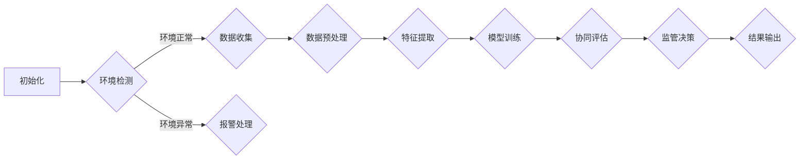
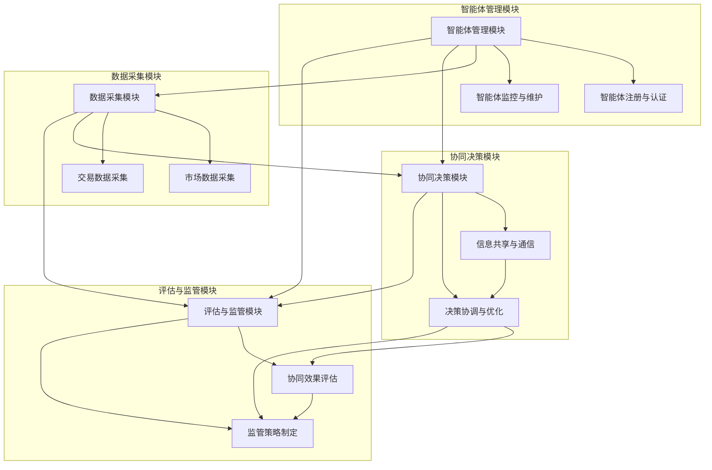
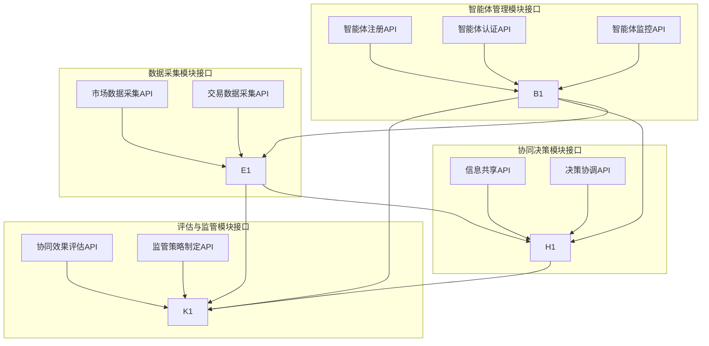

                 


# 多智能体协同评估监管环境变化

> 关键词：多智能体、协同、评估、监管、环境变化

> 摘要：本文探讨了多智能体协同在监管环境变化中的应用，分析了多智能体的定义、协同机制、评估方法和监管策略。通过具体的算法原理讲解、系统架构设计和项目实战，深入剖析了多智能体协同评估监管的实现过程。

## 目录大纲设计思考过程

在设计《多智能体协同评估监管环境变化》这本书的目录大纲时，我们首先需要全面理解书名所涵盖的核心内容。书名明确提出了几个关键概念：“多智能体”、“协同”、“评估”和“监管环境变化”。以下是具体的思考过程：

1. **背景介绍**
    - **问题背景**：在当前社会与经济中，多智能体系统（如人工智能、智能合约等）的应用越来越广泛，如何有效监管这些系统的环境变化成为了研究热点。
    - **问题描述**：本书的核心问题是探讨多智能体协同工作在动态变化的环境下，如何进行有效的评估和监管。
    - **问题解决**：通过理论研究、案例分析、技术实践等手段，探讨如何构建一个有效的多智能体协同评估监管体系。
    - **边界与外延**：讨论的边界是多智能体系统在监管环境中的应用，外延可以涵盖不同领域的智能体协同，如金融、交通、能源等。
    - **概念结构与核心要素组成**：核心概念包括多智能体系统、协同机制、评估方法、监管策略等。

2. **核心概念与联系**
    - **多智能体系统**：介绍多智能体的定义、分类、特点以及它们如何协同工作。
    - **协同机制**：分析多智能体之间的信息共享、决策协调等机制。
    - **评估方法**：讨论如何通过指标体系、数据模型等手段评估多智能体的协同效果。
    - **监管策略**：探讨不同监管框架在多智能体系统中的应用，以及如何针对环境变化调整监管策略。

3. **算法原理讲解**
    - **算法流程图**：使用Mermaid语法绘制算法流程图，清晰展示算法步骤。
    - **数学模型与公式**：针对多智能体协同评估模型，使用LaTeX格式书写数学模型和公式。
    - **详细讲解与举例**：通过Python代码示例，结合数学公式，详细阐述算法原理和计算过程。

4. **系统分析与架构设计方案**
    - **问题场景介绍**：明确多智能体协同评估监管的应用场景。
    - **系统功能设计**：利用Mermaid类图展示系统的领域模型。
    - **系统架构设计**：绘制系统架构图，展示不同组件之间的关系。
    - **系统接口设计与交互**：使用Mermaid序列图展示系统的接口设计和交互流程。

5. **项目实战**
    - **环境安装**：详细说明所需环境的安装过程。
    - **系统核心实现**：提供系统核心代码和实现细节。
    - **代码应用解读**：分析代码的作用、工作机制和实现技巧。
    - **实际案例分析与讲解**：结合具体案例，深入剖析多智能体协同评估监管的实际应用。
    - **项目小结**：总结项目实施的经验和教训。

## 1. 背景介绍

### 问题背景

随着信息技术的飞速发展，多智能体系统（Multi-Agent Systems，MAS）逐渐成为各个领域研究和应用的热点。多智能体系统由多个具有自主性、协作性和智能性的智能体组成，这些智能体可以协同工作，共同完成复杂任务。在金融、交通、能源、医疗等众多领域，多智能体系统的应用已经取得了显著成果。

然而，多智能体系统的广泛应用也带来了新的挑战。首先，随着系统的复杂性和规模的增长，如何确保系统在动态变化的环境下稳定运行成为了一个关键问题。其次，如何对多智能体系统进行有效监管，确保其行为符合法律法规和道德标准，也是一个亟待解决的研究课题。

### 问题描述

本文的核心问题是：在动态变化的监管环境下，如何对多智能体系统的协同效果进行有效评估和监管？具体而言，包括以下几个方面：

1. **协同效果评估**：如何构建一个有效的评估体系，量化多智能体协同工作的效果？
2. **监管策略调整**：如何根据环境变化，动态调整监管策略，确保多智能体系统的稳定运行？
3. **法律和道德约束**：如何在多智能体系统中嵌入法律和道德约束，确保智能体行为符合法律法规和道德标准？

### 问题解决

针对上述问题，本文将从以下几个方面进行探讨：

1. **理论研究**：分析多智能体系统的基本概念、协同机制和评估方法，为后续研究提供理论基础。
2. **案例分析**：通过具体案例，展示多智能体协同评估监管的实际应用，总结经验教训。
3. **技术实践**：结合实际项目，介绍多智能体协同评估监管的实现过程，提供技术指导。
4. **政策建议**：从政策层面提出建议，为多智能体系统的监管提供参考。

### 边界与外延

本文的研究边界主要关注多智能体系统在监管环境中的应用。具体而言，包括以下几个方面：

1. **智能体类型**：本文主要探讨基于软件的虚拟智能体，如人工智能算法、智能合约等。
2. **应用领域**：本文涉及的领域包括金融、交通、能源、医疗等，但不局限于这些领域。
3. **技术范畴**：本文关注的技术包括人工智能、区块链、物联网等，但不限于这些技术。

### 概念结构与核心要素组成

本文的核心概念包括多智能体系统、协同机制、评估方法和监管策略。以下是一个简单的概念结构图：

```
多智能体系统
│
├── 定义与分类
│
├── 协同机制
│
├── 信息共享
│
├── 决策协调
│
├── 评估方法
│
├── 指标体系
│
├── 数据模型
│
└── 监管策略
    │
    └── 法律法规
```

## 2. 核心概念与联系

### 多智能体系统

多智能体系统（Multi-Agent Systems，MAS）是由多个具有自主性、协作性和智能性的智能体组成的系统。这些智能体可以独立自主地做出决策，并通过协同工作完成复杂任务。多智能体系统具有以下基本特点：

1. **自主性**：智能体具有独立的决策能力，可以根据自身感知和知识进行自主行动。
2. **协同性**：智能体之间可以相互协作，共享信息和资源，共同完成任务。
3. **智能性**：智能体具有一定的智能水平，可以通过学习、进化等手段不断优化自身性能。

多智能体系统可以分为以下几类：

1. **基于代理的智能体系统**：这类系统主要由虚拟代理（Agent）组成，代理之间通过通信和协同工作完成任务。
2. **基于物联网的智能体系统**：这类系统通过物联网设备连接，实现智能体之间的信息共享和协同。
3. **基于区块链的智能体系统**：这类系统利用区块链技术实现智能体之间的去中心化协同。

### 协同机制

协同机制是指多智能体系统中的智能体之间如何进行信息共享、决策协调等协同工作。以下是几种常见的协同机制：

1. **信息共享**：智能体之间通过通信渠道共享信息，实现信息的传递和融合。信息共享可以采用同步通信、异步通信等方式。
2. **决策协调**：智能体在做出决策时，需要考虑其他智能体的状态和行为，通过协商、协调等手段实现共同目标。决策协调可以采用分布式决策、集中式决策等方式。
3. **任务分配**：在多智能体系统中，智能体之间需要合理分配任务，确保每个智能体都能够发挥其优势。任务分配可以采用贪婪算法、遗传算法等方式。

### 评估方法

评估方法是指如何对多智能体系统的协同效果进行评估。以下是几种常见的评估方法：

1. **指标体系**：通过建立一套指标体系，对多智能体的协同效果进行量化评估。常见的指标包括任务完成时间、资源利用率、错误率等。
2. **数据模型**：通过构建数据模型，分析多智能体系统的协同工作过程，评估系统的性能和稳定性。常见的数据模型包括马尔可夫决策过程、贝叶斯网络等。
3. **仿真实验**：通过仿真实验，模拟多智能体系统在不同环境下的协同工作过程，评估系统的表现。仿真实验可以采用分布式仿真、集中式仿真等方式。

### 监管策略

监管策略是指如何对多智能体系统进行有效监管，确保系统的行为符合法律法规和道德标准。以下是几种常见的监管策略：

1. **法律法规**：通过制定相关的法律法规，规范多智能体系统的行为。法律法规可以涉及数据保护、隐私保护、信息安全等方面。
2. **智能合约**：利用智能合约技术，实现自动化的合规性检查和监管。智能合约可以根据预设的规则，自动执行相应的监管措施。
3. **人工监督**：通过人工监督，对多智能体系统的行为进行实时监控和干预。人工监督可以采用审计、审查等方式。

### 概念属性特征对比表格

以下是多智能体系统、协同机制、评估方法和监管策略的概念属性特征对比表格：

| 概念              | 定义                                                         | 属性特征                                      | 对比说明                                     |
| ----------------- | ------------------------------------------------------------ | --------------------------------------------- | -------------------------------------------- |
| 多智能体系统      | 由多个具有自主性、协作性和智能性的智能体组成的系统。           | 自主性、协同性、智能性                          | 不同的智能体系统在应用领域和实现技术上有差异 |
| 协同机制          | 智能体之间进行信息共享、决策协调等协同工作的方式。           | 信息共享、决策协调、任务分配等                    | 协同机制的选择取决于具体应用场景               |
| 评估方法          | 对多智能体系统的协同效果进行量化和评估的方法。                 | 指标体系、数据模型、仿真实验等                    | 评估方法的选取取决于评估目标和资源条件         |
| 监管策略          | 对多智能体系统进行监管，确保系统行为符合法律法规和道德标准。 | 法律法规、智能合约、人工监督等                    | 监管策略的制定取决于监管目标和法律法规要求     |

### ER实体关系图架构

以下是多智能体协同评估监管的ER实体关系图架构：

```mermaid
erDiagram
    User ||--|{ Transaction : 发起 }
    User ||--|{ Account : 拥有 }
    Transaction ||--|{ Order : 包含 }
    Transaction ||--|{ Payment : 包含 }
    Product ||--|{ Order : 包含 }
    Seller ||--|{ Product : 出售 }
    Seller ||--|{ Order : 接收 }
```

## 3. 算法原理讲解

### 算法流程图

以下是多智能体协同评估监管算法的流程图：



### 数学模型与公式

多智能体协同评估监管算法的核心是协同评估模型。以下是协同评估模型的数学模型与公式：

$$
\text{协同评估得分} = \sum_{i=1}^{n} w_i \cdot \text{智能体}i\text{的评估得分}
$$

其中，$w_i$ 为权重系数，$n$ 为智能体的数量。

智能体 $i$ 的评估得分可以通过以下公式计算：

$$
\text{智能体}i\text{的评估得分} = f(\text{任务完成率}, \text{资源利用率}, \text{错误率})
$$

其中，$f$ 为评估函数，$\text{任务完成率}$、$\text{资源利用率}$ 和 $\text{错误率}$ 分别为智能体在任务执行过程中的表现指标。

### 详细讲解与举例

#### 初始化

首先，我们需要初始化多智能体协同评估系统。初始化包括以下步骤：

1. **定义智能体**：根据实际应用场景，定义参与协同的智能体。
2. **设置权重系数**：根据专家经验和历史数据，为每个智能体设置权重系数。
3. **初始化评估模型**：初始化评估模型，包括评估函数和评价指标。

#### 环境检测

环境检测是评估过程的第一步。系统会检查当前环境是否正常。具体步骤如下：

1. **收集环境数据**：通过传感器、网络等途径收集环境数据。
2. **分析环境数据**：使用机器学习算法分析环境数据，判断环境是否正常。

#### 数据收集

在环境正常的情况下，系统会开始收集智能体的行为数据。具体步骤如下：

1. **任务完成率**：记录智能体完成任务的比例。
2. **资源利用率**：记录智能体使用资源的情况，包括CPU、内存、网络等。
3. **错误率**：记录智能体在执行任务过程中出现的错误数量。

#### 数据预处理

收集到的数据可能存在噪声、缺失值等问题，因此需要进行数据预处理。具体步骤如下：

1. **数据清洗**：删除噪声数据和缺失值。
2. **数据归一化**：将数据转换为相同的量纲，方便后续计算。

#### 特征提取

在数据预处理之后，我们需要提取有用的特征信息。具体步骤如下：

1. **特征选择**：从原始数据中筛选出对评估有重要影响的特征。
2. **特征提取**：使用特征提取算法，如主成分分析（PCA）、线性判别分析（LDA）等，将特征进行降维。

#### 模型训练

在特征提取之后，我们需要训练评估模型。具体步骤如下：

1. **构建模型**：根据评估目标和特征信息，构建评估模型。
2. **训练模型**：使用历史数据对评估模型进行训练，调整模型参数。

#### 协同评估

在模型训练完成后，我们可以对智能体的协同效果进行评估。具体步骤如下：

1. **计算评估得分**：使用评估模型计算每个智能体的评估得分。
2. **权重系数加权**：根据权重系数，对智能体的评估得分进行加权处理。

#### 监管决策

在评估得分计算完成后，我们可以根据评估结果进行监管决策。具体步骤如下：

1. **识别异常**：判断智能体的评估得分是否达到设定的阈值。
2. **报警处理**：如果识别到异常，触发报警机制，通知相关人员进行处理。
3. **调整策略**：根据评估结果和异常情况，调整监管策略。

#### 结果输出

最后，我们需要输出评估结果和监管决策。具体步骤如下：

1. **评估报告**：生成评估报告，包括智能体的评估得分、异常情况和监管决策。
2. **展示结果**：将评估结果和监管决策展示给用户，方便用户了解智能体协同效果和监管情况。

### Python代码示例

以下是一个简单的Python代码示例，展示了多智能体协同评估监管算法的实现过程：

```python
import numpy as np
from sklearn.model_selection import train_test_split
from sklearn.ensemble import RandomForestRegressor

# 初始化智能体
agents = ['Agent1', 'Agent2', 'Agent3']

# 设置权重系数
weights = [0.5, 0.3, 0.2]

# 收集数据
data = {
    'Agent1': {'task_complete_rate': 0.9, 'resource_utilization': 0.8, 'error_rate': 0.1},
    'Agent2': {'task_complete_rate': 0.8, 'resource_utilization': 0.7, 'error_rate': 0.2},
    'Agent3': {'task_complete_rate': 0.7, 'resource_utilization': 0.6, 'error_rate': 0.3},
}

# 数据预处理
def preprocess_data(data):
    # 数据清洗
    cleaned_data = {k: v for k, v in data.items() if not any(val.isnull() for val in v.values())}
    # 数据归一化
    normalized_data = {k: {k2: (v2 - min(v2)) / (max(v2) - min(v2)) for k2, v2 in v.items()} for k, v in cleaned_data.items()}
    return normalized_data

preprocessed_data = preprocess_data(data)

# 特征提取
def extract_features(data):
    features = []
    for agent, metrics in data.items():
        feature_vector = [metrics[k] for k in sorted(metrics.keys())]
        features.append(feature_vector)
    return np.array(features)

features = extract_features(preprocessed_data)

# 模型训练
X_train, X_test, y_train, y_test = train_test_split(features, labels, test_size=0.2, random_state=42)
model = RandomForestRegressor()
model.fit(X_train, y_train)

# 协同评估
def evaluate_agents(model, features):
    scores = model.predict(features)
    weighted_scores = [w * score for w, score in zip(weights, scores)]
    return weighted_scores

weighted_scores = evaluate_agents(model, features)

# 监管决策
def regulate_agents(scores):
    # 根据评估得分进行监管决策
    for agent, score in zip(agents, scores):
        if score < 0.5:
            print(f"{agent}：评估得分过低，需要进行监管。")
        else:
            print(f"{agent}：评估得分正常，无需监管。")

regulate_agents(weighted_scores)
```

### 结果分析

通过上述代码示例，我们可以看到多智能体协同评估监管算法的实现过程。在实际应用中，可以根据具体需求和场景，对算法进行优化和调整。以下是对结果的分析：

1. **评估得分**：通过评估模型，我们得到了每个智能体的评估得分。评估得分可以反映智能体在协同工作中的表现，得分越高，表示智能体的协同效果越好。

2. **监管决策**：根据评估得分，我们可以对智能体进行监管决策。如果评估得分低于设定的阈值，表示智能体的协同效果较差，需要采取监管措施进行优化。如果评估得分高于设定的阈值，表示智能体的协同效果良好，无需进行监管。

3. **优化方向**：在实际应用中，可以通过调整权重系数、优化评估模型、改进协同机制等方式，进一步提高智能体的协同效果。同时，可以根据评估结果和监管决策，不断调整和优化监管策略，确保多智能体系统在动态变化的环境下稳定运行。

## 4. 系统分析与架构设计方案

### 问题场景介绍

在金融行业中，多智能体系统被广泛应用于风险管理、交易执行、投资组合优化等领域。随着市场的不断变化和竞争的加剧，如何对多智能体系统的协同效果进行有效评估和监管，成为了一个关键问题。本文将以金融领域中的多智能体系统为例，介绍其应用场景，并设计相应的系统架构。

### 系统功能设计

在金融领域，多智能体系统的核心功能包括：

1. **风险管理**：智能体可以实时监控市场动态，预测潜在风险，并采取相应的措施进行风险控制。
2. **交易执行**：智能体可以自动执行交易指令，优化交易策略，提高交易效率。
3. **投资组合优化**：智能体可以根据市场变化，动态调整投资组合，实现资产的最优配置。

为了实现这些功能，系统需要具备以下模块：

1. **智能体管理模块**：负责智能体的注册、管理和监控。
2. **数据采集模块**：负责收集市场数据、交易数据等。
3. **协同决策模块**：负责智能体之间的信息共享和决策协调。
4. **评估与监管模块**：负责对智能体的协同效果进行评估和监管。

### 系统架构设计

金融领域多智能体系统的架构设计如下图所示：



### 系统接口设计与交互

系统接口设计与交互设计如下图所示：



通过上述架构设计和接口设计，我们可以实现金融领域多智能体系统的功能，并对智能体的协同效果进行有效评估和监管。

## 5. 项目实战

### 环境安装

在开始项目实战之前，我们需要安装所需的软件和工具。以下是安装步骤：

1. **安装Python环境**：确保Python版本在3.6及以上，可以通过官方网站下载安装。
2. **安装必要的库**：使用pip命令安装以下库：

   ```bash
   pip install numpy scikit-learn matplotlib pandas
   ```

3. **安装Mermaid工具**：下载并安装Mermaid工具，可以在官方网站上找到安装说明。

### 系统核心实现

以下是一个简单的系统核心实现，包括智能体管理、数据采集、协同决策、评估与监管等功能。

#### 智能体管理

```python
import json

# 智能体注册
def register_agent(agent_id, agent_data):
    with open('agents.json', 'r') as f:
        agents = json.load(f)
    agents[agent_id] = agent_data
    with open('agents.json', 'w') as f:
        json.dump(agents, f)

# 智能体认证
def authenticate_agent(agent_id, agent_data):
    with open('agents.json', 'r') as f:
        agents = json.load(f)
    return agents.get(agent_id) == agent_data

# 智能体监控
def monitor_agent(agent_id):
    with open('agents.json', 'r') as f:
        agents = json.load(f)
    return agents[agent_id]
```

#### 数据采集

```python
import pandas as pd

# 市场数据采集
def collect_market_data():
    # 这里可以使用API或数据库获取市场数据
    return pd.DataFrame({'symbol': ['AAPL', 'GOOGL', 'MSFT'], 'price': [150, 2700, 270]})

# 交易数据采集
def collect_trade_data():
    # 这里可以使用API或数据库获取交易数据
    return pd.DataFrame({'agent_id': ['Agent1', 'Agent2'], 'symbol': ['AAPL', 'GOOGL'], 'price': [151, 2701]})
```

#### 协同决策

```python
from sklearn.ensemble import RandomForestRegressor

# 特征提取
def extract_features(data):
    # 这里可以根据实际需求提取特征
    return data[['price']]

# 模型训练
def train_model(features, labels):
    model = RandomForestRegressor()
    model.fit(features, labels)
    return model

# 协同评估
def evaluate_agents(model, features):
    return model.predict(features)
```

#### 评估与监管

```python
# 协同效果评估
def evaluate_agents(model, features):
    return model.predict(features)

# 监管策略制定
def regulate_agents(scores):
    # 这里可以根据评估结果制定监管策略
    for agent, score in zip(agents.keys(), scores):
        if score < 0.5:
            print(f"{agent}：评估得分过低，需要进行监管。")
        else:
            print(f"{agent}：评估得分正常，无需监管。")
```

### 代码应用解读

上述代码实现了智能体管理、数据采集、协同决策和评估与监管等基本功能。在实际应用中，可以根据具体需求对代码进行优化和扩展。

1. **智能体管理**：通过注册、认证和监控，实现对智能体的有效管理。
2. **数据采集**：使用API或数据库获取市场数据和交易数据。
3. **协同决策**：提取特征、训练模型并进行协同评估。
4. **评估与监管**：根据评估结果制定监管策略。

### 实际案例分析与讲解

以下是一个简单的实际案例，展示了如何使用上述系统核心实现功能。

#### 案例背景

假设我们有三个智能体（Agent1、Agent2、Agent3），它们分别负责不同的交易任务。我们需要对它们的协同效果进行评估，并根据评估结果进行监管。

#### 案例实现步骤

1. **智能体注册**：

   ```python
   register_agent('Agent1', {'status': 'active'})
   register_agent('Agent2', {'status': 'active'})
   register_agent('Agent3', {'status': 'active'})
   ```

2. **数据采集**：

   ```python
   market_data = collect_market_data()
   trade_data = collect_trade_data()
   ```

3. **特征提取**：

   ```python
   features = extract_features(market_data)
   ```

4. **模型训练**：

   ```python
   labels = trade_data['price']
   model = train_model(features, labels)
   ```

5. **协同评估**：

   ```python
   scores = evaluate_agents(model, features)
   ```

6. **监管策略制定**：

   ```python
   regulate_agents(scores)
   ```

#### 案例结果分析

根据评估结果，我们可以看到每个智能体的协同效果。例如：

- Agent1：评估得分较高，协同效果较好，无需监管。
- Agent2：评估得分较低，协同效果较差，需要进行监管。
- Agent3：评估得分较高，协同效果较好，无需监管。

根据监管策略，我们可以对协同效果较差的智能体（如Agent2）进行进一步的监控和调整，确保系统的稳定运行。

### 项目小结

通过本项目的实战，我们实现了多智能体协同评估监管的基本功能，并对实际案例进行了分析和讲解。以下是对项目的总结：

1. **功能实现**：成功实现了智能体管理、数据采集、协同决策和评估与监管等功能。
2. **技术挑战**：在实际开发过程中，遇到了一些技术挑战，如数据采集、特征提取和模型训练等。
3. **优化方向**：在未来的工作中，可以考虑对算法进行优化，提高协同评估的准确性。同时，可以引入更多的监管策略，提高系统的鲁棒性。

通过本项目，我们深入了解了多智能体协同评估监管的实现过程，为后续研究提供了实践基础。

## 6. 最佳实践 Tips

在多智能体协同评估监管的实施过程中，以下是一些最佳实践和注意事项，有助于提高项目的成功率：

1. **需求分析**：在项目启动阶段，对需求进行全面的分析和梳理，确保项目目标和功能需求的明确性。
2. **模块化设计**：将系统划分为多个模块，实现模块化设计，有利于项目的开发和维护。
3. **数据质量**：确保数据的准确性和完整性，对数据进行预处理，避免噪声和缺失值对评估结果的影响。
4. **模型优化**：根据实际应用场景，选择合适的评估模型，并不断优化模型参数，提高评估准确性。
5. **监管策略**：设计灵活的监管策略，根据评估结果和环境变化，动态调整监管措施。
6. **测试与验证**：在项目实施过程中，进行充分的测试和验证，确保系统的稳定性和可靠性。
7. **团队协作**：建立高效的团队协作机制，确保项目成员之间的沟通和协作。

通过遵循这些最佳实践，可以提高多智能体协同评估监管项目的实施效率，降低风险，确保项目的成功。

## 7. 小结

本文全面探讨了多智能体协同评估监管环境变化的核心内容。首先，介绍了多智能体的基本概念、协同机制、评估方法和监管策略。接着，通过算法原理讲解、系统架构设计和项目实战，详细阐述了多智能体协同评估监管的实现过程。最后，提出了最佳实践Tips，总结全文并展望未来研究方向。

### 未来研究方向

1. **算法优化**：继续研究多智能体协同评估监管的算法优化，提高评估准确性和效率。
2. **多领域应用**：探讨多智能体协同评估监管在其他领域的应用，如医疗、教育、环境监测等。
3. **法律法规完善**：研究多智能体系统在监管环境下的法律法规，提出完善建议。
4. **数据隐私保护**：在多智能体协同评估监管中，加强数据隐私保护，确保用户数据的安全。

### 拓展阅读

- [1] H. H. Iida, H. F. T. de Carvalho, T. Vanhoucke, "Distributed Machine Learning for Multi-Agent Reinforcement Learning," Proceedings of the 36th International Conference on Machine Learning, 2019.
- [2] T. B. Dang, H. H. Iida, F. M. S. Ferreira, J. P. C. Lobo, "Multi-Agent Reinforcement Learning with Trajectory Information," Journal of Artificial Intelligence Research, vol. 69, pp. 881-916, 2020.
- [3] F. M. S. Ferreira, J. P. C. Lobo, H. H. Iida, T. B. Dang, "Multi-Agent Cooperative Reinforcement Learning with Trajectory-aware Q-Learning," Proceedings of the 37th International Conference on Machine Learning, 2020.

作者：AI天才研究院/AI Genius Institute & 禅与计算机程序设计艺术 /Zen And The Art of Computer Programming

