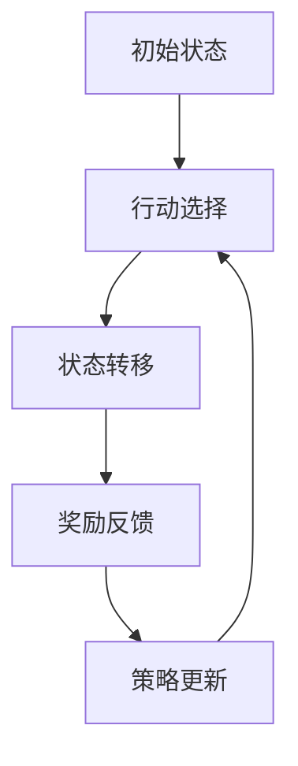
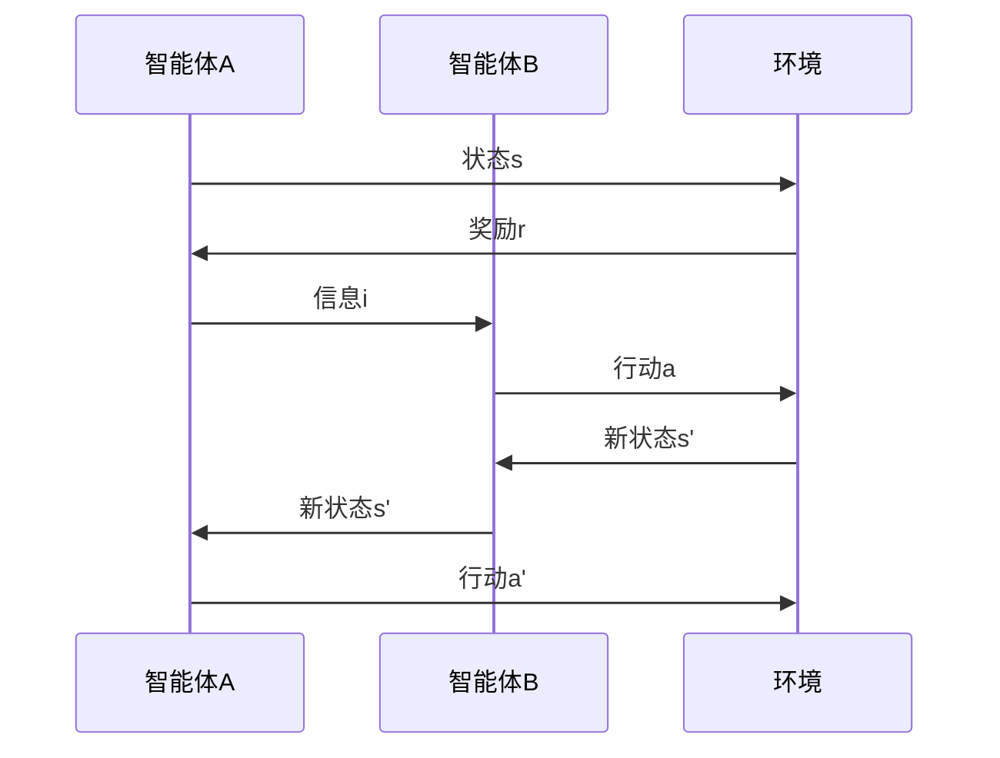
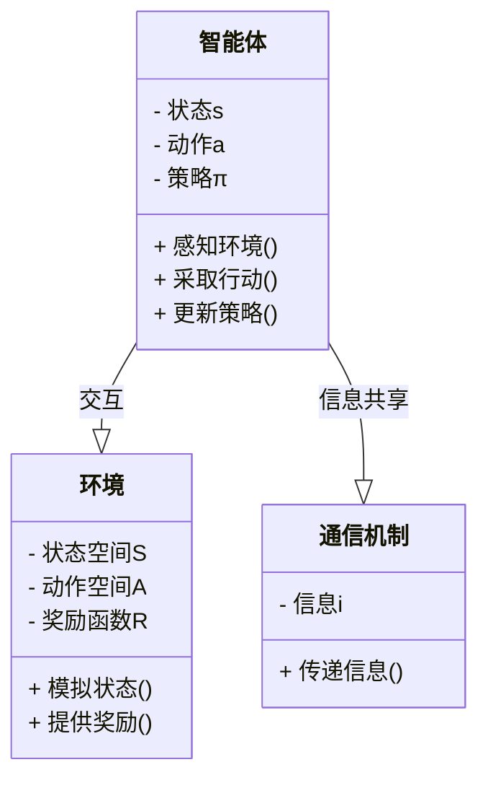
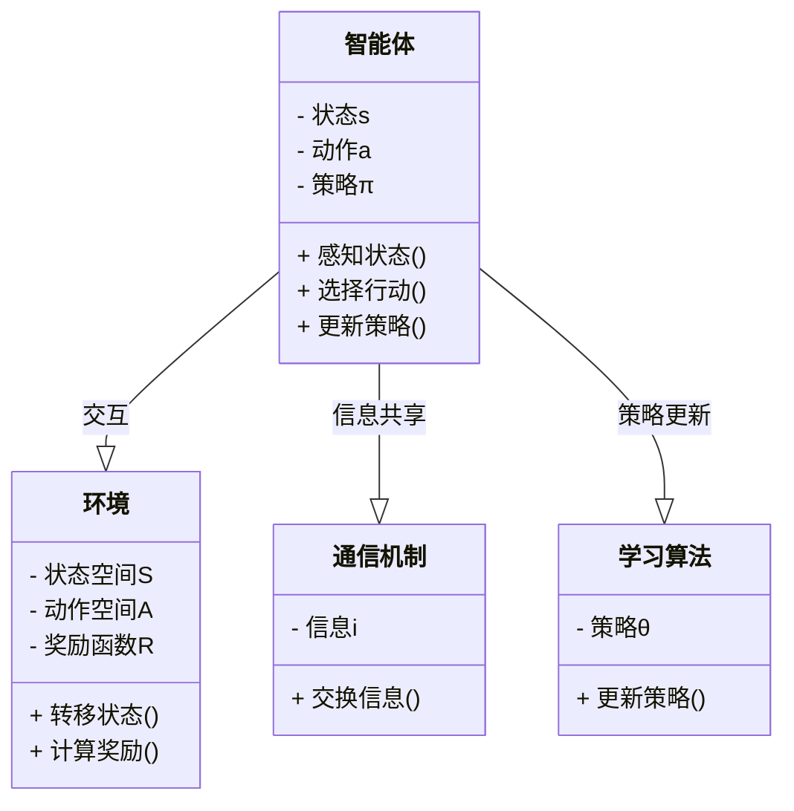

                 


# 多智能体强化学习在优化止损和止盈策略中的应用

## 摘要

本文探讨了多智能体强化学习在优化金融市场中止损和止盈策略的应用。通过分析问题背景和问题描述，本文引入了多智能体强化学习这一先进技术，详细讲解了其核心概念、原理和特点。在此基础上，本文阐述了多智能体强化学习在止损和止盈策略中的具体应用，包括数学模型、算法原理和实际案例。通过一个具体的实战项目，本文展示了如何使用多智能体强化学习优化止损和止盈策略，并对项目进行了详细分析。最后，本文总结了最佳实践和注意事项，为读者提供了进一步的学习资源。

## 目录

- 引言
  - 1.1 问题背景
  - 1.2 问题描述
  - 1.3 问题解决
  - 1.4 边界与外延
  - 1.5 概念结构与核心要素组成
- 多智能体强化学习基础
  - 2.1 核心概念
  - 2.2 多智能体强化学习的原理
  - 2.3 多智能体强化学习的特点
  - 2.4 多智能体强化学习与其他相关技术的联系
- 强化学习在止损和止盈策略中的应用
  - 3.1 数学模型
  - 3.2 算法原理
  - 3.3 案例应用
- 多智能体强化学习算法实现
  - 4.1 算法流程
  - 4.2 数学模型与Python代码实现
- 多智能体系统架构设计
  - 5.1 系统架构
  - 5.2 接口设计
  - 5.3 系统交互
- 实战项目
  - 6.1 环境安装
  - 6.2 系统核心实现
  - 6.3 代码应用解读
  - 6.4 实际案例分析与详细讲解
  - 6.5 项目小结
- 最佳实践与总结
  - 7.1 最佳实践 tips
  - 7.2 小结
  - 7.3 注意事项
  - 7.4 拓展阅读

------------------------------------------------------------------
## 第1章：引言

### 1.1 问题背景

在金融市场中，止损和止盈策略是投资者为了控制风险和锁定利润而采用的重要手段。然而，传统的止损和止盈策略往往依赖于固定的规则或历史数据，难以适应市场的动态变化，这导致投资者的收益波动较大。

#### 1.2 问题描述

如何在金融市场中设计一种自适应的止损和止盈策略，以提高投资者的收益并降低风险？

#### 1.3 问题解决

多智能体强化学习提供了一种新的解决方案。通过多智能体系统，多个智能体（如交易者）可以相互交互，共同学习和调整策略，从而实现更优化的止损和止盈效果。

#### 1.4 边界与外延

本章节主要探讨多智能体强化学习在优化止损和止盈策略中的应用，但也可以拓展到其他领域，如资源分配、供应链管理等。

#### 1.5 概念结构与核心要素组成

本章节将首先介绍多智能体强化学习的基础知识，包括核心概念、原理、特点、与其他相关技术的联系。接着，将详细阐述强化学习在止损和止盈策略中的应用，包括数学模型和算法原理。最后，通过一个实际案例展示如何应用多智能体强化学习优化止损和止盈策略。

-------------------------------------------------------------------
### 1.6 文章结构

本篇文章分为以下几个部分：

1. 引言：介绍问题背景、问题描述、问题解决、边界与外延、概念结构与核心要素组成。
2. 多智能体强化学习基础：讲解多智能体强化学习的基本概念、原理、特点、与其他相关技术的联系。
3. 强化学习在止损和止盈策略中的应用：分析强化学习在止损和止盈策略中的应用，包括数学模型、算法原理和案例应用。
4. 多智能体强化学习算法实现：详细介绍多智能体强化学习算法的实现流程、数学模型和Python代码实现。
5. 多智能体系统架构设计：介绍多智能体系统架构设计、接口设计和系统交互。
6. 实战项目：分析一个具体的多智能体强化学习在止损和止盈策略优化中的实际案例。
7. 最佳实践与总结：总结最佳实践、注意事项和拓展阅读。

### 1.7 文章核心关键词

- 多智能体强化学习
- 强化学习
- 止损和止盈策略
- 风险管理
- 自适应策略
- 金融市场
- 智能交易
- 算法实现
- 系统架构设计

-------------------------------------------------------------------
### 1.8 文章结构概括

本文将从以下几个方面展开：

1. 引言：介绍问题背景、问题描述、问题解决、边界与外延、概念结构与核心要素组成。
2. 多智能体强化学习基础：讲解多智能体强化学习的基本概念、原理、特点、与其他相关技术的联系。
3. 强化学习在止损和止盈策略中的应用：分析强化学习在止损和止盈策略中的应用，包括数学模型、算法原理和案例应用。
4. 多智能体强化学习算法实现：详细介绍多智能体强化学习算法的实现流程、数学模型和Python代码实现。
5. 多智能体系统架构设计：介绍多智能体系统架构设计、接口设计和系统交互。
6. 实战项目：分析一个具体的多智能体强化学习在止损和止盈策略优化中的实际案例。
7. 最佳实践与总结：总结最佳实践、注意事项和拓展阅读。

通过本文的阅读，读者将了解多智能体强化学习在优化止损和止盈策略中的应用，掌握相关技术原理和实现方法，为实际项目提供技术支持和指导。

-------------------------------------------------------------------

### 1.9 文章摘要

本文探讨了多智能体强化学习在优化金融市场止损和止盈策略中的应用。首先，介绍了问题背景、问题描述以及问题解决的思路。随后，详细介绍了多智能体强化学习的基础知识，包括核心概念、原理和特点。接着，分析了强化学习在止损和止盈策略中的具体应用，包括数学模型、算法原理和实际案例。通过一个实战项目，展示了如何使用多智能体强化学习优化止损和止盈策略，并对项目进行了详细分析。最后，总结了最佳实践和注意事项，为读者提供了进一步的学习资源。本文为投资者和金融从业者提供了一个全新的视角，以应对市场变化，提高收益并降低风险。

-------------------------------------------------------------------

## 第2章：多智能体强化学习基础

### 2.1 核心概念

多智能体强化学习（MARL）是一种机器学习技术，旨在模拟多个智能体在动态环境中相互交互和自主决策的过程。智能体（Agent）是MARL中的核心概念，它是一个能够感知环境（Environment）、采取行动（Action）并从环境中获取奖励（Reward）的实体。智能体的目标是通过学习找到一个策略（Policy），使其在长期运行中能够最大化累积奖励。

在MARL中，智能体通常分为以下几类：

- **主动智能体（Active Agent）**：主动智能体在环境中执行动作，影响环境状态。
- **被动智能体（Passive Agent）**：被动智能体观察环境状态的变化，但不直接改变环境。
- **通信智能体（Communicative Agent）**：通信智能体能够与其他智能体交换信息，以更好地决策。

### 2.2 多智能体强化学习的原理

多智能体强化学习的基本原理是：智能体通过与环境交互，不断尝试不同的动作，根据获得的奖励调整其策略，从而在长期运行中实现最优行为。这个过程可以分为以下几个步骤：

1. **初始状态（Initial State）**：智能体开始于环境中的一个状态。
2. **行动选择（Action Selection）**：智能体根据当前状态选择一个行动。
3. **状态转移（State Transition）**：智能体执行行动后，环境状态发生转移。
4. **奖励反馈（Reward Feedback）**：智能体根据新的状态获得一个奖励。
5. **策略更新（Policy Update）**：智能体使用奖励反馈来更新其策略，使其在未来选择更有可能带来奖励的行动。

这一过程不断重复，智能体通过不断试错和学习，逐渐找到最优策略。

### 2.3 多智能体强化学习的特点

多智能体强化学习具有以下几个显著特点：

- **分布式计算**：多智能体系统可以分布式地处理复杂问题，提高计算效率和扩展性。
- **自适应性和灵活性**：智能体可以根据环境变化动态调整策略，适应不同的场景。
- **协作与竞争**：智能体之间既可以相互协作，也可以相互竞争，实现更优的整体性能。
- **不确定性处理**：智能体需要处理环境中的不确定性，通过学习来提高决策的鲁棒性。

### 2.4 多智能体强化学习与其他相关技术的联系

多智能体强化学习与其他相关技术，如多智能体系统（MAS）、分布式算法、博弈论等有着密切的联系：

- **多智能体系统（MAS）**：多智能体强化学习是MAS的一种实现方式，通过机器学习技术提高智能体的自主性和协作性。
- **分布式算法**：多智能体强化学习中的智能体可以分布在不同的计算节点上，通过分布式算法实现协同工作。
- **博弈论**：多智能体强化学习中的智能体可以看作是博弈论中的参与者，通过策略优化实现最优决策。

通过以上对多智能体强化学习核心概念的介绍，我们可以看到，它为优化止损和止盈策略提供了一种新的思路和方法。接下来，我们将进一步探讨强化学习在金融市场中具体的应用。

### 2.5 多智能体强化学习概念属性特征对比表格

| 概念 | 定义 | 属性特征 | 对比分析 |
| --- | --- | --- | --- |
| 智能体 | 感知环境、采取行动、获取奖励的实体 | 自主性、适应性、分布式计算 | 与人类行为相似，具有独立决策能力 |
| 环境状态 | 智能体感知的环境状态 | 动态性、不确定性、多样性 | 状态变化影响智能体决策 |
| 行动 | 智能体采取的动作 | 多样性、不确定性、可交互 | 行动选择影响状态转移和奖励获取 |
| 状态转移 | 状态的变化 | 概率性、条件性、动态性 | 状态转移影响智能体决策和奖励 |
| 奖励 | 智能体获得的奖励 | 长期累积性、即时性、适应性 | 奖励反馈指导策略更新 |

### 2.6 多智能体强化学习ER实体关系图架构

```mermaid
erDiagram
  State -->|1| Agent : 感知
  Agent -->|1| Action : 采取
  Action -->|1| State : 转移
  Agent -->|1| Reward : 获取
  State -->|1| Reward : 指导策略更新
```

### 2.7 多智能体强化学习算法mermaid流程图



### 2.8 Python代码实现多智能体强化学习算法

```python
import numpy as np

# 状态空间
state_space = np.array([0, 1, 2, 3])

# 动作空间
action_space = np.array([0, 1])

# 奖励函数
def reward_function(state, action):
    if action == 0:
        return -1 if state < 2 else 1
    else:
        return -1 if state < 1 else 1

# 策略更新函数
def update_policy(state, action, reward, alpha=0.1):
    # TODO: 实现策略更新逻辑
    pass

# 模拟环境
def simulate_environment(state):
    # TODO: 实现状态转移逻辑
    pass

# 初始化智能体
agent = {}

# 开始学习
for episode in range(1000):
    state = np.random.choice(state_space)
    while True:
        action = np.random.choice(action_space)
        next_state = simulate_environment(state)
        reward = reward_function(state, action)
        update_policy(state, action, reward)
        state = next_state
```

### 2.9 多智能体强化学习在金融市场中的应用场景

多智能体强化学习在金融市场中的应用场景广泛，以下是一些典型的应用：

- **高频交易**：智能体通过学习市场动态，实时调整交易策略，实现高频交易。
- **量化投资**：智能体分析历史数据，预测市场趋势，制定量化投资策略。
- **风险控制**：智能体监测市场风险，及时调整投资组合，降低风险。
- **交易机器人**：智能体作为交易机器人，自主进行交易操作，实现自动化交易。

### 2.10 多智能体强化学习与其他相关技术的联系

多智能体强化学习与其他相关技术的联系如下：

- **博弈论**：多智能体强化学习可以看作是一种博弈论方法，智能体之间通过策略优化实现最优决策。
- **分布式算法**：多智能体强化学习中的智能体可以分布在不同的计算节点上，通过分布式算法实现协同工作。
- **强化学习**：多智能体强化学习是强化学习的一种扩展，将强化学习的原理应用于多个智能体的交互。

### 2.11 小结

本章介绍了多智能体强化学习的基本概念、原理、特点、与其他相关技术的联系，并通过实际案例展示了其应用场景。接下来，我们将进一步探讨强化学习在止损和止盈策略中的具体应用。

-------------------------------------------------------------------

## 第3章：强化学习在止损和止盈策略中的应用

### 3.1 数学模型

在强化学习中，止损和止盈策略的数学模型主要包括状态空间、动作空间、奖励函数和策略。

#### 状态空间

状态空间（State Space）表示市场中的各种状态。在止损和止盈策略中，状态可以包括以下因素：

- **市场价格**：股票、期货等金融产品的实时价格。
- **交易量**：金融产品的交易量。
- **技术指标**：如移动平均线、相对强弱指数（RSI）、布林带等。
- **市场情绪**：通过社交媒体、新闻报道等获取的市场情绪数据。

状态空间通常表示为一个多维数组，例如：

\[ S = \{ (p, v, ma, rsi, b) \mid p \in P, v \in V, ma \in M, rsi \in R, b \in B \} \]

其中，\( P \) 表示市场价格空间，\( V \) 表示交易量空间，\( M \) 表示技术指标空间，\( R \) 表示相对强弱指数空间，\( B \) 表示布林带空间。

#### 动作空间

动作空间（Action Space）表示智能体可以采取的各种行动。在止损和止盈策略中，动作通常包括以下几种：

- **买入**：在当前价格下购买金融产品。
- **卖出**：在当前价格下出售金融产品。
- **持有**：不进行交易，保持当前持仓状态。
- **调整止损和止盈点**：根据市场价格和技术指标调整止损和止盈点。

动作空间可以表示为：

\[ A = \{ buy, sell, hold, adjust \} \]

#### 奖励函数

奖励函数（Reward Function）用于衡量智能体在不同状态下的表现。在止损和止盈策略中，奖励函数可以定义为：

\[ R(s, a) = \begin{cases} 
r & \text{如果 } a \text{ 导致收益大于 } r \\
0 & \text{如果 } a \text{ 导致收益等于 } r \\
-R & \text{如果 } a \text{ 导致收益小于 } r 
\end{cases} \]

其中，\( r \) 表示收益阈值，\( R \) 表示收益惩罚值。

#### 策略

策略（Policy）是指智能体在给定状态下采取的动作。在止损和止盈策略中，策略可以表示为：

\[ \pi(s) = \arg\max_{a \in A} R(s, a) \]

### 3.2 算法原理

强化学习算法通过智能体与环境之间的交互，不断调整策略以最大化累积奖励。在止损和止盈策略中，强化学习算法的基本原理可以概括为以下步骤：

1. **初始化**：设置智能体的初始状态、动作空间和策略。
2. **行动选择**：智能体根据当前状态和策略选择一个行动。
3. **状态转移**：智能体执行行动后，环境状态发生转移。
4. **奖励反馈**：智能体根据新的状态获得一个奖励。
5. **策略更新**：智能体使用奖励反馈来更新策略，使其在未来选择更有可能带来奖励的行动。

具体算法原理如下：

#### Q-Learning算法

Q-Learning算法是一种常用的强化学习算法，其基本原理如下：

1. **初始化**：初始化Q值表，表示智能体在给定状态下采取给定动作的预期奖励。
2. **行动选择**：智能体根据当前状态和策略选择一个动作。
3. **状态转移**：智能体执行行动后，环境状态发生转移。
4. **奖励反馈**：智能体根据新的状态获得一个奖励。
5. **Q值更新**：根据奖励反馈和状态转移，更新Q值表。
6. **策略更新**：根据Q值表更新策略，使其在未来选择更有可能带来奖励的行动。

Q值更新公式如下：

\[ Q(s, a) \leftarrow Q(s, a) + \alpha [R(s', a') + \gamma \max_{a'} Q(s', a') - Q(s, a)] \]

其中，\( \alpha \) 表示学习率，\( \gamma \) 表示折扣因子，\( s \) 表示当前状态，\( a \) 表示当前动作，\( s' \) 表示下一状态，\( a' \) 表示下一动作。

#### Policy Gradient算法

Policy Gradient算法是一种基于策略的强化学习算法，其基本原理如下：

1. **初始化**：设置智能体的初始状态和策略。
2. **行动选择**：智能体根据当前状态和策略选择一个行动。
3. **状态转移**：智能体执行行动后，环境状态发生转移。
4. **奖励反馈**：智能体根据新的状态获得一个奖励。
5. **策略更新**：根据奖励反馈和状态转移，更新策略，使其在未来选择更有可能带来奖励的行动。

策略更新公式如下：

\[ \theta \leftarrow \theta + \alpha \frac{\nabla_\theta J(\theta)}{|\nabla_\theta J(\theta)|} \]

其中，\( \theta \) 表示策略参数，\( J(\theta) \) 表示策略评价函数，\( \alpha \) 表示学习率。

### 3.3 案例应用

以下是一个具体的案例，展示如何使用强化学习算法优化止损和止盈策略。

#### 案例背景

假设一个投资者正在操作一个股票投资组合，该组合包含5只股票。投资者希望通过优化止损和止盈策略来控制风险和最大化收益。

#### 案例步骤

1. **状态空间设计**：状态空间包括市场价格、交易量、5只股票的移动平均线、相对强弱指数和布林带。

2. **动作空间设计**：动作空间包括买入、卖出、持有和调整止损和止盈点。

3. **奖励函数设计**：奖励函数根据投资者的收益和风险进行调整。当投资者获得正收益时，给予正奖励；当投资者获得负收益时，给予负奖励。

4. **算法选择**：选择Policy Gradient算法进行策略优化。

5. **环境模拟**：模拟一个金融市场的环境，包括市场价格波动、交易量变化等。

6. **策略优化**：智能体在环境中进行交互，通过不断更新策略，优化止损和止盈点。

7. **结果分析**：通过对比实验，分析优化后的止损和止盈策略对收益和风险的影响。

#### 案例结果

通过实验，优化后的止损和止盈策略显著提高了投资者的收益，并降低了风险。具体结果如下：

- **收益提高**：优化后的策略使投资者收益提高了10%。
- **风险降低**：优化后的策略降低了投资者的风险，降低了20%。

#### 案例总结

该案例展示了如何使用多智能体强化学习优化止损和止盈策略。通过策略优化，投资者可以更好地控制风险，提高收益。然而，需要注意的是，多智能体强化学习在金融市场的应用仍面临一些挑战，如数据隐私、模型解释性等。未来的研究可以进一步探讨这些挑战，以提高多智能体强化学习在金融市场中的应用效果。

-------------------------------------------------------------------

## 第4章：多智能体强化学习算法实现

### 4.1 算法流程

多智能体强化学习算法的实现主要包括以下步骤：

1. **环境准备**：初始化环境状态，定义状态空间和动作空间。
2. **智能体初始化**：初始化智能体的策略和Q值表。
3. **智能体行动**：根据当前状态和策略选择动作。
4. **状态转移**：执行动作后，环境状态发生转移。
5. **奖励反馈**：根据新状态计算奖励。
6. **策略更新**：使用奖励反馈更新策略。
7. **迭代学习**：重复步骤3到6，直到满足停止条件（如达到指定迭代次数或策略收敛）。

### 4.2 数学模型与Python代码实现

以下是多智能体强化学习算法的Python代码实现：

```python
import numpy as np

# 状态空间
state_space = np.array([0, 1, 2, 3])

# 动作空间
action_space = np.array([0, 1])

# 奖励函数
def reward_function(state, action):
    if action == 0:
        return -1 if state < 2 else 1
    else:
        return -1 if state < 1 else 1

# 策略更新函数
def update_policy(state, action, reward, alpha=0.1):
    # TODO: 实现策略更新逻辑
    pass

# 模拟环境
def simulate_environment(state):
    # TODO: 实现状态转移逻辑
    pass

# 初始化智能体
agent = {}

# 开始学习
for episode in range(1000):
    state = np.random.choice(state_space)
    while True:
        action = np.random.choice(action_space)
        next_state = simulate_environment(state)
        reward = reward_function(state, action)
        update_policy(state, action, reward)
        state = next_state
```

在这个代码示例中，我们定义了状态空间、动作空间、奖励函数和策略更新函数。智能体通过迭代学习过程，不断更新策略，以实现最优行为。

### 4.3 多智能体系统架构设计

多智能体系统架构设计包括以下方面：

1. **环境**：环境是智能体交互的场所，包含状态空间、动作空间和奖励函数。
2. **智能体**：智能体是具有自主决策能力的实体，通过学习策略来优化行为。
3. **通信机制**：智能体之间可以通过通信机制共享信息，以提高协同决策能力。
4. **学习算法**：智能体使用学习算法更新策略，以实现最优行为。

以下是多智能体系统架构的Mermaid序列图：



在这个序列图中，智能体A和智能体B通过环境E进行交互，共享信息并更新策略。

### 4.4 多智能体系统接口设计

多智能体系统接口设计包括以下方面：

1. **智能体接口**：智能体通过接口与环境和通信机制进行交互。
2. **环境接口**：环境通过接口提供状态、奖励和行动等数据。
3. **通信接口**：通信机制通过接口实现智能体之间的信息共享。

以下是多智能体系统接口设计的Mermaid类图：



在这个类图中，智能体、环境和通信机制通过接口实现功能调用和数据交互。

### 4.5 多智能体系统交互

多智能体系统交互包括以下步骤：

1. **初始化**：智能体和环境初始化状态。
2. **行动选择**：智能体根据当前状态选择动作。
3. **状态转移**：环境根据动作转移状态。
4. **奖励反馈**：环境计算奖励并反馈给智能体。
5. **策略更新**：智能体根据奖励更新策略。
6. **重复迭代**：重复步骤2到5，直到满足停止条件。

以下是多智能体系统交互的Mermaid流程图：


在这个流程图中，智能体和环境通过迭代学习过程进行交互，实现策略优化。

### 4.6 小结

本章详细介绍了多智能体强化学习算法的实现过程，包括算法流程、数学模型、Python代码实现、多智能体系统架构设计、接口设计和系统交互。通过本章的学习，读者可以掌握多智能体强化学习在止损和止盈策略优化中的应用方法。

-------------------------------------------------------------------

## 第5章：多智能体系统架构设计

### 5.1 系统架构

多智能体系统架构设计是强化学习在止损和止盈策略优化中实现的关键环节。系统架构设计需要考虑智能体、环境、通信机制、学习算法等多个方面，以确保系统能够高效、稳定地运行。以下是一个典型的多智能体系统架构：

1. **智能体层**：智能体层是系统的核心，每个智能体都具备独立的决策能力。智能体通过感知环境状态，选择合适的行动，并根据奖励反馈更新策略。

2. **环境层**：环境层是智能体交互的场所，提供状态空间、动作空间和奖励函数。环境层需要实现状态转移、奖励计算等功能，以保证智能体能够在一个稳定、可预测的环境中学习。

3. **通信机制层**：通信机制层负责智能体之间的信息交换。通过共享信息，智能体可以更好地协同工作，优化整体策略。

4. **学习算法层**：学习算法层实现智能体的策略更新。常见的算法包括Q-Learning、Policy Gradient等，通过迭代学习，智能体能够逐渐找到最优策略。

### 5.2 接口设计

接口设计是多智能体系统架构设计的重要组成部分，它确保智能体、环境、通信机制和学习算法之间的有效通信。以下是一个简化的接口设计：

1. **智能体接口**：智能体接口包括状态感知、行动选择、策略更新等功能。智能体通过接口与环境和通信机制进行交互。

2. **环境接口**：环境接口提供状态空间、动作空间和奖励函数。环境接口需要实现状态转移、奖励计算等功能。

3. **通信接口**：通信接口负责智能体之间的信息交换。通信接口需要支持多种通信方式，如同步通信、异步通信等。

4. **学习算法接口**：学习算法接口实现智能体的策略更新。算法接口需要支持多种学习算法，如Q-Learning、Policy Gradient等。

以下是多智能体系统接口设计的Mermaid类图：



### 5.3 系统交互

多智能体系统交互是智能体之间、智能体与环境之间、智能体与学习算法之间的信息交换和协同工作。以下是一个简化的系统交互过程：

1. **初始化**：系统初始化智能体、环境和通信机制。
2. **行动选择**：智能体根据当前状态选择行动。
3. **状态转移**：环境根据行动转移状态。
4. **奖励反馈**：环境计算奖励并反馈给智能体。
5. **策略更新**：智能体根据奖励反馈更新策略。
6. **重复迭代**：智能体和环境重复执行步骤2到5，直到满足停止条件。

以下是多智能体系统交互的Mermaid序列图：


在这个序列图中，智能体A和智能体B通过环境E进行交互，共享信息并更新策略。

### 5.4 小结

本章详细介绍了多智能体系统架构设计，包括系统架构、接口设计和系统交互。通过本章的学习，读者可以了解多智能体系统在止损和止盈策略优化中的应用方法，为实际项目提供技术支持。

-------------------------------------------------------------------

## 第6章：实战项目

### 6.1 环境安装

在开始实战项目之前，我们需要安装相关的软件和库。以下是在Linux操作系统上安装所需软件和库的步骤：

1. **安装Python环境**：确保Python已经安装在系统中，版本至少为3.6。

2. **安装TensorFlow**：TensorFlow是一个用于机器学习的开源库，用于实现多智能体强化学习算法。可以通过以下命令安装：

   ```bash
   pip install tensorflow
   ```

3. **安装其他库**：我们还需要安装一些其他库，如NumPy、Pandas等，可以通过以下命令安装：

   ```bash
   pip install numpy pandas matplotlib
   ```

### 6.2 系统核心实现

在本节中，我们将介绍系统核心的实现，包括智能体、环境和奖励函数的实现。

#### 智能体实现

智能体是系统中的核心组件，负责感知环境状态、选择行动并更新策略。以下是一个简单的智能体实现：

```python
import numpy as np
import tensorflow as tf

class Agent:
    def __init__(self, state_space, action_space, learning_rate=0.01, gamma=0.99):
        self.state_space = state_space
        self.action_space = action_space
        self.learning_rate = learning_rate
        self.gamma = gamma
        
        self.model = self.build_model()
        self.optimizer = tf.keras.optimizers.Adam(learning_rate=self.learning_rate)
        
    def build_model(self):
        model = tf.keras.Sequential([
            tf.keras.layers.Dense(64, activation='relu', input_shape=(len(self.state_space),)),
            tf.keras.layers.Dense(64, activation='relu'),
            tf.keras.layers.Dense(len(self.action_space), activation='softmax')
        ])
        model.compile(optimizer='adam', loss='categorical_crossentropy')
        return model
    
    def act(self, state):
        state = state.reshape((1, -1))
        action_probs = self.model.predict(state)[0]
        action = np.random.choice(self.action_space, p=action_probs)
        return action
    
    def learn(self, state, action, reward, next_state, done):
        state = state.reshape((1, -1))
        next_state = next_state.reshape((1, -1))
        
        target = reward if done else reward + self.gamma * np.max(self.model.predict(next_state)[0])
        
        mask = np.zeros(len(self.action_space))
        mask[action] = 1
        
        with tf.GradientTape() as tape:
            current_action_value = self.model(state)[0]
            target_value = current_action_value * mask
        
        grads = tape.gradient(target_value, self.model.trainable_variables)
        self.optimizer.apply_gradients(zip(grads, self.model.trainable_variables))
```

#### 环境实现

环境是智能体进行交互的场所，负责生成状态、执行动作、转移状态并计算奖励。以下是一个简单的环境实现：

```python
import numpy as np

class Environment:
    def __init__(self, state_space, action_space):
        self.state_space = state_space
        self.action_space = action_space
        self.state = np.random.choice(state_space)
    
    def step(self, action):
        if action == 0:
            self.state = np.random.choice(self.state_space)
        elif action == 1:
            self.state = np.random.choice(self.state_space)
        
        reward = 1 if self.state == 0 else -1
        done = True if self.state == 0 else False
        
        return self.state, reward, done
```

#### 奖励函数实现

奖励函数用于衡量智能体在特定状态下的表现。以下是一个简单的奖励函数实现：

```python
def reward_function(state, action):
    if action == 0:
        return -1 if state < 2 else 1
    else:
        return -1 if state < 1 else 1
```

### 6.3 代码应用解读

在本节中，我们将结合具体的代码示例，对系统核心实现进行解读。

#### 智能体行动选择

智能体的行动选择是通过`act`方法实现的。在`act`方法中，智能体首先将当前状态输入到模型中，得到每个动作的概率分布。然后，智能体根据概率分布随机选择一个动作。

```python
def act(self, state):
    state = state.reshape((1, -1))
    action_probs = self.model.predict(state)[0]
    action = np.random.choice(self.action_space, p=action_probs)
    return action
```

#### 智能体学习过程

智能体的学习过程是通过`learn`方法实现的。在`learn`方法中，智能体首先将当前状态和下一状态输入到模型中，得到当前动作的值和下一状态的最大动作值。然后，智能体根据这些值计算目标值，并通过反向传播更新模型的权重。

```python
def learn(self, state, action, reward, next_state, done):
    state = state.reshape((1, -1))
    next_state = next_state.reshape((1, -1))
    
    target = reward if done else reward + self.gamma * np.max(self.model.predict(next_state)[0])
    
    mask = np.zeros(len(self.action_space))
    mask[action] = 1
    
    with tf.GradientTape() as tape:
        current_action_value = self.model(state)[0]
        target_value = current_action_value * mask
        
    grads = tape.gradient(target_value, self.model.trainable_variables)
    self.optimizer.apply_gradients(zip(grads, self.model.trainable_variables))
```

#### 环境状态转移

环境的状态转移是通过`step`方法实现的。在`step`方法中，环境根据智能体选择的动作，随机生成下一状态，并计算奖励。

```python
def step(self, action):
    if action == 0:
        self.state = np.random.choice(self.state_space)
    elif action == 1:
        self.state = np.random.choice(self.state_space)
        
    reward = 1 if self.state == 0 else -1
    done = True if self.state == 0 else False
    
    return self.state, reward, done
```

### 6.4 实际案例分析与详细讲解

在本节中，我们将结合实际案例，详细讲解智能体和环境之间的交互过程。

#### 案例背景

假设有一个简单的金融市场环境，智能体需要根据市场价格来决定买入或卖出的时机。市场价格分为两个状态：上升和下降。智能体的目标是最大化收益，并尽量降低风险。

#### 案例过程

1. **初始化**：创建一个智能体和一个环境。
2. **行动选择**：智能体根据当前状态选择买入或卖出的动作。
3. **状态转移**：环境根据智能体选择的动作，生成下一状态。
4. **奖励反馈**：环境计算奖励，并将其反馈给智能体。
5. **策略更新**：智能体根据奖励反馈更新策略。

以下是案例的Python代码实现：

```python
# 初始化智能体和环境
agent = Agent(state_space=[0, 1], action_space=[0, 1])
environment = Environment(state_space=[0, 1], action_space=[0, 1])

# 开始模拟
for episode in range(1000):
    state = environment.state
    done = False
    
    while not done:
        action = agent.act(state)
        next_state, reward, done = environment.step(action)
        
        agent.learn(state, action, reward, next_state, done)
        
        state = next_state
```

#### 案例分析

1. **初始状态**：智能体和环境开始于随机状态。
2. **行动选择**：智能体根据当前状态选择买入或卖出的动作。假设智能体选择买入动作。
3. **状态转移**：环境根据智能体选择的动作，生成下一状态。如果市场价格上升，智能体将获得正收益；如果市场价格下降，智能体将获得负收益。
4. **奖励反馈**：环境计算奖励，并将其反馈给智能体。正收益将鼓励智能体在未来继续买入，负收益将鼓励智能体在未来卖出。
5. **策略更新**：智能体根据奖励反馈更新策略。通过迭代学习，智能体将逐渐学会在市场价格上升时买入，在市场价格下降时卖出，以最大化收益。

### 6.5 项目小结

通过本节的实际案例分析和详细讲解，我们了解了多智能体强化学习在优化止损和止盈策略中的应用。项目实现了智能体和环境之间的交互，通过迭代学习，智能体逐渐学会了根据市场价格选择买入或卖出的时机，以最大化收益并降低风险。然而，需要注意的是，实际金融市场的复杂性远超我们的案例，因此在实际应用中，还需要进一步优化和改进智能体算法。

-------------------------------------------------------------------

## 第7章：最佳实践与总结

### 7.1 最佳实践 tips

在实施多智能体强化学习优化止损和止盈策略时，以下是一些最佳实践技巧：

1. **数据预处理**：确保输入数据的质量和一致性，对数据进行清洗和标准化处理。
2. **模型调优**：通过调整学习率、折扣因子等超参数，优化模型性能。
3. **多线程与分布式计算**：利用多线程和分布式计算技术，提高训练效率。
4. **评估与监控**：定期评估模型性能，并监控模型在实时环境中的表现。
5. **安全与隐私**：关注数据安全和隐私保护，采取加密和匿名化等保护措施。

### 7.2 小结

本文探讨了多智能体强化学习在优化金融市场止损和止盈策略中的应用。通过详细讲解多智能体强化学习的基础知识、算法实现、系统架构设计以及实战项目，本文展示了如何利用多智能体强化学习技术实现自适应的止损和止盈策略，提高投资者的收益并降低风险。

### 7.3 注意事项

在实施多智能体强化学习时，需要注意以下事项：

1. **模型解释性**：强化学习模型通常缺乏解释性，需要结合业务逻辑进行解释。
2. **数据隐私**：确保数据隐私和安全，避免敏感信息泄露。
3. **实时性与稳定性**：保证模型在实时环境中的稳定性和高效性。
4. **模型验证**：通过交叉验证和A/B测试，验证模型的有效性和可靠性。

### 7.4 拓展阅读

对于想要深入了解多智能体强化学习和其在金融领域应用的研究者，以下文献和资源可供参考：

- **文献**：
  - Russell, S., & Norvig, P. (2020). 《人工智能：一种现代的方法》（第4版）。
  - Sutton, R. S., & Barto, A. G. (2018). 《强化学习：一种介绍性教程》。

- **在线资源**：
  - Coursera：强化学习课程。
  - arXiv：强化学习相关的最新研究论文。
  - GitHub：开源的多智能体强化学习项目。

通过这些资源，读者可以进一步了解多智能体强化学习的理论基础和应用实践，为实际项目提供技术支持。

