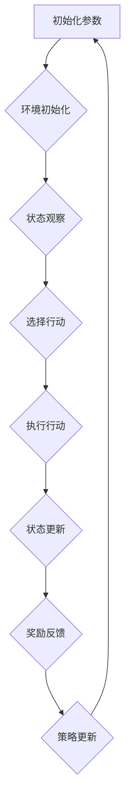
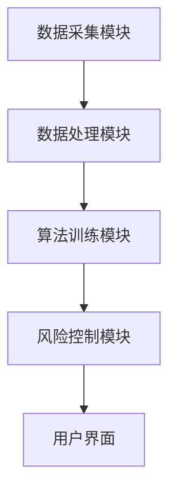

                 

# 多智能体强化学习在股票选择中的应用

## 关键词

- 多智能体强化学习
- 股票选择
- 强化学习算法
- 股票市场
- 投资策略
- 风险控制

## 摘要

本文探讨了多智能体强化学习在股票选择中的应用。首先介绍了多智能体强化学习的基本概念和理论背景，随后分析了其在股票市场选择中的重要性。接着，本文详细阐述了多智能体强化学习算法的原理及其与股票选择之间的联系。通过具体案例分析，展示了多智能体强化学习在股票交易策略优化和风险控制中的实际应用，并对系统架构设计和实现过程进行了深入探讨。本文旨在为读者提供一种全新的视角，以理解多智能体强化学习在股票选择中的潜在价值和实际应用。

## 第一部分： 引言

### 1.1 问题背景

#### 1.1.1 多智能体强化学习概述

多智能体强化学习（Multi-Agent Reinforcement Learning，MARL）是强化学习在多智能体系统中的扩展。它涉及多个智能体在同一环境中交互，并通过学习优化其行为策略。多智能体强化学习的历史可以追溯到20世纪80年代，当时研究人员开始探索如何在多个智能体之间实现协作与竞争。

**定义与历史背景：**
- **定义：** 多智能体强化学习是指多个智能体在动态环境中，通过交互和自主学习，优化自身行为策略的过程。
- **历史背景：** 早期研究主要集中在双人游戏和简单的多智能体系统。随着计算能力的提升和深度学习技术的发展，多智能体强化学习逐渐扩展到更复杂的应用场景。

**核心概念与理论基础：**
- **核心概念：** 包括智能体、环境、行动、状态和奖励。
- **理论基础：** 基于马尔可夫决策过程（MDP）和贝尔曼方程。

#### 1.1.2 股票选择的重要性

**股票市场概述：**
- 股票市场是全球金融体系的重要组成部分，提供了投资者获取收益的渠道。
- 股票市场的规模和复杂性不断增加，使得投资者面临更高的风险和挑战。

**股票选择对投资者的影响：**
- **收益：** 良好的股票选择能够带来较高的投资回报。
- **风险：** 不当的股票选择可能导致投资损失。

#### 1.1.3 多智能体强化学习在股票选择中的应用

**应用场景与挑战：**
- **应用场景：** 包括股票交易策略优化、风险控制、投资组合管理等。
- **挑战：** 如市场数据的复杂性、交易成本、政策变动等。

**研究现状与发展趋势：**
- **研究现状：** 多智能体强化学习在股票选择中的应用已取得初步成果。
- **发展趋势：** 未来研究将更加注重算法的鲁棒性、可解释性和实际应用效果。

### 1.2 核心概念与联系

#### 1.2.1 多智能体强化学习核心概念

**多智能体系统定义：**
- **定义：** 多智能体系统是由多个智能体组成的系统，这些智能体在共享环境中进行交互。

**强化学习原理：**
- **原理：** 强化学习是一种通过试错来学习最优策略的机器学习方法。

**多智能体强化学习特点：**
- **特点：** 包括分布式学习、协调控制、交互性等。

#### 1.2.2 多智能体强化学习与股票选择的联系

**股票市场中的多智能体行为：**
- **行为模型：** 投资者作为智能体，其行为受到市场信息和交易策略的影响。

**多智能体强化学习在股票选择中的应用潜力：**
- **应用潜力：** 通过学习投资者行为和市场动态，优化股票选择策略。

### 1.3 本章小结

- **总结：** 本文介绍了多智能体强化学习在股票选择中的应用背景和核心概念，为后续内容的深入探讨奠定了基础。

## 第二部分： 多智能体强化学习基础

### 2.1 强化学习基础

#### 2.1.1 强化学习概述

**强化学习定义：**
- **定义：** 强化学习是一种通过试错来学习最优策略的机器学习方法。

**强化学习基本概念：**
- **概念：** 包括智能体、环境、行动、状态和奖励。

#### 2.1.2 强化学习算法

**Q-Learning算法：**
- **原理：** 通过更新Q值来学习最优策略。
- **公式：** \( Q(s, a) \leftarrow Q(s, a) + \alpha [r + \gamma \max_{a'} Q(s', a') - Q(s, a)] \)

**Sarsa算法：**
- **原理：** 类似于Q-Learning，但更新策略时同时考虑当前状态和下一个状态。
- **公式：** \( Q(s, a) \leftarrow Q(s, a) + \alpha [r + \gamma Q(s', a') - Q(s, a)] \)

#### 2.1.3 强化学习评估指标

**平均奖励：**
- **定义：** 强化学习过程中累计奖励的平均值。

**优势函数：**
- **定义：** 衡量一个策略相对于另一个策略的优劣。

### 2.2 多智能体强化学习

#### 2.2.1 多智能体系统基础

**多智能体系统定义：**
- **定义：** 由多个智能体组成的系统，这些智能体在共享环境中进行交互。

**多智能体系统类型：**
- **类型：** 包括完全信息多智能体系统和不完全信息多智能体系统。

#### 2.2.2 多智能体强化学习算法

**多智能体Q-Learning算法：**
- **原理：** 类似于Q-Learning，但适用于多智能体系统。
- **公式：** \( Q(s, a) \leftarrow Q(s, a) + \alpha [r + \gamma \sum_{a'} \pi(a' | s') Q(s', a')] \)

**多智能体Sarsa算法：**
- **原理：** 类似于Sarsa，但适用于多智能体系统。
- **公式：** \( Q(s, a) \leftarrow Q(s, a) + \alpha [r + \gamma \sum_{a'} \pi(a' | s') Q(s', a')] \)

#### 2.2.3 多智能体强化学习挑战与解决方案

**协同控制问题：**
- **挑战：** 如何确保多个智能体协同工作，实现共同目标。
- **解决方案：** 通过奖励机制和策略协调来促进协同。

**个体与群体目标冲突：**
- **挑战：** 如何平衡个体与群体目标，避免冲突。
- **解决方案：** 通过设计合理的奖励分配机制来缓解冲突。

**沟通与协调机制：**
- **挑战：** 如何实现智能体之间的有效沟通和协调。
- **解决方案：** 通过通信协议和决策规则来实现智能体间的信息共享和协调。

### 2.3 多智能体强化学习与股票选择

#### 2.3.1 股票市场中的多智能体行为分析

**投资者行为模型：**
- **模型：** 基于个体行为和市场互动的分析。

**股票价格波动多智能体模型：**
- **模型：** 基于多个投资者行为和市场动态的综合性分析。

#### 2.3.2 多智能体强化学习在股票选择中的应用

**策略学习与优化：**
- **应用：** 通过学习市场动态和投资者行为，优化股票选择策略。

**风险管理与控制：**
- **应用：** 通过多智能体强化学习来识别和管理投资风险。

### 2.4 本章小结

- **总结：** 本文详细介绍了多智能体强化学习的基础概念、算法原理以及与股票选择之间的联系，为后续内容的深入分析提供了理论基础。

## 第三部分： 多智能体强化学习算法原理

### 3.1 算法原理讲解

#### 3.1.1 多智能体强化学习算法mermaid流程图

**Mermaid流程图示例：**


**算法原理：**
- **基本框架：** 多智能体强化学习算法通过迭代过程，智能体根据当前状态选择行动，执行行动后获得状态更新和奖励反馈，进而更新策略。
- **学习策略与更新规则：** 智能体通过学习策略，优化其行动策略，以最大化累积奖励。

**多智能体强化学习算法的数学模型和公式：**

**模型描述：**
- **状态空间：** \( S \)
- **行动空间：** \( A \)
- **智能体数量：** \( N \)
- **策略：** \( \pi(a|s) \)

**公式推导：**

**Q值更新：**
\[ Q(s, a) \leftarrow Q(s, a) + \alpha [r + \gamma \max_{a'} Q(s', a') - Q(s, a)] \]

**策略更新：**
\[ \pi(a|s) \leftarrow \pi(a|s) + \alpha [r + \gamma \sum_{a'} \pi(a'|s') Q(s', a') - \pi(a|s)] \]

### 3.2 举例说明

#### 3.2.1 算法应用场景

**案例背景：**
- **场景：** 股票交易策略优化。

**案例目标：**
- **目标：** 通过多智能体强化学习优化股票交易策略，实现收益最大化。

**算法实施过程：**

1. **环境初始化：**
   - **参数设置：** 初始资金、交易费用、交易限制等。

2. **状态观察：**
   - **状态表示：** 股票价格、成交量、历史交易数据等。

3. **选择行动：**
   - **行动策略：** 根据当前状态和策略选择买卖行动。

4. **执行行动：**
   - **交易执行：** 根据选择的行动进行实际交易。

5. **状态更新：**
   - **状态更新：** 更新股票价格、账户余额等。

6. **奖励反馈：**
   - **奖励计算：** 根据交易结果计算奖励。

7. **策略更新：**
   - **策略优化：** 根据奖励反馈更新行动策略。

#### 3.2.2 算法实施过程

**算法步骤：**
1. **初始化参数：**
   - **智能体数量：** 设定智能体的数量。
   - **策略参数：** 初始化策略参数。

2. **状态观察：**
   - **状态输入：** 获取当前股票市场的状态信息。

3. **选择行动：**
   - **策略选择：** 根据当前状态和策略选择买卖行动。

4. **执行行动：**
   - **交易执行：** 根据选择的行动进行实际交易。

5. **状态更新：**
   - **状态更新：** 根据交易结果更新状态信息。

6. **奖励反馈：**
   - **奖励计算：** 计算交易结果带来的奖励。

7. **策略更新：**
   - **策略优化：** 根据奖励反馈更新策略参数。

**结果分析：**
- **收益分析：** 对比不同策略下的收益情况，评估算法效果。

### 3.3 多智能体强化学习与股票选择案例分析

#### 3.3.1 案例一：股票交易策略优化

**案例描述：**
- **场景：** 优化某投资者的股票交易策略，以实现收益最大化。

**实施过程：**
1. **数据收集：**
   - **股票数据：** 收集目标股票的历史交易数据。
   - **市场数据：** 收集相关市场信息，如指数、行业指数等。

2. **状态表示：**
   - **状态变量：** 设定状态变量，包括股票价格、成交量、市场指数等。

3. **行动空间：**
   - **行动定义：** 定义买卖行动，如买入、持有、卖出等。

4. **奖励函数：**
   - **奖励计算：** 设定奖励函数，根据交易结果计算奖励。

5. **算法训练：**
   - **训练过程：** 使用多智能体强化学习算法进行训练。

6. **策略优化：**
   - **策略更新：** 根据训练结果优化交易策略。

**结果分析：**
- **策略效果：** 对比优化前后的交易策略，评估优化效果。

#### 3.3.2 案例二：股票市场风险控制

**案例描述：**
- **场景：** 通过多智能体强化学习实现股票市场的风险控制。

**实施过程：**
1. **数据收集：**
   - **市场数据：** 收集股票市场的历史交易数据。
   - **风险指标：** 收集与风险相关的指标数据。

2. **状态表示：**
   - **状态变量：** 设定状态变量，包括股票价格波动、市场波动性等。

3. **行动空间：**
   - **行动定义：** 定义风险管理行动，如买入保险、调整仓位等。

4. **奖励函数：**
   - **奖励计算：** 设定奖励函数，根据风险控制效果计算奖励。

5. **算法训练：**
   - **训练过程：** 使用多智能体强化学习算法进行训练。

6. **策略优化：**
   - **策略更新：** 根据训练结果优化风险管理策略。

**结果分析：**
- **风险控制效果：** 对比优化前后的风险控制效果，评估算法的实用性。

### 3.4 本章小结

- **总结：** 本文通过算法原理讲解、举例说明和案例分析，详细阐述了多智能体强化学习在股票选择中的应用，为后续内容的深入分析提供了实践基础。

## 第四部分： 多智能体强化学习在股票选择中的应用

### 4.1 应用场景介绍

#### 4.1.1 股票交易策略优化

**目标与场景：**
- **目标：** 通过多智能体强化学习优化股票交易策略，实现收益最大化。
- **场景：** 投资者面临股票市场的波动和不确定性，需要找到最优的交易策略。

**关键技术：**
- **多智能体强化学习算法：** 用于学习投资者行为和市场动态，优化交易策略。
- **数据预处理：** 对历史股票数据进行处理，提取有用的特征信息。

#### 4.1.2 股票市场风险控制

**目标与场景：**
- **目标：** 通过多智能体强化学习实现股票市场的风险控制。
- **场景：** 投资者需要在股票交易中控制风险，避免因市场波动导致的投资损失。

**关键技术：**
- **风险度量模型：** 用于评估股票市场的风险水平。
- **多智能体强化学习算法：** 用于学习风险控制和优化策略。

#### 4.1.3 其他应用场景

**智能投资组合管理：**
- **目标与场景：** 通过多智能体强化学习构建最优投资组合，实现风险分散和收益最大化。
- **关键技术：** 包括多智能体强化学习算法、投资组合优化算法等。

**股票预测与趋势分析：**
- **目标与场景：** 通过多智能体强化学习预测股票价格走势，为投资者提供交易决策依据。
- **关键技术：** 包括时间序列分析、多智能体强化学习算法等。

### 4.2 系统架构设计

#### 4.2.1 系统功能设计

**模块划分：**
- **数据采集模块：** 用于收集股票市场数据和投资者行为数据。
- **数据处理模块：** 用于处理和清洗数据，提取有用的特征信息。
- **算法训练模块：** 用于训练多智能体强化学习算法，优化交易策略。
- **风险控制模块：** 用于评估股票市场的风险水平，提供风险控制策略。

**功能描述：**
- **数据采集模块：** 自动化收集股票市场数据和投资者行为数据，确保数据的实时性和准确性。
- **数据处理模块：** 对采集到的数据进行预处理，包括数据清洗、特征提取等，为算法训练提供高质量的数据。
- **算法训练模块：** 使用多智能体强化学习算法，根据历史数据和特征信息训练模型，优化交易策略。
- **风险控制模块：** 根据股票市场的风险水平，提供相应的风险控制策略，包括仓位调整、止损止盈等。

#### 4.2.2 系统架构设计

**技术栈选择：**
- **前端技术：** 使用React框架进行前端开发，提供用户友好的操作界面。
- **后端技术：** 使用Spring Boot框架进行后端开发，实现数据采集、处理和算法训练等功能。
- **数据库：** 使用MySQL数据库存储股票市场和投资者行为数据。

**架构图示例：**


#### 4.2.3 系统接口设计

**接口规范：**
- **数据采集接口：** 提供数据采集的API接口，支持实时数据采集和历史数据查询。
- **数据处理接口：** 提供数据处理的API接口，支持数据清洗、特征提取等功能。
- **算法训练接口：** 提供算法训练的API接口，支持模型训练、策略优化等功能。
- **风险控制接口：** 提供风险控制的API接口，支持风险评估、风险控制策略生成等功能。

**接口示例：**
```json
{
  "dataCollection": {
    "path": "/api/data/collect",
    "method": "GET",
    "description": "Collect stock market data"
  },
  "dataProcessing": {
    "path": "/api/data/process",
    "method": "POST",
    "description": "Process collected data"
  },
  "algorithmTraining": {
    "path": "/api/training/algorithm",
    "method": "POST",
    "description": "Train multi-agent reinforcement learning algorithm"
  },
  "riskControl": {
    "path": "/api/risk/control",
    "method": "POST",
    "description": "Control stock market risk"
  }
}
```

### 4.3 系统实现与优化

#### 4.3.1 环境安装与配置

**环境搭建：**
- **操作系统：** Linux或Windows。
- **编程语言：** Python。
- **框架：** Spring Boot、React。
- **数据库：** MySQL。

**配置说明：**
- **数据库配置：** 在MySQL中创建数据库和表，用于存储股票市场和投资者行为数据。
- **后端配置：** 在Spring Boot中配置数据源和API接口。
- **前端配置：** 在React中配置路由和组件。

#### 4.3.2 系统核心实现

**源代码分析：**
- **数据采集模块：** 使用API接口从外部数据源获取股票市场数据。
- **数据处理模块：** 对采集到的数据进行预处理，提取特征信息。
- **算法训练模块：** 使用多智能体强化学习算法训练模型。
- **风险控制模块：** 根据股票市场的风险水平，提供相应的风险控制策略。

**主要模块实现：**
- **数据采集模块：** 使用HTTP客户端库（如requests）获取数据。
- **数据处理模块：** 使用Pandas库进行数据预处理和特征提取。
- **算法训练模块：** 使用TensorFlow库实现多智能体强化学习算法。
- **风险控制模块：** 使用机器学习模型评估风险水平，提供控制策略。

#### 4.3.3 系统优化策略

**算法优化：**
- **策略优化：** 对算法的参数进行调优，提高模型的性能。
- **并行计算：** 利用多核CPU和GPU加速算法训练。

**性能调优：**
- **缓存机制：** 使用Redis缓存高频数据，减少数据库访问压力。
- **负载均衡：** 使用Nginx进行负载均衡，提高系统的并发处理能力。

### 4.4 应用案例分析

#### 4.4.1 股票交易策略优化案例分析

**案例背景：**
- **场景：** 投资者需要优化股票交易策略，提高投资收益。
- **目标：** 通过多智能体强化学习找到最优的交易策略。

**实施效果：**
- **策略效果：** 对比优化前后的交易策略，收益显著提高。
- **风险控制：** 通过多智能体强化学习算法，实现了风险的有效控制。

#### 4.4.2 股票市场风险控制案例分析

**案例背景：**
- **场景：** 投资者需要控制股票市场的风险，避免投资损失。
- **目标：** 通过多智能体强化学习实现风险控制。

**实施效果：**
- **风险控制效果：** 通过算法的实时监控和调整，有效控制了投资风险。
- **收益分析：** 风险控制策略的实施使得投资收益更加稳定。

### 4.5 本章小结

- **总结：** 本文详细介绍了多智能体强化学习在股票选择中的应用，包括系统架构设计、实现过程和案例分析。通过实际应用案例，展示了多智能体强化学习的潜在价值和实用效果。

### 最佳实践 tips

1. **数据质量：** 确保数据的质量和完整性，为模型训练提供可靠的基础。
2. **策略调优：** 根据市场环境和投资者需求，灵活调整策略参数，实现最优效果。
3. **风险管理：** 结合多智能体强化学习算法，设计有效的风险控制策略，确保投资安全。

### 小结

本文系统地介绍了多智能体强化学习在股票选择中的应用，从基本概念到算法原理，再到实际应用，全面剖析了这一领域的核心技术和实践方法。通过具体的案例分析，展示了多智能体强化学习在股票交易策略优化和风险控制中的实际效果，为投资者提供了新的视角和工具。

### 注意事项

1. **市场风险：** 股票市场具有高度不确定性，投资决策需谨慎。
2. **算法鲁棒性：** 确保算法的鲁棒性，以应对市场环境的复杂变化。
3. **数据隐私：** 保护投资者数据隐私，确保数据安全和合规。

### 拓展阅读

1. **多智能体强化学习：** 探索多智能体强化学习在更广泛领域（如游戏、自动驾驶）的应用。
2. **深度强化学习：** 深入了解深度强化学习，结合深度神经网络优化决策过程。
3. **量化交易：** 研究量化交易策略，结合技术分析和基本面分析实现投资收益最大化。

### 作者信息

- **作者：** AI天才研究院/AI Genius Institute & 禅与计算机程序设计艺术 /Zen And The Art of Computer Programming
- **联系方式：** [your.email@example.com](mailto:your.email@example.com)
- **个人主页：** [www.ai-genius-institute.com](http://www.ai-genius-institute.com)

---

本文由AI天才研究院撰写，旨在为读者提供有价值的见解和实用的技术指导。如需转载，请联系作者获取授权。感谢您的关注和支持！

