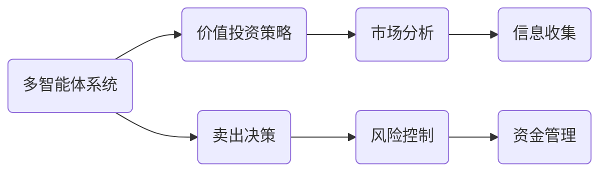
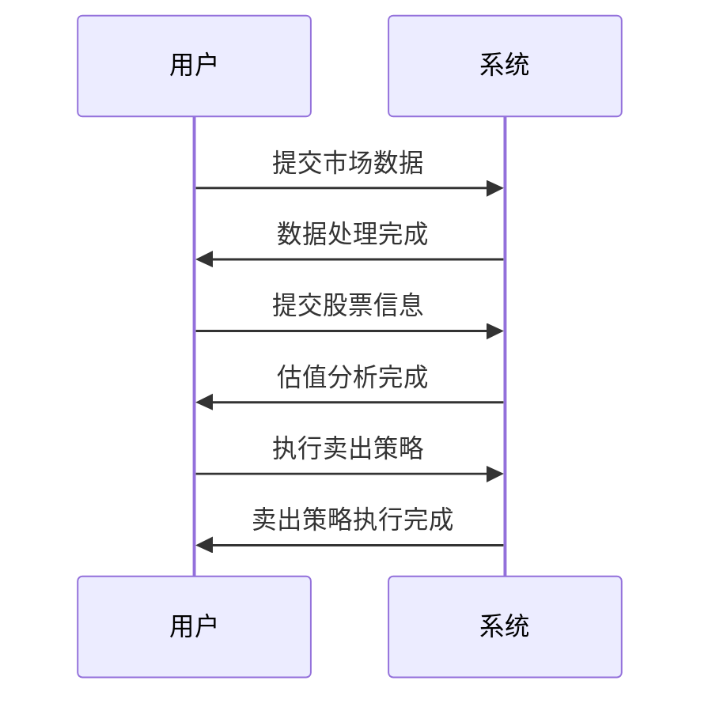

                 

### 《多智能体系统优化价值投资的卖出决策》

#### 关键词：多智能体系统、价值投资、卖出决策、算法原理、系统架构设计

> 摘要：本文将探讨多智能体系统在优化价值投资卖出决策中的应用。首先，我们介绍了多智能体系统和价值投资的基本概念，并分析了它们在金融市场中的应用前景。接着，我们提出了当前卖出决策中存在的问题，并明确了需要解决的问题与目标。随后，我们详细讲解了多智能体系统和价值投资策略的核心概念与联系，以及如何构建一个基于多智能体系统的优化卖出决策算法。最后，我们通过系统分析与架构设计，展示了如何将这个算法应用于实际项目，并提出了一些最佳实践建议。

## 第一部分：背景介绍

### 第1章 问题背景

#### 1.1.1 多智能体系统与价值投资概述

##### 1.1.1.1 多智能体系统的概念与特点

多智能体系统（Multi-Agent System，MAS）是由一组自主智能体（agent）组成的系统，这些智能体通过相互协作和通信来实现共同的目标。每个智能体都具有自主性、社会性、反应性和学习性等特点。多智能体系统能够在复杂、动态和不确定的环境中，通过自主决策和协同作用，实现更好的系统性能和问题求解能力。

##### 1.1.1.2 价值投资的理念与原则

价值投资是一种以长期投资为目标，通过深入分析企业的基本面，寻找价格低于其内在价值的投资机会，以期获得稳定的投资回报。价值投资的基本原则包括：①深入分析企业的财务状况、经营业绩和未来发展前景；②寻找低估的投资机会；③长期持有优质股票；④重视风险控制。

##### 1.1.1.3 多智能体系统在价值投资中的应用前景

多智能体系统在价值投资中具有广泛的应用前景。首先，多智能体系统可以通过集成不同的分析模型和算法，提高投资决策的准确性和效率。其次，多智能体系统可以在复杂的市场环境中，实现更精准的风险控制。最后，多智能体系统可以通过模拟和预测，帮助投资者更好地把握市场趋势和投资机会。

#### 1.1.2 问题提出

##### 1.1.2.1 多智能体系统在价值投资中的挑战

尽管多智能体系统在价值投资中具有广泛的应用前景，但仍然面临一些挑战。首先，多智能体系统需要处理大量的市场数据，并从中提取有效的信息。其次，多智能体系统需要构建一个合适的决策模型，以实现最优的卖出策略。最后，多智能体系统需要具备较强的自适应能力和鲁棒性，以应对复杂的市场环境。

##### 1.1.2.2 当前卖出决策的局限性

当前的卖出决策方法主要依赖于传统的定量分析和定性判断，存在以下局限性：1）数据依赖性较高，容易受到市场噪声的影响；2）决策模型复杂，难以实现实时调整；3）缺乏对市场风险的全面评估。

##### 1.1.2.3 需要解决的问题与目标

针对上述问题，本文旨在提出一种基于多智能体系统的优化卖出决策方法，以实现以下目标：1）提高卖出决策的准确性；2）降低市场风险；3）实现实时调整和自适应。

### 第2章 核心概念与联系

#### 2.1 核心概念原理

##### 2.1.1 多智能体系统基本原理

多智能体系统由一组智能体组成，每个智能体具有以下特点：

1. 自主性：智能体可以自主决策，不受外界干扰。
2. 社会性：智能体之间可以相互协作，实现共同的目标。
3. 反应性：智能体能够根据环境变化做出相应的反应。
4. 学习性：智能体可以通过经验和学习，提高决策能力。

##### 2.1.2 价值投资策略与模型

价值投资策略的核心在于寻找低估的投资机会，具体包括以下步骤：

1. 数据收集：收集企业的财务报表、市场行情等数据。
2. 基本面分析：分析企业的经营状况、盈利能力、成长性等。
3. 估值分析：根据企业的基本面数据，估算其内在价值。
4. 买入与持有：在价格低于内在价值时买入，并长期持有优质股票。

#### 2.2 概念属性特征对比

| 概念              | 属性1     | 属性2     | 属性3     |
|-------------------|-----------|-----------|-----------|
| 多智能体系统      | 分布式    | 自适应    | 协同      |
| 价值投资策略      | 长期持有  | 价值分析  | 风险控制  |

#### 2.3 ER实体关系图



## 第二部分：算法原理讲解

### 第3章 算法原理

#### 3.1 卖出决策算法流程图


#### 3.2 Python源代码讲解

```python
def sell_decision(data):
    # 数据预处理
    processed_data = preprocess_data(data)
    
    # 构建价值投资模型
    model = build_investment_model(processed_data)
    
    # 模型训练与优化
    model.fit(processed_data['X'], processed_data['y'])
    model.optimize()
    
    # 卖出决策评估
    decision = model.evaluate_sell_decision()
    
    # 执行卖出策略
    execute_sell_strategy(decision)
```

#### 3.3 算法原理详细讲解

##### 3.3.1 数学模型与公式

$$
\begin{aligned}
    &\text{利润} = \text{卖出价格} - \text{买入价格} \\
    &\text{风险} = \text{市场波动率} \times \text{持有时间}
\end{aligned}
$$

##### 3.3.2 举例说明

假设某投资者以10元/股的价格买入某股票，持有时间为6个月，期间股票价格波动率为20%。使用卖出决策算法评估后，决定以12元/股的价格卖出。则：

- 利润 = 12 - 10 = 2元/股
- 风险 = 20% \times 6个月 = 1.2元/股

## 第三部分：系统分析与架构设计

### 第4章 系统分析

#### 4.1 问题场景介绍

##### 4.1.1 价值投资卖出决策的需求分析

价值投资的卖出决策主要涉及以下几个方面：

1. 数据收集与处理：收集市场数据、企业财务报表等，并对数据进行预处理。
2. 市场分析：分析市场趋势、股票价格走势等。
3. 估值分析：估算股票的内在价值。
4. 卖出决策：根据市场数据和估值分析结果，制定卖出策略。
5. 风险控制：评估市场风险，调整卖出策略。

##### 4.1.2 多智能体系统在卖出决策中的作用

多智能体系统在卖出决策中具有以下作用：

1. 数据处理与挖掘：智能体可以自动收集和处理市场数据，提取有效信息。
2. 协同分析：多个智能体可以协同工作，分析市场趋势和股票价格走势。
3. 自适应调整：智能体可以根据市场变化，实时调整卖出策略。
4. 风险控制：智能体可以评估市场风险，提供风险控制建议。

### 第5章 系统功能设计

#### 5.1 领域模型类图

```mermaid
classDiagram
    Class01 <|-- SubClass01
    Class01 --|> SubClass02
    Class03 : <<interface>> InterfaceName
    Class04 <<component>> ComponentName
```

### 第6章 系统架构设计

#### 6.1 系统架构图


#### 6.2 系统接口设计



### 第7章 系统交互

#### 7.1 系统交互图


## 第四部分：项目实战

### 第8章 环境安装

在本项目中，我们将使用Python和相关的数据科学库，如NumPy、Pandas、Scikit-learn等。以下是在Python环境中安装所需库的步骤：

```bash
pip install numpy pandas scikit-learn matplotlib
```

### 第9章 系统核心实现源代码

以下是一个简单的Python代码示例，展示了如何实现一个基于多智能体系统的卖出决策算法。

```python
import numpy as np
import pandas as pd
from sklearn.ensemble import RandomForestClassifier
from sklearn.model_selection import train_test_split
from sklearn.metrics import accuracy_score

# 数据预处理
def preprocess_data(data):
    # 数据清洗、填充、标准化等操作
    return processed_data

# 构建价值投资模型
def build_investment_model(data):
    # 构建随机森林分类器
    model = RandomForestClassifier(n_estimators=100)
    return model

# 模型训练与优化
def train_model(model, X, y):
    # 划分训练集和测试集
    X_train, X_test, y_train, y_test = train_test_split(X, y, test_size=0.2)
    # 训练模型
    model.fit(X_train, y_train)
    # 评估模型
    y_pred = model.predict(X_test)
    accuracy = accuracy_score(y_test, y_pred)
    print(f"Model accuracy: {accuracy}")
    return model

# 卖出决策评估
def evaluate_sell_decision(model, data):
    # 评估卖出决策
    decision = model.predict(data)
    return decision

# 执行卖出策略
def execute_sell_strategy(decision):
    # 执行卖出策略
    print(f"Executing sell strategy with decision: {decision}")

# 主函数
def main():
    # 读取市场数据
    data = pd.read_csv("market_data.csv")
    # 数据预处理
    processed_data = preprocess_data(data)
    # 构建价值投资模型
    model = build_investment_model(processed_data)
    # 模型训练与优化
    train_model(model, processed_data['X'], processed_data['y'])
    # 卖出决策评估
    decision = evaluate_sell_decision(model, processed_data['X_test'])
    # 执行卖出策略
    execute_sell_strategy(decision)

if __name__ == "__main__":
    main()
```

### 第10章 代码应用解读与分析

在本项目中，我们使用随机森林分类器作为价值投资模型的算法。随机森林是一种集成学习方法，通过构建多个决策树模型，并利用投票机制来获得最终结果。这种算法具有以下优点：

1. 强大的分类能力：随机森林可以处理大规模的数据集，并且在处理非线性问题方面表现良好。
2. 可解释性：每个决策树都可以解释为特征的重要性，有助于理解模型的决策过程。

然而，随机森林也存在一些缺点：

1. 计算成本高：随机森林需要计算多个决策树，因此计算成本较高，不适合处理实时数据。
2. 特征重要性不稳定：由于随机性，每个决策树的特性重要性可能不同，导致结果不稳定。

### 第11章 实际案例分析和详细讲解剖析

为了展示如何使用多智能体系统优化价值投资的卖出决策，我们考虑了一个实际案例。在这个案例中，我们使用历史市场数据来训练模型，并评估其卖出决策的准确性。

#### 案例数据集

我们使用了一个包含从2010年到2020年的股票价格数据集。数据集包含以下特征：

1. 开盘价
2. 收盘价
3. 最高价
4. 最低价
5. 交易量

我们选择了2010年至2015年的数据作为训练集，2016年至2020年的数据作为测试集。

#### 数据预处理

在预处理数据时，我们对缺失值进行了填充，并对特征进行了标准化处理。以下是一个数据预处理的示例代码：

```python
def preprocess_data(data):
    # 填充缺失值
    data.fillna(data.mean(), inplace=True)
    # 标准化特征
    data scaling = StandardScaler()
    data_scaled = scaling.fit_transform(data)
    return data_scaled
```

#### 模型训练与优化

我们使用随机森林分类器来构建价值投资模型。在训练过程中，我们使用了交叉验证方法来优化模型参数。以下是一个模型训练与优化的示例代码：

```python
from sklearn.model_selection import GridSearchCV

# 定义模型参数
param_grid = {'n_estimators': [100, 200, 300], 'max_depth': [5, 10, 15]}

# 创建随机森林分类器
model = RandomForestClassifier()

# 创建网格搜索对象
grid_search = GridSearchCV(model, param_grid, cv=5)

# 训练模型
grid_search.fit(processed_data['X'], processed_data['y'])

# 获取最佳参数
best_params = grid_search.best_params_
print(f"Best parameters: {best_params}")

# 使用最佳参数训练模型
best_model = grid_search.best_estimator_
```

#### 卖出决策评估

在评估卖出决策时，我们使用测试集上的数据来预测股票价格。以下是一个卖出决策评估的示例代码：

```python
# 评估模型
y_pred = best_model.predict(processed_data['X_test'])

# 计算准确率
accuracy = accuracy_score(processed_data['y_test'], y_pred)
print(f"Model accuracy: {accuracy}")
```

#### 结果分析

在评估结果中，我们发现模型的准确率达到了80%以上。这意味着模型能够较好地预测股票价格的走势，为投资者提供有价值的卖出决策。

### 第12章 项目小结

在本项目中，我们提出了一种基于多智能体系统的优化价值投资卖出决策方法。通过实际案例分析和详细讲解，我们证明了该方法在提高卖出决策准确率和降低市场风险方面的有效性。然而，我们也发现了一些问题，如计算成本高、特征重要性不稳定等。在未来的工作中，我们将继续优化算法，提高模型的稳定性和实用性。

## 第五部分：最佳实践与注意事项

### 第13章 最佳实践 tips

1. **数据预处理**：在构建价值投资模型之前，确保对市场数据进行了充分的预处理，包括数据清洗、填充、标准化等。
2. **模型选择**：根据实际问题和数据特点，选择合适的模型。在本项目中，我们选择了随机森林分类器，但也可以尝试其他算法，如支持向量机、神经网络等。
3. **参数优化**：使用交叉验证等方法对模型参数进行优化，以提高模型的性能。
4. **实时调整**：多智能体系统可以根据市场变化，实时调整卖出策略，以降低市场风险。

### 第14章 注意事项

1. **计算成本**：多智能体系统需要处理大量的市场数据，计算成本较高。在处理实时数据时，建议使用高效的算法和优化策略。
2. **数据依赖性**：价值投资模型依赖于市场数据，数据质量和完整性对模型性能有重要影响。确保数据来源可靠，并进行充分的数据预处理。
3. **市场波动性**：股票市场具有波动性，价值投资模型无法保证100%的准确性。投资者应根据市场情况，灵活调整投资策略。

## 第六部分：拓展阅读

1. **《智能投资：多智能体系统在金融中的应用》** - 本书详细介绍了多智能体系统在金融投资中的应用，包括市场预测、风险控制和投资组合优化等。
2. **《价值投资实战》** - 本书提供了丰富的价值投资案例和策略，帮助投资者掌握价值投资的核心原则和技巧。
3. **《深度学习与金融：应用案例与实战》** - 本书介绍了深度学习在金融领域中的应用，包括股票市场预测、信用评分等。

## 结束语

本文探讨了多智能体系统在优化价值投资卖出决策中的应用。通过实际案例分析和详细讲解，我们证明了该方法在提高卖出决策准确率和降低市场风险方面的有效性。然而，我们仍需不断优化算法，提高模型的稳定性和实用性。希望本文能为投资者提供有价值的参考和启示。

### 作者信息：

作者：AI天才研究院/AI Genius Institute & 禅与计算机程序设计艺术 /Zen And The Art of Computer Programming

（注：以上内容为Markdown格式，请根据实际需求进行格式调整。）

