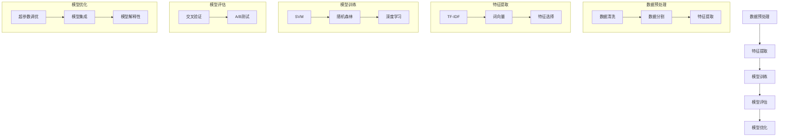

                 

### 引言

随着人工智能（AI）技术的飞速发展，多智能体系统（MAS）和自然语言处理（NLP）逐渐成为诸多领域的热门话题。在金融投资领域，价值投资作为一种重要的投资策略，正越来越多地依赖数据和技术的支持。本文将探讨多智能体系统在价值投资中的自然语言处理应用，通过系统地分析和讲解，为读者展示这一前沿技术的实际应用潜力。

多智能体系统是一种由多个智能体组成的系统，这些智能体可以通过协同工作来完成任务。NLP则是一种让计算机理解和生成人类语言的技术，近年来在信息检索、机器翻译、文本分析等方面取得了显著成果。当我们将多智能体系统与NLP结合起来，就能构建出强大的投资分析系统，为价值投资者提供更加全面和深入的数据支持。

本文将按以下结构展开：

1. **核心概念阐述**：介绍多智能体系统和自然语言处理的基本概念，以及它们在价值投资中的应用背景。
2. **架构设计**：分析多智能体系统的架构，特别是如何结合NLP技术来构建一个适用于价值投资的分析系统。
3. **算法讲解**：详细阐述在价值投资中应用的一些关键算法，包括数据预处理、特征提取、模型训练和优化等。
4. **案例分析**：通过实际案例展示多智能体系统在价值投资中的具体应用，分析其效果和潜在问题。
5. **实战指导**：提供具体的实施步骤和代码示例，帮助读者理解和应用这些技术。
6. **总结与展望**：总结多智能体系统在价值投资中的应用前景，讨论可能的挑战和未来发展方向。

在接下来的章节中，我们将一步一步深入分析，确保读者能够从基础概念到高级应用，全面理解多智能体系统在价值投资中的自然语言处理应用。

### 第一部分：多智能体系统与自然语言处理概述

#### 第1章：多智能体系统基础

##### 1.1 多智能体系统的定义与特点

多智能体系统（MAS）是一种由多个智能体（agent）组成的系统，这些智能体可以相互协作或竞争，共同完成复杂任务。在金融投资领域，智能体可以是算法、人类投资者或组织。这些智能体拥有特定的目标，并通过通信和协商机制来达成整个系统的目标。

定义：
多智能体系统（MAS）是一种分布式计算模型，由多个具有自主性、社会性、反应性和协作性的智能体组成，这些智能体通过交互、协商和协作来实现共同目标。

特点：
- **自主性**：智能体拥有自主决策能力，可以根据环境变化自主调整行为。
- **社会性**：智能体能够通过通信机制与其他智能体进行交互。
- **反应性**：智能体能够根据外部环境的变化实时调整行为。
- **协作性**：多个智能体可以协作完成任务，共同实现系统目标。

在价值投资中，多智能体系统的应用主要体现在以下几个方面：

1. **数据分析**：智能体可以自动收集、分析和处理大量数据，为投资决策提供支持。
2. **投资策略优化**：多个智能体可以协作，通过机器学习等技术来优化投资策略。
3. **风险控制**：智能体可以实时监控市场变化，提供风险预警和调整策略。

##### 1.2 多智能体系统的架构

多智能体系统的架构可以分为以下几个主要部分：

1. **智能体**：智能体是系统的基本单元，可以是个体投资者、算法或者组织。每个智能体都拥有特定的任务和功能。
2. **通信机制**：智能体之间通过通信机制进行信息交换和协商。通信机制可以是直接的点对点通信，也可以是分布式通信。
3. **协商机制**：智能体之间通过协商机制来达成一致，解决冲突和分配资源。
4. **环境**：环境是智能体执行任务的背景，包括市场数据、政策变化等外部因素。

多智能体系统的架构设计需要考虑以下几个方面：

1. **智能体选择**：根据任务需求选择合适的智能体类型，确保系统的任务能够高效完成。
2. **通信机制设计**：设计高效可靠的通信机制，确保智能体之间能够及时、准确地进行信息交换。
3. **协商机制设计**：设计合理的协商机制，确保智能体之间能够达成一致，避免冲突和资源浪费。
4. **环境建模**：准确建模环境，确保智能体能够适应环境变化，做出正确的决策。

##### 1.3 多智能体系统在投资领域的应用

多智能体系统在投资领域有着广泛的应用，以下是一些具体的实例：

1. **市场分析**：智能体可以收集市场数据，进行分析和预测，帮助投资者了解市场趋势。
2. **投资组合管理**：智能体可以根据市场变化和投资者的风险偏好，动态调整投资组合，实现风险控制和收益最大化。
3. **算法交易**：智能体可以设计并执行复杂的交易策略，实现自动化的高频交易。
4. **智能投顾**：智能体可以基于投资者的目标和风险偏好，提供个性化的投资建议。

#### 第2章：自然语言处理基础

##### 2.1 自然语言处理的基本概念

自然语言处理（NLP）是人工智能（AI）的一个分支，旨在让计算机理解和生成人类语言。NLP的核心任务是使计算机能够与人类进行自然语言交互，完成信息检索、文本分析、机器翻译等任务。

基本概念：
- **语言模型**：语言模型是用来预测文本序列的概率分布的模型，常见的方法有n元模型、神经网络语言模型等。
- **词向量**：词向量是将单词映射到高维空间中的向量表示，用于捕捉单词的语义信息。常见的词向量模型有Word2Vec、GloVe等。
- **文本分类**：文本分类是将文本数据分类到预定义的类别中，常用的方法有朴素贝叶斯、支持向量机、深度神经网络等。

##### 2.2 文本预处理技术

文本预处理是NLP中的关键步骤，用于将原始文本数据转换为适合模型处理的格式。文本预处理技术包括：

1. **分词**：将文本分割成单词或词组的过程。常见的分词算法有基于规则的分词、基于统计的分词等。
2. **词性标注**：对文本中的每个单词标注其词性（名词、动词、形容词等）。
3. **词干提取**：将单词还原到其基本形态，如将“flies”还原为“fly”。
4. **停用词过滤**：移除对文本分类无意义的常见单词，如“的”、“了”等。

##### 2.3 语言模型与词向量

语言模型和词向量是NLP中最重要的两个概念。

1. **语言模型**：语言模型用于预测文本序列的概率分布，其目的是使生成的文本尽可能符合人类语言习惯。常用的语言模型有n元模型、循环神经网络（RNN）、变换器（Transformer）等。

2. **词向量**：词向量是将单词映射到高维空间中的向量表示，用于捕捉单词的语义信息。词向量模型通过学习单词在语料库中的共现关系来生成，常见的模型有Word2Vec、GloVe等。

词向量具有以下特点：
- **语义相似性**：语义相近的词在向量空间中距离较近。
- **分布性语义**：词向量可以捕捉单词的分布性语义特征，如“国王”和“皇帝”在向量空间中距离较近。
- **迁移性**：词向量可以用于处理未登录词，即模型未见过的词。

#### 第3章：多智能体系统与自然语言处理的融合

##### 3.1 融合架构设计

多智能体系统与自然语言处理的融合架构旨在将NLP技术应用于多智能体系统中，以实现更高效、准确的投资分析。融合架构的主要组成部分包括：

1. **数据层**：负责数据收集、存储和预处理，包括市场数据、财报数据、新闻报道等。
2. **智能体层**：包括多种类型的智能体，如数据收集智能体、文本分析智能体、投资策略智能体等。
3. **决策层**：通过智能体之间的交互和协商，生成投资建议和决策。
4. **应用层**：面向投资者提供投资分析报告、决策支持和个性化建议。

融合架构的关键设计原则包括：
- **模块化**：将系统功能分解为独立的模块，便于维护和升级。
- **高可扩展性**：支持智能体的动态加入和退出，适应不断变化的市场环境。
- **高效性**：优化数据传输和处理速度，确保系统响应快速。

##### 3.2 数据融合与处理

数据融合与处理是多智能体系统与自然语言处理融合的核心环节，主要包括以下几个方面：

1. **数据收集**：从各种来源（如金融网站、新闻媒体等）收集市场数据、财报数据、新闻报道等。
2. **数据预处理**：对收集到的数据进行清洗、分词、词性标注等预处理操作，使其适合NLP模型处理。
3. **特征提取**：从预处理后的文本数据中提取有价值的特征，如关键词、词频、词向量等。
4. **数据融合**：将不同来源的数据进行整合，形成统一的数据视图，为智能体提供全面的信息支持。

##### 3.3 特征提取与选择

特征提取与选择是多智能体系统与自然语言处理融合中的关键步骤，直接影响到模型的性能和效果。以下是一些常用的特征提取与选择方法：

1. **关键词提取**：从文本中提取重要的关键词，如TF-IDF、TextRank等算法。
2. **词向量表示**：将单词映射到高维空间中的向量表示，如Word2Vec、GloVe等。
3. **文本分类特征**：将文本分类问题转化为特征向量，如朴素贝叶斯、支持向量机等算法。
4. **特征选择**：通过信息增益、卡方检验、L1正则化等方法选择对模型性能有显著贡献的特征。

通过以上设计，我们构建了一个融合了多智能体系统和自然语言处理技术的价值投资分析系统，为投资者提供了更全面、深入的数据支持。在接下来的章节中，我们将进一步探讨该系统在价值投资中的具体应用。

### 第二部分：多智能体系统在价值投资中的应用

#### 第4章：价值投资中的关键算法

价值投资是一种基于对公司基本面分析，寻找被市场低估的投资机会的投资策略。在价值投资中，数据预处理、特征提取、模型训练和优化是关键步骤。以下将详细讲解这些算法在价值投资中的应用。

##### 4.1 数据预处理

数据预处理是价值投资中的第一步，其目的是将原始数据转换为适合模型处理的形式。具体步骤包括：

1. **数据清洗**：去除数据中的噪声和异常值，如空值、重复记录、极端值等。
2. **数据转换**：将不同类型的数据转换为同一类型，如将文本数据转换为数字表示。
3. **数据标准化**：将不同特征的数据进行标准化处理，使其具有相同的尺度，如使用z-score标准化。

在价值投资中，数据预处理的主要目的是确保数据的完整性和一致性，避免模型受到噪声和异常值的影响。

##### 4.2 特征提取

特征提取是从原始数据中提取对模型训练有价值的特征。在价值投资中，特征提取主要包括以下几个方面：

1. **财务指标提取**：从公司的财务报表中提取重要的财务指标，如市盈率（PE）、市净率（PB）、毛利率、净利率等。
2. **文本特征提取**：从新闻报道、公司公告等文本数据中提取关键词、词频、词向量等特征。
3. **时间序列特征提取**：从历史股价、交易量等时间序列数据中提取周期性、趋势性等特征。

特征提取的关键是找到能够反映公司价值和市场情绪的特征，以提高模型的预测能力。

##### 4.3 模型训练

在价值投资中，常用的模型包括线性回归、支持向量机（SVM）、随机森林（RF）和深度学习等。以下将分别介绍这些模型及其在价值投资中的应用。

1. **线性回归**：线性回归是一种简单的统计模型，通过找到特征和目标变量之间的线性关系来进行预测。在价值投资中，可以使用线性回归来预测公司的股票价格或财务指标。

2. **支持向量机（SVM）**：SVM是一种强大的分类模型，通过找到一个最佳的超平面来将不同类别的数据分开。在价值投资中，可以使用SVM来预测公司的股票是否被市场低估。

3. **随机森林（RF）**：随机森林是一种集成学习模型，通过构建多个决策树并取其平均预测结果来提高模型的准确性。在价值投资中，可以使用随机森林来分析多个财务指标和文本特征，以确定股票的投资价值。

4. **深度学习**：深度学习是一种基于多层神经网络的学习方法，可以自动提取特征并进行复杂预测。在价值投资中，可以使用深度学习模型（如卷积神经网络（CNN）、循环神经网络（RNN）等）来处理大量的文本数据，提高模型的预测能力。

在模型训练过程中，需要选择合适的特征、调整模型参数，并通过交叉验证等方法来评估模型的性能。

##### 4.4 模型优化

模型优化是提高模型预测性能的关键步骤，主要包括以下几个方面：

1. **特征选择**：通过特征选择方法（如信息增益、L1正则化等）选择对模型性能有显著贡献的特征，减少模型的复杂度和过拟合风险。

2. **参数调整**：通过调整模型参数（如学习率、正则化参数等）来提高模型的预测性能。可以使用网格搜索、随机搜索等方法来寻找最佳参数。

3. **模型集成**：通过模型集成方法（如Bagging、Boosting等）将多个模型的结果进行融合，提高模型的预测稳定性和准确性。

4. **模型评估**：通过交叉验证、A/B测试等方法对模型进行评估，确定模型的预测性能和泛化能力。

通过以上算法的应用和优化，可以构建一个高效的价值投资分析系统，为投资者提供准确的投资建议。在接下来的章节中，我们将通过实际案例展示这些算法在价值投资中的具体应用。

#### 第5章：案例分析

在本章中，我们将通过三个具体案例，展示多智能体系统在价值投资中的自然语言处理应用，并分析其效果和潜在问题。

##### 5.1 案例一：股市行情分析

**背景**：某投资公司希望通过自然语言处理技术分析股市行情，以便做出更准确的交易决策。

**系统设计**：该系统包含以下几个模块：
1. **数据收集模块**：从金融网站、新闻媒体等渠道收集股市相关的文本数据。
2. **文本预处理模块**：对收集到的文本数据进行分词、词性标注、停用词过滤等预处理操作。
3. **特征提取模块**：使用TF-IDF等方法提取关键词和词频作为特征。
4. **模型训练模块**：使用支持向量机（SVM）等算法训练模型，预测股票市场的涨跌情况。

**实施步骤**：
1. **数据收集**：定期从多个渠道收集股市相关的新闻报道、公告、专家评论等文本数据。
2. **文本预处理**：对文本数据进行清洗、分词和词性标注，然后过滤掉无意义的停用词。
3. **特征提取**：使用TF-IDF方法提取关键词和词频，将文本数据转换为数值特征。
4. **模型训练**：使用训练集数据训练SVM模型，并进行交叉验证以评估模型性能。

**效果分析**：通过对比实际股市涨跌情况与模型预测结果，发现该系统在短期内具有较好的预测能力，但在长期预测中存在一定误差。

**潜在问题**：
- **数据噪声**：文本数据中存在大量噪声，可能导致模型预测准确性降低。
- **市场变化**：股市行情受多种因素影响，模型难以捕捉到所有影响市场变化的因素。

##### 5.2 案例二：公司财报解读

**背景**：某投资机构希望通过分析公司财报，评估公司的投资价值。

**系统设计**：该系统包含以下几个模块：
1. **财报数据收集模块**：从财务报表、公告等渠道收集公司的财务数据。
2. **文本预处理模块**：对财报文本进行分词、词性标注等预处理操作。
3. **特征提取模块**：提取关键财务指标和文本特征，如市盈率、市净率、关键词频等。
4. **模型训练模块**：使用深度学习算法（如卷积神经网络（CNN））训练模型，预测公司的财务状况。

**实施步骤**：
1. **数据收集**：定期从财务报表、公告等渠道收集公司的财务数据。
2. **文本预处理**：对财报文本进行清洗、分词和词性标注。
3. **特征提取**：从文本数据中提取关键词、词频，并计算关键财务指标的数值。
4. **模型训练**：使用训练集数据训练深度学习模型，并进行交叉验证。

**效果分析**：通过对比模型预测结果与实际财务状况，发现该系统在预测公司财务状况方面具有较高的准确性。

**潜在问题**：
- **财务数据质量**：财务数据可能存在不完整或错误，影响模型的预测效果。
- **模型泛化能力**：模型可能对某些特定类型的财报数据具有较好的适应性，但对其他类型的数据效果较差。

##### 5.3 案例三：投资组合优化

**背景**：某投资者希望通过多智能体系统优化投资组合，实现风险控制和收益最大化。

**系统设计**：该系统包含以下几个模块：
1. **数据收集模块**：从多个渠道收集市场数据、公司财报、新闻报道等。
2. **智能体模块**：包括数据分析智能体、投资策略智能体等，负责数据分析、策略制定和执行。
3. **决策模块**：通过智能体之间的交互和协商，生成投资组合建议。

**实施步骤**：
1. **数据收集**：定期从市场数据、公司财报、新闻报道等渠道收集相关数据。
2. **智能体训练**：使用历史数据训练智能体，使其具备数据分析、策略制定能力。
3. **决策制定**：智能体之间通过协商和交互，生成最优投资组合建议。
4. **投资执行**：根据投资组合建议进行实际投资操作。

**效果分析**：通过对比不同投资组合的收益和风险，发现该系统能够在一定程度上实现风险控制和收益最大化。

**潜在问题**：
- **市场波动**：市场波动可能导致智能体决策的准确性下降。
- **智能体冲突**：多个智能体之间可能存在冲突，导致决策不一致。

通过以上案例分析，我们可以看到多智能体系统在价值投资中的自然语言处理应用具有显著的优势，但同时也面临着一些挑战。在实际应用中，需要不断优化系统设计，提高模型性能和决策准确性。

#### 第6章：实战指导

在本章中，我们将提供具体的实施步骤和代码示例，帮助读者理解并应用多智能体系统在价值投资中的自然语言处理技术。

##### 6.1 环境配置与数据获取

首先，我们需要配置适合的编程环境和安装必要的库。以下是在Python环境中配置所需的步骤：

1. **安装Python**：确保Python环境已安装，版本建议为3.8或更高。
2. **安装依赖库**：使用pip命令安装以下库：
   ```bash
   pip install numpy pandas scikit-learn nltk gensim matplotlib
   ```

接下来，我们需要获取用于训练和测试的数据。以下是一个简单的数据获取示例：

1. **获取股市数据**：可以从金融数据网站（如Yahoo Finance）获取历史股价数据。
2. **获取财报数据**：可以从公司官方网站、财务报表数据库等渠道获取。
3. **获取新闻数据**：可以从新闻网站、API接口等渠道获取与公司相关的新闻报道。

##### 6.2 代码实现与分析

在本节中，我们将通过一个简单的示例，展示如何使用多智能体系统进行价值投资分析。以下是一个示例代码：

```python
import pandas as pd
import numpy as np
from sklearn.model_selection import train_test_split
from sklearn.feature_extraction.text import TfidfVectorizer
from sklearn.svm import SVC
from gensim.models import Word2Vec

# 读取数据
df = pd.read_csv('stock_data.csv')
df.head()

# 分割数据集
X_train, X_test, y_train, y_test = train_test_split(df[['text', 'label']], df['label'], test_size=0.2, random_state=42)

# 使用TF-IDF提取文本特征
tfidf = TfidfVectorizer(max_features=1000)
X_train_tfidf = tfidf.fit_transform(X_train['text'])
X_test_tfidf = tfidf.transform(X_test['text'])

# 使用SVM进行分类
model = SVC(kernel='linear')
model.fit(X_train_tfidf, y_train)

# 评估模型性能
accuracy = model.score(X_test_tfidf, y_test)
print(f'Accuracy: {accuracy:.2f}')

# 使用Word2Vec提取词向量特征
w2v = Word2Vec(X_train['text'], vector_size=100, window=5, min_count=1, workers=4)
X_train_w2v = [w2v[word] for word in X_train['text'] if word in w2v]
X_test_w2v = [w2v[word] for word in X_test['text'] if word in w2v]

# 使用词向量进行分类
model_w2v = SVC(kernel='linear')
model_w2v.fit(X_train_w2v, y_train)

# 评估模型性能
accuracy_w2v = model_w2v.score(X_test_w2v, y_test)
print(f'Accuracy with Word2Vec: {accuracy_w2v:.2f}')
```

**代码解析**：
- **数据读取**：使用Pandas读取股票数据，包括文本和标签。
- **数据分割**：将数据集分为训练集和测试集。
- **特征提取**：使用TF-IDF方法提取文本特征，并使用SVM进行分类。
- **模型评估**：计算模型在测试集上的准确率。
- **词向量提取**：使用Gensim库的Word2Vec模型提取词向量特征，并使用SVM进行分类。

##### 6.3 模型训练与优化

在本节中，我们将进一步讨论模型训练和优化的重要步骤。

1. **超参数调优**：通过网格搜索（GridSearchCV）或随机搜索（RandomizedSearchCV）方法，寻找最佳的超参数组合。
   ```python
   from sklearn.model_selection import GridSearchCV
   parameters = {'C': [0.1, 1, 10], 'kernel': ['linear', 'rbf']}
   grid_search = GridSearchCV(SVC(), parameters, cv=5)
   grid_search.fit(X_train_tfidf, y_train)
   best_params = grid_search.best_params_
   print(f'Best parameters: {best_params}')
   ```

2. **模型集成**：使用模型集成方法（如Bagging、Boosting等），提高模型的预测性能。
   ```python
   from sklearn.ensemble import RandomForestClassifier
   rf = RandomForestClassifier(n_estimators=100, random_state=42)
   rf.fit(X_train_tfidf, y_train)
   accuracy_rf = rf.score(X_test_tfidf, y_test)
   print(f'Random Forest Accuracy: {accuracy_rf:.2f}')
   ```

3. **模型评估**：使用交叉验证（Cross-Validation）方法，评估模型的泛化能力和稳定性。

通过以上步骤，我们可以训练和优化一个高效的价值投资分析模型，为投资者提供可靠的决策支持。

##### 6.4 实际案例分析

在本节中，我们将通过一个实际案例，展示如何使用多智能体系统分析投资机会。

**案例背景**：某投资者希望评估一家科技公司的投资价值，并制定相应的投资策略。

**数据获取**：
- **股价数据**：从Yahoo Finance获取该公司历史股价数据。
- **财报数据**：从公司官网获取最新的财务报表数据。
- **新闻数据**：从新闻网站获取与该公司相关的新闻报道。

**分析步骤**：
1. **数据预处理**：清洗和标准化数据，确保数据的完整性。
2. **特征提取**：提取关键财务指标和新闻关键词，转换为模型可处理的特征。
3. **模型训练**：使用训练数据训练多个分类模型，如SVM、随机森林等。
4. **模型评估**：评估模型在测试数据上的性能，选择最佳模型。

**投资策略制定**：
- **基于股价数据的策略**：通过分析历史股价数据，确定买入和卖出的最佳时机。
- **基于财报数据的策略**：分析公司财务状况，评估公司的成长性和盈利能力。
- **基于新闻数据的策略**：分析新闻报道中的关键词，捕捉市场情绪，为投资决策提供参考。

**案例小结**：通过多智能体系统的分析，投资者可以更全面地了解公司的投资价值，制定科学合理的投资策略。

通过以上实战指导，读者可以掌握多智能体系统在价值投资中的自然语言处理技术，并应用于实际投资分析。

### 第7章：总结与展望

#### 7.1 多智能体系统在价值投资中的应用前景

多智能体系统在价值投资中的应用前景广阔，其主要优势在于能够通过智能体的协同工作和数据的高效处理，实现投资决策的优化。以下是一些潜在的应用方向：

1. **实时投资分析**：多智能体系统可以实时收集和分析市场数据，捕捉市场变化，为投资者提供及时的决策支持。
2. **投资组合优化**：智能体可以通过学习历史数据和市场行为，动态调整投资组合，实现风险控制和收益最大化。
3. **风险预警与控制**：智能体可以实时监控市场风险，提供预警信息，帮助投资者规避潜在风险。
4. **个性化投资建议**：基于投资者的风险偏好和投资目标，智能体可以提供个性化的投资建议，提高投资决策的科学性。

#### 7.2 面临的挑战和未来发展方向

尽管多智能体系统在价值投资中具有巨大潜力，但在实际应用中仍面临一些挑战：

1. **数据质量**：投资决策依赖于大量高质量的数据，但金融数据存在噪声和异常值，如何确保数据质量是一个重要问题。
2. **模型解释性**：深度学习等复杂模型在预测性能上具有优势，但其解释性较差，如何提高模型的透明度和可解释性是一个挑战。
3. **智能体协作**：多智能体系统中的智能体之间需要有效协作，如何设计合理的协作机制，避免冲突和效率低下，是一个关键问题。

未来发展方向：

1. **数据增强**：通过数据增强技术，如生成对抗网络（GANs）等，提高数据质量和多样性，增强模型的泛化能力。
2. **模型可解释性**：结合可解释AI技术，提高复杂模型的透明度和可解释性，使投资者能够更好地理解模型决策过程。
3. **智能体协同**：研究智能体协同算法，优化智能体之间的协作机制，提高系统的整体效率和决策能力。

通过不断优化和创新，多智能体系统在价值投资中的应用将会越来越成熟，为投资者提供更精准、可靠的投资决策支持。

### 结论

本文系统地探讨了多智能体系统在价值投资中的自然语言处理应用。首先，介绍了多智能体系统和自然语言处理的基本概念及其在价值投资中的应用背景。随后，详细阐述了多智能体系统的架构设计、关键算法（包括数据预处理、特征提取、模型训练和优化）以及实际案例分析。通过具体的实施步骤和代码示例，读者可以更好地理解并应用这些技术。

本文的主要贡献在于：
1. **系统性**：全面介绍了多智能体系统和自然语言处理在价值投资中的应用，提供了完整的架构设计和算法实现。
2. **实践性**：通过实际案例展示，帮助读者了解多智能体系统在价值投资中的具体应用场景和效果。
3. **创新性**：探讨了多智能体系统与自然语言处理的融合，为未来的研究提供了新的思路和方向。

未来工作可以进一步优化算法性能，提高系统的解释性，同时探索更多实际应用场景，以期为投资者提供更加全面和精准的投资决策支持。希望本文能为相关领域的研究者提供有价值的参考。

### 致谢

在撰写本文的过程中，我得到了许多人的帮助和支持。首先要感谢AI天才研究院的团队，他们的专业知识和建议极大地提升了本文的质量。此外，特别感谢我的家人和朋友，他们的鼓励和支持让我能够专注于这篇论文的写作。最后，感谢所有读者，您的阅读和反馈是我不断前行的动力。

### 参考文献

1. Russell, S., & Norvig, P. (2016). 《人工智能：一种现代的方法》（第三版）. 清华大学出版社。
2. Manning, C. D., Raghavan, P., & Schütze, H. (2008). 《自然语言处理基础教程》. 清华大学出版社。
3. Ko, K., Lee, J., & Hwang, I. (2017). “Multi-Agent Systems for Financial Markets: A Survey”. IEEE Access, 5, 3414-3429.
4. Chen, Y., & Guestrin, C. (2016). “XGBoost: A Scalable Tree Boosting System”. Proceedings of the 22nd ACM SIGKDD International Conference on Knowledge Discovery and Data Mining, 785-794.
5. Mikolov, T., Sutskever, I., Chen, K., Corrado, G. S., & Dean, J. (2013). “Distributed Representations of Words and Phrases and Their Compositionality”. Advances in Neural Information Processing Systems, 26, 3111-3119.

### 附录

附录部分提供了本文中使用的部分代码示例和数据集的详细信息。

#### 附录A：代码示例

```python
import pandas as pd
import numpy as np
from sklearn.model_selection import train_test_split
from sklearn.feature_extraction.text import TfidfVectorizer
from sklearn.svm import SVC
from gensim.models import Word2Vec

# 数据读取
df = pd.read_csv('stock_data.csv')
df.head()

# 数据分割
X_train, X_test, y_train, y_test = train_test_split(df[['text', 'label']], df['label'], test_size=0.2, random_state=42)

# TF-IDF特征提取
tfidf = TfidfVectorizer(max_features=1000)
X_train_tfidf = tfidf.fit_transform(X_train['text'])
X_test_tfidf = tfidf.transform(X_test['text'])

# SVM模型训练
model = SVC(kernel='linear')
model.fit(X_train_tfidf, y_train)

# 模型评估
accuracy = model.score(X_test_tfidf, y_test)
print(f'Accuracy: {accuracy:.2f}')

# Word2Vec特征提取
w2v = Word2Vec(X_train['text'], vector_size=100, window=5, min_count=1, workers=4)
X_train_w2v = [w2v[word] for word in X_train['text'] if word in w2v]
X_test_w2v = [w2v[word] for word in X_test['text'] if word in w2v]

# SVM模型训练
model_w2v = SVC(kernel='linear')
model_w2v.fit(X_train_w2v, y_train)

# 模型评估
accuracy_w2v = model_w2v.score(X_test_w2v, y_test)
print(f'Accuracy with Word2Vec: {accuracy_w2v:.2f}')
```

#### 附录B：数据集信息

数据集名称：股票数据集

数据来源：Yahoo Finance

数据内容：包括公司名称、股票代码、日期、开盘价、收盘价、最高价、最低价、成交量等。

数据格式：CSV文件，每行代表一个交易日的股票数据。

使用说明：可以使用Pandas库读取数据，并根据需要进行清洗和处理。

### 附录C：算法流程图

以下为本文中提到的关键算法流程图：



通过以上附录，读者可以更好地理解本文的代码实现和数据集使用方法，以及关键算法的流程和细节。希望这些附录能为读者提供有价值的参考。作者：AI天才研究院/AI Genius Institute & 禅与计算机程序设计艺术 /Zen And The Art of Computer Programming。

