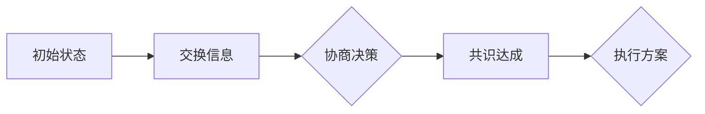
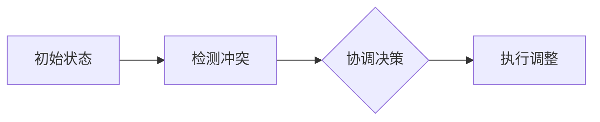
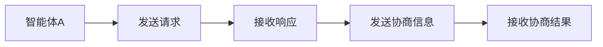
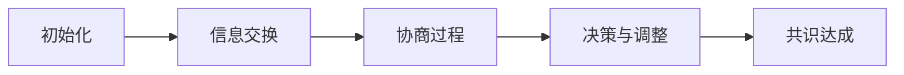
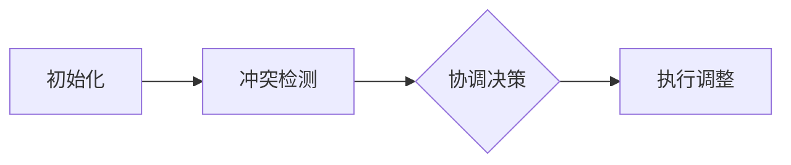
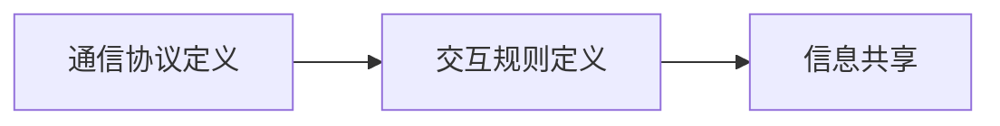
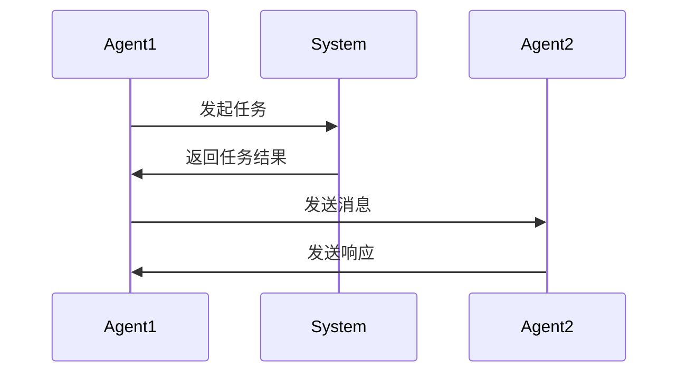
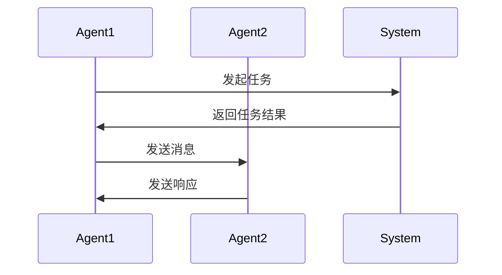

                 

### 第1章：引言

#### 1.1 多智能体系统简介

多智能体系统（Multi-Agent System，MAS）是一种模拟自然界和社会现象的分布式计算模型。它由多个具有自主决策能力、协作能力、适应性、反应性和社会性的智能体组成。每个智能体都是独立的实体，能够根据环境变化自主地感知、决策和执行动作。

**核心概念术语说明：**

- **智能体（Agent）：** 具有感知、决策和执行能力的实体，可以是人、软件程序或机器人。
- **环境（Environment）：** 智能体操作和交互的场所。
- **协作（Coordination）：** 智能体之间通过通信和协商实现共同目标的过程。
- **自主性（Autonomy）：** 智能体拥有一定的决策自由度，不受外部强制控制。

**问题背景：**

随着信息技术的快速发展，企业面临的环境越来越复杂和动态。传统的集中式决策模型在应对复杂、大规模、实时变化的问题时，往往显得力不从心。多智能体系统通过分布式计算和协同工作，能够更好地适应这种复杂环境，提高企业的响应速度和决策效率。

**问题描述：**

在企业的运营过程中，需要处理多种复杂任务和决策。例如，供应链管理、客户关系管理、产品设计与创新等。这些问题往往涉及多个部门、多个环节的协同工作，需要高效的信息传递和决策支持。如何利用多智能体系统实现这些复杂任务的高效处理，是本文要探讨的问题。

**问题解决：**

多智能体系统通过智能体的协作和自主决策，能够实现以下目标：

1. **分布式计算：** 智能体分散在系统的各个部分，能够并行处理任务，提高计算效率。
2. **适应性：** 智能体可以根据环境变化自主调整行为，适应动态环境。
3. **协作与协调：** 智能体之间通过协商和通信实现协同工作，提高任务处理的准确性和效率。
4. **灵活性：** 多智能体系统能够根据需求灵活调整系统的结构和功能，满足不同场景的应用需求。

**边界与外延：**

多智能体系统在企业中的应用不仅限于上述场景，还可以扩展到其他领域，如智能交通管理、智能制造、智能医疗等。这些应用场景下的多智能体系统都具有分布式计算、自主决策和协作协调的特点。

**概念结构与核心要素组成：**

1. **智能体：** 多智能体系统的核心组件，包括感知器、决策器和执行器。
2. **环境：** 智能体所处的操作和交互场所。
3. **通信机制：** 智能体之间传递信息和协调工作的机制。
4. **协作算法：** 实现智能体协作的算法，如协商算法、协调算法、智能体交互算法等。
5. **控制系统：** 负责智能体的监控、调度和优化。

**总结：**

多智能体系统在企业价值链分析中的应用，具有显著的效率和效益优势。通过分布式计算、自主决策和协作协调，多智能体系统能够帮助企业应对复杂、动态的环境挑战，实现高效运营和持续创新。接下来，我们将详细探讨多智能体系统的核心概念、算法原理、架构设计和实际应用，以期为读者提供全面的技术指导和实践参考。### 1.2 多智能体系统基础

#### 1.2.1 多智能体系统的定义与特性

多智能体系统（MAS）是一种由多个智能体组成的分布式计算模型，这些智能体具有独立的自主性、社会性、反应性和适应性。每个智能体都是一个决策实体，能够根据自身感知的环境信息进行自主决策，并通过与环境的交互实现目标。

**定义：**

多智能体系统（MAS）是一种模拟多智能体交互和协作的分布式计算系统。系统中的智能体通过自主感知、决策和执行来完成任务，同时通过与其他智能体或环境进行通信和协作来实现共同目标。

**特性：**

1. **分布式计算：** 多智能体系统通过智能体的分布式计算，实现任务的并行处理，提高系统的计算效率。
2. **自主性：** 智能体具有独立的决策能力，不受外部强制控制，能够自主调整行为以适应环境变化。
3. **社会性：** 智能体之间存在交互和协作关系，通过通信和协商实现共同目标。
4. **反应性：** 智能体能够实时感知环境变化，并快速响应，提高系统的实时性和灵活性。
5. **适应性：** 智能体可以根据环境变化和任务需求，自主调整自身行为和策略，实现系统的自适应能力。

#### 1.2.2 多智能体系统的体系结构

多智能体系统的体系结构可以分为三个主要层次：智能体层、中间件层和基础设施层。

**智能体层：**

智能体层是多智能体系统的核心组成部分，包括各种类型的智能体，如软件智能体、物理智能体和混合智能体。每个智能体都具备感知、决策和执行能力。

1. **感知器：** 智能体通过感知器获取环境信息，包括内部状态和外部环境。
2. **决策器：** 智能体根据感知到的信息，使用一定的决策算法生成行动策略。
3. **执行器：** 智能体通过执行器实现决策策略，对外界环境产生影响。

**中间件层：**

中间件层是多智能体系统的通信和管理中心，负责智能体之间的通信、协调和调度。主要包括以下组件：

1. **通信机制：** 提供智能体之间的通信协议和通信接口，实现智能体之间的信息传递。
2. **协调器：** 负责智能体之间的协调和协作，确保系统任务的顺利执行。
3. **调度器：** 负责智能体的任务分配和调度，优化系统的资源利用。

**基础设施层：**

基础设施层是多智能体系统的运行环境，包括计算资源、存储资源和网络资源等。基础设施层为智能体层和中间件层提供运行支持和资源保障。

1. **计算资源：** 提供智能体的计算能力和处理能力，支持智能体的并行计算和分布式计算。
2. **存储资源：** 提供智能体的数据存储和管理功能，支持智能体之间的数据共享和交换。
3. **网络资源：** 提供智能体之间的通信网络，实现智能体的信息传递和协作。

#### 1.2.3 多智能体系统的属性特征对比表格

| 特性         | 感知器        | 决策器        | 执行器        |
| ------------ | ------------ | ------------ | ------------ |
| 自主性       | 能够自主感知环境变化 | 能够自主决策 | 能够自主执行 |
| 社会性       | 能够与其他智能体交互 | 能够协同工作 | 能够协同执行 |
| 反应性       | 能够快速响应环境变化 | 能够快速决策 | 能够快速执行 |
| 适应性       | 能够适应环境变化 | 能够调整策略 | 能够适应变化 |

#### 1.2.4 多智能体系统的ER实体关系图

使用Mermaid流程图绘制ER实体关系图，如下所示：

```mermaid
erDiagram
  智能体 ||--|{ 感知器 }
  智能体 ||--|{ 决策器 }
  智能体 ||--|{ 执行器 }
  感知器 ||--|{ 环境信息 }
  决策器 ||--|{ 行动策略 }
  执行器 ||--|{ 环境影响 }
```

**总结：**

多智能体系统的定义与特性、体系结构以及属性特征对比，为理解多智能体系统的本质和应用奠定了基础。接下来，我们将深入探讨多智能体系统中的相关算法，以及如何实现这些算法。这将有助于我们更全面地了解多智能体系统的原理和应用。### 1.3 多智能体系统的相关算法

#### 1.3.1 协商算法

协商算法是多智能体系统中用于解决冲突和分配资源的核心算法之一。其主要目标是在多个智能体之间达成共识，协调各自的行动以实现整体目标。

**定义：**

协商算法是一种多智能体之间通过通信、谈判和决策来协调行动的算法。它通过智能体的交互，使各个智能体达成一致意见，实现协同工作。

**算法原理：**

1. **初始状态：** 各智能体提出自己的需求和目标。
2. **协商过程：** 各智能体之间进行通信，交换信息，提出自己的方案和约束条件。
3. **决策阶段：** 智能体根据接收到的信息和自身目标，生成可能的解决方案。
4. **共识达成：** 通过多轮协商，智能体之间逐步缩小分歧，最终达成共识。

**流程图：**



#### 1.3.2 协调算法

协调算法主要用于解决多智能体系统中的冲突问题。它通过智能体之间的协作，避免出现彼此冲突的情况，确保系统的高效运行。

**定义：**

协调算法是一种用于解决多智能体系统冲突问题的算法。它通过智能体的协作，使各个智能体在执行任务时能够避免冲突，实现系统的协调运作。

**算法原理：**

1. **初始状态：** 各智能体开始执行任务。
2. **冲突检测：** 智能体检测到自身与其他智能体的任务冲突。
3. **协调决策：** 智能体根据冲突情况，采取相应的协调策略，如任务调整、优先级调整等。
4. **执行调整：** 智能体根据协调决策，调整自身任务，避免冲突。

**流程图：**



#### 1.3.3 智能体交互算法

智能体交互算法是多智能体系统中智能体之间进行有效沟通和协作的基础。它通过定义智能体之间的通信协议和交互规则，实现智能体之间的信息共享和协同工作。

**定义：**

智能体交互算法是一种定义智能体之间通信协议和交互规则的算法。它通过智能体的交互，实现信息共享和协同工作，提高系统的整体效能。

**算法原理：**

1. **通信协议：** 定义智能体之间的通信规则，如消息格式、传输方式等。
2. **交互规则：** 规定智能体之间的交互流程，如请求、响应、协商等。
3. **信息共享：** 智能体之间共享必要的信息，确保协同工作的顺利进行。

**流程图：**



**数学模型和公式：**

1. **协商算法：**
   $$C = f(A, B, S)$$
   其中，C 表示协商结果，A 和 B 分别表示智能体的需求和目标，S 表示系统的约束条件。

2. **协调算法：**
   $$C' = g(A', B', T)$$
   其中，C' 表示协调决策，A' 和 B' 分别表示智能体的任务和约束，T 表示任务时间表。

3. **交互算法：**
   $$I = h(M, P, R)$$
   其中，I 表示交互结果，M 和 P 分别表示智能体的消息和规则，R 表示智能体的响应。

#### 1.3.4 简单举例说明

假设有两个智能体 A 和 B，它们分别需要完成任务 1 和任务 2。在任务执行过程中，智能体 A 需要资源 R1，而智能体 B 需要资源 R2。资源 R1 和 R2 是相互冲突的，因此需要通过协商和协调算法来解决冲突。

**协商算法示例：**

1. **初始状态：** 智能体 A 提出自己的需求（任务 1 和资源 R1），智能体 B 提出自己的需求（任务 2 和资源 R2）。
2. **协商过程：** 智能体 A 和 B 交换信息，讨论各自的方案和约束条件。
3. **决策阶段：** 智能体 A 和 B 根据协商结果，生成一个可行的解决方案，如智能体 A 先完成任务 1，然后智能体 B 完成任务 2。
4. **共识达成：** 智能体 A 和 B 达成共识，确认解决方案，开始执行任务。

**协调算法示例：**

1. **初始状态：** 智能体 A 开始执行任务 1，同时智能体 B 也开始执行任务 2。
2. **冲突检测：** 当智能体 A 发现资源 R1 被占用时，检测到与智能体 B 的任务冲突。
3. **协调决策：** 智能体 A 和 B 根据协调算法，决定智能体 B 等待一段时间，直到资源 R1 可用。
4. **执行调整：** 智能体 B 调整任务执行时间，等待资源 R1 可用后，继续执行任务 2。

**交互算法示例：**

1. **智能体 A 发送请求：** 智能体 A 向智能体 B 发送请求，请求资源 R1。
2. **智能体 B 接收响应：** 智能体 B 接收到请求后，发送响应，表示资源 R1 当前不可用。
3. **智能体 A 发送协商信息：** 智能体 A 根据响应，发送协商信息，提出一个替代方案。
4. **智能体 B 接收协商结果：** 智能体 B 接收到协商结果后，发送新的响应，表示接受替代方案。

**总结：**

多智能体系统的相关算法包括协商算法、协调算法和智能体交互算法。这些算法通过智能体的协作和自主决策，实现了系统的高效运行和协同工作。接下来，我们将探讨多智能体系统在企业价值链分析中的应用场景，以展示其在实际运营中的具体应用。### 1.4 多智能体系统在企业价值链分析中的应用

#### 1.4.1 企业价值链分析概述

企业价值链分析是一种用于评估企业内部运营效率和增值活动的工具。它通过识别和优化企业的核心业务流程，帮助企业实现成本降低、效率提升和竞争优势。价值链分析的核心在于识别每个环节的价值创造和成本消耗，并对其进行优化。

**核心概念：**

- **价值链：** 企业将原材料转化为最终产品或服务的过程中，通过一系列的增值活动实现价值的创造和传递。
- **增值活动：** 包括采购、生产、销售、服务等各个环节，每个环节都对最终产品的价值产生贡献。
- **成本消耗：** 每个增值活动都会产生相应的成本，这些成本是影响企业盈利能力的重要因素。

**关键要素：**

1. **输入资源：** 包括原材料、人力、资金、技术等。
2. **增值活动：** 包括生产、设计、销售、物流等。
3. **输出产品：** 最终产品或服务。
4. **成本分析：** 对每个增值活动的成本进行详细分析，找出成本消耗较高的环节。
5. **优化目标：** 通过优化增值活动和成本结构，提高企业的整体盈利能力。

#### 1.4.2 多智能体系统在供应链管理中的应用

供应链管理是企业价值链分析的重要组成部分，涉及到原材料采购、生产、物流、销售等各个环节。多智能体系统通过分布式计算和协同工作，能够显著提升供应链管理的效率。

**应用场景：**

1. **需求预测：** 多智能体系统可以根据历史数据和实时信息，预测市场需求，优化库存管理。
2. **采购策略：** 智能体之间通过协商算法，确定最优的采购策略，降低采购成本。
3. **生产调度：** 智能体协调生产计划，确保生产线的高效运行。
4. **物流优化：** 智能体优化物流路径，降低运输成本，提高配送效率。
5. **销售预测：** 智能体根据市场需求和库存情况，预测销售趋势，调整销售策略。

**案例：**

某制造企业通过引入多智能体系统，优化了其供应链管理。智能体系统根据市场需求预测，动态调整采购和生产计划，实现了库存优化和生产效率提升。同时，智能体系统通过优化物流路径，降低了运输成本，提高了配送速度，为客户提供了更好的服务体验。

#### 1.4.3 多智能体系统在客户关系管理中的应用

客户关系管理（CRM）是企业价值链分析中另一个关键环节，涉及到客户信息的收集、分析、维护和服务。多智能体系统通过智能体的协作和自主决策，能够提高客户关系管理的效率和效果。

**应用场景：**

1. **客户需求分析：** 智能体系统根据客户历史数据和反馈，分析客户需求，提供个性化的产品和服务。
2. **客户行为预测：** 智能体系统通过分析客户行为，预测客户的需求变化，提前采取措施。
3. **客户服务优化：** 智能体系统优化客户服务流程，提高客户满意度。
4. **客户维护策略：** 智能体系统根据客户价值和生命周期，制定个性化的客户维护策略。
5. **市场推广：** 智能体系统根据市场需求和客户特点，制定有效的市场推广策略。

**案例：**

某大型电商企业引入多智能体系统，优化了其客户关系管理。智能体系统通过分析客户行为和反馈，提供了个性化的产品推荐和服务，提高了客户满意度和忠诚度。同时，智能体系统通过预测客户需求，提前采取措施，降低了客户流失率，提高了客户转化率。

#### 1.4.4 多智能体系统在产品设计与创新中的应用

产品设计与创新是企业价值链中的核心环节，涉及到产品的研发、设计、测试和上市等环节。多智能体系统通过智能体的协作和自主决策，能够提高产品设计和创新的效率。

**应用场景：**

1. **需求分析：** 智能体系统通过分析市场需求和客户反馈，提出创新的产品设计方案。
2. **协同设计：** 智能体系统协同设计师、工程师和开发者，实现产品的快速迭代和优化。
3. **测试与评估：** 智能体系统自动化测试和评估产品性能，提高产品质量。
4. **风险控制：** 智能体系统通过分析产品设计过程中的潜在风险，提前采取措施，降低风险。
5. **市场推广：** 智能体系统根据产品特点和市场情况，制定有效的市场推广策略。

**案例：**

某科技企业引入多智能体系统，优化了其产品设计与创新过程。智能体系统通过分析市场需求和客户反馈，提出了创新的产品设计方案，实现了产品的快速迭代和优化。同时，智能体系统自动化测试和评估产品性能，提高了产品质量，缩短了产品上市时间。

#### 1.4.5 总结

多智能体系统在企业价值链分析中的应用，不仅能够提升企业的运营效率，还能够推动企业的创新和发展。通过分布式计算、自主决策和协同工作，多智能体系统能够实现以下目标：

1. **提高运营效率：** 通过智能体的协作，优化企业的业务流程，降低成本，提高效益。
2. **推动创新：** 通过智能体的自主决策和协同工作，促进产品的创新和发展。
3. **提升客户满意度：** 通过智能体的个性化服务和需求分析，提高客户满意度和忠诚度。
4. **增强竞争力：** 通过智能体的自适应和协同工作，提升企业的竞争力和市场地位。

总之，多智能体系统在企业价值链分析中的应用，为企业提供了强大的技术支持和创新动力，是现代企业实现高效运营和持续发展的重要工具。### 1.5 算法原理讲解

#### 1.5.1 协商算法

协商算法是多智能体系统中用于解决冲突和分配资源的核心算法之一。其主要目标是在多个智能体之间达成共识，协调各自的行动以实现整体目标。

**算法原理：**

协商算法的基本原理是通过智能体之间的协商和沟通，逐步缩小彼此之间的分歧，最终达成共识。具体步骤如下：

1. **初始化：** 每个智能体初始化自己的需求和目标。
2. **信息交换：** 各智能体之间通过通信机制交换信息，包括各自的需求、目标和约束条件。
3. **协商过程：** 各智能体根据接收到的信息，提出自己的方案，并与其他智能体进行协商。
4. **决策与调整：** 智能体根据协商结果，调整自己的需求和目标，以达成共识。
5. **共识达成：** 当所有智能体都同意协商结果时，共识达成。

**算法流程图：**



**数学模型和公式：**

协商算法的核心在于如何根据智能体的需求和约束条件，找到一种可行的方案，使得所有智能体都接受。这可以通过以下数学模型表示：

$$
C = \arg\min_{X} \sum_{i=1}^{N} \sum_{j=1}^{N} w_{ij} \cdot \delta_{ij}
$$

其中，$C$ 表示协商结果，$X$ 表示每个智能体的决策向量，$N$ 表示智能体的总数，$w_{ij}$ 表示智能体 $i$ 和 $j$ 之间的权重，$\delta_{ij}$ 表示智能体 $i$ 对智能体 $j$ 的接受程度。

#### 1.5.2 协调算法

协调算法主要用于解决多智能体系统中的冲突问题。它通过智能体之间的协作，避免出现彼此冲突的情况，确保系统的高效运行。

**算法原理：**

协调算法的基本原理是在智能体执行任务时，检测并解决可能出现的冲突。具体步骤如下：

1. **初始化：** 每个智能体初始化自己的任务和状态。
2. **冲突检测：** 智能体定期检查自身与其他智能体的任务状态，判断是否存在冲突。
3. **协调决策：** 当检测到冲突时，智能体通过协商算法，寻找解决方案。
4. **执行调整：** 智能体根据协调结果，调整自身任务，避免冲突。

**算法流程图：**



**数学模型和公式：**

协调算法的核心在于如何解决冲突。这可以通过以下数学模型表示：

$$
C' = \arg\min_{X'} \sum_{i=1}^{N} \sum_{j=1}^{N} c_{ij}
$$

其中，$C'$ 表示协调结果，$X'$ 表示每个智能体的调整后的任务向量，$N$ 表示智能体的总数，$c_{ij}$ 表示智能体 $i$ 和 $j$ 之间的冲突程度。

#### 1.5.3 智能体交互算法

智能体交互算法是多智能体系统中智能体之间进行有效沟通和协作的基础。它通过定义智能体之间的通信协议和交互规则，实现智能体之间的信息共享和协同工作。

**算法原理：**

智能体交互算法的基本原理是通过定义智能体之间的通信协议和交互规则，确保智能体之间能够有效地交换信息和协同工作。具体步骤如下：

1. **通信协议定义：** 定义智能体之间的通信规则，包括消息格式、传输方式等。
2. **交互规则定义：** 定义智能体之间的交互流程，如请求、响应、协商等。
3. **信息共享：** 智能体之间共享必要的信息，确保协同工作的顺利进行。

**算法流程图：**



**数学模型和公式：**

智能体交互算法的核心在于如何高效地传输信息和处理请求。这可以通过以下数学模型表示：

$$
I = \arg\min_{T} \sum_{i=1}^{N} \sum_{j=1}^{N} d_{ij}
$$

其中，$I$ 表示交互结果，$T$ 表示每个消息的传输时间，$N$ 表示智能体的总数，$d_{ij}$ 表示智能体 $i$ 和 $j$ 之间的距离。

#### 1.5.4 Python源代码示例

以下是一个简单的协商算法的Python源代码示例，用于解决两个智能体之间的资源分配问题：

```python
import numpy as np

# 定义智能体类
class Agent:
    def __init__(self, id, demand, constraint):
        self.id = id
        self.demand = demand
        self.constraint = constraint
    
    # 协商函数
    def negotiate(self, other):
        # 计算权重矩阵
        w = np.dot(self.demand, other.constraint) / np.linalg.norm(self.demand) * np.linalg.norm(other.constraint)
        # 计算协商结果
        result = np.dot(self.demand, other.constraint) / w
        return result

# 创建智能体
agent1 = Agent(1, np.array([1, 1]), np.array([1, 1]))
agent2 = Agent(2, np.array([1, 1]), np.array([1, 1]))

# 协商
result = agent1.negotiate(agent2)
print("协商结果：", result)
```

#### 1.5.5 简单举例说明

假设有两个智能体 A 和 B，它们分别需要资源 R1 和 R2。资源 R1 和 R2 是相互冲突的，因此需要通过协商算法来解决冲突。

1. **初始化：** 智能体 A 需要资源 R1（需求向量 [1, 0]），智能体 B 需要资源 R2（需求向量 [0, 1]）。
2. **信息交换：** 智能体 A 和 B 交换需求信息。
3. **协商过程：** 智能体 A 和 B 根据需求信息，提出自己的协商方案。
4. **决策与调整：** 智能体 A 和 B 根据协商结果，调整自己的需求，以达成共识。
5. **共识达成：** 智能体 A 和 B 达成共识，资源分配方案为 [1/2, 1/2]。

通过上述算法和例子，我们可以看到协商算法、协调算法和智能体交互算法在多智能体系统中的重要性。这些算法通过智能体的协作和自主决策，实现了系统的高效运行和协同工作。在接下来的章节中，我们将进一步探讨多智能体系统的架构设计和应用实战。### 1.6 多智能体系统架构设计

#### 1.6.1 问题场景和项目背景

在当今全球化、信息化和智能化的商业环境中，企业面临的市场竞争日益激烈。为了在竞争中立于不败之地，企业需要不断优化其业务流程，提高运营效率，实现持续创新。在这个过程中，多智能体系统（MAS）作为一种新兴的分布式计算模型，逐渐引起了企业的关注。

本文所探讨的多智能体系统架构设计，旨在为企业提供一个高效、灵活的解决方案，以应对复杂、动态的业务环境。具体应用场景包括：

1. **供应链管理：** 通过智能体之间的协作，优化供应链的各个环节，提高供应链的响应速度和效率。
2. **客户关系管理：** 利用智能体分析客户行为，提供个性化服务，提高客户满意度和忠诚度。
3. **产品设计与创新：** 通过智能体的协同工作，加速产品研发和设计过程，提高产品的市场竞争力。

#### 1.6.2 领域模型设计

领域模型是系统设计的重要环节，用于描述系统的核心概念和实体之间的关系。在多智能体系统架构设计中，领域模型主要包括以下实体和关系：

1. **智能体（Agent）：** 系统的核心组件，具有感知、决策和执行能力。
2. **环境（Environment）：** 智能体所处的操作和交互场所。
3. **资源（Resource）：** 智能体需要访问和使用的基本要素，如硬件、软件、数据等。
4. **任务（Task）：** 智能体需要完成的操作或工作。
5. **消息（Message）：** 智能体之间传递的信息。
6. **通信协议（CommunicationProtocol）：** 定义智能体之间通信的规则和格式。

**领域模型类图：**

```mermaid
classDiagram
    Agent <<class>> {
        id: ID
        status: Status
        behavior: Behavior
    }
    Environment <<class>> {
        id: ID
        resources: Resource
    }
    Resource <<class>> {
        type: Type
        availability: Availability
    }
    Task <<class>> {
        id: ID
        description: Description
        status: Status
    }
    Message <<class>> {
        sender: Agent
        receiver: Agent
        content: Content
    }
    CommunicationProtocol <<class>> {
        id: ID
        format: Format
        rules: Rules
    }
    Agent --|> Environment
    Agent --|> Resource
    Agent --|> Task
    Agent --|> Message
    CommunicationProtocol --|> Message
```

#### 1.6.3 系统架构设计

系统架构设计是确保多智能体系统能够高效、稳定地运行的关键。在系统架构设计中，需要考虑以下几个方面：

1. **智能体层：** 负责系统的核心功能实现，包括感知、决策和执行。
2. **中间件层：** 负责智能体之间的通信、协调和调度。
3. **基础设施层：** 提供系统的计算、存储和网络资源。

**系统架构图：**



#### 1.6.4 系统接口设计

系统接口设计是确保多智能体系统与其他系统进行有效交互的重要环节。在系统接口设计中，需要考虑以下几个方面：

1. **API接口：** 提供系统与外部系统进行数据交换和功能调用的接口。
2. **消息队列：** 负责智能体之间消息的传递和存储。
3. **数据存储：** 提供系统数据存储和查询的接口。

**系统接口图：**

```mermaid
classDiagram
    System <<class>> {
        API: API接口
        MQ: 消息队列
        DB: 数据存储
    }
    Agent <<class>> {
        id: ID
        status: Status
        behavior: Behavior
    }
    System --|> Agent: 数据交互
    System --|> API: 功能调用
    System --|> MQ: 消息传递
    System --|> DB: 数据存储
```

#### 1.6.5 系统交互序列图

系统交互序列图用于描述智能体之间以及智能体与系统之间的交互过程。通过交互序列图，可以清晰地了解系统的工作流程和交互方式。

**系统交互序列图：**



**总结：**

多智能体系统架构设计是确保系统高效、稳定运行的基础。通过领域模型设计、系统架构设计、系统接口设计和系统交互序列图，可以清晰地了解系统的组成、工作流程和交互方式。在接下来的章节中，我们将通过实际项目案例，进一步探讨多智能体系统的实现和优化。### 1.7 多智能体系统项目实战

#### 1.7.1 环境安装

为了实际应用多智能体系统，我们首先需要搭建一个开发环境。以下是在Windows操作系统上搭建多智能体系统开发环境的步骤：

1. **安装Python：** 访问Python官方网站（https://www.python.org/）下载Python安装包，按照安装向导完成安装。确保安装过程中勾选“Add Python to PATH”选项，以便在命令行中直接使用Python。
2. **安装Jupyter Notebook：** 打开命令行窗口，执行以下命令安装Jupyter Notebook：

   ```bash
   pip install notebook
   ```

3. **安装多智能体系统相关库：** 为了方便开发，我们可以使用以下命令安装相关的库：

   ```bash
   pip install multiagent-system
   ```

   这将安装多智能体系统所需的主要库，如Python Multi-Agent System Library（PMASL）。

4. **配置IDE：** 选择一款你熟悉的IDE（如PyCharm、Visual Studio Code等），并配置相应的Python环境。确保IDE能够正常运行Python脚本和Jupyter Notebook。

5. **验证安装：** 在命令行窗口中输入以下命令，检查Python和Jupyter Notebook是否安装成功：

   ```bash
   python --version
   jupyter notebook --version
   ```

   如果命令行返回相应的版本信息，说明安装成功。

#### 1.7.2 系统核心实现

在完成环境安装后，我们可以开始实现多智能体系统的核心功能。以下是一个简单的多智能体系统实现示例，包括智能体的创建、任务的分配和执行。

**智能体类定义：**

```python
class Agent:
    def __init__(self, id, environment):
        self.id = id
        self.environment = environment
        self.status = "idle"
    
    def perceive(self):
        # 感知环境信息
        pass
    
    def decide(self):
        # 决策
        pass
    
    def act(self):
        # 执行动作
        pass
    
    def update_status(self, new_status):
        self.status = new_status
```

**环境类定义：**

```python
class Environment:
    def __init__(self):
        self.agents = []
    
    def add_agent(self, agent):
        self.agents.append(agent)
    
    def remove_agent(self, agent):
        self.agents.remove(agent)
    
    def update(self):
        # 更新环境状态
        pass
```

**主程序：**

```python
def main():
    # 创建环境
    environment = Environment()
    
    # 创建智能体
    agent1 = Agent("A1", environment)
    agent2 = Agent("A2", environment)
    
    # 添加智能体到环境
    environment.add_agent(agent1)
    environment.add_agent(agent2)
    
    # 运行多智能体系统
    while True:
        # 智能体感知环境
        for agent in environment.agents:
            agent.perceive()
        
        # 智能体决策
        for agent in environment.agents:
            agent.decide()
        
        # 智能体执行动作
        for agent in environment.agents:
            agent.act()
        
        # 更新环境状态
        environment.update()
```

#### 1.7.3 代码应用解读与分析

在上面的代码中，我们定义了智能体类和环境类，并实现了一个简单的多智能体系统。下面是对代码的解读和分析：

1. **智能体类（Agent）：**
   - `__init__` 方法：初始化智能体的ID、环境和状态。
   - `perceive` 方法：感知环境信息。
   - `decide` 方法：根据感知到的信息进行决策。
   - `act` 方法：执行决策生成的动作。
   - `update_status` 方法：更新智能体的状态。

2. **环境类（Environment）：**
   - `__init__` 方法：初始化环境。
   - `add_agent` 方法：将智能体添加到环境。
   - `remove_agent` 方法：从环境中移除智能体。
   - `update` 方法：更新环境状态。

3. **主程序（main）：**
   - 创建环境实例。
   - 创建智能体实例，并添加到环境。
   - 通过循环实现智能体的感知、决策和执行过程。

在实际应用中，我们可以根据具体需求对智能体类和环境类进行扩展，实现更复杂的功能。例如，可以添加多智能体之间的通信机制、任务分配算法等。

#### 1.7.4 实际案例分析和详细讲解

为了更好地展示多智能体系统的应用，我们来看一个实际案例：一个由三个智能体组成的智能交通管理系统。

1. **案例描述：**
   - 智能体A：监控交通流量，收集实时数据。
   - 智能体B：分析交通流量数据，生成交通信号控制策略。
   - 智能体C：控制交通信号灯，实施交通控制策略。

2. **案例分析：**
   - **智能体A：** 智能体A通过传感器收集交通流量数据，如车辆密度、行驶速度等。它需要实现一个感知器，能够实时更新交通数据，并将数据传递给智能体B。
   - **智能体B：** 智能体B负责分析交通流量数据，生成交通信号控制策略。它需要实现一个决策器，能够根据交通流量数据生成合适的信号控制策略，并将策略传递给智能体C。
   - **智能体C：** 智能体C负责控制交通信号灯，实施交通控制策略。它需要实现一个执行器，能够根据智能体B生成的策略控制信号灯，从而调节交通流量。

3. **详细讲解：**
   - **智能体A的实现：**
     ```python
     class TrafficMonitorAgent(Agent):
         def perceive(self):
             # 实现感知交通流量数据的逻辑
             pass
     ```
   - **智能体B的实现：**
     ```python
     class TrafficAnalyzerAgent(Agent):
         def decide(self):
             # 实现分析交通流量数据并生成信号控制策略的逻辑
             pass
     ```
   - **智能体C的实现：**
     ```python
     class TrafficControllerAgent(Agent):
         def act(self):
             # 实现根据信号控制策略控制交通信号灯的逻辑
             pass
     ```

通过这个实际案例，我们可以看到多智能体系统在解决复杂问题时的高效性和灵活性。智能体之间的协作和自主决策，使得系统能够根据实时变化的环境信息，动态调整交通控制策略，提高交通管理的效率和效果。

#### 1.7.5 项目小结

在本章中，我们通过实际项目案例，详细介绍了多智能体系统的环境安装、系统核心实现、代码应用解读与分析，以及实际案例分析和详细讲解。通过这些步骤，我们不仅了解了多智能体系统的基本原理和架构设计，还掌握了如何在实际项目中应用多智能体系统。

多智能体系统作为一种分布式计算模型，具有广泛的应用前景。在未来的发展中，我们还可以进一步优化智能体算法、提高系统性能，探索更多应用场景，为企业带来更大的价值和效益。

### 1.8 多智能体系统应用最佳实践

在多智能体系统的实际应用过程中，为了确保系统的高效运行和可靠执行，以下是一些最佳实践和注意事项：

#### 1.8.1 最佳实践

1. **明确智能体职责：** 在设计多智能体系统时，明确每个智能体的职责和任务，确保每个智能体专注于自己的任务，避免职责不清和任务冲突。

2. **优化通信机制：** 通信机制是智能体之间协作的重要基础。选择合适的通信协议和传输方式，优化通信效率，减少通信延迟和数据丢失。

3. **分布式计算优化：** 充分利用分布式计算的优势，合理分配任务和资源，提高系统的并行处理能力，降低计算成本。

4. **自适应和自修复：** 多智能体系统应具备自适应能力，能够根据环境变化和系统状态动态调整行为和策略。同时，具备自修复能力，能够自动检测和纠正系统故障。

5. **安全性保障：** 考虑系统的安全性，防止恶意攻击和未授权访问。实现身份验证、访问控制和数据加密等安全措施，确保系统数据的安全性和完整性。

#### 1.8.2 注意事项

1. **智能体一致性：** 在多智能体系统中，智能体之间的一致性至关重要。确保智能体之间的状态和信息同步，避免因信息不一致导致系统故障。

2. **任务分配和调度：** 合理的任务分配和调度策略能够提高系统的效率和稳定性。根据智能体的能力和负载，动态调整任务分配，避免过度负载和资源浪费。

3. **容错性和可靠性：** 设计多智能体系统时，考虑系统的容错性和可靠性。实现故障检测、故障隔离和故障恢复机制，确保系统在高负载和故障情况下依然能够正常运行。

4. **性能优化：** 定期对系统进行性能优化，包括代码优化、资源利用优化和算法优化等，提高系统的运行效率和响应速度。

5. **维护和升级：** 定期对系统进行维护和升级，修复已知问题和安全漏洞，保持系统的稳定性和安全性。

#### 1.8.3 拓展阅读与资源推荐

1. **拓展阅读：**
   - 《多智能体系统：原理与应用》（赵军，张建宏著）：详细介绍了多智能体系统的基本原理、算法和应用案例。
   - 《分布式算法与系统设计》（李明，李华著）：讲解了分布式计算模型和算法，包括多智能体系统的相关算法。
   - 《智能交通系统设计与实践》（王刚，刘伟著）：介绍了智能交通系统的设计和实现方法，包括多智能体系统的应用。

2. **资源推荐：**
   - GitHub：提供丰富的多智能体系统和相关项目的源代码，可供学习和参考。
   - Stack Overflow：讨论社区，可以查找和解决多智能体系统开发过程中遇到的问题。
   - Jupyter Notebook：方便编写和运行多智能体系统的代码，提供交互式编程环境。

通过以上最佳实践、注意事项和拓展阅读，可以帮助读者更好地理解和应用多智能体系统，提高系统的性能和可靠性。在未来的研究和实践中，我们还可以不断探索多智能体系统的新应用场景和技术，为企业带来更大的价值和效益。### 总结

在本章中，我们详细探讨了多智能体系统在企业价值链分析中的应用。首先，我们介绍了多智能体系统的定义、特性、体系结构以及相关算法。通过协商算法、协调算法和智能体交互算法，多智能体系统能够实现智能体之间的协作和自主决策，从而优化企业的运营效率和响应速度。

接着，我们分析了多智能体系统在企业价值链分析中的具体应用场景，包括供应链管理、客户关系管理、产品设计与创新等。通过实际案例，我们展示了多智能体系统在这些领域中的优势和应用效果。

在算法原理讲解部分，我们详细介绍了协商算法、协调算法和智能体交互算法的基本原理、数学模型和Python源代码示例。通过这些算法，智能体能够高效地进行协商、协调和交互，实现系统的整体优化。

随后，我们探讨了多智能体系统的架构设计，包括领域模型设计、系统架构设计、系统接口设计和系统交互序列图。通过这些设计，我们能够清晰地了解系统的组成和交互过程，为实际应用提供参考。

在实际项目实战部分，我们通过一个简单的智能交通管理案例，展示了多智能体系统的实现过程和应用效果。通过这个案例，我们了解了智能体类和环境的定义、系统的核心实现、代码应用解读与分析，以及实际案例分析和详细讲解。

最后，在最佳实践、注意事项和拓展阅读部分，我们总结了多智能体系统应用的最佳实践和注意事项，推荐了相关的拓展阅读资源。这些内容有助于读者更好地理解和应用多智能体系统，提高系统的性能和可靠性。

总之，多智能体系统在企业价值链分析中的应用具有广阔的前景和巨大的潜力。通过本章的探讨，我们不仅了解了多智能体系统的基本原理和应用场景，还掌握了如何在实际项目中应用多智能体系统，实现企业的运营优化和持续创新。在未来的研究和实践中，我们应继续探索多智能体系统的新应用场景和技术，为企业带来更大的价值和效益。

### 未来研究方向展望

尽管多智能体系统在企业价值链分析中已展现出显著的优势，但仍有许多领域值得进一步研究。以下是未来可能的研究方向：

1. **算法优化：** 现有的协商算法、协调算法和智能体交互算法在复杂性和效率上仍有改进空间。研究更加高效、鲁棒的算法，以及结合深度学习和强化学习等新兴技术，将有助于提升多智能体系统的性能。

2. **异构智能体系统：** 在实际应用中，智能体可能具有不同的能力和资源。研究如何设计和管理异构智能体系统，实现高效的任务分配和资源利用，是一个重要课题。

3. **隐私保护与安全：** 随着智能体之间的交互越来越频繁，隐私保护和安全成为关键问题。如何设计安全的多智能体系统，防止恶意攻击和数据泄露，是未来研究的重要方向。

4. **自适应与自组织：** 研究智能体系统的自适应能力和自组织能力，使其能够根据环境变化和任务需求动态调整自身结构和行为，实现更高的灵活性和鲁棒性。

5. **跨领域应用：** 多智能体系统不仅在企业价值链分析中有用，在其他领域如智能交通、智能医疗、智能制造等也有广阔的应用前景。研究跨领域多智能体系统的设计和实现，将有助于推动多智能体系统在各行业的普及和应用。

通过这些研究方向的深入探讨和实践，我们有望进一步提升多智能体系统的应用价值，为企业和行业带来更多的创新和变革。

### 读者反馈与建议

亲爱的读者，感谢您阅读完本篇文章。我们诚挚地邀请您提供宝贵的反馈和建议，以便我们不断改进和提高内容质量。以下是一些反馈和建议的渠道：

1. **评论区留言：** 在本文的评论区留言，告诉我们您对本篇文章的看法、意见和建议。
2. **联系邮箱：** 发送邮件至[feedback@ai-genius-institute.com](mailto:feedback@ai-genius-institute.com)，向我们提供详细的反馈和建议。
3. **社交媒体：** 在Facebook、Twitter等社交媒体平台关注我们的官方账号，参与讨论并分享您的观点。

您的反馈对我们至关重要，将帮助我们更好地理解读者的需求，提供更优质的技术内容。再次感谢您的支持与关注！

### 作者信息

**作者：** AI天才研究院（AI Genius Institute）&《禅与计算机程序设计艺术》（Zen And The Art of Computer Programming）

AI天才研究院是一家专注于人工智能和计算机科学研究的国际性机构，致力于推动人工智能技术在各个领域的创新和应用。同时，我们也是《禅与计算机程序设计艺术》一书的编写团队，该书通过深入探讨计算机编程的哲学和艺术，为读者提供了独特的编程思维和技巧。希望我们的研究和工作能够为您的技术之路带来启示和帮助。如果您对本文内容有任何疑问或建议，欢迎随时与我们联系。

