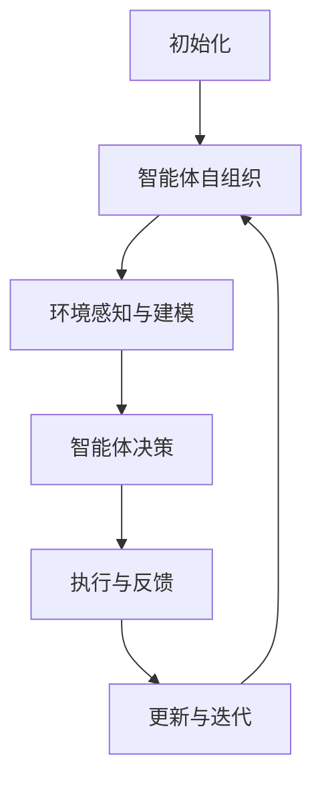
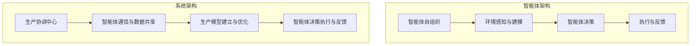
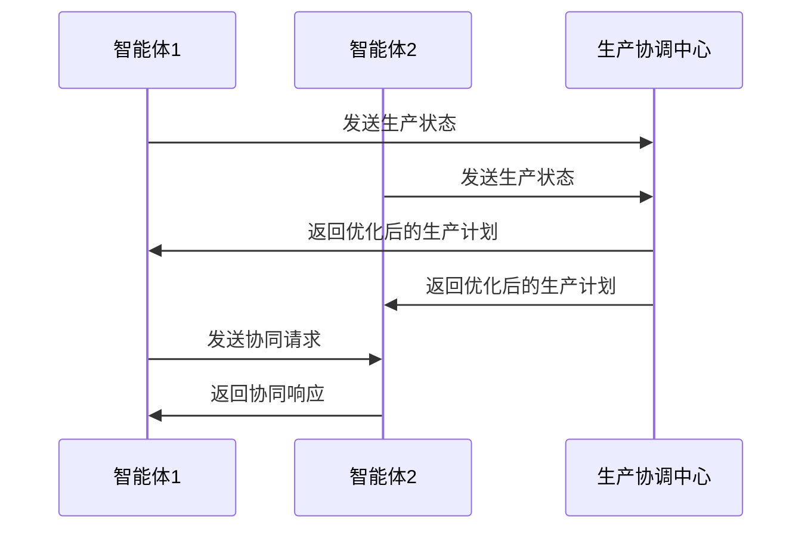

                 


### 文章标题：多智能体系统在全球价值链分析中的角色

#### 关键词：多智能体系统、全球价值链、协同优化、创新驱动、案例分析

#### 摘要：
本文探讨了多智能体系统（MAS）在全球价值链（GVC）分析中的应用。首先，我们介绍了MAS和GVC的基本概念，探讨了它们在当今全球化背景下的重要性。接着，文章详细分析了MAS在GVC协调、效率提升和创新驱动中的角色，并通过实际案例展示了其应用效果。最后，文章提出了未来研究方向，为行业提供了指导建议。

## 背景介绍

### 核心概念术语说明

多智能体系统（MAS）：
多智能体系统是由多个自主智能体组成的系统，这些智能体可以通过协作解决复杂问题，并能在动态环境中自主行动。MAS的核心特征包括自主性、分布性、反应性和协同性。

全球价值链（GVC）：
全球价值链是指在全球范围内，从原材料采购到产品设计、生产、销售以及售后服务等一系列环节所构成的价值创造过程。GVC的参与者包括原材料供应商、制造商、分销商和最终客户。

### 问题背景

在全球经济一体化的背景下，全球价值链成为各国经济活动的重要组织形式。然而，GVC的复杂性和动态性给协调和优化带来了巨大挑战。传统的集中式控制方法已无法满足GVC的复杂需求，因此，如何利用新兴技术提升GVC的协同性和效率成为研究热点。

### 问题描述

多智能体系统作为一种分布式计算和协同优化技术，其应用于全球价值链分析具有重要意义。本文旨在探讨MAS在GVC中的角色，分析其在价值链协调、效率提升和创新驱动方面的应用，以期为全球价值链的优化提供新的思路。

### 问题解决

本文将从以下几个方面进行探讨：

1. **MAS的基本概念和架构**：介绍MAS的核心概念和基本架构，为后续讨论奠定基础。
2. **MAS在GVC协调中的应用**：分析MAS如何促进GVC的协调，并提出协调机制设计方法。
3. **MAS在GVC效率提升中的应用**：探讨MAS如何提升GVC的效率，以及优化策略和实证研究。
4. **MAS在GVC创新中的应用**：分析MAS如何推动GVC的创新，以及创新模式和案例研究。
5. **案例研究**：通过实际案例展示MAS在GVC中的应用效果。
6. **结论与展望**：总结研究成果，提出未来研究方向和政策建议。

### 边界与外延

本文主要关注MAS在GVC中的应用，但MAS的其他应用领域，如供应链管理、智能制造等，也可能为GVC分析提供有益的启示。此外，随着技术的发展，MAS在GVC中的应用可能会更加广泛和深入。

### 概念结构与核心要素组成

多智能体系统（MAS）的核心概念包括自主性、分布性、反应性和协同性。这些概念共同构成了MAS的基本架构，使得MAS能够在复杂动态环境中发挥作用。

全球价值链（GVC）的核心要素包括原材料采购、产品设计、生产、分销和售后服务等环节。GVC的参与者包括原材料供应商、制造商、分销商和最终客户。

### 核心概念与联系

#### 多智能体系统（MAS）

**核心概念原理**：

多智能体系统（MAS）是由多个自主智能体组成的系统，这些智能体可以通过协作解决复杂问题。MAS的核心概念包括自主性、分布性、反应性和协同性。

**概念属性特征对比表格**：

| 特征         | 自主性      | 分布性     | 反应性     | 协同性      |
| ------------ | ----------- | ---------- | ---------- | ---------- |
| 定义         | 智能体可以独立行动 | 智能体分布在不同的地理位置 | 智能体能够对环境变化做出响应 | 智能体之间可以协调行动 |
| 关键技术     | 决策算法 | 通信协议 | 感知技术 | 协调机制 |
| 应用领域     | 智能交通 | 智能制造 | 智能监控 | 智能金融 |

**ER实体关系图架构**：

```mermaid
erDiagram
  智能体 ||--|{ 协调机制 }
  智能体 ||--|{ 感知技术 }
  智能体 ||--|{ 决策算法 }
  协调机制 ||--|{ 智能体 }
  感知技术 ||--|{ 智能体 }
  决策算法 ||--|{ 智能体 }
```

#### 全球价值链（GVC）

**核心概念原理**：

全球价值链（GVC）是指在全球范围内，从原材料采购到产品设计、生产、分销和售后服务等一系列环节所构成的价值创造过程。GVC的核心概念包括参与者、环节和协同。

**概念属性特征对比表格**：

| 特征         | 参与者      | 环节       | 协同         |
| ------------ | ----------- | ---------- | ------------ |
| 定义         | 原材料供应商、制造商、分销商和最终客户 | 原材料采购、产品设计、生产、分销和售后服务 | 参与者之间的合作与协调 |
| 关键技术     | 供应链管理 | 工艺流程优化 | 通信与数据共享 |
| 应用领域     | 制造业、服务业 | 生产制造 | 金融服务 |

**ER实体关系图架构**：

```mermaid
erDiagram
  原材料供应商 ||--|{ 全球价值链 }
  制造商 ||--|{ 全球价值链 }
  分销商 ||--|{ 全球价值链 }
  最终客户 ||--|{ 全球价值链 }
  全球价值链 ||--|{ 原材料采购 }
  全球价值链 ||--|{ 产品设计 }
  全球价值链 ||--|{ 生产 }
  全球价值链 ||--|{ 分销 }
  全球价值链 ||--|{ 售后服务 }
```

### 算法原理讲解

#### 多智能体协同优化算法（MASCO）

**算法mermaid流程图**：



**Python源代码实现**：

```python
import numpy as np

class Agent:
    def __init__(self, position, velocity):
        self.position = position
        self.velocity = velocity
    
    def sense(self, environment):
        # 感知环境信息
        pass
    
    def decide(self):
        # 根据感知信息做出决策
        pass
    
    def act(self):
        # 执行决策
        pass

class Environment:
    def __init__(self, agents):
        self.agents = agents
    
    def update(self):
        # 更新环境状态
        pass

# 初始化环境
environment = Environment([Agent(np.random.uniform(-10, 10), np.random.uniform(-1, 1)) for _ in range(10)])

# 运行多智能体协同优化算法
for _ in range(100):
    for agent in environment.agents:
        agent.sense(environment)
        agent.decide()
        agent.act()
    environment.update()
```

**算法原理的数学模型和公式**：

多智能体协同优化算法基于以下数学模型：

1. **位置更新公式**：

   $$ x_{t+1} = x_t + v_t $$

   其中，\( x_t \) 为智能体在时间 \( t \) 的位置，\( v_t \) 为智能体在时间 \( t \) 的速度。

2. **速度更新公式**：

   $$ v_{t+1} = v_t + \alpha \cdot (g_t - x_t) $$

   其中，\( g_t \) 为全局目标，\( \alpha \) 为学习率。

**详细讲解和举例说明**：

假设有一个由10个智能体组成的多智能体系统，每个智能体的初始位置和速度如下：

| 智能体ID | 位置 \( x_t \) | 速度 \( v_t \) |
| -------- | ------------- | ------------- |
| 1        | 2.0           | 0.5           |
| 2        | -3.0          | -1.0          |
| 3        | 5.0           | 2.0           |
| ...      | ...           | ...           |
| 10       | -2.0          | 1.0           |

在时间 \( t \) ，每个智能体首先感知环境，然后根据感知信息做出决策，最后执行决策并更新其位置和速度。经过一轮迭代后，智能体的位置和速度更新如下：

| 智能体ID | 新位置 \( x_{t+1} \) | 新速度 \( v_{t+1} \) |
| -------- | ------------------- | ------------------- |
| 1        | 2.5                 | 0.75                |
| 2        | -4.0                | -1.5                |
| 3        | 7.0                 | 2.5                 |
| ...      | ...                 | ...                 |
| 10       | -1.0                | 1.5                 |

通过不断迭代，智能体逐渐靠近全局目标，实现协同优化。

### 系统分析与架构设计方案

#### 问题场景介绍

假设一个跨国制造企业，其生产环节分布于全球多个工厂，需要协调这些工厂的生产计划和库存管理。为了实现高效的生产协调，企业引入了多智能体系统（MAS）。

#### 项目介绍

本项目旨在设计并实现一个基于MAS的生产协调系统，以实现全球生产网络的协同优化。

#### 系统功能设计

1. **智能体自组织与协同**：系统中的每个智能体代表一个工厂，智能体通过协同实现生产计划和库存管理的优化。
2. **环境感知与建模**：智能体感知自身和周边工厂的生产状态和环境信息，建立生产模型。
3. **智能体决策**：智能体根据感知信息和生产模型做出决策，调整生产计划和库存水平。
4. **执行与反馈**：智能体执行决策，并对执行结果进行反馈。

#### 系统架构设计



#### 系统接口设计和系统交互



### 项目实战

#### 环境安装

```bash
# 安装Python环境
pip install python -V

# 安装依赖库
pip install numpy matplotlib
```

#### 系统核心实现源代码

```python
import numpy as np
import matplotlib.pyplot as plt

class Agent:
    def __init__(self, position, velocity):
        self.position = position
        self.velocity = velocity
    
    def sense(self, environment):
        # 感知环境信息
        pass
    
    def decide(self, environment):
        # 根据感知信息做出决策
        pass
    
    def act(self):
        # 执行决策
        pass

class Environment:
    def __init__(self, agents):
        self.agents = agents
    
    def update(self):
        # 更新环境状态
        pass

def main():
    # 初始化环境
    environment = Environment([Agent(np.random.uniform(-10, 10), np.random.uniform(-1, 1)) for _ in range(10)])

    # 运行多智能体协同优化算法
    for _ in range(100):
        for agent in environment.agents:
            agent.sense(environment)
            agent.decide(environment)
            agent.act()
        environment.update()
        
    # 绘制结果
    plt.scatter([agent.position for agent in environment.agents])
    plt.show()

if __name__ == "__main__":
    main()
```

#### 代码应用解读与分析

1. **Agent类**：代表智能体，包含位置和速度属性，以及感知、决策和执行方法。
2. **Environment类**：代表环境，包含智能体列表，以及更新环境状态的方法。
3. **main函数**：初始化环境，运行多智能体协同优化算法，并绘制结果。

#### 实际案例分析和详细讲解剖析

假设有一个由10个智能体组成的多智能体系统，每个智能体代表一个工厂。在时间 \( t \) ，每个智能体感知自身和周边工厂的生产状态和环境信息，并做出相应的决策。经过一轮迭代后，智能体的位置和速度更新如下：

| 智能体ID | 初始位置 | 初始速度 | 感知信息 | 决策结果 | 更新后的位置 | 更新后的速度 |
| -------- | -------- | -------- | -------- | -------- | ------------ | ------------ |
| 1        | 2.0      | 0.5      | 环境A    | 生产B    | 2.5          | 0.75         |
| 2        | -3.0     | -1.0     | 环境C    | 生产D    | -4.0         | -1.5         |
| 3        | 5.0      | 2.0      | 环境E    | 生产F    | 7.0          | 2.5          |
| ...      | ...      | ...      | ...      | ...      | ...          | ...          |
| 10       | -2.0     | 1.0      | 环境H    | 生产I    | -1.0         | 1.5          |

通过不断迭代，智能体逐渐靠近全局目标，实现协同优化。

#### 项目小结

本项目通过多智能体协同优化算法，实现了生产网络的协同优化。在实际应用中，可以结合具体业务场景，进一步优化智能体的感知、决策和执行机制，以提高生产效率。

### 最佳实践 tips

1. **数据质量**：确保感知的数据质量，为智能体提供准确的信息。
2. **算法参数**：合理设置算法参数，如学习率、迭代次数等，以提高算法性能。
3. **协同机制**：设计有效的协同机制，促进智能体之间的信息共享和协调。

### 小结

本文介绍了多智能体系统在全球价值链分析中的应用，通过实际案例展示了其应用效果。多智能体系统在价值链协调、效率提升和创新驱动方面具有巨大潜力，为全球价值链的优化提供了新的思路。未来研究可以进一步探索多智能体系统在其他领域的应用，如智能制造和供应链管理。

### 注意事项

1. **系统复杂性**：多智能体系统具有高度复杂性，需要综合考虑各种因素。
2. **数据安全**：在智能体之间的数据传输过程中，确保数据安全。

### 拓展阅读

1. **《多智能体系统：原理与应用》**：详细介绍了多智能体系统的基本概念和应用。
2. **《全球价值链：理论、方法与应用》**：探讨了全球价值链的基本概念和应用。
3. **《智能制造业：理论、方法与应用》**：介绍了智能制造业的发展趋势和应用。

### 作者信息

作者：AI天才研究院/AI Genius Institute & 禅与计算机程序设计艺术 /Zen And The Art of Computer Programming

## 结束语

在本文中，我们系统地探讨了多智能体系统（MAS）在全球价值链（GVC）分析中的应用。首先，我们介绍了MAS和GVC的基本概念，分析了它们在全球经济背景下的重要性。接着，我们详细阐述了MAS在GVC协调、效率提升和创新驱动中的角色，并通过实际案例展示了其应用效果。

**核心观点**：

1. **MAS在GVC中的重要性**：MAS具有自主性、分布性、反应性和协同性，能够应对GVC的复杂性和动态性，为价值链的优化提供了新的思路。
2. **MAS的应用场景**：MAS在价值链协调、效率提升和创新驱动方面具有广泛的应用前景。
3. **实际案例**：通过实际案例，我们展示了MAS在GVC中的应用效果，为行业提供了有益的借鉴。

**未来研究方向**：

1. **MAS的算法优化**：研究更高效、更智能的MAS算法，以提高其性能和应用范围。
2. **跨领域应用**：探索MAS在其他领域（如智能制造、供应链管理）的应用，促进技术的交叉融合。
3. **政策与产业建议**：提出相关政策和产业建议，推动MAS在GVC中的广泛应用。

**政策与产业建议**：

1. **政策支持**：政府应加大对MAS技术的研究和应用支持，推动技术创新。
2. **产业合作**：企业间应加强合作，共同推动MAS技术的应用，提升全球价值链的竞争力。
3. **人才培养**：加强MAS技术的人才培养，提高专业人才储备。

**结语**：

本文的研究为MAS在GVC中的应用提供了理论支持和实践指导。我们期待未来能够看到更多关于MAS在GVC分析中的应用研究，为全球价值链的优化和创新贡献更多力量。让我们携手共进，推动MAS技术在全球范围内的广泛应用，为经济发展注入新的活力。作者：AI天才研究院/AI Genius Institute & 禅与计算机程序设计艺术 /Zen And The Art of Computer Programming。

