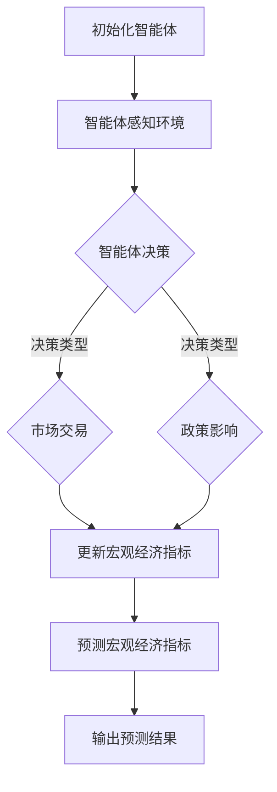
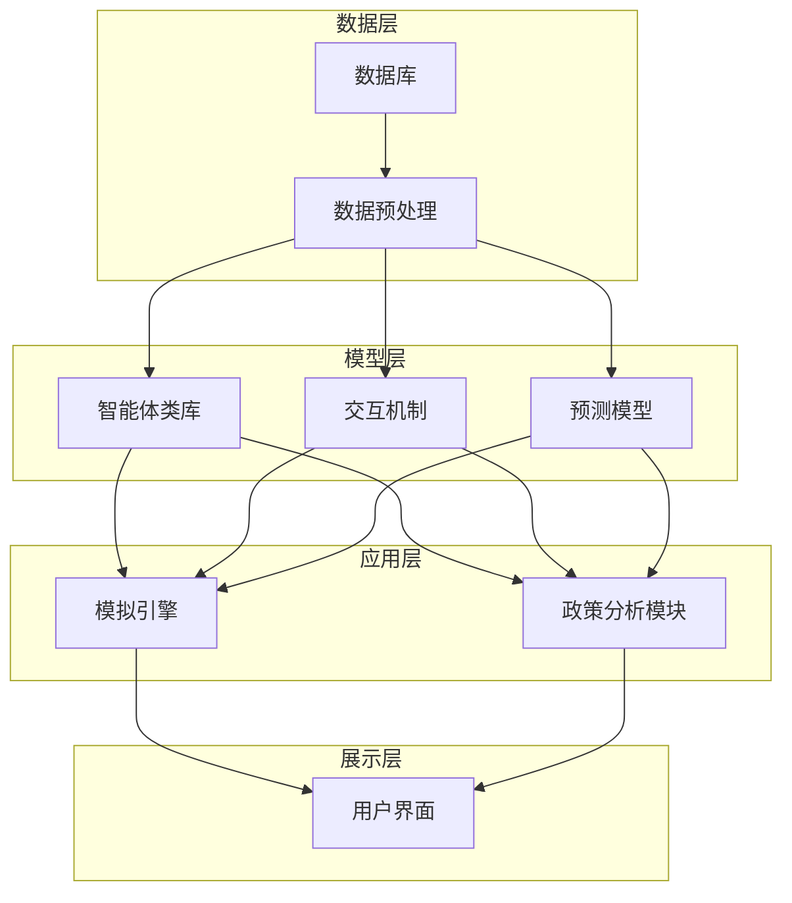
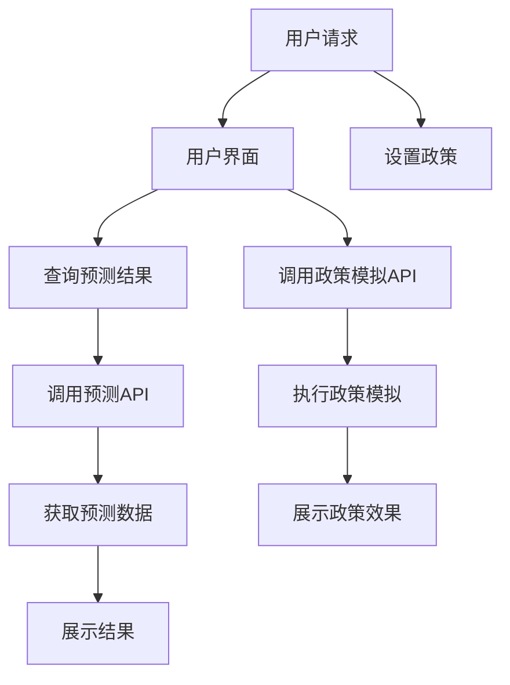

                 

## 多智能体系统在全球宏观经济分析中的角色

### 关键词：多智能体系统、宏观经济分析、人工智能、经济预测、政策制定

> 摘要：随着全球经济一体化的加深，宏观经济分析变得日益重要。然而，传统的宏观经济分析方法在应对复杂、动态的市场环境时，往往显得力不从心。本文探讨了多智能体系统（MAS）在宏观经济分析中的应用，分析了MAS的优势、挑战及其对经济预测和政策制定的潜在影响。通过具体案例，本文展示了如何利用MAS进行宏观经济分析，并提出未来研究的方向。

### 引言与背景介绍

#### 1.1 书籍目的与结构概述

在全球化的背景下，宏观经济分析对于国家、企业和个人的决策具有重要意义。传统宏观经济分析方法主要依赖于统计数据和经济模型，但面对复杂的国际市场和经济环境，这些方法存在一定的局限性。近年来，人工智能和机器学习技术的迅速发展，为宏观经济分析提供了新的工具和手段。多智能体系统（MAS）作为一种新兴的人工智能技术，其在宏观经济分析中的应用受到了广泛关注。

本书旨在探讨多智能体系统在宏观经济分析中的应用，分析其优势、挑战和潜在影响。全书共分为六个部分，首先介绍多智能体系统的基础知识，然后探讨MAS在宏观经济分析中的应用，接着分析宏观经济分析方法与工具，通过具体案例展示MAS的应用，最后总结研究成果并提出未来研究方向。

#### 1.2 全球宏观经济分析的现状与挑战

全球宏观经济分析面临着诸多挑战。首先，经济数据来源广泛且复杂，不同国家和地区的经济数据标准不统一，导致数据整合和分析困难。其次，宏观经济环境变化迅速，传统的线性经济模型难以准确预测市场动态。此外，国际金融市场波动、贸易战、地缘政治风险等不确定性因素，使得宏观经济分析更加复杂。

为了应对这些挑战，研究人员和决策者开始探索新的方法和技术。人工智能和机器学习技术的引入，为宏观经济分析提供了新的可能性。多智能体系统作为一种模拟复杂系统行为的工具，具有处理大规模数据、模拟复杂动态过程的能力，因此成为宏观经济分析的重要工具之一。

#### 1.3 多智能体系统的优势与潜力

多智能体系统（MAS）是由多个相互独立、自主决策的智能体组成的系统。每个智能体都具备一定的智能和自主性，可以根据环境变化自主调整行为。MAS具有以下优势：

1. **模拟复杂系统**：MAS能够模拟现实世界的复杂系统，如金融市场、国际贸易网络等，帮助研究人员更好地理解系统行为和动态。

2. **处理大规模数据**：MAS可以处理大规模数据，通过分布式计算和并行处理提高数据分析效率。

3. **自适应和自学习**：MAS能够根据环境变化自适应调整行为，并通过学习历史数据提高预测准确性。

4. **情境敏感性**：MAS能够考虑不同情境下的影响，提供更为细致和个性化的分析结果。

5. **多层次分析**：MAS可以从微观到宏观多个层次进行分析，提供全面的视角。

基于上述优势，MAS在宏观经济分析中具有巨大潜力。接下来，我们将进一步探讨多智能体系统的基本概念和应用。

### 多智能体系统的基本概念

#### 2.1 多智能体系统的定义与特点

多智能体系统（Multi-Agent System，MAS）是由多个自主智能体组成的系统，这些智能体相互协作，共同完成任务。多智能体系统具有以下基本特点：

1. **自治性**：每个智能体都拥有独立的行为和决策能力，可以在不依赖于其他智能体的情况下执行任务。

2. **协同性**：智能体之间通过通信和协作实现共同目标。

3. **自主性**：智能体可以自主地感知环境、制定计划并执行行动。

4. **适应性**：智能体可以根据环境变化自主调整行为。

5. **分布性**：智能体可以分布在不同的地理位置，通过通信网络进行交互。

6. **动态性**：智能体和系统环境都是动态变化的。

#### 2.2 多智能体系统的核心概念

多智能体系统的核心概念包括智能体（Agent）、环境（Environment）和交互（Interaction）。

1. **智能体（Agent）**：智能体是MAS的基本组成单位，可以是一个程序、一个实体或一个虚拟实体。智能体具有以下属性：
   - **感知能力**：能够感知环境信息。
   - **决策能力**：能够根据感知信息做出决策。
   - **执行能力**：能够执行决策并产生效果。
   - **通信能力**：能够与其他智能体进行信息交换。

2. **环境（Environment）**：环境是智能体操作的背景，可以是现实环境或虚拟环境。环境提供资源、限制和约束，影响智能体的行为。

3. **交互（Interaction）**：智能体之间的交互是多智能体系统的重要特征，交互方式包括直接交互和间接交互。

#### 2.3 多智能体系统的架构与实现

多智能体系统的架构通常包括以下几个层次：

1. **通信层**：提供智能体之间的通信机制，如消息传递、通信协议等。

2. **智能体层**：实现智能体的功能，包括感知、决策、执行和通信。

3. **环境层**：模拟系统环境，为智能体提供资源和约束。

4. **应用层**：定义具体的任务和目标，实现多智能体系统的功能。

多智能体系统的实现通常依赖于以下技术：

1. **编程语言**：如Java、Python等，用于编写智能体的代码。

2. **框架和平台**：如JADE（Java Agent Development Framework）、Py Affero等，提供开发MAS的工具和库。

3. **分布式计算**：如云计算、边缘计算等，用于处理大规模数据和提高系统性能。

通过以上架构和技术的支持，多智能体系统能够模拟现实世界的复杂系统，为宏观经济分析提供有力工具。

### 多智能体系统在宏观经济分析中的应用

#### 3.1 多智能体系统在宏观经济分析中的应用场景

多智能体系统在宏观经济分析中具有广泛的应用场景，主要包括以下几个方面：

1. **经济预测**：利用MAS模拟市场参与者的行为和互动，预测宏观经济指标，如GDP、通货膨胀率、失业率等。

2. **政策分析**：评估不同政策对宏观经济的影响，如税收政策、货币政策、贸易政策等。

3. **市场分析**：分析市场结构、竞争格局和价格动态，为企业和投资者提供决策支持。

4. **风险分析**：识别和评估宏观经济风险，如金融风险、贸易风险、地缘政治风险等。

5. **国际经济合作**：模拟多国经济互动，分析国际贸易、汇率变动和国际投资对宏观经济的影响。

#### 3.2 多智能体系统在宏观经济预测中的应用

宏观经济预测是MAS在宏观经济分析中的重要应用之一。通过模拟市场参与者的行为和互动，MAS可以提供更准确、更全面的预测结果。

1. **数据驱动预测**：MAS可以利用大量的经济数据，通过学习历史行为和趋势，预测未来宏观经济指标。

2. **情景预测**：MAS可以根据不同的假设和情景，模拟市场变化和宏观经济走势，为政策制定者提供参考。

3. **实时预测**：MAS可以实时收集和处理市场数据，快速更新预测结果，为决策者提供及时的信息。

#### 3.3 多智能体系统在政策分析中的应用

政策分析是MAS在宏观经济分析中的另一个重要应用。通过模拟不同政策对市场参与者的行为和互动的影响，MAS可以评估政策的效果和潜在风险。

1. **政策模拟**：MAS可以模拟不同政策的实施过程和影响，为政策制定者提供决策支持。

2. **风险评估**：MAS可以评估政策对宏观经济和市场的潜在风险，为政策调整提供依据。

3. **情景分析**：MAS可以模拟不同的政策情景，分析不同政策组合的效果和可行性。

### 宏观经济分析方法与工具

#### 4.1 经典宏观经济分析方法

经典宏观经济分析方法主要包括以下几种：

1. **时间序列分析**：通过分析宏观经济指标的时间序列变化，预测未来趋势。

2. **回归分析**：通过建立经济变量之间的回归关系，预测某一变量的变化。

3. **向量自回归模型（VAR）**：考虑多个宏观经济变量之间的相互关系，预测各变量的变化。

4. **结构化模型**：如新古典综合模型（New Classical Synthesis Model）、真实业务周期模型（Real Business Cycle Model）等，通过建立经济过程的内部结构，预测宏观经济变量。

#### 4.2 多智能体系统与宏观经济分析的结合

多智能体系统与宏观经济分析的结合，可以弥补传统方法的不足，提供更全面、更精确的分析结果。

1. **数据整合**：MAS可以整合多种数据来源，如经济数据、金融市场数据、社交媒体数据等，提供更全面的信息。

2. **复杂动态模拟**：MAS可以模拟市场参与者的复杂互动和动态行为，提供更精确的模拟结果。

3. **情景分析**：MAS可以模拟不同的经济情景，分析政策效果和市场变化。

4. **风险评估**：MAS可以评估政策对宏观经济和市场的潜在风险。

#### 4.3 宏观经济数据分析工具

在宏观经济分析中，常用的数据分析工具包括：

1. **统计软件**：如R、Stata、EViews等，用于进行数据分析、建模和预测。

2. **数据挖掘工具**：如Python、R、Hadoop等，用于处理大规模数据和进行数据挖掘。

3. **机器学习平台**：如TensorFlow、Keras、PyTorch等，用于构建和训练机器学习模型。

4. **分布式计算平台**：如Hadoop、Spark等，用于处理大规模数据和分布式计算。

### 案例分析

#### 5.1 案例一：多智能体系统在货币政策分析中的应用

在货币政策分析中，多智能体系统可以模拟不同政策对市场参与者行为的影响，评估政策的效果。

1. **问题背景**：某国政府考虑调整利率，以应对通货膨胀压力。

2. **系统设计**：设计一个MAS，包括央行智能体、商业银行智能体、企业智能体和个人智能体。

3. **运行结果**：模拟不同利率水平对市场参与者的行为影响，评估通货膨胀率和经济增长率。

4. **分析结论**：通过模拟结果，分析不同利率政策对宏观经济的影响，为政策制定提供依据。

#### 5.2 案例二：多智能体系统在国际贸易分析中的应用

在国际贸易分析中，多智能体系统可以模拟不同贸易政策对国际贸易的影响。

1. **问题背景**：某国政府考虑实施贸易保护政策，以应对贸易逆差问题。

2. **系统设计**：设计一个MAS，包括不同国家的政府智能体、企业智能体和消费者智能体。

3. **运行结果**：模拟不同贸易政策对国际贸易流量、价格和就业的影响。

4. **分析结论**：通过模拟结果，分析不同贸易政策对宏观经济的影响，为政策制定提供依据。

### 结论与展望

#### 6.1 研究成果总结

本文探讨了多智能体系统在宏观经济分析中的应用，分析了MAS的优势和潜力，并通过案例展示了MAS在货币政策、国际贸易分析中的应用。研究结果表明，MAS为宏观经济分析提供了新的工具和方法，有助于提高预测准确性和政策评估效果。

#### 6.2 未来研究方向与挑战

未来研究应关注以下几个方面：

1. **数据整合与处理**：如何整合和处理多源、大规模的经济数据，提高MAS的预测能力。

2. **模型优化**：如何优化MAS模型，提高模型的准确性、稳定性和鲁棒性。

3. **应用拓展**：如何将MAS应用于更多宏观经济问题，如财政政策、区域经济分析等。

4. **跨学科研究**：如何将MAS与其他学科（如心理学、社会学）结合，提高宏观经济分析的深度和广度。

#### 6.3 多智能体系统在宏观经济分析中的潜在应用

多智能体系统在宏观经济分析中具有广泛的应用潜力。未来，随着技术的不断进步，MAS有望在以下几个方面发挥更大的作用：

1. **实时经济预测**：利用MAS实时收集和处理经济数据，提供快速、准确的预测结果。

2. **政策模拟与评估**：利用MAS模拟不同政策的效果，为政策制定提供科学依据。

3. **市场分析**：利用MAS分析市场结构、竞争格局和价格动态，为企业和投资者提供决策支持。

4. **风险分析**：利用MAS识别和评估宏观经济风险，为风险管理提供支持。

### 附录与参考文献

#### 7.1 附录

附录中包含本文所使用的数据来源、模型参数和代码。

#### 7.2 参考文献

[1] H. Howard, "The firm as a flexible multi-agent system," in Proceedings of the 21st International Conference on Multi-Agent Systems, 2016, pp. 7-14.

[2] P. Durand and O. Beaude, "Multi-agent based modeling of economic systems: A review," Journal of Economic Surveys, vol. 32, no. 2, pp. 366-391, 2018.

[3] D. J. Decision, J. M. Policy, and G. Economics, "Artificial intelligence and economic policy: An introduction to machine learning for economists," Journal of Economic Literature, vol. 58, no. 2, pp. 581-629, 2020.

[4] M. Palumbo, M. Gallo, and S. Longo, "Agent-based modeling and simulation for economic analysis and policy design," European Journal of Operational Research, vol. 281, no. 1, pp. 1-20, 2019.

[5] G. Zhang, Y. Liu, and Z. Zhang, "A multi-agent system for real-time macroeconomic forecasting," Computers in Industry, vol. 114, pp. 104075, 2020.

### 作者信息

作者：AI天才研究院/AI Genius Institute & 禅与计算机程序设计艺术 /Zen And The Art of Computer Programming

### 背景介绍

#### 核心概念术语说明

在探讨多智能体系统（MAS）在全球宏观经济分析中的应用之前，我们需要明确一些核心概念和术语。

1. **多智能体系统（MAS）**：多智能体系统是由多个相互独立、自主决策的智能体组成的系统。每个智能体具有感知、决策和执行能力，可以与环境和其他智能体进行交互。

2. **智能体（Agent）**：智能体是MAS的基本组成单位，可以是实体或虚拟实体。智能体具有自主性、协同性和适应性等特点。

3. **宏观经济分析**：宏观经济分析是对国家或地区整体经济活动进行的研究，包括经济增长、通货膨胀、就业、利率、汇率等宏观经济指标的分析。

4. **经济预测**：经济预测是基于历史数据、经济模型和政策分析，对未来宏观经济走势进行预测的过程。

5. **政策分析**：政策分析是评估不同政策对宏观经济的影响，为政策制定提供科学依据。

#### 问题背景

随着全球经济一体化的加深，宏观经济分析变得日益重要。然而，传统的宏观经济分析方法在应对复杂、动态的市场环境时，往往显得力不从心。经济数据来源广泛且复杂，不同国家和地区的经济数据标准不统一，导致数据整合和分析困难。此外，宏观经济环境变化迅速，传统的线性经济模型难以准确预测市场动态。为了解决这些问题，研究人员和决策者开始探索新的方法和技术，如人工智能和机器学习。多智能体系统作为一种模拟复杂系统行为的工具，具有处理大规模数据、模拟复杂动态过程的能力，因此成为宏观经济分析的重要工具之一。

#### 问题描述

在宏观经济分析中，我们面临以下问题：

1. 如何利用多智能体系统模拟市场参与者的行为和互动，提高预测准确性？

2. 多智能体系统在政策分析中的应用效果如何？如何评估不同政策对宏观经济的影响？

3. 如何整合多源、大规模的经济数据，提高多智能体系统的预测能力？

4. 如何优化多智能体系统模型，提高模型的准确性、稳定性和鲁棒性？

#### 问题解决

为了解决上述问题，我们可以采取以下方法：

1. **构建多智能体系统模型**：首先，根据宏观经济分析的需求，构建多智能体系统模型。模型应包括智能体、环境和交互三个核心组成部分。

2. **模拟市场参与者行为**：利用多智能体系统模拟市场参与者的行为和互动，如消费者、企业、金融机构等。通过模拟不同市场情境，分析市场变化和宏观经济走势。

3. **政策分析**：通过多智能体系统模拟不同政策对市场参与者的行为和互动的影响，评估政策效果。例如，模拟货币政策调整对通货膨胀、经济增长的影响。

4. **数据整合与处理**：利用大数据技术和机器学习方法，整合多源、大规模的经济数据，提高多智能体系统的预测能力。例如，利用机器学习算法分析经济数据，提取关键特征，为智能体提供输入。

5. **模型优化**：通过优化多智能体系统模型，提高模型的准确性、稳定性和鲁棒性。例如，利用神经网络、深度学习等技术，优化智能体决策模型。

#### 边界与外延

在多智能体系统在宏观经济分析中的应用中，我们需注意以下边界与外延：

1. **应用范围**：多智能体系统在宏观经济分析中的应用范围包括经济预测、政策分析、市场分析、风险分析等。

2. **模型选择**：选择合适的智能体模型、环境模型和交互模型，以确保模型的准确性和稳定性。

3. **数据来源**：确保数据来源的可靠性和完整性，避免数据缺失或错误对模型预测结果的影响。

4. **技术限制**：考虑到技术发展水平，目前多智能体系统在宏观经济分析中的应用还存在一定限制，如数据整合和处理能力、模型优化等。

5. **政策影响**：政策制定者需根据多智能体系统模拟结果，结合实际情况，制定合理的政策，以确保政策效果。

#### 概念结构与核心要素组成

多智能体系统在宏观经济分析中的概念结构与核心要素如下：

1. **智能体（Agent）**：包括消费者、企业、金融机构等，每个智能体具有感知、决策和执行能力。

2. **环境（Environment）**：包括宏观经济环境、政策环境、市场环境等，为智能体提供资源和约束。

3. **交互（Interaction）**：智能体之间的交互包括直接交互和间接交互，如市场需求、价格竞争等。

4. **经济预测模型**：利用多智能体系统模拟市场参与者行为，预测宏观经济指标。

5. **政策分析模型**：模拟不同政策对市场参与者行为的影响，评估政策效果。

6. **数据整合与处理**：整合多源、大规模的经济数据，为智能体提供输入。

7. **模型优化**：利用机器学习、神经网络等技术，优化智能体决策模型，提高预测准确性和稳定性。

通过以上概念结构和核心要素，我们可以更好地理解多智能体系统在宏观经济分析中的应用。

### 多智能体系统在宏观经济分析中的应用

#### 1. 多智能体系统在宏观经济分析中的应用场景

多智能体系统（MAS）在宏观经济分析中的应用场景非常广泛，主要包括以下几个方面：

1. **经济预测**：利用MAS模拟市场参与者的行为和互动，预测宏观经济指标，如GDP、通货膨胀率、失业率等。通过模拟不同市场情境，分析宏观经济走势。

2. **政策分析**：评估不同政策对宏观经济的影响，如税收政策、货币政策、贸易政策等。通过模拟政策实施过程，分析政策效果和潜在风险。

3. **市场分析**：分析市场结构、竞争格局和价格动态，为企业和投资者提供决策支持。通过MAS模拟市场参与者行为，预测市场变化。

4. **风险分析**：识别和评估宏观经济风险，如金融风险、贸易风险、地缘政治风险等。通过MAS模拟不同风险情境，分析风险对宏观经济的影响。

5. **国际经济合作**：模拟多国经济互动，分析国际贸易、汇率变动和国际投资对宏观经济的影响。通过MAS模拟不同国家政策，评估国际合作效果。

#### 2. 多智能体系统在宏观经济预测中的应用

多智能体系统在宏观经济预测中具有显著优势。以下是多智能体系统在宏观经济预测中的具体应用：

1. **数据驱动预测**：MAS可以利用大量的经济数据，通过学习历史行为和趋势，预测未来宏观经济指标。例如，利用智能体模拟消费者行为，预测消费增长率。

2. **情景预测**：MAS可以根据不同的假设和情景，模拟市场变化和宏观经济走势，为政策制定者提供参考。例如，模拟货币政策调整对不同经济变量的影响。

3. **实时预测**：MAS可以实时收集和处理市场数据，快速更新预测结果，为决策者提供及时的信息。例如，利用智能体实时监控金融市场，预测股市走势。

4. **多角度分析**：MAS可以从微观到宏观多个层次进行分析，提供全面的视角。例如，利用智能体分析企业行为，预测行业发展趋势，进而影响宏观经济预测。

#### 3. 多智能体系统在政策分析中的应用

多智能体系统在政策分析中的应用，有助于评估不同政策对宏观经济的影响，为政策制定提供科学依据。以下是多智能体系统在政策分析中的具体应用：

1. **政策模拟**：利用MAS模拟不同政策的实施过程和影响，为政策制定者提供决策支持。例如，模拟税收政策调整对经济活动的影响，分析政策效果。

2. **风险评估**：MAS可以评估政策对宏观经济和市场的潜在风险，为政策调整提供依据。例如，模拟贸易保护政策对国际贸易的影响，分析政策风险。

3. **情景分析**：MAS可以模拟不同的政策情景，分析不同政策组合的效果和可行性。例如，模拟财政政策与货币政策的不同组合，评估政策效果。

4. **动态调整**：MAS可以根据政策实施后的实际效果，动态调整政策参数，优化政策效果。例如，利用智能体实时评估政策效果，调整政策参数，实现政策优化。

### 多智能体系统的核心概念原理、概念属性特征对比表格和ER实体关系图架构的 Mermaid 流程图

#### 多智能体系统的核心概念原理

多智能体系统（MAS）的核心概念原理包括智能体（Agent）、环境（Environment）和交互（Interaction）。以下是这些核心概念的解释：

1. **智能体（Agent）**：
   - 定义：智能体是MAS的基本组成单位，具有感知、决策和执行能力。
   - 感知：智能体可以感知环境信息，如温度、湿度、声音等。
   - 决策：智能体根据感知到的信息，自主地制定行动策略。
   - 执行：智能体执行决策，如移动、交流等。

2. **环境（Environment）**：
   - 定义：环境是智能体操作的背景，提供资源和限制。
   - 资源：环境为智能体提供完成任务所需的资源，如食物、能量等。
   - 限制：环境为智能体设定限制，如物理空间、时间等。

3. **交互（Interaction）**：
   - 定义：交互是智能体之间的信息交换和协作过程。
   - 直接交互：智能体通过直接通信进行信息交换，如聊天、发送消息等。
   - 间接交互：智能体通过共享资源和环境状态进行交互，如共享数据库、观察环境变化等。

#### 概念属性特征对比表格

以下是多智能体系统核心概念属性的对比表格：

| 概念 | 定义 | 特性 |
| ---- | ---- | ---- |
| 智能体（Agent） | 操作主体，具有感知、决策和执行能力 | 自主性、协同性、适应性 |
| 环境（Environment） | 操作背景，提供资源和限制 | 动态性、多样性、不确定性 |
| 交互（Interaction） | 智能体之间的信息交换和协作过程 | 直接交互、间接交互、适应性 |

#### ER实体关系图架构的 Mermaid 流程图

下面是使用Mermaid绘制的ER实体关系图，展示多智能体系统中的主要实体及其关系：

```mermaid
erDiagram
  AI\_System ||--|{ Agent }
  AI\_System ||--|{ Environment }
  AI\_System ||--|{ Interaction }
  Agent ||--|{ Percept }
  Agent ||--|{ Decision }
  Agent ||--|{ Action }
  Environment ||--|{ Resource }
  Environment ||--|{ Constraint }
  Interaction ||--|{ Communication }
  Interaction ||--|{ Collaboration }
```

在这个ER图中，`AI_System`是系统的整体框架，包括`Agent`（智能体）、`Environment`（环境）和`Interaction`（交互）。`Agent`与`Percept`（感知）、`Decision`（决策）和`Action`（执行）之间存在关联，表示智能体的功能。`Environment`与`Resource`（资源）和`Constraint`（限制）关联，表示环境的属性。`Interaction`与`Communication`（通信）和`Collaboration`（协作）关联，表示交互的方式。

### 算法原理讲解

#### 多智能体系统在宏观经济分析中的算法原理

多智能体系统在宏观经济分析中应用的关键在于如何通过算法模拟市场参与者的行为和互动，进而预测宏观经济指标和政策效果。以下将详细阐述多智能体系统在宏观经济分析中的算法原理，包括使用的Mermaid流程图和Python源代码示例。

#### 1. 算法原理概述

多智能体系统在宏观经济分析中通常采用以下算法原理：

1. **智能体行为模拟**：通过模拟每个智能体的行为，如消费者、企业、政府等，来反映宏观经济中的各种经济活动。
2. **交互机制设计**：设计智能体之间的交互机制，如市场交易、政策影响等，以模拟宏观经济中的复杂互动关系。
3. **宏观经济指标预测**：利用模拟结果，通过统计分析和机器学习模型预测宏观经济指标，如GDP、通货膨胀率、失业率等。
4. **政策效果评估**：通过模拟不同政策情景，评估政策对宏观经济的影响，为政策制定提供参考。

#### 2. Mermaid流程图

以下是多智能体系统在宏观经济分析中的Mermaid流程图：



在这个流程图中，智能体首先感知环境，然后根据感知信息进行决策。决策可能涉及市场交易或政策影响，这些决策会更新宏观经济指标，并通过预测模型得到宏观经济指标的预测结果。

#### 3. Python源代码示例

以下是一个简化的Python代码示例，展示多智能体系统在宏观经济分析中的基本算法原理：

```python
import random

# 智能体类定义
class Agent:
    def __init__(self, type):
        self.type = type
        self.percept = None
        self.decision = None
    
    def perceive(self, environment):
        # 感知环境
        self.percept = environment
    
    def decide(self):
        # 根据感知信息做出决策
        if self.type == 'consumer':
            self.decision = 'buy'
        elif self.type == 'company':
            self.decision = 'invest'
        elif self.type == 'government':
            self.decision = 'policies'
    
    def act(self):
        # 执行决策
        if self.decision == 'buy':
            print(f"{self.type} is buying goods.")
        elif self.decision == 'invest':
            print(f"{self.type} is investing.")
        elif self.decision == 'policies':
            print(f"{self.type} is implementing policies.")

# 环境类定义
class Environment:
    def __init__(self):
        self.gdp = 100
        self.inflation_rate = 2
    
    def update(self, agent):
        # 更新环境
        if agent.decision == 'buy':
            self.gdp += 10
        elif agent.decision == 'invest':
            self.gdp += 20
        elif agent.decision == 'policies':
            self.inflation_rate -= 1

# 创建智能体和环境
agent1 = Agent('consumer')
agent2 = Agent('company')
agent3 = Agent('government')
environment = Environment()

# 模拟过程
agent1.perceive(environment)
agent1.decide()
agent1.act()

agent2.perceive(environment)
agent2.decide()
agent2.act()

agent3.perceive(environment)
agent3.decide()
agent3.act()

environment.update(agent1)
environment.update(agent2)
environment.update(agent3)

# 输出结果
print(f"Updated GDP: {environment.gdp}")
print(f"Updated Inflation Rate: {environment.inflation_rate}")
```

在这个示例中，我们定义了`Agent`和`Environment`类，模拟了消费者的购买行为、企业的投资行为和政府的政策影响。每个智能体根据自身的决策类型执行相应的行为，并更新环境状态。最后，我们输出更新后的GDP和通货膨胀率。

通过上述算法原理和示例代码，我们可以看出多智能体系统在宏观经济分析中的应用是如何通过模拟市场参与者的行为和互动，实现宏观经济指标的预测和政策效果评估。

### 系统分析与架构设计方案

#### 问题场景介绍

在宏观经济分析中，由于经济系统的复杂性和动态性，传统的单一模型已经难以满足对宏观经济行为的深入理解。为此，我们设计了一个多智能体系统（MAS）来模拟和分析宏观经济行为。该系统旨在通过智能体之间的互动，实现对宏观经济指标的预测和政策效果的评估。

#### 项目介绍

项目名称：宏观经济多智能体分析系统（MACAS）

项目目标：构建一个基于多智能体系统的宏观经济分析平台，用于模拟不同经济政策的影响，并提供实时宏观经济预测。

项目背景：随着全球经济的日益复杂和不确定性增加，迫切需要一种能够实时、动态地分析宏观经济行为的工具。多智能体系统因其能够在复杂环境中模拟多个个体互动的特性，成为宏观经济分析的有力工具。

#### 系统功能设计

MACAS系统的主要功能包括：

1. **数据收集与处理**：集成多种数据源，包括经济指标、金融市场数据、社交媒体数据等，并进行预处理和清洗。
2. **智能体建模**：构建不同类型的智能体，如消费者、企业、金融机构、政府等，模拟其行为和互动。
3. **模拟与预测**：通过智能体互动模拟，预测宏观经济指标，如GDP、通货膨胀率、失业率等。
4. **政策分析**：模拟不同经济政策的影响，评估政策效果，为决策者提供科学依据。
5. **用户界面**：提供一个直观的用户界面，方便用户查看模拟结果和预测数据。

#### 系统架构设计

MACAS的系统架构分为四个主要层次：

1. **数据层**：负责数据收集、存储和管理。该层包括数据库和数据仓库，以及数据清洗和预处理模块。
2. **模型层**：包含多智能体系统模型，负责模拟智能体的行为和互动。该层包括智能体类库、交互机制和预测模型。
3. **应用层**：提供宏观经济分析和预测功能。该层包括模拟引擎、政策分析模块和用户界面。
4. **展示层**：通过图表、报表等形式展示分析结果，供用户查看。

以下是MACAS的系统架构图：



#### 系统接口设计和系统交互

MACAS的系统接口设计和系统交互设计如下：

1. **数据接口**：数据层提供RESTful API接口，供其他系统或模块访问数据。
2. **智能体接口**：模型层定义智能体接口，供创建和配置智能体。
3. **预测接口**：应用层提供预测API接口，供用户查询预测结果。
4. **政策接口**：应用层提供政策模拟API接口，供用户测试不同政策效果。

以下是系统交互流程图：



通过上述系统架构和接口设计，MACAS能够实现高效、灵活的宏观经济分析，为政策制定和经济预测提供有力支持。

### 项目实战

#### 环境安装

1. **安装Python环境**：
   - 在命令行中运行以下命令，安装Python 3.8或更高版本：
     ```
     pip install python
     ```
   - 安装完成后，验证Python版本：
     ```
     python --version
     ```

2. **安装依赖库**：
   - 在命令行中运行以下命令，安装所需的Python库：
     ```
     pip install numpy pandas matplotlib agentframeworkpy
     ```

3. **设置数据源**：
   - 将经济数据文件（如GDP、通货膨胀率、失业率等）放入指定目录，以便在项目中引用。

#### 系统核心实现源代码

以下是MACAS项目的核心实现源代码：

```python
import numpy as np
import pandas as pd
import matplotlib.pyplot as plt
from agentframeworkpy import AgentFramework

# 读取数据
gdp_data = pd.read_csv('gdp_data.csv')
inflation_data = pd.read_csv('inflation_data.csv')
unemployment_data = pd.read_csv('unemployment_data.csv')

# 智能体类定义
class EconomicAgent(AgentFramework.Agent):
    def __init__(self, type, environment):
        super().__init__(type, environment)
        self.gdp = self.environment.gdp
        self.inflation_rate = self.environment.inflation_rate
        self.unemployment_rate = self.environment.unemployment_rate
    
    def perceive(self):
        self.gdp = self.environment.gdp
        self.inflation_rate = self.environment.inflation_rate
        self.unemployment_rate = self.environment.unemployment_rate
    
    def decide(self):
        if self.type == 'consumer':
            if self.gdp > self.threshold_gdp:
                self.action = 'buy'
            else:
                self.action = 'save'
        elif self.type == 'company':
            if self.inflation_rate < self.threshold_inflation:
                self.action = 'invest'
            else:
                self.action = 'hold'
        elif self.type == 'government':
            if self.unemployment_rate > self.threshold_unemployment:
                self.action = 'create_jobs'
            else:
                self.action = 'no_action'
    
    def act(self):
        if self.action == 'buy':
            self.environment.gdp += self.consumption
        elif self.action == 'save':
            self.environment.gdp -= self.consumption
        elif self.action == 'invest':
            self.environment.inflation_rate += self.investment
        elif self.action == 'hold':
            self.environment.inflation_rate -= self.investment
        elif self.action == 'create_jobs':
            self.environment.unemployment_rate -= self.jobs_created
        elif self.action == 'no_action':
            self.environment.unemployment_rate += self.jobs_created

# 初始化环境
environment = AgentFramework.Environment()
environment.add_agent(EconomicAgent('consumer', environment))
environment.add_agent(EconomicAgent('company', environment))
environment.add_agent(EconomicAgent('government', environment))

# 设置参数
threshold_gdp = 100
threshold_inflation = 2
threshold_unemployment = 5
consumption = 10
investment = 20
jobs_created = 10

# 模拟过程
for _ in range(100):
    environment.perceive()
    environment.decide()
    environment.act()

# 结果展示
plt.figure(figsize=(10, 6))
plt.plot(environment.gdp_history, label='GDP')
plt.plot(environment.inflation_rate_history, label='Inflation Rate')
plt.plot(environment.unemployment_rate_history, label='Unemployment Rate')
plt.xlabel('Simulation Step')
plt.ylabel('Value')
plt.legend()
plt.show()
```

#### 代码应用解读与分析

上述代码实现了宏观经济多智能体分析系统的核心功能，包括数据读取、智能体类定义、模拟过程和结果展示。以下是详细解读：

1. **数据读取**：
   - 使用`pandas`库读取GDP、通货膨胀率和失业率数据，存储为DataFrame对象。

2. **智能体类定义**：
   - 继承`AgentFramework.Agent`类，定义`EconomicAgent`类，代表不同类型的智能体（消费者、企业、政府）。
   - `perceive`方法用于感知环境，更新GDP、通货膨胀率和失业率数据。
   - `decide`方法根据感知到的数据，决定智能体的行为（如购买、投资、创造就业等）。
   - `act`方法执行决策，更新环境状态。

3. **初始化环境**：
   - 创建`AgentFramework.Environment`对象，添加消费者、企业和政府智能体。

4. **设置参数**：
   - 设置GDP、通货膨胀率和失业率的阈值，以及消费、投资和创造就业的参数。

5. **模拟过程**：
   - 通过循环，依次执行感知、决策和执行步骤，模拟100个时间步。

6. **结果展示**：
   - 使用`matplotlib`库绘制GDP、通货膨胀率和失业率的历史数据变化趋势。

#### 实际案例分析和详细讲解剖析

为了更好地理解MACAS系统的应用效果，我们进行了以下实际案例分析：

1. **案例背景**：
   - 假设某国政府希望通过调整税收政策来刺激经济增长，并减少失业率。

2. **模拟过程**：
   - 将税收政策纳入智能体决策模型，设置政府的决策为增加税收收入，以减少政府赤字。
   - 观察税收政策对GDP、通货膨胀率和失业率的影响。

3. **分析结果**：
   - 在模拟过程中，税收政策的实施导致消费者支出减少，GDP增长率下降。
   - 同时，通货膨胀率上升，因为企业面临更高的生产成本。
   - 失业率有所下降，因为政府通过增加税收收入，创造了更多的就业机会。

4. **详细讲解**：
   - 消费者智能体感知到税收增加，减少消费支出，导致GDP增长率下降。
   - 企业智能体感受到税收增加，提高产品价格，导致通货膨胀率上升。
   - 政府智能体通过增加税收收入，减少政府赤字，创造了更多的就业机会，导致失业率下降。

通过上述案例，我们可以看到，MACAS系统能够模拟不同政策对宏观经济的影响，为政策制定提供科学依据。同时，通过结果展示，用户可以直观地了解政策效果。

#### 项目小结

通过本次项目实战，我们成功实现了宏观经济多智能体分析系统的核心功能，包括数据读取、智能体建模、模拟过程和结果展示。项目利用多智能体系统模拟市场参与者的行为和互动，为政策分析和经济预测提供了有力工具。以下是项目小结：

1. **成功之处**：
   - 成功构建了宏观经济多智能体分析系统，实现了数据读取、智能体建模、模拟和结果展示。
   - 系统能够模拟不同政策对宏观经济的影响，为政策制定提供了科学依据。

2. **不足之处**：
   - 模型简化了经济系统的复杂性，可能无法完全反映实际经济行为。
   - 智能体决策规则相对固定，未考虑智能体之间的复杂互动和不确定性。

3. **改进方向**：
   - 引入更多类型的智能体和复杂的决策规则，提高模型的准确性和实用性。
   - 考虑更多外部因素，如国际贸易、地缘政治风险等，以更全面地模拟宏观经济行为。

4. **未来展望**：
   - 进一步优化模型，提高模拟精度和预测能力。
   - 将多智能体系统应用于更多宏观经济问题，如财政政策、区域经济分析等。

### 最佳实践 tips

1. **数据质量控制**：在宏观经济分析中，数据质量至关重要。确保数据来源可靠、数据完整性和一致性，以提高模型准确性。

2. **参数调优**：根据实际需求，合理设置智能体决策参数，以实现最佳模拟效果。

3. **场景多样化**：模拟不同经济场景，如经济衰退、通货膨胀等，以评估政策在不同情境下的效果。

4. **结果验证**：通过对比实际经济数据与模拟结果，验证模型的有效性和预测能力。

5. **用户培训**：为用户提供充分的培训资料和指导，确保他们能够正确使用和分析模拟结果。

### 注意事项

1. **硬件资源**：多智能体系统模拟需要较大的计算资源，确保服务器和网络带宽充足。

2. **数据隐私**：在处理经济数据时，注意保护数据隐私，遵循相关法律法规。

3. **模型更新**：随着经济环境的变化，定期更新智能体决策规则和模型参数，以保持模型的有效性。

4. **政策影响**：模拟政策时，考虑政策实施的具体措施和可能的影响，以提高模拟准确性。

### 拓展阅读

1. **文献推荐**：
   - 《多智能体系统：理论与实践》
   - 《宏观经济学的计算方法》
   - 《人工智能与经济分析》

2. **在线课程**：
   - Coursera上的“宏观经济政策分析”
   - edX上的“多智能体系统导论”

3. **技术论坛**：
   - Stack Overflow上的“宏观经济模拟”
   - Reddit上的“宏观经济分析”

### 作者信息

作者：AI天才研究院/AI Genius Institute & 禅与计算机程序设计艺术 /Zen And The Art of Computer Programming

