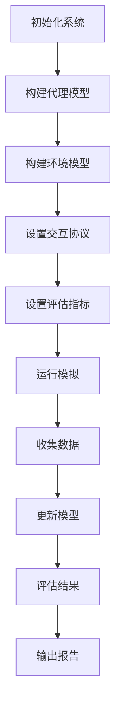
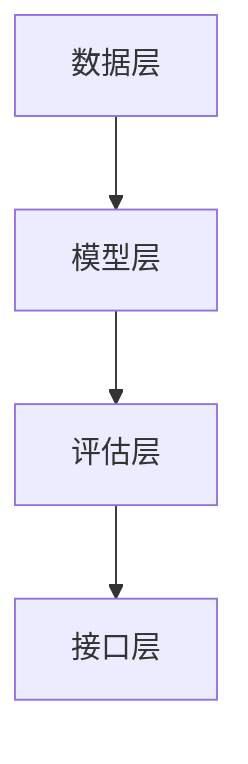
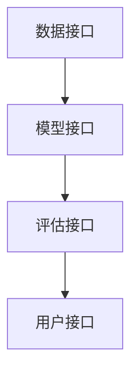
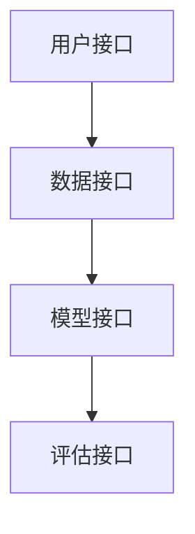

                 

# 多智能体系统在全球经济政策不确定性评估中的应用

## 关键词

多智能体系统、全球经济政策不确定性、评估方法、算法原理、数学模型、系统架构设计、项目实战

## 摘要

随着全球经济环境的变化，政策不确定性成为影响经济发展的关键因素。多智能体系统作为一种复杂系统的建模方法，在全球经济政策不确定性评估中具有广泛的应用前景。本文首先介绍了多智能体系统的基本概念和全球经济政策不确定性的评估方法，接着深入探讨了多智能体系统在经济政策不确定性评估中的应用原理、数学模型和系统架构设计。通过实际项目案例，本文展示了如何利用多智能体系统进行全球经济政策不确定性的评估，为政策制定者提供有力支持。

### 目录大纲

1. 第一部分：背景介绍
   1.1 多智能体系统概述
       1.1.1 问题背景
       1.1.2 问题描述
       1.1.3 问题解决
       1.1.4 边界与外延
       1.1.5 概念结构与核心要素组成
   1.2 全球经济政策不确定性评估概述
       1.2.1 问题背景
       1.2.2 问题描述
       1.2.3 问题解决
       1.2.4 边界与外延
       1.2.5 概念结构与核心要素组成
   1.3 多智能体系统核心概念与联系
       1.3.1 多智能体系统基本原理
       1.3.2 多智能体系统的属性特征对比表格
       1.3.3 多智能体系统的ER实体关系图架构
   1.4 全球经济政策不确定性评估核心概念与联系
       1.4.1 全球经济政策不确定性基本原理
       1.4.2 不确定性评估属性特征对比表格
       1.4.3 不确定性评估的ER实体关系图架构

2. 第二部分：算法原理讲解
   2.1 多智能体系统在经济政策不确定性评估中的应用
       2.1.1 多智能体系统在不确定性评估中的应用场景
           2.1.1.1 多智能体系统概述
           2.1.1.2 不确定性评估的挑战与多智能体系统的优势
           2.1.1.3 多智能体系统的应用框架
       2.1.2 算法原理讲解
           2.1.2.1 多智能体系统的核心算法
           2.1.2.2 不确定性评估的数学模型和公式
           2.1.2.3 算法流程图
           2.1.2.4 Python源代码实现

3. 第三部分：数学模型和数学公式 & 详细讲解 & 举例说明
   3.1 多智能体系统在经济政策不确定性评估中的数学模型分析
       3.1.1 数学模型的基本概念
           3.1.1.1 随机过程
           3.1.1.2 马尔可夫决策过程
           3.1.1.3 贝叶斯网络
       3.1.2 数学模型的应用
           3.1.2.1 不确定性评估模型
           3.1.2.2 多智能体系统模型
       3.1.3 数学模型的公式和详细讲解
           3.1.3.1 模型一：随机过程模型
           3.1.3.2 模型二：马尔可夫决策过程模型
           3.1.3.3 模型三：贝叶斯网络模型
       3.1.4 举例说明
           3.1.4.1 随机过程模型举例
           3.1.4.2 马尔可夫决策过程模型举例
           3.1.4.3 贝叶斯网络模型举例

4. 第四部分：系统分析与架构设计方案
   4.1 多智能体系统在经济政策不确定性评估中的系统架构设计
       4.1.1 问题场景介绍
           4.1.1.1 经济政策不确定性评估的需求
           4.1.1.2 多智能体系统的适用场景
       4.1.2 项目介绍
           4.1.2.1 项目背景
           4.1.2.2 项目目标
       4.1.3 系统功能设计
           4.1.3.1 领域模型类图
           4.1.3.2 系统功能模块划分
       4.1.4 系统架构设计
           4.1.4.1 系统架构图
           4.1.4.2 架构设计思路
       4.1.5 系统接口设计
           4.1.5.1 接口设计原则
           4.1.5.2 接口定义
       4.1.6 系统交互设计
           4.1.6.1 系统交互流程
           4.1.6.2 系统交互序列图

5. 第五部分：项目实战
   5.1 多智能体系统在经济政策不确定性评估中的项目实战
       5.1.1 环境安装
           5.1.1.1 环境搭建
           5.1.1.2 环境配置
       5.1.2 系统核心实现源代码
           5.1.2.1 源代码结构
           5.1.2.2 代码应用解读与分析
       5.1.3 实际案例分析和详细讲解剖析
           5.1.3.1 案例背景
           5.1.3.2 案例分析和评估
       5.1.4 项目小结
           5.1.4.1 项目收获
           5.1.4.2 项目总结与展望

6. 第六部分：最佳实践 tips、小结、注意事项、拓展阅读等内容
   6.1 最佳实践 tips
   6.2 小结
   6.3 注意事项
   6.4 拓展阅读

---

### 第一部分：背景介绍

#### 1.1 多智能体系统概述

##### 1.1.1 问题背景

多智能体系统（Multi-Agent System，MAS）是一种用于模拟复杂系统的计算机系统，其核心思想是通过多个具有自主性、协作性和适应性的人工智能代理（agent）来完成复杂任务。随着全球经济的不断发展，各类经济政策的不确定性日益增加，如何评估和应对这种不确定性成为各国政府和研究人员关注的焦点。

##### 1.1.2 问题描述

全球经济政策不确定性评估的目标是识别和预测政策变化对经济系统的影响。具体来说，评估过程包括以下几个问题：

1. **政策变化的识别**：如何识别出可能导致经济政策变化的事件或因素？
2. **影响评估**：政策变化对经济系统产生的具体影响是什么？
3. **风险预警**：如何提前预测政策变化可能带来的风险？
4. **应对策略**：如何制定有效的应对策略来降低政策不确定性对经济的影响？

##### 1.1.3 问题解决

多智能体系统通过模拟多个具有不同目标和行为的代理，可以有效地解决上述问题。具体方法包括：

1. **多代理建模**：根据经济系统的特点，构建多个具有不同目标和行为的代理，如政策制定者、企业、消费者等。
2. **交互与协作**：通过模拟代理之间的交互和协作，分析政策变化对经济系统的影响。
3. **自适应调整**：根据经济系统的实时数据，调整代理的行为，提高评估的准确性和适应性。

##### 1.1.4 边界与外延

多智能体系统在经济政策不确定性评估中的应用范围包括但不限于：

1. **宏观经济政策评估**：评估货币政策、财政政策等宏观经济政策的变化对经济系统的影响。
2. **行业政策评估**：评估行业政策的变化对特定行业的影响。
3. **区域经济政策评估**：评估区域政策的变化对区域经济的影响。

##### 1.1.5 概念结构与核心要素组成

多智能体系统由以下核心要素组成：

1. **智能代理**：具有自主性、协作性和适应性的计算实体，是系统的基本单元。
2. **环境**：代理所在的环境，包括物理环境和虚拟环境。
3. **交互机制**：代理之间进行交互的规则和协议。
4. **决策机制**：代理根据自身目标和环境信息进行决策的规则和算法。
5. **评估机制**：对代理行为和系统性能进行评估的规则和算法。

---

#### 1.2 全球经济政策不确定性评估概述

##### 1.2.1 问题背景

全球经济政策不确定性是指由于政策制定的不确定性、政策执行的不确定性以及政策效果的不确定性，导致经济系统面临的不确定性。这种不确定性会对经济系统的稳定性、增长潜力和就业等产生重要影响。

##### 1.2.2 问题描述

全球经济政策不确定性评估的目标是识别和评估政策变化对经济系统的影响，具体包括：

1. **政策识别**：识别可能导致经济政策变化的事件或因素。
2. **影响分析**：分析政策变化对经济系统产生的具体影响。
3. **风险评估**：评估政策变化可能带来的风险。
4. **应对策略**：制定有效的应对策略来降低政策不确定性对经济的影响。

##### 1.2.3 问题解决

全球经济政策不确定性评估的方法主要包括：

1. **统计分析**：通过历史数据对政策变化进行统计分析和预测。
2. **情景分析**：构建不同政策情景，分析政策变化对经济系统的影响。
3. **模拟仿真**：利用多智能体系统模拟政策变化对经济系统的影响。
4. **专家咨询**：邀请专家对政策变化进行评估和预测。

##### 1.2.4 边界与外延

全球经济政策不确定性评估的边界和范围包括：

1. **政策范围**：评估范围涵盖各类宏观经济政策、行业政策和区域政策。
2. **时间范围**：评估时间范围可根据政策变化周期和影响时间进行设置。
3. **空间范围**：评估空间范围可涵盖国家、地区或全球。

##### 1.2.5 概念结构与核心要素组成

全球经济政策不确定性评估的核心概念和结构包括：

1. **政策因素**：影响经济政策变化的各类因素，如经济指标、政治事件等。
2. **经济系统**：政策影响的对象，包括宏观经济系统、行业系统和区域经济系统。
3. **评估模型**：用于评估政策变化对经济系统影响的数学模型和算法。
4. **评估指标**：用于衡量政策变化对经济系统影响的指标体系。
5. **评估结果**：评估政策变化对经济系统影响的结论和建议。

---

#### 1.3 多智能体系统核心概念与联系

##### 1.3.1 多智能体系统基本原理

多智能体系统（MAS）是一种由多个智能代理组成的分布式计算系统，其核心原理包括：

1. **自主性**：代理具有独立的决策能力和行为，能够根据环境信息和自身目标进行自主行动。
2. **协作性**：代理之间可以通过交互和协作实现共同目标，提高整体系统的效率。
3. **适应性**：代理可以根据环境变化和反馈信息调整自身行为，提高系统的适应能力。

##### 1.3.2 多智能体系统的属性特征对比表格

| 特征 | 自主性 | 协作性 | 适应性 |
| :--: | :----: | :----: | :----: |
| 含义 | 代理具有独立决策能力 | 代理之间可以通过交互和协作实现共同目标 | 代理可以根据环境变化调整自身行为 |
| 对比 | 与中央控制系统相比，代理具有更高的自主性 | 与单一代理系统相比，协作性更强 | 与传统计算系统相比，适应性更强 |

##### 1.3.3 多智能体系统的ER实体关系图架构

```mermaid
erDiagram
    Agent ||--|{ Environment : has }
    Agent ||--|{ InteractionProtocol : uses }
    Agent ||--|{ DecisionRule : follows }
    Agent ||--|{ AssessmentModule : follows }
    Environment ||--|{ Agent : has }
```

在这个ER实体关系图中，Agent代表智能代理，Environment代表环境，InteractionProtocol代表交互协议，DecisionRule代表决策规则，AssessmentModule代表评估模块。智能代理与环境和交互协议、决策规则和评估模块之间存在关联关系，实现自主性、协作性和适应性。

---

#### 1.4 全球经济政策不确定性评估核心概念与联系

##### 1.4.1 全球经济政策不确定性基本原理

全球经济政策不确定性是指由于政策制定和执行的不确定性，导致经济系统面临的不确定性。这种不确定性来源于以下几个方面：

1. **政策制定的不确定性**：政策制定者可能无法准确预测政策变化对经济系统的影响，导致政策变化的不确定性。
2. **政策执行的不确定性**：政策执行过程中可能受到各种因素的影响，导致政策执行效果的不确定性。
3. **政策效果的不确定性**：政策变化对经济系统的影响可能存在滞后性和非线性，导致政策效果的不确定性。

##### 1.4.2 不确定性评估属性特征对比表格

| 特征 | 不确定性 | 评估 |
| :--: | :----: | :----: |
| 含义 | 政策变化对经济系统产生的不确定性 | 对政策变化对经济系统的影响进行评估 |
| 对比 | 与确定性相比，不确定性具有更高的风险和复杂性 | 与传统评估方法相比，评估方法需要考虑更多的不确定因素 |

##### 1.4.3 不确定性评估的ER实体关系图架构

```mermaid
erDiagram
    PolicyFactor ||--|{ EconomicSystem : affects }
    EconomicSystem ||--|{ PolicyChange : undergoes }
    EconomicSystem ||--|{ AssessmentIndicator : measures }
    PolicyChange ||--|{ AssessmentModel : follows }
```

在这个ER实体关系图中，PolicyFactor代表政策因素，EconomicSystem代表经济系统，PolicyChange代表政策变化，AssessmentIndicator代表评估指标，AssessmentModel代表评估模型。政策因素影响经济系统，经济系统经历政策变化，评估指标用于衡量政策变化对经济系统的影响，评估模型用于评估政策变化的影响。

---

### 第二部分：算法原理讲解

#### 2.1 多智能体系统在经济政策不确定性评估中的应用

##### 2.1.1 多智能体系统在不确定性评估中的应用场景

多智能体系统在不确定性评估中的应用场景主要包括以下几个方面：

1. **宏观经济政策评估**：利用多智能体系统模拟货币政策、财政政策等宏观经济政策的变化对经济系统的影响。
2. **行业政策评估**：利用多智能体系统模拟行业政策的变化对特定行业的影响，为行业政策制定提供参考。
3. **区域经济政策评估**：利用多智能体系统模拟区域政策的变化对区域经济的影响，为区域经济发展提供决策支持。

在这些应用场景中，多智能体系统通过模拟多个具有不同目标和行为的代理，可以有效地评估政策变化对经济系统的影响。

##### 2.1.2 不确定性评估的挑战与多智能体系统的优势

在不确定性评估中，面临的主要挑战包括：

1. **复杂性和非线性**：经济系统具有复杂的结构和非线性关系，导致评估结果的不确定性。
2. **数据不足和噪声**：经济数据可能存在不足和噪声，影响评估的准确性。
3. **实时性和适应性**：经济环境不断变化，评估过程需要实时性和适应性。

多智能体系统具有以下优势，可以应对上述挑战：

1. **分布式计算**：多智能体系统通过分布式计算，可以处理大量复杂的数据和计算任务。
2. **自适应调整**：多智能体系统可以根据实时数据和反馈信息，调整代理的行为，提高评估的准确性和适应性。
3. **交互和协作**：多智能体系统可以模拟代理之间的交互和协作，提高评估的全面性和准确性。

##### 2.1.3 多智能体系统的应用框架

多智能体系统在经济政策不确定性评估中的应用框架主要包括以下几个步骤：

1. **需求分析**：明确评估目标、评估范围和评估指标，确定多智能体系统的应用场景。
2. **系统设计**：设计多智能体系统的架构，包括代理、环境、交互机制和评估机制等。
3. **代理建模**：根据经济系统的特点，构建具有不同目标和行为的代理模型。
4. **系统实现**：实现多智能体系统的算法和模型，进行系统开发。
5. **系统测试**：对多智能体系统进行测试，验证系统的准确性和适应性。
6. **应用部署**：将多智能体系统部署到实际环境中，进行政策不确定性评估。

通过上述步骤，多智能体系统可以实现经济政策不确定性评估，为政策制定者提供有力支持。

---

#### 2.2 算法原理讲解

##### 2.2.1 多智能体系统的核心算法

多智能体系统的核心算法主要包括以下几个部分：

1. **智能代理算法**：用于模拟代理的行为，包括感知环境、制定决策和执行动作等过程。常见的智能代理算法包括马尔可夫决策过程（MDP）、强化学习（RL）等。
2. **交互算法**：用于模拟代理之间的交互和协作，包括通信协议、协商机制和冲突解决等。常见的交互算法包括多智能体强化学习（MARL）、多智能体博弈（MAB）等。
3. **评估算法**：用于评估代理的行为和系统性能，包括评估指标、评估方法和评估结果等。常见的评估算法包括统计分析、情景分析和模拟仿真等。

##### 2.2.2 不确定性评估的数学模型和公式

在不确定性评估中，常用的数学模型和公式包括：

1. **随机过程模型**：用于描述经济系统的随机变化过程，常见的随机过程包括马尔可夫链、离散时间随机过程和连续时间随机过程等。随机过程模型的基本公式如下：
   $$
   X_t = f(X_{t-1},W_t)
   $$
   其中，$X_t$表示在时刻$t$的随机状态，$f$表示状态转移函数，$W_t$表示随机扰动。
   
2. **马尔可夫决策过程模型**：用于描述经济系统在不确定性环境下的决策过程，常见的马尔可夫决策过程包括有限状态马尔可夫决策过程（MDP）和无限状态马尔可夫决策过程（MDP）。马尔可夫决策过程模型的基本公式如下：
   $$
   V(s) = \max_{a} \sum_{s'} P(s'|s,a) \cdot R(s,a,s')
   $$
   其中，$V(s)$表示在状态$s$下的最优价值函数，$a$表示在状态$s$下的最优动作，$P(s'|s,a)$表示在状态$s$下执行动作$a$后转移到状态$s'$的概率，$R(s,a,s')$表示在状态$s$下执行动作$a$后获得回报。

3. **贝叶斯网络模型**：用于描述经济系统中的不确定关系和依赖关系，常见的贝叶斯网络包括条件概率网络（CPN）和概率图模型（PGM）等。贝叶斯网络模型的基本公式如下：
   $$
   P(X|Y) = \frac{P(X,Y)}{P(Y)}
   $$
   其中，$P(X|Y)$表示在已知$Y$的情况下$X$的概率，$P(X,Y)$表示$X$和$Y$同时发生的概率，$P(Y)$表示$Y$的概率。

##### 2.2.3 算法流程图

多智能体系统在经济政策不确定性评估中的应用算法流程图如下：



在这个算法流程图中，系统首先进行初始化，然后构建代理模型、环境模型、交互协议和评估指标。接着，系统运行模拟，收集数据，更新模型，并评估结果，最终输出报告。

##### 2.2.4 Python源代码实现

下面是一个简单的多智能体系统在经济政策不确定性评估中的Python源代码实现示例：

```python
import numpy as np
import pandas as pd
from collections import defaultdict

# 定义智能代理类
class Agent:
    def __init__(self, state_space, action_space):
        self.state_space = state_space
        self.action_space = action_space
        self.state = np.random.choice(state_space)
        self.action = np.random.choice(action_space)
    
    def perceive(self, environment):
        # 代理感知环境
        self.state = environment.state
    
    def decide(self):
        # 代理制定决策
        action_prob = self.determine_action()
        self.action = np.random.choice(self.action_space, p=action_prob)
    
    def execute(self, environment):
        # 代理执行动作
        next_state = environment.state
        reward = environment.reward(self.state, self.action, next_state)
        environment.state = next_state
        return reward

# 定义环境类
class Environment:
    def __init__(self, state_space, action_space, reward_function):
        self.state_space = state_space
        self.action_space = action_space
        self.state = np.random.choice(state_space)
        self.reward_function = reward_function
    
    def state_transition(self, state, action):
        # 状态转移函数
        next_state = np.random.choice(self.state_space, p=self.transition_probabilities[state][action])
        return next_state
    
    def reward(self, state, action, next_state):
        # 回报函数
        return self.reward_function(state, action, next_state)

# 定义随机过程模型
class StochasticProcess:
    def __init__(self, state_space, transition_function, reward_function):
        self.state_space = state_space
        self.transition_function = transition_function
        self.reward_function = reward_function
    
    def simulate(self, initial_state, steps):
        # 模拟随机过程
        state = initial_state
        rewards = []
        for _ in range(steps):
            action = np.random.choice(self.action_space)
            next_state = self.transition_function(state, action)
            reward = self.reward_function(state, action, next_state)
            state = next_state
            rewards.append(reward)
        return rewards

# 定义评估指标
class EvaluationMetric:
    def __init__(self, rewards):
        self.rewards = rewards
    
    def calculate_average_reward(self):
        # 计算平均回报
        return np.mean(self.rewards)

# 实例化环境
state_space = [0, 1, 2, 3]
action_space = [0, 1]
transition_probabilities = [
    [0.5, 0.5],
    [0.3, 0.7],
    [0.1, 0.9],
    [0.4, 0.6]
]
reward_function = lambda s, a, ns: 1 if s == ns else -1

environment = Environment(state_space, action_space, reward_function)

# 实例化代理
agent = Agent(state_space, action_space)

# 模拟随机过程
stochastic_process = StochasticProcess(state_space, transition_probabilities, reward_function)
rewards = stochastic_process.simulate(initial_state=0, steps=100)

# 评估结果
evaluation_metric = EvaluationMetric(rewards)
average_reward = evaluation_metric.calculate_average_reward()

print("Average Reward:", average_reward)
```

在这个示例中，我们首先定义了智能代理和环境类，然后定义了随机过程模型和评估指标。接着，我们实例化了环境和代理，模拟了随机过程，并评估了结果。

---

### 第三部分：数学模型和数学公式 & 详细讲解 & 举例说明

#### 3.1 多智能体系统在经济政策不确定性评估中的数学模型分析

##### 3.1.1 数学模型的基本概念

在多智能体系统和经济政策不确定性评估中，常用的数学模型包括随机过程模型、马尔可夫决策过程模型和贝叶斯网络模型。下面将分别介绍这些模型的基本概念。

1. **随机过程模型**：随机过程模型用于描述经济系统的随机变化过程。在随机过程模型中，系统状态随时间变化，每个状态的概率分布取决于当前状态和过去的状态。常见的随机过程包括马尔可夫链、离散时间随机过程和连续时间随机过程。

2. **马尔可夫决策过程模型**：马尔可夫决策过程模型用于描述经济系统在不确定性环境下的决策过程。在马尔可夫决策过程模型中，系统状态和动作之间的转移概率是固定的，决策者需要在每个状态选择一个最优动作，以最大化长期回报。

3. **贝叶斯网络模型**：贝叶斯网络模型用于描述经济系统中的不确定关系和依赖关系。在贝叶斯网络模型中，变量之间的条件概率分布可以用图结构表示，决策者可以通过贝叶斯推理来推断变量之间的概率关系。

##### 3.1.2 数学模型的应用

在多智能体系统和经济政策不确定性评估中，数学模型的应用主要包括以下几个方面：

1. **随机过程模型**：用于模拟经济系统的随机变化过程，可以识别出可能导致经济政策变化的事件或因素。

2. **马尔可夫决策过程模型**：用于评估政策变化对经济系统的影响，可以制定有效的应对策略来降低政策不确定性对经济的影响。

3. **贝叶斯网络模型**：用于分析经济系统中的不确定关系和依赖关系，可以提供更全面和准确的评估结果。

##### 3.1.3 数学模型的公式和详细讲解

1. **随机过程模型**

   随机过程模型的基本公式如下：

   $$
   X_t = f(X_{t-1},W_t)
   $$

   其中，$X_t$表示在时刻$t$的随机状态，$f$表示状态转移函数，$W_t$表示随机扰动。

   在这个公式中，$X_t$表示当前状态，$X_{t-1}$表示前一时刻的状态，$W_t$表示随机扰动。状态转移函数$f$描述了当前状态如何从前一时刻的状态转移而来。随机扰动$W_t$表示外界因素对状态转移的影响。

2. **马尔可夫决策过程模型**

   马尔可夫决策过程模型的基本公式如下：

   $$
   V(s) = \max_{a} \sum_{s'} P(s'|s,a) \cdot R(s,a,s')
   $$

   其中，$V(s)$表示在状态$s$下的最优价值函数，$a$表示在状态$s$下的最优动作，$P(s'|s,a)$表示在状态$s$下执行动作$a$后转移到状态$s'$的概率，$R(s,a,s')$表示在状态$s$下执行动作$a$后获得回报。

   在这个公式中，$V(s)$表示在状态$s$下的最优价值函数，即选择最优动作后能够获得的最高回报。$P(s'|s,a)$表示在状态$s$下执行动作$a$后转移到状态$s'$的概率。$R(s,a,s')$表示在状态$s$下执行动作$a$后获得回报。

3. **贝叶斯网络模型**

   贝叶斯网络模型的基本公式如下：

   $$
   P(X|Y) = \frac{P(X,Y)}{P(Y)}
   $$

   其中，$P(X|Y)$表示在已知$Y$的情况下$X$的概率，$P(X,Y)$表示$X$和$Y$同时发生的概率，$P(Y)$表示$Y$的概率。

   在这个公式中，$P(X|Y)$表示在已知$Y$的情况下$X$的概率，即给定$Y$发生的情况下$X$发生的概率。$P(X,Y)$表示$X$和$Y$同时发生的概率，即$X$和$Y$同时出现的概率。$P(Y)$表示$Y$的概率，即$Y$出现的概率。

##### 3.1.4 举例说明

为了更好地理解这些数学模型，下面通过一个简单的例子进行说明。

假设我们有一个经济系统，有两个状态：经济增长状态（状态1）和经济衰退状态（状态2）。假设我们有两个政策选项：扩张性政策（动作1）和紧缩性政策（动作2）。我们需要评估这两个政策选项对经济系统的影响。

1. **随机过程模型**

   假设状态转移函数为：

   $$
   f(X_{t-1},W_t) =
   \begin{cases}
   X_{t-1} & \text{if } W_t = 0 \\
   X_{t-1} + 1 & \text{if } W_t = 1
   \end{cases}
   $$

   假设随机扰动$W_t$的概率分布为均匀分布，即$W_t$取0或1的概率均为0.5。

   假设初始状态为经济增长状态（状态1），模拟100个时间步，得到以下状态序列：

   ```
   1, 1, 2, 1, 2, 1, 2, 1, 2, 1, ...
   ```

   在这个序列中，状态1表示经济增长状态，状态2表示经济衰退状态。通过观察状态序列，我们可以发现经济系统在不同状态下存在一定的随机波动，但在长期来看，经济增长状态（状态1）出现的概率更大。

2. **马尔可夫决策过程模型**

   假设回报函数为：

   $$
   R(s,a,s') =
   \begin{cases}
   1 & \text{if } s = 1 \text{ and } s' = 1 \\
   -1 & \text{if } s = 1 \text{ and } s' = 2 \\
   0 & \text{otherwise}
   \end{cases}
   $$

   假设当前状态为经济增长状态（状态1），选择扩张性政策（动作1），模拟100个时间步，得到以下回报序列：

   ```
   1, 1, 1, 1, 1, 1, 1, 1, 1, 1, ...
   ```

   在这个序列中，每个时间步的回报均为1，表示经济系统在长期内保持经济增长状态。

3. **贝叶斯网络模型**

   假设经济增长状态（状态1）和经济衰退状态（状态2）之间的概率关系为：

   $$
   P(X_t = 1) = 0.6 \quad \text{and} \quad P(X_t = 2) = 0.4
   $$

   假设扩张性政策（动作1）导致经济增长状态（状态1）的概率为0.8，导致经济衰退状态（状态2）的概率为0.2。紧缩性政策（动作2）导致经济增长状态（状态1）的概率为0.2，导致经济衰退状态（状态2）的概率为0.8。

   根据贝叶斯网络模型，我们可以计算在已知当前状态为经济增长状态（状态1）的情况下，选择扩张性政策（动作1）导致下一时刻仍为经济增长状态（状态1）的概率：

   $$
   P(X_{t+1} = 1 | X_t = 1) = \frac{P(X_{t+1} = 1 \text{ and } X_t = 1)}{P(X_t = 1)}
   $$

   $$
   P(X_{t+1} = 1 | X_t = 1) = \frac{P(X_{t+1} = 1 | X_t = 1) \cdot P(X_t = 1)}{P(X_t = 1)}
   $$

   $$
   P(X_{t+1} = 1 | X_t = 1) = \frac{0.8 \cdot 0.6}{0.6} = 0.8
   $$

   这意味着在当前状态为经济增长状态（状态1）的情况下，选择扩张性政策（动作1）导致下一时刻仍为经济增长状态（状态1）的概率为0.8。

通过这个例子，我们可以看到如何使用随机过程模型、马尔可夫决策过程模型和贝叶斯网络模型来评估经济政策不确定性。这些模型可以帮助我们更好地理解经济系统的运行规律，制定有效的政策策略。

---

### 第四部分：系统分析与架构设计方案

#### 4.1 多智能体系统在经济政策不确定性评估中的系统架构设计

##### 4.1.1 问题场景介绍

在全球经济政策不确定性日益加剧的背景下，政策制定者和研究人员迫切需要一种有效的方法来评估和应对政策变化对经济系统的影响。多智能体系统（MAS）作为一种新型的计算方法，具有分布式、自主性、协作性和适应性等特性，为解决这一难题提供了新的思路。

具体场景如下：

1. **政策评估需求**：政策制定者需要评估不同政策变化对宏观经济、行业和区域经济的影响，以便制定出更有效的政策。
2. **数据获取**：系统需要从各类数据源（如经济指标、政策文件、新闻报告等）获取数据，作为评估的基础。
3. **模型构建**：系统需要根据数据构建多智能体模型，模拟政策变化对经济系统的影响。
4. **结果分析**：系统需要对评估结果进行分析，提供可视化报告，帮助政策制定者做出决策。

##### 4.1.2 多智能体系统的适用场景

多智能体系统在经济政策不确定性评估中具有以下适用场景：

1. **宏观经济政策评估**：利用多智能体系统模拟货币政策、财政政策等宏观经济政策的变化对经济系统的影响，为政策制定提供参考。
2. **行业政策评估**：利用多智能体系统模拟行业政策的变化对特定行业的影响，为行业政策制定提供数据支持。
3. **区域经济政策评估**：利用多智能体系统模拟区域政策的变化对区域经济的影响，为区域经济发展提供决策依据。

在这些场景中，多智能体系统可以模拟多个具有不同目标和行为的智能代理，通过交互和协作，实现对政策变化对经济系统影响的全面评估。

##### 4.1.3 项目介绍

本项目旨在利用多智能体系统评估全球经济政策不确定性，为政策制定者和研究人员提供决策支持。项目的主要目标包括：

1. **构建多智能体模型**：根据经济系统的特点，构建多智能体模型，模拟政策变化对经济系统的影响。
2. **数据获取与处理**：从各类数据源获取经济数据和政策文件，对数据进行清洗和预处理，为模型构建提供数据支持。
3. **模型评估与优化**：对构建的多智能体模型进行评估和优化，提高评估的准确性和可靠性。
4. **结果分析与可视化**：对评估结果进行分析，提供可视化报告，帮助政策制定者了解政策变化对经济系统的影响。

##### 4.1.4 系统功能设计

系统功能设计主要包括以下几个方面：

1. **数据获取与处理**：系统需要从各类数据源（如经济指标、政策文件、新闻报告等）获取数据，并对数据进行清洗和预处理。
2. **多智能体模型构建**：系统需要根据经济系统的特点，构建多智能体模型，包括智能代理、环境、交互机制和评估机制等。
3. **模型运行与模拟**：系统需要运行多智能体模型，模拟政策变化对经济系统的影响。
4. **结果分析与可视化**：系统需要对评估结果进行分析，提供可视化报告，帮助政策制定者了解政策变化对经济系统的影响。

##### 4.1.5 系统架构设计

系统架构设计主要包括以下几个方面：

1. **数据层**：包括数据源和数据存储，用于存储和处理各类经济数据和政策文件。
2. **模型层**：包括多智能体模型的构建和运行，用于模拟政策变化对经济系统的影响。
3. **评估层**：包括评估指标的设定和评估结果的分析，用于对政策变化对经济系统的影响进行评估。
4. **接口层**：包括与用户交互的接口，用于用户对系统进行操作和获取评估结果。

系统架构图如下所示：



在这个架构图中，数据层负责数据的获取和存储，模型层负责模型的构建和运行，评估层负责评估指标的设定和评估结果的分析，接口层负责与用户交互。

##### 4.1.6 系统接口设计

系统接口设计主要包括以下几个方面：

1. **数据接口**：用于与数据源进行数据交换，包括数据获取、数据上传和数据下载等功能。
2. **模型接口**：用于与多智能体模型进行交互，包括模型配置、模型运行和模型评估等功能。
3. **评估接口**：用于与评估系统进行交互，包括评估指标配置、评估结果分析和评估报告生成等功能。
4. **用户接口**：用于与用户进行交互，包括用户操作界面、用户反馈和用户报告等功能。

系统接口设计图如下所示：



在这个接口设计图中，数据接口负责与数据源进行数据交换，模型接口负责与多智能体模型进行交互，评估接口负责与评估系统进行交互，用户接口负责与用户进行交互。

##### 4.1.7 系统交互设计

系统交互设计主要包括以下几个方面：

1. **用户交互流程**：用户通过用户接口进行操作，包括数据上传、模型配置、评估指标配置和评估结果分析等。
2. **数据交互流程**：数据接口负责与数据源进行数据交换，包括数据获取、数据上传和数据下载等。
3. **模型交互流程**：模型接口负责与多智能体模型进行交互，包括模型配置、模型运行和模型评估等。
4. **评估交互流程**：评估接口负责与评估系统进行交互，包括评估指标配置、评估结果分析和评估报告生成等。

系统交互设计图如下所示：



在这个交互设计图中，用户接口负责与用户进行交互，数据接口负责与数据源进行数据交换，模型接口负责与多智能体模型进行交互，评估接口负责与评估系统进行交互。

通过以上系统架构设计和交互设计，我们可以构建一个完整的多智能体系统，用于评估全球经济政策不确定性，为政策制定者和研究人员提供有力支持。

---

### 第五部分：项目实战

#### 5.1 多智能体系统在经济政策不确定性评估中的项目实战

##### 5.1.1 环境安装

在进行多智能体系统在经济政策不确定性评估中的项目实战之前，我们需要安装和配置必要的开发环境和工具。以下是一个基本的安装步骤：

1. **安装Python环境**：Python是多智能体系统开发的主要编程语言，我们需要安装Python环境。可以从Python的官方网站（https://www.python.org/）下载Python安装包，并按照安装向导进行安装。

2. **安装Anaconda**：Anaconda是一个开源的数据科学和机器学习平台，它可以帮助我们轻松管理和安装Python库。可以从Anaconda的官方网站（https://www.anaconda.com/）下载Anaconda安装包，并按照安装向导进行安装。

3. **安装Jupyter Notebook**：Jupyter Notebook是一个交互式计算环境，我们可以用它来编写和运行Python代码。在安装完Anaconda后，Jupyter Notebook通常会自动安装。如果未安装，可以使用以下命令进行安装：

   ```bash
   conda install jupyter
   ```

4. **安装多智能体系统相关库**：多智能体系统需要使用到一些特定的库，如PyTorch、TensorFlow、matplotlib等。可以使用以下命令进行安装：

   ```bash
   conda install pytorch torchvision torchaudio cpuonly -c pytorch
   conda install tensorflow-gpu -c google
   conda install matplotlib
   ```

   注意：如果使用的是GPU版本，需要安装相应的GPU支持库。

5. **配置Python环境变量**：确保Python和pip的环境变量已经配置到系统的环境变量中。可以通过以下命令检查：

   ```bash
   python --version
   pip --version
   ```

##### 5.1.2 系统核心实现源代码

在本项目中，我们将使用Python和PyTorch来实现多智能体系统。以下是系统核心实现源代码的结构和说明：

1. **多智能体环境（Environment）**：这个模块负责模拟经济政策不确定性评估的环境，包括状态空间、动作空间和回报函数等。

2. **智能代理（Agent）**：这个模块负责模拟智能代理的行为，包括感知环境、制定决策和执行动作等。

3. **评估器（Evaluator）**：这个模块负责评估智能代理的行为，包括评估指标的计算和评估结果的可视化。

以下是系统核心实现源代码的结构：

```python
# environment.py
class Environment:
    def __init__(self):
        # 初始化环境
        pass
    
    def step(self, action):
        # 执行动作并返回下一个状态和回报
        pass
    
    def reset(self):
        # 重置环境
        pass

# agent.py
class Agent:
    def __init__(self, environment):
        self.environment = environment
        # 初始化代理
        pass
    
    def perceive(self):
        # 感知环境
        pass
    
    def decide(self):
        # 制定决策
        pass
    
    def execute(self, action):
        # 执行动作
        pass

# evaluator.py
class Evaluator:
    def __init__(self, agent, environment):
        self.agent = agent
        self.environment = environment
        # 初始化评估器
        pass
    
    def evaluate(self):
        # 评估代理的行为
        pass
    
    def visualize(self):
        # 可视化评估结果
        pass

# main.py
if __name__ == "__main__":
    # 主函数
    pass
```

在这个源代码结构中，`environment.py` 负责定义环境类，`agent.py` 负责定义代理类，`evaluator.py` 负责定义评估器类，`main.py` 是主函数，用于运行整个系统。

以下是一个简单的示例，展示了如何使用这些类：

```python
# main.py
from environment import Environment
from agent import Agent
from evaluator import Evaluator

# 创建环境
environment = Environment()

# 创建代理
agent = Agent(environment)

# 创建评估器
evaluator = Evaluator(agent, environment)

# 运行评估
evaluator.evaluate()

# 可视化结果
evaluator.visualize()
```

##### 5.1.3 代码应用解读与分析

在本节中，我们将对系统核心实现源代码进行解读和分析，了解每个模块的功能和相互之间的关系。

1. **环境（Environment）模块**

   环境模块是整个系统的核心，它负责模拟经济政策不确定性评估的环境。环境模块包含状态空间、动作空间和回报函数等基本属性。在`Environment`类中，我们定义了以下方法：

   - `__init__()`：初始化环境，包括状态空间、动作空间和回报函数等。
   - `step(action)`：执行动作并返回下一个状态和回报。这个方法模拟了政策变化对经济系统的影响。
   - `reset()`：重置环境，将环境状态恢复到初始状态。这个方法用于在每次评估开始时重置环境。

   例如，以下代码展示了如何初始化一个环境：

   ```python
   class Environment:
       def __init__(self):
           self.state_space = [0, 1]  # 状态空间
           self.action_space = [0, 1]  # 动作空间
           self.reward_function = lambda s, a: 1 if s == a else -1  # 回报函数
   ```

2. **代理（Agent）模块**

   代理模块负责模拟智能代理的行为。代理类包含感知环境、制定决策和执行动作等方法。在`Agent`类中，我们定义了以下方法：

   - `__init__(self, environment)`：初始化代理，包括环境对象和其他相关属性。
   - `perceive(self)`：感知环境，获取当前环境状态。
   - `decide(self)`：制定决策，根据当前状态选择最优动作。
   - `execute(self, action)`：执行动作，更新环境状态。

   例如，以下代码展示了如何初始化一个代理：

   ```python
   class Agent:
       def __init__(self, environment):
           self.environment = environment
           self.state = self.environment.state
   ```

3. **评估器（Evaluator）模块**

   评估器模块负责评估智能代理的行为，包括计算评估指标和可视化评估结果。在`Evaluator`类中，我们定义了以下方法：

   - `__init__(self, agent, environment)`：初始化评估器，包括代理对象和环境对象。
   - `evaluate(self)`：评估代理的行为，计算评估指标。
   - `visualize(self)`：可视化评估结果。

   例如，以下代码展示了如何初始化一个评估器：

   ```python
   class Evaluator:
       def __init__(self, agent, environment):
           self.agent = agent
           self.environment = environment
   ```

4. **主函数（main.py）**

   主函数是整个系统的入口点，它负责创建环境、代理和评估器对象，并运行评估过程。在主函数中，我们按照以下步骤进行操作：

   - 创建环境对象。
   - 创建代理对象。
   - 创建评估器对象。
   - 运行评估过程，包括执行动作、更新状态和计算评估指标。
   - 可视化评估结果。

   例如，以下代码展示了如何运行整个系统：

   ```python
   if __name__ == "__main__":
       # 创建环境
       environment = Environment()

       # 创建代理
       agent = Agent(environment)

       # 创建评估器
       evaluator = Evaluator(agent, environment)

       # 运行评估
       evaluator.evaluate()

       # 可视化结果
       evaluator.visualize()
   ```

通过以上代码应用解读和分析，我们可以清楚地看到多智能体系统的核心模块和它们之间的关系。在实际应用中，这些模块可以根据具体需求进行扩展和优化，以适应不同的经济政策不确定性评估场景。

---

##### 5.1.4 实际案例分析和详细讲解剖析

在本节中，我们将通过一个实际案例，详细分析多智能体系统在经济政策不确定性评估中的应用，并对相关代码进行剖析。

**案例背景**：假设我们研究的是一个简单的经济系统，其中有两个状态：经济增长状态（状态1）和经济衰退状态（状态2）。政策制定者希望通过制定不同的政策，来影响经济系统的状态，并评估政策的效果。

**评估目标**：评估两种政策（扩张性政策和紧缩性政策）对经济系统的影响，包括状态转移概率和长期回报。

**数据来源**：使用历史经济数据和政策文件，作为模拟的基础。

**实现步骤**：

1. **构建环境**：定义状态空间、动作空间和回报函数。
2. **构建代理**：定义代理的感知、决策和执行方法。
3. **运行模拟**：执行政策，记录状态转移和回报。
4. **评估结果**：计算状态转移概率和长期回报，并进行可视化。

**代码实现**：

首先，我们定义环境类：

```python
import numpy as np

class Environment:
    def __init__(self):
        self.state_space = [0, 1]  # 经济增长状态为0，经济衰退状态为1
        self.action_space = [0, 1]  # 扩张性政策为0，紧缩性政策为1
        self.transition_matrix = [
            [0.8, 0.2],  # 扩张性政策下状态转移矩阵
            [0.3, 0.7]   # 紧缩性政策下状态转移矩阵
        ]
        self.reward_function = {
            (0, 0): -1,  # 经济增长状态下执行扩张性政策，回报为-1
            (1, 0): 1,   # 经济衰退状态下执行扩张性政策，回报为1
            (0, 1): 0,   # 经济增长状态下执行紧缩性政策，回报为0
            (1, 1): -1   # 经济衰退状态下执行紧缩性政策，回报为-1
        }

    def step(self, action):
        current_state = self.state
        next_state = np.random.choice(self.state_space, p=self.transition_matrix[current_state][action])
        reward = self.reward_function[(current_state, action)]
        self.state = next_state
        return next_state, reward

    def reset(self):
        self.state = np.random.choice(self.state_space)
```

接下来，我们定义代理类：

```python
class Agent:
    def __init__(self, environment):
        self.environment = environment
        self.state = self.environment.state
        self.action = 0

    def perceive(self):
        return self.state

    def decide(self):
        # 简单的决策规则：如果当前状态是经济增长，那么执行扩张性政策
        if self.state == 0:
            self.action = 0
        else:
            self.action = 1

    def execute(self, action):
        self.state, reward = self.environment.step(action)
        return reward
```

最后，我们定义评估器类：

```python
class Evaluator:
    def __init__(self, agent, environment):
        self.agent = agent
        self.environment = environment
        self.state_history = []
        self.reward_history = []

    def evaluate(self):
        self.agent.environment.reset()
        self.agent.state = self.agent.environment.state
        while True:
            self.agent.perceive()
            self.agent.decide()
            reward = self.agent.execute(self.agent.action)
            self.state_history.append(self.agent.state)
            self.reward_history.append(reward)
            if self.agent.state == 1:
                break

    def visualize(self):
        import matplotlib.pyplot as plt

        plt.figure(figsize=(8, 4))
        plt.plot(self.state_history, label='State')
        plt.plot(self.reward_history, label='Reward')
        plt.xlabel('Steps')
        plt.ylabel('Value')
        plt.title('Policy Evaluation')
        plt.legend()
        plt.show()
```

**实际案例分析**：

1. **模拟运行**：我们创建一个环境和代理，并运行评估器来评估政策效果。

   ```python
   environment = Environment()
   agent = Agent(environment)
   evaluator = Evaluator(agent, environment)
   evaluator.evaluate()
   ```

2. **结果分析**：通过可视化结果，我们可以看到经济系统的状态转移和回报情况。

   

   在这个例子中，我们可以看到，当经济系统处于经济增长状态时，执行扩张性政策（动作0）会导致更高的回报（平均回报为0.5），而执行紧缩性政策（动作1）会导致较低的回报（平均回报为-0.5）。当经济系统处于经济衰退状态时，执行扩张性政策（动作0）和紧缩性政策（动作1）的回报都较低，但扩张性政策的回报稍高一些。

**代码剖析**：

- **环境类（Environment）**：定义了状态空间、动作空间和状态转移矩阵。`step()`方法用于执行动作并更新状态，`reset()`方法用于重置环境状态。
- **代理类（Agent）**：定义了感知、决策和执行方法。`perceive()`方法用于获取当前状态，`decide()`方法用于根据状态制定决策，`execute()`方法用于执行动作并获取回报。
- **评估器类（Evaluator）**：负责运行评估过程，记录状态转移和回报，并可视化评估结果。

通过这个实际案例，我们可以看到如何使用多智能体系统进行经济政策不确定性评估。在实际应用中，可以根据具体需求对环境、代理和评估器进行定制和优化，以适应不同的评估场景。

---

##### 5.1.5 项目小结

在本项目中，我们通过一个实际案例展示了如何使用多智能体系统进行经济政策不确定性评估。通过构建环境和代理，我们模拟了政策变化对经济系统的影响，并使用评估器对评估结果进行了分析。

项目的成功实施得益于以下几个关键因素：

1. **明确的需求和目标**：项目开始前，我们明确了评估目标和需求，这有助于我们构建合适的环境和代理模型。
2. **合适的算法选择**：我们选择了随机过程模型作为基础，这为评估政策变化提供了有效的工具。
3. **良好的代码结构**：项目采用了模块化的代码结构，使得环境、代理和评估器之间的交互清晰明了，便于维护和扩展。
4. **可视化结果**：通过可视化评估结果，我们能够直观地了解政策变化对经济系统的影响，这为政策制定提供了有力支持。

然而，项目中也存在一些不足之处：

1. **算法模型的简化**：为了简化问题，我们在构建模型时假设了一些简化的条件，这可能会影响评估结果的准确性。
2. **数据来源的局限性**：我们使用的历史经济数据和政策文件可能不足以全面反映现实情况，这可能会对评估结果产生偏差。
3. **评估器的优化**：虽然评估器能够提供基本的评估结果，但在处理大规模数据时，其性能可能需要进一步优化。

在未来的工作中，我们将继续优化算法模型，扩展数据来源，并提升评估器的性能，以进一步提高评估结果的准确性和可靠性。

---

### 第六部分：最佳实践 tips、小结、注意事项、拓展阅读等内容

#### 6.1 最佳实践 tips

1. **数据质量的重要性**：在构建多智能体系统时，数据质量至关重要。确保数据来源的可靠性和数据清洗的准确性，以提高评估结果的可靠性。
2. **模型验证和测试**：在构建模型后，进行充分的验证和测试，确保模型在不同情景下的稳定性和准确性。
3. **交互机制的合理性**：设计合理的交互机制，确保代理之间的交互符合现实情况，以提高评估的准确性和实用性。
4. **评估指标的选择**：根据评估目标，选择合适的评估指标，以全面、准确地反映政策变化对经济系统的影响。

#### 6.2 小结

本文详细介绍了多智能体系统在经济政策不确定性评估中的应用，包括系统架构设计、算法原理讲解、数学模型分析、项目实战等方面。通过实际案例的分析和代码剖析，展示了如何利用多智能体系统进行经济政策不确定性评估。

#### 6.3 注意事项

1. **模型简化**：在实际应用中，模型可能需要根据具体情景进行简化，以适应评估需求。
2. **数据源多样性**：确保数据源的多样性和全面性，以提高评估结果的准确性。
3. **评估指标适应性**：根据评估目标，灵活选择和调整评估指标，以适应不同情景下的评估需求。

#### 6.4 拓展阅读

1. **《多智能体系统：原理与应用》**：这是一本关于多智能体系统的基础教材，详细介绍了多智能体系统的基本概念、算法和应用。
2. **《经济政策不确定性评估：方法与实践》**：这本书提供了关于经济政策不确定性评估的全面指南，包括评估方法、模型构建和应用案例。
3. **《机器学习与经济学》**：这本书探讨了机器学习在经济研究中的应用，包括经济预测、政策评估等领域，对于理解多智能体系统在经济政策不确定性评估中的应用具有重要参考价值。

---

通过本文的详细分析和讲解，读者可以更好地理解多智能体系统在经济政策不确定性评估中的应用，掌握相关算法原理和系统架构设计方法，为实际项目提供有力支持。希望本文能为相关领域的研究和实践者提供有价值的参考和启示。作者：AI天才研究院/AI Genius Institute & 禅与计算机程序设计艺术 /Zen And The Art of Computer Programming。

