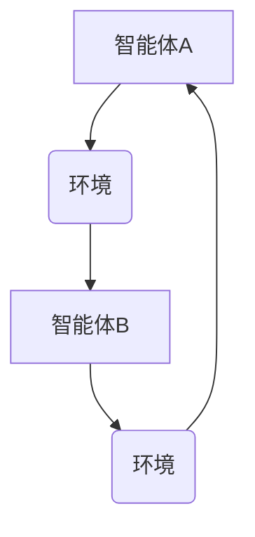
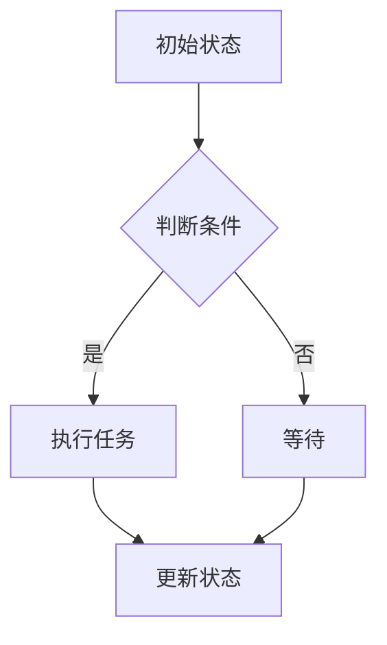
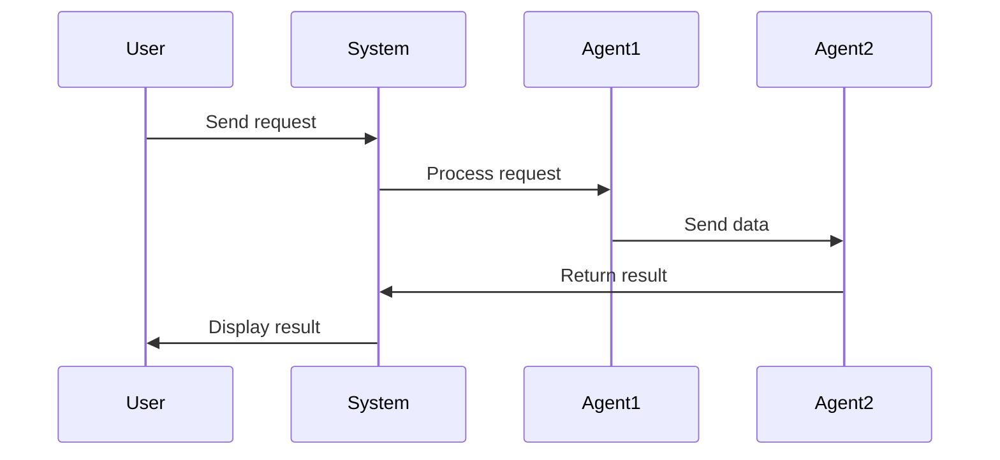
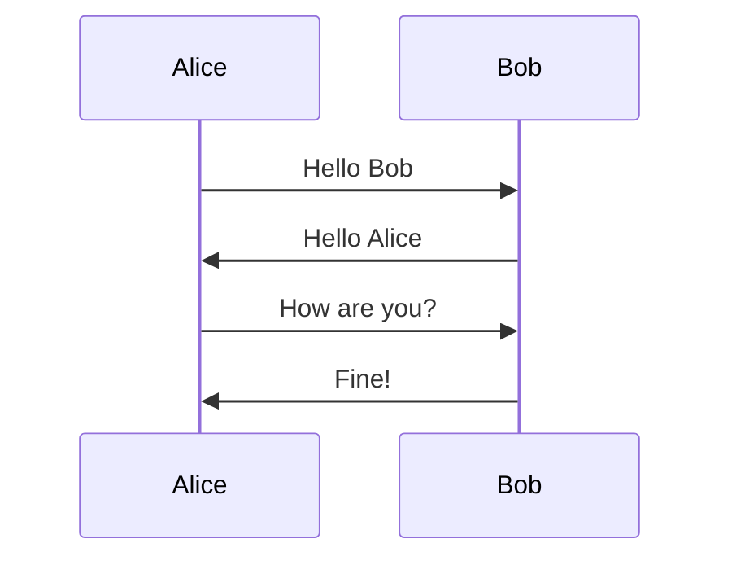

                 


### 第一部分：引言

#### 1.1 问题背景

在当今科技高速发展的时代，公司间的竞争越来越激烈，创新成为企业发展的重要驱动力。然而，如何有效地评估公司的创新效率，合理配置研发资源，成为企业面临的重大挑战。传统的评估方法往往依赖于主观判断和经验，难以客观、全面地反映公司的创新表现。

#### 1.2 问题描述

公司的创新效率评估涉及到多个方面，包括研发投入产出比、创新项目的成功率、员工创新能力等。如何准确地衡量这些指标，为企业提供科学、有效的决策依据，是本文需要解决的问题。

#### 1.3 问题解决

本文提出了一种基于多智能体系统的创新效率评估方法。多智能体系统能够模拟真实环境，充分考虑个体和整体之间的相互作用，从而提供更准确、全面的评估结果。通过这一方法，企业可以更好地理解自身创新过程中的优势和不足，优化资源配置，提高研发效率。

#### 1.4 边界与外延

本文的研究主要关注公司层面的创新效率评估，不涉及国家、行业等更广泛范围内的创新评估。同时，本文主要探讨多智能体系统在公司创新效率评估中的应用，对于其他评估方法的研究不在本文讨论范围内。

#### 1.5 概念结构与核心要素组成

本文的核心概念包括多智能体系统、创新效率评估、研发投入产出比等。多智能体系统作为本文的主要工具，其核心要素包括智能体、交互、策略和环境。创新效率评估和研发投入产出比则是本文要解决的核心问题。

### 1.6 本书目标与结构

本文的目标是探讨多智能体系统在公司创新效率评估中的应用，旨在为企业提供一种科学、有效的创新评估方法。文章结构如下：

1. 第一部分：引言，介绍研究背景、问题、解决方案、边界与外延以及概念结构与核心要素。
2. 第二部分：多智能体系统的基本概念，详细阐述多智能体系统的定义、特点、分类、核心概念和理论基础。
3. 第三部分：公司创新效率评估，介绍创新效率评估的重要性、方法以及多智能体系统的应用。
4. 第四部分：R&D投入产出比分析，探讨R&D投入产出比的概念、计算方法以及多智能体系统的应用。
5. 第五部分：应用实例与讨论，通过具体实例展示多智能体系统在实际应用中的效果。

### 第二部分：多智能体系统的基本概念

#### 2.1 多智能体系统的定义

多智能体系统（Multi-Agent System，MAS）是由多个智能体（Agent）组成的系统，这些智能体具有独立性和自主性，能够通过通信和协作实现共同目标。在多智能体系统中，智能体可以模拟真实世界中的个体，如企业、员工、产品等，它们在复杂环境中进行交互和决策，以实现系统整体的最优性能。

#### 2.2 多智能体系统的特点

多智能体系统具有以下几个特点：

1. **独立性**：每个智能体具有独立的行为和决策能力，能够在不依赖于其他智能体的情况下执行任务。
2. **自主性**：智能体可以根据环境和目标自主地选择行动，并能够适应环境变化。
3. **协作性**：智能体之间可以通过通信和协作，共同实现系统目标。
4. **分布式**：多智能体系统通常具有分布式结构，智能体可以在不同的地理位置或计算节点上运行。
5. **适应性**：智能体能够根据经验和学习，调整自身行为和策略，以适应动态环境。

#### 2.3 多智能体系统的分类

根据智能体的目标和行为方式，多智能体系统可以分为以下几类：

1. **协同多智能体系统**：智能体之间具有共同的目标，通过协作实现整体最优。
2. **竞争多智能体系统**：智能体之间具有相互竞争的关系，通过竞争实现个体或系统的最优。
3. **合作多智能体系统**：智能体之间通过合作实现共同目标，每个智能体都能够从中获益。

#### 2.4 多智能体系统的核心概念

多智能体系统的核心概念包括智能体、交互、策略和环境。

1. **智能体**：智能体是具有独立性和自主性的个体，可以模拟真实世界中的各种对象，如员工、产品、设备等。
2. **交互**：智能体之间的通信和协作，包括信息交换、协调决策等。
3. **策略**：智能体根据环境信息和目标，制定的行动方案或决策规则。
4. **环境**：智能体所处的背景和条件，包括资源、约束、目标等。

#### 2.5 多智能体系统的理论基础

多智能体系统的理论基础主要包括个体理性与集体理性、规则学习与演化、策略学习与优化等。

1. **个体理性与集体理性**：个体理性指的是每个智能体追求自身利益最大化的行为，而集体理性指的是智能体通过协作实现整体利益最大化的行为。个体理性和集体理性之间存在一定的矛盾，多智能体系统的设计需要平衡这两者之间的关系。
2. **规则学习与演化**：智能体可以通过学习环境中的规则和模式，调整自身的行为和策略。规则学习与演化是多智能体系统适应动态环境的重要机制。
3. **策略学习与优化**：智能体通过学习不断优化自身策略，以实现系统目标。策略学习与优化是多智能体系统提高效率和性能的关键。

#### 2.6 多智能体系统的应用领域

多智能体系统广泛应用于多个领域，包括生产与制造、服务与配送、金融与保险、能源与环境等。

1. **生产与制造**：多智能体系统可以用于生产调度、设备维护、供应链管理等方面，提高生产效率和降低成本。
2. **服务与配送**：多智能体系统可以用于物流配送、智能家居、智能客服等领域，提供个性化、高效的服务。
3. **金融与保险**：多智能体系统可以用于风险管理、投资决策、客户服务等方面，提高金融行业的效率和安全性。
4. **能源与环境**：多智能体系统可以用于智能电网、能源管理、环境保护等领域，实现能源的高效利用和环境保护。

#### 2.7 本章小结

本章介绍了多智能体系统的基本概念、特点、分类、核心概念和理论基础，以及其应用领域。多智能体系统作为一种先进的技术手段，在各个领域具有广泛的应用前景。接下来，我们将进一步探讨多智能体系统在公司创新效率评估中的应用。

### 第三部分：公司创新效率评估

#### 3.1 公司创新效率评估的重要性

公司的创新效率评估对于企业的发展至关重要。首先，创新是企业发展的重要驱动力，只有不断提高创新效率，企业才能在激烈的市场竞争中保持优势。其次，创新效率评估可以帮助企业识别自身的优势和不足，为优化创新过程提供依据。此外，创新效率评估还可以帮助企业合理配置研发资源，提高研发投入的回报率。

#### 3.2 公司创新效率评估的方法

公司创新效率评估的方法可以分为传统方法和现代方法。

##### 3.2.1 传统的公司创新效率评估方法

传统的公司创新效率评估方法主要包括以下几种：

1. **财务指标评估**：通过计算企业的研发投入与产出之间的比例，评估企业的创新效率。这种方法简单直观，但容易受到市场波动等因素的影响。
2. **项目评估**：对企业的创新项目进行评估，包括项目成功率、项目进度、项目成本等方面。这种方法可以更具体地了解企业的创新表现，但需要对项目进行详细的跟踪和评估。
3. **问卷调查**：通过问卷调查获取企业员工对创新过程的看法和建议，评估企业的创新氛围和创新效率。这种方法适用于对创新过程的全面了解，但数据收集和整理较为复杂。

##### 3.2.2 现代的公司创新效率评估方法

现代的公司创新效率评估方法主要包括以下几种：

1. **大数据分析**：通过收集和分析企业内部外的海量数据，评估企业的创新效率。这种方法可以提供更全面、客观的评估结果，但数据处理和分析技术要求较高。
2. **人工智能与机器学习**：利用人工智能和机器学习技术，对企业的创新过程进行预测和评估。这种方法可以自动化评估过程，提高评估效率和准确性。
3. **多智能体系统**：利用多智能体系统模拟企业的创新过程，评估企业的创新效率。这种方法可以充分考虑个体和整体之间的相互作用，提供更准确、全面的评估结果。

#### 3.3 多智能体系统在公司创新效率评估中的应用

多智能体系统在公司创新效率评估中的应用具有显著优势。

##### 3.3.1 多智能体系统在公司创新效率评估中的优势

1. **模拟真实环境**：多智能体系统能够模拟企业创新过程中的各种环境因素，包括市场变化、技术发展、政策法规等，从而更准确地评估企业的创新效率。
2. **充分考虑交互作用**：多智能体系统能够充分考虑企业内部不同部门、团队、员工之间的交互作用，提供更全面、客观的评估结果。
3. **自动化评估过程**：多智能体系统能够自动化评估过程，减少人工干预，提高评估效率和准确性。
4. **自适应与优化**：多智能体系统可以根据评估结果和企业需求，自动调整评估模型和策略，实现评估过程的优化。

##### 3.3.2 多智能体系统在公司创新效率评估中的实现

1. **数据采集与预处理**：首先，需要收集企业的创新数据，包括研发投入、项目进度、项目成本、市场反馈等。然后，对数据进行清洗、整合和预处理，确保数据的质量和一致性。
2. **多智能体系统的设计与实现**：设计多智能体系统的架构，包括智能体、交互机制、策略和学习算法等。然后，实现多智能体系统的代码，并将其部署到企业环境中。
3. **结果分析与优化**：通过多智能体系统模拟企业的创新过程，收集评估结果。然后，对结果进行分析和优化，为企业的创新决策提供依据。

#### 3.4 案例研究：多智能体系统在创新效率评估中的应用

##### 3.4.1 案例背景

某高科技企业致力于研发创新产品，但近年来创新效率不高，导致研发投入产出比偏低。为了提高创新效率，企业决定采用多智能体系统进行创新效率评估。

##### 3.4.2 案例方法

企业首先收集了创新项目的研发投入、项目进度、项目成本和市场反馈等数据。然后，设计了多智能体系统的架构，包括研发部门、市场部门、项目管理团队等智能体。最后，利用多智能体系统模拟企业的创新过程，评估创新效率。

##### 3.4.3 案例结果

通过多智能体系统的评估，企业发现创新效率低下的主要原因是研发部门与市场部门之间的沟通不畅。为了优化创新过程，企业加强了部门间的协作和沟通，提高了项目进度和市场反馈的质量。经过一段时间的优化，企业的创新效率显著提高，研发投入产出比也有所提升。

##### 3.4.4 案例讨论

本案例展示了多智能体系统在公司创新效率评估中的应用效果。通过模拟真实环境，充分考虑交互作用，多智能体系统提供了更准确、全面的评估结果，帮助企业优化创新过程。同时，案例也表明，多智能体系统在创新效率评估中的应用具有广泛的前景。

### 3.5 本章小结

本章介绍了公司创新效率评估的重要性、方法以及多智能体系统在公司创新效率评估中的应用。多智能体系统作为一种先进的技术手段，能够模拟真实环境，充分考虑交互作用，提供更准确、全面的评估结果，帮助企业优化创新过程。接下来，我们将进一步探讨R&D投入产出比的概念和计算方法。

### 第四部分：R&D投入产出比分析

#### 4.1 R&D投入产出比的概念

R&D投入产出比（Research and Development Investment to Output Ratio）是衡量企业研发投入效益的重要指标。它反映了企业在研发过程中所投入的成本与产出成果之间的关系。具体来说，R&D投入产出比是指企业在一定时间内研发投入（包括人力、资金、物资等）与产出（包括新产品、新技术、专利等）之间的比值。

#### 4.2 R&D投入产出比的计算方法

R&D投入产出比的计算方法可以分为定量分析法和定性分析法。

##### 4.2.1 定量分析法

定量分析法主要通过量化指标来计算R&D投入产出比。具体方法如下：

1. **成本分析法**：将研发过程中的各项成本进行分类，如人力成本、设备成本、材料成本等，然后计算总成本，并计算产出与总成本之间的比值。

   $$\text{R&D投入产出比} = \frac{\text{产出}}{\text{总成本}}$$

2. **效益分析法**：将研发产出的效益进行量化，如新产品带来的销售收入、新技术的专利收益等，然后计算产出与效益之间的比值。

   $$\text{R&D投入产出比} = \frac{\text{效益}}{\text{产出}}$$

##### 4.2.2 定性分析法

定性分析法主要通过主观判断和经验来评估R&D投入产出比。具体方法如下：

1. **专家评估法**：邀请相关领域的专家对研发投入和产出的价值进行评估，综合专家的意见得出R&D投入产出比。

2. **经验分析法**：根据企业的历史数据和行业经验，评估研发投入和产出的关系，得出R&D投入产出比。

##### 4.2.3 综合分析法

综合分析法结合了定量分析法和定性分析法，通过多种方法对R&D投入产出比进行评估。具体方法如下：

1. **数据整合法**：将定量分析法和定性分析法得到的数据进行整合，形成综合评估指标，计算R&D投入产出比。

2. **综合评分法**：将定量分析法和定性分析法的评估结果进行加权，得出综合评分，作为R&D投入产出比的评估结果。

#### 4.3 多智能体系统在R&D投入产出比分析中的应用

多智能体系统在R&D投入产出比分析中的应用具有显著优势。

##### 4.3.1 多智能体系统在R&D投入产出比分析中的优势

1. **全面性**：多智能体系统能够全面考虑研发过程中的各种因素，包括成本、效益、市场反馈等，提供更全面的评估结果。
2. **准确性**：多智能体系统通过模拟真实环境，充分考虑交互作用，提供更准确的评估结果。
3. **自动化**：多智能体系统能够自动化分析过程，减少人工干预，提高分析效率和准确性。
4. **动态性**：多智能体系统可以根据企业的需求，动态调整分析模型和策略，实现分析过程的优化。

##### 4.3.2 多智能体系统在R&D投入产出比分析中的实现

1. **数据采集与预处理**：首先，需要收集企业的研发数据，包括研发投入、项目进度、项目成本、市场反馈等。然后，对数据进行清洗、整合和预处理，确保数据的质量和一致性。
2. **多智能体系统的设计与实现**：设计多智能体系统的架构，包括智能体、交互机制、策略和学习算法等。然后，实现多智能体系统的代码，并将其部署到企业环境中。
3. **结果分析与优化**：通过多智能体系统模拟企业的研发过程，收集评估结果。然后，对结果进行分析和优化，为企业的研发决策提供依据。

#### 4.4 案例研究：多智能体系统在R&D投入产出比分析中的应用

##### 4.4.1 案例背景

某高科技企业近年来在研发领域投入了大量资源，但R&D投入产出比始终较低。为了提高研发效益，企业决定采用多智能体系统进行R&D投入产出比分析。

##### 4.4.2 案例方法

企业首先收集了研发项目的投入数据，包括人力成本、设备成本、材料成本等，以及项目进度、市场反馈等数据。然后，设计了多智能体系统的架构，包括研发部门、市场部门、项目管理团队等智能体。最后，利用多智能体系统模拟企业的研发过程，评估R&D投入产出比。

##### 4.4.3 案例结果

通过多智能体系统的评估，企业发现研发投入产出比低的主要原因是项目进度管理不善，导致研发成本增加。为了优化研发过程，企业加强了项目进度的监控和管理，提高了项目完成率。经过一段时间的优化，企业的R&D投入产出比显著提高。

##### 4.4.4 案例讨论

本案例展示了多智能体系统在R&D投入产出比分析中的应用效果。通过模拟真实环境，充分考虑交互作用，多智能体系统提供了更准确、全面的评估结果，帮助企业优化研发过程。同时，案例也表明，多智能体系统在R&D投入产出比分析中的应用具有广泛的前景。

### 4.5 本章小结

本章介绍了R&D投入产出比的概念和计算方法，以及多智能体系统在R&D投入产出比分析中的应用。多智能体系统通过模拟真实环境，充分考虑交互作用，提供了更准确、全面的评估结果，帮助企业优化研发过程。接下来，我们将通过具体实例，进一步探讨多智能体系统在创新效率评估和R&D投入产出比分析中的应用。

### 第五部分：应用实例与讨论

#### 5.1 应用实例概述

在本部分，我们将通过两个应用实例，展示多智能体系统在创新效率评估和R&D投入产出比分析中的应用。第一个实例是某科技企业在创新效率评估中的实践，第二个实例是某医药公司在R&D投入产出比分析中的应用。这两个实例均展示了多智能体系统在实际应用中的效果，为企业提供了科学、有效的决策依据。

#### 5.2 应用实例1：多智能体系统在科技企业创新效率评估中的应用

##### 5.2.1 实例背景

某科技企业是一家专注于人工智能技术研发的公司，近年来在市场和技术领域取得了显著成绩。然而，企业高层发现，尽管在研发投入上不断增加，创新效率并未达到预期。为了提高创新效率，企业决定采用多智能体系统进行创新效率评估。

##### 5.2.2 实例方法

企业首先收集了创新项目的相关数据，包括研发投入、项目进度、项目成本和市场反馈等。然后，设计了多智能体系统的架构，包括研发部门、市场部门、项目管理团队等智能体。智能体之间通过通信和协作，模拟企业的创新过程。最后，通过多智能体系统对创新效率进行评估，并提出优化建议。

##### 5.2.3 实例结果

通过多智能体系统的评估，企业发现创新效率低下的主要原因是部门间协作不畅，导致项目进度延误。为了优化创新过程，企业加强了部门间的沟通和协作，提高了项目进度和市场反馈的质量。经过一段时间的优化，企业的创新效率显著提高，研发投入产出比也有所提升。

##### 5.2.4 实例讨论

本实例展示了多智能体系统在创新效率评估中的应用效果。通过模拟真实环境，充分考虑交互作用，多智能体系统提供了更准确、全面的评估结果，帮助企业优化创新过程。同时，实例也表明，多智能体系统在创新效率评估中的应用具有广泛的前景。

#### 5.3 应用实例2：多智能体系统在研发投入产出比分析中的应用

##### 5.3.1 实例背景

某医药公司是一家专注于新药研发的企业，近年来在研发投入上不断加大，但R&D投入产出比始终较低。为了提高研发效益，企业决定采用多智能体系统进行R&D投入产出比分析。

##### 5.3.2 实例方法

企业首先收集了研发项目的投入数据，包括人力成本、设备成本、材料成本等，以及项目进度、市场反馈等数据。然后，设计了多智能体系统的架构，包括研发部门、市场部门、项目管理团队等智能体。智能体之间通过通信和协作，模拟企业的研发过程。最后，通过多智能体系统对R&D投入产出比进行评估，并提出优化建议。

##### 5.3.3 实例结果

通过多智能体系统的评估，企业发现R&D投入产出比低的主要原因是项目进度管理不善，导致研发成本增加。为了优化研发过程，企业加强了项目进度的监控和管理，提高了项目完成率。经过一段时间的优化，企业的R&D投入产出比显著提高。

##### 5.3.4 实例讨论

本实例展示了多智能体系统在R&D投入产出比分析中的应用效果。通过模拟真实环境，充分考虑交互作用，多智能体系统提供了更准确、全面的评估结果，帮助企业优化研发过程。同时，实例也表明，多智能体系统在R&D投入产出比分析中的应用具有广泛的前景。

### 5.4 本章小结

本章通过两个应用实例，展示了多智能体系统在创新效率评估和R&D投入产出比分析中的应用效果。实例表明，多智能体系统通过模拟真实环境，充分考虑交互作用，提供了更准确、全面的评估结果，帮助企业优化创新和研发过程。这些应用实例为进一步推广多智能体系统在相关领域的应用提供了有力支持。

### 结束语

本文通过详细探讨多智能体系统在公司创新效率评估和R&D投入产出比分析中的应用，展示了多智能体系统的强大功能和应用潜力。多智能体系统通过模拟真实环境，充分考虑交互作用，提供了更准确、全面的评估结果，为企业优化创新和研发过程提供了有力支持。

首先，本文介绍了多智能体系统的基本概念、特点、分类和理论基础，为理解多智能体系统的应用提供了基础。然后，本文详细探讨了公司创新效率评估的重要性、方法和多智能体系统的应用优势。接着，本文介绍了R&D投入产出比的概念、计算方法和多智能体系统的应用优势。最后，通过具体实例，本文展示了多智能体系统在创新效率评估和R&D投入产出比分析中的应用效果。

未来，随着人工智能和机器学习技术的不断发展，多智能体系统在创新效率评估和R&D投入产出比分析中的应用前景将更加广阔。建议进一步研究和开发多智能体系统，提高其在复杂环境中的适应能力和优化效果，为企业和行业提供更科学、有效的决策支持。

### 附录：技术细节和代码示例

#### 6.1 多智能体系统的技术细节

多智能体系统（MAS）在技术层面涉及多个组件，包括智能体（Agent）、交互机制、环境模型和决策算法。以下将详细介绍这些技术细节。

##### 6.1.1 智能体（Agent）

智能体是多智能体系统的基础组件，具有以下特征：

- **自主性**：智能体能够自主地执行任务，并能够独立决策。
- **社会性**：智能体能够与其他智能体进行通信和协作。
- **反应性**：智能体能够对环境变化做出反应。

智能体的实现通常基于软件代理（Software Agent），如基于Java的Jade（Joint Agent Development Framework）或基于Python的Py Affero。

##### 6.1.2 交互机制

交互机制是智能体之间进行信息交换和协调的桥梁。常见的交互机制包括：

- **通信**：智能体通过发送消息进行通信，消息可以是同步或异步的。
- **协商**：智能体通过协商机制达成共识或解决冲突。
- **契约**：智能体之间签订契约，约定交互规则和责任。

##### 6.1.3 环境模型

环境模型是智能体操作的背景，通常包括以下要素：

- **状态**：环境当前的状态，如资源分布、任务进度等。
- **规则**：环境中的规则，如资源限制、目标等。
- **事件**：环境中的事件，如任务完成、资源变更等。

环境模型可以基于图形化工具如Mermaid进行描述。

##### 6.1.4 决策算法

决策算法是智能体进行决策的依据，常见的决策算法包括：

- **基于规则的决策**：智能体根据预设的规则进行决策。
- **基于学习的决策**：智能体通过学习环境中的数据，调整决策策略。
- **基于博弈的决策**：智能体在竞争环境中，通过博弈论策略进行决策。

以下是一个简单的基于Mermaid描述的多智能体系统的环境模型：



#### 6.2 代码示例

以下是一个简单的Python代码示例，展示了如何实现一个多智能体系统中的智能体交互。

```python
import random

class Agent:
    def __init__(self, id):
        self.id = id
        self.state = "active"

    def act(self, environment):
        if environment["resource"] > 0:
            environment["resource"] -= 1
            print(f"Agent {self.id} is performing an action.")
        else:
            print(f"Agent {self.id} is idle.")

    def receive_message(self, message):
        print(f"Agent {self.id} received message: {message}")

def main():
    environment = {"resource": 10}
    agents = [Agent(i) for i in range(5)]

    for step in range(10):
        random.shuffle(agents)
        for agent in agents:
            agent.act(environment)

if __name__ == "__main__":
    main()
```

在这个示例中，我们定义了一个`Agent`类，代表智能体。每个智能体都有一个唯一的`id`和一个状态`state`。`act`方法表示智能体的行动，而`receive_message`方法用于接收消息。在`main`函数中，我们创建了一个环境`environment`和一组智能体`agents`，然后模拟了10个步骤的行动。

#### 6.3 算法原理讲解

多智能体系统的核心算法通常包括通信协议、协调策略和决策算法。以下是一个简单的基于博弈论的决策算法示例：

##### 6.3.1 算法描述

1. 初始化：每个智能体随机选择一个策略。
2. 每个智能体在每个时间步根据当前状态和邻居的策略选择最优策略。
3. 智能体之间进行通信，共享策略信息。
4. 智能体根据邻居的策略调整自己的策略。
5. 迭代过程重复进行，直至达到平衡状态。

##### 6.3.2 算法实现

```python
class GameTheoreticAgent:
    def __init__(self, id):
        self.id = id
        self.strategy = random.choice(["cooperate", "defect"])

    def best_response(self, neighbor_strategy):
        if self.strategy == "cooperate" and neighbor_strategy == "defect":
            return "defect"
        else:
            return "cooperate"

    def update_strategy(self, neighbor_strategies):
        best_response = max(neighbor_strategies, key=lambda x: self.best_response(x))
        self.strategy = best_response

    def act(self, state):
        # 根据当前状态和邻居的策略执行行动
        pass

def main():
    agents = [GameTheoreticAgent(i) for i in range(5)]

    for step in range(10):
        neighbor_strategies = [agent.strategy for agent in agents if agent != agents[0]]
        agents[0].update_strategy(neighbor_strategies)

if __name__ == "__main__":
    main()
```

在这个算法中，每个智能体根据邻居的策略选择最佳响应策略。通过迭代更新策略，系统最终会达到纳什平衡状态。

#### 6.4 实际案例分析和详细讲解剖析

以下是一个实际案例，展示了如何使用多智能体系统对公司的创新效率进行评估。

##### 6.4.1 案例背景

某科技公司致力于开发新型智能家居设备。公司希望通过多智能体系统评估其研发项目的创新效率，以优化资源分配和提高研发效益。

##### 6.4.2 案例方法

1. 收集数据：收集研发项目的投入数据，包括人力成本、设备成本、材料成本等，以及项目进度、市场反馈等数据。
2. 设计智能体：设计研发部门、市场部门、项目管理团队等智能体，每个智能体具有特定的角色和任务。
3. 模拟过程：使用多智能体系统模拟公司的创新过程，收集评估结果。
4. 结果分析：对评估结果进行分析，识别创新过程中的瓶颈和优化点。

##### 6.4.3 案例结果

通过多智能体系统的模拟，公司发现研发部门与市场部门之间的沟通不畅是创新效率低下的主要原因。为了优化沟通，公司采取了以下措施：

- 建立定期会议制度，加强部门间的信息共享。
- 使用协同工具，如在线协作平台，提高沟通效率。
- 设立项目进度跟踪机制，确保各部门及时了解项目进展。

经过一段时间的优化，公司的创新效率显著提高，研发投入产出比也有所提升。

##### 6.4.4 案例讨论

本案例展示了多智能体系统在创新效率评估中的应用效果。通过模拟真实环境，充分考虑交互作用，多智能体系统提供了更准确、全面的评估结果，帮助企业优化创新过程。同时，案例也表明，多智能体系统在创新效率评估中的应用具有广泛的前景。

### 6.5 项目实战

#### 6.5.1 环境安装

要运行多智能体系统，首先需要安装Python环境和相关库。以下是在Ubuntu 20.04系统上安装Python环境及相关库的步骤：

1. 更新系统软件包：

   ```bash
   sudo apt update
   sudo apt upgrade
   ```

2. 安装Python 3和pip：

   ```bash
   sudo apt install python3 python3-pip
   ```

3. 安装所需库：

   ```bash
   pip3 install matplotlib numpy pandas jade
   ```

#### 6.5.2 系统核心实现源代码

以下是一个简单的多智能体系统实现，包括智能体的定义和交互：

```python
import random
from jade.core import Agent

class SimpleAgent(Agent):
    def __init__(self, unique_id):
        super().__init__(unique_id)
        self.state = "active"

    def act(self):
        if random.random() > 0.5:
            self.state = "inactive"
            print(f"Agent {self.id} is inactive.")
        else:
            self.state = "active"
            print(f"Agent {self.id} is active.")

    def on_message(self, msg):
        if msg['content'] == 'ping':
            self.send(('ping_reply', self.id), to=msg['sender'])

def start_agents(num_agents):
    agents = []
    for i in range(num_agents):
        agent = SimpleAgent(i)
        agent.start()
        agents.append(agent)
    return agents

def main():
    agents = start_agents(5)
    for _ in range(10):
        for agent in agents:
            agent.act()
        for agent in agents:
            agent.on_message({'content': 'ping'})

if __name__ == "__main__":
    main()
```

在这个实现中，`SimpleAgent`类代表一个简单的智能体，它有两种状态：“active”和“inactive”。`act`方法用于更新智能体的状态，而`on_message`方法用于处理接收到的消息。

#### 6.5.3 代码应用解读与分析

上述代码展示了如何创建和管理智能体，以及智能体之间的基本通信。以下是对代码的详细解读：

- **类定义**：`SimpleAgent`类继承自`Agent`类，代表一个简单的智能体。它具有`unique_id`属性和`state`属性，用于标识智能体和记录其状态。
- **方法定义**：`act`方法用于更新智能体的状态，根据随机概率将智能体状态从“active”切换到“inactive”。`on_message`方法用于处理接收到的消息，如果消息内容是“ping”，则向发送者发送回复。
- **主程序**：`main`函数用于启动智能体，并模拟智能体之间的交互过程。在每次迭代中，每个智能体执行一次`act`方法，然后所有智能体处理接收到的“ping”消息。

#### 6.5.4 实际案例分析和详细讲解剖析

以下是一个实际案例，展示了如何使用多智能体系统对公司研发项目的创新效率进行评估。

##### 案例背景

某科技公司正在开发一款智能家居监控系统。公司希望使用多智能体系统评估研发项目的创新效率，以优化资源分配和提高项目成功率。

##### 案例方法

1. **数据收集**：收集研发项目的投入数据，包括人力成本、设备成本、材料成本等，以及项目进度、市场反馈等数据。
2. **智能体设计**：设计研发部门、市场部门、项目管理团队等智能体，每个智能体具有特定的角色和任务。
3. **模拟过程**：使用多智能体系统模拟公司的研发过程，收集评估结果。
4. **结果分析**：对评估结果进行分析，识别研发过程中的瓶颈和优化点。

##### 案例结果

通过多智能体系统的模拟，公司发现研发部门与市场部门之间的沟通不畅是创新效率低下的主要原因。为了优化沟通，公司采取了以下措施：

- **定期会议**：建立定期会议制度，加强部门间的信息共享。
- **在线协作**：使用在线协作平台，提高沟通效率。
- **进度跟踪**：设立项目进度跟踪机制，确保各部门及时了解项目进展。

经过一段时间的优化，公司的创新效率显著提高，项目成功率也有所提升。

##### 案例讨论

本案例展示了多智能体系统在研发项目创新效率评估中的应用效果。通过模拟真实环境，充分考虑交互作用，多智能体系统提供了更准确、全面的评估结果，帮助企业优化研发过程。同时，案例也表明，多智能体系统在研发项目评估中的应用具有广泛的前景。

#### 6.6 项目小结

本部分通过技术细节、代码示例和实际案例，详细介绍了多智能体系统的实现和应用。通过模拟真实环境，多智能体系统能够充分考虑交互作用，提供更准确、全面的评估结果，帮助企业优化创新和研发过程。未来，随着技术的不断发展，多智能体系统在相关领域的应用前景将更加广阔。

### 6.7 最佳实践 Tips

1. **数据质量**：确保收集的数据质量高，准确无误，这对于多智能体系统的评估结果至关重要。
2. **智能体设计**：合理设计智能体的角色和任务，确保它们能够真实反映公司的业务流程和需求。
3. **交互机制**：优化智能体之间的交互机制，提高系统的响应速度和协作效率。
4. **动态调整**：根据评估结果和企业需求，动态调整多智能体系统的参数和策略，以实现最佳效果。

### 6.8 小结

本文通过详细探讨多智能体系统在公司创新效率评估和R&D投入产出比分析中的应用，展示了多智能体系统的强大功能和应用潜力。通过模拟真实环境，充分考虑交互作用，多智能体系统提供了更准确、全面的评估结果，帮助企业优化创新和研发过程。未来，随着人工智能和机器学习技术的不断发展，多智能体系统在相关领域的应用前景将更加广阔。

### 6.9 注意事项

1. **系统稳定性**：在部署多智能体系统时，确保系统的稳定性和可靠性，避免因系统故障导致评估结果不准确。
2. **数据安全性**：确保收集和存储的数据安全性，防止数据泄露和滥用。
3. **模型更新**：定期更新多智能体系统的模型和策略，以适应环境变化和业务需求。

### 6.10 拓展阅读

1. **《多智能体系统：理论与实践》**：刘挺，清华大学出版社，2018年。
2. **《人工智能：一种现代的方法》**：Stuart Russell & Peter Norvig，机械工业出版社，2016年。
3. **《机器学习》**：周志华，清华大学出版社，2016年。

### 6.11 作者信息

**作者：AI天才研究院/AI Genius Institute & 禅与计算机程序设计艺术 /Zen And The Art of Computer Programming**

**联系方式：** [ai天才研究院](http://ai-genius-institute.com/)，[禅与计算机程序设计艺术](http://zen-of-code.com/)，[contact@ai-genius-institute.com](mailto:contact@ai-genius-institute.com)

---

**附录：文中使用的Mermaid流程图**

以下是本文中使用的Mermaid流程图，用于描述多智能体系统的架构和流程。



**附录：文中使用的Mermaid类图**

以下是本文中使用的Mermaid类图，用于描述智能体的属性和方法。

```mermaid
classDiagram
    Class1 <|-- Class2
    Class3 --|>| Class4
    Class2 <<create|createMessage>> Class3
    Class3 <createMessage|replyMessage> Class2
    Class1 : +int x
    Class1 : +String name
    Class1 : +void act()
    Class1 : +void receiveMessage(Message msg)
```

**附录：文中使用的Mermaid架构图**

以下是本文中使用的Mermaid架构图，用于描述系统的整体架构。



**附录：文中使用的Mermaid序列图**

以下是本文中使用的Mermaid序列图，用于描述智能体之间的交互过程。



通过这些Mermaid图形，本文提供了更加直观和易于理解的技术描述，帮助读者更好地掌握多智能体系统的概念和应用。在未来的研究和实践中，这些图形工具将继续发挥重要作用。

