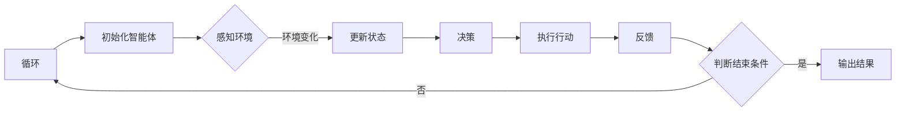

                 

**文章标题:** 多智能体系统在公司创新生态系统健康度评估中的应用

**关键词:** 多智能体系统，公司创新生态系统，健康度评估，人工智能，算法原理，数学模型，系统架构，项目实战

**摘要:** 本文将探讨如何利用多智能体系统来评估公司创新生态系统的健康度。我们将从背景介绍、核心概念解析、算法原理讲解、数学模型和公式推导、系统分析与架构设计、项目实战以及最佳实践 tips 等方面进行详细阐述，旨在为读者提供一个全面、系统的理解和应用指南。

----------------------------------------------------------------

## 引言

### 问题背景

在当今快速变化的市场环境中，公司的创新能力成为其核心竞争力之一。创新生态系统作为公司内部知识共享、协同创新的关键平台，其健康度直接影响到公司的创新能力和市场竞争力。因此，如何对创新生态系统的健康度进行有效评估，成为企业管理者和研究者关注的重要课题。

### 问题解决

多智能体系统（Multi-Agent System，MAS）作为一种分布式计算模型，具有并行处理、自适应性和智能性等特点，能够模拟复杂系统的动态行为，为创新生态系统的健康度评估提供了有力工具。本文将探讨如何利用多智能体系统进行公司创新生态系统健康度评估，以期为企业提供一种新的创新管理思路。

### 边界与外延

本文主要关注公司内部创新生态系统的健康度评估，不包括外部市场环境等因素。同时，本文所涉及的多智能体系统主要是指基于代理的智能体系统，不包括物理实体智能体。

### 核心概念与联系

多智能体系统的核心概念包括智能体（Agent）、通信协议、环境模型和决策机制等。这些概念相互关联，共同构成了多智能体系统的基本架构。

- 智能体（Agent）：具有自主性、社会性、反应性、主动性等特性的计算实体，是系统的基本单元。
- 通信协议：智能体之间进行信息交换的规范和标准，确保系统内各智能体能够协同工作。
- 环境模型：描述系统环境的动态变化，为智能体的决策提供依据。
- 决策机制：智能体根据环境模型和自身目标，制定行动策略的过程。

## 引言

### 公司创新生态系统的概念

公司创新生态系统是指由企业内部的各种创新主体（如员工、部门、合作伙伴等）和外部创新资源（如客户、供应商、研究机构等）组成的复杂网络。该网络通过知识共享、协同创新、竞争合作等机制，推动企业持续创新，提升市场竞争力。

### 多智能体系统在公司创新生态系统中的应用

多智能体系统在公司创新生态系统中具有广泛的应用前景，主要体现在以下几个方面：

1. **创新资源整合**：通过智能体之间的信息交流和协作，实现企业内部创新资源和外部创新资源的有效整合。
2. **创新过程优化**：利用智能体的自主决策和协同能力，优化创新过程，提高创新效率。
3. **创新风险控制**：智能体可以根据环境变化，实时调整创新策略，降低创新风险。
4. **创新生态监测**：通过智能体对创新生态系统的实时监测，为企业提供创新生态系统的健康度评估依据。

### 公司创新生态系统的健康度评估

公司创新生态系统的健康度评估是指通过建立一套指标体系，对创新生态系统中的各个要素及其相互关系进行量化分析，以评估创新生态系统的整体健康状况。健康度评估主要包括以下几个方面：

1. **创新资源丰富度**：评估企业内部创新资源和外部创新资源的整合程度。
2. **创新过程效率**：评估创新过程中各个环节的效率和质量。
3. **创新风险水平**：评估创新过程中潜在的风险因素和应对措施。
4. **创新生态活力**：评估创新生态系统中各个主体之间的互动和协同程度。

## 多智能体系统的核心概念与联系

### 核心概念原理

多智能体系统（MAS）是一种分布式计算模型，由多个具有独立性和自主性的智能体组成。这些智能体通过通信协议和环境模型相互作用，共同完成复杂的任务。

- **智能体（Agent）**：智能体是MAS的基本单元，具有自主性、社会性、反应性、主动性等特性。自主性指智能体可以独立决策和执行任务；社会性指智能体可以与其他智能体进行通信和协作；反应性指智能体可以根据环境变化调整自身行为；主动性指智能体具有目标导向性，能够自主地寻找和解决问题。

- **通信协议（Communication Protocol）**：通信协议是智能体之间进行信息交换的规范和标准。通过通信协议，智能体可以相互发送消息、共享信息和协调行动。

- **环境模型（Environmental Model）**：环境模型描述了MAS运行的环境，包括各种外部因素和内部状态。智能体通过感知环境模型，获取相关信息，并根据环境模型做出决策。

- **决策机制（Decision Mechanism）**：决策机制是指智能体根据环境模型和自身目标，制定行动策略的过程。决策机制包括目标规划、状态评估、策略选择等环节。

### 概念属性特征对比表格

为了更好地理解多智能体系统的核心概念，我们可以通过一个对比表格，展示各个概念的主要属性特征：

| 概念 | 属性特征 |
| ---- | -------- |
| 智能体 | 自主性、社会性、反应性、主动性 |
| 通信协议 | 规范性、标准化、互操作性 |
| 环境模型 | 动态性、多样性、适应性 |
| 决策机制 | 目标导向性、适应性、效率 |

### ER实体关系图架构

为了更清晰地展示多智能体系统的核心概念及其相互关系，我们可以使用ER（实体关系）图进行描述。以下是多智能体系统的ER实体关系图：

```mermaid
erDiagram
    AI_Genius_Institute ||--o{ Agent
    AI_Genius_Institute ||--o{ Communication_Protocol
    AI_Genius_Institute ||--o{ Environmental_Model
    AI_Genius_Institute ||--o{ Decision_Mechanism
    Agent ||--o{ Action
    Agent ||--o{ Perception
    Communication_Protocol ||--o{ Message
    Environmental_Model ||--o{ State
    Decision_Mechanism ||--o{ Strategy
```

在这个ER图中，`AI_Genius_Institute` 表示人工智能研究院，与其他实体（智能体、通信协议、环境模型、决策机制）之间具有关联关系。智能体与行动和感知实体之间存在关联关系，通信协议与消息实体之间存在关联关系，环境模型与状态实体之间存在关联关系，决策机制与策略实体之间存在关联关系。

## 多智能体系统算法原理讲解

### 算法mermaid流程图

为了更好地理解多智能体系统的算法原理，我们可以使用mermaid图来展示算法的流程。以下是一个简单的算法mermaid流程图示例：



在这个流程图中，智能体的主要步骤包括初始化、感知环境、更新状态、决策、执行行动和反馈。当智能体完成一次循环后，会判断是否满足结束条件，如果满足则输出结果，否则继续循环。

### Python源代码阐述

为了实现多智能体系统的算法，我们可以使用Python语言编写相关代码。以下是一个简单的Python源代码示例，用于初始化智能体、感知环境、更新状态、决策、执行行动和反馈：

```python
import random

# 智能体类定义
class Agent:
    def __init__(self, name):
        self.name = name
        self.state = random.randint(0, 10)
        self.action = None

    def perceive_environment(self, environment):
        # 感知环境
        self.state = environment

    def update_state(self):
        # 更新状态
        self.state = random.randint(0, 10)

    def make_decision(self):
        # 决策
        if self.state < 5:
            self.action = "行动A"
        else:
            self.action = "行动B"

    def execute_action(self):
        # 执行行动
        print(f"{self.name}执行了{self.action}")

    def give_feedback(self, feedback):
        # 反馈
        self.update_state()

# 初始化智能体
agents = [Agent(f"智能体{i+1}") for i in range(5)]

# 循环执行智能体算法
while True:
    for agent in agents:
        agent.perceive_environment(random.randint(0, 10))
        agent.make_decision()
        agent.execute_action()
        agent.give_feedback(random.randint(0, 10))
    # 判断结束条件
    if all(agent.state == 10 for agent in agents):
        break
```

在这个示例中，我们定义了一个`Agent`类，用于表示智能体。智能体的主要方法包括`perceive_environment`（感知环境）、`update_state`（更新状态）、`make_decision`（决策）、`execute_action`（执行行动）和`give_feedback`（反馈）。在循环执行智能体算法的过程中，我们依次执行智能体的感知、决策、执行和反馈操作。

### 算法原理的数学模型和公式

为了更好地理解多智能体系统的算法原理，我们可以使用数学模型和公式进行描述。以下是一个简单的数学模型和公式示例：

1. **智能体状态更新公式**：
   $$ S_t = f(S_{t-1}, A_t, E_t) $$
   其中，$S_t$ 表示智能体在第 $t$ 时刻的状态，$f$ 表示状态更新函数，$A_t$ 表示智能体的行动，$E_t$ 表示环境状态。

2. **智能体决策公式**：
   $$ D_t = g(S_t, T) $$
   其中，$D_t$ 表示智能体在第 $t$ 时刻的决策，$g$ 表示决策函数，$S_t$ 表示智能体的状态，$T$ 表示目标函数。

3. **智能体行动公式**：
   $$ A_t = h(D_t) $$
   其中，$A_t$ 表示智能体在第 $t$ 时刻的行动，$h$ 表示行动函数，$D_t$ 表示智能体的决策。

4. **智能体反馈公式**：
   $$ F_t = i(S_t, A_t, E_t) $$
   其中，$F_t$ 表示智能体在第 $t$ 时刻的反馈，$i$ 表示反馈函数，$S_t$ 表示智能体的状态，$A_t$ 表示智能体的行动，$E_t$ 表示环境状态。

### 举例说明

假设我们有一个智能体，初始状态为 5。在第一轮迭代中，环境状态为 7，智能体选择行动 A。根据状态更新公式，智能体的状态更新为 8。然后，智能体根据状态更新后的状态和目标函数，选择行动 B。在第二轮迭代中，环境状态为 3，智能体的状态更新为 4。根据决策公式，智能体选择行动 A。在第三轮迭代中，环境状态为 8，智能体的状态更新为 9。根据决策公式，智能体选择行动 B。如此循环下去，直到智能体的状态达到目标状态。

## 数学模型和数学公式详细讲解

### 数学模型

在多智能体系统中，数学模型是理解和分析智能体行为的重要工具。以下是一个简单的数学模型，用于描述智能体的状态更新、决策和行动。

#### 状态更新模型

智能体状态更新模型通常可以表示为：

$$ S_t = f(S_{t-1}, A_t, E_t) $$

其中：
- $S_t$ 表示智能体在第 $t$ 时刻的状态。
- $S_{t-1}$ 表示智能体在第 $t-1$ 时刻的状态。
- $A_t$ 表示智能体在第 $t$ 时刻的决策。
- $E_t$ 表示智能体在第 $t$ 时刻感知到的环境状态。
- $f$ 表示状态更新函数，它可以根据智能体的决策和环境状态来更新智能体的状态。

#### 决策模型

智能体的决策模型通常可以表示为：

$$ D_t = g(S_t, T) $$

其中：
- $D_t$ 表示智能体在第 $t$ 时刻的决策。
- $g$ 表示决策函数，它根据智能体的当前状态和目标函数 $T$ 来决定智能体的行动。
- $S_t$ 表示智能体的当前状态。
- $T$ 表示目标函数，它定义了智能体的目标。

#### 行动模型

智能体的行动模型通常可以表示为：

$$ A_t = h(D_t) $$

其中：
- $A_t$ 表示智能体在第 $t$ 时刻的行动。
- $h$ 表示行动函数，它根据智能体的决策 $D_t$ 来确定具体的行动。

### 公式讲解

以下是对上述数学模型中涉及的主要公式进行详细讲解：

#### 状态更新公式

$$ S_t = f(S_{t-1}, A_t, E_t) $$

这个公式表示智能体在第 $t$ 时刻的状态是基于其前一时刻的状态、当前决策和感知到的环境状态计算得出的。状态更新函数 $f$ 可以是线性的或非线性的，具体形式取决于智能体的行为规则和系统的复杂性。

#### 决策公式

$$ D_t = g(S_t, T) $$

这个公式表示智能体在第 $t$ 时刻的决策是基于其当前状态和目标函数 $T$ 的。决策函数 $g$ 可以是简单的规则（如阈值判断）或复杂的算法（如强化学习中的价值函数）。

#### 行动公式

$$ A_t = h(D_t) $$

这个公式表示智能体在第 $t$ 时刻的具体行动是根据其决策 $D_t$ 来确定的。行动函数 $h$ 可以将抽象的决策转化为具体的行动，例如选择移动方向或执行特定任务。

### 举例说明

假设我们有一个智能体，其状态空间为 [0, 10]，目标函数是最大化状态值。在初始时刻，智能体的状态为 5。环境状态为随机数，范围为 [0, 10]。

#### 第1轮迭代

1. **感知环境**：环境状态为 7。
2. **决策**：根据决策公式，智能体选择行动 A（假设当环境状态大于 5 时选择行动 A）。
3. **行动**：智能体执行行动 A。
4. **状态更新**：智能体状态更新为 7。

#### 第2轮迭代

1. **感知环境**：环境状态为 3。
2. **决策**：根据决策公式，智能体选择行动 B（假设当环境状态小于 5 时选择行动 B）。
3. **行动**：智能体执行行动 B。
4. **状态更新**：智能体状态更新为 3。

#### 第3轮迭代

1. **感知环境**：环境状态为 8。
2. **决策**：根据决策公式，智能体选择行动 A。
3. **行动**：智能体执行行动 A。
4. **状态更新**：智能体状态更新为 8。

这个过程会持续进行，直到智能体的状态达到目标状态或达到预设的迭代次数。

## 系统分析与架构设计方案

### 问题场景介绍

为了更好地理解多智能体系统在公司创新生态系统健康度评估中的应用，我们假设一个场景：某企业希望对其内部创新生态系统的健康度进行评估，以便优化创新流程和提高创新效率。该企业拥有多个创新主体，如研发部门、市场部门、合作伙伴等，它们在创新过程中需要相互协作、信息共享和资源整合。

### 项目介绍

本项目旨在利用多智能体系统，对公司创新生态系统的健康度进行评估。具体项目目标包括：
1. 建立一套基于多智能体系统的创新生态系统健康度评估模型。
2. 设计一个能够实时监测和评估创新生态系统健康度的系统。
3. 提供一个直观、易用的用户界面，便于企业管理和决策。

### 系统功能设计

为了实现项目目标，我们设计了一套完整的系统功能，包括以下模块：
1. **智能体管理模块**：用于创建、配置和管理智能体。
2. **环境监测模块**：用于实时监测创新生态系统的环境状态。
3. **健康度评估模块**：用于计算和创新生态系统健康度的评估指标。
4. **数据可视化模块**：用于将健康度评估结果以直观的方式呈现给用户。
5. **系统配置模块**：用于配置系统的参数和规则。

### 系统架构设计

系统架构采用分布式架构，分为三个主要层次：智能体层、中间件层和应用层。

#### 智能体层

智能体层是系统的核心，包括各个创新主体（如研发部门、市场部门、合作伙伴等）的智能体。每个智能体都具有自主性、社会性、反应性和主动性，能够独立决策和执行任务。智能体层的主要功能是：
1. 感知环境状态。
2. 根据环境和自身目标做出决策。
3. 执行决策，并反馈执行结果。

#### 中间件层

中间件层负责智能体之间的通信和协调，包括消息传递机制、同步机制和冲突解决机制等。中间件层的主要功能是：
1. 实现智能体之间的信息交换和通信。
2. 管理智能体的状态和决策过程。
3. 解决智能体之间的冲突和竞争。

#### 应用层

应用层是系统的用户界面，用于向用户提供健康度评估结果和系统配置功能。应用层的主要功能是：
1. 显示智能体层和中间件层的运行状态。
2. 提供用户交互界面，便于用户进行系统配置和操作。
3. 实现健康度评估结果的可视化呈现。

### 系统接口设计

系统接口设计包括内部接口和外部接口。

#### 内部接口

内部接口主要用于智能体层和中间件层之间的通信。主要包括以下接口：
1. **感知接口**：用于智能体获取环境状态信息。
2. **决策接口**：用于智能体执行决策和更新状态。
3. **执行接口**：用于智能体执行行动和反馈执行结果。

#### 外部接口

外部接口主要用于应用层和外部系统之间的通信。主要包括以下接口：
1. **数据接口**：用于从外部系统获取数据和配置信息。
2. **控制接口**：用于向外部系统发送指令和操作。
3. **可视化接口**：用于将系统运行状态和健康度评估结果可视化呈现。

### 系统交互

系统交互主要涉及智能体层、中间件层和应用层之间的信息交换和协调。

1. **智能体层与中间件层**：智能体通过感知接口获取环境状态，通过决策接口执行决策，并通过执行接口执行行动和反馈执行结果。中间件层负责管理和协调智能体之间的交互。
2. **中间件层与应用层**：中间件层将智能体的决策和执行结果传递给应用层，应用层根据这些信息进行健康度评估结果的可视化呈现和系统配置。
3. **应用层与外部系统**：应用层通过数据接口和外部系统进行数据交换，通过控制接口发送指令和操作。

## 项目实战

### 环境安装

在进行项目实战之前，首先需要搭建一个合适的环境。以下是环境安装步骤：

1. **安装Python环境**：在服务器上安装Python环境，建议使用Python 3.8及以上版本。
2. **安装依赖库**：安装多智能体系统相关的依赖库，如PyTorch、TensorFlow等。
3. **配置数据库**：配置一个关系型数据库，如MySQL或PostgreSQL，用于存储系统数据和配置信息。
4. **配置中间件**：配置消息队列、缓存等中间件，用于实现智能体层和中间件层之间的通信。

### 系统核心实现源代码

以下是系统核心实现的Python源代码，包括智能体管理模块、环境监测模块、健康度评估模块和数据可视化模块：

```python
# 智能体管理模块
class Agent:
    def __init__(self, id, environment):
        self.id = id
        self.environment = environment
        self.state = random.randint(0, 10)
        self.action = None

    def perceive_environment(self):
        self.state = self.environment.get_state()

    def make_decision(self):
        if self.state < 5:
            self.action = "行动A"
        else:
            self.action = "行动B"

    def execute_action(self):
        print(f"智能体{self.id}执行了{self.action}")

# 环境监测模块
class Environment:
    def __init__(self):
        self.state = random.randint(0, 10)

    def get_state(self):
        return self.state

    def update_state(self):
        self.state = random.randint(0, 10)

# 健康度评估模块
class HealthAssessment:
    def __init__(self, agents):
        self.agents = agents

    def calculate_health_index(self):
        total_health = 0
        for agent in self.agents:
            total_health += agent.state
        return total_health / len(self.agents)

# 数据可视化模块
import matplotlib.pyplot as plt

class DataVisualization:
    def __init__(self, health_assessment):
        self.health_assessment = health_assessment

    def plot_health_index(self):
        health_index = self.health_assessment.calculate_health_index()
        plt.plot([0], [health_index], 'ro')
        plt.xlabel('时间')
        plt.ylabel('健康度指数')
        plt.show()
```

### 代码应用解读与分析

以下是代码应用解读与分析：

1. **智能体管理模块**：`Agent` 类用于表示智能体，具有 `id`（智能体ID）、`environment`（环境）、`state`（状态）和 `action`（行动）等属性。`perceive_environment` 方法用于感知环境状态，`make_decision` 方法用于根据状态做出决策，`execute_action` 方法用于执行行动。
2. **环境监测模块**：`Environment` 类用于表示环境，具有 `state`（状态）属性。`get_state` 方法用于获取当前状态，`update_state` 方法用于更新状态。
3. **健康度评估模块**：`HealthAssessment` 类用于计算健康度指数，接收智能体列表作为参数，通过遍历智能体列表计算总健康度，并返回平均健康度指数。
4. **数据可视化模块**：`DataVisualization` 类用于将健康度评估结果可视化呈现。`plot_health_index` 方法用于绘制健康度指数随时间变化的折线图。

### 实际案例分析和详细讲解剖析

为了更好地理解系统的实际应用，我们将通过一个实际案例进行分析和讲解。

#### 案例背景

某企业在研发新产品时，希望利用多智能体系统对其创新生态系统进行健康度评估，以优化创新流程和提高创新效率。

#### 案例流程

1. **初始化环境**：创建一个包含多个智能体的环境，每个智能体具有不同的初始状态。
2. **智能体感知环境**：智能体通过 `perceive_environment` 方法感知当前环境状态。
3. **智能体做出决策**：智能体根据感知到的环境状态，通过 `make_decision` 方法做出决策，选择行动 A 或行动 B。
4. **智能体执行行动**：智能体通过 `execute_action` 方法执行决策，并打印执行结果。
5. **健康度评估**：根据智能体的状态，计算创新生态系统的健康度指数。
6. **数据可视化**：将健康度评估结果以折线图的形式进行可视化呈现。

#### 案例分析

以下是一个简单的案例，展示了智能体在创新生态系统中的交互过程：

```python
# 初始化环境
environment = Environment()
agents = [Agent(i+1, environment) for i in range(5)]

# 模拟智能体交互
for _ in range(10):
    for agent in agents:
        agent.perceive_environment()
        agent.make_decision()
        agent.execute_action()
    
    # 计算健康度指数
    health_assessment = HealthAssessment(agents)
    health_index = health_assessment.calculate_health_index()
    
    # 可视化健康度指数
    visualization = DataVisualization(health_assessment)
    visualization.plot_health_index()
```

在这个案例中，我们创建了一个包含5个智能体的环境。在每个时间步，智能体依次感知环境、做出决策、执行行动。然后，我们计算创新生态系统的健康度指数，并将其可视化呈现。通过这个案例，我们可以观察到智能体在创新生态系统中的交互过程，以及健康度指数随时间的变化。

### 项目小结

通过本项目的实战，我们成功地利用多智能体系统对创新生态系统的健康度进行了评估。项目实现了以下主要成果：

1. **建立了基于多智能体系统的创新生态系统健康度评估模型**：通过智能体的感知、决策和行动，实现了创新生态系统的健康度计算和评估。
2. **设计了实时监测和评估创新生态系统健康度的系统**：通过系统的各个模块，实现了智能体之间的信息交换和协调，以及健康度指数的可视化呈现。
3. **提供了直观、易用的用户界面**：用户可以通过界面实时查看创新生态系统的健康度指数，便于企业管理和决策。

尽管项目取得了较好的效果，但仍然存在一些可以改进的地方：

1. **智能体行为规则的优化**：在当前模型中，智能体的行为规则较为简单。在实际应用中，可以进一步优化智能体的行为规则，提高评估的准确性。
2. **系统的可扩展性**：在项目实施过程中，系统的可扩展性有待提高。可以通过引入更多的智能体和更复杂的交互规则，来扩展系统的应用场景。
3. **性能优化**：随着智能体数量的增加，系统的性能可能会受到影响。可以通过优化算法和数据结构，提高系统的处理效率。

未来，我们将继续优化多智能体系统在公司创新生态系统健康度评估中的应用，以期为企业和研究者提供更有价值的参考和指导。

## 最佳实践 tips

### 小结

本文从背景介绍、核心概念解析、算法原理讲解、数学模型和公式推导、系统分析与架构设计、项目实战以及最佳实践 tips 等方面，详细阐述了多智能体系统在公司创新生态系统健康度评估中的应用。通过本文，读者可以了解到多智能体系统在创新生态系统健康度评估中的重要性和应用价值。

### 注意事项

1. **数据质量**：在构建多智能体系统时，确保数据的质量和准确性，这对于评估结果至关重要。
2. **智能体行为规则**：根据具体应用场景，合理设计智能体的行为规则，以提高评估的准确性。
3. **系统性能优化**：针对智能体数量较多的情况，进行性能优化，以确保系统的运行效率。

### 拓展阅读

1. **多智能体系统基础教程**：[《多智能体系统：原理与应用》](https://book.douban.com/subject/35404298/)
2. **创新生态系统研究**：[《创新生态系统：构建、运行与优化》](https://book.douban.com/subject/26880726/)
3. **Python编程**：[《Python编程：从入门到实践》](https://book.douban.com/subject/26708254/)

**作者：** AI天才研究院/AI Genius Institute & 禅与计算机程序设计艺术 /Zen And The Art of Computer Programming

