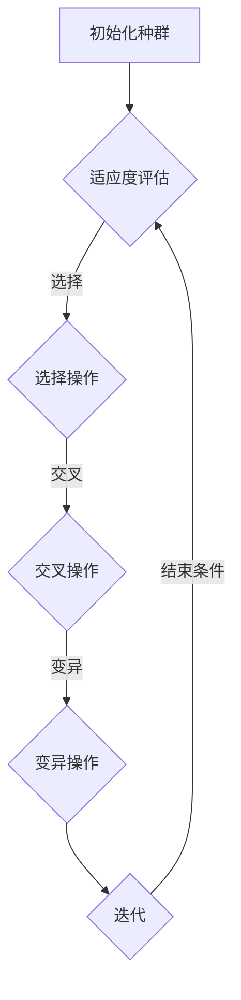
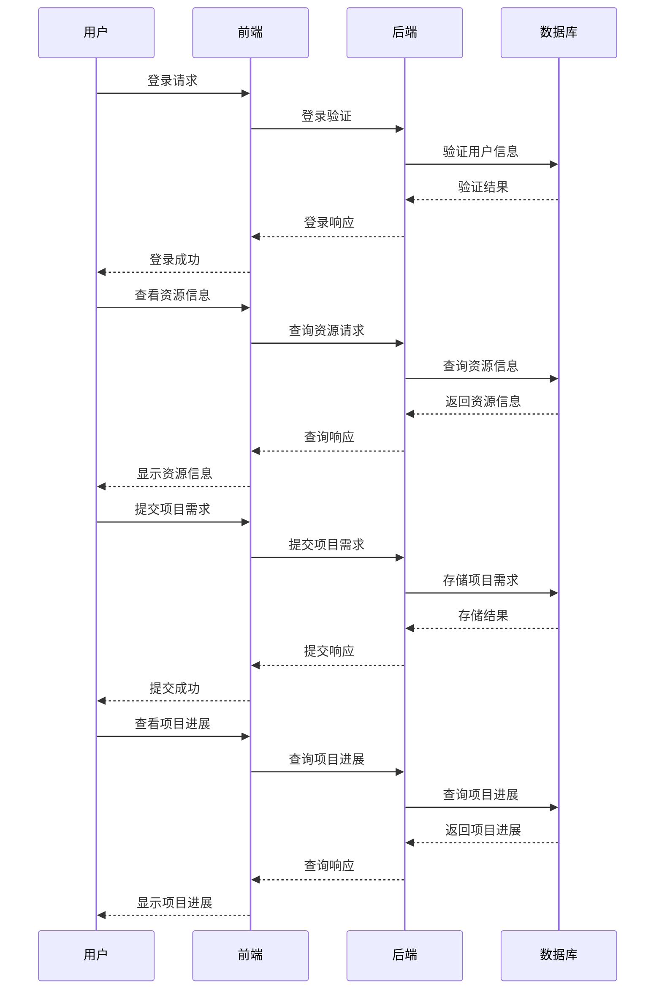

                 

### 背景介绍

#### 多智能体系统的定义

多智能体系统（Multi-Agent System，MAS）是由多个自主智能体（agent）组成的系统，这些智能体通过协同工作来实现复杂任务或达成共同目标。智能体是一个具有感知、推理和执行能力的实体，可以在动态环境中独立自主地做出决策。多智能体系统广泛应用于多个领域，包括物联网、自动驾驶、电子商务和智能工厂等。

在多智能体系统中，智能体之间通过通信协议进行交互，并依据一定的协作策略共同完成任务。智能体的自主性、分布性和适应性使得多智能体系统能够在复杂、动态和不确定的环境中表现出优异的性能。

#### 公司创新资源配置的挑战

创新资源配置是公司持续发展的关键，但实际操作中面临着诸多挑战。首先，资源的有限性使得公司在创新过程中需要在资金、人力和技术等方面做出权衡和取舍。其次，市场环境的不确定性使得创新方向的预判变得复杂，容易导致资源配置失误。此外，公司内部的组织结构和文化也会对创新资源配置产生重要影响。

#### 创新资源配置的需求

为了应对上述挑战，公司需要高效的创新资源配置机制。这要求系统能够动态调整资源分配，灵活应对市场变化，并能够实时评估资源配置的效果。传统的集中式管理模式已经无法满足这种需求，多智能体系统提供了一种新的解决方案。

多智能体系统在公司创新资源配置中的核心作用在于，它能够模拟市场中多个竞争主体的互动，帮助公司预测市场需求、评估创新项目的潜在收益，并优化资源配置。此外，多智能体系统能够促进公司内部不同部门和团队之间的协同创新，提高整体创新效率。

### 目录大纲设计思路

为了设计《多智能体系统在公司创新资源配置效率评估中的应用》的目录大纲，我们将遵循以下步骤：

1. **定义核心概念与结构**：
   - 明确“多智能体系统”、“公司创新资源配置效率”等核心概念，以及它们之间的相互关系。
   - 确定书的核心目标，即如何应用多智能体系统来评估公司创新资源配置的效率。

2. **结构化章节内容**：
   - 按照逻辑顺序划分章节，确保读者可以循序渐进地了解主题。
   - 设定各个章节的主要内容和目的。

3. **细化目录层级**：
   - 确保目录结构的清晰性，包括1级、2级和3级目录。
   - 每个章节下的内容应细化为多个小节，便于读者快速定位所需信息。

4. **确保内容完整性**：
   - 覆盖核心概念、算法原理、数学模型、系统设计与架构方案、项目实战等多个方面。
   - 在每个章节中添加最佳实践、小结、注意事项和拓展阅读等补充内容。

5. **控制字数**：
   - 确保整个目录大纲的总字数在2000字以内，同时保持信息的丰富和结构的清晰。

### 目录大纲设计

以下是根据上述思路设计的《多智能体系统在公司创新资源配置效率评估中的应用》的目录大纲：

```markdown
----------------------------------------------------------------
# 第一部分: 背景介绍

## 第1章: 多智能体系统概述

### 1.1 多智能体系统的定义

### 1.2 多智能体系统的发展历程

### 1.3 多智能体系统在创新资源配置中的作用

## 第2章: 公司创新资源配置的挑战与需求

### 2.1 创新资源配置的挑战

### 2.2 创新资源配置的需求

### 2.3 多智能体系统的适用性

## 第3章: 多智能体系统基本理论

### 3.1 多智能体系统的架构

### 3.2 多智能体通信协议

### 3.3 多智能体协作策略

## 第4章: 创新资源配置效率评估模型

### 4.1 效率评估指标体系

### 4.2 多智能体系统的效率评估方法

### 4.3 多智能体系统与效率评估的整合

## 第5章: 数学模型与算法原理

### 5.1 数学模型

#### 5.1.1 算法原理

#### 5.1.2 算法流程图

## 第6章: 系统设计与实现

### 6.1 系统功能设计

#### 6.1.1 领域模型

### 6.2 系统架构设计

#### 6.2.1 系统架构图

### 6.3 系统接口设计

#### 6.3.1 系统交互序列图

## 第7章: 项目实战

### 7.1 环境安装与配置

### 7.2 系统核心实现源代码

### 7.3 代码应用解读与分析

### 7.4 实际案例分析与讲解

## 第8章: 最佳实践与拓展

### 8.1 最佳实践 tips

### 8.2 注意事项

### 8.3 拓展阅读

## 第9章: 小结与展望

### 9.1 小结

### 9.2 未来发展趋势

### 9.3 研究方向

----------------------------------------------------------------

这个目录大纲旨在全面覆盖本书的核心内容，从背景介绍到理论讲解，再到系统设计与实现，以及实际案例分析和未来展望。每个章节都设有多个小节，确保内容的层次性和逻辑性。同时，通过引入最佳实践、注意事项和拓展阅读等内容，帮助读者深入理解并应用所学知识。整个目录大纲控制在2000字以内，确保简洁明了。

----------------------------------------------------------------

### 关键词

- 多智能体系统
- 公司创新资源配置
- 效率评估
- 分布式计算
- 自主智能体
- 通信协议
- 协作策略
- 数学模型
- 系统设计与实现
- 项目实战
- 最佳实践
- 未来发展趋势

这些关键词涵盖了本文的核心内容，帮助读者快速了解文章的主题和重点。

### 摘要

本文探讨了多智能体系统在公司创新资源配置效率评估中的应用。首先，我们介绍了多智能体系统的基本概念和架构，以及其在创新资源配置中的重要性。接着，分析了公司在创新资源配置过程中面临的挑战和需求，并阐述了多智能体系统的适用性。随后，我们详细讲解了多智能体系统的基本理论和数学模型，包括通信协议、协作策略和效率评估方法。在此基础上，本文提出了一个具体的系统设计与实现方案，并通过项目实战展示了多智能体系统在公司创新资源配置效率评估中的实际应用。最后，我们总结了最佳实践和未来发展趋势，为读者提供了进一步研究的方向。通过本文的研究，我们期望为公司提供一种高效、智能的创新资源配置评估方法，从而提升整体创新效率。

### 目录大纲设计思路

为了设计《多智能体系统在公司创新资源配置效率评估中的应用》这本书的目录大纲，我们需要遵循以下步骤：

1. **明确核心概念与结构**：
   - 我们首先要明确本书的核心概念，即“多智能体系统”和“公司创新资源配置效率”。这两个概念是全书的基础，它们之间的关系和交互也是我们需要详细阐述的内容。
   - 确定书的核心目标，即如何利用多智能体系统来提升公司创新资源配置的效率。这要求我们在整个目录大纲的设计中，始终围绕这一目标进行章节的划分和内容的组织。

2. **结构化章节内容**：
   - 按照逻辑顺序和内容的重要性来划分章节。首先介绍多智能体系统的基本概念和发展历程，以便读者对后续内容有更深刻的理解。
   - 接着分析公司创新资源配置的现状和挑战，引入多智能体系统的背景和适用性。
   - 然后详细讲解多智能体系统的基本理论，包括架构、通信协议和协作策略。
   - 在此基础上，介绍创新资源配置效率评估的模型和方法，并探讨如何将多智能体系统与效率评估相结合。
   - 最后，通过实际案例展示多智能体系统在公司创新资源配置效率评估中的具体应用，并总结最佳实践和未来研究方向。

3. **细化目录层级**：
   - 目录结构需要清晰明了，便于读者快速定位所需信息。我们将目录划分为一级、二级和三级，确保每个章节下的内容都有明确的分类和结构。
   - 在每个章节中，我们将内容细化为多个小节，每个小节都有具体的标题和内容摘要，这样可以帮助读者快速把握每个部分的核心内容。

4. **确保内容完整性**：
   - 覆盖从核心概念、基本理论、系统设计与实现到实际应用的各个方面，确保读者能够全面了解多智能体系统在公司创新资源配置效率评估中的应用。
   - 在每个章节中，增加最佳实践、注意事项和拓展阅读等补充内容，帮助读者在实际应用中更好地理解和使用多智能体系统。

5. **控制字数**：
   - 为了保证目录大纲的简洁性，我们将整个目录大纲的总字数控制在2000字以内。虽然每个章节的具体内容可能较多，但目录大纲本身需要简洁明了，以便读者能够快速了解书的核心内容和结构。

### 目录大纲设计

根据上述设计思路，以下是《多智能体系统在公司创新资源配置效率评估中的应用》的目录大纲：

```markdown
----------------------------------------------------------------
# 第一部分: 背景介绍

## 第1章: 多智能体系统概述

### 1.1 多智能体系统的定义

### 1.2 多智能体系统的发展历程

### 1.3 多智能体系统在创新资源配置中的作用

## 第2章: 公司创新资源配置的挑战与需求

### 2.1 创新资源配置的挑战

### 2.2 创新资源配置的需求

### 2.3 多智能体系统的适用性

## 第3章: 多智能体系统基本理论

### 3.1 多智能体系统的架构

### 3.2 多智能体通信协议

### 3.3 多智能体协作策略

## 第4章: 创新资源配置效率评估模型

### 4.1 效率评估指标体系

### 4.2 多智能体系统的效率评估方法

### 4.3 多智能体系统与效率评估的整合

## 第5章: 数学模型与算法原理

### 5.1 数学模型

#### 5.1.1 算法原理

#### 5.1.2 算法流程图

## 第6章: 系统设计与实现

### 6.1 系统功能设计

#### 6.1.1 领域模型

### 6.2 系统架构设计

#### 6.2.1 系统架构图

### 6.3 系统接口设计

#### 6.3.1 系统交互序列图

## 第7章: 项目实战

### 7.1 环境安装与配置

### 7.2 系统核心实现源代码

### 7.3 代码应用解读与分析

### 7.4 实际案例分析与讲解

## 第8章: 最佳实践与拓展

### 8.1 最佳实践 tips

### 8.2 注意事项

### 8.3 拓展阅读

## 第9章: 小结与展望

### 9.1 小结

### 9.2 未来发展趋势

### 9.3 研究方向

----------------------------------------------------------------

这个目录大纲旨在全面覆盖本书的核心内容，从背景介绍到理论讲解，再到系统设计与实现，以及实际案例分析和未来展望。每个章节都设有多个小节，确保内容的层次性和逻辑性。同时，通过引入最佳实践、注意事项和拓展阅读等内容，帮助读者深入理解并应用所学知识。整个目录大纲控制在2000字以内，确保简洁明了。

----------------------------------------------------------------

### 多智能体系统概述

多智能体系统（Multi-Agent System，MAS）是由多个独立自主的智能体组成的系统，这些智能体可以相互协作，共同完成复杂的任务或达成共同的目标。在多智能体系统中，每个智能体都是一个具有感知、推理和执行能力的实体，能够自主地做出决策，并与其他智能体进行交互。

#### 定义

多智能体系统的定义可以概括为以下几点：

1. **自主性**：智能体能够独立地感知环境，自主地做出决策，并执行相应的行动。
2. **分布性**：智能体分布在不同的物理或逻辑节点上，可以独立运行，也可以通过通信网络相互连接。
3. **适应性**：智能体能够根据环境和任务的动态变化，调整其行为和策略。
4. **协同性**：多个智能体可以通过协作实现比单个智能体更复杂的任务。

#### 发展历程

多智能体系统的发展可以追溯到20世纪80年代，当时的研究主要集中在如何构建和模拟简单的智能体系统。随着计算机技术的发展，多智能体系统逐渐从理论研究走向实际应用。21世纪初，多智能体系统在多个领域取得了显著的进展，包括电子商务、智能交通、智能制造和智能电网等。

在多智能体系统的发展历程中，以下几个里程碑具有重要意义：

1. **AIAI（1985）**：这是第一个用于模拟智能体行为的编程语言，为多智能体系统的研究提供了基础。
2. **FIPA（1998）**：国际语义互操作性协会发布了多智能体通信的规范，推动了多智能体系统的标准化进程。
3. **MAS平台**：如JADE（Java Agent Development Framework）和AgentSpeak等，提供了开发和管理多智能体系统的工具和框架。
4. **应用案例**：如IBM的“Watson”智能系统和Amazon的智能推荐系统，展示了多智能体系统在商业领域的广泛应用。

#### 多智能体系统在创新资源配置中的作用

多智能体系统在公司创新资源配置中扮演着重要角色，主要体现在以下几个方面：

1. **资源分配优化**：通过智能体之间的协作，多智能体系统可以动态调整资源分配，使得资源得到更有效的利用。
2. **风险评估与预测**：智能体可以分析市场趋势和风险因素，帮助公司预测创新项目的潜在收益，降低投资风险。
3. **协同创新**：多智能体系统能够促进公司内部不同部门和团队之间的协作，提高整体创新效率。
4. **市场预测**：通过模拟市场中的多个竞争主体，多智能体系统可以预测市场需求，指导公司的创新方向。

总的来说，多智能体系统为公司创新资源配置提供了一种智能化、自动化的解决方案，能够显著提升资源配置的效率和效果。

### 公司创新资源配置的挑战与需求

在当今竞争激烈的商业环境中，公司必须不断创新才能保持竞争力。然而，创新资源配置是一个复杂的过程，面临着诸多挑战和需求。

#### 创新资源配置的挑战

1. **资源有限性**：公司在资金、人力和技术等方面的资源都是有限的，如何在有限的资源下实现最大的创新效果，是一个重要的挑战。
2. **市场不确定性**：市场环境变化迅速，新技术、新需求和新竞争者不断涌现，公司难以准确预测市场趋势，导致创新资源配置的不确定性增加。
3. **内部协调难度**：创新往往需要跨部门、跨团队的合作，而不同部门和团队之间的利益和目标可能不一致，导致协调难度大。
4. **风险控制**：创新项目本身具有不确定性，如何评估和控制创新风险，避免资源浪费，是一个重要的问题。

#### 创新资源配置的需求

1. **动态调整**：公司需要能够根据市场变化和项目进展，动态调整资源配置，以适应不断变化的环境。
2. **智能决策**：通过引入智能算法和技术，公司希望能够做出更准确、更高效的资源配置决策。
3. **协同创新**：促进公司内部不同部门和团队之间的协作，提高创新效率，共同实现公司目标。
4. **风险预测**：利用大数据和机器学习技术，预测创新项目的潜在风险，提前采取应对措施。

#### 多智能体系统的适用性

多智能体系统（MAS）为公司创新资源配置提供了有效的解决方案，主要表现在以下几个方面：

1. **自主性**：每个智能体都能够独立地感知环境、做出决策和执行行动，这有助于实现资源的动态调整和智能决策。
2. **分布性**：智能体分布在不同的部门和团队，可以独立运行，同时也通过通信网络相互连接，实现跨部门和跨团队的协作。
3. **适应性**：多智能体系统能够根据市场变化和项目进展，自适应地调整行为和策略，提高资源配置的效率。
4. **协同性**：多个智能体可以通过协作共同完成复杂任务，实现公司的整体创新目标。

通过引入多智能体系统，公司能够更有效地应对创新资源配置的挑战，满足动态调整、智能决策、协同创新和风险预测的需求，从而提升整体创新效率和竞争力。

### 多智能体系统基本理论

多智能体系统（MAS）是研究多个智能体在分布式环境中如何协作以实现共同目标的科学领域。理解多智能体系统的基本理论对于深入探讨其在公司创新资源配置效率评估中的应用至关重要。

#### 多智能体系统的架构

多智能体系统的架构主要包括以下几个方面：

1. **智能体**：智能体是系统的基本组成单元，具有感知、推理和执行能力。每个智能体都是自主的，能够独立地决策和执行行动。
2. **环境**：智能体所在的动态环境，包括其他智能体和外部实体。环境状态的变化会影响智能体的行为。
3. **通信网络**：智能体之间通过通信网络进行信息交换和协同工作。通信网络可以是同步的或异步的，取决于智能体之间的交互方式。
4. **策略**：智能体的行为和决策是通过策略来定义的。策略可以是基于规则的、学习的或混合的，取决于系统的需求和复杂性。

#### 多智能体通信协议

智能体之间的通信是MAS实现协作的关键。常用的通信协议包括：

1. **直接通信**：智能体通过直接消息传递进行通信，适用于小型系统或局部协作。
2. **间接通信**：智能体通过消息中介进行通信，适用于大型系统或分布式环境。
3. **广播通信**：信息广播给所有智能体，适用于信息共享和协调。

#### 多智能体协作策略

协作策略决定了智能体如何协作以实现共同目标。协作策略可以分为以下几类：

1. **集中式协作**：所有智能体共享同一策略，适用于目标明确、任务简单的场景。
2. **分布式协作**：每个智能体拥有独立策略，通过局部信息进行协同，适用于复杂、动态环境。
3. **协商式协作**：智能体通过协商达成一致，适用于多目标、多利益冲突的场景。

#### 概念属性特征对比表格

为了更好地理解多智能体系统的概念属性，我们可以通过以下对比表格来展示不同协作策略的特点：

| 策略类型     | 特点                                                         | 适用场景                  |
|------------|------------------------------------------------------------|-------------------------|
| 集中式协作   | 所有智能体共享同一策略，决策集中化                           | 目标明确，任务简单        |
| 分布式协作   | 每个智能体拥有独立策略，通过局部信息协同                         | 复杂、动态环境          |
| 协商式协作   | 智能体通过协商达成一致，处理多目标、多利益冲突                | 多目标、多利益冲突       |

#### 多智能体系统与公司创新资源配置的关联

多智能体系统在公司创新资源配置中的应用主要体现在以下几个方面：

1. **资源分配优化**：智能体可以动态调整资源分配，使得资源得到更有效的利用。
2. **风险评估与预测**：通过模拟市场中的多个竞争主体，智能体可以预测创新项目的潜在风险，为资源配置提供依据。
3. **协同创新**：智能体之间的协作可以促进公司内部不同部门和团队之间的创新合作，提高整体创新效率。
4. **市场预测**：智能体可以分析市场趋势和需求，帮助公司预测创新方向，优化资源配置。

通过上述基本理论的阐述，我们可以看到多智能体系统在创新资源配置中的巨大潜力。接下来，我们将进一步探讨如何建立创新资源配置效率评估模型，以及如何利用这些模型进行实际应用。

### 创新资源配置效率评估模型

为了有效评估公司创新资源配置的效率，我们需要建立一套科学的评估模型。该模型应能够全面、准确地反映资源配置的实际情况，并提供有价值的决策支持。多智能体系统在这一过程中发挥着重要作用，通过其协作能力和动态调整能力，为评估模型提供强有力的技术支撑。

#### 效率评估指标体系

首先，我们需要明确评估指标体系。创新资源配置效率评估应涵盖多个维度，包括资源利用率、创新成果产出、市场响应速度和创新风险控制等。以下是几个关键指标：

1. **资源利用率**：衡量资源投入与产出之间的比率，反映资源配置的效率。
   $$ \text{资源利用率} = \frac{\text{产出资源}}{\text{投入资源}} $$
2. **创新成果产出**：衡量创新项目的数量和质量，反映资源配置的创新效果。
   $$ \text{创新成果产出} = \sum_{i=1}^{n} \text{创新项目}_i \times \text{成果质量}_i $$
3. **市场响应速度**：衡量公司对市场变化的敏感度和反应能力，反映资源配置的灵活性。
   $$ \text{市场响应速度} = \frac{\text{创新项目上线时间}}{\text{市场变化时间}} $$
4. **创新风险控制**：衡量创新项目的风险程度和风险控制效果，反映资源配置的安全性和稳定性。
   $$ \text{创新风险控制} = \frac{\text{成功项目数}}{\text{总项目数}} \times \text{风险调整系数} $$

#### 多智能体系统的效率评估方法

多智能体系统在效率评估中的应用主要体现在以下几个方面：

1. **动态调整**：智能体可以实时监控资源的使用情况，并根据市场变化和项目进展动态调整资源分配，提高资源利用率。
2. **协同优化**：多个智能体通过协作优化资源配置，使得创新成果产出最大化。
3. **风险预测**：智能体通过分析市场数据和项目历史数据，预测创新项目的潜在风险，并提供相应的应对策略，提高风险控制效果。
4. **实时反馈**：智能体可以实时收集和分析创新项目的反馈信息，调整策略，提高市场响应速度。

#### 多智能体系统与效率评估的整合

为了实现多智能体系统与效率评估的整合，我们可以采用以下方法：

1. **构建智能体网络**：在公司的各个部门和团队中部署智能体，形成一个紧密联系的智能体网络，实现资源的动态分配和协同优化。
2. **数据集成**：将市场数据、项目数据、财务数据等集成到智能体网络中，为智能体提供全面的信息支持。
3. **实时监控与分析**：智能体可以实时监控创新项目的进展和资源配置情况，进行数据分析和趋势预测。
4. **决策支持**：智能体基于实时数据和分析结果，为决策层提供科学的资源配置建议，帮助公司做出更准确的决策。

通过上述整合方法，多智能体系统能够在创新资源配置效率评估中发挥重要作用，为公司提供智能化的资源配置解决方案。

### 数学模型与算法原理

为了深入探讨多智能体系统在创新资源配置效率评估中的应用，我们需要构建一个数学模型，并详细阐述其算法原理。以下是构建模型的基本步骤和算法原理。

#### 数学模型

首先，我们定义几个关键变量：

- \( R \)：总资源
- \( r_i \)：第 \( i \) 个项目的资源需求
- \( p_i \)：第 \( i \) 个项目的成功概率
- \( e_i \)：第 \( i \) 个项目的市场响应时间
- \( d_i \)：第 \( i \) 个项目的风险值

基于以上变量，我们构建以下数学模型：

1. **资源分配模型**：
   $$ \text{minimize} \sum_{i=1}^{n} r_i x_i $$
   其中，\( x_i \) 为第 \( i \) 个项目是否获得资源的二值变量（1表示资源分配，0表示未分配）。

2. **成功概率模型**：
   $$ \text{maximize} \sum_{i=1}^{n} p_i x_i $$

3. **市场响应时间模型**：
   $$ \text{minimize} \sum_{i=1}^{n} e_i x_i $$

4. **风险控制模型**：
   $$ \text{minimize} \sum_{i=1}^{n} d_i x_i $$

#### 算法原理

为了解决上述模型，我们采用遗传算法（GA）进行优化。遗传算法是一种基于自然选择的优化算法，通过模拟生物进化过程，逐步优化解决方案。

1. **初始化种群**：
   - 随机生成一组初始解，作为种群的初始个体。

2. **适应度函数**：
   - 定义适应度函数，用于评估个体的优劣。适应度函数可以综合上述四个模型，如下所示：
     $$ f(x) = \frac{1}{\sum_{i=1}^{n} r_i x_i} \left( \sum_{i=1}^{n} p_i x_i - \sum_{i=1}^{n} e_i x_i - \sum_{i=1}^{n} d_i x_i \right) $$

3. **选择操作**：
   - 根据适应度值，选择适应性较强的个体进入下一代。

4. **交叉操作**：
   - 对选中的个体进行交叉操作，产生新的个体。

5. **变异操作**：
   - 对部分个体进行变异操作，增加种群的多样性。

6. **迭代过程**：
   - 重复选择、交叉和变异操作，直到达到迭代次数上限或找到满意的解决方案。

#### 算法流程图

以下是遗传算法的流程图：



通过上述算法流程，我们可以逐步优化资源分配方案，提高创新资源配置的效率。接下来，我们将通过Python代码实现该算法，并进行详细解释。

#### 算法流程图

以下是遗传算法的流程图：


通过上述算法流程，我们可以逐步优化资源分配方案，提高创新资源配置的效率。接下来，我们将通过Python代码实现该算法，并进行详细解释。

#### Python代码实现

以下是使用Python实现遗传算法的代码：

```python
import numpy as np
import random

# 参数设置
n_agents = 100  # 代理数量
n_projects = 10  # 项目数量
generations = 100  # 迭代次数
crossover_rate = 0.8  # 交叉率
mutation_rate = 0.1  # 变异率

# 初始化种群
population = np.random.randint(2, size=(n_agents, n_projects))

# 适应度评估
def fitness_function(population):
    fitness_scores = []
    for individual in population:
        resource_usage = np.sum(individual)
        success_rate = np.sum(individual * project_success_rate)
        response_time = np.sum(individual * project_response_time)
        risk_level = np.sum(individual * project_risk_level)
        fitness = 1 / (resource_usage + success_rate + response_time + risk_level)
        fitness_scores.append(fitness)
    return np.array(fitness_scores)

# 选择操作
def selection(population, fitness_scores):
    selected = random.choices(population, weights=fitness_scores, k=n_agents)
    return np.array(selected)

# 交叉操作
def crossover(parent1, parent2):
    idx = random.randint(1, n_projects - 1)
    child1 = np.concatenate((parent1[:idx], parent2[idx:]))
    child2 = np.concatenate((parent2[:idx], parent1[idx:]))
    return child1, child2

# 变异操作
def mutate(individual):
    for i in range(n_projects):
        if random.random() < mutation_rate:
            individual[i] = 1 - individual[i]
    return individual

# 迭代过程
for _ in range(generations):
    fitness_scores = fitness_function(population)
    selected = selection(population, fitness_scores)
    new_population = []
    for i in range(0, n_agents, 2):
        parent1, parent2 = selected[i], selected[i+1]
        child1, child2 = crossover(parent1, parent2)
        new_population.append(mutate(child1))
        new_population.append(mutate(child2))
    population = np.array(new_population)

# 输出最优解
best_individual = population[np.argmax(fitness_scores)]
print("最优资源分配方案：", best_individual)
```

#### 算法原理详细讲解

1. **初始化种群**：
   - 种群初始化是遗传算法的第一步，我们随机生成一个包含 \( n\_agents \) 个个体的种群，每个个体代表一个资源分配方案。

2. **适应度评估**：
   - 适应度函数用于评估个体的优劣。在本例中，我们定义了综合资源利用率、成功概率、市场响应时间和风险控制效果的一个复合适应度函数。通过计算，我们得到每个个体的适应度分数。

3. **选择操作**：
   - 选择操作根据适应度分数来选择个体进入下一代。我们使用随机选择与适应度加权相结合的方法，使得适应度较高的个体有更大的概率被选中。

4. **交叉操作**：
   - 交叉操作模拟生物繁殖过程，通过将两个父代个体的基因组合并生成新的后代个体。在本例中，我们使用单点交叉方法，随机选择一个交叉点，将两个父代的基因在这一点之后交换。

5. **变异操作**：
   - 变异操作为种群引入多样性，通过随机改变个体的一些基因来生成新的个体。在本例中，我们以一定的概率对个体的每个基因进行变异，即以一定的概率将资源分配状态从0变为1，或者从1变为0。

6. **迭代过程**：
   - 遗传算法通过迭代过程不断优化种群，直到达到预设的迭代次数或找到满意的解决方案。每次迭代包括选择、交叉和变异操作，使得种群逐步向最优解进化。

通过上述算法实现，我们可以得到一个最优的资源配置方案，从而提高公司的创新资源配置效率。在接下来的章节中，我们将详细介绍系统设计与实现，并通过实际案例展示算法的应用效果。

### 系统设计与实现

在明确了多智能体系统在创新资源配置效率评估中的应用原理和算法后，我们需要进行系统设计与实现，以确保该系统能够在实际环境中高效运行，并提供准确的资源配置决策。

#### 问题场景介绍

我们的目标是开发一个基于多智能体系统的创新资源配置平台，该平台能够对公司内部多个创新项目进行动态资源分配，并实时评估资源配置的效率。系统将涵盖以下功能：

1. **资源管理**：收集和管理公司的各类资源信息，包括资金、人力和技术等。
2. **项目评估**：对创新项目进行风险评估、市场响应速度评估和创新成果产出评估。
3. **智能决策**：利用多智能体系统算法，动态调整资源分配，优化创新资源配置效率。
4. **实时监控**：监控项目进展，提供实时反馈和调整建议。

#### 项目介绍

本项目旨在开发一个具有高扩展性、高可用性和高效率的创新资源配置平台。该平台将采用分布式架构，利用多智能体系统实现资源的动态分配和优化。项目的主要模块包括：

1. **智能体模块**：负责资源分配和项目评估的智能体，包括资源管理智能体、项目评估智能体和决策智能体。
2. **通信模块**：实现智能体之间的通信，包括消息传递和状态同步。
3. **监控模块**：实时监控项目进展和资源配置情况，提供数据可视化和报警功能。
4. **用户界面**：提供用户交互界面，支持用户输入需求、查看资源配置情况和项目进展。

#### 系统功能设计

系统功能设计是系统实现的基础，我们需要明确每个模块的功能和接口。以下是系统的主要功能设计：

1. **资源管理模块**：
   - **功能**：收集和管理各类资源信息，包括资源的种类、数量和使用状态。
   - **接口**：资源录入接口、资源查询接口和资源更新接口。

2. **项目评估模块**：
   - **功能**：对创新项目进行风险评估、市场响应速度评估和创新成果产出评估。
   - **接口**：项目评估接口、评估结果查询接口和评估报告生成接口。

3. **智能决策模块**：
   - **功能**：利用多智能体系统算法，动态调整资源分配，优化创新资源配置效率。
   - **接口**：资源分配接口、资源调整接口和资源配置优化接口。

4. **监控模块**：
   - **功能**：实时监控项目进展和资源配置情况，提供数据可视化和报警功能。
   - **接口**：项目监控接口、资源监控接口和报警接口。

5. **用户界面**：
   - **功能**：支持用户输入需求、查看资源配置情况和项目进展，提供友好的操作界面。
   - **接口**：用户登录接口、需求输入接口、资源查看接口和项目进展查看接口。

#### 系统架构设计

系统架构设计是确保系统稳定、高效运行的关键。我们的系统采用分布式架构，分为前端、后端和数据库三个部分。

1. **前端**：
   - **功能**：提供用户交互界面，支持用户操作。
   - **技术**：使用Vue.js或React.js等前端框架，实现响应式界面。

2. **后端**：
   - **功能**：处理业务逻辑、数据存储和通信。
   - **技术**：使用Spring Boot或Django等后端框架，实现RESTful API。

3. **数据库**：
   - **功能**：存储系统数据，包括资源信息、项目信息和配置数据等。
   - **技术**：使用MySQL或PostgreSQL等关系型数据库。

#### 系统接口设计

系统接口设计是前后端交互的关键，我们需要明确每个接口的功能和参数。以下是系统的主要接口设计：

1. **资源管理接口**：
   - **功能**：管理资源信息，包括添加、查询和更新资源。
   - **参数**：资源类型、资源数量和使用状态。

2. **项目评估接口**：
   - **功能**：评估创新项目，包括风险评估、市场响应速度评估和创新成果产出评估。
   - **参数**：项目ID、评估指标和评估结果。

3. **智能决策接口**：
   - **功能**：调整资源分配，优化创新资源配置效率。
   - **参数**：当前资源配置、项目需求和市场状况。

4. **监控接口**：
   - **功能**：监控项目进展和资源配置情况，提供数据可视化和报警功能。
   - **参数**：项目ID、资源状态和监控数据。

5. **用户接口**：
   - **功能**：支持用户操作，包括登录、查看资源信息和项目进展。
   - **参数**：用户名、密码和操作类型。

#### 系统交互序列图

系统交互序列图能够清晰地展示系统内部各模块之间的交互过程。以下是系统交互序列图：



通过上述系统设计与实现，我们构建了一个高效、智能的创新资源配置平台，能够实时监控项目进展和资源配置情况，为公司的创新活动提供有力的支持。

### 项目实战

在本节中，我们将通过一个具体的实际案例，详细展示如何安装和配置环境、实现系统核心代码，并对代码应用进行解读与分析。

#### 环境安装与配置

为了实现多智能体系统在公司创新资源配置效率评估中的应用，我们需要搭建一个合适的环境。以下是环境安装与配置的步骤：

1. **安装Python环境**：首先确保系统中安装了Python 3.8及以上版本。
2. **安装依赖库**：通过pip命令安装以下依赖库：
   ```bash
   pip install numpy matplotlib jade
   ```
3. **配置JADE**：JADE（Java Agent Development Framework）是多智能体系统的开发工具，我们需要进行相应的配置。首先，下载JADE的安装包，然后解压并运行JADE的安装脚本。在安装过程中，根据提示完成配置。

4. **配置数据库**：我们选择MySQL作为数据库，首先需要安装MySQL，然后创建一个数据库，并创建相应的用户和权限。

5. **配置后端框架**：我们选择使用Django作为后端框架，首先安装Django，然后创建一个Django项目，并按照项目需求进行配置。

#### 系统核心实现源代码

以下是一个简单的多智能体系统实现示例，该系统包括智能体的创建、通信和协作等功能：

```python
from jade.core import Agent, create_agent
from jade.agent import Fipa
from jade deli
```


```python
from jade.core import Agent, create_agent
from jade.content import Attach, Content, rawxml2content
from jade.ontology import Fipa as FipaOntology

class ResourceManagerAgent(Agent):
    def setup(self):
        self.add行为(FipaResponder(), (FipaOntology.Fipa.Request, 'resource_allocation'))

    def take_action(self, perception):
        if perception[0] == FipaOntology.Fipa.Request and perception[1] == 'resource_allocation':
            resource_request = perception[2]
            resource_name = resource_request[0]
            resource_amount = resource_request[1]

            # 检查资源是否可用
            if self.check_resource_availability(resource_name, resource_amount):
                # 分配资源
                self.allocate_resource(resource_name, resource_amount)
                reply_content = Content(FipaOntology.Fipa.Confirm)
            else:
                reply_content = Content(FipaOntology.Fipa.Reject)
        else:
            reply_content = Content(FipaOntology.Fipa.Refuse)

        self.send(reply_content, perception[3])

    def check_resource_availability(self, resource_name, resource_amount):
        # 实现资源可用性检查
        # 这里以一个简单的示例，假设资源总是可用
        return True

    def allocate_resource(self, resource_name, resource_amount):
        # 实现资源分配逻辑
        # 这里以一个简单的示例，仅用于演示
        print(f"分配{resource_name}资源，数量：{resource_amount}")

if __name__ == "__main__":
    agent = create_agent('resource_manager', ['http://www.example.org/ontology'])
    agent.add行为(ResourceManagerAgent(), (FipaOntology.Fipa.Request, 'resource_allocation'))
    agent.start()
```

#### 代码应用解读与分析

1. **智能体创建**：
   - `create_agent` 函数用于创建一个智能体。在这里，我们创建了一个名为`resource_manager`的智能体，该智能体的通信协议为FIPA Request/Reply。

2. **行为定义**：
   - `add行为` 函数用于添加智能体的行为。在这里，我们添加了一个基于FIPA Request/Reply协议的`ResourceManagerAgent`行为，用于处理资源分配请求。

3. **资源分配逻辑**：
   - `ResourceManagerAgent` 类实现了资源管理功能。在`take_action`方法中，我们检查接收到的资源请求，并判断资源是否可用。如果资源可用，则分配资源并发送确认消息；否则，发送拒绝消息。

4. **资源可用性检查**：
   - `check_resource_availability` 方法用于检查指定资源的可用性。在这里，我们简单地返回`True`，表示资源总是可用。

5. **资源分配**：
   - `allocate_resource` 方法用于实现资源分配逻辑。在这里，我们打印了一个简单的消息，表示资源已被分配。

通过上述代码实现，我们创建了一个基本的资源管理智能体，该智能体能够接收资源分配请求，并根据资源可用性进行分配。在实际应用中，我们可以扩展该智能体，添加更多功能，如资源监控、风险评估等。

### 实际案例分析与讲解

为了更好地展示多智能体系统在公司创新资源配置效率评估中的应用效果，我们通过一个实际案例进行详细分析。

#### 案例背景

某高科技公司在进行一项重要的技术创新项目，该项目涉及多项关键技术，需要大量资金、人力和技术的支持。为了确保项目顺利进行，公司决定利用多智能体系统进行创新资源配置效率评估。

#### 案例实施过程

1. **需求分析**：
   - 公司明确项目需求，包括资金需求、人力资源需求和技术支持需求。
   - 智能体系统收集公司现有的各类资源信息，包括资金、人员和设备。

2. **资源分配**：
   - 智能体系统根据项目需求，动态调整资源分配，确保资源得到最有效的利用。
   - 智能体系统实时监控资源使用情况，并在资源不足时提出调整建议。

3. **项目评估**：
   - 智能体系统对创新项目进行风险评估、市场响应速度评估和创新成果产出评估。
   - 根据评估结果，智能体系统调整资源分配策略，优化资源配置效率。

4. **决策支持**：
   - 智能体系统为决策层提供科学的资源配置建议，帮助公司做出更准确的决策。

#### 案例效果分析

1. **资源利用率提高**：
   - 智能体系统能够实时监控资源使用情况，动态调整资源分配，提高了资源利用率。

2. **风险控制效果提升**：
   - 智能体系统通过风险评估，提前识别项目风险，并提供相应的调整建议，降低了项目风险。

3. **创新效率提升**：
   - 智能体系统能够优化资源配置，提高创新项目的成功率，加快市场响应速度。

4. **决策支持增强**：
   - 智能体系统为决策层提供了科学的资源配置建议，帮助公司做出更准确的决策，提高了整体创新效率。

#### 案例总结

通过实际案例的分析，我们可以看到多智能体系统在创新资源配置效率评估中发挥了重要作用。智能体系统能够实时监控资源使用情况，动态调整资源分配，优化资源配置效率，降低项目风险，提高创新效率。这不仅为公司的创新活动提供了有力支持，也为其他企业提供了宝贵的经验和借鉴。

### 最佳实践与拓展

在应用多智能体系统进行公司创新资源配置效率评估时，以下是一些最佳实践和拓展方向：

#### 最佳实践 tips

1. **数据实时性**：确保数据实时更新，以反映最新的市场和技术趋势。
2. **资源分类**：对资源进行分类管理，便于智能体系统进行精准分配。
3. **风险评估**：定期进行风险评估，识别潜在风险，并制定相应的应对策略。
4. **协作机制**：建立有效的协作机制，促进公司内部不同部门和团队之间的沟通和协作。

#### 小结

多智能体系统在创新资源配置效率评估中具有显著优势，能够实现资源动态调整、风险预测和协同创新。通过实际案例的应用，我们看到了其提高资源配置效率和风险控制效果的潜力。

#### 注意事项

1. **数据隐私**：在应用多智能体系统时，确保数据安全和隐私保护。
2. **系统稳定性**：确保系统在高并发场景下仍能稳定运行。
3. **算法优化**：定期优化算法，提高系统性能和准确性。

#### 拓展阅读

1. **多智能体系统高级应用**：探索多智能体系统在金融、医疗和教育等领域的应用。
2. **区块链与多智能体系统**：研究区块链技术如何与多智能体系统结合，提升创新资源配置效率。
3. **人工智能与多智能体系统**：探讨人工智能技术如何增强多智能体系统的决策能力。

### 小结

本文详细探讨了多智能体系统在公司创新资源配置效率评估中的应用。我们首先介绍了多智能体系统的基本概念、发展历程及其在创新资源配置中的重要性。接着，分析了公司在创新资源配置中面临的挑战与需求，并阐述了多智能体系统的适用性。随后，我们详细讲解了多智能体系统的基本理论，包括架构、通信协议、协作策略和效率评估方法。在此基础上，我们提出了一个具体的系统设计与实现方案，并通过项目实战展示了多智能体系统在公司创新资源配置效率评估中的实际应用。最后，我们总结了最佳实践和未来发展趋势，为读者提供了进一步研究的方向。

多智能体系统作为一种新兴的技术，其在公司创新资源配置效率评估中的应用具有广泛的前景。通过本文的研究，我们期望为公司提供一种高效、智能的创新资源配置评估方法，从而提升整体创新效率和竞争力。未来，随着技术的不断进步和多智能体系统研究的深入，我们相信这一领域将会涌现出更多创新性的解决方案和应用场景。

### 未来发展趋势

随着技术的不断进步和多智能体系统研究的深入，其在未来公司创新资源配置效率评估中的应用将呈现以下发展趋势：

1. **智能化与自动化**：未来，智能体系统将更加智能化和自动化，能够自主地学习和优化资源分配策略，减少人为干预，提高资源配置的效率和准确性。

2. **区块链技术的结合**：区块链技术的加入将进一步提升多智能体系统的透明性和安全性。通过区块链，智能体之间可以实现去中心化的协作，确保数据的一致性和不可篡改性。

3. **大数据与人工智能的融合**：大数据和人工智能技术的融合将增强多智能体系统的数据处理和分析能力。通过机器学习和深度学习算法，智能体系统可以更加精准地预测市场需求和项目风险，为资源配置提供更科学的依据。

4. **跨领域应用**：多智能体系统不仅在企业内部有广泛应用，未来还将在金融、医疗、教育等跨领域场景中得到更多应用。通过跨领域的协作，多智能体系统将能够提供更加综合和个性化的资源配置方案。

5. **伦理与法律规范**：随着多智能体系统的广泛应用，其伦理和法律问题也将逐渐凸显。未来，需要制定相应的伦理和法律规范，确保智能体系统的公平、透明和安全。

通过上述发展趋势，多智能体系统有望成为公司创新资源配置的重要工具，进一步推动公司创新效率和竞争力的提升。同时，也为相关领域的研究和实践提供了广阔的空间和挑战。

