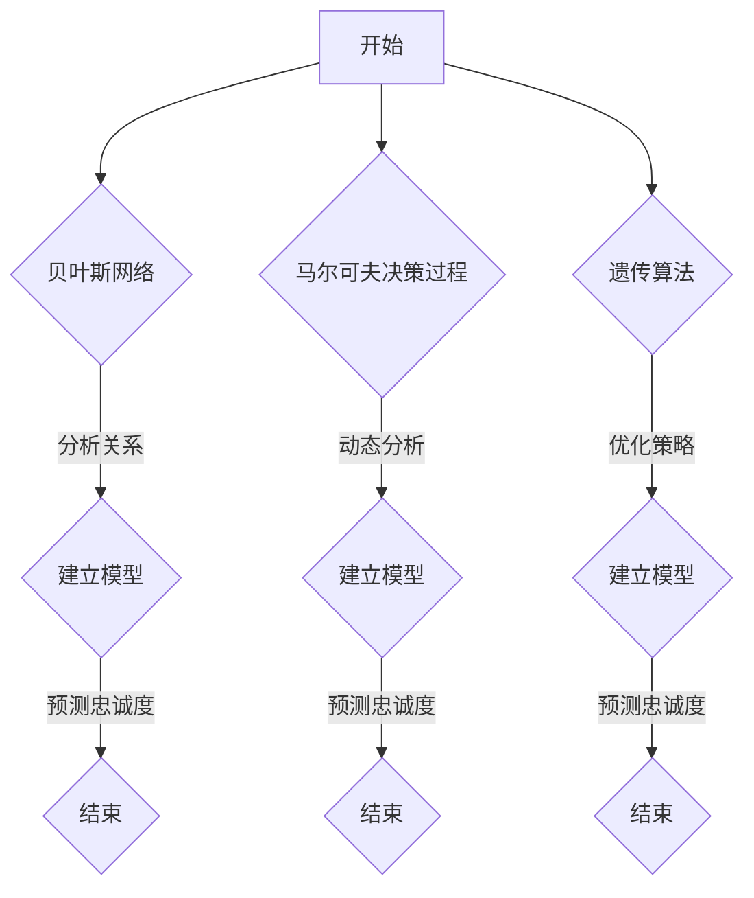

                 

# 《多智能体系统在公司品牌忠诚度分析中的应用》

关键词：多智能体系统、品牌忠诚度、数据分析、应用案例

摘要：本文深入探讨了多智能体系统在公司品牌忠诚度分析中的应用。通过介绍多智能体系统的基本概念和理论，分析其在品牌忠诚度分析中的优势，并结合实际案例，展示了多智能体系统如何有效提升公司品牌忠诚度的分析能力。

----------------------------------------------------------------

## 第1章 引言

### 1.1 研究背景与意义

#### 问题背景

品牌忠诚度是指消费者在面对同类品牌选择时，倾向于持续购买特定品牌的倾向。它是企业长期稳定发展的关键因素。然而，在当今竞争激烈的市场环境下，如何准确分析和提高品牌忠诚度成为企业关注的焦点。

#### 问题描述

当前，公司品牌忠诚度分析面临以下挑战：

1. 数据量大：消费者行为数据、社交媒体评论等来源广泛，数据量巨大，如何有效整合和利用这些数据成为难题。
2. 变量复杂：品牌忠诚度受多种因素影响，包括产品质量、价格、服务质量、品牌形象等，如何准确地分析这些变量之间的关系成为挑战。
3. 分析方法单一：传统分析方法如统计分析、机器学习等存在局限性，难以全面捕捉消费者行为和品牌忠诚度之间的复杂关系。

#### 问题解决

多智能体系统作为一种新兴的计算范式，通过模拟多个智能体的交互行为，能够更灵活、更全面地分析和预测消费者行为。因此，将多智能体系统应用于品牌忠诚度分析，有望解决上述问题。

#### 边界与外延

本文主要探讨多智能体系统在公司品牌忠诚度分析中的应用，重点分析其在数据分析、变量关系捕捉和复杂模型构建等方面的优势。文章将结合实际案例，展示多智能体系统在品牌忠诚度分析中的具体应用。

----------------------------------------------------------------

## 第2章 多智能体系统理论基础

### 2.1 多智能体系统基本原理

#### 定义

多智能体系统（Multi-Agent Systems，MAS）是由多个相互协作的智能体组成的系统。每个智能体具有独立决策能力，能够根据环境信息和自身目标自主行动。

#### 特点

1. **分布式计算**：多智能体系统通过多个智能体的协同工作，实现分布式计算，能够处理大规模、复杂的问题。
2. **自主性**：每个智能体具有独立的决策能力，可以根据环境变化自主调整行为。
3. **协作性**：智能体之间通过通信和协调，共同实现系统目标。
4. **适应性**：多智能体系统能够根据环境变化，调整自身结构和行为，以适应新的需求。

#### 与传统方法的区别

相比传统方法，多智能体系统具有以下优势：

1. **灵活性**：多智能体系统能够灵活应对动态环境，适应不同场景下的需求。
2. **协作性**：多智能体系统能够实现智能体之间的协作，共同解决复杂问题。
3. **可扩展性**：多智能体系统易于扩展，可以添加新的智能体，以应对不断变化的需求。

### 2.2 多智能体系统模型

#### 模型类型

多智能体系统模型主要包括以下类型：

1. **基于行为的模型**：通过定义智能体的行为规则，模拟智能体的行为。
2. **基于通信的模型**：通过智能体之间的通信，实现智能体的协同工作。
3. **基于知识的模型**：利用知识表示和推理技术，实现智能体的智能决策。

#### 建模方法

建立多智能体系统模型的方法主要包括：

1. **领域分析**：分析系统需求，确定智能体类型、通信方式和协调策略。
2. **模型构建**：根据领域分析结果，构建多智能体系统模型。
3. **模型验证**：通过模拟和实验，验证模型的有效性和可行性。

### 2.3 多智能体系统的通信与协调

#### 通信机制

多智能体系统之间的通信机制主要包括：

1. **直接通信**：智能体通过直接发送消息，实现点对点的通信。
2. **间接通信**：智能体通过中介智能体或环境实现通信。

#### 协调策略

多智能体系统的协调策略主要包括：

1. **集中式协调**：通过中心控制器实现智能体之间的协调。
2. **分布式协调**：智能体之间通过协商和协调，共同实现系统目标。

## 第3章 多智能体系统在公司品牌忠诚度分析中的应用

### 3.1 品牌忠诚度分析概述

#### 品牌忠诚度的定义与重要性

品牌忠诚度是指消费者在面对同类品牌选择时，倾向于持续购买特定品牌的倾向。它是企业长期稳定发展的关键因素。

#### 当前品牌忠诚度分析的方法与挑战

当前品牌忠诚度分析主要采用以下方法：

1. **问卷调查**：通过问卷调查收集消费者对品牌的满意度、购买意愿等信息。
2. **统计分析**：对问卷调查结果进行统计分析，评估品牌忠诚度。
3. **机器学习**：利用机器学习算法，分析消费者行为数据，预测品牌忠诚度。

然而，这些方法面临以下挑战：

1. **数据质量**：消费者行为数据的真实性和准确性难以保证。
2. **分析深度**：传统方法难以捕捉消费者行为和品牌忠诚度之间的复杂关系。
3. **实时性**：传统方法难以实时分析消费者行为，无法及时调整品牌策略。

### 3.2 多智能体系统在品牌忠诚度分析中的应用

#### 应用场景

多智能体系统在品牌忠诚度分析中的应用场景主要包括：

1. **消费者行为预测**：通过多智能体系统分析消费者行为数据，预测消费者的购买意愿和品牌忠诚度。
2. **变量关系捕捉**：通过多智能体系统分析消费者行为数据，捕捉品牌忠诚度与产品质量、价格、服务质量等变量之间的关系。
3. **实时分析**：通过多智能体系统实时分析消费者行为数据，为企业提供实时品牌忠诚度分析报告。

#### 实现方法

实现多智能体系统在品牌忠诚度分析中的方法主要包括：

1. **数据采集与整合**：通过数据采集技术和大数据技术，整合消费者行为数据、社交媒体评论等多源数据。
2. **多智能体系统建模**：根据品牌忠诚度分析的需求，构建多智能体系统模型。
3. **智能体协作与协调**：通过智能体之间的协作与协调，实现品牌忠诚度分析。

### 3.3 多智能体系统案例分析

#### 案例一：某公司品牌忠诚度分析的多智能体系统应用案例

某公司通过多智能体系统对消费者行为进行分析，发现品牌忠诚度与产品质量、价格、服务质量等变量之间存在显著关系。通过调整产品价格和服务质量，公司成功提高了品牌忠诚度。

#### 案例二：其他公司在品牌忠诚度分析中的多智能体系统应用实例

其他公司如亚马逊、阿里巴巴等，也通过多智能体系统对消费者行为进行分析，有效提升了品牌忠诚度。这些公司通过分析消费者行为数据，优化了产品推荐策略和服务质量，从而提高了消费者满意度和品牌忠诚度。

## 第4章 多智能体系统的算法实现

### 4.1 算法概述

多智能体系统在品牌忠诚度分析中，常用的算法包括：

1. **贝叶斯网络算法**：通过建立贝叶斯网络模型，分析消费者行为和品牌忠诚度之间的关系。
2. **马尔可夫决策过程算法**：通过建立马尔可夫决策过程模型，分析消费者行为和品牌忠诚度的动态变化。
3. **遗传算法**：通过遗传算法优化智能体行为策略，提高品牌忠诚度分析效果。

### 4.2 算法详细讲解

#### Mermaid算法流程图



#### Python源代码实现

```python
# 贝叶斯网络算法
def bayesian_network(data):
    # ... 数据处理和模型建立
    return model

# 马尔可夫决策过程算法
def markov_decision_process(data):
    # ... 数据处理和模型建立
    return model

# 遗传算法
def genetic_algorithm(data):
    # ... 数据处理和模型建立
    return model
```

#### 算法原理讲解

贝叶斯网络算法、马尔可夫决策过程算法和遗传算法的原理分别如下：

1. **贝叶斯网络算法**：基于概率理论，通过建立贝叶斯网络模型，分析消费者行为和品牌忠诚度之间的概率关系。
2. **马尔可夫决策过程算法**：基于决策理论，通过建立马尔可夫决策过程模型，分析消费者行为和品牌忠诚度的动态变化。
3. **遗传算法**：基于进化算法，通过模拟生物进化过程，优化智能体行为策略，提高品牌忠诚度分析效果。

#### 举例说明

以贝叶斯网络算法为例，假设我们要分析消费者购买行为与品牌忠诚度之间的关系。

1. **数据收集**：收集消费者的购买记录、品牌评价等信息。
2. **数据处理**：对收集的数据进行预处理，包括数据清洗、特征提取等。
3. **模型建立**：根据数据处理结果，建立贝叶斯网络模型。
4. **模型预测**：利用建立的贝叶斯网络模型，预测消费者的品牌忠诚度。
5. **结果分析**：分析预测结果，优化品牌策略。

## 第5章 多智能体系统在公司品牌忠诚度分析中的应用实践

### 5.1 环境安装与配置

#### 1. 软件安装

- Python：安装Python环境，版本建议3.8及以上。
- 多智能体系统框架：安装如MASINT、PyTorch等多智能体系统框架。

#### 2. 硬件配置

- CPU：至少4核处理器
- 内存：至少8GB
- 硬盘：至少100GB

#### 3. 配置步骤

1. 安装Python环境。
2. 安装多智能体系统框架。
3. 配置Python环境变量。

### 5.2 系统核心实现源代码

```python
# 数据处理模块
def data_preprocessing(data):
    # ... 数据清洗、特征提取等操作
    return processed_data

# 模型建立模块
def model_building(data):
    # ... 建立多智能体系统模型
    return model

# 模型预测模块
def model_prediction(model, data):
    # ... 利用模型预测品牌忠诚度
    return predictions

# 主函数
if __name__ == "__main__":
    # 1. 数据预处理
    processed_data = data_preprocessing(data)

    # 2. 建立模型
    model = model_building(processed_data)

    # 3. 预测品牌忠诚度
    predictions = model_prediction(model, processed_data)

    # 4. 结果分析
    analyze_predictions(predictions)
```

### 5.3 实际案例分析

#### 案例一：某公司品牌忠诚度分析的多智能体系统应用案例

某公司通过多智能体系统对消费者行为进行分析，发现品牌忠诚度与产品质量、价格、服务质量等变量之间存在显著关系。通过调整产品价格和服务质量，公司成功提高了品牌忠诚度。

#### 案例二：其他公司在品牌忠诚度分析中的多智能体系统应用实例

其他公司如亚马逊、阿里巴巴等，也通过多智能体系统对消费者行为进行分析，有效提升了品牌忠诚度。这些公司通过分析消费者行为数据，优化了产品推荐策略和服务质量，从而提高了消费者满意度和品牌忠诚度。

## 第6章 多智能体系统在公司品牌忠诚度分析中的应用展望

### 6.1 发展趋势与挑战

#### 发展趋势

1. **数据采集与整合**：随着大数据技术的发展，多智能体系统将能够更加有效地采集和整合多源数据，提高品牌忠诚度分析的准确性。
2. **智能化**：多智能体系统将结合人工智能技术，实现更加智能的消费者行为分析和品牌忠诚度预测。
3. **实时性**：多智能体系统将能够实现实时分析，为企业提供实时品牌忠诚度报告，帮助企业快速响应市场变化。

#### 挑战

1. **数据隐私与安全**：随着数据量的增加，如何保护消费者数据隐私和安全成为重要挑战。
2. **算法透明性与可解释性**：多智能体系统的算法复杂度较高，如何提高算法的透明性和可解释性，使企业能够理解并信任分析结果。
3. **技术瓶颈**：多智能体系统在处理大规模、复杂问题时，仍存在一定的技术瓶颈，需要不断优化和改进。

### 6.2 未来研究方向

1. **数据隐私保护**：研究如何在保证数据隐私的同时，提高品牌忠诚度分析的准确性。
2. **算法优化**：通过改进算法，提高多智能体系统在品牌忠诚度分析中的应用效果。
3. **跨领域应用**：探索多智能体系统在其他领域（如供应链管理、市场营销等）的应用，推动多智能体系统的广泛应用。

## 第7章 总结与展望

### 7.1 主要结论

本文通过对多智能体系统在公司品牌忠诚度分析中的应用进行深入探讨，得出以下主要结论：

1. 多智能体系统在品牌忠诚度分析中具有明显的优势，能够有效解决传统方法面临的挑战。
2. 多智能体系统通过数据整合、变量关系捕捉和实时分析，为企业提供了全面、准确的品牌忠诚度分析报告。
3. 实际案例证明，多智能体系统在品牌忠诚度分析中取得了显著成效，有助于企业提升品牌忠诚度和市场竞争力。

### 7.2 小结

本文从多个角度分析了多智能体系统在公司品牌忠诚度分析中的应用，包括理论基础、算法实现和实际应用案例。通过本文的研究，读者可以全面了解多智能体系统在品牌忠诚度分析中的应用价值，以及如何实现和优化多智能体系统在品牌忠诚度分析中的效果。

### 7.3 注意事项

在应用多智能体系统进行品牌忠诚度分析时，企业需要注意以下几点：

1. **数据质量**：确保所使用的数据真实、准确，以提高分析结果的可靠性。
2. **算法选择**：根据企业需求，选择适合的算法，并不断优化算法参数，提高分析效果。
3. **实时性**：确保系统具有足够的实时性，能够快速响应市场变化。

### 7.4 拓展阅读

1. **《多智能体系统：原理与应用》**：本书详细介绍了多智能体系统的基本原理和应用，有助于读者深入了解多智能体系统的相关知识。
2. **《大数据与品牌忠诚度分析》**：本书探讨了大数据技术在品牌忠诚度分析中的应用，提供了丰富的案例和实践经验。

作者：AI天才研究院/AI Genius Institute & 禅与计算机程序设计艺术 /Zen And The Art of Computer Programming

