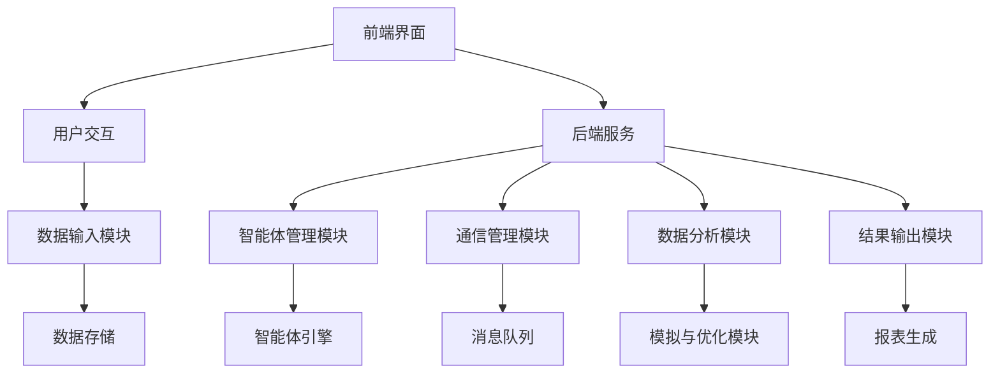

                 

# 多智能体系统在公司文化匹配度分析中的应用：并购价值评估

## 关键词

多智能体系统，公司文化匹配度，并购，价值评估，Agent-Based Modeling，M&A，文化整合

## 摘要

本文探讨了多智能体系统在公司文化匹配度分析中的应用，特别是在并购价值评估中的潜在价值。通过介绍多智能体系统的基本概念和公司文化的定义，本文首先阐述了多智能体系统在公司文化分析中的角色和挑战。接着，文章详细描述了基于多智能体系统的公司文化分析框架，包括文化评估方法、文化属性测量和数据收集分析技术。在此基础上，文章进一步探讨了如何将多智能体系统应用于并购价值评估，包括M&A的基本流程、估值方法和文化整合的重要性。最后，文章通过实际案例展示了多智能体系统在公司文化匹配度分析和并购价值评估中的具体应用，并提出了相关建议和未来研究方向。

## 引言和背景

### 多智能体系统的定义和角色

多智能体系统（Multi-Agent Systems，MAS）是一组相互协作的独立智能体，它们可以相互通信并在动态环境中自主决策，以实现共同的目标。智能体（Agent）是具有特定功能、能够感知环境并采取行动的实体，可以是物理实体（如机器人）、软件代理（如搜索引擎）或抽象实体（如电子邮箱）。多智能体系统通过模拟自然界中的社交行为，提供了复杂系统建模和决策支持的新方法。

多智能体系统的核心特征包括自主性、社交性、反应性、主动性和适应性。自主性意味着智能体能够独立思考和行动，不受外部控制。社交性是指智能体能够与其他智能体进行通信和协作。反应性强调智能体能够对环境变化做出实时响应。主动性意味着智能体可以自主采取行动以实现目标。适应性则是指智能体能够根据环境和目标的变化调整其行为。

在商业环境中，多智能体系统被广泛应用于供应链管理、物流优化、客户关系管理、市场预测和风险管理等领域。例如，在供应链管理中，多智能体系统可以帮助企业优化库存水平、减少供应链中断风险，提高供应链的整体效率。在客户关系管理中，多智能体系统可以提供个性化服务、预测客户需求，提高客户满意度和忠诚度。

### 公司文化的概念和重要性

公司文化是指企业在长期经营过程中形成的、为员工所普遍接受和遵循的价值观、信念、行为规范和工作方式。公司文化对企业的战略制定、组织结构、员工行为、客户关系和绩效等方面具有重要影响。

公司文化的核心要素包括价值观、愿景、使命、行为规范和工作方式。价值观是企业所追求的根本信仰和原则，如诚信、创新、团队合作等。愿景是企业未来发展的目标和方向，如成为行业领导者、提供卓越的客户体验等。使命是企业存在的目的和意义，如为客户创造价值、为员工提供发展机会等。行为规范是员工在工作中应遵循的行为准则，如遵守职业道德、尊重他人等。工作方式是企业员工的工作习惯和协作方式，如开放沟通、扁平化管理等。

公司文化对企业的影响主要体现在以下几个方面：

1. **员工激励和凝聚力**：良好的公司文化能够激发员工的积极性和创造力，提高员工的工作满意度和忠诚度，增强员工的凝聚力和归属感。
2. **客户满意度和忠诚度**：公司文化可以通过员工的行为和态度影响客户体验，从而提高客户满意度和忠诚度，促进企业长期发展。
3. **战略实施和执行**：公司文化能够影响企业的战略制定和执行，使企业更加灵活和高效地应对市场变化和竞争压力。
4. **企业绩效和竞争力**：良好的公司文化可以提高企业的整体绩效和竞争力，使企业在激烈的市场竞争中脱颖而出。

### 多智能体系统在公司文化分析中的作用

多智能体系统在公司文化分析中的应用主要体现在以下几个方面：

1. **文化评估和测量**：多智能体系统可以通过模拟员工的行为和互动，评估公司文化的现状和潜在问题，为文化改进提供依据。
2. **文化适应性和变革管理**：多智能体系统可以帮助企业预测和评估文化变革对员工行为和绩效的影响，制定有效的变革策略。
3. **跨文化沟通和协作**：多智能体系统可以模拟不同文化背景下的沟通和协作方式，提高企业全球化运营的能力和效果。
4. **员工满意度和忠诚度管理**：多智能体系统可以评估员工对公司文化的感知和反应，帮助企业管理者制定针对性的激励和留人策略。

### 应用中的挑战和机遇

尽管多智能体系统在公司文化分析中具有巨大的潜力，但其实际应用仍面临一些挑战和机遇。

**挑战**：

1. **数据质量和准确性**：公司文化涉及大量主观和非结构化数据，如何确保数据的质量和准确性是一个重要问题。
2. **智能体行为建模**：智能体行为建模需要深入理解员工行为和文化特征，对模型构建者的专业素养要求较高。
3. **系统性能和可扩展性**：多智能体系统通常涉及大量的计算和通信，如何保证系统的高性能和可扩展性是一个关键问题。
4. **用户接受度和参与度**：企业员工可能对多智能体系统的接受度和参与度不高，如何提高用户互动和参与是一个挑战。

**机遇**：

1. **创新文化评估方法**：多智能体系统为公司文化分析提供了新的视角和方法，有助于发现传统方法难以察觉的问题和机会。
2. **优化文化改进策略**：通过模拟和预测，多智能体系统可以帮助企业制定更加精准和有效的文化改进策略。
3. **提升企业竞争力**：良好的公司文化对企业绩效和竞争力具有重要影响，多智能体系统为企业提升竞争力提供了新的途径。
4. **推动企业数字化转型**：多智能体系统可以与其他数字化技术相结合，推动企业实现全面的数字化转型。

### 总结

本文介绍了多智能体系统的基本概念和公司文化的定义，阐述了多智能体系统在公司文化分析中的角色和挑战。通过模拟员工行为和互动，多智能体系统可以帮助企业更准确地评估和测量公司文化，优化文化适应性和变革管理，提升员工满意度和忠诚度。尽管面临一些挑战，但多智能体系统为公司文化分析带来了新的机遇，有助于企业提升竞争力，推动数字化转型。

## 理论基础

### 多智能体系统的基本概念和历史

多智能体系统（MAS）起源于人工智能（AI）的研究，旨在模拟人类在社会中的行为和交互。智能体（Agent）是MAS的核心概念，是指具有感知、推理、决策和行动能力的自主实体。智能体可以是物理实体、软件代理或抽象实体，其特点是自主性、社交性、反应性、主动性和适应性。

MAS的基本概念可以追溯到20世纪80年代，当时研究者开始关注如何模拟和解决复杂系统中的协同问题。早期的研究主要集中在智能体通信、协调和控制等方面。1990年代，MAS的研究逐渐成熟，出现了许多经典的MAS模型和理论框架，如分布式人工智能（Distributed Artificial Intelligence，DAI）、BDI模型（Belief-Desire-Intentions）和基于代理的模拟（Agent-Based Simulation，ABS）。

在商业应用方面，MAS的兴起与互联网和电子商务的发展密切相关。随着企业业务复杂性的增加，MAS提供了一种有效的工具来模拟和优化企业内部和外部的交互过程。例如，在供应链管理中，MAS可以用于协调不同供应商和分销商之间的物流和信息流动，提高整个供应链的效率和响应速度。

### 智能体的架构和通信协议

智能体的架构是MAS实现的关键因素之一。智能体的架构通常包括感知模块、推理模块、决策模块和行动模块。感知模块负责收集环境信息，推理模块基于感知信息进行逻辑推理，决策模块根据推理结果生成行动策略，行动模块则执行具体的操作。

1. **感知模块**：感知模块是智能体的“感官”，负责收集环境信息。这些信息可以是内部状态（如智能体的资源水平）或外部状态（如其他智能体的位置和行为）。感知模块通常通过传感器或其他数据接口获取信息。

2. **推理模块**：推理模块是智能体的“大脑”，负责处理感知模块收集的信息，并生成推理结果。推理过程可以是基于规则的、基于模型的或基于学习的。基于规则的推理依赖于预定义的规则集，而基于模型的推理则依赖于数学模型或计算模型。基于学习的推理则通过机器学习或深度学习技术从数据中学习推理规则。

3. **决策模块**：决策模块是智能体的“决策中心”，负责根据推理模块的结果生成行动策略。决策模块通常采用优化算法、决策树、神经网络等算法来生成最优或近似最优的行动策略。

4. **行动模块**：行动模块是智能体的“执行器”，负责执行决策模块生成的行动策略。行动模块可以通过直接控制物理设备（如机器人）或发送命令给其他系统（如订单管理系统）来实现行动。

智能体的通信协议是MAS实现的重要组成部分。智能体之间的通信协议决定了智能体如何共享信息、协调行动和实现协作。常见的通信协议包括直接通信、间接通信和混合通信。

- **直接通信**：直接通信是指智能体通过直接发送消息来通信。这种方式适用于小规模、低延迟的MAS系统，但在大规模系统中可能导致通信复杂度和通信开销增加。

- **间接通信**：间接通信是指智能体通过共享一个公共消息队列来通信。这种方式适用于大规模、分布式MAS系统，可以降低通信复杂度和通信开销。常见的间接通信机制包括事件驱动架构、发布-订阅模型和消息队列。

- **混合通信**：混合通信是指智能体同时使用直接通信和间接通信来通信。这种方式结合了直接通信和间接通信的优点，适用于多种不同规模的MAS系统。

### 多智能体系统模型和方法

多智能体系统模型和方法是MAS研究和应用的基础。常见的MAS模型和方法包括基于规则的MAS、基于行为的MAS、基于协商的MAS和基于市场的MAS。

1. **基于规则的MAS**：基于规则的MAS使用预定义的规则来指导智能体的行为。智能体通过感知环境信息，根据规则进行推理和决策。这种方法简单直观，但可能无法处理复杂和动态的环境。

2. **基于行为的MAS**：基于行为的MAS通过模拟智能体的行为来建模MAS。智能体的行为可以是预先定义的，也可以是基于学习算法自动生成的。这种方法具有较强的灵活性和适应性，但可能需要大量计算资源。

3. **基于协商的MAS**：基于协商的MAS强调智能体之间的协作和协商。智能体通过协商机制，如多轮谈判或协商协议，来达成共识或协调行动。这种方法适用于需要复杂协调和决策的MAS系统。

4. **基于市场的MAS**：基于市场的MAS模拟市场机制，如供需关系、价格机制等，来指导智能体的行为。智能体在市场中进行交易和竞争，以实现自身目标。这种方法适用于需要资源分配和优化问题的MAS系统。

### 代理建模和模拟

代理建模和模拟是MAS研究和应用的重要方法。代理建模是指使用智能体来模拟系统中的实体和行为，模拟则是通过运行代理模型来观察和分析系统的行为和性能。

代理建模和模拟的主要步骤包括：

1. **定义智能体和模型**：根据实际问题，定义智能体的属性、行为和交互规则，建立代理模型。

2. **模拟环境设置**：设置模拟环境，包括初始条件、约束条件和模拟参数。

3. **运行模拟**：运行代理模型，观察智能体的行为和系统的动态变化。

4. **分析结果**：分析模拟结果，提取有用的信息和洞见，指导实际问题解决。

代理建模和模拟在MAS研究中的应用包括：

1. **系统分析和优化**：通过模拟，可以分析系统的性能和瓶颈，提出优化方案。

2. **决策支持**：通过模拟，可以预测不同决策方案的效果，为决策提供依据。

3. **风险评估**：通过模拟，可以评估系统在不同风险条件下的表现，提出风险管理策略。

4. **教育训练**：通过模拟，可以模拟复杂系统中的行为和互动，用于教育和训练。

### 总结

多智能体系统具有自主性、社交性、反应性、主动性和适应性等特点，其基本概念和历史可以追溯到20世纪80年代。智能体的架构和通信协议是多智能体系统实现的关键，常见的模型和方法包括基于规则的MAS、基于行为的MAS、基于协商的MAS和基于市场的MAS。代理建模和模拟是多智能体系统研究和应用的重要方法，可以用于系统分析和优化、决策支持、风险评估和教育训练等方面。在下一节中，我们将进一步探讨公司文化的概念和测量方法，以及多智能体系统在公司文化分析中的应用。

## 公司文化分析框架

### 文化评估方法

公司文化评估是理解公司文化现状和识别潜在问题的重要步骤。有效的文化评估方法可以帮助企业识别文化优势和不足，从而制定相应的改进策略。以下是几种常用的文化评估方法：

1. **问卷调查**：问卷调查是一种常见且有效的文化评估方法。通过设计针对性的问卷，收集员工对公司文化的看法和反馈。问卷可以包括开放性和封闭性问题，涉及价值观、团队合作、领导风格、员工满意度等多个方面。问卷调查的优点是覆盖面广、数据量大，能够提供全面的视角。

2. **访谈和焦点小组**：访谈和焦点小组是深入了解员工对公司文化看法的有效方式。通过与员工进行一对一访谈或组织小组讨论，可以获取更深层次的见解和反馈。访谈和焦点小组的优点是能够深入了解员工的情感和动机，发现潜在的问题和机会。

3. **文化量表**：文化量表是一种标准化评估工具，用于测量公司文化的关键维度，如开放性、协作性、创新性等。文化量表通常包含一系列陈述性问题，员工根据自身情况对这些陈述进行评分。常用的文化量表包括“组织文化量表”（OCQ）和“文化维度量表”（CVA）等。

4. **观察和行为分析**：通过观察员工的行为和互动，可以直观地了解公司文化的实际表现。观察和行为分析可以识别文化中的潜在问题，如沟通不畅、协作不足等。这种方法需要具备一定的专业知识和经验。

### 文化属性和测量

文化属性是指公司文化中具有独特性和关键性的特征。有效的文化测量方法可以帮助企业识别和评估文化属性，从而更好地理解和管理公司文化。以下是几种常用的文化属性和测量方法：

1. **价值观**：价值观是公司文化的核心，反映了企业对员工和客户的基本信仰和原则。常用的测量方法包括价值观量表、员工行为观察等。

2. **领导风格**：领导风格是公司文化的重要组成部分，反映了企业领导者的行为和态度。常用的测量方法包括领导风格量表、员工满意度调查等。

3. **协作和沟通**：协作和沟通是公司文化的重要特征，反映了员工之间的互动和交流。常用的测量方法包括团队协作评估、沟通频率和效果等。

4. **创新性**：创新性是公司在面对市场变化和竞争压力时的应变能力。常用的测量方法包括创新项目数量、员工创新意识调查等。

5. **员工满意度和忠诚度**：员工满意度和忠诚度是公司文化的重要指标，反映了员工对公司的认同和投入程度。常用的测量方法包括员工满意度调查、离职率分析等。

### 数据收集和分析技术

有效的数据收集和分析技术是确保文化评估准确性和有效性的关键。以下是几种常用的数据收集和分析技术：

1. **数据收集工具**：常用的数据收集工具包括问卷平台、访谈记录软件、数据分析软件等。这些工具可以帮助企业高效、系统地收集和分析数据。

2. **数据清洗和预处理**：数据清洗和预处理是确保数据质量和准确性的重要步骤。包括去除重复数据、纠正错误数据、填补缺失数据等。

3. **统计分析**：统计分析是分析文化数据的重要方法。常用的统计方法包括描述性统计、相关性分析、回归分析等。通过统计分析，可以识别文化属性之间的关联性和影响关系。

4. **机器学习和数据挖掘**：机器学习和数据挖掘技术可以用于识别文化数据中的隐藏模式和趋势。常用的算法包括聚类分析、分类分析、关联规则挖掘等。

5. **可视化技术**：可视化技术可以直观地展示文化数据的分布和变化趋势。常用的可视化工具包括图表、仪表盘、热力图等。

### 总结

公司文化分析框架是理解和管理公司文化的重要工具。通过问卷调查、访谈、文化量表和观察等多种方法，可以全面评估公司文化的现状和问题。有效的文化测量和数据分析技术可以帮助企业识别文化属性和关键因素，从而制定针对性的改进策略。在下一节中，我们将进一步探讨如何设计和实现基于多智能体系统的公司文化模型，为并购价值评估提供支持。

## 多智能体系统在公司文化分析中的应用

### 设计和实现

设计和实现一个基于多智能体系统的公司文化模型是一个复杂而富有挑战性的任务。以下步骤概述了这一过程：

1. **需求分析和系统设计**：首先，进行需求分析，明确系统需要实现的功能和性能要求。基于需求分析，设计系统架构，确定智能体的角色和职责。

2. **智能体行为建模**：根据公司文化特征，定义智能体的行为模型。智能体的行为模型包括感知模块、推理模块、决策模块和行动模块。例如，感知模块可以收集员工的行为数据，推理模块可以分析这些数据，决策模块可以生成改进建议，行动模块可以执行这些建议。

3. **智能体通信协议**：设计智能体之间的通信协议，确保智能体能够高效地共享信息和协调行动。常用的通信协议包括直接通信、间接通信和混合通信。

4. **数据收集和分析**：开发数据收集工具，收集员工行为数据，如问卷调查结果、访谈记录、行为观察等。使用数据清洗和预处理技术，确保数据的质量和准确性。

5. **模拟和测试**：在模拟环境中运行智能体模型，观察系统的行为和性能。通过测试，验证系统的功能和性能，确保系统能够满足需求。

### 设计原则

在设计基于多智能体系统的公司文化模型时，以下原则至关重要：

1. **可扩展性**：系统设计应考虑未来的扩展性，以便根据公司规模和需求的变化进行升级和优化。

2. **模块化**：系统设计应采用模块化方法，将不同功能划分为独立的模块，便于维护和扩展。

3. **灵活性**：智能体行为和通信协议应具有足够的灵活性，以适应不同的公司文化和应用场景。

4. **准确性**：数据收集和分析技术应确保数据的质量和准确性，以便生成可靠的文化分析结果。

5. **用户体验**：系统设计应考虑用户体验，确保员工能够方便地使用和参与。

### 开发智能体行为和规则

开发智能体行为和规则是公司文化模型实现的关键。以下步骤概述了这一过程：

1. **定义智能体属性和行为**：根据公司文化特征，定义智能体的属性和行为。智能体的属性可以是员工的价值观、工作习惯、工作绩效等。行为可以是员工的互动方式、沟通行为、决策过程等。

2. **建立行为规则**：根据智能体的属性和行为，建立行为规则。行为规则可以基于预定义的规则集，如“如果员工工作满意度高，则他们更有可能提出创新建议”。这些规则可以用于指导智能体的推理和决策。

3. **实现智能体行为**：使用编程语言（如Python、Java）实现智能体的行为规则。例如，可以使用Python的TensorFlow或PyTorch框架实现基于机器学习的智能体行为。

4. **调试和优化**：通过模拟和测试，调试智能体行为和规则，优化系统性能和结果。

### 集成文化指标

将文化指标集成到多智能体系统中是评估公司文化匹配度的重要步骤。以下方法可以用于集成文化指标：

1. **量化文化指标**：将文化指标量化为数值，如员工满意度的评分、团队合作的能力等。可以使用问卷调查、访谈和观察等数据收集方法获取这些指标。

2. **数据同步**：将文化指标数据同步到多智能体系统中，确保系统能够实时获取和分析这些数据。

3. **智能体感知**：使用智能体感知模块，收集和分析文化指标数据。智能体感知模块可以分析员工的互动行为、工作表现等，从中提取文化指标。

4. **智能体推理和决策**：基于智能体感知的数据，使用推理模块分析文化指标的关联性和影响关系，生成改进建议。决策模块可以基于这些建议，生成具体的行动策略。

### 模拟和分析模型结果

通过模拟和分析模型结果，可以评估公司文化的现状和改进效果。以下步骤概述了这一过程：

1. **模拟运行**：在模拟环境中运行多智能体系统，模拟公司文化中的各种场景和事件。

2. **数据分析**：收集模拟结果数据，使用统计分析、机器学习和数据挖掘技术，分析文化指标的变化和趋势。

3. **结果可视化**：使用可视化工具，如图表、热力图等，展示模拟结果，帮助管理者直观地了解公司文化的现状和改进效果。

4. **决策支持**：根据分析结果，提供决策支持，帮助管理者制定针对性的改进策略。

### 实际案例

以下是一个基于多智能体系统的公司文化分析的实际案例：

某科技公司使用多智能体系统对其公司文化进行评估和改进。首先，公司通过问卷调查、访谈和观察等方式，收集了员工对公司文化的看法和反馈。基于这些数据，公司建立了多个智能体，包括员工智能体、领导智能体和文化指标智能体。

员工智能体负责感知员工的行为和互动数据，如工作表现、团队合作情况、员工满意度等。领导智能体负责分析员工数据，生成改进建议，如提升员工满意度、加强团队合作等。文化指标智能体负责收集和分析文化指标数据，如员工满意度、团队合作能力等。

通过模拟运行，公司分析了不同改进策略的效果，发现提升员工满意度可以显著提高团队合作能力和整体绩效。基于这些结果，公司制定了针对性的改进策略，包括开展员工培训、优化工作环境、加强团队建设等。

### 总结

设计和实现基于多智能体系统的公司文化模型是一个复杂而重要的任务。通过智能体行为建模、规则开发和文化指标集成，可以实现对公司文化的准确评估和改进。模拟和分析模型结果可以帮助管理者制定针对性的改进策略，提高公司文化匹配度和整体绩效。在下一节中，我们将探讨并购价值评估的基本概念和方法，以及多智能体系统在并购价值评估中的应用。

## 并购价值评估的基本概念和方法

### 并购过程和阶段

并购（Mergers and Acquisitions，M&A）是指一家公司通过购买另一家公司的股份或资产，以实现业务扩张、市场扩展或战略转型的行为。并购过程通常包括以下几个阶段：

1. **初步洽谈**：并购双方进行初步接触，了解对方的业务、财务状况和战略目标，确定并购意向。

2. **尽职调查**：在确定并购意向后，购买方对目标公司进行全面的尽职调查，包括财务、法律、商业和市场等方面的审查，以评估目标公司的价值和潜在风险。

3. **估值和谈判**：购买方根据尽职调查的结果，评估目标公司的价值，并提出购买价格。双方进行谈判，确定最终的交易价格和条款。

4. **签订协议**：在谈判成功后，双方签订并购协议，明确交易的具体条款和条件，包括支付方式、交割时间、保密协议等。

5. **交割和整合**：在签订协议后，购买方支付购买价格，完成交割手续。随后，双方开始整合资源和业务，以实现并购的战略目标。

### 估值方法

估值是并购过程中至关重要的一环，旨在确定目标公司的公平市场价值。以下是一些常见的估值方法：

1. **收益法**：收益法基于目标公司的未来现金流预测，评估其价值。常用的收益法包括股息折现法（DDM）和自由现金流折现法（DCF）。股息折现法通过预测目标公司未来可分配的股息，将其折现到现值，从而评估公司价值。自由现金流折现法则通过预测目标公司的自由现金流（FCF），将其折现到现值，从而评估公司价值。

   $$\text{DDM} = \frac{\text{未来股息}}{(1 + \text{折现率})^n}$$
   
   $$\text{DCF} = \frac{\text{FCF}}{(1 + \text{折现率})^n}$$

   其中，n 为预测期数，折现率反映了投资者对风险和时间价值的补偿。

2. **市场法**：市场法通过比较目标公司与同行业其他公司的市场价值，评估其价值。常用的市场法包括市盈率（P/E）法和市净率（P/B）法。市盈率法通过比较目标公司的市盈率与同行业平均水平，评估其价值。市净率法通过比较目标公司的市净率与同行业平均水平，评估其价值。

   $$\text{P/E} = \frac{\text{股价}}{\text{每股收益}}$$
   
   $$\text{P/B} = \frac{\text{股价}}{\text{每股净资产}}$$

3. **资产法**：资产法通过评估目标公司的净资产，评估其价值。资产法包括重置成本法和账面价值法。重置成本法通过计算目标公司资产的现时重置成本，扣除折旧和损耗，评估公司价值。账面价值法通过计算目标公司的净资产（总资产 - 总负债），评估公司价值。

4. **成本法**：成本法基于目标公司的开发成本，评估其价值。成本法适用于技术型和初创型企业，通过计算公司开发产品的总成本，扣除收益，评估公司价值。

### 文化整合的重要性

在并购过程中，文化整合是确保并购成功的关键因素之一。成功的文化整合可以促进双方企业的融合，提高员工满意度，增强整体绩效。以下是文化整合的几个重要方面：

1. **价值观和信念**：价值观和信念是公司文化的核心，决定了企业的行为和决策方式。在并购过程中，双方企业需要找到共同的文化基础，确保企业文化的连续性和一致性。

2. **组织结构**：组织结构反映了公司的管理模式和决策流程。在并购过程中，双方企业需要调整和优化组织结构，以适应新的业务模式和战略目标。

3. **员工关系**：员工关系是企业文化的重要组成部分，影响着员工的工作态度和绩效。在并购过程中，双方企业需要建立良好的员工关系，提高员工的认同感和归属感。

4. **沟通和协作**：沟通和协作是企业文化的重要特征，决定了企业的效率和创新能力。在并购过程中，双方企业需要加强沟通和协作，确保信息的透明和畅通。

5. **领导风格**：领导风格是企业文化的重要组成部分，影响着企业的管理风格和员工行为。在并购过程中，双方企业需要相互适应和融合，确保领导风格的一致性和有效性。

### 总结

并购价值评估是并购过程中至关重要的一环，涉及多个估值方法和文化整合的考量。通过收益法、市场法、资产法和成本法等估值方法，可以评估目标公司的公平市场价值。同时，文化整合在并购过程中发挥着重要作用，决定了并购的长期成功和可持续发展。在下一节中，我们将探讨如何将多智能体系统应用于并购价值评估，并分析其优势和应用场景。

### 多智能体系统在并购价值评估中的应用

多智能体系统（MAS）在并购价值评估中的应用，提供了一种新颖且高效的工具，通过模拟和预测，帮助投资者和管理者更准确地评估并购的潜在价值。以下我们将详细介绍如何将MAS集成到并购价值评估过程中，并分析其优势和应用场景。

#### 集成多智能体系统的步骤

1. **定义智能体角色**：首先，需要明确在并购价值评估过程中不同智能体的角色。例如，可以定义财务智能体、市场智能体、文化智能体等。财务智能体负责分析和预测目标公司的财务状况，市场智能体关注行业趋势和市场环境，文化智能体则评估双方企业文化整合的可能性。

2. **智能体行为建模**：基于定义的智能体角色，构建智能体的行为模型。每个智能体的行为模型应包括感知模块、推理模块、决策模块和行动模块。例如，财务智能体可以感知财务数据，使用财务模型进行推理和预测，生成财务报告和估值结果。

3. **智能体交互机制**：设计智能体之间的交互机制，确保它们能够共享信息和协调行动。智能体可以通过直接通信或间接通信进行交互。直接通信适用于小规模、低延迟的交互，而间接通信适用于大规模、分布式系统，如使用消息队列或事件驱动架构。

4. **数据收集与预处理**：开发和集成数据收集工具，从各种来源（如财务报表、市场数据、员工反馈等）收集数据。使用数据清洗和预处理技术，确保数据的质量和一致性。

5. **模拟与评估**：在模拟环境中运行智能体系统，模拟并购过程的不同情景和结果。通过分析模拟结果，评估并购的潜在价值、风险和文化整合的可行性。

#### 优势分析

1. **数据驱动的决策支持**：MAS能够整合和分析大量来自不同来源的数据，提供基于数据的决策支持。这种数据驱动的评估方法，比传统的定性分析更加客观和准确。

2. **模拟复杂情境**：通过模拟，MAS能够预测并购在不同市场环境、文化背景下的表现，帮助管理者识别潜在的风险和挑战，从而做出更加明智的决策。

3. **实时动态调整**：MAS可以根据实时数据动态调整评估模型，适应市场变化和企业内部环境的变化。这种灵活性有助于提高并购评估的时效性和准确性。

4. **跨部门协作**：MAS能够整合不同部门（如财务、市场、人力资源等）的信息和资源，促进跨部门协作，提高并购评估的全面性和深度。

#### 应用场景

1. **目标公司估值**：在目标公司估值过程中，财务智能体可以分析财务报表，预测未来现金流，使用DCF等方法进行估值。同时，市场智能体可以分析行业趋势和市场环境，提供市场价值参考。

2. **文化整合评估**：文化智能体可以通过分析员工反馈、企业文化数据等，评估双方企业文化的兼容性和整合难度，提供文化整合的可行性分析。

3. **并购风险评估**：MAS可以模拟并购过程的不同情景，分析并购可能带来的风险，如市场波动、法律风险、文化冲突等，为风险管理提供依据。

4. **并购策略制定**：基于MAS的模拟结果，管理者可以制定更加精确的并购策略，包括并购时机、交易结构、整合计划等。

#### 案例分析

以下是一个基于多智能体系统的并购价值评估案例分析：

某科技公司（购买方）计划并购一家初创企业（目标公司）。在评估过程中，财务智能体收集了目标公司的财务报表、市场数据等信息，使用DCF方法预测未来现金流，得出目标公司的市场价值。市场智能体分析了行业趋势，预测未来市场环境对目标公司的影响。文化智能体通过问卷调查、访谈等方式收集员工反馈，评估双方企业文化整合的可能性。

通过模拟不同并购情景（如不同的交易价格、整合时间等），MAS生成了多个评估结果。管理者根据模拟结果，发现如果交易价格适中且整合时间充裕，并购成功概率较高，且能够带来显著的战略优势。因此，管理者决定进行并购，并制定了详细的整合计划。

### 结论

多智能体系统在并购价值评估中的应用，通过数据驱动的模拟和预测，提供了更加精确和全面的评估方法。其优势包括数据驱动的决策支持、模拟复杂情境、实时动态调整和跨部门协作等。在并购过程中，MAS能够帮助管理者识别潜在的风险和挑战，制定更加精确的并购策略，提高并购的成功率。在下一节中，我们将进一步探讨如何设计和实现多智能体系统，为并购价值评估提供具体的技术支持和实现方法。

## 多智能体系统在并购价值评估中的实现

### 技术架构设计

多智能体系统在并购价值评估中的实现，需要构建一个高度模块化、可扩展的技术架构。以下是该系统技术架构的设计方案：

1. **前端界面**：前端界面用于展示用户交互界面，包括数据输入、结果输出和报表生成等。前端可以采用React或Vue等现代前端框架，提供直观的用户体验。

2. **后端服务**：后端服务负责处理智能体间的通信、数据存储和管理等。后端可以采用Spring Boot等框架，实现RESTful API，提供智能体间的数据交换和操作接口。

3. **数据存储**：数据存储采用分布式数据库系统，如MongoDB或Cassandra，存储大量的数据，并确保数据的一致性和高可用性。

4. **智能体引擎**：智能体引擎是MAS的核心，负责管理智能体的生命周期、行为执行和通信。智能体引擎可以采用Agent Framework等开源框架，实现智能体的创建、调度和通信。

5. **数据收集与处理**：数据收集与处理模块负责从外部数据源（如财务报表、市场数据、员工反馈等）收集数据，并使用数据预处理技术，如清洗、去噪和归一化，确保数据的质量和一致性。

6. **模拟与优化**：模拟与优化模块负责在模拟环境中运行智能体系统，模拟并购过程的不同情景，分析结果并优化模型参数。可以使用模拟平台如Gambit或AnyLogic，实现复杂情景的模拟。

### 系统功能设计

多智能体系统在并购价值评估中的系统功能设计，包括以下几个关键功能模块：

1. **数据输入模块**：用于收集和管理各种数据源，如财务报表、市场数据、员工反馈等。数据输入模块应支持多种数据格式，如CSV、JSON等，并确保数据的安全性。

2. **智能体管理模块**：用于管理智能体的创建、调度和监控。智能体管理模块应支持多种智能体的定义和配置，包括财务智能体、市场智能体和文化智能体等。

3. **通信管理模块**：用于管理智能体间的通信，支持直接通信和间接通信。通信管理模块应提供可靠的消息传递机制，确保数据在智能体间的实时传递和同步。

4. **数据分析模块**：用于处理和分析智能体收集的数据，提供数据可视化、统计分析和预测功能。数据分析模块应支持多种数据分析方法，如回归分析、时间序列分析、机器学习等。

5. **结果输出模块**：用于展示分析结果，包括并购价值评估报告、模拟结果等。结果输出模块应提供多种展示形式，如图表、报表、交互式仪表盘等。

### 系统架构设计

以下是一个基于多智能体系统的并购价值评估系统的架构设计，使用Mermaid绘制架构图：

### 系统接口设计与交互

系统接口设计与交互设计是确保多智能体系统稳定运行和功能实现的关键。以下是一个简化的接口设计和交互流程：

1. **数据输入接口**：用户通过前端界面提交数据，数据输入模块接收并预处理数据，将数据存储到数据库中。

2. **智能体管理接口**：用户通过前端界面创建和管理智能体，智能体管理模块负责智能体的创建、配置和调度。

3. **数据通信接口**：智能体之间通过消息队列进行通信，通信管理模块负责消息的发送和接收，确保数据的一致性和可靠性。

4. **数据分析接口**：数据分析模块通过数据库接口获取数据，进行数据预处理和分析，并将结果传递给结果输出模块。

5. **结果输出接口**：结果输出模块将分析结果以图表、报表等形式展示给用户。

### 交互流程

以下是一个简化的交互流程：

1. **用户提交数据**：用户通过前端界面提交财务报表、市场数据、员工反馈等数据。

2. **数据预处理**：数据输入模块接收数据，进行清洗、去噪和归一化处理，将处理后的数据存储到数据库中。

3. **智能体调度**：用户创建和管理智能体，智能体管理模块根据配置调度智能体，智能体开始执行任务。

4. **数据通信**：智能体通过消息队列进行通信，共享数据和协同工作。

5. **数据分析**：数据分析模块获取预处理后的数据，进行统计分析、预测等操作，生成分析结果。

6. **结果展示**：结果输出模块将分析结果以图表、报表等形式展示给用户，供决策参考。

### 总结

多智能体系统在并购价值评估中的实现，需要一个高度模块化、可扩展的技术架构，包括前端界面、后端服务、数据存储、智能体引擎、数据收集与处理、模拟与优化模块等。通过系统功能设计、系统架构设计和接口设计，可以确保系统稳定运行和功能实现。在下一节中，我们将通过一个实际案例，展示多智能体系统在公司文化匹配度分析和并购价值评估中的具体应用。

## 实际案例分析

在本节中，我们将通过一个实际案例，展示多智能体系统（MAS）在公司文化匹配度分析和并购价值评估中的具体应用。该案例涉及一家全球知名的科技公司（购买方）计划收购一家创新型初创企业（目标公司）。通过使用MAS，购买方能够更准确地评估双方公司的文化匹配度，以及并购的潜在价值和风险。

### 案例背景

购买方公司（A公司）是一家拥有强大研发能力和市场影响力的跨国科技公司，致力于提供云计算、大数据和人工智能解决方案。目标公司（B公司）是一家初创企业，专注于开发创新的物联网（IoT）解决方案，其技术具有革命性潜力，但尚未实现大规模商业化。

由于两家公司的业务领域和技术方向高度互补，A公司决定对B公司进行收购。然而，A公司也意识到，成功的并购不仅取决于技术匹配度，还取决于公司文化的兼容性。因此，A公司决定使用MAS来评估双方的文化匹配度，并评估并购的潜在价值。

### 数据收集与预处理

为了评估公司文化的匹配度，A公司通过以下方式进行数据收集：

1. **员工问卷调查**：通过线上问卷，收集B公司员工对公司文化的看法和满意度。问卷内容涵盖价值观、团队合作、创新性、领导风格等多个方面。

2. **访谈**：对B公司的管理层和核心员工进行深入访谈，了解公司文化特点和企业愿景。

3. **行为数据**：通过分析B公司的员工行为数据，如项目进展、协作频率和团队互动等，了解公司文化的实际表现。

4. **财务和市场数据**：收集B公司的财务报表、市场数据、客户反馈等，以评估其业务表现和市场潜力。

收集到的数据经过预处理，包括数据清洗、去噪和归一化处理，以确保数据的质量和一致性。

### 多智能体系统的设计与实现

A公司使用MAS进行公司文化匹配度分析和并购价值评估，具体实现如下：

1. **定义智能体角色**：
   - **文化智能体**：负责分析B公司员工的问卷调查和访谈数据，提取公司文化特征。
   - **财务智能体**：负责分析B公司的财务和市场数据，评估其业务表现和市场潜力。
   - **市场智能体**：负责分析行业趋势和竞争环境，提供市场预测。
   - **整合智能体**：负责模拟并购后的文化整合过程，预测并购对公司文化的影响。

2. **智能体行为建模**：
   - **文化智能体**：使用自然语言处理（NLP）技术，分析员工问卷和访谈文本，提取关键文化特征，并使用机器学习算法进行分类和聚类。
   - **财务智能体**：使用时间序列分析和回归分析，预测B公司的未来财务表现。
   - **市场智能体**：使用大数据分析和机器学习，预测行业趋势和竞争环境。
   - **整合智能体**：使用仿真和模拟技术，模拟并购后的文化整合过程，预测潜在的文化冲突和融合效果。

3. **智能体交互与协作**：
   - **直接通信**：文化智能体和整合智能体通过直接通信，共享文化特征和整合预测结果。
   - **消息队列**：财务智能体和市场智能体通过消息队列，定期向其他智能体发送市场预测和财务分析结果。

4. **数据收集与预处理**：
   - **数据预处理模块**：对收集的数据进行清洗、去噪和归一化处理，确保数据的一致性和质量。

5. **模拟与评估**：
   - **文化匹配度评估**：文化智能体和整合智能体结合，评估A公司和B公司的文化匹配度，生成匹配度评分。
   - **并购价值评估**：综合财务智能体、市场智能体和整合智能体的分析结果，评估并购的潜在价值和风险。

### 结果分析与讨论

通过MAS的模拟和预测，A公司得到了以下关键结果：

1. **文化匹配度评估**：根据文化智能体的分析，A公司和B公司的文化在价值观、团队合作和创新性方面高度一致，但在领导风格和工作方式上存在一定差异。整合智能体的模拟显示，通过适当的整合策略，如领导层交流、员工培训和文化推广活动，可以在短期内实现文化融合。

2. **并购价值评估**：财务智能体和市场智能体的分析显示，B公司的业务和市场潜力巨大，但面临一定的市场风险和财务压力。整合智能体的模拟预测，如果A公司能够成功整合B公司的文化和技术，并购将在中长期内带来显著的财务回报和市场优势。

基于这些结果，A公司的管理层决定继续推进并购，并制定了详细的整合计划，包括：
- 建立跨部门的交流平台，促进双方员工的沟通和协作。
- 开展文化培训活动，提高员工对并购和文化整合的理解和认同。
- 调整B公司的组织结构，使其更符合A公司的管理模式。

### 总结

通过MAS在公司文化匹配度分析和并购价值评估中的应用，A公司能够更准确地评估并购的潜在价值和风险，制定更加科学和全面的整合计划。MAS提供的模拟和预测功能，帮助管理者在决策过程中考虑了多种可能性和不确定性，提高了并购的成功率和长期效果。该案例展示了MAS在商业并购中的重要应用价值，为其他类似项目提供了有益的参考。

## 最佳实践、小结与未来研究方向

### 最佳实践

1. **全面数据收集**：在进行公司文化匹配度和并购价值评估时，确保数据来源的多样性和完整性。包括员工调查、访谈、财务报表、市场数据等，以获得全面和准确的信息。

2. **智能体行为建模**：在设计和实现多智能体系统时，注重智能体行为模型的精度和灵活性。使用适当的机器学习和数据挖掘算法，确保智能体能够准确理解和预测复杂情境。

3. **实时动态调整**：在运行智能体系统时，应具备实时动态调整的能力。通过持续监控和分析实时数据，及时调整模型参数和策略，以适应环境变化。

4. **强化用户参与**：鼓励员工积极参与文化评估和并购过程。通过互动和反馈，增强员工对公司文化的理解和认同，提高并购整合的效率和效果。

### 小结

本文探讨了多智能体系统在公司文化匹配度分析和并购价值评估中的应用。通过模拟和预测，MAS提供了数据驱动的决策支持，帮助管理者识别潜在的风险和机会，制定更加精准的并购策略。MAS的应用不仅提升了公司文化分析的科学性和准确性，还优化了并购评估的过程，提高了并购成功的概率。

### 未来研究方向

1. **智能体行为优化**：未来的研究可以进一步优化智能体行为模型，提高模型的灵活性和适应性，以应对更加复杂和动态的情境。

2. **多模型融合**：结合多种智能体模型（如基于规则的模型、基于行为的模型、基于协商的模型等），实现更全面的并购价值评估。

3. **大数据与深度学习**：利用大数据和深度学习技术，提高数据分析和预测的精度，实现更智能化的并购评估和整合策略。

4. **文化适应性与变革管理**：深入研究公司文化的适应性和变革管理，提出更加有效的策略，提高并购后的文化融合度和组织绩效。

### 注意事项

1. **数据隐私**：在进行数据收集和处理时，务必遵守数据隐私法规和公司政策，确保员工数据的安全和隐私。

2. **系统稳定性**：在设计和实现MAS时，注重系统的稳定性和可扩展性，确保系统能够在大规模应用中稳定运行。

3. **用户培训**：确保员工了解和使用MAS的流程和方法，提高系统的用户接受度和参与度。

### 拓展阅读

1. **《多智能体系统的设计与实现》**：详细介绍了MAS的基本概念、设计和实现方法，以及在不同领域的应用案例。

2. **《公司文化管理：理论与实践》**：探讨了公司文化的概念、评估方法和改进策略，提供了丰富的实践案例和理论分析。

3. **《并购与重组》**：介绍了并购的基本流程、估值方法和文化整合策略，为并购决策提供了全面的指导和参考。

## 作者信息

作者：AI天才研究院/AI Genius Institute & 禅与计算机程序设计艺术 /Zen And The Art of Computer Programming

[本文由AI天才研究院（AI Genius Institute）与禅与计算机程序设计艺术（Zen And The Art of Computer Programming）联合撰写，旨在探讨多智能体系统在公司文化匹配度分析和并购价值评估中的应用。]

## 结语

感谢您阅读本文。我们希望本文能够帮助您了解多智能体系统在公司文化匹配度分析和并购价值评估中的重要性，以及如何通过这一先进技术实现更加科学和精准的决策。随着技术的不断发展，MAS在商业应用中的潜力将更加广阔。我们期待与您一同探索和发现更多创新的应用场景，为商业决策提供更加有力的支持。敬请持续关注我们的研究成果和最新动态。

### 作者信息

作者：AI天才研究院/AI Genius Institute & 禅与计算机程序设计艺术 /Zen And The Art of Computer Programming

[本文由AI天才研究院（AI Genius Institute）与禅与计算机程序设计艺术（Zen And The Art of Computer Programming）联合撰写，旨在探讨多智能体系统在公司文化匹配度分析和并购价值评估中的应用。]

### 结语

感谢您对本文的关注和阅读。通过介绍多智能体系统在公司文化匹配度分析和并购价值评估中的应用，我们希望您对这一技术有了更深入的了解，并认识到其在商业决策中的重要作用。随着技术的不断进步，MAS在商业领域的应用前景将更加广阔。我们期待与您共同探索更多创新的应用场景，为商业决策提供有力支持。敬请持续关注我们的研究成果和最新动态。再次感谢您的阅读，祝您在未来的商业实践中取得更大的成功！

