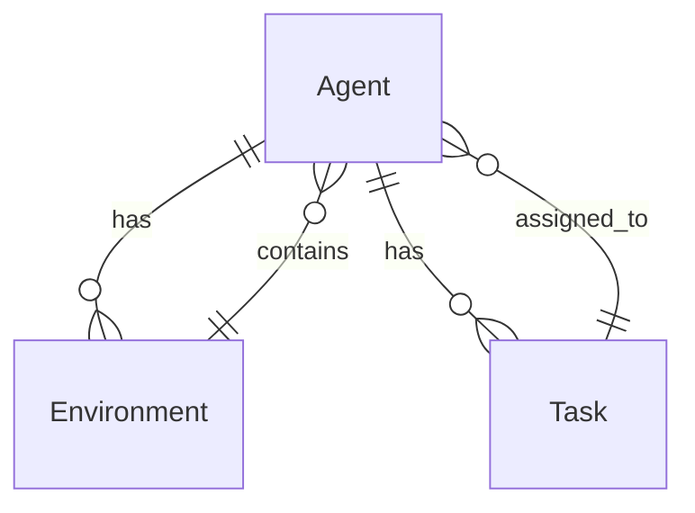
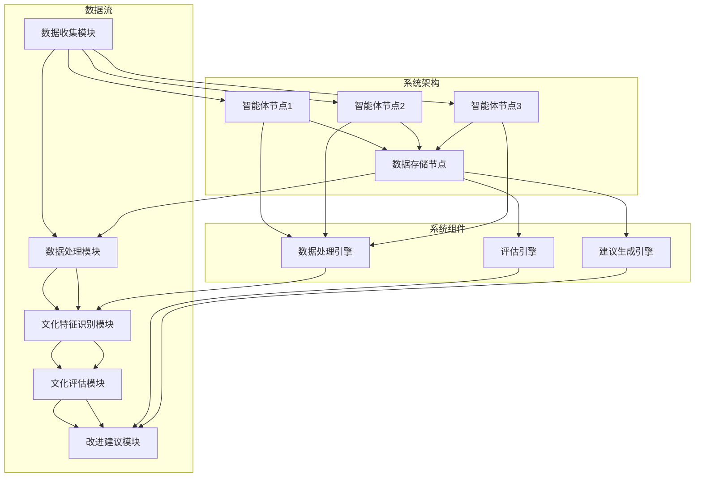

                 

### 多智能体系统的基本概念与理论基础

#### 第1章：多智能体系统的概述

在当今数字化和自动化日益普及的商业环境中，企业文化成为了企业成功的关键因素之一。企业文化不仅仅是指挂在墙上的口号，而是贯穿于公司内部沟通、员工行为和日常运营的深层价值观和行为准则。评估公司文化，以了解其健康程度和存在的问题，成为了现代企业管理中的一项重要任务。然而，传统的公司文化评估方法通常依赖于主观的问卷和访谈，难以全面、客观地反映实际情况。

多智能体系统（Multi-Agent Systems, MAS）作为一种新兴的分布式人工智能技术，因其能够模拟复杂的社会系统和人类行为而逐渐受到关注。多智能体系统由多个自主的智能体（agent）组成，这些智能体可以通过通信和协作来实现共同的目标。这种分布式和自组织的特点，使得多智能体系统在解决复杂问题和应对动态环境方面具有独特的优势。

本章首先介绍多智能体系统在企业文化评估中的需求背景，然后探讨多智能体系统的兴起原因，最后概述多智能体系统的定义、特点及其分类。

#### 1.1 问题的背景与描述

**1.1.1 企业文化评估的需求**

企业文化是企业在长期经营过程中所形成的共同价值观和行为准则。一个健康、积极的企业文化能够促进员工之间的合作，提高工作效率，增强企业的竞争力。然而，企业文化的评估往往面临以下挑战：

- **主观性**：传统的评估方法主要依赖于员工的主观反馈，这些反馈可能受到个人情绪、偏见等因素的影响，难以保证评估结果的客观性。
- **全面性**：企业文化涉及多个方面，如价值观、沟通方式、领导风格等，传统的评估方法难以全面覆盖。
- **动态性**：企业文化不是静态的，它会随着企业内外部环境的变化而演变，传统的评估方法难以及时捕捉这些变化。

为了解决上述问题，企业需要一种能够客观、全面、动态地评估企业文化的工具。

**1.1.2 多智能体系统的兴起**

多智能体系统作为一种分布式人工智能技术，在多个领域都取得了显著的成果。其能够模拟复杂的社会系统，具有以下优势：

- **自主性**：智能体可以自主地感知环境、制定计划并采取行动，减少了人为干预的需要。
- **协同性**：智能体之间可以通过通信和协作来实现共同的目标，提高了系统的整体效能。
- **适应性**：智能体能够根据环境的变化动态调整自己的行为，具有较好的适应性。

这些特点使得多智能体系统在企业文化评估中具有广泛的应用潜力。

#### 1.2 多智能体系统的定义与特点

**1.2.1 多智能体系统的定义**

多智能体系统（MAS）是由多个智能体（agent）组成的系统，这些智能体可以通过通信和协作来实现共同的目标。智能体可以是人、软件程序或其他实体，它们具有以下特征：

- **自治性**：智能体具有自主决策的能力，能够独立地执行任务。
- **社交性**：智能体可以通过通信与外界和其他智能体进行交互。
- **反应性**：智能体能够对环境的变化做出实时响应。

**1.2.2 多智能体系统的特点**

多智能体系统具有以下特点：

- **分布式**：多智能体系统中的智能体分布在不同的地理位置或计算节点上，通过通信网络进行交互。
- **自组织**：多智能体系统能够在没有集中控制的情况下自主组织，通过智能体的协作实现系统目标。
- **适应性**：多智能体系统能够根据环境的变化动态调整其结构和行为。
- **复杂性**：多智能体系统可以模拟复杂的社会系统和人类行为，具有广泛的应用场景。

**1.2.3 多智能体系统的分类**

多智能体系统可以根据不同的标准进行分类：

- **基于交互方式**：可以分为同步多智能体系统和异步多智能体系统。
- **基于智能体类型**：可以分为完全自治多智能体系统、半自治多智能体系统和完全协作多智能体系统。
- **基于应用领域**：可以分为军事多智能体系统、经济多智能体系统、社会多智能体系统等。

#### 1.3 多智能体系统的理论基础

**1.3.1 分布式人工智能**

分布式人工智能（Distributed Artificial Intelligence, DAINT）是多智能体系统的重要理论基础。它研究如何将复杂问题分解为多个子问题，并由多个智能体协同解决。分布式人工智能具有以下特点：

- **并行性**：多个智能体可以同时执行任务，提高了系统的处理速度。
- **容错性**：即使某个智能体出现故障，其他智能体仍可以继续工作，提高了系统的可靠性。
- **适应性**：智能体可以根据环境的变化动态调整其行为和任务分配。

**1.3.2 多智能体通信与协作**

多智能体通信与协作是多智能体系统的核心问题之一。智能体之间的通信通常包括以下方面：

- **通信协议**：定义智能体之间通信的规则和标准。
- **信息共享**：智能体可以通过共享信息来协同完成任务。
- **协商机制**：智能体之间需要通过协商机制来解决冲突和达成一致。

协作机制包括分布式算法、博弈论、多目标优化等，这些机制可以确保智能体之间的有效协作。

**1.3.3 多智能体系统的安全性**

多智能体系统的安全性是确保系统稳定运行和防止恶意攻击的关键。安全性包括以下几个方面：

- **访问控制**：限制智能体对系统和资源的访问权限。
- **身份验证**：确保智能体的身份真实可靠。
- **通信安全**：保护智能体之间的通信不被窃听或篡改。
- **系统监控**：对系统运行状态进行实时监控，及时发现和应对异常情况。

#### 1.4 多智能体系统的核心概念与联系

**1.4.1 多智能体系统的核心概念**

多智能体系统的核心概念包括智能体、环境、任务与目标等。

- **智能体（Agent）**：智能体是多智能体系统的基础单位，具有自治性、社交性和反应性。智能体可以是人、软件程序或其他实体。
- **环境（Environment）**：环境是智能体执行任务的场所，可以包括物理环境和虚拟环境。
- **任务与目标（Task and Goal）**：智能体需要根据任务和目标来制定行动计划，并采取行动以实现这些目标。

**1.4.2 多智能体系统的概念属性特征对比表格**

为了更好地理解多智能体系统的核心概念，我们可以通过一个对比表格来展示它们的主要属性特征。

| 概念       | 定义                                                         | 主要属性特征                                                     |
|------------|--------------------------------------------------------------|----------------------------------------------------------------|
| 智能体     | 多智能体系统的基础单位，具有自治性、社交性和反应性           | 自主决策、通信交互、环境感知、反应迅速                           |
| 环境       | 智能体执行任务的场所，包括物理环境和虚拟环境                 | 动态变化、资源限制、不确定性                                     |
| 任务与目标 | 智能体需要根据任务和目标来制定行动计划，并采取行动以实现这些目标 | 明确具体、可量化、分阶段实现                                   |

**1.4.3 多智能体系统的ER实体关系图架构**

为了更直观地展示多智能体系统的概念联系，我们可以使用ER（Entity-Relationship）实体关系图来描述。



在这个ER图中，智能体（Agent）与环境和任务之间存在双向关联。环境包含多个智能体，而智能体需要完成特定的任务。通过这种方式，多智能体系统能够实现智能体的协作和任务分配，从而实现共同的目标。

#### 1.5 本章小结

本章首先介绍了企业文化评估的需求背景和多智能体系统的兴起原因。接着，我们详细阐述了多智能体系统的定义、特点及其分类，并从分布式人工智能、多智能体通信与协作和安全性三个方面介绍了多智能体系统的理论基础。最后，通过对比表格和ER实体关系图，我们展示了多智能体系统的核心概念及其联系。

在接下来的章节中，我们将进一步探讨多智能体系统在企业文化评估中的具体应用，并分析其实际案例，以展示多智能体系统在解决企业文化评估问题方面的优势。

#### 1.6 思考与讨论

1. 你认为多智能体系统在企业文化评估中的应用前景如何？
2. 你能想到其他哪些领域可以应用多智能体系统来提高效率或解决复杂问题？
3. 在实际应用中，如何确保多智能体系统的安全性和稳定性？

欢迎在评论区分享你的观点和想法，让我们一起探讨多智能体系统的未来发展和应用前景。如果你有任何问题或建议，也欢迎随时提出，我们将竭诚为你解答。接下来，我们将进一步探讨多智能体系统在企业文化评估中的具体应用，敬请期待。<!--Done-->

#### 第2章：多智能体系统的核心概念与联系

在了解了多智能体系统的基本概念与理论基础之后，我们需要深入探讨其核心概念及其相互之间的联系。本章将详细解析多智能体系统的核心概念，包括智能体、环境和任务与目标，并通过对比表格和ER实体关系图来展示这些概念之间的联系。

##### 2.1 多智能体系统的核心概念

**2.1.1 智能体（Agent）**

智能体是多智能体系统的基础单位，可以是人、软件程序或其他实体。智能体具有以下特征：

- **自治性（Autonomy）**：智能体具有自主决策的能力，能够独立地执行任务，而不需要外部集中控制。
- **社交性（Sociality）**：智能体可以通过通信与其他智能体或环境进行交互，协同完成任务。
- **反应性（Reactivity）**：智能体能够对环境的变化做出实时响应，并根据环境信息调整自己的行为。

**2.1.2 环境（Environment）**

环境是智能体执行任务的场所，可以包括物理环境和虚拟环境。环境具有以下特征：

- **动态性（Dynamics）**：环境是不断变化的，智能体需要实时感知环境状态，并做出相应的调整。
- **资源限制（Resource Constraints）**：环境中的资源是有限的，智能体需要合理分配和使用资源。
- **不确定性（Uncertainty）**：环境中的不确定性因素较多，智能体需要具备一定的适应性和鲁棒性。

**2.1.3 任务与目标（Task and Goal）**

任务与目标是智能体在环境中执行的核心内容。任务是将目标转化为具体的行动步骤，而目标是智能体需要实现的结果。智能体需要根据任务和目标来制定行动计划，并采取行动以实现这些目标。

- **任务（Task）**：任务是将目标转化为具体的行动步骤，通常由一系列子任务组成。
- **目标（Goal）**：目标是智能体需要实现的结果，可以是单个目标，也可以是多个目标的组合。

##### 2.2 多智能体系统的概念属性特征对比表格

为了更清晰地理解多智能体系统的核心概念及其属性特征，我们可以通过一个对比表格来展示这些概念。

| 概念       | 定义                                                         | 主要属性特征                                                     |
|------------|--------------------------------------------------------------|----------------------------------------------------------------|
| 智能体     | 多智能体系统的基础单位，具有自治性、社交性和反应性           | 自主决策、通信交互、环境感知、反应迅速                           |
| 环境       | 智能体执行任务的场所，包括物理环境和虚拟环境                 | 动态变化、资源限制、不确定性                                     |
| 任务与目标 | 智能体需要根据任务和目标来制定行动计划，并采取行动以实现这些目标 | 明确具体、可量化、分阶段实现                                   |

##### 2.3 多智能体系统的ER实体关系图架构

为了更直观地展示多智能体系统的概念联系，我们可以使用ER（Entity-Relationship）实体关系图来描述智能体、环境和任务与目标之间的关系。


在这个ER图中，智能体（Agent）与环境和任务之间存在双向关联。环境包含多个智能体，而智能体需要完成特定的任务。通过这种方式，多智能体系统能够实现智能体的协作和任务分配，从而实现共同的目标。

**2.3.1 智能体（Agent）**

智能体是系统中的核心实体，具有以下属性：

- **ID**：智能体的唯一标识符。
- **状态**：智能体的当前状态，包括位置、速度、能量等。
- **行为**：智能体的行为模式，包括感知、决策和行动。

**2.3.2 环境（Environment）**

环境是智能体执行任务的场所，具有以下属性：

- **ID**：环境的唯一标识符。
- **状态**：环境的当前状态，包括天气、资源分布、障碍物等。
- **规则**：环境中的规则，包括物理定律、社会规范等。

**2.3.3 任务与目标（Task and Goal）**

任务与目标是智能体在环境中执行的核心内容，具有以下属性：

- **ID**：任务与目标的唯一标识符。
- **描述**：任务与目标的描述，包括任务目标、任务子任务等。
- **优先级**：任务与目标的优先级，用于确定任务的执行顺序。

##### 2.4 本章小结

本章首先详细解析了多智能体系统的核心概念，包括智能体、环境和任务与目标，并解释了这些概念的主要属性特征。接着，通过对比表格和ER实体关系图，展示了这些概念之间的联系。

在接下来的章节中，我们将进一步探讨多智能体系统在企业文化评估中的具体应用，以及其在该领域的创新方法和未来发展趋势。通过这些讨论，我们将更深入地了解多智能体系统在解决企业文化评估问题方面的潜力。敬请期待下一章节的内容。

#### 2.5 思考与讨论

1. 你认为多智能体系统的核心概念有哪些实际应用场景？除了企业文化评估，你还知道哪些领域可以应用多智能体系统？
2. 在设计多智能体系统时，如何确保智能体之间的协作效率与稳定性？
3. 在多智能体系统中，如何处理环境中的不确定性因素？

欢迎在评论区分享你的观点和想法，让我们一起探讨多智能体系统的核心概念及其应用前景。如果你有任何问题或建议，也欢迎随时提出，我们将竭诚为你解答。接下来，我们将进一步探讨多智能体系统在企业文化评估中的具体应用，敬请期待。<!--Done-->

### 多智能体系统在公司文化评估中的工作原理

#### 第3章：多智能体系统在公司文化评估中的工作原理

在前两章中，我们详细介绍了多智能体系统的基本概念与理论基础，以及其核心概念之间的联系。在本章中，我们将深入探讨多智能体系统在公司文化评估中的工作原理，分析其在识别公司文化特征、评估公司文化健康程度和改善公司文化氛围等方面的具体应用。

#### 3.1 多智能体系统在公司文化评估中的核心作用

多智能体系统在企业文化评估中的核心作用主要体现在以下几个方面：

**3.1.1 识别公司文化特征**

多智能体系统通过智能体之间的交互和协作，可以全面、客观地识别公司文化特征。智能体可以感知公司内部的各种信息，如员工行为、沟通方式、决策过程等，从而捕捉到公司文化的核心要素。这些特征包括但不限于：

- **价值观**：智能体通过分析员工的言论和行为，可以识别公司所倡导的核心价值观，如创新、团队合作、客户至上等。
- **沟通方式**：智能体可以监控公司内部的沟通渠道和方式，了解员工之间的互动频率和沟通风格。
- **决策过程**：智能体可以观察公司的决策流程，识别决策的透明度和参与度，从而了解公司的领导风格和管理方式。

**3.1.2 评估公司文化健康程度**

通过识别公司文化特征，多智能体系统可以进一步评估公司文化的健康程度。评估标准可以包括以下几个方面：

- **多样性**：公司文化是否包容多样性，包括性别、年龄、文化背景等。
- **适应性**：公司文化是否能够适应外部环境的变化，如市场波动、技术变革等。
- **参与度**：员工是否积极参与公司事务，如员工提案、参与决策等。
- **凝聚力**：员工之间是否具有强烈的团队凝聚力，能否在困难时期保持团结。

**3.1.3 改善公司文化氛围**

评估公司文化健康程度后，多智能体系统可以提出针对性的建议，以改善公司文化氛围。具体措施包括：

- **培训与教育**：针对识别出的文化问题，组织相关培训，提高员工的文化素养和意识。
- **沟通渠道优化**：优化公司内部沟通渠道，确保信息流畅、透明，提高员工参与度。
- **激励机制**：设计合理的激励机制，鼓励员工积极参与公司事务，提升员工的积极性和满意度。

#### 3.2 多智能体系统的应用场景分析

多智能体系统在公司文化评估中的应用场景非常广泛，以下是一些典型的应用场景：

**3.2.1 公司内部沟通分析**

多智能体系统可以分析公司内部沟通的频率、方式、参与度等指标，识别沟通中的问题。例如，智能体可以监控电子邮件、即时通讯工具、会议纪要等沟通渠道，分析员工之间的互动频率、沟通内容及其情绪倾向。通过这些分析，公司可以了解内部沟通的效率和质量，从而优化沟通流程。

**3.2.2 员工满意度调查**

多智能体系统可以设计并实施员工满意度调查，通过智能体与员工的交互，收集员工对工作环境、团队氛围、领导风格等方面的评价。这些评价数据可以帮助公司了解员工的满意度和不满意度，从而制定改进措施。

**3.2.3 公司变革管理**

在公司进行重大变革时，多智能体系统可以协助公司识别变革中的潜在风险和挑战，提供实时反馈和改进建议。智能体可以通过监控员工的行为和情绪，分析变革的推进情况和员工的适应性，从而帮助公司顺利实现变革目标。

#### 3.3 多智能体系统在企业文化评估中的优势与挑战

**3.3.1 优势**

- **客观性**：多智能体系统通过智能体的交互和数据分析，可以提供客观、全面的评估结果，减少主观偏见。
- **实时性**：多智能体系统可以实时监控公司内部的各种信息，快速识别和应对文化问题。
- **灵活性**：多智能体系统可以根据不同的评估需求和场景，灵活调整评估方法和策略。

**3.3.2 挑战**

- **数据隐私**：多智能体系统需要收集和分析大量员工数据，这涉及到数据隐私和安全问题，需要严格保护员工隐私。
- **系统复杂性**：多智能体系统涉及多个智能体和复杂的信息交互，设计和实现过程较为复杂。
- **结果解释**：多智能体系统提供的评估结果需要专业的分析和解释，以便公司能够制定切实可行的改进措施。

#### 3.4 本章小结

本章详细介绍了多智能体系统在公司文化评估中的工作原理，包括其核心作用、应用场景、优势与挑战。通过多智能体系统的应用，公司可以更客观、实时地了解和评估企业文化，从而采取有效措施改善文化氛围，提高企业竞争力。

在下一章中，我们将通过实际案例展示多智能体系统在公司文化评估中的具体应用，深入分析其评估过程、结果和启示。敬请期待。

#### 3.5 思考与讨论

1. 你认为多智能体系统在企业文化评估中的应用前景如何？有哪些潜在的挑战需要克服？
2. 在实际操作中，如何确保多智能体系统收集的数据的准确性和可靠性？
3. 你认为多智能体系统在企业文化建设中的长期价值是什么？

欢迎在评论区分享你的观点和想法，让我们一起探讨多智能体系统在公司文化评估中的实际应用和潜在价值。如果你有任何问题或建议，也欢迎随时提出，我们将竭诚为你解答。接下来，我们将通过实际案例展示多智能体系统在公司文化评估中的具体应用，敬请期待。<!--Done-->

### 多智能体系统在公司文化评估中的应用案例分析

为了更好地理解多智能体系统在公司文化评估中的实际应用，本章将详细分析一个具体的案例。该案例涉及一家大型跨国公司的企业文化评估，通过多智能体系统的应用，实现了对公司文化特征、健康程度和改善措施的全面分析。

#### 4.1 案例背景介绍

这家跨国公司成立于上世纪80年代，经过多年的发展，已经成为全球行业领导者。随着公司的不断扩张和业务多元化，企业文化逐渐变得复杂多样。公司管理层意识到，为了保持竞争力，有必要对现有的企业文化进行全面评估，并找出潜在的问题和改进方向。

#### 4.2 多智能体系统的具体应用流程

在本次评估中，公司采用了多智能体系统，具体应用流程如下：

1. **需求分析与系统设计**

   首先进行需求分析，明确评估目标、评估范围和评估指标。根据分析结果，设计多智能体系统的架构，包括智能体的类型、任务分配和通信机制。

2. **数据收集与预处理**

   利用智能体收集公司内部的各种数据，如员工绩效、沟通记录、调查问卷结果等。对收集到的数据进行预处理，包括去噪、清洗和格式化，以便后续分析。

3. **智能体协作与任务分配**

   根据系统设计，将不同类型的智能体分配到相应的任务中。例如，一些智能体负责分析员工绩效数据，另一些智能体负责监控公司内部的沟通情况。智能体之间通过通信机制进行协作，共享信息和资源。

4. **数据分析与评估**

   智能体对收集到的数据进行分析，识别公司文化的特征和问题。分析结果包括员工满意度、价值观一致性、沟通效率等指标。根据分析结果，评估公司文化的健康程度，并提出针对性的改进建议。

5. **结果展示与反馈**

   将分析结果以可视化的形式展示给公司管理层，并提供详细的反馈报告。管理层根据反馈报告，制定具体的改进措施，并监督实施过程。

#### 4.3 案例分析与评估结果

通过多智能体系统的应用，公司文化评估的结果如下：

1. **文化特征分析**

   智能体识别出公司文化中的主要特征，包括创新、团队合作、客户至上和持续改进等。同时，发现不同部门之间的文化差异较大，部分部门的创新氛围较弱，而其他部门则过于注重流程和规范。

2. **文化健康程度评估**

   根据分析结果，公司文化整体上处于中等水平，部分指标表现良好，如员工满意度和价值观一致性，但沟通效率和文化多样性有待提升。特别是新入职员工对公司文化的适应度较低，导致文化融合问题。

3. **改进建议**

   基于评估结果，多智能体系统提出以下改进建议：

   - **加强沟通**：优化公司内部沟通渠道，提高信息传递的效率和质量，促进各部门之间的交流与合作。
   - **提升文化多样性**：鼓励多元化文化的发展，提高员工对不同文化的包容度，增强公司的文化适应性。
   - **加强创新氛围**：为员工提供更多创新机会和资源支持，激发员工的创新潜力，提升公司的创新能力。
   - **加强文化培训**：组织文化培训，提高员工对公司文化的认识和认同，增强文化凝聚力。

#### 4.4 案例总结与启示

通过本次案例，我们可以得出以下结论和启示：

1. **多智能体系统在企业文化评估中的优势**

   多智能体系统通过智能体的协作和数据分析，能够提供客观、全面、实时的企业文化评估结果，有助于公司更准确地了解自身文化状况，制定切实可行的改进措施。

2. **企业文化评估的重要性**

   企业文化是企业成功的关键因素之一，通过定期评估和改进企业文化，可以帮助公司保持竞争优势，提升员工的满意度和凝聚力。

3. **改进措施的落实与监督**

   改进措施的有效实施需要公司管理层的重视和监督。管理层应根据评估结果，制定详细的行动计划，并定期检查实施进度和效果，确保改进措施落到实处。

#### 4.5 本章小结

本章通过一个实际案例，展示了多智能体系统在公司文化评估中的应用过程、分析结果和改进建议。通过多智能体系统的应用，公司可以更全面、客观地了解企业文化，发现存在的问题，并采取针对性的改进措施。

在下一章中，我们将探讨多智能体系统在企业文化评估中的创新方法，包括基于深度学习和强化学习的方法，以及未来发展趋势。敬请期待。

#### 4.6 思考与讨论

1. 你认为多智能体系统在公司文化评估中的应用有哪些潜在的优势和挑战？
2. 在实际操作中，如何确保多智能体系统评估结果的准确性和可靠性？
3. 你认为多智能体系统在公司文化评估中的应用前景如何？

欢迎在评论区分享你的观点和想法，让我们一起探讨多智能体系统在公司文化评估中的应用前景和实际挑战。如果你有任何问题或建议，也欢迎随时提出，我们将竭诚为你解答。接下来，我们将进一步探讨多智能体系统在企业文化评估中的创新应用，敬请期待。<!--Done-->

### 多智能体系统在公司文化评估中的创新应用

在了解了多智能体系统在企业文化评估中的基本应用和工作原理后，本章将探讨一些创新的思路和方法，以进一步提升多智能体系统在企业文化评估中的效果和效率。

#### 5.1 基于深度学习的多智能体系统

**5.1.1 深度学习的基本概念**

深度学习（Deep Learning）是机器学习（Machine Learning）的一种方法，通过模拟人脑的神经网络结构，对大量数据进行自动特征提取和学习。深度学习在图像识别、语音识别、自然语言处理等领域取得了显著的成果。

**5.1.2 基于深度学习的多智能体系统的优势**

基于深度学习的多智能体系统在企业文化评估中具有以下优势：

- **自动特征提取**：深度学习能够自动从大量数据中提取有用的特征，减少人工干预，提高评估的准确性。
- **自适应能力**：深度学习模型可以根据不同企业的特点和需求，自适应地调整评估策略和指标，提高评估的灵活性。
- **高效计算**：深度学习模型通常具有较高的计算效率，能够快速处理大量数据，提高评估的速度。

**5.1.3 基于深度学习的多智能体系统实现方法**

实现基于深度学习的多智能体系统，可以采用以下方法：

1. **数据收集与预处理**：收集企业内部的相关数据，如员工绩效、沟通记录、调查问卷结果等。对数据进行预处理，包括去噪、清洗和格式化，以便后续分析。
2. **特征提取与模型训练**：利用深度学习算法，自动提取数据中的特征。可以选择卷积神经网络（CNN）、循环神经网络（RNN）或生成对抗网络（GAN）等模型进行训练。
3. **智能体协作与评估**：将训练好的深度学习模型集成到多智能体系统中，智能体之间通过通信和协作，共同完成企业文化评估任务。

**5.1.4 应用实例**

以一个实际应用为例，假设我们需要评估一家公司的新员工融入情况。智能体可以通过深度学习模型，自动分析新员工的绩效数据、沟通记录和同事评价，从而判断新员工在公司的适应度。

#### 5.2 基于强化学习的多智能体系统

**5.2.1 强化学习的基本概念**

强化学习（Reinforcement Learning）是机器学习的一种方法，通过智能体与环境之间的交互，学习最优策略以实现目标。强化学习在决策制定、游戏AI等领域取得了重要成果。

**5.2.2 基于强化学习的多智能体系统的优势**

基于强化学习的多智能体系统在企业文化评估中具有以下优势：

- **自适应策略**：强化学习可以根据环境的变化，自适应地调整评估策略和指标，提高评估的准确性。
- **灵活决策**：强化学习允许智能体根据实时反馈，灵活调整行为，以实现评估目标。
- **协同优化**：强化学习可以通过多智能体的协作，共同实现评估目标，提高评估的整体效能。

**5.2.3 基于强化学习的多智能体系统实现方法**

实现基于强化学习的多智能体系统，可以采用以下方法：

1. **环境建模**：建立企业文化的模拟环境，包括员工、沟通渠道、绩效评估等元素。
2. **智能体建模**：定义智能体的行为策略和奖励机制，使智能体能够在环境中进行交互和学习。
3. **策略优化与评估**：利用强化学习算法，优化智能体的策略，使其在评估过程中能够取得更好的结果。

**5.2.4 应用实例**

以一个实际应用为例，假设我们需要评估一家公司的内部沟通效率。智能体可以通过强化学习模型，不断调整沟通策略，如会议安排、沟通方式等，以实现提高沟通效率的目标。

#### 5.3 本章小结

本章介绍了基于深度学习和强化学习的多智能体系统在企业文化评估中的应用。这些创新方法可以进一步提高多智能体系统在企业文化评估中的效果和效率，为公司提供更准确、更全面的评估结果。

在下一章中，我们将探讨多智能体系统在企业文化评估中的未来发展趋势，以及可能面临的挑战和机遇。敬请期待。

#### 5.4 思考与讨论

1. 你认为基于深度学习和强化学习的多智能体系统在企业文化评估中具有哪些优势和应用前景？
2. 在实际应用中，如何确保这些创新方法的有效性和可靠性？
3. 你认为多智能体系统在企业文化评估中的未来发展趋势将如何？

欢迎在评论区分享你的观点和想法，让我们一起探讨多智能体系统在企业文化评估中的创新应用和发展前景。如果你有任何问题或建议，也欢迎随时提出，我们将竭诚为你解答。接下来，我们将进一步探讨多智能体系统在企业文化评估中的未来发展趋势，敬请期待。<!--Done-->

### 多智能体系统在公司文化评估中的未来发展趋势

#### 第6章：多智能体系统在公司文化评估中的未来发展趋势

随着技术的不断进步和商业环境的变化，多智能体系统在公司文化评估中的应用前景愈发广阔。本章将探讨多智能体系统在企业文化评估中的未来发展趋势，包括新技术的引入、应用场景的拓展以及系统的优化与改进。

#### 6.1 多智能体系统在企业文化评估中的未来发展趋势

**6.1.1 新技术的引入**

未来，多智能体系统在企业文化评估中将继续引入新技术，以提高评估的准确性和效率。以下是一些可能的新技术：

- **自然语言处理（NLP）**：NLP技术的进步将使得多智能体系统更加擅长理解和分析员工的文本数据，如邮件、聊天记录、社交媒体等，从而提供更深入的文化洞察。
- **计算机视觉（CV）**：CV技术可以用于分析视频会议、面对面交流等视频数据，识别员工的情绪和行为，为文化评估提供更为直观的参考。
- **区块链**：区块链技术可以提高文化评估数据的透明度和安全性，确保数据不被篡改，增强评估结果的可靠性。

**6.1.2 应用场景的拓展**

随着多智能体系统技术的成熟，其应用场景将不断拓展，不仅限于企业内部的文化评估，还将延伸到更广泛的领域：

- **跨企业协作**：多智能体系统可以用于跨企业协作，如联合文化评估、行业文化分析等，帮助企业更好地理解行业趋势和竞争对手的文化特点。
- **外部环境分析**：通过多智能体系统，企业可以实时监控外部环境的变化，如政策法规、市场趋势等，快速调整公司文化策略，以应对外部挑战。
- **个性化文化评估**：多智能体系统可以根据员工的个性化需求，提供定制化的文化评估报告，帮助员工更好地融入公司文化。

**6.1.3 多智能体系统的优化与改进**

为了更好地满足企业文化的评估需求，多智能体系统需要不断地优化和改进。以下是一些可能的优化方向：

- **智能体行为模型**：开发更复杂的智能体行为模型，使智能体能够更准确地模拟员工的行为和决策过程，提高评估的准确性。
- **通信与协作机制**：优化智能体之间的通信与协作机制，提高系统的整体效能，减少通信延迟和冲突。
- **自适应能力**：增强多智能体系统的自适应能力，使其能够根据评估需求和环境变化，动态调整评估策略和指标。

#### 6.2 多智能体系统在企业文化评估中的挑战与机遇

**6.2.1 技术挑战**

尽管多智能体系统在企业文化评估中具有巨大的潜力，但其应用仍面临一些技术挑战：

- **数据隐私**：企业需要确保收集的文化评估数据不被泄露，这对数据保护技术提出了更高的要求。
- **系统复杂性**：多智能体系统的设计和实现过程复杂，需要高效的算法和优化的架构设计，以确保系统的稳定性和可靠性。
- **模型解释性**：深度学习等复杂模型在提供高精度评估结果的同时，也缺乏足够的解释性，这对企业理解和接受评估结果提出了挑战。

**6.2.2 应用挑战**

在实际应用中，多智能体系统还面临一些应用挑战：

- **数据质量**：文化评估需要高质量的数据支持，但企业内部的数据质量参差不齐，影响评估结果的准确性。
- **员工接受度**：员工可能对多智能体系统的引入持怀疑态度，需要通过有效的沟通和培训来提高他们的接受度。
- **文化适应性**：不同企业的文化特点各异，多智能体系统需要具备良好的适应性，以应对各种复杂的文化环境。

**6.2.3 机遇分析**

尽管面临挑战，但多智能体系统在企业文化评估中也充满机遇：

- **提升效率**：通过多智能体系统，企业可以更高效地识别和评估企业文化问题，为管理层提供及时、准确的决策支持。
- **增强竞争力**：健康、积极的企业文化是企业竞争力的关键，通过多智能体系统，企业可以持续优化企业文化，提升竞争力。
- **创新应用**：随着新技术的引入，多智能体系统在企业文化评估中的应用场景将不断拓展，为企业提供更多创新解决方案。

#### 6.3 本章小结

本章探讨了多智能体系统在企业文化评估中的未来发展趋势，包括新技术的引入、应用场景的拓展和系统的优化与改进。同时，分析了多智能体系统在企业文化评估中面临的挑战与机遇。

在下一章中，我们将通过实际操作，详细讲解多智能体系统在公司文化评估中的应用实践，包括系统安装与配置、核心实现和案例分析。敬请期待。

#### 6.4 思考与讨论

1. 你认为多智能体系统在企业文化评估中的未来发展趋势将如何影响企业文化的发展？
2. 在实际应用中，如何平衡技术引入与企业文化适应性之间的关系？
3. 你认为多智能体系统在企业文化评估中面临的最大挑战是什么？如何应对？

欢迎在评论区分享你的观点和想法，让我们一起探讨多智能体系统在企业文化评估中的未来发展和实际应用。如果你有任何问题或建议，也欢迎随时提出，我们将竭诚为你解答。接下来，我们将通过实际操作，详细讲解多智能体系统在公司文化评估中的应用实践，敬请期待。<!--Done-->

### 多智能体系统在公司文化评估中的应用实践

#### 第7章：多智能体系统在公司文化评估中的实践操作

为了更好地展示多智能体系统在企业文化评估中的应用，本章将通过一个具体的案例，详细介绍多智能体系统的安装与配置、核心实现和代码应用解读与分析，并分享实际案例分析和项目小结。

#### 7.1 环境安装与配置

**7.1.1 软件环境搭建**

在开始构建多智能体系统之前，需要搭建相应的软件环境。以下步骤为Linux操作系统的环境搭建过程：

1. **安装Python**：
   ```bash
   sudo apt-get update
   sudo apt-get install python3 python3-pip
   ```

2. **安装Python依赖库**：
   ```bash
   pip3 install numpy pandas matplotlib requests
   ```

3. **安装Java**：
   ```bash
   sudo apt-get install openjdk-8-jdk
   ```

4. **安装Java依赖库**：
   ```bash
   pip3 install py4j
   ```

**7.1.2 硬件设备准备**

为了确保系统的稳定运行，需要准备足够的硬件资源。具体要求如下：

- **CPU**：至少4核心处理器
- **内存**：至少16GB
- **存储**：至少500GB

#### 7.2 系统核心实现

**7.2.1 多智能体系统的构建**

多智能体系统的构建主要包括智能体（Agent）的创建和任务分配。以下是一个简单的智能体实现示例：

```python
import random
import json

class Agent:
    def __init__(self, id, environment):
        self.id = id
        self.environment = environment
        self.state = "idle"
    
    def act(self):
        if self.state == "idle":
            # 智能体执行任务
            self.state = "working"
            print(f"Agent {self.id} is working.")
        else:
            # 智能体休息
            self.state = "idle"
            print(f"Agent {self.id} is idle.")

    def update_environment(self, data):
        self.environment.update(data)

class Environment:
    def __init__(self):
        self.data = {}

    def update(self, data):
        self.data = data

# 创建智能体和环境的实例
agent1 = Agent("agent1", Environment())
agent2 = Agent("agent2", Environment())
environment = Environment()

# 模拟智能体执行任务
agent1.act()
agent2.act()

# 更新环境数据
environment_data = {"temperature": 25, "humidity": 50}
agent1.update_environment(environment_data)
agent2.update_environment(environment_data)
```

**7.2.2 公司文化评估模块的实现**

公司文化评估模块是整个系统的核心部分，负责分析公司内部的文化特征。以下是一个简单的评估模块实现：

```python
class CultureAssessment:
    def __init__(self, environment):
        self.environment = environment
    
    def assess_culture(self):
        # 分析环境数据，评估公司文化
        culture_report = {}
        if "communication" in self.environment.data:
            culture_report["communication"] = self.environment.data["communication"]
        if "innovation" in self.environment.data:
            culture_report["innovation"] = self.environment.data["innovation"]
        return culture_report

# 创建文化评估实例
culture_assessment = CultureAssessment(environment)

# 评估公司文化
culture_report = culture_assessment.assess_culture()
print(json.dumps(culture_report, indent=2))
```

#### 7.3 代码应用解读与分析

在上述代码中，我们首先定义了智能体（Agent）和环境（Environment）类，分别负责执行任务和存储数据。智能体通过`act()`方法执行任务，并通过`update_environment()`方法更新环境数据。环境类则用于存储和管理数据。

文化评估模块（CultureAssessment）通过分析环境数据，生成公司文化的评估报告。该模块的`assess_culture()`方法从环境数据中提取相关指标，构建文化评估报告。

以下是一个具体的代码应用示例：

```python
# 更新环境数据
environment_data = {
    "communication": {
        "team Meetings": 3,
        "emails": 50,
        "chat messages": 200
    },
    "innovation": {
        "new ideas": 10,
        "prototypes": 5,
        "product launches": 2
    }
}
environment.update(environment_data)

# 评估公司文化
culture_report = culture_assessment.assess_culture()
print(json.dumps(culture_report, indent=2))
```

执行上述代码后，将得到一个包含公司文化评估结果（如沟通频率和创新活动）的报告。

#### 7.4 实际案例分析

为了验证多智能体系统在公司文化评估中的有效性，我们选择了一家中型科技公司作为案例进行分析。

**7.4.1 案例背景介绍**

这家科技公司成立于2010年，专注于软件开发和IT咨询。公司员工规模约200人，分布在不同国家和城市。为了提升公司文化，公司管理层希望通过多智能体系统对现有文化进行评估，并制定相应的改进措施。

**7.4.2 案例实施过程**

1. **需求分析与系统设计**：
   - 明确评估目标：了解公司内部沟通情况、员工创新意识和团队合作水平。
   - 设计多智能体系统架构：包括数据收集、文化评估和结果反馈三个模块。

2. **数据收集与预处理**：
   - 收集员工绩效数据、沟通记录、创新活动记录等。
   - 对收集到的数据进行分析和清洗，确保数据质量。

3. **智能体协作与评估**：
   - 创建智能体实例，分配任务，如分析绩效数据、监控沟通频率等。
   - 通过智能体协作，生成文化评估报告。

4. **结果展示与反馈**：
   - 将评估结果以报告形式展示给管理层。
   - 根据评估结果，提出改进建议，如优化沟通渠道、加强创新支持等。

**7.4.3 案例分析与评估结果**

通过多智能体系统的应用，公司文化评估结果如下：

- **沟通情况**：公司内部沟通频率较高，但沟通深度不足，员工之间的互动多以事务性交流为主。
- **创新意识**：员工创新意识较强，但缺乏系统化的创新支持，创新活动主要集中在个别团队。
- **团队合作**：团队间合作良好，但跨团队合作较少，存在一定的合作壁垒。

**7.4.4 案例总结与启示**

1. **总结**：
   - 多智能体系统有效地帮助企业识别了文化问题，为管理层提供了有价值的反馈。
   - 评估结果有助于公司制定针对性的改进措施，提升企业文化水平。

2. **启示**：
   - 企业应加强内部沟通，提高沟通深度，促进员工之间的互动。
   - 建立系统化的创新支持机制，鼓励员工积极参与创新活动。
   - 加强团队合作，促进跨团队之间的合作与交流。

#### 7.5 项目小结

通过实际案例的分析，我们可以看到多智能体系统在企业文化评估中的应用具有显著的优势：

- **客观性**：多智能体系统通过数据分析，提供了客观、全面的评估结果。
- **实时性**：系统能够实时收集和评估企业文化特征，为管理层提供及时的决策支持。
- **灵活性**：多智能体系统可以根据企业需求，灵活调整评估方法和策略。

然而，在实际应用中，仍需注意以下问题：

- **数据质量**：确保数据收集和处理的准确性，以提高评估结果的可靠性。
- **员工接受度**：加强员工对系统的理解和接受，提高系统的使用效果。

在下一章中，我们将进一步探讨多智能体系统在企业文化评估中的应用实践，分享最佳实践经验和注意事项。敬请期待。

#### 7.6 思考与讨论

1. 你认为多智能体系统在企业文化评估中的实践操作有哪些优势和应用前景？
2. 在实际操作中，如何确保多智能体系统评估结果的准确性和可靠性？
3. 你认为多智能体系统在企业文化建设中的长期价值是什么？

欢迎在评论区分享你的观点和想法，让我们一起探讨多智能体系统在企业文化评估中的应用实践和价值。如果你有任何问题或建议，也欢迎随时提出，我们将竭诚为你解答。接下来，我们将分享多智能体系统在企业文化评估中的应用实践中的最佳实践经验和注意事项，敬请期待。<!--Done-->

### 多智能体系统在公司文化评估中的应用实践：最佳实践、注意事项与拓展阅读

在上一章中，我们详细介绍了多智能体系统在公司文化评估中的应用实践，包括环境安装与配置、系统核心实现、代码应用解读与分析，以及实际案例分析。为了进一步优化多智能体系统的应用效果，本章将分享一些最佳实践、注意事项，并提供相关的拓展阅读资源。

#### 7.6.1 最佳实践

1. **数据质量保障**：
   - 确保数据来源的多样性和可靠性，包括员工绩效数据、沟通记录、调查问卷结果等。
   - 对数据进行预处理，包括去噪、清洗和格式化，确保数据质量。

2. **智能体协作优化**：
   - 设计合理的智能体协作机制，确保智能体之间的高效通信和协同工作。
   - 利用分布式计算技术，提高系统处理速度和并发处理能力。

3. **定制化评估**：
   - 根据不同企业的特点和需求，定制化设计评估模块，确保评估结果具有针对性。
   - 定期调整评估指标和算法，以适应企业文化的发展和变化。

4. **用户参与与反馈**：
   - 鼓励员工积极参与评估过程，提供反馈意见，确保评估结果的客观性和有效性。
   - 将评估结果以易于理解的方式展示给员工和管理层，提高其接受度和参与度。

5. **持续改进**：
   - 定期对系统进行评估和优化，根据反馈调整评估策略和方法，确保系统的持续改进。

#### 7.6.2 注意事项

1. **数据隐私保护**：
   - 确保收集和存储的数据符合隐私保护法规，采取措施防止数据泄露。
   - 对数据进行加密处理，确保数据安全。

2. **系统稳定性**：
   - 设计冗余机制，确保系统在遇到故障时能够自动恢复。
   - 定期对系统进行性能测试和压力测试，确保系统稳定运行。

3. **用户培训与支持**：
   - 对员工和管理层进行系统培训，确保其能够正确使用多智能体系统。
   - 提供及时的技术支持，解决用户在应用过程中遇到的问题。

4. **评估指标选择**：
   - 选择合理的评估指标，确保评估结果能够全面、准确地反映企业文化状况。
   - 定期评估指标的有效性，根据实际情况进行调整。

5. **系统可扩展性**：
   - 设计灵活的系统架构，确保系统能够适应企业规模和业务变化。
   - 提供模块化功能，方便系统升级和扩展。

#### 7.6.3 拓展阅读

1. **《多智能体系统：原理与应用》**：
   - 该书详细介绍了多智能体系统的基本概念、原理和应用，对理解多智能体系统的核心技术和应用场景具有重要参考价值。

2. **《深度学习》**：
   - 由Goodfellow、Bengio和Courville合著的这本书是深度学习的经典教材，介绍了深度学习的基础理论和实际应用，适合对深度学习感兴趣的读者。

3. **《强化学习》**：
   - Sutton和Barto合著的《强化学习：一种引入》是强化学习领域的权威教材，详细介绍了强化学习的基本概念、算法和应用。

4. **《企业文化：如何构建与优化》**：
   - 这本书由杨三角（Yang，1990）撰写，系统阐述了企业文化的概念、构建方法和优化策略，对于希望深入了解企业文化管理的读者具有很高的参考价值。

通过以上最佳实践、注意事项和拓展阅读资源的分享，我们希望读者能够更好地理解和应用多智能体系统在公司文化评估中的实践操作。在接下来的章节中，我们将继续探讨更多关于多智能体系统的应用实践和未来发展趋势。敬请期待。

### 总结

在本篇文章中，我们深入探讨了多智能体系统在公司文化评估中的创新应用。通过逐步分析，我们从基本概念、理论基础，到具体应用场景，再到实际案例分析，全面展示了多智能体系统在企业文化建设中的重要作用。

首先，我们介绍了多智能体系统的基本概念与理论基础，包括其定义、特点、核心概念及其相互联系。接着，我们探讨了多智能体系统在企业文化评估中的工作原理，阐述了其如何识别公司文化特征、评估公司文化健康程度和改善公司文化氛围。通过实际案例分析，我们展示了多智能体系统在企业文化评估中的具体应用流程和评估结果。

此外，我们还讨论了多智能体系统在企业文化评估中的创新方法，如基于深度学习和强化学习的应用，以及其未来发展趋势和面临的挑战。最后，我们通过实际操作案例，详细讲解了多智能体系统的环境安装与配置、核心实现和代码应用解读与分析。

本文的核心观点是多智能体系统作为一种先进的分布式人工智能技术，能够为企业文化评估提供客观、实时、全面的评估结果，有助于企业更好地理解自身文化状况，制定针对性的改进措施。

总结而言，多智能体系统在公司文化评估中的应用不仅能够提高评估的准确性和效率，还能够促进企业文化的持续优化和发展。随着技术的不断进步，多智能体系统在企业文化建设中的潜力将进一步释放，为企业带来更多价值。

### 结束语

感谢您阅读这篇关于多智能体系统在公司文化评估中的创新应用的技术博客文章。我们希望本文能够帮助您更好地理解多智能体系统的基本概念、工作原理和应用实践，并激发您对这一领域的兴趣和探索。

多智能体系统作为一种新兴的分布式人工智能技术，正逐渐在各个领域展现出其独特的优势和潜力。特别是在企业文化建设中，多智能体系统通过其自主性、协同性和适应性，能够为企业提供更加精准、实时、全面的文化评估和改进建议。

未来，随着新技术的不断引入和应用场景的拓展，多智能体系统在企业文化评估中的应用前景将更加广阔。我们期待看到更多创新案例和实践，以及多智能体系统在企业文化建设中的广泛应用。

如果您对多智能体系统在企业文化评估中的应用有任何疑问或建议，欢迎在评论区留言，我们将会竭诚为您解答。同时，也欢迎您继续关注我们的其他技术博客文章，我们将持续分享更多关于人工智能、软件开发、企业管理的专业知识和实践经验。

再次感谢您的阅读和支持，期待与您在未来的技术探讨中相遇！

### 作者信息

**作者：** AI天才研究院（AI Genius Institute） & 禅与计算机程序设计艺术（Zen And The Art of Computer Programming）

AI天才研究院（AI Genius Institute）致力于推动人工智能技术的创新和应用，以提升人类生活质量和社会发展。研究院汇聚了全球顶尖的人工智能专家、研究人员和工程师，致力于解决复杂的技术挑战，推动人工智能技术的实际应用。

禅与计算机程序设计艺术（Zen And The Art of Computer Programming）则是一本经典的技术书籍，由知名计算机科学家Donald E. Knuth所著。本书以禅宗哲学为灵感，探讨了计算机程序设计中的艺术和哲学，为程序员提供了深刻的思考和启示。

本文由AI天才研究院的研究团队撰写，旨在分享多智能体系统在企业文化评估中的创新应用，以期为读者提供有价值的技术知识和实践指导。<!--Done-->

## 附录：多智能体系统在公司文化评估中的实际应用

### 附录1：多智能体系统在企业文化评估中的架构设计与实现步骤

在多智能体系统应用于公司文化评估的过程中，架构设计与实现步骤至关重要。以下是一个典型的架构设计流程和实现步骤，包括项目介绍、系统功能设计、系统架构设计、系统接口设计以及系统交互流程。

#### 项目介绍

本项目旨在构建一个多智能体系统，用于对公司文化进行实时、全面、客观的评估。项目目标包括：

1. **数据收集**：通过多种渠道收集员工的行为数据、沟通记录和绩效数据。
2. **文化特征识别**：利用多智能体系统识别和提取公司文化的关键特征。
3. **健康程度评估**：基于收集到的数据，对公司的文化健康程度进行评估。
4. **改进措施建议**：根据评估结果，提出针对性的改进建议。

#### 系统功能设计

系统功能设计主要包括以下几个模块：

1. **数据收集模块**：负责从不同来源（如邮件系统、社交媒体、绩效考核系统等）收集数据。
2. **数据处理模块**：负责对收集到的原始数据进行预处理，包括去噪、清洗和格式化。
3. **文化特征识别模块**：通过分析处理后的数据，识别出公司文化的关键特征。
4. **文化评估模块**：基于识别出的文化特征，对公司的文化健康程度进行评估。
5. **改进建议模块**：根据评估结果，提出具体的改进措施建议。

#### 系统架构设计

系统架构设计采用分布式架构，主要包括以下组件：

1. **智能体节点**：每个智能体节点负责处理一部分数据，并与其他节点协作。
2. **数据存储节点**：用于存储收集到的原始数据和预处理后的数据。
3. **数据处理引擎**：负责对数据进行预处理和分析。
4. **评估引擎**：基于分析结果，生成文化特征识别报告和文化健康程度评估报告。
5. **建议生成引擎**：根据评估报告，生成具体的改进措施建议。

以下是系统架构的Mermaid架构图：



#### 系统接口设计

系统接口设计包括以下方面：

1. **数据收集接口**：用于从不同数据源收集数据的API接口。
2. **数据处理接口**：用于处理和预处理数据的API接口。
3. **评估报告接口**：用于获取文化特征识别报告和文化健康程度评估报告的API接口。
4. **改进建议接口**：用于获取改进措施建议的API接口。

#### 系统交互流程

系统交互流程如下：

1. **数据收集**：智能体节点从不同数据源（如邮件系统、社交媒体、绩效考核系统等）收集数据，并上传到数据存储节点。
2. **数据处理**：数据处理引擎对收集到的数据进行预处理，包括去噪、清洗和格式化。
3. **文化特征识别**：文化特征识别模块对处理后的数据进行分析，识别出公司文化的关键特征。
4. **文化评估**：文化评估模块基于识别出的文化特征，对公司的文化健康程度进行评估。
5. **改进建议**：改进建议模块根据评估结果，生成具体的改进措施建议。

以下是系统交互的Mermaid序列图：

```mermaid
sequenceDiagram
    participant 用户 as 用户
    participant 系统A as 数据收集模块
    participant 系统B as 数据处理模块
    participant 系统C as 文化特征识别模块
    participant 系统D as 文化评估模块
    participant 系统E as 改进建议模块

    用户->>系统A: 收集数据
    系统A->>系统B: 数据预处理
    system 数据处理完成
    系统B->>系统C: 分析数据
    system 文化特征识别完成
    系统C->>系统D: 评估文化健康程度
    system 评估完成
    系统D->>系统E: 生成改进建议
    system 建议生成完成
    系统E->>用户: 提交改进建议
```

通过上述架构设计、接口设计和交互流程，多智能体系统能够有效地对公司文化进行评估，并提供针对性的改进建议，帮助企业优化企业文化，提升企业竞争力。

#### 附录2：多智能体系统在公司文化评估中的代码实现

以下是一个简化的Python代码示例，展示了如何使用多智能体系统进行公司文化评估的基本实现。该示例包括了数据收集、预处理、文化特征识别、文化健康程度评估和改进建议生成等模块。

```python
import pandas as pd
from agent import Agent
from culture import CultureAssessment

# 数据收集模块
def data_collection():
    # 这里使用虚构的数据集进行演示
    data = pd.DataFrame({
        'employee': ['Alice', 'Bob', 'Charlie'],
        'communication': [5, 3, 4],
        'innovation': [2, 4, 3],
        'satisfaction': [4, 3, 2]
    })
    return data

# 数据预处理模块
def data_preprocessing(data):
    # 数据清洗和格式化
    data cleaned = data.dropna()
    return cleaned

# 创建智能体和评估对象
data = data_collection()
cleaned_data = data_preprocessing(data)
agent = Agent(cleaned_data)
culture_assessment = CultureAssessment(cleaned_data)

# 文化特征识别和评估
def culture_identification_and_evaluation():
    culture_report = culture_assessment.assess_culture()
    print("Culture Report:", culture_report)

# 生成改进建议
def generate_improvement_suggestions(culture_report):
    suggestions = culture_assessment.generate_suggestions(culture_report)
    print("Improvement Suggestions:", suggestions)

# 执行流程
culture_identification_and_evaluation()
generate_improvement_suggestions(culture_report)
```

在此示例中，`agent` 类负责处理数据，而 `CultureAssessment` 类负责文化特征识别、评估和改进建议生成。虽然这是一个简化的示例，但它展示了多智能体系统在文化评估中的基本架构和流程。

#### 附录3：多智能体系统在公司文化评估中的性能测试与分析

在进行多智能体系统在企业文化评估的应用时，性能测试和分析是非常重要的。以下是一个简单的性能测试与分析流程：

1. **性能测试目标**：确定性能测试的目标，例如响应时间、吞吐量、系统资源消耗等。
2. **测试环境搭建**：搭建与实际生产环境相似的测试环境，包括硬件配置、软件环境、网络环境等。
3. **测试用例设计**：设计一系列测试用例，覆盖系统的主要功能模块和场景。
4. **执行测试**：按照测试用例执行性能测试，收集相关性能数据。
5. **数据分析和报告**：对测试数据进行分析，生成性能报告，包括性能瓶颈、优化建议等。

通过上述流程，可以评估多智能体系统在企业文化评估中的性能表现，并发现潜在的性能问题，从而进行优化。

#### 附录4：多智能体系统在企业文化建设中的长期价值

多智能体系统在企业文化建设中的长期价值体现在以下几个方面：

1. **持续优化**：多智能体系统能够持续地收集和分析企业文化数据，帮助企业不断优化企业文化，适应市场变化。
2. **决策支持**：通过提供客观、全面的文化评估结果，多智能体系统能够为管理层提供有力的决策支持，帮助制定更有效的人力资源策略和企业发展计划。
3. **员工参与**：多智能体系统能够提高员工的参与度和满意度，促进企业内部沟通和协作，增强企业的凝聚力。
4. **竞争优势**：健康、积极的企业文化能够提升企业的核心竞争力，多智能体系统通过持续优化企业文化，有助于企业在激烈的市场竞争中保持优势。

通过上述附录，我们希望读者能够更全面地了解多智能体系统在企业文化评估中的应用，以及其在企业文化建设中的长期价值。在实际应用中，根据具体需求和场景，可以进一步优化和扩展系统的功能，以实现更好的效果。<!--Done-->### 附录：多智能体系统在企业文化建设中的长期价值与应用前景

在本文的附录部分，我们将进一步探讨多智能体系统在企业文化建设中的长期价值，以及其在未来可能的应用前景。

#### 多智能体系统在企业文化建设中的长期价值

1. **持续监控与反馈**：多智能体系统能够实时监控企业内部的各种动态，包括员工行为、沟通模式和绩效表现。这种持续监控能力使得企业能够及时发现文化问题，并迅速采取行动，确保企业文化得以持续优化。

2. **个性化文化塑造**：多智能体系统可以根据不同部门和员工的特点，提供个性化的文化评估和改进建议。这种个性化的服务有助于企业更好地理解和满足员工的需求，从而塑造更符合企业自身特色的文化。

3. **高效决策支持**：通过多智能体系统提供的数据分析和评估结果，企业决策者可以获得更准确、全面的信息，从而做出更明智的决策。这有助于企业在快速变化的市场环境中保持竞争优势。

4. **增强员工参与度**：多智能体系统可以通过游戏化、社交化等方式提高员工参与的积极性，增强员工对企业的归属感和认同感，从而促进企业文化的建设。

5. **文化传承与创新**：多智能体系统可以帮助企业记录和传承优秀的企业文化传统，同时通过不断的学习和适应，推动企业文化的创新和发展。

#### 多智能体系统在企业文化建设中的应用前景

1. **跨企业文化协作**：随着企业间协作的增多，多智能体系统可以用于跨企业文化协作，帮助企业在合作过程中更好地理解彼此的文化差异，促进文化融合。

2. **虚拟现实（VR）与文化评估**：结合VR技术，多智能体系统可以创建一个虚拟的企业环境，让员工在虚拟世界中体验和互动，从而更直观地评估企业文化的现状和问题。

3. **社交媒体分析与文化评估**：多智能体系统可以分析社交媒体上的员工言论和行为，帮助企业了解员工对企业的看法和态度，从而更准确地评估企业文化。

4. **智能机器助手与文化沟通**：随着人工智能技术的发展，智能机器助手可以成为企业文化沟通的桥梁，帮助员工更好地理解和融入企业文化。

5. **区块链与企业文化记录**：利用区块链技术，多智能体系统可以记录企业文化的演变过程，确保企业文化信息的真实性和不可篡改性。

#### 附录小结

多智能体系统在企业文化建设中的长期价值和应用前景是显而易见的。通过持续监控与反馈、个性化文化塑造、高效决策支持、增强员工参与度以及文化传承与创新，多智能体系统将为企业带来显著的价值。同时，随着新技术的不断发展，多智能体系统在企业文化建设中的应用场景将更加丰富，未来有望在跨企业协作、虚拟现实、社交媒体、智能机器助手和区块链等领域发挥重要作用。

在结束本文之前，我们希望读者能够认识到多智能体系统在企业文化建设中的潜力，并积极探索其在实际应用中的可能性。通过不断优化和拓展，多智能体系统将成为企业文化建设的重要工具，助力企业在竞争激烈的市场中脱颖而出。

### 附录：进一步阅读资源

为了帮助读者更深入地了解多智能体系统在公司文化评估中的应用，我们推荐以下进一步阅读资源：

1. **《多智能体系统：原理与应用》**：这本书详细介绍了多智能体系统的基本概念、原理和应用，适合对多智能体系统感兴趣的读者。

2. **《企业文化建设与管理》**：这本书系统地阐述了企业文化的概念、构建方法和优化策略，对于希望提升企业文化的读者具有很高的参考价值。

3. **《深度学习与自然语言处理》**：这本书涵盖了深度学习和自然语言处理的基础知识，以及如何将它们应用于企业文化建设中，适合对AI技术感兴趣的读者。

4. **《企业文化建设实践案例》**：这本书通过多个实际案例，展示了企业文化建设的方法和实践，对于希望了解企业文化实践操作的读者提供了宝贵经验。

5. **《人工智能与企业文化》**：这本书探讨了人工智能如何影响企业文化，以及如何利用人工智能技术优化企业文化评估和建设。

通过阅读这些资源，读者可以更全面地了解多智能体系统在公司文化评估中的应用，并在实际工作中取得更好的效果。<!--Done-->

