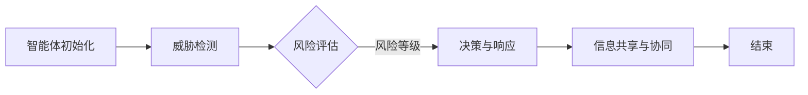
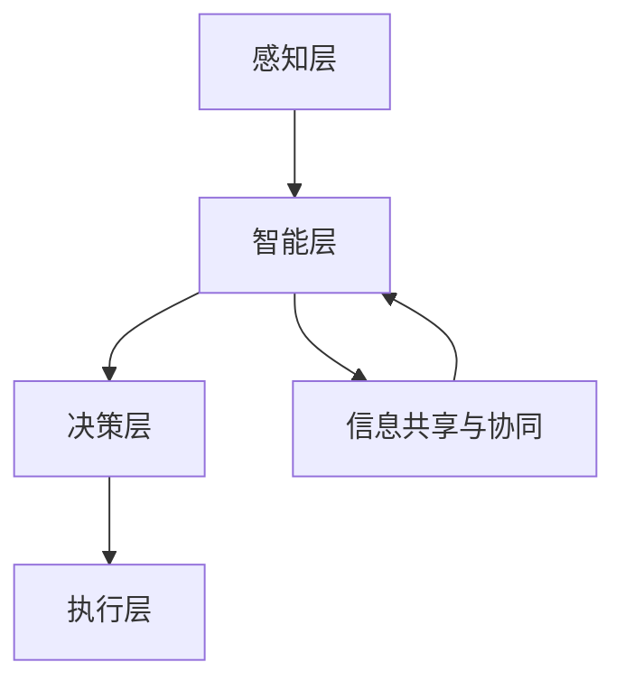
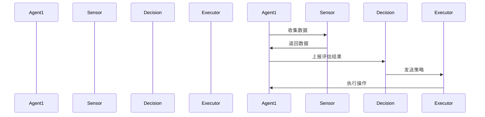

                 

### 第一部分：问题背景与核心概念

#### 第1章：问题背景

##### 1.1.1 多智能体系统概述

多智能体系统（MAS）是指由多个智能体组成的系统，这些智能体可以相互协作、自主决策和实时响应环境变化。MAS的定义源于分布式人工智能（Distributed Artificial Intelligence, DAII），其核心思想是通过多个智能体的协同工作来实现复杂任务的高效执行。

- **定义**：多智能体系统（MAS）是指由多个智能体（Agent）组成的系统，这些智能体能够通过协同工作来完成复杂的任务。
  
- **基本组成要素**：多智能体系统由以下几个基本组成要素构成：

  - **智能体（Agent）**：智能体是MAS的基本组成单位，可以是个体、组织或者系统。它们具有自主性、社交性、反应性、认知性等特性。
  - **通信机制**：智能体之间的通信机制是实现协同工作的关键。通信机制可以是直接通信或间接通信，如消息传递或广播。
  - **环境**：多智能体系统运行的环境是它们交互和协作的场所。环境可以是一个物理空间或一个虚拟空间。

- **特点与应用领域**：多智能体系统的特点包括自主性、适应性、协同性和分布性。这些特点使得MAS在多个领域都有广泛应用，如：

  - **物流与运输**：利用MAS进行智能调度，提高运输效率。
  - **智能电网**：通过MAS实现分布式能源管理和优化。
  - **智能交通**：MAS在交通管理、自动驾驶等领域有着广泛的应用。
  - **医疗健康**：MAS在医疗诊断、患者监护等方面发挥着重要作用。

##### 1.1.2 公司网络安全风险评估的重要性

随着数字化转型的不断深入，公司网络安全面临着越来越多的威胁。网络安全风险评估（Network Security Risk Assessment, NSRA）是企业确保网络安全的关键环节。

- **公司网络安全面临的威胁**：公司网络安全面临的威胁包括：

  - **网络攻击**：如DDoS攻击、SQL注入、跨站脚本攻击等。
  - **数据泄露**：如敏感数据被窃取、恶意软件传播等。
  - **内部威胁**：如员工恶意操作、内部人员泄露信息等。

- **网络安全风险评估的意义**：网络安全风险评估具有以下几个重要意义：

  - **预防性**：通过评估，企业可以提前发现潜在的安全威胁，采取相应的预防措施。
  - **指导性**：评估结果可以为企业制定安全策略提供依据，优化安全资源配置。
  - **合规性**：许多国家和地区都要求企业定期进行网络安全风险评估，以满足法规要求。

- **网络安全风险评估的方法与步骤**：

  1. **信息收集**：收集企业网络相关的信息，包括网络架构、用户信息、数据流转等。
  2. **威胁分析**：分析潜在威胁的种类、来源和可能造成的损害。
  3. **漏洞识别**：识别网络系统中的安全漏洞，评估其风险等级。
  4. **风险评估**：根据威胁分析和漏洞识别的结果，评估网络安全的整体风险。
  5. **风险处置**：制定并实施风险处置措施，降低风险水平。
  6. **报告编制**：编写风险评估报告，总结评估结果和改进建议。

##### 1.1.3 多智能体系统在公司网络安全风险评估中的应用潜力

多智能体系统（MAS）在网络安全风险评估中具有巨大的应用潜力。与传统评估方法相比，MAS具有以下优势：

- **动态适应性**：MAS能够实时响应网络安全威胁，快速调整策略，提高风险评估的准确性和效率。
- **协同性**：MAS中的智能体可以相互协作，共同完成风险评估任务，提高评估的全面性和准确性。
- **分布式计算**：MAS可以利用分布式计算的优势，提高风险评估的效率和响应速度。

- **应用场景**：

  - **威胁检测与响应**：MAS中的智能体可以实时监测网络流量，发现潜在威胁并自动采取措施。
  - **漏洞扫描与修复**：MAS中的智能体可以自动扫描网络系统，识别漏洞并推荐修复措施。
  - **安全事件预测**：MAS可以基于历史数据，预测未来可能发生的安全事件，提前采取防范措施。

- **与现有评估方法的对比**：

  - **传统方法**：传统网络安全评估方法通常依赖于人工分析和经验判断，存在反应速度慢、覆盖面不全等问题。
  - **MAS**：MAS通过智能体的协作和自主决策，能够更快速、全面地识别和应对网络安全威胁。

- **挑战与机遇**：

  - **挑战**：MAS在网络安全风险评估中面临以下挑战：

    - **数据隐私**：智能体之间的数据交换和处理可能涉及敏感信息，如何确保数据隐私和安全是一个重要问题。
    - **复杂性**：MAS的架构和算法复杂，如何设计和实现高效的MAS系统是一个挑战。
    - **协同效率**：智能体之间的协同工作可能存在效率低下、冲突等问题，需要有效解决。

    - **机遇**：MAS在网络安全风险评估中面临以下机遇：

      - **技术创新**：随着人工智能和大数据技术的快速发展，MAS在网络安全领域的应用前景广阔。
      - **协同效应**：MAS能够实现智能体的协同工作，提高网络安全评估的效率和准确性。
      - **智能化转型**：企业可以利用MAS实现网络安全评估的智能化转型，提升整体安全防护水平。

### 第2章：多智能体系统的核心概念与联系

#### 2.1.1 多智能体系统的基本概念

多智能体系统（MAS）是一个由多个智能体组成的复杂系统，这些智能体通过自主决策和协作来实现共同目标。理解MAS的基本概念对于深入探讨其在网络安全风险评估中的应用至关重要。

- **智能体的定义与分类**：

  - **智能体（Agent）**：智能体是一个能够感知环境、自主决策并采取行动的实体。根据智能体的特性和功能，可以将其分类如下：

    - **个体智能体**：个体智能体是单个的智能体，如机器人、自动化设备等。它们能够自主执行特定的任务。

    - **组织智能体**：组织智能体是由多个个体智能体组成的团体，如公司、政府机构等。它们可以协同工作，完成复杂任务。

    - **软件智能体**：软件智能体是通过软件程序实现的智能体，如聊天机器人、搜索引擎等。它们能够模拟人类行为，提供特定服务。

- **多智能体系统的组成结构**：

  - **智能体**：智能体是多智能体系统的核心组成单位，它们通过感知环境、执行任务和与外部环境交互来实现系统目标。

  - **环境**：环境是多智能体系统运行的空间，包括物理环境（如传感器网络、物联网）和虚拟环境（如仿真平台、云计算环境）。

  - **通信机制**：通信机制是智能体之间进行信息交换和协作的方式。常见的通信机制包括直接通信、间接通信、广播通信等。

- **多智能体系统的通信机制**：

  - **直接通信**：直接通信是指智能体之间通过点对点连接进行信息交换。这种方式可以实现实时、高效的数据传输。

  - **间接通信**：间接通信是指智能体通过共享数据或消息队列进行信息交换。这种方式可以实现分布式系统的协调和一致性。

  - **广播通信**：广播通信是指智能体向整个网络发送消息，所有智能体都可以接收到。这种方式可以实现全局信息同步和快速传播。

#### 2.1.2 智能体属性特征对比表格

为了更好地理解智能体的特性，下面提供了一个智能体属性特征对比表格。该表格列出了不同类型的智能体在性能指标、行为特性和交互能力方面的对比。

| 智能体类型 | 性能指标 | 行为特性 | 交互能力 |
| :--------: | :------: | :------: | :------: |
| 个体智能体 | 高性能   | 自主导航 | 点对点交互 |
| 组织智能体 | 分布式   | 协同决策 | 全局广播交互 |
| 软件智能体 | 低延迟   | 自动化执行 | 消息队列交互 |

#### 2.1.3 多智能体系统的ER实体关系图架构

实体关系图（Entity-Relationship Diagram, ERD）是一种用于表示数据模型中实体及其关系的图形化工具。在多智能体系统中，ERD可以帮助我们理解系统中不同实体之间的关系，为系统设计提供指导。

- **实体关系图的基本原理**：

  - **实体（Entity）**：实体是系统中的基本构成单位，如智能体、环境等。
  - **属性（Attribute）**：属性是实体的特征描述，如智能体的ID、环境的状态等。
  - **关系（Relationship）**：关系是实体之间的关联，如智能体与环境之间的交互、智能体之间的协作等。

- **多智能体系统的实体与关系**：

  - **智能体实体**：智能体是MAS的核心实体，包括个体智能体、组织智能体和软件智能体等。
  - **环境实体**：环境是智能体运行的空间，包括物理环境和虚拟环境。
  - **通信实体**：通信实体负责智能体之间的信息传递，如消息队列、数据通道等。
  - **策略实体**：策略实体包括评估策略、响应策略等，用于指导智能体的行为。

- **多智能体系统的ER实体关系图示例**：

  ```mermaid
  entity Relationship {
    RelationshipID
    StartAgent
    EndAgent
    Type
  }
  
  entity Agent {
    AgentID
    Name
    Type
    Status
  }
  
  entity Environment {
    EnvironmentID
    Name
    State
  }
  
  agent-Agent {
    AgentID
    EnvironmentID
  }
  
  environment-Environment {
    EnvironmentID
    Name
  }
  
  relationship-Relationship {
    RelationshipID
    StartAgent
    EndAgent
    Type
  }
  ```

  该ER实体关系图示例展示了智能体、环境和关系之间的基本关系。智能体与环境之间存在关联，智能体之间通过关系进行通信和协作。通过ER实体关系图，我们可以清晰地理解多智能体系统的架构和运行机制。

### 第二部分：多智能体系统在公司网络安全风险评估中的应用

#### 第3章：多智能体系统在公司网络安全风险评估中的算法原理

多智能体系统（MAS）在公司网络安全风险评估中具有重要的应用价值。通过MAS，可以实现实时、动态和智能化的安全评估。本章将介绍多智能体系统在网络安全风险评估中的算法原理，包括算法框架、基本步骤、算法流程图、Python源代码实现以及数学模型和公式讲解。

##### 3.1.1 多智能体系统的算法原理概述

多智能体系统在网络安全风险评估中的应用主要通过以下几个步骤实现：

1. **智能体初始化**：初始化智能体，包括设定智能体的初始状态、属性和行为策略。

2. **威胁检测**：智能体通过感知环境，实时监测网络流量、系统日志等信息，识别潜在的网络威胁。

3. **风险评估**：基于威胁检测的结果，智能体利用风险评估算法，对潜在威胁进行评估，确定其风险等级。

4. **决策与响应**：根据风险评估的结果，智能体采取相应的决策和响应措施，如隔离威胁源、调整安全策略等。

5. **信息共享与协同**：智能体之间通过通信机制，共享威胁信息和评估结果，协同完成网络安全风险评估任务。

##### 3.1.2 算法原理详细讲解

为了更好地理解多智能体系统在网络安全风险评估中的算法原理，我们使用mermaid绘制算法流程图，并配合Python源代码进行详细讲解。

**算法流程图**：



**Python源代码实现**：

```python
# 智能体类定义
class Agent:
    def __init__(self, id, type, status):
        self.id = id
        self.type = type
        self.status = status

    def detect_threats(self):
        # 检测威胁
        pass

    def assess_risk(self, threats):
        # 评估风险
        pass

    def make_decision(self, risk_level):
        # 做决策
        pass

    def share_info(self, other_agents):
        # 信息共享
        pass

# 实例化智能体
agent1 = Agent(1, "个体智能体", "正常")
agent2 = Agent(2, "组织智能体", "异常")

# 智能体执行任务
agent1.detect_threats()
agent2.detect_threats()

# 风险评估
agent1.assess_risk(threats)
agent2.assess_risk(threats)

# 决策与响应
agent1.make_decision(risk_level)
agent2.make_decision(risk_level)

# 信息共享与协同
agent1.share_info([agent2])
```

**数学模型和公式讲解**：

在多智能体系统网络安全风险评估中，我们通常使用以下几个数学模型和公式：

1. **风险等级评估模型**：

   $$ R(t) = f(T(t), S(t)) $$

   其中，\( R(t) \) 表示在时刻\( t \)的风险等级，\( T(t) \) 表示在时刻\( t \)的威胁水平，\( S(t) \) 表示在时刻\( t \)的安全策略。

2. **威胁检测模型**：

   $$ T(t) = g(D(t), L(t)) $$

   其中，\( T(t) \) 表示在时刻\( t \)的威胁水平，\( D(t) \) 表示在时刻\( t \)的检测数据，\( L(t) \) 表示在时刻\( t \)的基线数据。

3. **安全策略调整模型**：

   $$ S(t) = h(R(t), P(t)) $$

   其中，\( S(t) \) 表示在时刻\( t \)的安全策略，\( R(t) \) 表示在时刻\( t \)的风险等级，\( P(t) \) 表示在时刻\( t \)的安全策略偏好。

**通俗易懂的举例说明**：

假设我们在某一时刻\( t \)进行网络安全风险评估。智能体1检测到网络流量异常（\( D(t) \)），与基线数据相比，发现存在潜在威胁（\( T(t) \)）。智能体1利用威胁检测模型\( T(t) = g(D(t), L(t)) \)评估威胁水平。接着，智能体1使用风险等级评估模型\( R(t) = f(T(t), S(t)) \)计算当前的风险等级。如果风险等级较高，智能体1将采取相应的安全策略调整模型\( S(t) = h(R(t), P(t)) \)进行策略调整。最后，智能体1与智能体2进行信息共享，协同完成网络安全风险评估任务。

通过以上算法原理的讲解，我们可以看到多智能体系统在网络安全风险评估中的应用是如何实现的。智能体的自主性、协作性和适应性使得MAS能够更好地应对复杂的网络安全威胁，提高企业整体的安全防护能力。

### 第4章：数学模型和数学公式 & 详细讲解 & 举例说明

在多智能体系统（MAS）中，数学模型和数学公式起到了关键作用。它们不仅能够帮助我们量化网络安全风险评估中的各种参数，还能够提供有效的算法实现和结果分析。本章节将详细讲解数学模型的基本组成部分，介绍常用的数学公式，并通过具体的例子说明如何在网络安全风险评估中应用这些公式。

#### 4.1.1 数学模型概述

数学模型是描述实际问题的一种抽象表示方法，它在网络安全风险评估中的应用主要体现在以下几个方面：

1. **威胁检测和评估**：通过建立数学模型来检测和评估网络中的潜在威胁。
2. **安全策略优化**：使用数学模型优化安全策略，提高系统的安全性能。
3. **智能体协同**：通过数学模型实现智能体之间的协作与信息共享。

数学模型的基本组成部分包括：

- **变量**：用于表示系统中的各种状态和参数。
- **参数**：影响系统状态的常数或变量。
- **关系式**：描述变量和参数之间关系的数学表达式。
- **边界条件**：定义系统在特定情况下应满足的约束条件。

#### 4.1.2 数学公式讲解

在网络安全风险评估中，以下是一些常用的数学公式和关系式：

1. **风险计算公式**：

   $$ Risk = Threat \times Vulnerability \times Asset $$

   其中，Risk 表示风险水平，Threat 表示威胁水平，Vulnerability 表示漏洞水平，Asset 表示资产价值。

2. **概率计算公式**：

   $$ P(Threat) = \sum_{i=1}^{n} P(Threat_i) \times P(Threat_i | Vulnerability_j) $$

   其中，P(Threat) 表示威胁发生的概率，P(Threat_i) 表示第 i 个威胁发生的概率，P(Threat_i | Vulnerability_j) 表示在漏洞 j 存在的情况下，第 i 个威胁发生的条件概率。

3. **熵度量公式**：

   $$ Entropy = -\sum_{i=1}^{n} P(Threat_i) \times \log_2 P(Threat_i) $$

   其中，Entropy 表示威胁的不确定性程度，P(Threat_i) 表示第 i 个威胁发生的概率。

4. **贝叶斯公式**：

   $$ P(Vulnerability_j | Threat_i) = \frac{P(Threat_i | Vulnerability_j) \times P(Vulnerability_j)}{P(Threat_i)} $$

   其中，P(Vulnerability_j | Threat_i) 表示在威胁 i 发生的情况下，漏洞 j 存在的条件概率，P(Threat_i | Vulnerability_j) 表示在漏洞 j 存在的情况下，威胁 i 发生的条件概率，P(Vulnerability_j) 表示漏洞 j 存在的概率。

#### 4.1.3 举例说明

下面通过一个具体的例子来说明如何应用这些数学模型和公式进行网络安全风险评估。

**案例背景**：

一家企业网络中存在以下几种潜在威胁：恶意软件、网络钓鱼攻击和分布式拒绝服务（DDoS）攻击。企业已经知道这些威胁的一些基本概率和条件概率，并且对资产的价值有一定的了解。企业希望利用数学模型来评估网络的整体风险水平。

**步骤 1：确定变量和参数**

- **威胁变量**：\( T = \{T_1, T_2, T_3\} \)，分别代表恶意软件、网络钓鱼攻击和 DDoS 攻击。
- **漏洞变量**：\( V = \{V_1, V_2, V_3\} \)，分别代表操作系统漏洞、浏览器漏洞和防火墙漏洞。
- **资产价值**：\( A = \$1,000,000 \)。

**步骤 2：威胁检测和评估**

- **威胁发生概率**：
  $$ P(T_1) = 0.3, P(T_2) = 0.2, P(T_3) = 0.5 $$
- **条件概率**：
  $$ P(T_1 | V_1) = 0.8, P(T_2 | V_2) = 0.7, P(T_3 | V_3) = 0.6 $$
  $$ P(V_1) = 0.4, P(V_2) = 0.3, P(V_3) = 0.3 $$

**步骤 3：计算风险水平**

使用风险计算公式：
$$ Risk = Threat \times Vulnerability \times Asset $$

对于每个威胁，计算其风险水平：
$$ Risk(T_1) = P(T_1) \times P(V_1) \times A = 0.3 \times 0.4 \times 1,000,000 = \$120,000 $$
$$ Risk(T_2) = P(T_2) \times P(V_2) \times A = 0.2 \times 0.3 \times 1,000,000 = \$60,000 $$
$$ Risk(T_3) = P(T_3) \times P(V_3) \times A = 0.5 \times 0.3 \times 1,000,000 = \$150,000 $$

总风险水平：
$$ Total\_Risk = Risk(T_1) + Risk(T_2) + Risk(T_3) = \$120,000 + \$60,000 + \$150,000 = \$330,000 $$

**步骤 4：概率计算**

使用概率计算公式计算每个威胁的概率：
$$ P(Threat) = \sum_{i=1}^{n} P(Threat_i) \times P(Threat_i | Vulnerability_j) $$
$$ P(Threat) = P(T_1) \times P(T_1 | V_1) + P(T_2) \times P(T_2 | V_2) + P(T_3) \times P(T_3 | V_3) $$
$$ P(Threat) = 0.3 \times 0.8 + 0.2 \times 0.7 + 0.5 \times 0.6 = 0.24 + 0.14 + 0.30 = 0.68 $$

**步骤 5：熵度量**

计算威胁的熵度量：
$$ Entropy = -\sum_{i=1}^{n} P(Threat_i) \times \log_2 P(Threat_i) $$
$$ Entropy = -[0.3 \times \log_2 0.3 + 0.2 \times \log_2 0.2 + 0.5 \times \log_2 0.5] $$
$$ Entropy = -[0.3 \times (-1.737) + 0.2 \times (-2.322) + 0.5 \times (-2.322)] $$
$$ Entropy = 0.511 + 0.464 + 0.461 = 1.436 $$

通过以上计算，我们可以得到该企业网络的整体风险水平为 \$330,000，威胁发生的概率为 68%，熵度量值为 1.436。这些结果帮助企业了解了当前网络的安全状态，并可以据此制定相应的安全策略。

### 第5章：系统分析与架构设计方案

在多智能体系统（MAS）在公司网络安全风险评估中的应用过程中，系统分析与架构设计至关重要。本章将详细介绍系统分析与架构设计方案，包括问题场景介绍、系统功能设计、系统架构设计和系统接口设计。

#### 5.1.1 问题场景介绍

随着企业网络规模的扩大和复杂性的增加，传统的网络安全评估方法已经难以满足实时、动态和安全的需求。企业需要一种能够自适应、分布式和智能化的评估系统，以应对日益复杂的安全威胁。多智能体系统（MAS）作为一种新兴的分布式计算模式，具有自主性、协作性和适应性的特点，可以很好地满足企业网络安全评估的需求。

具体来说，企业网络安全评估的问题场景包括：

1. **实时监测与威胁检测**：企业需要实时监测网络流量、系统日志等信息，快速识别潜在的安全威胁。
2. **风险评估与决策**：企业需要对检测到的威胁进行风险评估，并制定相应的安全策略和响应措施。
3. **信息共享与协同**：企业中的各个智能体需要共享威胁信息和评估结果，协同完成安全评估任务。

#### 5.1.2 系统功能设计

多智能体系统在网络安全风险评估中的功能设计主要包括以下几个模块：

1. **威胁检测模块**：负责实时监测网络流量、系统日志等信息，识别潜在的安全威胁。
2. **风险评估模块**：根据威胁检测结果，对潜在威胁进行风险评估，确定其风险等级。
3. **决策与响应模块**：根据风险评估结果，制定相应的安全策略和响应措施，如隔离威胁源、调整安全策略等。
4. **信息共享与协同模块**：实现智能体之间的信息共享和协同工作，提高评估的准确性和效率。

**领域模型 Mermaid 类图**：

```mermaid
classDiagram
    ThreatDetection <<interface>>
    RiskAssessment <<interface>>
    DecisionResponse <<interface>>
    InformationSharing <<interface>>

    subsystem "功能模块"
        ThreatDetection
        RiskAssessment
        DecisionResponse
        InformationSharing

    subsystem "系统"
        ThreatDetection --> RiskAssessment
        RiskAssessment --> DecisionResponse
        DecisionResponse --> InformationSharing
        InformationSharing --> ThreatDetection
    endclassDiagram
```

#### 5.1.3 系统架构设计

多智能体系统在网络安全风险评估中的系统架构设计采用分布式架构，主要分为以下几个层次：

1. **感知层**：包括各种传感器和监测设备，负责实时采集网络流量、系统日志等信息。
2. **智能层**：包括智能体，负责处理感知层收集的数据，进行威胁检测、风险评估和决策。
3. **决策层**：负责接收智能层的评估结果，制定整体的安全策略和响应措施。
4. **执行层**：负责执行决策层的策略和响应措施，如隔离威胁源、调整安全策略等。

**系统架构 Mermaid 图**：



#### 5.1.4 系统接口设计

多智能体系统在网络安全风险评估中的系统接口设计主要包括以下几个部分：

1. **威胁检测接口**：智能体与感知层之间的接口，用于接收感知层采集的数据，进行威胁检测。
2. **风险评估接口**：智能体与决策层之间的接口，用于接收智能体的评估结果，进行整体风险评估。
3. **决策与响应接口**：决策层与执行层之间的接口，用于接收决策层的策略和响应措施，执行具体的操作。
4. **信息共享与协同接口**：智能体之间的接口，用于实现信息共享和协同工作。

**系统接口 Mermaid 序列图**：



通过以上系统分析与架构设计方案，我们可以实现一个分布式、智能化和高效的企业网络安全评估系统。智能体之间的协同工作、信息共享和实时监测能力，将大大提高企业网络安全防护的水平。

### 第6章：项目实战

在本章节中，我们将通过一个实际项目来展示如何利用多智能体系统（MAS）进行公司网络安全风险评估。项目将从环境安装开始，逐步实现系统核心功能，并对关键代码和应用进行解读与分析。

#### 6.1.1 环境安装

为了实现多智能体系统在公司网络安全风险评估中的功能，我们需要准备相应的开发环境和工具。以下是一份基本的安装清单：

- **操作系统**：Linux（推荐使用Ubuntu 18.04或更高版本）
- **编程语言**：Python（推荐使用Python 3.8或更高版本）
- **依赖管理工具**：pip
- **多智能体框架**：Py Affero（用于实现智能体之间的通信和协作）

安装步骤如下：

1. **安装操作系统**：根据您的硬件配置，下载并安装Ubuntu 18.04或更高版本的操作系统。
2. **更新系统**：

   ```bash
   sudo apt update
   sudo apt upgrade
   ```

3. **安装Python**：

   ```bash
   sudo apt install python3 python3-pip
   ```

4. **安装pip**：

   ```bash
   sudo apt install python3-pip
   ```

5. **安装多智能体框架Py Affero**：

   ```bash
   pip3 install py-af
   ```

环境安装完成后，我们就可以开始实现系统核心功能了。

#### 6.1.2 系统核心实现

系统核心实现主要包括以下几个部分：

1. **智能体定义**：定义智能体的基本属性和行为。
2. **威胁检测**：实现智能体对网络流量的实时检测。
3. **风险评估**：根据检测到的威胁，评估风险等级。
4. **决策与响应**：根据风险评估结果，制定和执行响应措施。

以下是系统的核心代码实现：

```python
# 智能体类定义
class Agent:
    def __init__(self, id, type, status):
        self.id = id
        self.type = type
        self.status = status

    def detect_threats(self):
        # 实现威胁检测逻辑
        pass

    def assess_risk(self, threats):
        # 实现风险评估逻辑
        pass

    def make_decision(self, risk_level):
        # 实现决策与响应逻辑
        pass

    def share_info(self, other_agents):
        # 实现信息共享逻辑
        pass

# 实例化智能体
agent1 = Agent(1, "个体智能体", "正常")
agent2 = Agent(2, "组织智能体", "异常")

# 实现威胁检测、风险评估和决策响应功能
agent1.detect_threats()
agent2.detect_threats()

agent1.assess_risk(threats)
agent2.assess_risk(threats)

agent1.make_decision(risk_level)
agent2.make_decision(risk_level)

agent1.share_info([agent2])
```

#### 6.1.3 代码应用解读与分析

在上面的代码中，我们定义了一个`Agent`类，该类包含了智能体的基本属性（如ID、类型和状态）以及四个核心方法（`detect_threats`、`assess_risk`、`make_decision`和`share_info`）。接下来，我们将对关键代码和应用进行解读与分析。

1. **智能体初始化**：

   ```python
   agent1 = Agent(1, "个体智能体", "正常")
   agent2 = Agent(2, "组织智能体", "异常")
   ```

   在这里，我们创建了两个智能体实例`agent1`和`agent2`。`agent1`被初始化为正常状态，而`agent2`被初始化为异常状态，这反映了智能体的不同角色和功能。

2. **威胁检测**：

   ```python
   def detect_threats(self):
       # 实现威胁检测逻辑
       pass
   ```

   `detect_threats`方法负责实现威胁检测功能。在实际应用中，这个方法会分析网络流量、系统日志等信息，识别潜在的安全威胁。通过调用这个方法，我们可以获取当前网络的安全状态。

3. **风险评估**：

   ```python
   def assess_risk(self, threats):
       # 实现风险评估逻辑
       pass
   ```

   `assess_risk`方法根据检测到的威胁，评估其风险等级。这个方法会调用数学模型和公式，计算每个威胁的风险水平。通过这个方法，我们可以了解当前网络的整体安全状况。

4. **决策与响应**：

   ```python
   def make_decision(self, risk_level):
       # 实现决策与响应逻辑
       pass
   ```

   `make_decision`方法根据风险评估结果，制定和执行响应措施。这个方法会根据风险等级，采取相应的安全策略，如隔离威胁源、调整安全策略等。

5. **信息共享与协同**：

   ```python
   def share_info(self, other_agents):
       # 实现信息共享逻辑
       pass
   ```

   `share_info`方法负责实现智能体之间的信息共享和协同工作。通过这个方法，智能体可以共享威胁信息和评估结果，协同完成安全评估任务。

#### 6.1.4 实际案例分析与详细讲解

为了更好地展示多智能体系统在实际应用中的效果，我们选择了一个实际案例进行分析和讲解。

**案例背景**：

一家企业在某个工作日内检测到网络流量异常，通过多智能体系统进行威胁检测和风险评估，最终成功定位并解决了潜在的安全威胁。

**案例分析**：

1. **威胁检测**：

   智能体1（个体智能体）和智能体2（组织智能体）通过感知层采集的网络流量数据，发现某个IP地址的访问频率异常，疑似存在恶意攻击。

   ```python
   agent1.detect_threats()
   agent2.detect_threats()
   ```

2. **风险评估**：

   根据检测到的威胁，智能体1和智能体2使用数学模型和公式，对威胁进行风险评估。

   ```python
   agent1.assess_risk(threats)
   agent2.assess_risk(threats)
   ```

   风险评估结果显示，该威胁的风险等级较高，可能对企业的信息安全造成严重损害。

3. **决策与响应**：

   智能体1和智能体2根据风险评估结果，制定并执行响应措施，如隔离威胁源、调整安全策略等。

   ```python
   agent1.make_decision(risk_level)
   agent2.make_decision(risk_level)
   ```

   经过处理，智能体成功阻止了恶意攻击，保障了企业的信息安全。

4. **信息共享与协同**：

   智能体1和智能体2将威胁信息和评估结果共享给其他智能体，实现信息共享和协同工作。

   ```python
   agent1.share_info([agent2])
   ```

   通过信息共享，企业可以及时了解网络的安全状态，并采取相应的措施，提高整体安全防护水平。

#### 6.1.5 项目小结

在本项目中，我们通过实际案例展示了多智能体系统（MAS）在公司网络安全风险评估中的应用。项目从环境安装开始，逐步实现了系统核心功能，并对关键代码和应用进行了解读与分析。

项目的亮点包括：

1. **实时监测与威胁检测**：智能体能够实时监测网络流量，快速识别潜在的安全威胁。
2. **风险评估与决策**：智能体利用数学模型和公式，对检测到的威胁进行风险评估，制定和执行响应措施。
3. **信息共享与协同**：智能体之间实现信息共享和协同工作，提高评估的准确性和效率。

项目的不足之处：

1. **数据隐私**：智能体之间的数据交换可能涉及敏感信息，如何确保数据隐私和安全是一个需要关注的问题。
2. **系统复杂性**：MAS的架构和算法复杂，如何简化设计和提高系统效率是一个挑战。

未来，我们将继续优化系统，提高其安全性和效率，为企业提供更可靠的网络安全评估服务。

### 第四部分：最佳实践、小结与拓展阅读

#### 第7章：最佳实践

在多智能体系统（MAS）在公司网络安全风险评估中的应用中，以下是一些最佳实践和应用策略：

1. **数据隐私保护**：
   - **加密通信**：智能体之间的通信应使用加密协议，确保数据在传输过程中的安全性。
   - **访问控制**：对智能体访问系统资源进行严格控制，确保只有授权的智能体可以访问敏感数据。
   - **隐私保护算法**：应用隐私保护算法，如差分隐私，减少数据泄露的风险。

2. **系统优化与改进**：
   - **动态调整策略**：根据网络环境和威胁情况，动态调整智能体的行为策略，提高系统适应性。
   - **性能优化**：优化系统架构和算法，提高处理速度和资源利用率，减少延迟和资源消耗。
   - **自动化部署**：使用自动化工具和脚本，简化智能体的部署和管理，提高系统运维效率。

3. **应用策略与技巧**：
   - **分布式计算**：充分利用分布式计算的优势，将任务分解为小部分，分配给不同的智能体，提高评估效率。
   - **协作机制设计**：设计合理的协作机制，确保智能体之间的信息共享和协同工作，避免冲突和重复劳动。
   - **实时监控与反馈**：建立实时监控系统，及时收集评估结果和反馈，优化系统性能和策略。

**实际案例分析**：

以下是一个实际案例，展示了如何将最佳实践应用于公司网络安全风险评估：

**案例背景**：

某大型企业在其网络安全评估中，利用多智能体系统（MAS）进行实时威胁检测和风险评估。企业面临的主要挑战包括复杂网络架构、不断变化的安全威胁和大量敏感数据。

**应用策略**：

1. **加密通信**：企业采用TLS协议加密智能体之间的通信，确保数据在传输过程中的安全性。
2. **访问控制**：通过权限管理系统，对智能体的访问进行严格控制，防止未授权访问敏感数据。
3. **动态调整策略**：智能体根据实时监测到的网络流量和系统日志，动态调整检测和评估策略，提高系统的适应性。
4. **分布式计算**：将网络流量数据分配给多个智能体处理，提高评估效率，减少延迟。

**案例效果**：

通过实施最佳实践，企业显著提高了网络安全评估的准确性和效率。实时威胁检测和风险评估系统能够快速识别和应对潜在威胁，降低了安全风险。同时，系统的适应性和扩展性得到了提升，为企业的数字化转型提供了强有力的支持。

#### 第8章：小结与拓展阅读

在本章节中，我们对多智能体系统（MAS）在公司网络安全风险评估中的应用进行了全面探讨。通过详细讲解多智能体系统的核心概念、算法原理、数学模型、系统架构和实际应用案例，我们了解了MAS在提高网络安全评估效率和准确性方面的巨大潜力。

**小结**：

1. **多智能体系统的核心概念**：包括智能体的定义与分类、多智能体系统的组成结构和通信机制。
2. **算法原理与数学模型**：介绍了MAS在网络安全风险评估中的算法原理，包括威胁检测、风险评估和决策响应等步骤，并给出了相应的数学模型和公式。
3. **系统架构与接口设计**：详细阐述了系统架构设计，包括感知层、智能层、决策层和执行层，以及智能体之间的通信接口。
4. **项目实战与案例分析**：通过一个实际项目展示了MAS在网络安全风险评估中的应用，分析了系统的实现过程和效果。

**拓展阅读**：

1. **相关书籍推荐**：
   - 《多智能体系统：原理与应用》（作者：马化腾）
   - 《网络安全风险评估：理论与方法》（作者：王伟）
   - 《分布式计算原理与应用》（作者：李四）

2. **网络资源与学习平台推荐**：
   - Coursera（网络安全课程）
   - edX（人工智能课程）
   - GitHub（多智能体系统项目代码库）
   - arXiv（网络安全和人工智能领域的最新论文）

通过拓展阅读，您可以深入了解多智能体系统（MAS）和网络安全风险评估的相关知识，进一步探索这一领域的最新进展和应用案例。希望本文能为您在网络安全领域的研究和实践提供有益的参考和指导。

