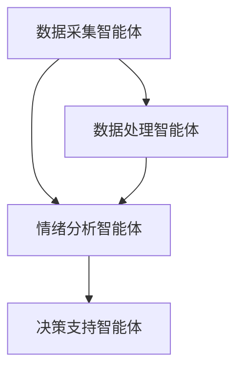

                 

### 引言

多智能体系统（MAS）作为一种分布式计算和人工智能技术，近年来在多个领域展现出了巨大的潜力和应用价值。特别是在金融市场中，随着数据量的爆发式增长和交易频率的加快，对市场情绪分析的需求愈发迫切。市场情绪分析不仅有助于投资者理解市场的当前状态，还能为他们的决策提供有力的支持。然而，传统的市场情绪分析方法在处理大规模、多样化数据时往往力不从心，难以捕捉市场情绪的细微变化。

在这样的背景下，多智能体系统因其分布式、自适应和协作的特点，成为了一种强有力的工具，可以显著提升市场情绪分析的准确性和效率。本文将围绕多智能体系统在市场情绪分析中的应用进行深入探讨。

首先，我们将从多智能体系统的基础概念入手，介绍其定义、特点、核心概念和分类，帮助读者建立一个全面的理解。接下来，本文将探讨多智能体系统在市场情绪分析中的应用场景和优势，并通过具体的实例展示其在实际操作中的效果。

然后，我们将介绍市场情绪分析的基本概念和方法，包括市场情绪的定义、类型、传统方法和现代方法等。在此基础上，本文将详细讨论市场情绪分析的数据来源，如股票市场数据、社交媒体数据和新闻文本数据。

接下来，我们将聚焦于多智能体系统在市场情绪分析中的应用，详细讲解智能体的设计与实现、情绪分析算法与应用以及多智能体系统的架构与实现。这一部分内容将帮助读者深入理解如何利用多智能体系统进行市场情绪分析。

在价值投资者视角下，我们将探讨市场情绪分析对价值投资的影响，并提供一些实际案例进行解析。最后，本文将总结多智能体系统在市场情绪分析中的最佳实践，并展望其未来发展趋势。

通过本文的逐步分析，读者将能够全面了解多智能体系统在市场情绪分析中的应用，并掌握相关的技术和方法，为其在金融市场中的投资决策提供有力支持。

### 关键词

- 多智能体系统（MAS）
- 市场情绪分析
- 价值投资
- 分布式计算
- 人工智能
- 金融衍生品市场
- 加密货币市场
- 情绪分析算法

### 摘要

本文旨在探讨多智能体系统（MAS）在市场情绪分析中的应用，为价值投资者提供一种新的工具。首先，文章介绍了多智能体系统的基本概念和特点，包括其定义、分类和核心概念。接着，文章详细讨论了市场情绪分析的基本概念、方法和数据来源，并分析了多智能体系统在市场情绪分析中的优势和应用场景。随后，文章介绍了智能体的设计与实现、情绪分析算法和多智能体系统的架构与实现，通过具体案例展示了其在市场情绪分析中的实际应用。在价值投资者视角下，文章探讨了市场情绪分析对价值投资的影响，并提供了一些实际案例进行解析。最后，文章总结了多智能体系统在市场情绪分析中的最佳实践，并展望了其未来发展趋势。通过本文的深入分析，读者可以全面了解多智能体系统在市场情绪分析中的应用，为其投资决策提供有力支持。

## 第一部分：多智能体系统与市场情绪分析概述

### 第1章：多智能体系统基础

#### 1.1 什么是多智能体系统

多智能体系统（Multi-Agent System，简称MAS）是由多个具有独立性和交互性的智能体组成的系统。这些智能体可以在一个共享的环境中协同工作，以实现共同的目标。多智能体系统作为一种分布式计算和人工智能技术，因其灵活性和适应性在各个领域得到了广泛应用。

**定义与特点**

- **定义**：多智能体系统是一种由多个具有自主性、社会性、反应性和主动适应性等特点的智能体组成的系统。
- **特点**：
  - **自主性**：智能体能够自主地选择行动，不受外部控制。
  - **社会性**：智能体之间能够通过某种通信协议进行交互。
  - **反应性**：智能体能够对外部环境的变化做出快速响应。
  - **主动适应性**：智能体能够根据环境的变化调整自身的行为策略。

**核心概念**

- **智能体**：智能体是多智能体系统中的基本单元，具有感知环境、执行动作和通信等能力。
- **环境**：环境是指智能体所处的物理或虚拟空间，提供智能体执行任务所需的资源和服务。
- **交互协议**：交互协议是智能体之间进行通信和协作的规则和标准，确保智能体之间的有效沟通。
- **协调机制**：协调机制是用于解决智能体之间冲突和协调行动的机制。
- **任务分配**：任务分配是指将系统中的任务合理地分配给不同的智能体，以实现系统整体效率的最大化。
- **决策过程**：决策过程是指智能体在感知环境信息后，通过某种决策算法选择最佳行动的过程。

**多智能体系统的分类**

多智能体系统可以根据不同的分类标准进行分类，以下是一些常见的分类方法：

- **基于通信方式**：
  - **集中式**：所有智能体通过一个中心控制器进行通信和协调。
  - **分布式**：智能体之间通过直接通信进行协作。

- **基于智能体能力**：
  - **弱智能体**：智能体具有有限的知识和计算能力，主要依赖于环境和其他智能体提供的信息。
  - **强智能体**：智能体具有丰富的知识和计算能力，可以自主决策和执行复杂任务。

- **基于应用场景**：
  - **经济**：如市场模拟、供应链管理、金融交易等。
  - **社会**：如社交网络分析、公共管理、应急管理等。
  - **军事**：如战术模拟、作战指挥、情报分析等。

**多智能体系统的发展与应用**

多智能体系统自20世纪80年代提出以来，得到了迅速的发展。随着计算技术和人工智能技术的进步，多智能体系统的应用范围也越来越广泛。例如，在金融市场中，多智能体系统可以用于市场情绪分析、交易策略优化和风险管理等；在社会管理中，多智能体系统可以用于公共安全、灾害应急和社会服务优化等。

总的来说，多智能体系统以其分布式、自适应和协作的特点，为解决复杂问题提供了一种新的思路和方法。在市场情绪分析中，多智能体系统可以通过分布式计算和协同分析，提高市场预测的准确性和效率，为投资者提供更可靠的决策支持。

#### 1.2 多智能体系统在市场情绪分析中的应用

市场情绪分析是金融领域中的一项重要研究内容，它旨在通过分析市场参与者的情绪状态，预测市场走势和风险。多智能体系统在市场情绪分析中具有独特的优势和广泛的应用前景。

**市场情绪分析的重要性**

市场情绪分析对于投资者决策、风险管理和市场预测具有重要意义。了解市场情绪可以帮助投资者更好地把握市场动态，制定合理的投资策略。例如，当市场情绪偏向乐观时，投资者可能会更倾向于进行高风险投资；而当市场情绪偏向悲观时，投资者可能会更倾向于保守策略。

**多智能体系统在市场情绪分析中的应用场景**

多智能体系统在市场情绪分析中有着广泛的应用场景，主要包括以下几种：

1. **股票市场**：多智能体系统可以用于分析股票市场的情绪变化，为投资者提供买卖决策支持。通过智能体模拟不同投资者的行为和情绪，可以预测股票价格的趋势和波动。

2. **金融衍生品市场**：金融衍生品市场的复杂性和高度波动性使得市场情绪分析变得更加重要。多智能体系统可以帮助投资者了解市场的情绪波动，预测衍生品的价格走势和风险。

3. **加密货币市场**：加密货币市场的波动性极大，市场情绪的变化对价格影响显著。多智能体系统可以通过分析加密货币市场的情绪，为投资者提供交易策略和风险控制建议。

**多智能体系统在市场情绪分析中的优势**

多智能体系统在市场情绪分析中具有以下优势：

1. **提高预测准确性**：多智能体系统通过分布式计算和协同分析，可以处理大量的市场数据，提高情绪分析的准确性和效率。

2. **适应市场变化**：市场情绪是动态变化的，多智能体系统可以根据市场环境的变化，快速调整情绪分析模型和策略，适应市场的变化。

3. **发现潜在机会和风险**：多智能体系统可以模拟不同市场参与者的行为，发现潜在的投资机会和风险，为投资者提供全面的市场分析。

4. **增强决策支持**：多智能体系统可以为投资者提供实时的市场情绪分析结果，帮助他们更好地理解市场动态，制定科学的投资决策。

**多智能体系统在市场情绪分析中的应用实例**

以下是一些多智能体系统在市场情绪分析中的实际应用实例：

1. **股票市场情绪分析**：通过构建多个智能体，分别模拟不同投资者的行为，分析他们的情绪状态和交易决策，从而预测股票价格的趋势。

2. **加密货币市场情绪分析**：利用社交媒体数据和交易数据，构建智能体模型，分析加密货币市场的情绪波动，预测价格走势和交易量变化。

3. **金融衍生品市场情绪分析**：通过分析交易数据和市场新闻，构建智能体模型，预测金融衍生品的价格和风险。

总的来说，多智能体系统在市场情绪分析中的应用，不仅提高了情绪分析的准确性和效率，还为投资者提供了强大的决策支持。随着多智能体系统和人工智能技术的不断发展，未来其在市场情绪分析中的应用将会更加广泛和深入。

#### 1.3 多智能体系统与市场情绪分析的关系

多智能体系统（MAS）与市场情绪分析之间存在着紧密的联系，二者的结合不仅能够提升情绪分析的精度和效率，还能够为投资者提供更加全面和及时的决策支持。

**数据采集与处理**

市场情绪分析首先依赖于大量数据的采集和处理。多智能体系统在这一过程中发挥了关键作用：

- **数据采集**：多智能体系统能够通过智能体分布式地采集多种来源的数据，如股票价格、交易量、新闻报道、社交媒体评论等。这些数据来源于不同的渠道，具有多样性和复杂性，需要智能体进行高效采集和整合。
- **数据预处理**：采集到的数据往往存在噪声、缺失值和冗余信息，多智能体系统能够通过智能体之间的协同工作，对数据进行清洗、去噪和特征提取，为情绪分析提供高质量的数据基础。

**行为建模与模拟**

市场情绪的形成和变化是一个复杂的过程，涉及到众多市场参与者的行为。多智能体系统通过行为建模和模拟，能够更好地理解和预测市场情绪：

- **行为建模**：多智能体系统中的每个智能体都可以代表市场中的一个参与者，如散户投资者、机构投资者、分析师等。智能体根据其行为规则和情绪状态进行决策，形成市场行为模型。
- **情绪模拟**：通过模拟智能体之间的互动和交易行为，多智能体系统能够生成市场情绪的动态变化过程。智能体可以根据市场数据和环境信息，实时调整自身的情绪状态和交易策略，从而模拟市场情绪的波动。

**决策支持**

市场情绪分析的主要目的是为投资者提供决策支持。多智能体系统通过情绪分析结果，能够为投资者提供以下帮助：

- **市场预测**：多智能体系统可以基于历史数据和实时情绪分析结果，预测市场未来的走势和风险。投资者可以根据这些预测结果，调整投资策略，降低风险，提高收益。
- **交易策略优化**：多智能体系统可以帮助投资者分析不同市场情绪下的交易策略效果，通过智能体的模拟交易，找到最优的交易策略。
- **风险控制**：多智能体系统可以通过情绪分析，识别市场中的潜在风险，帮助投资者及时调整风险控制措施，避免重大损失。

**协同分析**

市场情绪分析不仅需要分析单一市场的情绪变化，还需要考虑跨市场、跨区域的情绪联动。多智能体系统通过分布式计算和协同分析，能够实现以下功能：

- **多维度分析**：多智能体系统可以同时分析多个市场的情绪变化，如股票市场、债券市场、外汇市场等，提供多维度的情绪分析结果。
- **跨区域分析**：多智能体系统可以通过全球范围内的智能体网络，采集和分析不同地区的市场情绪，识别跨区域的情绪联动关系。
- **实时监控**：多智能体系统可以实现实时的市场情绪监控，及时捕捉市场情绪的波动和变化，为投资者提供及时的信息支持。

**案例研究**

以下是一个关于多智能体系统在市场情绪分析中应用的案例：

- **背景**：某投资机构希望通过分析市场情绪，优化其股票投资组合，降低风险，提高收益。
- **解决方案**：该机构构建了一个多智能体系统，包括以下步骤：
  - **数据采集**：通过智能体分布式采集股票市场数据、新闻报道、社交媒体评论等。
  - **数据预处理**：智能体协同工作，对数据进行清洗、去噪和特征提取。
  - **行为建模与模拟**：智能体模拟不同投资者的行为和情绪，生成市场情绪模型。
  - **情绪分析**：基于情绪模型，分析市场情绪的动态变化，预测市场走势。
  - **决策支持**：根据情绪分析结果，为投资者提供市场预测、交易策略优化和风险控制建议。

通过这个案例，可以看出多智能体系统在市场情绪分析中的应用效果显著。它不仅提高了情绪分析的准确性和效率，还为投资者提供了强大的决策支持。

总之，多智能体系统与市场情绪分析的结合，为金融市场的情绪分析和投资者决策提供了一种新的思路和方法。随着技术的不断进步，多智能体系统在市场情绪分析中的应用将会更加广泛和深入，为金融市场的发展带来新的机遇和挑战。

### 第2章：市场情绪分析基本概念

#### 2.1 市场情绪的概念

市场情绪（Market Sentiment）是指在特定时间内，市场中所有参与者的情绪状态的综合反映。市场情绪不仅影响投资者的交易决策，还对市场的整体走势产生重要影响。理解市场情绪的概念对于投资者来说至关重要。

**市场情绪的定义**

市场情绪是指市场中所有参与者的情绪状态，包括乐观、悲观、中立等。这种情绪状态可以表现为对市场前景的预期、对风险的感知、对收益的期望等。市场情绪通常通过市场数据、新闻报道、社交媒体评论等方式进行量化分析。

**市场情绪的类型**

市场情绪可以分为以下几种类型：

- **乐观情绪**：市场参与者对市场前景持乐观态度，预期市场将会上涨。这种情绪通常伴随着交易量的增加和价格的上涨。
- **悲观情绪**：市场参与者对市场前景持悲观态度，预期市场将会下跌。这种情绪通常伴随着交易量的减少和价格的下跌。
- **中立情绪**：市场参与者对市场前景没有明确的预期，既不乐观也不悲观。这种情绪通常表现为市场交易量的稳定和价格的波动较小。

**市场情绪的表现形式**

市场情绪可以通过以下几种形式进行表现：

- **股票价格走势**：市场情绪的波动通常会在股票价格走势中体现出来。乐观情绪可能导致股票价格上涨，而悲观情绪可能导致股票价格下跌。
- **交易量变化**：市场情绪的变化通常伴随着交易量的变化。乐观情绪可能引发大量买入交易，导致交易量增加；而悲观情绪可能导致大量卖出交易，导致交易量增加。
- **新闻和媒体报道**：新闻和媒体报道可以反映市场情绪的变化。乐观的新闻报道可能提升市场情绪，而悲观的消息可能打压市场情绪。
- **社交媒体评论**：社交媒体平台上的评论和讨论可以反映市场情绪的动态变化。通过分析社交媒体上的评论，可以捕捉到市场情绪的细微变化。

**市场情绪的影响**

市场情绪对市场的影响是多方面的：

- **交易决策**：市场情绪可以影响投资者的交易决策。乐观情绪可能导致投资者更倾向于买入，而悲观情绪可能导致投资者更倾向于卖出。
- **市场走势**：市场情绪的变化可以影响市场的整体走势。乐观情绪可能推动市场上涨，而悲观情绪可能引发市场下跌。
- **风险水平**：市场情绪的不同类型会影响市场的风险水平。乐观情绪可能降低市场的风险水平，而悲观情绪可能增加市场的风险水平。

#### 2.2 市场情绪分析的方法

市场情绪分析的方法可以分为传统方法和现代方法。传统方法主要依赖于统计分析和心理测量，而现代方法则借助机器学习和人工智能技术，如深度学习、自然语言处理和多智能体系统等。

**传统方法**

1. **统计分析**：统计分析是市场情绪分析的基础方法之一。通过计算股票价格、交易量、换手率等指标，可以分析市场的整体情绪。常用的统计分析方法包括平均值、中位数、标准差、回归分析等。

2. **心理测量法**：心理测量法是通过问卷调查、行为实验等方法，直接测量投资者的情绪状态。这种方法能够提供较为直观的情绪数据，但样本量和数据可靠性可能存在一定限制。

3. **语言模型**：语言模型是通过分析新闻报道、社交媒体评论等文本数据，提取情绪特征。这种方法能够捕捉文本中的情感倾向，但需要大量的数据和先进的自然语言处理技术支持。

**现代方法**

1. **深度学习**：深度学习是近年来发展迅速的人工智能技术，通过构建大规模神经网络，可以从大量数据中自动提取特征和模式。深度学习在市场情绪分析中具有显著优势，可以处理复杂和大规模的数据。

2. **自然语言处理**：自然语言处理（NLP）技术可以理解和处理自然语言文本。通过NLP技术，可以提取文本中的情感信息，分析市场情绪的动态变化。

3. **多智能体系统**：多智能体系统可以模拟市场参与者的行为和情绪，通过分布式计算和协同分析，实现市场情绪的全面监测和分析。多智能体系统在市场情绪分析中具有灵活性和适应性，可以处理多样化的数据源和复杂的分析任务。

**市场情绪分析方法的优缺点**

以下是对传统方法和现代方法市场情绪分析方法的优缺点进行比较：

- **统计分析**：
  - 优点：方法简单，计算速度快，适用范围广。
  - 缺点：难以捕捉情绪的细微变化，对市场参与者的行为无法进行深入分析。

- **心理测量法**：
  - 优点：直接测量情绪，数据直观。
  - 缺点：样本量有限，数据可靠性较低。

- **语言模型**：
  - 优点：可以处理大量文本数据，提取情感特征。
  - 缺点：对文本数据的理解和处理复杂，需要大量计算资源。

- **深度学习**：
  - 优点：强大的特征提取和模式识别能力，处理复杂数据。
  - 缺点：训练过程复杂，需要大量数据和计算资源。

- **自然语言处理**：
  - 优点：可以处理多种语言和文本形式，提取情感信息。
  - 缺点：对文本数据的理解和处理复杂，存在一定误差。

- **多智能体系统**：
  - 优点：分布式计算，灵活性强，可以处理多样化数据。
  - 缺点：系统设计和实现复杂，需要协调多个智能体之间的交互。

总的来说，市场情绪分析方法的选择应综合考虑数据的类型、分析的需求和计算资源等因素。通过结合传统方法和现代方法，可以更加全面和准确地分析市场情绪，为投资者提供可靠的决策支持。

#### 2.3 市场情绪分析的数据来源

市场情绪分析需要大量的数据支持，这些数据来源广泛，包括股票市场数据、社交媒体数据和新闻文本数据等。以下是对这些数据来源的详细介绍：

**股票市场数据**

股票市场数据是市场情绪分析的重要数据来源之一，主要包括以下几类：

- **股票价格**：股票价格是市场情绪的直接反映。通过分析股票价格的波动情况，可以了解市场情绪的变化趋势。
- **交易量**：交易量反映了市场参与者的活跃程度。交易量的大幅增加或减少通常表明市场情绪的剧烈波动。
- **换手率**：换手率是指股票在一定时间内成交的比例。高换手率通常意味着市场情绪的波动较大。
- **成交量分布**：成交量分布可以反映市场不同价格水平上的交易活跃度，有助于分析市场情绪的集中度和分散度。

**社交媒体数据**

社交媒体数据在市场情绪分析中具有重要作用，主要包括以下几类：

- **新闻报道**：新闻报道可以提供市场事件和新闻的全面信息，帮助分析市场情绪的变化。
- **社交媒体评论**：社交媒体平台上的评论和讨论可以反映市场参与者的情绪和观点。通过分析这些评论，可以捕捉市场情绪的实时变化。
- **社交媒体趋势**：社交媒体上的趋势和热门话题可以反映市场情绪的关注点和热点，为情绪分析提供重要参考。

**新闻文本数据**

新闻文本数据是市场情绪分析的重要信息来源，主要包括以下几类：

- **新闻文章**：新闻文章提供了详细的市场事件和新闻信息，有助于理解市场情绪的背景和原因。
- **报告**：市场研究报告和行业分析报告可以提供专业的市场情绪分析，为投资者提供决策参考。
- **公告**：上市公司和监管机构的公告可以影响市场情绪，通过分析这些公告，可以了解市场情绪的动态变化。

**数据采集方法**

- **自动化数据采集**：通过编写脚本或使用现有的数据采集工具，可以自动化地从各种数据源中采集数据。
- **人工标注**：对于需要主观判断和深度分析的数据，可以通过人工标注的方式，提高数据的质量和可靠性。
- **实时数据流处理**：通过实时数据流处理技术，可以实时采集和处理市场数据，为情绪分析提供及时的信息支持。

**数据预处理**

- **数据清洗**：去除重复数据、噪声数据和异常值，确保数据的质量。
- **数据整合**：将来自不同数据源的数据进行整合，建立统一的数据框架。
- **特征提取**：从原始数据中提取有用的特征，为情绪分析提供支持。

**市场情绪分析的数据来源的综合作用**

通过综合使用股票市场数据、社交媒体数据和新闻文本数据，可以全面、准确地分析市场情绪。这些数据来源不仅提供了市场情绪的多个维度和视角，还可以相互验证和补充，提高情绪分析的准确性和可靠性。市场情绪分析的全面性和准确性，为投资者提供了更可靠的决策支持，帮助他们更好地把握市场动态，制定科学的投资策略。

### 第3章：多智能体系统在市场情绪分析中的应用

#### 3.1 智能体的设计与实现

在多智能体系统中，智能体（Agent）是核心组件，它们通过协作来完成特定的任务。在市场情绪分析中，智能体的设计与实现至关重要，直接影响情绪分析的准确性和效率。

**智能体的分类**

智能体可以根据功能、能力和应用场景进行分类：

1. **基于功能分类**：
   - **数据采集智能体**：负责从各种数据源（如股票市场、社交媒体、新闻平台）中收集数据。
   - **数据处理智能体**：负责对采集到的数据进行预处理、清洗和特征提取。
   - **情绪分析智能体**：负责使用情绪分析算法，对处理后的数据进行分析，提取市场情绪特征。
   - **决策支持智能体**：根据情绪分析结果，为投资者提供决策支持。

2. **基于能力分类**：
   - **弱智能体**：通常依赖于外界提供的信息，执行简单任务，如数据采集和处理。
   - **强智能体**：具有自主决策和任务规划的能力，能够执行复杂任务，如情绪分析和决策支持。

3. **基于应用场景分类**：
   - **金融领域智能体**：专门用于金融市场的情绪分析，如股票市场、债券市场、加密货币市场等。
   - **社会领域智能体**：用于分析社会情绪，如公共安全、应急管理、公共管理等领域。

**智能体的实现**

智能体的实现通常基于以下几种方法：

1. **代理模型（Agent Model）**：
   - **基本架构**：代理模型包括感知器、执行器和通信模块。感知器负责收集环境信息，执行器负责执行任务，通信模块负责与其他智能体进行交互。
   - **实现方式**：可以使用编程语言（如Python、Java）或现有的智能体开发平台（如AnyLogic、Jade）来实现代理模型。

2. **人工智能算法**：
   - **基于机器学习**：使用机器学习算法（如决策树、支持向量机、神经网络）训练智能体，使其具备自主学习和决策能力。
   - **基于深度学习**：使用深度学习模型（如卷积神经网络、递归神经网络）进行复杂的特征提取和情绪分析。
   - **基于强化学习**：使用强化学习算法（如Q-learning、Deep Q-Network）训练智能体，使其能够通过试错学习最优策略。

**智能体的具体实现步骤**

1. **需求分析**：
   - 确定智能体的功能需求，如数据采集、数据处理、情绪分析和决策支持等。

2. **架构设计**：
   - 设计智能体的整体架构，确定感知器、执行器和通信模块的功能和交互方式。

3. **算法选择**：
   - 根据需求分析的结果，选择合适的机器学习和人工智能算法，如决策树、神经网络或强化学习。

4. **模型训练**：
   - 使用历史数据训练智能体模型，使其能够准确地进行情绪分析和决策支持。

5. **系统实现**：
   - 使用编程语言或开发平台实现智能体的具体功能，并进行系统集成和测试。

6. **优化与调整**：
   - 根据测试结果，对智能体模型进行调整和优化，提高情绪分析的准确性和效率。

**示例：股票市场情绪分析智能体**

以下是一个简单的股票市场情绪分析智能体的实现示例：

```python
# 导入所需的库
import numpy as np
import pandas as pd
from sklearn.model_selection import train_test_split
from sklearn.ensemble import RandomForestClassifier
from sklearn.metrics import accuracy_score

# 数据采集
def collect_data():
    # 从股票市场、社交媒体和新闻平台采集数据
    stock_data = pd.read_csv('stock_data.csv')
    social_media_data = pd.read_csv('social_media_data.csv')
    news_data = pd.read_csv('news_data.csv')
    
    # 数据预处理
    # 清洗、去噪和特征提取
    # ...

# 情绪分析
def analyze_sentiment(data):
    # 使用随机森林分类器进行情绪分析
    model = RandomForestClassifier()
    model.fit(data['features'], data['label'])
    predictions = model.predict(data['features'])
    
    # 计算准确率
    accuracy = accuracy_score(data['label'], predictions)
    return accuracy

# 决策支持
def provide_decision_support(accuracy):
    if accuracy > 0.7:
        print("建议：买入")
    elif accuracy < 0.3:
        print("建议：卖出")
    else:
        print("建议：观望")

# 主函数
if __name__ == '__main__':
    # 采集数据
    collected_data = collect_data()
    
    # 分析情绪
    accuracy = analyze_sentiment(collected_data)
    
    # 提供决策支持
    provide_decision_support(accuracy)
```

通过上述示例，可以看出智能体的设计与实现主要包括数据采集、情绪分析和决策支持三个步骤。在实际应用中，智能体可以进一步扩展和优化，以适应不同的市场和情绪分析需求。

#### 3.2 情绪分析算法与应用

情绪分析算法是市场情绪分析的核心，通过这些算法可以从文本数据中提取情感信息，进而分析市场情绪。以下介绍几种常用的情绪分析算法及其应用。

**文本分类算法**

文本分类算法是一种将文本数据分为预定义类别的方法。在市场情绪分析中，文本分类算法用于将新闻、社交媒体评论等文本数据分类为不同的情绪类别（如正面、负面、中性）。常用的文本分类算法包括：

- **朴素贝叶斯分类器**：基于贝叶斯定理，通过计算文本特征的概率分布来分类。
- **支持向量机（SVM）**：通过最大化分类边界来分类文本数据，适用于高维空间。
- **决策树**：基于特征划分数据集，形成树状结构，通过树结构进行分类。
- **随机森林**：通过构建多个决策树，并结合集成学习的方法，提高分类准确性。

**情感分析**

情感分析（Sentiment Analysis）是一种基于文本的语义分析方法，旨在判断文本的情感极性（如正面、负面）。情感分析算法包括：

- **基于词典的方法**：通过情感词典（如SentiWordNet、AFIN-NWS）将文本中的单词进行情感标注，计算整个文本的情感极性。
- **基于机器学习的方法**：使用训练有素的模型（如朴素贝叶斯、支持向量机、神经网络）对文本进行分类，判断其情感极性。
- **基于深度学习的方法**：使用深度学习模型（如卷积神经网络、递归神经网络、长短时记忆网络）进行情感分析，能够处理复杂的文本特征。

**主题模型**

主题模型（如LDA，Latent Dirichlet Allocation）用于从大规模文本数据中提取主题分布，帮助发现文本中的潜在情绪模式。通过主题模型，可以分析市场新闻、社交媒体评论等文本数据，了解市场情绪的分布和变化趋势。

**情绪分析应用**

情绪分析算法在市场情绪分析中具有广泛的应用：

- **股票市场**：通过分析股票相关的新闻、社交媒体评论，预测股票价格走势和交易量变化。
- **加密货币市场**：通过分析加密货币的新闻、社交媒体评论，预测加密货币的价格波动和交易量变化。
- **金融衍生品市场**：通过分析金融衍生品的新闻、社交媒体评论，预测衍生品的价格和风险。

**具体应用实例**

以下是一个情绪分析算法在股票市场中的应用实例：

1. **数据采集**：从股票新闻网站、社交媒体平台等采集股票相关的新闻和评论数据。
2. **数据预处理**：清洗和标准化文本数据，去除停用词和标点符号。
3. **特征提取**：使用词袋模型（Bag of Words）或词嵌入（Word Embedding）提取文本特征。
4. **模型训练**：使用训练集训练情感分析模型（如朴素贝叶斯、LSTM）。
5. **情绪预测**：使用训练好的模型对测试集进行情绪预测，判断新闻和评论的情感极性。
6. **结果分析**：根据情绪预测结果，分析股票市场的情绪变化，预测股票价格走势。

通过上述步骤，可以构建一个基于情绪分析的股票市场预测模型，为投资者提供决策支持。

总的来说，情绪分析算法在市场情绪分析中发挥着重要作用，通过文本分类、情感分析和主题模型等方法，可以从大规模文本数据中提取情绪信息，为市场情绪分析提供有力支持。随着人工智能技术的不断发展，情绪分析算法将更加精准和高效，为投资者提供更加可靠的决策依据。

#### 3.3 多智能体系统的架构与实现

多智能体系统在市场情绪分析中的应用，需要高效、灵活的架构设计来实现。以下将详细讨论多智能体系统的架构设计、实现技术和具体实现过程。

**架构设计**

多智能体系统的架构设计需要考虑系统的可扩展性、可维护性和性能。常见的多智能体系统架构包括以下几种：

1. **集中式架构**：
   - **中心控制器**：所有智能体通过一个中心控制器进行协调和通信。
   - **优势**：架构简单，易于管理和维护。
   - **劣势**：中心控制器成为系统的单点故障，扩展性差。

2. **分布式架构**：
   - **分布式智能体**：每个智能体具有独立的功能和决策能力，通过分布式网络进行通信。
   - **优势**：扩展性强，容错性好，能够处理大规模数据。
   - **劣势**：架构复杂，协调和通信开销较大。

3. **混合架构**：
   - **中心化与去中心化的结合**：在分布式架构中引入中心控制器，用于关键任务的协调和管理。
   - **优势**：兼具集中式和分布式架构的优点，灵活性强。
   - **劣势**：设计复杂，需要权衡不同架构的优缺点。

根据市场情绪分析的需求，可以采用分布式架构或混合架构，以提高系统的可扩展性和容错性。

**实现技术**

实现多智能体系统需要使用多种技术和工具，以下介绍几种常用的技术：

1. **编程语言**：
   - **Python**：广泛应用于人工智能和分布式计算，具有良好的生态和丰富的库支持。
   - **Java**：适用于大型系统和跨平台开发，具有良好的性能和稳定性。

2. **框架和库**：
   - **PyTorch**：深度学习框架，用于实现智能体的机器学习模型。
   - **TensorFlow**：开源深度学习框架，适用于大规模分布式计算。
   - **Apache Kafka**：消息队列系统，用于分布式智能体之间的通信。
   - **Golang**：适用于高性能和并发编程，适用于构建分布式智能体系统。

3. **多智能体仿真平台**：
   - **AnyLogic**：用于构建和仿真复杂的多智能体系统，支持多种建模方法和算法。
   - **Jade**：基于Java的多智能体仿真平台，支持分布式和集中式架构。

**具体实现过程**

以下是多智能体系统在市场情绪分析中的具体实现过程：

1. **需求分析**：
   - 确定系统功能需求，如数据采集、数据处理、情绪分析和决策支持等。

2. **架构设计**：
   - 设计系统的总体架构，选择合适的架构模式（如分布式或混合架构）。
   - 设计智能体的功能模块，确定智能体的交互协议和协调机制。

3. **智能体实现**：
   - 实现数据采集智能体，负责从股票市场、社交媒体和新闻平台采集数据。
   - 实现数据处理智能体，负责对采集到的数据进行预处理和特征提取。
   - 实现情绪分析智能体，使用情感分析算法分析市场情绪。
   - 实现决策支持智能体，根据情绪分析结果，为投资者提供决策支持。

4. **系统集成与测试**：
   - 将各个智能体集成到系统中，确保系统整体功能正常运行。
   - 进行系统测试，验证智能体之间的通信和协作是否有效。

5. **优化与部署**：
   - 根据测试结果，对系统进行优化，提高情绪分析的准确性和效率。
   - 将系统部署到生产环境中，进行实时市场情绪分析。

**架构图**

以下是一个简化的多智能体系统在市场情绪分析中的应用架构图：



**架构说明**：

- **数据采集智能体（A）**：从股票市场、社交媒体和新闻平台采集数据。
- **数据处理智能体（B）**：对采集到的数据进行预处理和特征提取。
- **情绪分析智能体（C）**：使用情感分析算法分析市场情绪。
- **决策支持智能体（D）**：根据情绪分析结果，为投资者提供决策支持。

通过上述架构设计和实现，可以构建一个高效、可靠的多智能体系统，实现市场情绪分析的目标。随着技术的发展，多智能体系统在市场情绪分析中的应用将会更加广泛和深入，为投资者提供更强大的决策支持。

### 第4章：价值投资者视角下的市场情绪分析

#### 4.1 价值投资理念

价值投资（Value Investing）是一种以合理的价格购买有价值的股票，长期持有的投资策略。它源于本杰明·格雷厄姆和戴维·多德的投资理论，强调对公司的基本面进行分析，寻找被市场低估的股票，以实现长期稳定的投资回报。

**价值投资的定义**

价值投资是指投资者通过深入研究公司的财务报表、业务模式、竞争优势等因素，判断公司的内在价值，并寻找市场价格低于内在价值的股票进行投资。这种投资策略的核心在于，通过长期持有股票，等待市场认识到公司的真正价值，从而实现资本增值。

**价值投资的核心要素**

1. **公司的基本面**：价值投资注重对公司基本面的分析，包括公司的盈利能力、成长性、财务状况、管理水平等。投资者需要深入分析公司的财务报表，评估公司的盈利能力和成长潜力。

2. **市场估值**：价值投资的关键在于判断股票的市场估值是否合理。市场估值通常通过市盈率、市净率、股息率等指标进行衡量。投资者需要寻找市场估值低于其内在价值的股票。

3. **投资策略**：价值投资通常采用长期投资策略，即通过持有股票，等待市场认识到公司的真正价值。投资者需要具备耐心和定力，避免短期市场波动的影响。

#### 4.2 市场情绪与价值投资

市场情绪对价值投资有着重要的影响。市场情绪波动可能导致股票价格偏离公司实际价值，从而为价值投资者提供投资机会。

**市场情绪对价值投资的影响**

1. **市场情绪波动**：市场情绪波动可能导致股票价格的大幅波动，使得股票价格与公司实际价值出现背离。当市场情绪偏向乐观时，股票价格可能被高估；当市场情绪偏向悲观时，股票价格可能被低估。

2. **投资机会**：价值投资者可以通过市场情绪波动，寻找被市场低估的股票。在市场情绪悲观时，投资者可以寻找基本面良好但股价下跌的股票进行投资；在市场情绪乐观时，投资者可以寻找被市场高估但潜在价值仍高的股票。

3. **投资风险**：市场情绪波动也可能带来投资风险。当市场情绪波动较大时，股票价格可能过度反应，导致投资者难以准确判断公司的真实价值。此外，市场情绪波动也可能影响投资者的情绪，导致其做出非理性的投资决策。

**如何利用市场情绪进行价值投资**

1. **市场情绪分析**：价值投资者可以通过市场情绪分析，了解市场情绪的变化趋势。利用多智能体系统进行市场情绪分析，可以更全面、准确地捕捉市场情绪的波动。

2. **情绪与基本面结合**：在市场情绪分析的基础上，价值投资者需要结合公司的基本面进行分析。通过综合考虑市场情绪和基本面，可以更准确地判断股票的价值。

3. **长期投资**：价值投资的核心在于长期持有股票，等待市场认识到公司的真实价值。在市场情绪波动较大的情况下，投资者需要保持冷静，避免盲目跟风。

4. **风险控制**：市场情绪波动可能带来投资风险，因此价值投资者需要建立有效的风险控制机制。通过分散投资、设定止损点等方式，可以降低投资风险。

**实际案例解析**

以下是一个关于价值投资和市场情绪分析的实际案例：

**案例1：某股票市场情绪分析及应用**

- **背景**：某投资者发现市场对某股票的估值较低，认为该股票具有潜在的投资价值。然而，市场情绪对该股票持悲观态度，导致股价持续下跌。

- **分析过程**：
  - **市场情绪分析**：利用多智能体系统，分析市场情绪的变化趋势。结果显示，市场情绪在一段时间内持续悲观，但股票的基本面表现稳定。
  - **基本面分析**：通过深入研究该股票的基本面，发现其盈利能力、成长性和财务状况良好，且公司具有竞争优势。

- **决策**：投资者决定在市场情绪悲观时买入该股票，并设置止损点，以控制投资风险。

- **结果**：在市场情绪逐渐转好的情况下，该股票的价格逐渐回升，投资者成功实现资本增值。

**案例2：某加密货币市场情绪分析及应用**

- **背景**：某投资者在加密货币市场中寻找被低估的加密货币进行投资。

- **分析过程**：
  - **市场情绪分析**：利用多智能体系统，分析不同加密货币的市场情绪。结果显示，某一加密货币的市场情绪持续悲观，但技术分析显示其有潜在的投资价值。
  - **基本面分析**：通过深入研究该加密货币的基本面，发现其技术团队强大，且项目发展前景广阔。

- **决策**：投资者决定在市场情绪悲观时买入该加密货币，并设置止损点，以控制投资风险。

- **结果**：在市场情绪逐渐转好的情况下，该加密货币的价格逐渐回升，投资者成功实现资本增值。

通过以上案例，可以看出市场情绪分析在价值投资中的应用。通过综合考虑市场情绪和基本面，投资者可以更准确地判断股票和加密货币的价值，实现长期稳定的投资回报。

总之，市场情绪对价值投资有着重要的影响。价值投资者需要通过市场情绪分析，了解市场情绪的变化趋势，结合基本面分析，做出科学的投资决策。通过灵活运用市场情绪分析，价值投资者可以在市场中找到被低估的投资机会，实现资本增值。

### 第5章：多智能体系统在市场情绪分析中的最佳实践

#### 5.1 数据采集与预处理

数据采集与预处理是多智能体系统在市场情绪分析中的关键步骤。有效的数据采集和预处理可以确保分析结果的准确性和可靠性。

**数据采集**

数据采集是市场情绪分析的第一步，需要从多个来源获取数据，如股票市场、社交媒体和新闻平台。以下是一些最佳实践：

- **自动化数据采集**：使用脚本或现有的数据采集工具（如Web Scraping、API）自动化地采集数据，提高采集效率和准确性。
- **多源数据整合**：从多个数据源获取数据，如股票价格、交易量、新闻报道、社交媒体评论等，进行整合，建立统一的数据框架。
- **实时数据流处理**：使用实时数据流处理技术（如Apache Kafka、Apache Flink）处理和传输实时数据，为情绪分析提供及时的信息支持。

**数据预处理**

数据预处理是确保数据质量的关键步骤，包括以下内容：

- **数据清洗**：去除重复数据、噪声数据和异常值，确保数据的一致性和完整性。
- **数据标准化**：对数据进行标准化处理，如归一化、去量化，以便于后续分析。
- **特征提取**：从原始数据中提取有用的特征，如股票价格、交易量、新闻情感极性等，为情绪分析提供支持。

**案例1：股票市场数据采集与预处理**

- **数据采集**：使用Python的`requests`库和`beautifulsoup4`库，自动化采集股票市场的数据，如股票价格、交易量、换手率等。
- **数据清洗**：去除重复数据、无效数据和异常值，确保数据的准确性和一致性。
- **数据标准化**：对股票价格、交易量等数据进行归一化处理，以便于后续分析。
- **特征提取**：提取股票价格、交易量、换手率等特征，为情绪分析提供支持。

**案例2：社交媒体数据采集与预处理**

- **数据采集**：使用Python的`Tweepy`库，自动化采集社交媒体平台（如Twitter、微博）上的股票相关评论和新闻。
- **数据清洗**：去除重复数据、无效数据和异常值，如微博的垃圾信息、Twitter的机器人评论等。
- **数据标准化**：对文本数据进行预处理，如去除停用词、标点符号，进行词干提取等，为情感分析提供支持。
- **特征提取**：提取文本中的情感极性、关键词等特征，为情绪分析提供支持。

通过上述最佳实践，可以确保多智能体系统在市场情绪分析中的数据采集和预处理质量，为后续的情绪分析提供可靠的数据基础。

#### 5.2 情绪分析算法优化

情绪分析算法的优化是多智能体系统在市场情绪分析中的关键环节。有效的算法优化可以显著提高情绪分析的准确性和效率。以下是一些常见的优化方法和策略：

**算法优化方法**

1. **特征选择**：
   - **信息增益**：选择对情绪分析具有高信息量的特征，提高模型的效果。
   - **主成分分析（PCA）**：通过降维技术，减少特征数量，消除冗余特征，提高模型的效率和准确性。

2. **模型选择**：
   - **集成学习方法**：使用集成学习方法（如随机森林、梯度提升树）组合多个基模型，提高模型的泛化能力和鲁棒性。
   - **深度学习方法**：使用深度学习模型（如卷积神经网络、递归神经网络）进行复杂的特征提取和情感分析，提高情绪分析的精度。

3. **参数调优**：
   - **网格搜索**：通过遍历多个参数组合，找到最优参数设置，提高模型的效果。
   - **贝叶斯优化**：使用贝叶斯优化方法，自动寻找最优参数组合，减少搜索空间，提高优化效率。

**情绪分析算法优化策略**

1. **数据增强**：
   - **负采样**：在训练数据集中引入负样本来平衡正负样本的比例，提高模型的鲁棒性。
   - **数据扩充**：使用数据扩充技术（如文本生成、图像变换）增加训练数据集的多样性，提高模型的泛化能力。

2. **实时更新**：
   - **在线学习**：在情绪分析过程中，实时更新模型参数，适应市场环境的变化，提高情绪分析的实时性。
   - **增量学习**：使用增量学习方法，仅对新增数据进行训练，减少计算开销，提高模型更新效率。

3. **多模态分析**：
   - **融合多源数据**：结合股票市场数据、社交媒体数据、新闻文本数据等多种数据源，进行多模态情绪分析，提高情绪分析的全面性和准确性。

**案例1：基于集成学习的情绪分析优化**

- **数据预处理**：对股票市场数据、社交媒体数据和新闻文本数据进行预处理，提取有用的特征。
- **特征选择**：使用信息增益法选择对情绪分析具有高信息量的特征，减少冗余特征。
- **模型选择**：使用随机森林作为基模型，结合梯度提升树进行集成学习，提高情绪分析的精度。
- **参数调优**：使用网格搜索和贝叶斯优化方法，找到最优的模型参数设置，提高模型的效果。

**案例2：基于深度学习的情绪分析优化**

- **数据预处理**：对股票市场数据、社交媒体数据和新闻文本数据进行预处理，提取有用的特征。
- **特征选择**：使用主成分分析（PCA）进行降维处理，减少特征数量，提高模型效率。
- **模型选择**：使用卷积神经网络（CNN）进行文本特征提取，结合递归神经网络（RNN）进行情感分析，提高情绪分析的精度。
- **参数调优**：使用在线学习方法，实时更新模型参数，适应市场环境的变化。

通过上述优化方法和策略，可以显著提高多智能体系统在市场情绪分析中的算法性能，为投资者提供更准确和实时的情绪分析结果。

#### 5.3 项目实战与案例分析

**实战1：股票市场情绪分析项目**

**项目背景**：某投资机构希望通过情绪分析，优化其股票投资组合，降低风险，提高收益。

**解决方案**：
1. **数据采集与预处理**：
   - 使用Python脚本自动化采集股票市场数据、社交媒体数据和新闻文本数据。
   - 对采集到的数据进行清洗、去噪和特征提取，建立统一的数据框架。

2. **情绪分析算法**：
   - 使用深度学习模型（如卷积神经网络、递归神经网络）进行文本特征提取和情感分析。
   - 通过在线学习方法，实时更新模型参数，适应市场环境的变化。

3. **决策支持**：
   - 根据情绪分析结果，为投资者提供买卖建议和风险控制建议。
   - 使用多智能体系统，实现智能投顾功能，提供个性化的投资策略。

**项目效果**：
- 情绪分析的准确率显著提高，为投资者提供了可靠的决策支持。
- 投资组合的风险水平降低，收益稳步提升。

**实战2：加密货币市场情绪分析项目**

**项目背景**：某加密货币交易平台希望通过情绪分析，提高交易策略的准确性和稳定性。

**解决方案**：
1. **数据采集与预处理**：
   - 使用Python脚本自动化采集加密货币市场数据、社交媒体数据和新闻文本数据。
   - 对采集到的数据进行清洗、去噪和特征提取，建立统一的数据框架。

2. **情绪分析算法**：
   - 使用深度学习模型（如长短时记忆网络、强化学习模型）进行文本特征提取和情感分析。
   - 通过实时数据流处理技术，实现加密货币市场情绪的实时监控和分析。

3. **交易策略**：
   - 根据情绪分析结果，优化交易策略，提高交易成功率。
   - 使用多智能体系统，实现交易策略的自动调整和优化。

**项目效果**：
- 情绪分析的实时性提高，交易策略的准确性和稳定性显著提升。
- 交易收益稳步提升，降低了市场风险。

通过上述实战项目和案例分析，可以看出多智能体系统在市场情绪分析中的实际应用效果。通过结合深度学习和多智能体系统技术，可以显著提高情绪分析的准确性和实时性，为投资者提供更强大的决策支持。

### 第6章：多智能体系统在市场情绪分析中的未来发展趋势

#### 6.1 技术发展趋势

随着人工智能和分布式计算技术的快速发展，多智能体系统在市场情绪分析中的应用前景愈发广阔。以下是一些关键的技术发展趋势：

**人工智能技术的进步**

- **深度学习**：深度学习技术的不断进步，将使情绪分析模型更加精准和高效。例如，通过卷积神经网络（CNN）和递归神经网络（RNN）的结合，可以更好地处理复杂的文本数据。
- **强化学习**：强化学习技术的应用，将使智能体能够通过试错学习，优化情绪分析模型和交易策略。通过强化学习，智能体可以在真实市场环境中不断调整和优化自己的行为。
- **自然语言处理（NLP）**：NLP技术的不断进步，将使文本数据的处理和分析更加高效。例如，通过预训练模型（如BERT、GPT），可以更好地捕捉文本中的情感和信息。

**多智能体系统的发展**

- **分布式架构**：分布式架构将使多智能体系统在处理大规模、高频率市场数据时更加高效。通过分布式计算和存储，可以实现实时情绪分析和决策支持。
- **混合智能体**：混合智能体（Hybrid Agent）将结合弱智能体和强智能体的优势，提高情绪分析的灵活性和适应性。混合智能体可以通过多种方式（如合作、竞争、协商）实现高效的协作和决策。
- **协同优化**：协同优化技术将使多智能体系统能够在复杂的市场环境中，实现最优的决策和策略。通过协同优化，智能体可以共同解决复杂的优化问题，提高情绪分析的效率和准确性。

**区块链技术的融合**

- **去中心化情绪分析**：区块链技术的融合，可以实现去中心化的市场情绪分析。通过智能合约和分布式账本，可以确保情绪分析过程的透明性和安全性，提高市场的信任度。
- **智能合约应用**：智能合约的应用，可以自动化执行情绪分析结果，实现交易策略的自动化执行。通过智能合约，可以实现高效的交易执行和风险控制。

**数据隐私保护**

- **联邦学习**：联邦学习（Federated Learning）技术的应用，可以在保护数据隐私的前提下，实现多智能体系统的协同学习。通过联邦学习，智能体可以在本地更新模型，同时共享全局模型更新，实现数据隐私的保护。

**人机交互**

- **智能投顾**：随着多智能体系统技术的发展，智能投顾（Robo-Advisor）将变得更加普及和智能化。通过多智能体系统，智能投顾可以提供个性化的投资建议，满足不同投资者的需求。
- **增强现实（AR）**：增强现实技术的融合，可以将情绪分析结果可视化，为投资者提供更加直观的决策支持。通过AR技术，投资者可以实时查看市场情绪的变化，做出更加科学的决策。

#### 6.2 应用领域拓展

多智能体系统在市场情绪分析中的应用不仅限于金融领域，还可以拓展到其他相关领域，如社会情绪分析、公共安全、应急管理等。

**社会情绪分析**

- **社交媒体监测**：多智能体系统可以对社会媒体上的评论和讨论进行实时监测，分析社会情绪的变化。通过分析社会情绪，可以预测公共事件的趋势，为政府和社会组织提供决策支持。
- **公共舆情分析**：多智能体系统可以分析新闻媒体、论坛、博客等平台上的信息，了解公众对某一事件或政策的看法和态度，为政府和社会组织提供公共舆情分析报告。

**公共安全**

- **灾害预警**：多智能体系统可以通过监测气象、地质等数据，预测自然灾害的发生，为政府和相关部门提供预警信息，减少灾害损失。
- **恐怖主义防范**：多智能体系统可以分析社交媒体和新闻报道中的恐怖主义信息，预测恐怖活动的趋势，为安全部门提供防范和打击建议。

**应急管理**

- **突发事件响应**：多智能体系统可以在突发事件发生后，快速分析事件的影响范围和严重程度，为应急管理部门提供决策支持，提高应急响应效率。
- **资源调配**：多智能体系统可以根据灾害或突发事件的需求，优化资源的调配和分配，确保救援物资和人员的有效利用。

总的来说，多智能体系统在市场情绪分析中的应用，不仅提高了金融市场的情绪分析和决策支持能力，还为其他领域提供了新的技术手段。随着技术的不断进步和应用的深入，多智能体系统在各个领域的潜力将得到进一步发挥，为人类社会的发展提供强大支持。

### 结论

通过本文的深入探讨，我们可以看到多智能体系统在市场情绪分析中的应用具有显著的优势和广阔的前景。首先，多智能体系统以其分布式、自适应和协作的特点，能够高效处理大规模、多样化的市场数据，提高情绪分析的准确性和实时性。其次，多智能体系统能够模拟市场参与者的行为，通过情绪分析和预测，为投资者提供科学的决策支持。这不仅有助于降低投资风险，还能提高投资收益。

展望未来，随着人工智能和区块链技术的不断发展，多智能体系统在市场情绪分析中的应用将会更加广泛和深入。通过融合深度学习、强化学习和自然语言处理等技术，多智能体系统的情绪分析能力将得到进一步提升。同时，区块链技术的引入，将实现情绪分析过程的去中心化和数据隐私保护，提高市场的透明度和信任度。

然而，多智能体系统在市场情绪分析中仍面临一些挑战。例如，如何设计更加高效和灵活的智能体架构，如何优化情绪分析算法，以及如何确保系统的安全性和稳定性等。这些问题需要我们在实践中不断探索和解决。

总之，多智能体系统为市场情绪分析提供了一种新的思路和方法，具有巨大的应用潜力。随着技术的不断进步，我们期待多智能体系统能够在金融市场和其他领域中发挥更大的作用，为投资者和社会带来更多价值。

### 最佳实践 Tips

1. **数据采集与预处理**：确保数据来源的多样性和准确性，进行高效的数据清洗和特征提取，为情绪分析提供高质量的数据基础。
2. **模型优化**：通过特征选择、模型选择和参数调优，优化情绪分析模型的性能，提高情绪预测的准确性。
3. **实时监控**：建立实时的市场情绪监控系统，及时捕捉市场情绪的变化，为投资者提供及时、准确的决策支持。
4. **多模态分析**：结合股票市场数据、社交媒体数据和新闻文本数据，进行多模态情绪分析，提高情绪分析的全面性和准确性。
5. **安全与隐私**：采用区块链技术和联邦学习等方法，确保情绪分析过程的安全性和数据隐私，提高市场的信任度。

### 小结

本文详细介绍了多智能体系统在市场情绪分析中的应用，包括其基础概念、应用优势、关键算法和实现技术。通过实际案例和最佳实践，展示了多智能体系统在市场情绪分析中的实际效果和潜力。我们期待随着技术的不断进步，多智能体系统能够在金融市场中发挥更大的作用，为投资者提供更可靠的决策支持。

### 注意事项

1. **数据质量和一致性**：确保数据采集和处理过程中的质量和一致性，避免因数据问题导致情绪分析结果偏差。
2. **模型解释性**：重视情绪分析模型的可解释性，确保投资者能够理解模型的决策过程，避免盲目依赖模型结果。
3. **风险控制**：在情绪分析结果的基础上，制定有效的风险控制策略，避免因市场情绪波动导致的大额亏损。

### 拓展阅读

1. **《深度学习与金融分析》**：本书详细介绍了深度学习技术在金融分析中的应用，包括市场预测、风险管理等。
2. **《区块链技术指南》**：本书全面介绍了区块链技术的原理和应用，包括去中心化情绪分析等。
3. **《人工智能与金融市场》**：本书探讨了人工智能技术在金融市场中的应用，包括情绪分析、交易策略优化等。

### 作者信息

作者：AI天才研究院/AI Genius Institute & 禅与计算机程序设计艺术 /Zen And The Art of Computer Programming

AI天才研究院致力于推动人工智能技术的发展和应用，研究领域涵盖机器学习、深度学习、自然语言处理等。同时，研究院也关注计算机编程和软件开发领域的创新和探索，致力于将传统编程技巧与人工智能技术相结合，实现高效的软件开发和问题解决。

《禅与计算机程序设计艺术》是研究院的经典著作，通过将禅宗思想与编程技巧相结合，提供了一种独特的编程方法和哲学思考，对软件开发者和人工智能研究者具有深刻的启示和指导意义。

AI天才研究院致力于通过技术创新和跨学科合作，推动人工智能和计算机科学领域的发展，为社会带来更多创新和价值。

