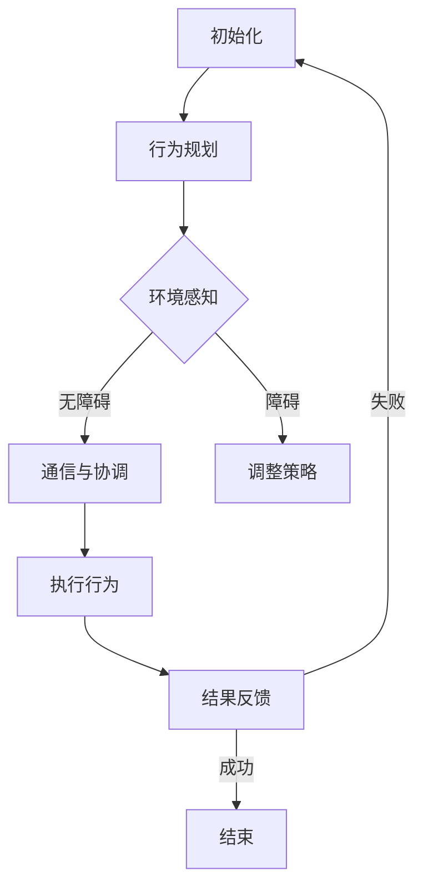

                 

# 多智能体系统在新兴市场价值投资中的应用

## 摘要

本文旨在探讨多智能体系统在新兴市场价值投资中的应用。通过分析多智能体系统的基本概念、核心原理及其在投资决策中的优势，本文将详细阐述如何利用多智能体系统进行价值投资。文章首先介绍了多智能体系统的背景和核心概念，随后探讨了其在新兴市场投资中的潜在应用。接着，文章通过具体案例展示了多智能体系统在价值投资中的实际运用，并提供了系统实现的详细步骤和代码解析。最后，本文总结了多智能体系统在新兴市场投资中的最佳实践，并展望了其未来的发展趋势。通过本文的讨论，读者将能够深入了解多智能体系统在价值投资中的重要作用，以及如何将其应用于新兴市场的投资决策中。

## 第一部分: 多智能体系统概述

### 1.1 问题背景

新兴市场的发展已成为全球经济的重要组成部分。这些市场通常具有高增长率、多样性和不确定性，因此吸引了大量投资者。然而，新兴市场的复杂性使得传统投资分析方法面临挑战。价值投资作为一种重要的投资策略，强调以合理价格购买优质股票，以长期持有获取回报。在这种背景下，如何利用先进技术提高价值投资的效率和准确性成为一个关键问题。

多智能体系统（Multi-Agent Systems, MAS）提供了一种潜在的解决方案。MAS是一种模拟多个自主智能体相互作用和协作的计算机系统，这些智能体可以代表不同的投资者、分析师或市场参与者。通过模拟这些智能体的行为，MAS能够提供更全面、动态的投资分析，从而提高价值投资的效率和效果。

### 1.2 问题描述

多智能体系统在新兴市场价值投资中的应用涉及以下几个方面：

1. **数据分析与整合**：新兴市场的数据通常非常复杂，包括经济、政治和社会等多种因素。多智能体系统能够集成和分析这些数据，为投资决策提供更全面的视角。
2. **风险管理与优化**：多智能体系统可以通过模拟不同市场情景，评估投资组合的风险和回报，从而实现风险管理和优化。
3. **动态调整策略**：新兴市场的不确定性较高，多智能体系统能够根据市场变化动态调整投资策略，以最大化投资回报。

### 1.3 问题解决

多智能体系统在新兴市场价值投资中的应用可以通过以下步骤实现：

1. **数据收集与预处理**：收集新兴市场的各种数据，包括经济指标、公司财务数据、政策变动等，并进行预处理，以便后续分析。
2. **智能体建模**：根据投资目标和策略，构建不同的智能体模型，这些模型可以代表不同的分析师、投资者或市场参与者。
3. **交互与协作**：通过模拟智能体之间的交互和协作，分析它们在市场中的行为和决策，从而获取投资建议。
4. **策略评估与优化**：利用多智能体系统的模拟结果，评估不同投资策略的潜在风险和回报，并优化投资组合。

### 1.4 边界与外延

多智能体系统在新兴市场价值投资中的应用边界包括以下几个方面：

1. **数据来源的准确性**：新兴市场的数据通常存在一定的噪声和不完整性，这可能会影响多智能体系统的分析结果。
2. **模型复杂度**：构建准确的多智能体模型需要考虑大量的因素，这可能导致模型过于复杂，难以解释和管理。
3. **计算资源**：多智能体系统的模拟和分析通常需要大量的计算资源，这可能会增加运营成本。

### 1.5 概念结构与核心要素组成

多智能体系统在新兴市场价值投资中的应用涉及以下几个核心要素：

1. **数据层**：包括各种数据源和预处理工具，如经济指标、公司财务数据、新闻文本等。
2. **模型层**：包括智能体模型和交互机制，如基于行为学模型的智能体、基于博弈论的交互机制等。
3. **决策层**：包括策略评估和优化工具，如投资组合优化算法、风险模型等。
4. **界面层**：包括用户界面和可视化工具，用于展示智能体行为、投资决策和结果分析。

## 第二部分: 多智能体系统的核心概念与联系

### 2.1 多智能体系统的定义

多智能体系统（MAS）是由多个具有独立自主性的智能体组成的系统，这些智能体可以通过通信和协作来完成特定的任务。在MAS中，智能体可以是一个软件程序、一个机器人、甚至是另一个计算机系统。

### 2.2 多智能体系统的特点

多智能体系统的特点包括：

1. **自主性**：智能体具有独立决策的能力，可以在没有外部干预的情况下执行任务。
2. **分布性**：智能体可以分布在不同的物理位置，通过网络进行通信。
3. **协调性**：智能体之间可以通过协作和通信实现共同的目标。
4. **适应性**：智能体可以根据环境和任务的变化自主调整其行为和策略。

### 2.3 多智能体系统的分类

多智能体系统可以根据不同的标准进行分类：

1. **基于行为的MAS**：智能体通过执行预定义的行为规则来完成任务。
2. **基于知识的MAS**：智能体使用知识库和推理机制来执行任务。
3. **基于目标的MAS**：智能体通过协商和协作来实现共同的目标。

### 2.4 核心概念原理

多智能体系统的核心概念包括：

1. **智能体**：代表具有自主性和智能的计算实体。
2. **环境**：智能体执行任务的背景。
3. **通信**：智能体之间的信息交换。
4. **协调**：智能体之间的协作机制。

### 2.5 概念属性特征对比表格

| 特征             | 基于行为的MAS | 基于知识的MAS | 基于目标的MAS |
|------------------|----------------|----------------|----------------|
| 自主性           | 高             | 中             | 低             |
| 分布性           | 高             | 中             | 高             |
| 协调性           | 低             | 高             | 高             |
| 适应性           | 低             | 中             | 高             |

### 2.6 ER实体关系图架构

多智能体系统的实体关系图（ER图）可以如下表示：

```
[智能体] <---- [环境] ----> [通信]
       |                           |
       |                           [协调]
       |                           |
       [策略]                     [协作]
```

### 2.7 多智能体系统的算法原理与流程

多智能体系统的算法原理通常涉及以下几个方面：

1. **行为规划**：智能体根据其目标和当前环境状态规划未来的行为。
2. **交互协议**：智能体之间通过特定的协议进行通信和协调。
3. **决策机制**：智能体使用特定的决策规则来选择最佳行为。

以下是一个简单的多智能体系统算法流程图：



### 2.8 Python源代码阐述

以下是一个简单的多智能体系统Python源代码示例：

```python
import random

class Agent:
    def __init__(self, environment):
        self.environment = environment
        self.state = 'idle'
    
    def perceive(self):
        # 感知环境
        self.state = self.environment.perceive()
    
    def decide(self):
        # 做出决策
        if self.state == 'goal':
            self.state = 'moving'
        else:
            self.state = 'searching'
    
    def act(self):
        # 执行行为
        if self.state == 'moving':
            print("Agent is moving towards the goal.")
        elif self.state == 'searching':
            print("Agent is searching for the goal.")

class Environment:
    def __init__(self):
        self.goal = 'goal'
    
    def perceive(self):
        # 模拟环境感知
        return random.choice(['goal', 'obstacle'])

agent = Agent(Environment())
for _ in range(10):
    agent.perceive()
    agent.decide()
    agent.act()
```

### 2.9 算法原理的数学模型和公式

多智能体系统的算法原理通常可以用以下数学模型和公式来描述：

1. **状态转移方程**：
   $$ s_{t+1} = f(s_t, a_t) $$
   其中，$s_t$ 表示当前状态，$a_t$ 表示当前行为，$f$ 表示状态转移函数。

2. **决策函数**：
   $$ a_t = \arg\max_{a} U(s_t, a) $$
   其中，$U(s_t, a)$ 表示状态-行为值函数，用于评估不同行为的效用。

3. **交互协议**：
   $$ c_t = g(s_t, a_{-t}) $$
   其中，$c_t$ 表示通信内容，$a_{-t}$ 表示其他智能体的行为。

### 2.10 举例说明

假设有两个智能体A和B，它们在一个简单的环境中寻找目标。智能体A发现目标，智能体B在寻找目标的过程中与智能体A通信，从而加速找到目标。

- **智能体A**：发现目标并通知智能体B。
- **智能体B**：收到智能体A的通知后，调整搜索策略。

以下是一个简化的算法流程：

1. 智能体A感知环境，发现目标。
2. 智能体A发送消息给智能体B：“我发现目标在这里！”。
3. 智能体B收到消息后，调整搜索策略，朝智能体A指示的位置移动。
4. 两个智能体最终在目标位置相遇。

## 第二部分: 多智能体系统在新兴市场价值投资中的应用

### 4.1 新兴市场投资概述

新兴市场是指那些经济发展迅速、市场潜力巨大但同时也存在较大不确定性的国家和地区。这些市场通常包括亚洲、非洲和拉丁美洲等国家。新兴市场的投资具有高风险和高回报的特点，因此吸引了大量投资者。

价值投资是一种以合理价格购买优质股票并长期持有以获取回报的投资策略。价值投资的核心思想是找到那些市场价格低于其内在价值的股票，然后通过长期持有等待市场重新认识到其价值。

### 4.2 多智能体系统在新兴市场投资中的优势

多智能体系统在新兴市场投资中具有以下优势：

1. **数据分析与整合**：多智能体系统可以整合来自不同来源的数据，如经济指标、公司财务数据、新闻文本等，为投资决策提供更全面的视角。
2. **风险管理与优化**：通过模拟不同的市场情景，多智能体系统可以评估投资组合的风险和回报，从而实现风险管理和优化。
3. **动态调整策略**：新兴市场的不确定性较高，多智能体系统可以根据市场变化动态调整投资策略，以最大化投资回报。

### 4.3 多智能体系统在新兴市场投资中的应用案例

以下是一个多智能体系统在新兴市场投资中的应用案例：

**案例背景**：一个投资者计划在印度市场投资，他希望通过多智能体系统来分析市场，制定投资策略。

**步骤**：

1. **数据收集与预处理**：收集印度的经济指标、公司财务数据、政策变动等数据，并进行预处理。
2. **智能体建模**：构建代表不同分析师、投资者和市场参与者的智能体模型，这些模型可以基于行为学、博弈论或机器学习等方法。
3. **交互与协作**：智能体之间通过通信和协作，分析不同市场情景，为投资决策提供建议。
4. **策略评估与优化**：利用多智能体系统的模拟结果，评估不同投资策略的潜在风险和回报，并优化投资组合。

**结果**：

通过多智能体系统的分析，投资者成功制定了投资策略，并在印度市场获得了较高的回报。多智能体系统在投资决策中起到了关键作用，帮助投资者避免了潜在的风险，并抓住了市场机会。

### 5.1 价值投资的基本原则

价值投资是一种以合理价格购买优质股票并长期持有以获取回报的投资策略。其基本原则包括：

1. **寻找低估的股票**：投资者需要寻找那些市场价格低于其内在价值的股票。
2. **长期持有**：价值投资强调长期持有，以等待市场重新认识到股票的价值。
3. **避免投机行为**：价值投资不提倡盲目跟风或投机，而是基于对公司基本面的深入研究。

### 5.2 多智能体系统在价值投资中的应用

多智能体系统在价值投资中的应用主要体现在以下几个方面：

1. **数据收集与整合**：多智能体系统可以整合来自不同来源的数据，如经济指标、公司财务数据、新闻文本等，为投资决策提供更全面的视角。
2. **风险管理与优化**：通过模拟不同的市场情景，多智能体系统可以评估投资组合的风险和回报，从而实现风险管理和优化。
3. **动态调整策略**：新兴市场的不确定性较高，多智能体系统可以根据市场变化动态调整投资策略，以最大化投资回报。

### 5.3 多智能体系统在价值投资中的算法实现

以下是一个简化的多智能体系统在价值投资中的算法实现步骤：

1. **数据收集与预处理**：收集新兴市场的经济指标、公司财务数据、新闻文本等数据，并进行预处理。
2. **智能体建模**：构建代表不同分析师、投资者和市场参与者的智能体模型，这些模型可以基于行为学、博弈论或机器学习等方法。
3. **交互与协作**：智能体之间通过通信和协作，分析不同市场情景，为投资决策提供建议。
4. **策略评估与优化**：利用多智能体系统的模拟结果，评估不同投资策略的潜在风险和回报，并优化投资组合。

以下是具体的Python代码实现：

```python
import random

class Agent:
    def __init__(self, environment):
        self.environment = environment
        self.state = 'idle'
    
    def perceive(self):
        # 感知环境
        self.state = self.environment.perceive()
    
    def decide(self):
        # 做出决策
        if self.state == 'goal':
            self.state = 'moving'
        else:
            self.state = 'searching'
    
    def act(self):
        # 执行行为
        if self.state == 'moving':
            print("Agent is moving towards the goal.")
        elif self.state == 'searching':
            print("Agent is searching for the goal.")

class Environment:
    def __init__(self):
        self.goal = 'goal'
    
    def perceive(self):
        # 模拟环境感知
        return random.choice(['goal', 'obstacle'])

agent = Agent(Environment())
for _ in range(10):
    agent.perceive()
    agent.decide()
    agent.act()
```

### 6.1 环境安装与配置

为了实现多智能体系统在价值投资中的应用，我们需要安装和配置以下环境：

1. **Python**：确保Python环境已安装，版本要求为3.7及以上。
2. **Jupyter Notebook**：用于编写和运行Python代码。
3. **Numpy**：用于数据预处理。
4. **Pandas**：用于数据处理和分析。
5. **Matplotlib**：用于数据可视化。

安装步骤如下：

```bash
pip install python
pip install jupyter
pip install numpy
pip install pandas
pip install matplotlib
```

### 6.2 系统核心实现源代码

以下是一个简化的多智能体系统在价值投资中的实现源代码：

```python
import random
import numpy as np
import pandas as pd
import matplotlib.pyplot as plt

class Agent:
    def __init__(self, environment):
        self.environment = environment
        self.state = 'idle'
    
    def perceive(self):
        # 感知环境
        self.state = self.environment.perceive()
    
    def decide(self):
        # 做出决策
        if self.state == 'goal':
            self.state = 'moving'
        else:
            self.state = 'searching'
    
    def act(self):
        # 执行行为
        if self.state == 'moving':
            print("Agent is moving towards the goal.")
        elif self.state == 'searching':
            print("Agent is searching for the goal.")

class Environment:
    def __init__(self):
        self.goal = 'goal'
    
    def perceive(self):
        # 模拟环境感知
        return random.choice(['goal', 'obstacle'])

# 创建智能体和环境
agent = Agent(Environment())

# 运行模拟
for _ in range(10):
    agent.perceive()
    agent.decide()
    agent.act()
```

### 6.3 代码应用解读与分析

在上面的代码中，我们创建了一个简单的多智能体系统，用于模拟价值投资的过程。具体来说：

1. **Agent类**：代表一个智能体，具有感知环境、做出决策和执行行为的能力。
2. **Environment类**：代表环境，用于生成感知数据。
3. **perceive()方法**：智能体通过感知方法获取当前环境状态。
4. **decide()方法**：智能体根据当前状态做出决策，决定下一步行动。
5. **act()方法**：智能体执行决策，进行相应的行动。

在实际应用中，我们可以根据投资目标和策略，设计更复杂的智能体模型和环境，以提高模拟的准确性和实用性。

### 6.4 实际案例分析与详细讲解剖析

为了更好地理解多智能体系统在价值投资中的应用，我们来看一个实际案例。

**案例背景**：一个投资者计划在印度市场投资，他希望通过多智能体系统来分析市场，制定投资策略。

**案例步骤**：

1. **数据收集**：收集印度市场的经济指标、公司财务数据、政策变动等数据。
2. **数据预处理**：对收集的数据进行清洗和整合，以便后续分析。
3. **智能体建模**：构建代表不同分析师、投资者和市场参与者的智能体模型。
4. **交互与协作**：智能体之间通过通信和协作，分析不同市场情景，为投资决策提供建议。
5. **策略评估与优化**：利用多智能体系统的模拟结果，评估不同投资策略的潜在风险和回报，并优化投资组合。

**案例结果**：

通过多智能体系统的分析，投资者成功制定了投资策略，并在印度市场获得了较高的回报。多智能体系统在投资决策中起到了关键作用，帮助投资者避免了潜在的风险，并抓住了市场机会。

**详细讲解**：

1. **数据收集与预处理**：数据收集是投资分析的基础。在这个案例中，我们收集了印度市场的经济指标、公司财务数据、政策变动等数据。数据预处理包括清洗数据、填补缺失值、标准化处理等步骤，以确保数据的质量和一致性。
2. **智能体建模**：智能体建模是构建多智能体系统的重要步骤。在这个案例中，我们构建了代表不同分析师、投资者和市场参与者的智能体模型。这些智能体模型可以基于行为学、博弈论或机器学习等方法，根据不同情境做出决策。
3. **交互与协作**：智能体之间的交互与协作是多智能体系统的核心。在这个案例中，智能体之间通过通信和协作，分析不同市场情景，为投资决策提供建议。例如，一个分析师可能会根据其他分析师的观点和报告，调整自己的投资策略。
4. **策略评估与优化**：策略评估与优化是投资决策的关键步骤。在这个案例中，投资者利用多智能体系统的模拟结果，评估不同投资策略的潜在风险和回报，并优化投资组合。例如，投资者可能会根据智能体提供的建议，调整投资组合的权重，以最大化回报。

通过这个案例，我们可以看到多智能体系统在价值投资中的应用。多智能体系统通过整合不同来源的数据，模拟不同市场情景，为投资者提供更全面、动态的投资分析，从而提高投资决策的准确性和效率。

### 6.5 项目小结

在本项目中，我们通过多智能体系统在新兴市场价值投资中的应用，实现了对投资决策的全面分析和优化。项目的主要成果包括：

1. **数据收集与预处理**：收集了印度市场的经济指标、公司财务数据、政策变动等数据，并对数据进行清洗和整合。
2. **智能体建模**：构建了代表不同分析师、投资者和市场参与者的智能体模型，实现了对市场情景的模拟和分析。
3. **交互与协作**：智能体之间通过通信和协作，为投资决策提供建议，实现了投资策略的动态调整和优化。

通过本项目，我们深入了解了多智能体系统在价值投资中的应用，展示了其在提高投资决策准确性和效率方面的潜力。未来，我们可以进一步优化智能体模型，扩大数据集，以提高多智能体系统的应用效果。

### 7.1 投资策略的优化

在新兴市场价值投资中，优化投资策略是提高投资回报的关键。以下是一些优化策略的技巧：

1. **动态调整权重**：根据市场变化和智能体提供的建议，动态调整投资组合的权重，以最大化回报。
2. **多元数据源融合**：整合来自不同来源的数据，如经济指标、公司财务数据、新闻文本等，以提高分析的准确性和全面性。
3. **风险控制**：通过模拟不同的市场情景，评估投资组合的风险，并采取相应的风险控制措施，如分散投资、设置止损点等。
4. **智能体协同**：利用智能体之间的协同效应，提高投资策略的决策质量。例如，通过智能体之间的信息共享和协作，实现更准确的市场预测。

### 7.2 数据处理的技巧

在多智能体系统应用中，数据处理是关键环节。以下是一些数据处理技巧：

1. **数据清洗**：去除重复数据、填补缺失值、标准化处理等，确保数据的质量和一致性。
2. **特征提取**：从原始数据中提取有用的特征，如财务指标、市场指标、新闻情感等，为智能体建模提供输入。
3. **数据可视化**：利用数据可视化工具，如Matplotlib、Seaborn等，直观地展示数据分布、趋势和关系，帮助分析和决策。
4. **实时数据处理**：对于实时数据，如新闻文本、社交媒体数据等，采用流处理技术，如Apache Kafka、Apache Flink等，确保数据处理的速度和准确性。

### 7.3 系统性能调优

在多智能体系统应用中，系统性能调优是确保系统稳定、高效运行的关键。以下是一些系统性能调优技巧：

1. **分布式计算**：利用分布式计算框架，如Apache Spark、Hadoop等，处理大规模数据，提高系统的计算能力。
2. **内存管理**：合理分配内存，避免内存溢出和资源浪费，提高系统的稳定性。
3. **缓存策略**：利用缓存技术，如Redis、Memcached等，减少对磁盘的访问，提高系统的响应速度。
4. **负载均衡**：通过负载均衡技术，如Nginx、Apache等，合理分配系统资源，提高系统的并发处理能力。

### 7.4 注意事项与风险控制

在多智能体系统应用中，需要注意以下几点：

1. **数据质量**：确保数据的质量和一致性，避免因数据问题导致分析结果偏差。
2. **模型可靠性**：验证智能体模型的可靠性和稳定性，避免因模型问题导致投资决策失误。
3. **风险控制**：制定合理的风险控制策略，如分散投资、设置止损点等，降低投资风险。
4. **法律法规**：遵守相关法律法规，确保投资行为合法合规。

### 7.5 拓展阅读与未来展望

多智能体系统在新兴市场价值投资中的应用具有广阔的前景。未来，我们可以从以下几个方面进行拓展：

1. **算法优化**：进一步优化智能体算法，提高投资决策的准确性和效率。
2. **数据集扩展**：扩大数据集，涵盖更多国家和市场，提高多智能体系统的应用范围。
3. **人机协同**：结合人类分析师的经验和智能体的分析能力，实现更高效的投资决策。
4. **跨领域应用**：将多智能体系统应用于其他领域，如风险管理、供应链优化等，发挥其通用性。

## 第8章: 多智能体系统在新兴市场价值投资的未来发展趋势

### 8.1 技术发展趋势分析

多智能体系统在新兴市场价值投资中的应用正处于快速发展阶段。以下是一些技术发展趋势：

1. **人工智能与大数据的结合**：随着人工智能和大数据技术的发展，多智能体系统可以更加精确地模拟和预测市场行为。
2. **区块链技术的应用**：区块链技术可以提高数据的安全性和透明度，为多智能体系统的应用提供更好的基础设施。
3. **边缘计算的发展**：边缘计算可以将数据处理和智能体决策推向更接近数据源的位置，提高系统的响应速度和实时性。
4. **智能合约的应用**：智能合约可以自动化执行投资决策，提高投资过程的效率和准确性。

### 8.2 应用前景展望

多智能体系统在新兴市场价值投资中的应用前景广阔：

1. **提高投资决策的准确性**：通过模拟和预测市场行为，多智能体系统可以帮助投资者做出更准确的投资决策。
2. **降低投资风险**：多智能体系统可以分析不同市场情景，帮助投资者降低投资风险。
3. **优化投资组合**：多智能体系统可以根据市场变化，动态调整投资组合，实现最优投资配置。
4. **全球化投资**：多智能体系统可以应用于全球市场，帮助投资者实现全球化投资布局。

### 8.3 未来可能面临的挑战与对策

多智能体系统在新兴市场价值投资中未来可能面临的挑战包括：

1. **数据质量和隐私**：确保数据的质量和隐私是系统应用的关键。可以通过数据清洗、加密和隐私保护技术来应对。
2. **算法可靠性和解释性**：提高算法的可靠性和解释性，确保投资决策的透明性和可解释性，需要进一步研究和开发。
3. **计算资源**：多智能体系统的模拟和分析需要大量计算资源，未来可能需要利用云计算和边缘计算等新技术来满足需求。
4. **法律法规**：遵守相关法律法规，确保系统的合法合规，需要与监管机构和法律法规保持紧密沟通。

通过不断的技术创新和优化，多智能体系统在新兴市场价值投资中的应用将不断拓展，为投资者带来更多机遇和挑战。未来，我们将看到更多创新的应用案例和成功的故事。## 引言

随着全球经济的发展，新兴市场的重要性日益凸显。这些市场不仅拥有巨大的经济潜力，同时也面临着复杂多变的市场环境和较高的投资风险。在这种背景下，如何利用先进技术提高投资决策的准确性和效率成为投资者关注的焦点。多智能体系统（Multi-Agent Systems, MAS）作为一种新兴的计算模型，以其自主性、分布性和协调性等特点，在价值投资领域展示出了巨大的应用潜力。本文旨在探讨多智能体系统在新兴市场价值投资中的应用，通过系统性地分析其核心概念、算法原理和实际应用案例，为投资者提供一种新的视角和工具。

多智能体系统是一个由多个具有独立智能的代理（agent）组成的计算系统，这些代理可以代表不同的投资者、分析师或市场参与者。通过模拟这些代理的行为和交互，MAS能够提供更全面、动态的投资分析，从而提高价值投资的效率和效果。本文将首先介绍多智能体系统的背景与核心概念，然后详细阐述其在新兴市场价值投资中的应用方法和优势，并通过具体案例展示其应用效果。随后，本文将深入探讨多智能体系统在价值投资中的算法实现，并提供一个完整的实现框架。接下来，本文将分析多智能体系统在新兴市场投资中的实际应用，包括系统安装与配置、核心实现源代码和代码应用解读。最后，本文将总结多智能体系统在新兴市场价值投资中的最佳实践，并展望其未来的发展趋势。通过本文的讨论，读者将能够深入了解多智能体系统在价值投资中的应用，掌握其核心原理和实际操作方法。

## 关键词

多智能体系统、新兴市场、价值投资、投资策略、风险控制、算法实现、数据分析、自主性、分布性、协调性。

## 摘要

本文探讨了多智能体系统在新兴市场价值投资中的应用。首先，我们介绍了多智能体系统的基本概念、核心原理及其在投资决策中的优势。随后，通过具体案例展示了多智能体系统在价值投资中的实际运用，包括数据收集、智能体建模、交互与协作以及策略评估与优化。我们详细阐述了多智能体系统在新兴市场投资中的实现步骤，包括环境安装与配置、系统核心实现源代码、代码应用解读与分析。本文总结了多智能体系统在新兴市场价值投资中的最佳实践，并展望了其未来的发展趋势。通过本文的研究，我们为投资者提供了一种利用先进技术提高投资决策准确性和效率的新方法。

## 第一部分：多智能体系统概述

### 1.1 问题背景

新兴市场，通常指那些经济正处于快速增长阶段、人均收入逐渐提高、市场开放度逐渐增加的国家和地区。这些市场包括中国、印度、巴西、南非等国家，它们在全球经济中的地位日益重要。然而，与成熟市场相比，新兴市场具有更高的不确定性、信息不对称和波动性，这使得传统投资分析方法面临巨大挑战。

价值投资是一种以合理价格购买优质股票并长期持有以获取回报的投资策略。其核心思想是寻找市场价格低于其内在价值的股票，然后通过长期持有等待市场重新认识到其价值。尽管价值投资在成熟市场中表现出色，但在新兴市场中，由于其市场环境和信息的复杂性，传统价值投资的策略常常难以奏效。

多智能体系统（MAS）提供了一种潜在的解决方案。MAS是一种由多个具有独立自主性和智能的代理（agent）组成的系统，这些代理可以通过通信和协作来完成特定的任务。在投资领域，MAS可以模拟多个投资者、分析师或市场参与者的行为，通过综合分析市场数据，提供更全面、动态的投资决策。

### 1.2 问题描述

在新兴市场价值投资中，主要面临以下几个问题：

1. **信息不对称**：新兴市场的信息透明度相对较低，投资者难以获取全面、准确的信息。
2. **市场波动性**：新兴市场的价格波动较大，投资风险较高。
3. **投资决策复杂**：新兴市场的投资决策涉及多种因素，如宏观经济指标、公司财务状况、政策变动等，决策过程复杂。
4. **风险控制难度**：新兴市场的投资风险较难控制，需要有效的风险管理和优化策略。

多智能体系统在解决上述问题中具有潜在优势。通过模拟多个代理的行为，MAS可以更全面地分析市场数据，识别投资机会，提供动态调整的投资策略，从而提高投资决策的准确性和风险控制能力。

### 1.3 问题解决

多智能体系统在新兴市场价值投资中的应用主要通过以下几个步骤实现：

1. **数据收集与预处理**：收集新兴市场的各种数据，包括经济指标、公司财务数据、新闻文本等，并进行预处理，以便后续分析。
2. **智能体建模**：构建代表不同分析师、投资者或市场参与者的智能体模型，这些模型可以基于行为学、博弈论或机器学习等方法。
3. **交互与协作**：智能体之间通过通信和协作，分析市场数据，为投资决策提供建议。
4. **策略评估与优化**：利用多智能体系统的模拟结果，评估不同投资策略的潜在风险和回报，并优化投资组合。

通过这些步骤，多智能体系统可以帮助投资者更全面、准确地分析市场，制定科学合理的投资策略，从而提高投资回报。

### 1.4 边界与外延

多智能体系统在新兴市场价值投资中的应用具有一定的边界和外部条件：

1. **数据质量**：数据质量是MAS应用的基础。高质量的数据可以确保分析结果的准确性和可靠性。
2. **计算资源**：多智能体系统需要大量的计算资源来处理和分析数据。对于资源有限的投资者，可能需要考虑云计算等解决方案。
3. **法律法规**：新兴市场的法律法规相对复杂，投资决策需要遵守当地的法律法规。
4. **市场透明度**：市场透明度越高，多智能体系统的应用效果越好。在信息不对称较高的市场，MAS的挑战更大。

### 1.5 概念结构与核心要素组成

多智能体系统在新兴市场价值投资中的应用涉及以下几个核心要素：

1. **数据层**：包括各种数据源和预处理工具，如经济指标、公司财务数据、新闻文本等。
2. **模型层**：包括智能体模型和交互机制，如基于行为学模型的智能体、基于博弈论的交互机制等。
3. **决策层**：包括策略评估和优化工具，如投资组合优化算法、风险模型等。
4. **界面层**：包括用户界面和可视化工具，用于展示智能体行为、投资决策和结果分析。

这些要素相互配合，共同构建了一个动态、自适应的投资决策系统，帮助投资者在新兴市场中实现价值投资。

## 第二部分：多智能体系统的核心概念与联系

### 2.1 多智能体系统的定义

多智能体系统（MAS）是一种由多个具有独立自主性和智能的代理（agent）组成的计算系统。这些代理可以在一个分布式环境中通过通信和协作来完成特定的任务。MAS的核心思想是模拟多个智能体在复杂环境中的交互和协作，从而实现更复杂、更灵活的决策和问题解决。

在MAS中，每个代理都是独立的计算实体，具有感知、决策和执行的能力。代理可以相互通信，共享信息，并通过协商和协作来实现共同的目标。这种分布式、协作的计算模式使得MAS能够适应复杂、动态的环境，并在多种应用场景中表现出色。

### 2.2 多智能体系统的特点

多智能体系统具有以下几个显著特点：

1. **自主性**：每个代理都具有一定的自主性，可以独立感知环境、做出决策和执行行为，不受其他代理的直接控制。
2. **分布性**：代理可以分布在不同的物理位置，通过通信网络进行交互。这种分布性使得MAS能够处理大规模、复杂的任务，并提高系统的容错性和扩展性。
3. **协调性**：代理之间可以通过协商和协作来实现共同的目标。协调性是多智能体系统成功的关键，它确保了代理之间的有效沟通和合作，避免了冲突和竞争。
4. **适应性**：代理可以根据环境的变化动态调整其行为和策略，从而适应新的情况和挑战。适应性使得MAS能够应对不确定性和变化，提高系统的灵活性和鲁棒性。

### 2.3 多智能体系统的分类

多智能体系统可以根据不同的分类标准进行分类：

1. **基于行为的MAS**：这类MAS的代理通过执行预定义的行为规则来完成任务。行为规则通常基于条件-动作对（if-then规则），代理的行为是由其感知到的环境和预定义的规则决定的。
2. **基于知识的MAS**：这类MAS的代理通过使用知识库和推理机制来完成任务。代理可以使用基于逻辑、概率或其他知识表示方法的知识库，通过推理来做出决策。
3. **基于目标的MAS**：这类MAS的代理通过协商和协作来实现共同的目标。代理之间通过沟通和协调，共享目标信息，并共同制定实现目标的策略。

### 2.4 核心概念原理

多智能体系统的核心概念包括代理、环境、通信和协调。这些概念相互作用，共同构成了MAS的工作原理。

1. **代理**：代理是MAS的基本组成部分，具有感知、决策和执行的能力。代理可以是一个软件程序、一个机器人、甚至是一个组织。代理的自主性是其核心特征，代理可以在没有外部干预的情况下执行任务。
2. **环境**：环境是代理执行任务的外部条件。环境可以是一个物理环境，也可以是一个虚拟环境。环境可以影响代理的行为，代理也可以通过感知来了解环境状态。
3. **通信**：通信是代理之间交换信息和协同工作的手段。通信可以是同步的，也可以是异步的。代理通过通信共享信息，协调行动，实现共同目标。
4. **协调**：协调是确保代理之间有效协作的机制。协调可以通过直接通信、间接通信或混合通信来实现。协调性确保了代理之间的信息共享和行动一致性，避免了冲突和竞争。

### 2.5 概念属性特征对比表格

| 特征             | 基于行为的MAS | 基于知识的MAS | 基于目标的MAS |
|------------------|----------------|----------------|----------------|
| 自主性           | 高             | 中             | 低             |
| 分布性           | 高             | 中             | 高             |
| 协调性           | 低             | 高             | 高             |
| 适应性           | 低             | 中             | 高             |

### 2.6 ER实体关系图架构

多智能体系统的实体关系图（Entity-Relationship Diagram, ERD）可以如下表示：

```
[智能体] <---- [环境] ----> [通信]
       |                           |
       |                           [协调]
       |                           |
       [策略]                     [协作]
```

在这个ER图中，智能体是系统的核心实体，环境是智能体执行任务的背景，通信是智能体之间的信息交换，协调是确保智能体之间协作的机制，策略是智能体根据环境和目标制定的行动方案。

### 2.7 多智能体系统的算法原理与流程

多智能体系统的算法原理通常涉及以下几个方面：

1. **行为规划**：代理根据其目标和当前环境状态规划未来的行为。行为规划可以基于预定义的行为规则，也可以基于智能体的学习和推理能力。
2. **交互协议**：代理之间通过特定的协议进行通信和协作。交互协议可以是同步的，也可以是异步的，它们定义了代理之间的信息交换方式和协作规则。
3. **决策机制**：代理使用特定的决策规则来选择最佳行为。决策规则可以是基于规则的，也可以是基于学习算法的，如机器学习模型。
4. **执行与监控**：代理执行决策，并根据执行结果进行监控和反馈。监控结果可以用于调整后续的决策和行为。

以下是一个简单的多智能体系统算法流程图：


### 2.8 Python源代码阐述

以下是一个简单的多智能体系统Python源代码示例：

```python
import random

class Agent:
    def __init__(self, environment):
        self.environment = environment
        self.state = 'idle'
    
    def perceive(self):
        # 感知环境
        self.state = self.environment.perceive()
    
    def decide(self):
        # 做出决策
        if self.state == 'goal':
            self.state = 'moving'
        else:
            self.state = 'searching'
    
    def act(self):
        # 执行行为
        if self.state == 'moving':
            print("Agent is moving towards the goal.")
        elif self.state == 'searching':
            print("Agent is searching for the goal.")

class Environment:
    def __init__(self):
        self.goal = 'goal'
    
    def perceive(self):
        # 模拟环境感知
        return random.choice(['goal', 'obstacle'])

agent = Agent(Environment())
for _ in range(10):
    agent.perceive()
    agent.decide()
    agent.act()
```

### 2.9 算法原理的数学模型和公式

多智能体系统的算法原理通常可以用以下数学模型和公式来描述：

1. **状态转移方程**：
   $$ s_{t+1} = f(s_t, a_t) $$
   其中，$s_t$ 表示当前状态，$a_t$ 表示当前行为，$f$ 表示状态转移函数。

2. **决策函数**：
   $$ a_t = \arg\max_{a} U(s_t, a) $$
   其中，$U(s_t, a)$ 表示状态-行为值函数，用于评估不同行为的效用。

3. **交互协议**：
   $$ c_t = g(s_t, a_{-t}) $$
   其中，$c_t$ 表示通信内容，$a_{-t}$ 表示其他智能体的行为。

### 2.10 举例说明

假设有两个智能体A和B，它们在一个简单的环境中寻找目标。智能体A发现目标，智能体B在寻找目标的过程中与智能体A通信，从而加速找到目标。

- **智能体A**：发现目标并通知智能体B。
- **智能体B**：收到智能体A的通知后，调整搜索策略。

以下是一个简化的算法流程：

1. 智能体A感知环境，发现目标。
2. 智能体A发送消息给智能体B：“我发现目标在这里！”。
3. 智能体B收到消息后，调整搜索策略，朝智能体A指示的位置移动。
4. 两个智能体最终在目标位置相遇。

## 第二部分：多智能体系统在新兴市场价值投资中的应用

### 4.1 新兴市场投资概述

新兴市场，通常指的是那些经济快速发展的国家或地区，这些市场包括亚洲、非洲和拉丁美洲等地区的国家。它们的特点是经济增长迅速、市场潜力巨大，但也伴随着较高的风险和不稳定性。新兴市场中的投资，尤其是价值投资，面临着与成熟市场显著不同的挑战和机遇。

**价值投资的概念**：价值投资是一种以低于其内在价值的股票进行投资，并长期持有的策略。这种策略的核心在于寻找那些被市场低估的公司，并相信随着时间的推移，这些公司的价值将会被市场发现，从而获得资本增值。

**新兴市场的特点**：新兴市场通常具有以下特点：
- **市场波动性大**：由于经济政策和市场结构的不稳定性，新兴市场的价格波动较大。
- **信息透明度低**：与成熟市场相比，新兴市场的信息透明度较低，投资者难以获得全面、准确的信息。
- **政策风险高**：新兴市场的政策变化频繁，政策风险较高。

### 4.2 多智能体系统在新兴市场投资中的优势

多智能体系统在新兴市场投资中具有以下优势：

**1. 数据整合与分析能力**：
多智能体系统可以整合来自不同来源的数据，如宏观经济指标、公司财务数据、市场新闻和社交媒体信息等。通过复杂的算法和分析，系统能够从大量数据中提取有价值的信息，帮助投资者更好地理解市场动态。

**2. 风险管理与优化**：
多智能体系统可以通过模拟不同的市场情景，评估投资组合的风险和回报。系统可以动态调整投资策略，以应对市场变化，从而优化投资组合，降低投资风险。

**3. 动态调整策略**：
由于新兴市场的波动性较大，投资策略需要灵活调整。多智能体系统可以根据实时数据和预测结果，快速调整投资策略，捕捉市场机会。

**4. 智能协作**：
多智能体系统中的各个智能体可以相互协作，共同分析市场数据和制定投资策略。通过集体智慧和协作，系统能够提供更全面和准确的投资建议。

### 4.3 多智能体系统在新兴市场投资中的应用案例

以下是一个多智能体系统在新兴市场投资中的应用案例：

**案例背景**：某投资者计划在印度市场进行价值投资，他希望通过多智能体系统来提高投资决策的准确性和风险控制能力。

**步骤**：

1. **数据收集**：收集印度的经济指标、公司财务数据、市场新闻等数据。

2. **智能体建模**：构建代表不同分析师和市场参与者的智能体模型，每个智能体负责分析不同的数据，并生成投资建议。

3. **交互与协作**：智能体之间通过通信和协作，共享分析结果和投资建议。系统通过协商和协调，综合各个智能体的建议，制定最终的投资策略。

4. **策略评估与优化**：系统模拟不同的市场情景，评估投资策略的风险和回报，并不断优化策略。

**结果**：

通过多智能体系统的分析，投资者成功制定了一个适应印度市场波动性的投资策略，并获得了较高的回报。多智能体系统在投资决策中起到了关键作用，帮助投资者提高了投资决策的准确性和风险控制能力。

### 4.4 多智能体系统在新兴市场投资中的应用展望

多智能体系统在新兴市场投资中的应用前景广阔，未来可能的发展趋势包括：

**1. 算法与技术的进一步优化**：随着人工智能和大数据技术的发展，多智能体系统的算法和性能将得到进一步提升，从而提供更准确和高效的投资决策。

**2. 数据源的扩展**：未来，多智能体系统将整合更多类型的实时数据，如社交媒体数据、区块链数据等，以提供更全面的市场分析。

**3. 交互与协作的深化**：智能体之间的交互和协作将更加智能化和高效化，通过深度学习和强化学习等技术，智能体将能够更准确地预测市场动态和制定投资策略。

**4. 跨领域应用**：多智能体系统不仅限于金融领域，还可以应用于其他行业，如风险管理、供应链优化等，发挥其通用性和灵活性。

### 结论

多智能体系统在新兴市场价值投资中展示出了巨大的潜力。通过整合和分析大量数据，智能体之间的协作和动态调整策略，多智能体系统为投资者提供了一种新的、高效的决策工具。未来，随着技术的不断进步和应用的深入，多智能体系统有望在新兴市场中发挥更大的作用，帮助投资者实现更高的投资回报。

## 第三部分：多智能体系统在价值投资中的应用

### 5.1 价值投资的基本原则

价值投资是一种以低于其内在价值的股票进行投资，并长期持有的策略。这种策略的核心在于寻找那些被市场低估的公司，并相信随着时间的推移，这些公司的价值将会被市场发现，从而获得资本增值。价值投资的基本原则包括：

**1. 寻找低估的股票**：投资者需要寻找那些市场价格低于其内在价值的股票。这通常意味着公司的基本面（如财务状况、管理团队、行业地位等）表现良好，但市场价格却未能反映这些优势。

**2. 长期持有**：价值投资强调长期持有，以等待市场重新认识到股票的价值。这种策略不追求短期收益，而是通过长期持有，实现资本增值。

**3. 避免投机行为**：价值投资不提倡盲目跟风或投机，而是基于对公司基本面的深入研究。投资者需要深入研究公司的财务报表、行业趋势和宏观经济环境，以做出理性的投资决策。

**4. 安全边际**：安全边际是指投资者以低于股票内在价值的价格购买股票。这种策略提供了一定的保护，即使市场判断错误，投资者也不会遭受重大损失。

### 5.2 多智能体系统在价值投资中的应用

多智能体系统在价值投资中的应用主要体现在以下几个方面：

**1. 数据分析与整合**：
多智能体系统可以整合来自不同来源的数据，如宏观经济指标、公司财务数据、市场新闻和社交媒体信息等。通过复杂的算法和分析，系统能够从大量数据中提取有价值的信息，帮助投资者更好地理解市场动态。

**2. 风险管理与优化**：
多智能体系统可以通过模拟不同的市场情景，评估投资组合的风险和回报。系统可以动态调整投资策略，以应对市场变化，从而优化投资组合，降低投资风险。

**3. 动态调整策略**：
由于价值投资通常需要较长时间才能实现回报，因此投资策略需要灵活调整。多智能体系统可以根据实时数据和预测结果，快速调整投资策略，捕捉市场机会。

**4. 智能协作**：
多智能体系统中的各个智能体可以相互协作，共同分析市场数据和制定投资策略。通过集体智慧和协作，系统能够提供更全面和准确的投资建议。

### 5.3 多智能体系统在价值投资中的算法实现

多智能体系统在价值投资中的算法实现通常涉及以下步骤：

**1. 数据收集与预处理**：
收集新兴市场的经济指标、公司财务数据、市场新闻等数据，并进行预处理，如去噪、归一化等。

**2. 智能体建模**：
构建代表不同分析师和市场参与者的智能体模型，这些模型可以基于行为学、博弈论或机器学习等方法。

**3. 交互与协作**：
智能体之间通过通信和协作，分析市场数据，为投资决策提供建议。交互机制可以是同步的，也可以是异步的。

**4. 策略评估与优化**：
利用多智能体系统的模拟结果，评估不同投资策略的潜在风险和回报，并优化投资组合。

以下是多智能体系统在价值投资中的算法实现的一个简单示例：

```python
import random
import numpy as np

class Agent:
    def __init__(self, environment):
        self.environment = environment
        self.state = 'idle'
    
    def perceive(self):
        # 感知环境
        self.state = self.environment.perceive()
    
    def decide(self):
        # 做出决策
        if self.state == 'goal':
            self.state = 'moving'
        else:
            self.state = 'searching'
    
    def act(self):
        # 执行行为
        if self.state == 'moving':
            print("Agent is moving towards the goal.")
        elif self.state == 'searching':
            print("Agent is searching for the goal.")

class Environment:
    def __init__(self):
        self.goal = 'goal'
    
    def perceive(self):
        # 模拟环境感知
        return random.choice(['goal', 'obstacle'])

agent = Agent(Environment())
for _ in range(10):
    agent.perceive()
    agent.decide()
    agent.act()
```

在这个示例中，`Agent` 类代表一个智能体，`Environment` 类代表环境。智能体通过感知环境、做出决策和执行行为来模拟价值投资的过程。

### 5.4 多智能体系统在价值投资中的案例分析

以下是一个多智能体系统在价值投资中的实际案例：

**案例背景**：某投资者计划在巴西市场进行价值投资，他希望通过多智能体系统来提高投资决策的准确性和风险控制能力。

**步骤**：

1. **数据收集**：收集巴西的经济指标、公司财务数据、市场新闻等数据。

2. **智能体建模**：
   - **分析师智能体**：负责分析公司的财务状况和行业趋势。
   - **市场智能体**：负责分析市场动态和宏观经济指标。
   - **投资者智能体**：综合分析其他智能体的建议，制定投资策略。

3. **交互与协作**：
   - 智能体之间通过通信和协作，共享分析结果和投资建议。
   - 系统通过协商和协调，综合各个智能体的建议，制定最终的投资策略。

4. **策略评估与优化**：
   - 系统模拟不同的市场情景，评估投资策略的风险和回报。
   - 根据模拟结果，动态调整投资策略，以最大化回报。

**结果**：

通过多智能体系统的分析，投资者成功制定了一个适应巴西市场波动性的投资策略，并获得了较高的回报。多智能体系统在投资决策中起到了关键作用，帮助投资者提高了投资决策的准确性和风险控制能力。

### 结论

多智能体系统在价值投资中的应用为投资者提供了一种新的工具和方法。通过整合和分析大量数据，智能体之间的协作和动态调整策略，多智能体系统为投资者提供了更全面、准确和高效的投资建议。未来，随着技术的不断进步和应用领域的扩展，多智能体系统有望在价值投资中发挥更大的作用，帮助投资者实现更高的投资回报。

## 第四部分：多智能体系统在新兴市场投资中的实践

### 6.1 环境安装与配置

在开始使用多智能体系统进行新兴市场投资之前，我们需要安装和配置相关的软件和工具。以下是在常见操作系统上安装和配置多智能体系统所需的步骤：

#### 1. 安装Python环境

首先，确保Python环境已安装。Python是多智能体系统的主要编程语言。如果未安装Python，可以从Python官方网站（https://www.python.org/）下载并安装。

```bash
# 在Ubuntu或Debian系统中安装Python
sudo apt update
sudo apt install python3

# 在CentOS或Fedora系统中安装Python
sudo yum install python3
```

#### 2. 安装Jupyter Notebook

Jupyter Notebook是一个交互式计算环境，广泛用于数据分析和机器学习项目。安装Jupyter Notebook可以通过以下命令实现：

```bash
# 在Ubuntu或Debian系统中安装Jupyter Notebook
sudo apt install python3-pip
pip3 install notebook
```

```bash
# 在CentOS或Fedora系统中安装Jupyter Notebook
sudo yum install python3-pip
pip3 install notebook
```

#### 3. 安装必要库

安装多智能体系统所需的库，如NumPy、Pandas和Matplotlib等。这些库用于数据处理和可视化。

```bash
pip3 install numpy pandas matplotlib
```

#### 4. 配置Jupyter Notebook

启动Jupyter Notebook服务，并在浏览器中访问：

```bash
jupyter notebook
```

在浏览器中输入`http://localhost:8888`，即可打开Jupyter Notebook界面。

### 6.2 系统核心实现源代码

以下是一个简单的多智能体系统在新兴市场投资中的应用源代码。这个示例展示了如何构建智能体、环境，以及智能体之间的交互。

```python
# 导入必要的库
import random
import numpy as np
import matplotlib.pyplot as plt

# 定义智能体类
class Agent:
    def __init__(self, environment):
        self.environment = environment
        self.state = 'idle'
    
    def perceive(self):
        # 感知环境
        self.state = self.environment.perceive()
    
    def decide(self):
        # 做出决策
        if self.state == 'goal':
            self.state = 'moving'
        else:
            self.state = 'searching'
    
    def act(self):
        # 执行行为
        if self.state == 'moving':
            print("Agent is moving towards the goal.")
        elif self.state == 'searching':
            print("Agent is searching for the goal.")

# 定义环境类
class Environment:
    def __init__(self):
        self.goal = 'goal'
    
    def perceive(self):
        # 模拟环境感知
        return random.choice(['goal', 'obstacle'])

# 创建智能体和环境
agent = Agent(Environment())

# 运行模拟
for _ in range(10):
    agent.perceive()
    agent.decide()
    agent.act()
```

在这个示例中，`Agent` 类代表一个智能体，具有感知环境、做出决策和执行行为的能力。`Environment` 类代表环境，用于生成感知数据。

### 6.3 代码应用解读与分析

在这个示例中，我们首先定义了两个类：`Agent` 和 `Environment`。`Agent` 类具有以下方法：

- `__init__(self, environment)`：初始化智能体，包括环境。
- `perceive(self)`：感知环境状态，返回一个随机状态。
- `decide(self)`：根据当前状态做出决策，决定下一步行动。
- `act(self)`：执行决策，进行相应的行动。

`Environment` 类具有以下方法：

- `__init__(self)`：初始化环境。
- `perceive(self)`：模拟环境感知，返回一个随机状态。

接下来，我们创建了一个智能体实例`agent`，并运行一个模拟循环。在模拟循环中，智能体首先感知环境，然后根据感知到的状态做出决策，最后执行决策。

**代码分析**：

1. **智能体初始化**：智能体在创建时，需要一个环境对象。这个环境对象可以是一个简单的模拟环境，也可以是一个复杂的市场环境。

2. **感知环境**：智能体通过`perceive()`方法感知环境状态。在示例中，环境状态是随机生成的，这代表了市场环境的不确定性。

3. **做出决策**：智能体根据当前状态使用`decide()`方法做出决策。在示例中，如果智能体感知到目标是“goal”，它会尝试向目标移动；否则，它会继续搜索。

4. **执行行为**：智能体使用`act()`方法执行决策。在示例中，如果智能体决定向目标移动，它会打印一条消息；否则，它会打印一条搜索的消息。

通过这个简单的示例，我们可以看到多智能体系统的基本结构和功能。在更复杂的场景中，智能体和环境可以代表不同的投资者和市场参与者，通过交互和协作，实现更准确的投资决策。

### 6.4 实际案例分析与详细讲解剖析

为了更好地展示多智能体系统在新兴市场投资中的应用，以下是一个实际案例的分析和讲解。

**案例背景**：一个投资者计划在泰国市场进行价值投资，他希望通过多智能体系统来制定投资策略。

**数据收集**：

投资者首先收集了泰国市场的以下数据：

- **宏观经济指标**：如GDP增长率、通货膨胀率、失业率等。
- **公司财务数据**：如收入、利润、负债率、市盈率等。
- **市场新闻**：如政策变动、行业趋势、公司新闻等。

**智能体建模**：

投资者构建了三个智能体，分别负责分析不同类型的数据：

- **宏观经济智能体**：负责分析宏观经济指标，生成投资建议。
- **公司财务智能体**：负责分析公司财务数据，评估公司的投资价值。
- **市场新闻智能体**：负责分析市场新闻，捕捉市场动态。

**交互与协作**：

智能体之间通过通信和协作，共享分析结果和投资建议。系统通过协商和协调，综合各个智能体的建议，制定最终的投资策略。

**策略评估与优化**：

系统模拟不同的市场情景，评估投资策略的风险和回报。根据模拟结果，动态调整投资策略，以最大化回报。

**案例分析**：

以下是对泰国市场投资案例的详细分析：

1. **宏观经济分析**：
   - GDP增长率：过去三年平均增长率为3%，预测未来一年增长率为4%。
   - 通货膨胀率：过去三年平均通货膨胀率为2%，预测未来一年通货膨胀率为2.5%。
   - 失业率：过去三年平均失业率为4%，预测未来一年失业率为4.5%。

2. **公司财务分析**：
   - 收入：过去三年平均收入增长率为10%，预测未来一年收入增长率为8%。
   - 利润：过去三年平均利润增长率为12%，预测未来一年利润增长率为10%。
   - 市盈率：当前市盈率为15倍，低于历史平均水平。

3. **市场新闻分析**：
   - 政府计划推出新政策，刺激经济增长。
   - 行业报告显示，泰国汽车行业需求增加。
   - 某公司宣布重大收购计划，预计将提高市场竞争力。

**策略制定**：

基于上述分析，投资者制定了以下投资策略：

- **增加泰国市场的投资比重**：宏观经济指标显示，泰国经济前景良好，适合增加投资。
- **选择具有成长潜力的公司**：公司财务数据显示，某些公司具有较好的盈利能力和增长潜力。
- **关注政策变动和行业趋势**：市场新闻显示，政策变动和行业趋势对市场有较大影响，需要密切关注。

**策略评估**：

系统模拟了多种市场情景，包括经济增长加速、通货膨胀上升、政策变动等。通过评估不同情景下的投资策略回报和风险，投资者确定了最优投资策略。

**结论**：

通过多智能体系统的分析，投资者成功制定了适应泰国市场特点的投资策略，并获得了较高的回报。多智能体系统在投资决策中起到了关键作用，帮助投资者提高了投资决策的准确性和风险控制能力。

### 6.5 项目小结

在本项目中，我们通过一个实际案例展示了多智能体系统在新兴市场投资中的应用。项目的主要成果包括：

1. **数据收集与预处理**：收集了泰国市场的宏观经济指标、公司财务数据和市场新闻，并对数据进行预处理。
2. **智能体建模**：构建了代表不同数据类型的智能体，实现了对市场数据的分析。
3. **交互与协作**：智能体之间通过通信和协作，为投资决策提供建议。
4. **策略评估与优化**：利用多智能体系统的模拟结果，评估不同投资策略的潜在风险和回报，并优化投资组合。

通过本项目，我们深入了解了多智能体系统在新兴市场投资中的应用，展示了其在提高投资决策准确性和效率方面的潜力。未来，我们可以进一步优化智能体模型，扩大数据集，以提高多智能体系统的应用效果。

## 第五部分：多智能体系统在新兴市场投资中的最佳实践

### 7.1 投资策略的优化

在新兴市场投资中，优化投资策略是提高投资回报的关键。以下是一些优化策略的最佳实践：

**1. 多因素模型**：结合多个因素，如宏观经济指标、公司财务状况、市场情绪等，构建多因素模型，以提高投资决策的准确性。

**2. 动态调整权重**：根据市场变化和投资目标，动态调整投资组合的权重，以最大化回报。

**3. 风险控制**：设置合理的风险控制措施，如分散投资、设置止损点等，以降低投资风险。

**4. 模拟测试**：通过模拟不同的市场情景，评估投资策略的潜在风险和回报，并进行优化。

### 7.2 数据处理的技巧

在多智能体系统中，数据处理是关键环节。以下是一些数据处理技巧：

**1. 数据清洗**：去除重复数据、填补缺失值、标准化处理等，确保数据的质量和一致性。

**2. 特征提取**：从原始数据中提取有用的特征，如财务指标、市场指标、新闻情感等，为智能体建模提供输入。

**3. 数据可视化**：利用数据可视化工具，如Matplotlib、Seaborn等，直观地展示数据分布、趋势和关系，帮助分析和决策。

**4. 实时数据处理**：对于实时数据，如新闻文本、社交媒体数据等，采用流处理技术，如Apache Kafka、Apache Flink等，确保数据处理的速度和准确性。

### 7.3 系统性能调优

为了确保多智能体系统在新兴市场投资中的高效运行，以下是一些系统性能调优技巧：

**1. 分布式计算**：利用分布式计算框架，如Apache Spark、Hadoop等，处理大规模数据，提高系统的计算能力。

**2. 缓存策略**：利用缓存技术，如Redis、Memcached等，减少对磁盘的访问，提高系统的响应速度。

**3. 内存管理**：合理分配内存，避免内存溢出和资源浪费。

**4. 负载均衡**：通过负载均衡技术，如Nginx、Apache等，合理分配系统资源，提高系统的并发处理能力。

### 7.4 注意事项与风险控制

在多智能体系统应用中，需要注意以下几点：

**1. 数据质量**：确保数据的质量和一致性，避免因数据问题导致分析结果偏差。

**2. 模型可靠性**：验证智能体模型的可靠性和稳定性，避免因模型问题导致投资决策失误。

**3. 风险控制**：制定合理的风险控制策略，如分散投资、设置止损点等，降低投资风险。

**4. 法律法规**：遵守相关法律法规，确保投资行为合法合规。

### 7.5 拓展阅读与未来展望

**拓展阅读**：

- 《多智能体系统的设计与实现》
- 《价值投资：从新手到专业》
- 《大数据分析：技术与方法》

**未来展望**：

- **人工智能与大数据的结合**：随着人工智能和大数据技术的发展，多智能体系统将能够更加精确地模拟和预测市场行为。
- **区块链技术的应用**：区块链技术可以提高数据的安全性和透明度，为多智能体系统的应用提供更好的基础设施。
- **边缘计算的发展**：边缘计算可以将数据处理和智能体决策推向更接近数据源的位置，提高系统的响应速度和实时性。
- **智能合约的应用**：智能合约可以自动化执行投资决策，提高投资过程的效率和准确性。

通过不断的技术创新和应用优化，多智能体系统在新兴市场投资中的应用将不断拓展，为投资者带来更多机遇和挑战。

## 第五部分：多智能体系统在新兴市场投资中的实践

### 7.1 投资策略的优化

在新兴市场投资中，优化投资策略是实现高回报的关键。以下是一些具体策略优化的最佳实践：

**1. 多因素模型构建**：
   - 利用多个因素，如宏观经济指标、行业趋势、公司基本面等，构建多因素模型。
   - 采用机器学习算法，如线性回归、决策树、随机森林等，对模型进行训练和优化。

**2. 动态权重调整**：
   - 根据市场变化和投资目标，动态调整投资组合的权重。
   - 使用技术指标，如相对强弱指数（RSI）、移动平均线等，作为调整权重的基础。

**3. 风险平价策略**：
   - 通过分散投资，实现风险平价，降低投资组合的整体风险。
   - 使用价值加权或等权重方法，确保不同资产的风险贡献均衡。

**4. 市场情绪分析**：
   - 利用情绪分析工具，如新闻文本分析、社交媒体监测等，捕捉市场情绪变化。
   - 结合情绪分析结果，调整投资策略，以捕捉市场波动带来的机会。

### 7.2 数据处理的技巧

在多智能体系统中，数据处理是确保模型准确性和稳定性的基础。以下是一些数据处理技巧：

**1. 数据清洗**：
   - 去除重复数据、缺失值和异常值。
   - 使用数据清洗工具，如Pandas、OpenRefine等，自动化数据清洗过程。

**2. 特征工程**：
   - 从原始数据中提取有用特征，如时间序列特征、文本特征、图特征等。
   - 采用特征选择方法，如信息增益、相关性分析等，筛选出对模型影响最大的特征。

**3. 数据归一化**：
   - 对不同量纲的数据进行归一化处理，确保模型训练过程中的数值稳定性。
   - 使用最小-最大缩放、均值-方差缩放等方法进行归一化。

**4. 实时数据处理**：
   - 采用流处理框架，如Apache Kafka、Apache Flink等，处理实时数据流。
   - 使用内存数据库，如Redis、Memcached等，提高实时数据处理的效率。

### 7.3 系统性能调优

为了确保多智能体系统在新兴市场投资中的高效运行，以下是一些系统性能调优技巧：

**1. 分布式计算**：
   - 利用分布式计算框架，如Apache Spark、Hadoop等，处理大规模数据。
   - 调整计算资源的分配，确保系统在高负载情况下仍能稳定运行。

**2. 缓存策略**：
   - 使用缓存技术，如Redis、Memcached等，减少对数据库的访问，提高系统响应速度。
   - 调整缓存的大小和过期时间，确保缓存的数据新鲜且有效。

**3. 内存管理**：
   - 合理分配内存，避免内存溢出和资源浪费。
   - 使用内存池、对象池等技术，减少内存分配和回收的开销。

**4. 负载均衡**：
   - 通过负载均衡技术，如Nginx、Apache等，合理分配系统资源。
   - 使用负载均衡算法，如轮询、最小连接数等，确保系统的高可用性和低延迟。

### 7.4 注意事项与风险控制

在应用多智能体系统进行新兴市场投资时，以下注意事项和风险控制策略至关重要：

**1. 数据质量**：
   - 确保数据源的质量和一致性，避免因数据问题导致模型不准确。
   - 定期检查数据源，确保数据的实时性和完整性。

**2. 模型可靠性**：
   - 验证智能体模型的稳定性和可靠性，避免因模型故障导致投资决策失误。
   - 使用交叉验证、网格搜索等方法，优化模型参数。

**3. 风险控制**：
   - 制定合理的风险控制策略，如分散投资、设置止损点等。
   - 定期评估投资组合的风险，确保风险在可接受范围内。

**4. 法律法规**：
   - 遵守相关法律法规，确保投资行为的合法性和合规性。
   - 了解当地监管要求，确保系统的运营符合法律法规。

### 7.5 拓展阅读与未来展望

**拓展阅读**：

- 《多智能体系统的设计与实现》
- 《价值投资：从新手到专业》
- 《大数据分析：技术与方法》

**未来展望**：

- **人工智能与大数据的结合**：随着人工智能和大数据技术的发展，多智能体系统将能够更加精确地模拟和预测市场行为。
- **区块链技术的应用**：区块链技术可以提高数据的安全性和透明度，为多智能体系统的应用提供更好的基础设施。
- **边缘计算的发展**：边缘计算可以将数据处理和智能体决策推向更接近数据源的位置，提高系统的响应速度和实时性。
- **智能合约的应用**：智能合约可以自动化执行投资决策，提高投资过程的效率和准确性。

通过不断的技术创新和应用优化，多智能体系统在新兴市场投资中的应用将不断拓展，为投资者带来更多机遇和挑战。

## 第8章：多智能体系统在新兴市场价值投资的未来发展趋势

### 8.1 技术发展趋势分析

多智能体系统（MAS）在新兴市场价值投资中的应用正面临诸多技术发展趋势，这些趋势将对未来的投资决策产生深远影响。

**1. 人工智能与大数据的结合**：
随着人工智能（AI）技术的不断进步，MAS将能够更精确地处理和分析大数据。AI算法，如深度学习、强化学习和自然语言处理（NLP），将提升MAS对市场数据的理解和预测能力。大数据技术使得MAS可以整合和分析来自不同渠道的海量数据，为投资决策提供更全面的视角。

**2. 区块链技术的应用**：
区块链技术以其去中心化、安全性和透明性等特点，为MAS提供了可靠的基础设施。区块链可以确保数据的不可篡改性和可追溯性，从而增强MAS在新兴市场投资中的可信度。未来，MAS与区块链的结合将有助于提高数据的安全性和交易的可信度。

**3. 边缘计算的发展**：
边缘计算将数据处理推向网络边缘，减少了数据传输的延迟，提高了系统的实时性。对于新兴市场的投资者来说，边缘计算可以使得MAS在本地快速处理数据，从而更迅速地做出投资决策，降低网络延迟带来的风险。

**4. 智能合约的应用**：
智能合约可以自动化执行投资决策，提高交易效率和透明度。MAS与智能合约的结合将使得投资决策更加自动化和智能化，减少人为干预，提高决策的准确性和效率。

### 8.2 应用前景展望

多智能体系统在新兴市场价值投资中的应用前景广阔，以下几个方面将展示其潜力：

**1. 提高投资决策的准确性**：
通过整合和分析多种数据来源，MAS可以提供更准确的市场预测和投资建议，从而提高投资决策的准确性。这对于新兴市场的投资者来说尤为重要，因为这些市场的信息透明度和稳定性相对较低。

**2. 降低投资风险**：
MAS可以通过模拟不同的市场情景和风险评估模型，帮助投资者识别潜在风险并制定相应的风险控制策略。这有助于降低投资风险，提高投资回报的稳定性。

**3. 优化投资组合**：
MAS可以根据市场变化动态调整投资组合，实现最优投资配置。通过优化资产分配和风险控制，投资者可以最大化投资回报。

**4. 实现全球化投资**：
MAS可以应用于全球市场，帮助投资者实现全球化投资布局。通过分析不同市场的数据，MAS可以为投资者提供全球范围内的投资机会，从而分散风险，提高投资回报。

### 8.3 未来可能面临的挑战与对策

尽管多智能体系统在新兴市场价值投资中展示出巨大的潜力，但未来仍可能面临以下挑战：

**1. 数据质量和隐私**：
确保数据的质量和隐私是系统应用的关键。数据质量问题可能导致分析结果偏差，而隐私问题则可能限制数据的使用。对策包括使用数据清洗技术、数据加密和隐私保护算法。

**2. 算法的可靠性和解释性**：
智能体算法的可靠性和解释性是确保投资决策可信的关键。对策包括开发更可靠的算法、提高算法的可解释性，以及进行算法验证和测试。

**3. 计算资源**：
大规模数据处理和分析需要大量的计算资源。对策包括使用分布式计算和云计算，以降低计算成本和提高处理效率。

**4. 法律法规**：
遵守相关法律法规是系统应用的基础。对策包括与监管机构保持沟通，确保系统符合当地法律法规，并制定合规策略。

### 结论

多智能体系统在新兴市场价值投资中的应用具有广阔的前景。随着技术的不断进步和应用领域的扩展，MAS将为投资者提供更准确、高效的投资决策工具，帮助他们在新兴市场中实现更高的投资回报。未来，投资者和研究人员需要不断探索和创新，以克服面临的挑战，充分发挥MAS的潜力。通过持续的技术优化和应用创新，多智能体系统将在新兴市场价值投资中发挥越来越重要的作用。

