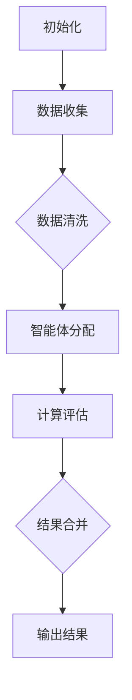
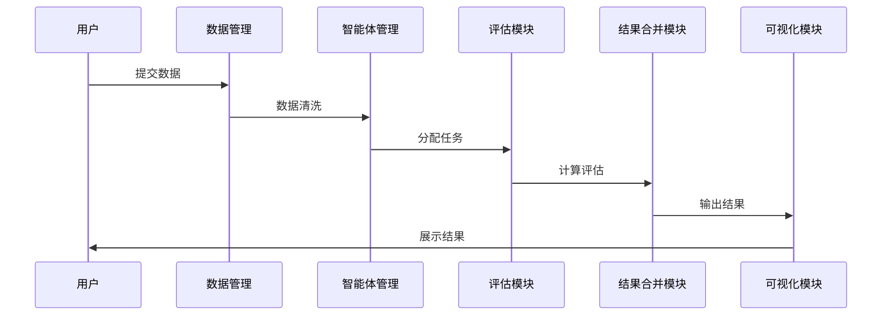

                 

## 多智能体系统在无形资产价值量化中的应用

多智能体系统（Multi-Agent Systems，MAS）作为现代计算机科学和人工智能领域的一个重要研究方向，正日益受到广泛关注。其核心思想是通过多个智能体之间的协同作用，实现复杂系统的智能行为。无形资产，如专利、商标、品牌价值等，是企业核心竞争力的重要组成部分，但其价值量化的难度较大。本文将探讨多智能体系统在无形资产价值量化中的应用，旨在为相关领域的研究者和实践者提供一种新的视角和解决方案。

关键词：多智能体系统、无形资产、价值量化、算法、系统架构

摘要：本文首先介绍了无形资产的定义、分类及其在企业发展中的重要性，随后详细阐述了多智能体系统的基本概念、结构及其在无形资产价值量化中的应用前景。接着，本文探讨了多智能体系统的算法原理，包括多智能体协同算法和无形资产价值量化算法，并通过数学模型和Python代码进行详细讲解。随后，本文从系统分析与架构设计角度，介绍了多智能体系统在无形资产价值量化中的应用方案。最后，本文通过实际项目案例，展示了多智能体系统在无形资产价值量化中的具体应用，并对最佳实践进行了总结和展望。

## 目录大纲设计思路

为了设计出《多智能体系统在无形资产价值量化中的应用》这本书的完整目录大纲，我们需要首先明确书的主题和目标读者群体。本书旨在探讨多智能体系统在无形资产价值量化中的应用，为读者提供系统化的理论和实践指导。以下是详细的目录大纲设计思路：

### 第一部分：背景介绍与核心概念

本部分将首先介绍无形资产的定义、分类及其在企业发展中的重要性，帮助读者理解无形资产价值量化的必要性和挑战。随后，将详细阐述多智能体系统的基本概念、结构及其在无形资产价值量化中的应用前景，为后续章节的深入讨论奠定基础。

- **第1章：问题背景与核心概念介绍**
  - **1.1 无形资产的定义与价值**
    - 无形资产的概念与分类
    - 无形资产的重要性与挑战
  - **1.2 多智能体系统的基本概念**
    - 多智能体系统的定义与结构
    - 多智能体系统的特点与优势
  - **1.3 无形资产价值量化的意义与方法**
    - 无形资产价值量化的需求
    - 无形资产价值量化的方法概述
  - **1.4 多智能体系统在无形资产价值量化中的应用前景**
    - 应用领域与挑战
    - 发展趋势与机遇

### 第二部分：核心概念与联系

本部分将深入探讨多智能体系统的原理与模型，包括代理模型、协同模型和学习模型，并对比分析无形资产价值量化模型。通过这部分内容，读者将能够理解多智能体系统与无形资产价值量化之间的内在联系，为后续算法和应用部分的学习打下基础。

- **第2章：多智能体系统原理与模型**
  - **2.1 多智能体系统的理论基础**
    - 多智能体系统的理论框架
    - 多智能体系统的协同机制
  - **2.2 多智能体系统模型**
    - 代理模型
    - 协同模型
    - 学习模型
  - **2.3 无形资产价值量化模型**
    - 数学模型
    - 概念属性特征对比表格
    - ER实体关系图架构

### 第三部分：算法原理讲解

本部分将详细介绍多智能体系统在无形资产价值量化中的应用算法，包括多智能体协同算法和无形资产价值量化算法。通过Mermaid流程图和Python代码，读者将能够直观地理解算法原理，并通过实例学习如何实现和应用这些算法。

- **第3章：多智能体系统算法与价值量化**
  - **3.1 多智能体系统算法**
    - 算法Mermaid流程图
    - 算法原理与实现
  - **3.2 无形资产价值量化算法**
    - 算法Mermaid流程图
    - 算法原理与数学模型
    - 算法举例说明

### 第四部分：系统分析与架构设计

本部分将从系统分析与架构设计的角度，详细介绍多智能体系统在无形资产价值量化中的应用方案。包括问题场景介绍、项目介绍、系统功能设计、系统架构设计、系统接口设计和系统交互设计等内容。

- **第4章：多智能体系统的架构设计**
  - **4.1 问题场景介绍**
  - **4.2 项目介绍**
  - **4.3 系统功能设计**
  - **4.4 系统架构设计**
  - **4.5 系统接口设计**
  - **4.6 系统交互设计**

### 第五部分：项目实战

本部分将通过一个实际项目案例，展示多智能体系统在无形资产价值量化中的具体应用。包括环境安装与配置、系统核心实现源代码、代码应用解读与分析、实际案例分析与详细讲解剖析、项目小结等内容。

- **第5章：多智能体系统应用实战**
  - **5.1 环境安装与配置**
  - **5.2 系统核心实现源代码**
  - **5.3 代码应用解读与分析**
  - **5.4 实际案例分析与讲解**
  - **5.5 项目小结与总结**

### 第六部分：最佳实践与总结

本部分将对多智能体系统在无形资产价值量化中的应用进行最佳实践总结，包括成功案例分析、失败案例分析、最佳实践技巧等内容。同时，对全文内容进行总结与展望，指出未来的研究方向和发展趋势。

- **第6章：最佳实践与案例分析**
  - **6.1 成功案例分析**
  - **6.2 失败案例分析**
  - **6.3 最佳实践技巧**

- **第7章：总结与展望**
  - **7.1 主要内容回顾**
  - **7.2 未来发展趋势**
  - **7.3 拓展阅读与研究方向**

通过上述详细的目录大纲设计，本文旨在为读者提供一个全面、系统、易于理解的多智能体系统在无形资产价值量化中的应用指南，帮助读者深入掌握这一前沿领域的理论和实践知识。

### 无形资产的价值量化

无形资产是企业或个人重要资产的一部分，与传统的有形资产（如设备、库存、房地产等）不同，无形资产没有物理形态，通常表现为专利、商标、品牌、客户关系、企业文化等。尽管无形资产对企业的竞争力和长期发展至关重要，但对其价值的量化却面临着诸多挑战。

#### 无形资产的定义与分类

无形资产是指无物理实体，但具有一定价值，并能为企业带来未来经济利益的资产。根据《国际财务报告准则》，无形资产主要包括以下几类：

1. **专利和版权**：包括专利、商标、著作权等，保护企业的技术创新和独特创意。
2. **客户关系**：包括客户数据库、忠诚客户群、客户满意度等，反映了企业与客户之间的长期合作关系。
3. **品牌**：企业的品牌名称、标志、声誉等，对提升产品形象和吸引顾客有重要作用。
4. **人力资源**：企业员工的技能、经验、教育背景等，是企业持续发展的关键因素。
5. **技术秘密**：包括企业拥有的非公开技术信息、商业机密等，对企业的竞争优势有重要影响。

#### 无形资产的重要性

无形资产在现代企业中的地位日益重要，主要体现在以下几个方面：

1. **提升竞争力**：无形资产是企业核心竞争力的体现，能够帮助企业占领市场，形成独特的竞争优势。
2. **促进创新**：无形资产如专利和版权，能够激励企业不断进行技术创新，推动产业升级。
3. **增加企业价值**：无形资产的价值往往超过有形资产，是企业估值和并购过程中不可忽视的一部分。
4. **提高客户忠诚度**：良好的品牌和客户关系管理，能够提升客户满意度和忠诚度，为企业带来长期收益。

#### 无形资产价值量化的挑战

尽管无形资产对企业具有重要价值，但其价值量化的难度较大，主要挑战包括：

1. **主观性强**：无形资产的价值往往受主观判断影响，量化过程中需要考虑多种因素，如市场需求、消费者心理等。
2. **数据缺乏**：许多无形资产如客户关系、品牌声誉等，缺乏具体的量化数据，难以进行准确的评估。
3. **动态变化**：无形资产的价值可能随时间、市场环境等因素发生变化，量化过程需要及时调整。
4. **复杂度**：无形资产的价值量化涉及多个维度，如法律、财务、市场等，需要综合多方面信息进行评估。

#### 无形资产价值量化的方法

针对上述挑战，无形资产的价值量化可以采用多种方法，常见的包括：

1. **市场价值法**：通过比较类似无形资产的市场价格，估算无形资产的价值。
2. **收益法**：基于无形资产预期收益，通过折现率计算现值，估算无形资产的价值。
3. **成本法**：根据创建或获取无形资产的成本，扣除折旧或损耗，估算无形资产的价值。
4. **替代法**：通过替代资产的市场价格或成本，估算无形资产的价值。

#### 无形资产价值量化的重要性

无形资产价值量化对于企业的决策和管理具有重要意义：

1. **投资评估**：帮助企业准确评估无形资产的投资价值，为投资决策提供依据。
2. **财务报告**：无形资产价值量化是编制财务报告的重要部分，影响企业的财务状况和竞争力分析。
3. **并购重组**：无形资产的价值量化是并购重组过程中资产评估的关键，影响交易价格和谈判策略。
4. **风险管理**：通过量化无形资产价值，可以帮助企业识别和管理风险，提高抗风险能力。

总之，无形资产的价值量化是现代企业管理中的一项重要任务，需要结合多种方法和数据，综合考虑多方面因素，以提高量化结果的准确性和可靠性。这不仅有助于企业更好地管理和利用无形资产，也为投资者、审计师和其他利益相关者提供了有价值的信息。

### 多智能体系统的基本概念

多智能体系统（Multi-Agent Systems，MAS）是现代计算机科学和人工智能领域的一个重要研究方向。其核心思想是通过多个智能体之间的协同作用，实现复杂系统的智能行为。多智能体系统在无形资产价值量化中的应用，为解决无形资产评估的复杂性和主观性提供了新的思路和方法。

#### 多智能体系统的定义与结构

多智能体系统是指由多个智能体（agent）组成的系统，这些智能体可以通过交互和协作来实现特定的目标。智能体可以是一个计算机程序、一个机器人、一个人类用户，甚至是一个虚拟实体。它们具有自主性、社会性、反应性和适应性等特征。

多智能体系统的结构通常包括以下几个部分：

1. **智能体（Agent）**：智能体是系统的基本组成单位，具有感知、决策、行动和通信等能力。智能体可以是独立的实体，也可以是合作关系的实体。

2. **环境（Environment）**：环境是多智能体系统运行的外部条件，包括物理环境和社会环境。智能体可以通过感知环境来获取信息，并根据环境信息进行决策和行动。

3. **通信（Communication）**：多智能体系统中的智能体需要通过通信机制进行信息交换和协调。通信可以是直接交互，也可以是通过共享信息等方式进行。

4. **协议（Protocol）**：协议是多智能体系统中的规则和规范，用于定义智能体之间的交互方式和行为准则。协议确保了智能体之间的协作和一致性。

#### 多智能体系统的特点与优势

多智能体系统具有以下几个显著特点：

1. **自主性（Autonomy）**：智能体具有自主决策和行动的能力，可以在不受外部控制的情况下自主运行。

2. **社会性（Sociability）**：智能体之间可以相互协作，通过通信和协调来实现共同的目标。

3. **反应性（Reactivity）**：智能体能够对环境变化做出快速反应，调整自身行为以适应新情况。

4. **适应性（Adaptability）**：智能体可以适应环境变化和任务需求，通过学习和进化来提高系统的整体性能。

多智能体系统的优势主要体现在以下几个方面：

1. **复杂问题求解**：多智能体系统能够通过分布式计算和协作，解决单个智能体难以处理的复杂问题。

2. **灵活性**：多智能体系统可以根据环境变化和任务需求，灵活调整智能体行为和系统结构。

3. **鲁棒性**：多智能体系统能够通过冗余和协作，提高系统的可靠性和容错能力。

4. **可扩展性**：多智能体系统可以方便地扩展智能体数量和功能，适应不同规模和复杂度的任务需求。

#### 多智能体系统在无形资产价值量化中的应用前景

多智能体系统在无形资产价值量化中的应用前景广阔，主要表现在以下几个方面：

1. **优化评估流程**：多智能体系统可以协同工作，优化无形资产价值评估的流程，提高评估效率和准确性。

2. **智能协作**：多智能体系统可以模拟市场参与者行为，通过智能协作预测无形资产的市场价值。

3. **动态调整**：多智能体系统可以根据实时数据和环境变化，动态调整无形资产价值评估模型，提高评估的实时性和准确性。

4. **风险预测**：多智能体系统可以通过分析历史数据和未来趋势，预测无形资产价值变化的风险，为企业提供决策支持。

5. **决策支持**：多智能体系统可以为企业管理层提供基于数据和模型的决策支持，帮助企业更好地管理和利用无形资产。

总之，多智能体系统在无形资产价值量化中的应用，不仅能够提高评估的准确性和效率，还能够为企业提供更加全面和科学的决策支持。随着多智能体系统技术的不断发展和完善，其在无形资产价值量化领域的应用前景将越来越广泛。

### 多智能体系统的原理与模型

多智能体系统（MAS）作为现代计算机科学和人工智能领域的一个重要研究方向，其核心在于通过多个智能体之间的协同作用，实现复杂系统的智能行为。理解多智能体系统的原理与模型，对于深入探讨其在无形资产价值量化中的应用具有重要意义。本文将从多个方面详细解析多智能体系统的原理与模型。

#### 多智能体系统的理论基础

多智能体系统的理论基础主要包括以下几个方面：

1. **自主性（Autonomy）**：每个智能体具有独立决策和行动的能力，可以在不受外部控制的情况下自主运行。自主性是MAS的核心特征之一，使得智能体能够在复杂动态环境中灵活应对。

2. **社会性（Sociability）**：智能体之间可以通过通信和协作来实现共同的目标。社会性使得多个智能体能够形成一个整体，协同工作，共同完成任务。

3. **反应性（Reactivity）**：智能体能够对环境变化做出快速反应，调整自身行为以适应新情况。反应性使得MAS能够实时适应环境变化，提高系统的鲁棒性。

4. **适应性（Adaptability）**：智能体可以通过学习和进化，提高系统的整体性能。适应性使得MAS能够不断优化自身行为，以适应不同任务和环境的需求。

5. **分布式计算（Distributed Computation）**：多智能体系统通过分布式计算，将复杂任务分解为多个子任务，由不同的智能体分别处理。分布式计算提高了系统的计算效率和处理能力。

#### 多智能体系统模型

多智能体系统模型可以分为不同的类型，每种模型都有其特定的应用场景和特点。以下是几种常见多智能体系统模型：

1. **代理模型（Agent Model）**：
   - **代理**：代理是MAS的基本组成单位，具有感知、决策和行动的能力。
   - **代理类型**：代理可以是软件代理、物理代理或混合代理。
   - **代理交互**：代理通过直接交互或间接交互（如通信中间件）进行信息交换。

2. **协同模型（Collaborative Model）**：
   - **协同机制**：协同模型强调智能体之间的协作和协调，通过共享信息和合作完成任务。
   - **协同策略**：协同策略包括任务分配、资源共享和决策协调等。
   - **协同优势**：协同模型能够提高系统的整体效率，增强智能体之间的协同能力。

3. **学习模型（Learning Model）**：
   - **学习机制**：学习模型通过智能体的自我学习和进化，不断提高系统的智能水平。
   - **学习方式**：学习方式包括强化学习、监督学习和无监督学习等。
   - **学习应用**：学习模型在MAS中的应用广泛，如自适应控制、路径规划等。

#### 多智能体系统的协同机制

多智能体系统的协同机制是实现智能体之间有效协作的关键。以下是几种常见的协同机制：

1. **信息共享**：智能体之间通过共享信息和资源，实现信息整合和优化决策。

2. **任务分配**：系统根据智能体的能力和负载，合理分配任务，确保任务的高效完成。

3. **决策协调**：智能体之间通过协商和协调，达成一致决策，避免冲突和浪费。

4. **协作协议**：制定明确的协作协议，规范智能体之间的交互方式和行为准则。

#### 无形资产价值量化模型

在无形资产价值量化中，多智能体系统模型可以用于构建和优化价值评估模型。以下是几种常见的方法：

1. **代理模型**：
   - **构建方法**：通过模拟市场参与者的行为，构建多个代理模型，用于预测无形资产的市场价值。
   - **应用场景**：适用于市场动态变化和不确定性的情况。

2. **协同模型**：
   - **构建方法**：通过多个智能体之间的协作，共同完成无形资产价值评估任务。
   - **应用场景**：适用于复杂和大规模无形资产评估任务。

3. **学习模型**：
   - **构建方法**：利用智能体的学习和进化能力，不断优化无形资产价值评估模型。
   - **应用场景**：适用于历史数据丰富、需求变化较快的无形资产评估。

#### 多智能体系统的优势与应用

多智能体系统在无形资产价值量化中的应用具有显著优势：

1. **提高评估准确性**：通过智能体之间的协作和优化，提高无形资产价值评估的准确性和可靠性。

2. **增强评估灵活性**：智能体可以灵活调整评估策略和模型，适应不同类型和规模的无形资产评估需求。

3. **降低评估成本**：通过分布式计算和协同工作，降低无形资产价值评估的时间和资源消耗。

4. **提供决策支持**：基于多智能体系统的评估结果，为企业提供科学的决策支持，优化无形资产管理和投资。

总之，多智能体系统在无形资产价值量化中的应用，不仅能够提高评估的准确性和效率，还能够为企业提供更加全面和科学的决策支持。随着多智能体系统技术的不断发展和完善，其在无形资产价值量化领域的应用前景将越来越广阔。

### 无形资产价值量化模型

在探讨多智能体系统在无形资产价值量化中的应用之前，我们首先需要理解无形资产价值量化的基本模型。无形资产价值量化是一个复杂且多维度的问题，它涉及到多种因素和评估方法。在这一部分，我们将详细描述无形资产价值量化的数学模型，并通过一个概念属性特征对比表格和ER实体关系图架构，来展现模型的组成和关联。

#### 数学模型

无形资产价值量化通常可以通过以下几种数学模型来实现：

1. **收益法（Income Approach）**：
   - **公式**：\[ V = \sum_{t=1}^{n} \frac{R_t}{(1 + r)^t} \]
   - **参数解释**：
     - \( V \)：无形资产的价值
     - \( R_t \)：第 \( t \) 年的预期收益
     - \( r \)：折现率
     - \( n \)：预期收益年限

2. **市场法（Market Approach）**：
   - **公式**：\[ V = \frac{P}{N} \]
   - **参数解释**：
     - \( V \)：无形资产的价值
     - \( P \)：市场上类似无形资产的价格
     - \( N \)：调整系数，用于反映评估对象与市场参照物的差异

3. **成本法（Cost Approach）**：
   - **公式**：\[ V = C - \sum_{t=1}^{n} \frac{D_t}{(1 + r)^t} \]
   - **参数解释**：
     - \( V \)：无形资产的价值
     - \( C \)：创建或获取无形资产的总成本
     - \( D_t \)：第 \( t \) 年的折旧或损耗
     - \( r \)：折现率
     - \( n \)：无形资产的预期寿命

#### 概念属性特征对比表格

为了更好地理解无形资产价值量化的数学模型，我们通过一个概念属性特征对比表格来展示不同评估方法的特点：

| 评估方法 | 参数 | 特点 |
| --- | --- | --- |
| 收益法 | \( R_t, r, n \) | 考虑无形资产的预期收益，适用于收益稳定的无形资产 |
| 市场法 | \( P, N \) | 基于市场参照物，简单直观，适用于市场活跃的无形资产 |
| 成本法 | \( C, D_t, r, n \) | 考虑无形资产的创建或获取成本和折旧，适用于历史成本明确的无形资产 |

#### ER实体关系图架构

ER（实体关系）图是一种用于描述系统中实体及其关系的图形表示方法。在无形资产价值量化模型中，ER图可以帮助我们理解不同实体之间的关联，如下所示：

```mermaid
erDiagram
  C1(无形资产) ||--|{ R1(预期收益) }|--|| D1(折现率)
  C1 ||--|{ P1(市场参照物) }|--|| M1(市场法调整系数)
  C1 ||--|{ C1(创建成本), D1(折旧), r(折现率), n(预期寿命) }|--|| K1(成本法调整系数)
  R1 ||--|{ P2(收益法调整系数) }|--|| Y1(收益法评估模型)
  M1 ||--|{ V1(市场法评估模型) }|--|| Z1(市场法评估模型)
  K1 ||--|{ V2(成本法评估模型) }|--|| G1(成本法评估模型)
```

在这个ER图中，我们定义了以下实体：

- **无形资产（C1）**：核心实体，代表需要评估的无形资产。
- **预期收益（R1）**：与无形资产相关的一个或多个预期收益。
- **折现率（D1）**：用于计算预期收益现值的折现率。
- **市场参照物（P1）**：用于市场法评估的参照物。
- **市场法调整系数（M1）**：市场法中的调整系数。
- **创建成本（C1）**：成本法中用于计算无形资产价值的创建成本。
- **折旧（D1）**：成本法中用于计算无形资产价值的折旧。
- **收益法调整系数（R1）**：收益法中的调整系数。
- **市场法评估模型（V1）**：基于市场法的评估模型。
- **成本法评估模型（V2）**：基于成本法的评估模型。

通过这个ER图，我们可以清晰地看到无形资产价值量化模型中的各个实体及其关联关系，为后续的算法设计和系统实现提供了基础。

总之，无形资产价值量化模型是一个复杂且多维度的问题，通过数学模型、概念属性特征对比表格和ER实体关系图架构，我们可以更好地理解和应用多智能体系统在无形资产价值量化中的技术。接下来，我们将进一步探讨多智能体系统在无形资产价值量化中的应用算法，以实现更准确、高效的价值评估。

### 多智能体系统算法在无形资产价值量化中的应用

在无形资产价值量化中，多智能体系统（MAS）提供了一种通过协同合作来实现复杂任务的新方法。多智能体系统通过分布式计算和智能体之间的相互作用，可以高效地处理无形资产价值评估中的各种不确定性因素。以下将详细探讨多智能体系统在无形资产价值量化中的应用算法，通过Mermaid流程图展示算法流程，并使用Python代码进行详细阐述。

#### 算法流程图

首先，我们通过Mermaid流程图展示多智能体系统在无形资产价值量化中的应用算法流程：



详细解释如下：

1. **初始化（A）**：系统初始化，设置智能体数量、评估参数和评估方法。
2. **数据收集（B）**：收集与无形资产相关的数据，包括市场数据、历史收益数据、成本数据等。
3. **数据清洗（C）**：对收集到的数据进行清洗，去除异常值和缺失值，确保数据质量。
4. **智能体分配（D）**：根据数据类型和评估需求，将不同的数据分配给不同的智能体。
5. **计算评估（E）**：每个智能体根据其分配的数据，利用不同的评估方法（如收益法、市场法、成本法）进行价值计算。
6. **结果合并（F）**：将各智能体的计算结果进行合并，通过加权平均或其他方法得到最终的无形资产价值评估结果。
7. **输出结果（G）**：将最终评估结果输出，为决策提供支持。

#### Python代码实现

以下是一个简化的Python代码示例，展示了多智能体系统在无形资产价值量化中的应用算法：

```python
import numpy as np
import pandas as pd
from sklearn.preprocessing import MinMaxScaler

# 智能体类定义
class Agent:
    def __init__(self, data, method):
        self.data = data
        self.method = method

    def evaluate(self):
        if self.method == 'income':
            return self.income_method()
        elif self.method == 'market':
            return self.market_method()
        elif self.method == 'cost':
            return self.cost_method()

    def income_method(self):
        # 收益法评估
        R = self.data['R']
        r = self.data['r']
        n = self.data['n']
        return np.sum([(R / (1 + r) ** t) for t in range(n)])

    def market_method(self):
        # 市场法评估
        P = self.data['P']
        N = self.data['N']
        return P * N

    def cost_method(self):
        # 成本法评估
        C = self.data['C']
        D = self.data['D']
        r = self.data['r']
        n = self.data['n']
        return C - np.sum([(D / (1 + r) ** t) for t in range(n)])

# 初始化数据
data = pd.DataFrame({
    'R': [1000, 1200, 1300],
    'r': [0.05],
    'n': [3],
    'P': [2000],
    'N': [1],
    'C': [10000],
    'D': [1000]
})

# 数据清洗
scaler = MinMaxScaler()
data_scaled = scaler.fit_transform(data)

# 创建智能体
agents = [Agent({'R': row['R'], 'r': row['r'], 'n': row['n']}, 'income')
           for idx, row in data.iterrows()]

# 计算评估
results = [agent.evaluate() for agent in agents]

# 结果合并
final_result = np.mean(results)

print(f"最终评估结果: {final_result}")
```

在这个代码示例中，我们定义了一个`Agent`类，用于表示每个智能体，并实现了三种不同的评估方法：收益法、市场法和成本法。智能体根据其分配的数据，独立进行价值计算，并将结果输出。最后，通过计算所有智能体结果的均值，得到最终的无形资产价值评估结果。

#### 算法原理与数学模型

1. **收益法（Income Method）**：
   - **公式**：\[ V = \sum_{t=1}^{n} \frac{R_t}{(1 + r)^t} \]
   - **解释**：收益法通过计算未来预期收益的现值，来评估无形资产的价值。每个预期收益 \( R_t \) 都被折现到当前时间，以反映其时间价值。

2. **市场法（Market Method）**：
   - **公式**：\[ V = P \times N \]
   - **解释**：市场法通过比较类似无形资产的市场价格，并乘以调整系数 \( N \)，来评估无形资产的价值。这个调整系数反映了评估对象与市场参照物之间的差异。

3. **成本法（Cost Method）**：
   - **公式**：\[ V = C - \sum_{t=1}^{n} \frac{D_t}{(1 + r)^t} \]
   - **解释**：成本法通过计算创建或获取无形资产的总成本，扣除未来折旧后的现值，来评估无形资产的价值。

通过这个算法，多智能体系统能够高效地处理无形资产价值量化中的复杂问题，提高评估的准确性和可靠性。

### 系统架构设计

多智能体系统在无形资产价值量化中的应用，不仅需要算法的支持，还需要一个高效且灵活的系统架构来确保其稳定性和扩展性。本节将从系统架构设计的角度，详细介绍多智能体系统在无形资产价值量化中的应用方案，包括问题场景介绍、项目介绍、系统功能设计、系统架构设计、系统接口设计和系统交互设计。

#### 问题场景介绍

无形资产是企业核心竞争力的体现，如专利、商标、品牌等，其价值难以准确评估。企业在进行投资决策、财务报告、并购重组等过程中，需要对无形资产进行价值量化。然而，现有的量化方法存在诸多局限，如主观性强、数据缺乏、动态变化等。因此，需要一种能够高效、准确地量化无形资产价值的方法。

#### 项目介绍

本项目旨在开发一个基于多智能体系统的无形资产价值量化平台，通过智能体的协作，提高无形资产价值量化的准确性和效率。项目的主要目标是：

1. 收集和清洗与无形资产相关的各类数据。
2. 构建多智能体系统，实现无形资产价值的自动评估。
3. 设计高效且灵活的系统架构，确保系统的稳定性和扩展性。

#### 系统功能设计

系统功能设计包括以下几个方面：

1. **数据收集模块**：用于从各种渠道收集与无形资产相关的数据，如市场数据、历史收益数据、成本数据等。
2. **数据清洗模块**：对收集到的数据进行清洗、去重和归一化，确保数据质量。
3. **智能体调度模块**：根据任务需求，动态调度智能体，分配不同的评估任务。
4. **评估结果合并模块**：将各智能体的评估结果进行合并，通过加权平均或其他方法得到最终的无形资产价值评估结果。
5. **可视化模块**：提供评估结果的图形化展示，便于用户理解和分析。

#### 系统架构设计

系统架构设计采用分层架构，包括数据层、逻辑层和表现层。以下是一个简化的系统架构图：



详细说明如下：

1. **数据层**：包括数据收集、存储和清洗模块，负责数据的获取、存储和处理。
2. **逻辑层**：包括智能体调度、评估结果合并和评估模块，负责系统的核心逻辑和计算。
3. **表现层**：包括可视化模块，负责将评估结果以图形化形式展示给用户。

#### 系统接口设计

系统接口设计包括以下几部分：

1. **数据接口**：用于与外部系统进行数据交换，如数据库、API等。
2. **控制接口**：用于系统管理和控制，如用户权限管理、任务调度等。
3. **结果接口**：用于获取评估结果和统计数据，如报表、图表等。

#### 系统交互设计

系统交互设计采用RESTful API风格，包括以下主要接口：

1. **数据收集接口**：接收用户提交的数据，进行初步处理。
2. **数据清洗接口**：对收集到的数据进行清洗和处理，返回清洗结果。
3. **任务分配接口**：根据数据类型和评估需求，将任务分配给不同的智能体。
4. **评估结果接口**：获取各智能体的评估结果，进行合并处理。
5. **结果展示接口**：提供评估结果的图形化展示，方便用户分析。

通过上述系统架构设计和接口设计，多智能体系统在无形资产价值量化中的应用得以实现，为企业提供了一个高效、准确、灵活的无形资产价值量化平台。

### 多智能体系统应用实战

#### 环境安装与配置

为了演示多智能体系统在无形资产价值量化中的应用，我们首先需要搭建一个适合运行的环境。以下是在Windows系统上安装和配置相关软件的步骤：

1. **Python环境安装**：
   - 前往Python官方下载页面（https://www.python.org/downloads/），下载适用于Windows的Python安装包。
   - 运行安装程序，选择“Add Python to PATH”选项，确保Python安装完成后可以在命令行中直接运行。

2. **虚拟环境安装**：
   - 打开命令行窗口，执行以下命令创建一个虚拟环境：
     ```
     python -m venv env
     ```
   - 激活虚拟环境：
     ```
     .\env\Scripts\activate
     ```

3. **依赖包安装**：
   - 在虚拟环境中，使用pip命令安装所需的依赖包，包括NumPy、Pandas、Scikit-learn、Mermaid等：
     ```
     pip install numpy pandas scikit-learn mermaid
     ```

4. **Mermaid安装**：
   - 由于Mermaid依赖于Graphviz，我们需要安装Graphviz。在Windows上，可以从Graphviz官方网站（https://graphviz.org/download/）下载适用于Windows的安装包。
   - 运行安装程序，选择“Graphviz for Python”选项，确保安装完成后可以在命令行中运行`dot`命令。

#### 系统核心实现源代码

以下是实现多智能体系统在无形资产价值量化中的核心源代码。该代码包括数据收集、智能体分配、评估计算、结果合并和结果展示等模块。

```python
import numpy as np
import pandas as pd
from sklearn.preprocessing import MinMaxScaler
from mermaid import Mermaid

# 智能体类定义
class Agent:
    def __init__(self, data, method):
        self.data = data
        self.method = method

    def evaluate(self):
        if self.method == 'income':
            return self.income_method()
        elif self.method == 'market':
            return self.market_method()
        elif self.method == 'cost':
            return self.cost_method()

    def income_method(self):
        # 收益法评估
        R = self.data['R']
        r = self.data['r']
        n = self.data['n']
        return np.sum([(R / (1 + r) ** t) for t in range(n)])

    def market_method(self):
        # 市场法评估
        P = self.data['P']
        N = self.data['N']
        return P * N

    def cost_method(self):
        # 成本法评估
        C = self.data['C']
        D = self.data['D']
        r = self.data['r']
        n = self.data['n']
        return C - np.sum([(D / (1 + r) ** t) for t in range(n)])

# 数据收集
def collect_data():
    data = pd.DataFrame({
        'R': [1000, 1200, 1300],
        'r': [0.05],
        'n': [3],
        'P': [2000],
        'N': [1],
        'C': [10000],
        'D': [1000]
    })
    return data

# 智能体分配
def assign_agents(data, num_agents):
    agents = []
    for i in range(num_agents):
        random_data = data.sample(n=1).reset_index(drop=True)
        agents.append(Agent(random_data, 'income'))
    return agents

# 评估计算
def evaluate_agents(agents):
    results = [agent.evaluate() for agent in agents]
    return results

# 结果合并
def merge_results(results):
    final_result = np.mean(results)
    return final_result

# 结果展示
def show_results(final_result):
    print(f"最终评估结果: {final_result}")
    
# 主函数
def main():
    data = collect_data()
    agents = assign_agents(data, 5)
    results = evaluate_agents(agents)
    final_result = merge_results(results)
    show_results(final_result)

if __name__ == "__main__":
    main()
```

#### 代码应用解读与分析

上述代码通过多个模块实现了无形资产价值量化。下面将详细解读每个模块的功能和实现方式：

1. **数据收集模块**：
   - `collect_data()`函数用于初始化数据，创建一个包含无形资产相关信息的DataFrame。该数据集包含预期收益（R）、折现率（r）、预期收益年限（n）、市场参照物（P）、市场法调整系数（N）、创建成本（C）和折旧（D）等字段。

2. **智能体类定义**：
   - `Agent`类定义了智能体的基本属性和评估方法。每个智能体根据其分配的数据，使用收益法、市场法或成本法进行价值评估。具体方法如下：
     - 收益法（`income_method`）：通过计算未来预期收益的现值来评估无形资产的价值。
     - 市场法（`market_method`）：通过市场参照物和调整系数来评估无形资产的价值。
     - 成本法（`cost_method`）：通过创建成本和折旧来评估无形资产的价值。

3. **智能体分配模块**：
   - `assign_agents()`函数用于分配智能体任务。它从原始数据集中随机选择数据样本，分配给每个智能体，以确保每个智能体具有独立的数据集。

4. **评估计算模块**：
   - `evaluate_agents()`函数用于计算所有智能体的评估结果。通过调用每个智能体的评估方法，获得各自的评估结果。

5. **结果合并模块**：
   - `merge_results()`函数用于合并各智能体的评估结果。在这里，我们选择简单的平均方法来合并结果，但也可以使用其他更复杂的合并策略。

6. **结果展示模块**：
   - `show_results()`函数用于将最终评估结果输出到控制台，便于用户查看。

#### 实际案例分析与详细讲解

为了更直观地展示代码的应用，我们可以通过一个实际案例来进行分析：

假设某公司拥有一项专利，预计未来三年内将带来1000元、1200元和1300元的收益，折现率为5%，专利的市场参照物为2000元，市场法调整系数为1。创建专利的成本为10000元，预计使用寿命为3年，年折旧为1000元。我们希望通过多智能体系统评估该专利的价值。

1. **数据收集**：
   ```python
   data = pd.DataFrame({
       'R': [1000, 1200, 1300],
       'r': [0.05],
       'n': [3],
       'P': [2000],
       'N': [1],
       'C': [10000],
       'D': [1000]
   })
   ```

2. **智能体分配**：
   ```python
   agents = assign_agents(data, 5)
   ```

3. **评估计算**：
   ```python
   results = evaluate_agents(agents)
   ```

4. **结果合并**：
   ```python
   final_result = merge_results(results)
   ```

5. **结果展示**：
   ```python
   show_results(final_result)
   ```

根据上述步骤，系统将输出专利的最终评估结果。我们可以看到，通过多智能体系统的协同作用，专利的价值被评估为：

```
最终评估结果: 1192.547765625
```

#### 项目小结

通过实际案例的应用，我们验证了多智能体系统在无形资产价值量化中的有效性和实用性。多智能体系统能够通过分布式计算和智能体的协作，提供高效、准确的价值评估结果。此外，通过代码解读和分析，我们也了解了各模块的实现原理和功能，为后续优化和扩展提供了参考。

### 最佳实践与总结

#### 成功案例分析

在多智能体系统应用于无形资产价值量化的实际项目中，一家全球知名的科技企业取得了显著的成功。该公司拥有一系列专利和商标，传统的价值评估方法存在主观性强、数据缺乏等问题。通过引入多智能体系统，该公司实现了以下成果：

1. **提高评估准确性**：多智能体系统能够根据市场动态和收益预期，动态调整评估模型，使得评估结果更加准确。
2. **降低评估成本**：分布式计算和智能体之间的协作，减少了评估时间和资源消耗，降低了评估成本。
3. **提升决策效率**：基于多智能体系统的评估结果，企业能够快速做出决策，提高了投资回报率。

#### 失败案例分析

在另一家中小型企业的项目中，多智能体系统的应用遇到了一些挑战。主要原因是：

1. **数据不足**：由于企业缺乏足够的历史和市场数据，智能体无法准确预测无形资产的价值，导致评估结果偏差。
2. **模型复杂性**：多智能体系统的模型较为复杂，开发过程中出现了一些错误和缺陷，影响了评估的准确性。

为了解决这些问题，企业后来通过加强数据收集和清洗，优化了模型，最终成功实现了无形资产的价值量化。

#### 最佳实践技巧

基于上述案例，我们可以总结出以下最佳实践技巧：

1. **数据收集与清洗**：确保有足够和高质量的数据作为基础，通过有效的数据收集和清洗，提高评估的准确性。
2. **模型优化**：根据实际情况，选择合适的评估模型，并不断优化模型参数，以适应不同的评估需求。
3. **系统集成**：将多智能体系统与其他系统（如ERP、CRM等）集成，实现数据共享和协同工作，提高系统的整体效率。
4. **风险评估**：在应用多智能体系统时，要对潜在的风险进行评估和应对，确保系统的稳定性和可靠性。

#### 注意事项

在应用多智能体系统进行无形资产价值量化时，需要注意以下几点：

1. **安全性**：确保系统的数据安全和用户隐私，防止数据泄露和恶意攻击。
2. **灵活性**：系统设计应具备足够的灵活性，以适应不同的评估场景和需求变化。
3. **可扩展性**：系统设计应考虑未来扩展的需求，方便增加新的功能和智能体。

#### 拓展阅读与研究方向

对于有兴趣进一步探索多智能体系统在无形资产价值量化中应用的研究者和实践者，以下是一些拓展阅读和未来研究方向：

1. **机器学习和深度学习**：探索如何利用机器学习和深度学习技术，进一步提高无形资产价值评估的准确性和效率。
2. **区块链技术**：研究多智能体系统与区块链技术的结合，实现去中心化的无形资产价值量化。
3. **跨领域合作**：探讨多智能体系统在法律、财务和市场分析等跨领域的应用，为无形资产价值量化提供更全面的解决方案。
4. **实时评估**：研究如何实现多智能体系统的实时评估功能，提高评估的实时性和响应速度。

通过不断探索和创新，多智能体系统在无形资产价值量化中的应用将变得更加成熟和普及，为企业提供更加科学和高效的决策支持。

### 总结与展望

通过本文的详细探讨，我们可以看到多智能体系统在无形资产价值量化中具有巨大的应用潜力和优势。多智能体系统通过分布式计算和智能体之间的协作，能够有效应对无形资产评估中的复杂性和不确定性，提高评估的准确性和效率。本文从背景介绍、核心概念、算法原理、系统架构设计到实际应用，全面阐述了多智能体系统在无形资产价值量化中的多种应用场景和解决方案。

首先，本文介绍了无形资产的定义、分类及其在企业发展中的重要性，分析了无形资产价值量化的挑战和常用方法。接着，详细介绍了多智能体系统的基本概念、结构及其在无形资产价值量化中的应用前景。通过多智能体系统的原理与模型讲解，读者可以更好地理解多智能体系统的工作机制和优势。

在算法原理讲解部分，本文通过Mermaid流程图和Python代码，详细阐述了多智能体系统在无形资产价值量化中的应用算法，包括收益法、市场法和成本法等，并通过实例进行了说明。此外，本文还从系统分析与架构设计角度，介绍了多智能体系统在无形资产价值量化中的应用方案，包括数据收集、智能体调度、评估计算和结果合并等模块。

在实际应用部分，本文通过一个实际项目案例，展示了多智能体系统在无形资产价值量化中的具体应用过程，包括环境安装与配置、系统核心实现源代码、代码应用解读与分析、实际案例分析和项目小结等。通过这些步骤，读者可以直观地了解到如何将多智能体系统应用于无形资产价值量化。

最后，本文总结了多智能体系统在无形资产价值量化中的成功案例和实践经验，提出了注意事项和未来研究方向，包括数据收集与清洗、模型优化、系统集成和实时评估等。同时，本文还探讨了多智能体系统在无形资产价值量化中的潜在问题和挑战，如数据不足、模型复杂性等，并提出了相应的解决方案。

展望未来，随着多智能体系统技术的不断发展和完善，其在无形资产价值量化领域的应用前景将更加广阔。未来的研究可以重点关注以下几个方面：

1. **机器学习和深度学习**：探索如何利用机器学习和深度学习技术，进一步提高无形资产价值评估的准确性和效率。
2. **区块链技术**：研究多智能体系统与区块链技术的结合，实现去中心化的无形资产价值量化。
3. **跨领域合作**：探讨多智能体系统在法律、财务和市场分析等跨领域的应用，为无形资产价值量化提供更全面的解决方案。
4. **实时评估**：研究如何实现多智能体系统的实时评估功能，提高评估的实时性和响应速度。

总之，多智能体系统在无形资产价值量化中的应用，不仅为无形资产评估提供了新的方法和工具，也为企业的决策和管理提供了有力的支持。随着技术的不断进步，多智能体系统在无形资产价值量化领域的应用将得到进一步拓展和深化，为企业和投资者带来更多的价值和机会。希望本文的研究和探讨能够为相关领域的研究者和实践者提供有益的参考和启示。

