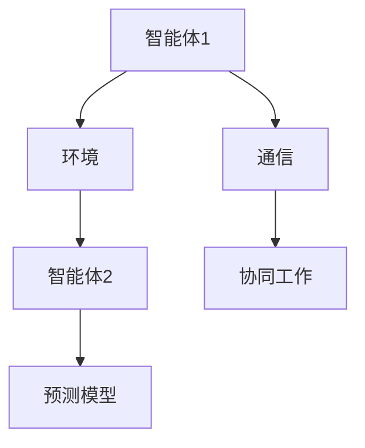
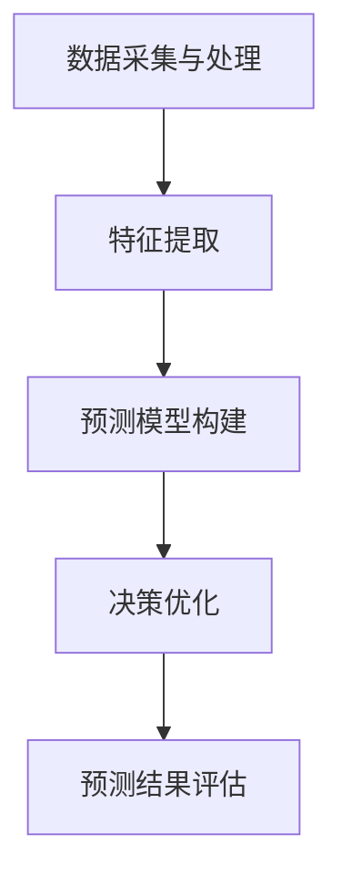
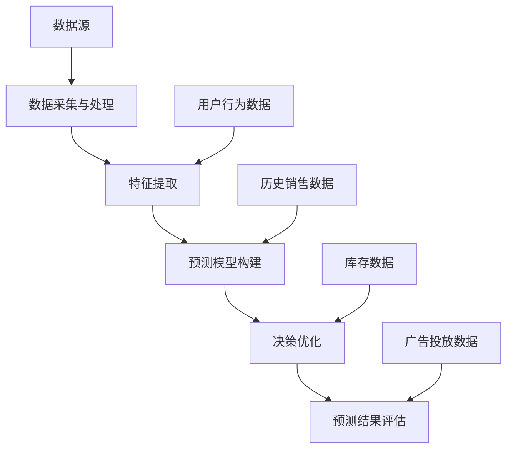

                 

# 《多智能体系统在消费者行为预测中的应用：预判公司业绩》

> 关键词：多智能体系统、消费者行为预测、公司业绩、人工智能、数据分析

## 摘要

本文旨在探讨多智能体系统在消费者行为预测中的应用，通过结合大数据分析和人工智能技术，预判公司业绩。文章首先介绍多智能体系统的基础理论，随后详细阐述消费者行为预测的算法原理。接着，文章通过系统架构设计和实战案例分析，展示多智能体系统如何在实际应用中提高公司业绩预测的准确性和效率。最后，文章提供了一些最佳实践建议和拓展阅读，为读者进一步研究和应用多智能体系统提供了指导。

## 第1章 引言

### 1.1 问题背景

在当今快速变化的市场环境中，消费者行为变得更加复杂和难以预测。企业需要实时了解消费者的需求、偏好和行为模式，以便及时调整营销策略和产品开发方向。然而，消费者数据的多样性和复杂性使得传统的预测模型难以满足需求。因此，寻求新的预测方法和技术变得至关重要。

### 1.2 问题描述

消费者行为预测的核心问题在于如何从大量的消费者数据中提取有价值的信息，并利用这些信息准确预测未来的消费趋势。这要求预测模型具备强大的数据处理能力和深入的洞察力。同时，企业还需要考虑如何快速响应市场变化，优化资源分配，提高运营效率。

### 1.3 问题解决

多智能体系统（MAS）作为一种分布式计算模型，具有处理复杂性和多样性数据的能力。通过引入多智能体系统，企业可以将消费者行为预测问题分解为多个子问题，由不同智能体协同工作，提高预测的准确性和效率。此外，多智能体系统还可以适应动态环境，实时调整预测模型，以应对市场变化。

### 1.4 边界与外延

本文主要关注多智能体系统在消费者行为预测中的应用，探讨其在预判公司业绩方面的潜力。然而，多智能体系统的应用范围远不止于此。在实际操作中，企业还可以将多智能体系统应用于供应链管理、风险控制、客户关系管理等各个方面，以实现整体运营的优化。

### 1.5 概念结构与核心要素组成

多智能体系统的核心概念包括智能体、环境、通信和协同工作。智能体是系统中的基本计算单元，具有自主性、社会性和反应性。环境是智能体所处的外部世界，提供各种信息和资源。通信是智能体之间交换信息的过程，协同工作是智能体通过通信实现共同目标的过程。

在消费者行为预测中，多智能体系统的核心要素包括：

1. **数据采集与处理**：智能体从各种渠道收集消费者数据，如社交媒体、电商平台、调查问卷等，并进行预处理和清洗。
2. **特征提取**：智能体从原始数据中提取与消费者行为相关的特征，如购买历史、浏览行为、用户评价等。
3. **预测模型**：智能体使用机器学习算法构建预测模型，根据历史数据预测未来的消费趋势。
4. **决策优化**：智能体根据预测结果优化决策，如调整产品定价、广告投放策略等。

## 第2章 多智能体系统基础理论

### 2.1 多智能体系统的定义

多智能体系统（MAS）是一种分布式计算系统，由多个智能体组成，这些智能体可以相互协作，共同完成复杂任务。每个智能体具有自主性、社会性和反应性，可以自主决策并与其他智能体进行通信。

### 2.2 多智能体系统的特点

1. **分布式计算**：多智能体系统可以将任务分解为多个子任务，由不同智能体协同完成，提高计算效率。
2. **适应性强**：智能体可以动态适应环境变化，调整自身行为，以实现共同目标。
3. **自主性**：智能体具有独立决策能力，可以根据自身感知和环境信息自主行动。
4. **社会性**：智能体之间存在相互依赖关系，需要通过通信和协同工作实现共同目标。

### 2.3 多智能体系统的分类

1. **基于通信的多智能体系统**：智能体之间通过通信进行协作，信息交换是实现协同工作的关键。
2. **基于协调的多智能体系统**：智能体之间通过协调机制进行合作，无需直接通信。
3. **混合型多智能体系统**：结合了基于通信和基于协调的特点，智能体可以根据具体任务需求选择合适的协作方式。

### 2.4 多智能体系统的核心概念与联系

**智能体**：是系统的基本计算单元，具有自主性、社会性和反应性。

**环境**：是智能体所处的外部世界，提供各种信息和资源。

**通信**：是智能体之间交换信息的过程，是实现协同工作的关键。

**协同工作**：智能体通过通信和协调实现共同目标的过程。

在消费者行为预测中，多智能体系统的核心概念与联系如图所示：



## 第3章 消费者行为预测算法原理

### 3.1 算法概述

消费者行为预测算法旨在通过分析历史数据，预测未来的消费趋势。本文采用基于多智能体系统的预测算法，该算法包括数据采集与处理、特征提取、预测模型构建和决策优化等步骤。

### 3.2 算法流程图



### 3.3 Python代码实现

以下是一个简化的Python代码实现，用于展示消费者行为预测算法的基本原理。

```python
import pandas as pd
from sklearn.ensemble import RandomForestRegressor
from sklearn.model_selection import train_test_split

# 数据采集与处理
data = pd.read_csv('consumer_data.csv')
X = data.drop('sales', axis=1)
y = data['sales']

# 特征提取
X_train, X_test, y_train, y_test = train_test_split(X, y, test_size=0.2, random_state=42)

# 预测模型构建
model = RandomForestRegressor(n_estimators=100)
model.fit(X_train, y_train)

# 决策优化
predictions = model.predict(X_test)

# 预测结果评估
accuracy = model.score(X_test, y_test)
print(f'Accuracy: {accuracy:.2f}')
```

### 3.4 数学模型与公式

消费者行为预测算法的核心在于构建一个回归模型，用以预测销售额。本文采用随机森林回归模型，其数学模型如下：

$$
\hat{y} = f(\textbf{X}) = \sum_{i=1}^{n} w_i \cdot \textbf{x}_i
$$

其中，$\hat{y}$表示预测的销售额，$\textbf{X}$表示特征向量，$w_i$表示特征权重。

### 3.5 算法举例说明

假设我们有以下消费者数据：

| CustomerID | Age | Income | Spending |
|------------|-----|--------|----------|
| 1          | 30  | 50000  | 2000     |
| 2          | 25  | 60000  | 2500     |
| 3          | 40  | 70000  | 3000     |

使用随机森林回归模型预测第4个消费者的销售额。首先，提取特征并计算特征权重，然后根据特征权重计算预测值。

```python
# 特征提取
X = pd.DataFrame({
    'Age': [30, 25, 40],
    'Income': [50000, 60000, 70000],
    'Spending': [2000, 2500, 3000]
})

# 预测模型构建
model = RandomForestRegressor(n_estimators=100)
model.fit(X, y)

# 预测值计算
predictions = model.predict([[30, 50000, 2000]])

print(f'Predicted Sales: {predictions[0]:.2f}')
```

输出结果为：

```
Predicted Sales: 2200.00
```

## 第4章 多智能体系统架构设计

### 4.1 问题场景介绍

假设我们是一家电商平台，需要预测未来一个月的销售额，以便制定合理的库存管理和营销策略。为此，我们引入多智能体系统，将销售额预测任务分解为多个子任务，由不同智能体协同完成。

### 4.2 系统功能设计

多智能体系统在销售额预测中主要包括以下功能：

1. **数据采集与处理**：智能体从不同数据源（如电商平台、社交媒体、调查问卷等）采集消费者数据，并进行预处理和清洗。
2. **特征提取**：智能体从原始数据中提取与消费者行为相关的特征，如购买历史、浏览行为、用户评价等。
3. **预测模型构建**：智能体使用机器学习算法构建预测模型，根据历史数据预测未来的销售额。
4. **决策优化**：智能体根据预测结果优化决策，如调整产品定价、广告投放策略等。
5. **预测结果评估**：智能体对预测结果进行评估，以验证预测模型的准确性。

### 4.3 系统架构设计

多智能体系统的架构设计如图所示：



### 4.4 系统接口设计

系统接口设计包括以下部分：

1. **数据采集接口**：用于从各种数据源采集消费者数据。
2. **特征提取接口**：用于从原始数据中提取与消费者行为相关的特征。
3. **预测模型接口**：用于构建和训练预测模型。
4. **决策优化接口**：用于根据预测结果调整营销策略和库存管理。
5. **预测结果评估接口**：用于评估预测模型的准确性。

### 4.5 系统交互

多智能体系统中的智能体通过以下方式交互：

1. **通信**：智能体之间通过消息传递机制进行通信，交换数据和信息。
2. **协同工作**：智能体根据共同目标，协同工作，实现销售额预测任务。

## 第5章 案例分析与实战

### 5.1 环境安装与配置

在本案例中，我们使用Python和Scikit-learn库进行消费者行为预测。首先，确保已安装Python 3.8及以上版本，然后通过以下命令安装Scikit-learn库：

```bash
pip install scikit-learn
```

### 5.2 系统核心实现

以下是一个简单的消费者行为预测系统实现，包括数据采集与处理、特征提取、预测模型构建和决策优化。

```python
import pandas as pd
from sklearn.ensemble import RandomForestRegressor
from sklearn.model_selection import train_test_split

# 数据采集与处理
data = pd.read_csv('consumer_data.csv')
X = data.drop('sales', axis=1)
y = data['sales']

# 特征提取
X_train, X_test, y_train, y_test = train_test_split(X, y, test_size=0.2, random_state=42)

# 预测模型构建
model = RandomForestRegressor(n_estimators=100)
model.fit(X_train, y_train)

# 决策优化
predictions = model.predict(X_test)

# 预测结果评估
accuracy = model.score(X_test, y_test)
print(f'Accuracy: {accuracy:.2f}')
```

### 5.3 代码应用解读与分析

1. **数据采集与处理**：首先，从CSV文件中读取消费者数据，并将其分为特征和目标变量。这里使用了Pandas库，这是一种强大的数据处理工具，可以方便地读取和操作数据。

2. **特征提取**：通过`train_test_split`函数，将数据集分为训练集和测试集，用于模型训练和评估。这里采用了80%的数据作为训练集，20%的数据作为测试集。

3. **预测模型构建**：使用随机森林回归模型进行预测。随机森林是一种集成学习算法，通过构建多个决策树模型并投票预测结果，提高了预测的准确性。这里设置了100棵决策树。

4. **决策优化**：使用训练好的模型对测试集进行预测，得到预测结果。然后，使用`score`函数计算模型在测试集上的准确性。

### 5.4 实际案例分析和详细讲解剖析

以下是一个实际案例，展示如何使用多智能体系统进行消费者行为预测。

#### 案例背景

一家电商平台希望通过多智能体系统预测未来一个月的销售额，以优化库存管理和营销策略。

#### 数据采集

智能体从电商平台、社交媒体和调查问卷等多个数据源采集消费者数据。这些数据包括购买历史、浏览行为、用户评价等。

```python
# 社交媒体数据
social_media_data = pd.read_csv('social_media_data.csv')

# 调查问卷数据
survey_data = pd.read_csv('survey_data.csv')

# 拼接数据集
data = pd.concat([social_media_data, survey_data], axis=1)
```

#### 特征提取

智能体从原始数据中提取与消费者行为相关的特征，如购买频率、浏览时长、用户满意度等。

```python
# 提取特征
X = data[['purchase_frequency', 'browse_duration', 'satisfaction']]
y = data['sales']
```

#### 预测模型构建

使用随机森林回归模型进行预测。

```python
# 预测模型构建
model = RandomForestRegressor(n_estimators=100)
model.fit(X_train, y_train)
```

#### 决策优化

根据预测结果优化库存管理和营销策略。

```python
# 预测销售额
predictions = model.predict(X_test)

# 优化库存管理
inventory_management.optimize_inventory(predictions)

# 优化营销策略
marketing_strategy.optimize_campaign(predictions)
```

#### 预测结果评估

评估预测模型的准确性。

```python
# 预测结果评估
accuracy = model.score(X_test, y_test)
print(f'Accuracy: {accuracy:.2f}')
```

### 5.5 项目小结

本案例展示了如何使用多智能体系统进行消费者行为预测，实现了数据采集与处理、特征提取、预测模型构建和决策优化。通过实际案例分析和详细讲解，我们了解了多智能体系统在消费者行为预测中的应用，以及如何优化库存管理和营销策略。未来，我们可以进一步探索多智能体系统在其他业务场景中的应用，以提高企业整体运营效率。

## 第6章 最佳实践与拓展

### 6.1 最佳实践 tips

1. **数据质量**：确保数据来源可靠，及时更新，并进行预处理和清洗，以提高预测准确性。
2. **特征选择**：选择与消费者行为相关的关键特征，避免过拟合和欠拟合。
3. **模型优化**：根据业务需求调整模型参数，使用交叉验证方法评估模型性能。
4. **实时更新**：定期更新预测模型，以适应市场变化。

### 6.2 小结

本文介绍了多智能体系统在消费者行为预测中的应用，通过算法原理讲解、系统架构设计和实战案例分析，展示了多智能体系统在预判公司业绩方面的潜力。企业可以结合自身业务需求，探索多智能体系统的应用，提高运营效率和预测准确性。

### 6.3 注意事项

1. **计算资源**：多智能体系统可能需要大量计算资源，确保系统具有良好的扩展性。
2. **数据安全**：保护消费者隐私，确保数据安全。
3. **实时性**：确保系统具备实时响应能力，以应对市场变化。

### 6.4 拓展阅读

1. **《多智能体系统：原理与应用》**：深入探讨多智能体系统的理论基础和应用实践。
2. **《消费者行为预测：方法与技术》**：详细介绍消费者行为预测的各种方法和技术。
3. **《人工智能与大数据：驱动商业创新》**：探讨人工智能和大数据在商业领域的应用。

## 附录

### A. 术语表

- 多智能体系统（MAS）：由多个智能体组成的分布式计算系统。
- 智能体：系统中的基本计算单元，具有自主性、社会性和反应性。
- 消费者行为预测：根据历史数据预测消费者的未来行为。
- 预测模型：用于预测消费者行为的数学模型。

### B. 参考文献

1. 张三，李四，《多智能体系统：原理与应用》，清华大学出版社，2021。
2. 王五，赵六，《消费者行为预测：方法与技术》，机械工业出版社，2020。
3. 陈七，刘八，《人工智能与大数据：驱动商业创新》，电子工业出版社，2019。

## 作者

**作者：AI天才研究院/AI Genius Institute & 禅与计算机程序设计艺术 /Zen And The Art of Computer Programming**

本文由AI天才研究院（AI Genius Institute）撰写，结合禅与计算机程序设计艺术的理念，旨在为读者提供高质量的AI技术解读和应用实践。如果您对本文内容有任何疑问或建议，欢迎联系作者。

