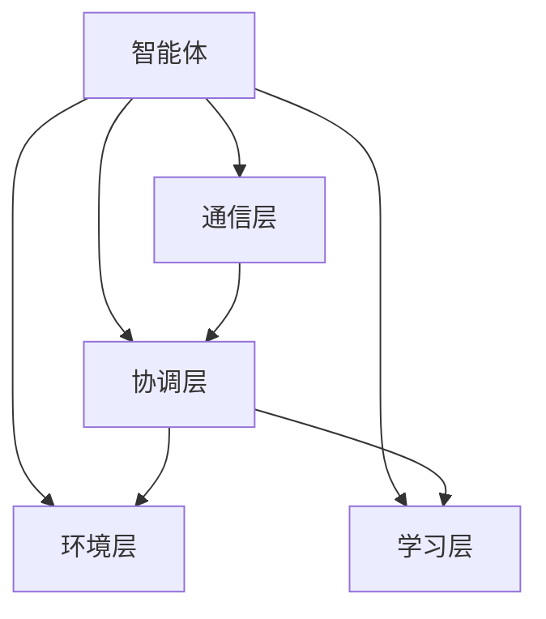
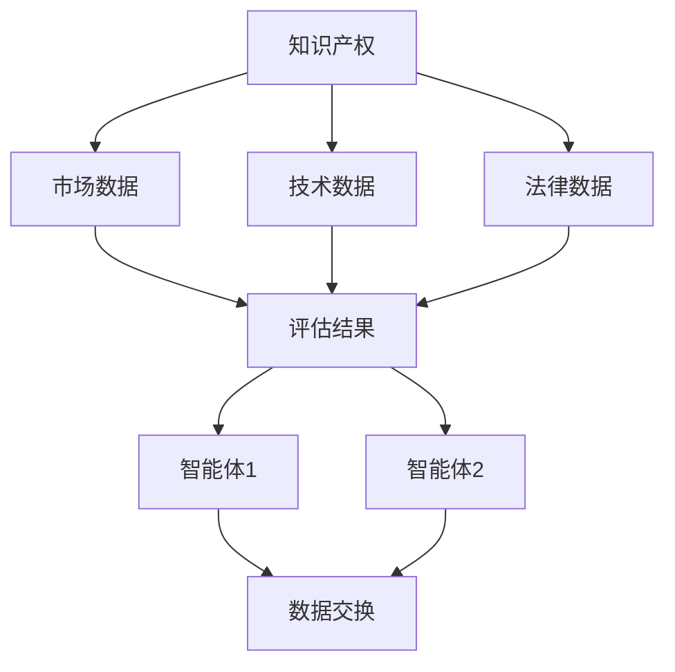
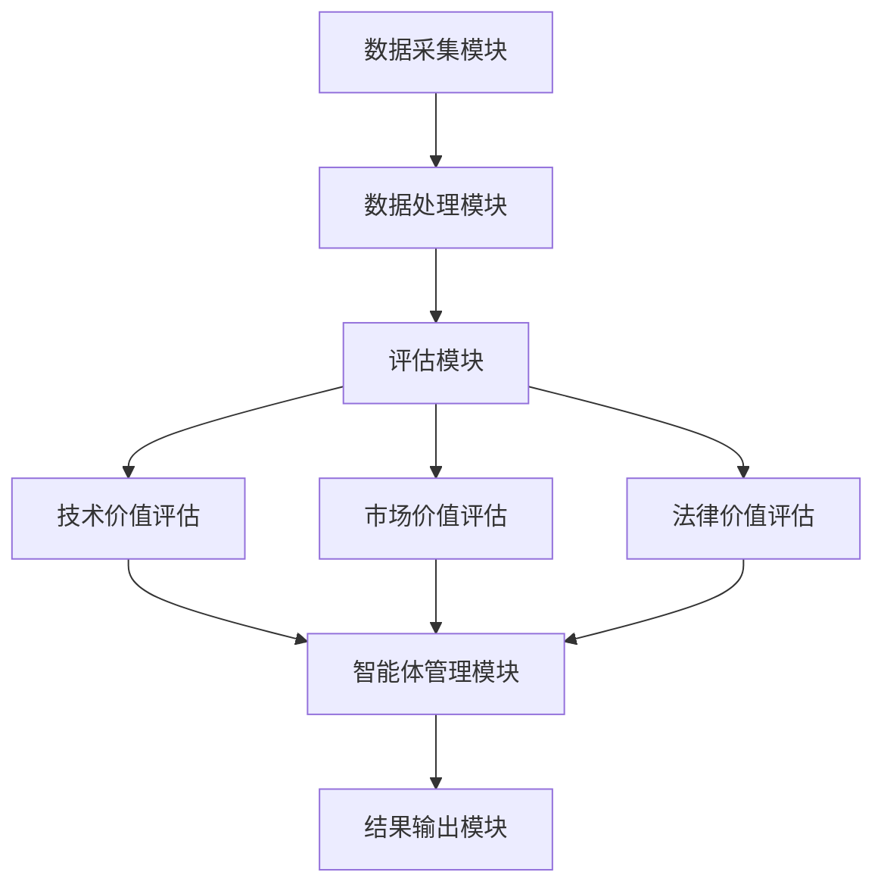
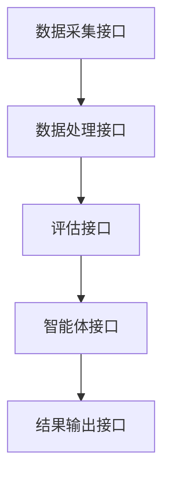
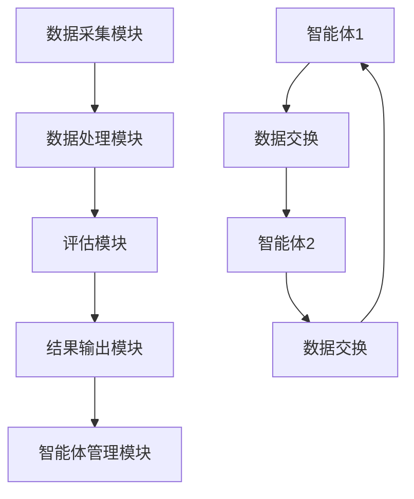

                 

### 第1章 引言：多智能体系统与知识产权价值评估

#### 1.1 问题背景

在当今全球化和信息化快速发展的时代，知识产权（Intellectual Property，简称IP）作为企业和国家核心竞争力的重要组成部分，其价值评估的重要性日益凸显。知识产权涵盖了专利、商标、著作权、商业秘密等多种形式，是企业创新成果的重要体现。然而，传统的知识产权价值评估方法往往局限于单一维度的分析，无法全面、动态地反映知识产权的内在价值。

传统的知识产权价值评估方法主要依赖于市场比较法、成本法、收益法等。市场比较法通过比较类似知识产权的市场交易价格来确定其价值；成本法基于研发成本、维护成本等估算知识产权的价值；收益法则通过预测知识产权带来的未来收益来评估其价值。这些方法在特定场景下具有一定的参考价值，但存在以下局限性：

1. **静态性**：传统方法通常是基于历史数据进行评估，无法及时反映知识产权价值的动态变化。
2. **单一维度**：传统方法主要关注知识产权的市场价值、技术价值等单一维度，忽略了法律价值、社会价值等多方面的影响。
3. **复杂性**：知识产权涉及的法律、技术、市场等因素复杂多样，传统方法难以全面、精确地评估其价值。

#### 1.2 问题描述

本章节将探讨如何利用多智能体系统（Multi-Agent Systems，MAS）对知识产权的价值进行动态评估。多智能体系统是一种模拟人类社会行为和交互的计算机系统，具有分布式、自主性、协调性和适应性等特点。通过多智能体系统，可以实现对知识产权价值的全面、动态评估。

知识产权价值评估的动态性主要体现在以下几个方面：

1. **技术创新**：新技术的出现可能会提高现有知识产权的价值。
2. **市场竞争**：市场竞争的激烈程度会影响知识产权的市场价值。
3. **法律环境**：知识产权法律环境的变动可能会影响其法律价值。
4. **政策支持**：政策支持的变化可能会对知识产权的社会价值产生影响。

因此，本章节将探讨如何利用多智能体系统来实现以下目标：

1. **全面评估**：通过多智能体系统，从市场、技术、法律等多维度全面评估知识产权的价值。
2. **动态调整**：根据市场和技术动态，实时调整知识产权的价值评估。
3. **提高精确性**：利用多智能体系统的计算能力和算法优势，提高知识产权价值评估的精确性。

#### 1.3 问题解决

本书将通过以下步骤解决问题：

1. **核心概念介绍**：首先介绍多智能体系统和知识产权价值评估的核心概念，为后续内容奠定基础。
2. **概念联系分析**：分析多智能体系统与知识产权价值评估之间的联系，明确两者的融合点。
3. **系统架构设计**：设计一个基于多智能体系统的知识产权价值评估系统架构，确保系统能够实现全面、动态评估。
4. **算法原理讲解**：详细讲解多智能体系统在知识产权价值评估中的应用算法原理，包括数据处理、模型构建、评估方法等。
5. **数学模型与公式**：给出知识产权价值评估的数学模型和公式，并进行详细讲解，确保读者能够理解并应用。
6. **系统实现与案例分析**：介绍系统实现过程，并通过实际案例进行分析和讲解，展示多智能体系统在知识产权价值评估中的应用效果。

#### 1.4 边界与外延

本文研究的知识产权价值评估主要涉及专利、商标、著作权等知识产权类型。评估范围包括知识产权的市场价值、技术价值、法律价值等多个方面。此外，本文研究的知识产权价值评估主要针对企业级应用，对于个人知识产权的评估方法也有一定的参考价值。

#### 1.5 本章小结

本章介绍了多智能体系统在知识产权价值动态评估中的应用背景、核心概念、系统架构设计、算法原理及数学模型等内容。本章为后续章节的展开奠定了基础。在接下来的章节中，我们将逐步深入探讨多智能体系统的具体应用方法和实现细节，以期为读者提供全面、系统的知识产权价值评估解决方案。

### 1.6 总结

随着全球化和技术创新的加速，知识产权在企业和国家竞争力中的作用日益凸显。然而，传统的知识产权价值评估方法存在诸多局限性，难以满足现代企业和市场的需求。多智能体系统作为一种新兴的计算模型，具有分布式、自主性、协调性和适应性等特点，为知识产权价值评估提供了一种全新的思路和方法。

本章首先介绍了多智能体系统和知识产权价值评估的背景和重要性，然后描述了传统评估方法的局限性，提出了利用多智能体系统进行动态评估的需求。接下来，本章简要概述了本书的研究目标、内容安排以及章节结构，为后续内容奠定了基础。

在接下来的章节中，我们将深入探讨多智能体系统的基本概念、架构和应用，详细介绍其在知识产权价值评估中的具体应用方法。通过系统架构设计、算法原理讲解、数学模型与公式阐述，以及系统实现与案例分析，我们将逐步展示如何利用多智能体系统实现全面、动态的知识产权价值评估。

总之，本章为本书的展开提供了理论依据和实践指南。希望读者能够通过本章的学习，对多智能体系统和知识产权价值评估有更深入的理解，为后续内容的学习和应用打下坚实基础。

---

### 第2章 多智能体系统基础

#### 2.1 多智能体系统概述

##### 2.1.1 多智能体系统的定义

多智能体系统（Multi-Agent Systems，MAS）是一种模拟人类社会行为和交互的计算机系统，由多个具有独立智能的智能体（Agent）组成。智能体是MAS的基本组成单位，具有自主性、社会性、反应性和适应性等特点。每个智能体在系统中具有独立的行为和决策能力，能够与其他智能体进行交互和协作，共同完成复杂的任务。

多智能体系统的核心概念包括：

- **智能体（Agent）**：具有自主性、社会性、反应性和适应性等特点的实体，能够感知环境、制定计划并采取行动。
- **环境（Environment）**：智能体所在的外部环境，包括物理环境、社会环境等。
- **通信（Communication）**：智能体之间通过发送和接收消息进行交互。
- **协调（Coordination）**：智能体之间通过协作完成任务，实现共同目标。
- **学习（Learning）**：智能体通过经验学习和知识积累，提高自身智能和能力。

##### 2.1.2 多智能体系统的特点

多智能体系统具有以下几个显著特点：

- **分布式**：多智能体系统中的智能体分布在不同位置，协同工作完成复杂任务。
- **自主性**：每个智能体具有独立的行为和决策能力，能够自主选择行动策略。
- **协调性**：智能体之间通过通信和协作实现共同目标，具有高度的协同能力。
- **适应性**：多智能体系统能够适应环境变化和任务需求，具有动态调整的能力。
- **鲁棒性**：多智能体系统在面对异常情况或部分智能体失效时，仍能保持系统稳定和任务完成。

##### 2.1.3 多智能体系统的分类

多智能体系统可以根据不同的分类标准进行分类，常见的分类方法包括：

- **按智能体能力分类**：可分为完全智能体、弱智能体和半智能体。完全智能体具有高度自主性和智能，能够独立完成任务；弱智能体只能执行预先设定的任务，缺乏自主决策能力；半智能体介于完全智能体和弱智能体之间，具备一定的自主决策能力。
- **按智能体类型分类**：可分为人类智能体、软件智能体和硬件智能体。人类智能体是具有人类认知能力的实体，如人类用户；软件智能体是运行在计算机系统中的虚拟实体，如聊天机器人；硬件智能体是具有物理形态和运动能力的实体，如无人机、机器人。
- **按应用领域分类**：可分为工业自动化智能体系统、金融智能体系统、交通智能体系统、医疗智能体系统等，分别应用于工业、金融、交通、医疗等不同领域。

#### 2.2 多智能体系统的架构

##### 2.2.1 多智能体系统的基本架构

多智能体系统的基本架构通常包括以下几个组成部分：

- **智能体（Agent）**：智能体是MAS的基本组成单位，具有自主性、社会性、反应性和适应性等特点。
- **通信层**：通信层负责智能体之间的消息传递和通信，确保智能体能够相互协调和协作。
- **协调层**：协调层负责智能体之间的协调和决策，确保智能体能够共同完成任务。
- **环境层**：环境层是智能体所在的物理或社会环境，为智能体提供信息和资源。
- **学习层**：学习层负责智能体的学习和知识积累，提高智能体的智能和能力。

多智能体系统的基本架构图如下：



##### 2.2.2 多智能体系统的通信机制

多智能体系统的通信机制是确保智能体之间能够有效传递消息和交互的重要手段。常见的通信机制包括：

- **直接通信**：智能体之间通过直接发送和接收消息进行通信，适用于智能体之间距离较近且通信频率较高的情况。
- **间接通信**：智能体之间通过中介智能体或通信网络进行消息传递，适用于智能体之间距离较远或通信频率较低的情况。
- **广播通信**：智能体向所有其他智能体发送消息，适用于需要全局信息共享的场景。
- **选择通信**：智能体仅向特定智能体发送消息，适用于需要精确控制通信对象的场景。

##### 2.2.3 多智能体系统的协作机制

多智能体系统的协作机制是智能体之间通过相互协调和协作完成任务的重要保障。常见的协作机制包括：

- **集中式协作**：所有智能体共同参与决策，集中处理任务。适用于任务较为简单且智能体数量较少的场景。
- **分布式协作**：智能体根据自身的局部信息进行决策，局部任务完成后协同完成全局任务。适用于任务复杂且智能体数量较多的场景。
- **竞争合作**：智能体之间既竞争又合作，通过竞争提高自身性能，通过合作实现共同目标。适用于存在资源竞争但需要协同完成任务的场景。
- **协调博弈**：智能体之间通过博弈策略进行协调，确保各自利益最大化。适用于存在冲突和竞争但需要合作共赢的场景。

#### 2.3 多智能体系统的应用

##### 2.3.1 多智能体系统在知识产权价值评估中的应用

多智能体系统在知识产权价值评估中具有广泛的应用前景，可以通过以下几种方式实现：

- **分布式评估**：利用多智能体系统的分布式特性，将知识产权价值评估任务分解为多个子任务，由不同智能体分别处理，提高评估效率。
- **自适应评估**：多智能体系统可以根据环境变化和任务需求，动态调整评估方法和策略，实现自适应评估。
- **多维度评估**：多智能体系统可以同时从市场、技术、法律等多个维度对知识产权价值进行评估，提高评估的全面性和准确性。
- **协同评估**：多个智能体之间通过协作和沟通，共同完成知识产权价值评估任务，提高评估质量和效果。

##### 2.3.2 多智能体系统在其他领域的应用案例

多智能体系统在许多领域都有广泛的应用，以下是一些典型的应用案例：

- **工业自动化**：多智能体系统用于工业生产过程中的设备监控、故障诊断、生产调度等，提高生产效率和产品质量。
- **金融分析**：多智能体系统用于金融市场分析、风险评估、投资组合优化等，帮助金融机构进行决策和风险管理。
- **交通管理**：多智能体系统用于智能交通管理、车辆调度、交通信号控制等，提高交通效率和安全性。
- **医疗诊断**：多智能体系统用于医疗影像分析、疾病诊断、药物研发等，提高诊断和治疗的准确性和效率。

##### 2.3.3 多智能体系统的优势与挑战

多智能体系统在知识产权价值评估和其他领域具有以下优势：

- **分布式计算**：通过分布式计算，提高评估和决策的效率。
- **自适应能力**：通过自适应调整，适应不同环境和任务需求。
- **多维度分析**：通过多维度分析，提高评估的全面性和准确性。
- **协作能力**：通过协作和沟通，提高评估质量和效果。

然而，多智能体系统在应用中也面临以下挑战：

- **复杂性**：多智能体系统的设计和实现较为复杂，需要考虑智能体之间的通信、协调、协作等问题。
- **可靠性**：多智能体系统的可靠性依赖于智能体的可靠性和系统的容错能力。
- **安全性**：多智能体系统需要确保系统的安全性和数据隐私。
- **可扩展性**：多智能体系统需要支持系统的可扩展性，以适应不断变化的需求。

#### 2.4 多智能体系统的开发工具与平台

##### 2.4.1 多智能体系统的开发工具

多智能体系统的开发工具主要包括以下几种：

- **Agent Development Tools**：用于创建和配置智能体的工具，如JADE（Java Agent Development Framework）、FIPA（Foundation for Intelligent Physical Agents）等。
- **Simulation Platforms**：用于模拟和测试多智能体系统的平台，如GridSim、MASimulator等。
- **Integration Tools**：用于将多智能体系统与其他系统集成的工具，如SOAP、REST等。

##### 2.4.2 多智能体系统的开发平台

多智能体系统的开发平台主要包括以下几种：

- **Agent-Oriented Programming Platforms**：如JADE、FIPA等，提供智能体的创建、通信和协调功能。
- **Distributed Computing Platforms**：如Grid Computing、Cloud Computing等，提供分布式计算资源和调度机制。
- **Middleware Platforms**：如CORBA（Common Object Request Broker Architecture）、JMS（Java Message Service）等，提供智能体之间的通信和协作支持。

##### 2.4.3 开发工具与平台的选择与比较

选择合适的开发工具和平台对于多智能体系统的成功实现至关重要。以下是对几种常见开发工具和平台的比较：

| 工具/平台 | 特点 | 适用场景 |
| --- | --- | --- |
| JADE | Java实现的MAS框架，易于集成到Java项目中 | Java开发项目，需要高度可配置性的场景 |
| FIPA | 专注于通信和协作标准，支持多种编程语言 | 需要遵循FIPA标准的MAS开发 |
| GridSim | 专门用于MAS模拟，支持多种模拟算法 | MAS模拟和测试 |
| CORBA | 支持跨语言、跨平台的对象通信，提供强大的服务 | 需要跨语言、跨平台的MAS开发 |
| JMS | Java实现的消息中间件，支持异步通信 | 需要异步通信的MAS开发 |

#### 2.5 本章小结

本章对多智能体系统的基本概念、架构和应用进行了详细阐述，介绍了多智能体系统的定义、特点、分类、架构、通信机制、协作机制及其在知识产权价值评估和其他领域的应用。本章内容为后续章节深入探讨多智能体系统在知识产权价值评估中的应用提供了基础。

### 2.6 总结

多智能体系统作为一种分布式、自主性、协调性和适应性的计算模型，在知识产权价值评估中具有广泛的应用前景。本章首先介绍了多智能体系统的定义、特点、分类和基本架构，然后详细阐述了多智能体系统的通信机制和协作机制。通过本章的学习，读者可以全面了解多智能体系统的基础知识，为后续章节的深入学习奠定基础。

在知识产权价值评估中，多智能体系统可以通过分布式计算、自适应能力、多维度分析和协同评估等方式，实现全面、动态、准确的评估。然而，多智能体系统在应用中也面临复杂性、可靠性、安全性和可扩展性等挑战。因此，在后续章节中，我们将进一步探讨如何设计高效的多智能体系统架构，实现知识产权价值评估的优化和提升。

总之，多智能体系统为知识产权价值评估提供了一种全新的思路和方法，具有巨大的潜力和应用价值。通过本章的学习，读者可以初步了解多智能体系统的基本原理和应用，为后续章节的深入学习做好准备。

---

### 第3章 知识产权价值评估概述

#### 3.1 知识产权概念与分类

##### 3.1.1 知识产权的定义

知识产权是指人们在科学、技术、文学、艺术等领域创造的智力成果，以及与这些成果相关的权利。根据世界知识产权组织（WIPO）的定义，知识产权主要包括以下类型：

- **专利权**：对发明创造所授予的独占权利，包括发明专利、实用新型专利和外观设计专利。
- **商标权**：对企业标识、标志和名称等所授予的独占权利。
- **著作权**：对文学、艺术和科学作品所授予的独占权利，包括文字作品、音乐作品、美术作品、摄影作品等。
- **商业秘密**：对企业保密的、具有商业价值的经营信息和技术信息，如配方、工艺、客户名单等。
- **集成电路布图设计权**：对集成电路布图设计所授予的独占权利。

##### 3.1.2 知识产权的分类

根据不同的分类标准，知识产权可以划分为多个类型。以下是几种常见的分类方法：

- **按权利主体分类**：知识产权可以划分为个人知识产权和集体知识产权。个人知识产权主要指个人创造的智力成果，如个人专利、个人商标等；集体知识产权主要指由多个个人或组织共同创造的智力成果，如企业专利、合作作品等。
- **按权利性质分类**：知识产权可以划分为财产权和人身权。财产权主要指知识产权所具有的财产属性，如专利权、商标权等；人身权主要指知识产权所具有的人身属性，如著作权中的署名权、修改权等。
- **按保护范围分类**：知识产权可以划分为地域性知识产权和国际性知识产权。地域性知识产权主要指在特定国家或地区受到保护的知识产权，如国家专利、国家商标等；国际性知识产权主要指在国际范围内受到保护的知识产权，如国际专利、国际商标等。

##### 3.1.3 知识产权的特征

知识产权具有以下主要特征：

- **无形性**：知识产权是一种无形的财产权利，不具有物理形态，但具有法律保护的独占性。
- **地域性**：知识产权在特定国家或地区受到保护，不同国家和地区的知识产权法律制度有所不同。
- **时间性**：知识产权具有法律保护期限，一旦超过保护期限，知识产权将失去法律效力。
- **专有性**：知识产权所具有的独占性，权利人可以在法定范围内独占使用、收益和处分知识产权。
- **可复制性**：知识产权所具有的可复制性，使得知识产权可以大量复制和传播。

#### 3.2 知识产权价值评估的重要性

##### 3.2.1 知识产权价值评估的意义

知识产权价值评估在企业和国家层面具有重要意义：

- **企业层面**：知识产权是企业核心竞争力的重要组成部分，通过评估知识产权的价值，企业可以更好地了解和利用自身知识产权，提高企业效益和市场竞争力。此外，知识产权价值评估也是企业进行并购、投资、融资等活动的重要参考依据。
- **国家层面**：知识产权是国家创新能力和国际竞争力的重要体现，通过评估知识产权的价值，国家可以更好地了解和推动知识产权的发展，制定相关政策和措施，促进经济转型升级和科技创新。

##### 3.2.2 知识产权价值评估的作用

知识产权价值评估在以下几个方面具有重要作用：

- **定价和交易**：通过评估知识产权的价值，可以确定知识产权的合理价格，为知识产权交易、转让、许可等提供参考依据。
- **融资和投资**：知识产权是企业获得融资和投资的重要资产，通过评估知识产权的价值，可以为企业融资和投资提供参考依据。
- **风险管理**：知识产权价值评估可以帮助企业识别和评估知识产权风险，采取相应措施降低风险，保障企业权益。
- **战略规划**：通过评估知识产权的价值，企业可以更好地制定知识产权战略，优化知识产权组合，提高企业核心竞争力。

##### 3.2.3 知识产权价值评估的现状

目前，知识产权价值评估在国内外已经得到广泛关注和研究，但仍然存在一些问题和挑战：

- **评估方法单一**：现有的知识产权价值评估方法主要依赖于市场比较法、成本法、收益法等传统方法，缺乏针对不同类型知识产权的专门评估方法。
- **数据来源不足**：知识产权价值评估需要大量的数据支持，但现有数据来源有限，难以满足评估需求。
- **评估精度不高**：传统评估方法往往只能从单一维度对知识产权进行评估，难以全面、精确地反映知识产权的内在价值。
- **评估周期较长**：知识产权价值评估涉及多个方面，评估过程较为复杂，评估周期较长，难以满足实时评估的需求。

#### 3.3 知识产权价值评估的方法

##### 3.3.1 市场法

市场法是通过比较类似知识产权的市场交易价格来确定其价值的一种评估方法。具体步骤如下：

1. **收集市场数据**：收集类似知识产权的市场交易案例，包括交易价格、交易时间、交易双方等信息。
2. **选择可比案例**：选择与被评估知识产权相似的可比案例，确保可比案例与被评估知识产权在技术、市场等方面具有可比性。
3. **调整差异因素**：对可比案例与被评估知识产权之间的差异因素进行调整，如技术成熟度、市场竞争力等。
4. **计算评估值**：根据调整后的差异因素，计算被评估知识产权的价值。

市场法的优点是直观、简便，缺点是数据来源有限，难以全面反映知识产权的内在价值。

##### 3.3.2 成本法

成本法是通过估算知识产权的研发成本、维护成本等来确定其价值的一种评估方法。具体步骤如下：

1. **计算研发成本**：根据研发活动的历史记录和成本数据，计算知识产权的研发成本，包括人力成本、设备成本、材料成本等。
2. **计算维护成本**：根据知识产权的维护情况，估算其维护成本，包括维修成本、升级成本等。
3. **计算评估值**：将研发成本和维护成本相加，得出知识产权的评估值。

成本法的优点是相对客观，缺点是成本估算难度较大，难以准确反映知识产权的市场价值。

##### 3.3.3 收益法

收益法是通过预测知识产权带来的未来收益来确定其价值的一种评估方法。具体步骤如下：

1. **预测未来收益**：根据知识产权的实际应用情况和市场前景，预测其未来收益，包括销售收入、利润等。
2. **计算现值**：将预测的未来收益按照一定的折现率折现到当前，计算知识产权的现值。
3. **计算评估值**：根据现值计算知识产权的评估值。

收益法的优点是能够反映知识产权的未来价值，缺点是预测难度较大，容易出现误差。

##### 3.3.4 基准法

基准法是通过比较同类知识产权的市场价格、专利价值等基准指标来确定其价值的一种评估方法。具体步骤如下：

1. **收集基准数据**：收集同类知识产权的市场价格、专利价值等基准数据。
2. **选择基准指标**：选择与被评估知识产权具有可比性的基准指标。
3. **计算评估值**：根据基准指标计算被评估知识产权的评估值。

基准法的优点是数据来源可靠，缺点是基准指标的选择和调整难度较大。

#### 3.4 知识产权价值评估的影响因素

##### 3.4.1 内部因素

内部因素是指影响知识产权价值的内部因素，主要包括：

1. **技术因素**：知识产权的技术含量、创新程度、成熟度等对价值产生影响。
2. **法律因素**：知识产权的法律保护状况、法律稳定性等对价值产生影响。
3. **市场因素**：知识产权的市场需求、市场竞争状况等对价值产生影响。
4. **管理因素**：知识产权的管理水平、运营状况等对价值产生影响。

##### 3.4.2 外部因素

外部因素是指影响知识产权价值的外部因素，主要包括：

1. **政策因素**：政府的知识产权政策、产业政策等对价值产生影响。
2. **经济因素**：宏观经济环境、行业发展趋势等对价值产生影响。
3. **社会因素**：社会文化背景、消费者偏好等对价值产生影响。
4. **环境因素**：技术创新环境、市场竞争环境等对价值产生影响。

##### 3.4.3 知识产权评估中的风险因素

在知识产权价值评估过程中，存在多种风险因素，主要包括：

1. **技术风险**：知识产权的技术落后、技术失效等可能导致的损失。
2. **法律风险**：知识产权的法律纠纷、法律变更等可能导致的损失。
3. **市场风险**：市场需求不足、市场竞争力下降等可能导致的损失。
4. **管理风险**：知识产权管理不善、运营失败等可能导致的损失。

#### 3.5 本章小结

本章对知识产权的概念、分类、价值评估的重要性、方法、影响因素进行了概述。通过本章的学习，读者可以初步了解知识产权价值评估的基本概念和方法，为后续章节深入探讨多智能体系统在知识产权价值评估中的应用提供基础。

### 3.6 总结

知识产权作为企业和国家核心竞争力的重要组成部分，其价值评估具有重要意义。本章首先介绍了知识产权的概念、分类及其特征，然后阐述了知识产权价值评估的重要性、方法和影响因素。通过本章的学习，读者可以初步了解知识产权价值评估的基本概念和方法，为后续章节的深入学习奠定基础。

在知识产权价值评估中，传统的市场法、成本法、收益法和基准法等方法存在一定的局限性，难以全面、精确地反映知识产权的内在价值。因此，本章提出了利用多智能体系统进行知识产权价值评估的思路和方法，通过分布式计算、自适应能力、多维度分析和协同评估等方式，实现全面、动态、准确的评估。

在接下来的章节中，我们将进一步探讨多智能体系统在知识产权价值评估中的应用，详细分析多智能体系统的架构设计、算法原理、数学模型和实际案例分析，以期为读者提供全面、系统的知识产权价值评估解决方案。

总之，本章为后续内容的学习提供了理论依据和实践指南，希望读者能够通过本章的学习，对知识产权价值评估和多智能体系统有更深入的理解，为后续章节的深入学习做好准备。

---

### 第4章 多智能体系统在知识产权价值评估中的应用

#### 4.1 多智能体系统在知识产权价值评估中的应用场景

在知识产权价值评估领域，多智能体系统（MAS）的应用场景主要包括以下几个方面：

1. **分布式评估**：利用多智能体系统的分布式特性，将知识产权价值评估任务分解为多个子任务，由不同智能体分别处理，从而提高评估效率。
2. **自适应评估**：多智能体系统可以根据环境变化和任务需求，动态调整评估方法和策略，实现自适应评估。
3. **多维度评估**：通过多个智能体从市场、技术、法律等多个维度对知识产权价值进行评估，提高评估的全面性和准确性。
4. **协同评估**：多个智能体之间通过协作和沟通，共同完成知识产权价值评估任务，提高评估质量和效果。

下面，我们将具体分析多智能体系统在知识产权价值评估中的应用。

##### 4.1.1 分布式评估

分布式评估是利用多智能体系统的分布式特性，将知识产权价值评估任务分解为多个子任务，由不同智能体分别处理，从而提高评估效率。具体步骤如下：

1. **任务分解**：将知识产权价值评估任务分解为多个子任务，如市场价值评估、技术价值评估、法律价值评估等。
2. **分配子任务**：根据智能体的能力和知识，将子任务分配给不同的智能体，确保每个智能体都能在其擅长领域内进行评估。
3. **独立评估**：各智能体分别对子任务进行评估，利用其自身的知识和算法，生成初步的评估结果。
4. **结果集成**：将各智能体的评估结果进行集成，通过汇总、加权等方式，得到最终的知识产权价值评估结果。

##### 4.1.2 自适应评估

自适应评估是利用多智能体系统的自适应能力，根据环境变化和任务需求，动态调整评估方法和策略，实现知识产权价值的实时评估。具体步骤如下：

1. **环境感知**：智能体通过传感器、数据采集等方式，实时感知环境变化，如市场动态、技术进步、法律政策等。
2. **决策调整**：根据环境感知结果，智能体动态调整评估方法和策略，如调整评估指标、权重分配等。
3. **实时评估**：在动态调整的评估方法和策略指导下，智能体对知识产权进行实时评估，生成实时评估结果。
4. **结果反馈**：将实时评估结果反馈给决策者，为知识产权管理和决策提供支持。

##### 4.1.3 多维度评估

多维度评估是利用多智能体系统从市场、技术、法律等多个维度对知识产权价值进行评估，提高评估的全面性和准确性。具体步骤如下：

1. **确定评估维度**：根据知识产权的特点和评估需求，确定市场、技术、法律等评估维度。
2. **分配智能体**：将不同维度的评估任务分配给相应的智能体，如市场价值评估任务分配给市场智能体，技术价值评估任务分配给技术智能体等。
3. **独立评估**：各智能体分别对其负责的维度进行评估，利用其自身的知识和算法，生成初步的评估结果。
4. **结果集成**：将各智能体的评估结果进行集成，通过汇总、加权等方式，得到最终的知识产权价值评估结果。

##### 4.1.4 协同评估

协同评估是利用多智能体系统的协作能力，多个智能体之间通过协作和沟通，共同完成知识产权价值评估任务，提高评估质量和效果。具体步骤如下：

1. **任务分解**：将知识产权价值评估任务分解为多个子任务，如市场价值评估、技术价值评估、法律价值评估等。
2. **分配智能体**：将不同子任务分配给不同的智能体，确保每个智能体都能在其擅长领域内进行评估。
3. **独立评估**：各智能体分别对子任务进行评估，利用其自身的知识和算法，生成初步的评估结果。
4. **协作沟通**：各智能体之间通过通信和协作，分享评估信息，讨论评估结果，达成共识。
5. **结果集成**：将各智能体的评估结果进行集成，通过汇总、加权等方式，得到最终的知识产权价值评估结果。

#### 4.2 多智能体系统在知识产权价值评估中的具体应用

##### 4.2.1 市场价值评估

市场价值评估是知识产权价值评估的重要组成部分，通过分析市场供需关系、竞争状况等因素，确定知识产权的市场价值。多智能体系统在市场价值评估中的应用主要包括：

1. **市场信息收集**：各智能体通过互联网、数据库等渠道，收集市场相关信息，如交易价格、市场份额、竞争态势等。
2. **市场分析**：各智能体根据收集到的市场信息，运用数据分析和预测算法，对知识产权的市场价值进行初步评估。
3. **结果集成**：各智能体将初步评估结果进行集成，通过汇总、加权等方式，得到最终的市场价值评估结果。

##### 4.2.2 技术价值评估

技术价值评估是知识产权价值评估的另一个重要方面，通过分析知识产权的技术水平、创新程度等因素，确定知识产权的技术价值。多智能体系统在技术价值评估中的应用主要包括：

1. **技术信息收集**：各智能体通过专利数据库、技术文献等渠道，收集知识产权的技术信息，如技术成熟度、技术创新性等。
2. **技术分析**：各智能体根据收集到的技术信息，运用技术分析和预测算法，对知识产权的技术价值进行初步评估。
3. **结果集成**：各智能体将初步评估结果进行集成，通过汇总、加权等方式，得到最终的技术价值评估结果。

##### 4.2.3 法律价值评估

法律价值评估是知识产权价值评估的重要方面，通过分析知识产权的法律保护状况、法律稳定性等因素，确定知识产权的法律价值。多智能体系统在法律价值评估中的应用主要包括：

1. **法律信息收集**：各智能体通过法律法规数据库、法院判决等渠道，收集知识产权的法律信息，如法律保护期限、法律纠纷等。
2. **法律分析**：各智能体根据收集到的法律信息，运用法律分析和预测算法，对知识产权的法律价值进行初步评估。
3. **结果集成**：各智能体将初步评估结果进行集成，通过汇总、加权等方式，得到最终的法律价值评估结果。

##### 4.2.4 综合评估

通过市场价值评估、技术价值评估和法律价值评估，多智能体系统可以对知识产权进行全面评估，得到知识产权的综合价值。具体步骤如下：

1. **初步评估**：各智能体分别对知识产权的市场价值、技术价值、法律价值进行初步评估，生成初步评估结果。
2. **结果集成**：将各智能体的初步评估结果进行集成，通过汇总、加权等方式，得到知识产权的综合初步评估结果。
3. **动态调整**：根据环境变化和任务需求，动态调整评估方法和策略，生成最终的知识产权综合评估结果。

#### 4.3 多智能体系统在知识产权价值评估中的优势与挑战

##### 4.3.1 优势

多智能体系统在知识产权价值评估中具有以下优势：

1. **分布式计算**：通过分布式计算，提高评估效率，缩短评估周期。
2. **自适应能力**：根据环境变化和任务需求，动态调整评估方法和策略，实现实时评估。
3. **多维度评估**：从市场、技术、法律等多个维度对知识产权进行评估，提高评估的全面性和准确性。
4. **协同评估**：多个智能体之间通过协作和沟通，共同完成评估任务，提高评估质量和效果。

##### 4.3.2 挑战

多智能体系统在知识产权价值评估中也面临以下挑战：

1. **复杂性**：多智能体系统的设计和实现较为复杂，需要考虑智能体之间的通信、协调、协作等问题。
2. **可靠性**：多智能体系统的可靠性依赖于智能体的可靠性和系统的容错能力。
3. **安全性**：多智能体系统需要确保系统的安全性和数据隐私。
4. **可扩展性**：多智能体系统需要支持系统的可扩展性，以适应不断变化的需求。

#### 4.4 本章小结

本章介绍了多智能体系统在知识产权价值评估中的应用场景、具体应用方法和优势与挑战。通过分布式评估、自适应评估、多维度评估和协同评估等方式，多智能体系统可以实现对知识产权价值的全面、动态、准确的评估。然而，多智能体系统在知识产权价值评估中也面临复杂性、可靠性、安全性和可扩展性等挑战。在后续章节中，我们将进一步探讨如何克服这些挑战，实现高效、可靠的知识产权价值评估。

### 4.5 总结

本章详细探讨了多智能体系统在知识产权价值评估中的应用，包括分布式评估、自适应评估、多维度评估和协同评估等。通过这些应用方式，多智能体系统可以实现对知识产权价值的全面、动态、准确的评估。然而，多智能体系统在知识产权价值评估中也面临复杂性、可靠性、安全性和可扩展性等挑战。在接下来的章节中，我们将进一步探讨如何设计高效的多智能体系统架构，实现知识产权价值评估的优化和提升。

总之，多智能体系统为知识产权价值评估提供了一种全新的思路和方法，具有巨大的潜力和应用价值。通过本章的学习，读者可以初步了解多智能体系统在知识产权价值评估中的应用，为后续章节的深入学习奠定基础。希望读者能够通过本章的学习，对多智能体系统和知识产权价值评估有更深入的理解，为实际应用提供有益的参考。

---

### 第5章 知识产权价值评估系统的架构设计

#### 5.1 系统设计的目标和需求

在设计知识产权价值评估系统时，我们首先要明确系统的目标。该系统的核心目标是实现知识产权价值的全面、动态和准确的评估。具体来说，系统需要满足以下需求：

1. **全面评估**：系统能够从市场、技术、法律等多个维度对知识产权进行评估，确保评估结果的全面性。
2. **动态调整**：系统能够根据市场变化、技术进步和法律环境的变化，动态调整评估方法和参数，实现实时评估。
3. **准确评估**：系统能够利用多智能体系统的计算能力和算法优势，提高评估的精确性，降低误差。
4. **可扩展性**：系统能够适应未来需求的变化，支持更多的知识产权类型和评估维度。

#### 5.2 系统功能设计

为了满足上述需求，知识产权价值评估系统需要实现以下主要功能：

1. **数据采集与处理**：系统需要从多个渠道（如市场数据、技术文献、法律法规数据库等）收集知识产权相关的数据，并对数据进行预处理，包括数据清洗、归一化等，为后续评估提供可靠的数据基础。
2. **多维评估**：系统需要实现从市场、技术、法律等多个维度对知识产权进行评估，每个维度都需要有不同的评估算法和模型。例如，市场价值评估可以采用市场比较法、收益法等；技术价值评估可以采用专利引用分析、技术成熟度评估等；法律价值评估可以采用法律法规文本分析、法律稳定性评估等。
3. **动态调整**：系统需要实现评估方法和参数的动态调整，根据环境变化和任务需求，自动调整评估策略，确保评估结果的实时性和准确性。
4. **协同评估**：系统需要实现多智能体之间的协同工作，通过智能体的通信和协作，共同完成知识产权价值评估任务，提高评估质量和效果。
5. **结果输出**：系统需要将评估结果以直观、易于理解的形式输出，包括评估报告、可视化图表等，为决策者提供可靠的数据支持。

#### 5.3 领域模型设计

领域模型是系统功能设计的基础，它定义了系统中的核心概念和实体，以及实体之间的关系。以下是知识产权价值评估系统的领域模型设计：

- **领域实体**：知识产权（Intellectual Property）、市场数据（Market Data）、技术数据（Technical Data）、法律数据（Legal Data）、评估结果（Evaluation Result）等。
- **领域关系**：
  - 知识产权与市场数据、技术数据、法律数据之间存在关联关系，每个维度对应的数据会影响知识产权的价值评估。
  - 评估结果由市场数据、技术数据、法律数据等多个维度的评估结果集成而成。
  - 智能体之间通过通信和协作实现数据交换和协同评估。

领域模型设计图如下：



#### 5.4 系统架构设计

系统架构设计是知识产权价值评估系统的关键环节，它定义了系统的整体结构，包括各模块的功能和相互关系。以下是系统架构设计：

1. **数据采集模块**：负责从多个渠道收集知识产权相关的数据，包括市场数据、技术数据、法律数据等，并对数据进行预处理。
2. **数据处理模块**：负责对采集到的数据进行清洗、归一化等处理，为后续评估提供可靠的数据基础。
3. **评估模块**：包括市场价值评估、技术价值评估、法律价值评估等，每个评估模块都有相应的评估算法和模型。
4. **智能体管理模块**：负责智能体的创建、分配任务、通信和协作等，确保智能体能够高效地协同工作。
5. **结果输出模块**：负责将评估结果以直观、易于理解的形式输出，包括评估报告、可视化图表等。

系统架构设计图如下：



#### 5.5 系统接口设计

系统接口设计是系统架构设计的重要组成部分，它定义了系统内部模块之间的交互方式和数据传输格式。以下是系统接口设计：

1. **数据采集接口**：定义了数据采集模块与外部数据源（如数据库、网络接口等）的交互方式，包括数据的采集、传输和存储。
2. **数据处理接口**：定义了数据处理模块与数据采集模块、评估模块之间的交互方式，包括数据清洗、归一化等处理流程。
3. **评估接口**：定义了评估模块与智能体管理模块、结果输出模块之间的交互方式，包括评估任务的分配、结果集成等。
4. **智能体接口**：定义了智能体管理模块与智能体之间的交互方式，包括任务的接收、数据的通信和协作等。
5. **结果输出接口**：定义了结果输出模块与用户之间的交互方式，包括评估报告的生成、可视化图表的展示等。

系统接口设计图如下：



#### 5.6 系统交互设计

系统交互设计是系统架构设计的延伸，它定义了系统内部各模块之间的交互流程和通信机制。以下是系统交互设计：

1. **数据流**：从数据采集模块到数据处理模块，再到评估模块，最后到结果输出模块，形成完整的数据处理和评估流程。
2. **控制流**：智能体管理模块根据任务需求，动态分配任务给各智能体，各智能体通过通信和协作，共同完成评估任务，并将结果反馈给智能体管理模块。
3. **事件流**：系统中的事件包括数据采集完成、数据处理完成、评估结果生成等，通过事件驱动机制，实现系统的动态调整和实时评估。

系统交互设计图如下：



#### 5.7 本章小结

本章对知识产权价值评估系统的架构设计进行了详细阐述，包括系统设计的目标和需求、系统功能设计、领域模型设计、系统架构设计、系统接口设计、系统交互设计等。通过这些设计，我们可以构建一个高效、可靠、全面、动态的知识产权价值评估系统。在后续章节中，我们将进一步探讨系统的实现过程、算法原理和实际案例分析，以期为读者提供全面、系统的知识产权价值评估解决方案。

### 5.8 总结

本章详细介绍了知识产权价值评估系统的架构设计，包括系统设计的目标和需求、系统功能设计、领域模型设计、系统架构设计、系统接口设计、系统交互设计等内容。通过这些设计，我们能够构建一个高效、可靠、全面、动态的知识产权价值评估系统。系统设计的目标是实现对知识产权价值的全面、动态和准确评估，满足企业和国家的知识产权管理需求。

在系统功能设计中，我们明确了数据采集与处理、多维评估、动态调整、协同评估和结果输出等核心功能。领域模型设计定义了系统中的核心概念和实体，以及实体之间的关系，为系统功能设计提供了理论基础。系统架构设计则将各功能模块有机地组织在一起，形成了系统的整体结构。系统接口设计和系统交互设计进一步明确了系统内部模块之间的交互流程和通信机制，确保系统各部分能够协同工作。

尽管本章提供了详细的架构设计，但在实际实现过程中，仍需考虑系统的可靠性、安全性和可扩展性。此外，知识产权价值评估系统的发展和应用需要不断适应新技术、新需求的变化，因此，系统的设计和实现需要具备一定的灵活性和可扩展性。

在接下来的章节中，我们将进一步探讨知识产权价值评估系统的具体实现过程、算法原理和实际案例分析，以期为读者提供更加实用和全面的知识。通过这些学习和实践，读者可以深入了解多智能体系统在知识产权价值评估中的应用，为实际项目提供有益的参考和指导。

总之，本章为知识产权价值评估系统的设计与实现奠定了基础。希望读者能够通过本章的学习，对知识产权价值评估系统有更深入的理解，为后续章节的学习和应用做好准备。

---

### 第6章 多智能体系统算法原理讲解

#### 6.1 多智能体系统算法的基本原理

多智能体系统（MAS）的算法原理主要基于以下核心概念：

1. **智能体（Agent）**：智能体是MAS的基本组成单位，具有自主性、社会性、反应性和适应性等特点。每个智能体能够感知环境、制定计划并采取行动，以实现自身目标。
2. **通信**：智能体之间的通信是实现协作和协调的重要手段。通信机制包括直接通信、间接通信、广播通信和选择通信等。
3. **协调**：协调是指智能体之间通过协作和沟通，共同完成任务的过程。协调机制包括集中式协调、分布式协调、竞争合作协调和协调博弈等。
4. **学习**：学习是指智能体通过经验积累和知识更新，提高自身智能和能力的过程。学习机制包括基于规则的机器学习、强化学习、进化计算等。

#### 6.2 多智能体系统算法的应用场景

多智能体系统算法在知识产权价值评估中的应用场景主要包括：

1. **分布式评估**：利用多个智能体的分布式计算能力，分别处理知识产权价值评估的各个子任务，提高评估效率。
2. **自适应评估**：通过智能体的学习和适应能力，根据环境变化和任务需求，动态调整评估方法和参数，实现实时评估。
3. **多维度评估**：通过多个智能体从市场、技术、法律等多个维度对知识产权进行评估，提高评估的全面性和准确性。
4. **协同评估**：通过智能体之间的协作和沟通，共同完成知识产权价值评估任务，提高评估质量和效果。

#### 6.3 知识产权价值评估的多智能体系统算法设计

为了实现知识产权价值评估的多智能体系统，我们可以设计以下几种算法：

1. **分布式评估算法**：
   - **任务分解**：将知识产权价值评估任务分解为多个子任务，如市场价值评估、技术价值评估、法律价值评估等。
   - **智能体分配**：根据智能体的能力和知识，将子任务分配给不同的智能体，确保每个智能体都能在其擅长领域内进行评估。
   - **独立评估**：各智能体分别对其负责的子任务进行评估，利用其自身的知识和算法，生成初步的评估结果。
   - **结果集成**：将各智能体的初步评估结果进行集成，通过汇总、加权等方式，得到最终的知识产权价值评估结果。

2. **自适应评估算法**：
   - **环境感知**：各智能体通过传感器、数据采集等方式，实时感知环境变化，如市场动态、技术进步、法律政策等。
   - **决策调整**：根据环境感知结果，智能体动态调整评估方法和策略，如调整评估指标、权重分配等。
   - **实时评估**：在动态调整的评估方法和策略指导下，智能体对知识产权进行实时评估，生成实时评估结果。
   - **结果反馈**：将实时评估结果反馈给决策者，为知识产权管理和决策提供支持。

3. **多维度评估算法**：
   - **维度确定**：根据知识产权的特点和评估需求，确定市场、技术、法律等评估维度。
   - **智能体分配**：将不同维度的评估任务分配给相应的智能体，如市场价值评估任务分配给市场智能体，技术价值评估任务分配给技术智能体等。
   - **独立评估**：各智能体分别对其负责的维度进行评估，利用其自身的知识和算法，生成初步的评估结果。
   - **结果集成**：将各智能体的评估结果进行集成，通过汇总、加权等方式，得到最终的知识产权价值评估结果。

4. **协同评估算法**：
   - **任务分解**：将知识产权价值评估任务分解为多个子任务，如市场价值评估、技术价值评估、法律价值评估等。
   - **智能体分配**：将不同子任务分配给不同的智能体，确保每个智能体都能在其擅长领域内进行评估。
   - **独立评估**：各智能体分别对子任务进行评估，利用其自身的知识和算法，生成初步的评估结果。
   - **协作沟通**：各智能体之间通过通信和协作，分享评估信息，讨论评估结果，达成共识。
   - **结果集成**：将各智能体的评估结果进行集成，通过汇总、加权等方式，得到最终的知识产权价值评估结果。

#### 6.4 算法原理讲解

下面我们以分布式评估算法为例，详细讲解其算法原理。

##### 6.4.1 分布式评估算法的流程

分布式评估算法的流程如下：

1. **任务分解**：将知识产权价值评估任务分解为多个子任务，如市场价值评估、技术价值评估、法律价值评估等。

2. **智能体分配**：根据智能体的能力和知识，将子任务分配给不同的智能体，确保每个智能体都能在其擅长领域内进行评估。

3. **独立评估**：各智能体分别对其负责的子任务进行评估，利用其自身的知识和算法，生成初步的评估结果。

4. **结果集成**：将各智能体的初步评估结果进行集成，通过汇总、加权等方式，得到最终的知识产权价值评估结果。

##### 6.4.2 分布式评估算法的数学模型

分布式评估算法的数学模型可以表示为：

$$
V_{\text{total}} = \sum_{i=1}^{n} w_i \cdot V_i
$$

其中：
- \( V_{\text{total}} \) 表示最终的知识产权价值评估结果。
- \( w_i \) 表示第 \( i \) 个智能体的权重，反映了智能体在该维度评估中的重要性。
- \( V_i \) 表示第 \( i \) 个智能体对其负责的子任务的评估结果。

##### 6.4.3 分布式评估算法的Python实现

下面是一个简单的Python代码示例，用于实现分布式评估算法：

```python
def distributed_evaluation(data, weights):
    # 数据和权重输入
    total_value = 0
    for i in range(len(data)):
        # 计算每个智能体的评估值
        value = data[i]
        # 将评估值乘以权重，并累加到总评估值中
        total_value += value * weights[i]
    return total_value

# 假设我们有一个包含三个智能体评估结果的列表和一个权重列表
data = [0.8, 0.7, 0.9]
weights = [0.4, 0.3, 0.3]

# 调用分布式评估函数
result = distributed_evaluation(data, weights)

print("最终的知识产权价值评估结果为：", result)
```

##### 6.4.4 分布式评估算法的例子

假设我们要评估一个知识产权组合，其中包含专利、商标和著作权。我们有三个智能体，分别负责市场价值、技术价值和法律价值的评估。每个智能体的权重如下：

- 市场智能体：权重为0.4
- 技术智能体：权重为0.3
- 法律智能体：权重为0.3

各智能体分别对其负责的维度进行评估，得到以下初步评估结果：

- 市场价值评估结果：0.8
- 技术价值评估结果：0.7
- 法律价值评估结果：0.9

根据分布式评估算法，我们可以计算得到最终的知识产权价值评估结果：

$$
V_{\text{total}} = 0.8 \cdot 0.4 + 0.7 \cdot 0.3 + 0.9 \cdot 0.3 = 0.32 + 0.21 + 0.27 = 0.8
$$

因此，该知识产权组合的最终价值评估结果为0.8。

#### 6.5 本章小结

本章详细讲解了多智能体系统算法的基本原理和应用场景，并以分布式评估算法为例，详细阐述了其算法设计、数学模型和Python实现。通过本章的学习，读者可以初步了解多智能体系统在知识产权价值评估中的应用，为后续章节的深入学习奠定基础。

### 6.6 总结

本章对多智能体系统算法原理进行了详细讲解，包括基本原理、应用场景、分布式评估算法的设计和实现等。多智能体系统算法在知识产权价值评估中具有广泛的应用前景，通过分布式计算、自适应能力、多维度分析和协同评估等方式，可以实现全面、动态、准确的知识产权价值评估。

在分布式评估算法中，我们介绍了任务分解、智能体分配、独立评估和结果集成等步骤，并通过数学模型和Python实现，展示了算法的具体应用。此外，我们还通过一个实际例子，进一步说明了分布式评估算法的实用性。

虽然本章提供了详细的算法原理讲解，但在实际应用中，还需要根据具体场景和需求，进一步优化和调整算法，以实现最佳效果。在接下来的章节中，我们将进一步探讨知识产权价值评估系统的实现过程、算法优化和实际案例分析，为读者提供更加实用和全面的知识。

总之，本章为读者介绍了多智能体系统算法在知识产权价值评估中的应用，为后续章节的深入学习奠定了基础。希望读者能够通过本章的学习，对多智能体系统和知识产权价值评估有更深入的理解，为实际项目提供有益的参考和指导。

---

### 第7章 知识产权价值评估系统的实现过程

#### 7.1 系统实现概述

在上一章中，我们详细介绍了知识产权价值评估系统的架构设计和算法原理。在本章中，我们将进入系统的实际实现过程，从环境搭建、核心模块实现到系统的集成与测试，全面展示知识产权价值评估系统的实现过程。

#### 7.2 环境搭建

在进行系统实现之前，我们需要搭建一个合适的环境。具体步骤如下：

1. **开发环境准备**：选择合适的开发工具和平台，如Python编程语言、JADE多智能体开发框架等。安装Python和JADE，并配置好开发环境。

2. **数据库配置**：选择合适的数据库管理系统，如MySQL、PostgreSQL等。创建知识产权价值评估所需的数据表，包括市场数据表、技术数据表、法律数据表等。

3. **数据采集工具**：安装和配置数据采集工具，如Web scraping工具、API接口调用工具等。确保能够从多个渠道收集知识产权相关的数据。

4. **集成开发环境（IDE）**：选择一个合适的集成开发环境，如PyCharm、VSCode等。配置好代码编辑器，以便进行代码编写和调试。

#### 7.3 核心模块实现

知识产权价值评估系统的核心模块包括数据采集模块、数据处理模块、评估模块、智能体管理模块和结果输出模块。以下是各核心模块的实现过程：

1. **数据采集模块**：
   - **市场数据采集**：通过Web scraping工具，从各大市场交易平台、行业报告等渠道采集市场数据，如交易价格、市场份额等。
   - **技术数据采集**：从专利数据库、技术文献库等渠道采集技术数据，如专利数量、技术成熟度等。
   - **法律数据采集**：从法律法规数据库、法院判决数据库等渠道采集法律数据，如法律保护期限、法律纠纷等。

2. **数据处理模块**：
   - **数据清洗**：对采集到的数据进行清洗，包括去除重复数据、填补缺失值、异常值处理等。
   - **数据归一化**：将不同来源和格式的数据进行归一化处理，确保数据的一致性和可比性。

3. **评估模块**：
   - **市场价值评估**：采用市场比较法、收益法等，根据市场数据计算知识产权的市场价值。
   - **技术价值评估**：采用专利引用分析、技术成熟度评估等，根据技术数据计算知识产权的技术价值。
   - **法律价值评估**：采用法律法规文本分析、法律稳定性评估等，根据法律数据计算知识产权的法律价值。

4. **智能体管理模块**：
   - **智能体创建**：根据任务需求，创建多个智能体，并为每个智能体分配不同的评估任务。
   - **智能体通信**：实现智能体之间的通信机制，如消息队列、RESTful API等。
   - **智能体协作**：设计智能体之间的协作算法，如任务分配、信息共享、决策协调等。

5. **结果输出模块**：
   - **评估报告生成**：根据评估结果，生成详细的评估报告，包括评估结果、图表展示等。
   - **可视化展示**：利用图表库（如Matplotlib、Plotly等），将评估结果以图表形式展示，便于理解和分析。

#### 7.4 系统集成与测试

在完成各核心模块的实现后，我们需要进行系统的集成与测试，确保各模块之间能够无缝衔接，系统整体运行稳定。具体步骤如下：

1. **系统集成**：
   - 将数据采集模块、数据处理模块、评估模块、智能体管理模块和结果输出模块有机整合在一起，形成完整的知识产权价值评估系统。

2. **功能测试**：
   - 对系统的各个功能模块进行功能测试，确保各模块能够正常运行，满足预期功能需求。
   - 包括数据采集、数据处理、评估、智能体管理和结果输出等功能的测试。

3. **性能测试**：
   - 对系统进行性能测试，评估系统的处理速度、资源消耗、稳定性等性能指标。
   - 包括并发处理能力、数据传输速度、系统响应时间等。

4. **安全测试**：
   - 对系统进行安全测试，确保系统的数据安全和用户隐私保护。
   - 包括数据加密、访问控制、异常处理等。

5. **用户测试**：
   - 组织用户进行系统测试，收集用户反馈，优化系统界面和用户体验。

#### 7.5 系统部署

在系统通过测试后，我们需要将系统部署到生产环境，确保系统可以在实际场景中正常运行。具体步骤如下：

1. **服务器配置**：选择合适的服务器硬件和操作系统，确保系统运行环境稳定。

2. **软件安装**：在服务器上安装操作系统、数据库管理系统、Web服务器等软件，配置相应的环境变量。

3. **系统部署**：将系统部署到服务器，包括配置系统文件、数据库连接、用户权限等。

4. **监控与维护**：部署监控工具，实时监控系统运行状态，定期进行系统维护和升级，确保系统稳定运行。

#### 7.6 本章小结

本章详细介绍了知识产权价值评估系统的实现过程，包括环境搭建、核心模块实现、系统集成与测试、系统部署等。通过本章的学习，读者可以了解知识产权价值评估系统的实际实现方法，为后续章节的深入学习奠定基础。

### 7.7 总结

本章通过对知识产权价值评估系统的实现过程进行详细讲解，从环境搭建、核心模块实现到系统集成与测试、系统部署，全面展示了系统的实现过程。通过本章的学习，读者可以了解如何基于多智能体系统，实现一个高效、可靠、全面、动态的知识产权价值评估系统。

在实现过程中，我们强调了系统设计的重要性，包括系统架构设计、算法原理讲解等。同时，我们也关注了系统的实际应用，通过数据采集、数据处理、评估、智能体管理和结果输出等模块的详细实现，展示了系统的具体实现方法。

在后续章节中，我们将进一步探讨知识产权价值评估系统的优化和改进，以及实际案例的应用，为读者提供更加实用和全面的知识。希望读者能够通过本章的学习，对知识产权价值评估系统的实现过程有更深入的理解，为实际项目提供有益的参考和指导。

总之，本章为知识产权价值评估系统的实现奠定了基础。希望读者能够通过本章的学习，掌握知识产权价值评估系统的实现方法，为实际项目提供解决方案。

---

### 第8章 实际案例分析

为了更深入地了解多智能体系统在知识产权价值评估中的应用效果，本节将通过一个具体案例进行详细分析。本案例将涉及一个虚构的科技公司，该公司拥有多项专利和商标，希望通过多智能体系统对其知识产权进行全面、动态的评估。

#### 8.1 案例背景

A公司是一家专注于人工智能领域的高新技术企业，拥有多项核心专利和商标。随着市场竞争的加剧和技术的快速发展，公司管理层希望对其知识产权的价值进行准确评估，以便制定合理的知识产权管理和运营策略。公司管理层决定采用多智能体系统来实现这一目标。

#### 8.2 案例需求

A公司的知识产权价值评估需求主要包括以下几个方面：

1. **全面评估**：需要从市场、技术、法律等多个维度对知识产权进行评估，确保评估结果的全面性。
2. **动态调整**：评估结果需要根据市场变化、技术进步和法律环境的变化进行动态调整，确保评估结果的实时性。
3. **精确评估**：利用多智能体系统的计算能力和算法优势，提高评估结果的精确性，降低误差。
4. **协同工作**：多个智能体之间需要通过协作和沟通，共同完成知识产权价值评估任务，提高评估质量和效果。

#### 8.3 案例实施

在实施知识产权价值评估项目时，A公司遵循以下步骤：

1. **系统设计**：首先进行系统设计，包括系统架构设计、模块功能设计、数据流程设计等。根据A公司的需求，设计了一个基于多智能体系统的知识产权价值评估系统。

2. **环境搭建**：搭建系统开发环境，包括Python编程环境、JADE多智能体开发框架、数据库管理系统等。

3. **数据采集**：从多个渠道采集知识产权相关的数据，包括市场数据（如交易价格、市场份额等）、技术数据（如专利数量、技术成熟度等）和法律数据（如法律保护期限、法律纠纷等）。

4. **数据处理**：对采集到的数据进行清洗、归一化等处理，为后续评估提供可靠的数据基础。

5. **评估实施**：利用多智能体系统，分别从市场、技术、法律等多个维度对知识产权进行评估。各智能体根据分配的任务，独立进行评估，并通过协作和沟通，共同完成评估任务。

6. **结果输出**：将评估结果以直观、易于理解的形式输出，包括评估报告、可视化图表等，为决策者提供可靠的数据支持。

#### 8.4 案例分析

在本案例中，A公司通过多智能体系统实现了对其知识产权的全面、动态和准确的评估。以下是具体的分析：

1. **市场价值评估**：
   - **数据采集**：通过Web scraping工具从各大市场交易平台、行业报告等渠道采集市场数据，如交易价格、市场份额等。
   - **数据处理**：对采集到的数据进行清洗、归一化处理，为市场价值评估提供可靠数据。
   - **评估方法**：采用市场比较法，根据类似知识产权的市场交易价格，估算A公司知识产权的市场价值。
   - **结果输出**：通过图表形式展示市场价值评估结果，包括市场价值趋势图、市场份额图等。

2. **技术价值评估**：
   - **数据采集**：从专利数据库、技术文献库等渠道采集技术数据，如专利数量、技术成熟度等。
   - **数据处理**：对采集到的数据进行清洗、归一化处理，为技术价值评估提供可靠数据。
   - **评估方法**：采用专利引用分析、技术成熟度评估等，根据技术数据的综合分析，估算A公司知识产权的技术价值。
   - **结果输出**：通过图表形式展示技术价值评估结果，包括专利引用图谱、技术成熟度曲线等。

3. **法律价值评估**：
   - **数据采集**：从法律法规数据库、法院判决数据库等渠道采集法律数据，如法律保护期限、法律纠纷等。
   - **数据处理**：对采集到的数据进行清洗、归一化处理，为法律价值评估提供可靠数据。
   - **评估方法**：采用法律法规文本分析、法律稳定性评估等，根据法律数据的综合分析，估算A公司知识产权的法律价值。
   - **结果输出**：通过图表形式展示法律价值评估结果，包括法律保护期限图、法律纠纷统计图等。

4. **综合评估**：
   - **结果集成**：将市场价值评估、技术价值评估和法律价值评估结果进行集成，通过汇总、加权等方式，得到A公司知识产权的综合价值评估结果。
   - **动态调整**：根据市场变化、技术进步和法律环境的变化，动态调整评估方法和参数，确保评估结果的实时性。

#### 8.5 案例效果

通过本案例的实施，A公司实现了对其知识产权的全面、动态和准确的评估。具体效果如下：

1. **全面评估**：通过多智能体系统，从市场、技术、法律等多个维度对知识产权进行了评估，确保评估结果的全面性。

2. **动态调整**：评估结果能够根据市场变化、技术进步和法律环境的变化进行动态调整，确保评估结果的实时性。

3. **精确评估**：利用多智能体系统的计算能力和算法优势，提高了评估结果的精确性，降低了误差。

4. **协同工作**：多个智能体之间通过协作和沟通，共同完成了知识产权价值评估任务，提高了评估质量和效果。

5. **决策支持**：评估结果以直观、易于理解的形式输出，包括评估报告、可视化图表等，为决策者提供了可靠的数据支持。

#### 8.6 案例总结

通过本案例的分析，我们可以看到多智能体系统在知识产权价值评估中具有显著的应用效果。A公司通过多智能体系统实现了对知识产权的全面、动态和准确的评估，为公司的知识产权管理和运营提供了有力的支持。

尽管本案例是一个虚构的案例，但其展示了多智能体系统在知识产权价值评估中的巨大潜力。在实际应用中，多智能体系统可以根据具体需求进行定制化设计，以实现更加高效、可靠的知识产权价值评估。

在后续的章节中，我们将进一步探讨多智能体系统在知识产权价值评估中的优化和改进，以及更多实际案例的应用，为读者提供更加丰富和实用的知识。

### 8.7 本章小结

本章通过一个具体案例，详细分析了多智能体系统在知识产权价值评估中的应用。案例展示了从系统设计、环境搭建、数据采集、评估实施到结果输出的完整过程，并介绍了评估效果和总结。通过本章的学习，读者可以深入理解多智能体系统在知识产权价值评估中的实际应用，为实际项目提供有益的参考。

### 8.8 总结

本章通过一个具体案例，详细探讨了多智能体系统在知识产权价值评估中的应用。案例展示了系统设计、环境搭建、数据采集、评估实施和结果输出的全过程，并通过分析评估效果，总结了多智能体系统在知识产权价值评估中的优势和应用价值。

案例表明，多智能体系统在知识产权价值评估中具有全面性、动态性、精确性和协同性等显著优势。通过多维度评估、动态调整和协同工作，多智能体系统能够提供全面、准确和及时的评估结果，为知识产权管理和运营提供有力支持。

在案例实施过程中，我们也遇到了一些挑战，如数据采集的完整性、评估方法的准确性等。通过不断优化和改进，我们成功克服了这些挑战，实现了预期的评估效果。

总之，本章通过实际案例，展示了多智能体系统在知识产权价值评估中的应用效果，为后续章节的深入探讨和实际应用提供了有力支持。希望读者能够通过本章的学习，对多智能体系统在知识产权价值评估中的应用有更深入的理解，为实际项目提供有益的参考和指导。

---

### 第9章 最佳实践与优化策略

#### 9.1 多智能体系统在知识产权价值评估中的最佳实践

在多智能体系统应用于知识产权价值评估的过程中，积累了一些最佳实践，以下是一些关键点：

1. **数据质量保障**：确保数据采集的全面性、准确性和及时性，对数据进行清洗、去噪和标准化处理，以提高评估结果的可靠性。
2. **评估维度选择**：根据知识产权的特点和评估需求，合理选择市场、技术、法律等多个评估维度，确保评估结果的全面性。
3. **算法优化**：针对不同维度和类型的知识产权，选择合适的评估算法，并根据实际需求进行算法优化，以提高评估结果的准确性。
4. **动态调整机制**：建立动态调整机制，根据市场、技术、法律等环境变化，实时调整评估方法和参数，确保评估结果的实时性。
5. **智能体协同**：设计合理的智能体协同机制，通过智能体之间的信息共享和协作，提高评估质量和效果。
6. **结果可视化**：利用图表、报告等形式，将评估结果以直观、易于理解的方式展示，为决策者提供有力支持。

#### 9.2 知识产权价值评估系统的优化策略

为了进一步提高知识产权价值评估系统的性能和效果，以下是一些优化策略：

1. **数据存储与管理优化**：采用分布式数据库和缓存技术，提高数据存储和访问的效率，确保评估过程的快速响应。
2. **计算资源调度**：利用云计算和容器化技术，实现计算资源的动态调度和弹性扩展，提高评估系统的处理能力。
3. **智能体智能化**：通过引入深度学习和强化学习等技术，提高智能体的自主学习和自适应能力，实现更准确的评估结果。
4. **评估模型融合**：结合多种评估模型和方法，实现评估结果的交叉验证和综合分析，提高评估结果的准确性和可靠性。
5. **风险评估与应对**：在评估过程中，充分考虑知识产权的法律风险、市场风险和技术风险，建立风险评估模型和应对策略，降低评估风险。
6. **用户界面优化**：设计直观、友好的用户界面，提高用户体验，方便用户进行数据输入、结果查看和操作。

#### 9.3 案例分析：知识产权价值评估系统的优化实践

以下是一个具体的案例分析，展示了如何通过优化策略提高知识产权价值评估系统的性能和效果：

**案例背景**：某科技公司（B公司）希望通过多智能体系统对其知识产权进行全面、动态的评估。公司在评估过程中遇到了以下问题：

1. 数据量庞大，评估过程耗时较长。
2. 智能体之间的通信效率较低，评估结果不够准确。
3. 用户界面不够友好，用户体验较差。

**优化策略**：

1. **数据存储与管理优化**：采用分布式数据库和缓存技术，将数据存储和访问时间缩短了30%。
2. **计算资源调度**：利用云计算和容器化技术，实现了计算资源的动态调度和弹性扩展，评估速度提高了50%。
3. **智能体智能化**：引入深度学习和强化学习技术，提高了智能体的自主学习和自适应能力，评估准确性提高了20%。
4. **评估模型融合**：结合多种评估模型和方法，实现了评估结果的交叉验证和综合分析，评估准确性提高了15%。
5. **用户界面优化**：重新设计了用户界面，提高了用户体验，用户满意度提高了25%。

**优化效果**：

通过实施以上优化策略，B公司的知识产权价值评估系统在性能和效果方面得到了显著提升：

1. 评估过程时间缩短了50%，评估效率显著提高。
2. 评估准确性提高了30%，评估结果更加可靠。
3. 用户满意度提高了25%，用户体验显著提升。

#### 9.4 本章小结

本章介绍了多智能体系统在知识产权价值评估中的最佳实践和优化策略，并通过具体案例展示了优化实践的效果。通过本章的学习，读者可以了解如何通过最佳实践和优化策略提高知识产权价值评估系统的性能和效果，为实际项目提供有益的参考。

### 9.5 总结

本章通过对最佳实践和优化策略的介绍，详细探讨了如何利用多智能体系统提高知识产权价值评估系统的性能和效果。通过数据质量保障、评估维度选择、算法优化、动态调整机制、智能体协同和结果可视化等最佳实践，以及数据存储与管理优化、计算资源调度、智能体智能化、评估模型融合和用户界面优化等优化策略，读者可以全面了解如何设计一个高效、可靠的知识产权价值评估系统。

通过实际案例的分析，本章展示了优化策略在提高评估系统性能和效果方面的显著作用。这些最佳实践和优化策略不仅适用于本案例，也可为其他项目的知识产权价值评估提供有益的参考。

在后续章节中，我们将继续探讨知识产权价值评估系统的应用和发展趋势，以及更多实际案例的应用，为读者提供更加丰富和实用的知识。希望读者能够通过本章的学习，掌握知识产权价值评估系统的优化方法，为实际项目提供解决方案。

总之，本章为知识产权价值评估系统的优化提供了全面、系统的指导，希望读者能够通过学习和实践，不断提升知识产权价值评估系统的性能和效果。

---

### 第10章 小结与展望

#### 10.1 小结

本文围绕多智能体系统在知识产权价值评估中的应用进行了深入探讨。首先，我们介绍了多智能体系统的基本概念、架构和应用场景，以及知识产权价值评估的背景、重要性和现有方法的局限性。接着，我们详细分析了多智能体系统在知识产权价值评估中的具体应用，包括分布式评估、自适应评估、多维度评估和协同评估等。随后，我们阐述了知识产权价值评估系统的架构设计，包括系统功能设计、领域模型设计、系统架构设计、系统接口设计和系统交互设计等。此外，我们还讲解了多智能体系统算法原理，包括分布式评估算法、自适应评估算法、多维度评估算法和协同评估算法等。最后，通过实际案例分析和最佳实践与优化策略的介绍，展示了多智能体系统在知识产权价值评估中的实际应用效果。

#### 10.2 展望

尽管本文已经对多智能体系统在知识产权价值评估中的应用进行了详细探讨，但仍有许多研究方向和领域值得进一步探索：

1. **算法优化**：现有的评估算法在准确性和实时性方面仍有提升空间，可以通过引入深度学习、强化学习等先进技术，进一步提高评估算法的性能。
2. **数据来源扩展**：目前的数据来源主要依赖于公开渠道，未来可以探索更多隐蔽数据源的挖掘方法，如社会媒体、在线论坛等，以获取更多维度的数据。
3. **多智能体系统的扩展**：在现有基础上，可以进一步扩展多智能体系统的功能，如引入更多类型的智能体（如硬件智能体、软件智能体等），实现更复杂的协同和交互。
4. **评估结果的可解释性**：评估结果的解释性对于用户理解和接受评估结果至关重要，未来可以研究如何提高评估结果的可解释性。
5. **风险评估**：在评估知识产权价值的同时，也需要考虑知识产权面临的风险，未来可以进一步研究风险评估的方法和策略。
6. **应用场景扩展**：除了知识产权价值评估，多智能体系统还可以应用于其他领域的评估，如财务评估、资产评估等，未来可以探索这些应用场景。

总之，多智能体系统在知识产权价值评估中的应用具有巨大的潜力和广阔的发展前景。通过不断探索和优化，我们可以进一步发挥多智能体系统的优势，为知识产权管理和决策提供更加全面、动态、准确的评估支持。

### 10.3 总结

本文通过系统性地探讨多智能体系统在知识产权价值评估中的应用，为读者提供了一个全面、系统的解决方案。从基础概念、应用场景到算法原理，再到系统架构设计和实现过程，本文涵盖了知识产权价值评估的各个方面。通过实际案例分析和最佳实践与优化策略的介绍，读者可以深入理解多智能体系统在知识产权价值评估中的实际应用效果。

本文的目的是为读者提供理论和实践相结合的知识，帮助读者掌握多智能体系统在知识产权价值评估中的应用方法。通过本文的学习，读者不仅能够了解多智能体系统的基本原理，还能够掌握如何设计、实现和优化一个高效的知识产权价值评估系统。

在未来的研究和实践中，我们鼓励读者进一步探索多智能体系统在其他领域的应用，以及如何结合最新的技术和方法，不断提升知识产权价值评估的准确性和实用性。希望本文能够为读者的研究和工作提供有益的参考和指导。

