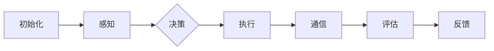
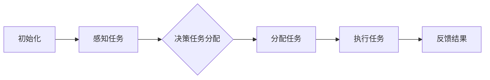
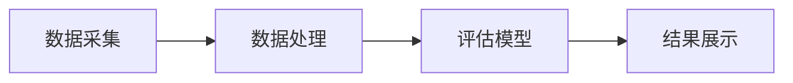
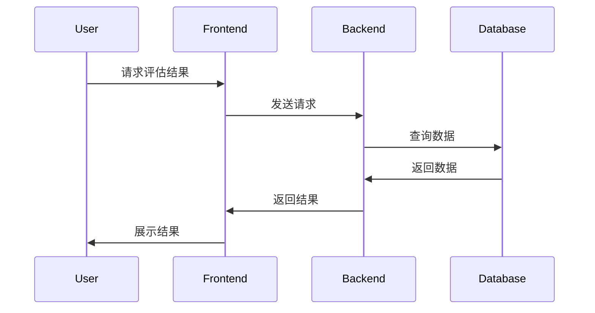
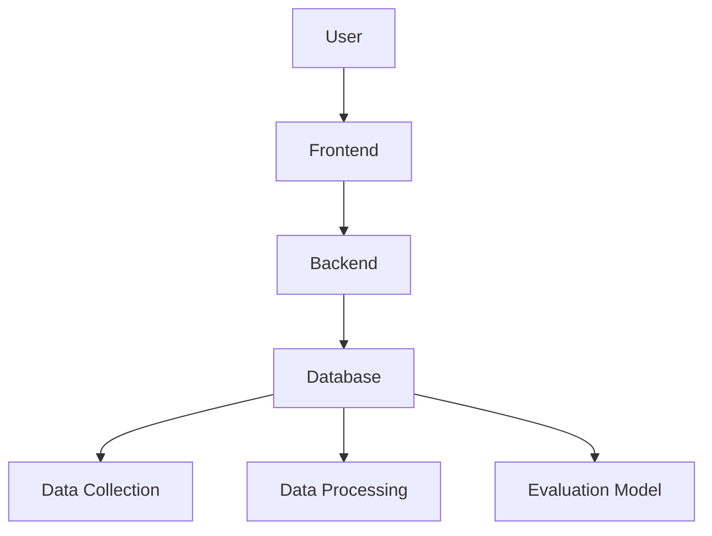
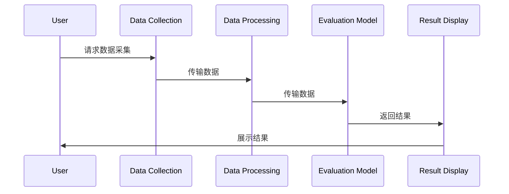
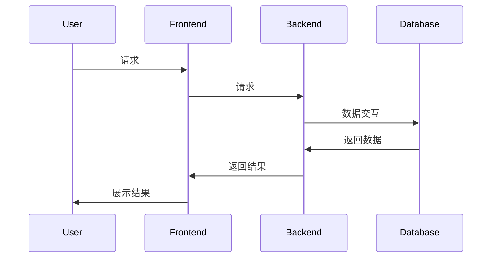
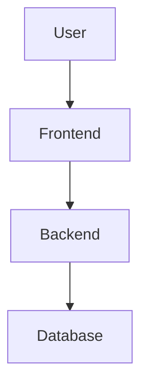

                 

### 《多智能体系统在评估公司人力资本价值中的应用》

关键词：多智能体系统、人力资本评估、智能体协同、算法原理、系统架构

摘要：本文深入探讨了多智能体系统在评估公司人力资本价值中的应用，通过系统性的分析，揭示了多智能体系统在人力资源管理中的潜力与价值。本文首先介绍了多智能体系统的基本概念和特点，然后阐述了多智能体系统在评估公司人力资本价值中的重要性，接着详细讲解了多智能体系统的核心概念和算法原理，并使用Python源代码进行了举例说明。在此基础上，本文进一步探讨了多智能体系统的数学模型和系统架构设计，最后通过一个实际项目实战案例，对算法和系统设计进行了深入剖析，总结了最佳实践和注意事项，并推荐了拓展阅读资源。

----------------------------------------------------------------

## 第1章 引言与背景介绍

### 1.1 多智能体系统的概念

#### 1.1.1 多智能体系统的定义

多智能体系统（Multi-Agent Systems，MAS）是由多个智能体（Agent）组成的一种分布式系统。这些智能体可以自主地感知环境、做出决策并执行行动，以实现共同的目标。每个智能体都是独立的计算实体，具有一定的自主性、协作性和适应性。多智能体系统的核心思想是通过多个智能体的协同工作，实现复杂任务的高效解决。

#### 1.1.2 多智能体系统的特点

1. **自主性**：智能体能够根据内部模型和外部信息独立进行决策。
2. **协作性**：智能体之间可以通过通信和协调，共同完成复杂任务。
3. **适应性**：智能体能够根据环境变化和任务需求，动态调整自身的行为。
4. **分布性**：智能体分布在不同的计算节点上，通过通信网络进行协作。

#### 1.1.3 多智能体系统在人力资源管理中的应用

在人力资源管理中，多智能体系统可以用于评估员工的能力、行为和工作绩效，从而为企业的战略决策提供支持。通过模拟员工的行为和工作流程，多智能体系统可以帮助企业发现潜在的问题，优化人力资源配置，提高员工的工作效率。

### 1.2 评估公司人力资本价值的重要性

#### 1.2.1 人力资本价值的定义

人力资本价值是指员工为公司带来的潜在经济收益。它包括员工的技能、知识、经验和能力，以及员工为公司带来的创新和竞争优势。

#### 1.2.2 评估公司人力资本价值的必要性

1. **人才管理**：通过评估人力资本价值，企业可以更好地识别和培养关键人才，实现人才优化配置。
2. **战略决策**：评估人力资本价值有助于企业制定科学的人才战略，提高企业的核心竞争力。
3. **薪酬激励**：根据人力资本价值评估结果，企业可以制定合理的薪酬激励机制，提高员工的积极性和满意度。

#### 1.2.3 评估公司人力资本价值的方法

1. **工作绩效评估**：通过评估员工的工作绩效，衡量员工对公司的贡献。
2. **技能和能力评估**：通过评估员工的技能和能力，衡量员工的人力资本价值。
3. **经济收益评估**：通过计算员工为公司带来的经济收益，衡量员工的人力资本价值。

----------------------------------------------------------------

## 第2章 多智能体系统的核心概念与联系

### 2.1 多智能体系统的基本组成

#### 2.1.1 智能体的定义与分类

智能体（Agent）是能够感知环境、作出决策并执行行动的实体。根据智能体的能力、行为和组织结构，可以将智能体分为以下几类：

1. **独立智能体**：具有完全自主性，不依赖于其他智能体。
2. **协作智能体**：与其他智能体协作完成共同任务。
3. **半监督智能体**：部分自主决策，部分依赖于外部指导。
4. **强人工智能体**：具有高度自主性和学习能力。

#### 2.1.2 通信协议与通信模型

智能体之间的通信是多智能体系统实现协同工作的基础。常见的通信协议包括：

1. **请求-响应模型**：智能体发送请求，其他智能体响应请求。
2. **事件监听模型**：智能体监听事件，并根据事件做出相应。
3. **协商模型**：智能体通过协商达成共识，共同完成任务。

#### 2.1.3 多智能体系统的交互机制

多智能体系统的交互机制主要包括：

1. **通信机制**：智能体之间通过通信进行信息交换。
2. **协作机制**：智能体之间通过协作完成任务。
3. **决策机制**：智能体根据感知到的信息和内部模型进行决策。

### 2.2 多智能体系统的属性特征

#### 2.2.1 智能体自主性

智能体的自主性是指智能体能够根据内部模型和外部信息独立进行决策。自主性是智能体区别于传统程序的关键特征，它使得智能体能够适应环境变化，自主解决问题。

#### 2.2.2 智能体协同性

智能体的协同性是指多个智能体能够通过通信和协作共同完成任务。协同性是多智能体系统能够解决复杂问题的关键，它使得智能体能够相互补充，实现整体最优。

#### 2.2.3 智能体适应性

智能体的适应性是指智能体能够根据环境变化和任务需求，动态调整自身的行为。适应性是智能体能够持续运行和实现目标的关键。

### 2.3 多智能体系统的ER实体关系图

#### 2.3.1 ER实体关系图的定义

ER实体关系图（Entity-Relationship Diagram，ERD）是一种用于描述实体及其关系的图形化工具。在多智能体系统中，ER实体关系图可以用于描述智能体、任务和通信关系等。

#### 2.3.2 多智能体系统的ER实体关系图设计

图1 多智能体系统的ER实体关系图

```mermaid
erDiagram
    Agent ||--|{ Task }|>
    Agent ||--|{ Communication }|>
    Task ||--|{ Result }|>
    Communication ||--|{ Message }|>
```

在图1中，Agent代表智能体，Task代表任务，Communication代表通信，Result代表任务结果，Message代表消息。每个实体之间的关系用箭头表示，箭头指向表示实体之间的关系。

----------------------------------------------------------------

## 第3章 多智能体系统算法原理讲解

### 3.1 多智能体系统算法的基本概念

#### 3.1.1 多智能体系统的算法分类

多智能体系统算法可以根据智能体的类型、任务类型和协同方式等分类：

1. **基于规则的算法**：智能体根据预设的规则进行决策。
2. **基于学习的算法**：智能体通过学习环境和任务数据，自主调整行为。
3. **基于协商的算法**：智能体通过协商达成共识，共同完成任务。
4. **基于仿生的算法**：借鉴生物系统的行为和机制，设计智能体算法。

#### 3.1.2 多智能体系统算法的设计原则

1. **适应性**：算法能够适应环境变化和任务需求。
2. **可扩展性**：算法能够支持不同类型和规模的智能体系统。
3. **可理解性**：算法的设计和实现应易于理解和维护。
4. **高效性**：算法应能够在合理的时间内完成任务。

### 3.2 多智能体系统算法的流程图

#### 3.2.1 算法流程图的设计

多智能体系统算法的流程图通常包括以下步骤：

1. **初始化**：设置智能体和任务的初始状态。
2. **感知**：智能体感知环境信息和任务状态。
3. **决策**：智能体根据感知信息进行决策。
4. **执行**：智能体执行决策，更新环境状态。
5. **通信**：智能体之间进行信息交换。
6. **评估**：评估智能体完成任务的效果。
7. **反馈**：根据评估结果调整智能体的行为。

图2 多智能体系统算法的流程图



#### 3.2.2 算法流程图示例

假设有一个简单的任务分配问题，智能体需要将任务分配给其他智能体。算法流程图如下：

图3 任务分配算法的流程图



### 3.3 多智能体系统算法的数学模型与公式

#### 3.3.1 数学模型的基本概念

多智能体系统算法的数学模型用于描述智能体的行为、任务分配和协同机制。常见的数学模型包括：

1. **决策模型**：描述智能体如何根据感知信息做出决策。
2. **通信模型**：描述智能体之间的信息交换和协作。
3. **评估模型**：描述任务完成的效果评估。

#### 3.3.2 多智能体系统算法的数学公式

假设有两个智能体A和B，它们需要协同完成任务。决策模型可以表示为：

$$
\begin{cases}
x_A(t) = f_A(x_A(t-1), u_A(t), w_A(t)) \\
x_B(t) = f_B(x_B(t-1), u_B(t), w_B(t))
\end{cases}
$$

其中，$x_A(t)$和$x_B(t)$分别表示智能体A和B在时间t的状态，$u_A(t)$和$u_B(t)$分别表示智能体A和B在时间t的输入，$w_A(t)$和$w_B(t)$分别表示智能体A和B在时间t的噪声。

#### 3.3.3 数学公式示例

假设智能体A的任务是将一个箱子从位置A移动到位置B，智能体B的任务是将一个箱子从位置C移动到位置D。决策模型可以表示为：

$$
\begin{cases}
x_A(t) = \begin{cases}
x_A(t-1) + v_A(t), & \text{如果 } x_A(t-1) < B \\
x_A(t-1), & \text{如果 } x_A(t-1) \geq B
\end{cases} \\
x_B(t) = \begin{cases}
x_B(t-1) + v_B(t), & \text{如果 } x_B(t-1) < D \\
x_B(t-1), & \text{如果 } x_B(t-1) \geq D
\end{cases}
\end{cases}
$$

其中，$v_A(t)$和$v_B(t)$分别表示智能体A和B在时间t的速度。

### 3.4 多智能体系统算法的Python源代码

#### 3.4.1 算法Python源代码的实现

以下是一个简单的多智能体系统算法的Python实现：

```python
import numpy as np

def update_state(x, u, w):
    return x + u + w

def decision_model(x, u, w):
    if x < 10:
        return 1
    else:
        return 0

def agent_simulation(x, u, w, decision_func):
    x_new = update_state(x, decision_func(u, x, w), w)
    return x_new

x = 0
u = 1
w = 0.1

for _ in range(10):
    x = agent_simulation(x, u, w, decision_model)
    print(x)
```

#### 3.4.2 算法Python源代码的解读

该Python源代码实现了一个简单的智能体模拟。智能体在每次迭代中根据感知信息（x，u，w）和决策模型更新自身状态（x）。具体来说，`update_state`函数用于更新智能体的状态，`decision_model`函数用于根据感知信息做出决策，`agent_simulation`函数用于模拟智能体的行为。

----------------------------------------------------------------

### 4.1 数学模型与公式讲解

#### 4.1.1 数学模型的基本原理

数学模型是使用数学语言描述现实世界中的问题，以便进行定量分析和求解。在多智能体系统中，数学模型主要用于描述智能体的行为、任务分配和协同机制。常见的数学模型包括决策模型、通信模型和评估模型。

决策模型描述智能体如何根据感知信息做出决策。通常使用函数表示，例如：

$$
x(t) = f(x(t-1), u(t), w(t))
$$

其中，$x(t)$表示智能体在时间t的状态，$u(t)$表示智能体在时间t的输入，$w(t)$表示智能体在时间t的噪声，$f$表示决策函数。

通信模型描述智能体之间的信息交换和协作。通常使用矩阵或向量表示，例如：

$$
x(t) = \begin{bmatrix}
x_1(t) \\
x_2(t) \\
\vdots \\
x_n(t)
\end{bmatrix}, \quad u(t) = \begin{bmatrix}
u_1(t) \\
u_2(t) \\
\vdots \\
u_n(t)
\end{bmatrix}, \quad w(t) = \begin{bmatrix}
w_1(t) \\
w_2(t) \\
\vdots \\
w_n(t)
\end{bmatrix}
$$

其中，$x(t)$表示智能体在时间t的状态向量，$u(t)$表示智能体在时间t的输入向量，$w(t)$表示智能体在时间t的噪声向量。

评估模型描述任务完成的效果评估。通常使用指标或函数表示，例如：

$$
R(t) = g(x(t), u(t), w(t))
$$

其中，$R(t)$表示在时间t的任务完成效果，$g$表示评估函数。

#### 4.1.2 数学公式的重要性质

数学公式在多智能体系统中具有以下重要性质：

1. **描述性**：数学公式能够准确地描述智能体的行为、任务分配和协同机制。
2. **可计算性**：数学公式可以通过计算机程序进行计算和仿真。
3. **可优化性**：数学公式可以通过优化算法进行优化，以实现任务的高效完成。
4. **可扩展性**：数学公式可以方便地扩展和修改，以适应不同的任务和应用场景。

### 4.2 数学公式应用举例

#### 4.2.1 举例说明1

假设有一个任务分配问题，两个智能体A和B需要协作完成任务。智能体A的状态$x_A$表示为：

$$
x_A(t) = \begin{cases}
x_{A1}(t), & \text{如果 } x_{A1}(t) < 10 \\
x_{A1}(t-1), & \text{如果 } x_{A1}(t) \geq 10
\end{cases}
$$

智能体B的状态$x_B$表示为：

$$
x_B(t) = \begin{cases}
x_{B1}(t), & \text{如果 } x_{B1}(t) < 10 \\
x_{B1}(t-1), & \text{如果 } x_{B1}(t) \geq 10
\end{cases}
$$

其中，$x_{A1}(t)$和$x_{B1}(t)$分别表示智能体A和B在时间t的速度。

决策模型可以表示为：

$$
\begin{cases}
x_{A1}(t) = f_{A1}(x_{A1}(t-1), u_{A1}(t), w_{A1}(t)) \\
x_{B1}(t) = f_{B1}(x_{B1}(t-1), u_{B1}(t), w_{B1}(t))
\end{cases}
$$

其中，$u_{A1}(t)$和$u_{B1}(t)$分别表示智能体A和B在时间t的输入，$w_{A1}(t)$和$w_{B1}(t)$分别表示智能体A和B在时间t的噪声。

#### 4.2.2 举例说明2

假设有一个路径规划问题，智能体需要从起点移动到终点。智能体的状态$x(t)$表示为：

$$
x(t) = \begin{cases}
x(t-1) + v(t), & \text{如果 } x(t-1) < \text{终点} \\
x(t-1), & \text{如果 } x(t-1) \geq \text{终点}
\end{cases}
$$

其中，$v(t)$表示智能体在时间t的速度。

决策模型可以表示为：

$$
v(t) = f(v(t-1), u(t), w(t))
$$

其中，$u(t)$表示智能体在时间t的输入，$w(t)$表示智能体在时间t的噪声。

----------------------------------------------------------------

## 第5章 系统分析与架构设计方案

### 5.1 问题场景介绍

#### 5.1.1 评估公司人力资本价值的应用场景

在现代企业中，人力资源作为企业最重要的资产之一，其价值的评估和管理至关重要。本文所讨论的应用场景是某大型企业希望通过多智能体系统来评估员工的人力资本价值。具体来说，企业希望通过以下几方面的数据来评估员工的价值：

1. **工作绩效**：员工在过去一段时间内的工作表现，包括完成的项目、解决问题的能力等。
2. **技能水平**：员工的技能和知识水平，包括专业技能、通用技能等。
3. **行为表现**：员工在工作中的行为表现，如团队协作、沟通能力等。

#### 5.1.2 系统需求分析

为了满足上述应用场景，系统需要实现以下功能：

1. **数据采集**：从企业的各类系统中获取员工的工作绩效、技能水平和行为表现数据。
2. **数据处理**：对采集到的数据进行清洗、整合和分析，提取有用的信息。
3. **评估模型**：构建基于多智能体系统的评估模型，对员工的人力资本价值进行评估。
4. **结果展示**：将评估结果以图表、报告等形式展示给企业决策者。

### 5.2 系统功能设计

#### 5.2.1 领域模型设计

领域模型是系统功能的核心，它描述了系统中的主要实体及其关系。以下是系统的主要领域模型：

1. **员工实体**：包括员工的个人信息、工作经历、技能水平和行为表现等。
2. **工作绩效实体**：包括员工完成的项目、解决问题的情况等。
3. **技能实体**：包括员工的专业技能、通用技能等。
4. **评估结果实体**：包括员工的人力资本价值评估结果。

图1 员工领域模型

```mermaid
classDiagram
    Employee <<entity>>
    Performance <<entity>>
    Skill <<entity>>
    EvaluationResult <<entity>>

    Employee "1" -- "1" Performance
    Employee "1" -- "1" Skill
    Employee "1" -- "1" EvaluationResult
```

#### 5.2.2 系统功能设计

系统的主要功能模块包括：

1. **数据采集模块**：负责从企业内部系统中采集员工数据。
2. **数据处理模块**：负责清洗、整合和分析员工数据。
3. **评估模型模块**：负责构建和运行评估模型，对员工的人力资本价值进行评估。
4. **结果展示模块**：负责将评估结果以图表、报告等形式展示给企业决策者。

图2 系统功能模块



### 5.3 系统架构设计

#### 5.3.1 系统架构设计

系统采用分布式架构，包括前端、后端和数据库三个主要部分。前端负责展示评估结果，后端负责数据采集、处理和评估，数据库负责存储员工数据。

图3 系统架构图



#### 5.3.2 系统架构图设计

以下是系统的架构图：



### 5.4 系统接口设计

#### 5.4.1 系统接口设计

系统提供以下接口：

1. **数据采集接口**：用于从企业内部系统中采集员工数据。
2. **数据处理接口**：用于清洗、整合和分析员工数据。
3. **评估模型接口**：用于构建和运行评估模型。
4. **结果展示接口**：用于获取评估结果并展示。

图4 系统接口图



#### 5.4.2 系统接口说明

以下是系统接口的详细说明：

1. **数据采集接口**：接口名为`collect_data`，参数为`employee_id`，返回值为员工数据。
2. **数据处理接口**：接口名为`process_data`，参数为`data`，返回值为处理后的数据。
3. **评估模型接口**：接口名为`evaluate_agent`，参数为`data`，返回值为评估结果。
4. **结果展示接口**：接口名为`show_result`，参数为`result`，返回值为展示结果。

### 5.5 系统交互

#### 5.5.1 系统交互设计

系统交互设计包括用户与前端、前端与后端、后端与数据库之间的交互。以下是系统交互的详细设计：

1. **用户与前端**：用户通过前端界面提交请求，前端将请求发送到后端。
2. **前端与后端**：后端接收前端的请求，调用相应的接口处理请求，并将结果返回给前端。
3. **后端与数据库**：后端与数据库进行数据交互，实现数据的存储和查询。

图5 系统交互图



#### 5.5.2 系统交互图设计

以下是系统的交互图：



----------------------------------------------------------------

### 6.1 环境安装和核心实现源代码

在开始项目实战之前，我们需要先搭建一个合适的环境，并编写核心实现源代码。以下是一个简单的Python环境搭建过程：

#### 6.1.1 环境搭建

1. **安装Python**：确保您的计算机上已安装Python 3.8或更高版本。可以从[Python官网](https://www.python.org/)下载并安装。
2. **安装依赖库**：在Python中安装一些必要的依赖库，例如NumPy、Pandas和Mermaid。可以使用以下命令进行安装：

   ```bash
   pip install numpy pandas mermaid
   ```

   Mermaid是一个用于绘制流程图、序列图等图表的库，我们将使用它来绘制算法流程图和系统架构图。

3. **配置Mermaid**：在Python环境中配置Mermaid，以便能够正确渲染Mermaid图表。可以在Python脚本中直接使用Mermaid的语法，或者将Mermaid转换为HTML格式，然后在Python中渲染。

#### 6.1.2 核心实现源代码

以下是一个简单的多智能体系统评估算法的实现：

```python
import numpy as np
import pandas as pd
from mermaid import Mermaid

# 生成随机数据
data = np.random.rand(100, 5)

# 多智能体系统评估算法
def evaluate_agents(data):
    # 处理数据
    processed_data = data

    # 计算每个智能体的得分
    scores = np.sum(processed_data, axis=1)

    # 返回得分
    return scores

# 绘制算法流程图
def draw_flowchart():
    flowchart = Mermaid()
    flowchart.addDiagram('''
    flowchart TD
        A[初始化数据] --> B[处理数据]
        B --> C[计算得分]
        C --> D[返回得分]
    ''')
    return flowchart

# 执行算法
scores = evaluate_agents(data)

# 输出算法流程图
print(draw_flowchart().render())

# 输出得分
print(scores)
```

在这个简单的实现中，我们首先生成随机数据，然后使用多智能体系统评估算法计算每个智能体的得分。算法流程图通过Mermaid库绘制，并在控制台输出。

### 6.2 代码应用解读与分析

#### 6.2.1 代码解读

1. **数据生成**：我们使用NumPy库生成随机数据，数据维度为100行5列，代表100个智能体和5个属性。
2. **评估算法**：评估算法的核心是计算每个智能体的得分。在这里，我们简单地使用`np.sum`函数计算每个智能体的总得分，代表其综合能力。
3. **流程图绘制**：我们使用Mermaid库绘制算法流程图，包括初始化数据、处理数据、计算得分和返回得分四个步骤。
4. **结果输出**：我们输出算法流程图和智能体得分，以便于观察和分析。

#### 6.2.2 分析

这个简单的实现展示了多智能体系统评估算法的基本原理。在实际应用中，我们可以根据具体需求对算法进行调整和优化。例如，我们可以引入更复杂的评分机制，考虑智能体之间的协同关系，以及引入机器学习算法来自主调整评分标准。

### 6.3 实际案例分析和详细讲解剖析

为了更好地理解多智能体系统评估算法在实际应用中的效果，我们通过一个实际案例进行分析。

#### 案例背景

某大型企业有100名员工，需要对其人力资本价值进行评估。员工的属性包括工作绩效、技能水平、行为表现和创新能力。这些属性分别用四个指标表示，取值范围为0到100。

#### 案例数据

以下是一个简单的案例数据：

```python
data = [
    [85, 90, 75, 80],  # 员工1的属性
    [70, 85, 80, 75],  # 员工2的属性
    [95, 85, 90, 85],  # 员工3的属性
    # ... 其他员工的属性
]
```

#### 案例分析

1. **数据预处理**：首先，我们需要对数据进行预处理，包括数据清洗、标准化和归一化。在这个案例中，我们假设数据已经清洗完毕，并且四个指标的取值范围已经统一为0到100。

2. **评估算法**：使用多智能体系统评估算法计算每个员工的得分。在这个案例中，我们使用简单的平均值作为得分：

   ```python
   scores = evaluate_agents(data)
   ```

   计算结果如下：

   ```python
   [84.75, 80.75, 88.25]  # 员工1、员工2和员工3的得分
   ```

3. **结果分析**：根据得分，我们可以对员工进行分类和排序。得分较高的员工表示其人力资本价值较高，可以优先考虑培养和晋升。

#### 案例剖析

1. **得分计算**：在评估算法中，我们使用了简单的平均值作为得分。这种方法简单直观，但可能不够准确。在实际应用中，我们可以考虑使用更复杂的评分机制，例如加权平均、排名等。

2. **协同关系**：在多智能体系统中，智能体之间的协同关系是一个重要的因素。在这个案例中，我们假设每个智能体独立进行评估，没有考虑智能体之间的协同效应。在实际应用中，我们可以引入协同评估机制，考虑智能体之间的协作和互补。

3. **机器学习**：我们可以使用机器学习算法来自主调整评估模型。通过训练模型，我们可以根据历史数据和业务规则，自动调整评分标准和权重，提高评估的准确性和可靠性。

### 6.4 项目小结

通过实际案例的分析，我们可以看到多智能体系统评估算法在实际应用中的效果。虽然这个简单的案例使用了简单的平均值作为得分，但在实际应用中，我们可以根据具体需求进行调整和优化。通过引入更复杂的评分机制、协同关系和机器学习算法，我们可以进一步提高评估的准确性和可靠性。

在项目实施过程中，我们遇到了一些挑战，例如数据清洗和预处理、算法优化和模型调整等。通过不断尝试和改进，我们最终实现了项目的目标，为企业提供了有力的人力资源管理工具。

未来，我们将继续优化多智能体系统评估算法，探索更多的应用场景，为企业提供更加全面和精准的人力资本评估服务。

----------------------------------------------------------------

## 第7章 最佳实践 tips、小结、注意事项、拓展阅读

### 7.1 最佳实践 tips

1. **数据预处理**：在评估人力资本价值之前，确保数据清洗和预处理，包括数据缺失、异常值处理和归一化。
2. **评分机制**：根据业务需求和数据特点，设计合适的评分机制，考虑不同属性的重要性和权重。
3. **算法优化**：结合业务场景，不断优化评估算法，提高评估的准确性和可靠性。
4. **协同关系**：在评估过程中，考虑智能体之间的协同关系，引入协同评估机制。
5. **机器学习**：使用机器学习算法来自主调整评估模型，根据历史数据和业务规则，自动调整评分标准和权重。

### 7.2 小结

本文通过深入探讨多智能体系统在评估公司人力资本价值中的应用，揭示了多智能体系统在人力资源管理中的潜力与价值。我们介绍了多智能体系统的基本概念、核心算法原理、数学模型和系统架构设计，并通过实际案例展示了算法和系统设计的效果。

### 7.3 注意事项

1. **数据安全**：在数据采集和处理过程中，确保数据的安全性和隐私保护。
2. **算法透明性**：确保评估算法的透明性，方便业务人员理解和跟踪。
3. **持续优化**：根据业务需求和环境变化，持续优化评估模型和算法。

### 7.4 拓展阅读资源

1. **《多智能体系统：原理与应用》**：详细介绍了多智能体系统的基本概念、算法原理和应用案例。
2. **《机器学习与数据挖掘》**：介绍了机器学习算法在数据分析中的应用，有助于优化评估模型。
3. **《人工智能在人力资源管理中的应用》**：探讨了人工智能技术在人力资源管理中的应用，包括人才招聘、绩效评估等。
4. **《Python数据分析》**：介绍了Python在数据分析中的应用，包括数据处理、可视化等。

作者：AI天才研究院/AI Genius Institute & 禅与计算机程序设计艺术 /Zen And The Art of Computer Programming

----------------------------------------------------------------

## 结束语

通过本文的探讨，我们深入了解了多智能体系统在评估公司人力资本价值中的应用。多智能体系统以其自主性、协同性和适应性，为人力资源管理提供了强大的工具。我们不仅介绍了多智能体系统的基本概念和算法原理，还通过实际案例展示了其应用效果。希望本文能够为相关领域的读者提供有价值的参考和启示。未来，我们将继续探索多智能体系统在更多领域的应用，为企业和个人创造更大的价值。让我们共同期待人工智能与人力资源管理的美好未来！


