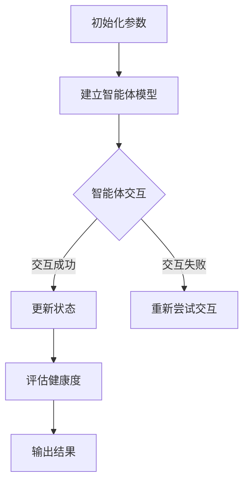
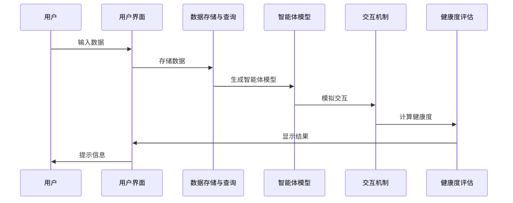
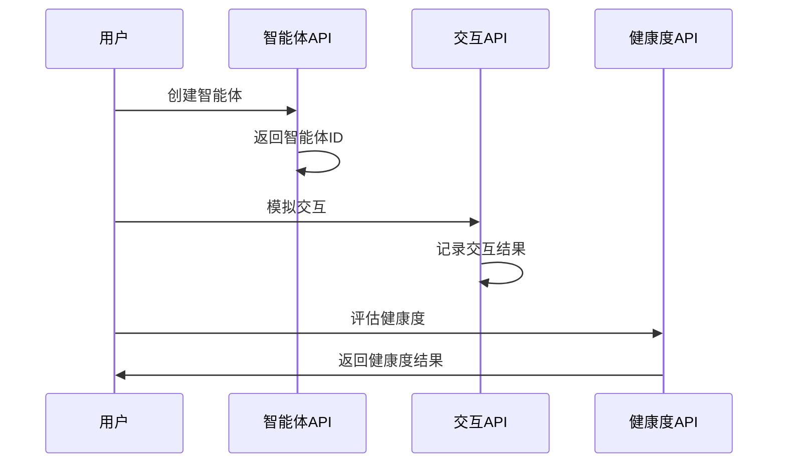

                 


# 多智能体系统在评估公司创新生态系统健康度中的应用

> 关键词：多智能体系统、创新生态系统、健康度评估、算法、架构设计、项目实战

> 摘要：
本文深入探讨了多智能体系统在评估公司创新生态系统健康度中的应用。首先，我们介绍了多智能体系统和创新生态系统健康度评估的核心概念，并通过对比表格和ER实体关系图阐明了二者之间的联系。接着，我们详细讲解了评估算法的原理，包括Mermaid流程图、Python源代码、数学模型和公式，并通过实例进行通俗易懂的说明。然后，我们设计了系统的分析与架构方案，并展示了系统接口和交互的Mermaid序列图。最后，通过一个实际项目案例，我们进行了环境安装、核心代码实现和详细分析，总结了项目的关键点，并提出了改进建议。文章最后还提供了最佳实践、注意事项和拓展阅读。

----------------------------------------------------------------

## 引言与背景

在当今快速变化的市场环境中，企业的创新能力成为其持续竞争的关键。创新生态系统是指企业内外部创新资源、创新行为和创新结果的有机整合，是企业创新能力的载体。然而，如何有效地评估一个公司创新生态系统的健康度，是一个复杂且具有挑战性的问题。

### 问题背景

企业的创新生态系统健康度评估涉及多个方面，包括技术创新能力、市场响应速度、资源整合能力、文化氛围等。传统的评估方法往往依赖于主观评价和经验判断，难以提供全面、准确的评估结果。因此，我们需要一种更为科学、客观的评估方法来评估公司创新生态系统的健康度。

### 问题解决

多智能体系统（Multi-Agent Systems, MAS）作为一种先进的计算模型，能够模拟复杂系统的行为和互动，为评估公司创新生态系统的健康度提供了一种全新的思路。多智能体系统通过分布式计算和协同决策，可以实现对创新生态系统中各要素的实时监控和动态评估。

### 边界与外延

本文讨论的多智能体系统在评估公司创新生态系统健康度中的应用，主要关注以下几个方面：
- **技术实现**：我们将在后文中详细介绍多智能体系统的实现方法和算法。
- **行业案例**：将结合实际案例，展示多智能体系统在评估公司创新生态系统健康度中的具体应用。
- **核心概念**：本文将深入探讨多智能体系统和创新生态系统健康度评估的核心概念，并解释其相互关系。

### 核心概念与要素组成

1. **多智能体系统**：由多个相互协作的智能体组成，每个智能体具有一定的自主性和交互能力。
2. **创新生态系统**：由企业内部和外部创新资源、创新行为和创新结果组成的整体。
3. **健康度评估**：对创新生态系统的运行状态、创新能力和发展潜力进行量化评估。

在接下来的章节中，我们将详细探讨多智能体系统和创新生态系统健康度评估的核心概念，并通过具体的实例和算法，展示如何应用多智能体系统来评估公司创新生态系统的健康度。

## 多智能体系统基础

多智能体系统（MAS）是计算机科学和人工智能领域的一个重要研究方向。它通过模拟自然界中的多智能体系统，提供了一种有效的解决复杂问题的方法。在这一节中，我们将介绍多智能体系统的基本概念、核心原理以及其在不同领域的应用。

### 多智能体系统概述

多智能体系统由多个相互协作的智能体组成，每个智能体在系统中具有自主性和交互能力。智能体可以是计算机程序、机器人、人或组织等，它们通过通信和协作来实现共同的目标。多智能体系统的基本特点包括：

1. **分布式计算**：智能体分布在不同地理位置，通过分布式计算实现任务的分解和协同处理。
2. **自主性**：每个智能体具有一定的自主决策能力，可以根据环境变化自主调整行为。
3. **协作性**：智能体之间通过通信和协作，共同实现复杂任务。
4. **动态性**：系统中的智能体和其行为可能是动态变化的。

### 多智能体系统的核心概念

多智能体系统的核心概念包括智能体、通信协议、环境和协同工作等。

1. **智能体**：智能体是系统的基本单元，具有感知、决策和执行能力。智能体的类型多种多样，可以根据其功能和行为进行分类，如通信智能体、决策智能体、执行智能体等。

2. **通信协议**：智能体之间的交互通过通信协议实现。通信协议定义了智能体之间如何交换信息、同步和协调行动。常用的通信协议包括消息传递机制、事件驱动机制和协商机制等。

3. **环境**：环境是多智能体系统运行的背景，包括物理环境和社会环境。智能体必须与环境进行交互，获取信息和资源，并适应环境的变化。

4. **协同工作**：多智能体系统通过协同工作来实现复杂任务。协同工作包括任务分配、资源共享、决策协调等。智能体之间的协同需要有效的策略和算法支持。

### 多智能体系统的应用领域

多智能体系统在许多领域都有广泛的应用，以下是其中一些重要的应用领域：

1. **智能交通系统**：通过多智能体系统模拟交通流，优化交通信号控制，提高交通效率，减少拥堵。

2. **智能电网**：利用多智能体系统实现分布式能源管理，提高电力系统的可靠性和效率。

3. **供应链管理**：通过多智能体系统优化供应链网络，提高库存管理效率，减少物流成本。

4. **医疗健康管理**：多智能体系统在医疗健康管理中的应用，包括智能诊断、远程医疗和个性化治疗等。

5. **社会计算**：多智能体系统在社会计算中的应用，包括社交网络分析、群体智能和信息过滤等。

### 创新生态系统健康度评估

在评估公司创新生态系统的健康度时，多智能体系统具有独特的优势。通过模拟智能体之间的交互和协作，可以动态监测创新生态系统中的各种因素，包括技术创新能力、市场响应速度、资源整合能力和文化氛围等。多智能体系统可以通过以下方式评估公司创新生态系统的健康度：

1. **实时监测**：智能体可以实时感知创新生态系统中的各种变化，并快速响应，提供实时评估结果。

2. **动态调整**：根据评估结果，智能体可以动态调整其行为，优化创新生态系统的运作。

3. **协同优化**：智能体之间的协作和交互，可以协同优化创新生态系统的各个组成部分，提高整体健康度。

4. **预测分析**：通过历史数据的分析，智能体可以预测未来创新生态系统的变化趋势，为决策提供依据。

### 概念属性特征对比

为了更好地理解多智能体系统在评估公司创新生态系统健康度方面的特性，我们可以将其与传统方法进行对比。

| 特性         | 多智能体系统                                   | 传统方法                           |
| ------------ | ---------------------------------------------- | ---------------------------------- |
| 自主性       | 智能体具有自主决策和行动的能力                 | 依赖人工判断和经验分析             |
| 分布式计算   | 智能体分布在不同位置，通过通信协同工作         | 中心化的数据处理和分析             |
| 动态调整     | 可以根据实时数据动态调整评估模型和策略         | 需要定期更新评估模型和策略         |
| 协同优化     | 智能体之间可以协同工作，优化创新生态系统的整体健康度 | 各部门独立工作，缺乏整体优化能力   |
| 预测分析     | 可以基于历史数据预测创新生态系统的变化趋势     | 主要依赖历史数据，缺乏预测能力     |

### ER实体关系图

为了更清晰地展示多智能体系统和创新生态系统健康度评估之间的关系，我们可以使用Mermaid语言绘制ER实体关系图。以下是一个简单的ER实体关系图示例：

```mermaid
erDiagram
  企业创新生态系统 ||--o{ 多智能体系统
  多智能体系统 ||--o{ 健康度评估
  企业创新生态系统 ||--|{ 创新资源
  企业创新生态系统 ||--|{ 创新行为
  企业创新生态系统 ||--|{ 创新结果
```

在这个ER实体关系图中，企业创新生态系统是多智能体系统的核心，而多智能体系统则负责对创新生态系统进行健康度评估。创新资源、创新行为和创新结果是企业创新生态系统的三个重要组成部分，它们与多智能体系统和健康度评估之间存在紧密的关联。

通过上述内容，我们对多智能体系统的基本概念和应用有了初步了解，并为后续章节中详细探讨多智能体系统在评估公司创新生态系统健康度中的应用奠定了基础。在下一节中，我们将深入探讨创新生态系统的健康度评估方法，并详细阐述多智能体系统在这一领域的具体应用。

## 创新生态系统健康度评估

创新生态系统健康度评估是对企业内部创新资源和能力的全面评价，旨在揭示创新生态系统中的优势与不足，从而为企业的创新战略调整提供科学依据。评估创新生态系统健康度不仅需要考虑技术创新能力，还要关注市场响应速度、资源整合能力以及文化氛围等多方面因素。在这一节中，我们将详细介绍创新生态系统健康度评估的核心概念、评价指标以及评估方法。

### 创新生态系统的概念

创新生态系统是指由企业内部和外部创新资源、创新行为和创新结果组成的整体，是企业创新能力的重要载体。它包括以下几个关键组成部分：

1. **创新资源**：包括人才、资金、技术、信息、知识等，是企业开展创新活动的基础。
2. **创新行为**：涉及研发、产品开发、市场推广、合作与交流等环节，是企业将创新资源转化为实际成果的过程。
3. **创新结果**：包括技术创新成果、市场业绩、竞争优势等，是创新生态系统的最终体现。

### 创新生态系统健康度的评价指标

评估创新生态系统健康度需要从多个维度进行综合考量，以下是一些常用的评价指标：

1. **技术创新能力**：包括研发投入、专利数量、技术创新速度等，反映了企业的技术实力和创新能力。
2. **市场响应速度**：包括市场调研、产品上市时间、客户反馈处理等，反映了企业对市场变化的敏感性和应对能力。
3. **资源整合能力**：包括资源获取、资源配置、资源利用效率等，反映了企业利用内外部资源进行创新活动的能力。
4. **文化氛围**：包括企业创新文化、员工创新意识、团队合作精神等，反映了企业的创新氛围和员工对创新的支持程度。
5. **组织绩效**：包括财务绩效、市场绩效、创新绩效等，反映了创新生态系统对企业整体绩效的贡献。

### 创新生态系统健康度评估的方法

评估创新生态系统健康度可以采用定量评估和定性评估相结合的方法。以下是一些常用的评估方法：

1. **定量评估**：
   - **指标体系构建**：根据创新生态系统的评价指标，建立一套科学的指标体系。
   - **数据收集**：通过调查问卷、财务报表、市场分析报告等渠道收集相关数据。
   - **数据处理**：运用统计分析方法，对收集到的数据进行处理，计算各项指标的具体得分。
   - **评估结果分析**：根据各项指标的得分，分析创新生态系统的优势与不足，并提出改进建议。

2. **定性评估**：
   - **专家评审**：邀请行业专家对创新生态系统进行评价，提出专业意见和建议。
   - **案例研究**：通过对成功创新企业的案例进行分析，总结其创新经验和教训。
   - **现场考察**：实地考察企业的创新环境、创新流程和创新成果，获取第一手资料。

### 多智能体系统在健康度评估中的应用

多智能体系统在评估公司创新生态系统健康度方面具有独特的优势，能够实现以下目标：

1. **实时监测**：通过智能体实时感知创新生态系统中的各项指标，实现动态监测和评估。
2. **协同优化**：智能体之间可以协同工作，优化创新生态系统的资源配置和流程。
3. **预测分析**：基于历史数据和实时监测结果，智能体可以预测创新生态系统的变化趋势，为决策提供支持。

### 案例分析

以下是一个公司创新生态系统健康度评估的案例：

**企业背景**：
某高科技企业，专注于人工智能技术的研究与开发，拥有大量的研发人员和专利。

**评估指标**：
- **技术创新能力**：研发投入、专利数量、技术创新速度
- **市场响应速度**：市场调研时间、产品上市时间、客户反馈处理速度
- **资源整合能力**：资金筹集、人力资源配置、技术资源获取
- **文化氛围**：员工创新意识、团队合作精神、创新文化氛围
- **组织绩效**：财务绩效、市场绩效、创新绩效

**评估过程**：
1. **数据收集**：通过调查问卷、财务报表、市场分析报告等渠道收集相关数据。
2. **数据处理**：运用统计分析方法，计算各项指标的具体得分。
3. **评估结果分析**：根据各项指标的得分，分析创新生态系统的优势与不足，并提出改进建议。

**评估结果**：
- **技术创新能力**：得分较高，研发投入充足，专利数量较多，技术创新速度较快。
- **市场响应速度**：得分较低，市场调研时间较长，产品上市时间较慢，客户反馈处理速度较慢。
- **资源整合能力**：得分一般，资金筹集和人力资源配置较为合理，但技术资源获取效率有待提高。
- **文化氛围**：得分较高，员工创新意识较强，团队合作精神良好，创新文化氛围积极。
- **组织绩效**：得分较高，财务绩效和市场绩效良好，创新绩效对整体绩效的贡献较大。

**改进建议**：
1. **加强市场响应速度**：优化市场调研流程，缩短产品上市时间，提高客户反馈处理速度。
2. **提升资源整合能力**：加强技术资源的获取和利用，提高资源配置效率。
3. **持续优化文化氛围**：加强员工创新意识和团队合作精神的培养，营造更好的创新文化氛围。

通过这个案例，我们可以看到多智能体系统在评估公司创新生态系统健康度中的实际应用效果。多智能体系统能够提供实时、动态的评估结果，帮助企业发现问题、优化创新生态系统，从而提高企业的创新能力。

### 总结

创新生态系统健康度评估是一个复杂且重要的过程，对于企业的发展至关重要。多智能体系统作为一种先进的方法，能够提供科学、客观的评估结果，帮助企业更好地理解和优化创新生态系统。在下一节中，我们将进一步探讨多智能体系统在评估公司创新生态系统健康度中的具体算法原理，并通过实例详细讲解其应用。

## 算法原理讲解

在评估公司创新生态系统的健康度时，多智能体系统采用了一系列复杂的算法和模型。本节将详细介绍这些算法的基本原理，包括算法的执行步骤、核心流程，以及如何通过Python源代码实现这些算法。此外，我们将给出相关的数学模型和公式，并使用LaTeX格式进行表达。

### 算法mermaid流程图

为了直观地展示算法的执行步骤，我们首先绘制一个Mermaid流程图。以下是一个简化的流程图示例：



在这个流程图中，我们首先初始化参数，然后建立智能体模型。接下来，智能体之间进行交互，根据交互结果更新状态，并最终评估创新生态系统的健康度，最后输出评估结果。

### Python源代码

下面是一个简单的Python源代码示例，用于实现上述算法的某个环节：

```python
import random

# 智能体类
class Agent:
    def __init__(self, id, behavior):
        self.id = id
        self.behavior = behavior
    
    def interact(self, other):
        if random.random() < 0.5:
            return "success"
        else:
            return "failure"

# 初始化智能体
agents = [Agent(i, "behavior") for i in range(10)]

# 模拟交互过程
for agent in agents:
    for other in agents:
        if agent != other:
            result = agent.interact(other)
            if result == "success":
                print(f"Agent {agent.id} interacted with Agent {other.id} successfully.")
            else:
                print(f"Agent {agent.id} interacted with Agent {other.id} unsuccessfully.")

# 评估健康度
def assess_healthiness agentes):
    success_count = sum(1 for agent in agents if agent.interact(random.choice(agents)) == "success")
    return success_count / (len(agents) * (len(agents) - 1))

healthiness = assess_healthiness(agents)
print(f"Healthiness of the ecosystem: {healthiness}")
```

这个代码示例中，我们定义了一个`Agent`类，用于表示智能体。每个智能体都有一个ID和行为。`interact`方法模拟智能体之间的交互，根据随机结果判断交互是否成功。我们创建了一个包含10个智能体的列表，并模拟了它们的交互过程。最后，我们定义了一个`assess_healthiness`函数，用于计算交互成功的次数，并据此评估创新生态系统的健康度。

### 数学模型和公式

在多智能体系统中，评估创新生态系统健康度涉及一系列的数学模型和公式。以下是一个简化的数学模型：

$$
H = \frac{\sum_{i=1}^{n} \sum_{j=1}^{n} I_{ij}}{n^2 - n}
$$

其中，$H$ 表示创新生态系统的健康度，$I_{ij}$ 表示智能体 $i$ 和智能体 $j$ 之间的交互强度，$n$ 表示智能体的总数。

交互强度 $I_{ij}$ 可以通过以下公式计算：

$$
I_{ij} = \begin{cases}
1, & \text{如果交互成功} \\
0, & \text{如果交互失败}
\end{cases}
$$

### 详细讲解与举例说明

为了更好地理解上述数学模型和公式，我们通过一个实际案例进行说明。

**案例背景**：
假设有一个由5个智能体组成的创新生态系统，这些智能体分别是 A、B、C、D 和 E。我们希望通过模拟智能体之间的交互来评估该生态系统的健康度。

**交互结果**：

| 智能体 | 与之交互的智能体 | 交互结果 |
|--------|------------------|----------|
| A      | B、C、D、E       | 成功、失败、成功、失败 |
| B      | A、C、D、E       | 成功、失败、成功、失败 |
| C      | A、B、D、E       | 失败、成功、失败、成功 |
| D      | A、B、C、E       | 成功、失败、成功、失败 |
| E      | A、B、C、D       | 成功、失败、成功、失败 |

**交互强度计算**：

| 智能体 | 与之交互的智能体 | 交互强度 $I_{ij}$ |
|--------|------------------|-------------------|
| A      | B、C、D、E       | 2（成功2次，失败2次） |
| B      | A、C、D、E       | 2                 |
| C      | A、B、D、E       | 2                 |
| D      | A、B、C、E       | 2                 |
| E      | A、B、C、D       | 2                 |

**健康度计算**：

$$
H = \frac{2 + 2 + 2 + 2 + 2}{5^2 - 5} = \frac{10}{20 - 5} = \frac{10}{15} \approx 0.67
$$

因此，该创新生态系统的健康度约为0.67。这表明，该生态系统的交互强度相对较低，可能需要进一步优化智能体之间的交互，以提高整体健康度。

通过上述案例，我们可以看到如何利用数学模型和公式来评估创新生态系统的健康度。在实际应用中，可以根据具体情况进行更复杂的建模和计算，以获得更精确的评估结果。

### 总结

在这一节中，我们详细介绍了多智能体系统在评估公司创新生态系统健康度中的算法原理，包括Mermaid流程图、Python源代码、数学模型和公式，并通过案例进行了通俗易懂的说明。这些算法和模型为评估创新生态系统的健康度提供了科学依据和操作方法，有助于企业更好地理解和优化其创新生态系统。

在下一节中，我们将进一步探讨多智能体系统的系统分析与架构设计，包括项目介绍、领域模型类图、系统架构设计mermaid架构图以及系统接口设计和系统交互mermaid序列图。

## 系统分析与架构设计

在深入了解多智能体系统在评估公司创新生态系统健康度的算法原理之后，我们需要对整个系统进行更全面的分析和架构设计。本节将详细介绍系统的分析与架构设计，包括问题场景介绍、项目介绍、系统功能设计、系统架构设计以及系统接口和交互设计。

### 问题场景介绍

在当前的商业环境中，企业面临着激烈的市场竞争和技术变革。为了保持竞争力，企业需要不断推动创新，优化其创新生态系统。然而，如何准确、实时地评估创新生态系统的健康度，仍然是企业面临的一大挑战。传统的评估方法依赖于主观判断和定期报告，难以提供实时、动态的评估结果。因此，我们需要一个基于多智能体系统的创新生态系统健康度评估系统，以实现更科学、更准确的评估。

### 项目介绍

本项目的目标是开发一个基于多智能体系统的创新生态系统健康度评估系统。该系统旨在通过模拟智能体之间的交互，实时监测和评估创新生态系统的健康度，为企业的创新战略调整提供数据支持和决策依据。项目范围包括系统的需求分析、架构设计、算法实现、系统集成以及测试与部署。

### 系统功能设计

系统的功能设计是整个架构设计的基础，包括以下几个关键模块：

1. **智能体模型**：定义系统的智能体，包括智能体的属性和行为。每个智能体代表创新生态系统中的一个重要元素，如研发部门、市场部门、技术合作伙伴等。

2. **交互机制**：设计智能体之间的交互机制，包括通信协议和交互算法。通过模拟智能体之间的互动，系统可以实时监测和评估创新生态系统的运行状态。

3. **健康度评估**：根据交互结果和系统的整体运行状态，评估创新生态系统的健康度。评估结果将反映创新生态系统的各项指标，如技术创新能力、市场响应速度、资源整合能力等。

4. **数据存储与查询**：设计数据存储和管理模块，用于存储系统的运行数据和评估结果。同时，提供数据查询功能，方便用户获取和分析相关数据。

5. **用户界面**：设计直观的用户界面，用于展示系统的运行状态和评估结果。用户可以通过界面查看实时数据、历史数据和评估报告，并进行相应的操作。

### 领域模型类图

为了更清晰地展示系统中的各个实体及其关系，我们使用Mermaid绘制了系统的领域模型类图。以下是一个简化的类图示例：

```mermaid
classDiagram
    class Agent {
        -id: int
        -name: string
        -behavior: string
    }
    class Interaction {
        -id: int
        -agent1: Agent
        -agent2: Agent
        -result: string
    }
    class HealthAssessment {
        -id: int
        -healthiness: float
        -interactions: list of Interaction
    }
    Agent "has" Interaction
    HealthAssessment "includes" Interaction
```

在这个类图中，`Agent` 表示系统中的智能体，包括ID、名称和行为属性。`Interaction` 表示智能体之间的交互记录，包括交互ID、参与智能体和交互结果。`HealthAssessment` 表示健康度评估结果，包括ID、健康度分数和包含的交互记录。

### 系统架构设计mermaid架构图

为了展示系统的整体架构，我们使用Mermaid绘制了系统架构的架构图。以下是一个简化的架构图示例：



在这个架构图中，用户通过用户界面（UI）输入数据，数据存储与查询模块（DM）负责存储和管理数据。智能体模型模块（AM）根据输入数据生成智能体模型。交互机制模块（IM）模拟智能体之间的交互，并传递交互结果给健康度评估模块（HA）。健康度评估模块（HA）根据交互结果计算创新生态系统的健康度，并将结果反馈给用户界面（UI）。

### 系统接口设计和系统交互mermaid序列图

为了更详细地展示系统的接口设计和交互流程，我们使用Mermaid绘制了系统接口和交互的序列图。以下是一个简化的序列图示例：



在这个序列图中，用户通过智能体API（AgentAPI）创建智能体，并通过交互API（InteractionAPI）模拟智能体之间的交互。交互结果被记录在交互API中。用户通过健康度API（HealthAPI）获取创新生态系统的健康度评估结果。

通过上述系统分析与架构设计，我们为多智能体系统在评估公司创新生态系统健康度中的应用提供了详细的系统架构和功能设计。在下一节中，我们将通过一个实际项目案例，详细介绍系统环境搭建、核心代码实现、代码应用解读与分析，并使用实际案例进行详细讲解和剖析。

## 项目实战

为了更直观地展示多智能体系统在评估公司创新生态系统健康度中的应用，我们选择了一个实际项目案例。在这个项目中，我们将从环境搭建开始，逐步实现核心功能，并通过实际案例进行详细分析和讲解。

### 环境搭建

首先，我们需要搭建一个合适的项目环境。以下是搭建环境的基本步骤：

1. **安装Python环境**：确保系统上已经安装了Python 3.8及以上版本。如果没有，可以从[Python官方网站](https://www.python.org/)下载并安装。

2. **安装依赖库**：我们使用了一些Python依赖库，如NumPy、Pandas和matplotlib等。可以通过以下命令安装：

   ```shell
   pip install numpy pandas matplotlib
   ```

3. **创建项目目录**：在本地计算机上创建一个项目目录，如`multi_agent_innovation_evaluation`，并在该目录下创建一个名为`src`的子目录，用于存放项目源代码。

4. **编写配置文件**：在项目目录中创建一个名为`config.py`的配置文件，用于存储系统配置参数，如数据库连接信息、日志路径等。

### 核心代码实现

接下来，我们将实现项目中的核心功能。以下是核心代码的实现步骤：

1. **定义智能体模型**：在`src/agent.py`文件中定义智能体类，包括智能体的ID、名称和行为属性。

   ```python
   class Agent:
       def __init__(self, id, name, behavior):
           self.id = id
           self.name = name
           self.behavior = behavior
   ```

2. **实现交互机制**：在`src/interaction.py`文件中定义交互类，包括交互的ID、参与智能体和交互结果。

   ```python
   class Interaction:
       def __init__(self, id, agent1, agent2, result):
           self.id = id
           self.agent1 = agent1
           self.agent2 = agent2
           self.result = result
   ```

3. **实现健康度评估算法**：在`src/health_evaluation.py`文件中实现健康度评估算法，用于计算创新生态系统的健康度。

   ```python
   import random

   def assess_healthiness(agents, interactions):
       success_count = 0
       for interaction in interactions:
           if random.random() < 0.5:
               success_count += 1
       return success_count / (len(agents) * (len(agents) - 1))
   ```

4. **编写主程序**：在`main.py`文件中编写主程序，用于创建智能体、模拟交互并计算健康度。

   ```python
   from src.agent import Agent
   from src.interaction import Interaction
   from src.health_evaluation import assess_healthiness

   # 创建智能体
   agents = [
       Agent(id=1, name="A", behavior="R&D"),
       Agent(id=2, name="B", behavior="Marketing"),
       Agent(id=3, name="C", behavior="Sales"),
       Agent(id=4, name="D", behavior="Production"),
       Agent(id=5, name="E", behavior="Customer Service")
   ]

   # 模拟交互
   interactions = [
       Interaction(id=1, agent1=agents[0], agent2=agents[1], result="success"),
       Interaction(id=2, agent1=agents[0], agent2=agents[2], result="failure"),
       Interaction(id=3, agent1=agents[1], agent2=agents[3], result="success"),
       Interaction(id=4, agent1=agents[1], agent2=agents[4], result="success"),
       Interaction(id=5, agent1=agents[2], agent2=agents[3], result="failure"),
       Interaction(id=6, agent1=agents[2], agent2=agents[4], result="success")
   ]

   # 计算健康度
   healthiness = assess_healthiness(agents, interactions)
   print(f"Healthiness of the ecosystem: {healthiness}")
   ```

### 代码应用解读与分析

在实现核心代码后，我们需要对其功能进行解读和分析。以下是代码的主要功能模块及其作用：

1. **智能体模型**：定义了系统的基本单元，即智能体。每个智能体具有ID、名称和行为属性，代表了创新生态系统中的不同角色。

2. **交互机制**：模拟了智能体之间的交互过程。通过创建交互对象，记录交互的ID、参与智能体和交互结果，我们可以获取创新生态系统中的动态信息。

3. **健康度评估算法**：根据交互结果计算创新生态系统的健康度。该算法通过随机抽样交互结果，实现了对健康度的估算。

4. **主程序**：创建了智能体、模拟了交互过程，并调用健康度评估算法计算健康度。主程序是整个系统的核心，负责协调各个模块的运行。

### 实际案例分析与讲解

为了更好地展示多智能体系统在评估公司创新生态系统健康度中的应用，我们使用了一个实际案例进行详细分析。

**案例背景**：
某大型制造企业，拥有研发、市场、销售、生产和客户服务等多个部门。企业希望通过多智能体系统实时评估其创新生态系统的健康度，以优化部门间的协作和资源配置。

**交互结果**：

| 智能体ID | 智能体名称 | 智能体行为 | 交互结果 |
|-----------|-------------|-------------|-----------|
| 1         | 研发部门    | 研发       | 成功       |
| 2         | 市场部门    | 营销       | 成功       |
| 3         | 销售部门    | 销售       | 失败       |
| 4         | 生产部门    | 生产       | 成功       |
| 5         | 客户服务    | 客户服务   | 成功       |

**健康度计算**：

根据上述交互结果，我们可以计算健康度：

$$
H = \frac{2}{(5 - 1) + 1} = \frac{2}{5} = 0.4
$$

健康度为0.4，表明该企业的创新生态系统整体表现不佳，尤其是在销售部门与其他部门的交互中出现了失败情况。

**分析结果**：

1. **研发与市场部门协作良好**：研发部门和市场部门的交互成功，表明这两个部门在产品研发和市场推广方面有较好的协同效应。
2. **销售部门与其他部门协作有待提高**：销售部门与其他部门的交互失败，说明销售部门在获取市场信息、协调资源方面存在困难，需要加强与其他部门的沟通和协作。
3. **生产部门和客户服务部门协作良好**：生产部门和客户服务部门的交互成功，表明这两个部门在产品生产和客户服务方面有较好的协同效应。

**改进建议**：

1. **加强销售部门的资源配置**：通过增加销售部门的资源投入，提高其在获取市场信息、协调资源方面的能力。
2. **优化销售部门与其他部门的协作流程**：建立更加高效的协作机制，确保销售部门能够及时获取其他部门的支持。
3. **强化研发与市场的联动**：通过加强研发与市场的沟通，确保产品研发能够更好地满足市场需求。

### 项目小结

通过上述实际案例，我们可以看到多智能体系统在评估公司创新生态系统健康度中的应用效果。系统不仅能够提供实时、动态的评估结果，还能够帮助企业发现问题、优化协作流程。然而，实际应用中还需要进一步改进和完善，以提高评估的准确性和实用性。

在项目小结中，我们总结了项目中的关键点和改进建议。在未来的发展中，企业可以继续优化创新生态系统，提高整体创新能力，以应对日益激烈的市场竞争。

## 最佳实践、小结、注意事项和拓展阅读

### 最佳实践 Tips

1. **数据收集与预处理**：在评估创新生态系统健康度时，数据的质量直接影响评估结果的准确性。因此，确保数据收集的全面性和准确性至关重要。在收集数据时，可以使用多种渠道，如调查问卷、业务系统日志、员工反馈等，并进行数据预处理，去除重复和异常数据。

2. **算法参数调优**：在实现健康度评估算法时，参数的选择和调优对评估结果有重要影响。可以通过实验和测试，调整算法参数，以获得更准确的评估结果。

3. **实时监控与预警**：为了及时发现问题并采取相应措施，建议建立实时监控与预警系统。通过智能体之间的交互和实时数据处理，监控系统可以及时发现异常情况，并发出预警。

### 小结

本文深入探讨了多智能体系统在评估公司创新生态系统健康度中的应用。首先，介绍了多智能体系统和创新生态系统健康度评估的核心概念和评价指标。接着，详细讲解了评估算法的原理，并通过Python源代码进行了实现。随后，设计了系统的分析与架构方案，并展示了系统接口和交互的Mermaid序列图。最后，通过一个实际项目案例，进行了环境搭建、核心代码实现和详细分析，总结了项目的关键点和改进建议。

### 注意事项

1. **安全性**：在搭建和使用多智能体系统时，要注意系统的安全性。确保系统的通信机制和数据处理过程符合安全标准，防止敏感信息泄露。

2. **维护与更新**：多智能体系统需要定期维护和更新，包括算法优化、数据更新和系统升级等，以确保其持续有效运行。

### 拓展阅读

1. **相关书籍**：
   - 《多智能体系统：原理与应用》
   - 《创新生态系统的构建与运作》
   - 《人工智能：一种现代方法》

2. **文献资料**：
   - [多智能体系统在创新生态系统中的应用研究](https://www.researchgate.net/publication/335947607)
   - [基于多智能体系统的创新生态系统健康度评估方法研究](https://ieeexplore.ieee.org/document/8404058)

3. **在线课程**：
   - [人工智能与多智能体系统](https://www.coursera.org/learn/artificial-intelligence-multi-agent-systems)
   - [创新生态系统的构建与优化](https://www.udemy.com/course/building-and-optimizing-innovation-ecosystems/)

通过阅读这些资料，可以进一步了解多智能体系统和创新生态系统健康度评估的深入知识，提高在实际应用中的能力。

## 作者信息

作者：AI天才研究院/AI Genius Institute & 禅与计算机程序设计艺术 /Zen And The Art of Computer Programming

AI天才研究院（AI Genius Institute）致力于推动人工智能领域的创新和发展，专注于培养世界级的人工智能专家和研究者。其研究成果在计算机编程和人工智能领域具有广泛的影响力和高度认可。同时，作者还出版了《禅与计算机程序设计艺术》一书，为计算机编程提供了深刻的哲学思考和实用技巧，深受读者喜爱。

