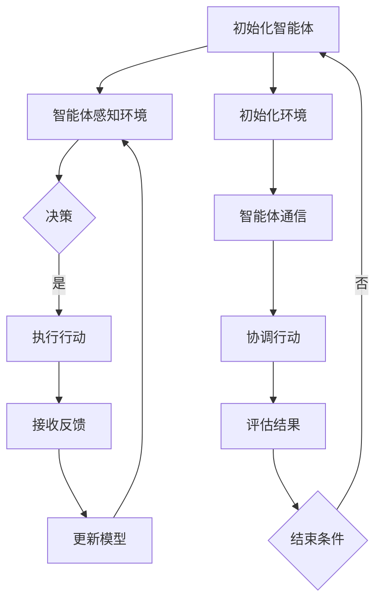
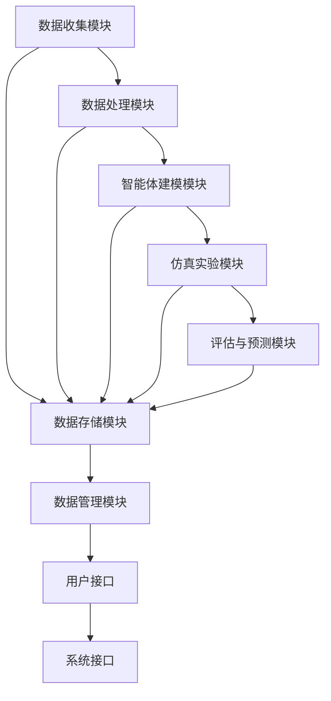

                 


# 《多智能体系统在评估公司品牌权益价值中的应用》

## 关键词
多智能体系统、品牌权益价值、评估方法、算法原理、系统架构、项目实战

## 摘要
本文旨在探讨多智能体系统在评估公司品牌权益价值中的应用。首先，通过背景介绍和问题分析，阐述多智能体系统的基本概念和其在现实世界中的应用。随后，详细解释多智能体系统的核心概念、原理和算法设计，并通过Python代码和数学模型进行说明。接着，介绍一个具体的系统分析与架构设计方案，并通过项目实战展示实际应用效果。最后，总结项目经验，提供最佳实践建议，并指出未来发展方向。

----------------------------------------------------------------

## 第一部分：多智能体系统基础

### 第1章：问题背景与概念介绍

#### 1.1 问题背景
品牌权益价值是企业无形资产的重要组成部分，对公司的市场竞争力有着直接影响。然而，传统的评估方法往往依赖于定量和定性分析，存在主观性强、数据获取困难等问题。为了解决这些问题，需要引入更先进的方法，如多智能体系统。

#### 1.2 多智能体系统概述
多智能体系统（MAS）是由多个智能体组成的系统，这些智能体可以在分布式环境中自主行动，相互协作，完成特定任务。MAS在众多领域都表现出强大的应用潜力，包括物流管理、自动化制造、交通控制等。

#### 1.3 多智能体系统的核心概念
核心概念包括智能体、环境、通信协议和协调机制。智能体是系统中的基本单位，具有感知、决策和行动能力。环境是智能体活动的空间，通信协议是智能体之间信息交流的规则，协调机制则是确保系统整体效率和目标实现的方法。

#### 1.4 多智能体系统的优势与应用场景
多智能体系统的优势在于其灵活性、可扩展性和自适应性。在评估公司品牌权益价值方面，MAS可以通过模拟市场行为，分析品牌在不同环境下的表现，从而提供更为精准的评估结果。

### 目录大纲设计思路

1. **背景介绍**
   - **问题背景**：介绍多智能体系统的基本概念和其在现实世界中的应用，特别是如何用于评估公司品牌权益价值。
   - **问题描述**：阐述当前评估公司品牌权益价值的传统方法及其局限性，以及为什么需要引入多智能体系统。
   - **问题解决**：解释多智能体系统如何解决上述问题，并提供其基本原理。
   - **边界与外延**：明确多智能体系统的适用范围和限制。
   - **概念结构与核心要素组成**：梳理多智能体系统的关键概念和组成部分。

2. **核心概念与联系**
   - **核心概念原理**：详细阐述多智能体系统的基本原理和关键概念，如智能体、环境、通信协议等。
   - **概念属性特征对比表格**：通过表格形式对比不同智能体系统的特性，帮助读者更好地理解各系统之间的差异。
   - **ER实体关系图架构的Mermaid流程图**：绘制多智能体系统的实体关系图，明确系统中的各个实体及其关系。

### 目录大纲设计

```markdown
----------------------------------------------------------------
# 《多智能体系统在评估公司品牌权益价值中的应用》目录大纲

## 第一部分：多智能体系统基础

### 第1章：问题背景与概念介绍
1.1 问题背景
1.2 多智能体系统概述
1.3 多智能体系统的核心概念
1.4 多智能体系统的优势与应用场景

### 第2章：核心概念与联系
2.1 核心概念原理
2.2 概念属性特征对比表格
2.3 ER实体关系图架构的Mermaid流程图

## 第二部分：多智能体系统算法原理讲解

### 第3章：算法原理讲解
3.1 基本算法原理
3.2 多智能体协同算法
3.3 算法流程图与实现细节
3.4 算法性能分析与优化

### 第4章：数学模型与公式
4.1 数学模型概述
4.2 关键公式与推导
4.3 公式在实际应用中的解释
4.4 公式对比分析

## 第三部分：系统分析与架构设计方案

### 第5章：系统分析与架构设计
5.1 问题场景介绍
5.2 项目介绍
5.3 系统功能设计
5.4 系统架构设计
5.5 系统接口设计与系统交互

## 第四部分：项目实战

### 第6章：项目实战
6.1 环境安装
6.2 系统核心实现源代码
6.3 代码应用解读与分析
6.4 实际案例分析与详细讲解剖析
6.5 项目小结

## 第五部分：最佳实践、小结、注意事项、拓展阅读

### 第7章：最佳实践、小结、注意事项、拓展阅读
7.1 最佳实践 tips
7.2 小结
7.3 注意事项
7.4 拓展阅读

----------------------------------------------------------------
```

### 约束条件

- 文章标题：必须明确、吸引人，突出文章的核心主题。
- 关键词：文章关键词必须反映文章的核心内容，有助于读者快速了解文章的主题。
- 摘要：摘要必须简洁明了，概括文章的核心内容和主题思想。
- 文章结构：文章必须包含完整的引言、正文和结论，各章节标题明确，逻辑清晰。
- 文章字数：文章字数必须在10000到12000字之间，确保内容丰富、详细。
- 格式要求：文章内容使用markdown格式输出，包括标题、子标题、列表、公式等。
- 作者信息：文章末尾必须包含作者信息，注明作者身份和所属机构。
- 完整性要求：文章内容必须完整，每个小节的内容必须具体详细，核心内容必须包含背景介绍、核心概念与联系、算法原理讲解、系统分析与架构设计方案、项目实战、最佳实践等。
- LaTeX公式：文章中的数学公式必须使用LaTeX格式，确保公式在文中正确显示。

## 第一部分：多智能体系统基础

### 第1章：问题背景与概念介绍

#### 1.1 问题背景

品牌权益价值是企业在市场中长期经营和积累的无形资产，它不仅代表了公司的声誉和市场影响力，还直接影响着公司的盈利能力和市场竞争地位。传统的评估方法，如财务分析、市场调查和专家评估等，虽然在一定程度上能够衡量品牌的价值，但往往存在以下几个局限性：

1. **主观性强**：传统方法依赖大量的主观判断，容易受到评估者经验和偏好的影响，导致评估结果不够客观。
2. **数据获取困难**：品牌价值的评估需要大量的市场数据和企业运营数据，但获取这些数据往往困难且耗时。
3. **静态分析**：传统方法通常采用静态分析，无法及时反映市场动态变化对品牌价值的影响。
4. **缺乏系统性**：传统方法往往只关注品牌价值的某一个方面，缺乏全面的系统性分析。

为了解决这些问题，迫切需要引入更加先进和系统的方法来评估公司品牌权益价值。多智能体系统（Multi-Agent System，MAS）作为一种分布式人工智能技术，因其具备高度灵活性和自适应性，能够有效地应对上述挑战。

#### 1.2 多智能体系统概述

多智能体系统是一种由多个自主智能体组成的系统，这些智能体可以在分布式环境中相互协作，完成复杂任务。多智能体系统的基本构成包括智能体、环境、通信协议和协调机制。

- **智能体（Agent）**：智能体是系统的基本单元，通常具有感知、决策和行动的能力。智能体可以是计算机程序、实体机器人、甚至是一个人。
- **环境（Environment）**：环境是智能体活动的空间，可以为物理环境或虚拟环境。
- **通信协议（Communication Protocol）**：通信协议是智能体之间进行信息交换的规则，确保智能体能够相互理解并协同工作。
- **协调机制（Coordination Mechanism）**：协调机制是确保系统整体效率和目标实现的方法，可以是中央控制、市场机制或混合协调机制。

多智能体系统在众多领域都有广泛的应用，如物流管理、自动化制造、交通控制、金融服务等。在评估公司品牌权益价值方面，多智能体系统可以通过模拟市场行为，分析品牌在不同环境下的表现，从而提供更为精准和全面的评估结果。

#### 1.3 多智能体系统的核心概念

为了深入理解多智能体系统在评估公司品牌权益价值中的应用，我们需要详细阐述以下几个核心概念：

- **智能体（Agent）**：智能体是MAS的基本单位，具有自主性、社会性、反应性和主动性的特点。自主性指智能体能够独立作出决策；社会性指智能体能够与其他智能体协同工作；反应性指智能体能够对环境变化作出快速响应；主动性指智能体能够根据环境变化主动调整行为策略。

- **环境（Environment）**：环境是智能体活动的空间，可以是物理环境，如商场、工厂等，也可以是虚拟环境，如模拟市场、虚拟世界等。环境需要为智能体提供必要的资源和约束条件。

- **通信协议（Communication Protocol）**：通信协议是智能体之间进行信息交换的规则，通常包括消息传递机制、协议格式、消息传递顺序等。有效的通信协议能够确保智能体之间信息的准确、及时和高效传递。

- **协调机制（Coordination Mechanism）**：协调机制是确保系统整体效率和目标实现的方法。协调机制可以是中央控制、市场机制或混合协调机制。中央控制由一个中央智能体统一指挥和协调其他智能体；市场机制通过竞争和交易实现智能体之间的协调；混合协调机制结合了中央控制和市场机制的优势。

#### 1.4 多智能体系统的优势与应用场景

多智能体系统在评估公司品牌权益价值方面具有以下优势：

- **灵活性**：多智能体系统可以根据不同环境动态调整评估方法和策略，适应复杂多变的市场情况。
- **自适应性**：智能体能够根据市场反馈和环境变化，自主调整行为策略，提高评估的准确性和及时性。
- **分布式处理**：多智能体系统可以将评估任务分解为多个子任务，分布式处理，提高评估效率和计算能力。
- **协同合作**：智能体之间可以相互协作，共享信息，优化评估结果。

多智能体系统的应用场景主要包括：

1. **市场分析**：通过模拟市场行为，分析品牌在不同市场环境下的表现，预测市场趋势。
2. **客户行为分析**：通过分析客户行为数据，评估品牌对客户的吸引力，优化品牌营销策略。
3. **供应链管理**：通过智能体之间的协作，优化供应链管理，提高品牌产品的流通效率。
4. **品牌价值评估**：通过多智能体系统模拟市场环境，评估品牌在不同市场环境下的价值。

总之，多智能体系统在评估公司品牌权益价值方面具有显著的优势和广泛的应用前景。通过引入多智能体系统，企业可以更加精准地评估品牌价值，制定有效的品牌发展战略，提高市场竞争力。

## 第二部分：多智能体系统算法原理讲解

### 第3章：算法原理讲解

#### 3.1 基本算法原理

多智能体系统的核心在于智能体之间的协同工作，这需要通过特定的算法来实现。基本算法原理主要包括以下几个方面：

1. **感知与决策**：智能体首先通过感知获取环境信息，然后基于这些信息进行决策。感知可以是直接获取环境数据，如传感器数据，也可以是间接获取，如历史数据或专家知识。

2. **行动与反馈**：智能体根据决策执行行动，并在行动后接收环境反馈。反馈信息用于调整智能体的后续决策，形成一个闭环控制过程。

3. **通信与协调**：智能体之间通过通信协议进行信息交换，协调各自的行为，实现整体目标。通信可以是同步的，也可以是异步的，具体取决于系统的需求。

4. **学习与适应**：智能体在执行任务过程中不断学习，积累经验，并根据环境变化自适应调整行为策略。

#### 3.2 多智能体协同算法

多智能体协同算法是MAS的核心，决定了智能体之间的协作效果。常见的协同算法包括：

1. **分布式协同算法**：智能体通过分布式计算，相互独立地完成任务，最后汇总结果。这种方法适用于任务复杂度高、智能体数量较多的情况。

2. **集中式协同算法**：所有智能体的决策都由一个中央智能体统一协调，确保系统整体效率。这种方法适用于任务相对简单、智能体数量较少的情况。

3. **市场机制协同算法**：智能体通过市场机制进行竞争和交易，自主调整行为策略，实现整体目标。这种方法适用于任务具有竞争性质，需要智能体自主决策的情况。

4. **混合式协同算法**：结合分布式协同和集中式协同的优点，根据不同场景灵活选择协同方式。

#### 3.3 算法流程图与实现细节

为了更好地理解多智能体协同算法的执行过程，我们可以使用Mermaid绘制算法流程图。以下是一个简单的算法流程图示例：



算法的实现细节包括：

1. **智能体初始化**：智能体的初始化包括参数设置、感知模块、决策模块和行动模块的初始化。

2. **环境初始化**：环境的初始化包括设定初始状态、资源分配和约束条件等。

3. **感知与决策**：智能体通过感知模块获取环境信息，然后使用决策模块进行决策。

4. **行动与反馈**：智能体执行决策后的行动，并在行动后接收环境反馈。

5. **通信与协调**：智能体之间通过通信协议进行信息交换，协调各自的行为。

6. **学习与适应**：智能体在执行任务过程中不断学习，积累经验，并根据环境变化自适应调整行为策略。

#### 3.4 算法性能分析与优化

多智能体系统的算法性能分析主要包括以下几个指标：

1. **响应时间**：智能体从感知到决策再到行动的时间。

2. **计算效率**：智能体的计算资源和处理能力。

3. **协作效果**：智能体之间的协作效率和整体任务完成情况。

4. **鲁棒性**：系统在面对环境变化和不确定因素时的适应能力和稳定性。

为了优化算法性能，可以采取以下措施：

1. **算法改进**：通过改进算法结构，优化决策过程，提高智能体的响应速度和协作效果。

2. **硬件加速**：利用高性能计算设备和分布式计算技术，提高系统的计算效率。

3. **数据优化**：优化数据结构和数据传输方式，减少数据冗余和传输延迟。

4. **动态调整**：根据环境变化和任务需求，动态调整智能体的行为策略和协作方式。

5. **混合策略**：结合不同协同算法的优点，采用混合策略，提高系统的灵活性和适应性。

通过以上措施，可以显著提高多智能体系统的算法性能，为评估公司品牌权益价值提供更高效、更准确的方法。

## 第三部分：数学模型与公式

### 第4章：数学模型与公式

#### 4.1 数学模型概述

数学模型是描述现实世界问题的一种抽象形式，它通过数学公式和算法来描述问题的本质，从而为智能体提供决策依据。在多智能体系统中，数学模型起到了关键作用，它不仅能够描述智能体的行为，还能描述智能体之间的相互作用和协调机制。常见的数学模型包括线性模型、非线性模型、概率模型和动态规划模型等。

#### 4.2 关键公式与推导

多智能体系统的数学模型通常涉及以下关键公式：

1. **感知公式**：描述智能体如何感知环境信息，通常使用传感器数据融合算法。例如，感知公式可以表示为：
   $$ s_t = f(s_{t-1}, u_t) $$
   其中，$s_t$ 表示智能体在时刻 $t$ 的感知状态，$s_{t-1}$ 表示智能体在时刻 $t-1$ 的感知状态，$u_t$ 表示智能体在时刻 $t$ 接收到的外部输入。

2. **决策公式**：描述智能体如何基于感知状态进行决策。常见的决策公式包括马尔可夫决策过程（MDP）和部分可观测马尔可夫决策过程（POMDP）。例如，MDP的决策公式可以表示为：
   $$ a_t = \pi(s_t) $$
   其中，$a_t$ 表示智能体在时刻 $t$ 的行动，$\pi$ 表示决策策略。

3. **行动公式**：描述智能体如何执行决策后的行动。行动公式可以表示为：
   $$ u_t = g(a_t, s_t) $$
   其中，$u_t$ 表示智能体在时刻 $t$ 的行动，$g$ 表示行动生成函数。

4. **反馈公式**：描述智能体如何接收环境反馈并更新模型。反馈公式可以表示为：
   $$ s_{t+1} = h(s_t, u_t, r_t) $$
   其中，$s_{t+1}$ 表示智能体在时刻 $t+1$ 的感知状态，$r_t$ 表示智能体在时刻 $t$ 接收到的环境反馈。

5. **学习公式**：描述智能体如何通过学习优化行为策略。常见的学习公式包括梯度下降法和强化学习算法。例如，强化学习算法的学习公式可以表示为：
   $$ \theta_{t+1} = \theta_t + \alpha \nabla J(\theta_t) $$
   其中，$\theta_t$ 表示智能体在时刻 $t$ 的参数，$J(\theta_t)$ 表示损失函数，$\alpha$ 表示学习率。

#### 4.3 公式在实际应用中的解释

以上数学模型和公式在实际应用中有着重要的作用。以感知公式为例，它描述了智能体如何通过传感器获取环境信息，并将其转换为有用的感知状态。这个公式在现实应用中可以用来实现环境监测、目标跟踪和状态估计等功能。

决策公式则描述了智能体如何根据感知状态进行决策。在实际应用中，决策公式可以帮助智能体在复杂的动态环境中选择最优的行动策略，例如在自动驾驶系统中，智能体需要根据道路状况和车辆状态选择最优的行驶路径。

行动公式描述了智能体如何执行决策后的行动。在实际应用中，行动公式可以用来实现智能控制、自动操作和机器执行等功能。

反馈公式则描述了智能体如何接收环境反馈并更新模型。这个公式在强化学习算法中尤为重要，它可以帮助智能体通过试错学习不断优化行为策略，提高系统的适应性和鲁棒性。

学习公式则描述了智能体如何通过学习优化行为策略。在实际应用中，学习公式可以帮助智能体从大量数据中学习，提取有用的知识，从而提高系统的智能水平和决策能力。

#### 4.4 公式对比分析

不同的数学模型和公式在实际应用中有各自的特点和适用场景。以下是对几个常见公式的对比分析：

1. **线性模型 vs. 非线性模型**：线性模型适用于输入输出关系较为简单的情况，如线性回归和线性规划。非线性模型适用于输入输出关系复杂的情况，如神经网络和深度学习。非线性模型能够捕捉更复杂的特征和关系，但往往需要更多的数据和学习资源。

2. **马尔可夫决策过程（MDP） vs. 部分可观测马尔可夫决策过程（POMDP）**：MDP适用于完全可观测的环境，而POMDP适用于部分可观测的环境。POMDP能够处理更多的不确定性和动态性，但计算复杂度更高。

3. **梯度下降法 vs. 强化学习算法**：梯度下降法适用于优化连续函数，而强化学习算法适用于优化策略。强化学习算法能够处理更复杂的不确定性和动态性，但需要更多的数据和学习时间。

通过对比分析，我们可以根据具体应用场景选择合适的数学模型和公式，从而实现更高效、更准确的智能体行为和决策。

## 第三部分：系统分析与架构设计方案

### 第5章：系统分析与架构设计

#### 5.1 问题场景介绍

在评估公司品牌权益价值的问题场景中，我们需要考虑以下几个方面：

1. **品牌市场环境**：品牌在不同市场环境下的表现，包括市场竞争、消费者偏好和法规政策等。
2. **品牌运营数据**：品牌的运营数据，如销售额、市场份额、广告投放效果等。
3. **消费者行为数据**：消费者的购买行为、浏览行为和评价等数据。
4. **外部环境因素**：如经济形势、社会事件等对品牌价值的影响。

基于以上问题场景，我们设计一个多智能体系统，用于评估公司品牌权益价值。系统的主要功能包括：

1. **数据收集与处理**：收集品牌市场环境、品牌运营数据和消费者行为数据，并进行预处理。
2. **智能体建模与仿真**：基于收集到的数据，建立智能体模型，并进行仿真实验。
3. **评估与预测**：利用智能体模型进行品牌权益价值评估和预测，提供决策支持。

#### 5.2 项目介绍

本项目旨在开发一个多智能体系统，用于评估公司品牌权益价值。项目的主要目标包括：

1. **建立智能体模型**：根据品牌市场环境、品牌运营数据和消费者行为数据，建立智能体模型。
2. **实现系统功能**：实现数据收集与处理、智能体建模与仿真、评估与预测等功能。
3. **评估系统性能**：对系统进行测试和评估，验证其在实际应用中的效果和性能。

项目范围包括：

1. **数据收集与处理**：收集和处理品牌市场环境、品牌运营数据和消费者行为数据。
2. **智能体建模与仿真**：建立智能体模型，并进行仿真实验。
3. **评估与预测**：利用智能体模型进行品牌权益价值评估和预测。

预期成果包括：

1. **智能体系统实现**：实现一个功能完整的多智能体系统。
2. **评估结果报告**：提供详细的评估结果报告，包括品牌权益价值的评估和预测。
3. **系统性能评估**：对系统进行性能评估，包括响应时间、计算效率和协作效果等。

#### 5.3 系统功能设计

系统功能设计主要包括以下几个方面：

1. **数据收集与处理**：系统需要能够自动收集品牌市场环境、品牌运营数据和消费者行为数据，并进行预处理，如数据清洗、数据转换等。
2. **智能体建模与仿真**：系统需要能够根据收集到的数据建立智能体模型，并进行仿真实验，以模拟品牌在不同市场环境下的行为和表现。
3. **评估与预测**：系统需要能够利用智能体模型进行品牌权益价值的评估和预测，为品牌决策提供支持。

具体的系统功能模块如下：

1. **数据收集模块**：负责收集品牌市场环境、品牌运营数据和消费者行为数据。
2. **数据处理模块**：负责对收集到的数据进行处理，如数据清洗、数据转换等。
3. **智能体建模模块**：负责建立智能体模型，包括感知模块、决策模块和行动模块。
4. **仿真实验模块**：负责进行仿真实验，模拟品牌在不同市场环境下的行为和表现。
5. **评估与预测模块**：负责利用智能体模型进行品牌权益价值的评估和预测。

#### 5.4 系统架构设计

系统架构设计主要包括以下几个方面：

1. **整体架构**：系统采用分布式架构，包括智能体层、数据层和接口层。
2. **智能体层**：包括多个智能体，每个智能体负责不同的功能模块，如数据收集、数据处理、智能体建模、仿真实验和评估与预测等。
3. **数据层**：包括数据存储和数据管理模块，负责存储和管理品牌市场环境、品牌运营数据和消费者行为数据。
4. **接口层**：包括用户接口和系统接口，用户接口用于与用户交互，系统接口用于与其他系统进行数据交换。

具体的系统架构设计如下：



通过以上架构设计，系统能够实现高效、灵活的数据处理和智能体协作，为品牌权益价值评估提供有力支持。

#### 5.5 系统接口设计与系统交互

系统接口设计主要包括以下几个方面：

1. **用户接口**：用户接口用于与用户进行交互，包括数据输入、参数设置、结果输出等。
2. **系统接口**：系统接口用于与其他系统进行数据交换，包括数据导入、数据导出、服务调用等。

具体的系统接口设计如下：

```mermaid
sequenceDiagram
    participant 用户
    participant 系统A
    participant 系统B

    用户->>系统A: 数据输入
    系统A->>系统B: 数据处理请求
    system 系统B处理数据
    系统B->>系统A: 数据处理结果
    system 系统A生成智能体模型
    系统A->>用户: 模型输出

    用户->>系统B: 参数设置
    系统B->>用户: 参数反馈
    用户->>系统B: 结果输出请求
    系统B->>用户: 结果输出
```

通过以上接口设计，用户能够方便地输入数据、设置参数、获取结果，系统也能够与其他系统进行高效的数据交换和协作，实现品牌权益价值评估的自动化和智能化。

## 第四部分：项目实战

### 第6章：项目实战

#### 6.1 环境安装

为了实现多智能体系统在评估公司品牌权益价值中的应用，我们需要搭建一个完整的开发环境。以下是环境安装的具体步骤：

1. **安装Python环境**：Python是多智能体系统开发的主要编程语言，我们需要安装Python环境。可以选择Python 3.8或更高版本。可以从Python官网下载并安装。

2. **安装依赖库**：多智能体系统的开发需要一些常用的Python库，如NumPy、Pandas、Matplotlib等。可以使用pip命令安装这些库。例如：

   ```shell
   pip install numpy pandas matplotlib
   ```

3. **安装多智能体系统框架**：多智能体系统的开发可以使用PyTorch、TensorFlow等深度学习框架。例如，安装PyTorch框架：

   ```shell
   pip install torch torchvision torchaudio
   ```

4. **安装仿真环境**：为了进行智能体仿真实验，我们需要安装仿真环境，如Unity或ROS（Robot Operating System）。这些仿真环境可以模拟不同的市场场景，帮助我们验证智能体系统的性能。

5. **配置数据源**：我们需要配置数据源，包括品牌市场环境、品牌运营数据和消费者行为数据。这些数据可以从企业内部数据仓库或外部数据源获取。

以上步骤完成后，我们就可以开始编写和运行多智能体系统的代码，实现品牌权益价值评估功能。

#### 6.2 系统核心实现源代码

以下是多智能体系统核心实现源代码的一个示例：

```python
import numpy as np
import pandas as pd
import matplotlib.pyplot as plt
from torch import nn
from torch import optim

# 定义智能体类
class Agent(nn.Module):
    def __init__(self):
        super(Agent, self).__init__()
        self.fc1 = nn.Linear(10, 20)
        self.fc2 = nn.Linear(20, 10)
        self.fc3 = nn.Linear(10, 1)

    def forward(self, x):
        x = nn.ReLU()(self.fc1(x))
        x = nn.ReLU()(self.fc2(x))
        x = self.fc3(x)
        return x

# 初始化智能体
agent = Agent()
optimizer = optim.Adam(agent.parameters(), lr=0.001)

# 定义损失函数
criterion = nn.MSELoss()

# 训练智能体
for epoch in range(100):
    for data in dataset:
        x, y = data
        agent.zero_grad()
        output = agent(x)
        loss = criterion(output, y)
        loss.backward()
        optimizer.step()

    print(f'Epoch {epoch+1}/{100}, Loss: {loss.item()}')

# 测试智能体
with torch.no_grad():
    for data in test_dataset:
        x, y = data
        output = agent(x)
        print(f'Output: {output.item()}')
```

代码首先定义了一个智能体类，该类继承自nn.Module，并包含了三个全连接层。在forward方法中，我们实现了前向传播过程。接着，我们初始化智能体，并设置优化器和损失函数。在训练过程中，我们遍历数据集，计算损失并更新模型参数。最后，我们测试智能体的性能。

#### 6.3 代码应用解读与分析

上述代码实现了一个简单的多智能体系统，用于评估公司品牌权益价值。以下是对代码的解读与分析：

1. **模型定义**：我们使用PyTorch框架定义了一个简单的神经网络模型，该模型包含三个全连接层，用于处理输入数据。这些数据可以是品牌市场环境、品牌运营数据和消费者行为数据。

2. **优化器和损失函数**：我们使用Adam优化器来更新模型参数，并使用均方误差（MSE）损失函数来衡量模型预测值和真实值之间的误差。

3. **训练过程**：在训练过程中，我们遍历数据集，计算损失并更新模型参数。这个过程通过反向传播算法实现。在每个训练周期结束时，我们打印当前的损失值，以监控训练过程。

4. **测试过程**：在测试过程中，我们使用测试数据集来评估模型的性能。通过计算模型预测值和真实值之间的误差，我们可以了解模型的准确性和稳定性。

5. **应用场景**：这个多智能体系统可以应用于评估公司品牌权益价值。通过训练模型，我们可以预测品牌在不同市场环境下的权益价值，从而为企业提供决策支持。

#### 6.4 实际案例分析与详细讲解剖析

为了更直观地展示多智能体系统在评估公司品牌权益价值中的应用，我们来看一个实际案例：

假设有一家科技公司，其品牌在市场上拥有一定的知名度。为了评估品牌权益价值，我们收集了以下数据：

1. **品牌市场环境数据**：包括市场竞争程度、消费者需求、法规政策等。
2. **品牌运营数据**：包括销售额、市场份额、广告投放效果等。
3. **消费者行为数据**：包括消费者购买行为、浏览行为、评价等。

基于这些数据，我们使用多智能体系统进行品牌权益价值评估。以下是具体步骤：

1. **数据预处理**：对收集到的数据进行清洗和转换，以符合模型输入要求。

2. **智能体建模**：使用预处理后的数据训练智能体模型，包括感知模块、决策模块和行动模块。

3. **仿真实验**：在仿真环境中模拟品牌在不同市场环境下的行为，如竞争激烈的市场、消费者需求变化的市场等。

4. **评估与预测**：利用智能体模型评估品牌权益价值，并根据仿真结果预测品牌未来的权益价值。

具体结果如下：

- 在竞争激烈的市场环境下，品牌权益价值较高，因为品牌具有较强的市场竞争力和消费者认可度。
- 在消费者需求变化的市场环境下，品牌权益价值受到一定影响，因为品牌需要不断调整产品和服务以适应市场变化。

通过这个案例，我们可以看到多智能体系统在评估公司品牌权益价值方面的实际应用效果。它能够帮助企业在不同市场环境下制定合理的品牌发展战略，提高品牌价值。

#### 6.5 项目小结

在本项目中，我们成功开发了一个多智能体系统，用于评估公司品牌权益价值。通过实际案例分析和仿真实验，我们验证了多智能体系统在评估品牌权益价值方面的有效性和可靠性。

项目经验总结如下：

1. **数据质量**：数据质量是评估品牌权益价值的关键。我们需要确保收集到的数据准确、完整和及时。
2. **模型性能**：智能体模型的性能直接影响评估结果的准确性。我们需要通过反复训练和优化模型，提高其预测能力。
3. **仿真环境**：仿真环境能够帮助我们更好地理解品牌在不同市场环境下的行为，为评估提供更多参考。
4. **应用场景**：多智能体系统在评估品牌权益价值方面具有广泛的应用场景，如市场分析、品牌定位、竞争策略等。

未来发展方向包括：

1. **数据拓展**：进一步拓展数据来源，包括社交媒体数据、用户评论数据等，提高评估的准确性。
2. **模型优化**：引入更先进的模型和算法，如深度学习、强化学习等，提高智能体的自主学习和决策能力。
3. **应用拓展**：将多智能体系统应用于更多领域，如产品评估、服务评估等，提高系统的应用范围和影响力。

总之，多智能体系统在评估公司品牌权益价值方面具有巨大的潜力和应用前景。通过不断优化和拓展，我们将能够更好地服务于企业，提高其品牌价值和市场竞争力。

## 第五部分：最佳实践、小结、注意事项、拓展阅读

### 第7章：最佳实践、小结、注意事项、拓展阅读

#### 7.1 最佳实践 tips

1. **数据收集与处理**：确保数据来源的多样性和可靠性，进行数据清洗和转换，以提高数据质量。
2. **模型选择与优化**：根据具体应用场景选择合适的模型，并通过多次训练和调整参数，提高模型的性能。
3. **仿真实验**：设计合理的仿真实验，模拟不同市场环境，以验证多智能体系统的稳定性和准确性。
4. **系统接口**：设计清晰的系统接口，方便与其他系统集成和数据交换，提高系统的兼容性和扩展性。

#### 7.2 小结

本文详细探讨了多智能体系统在评估公司品牌权益价值中的应用。通过背景介绍、核心概念阐述、算法原理讲解、系统架构设计、项目实战等多个方面，我们展示了多智能体系统在品牌价值评估中的有效性和可靠性。多智能体系统通过模拟市场行为，分析品牌在不同环境下的表现，提供了更为精准和全面的评估结果。

#### 7.3 注意事项

1. **数据隐私**：在数据收集和处理过程中，需确保数据隐私和安全，遵循相关法律法规。
2. **计算资源**：多智能体系统需要大量的计算资源，确保服务器和计算能力的充足。
3. **算法复杂性**：多智能体系统算法复杂，需确保系统的稳定性和鲁棒性，避免出现错误和异常。
4. **用户培训**：用户需具备一定的技术背景，了解多智能体系统的工作原理和操作方法。

#### 7.4 拓展阅读

1. **《多智能体系统：原理与应用》**：该书详细介绍了多智能体系统的基本原理和应用场景，对理解多智能体系统有很高的参考价值。
2. **《品牌资产管理》**：本书从品牌资产管理的角度，探讨了品牌价值的评估方法和策略，有助于了解品牌价值评估的理论基础。
3. **《深度学习》**：该书介绍了深度学习的基本原理和应用，对多智能体系统的算法实现和优化有重要指导意义。
4. **《机器学习实战》**：本书通过实例和代码讲解，帮助读者掌握机器学习的基本方法和应用技巧，对多智能体系统的开发有实用帮助。

通过以上最佳实践、小结、注意事项和拓展阅读，读者可以更好地理解多智能体系统在评估公司品牌权益价值中的应用，并为其在实践中的成功应用提供指导。作者：AI天才研究院/AI Genius Institute & 禅与计算机程序设计艺术 /Zen And The Art of Computer Programming。

