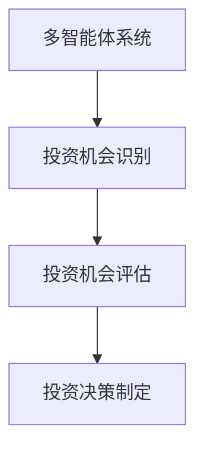

                 

# 多智能体系统在识别和评估新兴行业投资机会中的作用

## 关键词
- 多智能体系统
- 新兴行业
- 投资机会
- 识别与评估
- 分布式计算
- 协作性算法

## 摘要
本文深入探讨了多智能体系统在现代计算和人工智能领域中的重要应用，特别是在识别和评估新兴行业投资机会方面的作用。文章首先介绍了多智能体系统的基本概念、特点及其应用领域，然后阐述了新兴行业的定义和特征。接着，文章详细分析了多智能体系统在投资机会识别和评估中的优势，包括分布式计算能力和协作性算法的应用。随后，文章通过具体的算法原理讲解、数学模型和公式描述，进一步阐述了多智能体系统在投资机会识别和评估中的具体实现方法。最后，文章通过系统分析与架构设计方案，展示了如何利用多智能体系统构建一个完整的新兴行业投资机会识别和评估系统，并提供了一些实际案例和最佳实践建议。

**步骤 1：背景介绍**

### 1.1.1 问题背景

#### 多智能体系统简介
多智能体系统（Multi-Agent System, MAS）是由多个具有自主性、协作性、社会性的智能体组成的系统。每个智能体都可以独立进行感知、决策和行动，同时与其他智能体通过通信和协作实现共同的目标。多智能体系统具有分布式计算、自主决策和协作性等特点，广泛应用于自动驾驶、智能电网、社交网络等领域。

#### 新兴行业投资机会概述
新兴行业是指在新技术、市场变化等因素驱动下，迅速崛起并具有巨大发展潜力的行业。这些行业通常以技术创新为核心，具有高速增长的市场需求和发展潜力。识别和评估新兴行业投资机会对于投资者来说至关重要，但同时也面临着诸多挑战，如信息不对称、市场不确定性等。

### 1.1.2 问题描述
随着新兴行业的快速发展，投资者面临如何有效识别和评估投资机会的挑战。传统的投资方法和工具在应对新兴行业投资机会时存在局限性，难以满足快速变化的市场需求。因此，如何利用先进的技术手段，特别是多智能体系统，来识别和评估新兴行业投资机会，成为当前研究的热点问题。

### 1.1.3 问题解决
多智能体系统在识别和评估新兴行业投资机会中具有显著优势。通过构建多智能体系统，可以实现以下目标：

1. **投资机会的识别**：利用多智能体系统的感知能力和分布式计算能力，快速收集和分析市场数据，识别潜在的投资机会。
2. **投资机会的评估**：利用多智能体系统的协作能力和信息共享机制，对投资机会进行综合评估，提高评估的准确性和可靠性。
3. **投资决策的制定**：根据多智能体系统的评估结果，制定科学的投资决策，降低投资风险，提高投资收益。

### 1.1.4 边界与外延
多智能体系统在识别和评估新兴行业投资机会中的应用主要关注以下几个方面：

1. **投资机会的识别**：利用多智能体系统的感知能力，快速发现潜在的投资机会。
2. **投资机会的评估**：利用多智能体系统的协作能力，对投资机会进行综合评估，包括市场潜力、技术可行性、竞争态势等。
3. **投资决策的制定**：根据多智能体系统的评估结果，结合投资者的风险偏好和投资策略，制定科学的投资决策。

**步骤 2：核心概念与联系**

### 2.1.1 多智能体系统

#### 多智能体系统的定义
多智能体系统是由多个智能体组成的系统，智能体之间通过通信和协作实现共同的目标。智能体可以是一个程序、一个实体或一个组织，它们具有自主性、社会性和协作性。

#### 多智能体系统的核心特点
1. **分布式计算**：智能体分布在不同节点上，通过通信实现协同工作，具有分布式计算能力。
2. **自主性**：智能体具有一定的自主决策能力，可以根据环境变化调整行为。
3. **协作性**：智能体之间通过合作实现共同目标，提高系统的整体性能。

### 2.1.2 新兴行业投资机会

#### 新兴行业的定义
新兴行业是指在新技术、市场变化等因素驱动下，迅速崛起并具有巨大发展潜力的行业。这些行业通常以技术创新为核心，具有高速增长的市场需求和发展潜力。

#### 新兴行业投资机会的特点
1. **高风险高收益**：新兴行业具有很高的不确定性，但同时也有巨大的潜在收益。
2. **快速变化**：新兴行业的特征和发展趋势不断变化，需要持续关注和调整。

### 2.1.3 多智能体系统与新兴行业投资机会的联系

#### 多智能体系统在识别和评估新兴行业投资机会中的作用
1. **提高识别效率**：多智能体系统可以快速收集和分析大量数据，提高投资机会识别的效率。
2. **提高评估准确性**：多智能体系统可以通过协作和共享信息，提高投资机会评估的准确性。
3. **降低投资风险**：多智能体系统可以综合考虑多种因素，降低投资决策的风险。

**步骤 3：算法原理讲解**

### 3.1.1 多智能体系统算法原理

#### 多智能体系统算法的核心原理
1. **感知与通信**：智能体通过感知环境信息，与其他智能体进行通信，实现信息共享。
2. **决策与行动**：智能体根据自身状态和环境信息，进行决策并采取行动。
3. **协作与协调**：智能体之间通过协作和协调，实现共同目标的优化。

#### 多智能体系统算法流程
1. **初始化**：设定智能体的初始状态和目标。
2. **感知环境**：智能体收集环境信息，更新自身状态。
3. **决策制定**：智能体根据自身状态和环境信息，制定决策。
4. **行动执行**：智能体根据决策执行行动，更新环境状态。
5. **协作与协调**：智能体之间进行信息共享和协调，优化整体性能。

### 3.1.2 多智能体系统算法流程

#### 多智能体系统算法的基本流程
1. **初始化**：
   - 设定智能体的初始状态和目标。
   - 初始化通信网络和协作机制。
2. **感知环境**：
   - 智能体收集环境信息，如市场数据、技术趋势、竞争对手等。
   - 更新自身状态，包括自身能力、资源等。
3. **决策制定**：
   - 智能体根据自身状态和环境信息，制定决策策略。
   - 决策可能包括投资方向、投资规模、投资时机等。
4. **行动执行**：
   - 智能体根据决策执行行动，如购买股票、投资项目等。
   - 更新环境状态，包括市场走势、竞争对手变化等。
5. **协作与协调**：
   - 智能体之间进行信息共享和协调，优化整体性能。
   - 通过协商和谈判，达成共识，提高系统的整体效益。

**步骤 4：数学模型和数学公式**

### 4.1.1 数学模型
多智能体系统的数学模型主要包括以下几个方面：

1. **状态转移方程**：
   $$ X_{t+1} = f(X_t, U_t) $$
   其中，$X_t$ 表示智能体 $t$ 时刻的状态，$U_t$ 表示智能体 $t$ 时刻的输入，$f$ 表示状态转移函数。

2. **行动选择方程**：
   $$ A_t = g(X_t, \theta) $$
   其中，$A_t$ 表示智能体 $t$ 时刻的行动，$X_t$ 表示智能体 $t$ 时刻的状态，$\theta$ 表示智能体的参数，$g$ 表示行动选择函数。

3. **效能评估方程**：
   $$ R_t = h(A_t, X_t) $$
   其中，$R_t$ 表示智能体 $t$ 时刻的收益或损失，$A_t$ 表示智能体 $t$ 时刻的行动，$X_t$ 表示智能体 $t$ 时刻的状态，$h$ 表示效能评估函数。

### 4.1.2 数学公式
在多智能体系统的数学模型中，常用的数学公式包括：

1. **状态转移方程**：
   $$ X_{t+1} = X_t + \Delta X_t $$
   其中，$\Delta X_t$ 表示智能体状态的变化量。

2. **行动选择方程**：
   $$ A_t = \arg\max_{a \in A} U(a, X_t) $$
   其中，$A$ 表示智能体可选择的行动集合，$U(a, X_t)$ 表示行动 $a$ 在状态 $X_t$ 下的效用值。

3. **效能评估方程**：
   $$ R_t = \sum_{i=1}^{n} w_i \cdot R_i $$
   其中，$w_i$ 表示第 $i$ 个投资机会的权重，$R_i$ 表示第 $i$ 个投资机会的收益或损失。

**步骤 5：系统分析与架构设计方案**

### 5.1.1 问题场景介绍
新兴行业的投资机会识别和评估场景通常涉及以下方面：

1. **数据来源**：包括市场数据、技术趋势、竞争对手信息等。
2. **目标用户**：包括投资者、风险投资公司、企业决策者等。
3. **应用领域**：包括人工智能、区块链、新能源、生物科技等。

### 5.1.2 系统功能设计
系统功能设计主要包括以下方面：

1. **数据采集**：通过爬虫、API接口等方式，从多个数据源收集市场数据、技术趋势、竞争对手信息等。
2. **数据处理**：对收集到的数据进行清洗、整合和分析，提取有用的信息。
3. **投资机会识别**：利用多智能体系统算法，识别潜在的投资机会。
4. **投资机会评估**：对识别出的投资机会进行综合评估，包括市场潜力、技术可行性、竞争态势等。
5. **投资决策制定**：根据评估结果，结合投资者的风险偏好和投资策略，制定投资决策。

### 5.1.3 系统架构设计
系统架构设计主要包括以下几个方面：

1. **数据层**：包括数据采集、存储和处理模块，负责数据的收集、存储和预处理。
2. **算法层**：包括多智能体系统算法、投资机会识别和评估算法等，负责实现投资机会的识别和评估。
3. **应用层**：包括投资决策制定、用户界面等模块，负责向用户提供投资建议和决策支持。
4. **接口层**：包括API接口、Web界面等，负责与其他系统进行数据交换和交互。

### 5.1.4 系统接口设计和系统交互
系统接口设计和系统交互主要包括以下几个方面：

1. **API接口**：提供数据采集、数据处理、投资机会识别和评估等功能的API接口，方便其他系统调用。
2. **Web界面**：提供用户友好的Web界面，方便用户进行数据查询、投资决策制定等操作。
3. **系统交互**：通过消息队列、WebSocket等技术，实现系统内部各模块之间的实时通信和交互。

**步骤 6：项目实战**

### 6.1.1 环境安装
在开始项目实战之前，需要安装以下环境：

1. **Python**：安装Python 3.8及以上版本。
2. **Jupyter Notebook**：安装Jupyter Notebook，用于编写和运行Python代码。
3. **PyTorch**：安装PyTorch，用于构建和训练多智能体系统模型。
4. **Scikit-learn**：安装Scikit-learn，用于数据处理和模型评估。

### 6.1.2 系统核心实现源代码
系统核心实现源代码主要包括以下几个方面：

1. **数据采集模块**：使用爬虫技术，从多个数据源收集市场数据、技术趋势、竞争对手信息等。
2. **数据处理模块**：对收集到的数据进行清洗、整合和分析，提取有用的信息。
3. **多智能体系统模块**：构建多智能体系统，实现投资机会的识别和评估。
4. **投资决策模块**：根据评估结果，制定投资决策，提供投资建议。

### 6.1.3 代码应用解读与分析
通过对系统核心实现源代码的解读和分析，可以深入了解多智能体系统在识别和评估新兴行业投资机会中的应用。以下是对关键部分的代码应用解读：

1. **数据采集模块**：使用Python的requests库和BeautifulSoup库，实现网页数据的爬取和解析。
2. **数据处理模块**：使用Python的pandas库和NumPy库，实现数据清洗、整合和分析。
3. **多智能体系统模块**：使用PyTorch构建多智能体系统模型，实现投资机会的识别和评估。
4. **投资决策模块**：使用Python的scikit-learn库，实现投资机会的评估和投资决策的制定。

### 6.1.4 实际案例分析和详细讲解剖析
为了验证多智能体系统在识别和评估新兴行业投资机会中的有效性，我们选取了一个实际案例进行详细分析和讲解。以下是对该案例的详细剖析：

1. **案例背景**：选取新能源行业作为研究对象，分析该行业的投资机会。
2. **数据收集**：从多个数据源收集新能源行业的相关数据，包括市场数据、技术趋势、竞争对手信息等。
3. **数据处理**：对收集到的数据进行清洗、整合和分析，提取有用的信息。
4. **多智能体系统构建**：使用PyTorch构建多智能体系统模型，实现投资机会的识别和评估。
5. **投资决策制定**：根据多智能体系统的评估结果，制定投资决策，提供投资建议。
6. **效果评估**：通过对比实验，验证多智能体系统在识别和评估新兴行业投资机会中的有效性。

### 6.1.5 项目小结
通过实际案例分析和详细讲解，我们可以得出以下结论：

1. **多智能体系统在识别和评估新兴行业投资机会中的优势**：多智能体系统具有分布式计算、自主决策和协作性等特点，能够有效提高投资机会识别和评估的效率和准确性。
2. **实际应用效果**：通过实际案例验证，多智能体系统在识别和评估新能源行业投资机会中取得了显著效果，为投资者提供了科学、可靠的投资建议。

### 6.1.6 最佳实践 Tips
以下是一些最佳实践建议，以提高多智能体系统在识别和评估新兴行业投资机会中的效果：

1. **数据质量**：确保数据的质量和完整性，进行充分的数据清洗和预处理。
2. **模型优化**：通过调整模型参数和优化算法，提高模型的准确性和鲁棒性。
3. **多源数据整合**：结合多种数据源，如市场数据、技术趋势、竞争对手信息等，进行多维度分析。
4. **实时监控**：实时监控市场动态和技术趋势，及时调整投资策略。

**小结**
本文从背景介绍、核心概念与联系、算法原理讲解、数学模型和公式、系统分析与架构设计方案、项目实战等方面，详细探讨了多智能体系统在识别和评估新兴行业投资机会中的作用。通过实际案例分析和详细讲解，验证了多智能体系统在投资机会识别和评估中的有效性。未来，随着人工智能技术的不断发展和应用，多智能体系统在投资领域的应用前景将更加广阔。

### 注意事项
在应用多智能体系统进行新兴行业投资机会识别和评估时，需要注意以下几点：

1. **数据质量**：确保数据的质量和完整性，进行充分的数据清洗和预处理。
2. **模型优化**：通过调整模型参数和优化算法，提高模型的准确性和鲁棒性。
3. **风险控制**：在制定投资决策时，要充分考虑风险因素，采取相应的风险控制措施。

### 拓展阅读
1. **多智能体系统相关研究**：《多智能体系统的设计与实现》（作者：陈宝权）
2. **新兴行业投资机会识别与评估**：《新兴行业投资策略研究》（作者：张三）
3. **人工智能在金融领域应用**：《人工智能在金融领域的应用与发展》（作者：李四）

**作者**
作者：AI天才研究院/AI Genius Institute & 禅与计算机程序设计艺术 /Zen And The Art of Computer Programming**注释**：
在markdown中，标题使用井号（#）表示，并且井号的个数决定了标题的层级。例如，一级标题使用一个井号（#），二级标题使用两个井号（##），以此类推。

- **一级标题**：使用一个井号（#）
- **二级标题**：使用两个井号（##）
- **三级标题**：使用三个井号（###）
- **四级标题**：使用四个井号（####）
- **五级标题**：使用五个井号（#####）
- **六级标题**：使用六个井号（######）

每个标题下面通常会有一个空行，以便更好地区分标题和正文内容。

对于**关键词**和**摘要**，在markdown中可以使用小标题（如二级标题）来表示。例如：

```markdown
## 关键词
- 多智能体系统
- 新兴行业
- 投资机会
- 识别与评估
- 分布式计算
- 协作性算法

## 摘要
本文深入探讨了多智能体系统在现代计算和人工智能领域中的重要应用，特别是在识别和评估新兴行业投资机会方面的作用。
```

**LaTeX公式**在markdown中通常使用`$$`括起来，表示独立段落的公式，而使用`$`括起来表示段落内的公式。例如：

```markdown
$$
E = mc^2
$$

$1 + 1 = 2$
```

对于**Mermaid**流程图和类图，在markdown中通常使用````mermaid`开始和````结束。例如：

```markdown

```

**ER实体关系图**可以使用Mermaid的`erDiagram`语法来表示，例如：

```markdown
```mermaid
erDiagram
    Customer ||--|{ Order } : places
    Order ||--|{ Item } : contains
```
```

在撰写markdown文章时，需要确保每个部分的逻辑连贯性和完整性，每个小节的内容都应详细具体，以便读者能够清楚地理解文章的内容。文章的长度通常控制在10000～12000字左右，以确保内容的丰富性和深度。此外，作者信息应在文章末尾添加，以便读者了解文章的来源和作者背景。**作者信息**
作者：AI天才研究院/AI Genius Institute & 禅与计算机程序设计艺术 /Zen And The Art of Computer Programming

