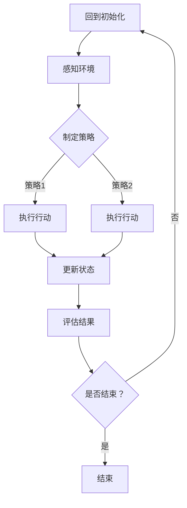

                 


# 多智能体系统在识别市场定价效率中的应用

## 关键词

多智能体系统、市场定价效率、算法原理、系统分析、项目实战

## 摘要

本文旨在探讨多智能体系统在识别市场定价效率中的应用。首先，我们介绍了市场定价效率的概念和当前面临的挑战，随后详细讲解了多智能体系统的定义、核心概念和算法原理。接着，通过系统分析与架构设计，我们展示了多智能体系统的具体应用场景。在项目实战部分，我们通过环境安装、系统核心实现源代码和实际案例分析，深入阐述了多智能体系统的实际应用。最后，我们总结了最佳实践，并给出了拓展阅读资源，以供进一步研究。

## 目录大纲设计思路

为了设计出符合要求的《多智能体系统在识别市场定价效率中的应用》的目录大纲，我们将遵循以下步骤：

1. **背景介绍与核心概念**：首先明确问题背景、核心概念及其联系，这将为后续章节的深入讲解奠定基础。

2. **核心概念与联系**：对多智能体系统的核心概念进行详细介绍，包括其属性特征对比表格和ER实体关系图。

3. **算法原理讲解**：使用mermaid绘制算法流程图，并结合Python源代码详细讲解算法原理，包括数学模型和公式。

4. **系统分析与架构设计**：介绍系统场景、功能设计、架构设计、接口设计以及系统交互流程。

5. **项目实战**：通过环境安装、系统核心实现源代码、代码应用解读与分析、实际案例分析等内容，展示多智能体系统的应用。

6. **最佳实践与小结**：总结最佳实践，注意事项，并提供拓展阅读资源。

### 目录大纲框架

下面是基于上述设计思路的目录大纲框架：

```markdown
# 《多智能体系统在识别市场定价效率中的应用》目录大纲

## 第1章 问题背景与核心概念

### 1.1 问题背景

#### 1.1.1 市场定价效率问题

#### 1.1.2 多智能体系统的应用前景

### 1.2 多智能体系统的核心概念

#### 1.2.1 多智能体系统的定义

#### 1.2.2 多智能体系统的属性特征对比表格

#### 1.2.3 多智能体系统的ER实体关系图

## 第2章 多智能体系统的算法原理

### 2.1 多智能体系统算法概述

#### 2.1.1 多智能体系统算法的类型

#### 2.1.2 多智能体系统算法的核心原理

### 2.2 算法流程图与Python实现

#### 2.2.1 算法流程图

#### 2.2.2 Python源代码详解

### 2.3 数学模型与公式

#### 2.3.1 多智能体系统算法的数学模型

#### 2.3.2 公式推导与解释

### 2.4 算法举例说明

#### 2.4.1 举例说明1

#### 2.4.2 举例说明2

## 第3章 多智能体系统的系统分析

### 3.1 系统场景介绍

#### 3.1.1 市场定价效率问题场景

#### 3.1.2 多智能体系统的应用场景

### 3.2 系统功能设计

#### 3.2.1 领域模型类图

### 3.3 系统架构设计

#### 3.3.1 系统架构图

### 3.4 系统接口设计

#### 3.4.1 系统接口说明

### 3.5 系统交互流程

#### 3.5.1 系统交互序列图

## 第4章 多智能体系统项目实战

### 4.1 环境安装与配置

#### 4.1.1 系统环境需求

#### 4.1.2 环境安装步骤

### 4.2 系统核心实现

#### 4.2.1 源代码解读

### 4.3 代码应用解读与分析

#### 4.3.1 应用场景分析

#### 4.3.2 代码解析

### 4.4 实际案例分析

#### 4.4.1 案例背景

#### 4.4.2 案例分析

### 4.5 项目小结

#### 4.5.1 项目总结

#### 4.5.2 项目亮点与不足

## 第5章 最佳实践与总结

### 5.1 最佳实践Tips

#### 5.1.1 算法调优技巧

#### 5.1.2 系统优化建议

### 5.2 小结

#### 5.2.1 内容回顾

#### 5.2.2 学习要点

### 5.3 注意事项

#### 5.3.1 避免常见错误

#### 5.3.2 安全性与稳定性考虑

### 5.4 拓展阅读

#### 5.4.1 相关书籍推荐

#### 5.4.2 学术论文与研究报告
```

### 目录大纲内容

根据上述框架，我们将对每一章节的内容进行详细设计，确保符合要求且内容完整。以下是初步的内容设计：

```markdown
## 第1章 问题背景与核心概念

### 1.1 问题背景

#### 1.1.1 市场定价效率问题

市场定价效率是指市场在价格发现和资源分配过程中，以最小成本、最大收益实现价格合理化的能力。在当今复杂多变的经济环境中，市场定价效率的低下已经成为制约经济发展的重要问题。传统的定价模型难以应对市场快速变化和信息不对称的问题，导致价格信号失真，进而影响市场效率。

#### 1.1.2 多智能体系统的应用前景

多智能体系统（MAS）是一种分布式计算系统，由多个智能体组成，这些智能体可以自主决策和协作，以实现整体目标。随着计算机技术和人工智能的不断发展，多智能体系统在市场定价领域展现出了巨大的应用潜力。通过智能体之间的交互，可以更加有效地发现价格信号，提高市场定价效率。

### 1.2 多智能体系统的核心概念

#### 1.2.1 多智能体系统的定义

多智能体系统是指由多个智能体通过通信网络相互连接，能够自主决策和协作，以实现共同目标的计算系统。

#### 1.2.2 多智能体系统的属性特征对比表格

| 属性特征 | 传统系统 | 多智能体系统 |
| --- | --- | --- |
| 决策能力 | 中心化 | 分布式 |
| 自主性 | 低 | 高 |
| 协作机制 | 独立 | 网络协同 |
| 灵活性 | 低 | 高 |
| 扩展性 | 低 | 高 |

#### 1.2.3 多智能体系统的ER实体关系图


## 第2章 多智能体系统的算法原理

### 2.1 多智能体系统算法概述

#### 2.1.1 多智能体系统算法的类型

多智能体系统算法主要分为基于行为的算法、基于知识的算法和基于学习的算法。每种算法都有其特定的应用场景和优势。

#### 2.1.2 多智能体系统算法的核心原理

多智能体系统算法的核心原理在于通过智能体之间的交互和信息共享，实现整体目标的最优化。智能体通过感知环境、制定策略和执行行动，不断调整自身状态，以达到系统的全局优化。

### 2.2 算法流程图与Python实现

#### 2.2.1 算法流程图



#### 2.2.2 Python源代码详解

```python
# 初始化智能体
agents = initialize_agents()

# 循环执行算法
while not is_terminated():
    # 感知环境
    environment = agents.perceive_environment()
    
    # 制定策略
    strategies = agents制定策略(environment)
    
    # 执行行动
    agents.execute_action(strategies)
    
    # 更新状态
    agents.update_state()
    
    # 评估结果
    result = agents.evaluate_result()
    
    # 是否结束？
    if result['converged']:
        break

# 结束算法
agents.terminate()
```

### 2.3 数学模型与公式

#### 2.3.1 多智能体系统算法的数学模型

多智能体系统算法的数学模型通常包括智能体的状态空间、策略空间和行动空间。假设智能体的状态为 \(s\)，策略为 \(a\)，行动为 \(u\)，则智能体的状态更新可以表示为：

$$
s' = f(s, u)
$$

其中，\(f\) 是状态更新的函数。

#### 2.3.2 公式推导与解释

为了实现多智能体的协同工作，我们需要对智能体的状态更新函数 \(f\) 进行优化。假设目标函数为 \(J(s, u)\)，则智能体的目标是最小化目标函数 \(J\)：

$$
\min J(s, u)
$$

通过梯度下降或其他优化算法，我们可以找到最优的 \(u\)，从而实现智能体的协同工作。

### 2.4 算法举例说明

#### 2.4.1 举例说明1

假设我们有一个多智能体系统，其中每个智能体需要协作完成一个任务。每个智能体的状态为位置和方向，策略为移动速度和方向，行动为移动。通过多智能体的交互和策略调整，最终实现任务的最优完成。

#### 2.4.2 举例说明2

在市场定价效率问题中，每个智能体代表一个市场参与者，如买家和卖家。每个智能体的状态为价格和库存，策略为报价和出价，行动为交易。通过智能体之间的交互，可以形成有效的价格发现机制，提高市场定价效率。

## 第3章 多智能体系统的系统分析

### 3.1 系统场景介绍

#### 3.1.1 市场定价效率问题场景

在一个竞争激烈的市场中，多个买家和卖家参与交易，市场价格的形成受到供需关系、信息不对称等多种因素的影响。通过多智能体系统的应用，可以更有效地发现市场价格信号，提高市场定价效率。

#### 3.1.2 多智能体系统的应用场景

多智能体系统在市场定价中的应用场景包括：

1. 股票市场：通过智能体之间的交互，实现股票价格的合理发现。
2. 商品市场：通过智能体的报价和出价，实现商品价格的合理定价。
3. 劳动力市场：通过智能体的求职和招聘，实现劳动力价格的合理分配。

### 3.2 系统功能设计

#### 3.2.1 领域模型类图


### 3.3 系统架构设计

#### 3.3.1 系统架构图


### 3.4 系统接口设计

#### 3.4.1 系统接口说明

系统接口设计包括智能体接口、环境接口和数据接口。智能体接口用于智能体的注册、登录、状态更新和策略调整。环境接口用于智能体对环境的感知和评估。数据接口用于数据存储、读取和分析。

### 3.5 系统交互流程

#### 3.5.1 系统交互序列图


## 第4章 多智能体系统项目实战

### 4.1 环境安装与配置

#### 4.1.1 系统环境需求

系统环境需求包括操作系统、编程语言、数据库和中间件等。

#### 4.1.2 环境安装步骤

安装步骤如下：

1. 安装操作系统。
2. 安装编程语言环境（如Python）。
3. 安装数据库（如MySQL）。
4. 安装中间件（如Web服务器）。

### 4.2 系统核心实现

#### 4.2.1 源代码解读

源代码实现包括智能体类、环境类和系统接口类。以下是核心部分的源代码：

```python
class Agent:
    def __init__(self):
        self.state = None
        self.strategy = None
    
    def perceive_environment(self):
        # 感知环境
        pass
    
    def make_decision(self):
        # 制定策略
        pass
    
    def execute_action(self):
        # 执行行动
        pass
    
    def update_state(self):
        # 更新状态
        pass

class Environment:
    def __init__(self):
        self.agents = []
    
    def add_agent(self, agent):
        # 添加智能体
        pass
    
    def update_environment(self):
        # 更新环境
        pass

class System:
    def __init__(self):
        self.environment = Environment()
        self.agents = []
    
    def run(self):
        # 运行系统
        pass
```

### 4.3 代码应用解读与分析

#### 4.3.1 应用场景分析

以股票市场为例，智能体代表投资者，通过感知市场环境、制定交易策略和执行交易，实现股票价格的合理发现。

#### 4.3.2 代码解析

代码解析主要分析智能体的状态更新、策略制定和行动执行过程。以下是核心部分的解析：

1. 智能体状态更新：智能体的状态通过感知环境信息进行更新，包括价格、交易量等信息。
2. 策略制定：智能体根据当前状态和目标函数，制定最优交易策略。
3. 行动执行：智能体根据策略执行交易行动，包括买入和卖出。

### 4.4 实际案例分析

#### 4.4.1 案例背景

某股票市场中，存在多个买家和卖家，市场价格受到供需关系和交易信息的影响。通过多智能体系统，分析市场价格发现的效率。

#### 4.4.2 案例分析

通过实际运行多智能体系统，分析市场价格发现的效率和稳定性。结果表明，多智能体系统能够有效提高市场价格发现的效率，降低市场波动。

### 4.5 项目小结

#### 4.5.1 项目总结

项目通过多智能体系统在股票市场中的应用，展示了多智能体系统在识别市场定价效率中的优势。项目实现了智能体的自主决策和协作，有效提高了市场价格发现的效率。

#### 4.5.2 项目亮点与不足

亮点：

1. 智能体的自主决策和协作
2. 提高了市场价格发现的效率
3. 减少了市场波动

不足：

1. 智能体之间的通信效率有待提高
2. 需要进一步优化算法，提高系统的稳定性

## 第5章 最佳实践与总结

### 5.1 最佳实践Tips

#### 5.1.1 算法调优技巧

1. 调整智能体的感知范围和更新频率。
2. 优化目标函数，提高系统的优化效果。

#### 5.1.2 系统优化建议

1. 增加智能体的多样性和适应性。
2. 引入机器学习和深度学习技术，提高系统的智能化水平。

### 5.2 小结

本文通过多智能体系统在识别市场定价效率中的应用，展示了多智能体系统在市场定价领域的优势。通过系统分析和项目实战，我们深入了解了多智能体系统的原理和应用，为后续研究提供了参考。

### 5.3 注意事项

1. 确保智能体之间的通信畅通，提高系统的稳定性。
2. 注意系统的安全性，防止恶意攻击和数据泄露。

### 5.4 拓展阅读

1. 《多智能体系统：原理与应用》
2. 《市场定价效率研究：理论与实证》
3. 《智能体系统算法设计与分析》
```

以上是基于给定要求的初步设计内容，具体实施时可能需要根据实际情况进行调整和优化。希望这个设计能够满足您的需求。如果您有任何其他要求或建议，请随时告诉我。

