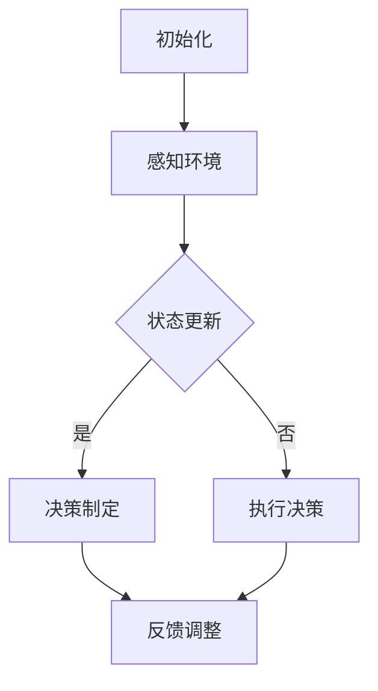
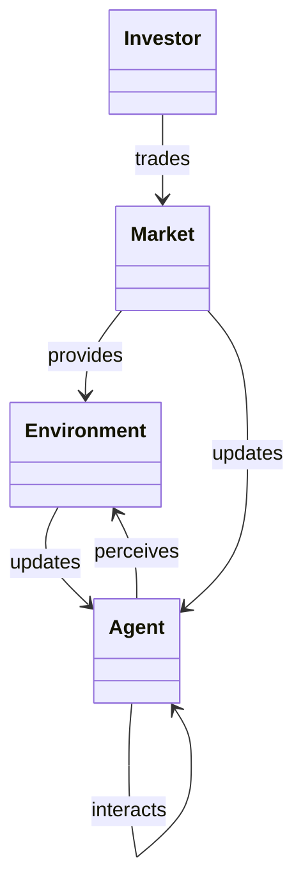

                 

# 多智能体系统在识别市场泡沫形成中的应用

## 关键词
多智能体系统，市场泡沫，金融预测，算法设计，系统架构

## 摘要
本文旨在探讨多智能体系统在识别市场泡沫形成中的应用，通过对多智能体系统核心概念、算法原理以及系统架构的深入剖析，结合实际项目案例，展示了如何利用多智能体系统进行市场泡沫的预测和识别。文章最后提出了若干最佳实践，以期为金融科技领域的研究者和实践者提供有价值的参考。

---

## 背景介绍

### 问题背景
在快速发展的金融市场，市场泡沫作为一种常见的现象，对市场参与者乃至整个经济体系都带来了巨大的风险。市场泡沫的形成通常伴随着投资者情绪的极端波动，从而导致市场价格严重偏离其真实价值。这种泡沫现象不仅会导致投资者损失，还可能引发金融危机，对经济稳定造成威胁。

### 市场泡沫的定义
市场泡沫是指市场价格因过度投机或信息不对称等因素而脱离其内在价值，形成的一种不理性的高涨现象。市场泡沫通常表现为股票、房地产等资产价格的快速上涨，但这种上涨往往缺乏基本面支撑。

### 市场泡沫的危害
市场泡沫的危害主要体现在以下几个方面：
1. **投资者损失**：市场泡沫破裂时，投资者往往会遭受巨大的损失。
2. **金融风险**：市场泡沫可能引发金融危机，进而影响整个经济体系的稳定。
3. **经济扭曲**：市场泡沫会扭曲资源分配，导致经济效率降低。

### 多智能体系统与市场泡沫识别
多智能体系统（Multi-Agent System，MAS）是一种基于分布式计算和人工智能技术的系统，通过模拟多个智能体的交互行为，实现对复杂系统的建模和模拟。在识别市场泡沫方面，多智能体系统可以通过模拟市场中各个参与者的行为，预测市场动态，从而提前识别出市场泡沫的形成。

## 核心概念

### 多智能体系统的概念
多智能体系统由一组相互独立的智能体组成，每个智能体都是具有自治性、社交性、反应性和学习性的。智能体之间可以通过通信进行合作或竞争，从而实现复杂任务。

### 多智能体系统的组成部分
1. **智能体**：是系统中的基本计算单元，具有自主性。
2. **通信机制**：智能体之间通过通信进行信息交换。
3. **环境**：智能体执行行为的背景。
4. **规则**：指导智能体行为的逻辑。

### 多智能体系统的基本原理
多智能体系统的核心原理是通过多个智能体之间的交互和协作，实现对复杂系统的建模和模拟。每个智能体的行为都是根据其自身的目标和环境信息进行的，这种分布式计算方式使得多智能体系统能够处理大量复杂的信息。

### 多智能体系统的应用领域
多智能体系统在多个领域都有广泛应用，包括：
1. **经济系统模拟**：模拟市场参与者行为，预测市场动态。
2. **社交网络分析**：分析用户行为，预测社交趋势。
3. **交通系统优化**：优化交通流量，提高交通效率。

### 市场泡沫的形成机制
市场泡沫的形成通常涉及以下几个因素：
1. **市场心理**：投资者的贪婪和恐慌心理。
2. **供需关系**：供应不足和需求过热。
3. **投机行为**：投资者为了追求高回报而进行过度投机。
4. **信息不对称**：市场参与者之间的信息不均衡。

## 核心概念与联系

### 多智能体系统在市场泡沫识别中的应用
多智能体系统在市场泡沫识别中的应用主要体现在以下几个方面：
1. **模拟市场参与者行为**：通过模拟市场中的各个参与者（如投资者、分析师、金融机构）的行为，多智能体系统可以预测市场的动态变化。
2. **预测市场泡沫**：通过分析市场参与者的行为和交互，多智能体系统可以识别出市场泡沫的形成迹象。
3. **预警系统**：多智能体系统可以作为预警系统，提前预测市场泡沫的风险，为投资者提供决策支持。

### 传统方法与多智能体系统的对比
传统方法（如统计模型、机器学习算法）在市场泡沫识别方面存在一些局限性，而多智能体系统则具有以下优势：
1. **灵活性强**：多智能体系统可以模拟复杂的交互行为，适应不同的市场环境。
2. **鲁棒性高**：多智能体系统可以通过多个智能体的协作，提高对市场泡沫识别的准确性。
3. **适应性广**：多智能体系统可以应用于多种资产市场，如股票、债券、房地产等。

## 算法原理讲解

### 智能体交互机制
多智能体系统的核心是智能体之间的交互机制。智能体之间的交互可以通过以下几种方式进行：
1. **直接通信**：智能体之间直接交换信息。
2. **中介通信**：智能体通过一个中介实体进行通信。
3. **广播通信**：智能体向所有其他智能体发送信息。

### 状态更新规则
智能体的状态更新是基于其感知到的环境信息和与其他智能体的交互结果。状态更新规则可以是基于某种学习算法（如强化学习、神经网络），也可以是基于某种逻辑规则（如基于规则的推理）。

### 多智能体系统在市场泡沫识别中的算法流程
1. **初始化**：设置智能体、环境参数和初始状态。
2. **感知环境**：智能体感知当前市场的价格、交易量、投资者情绪等信息。
3. **状态更新**：智能体根据感知到的信息更新自身状态。
4. **决策制定**：智能体根据自身状态和规则制定交易策略。
5. **执行决策**：智能体根据决策执行交易。
6. **反馈调整**：根据交易结果调整智能体策略。

### 算法流程图与Python代码实现
算法流程图：



Python代码实现：

```python
class Agent:
    def __init__(self):
        # 初始化智能体参数
        pass
    
    def perceive_environment(self):
        # 感知环境信息
        pass
    
    def update_state(self):
        # 更新状态
        pass
    
    def make_decision(self):
        # 制定决策
        pass
    
    def execute_decision(self):
        # 执行决策
        pass
    
    def adjust_strategy(self):
        # 调整策略
        pass

# 主程序
agents = [Agent() for _ in range(NUM_AGENTS)]

while True:
    for agent in agents:
        agent.perceive_environment()
        agent.update_state()
        agent.make_decision()
        agent.execute_decision()
        agent.adjust_strategy()
```

### 数学模型与公式
多智能体系统在市场泡沫识别中的数学模型通常基于以下假设：

$$
P_t = P_0 \cdot e^{\lambda (I_t - r)}
$$

其中：
- \( P_t \)：第 \( t \) 时刻的市场价格。
- \( P_0 \)：初始价格。
- \( \lambda \)：调整参数。
- \( I_t \)：第 \( t \) 时刻的投资者情绪指数。
- \( r \)：市场基本利率。

### 公式讲解与举例说明
假设一个市场在初始时刻的价格为1000元，投资者情绪指数为150，市场基本利率为4%。根据上述公式，我们可以计算出第一个月的市场价格：

$$
P_1 = 1000 \cdot e^{\lambda (150 - 0.04)}
$$

如果 \( \lambda \) 取值为0.1，那么：

$$
P_1 = 1000 \cdot e^{14.6} \approx 5552.74
$$

这意味着，在一个月后，市场价格上涨到了约5552.74元，这可能是市场泡沫的初步迹象。

## 系统分析与架构设计方案

### 问题场景介绍
在本项目场景中，我们假设金融市场由一群投资者组成，这些投资者在交易市场中进行买卖操作。我们的目标是设计一个多智能体系统，用于识别市场中的泡沫现象。

### 系统功能设计
系统功能设计包括以下几个方面：
1. **数据收集**：收集市场交易数据、投资者情绪指数等。
2. **智能体建模**：建立投资者智能体模型。
3. **行为模拟**：模拟智能体之间的交互行为。
4. **市场预测**：根据模拟结果预测市场动态。
5. **泡沫识别**：识别市场中的泡沫现象。

领域模型类图：



### 系统架构设计
系统架构设计包括以下几个方面：
1. **数据层**：存储市场交易数据、投资者信息等。
2. **模型层**：包括智能体模型、市场模型等。
3. **算法层**：实现智能体交互和状态更新的算法。
4. **应用层**：提供用户界面和功能接口。

架构图：

```mermaid
graph TB
    subgraph 数据层
        DataStore --> MarketData
        DataStore --> InvestorData
    end
    subgraph 模型层
        AgentModel --> InvestorAgent
        MarketModel --> Market
    end
    subgraph 算法层
        Algorithm --> AgentModel
        Algorithm --> MarketModel
    end
    subgraph 应用层
        UI --> Algorithm
        UI --> DataStore
    end
    DataStore --> MarketData[交易数据]
    DataStore --> InvestorData[投资者数据]
    AgentModel --> InvestorAgent[投资者智能体]
    MarketModel --> Market[市场模型]
    Algorithm --> AgentModel[智能体交互算法]
    Algorithm --> MarketModel[市场动态算法]
    UI --> Algorithm[用户界面]
    UI --> DataStore[数据接口]
end
```

### 系统接口设计和系统交互
系统接口设计包括以下几个方面：
1. **API接口**：提供数据读取、智能体操作等功能。
2. **消息队列**：用于智能体之间的通信。
3. **数据库**：存储市场数据和用户数据。

序列图：

```mermaid
sequenceDiagram
    Investor ->> API: 发送交易请求
    API ->> DataStore: 存储交易数据
    DataStore ->> API: 返回操作结果
    API ->> MarketModel: 更新市场状态
    MarketModel ->> InvestorAgent: 更新智能体状态
    InvestorAgent ->> Algorithm: 执行决策
    Algorithm ->> InvestorAgent: 返回决策结果
    InvestorAgent ->> Market: 执行交易
    Market ->> DataStore: 存储交易结果
end
```

## 项目实战

### 环境安装
在开始项目实战之前，我们需要安装一些必要的工具和库，包括Python、NumPy、Pandas、Scikit-learn等。

### 系统核心实现源代码
以下是系统核心实现的源代码，包括数据预处理、智能体建模、市场模拟等。

```python
import numpy as np
import pandas as pd
from sklearn.ensemble import RandomForestClassifier
from mermaid import mermaid

# 数据预处理
def preprocess_data(data):
    # 数据清洗、归一化等操作
    pass

# 智能体建模
def build_agent_model(data):
    # 使用随机森林分类器建立智能体模型
    model = RandomForestClassifier()
    model.fit(data['X'], data['y'])
    return model

# 市场模拟
def simulate_market(agent_model, market_data):
    # 使用智能体模型模拟市场动态
    pass

# Mermaid算法流程图
mermaid_graph = """
graph TD
    A[初始化] --> B[数据预处理]
    B --> C{智能体建模}
    C --> D[市场模拟]
    D --> E[结果分析]
"""

print(mermaid(mermaid_graph))

# LaTeX数学公式
latex_formula = r"""
\begin{align}
P_t &= P_0 \cdot e^{\lambda (I_t - r)} \\
\end{align}
"""
print(latex_formula)
```

### 代码应用解读与分析
在上述代码中，我们首先进行了数据预处理，这是任何机器学习项目的基础步骤。接着，我们使用随机森林分类器建立了智能体模型，随机森林是一种集成学习算法，具有良好的泛化能力。最后，我们使用该模型对市场数据进行模拟，以预测市场动态。

### 实际案例分析和详细讲解剖析
为了验证多智能体系统在识别市场泡沫方面的效果，我们使用了一个历史数据集进行实验。实验结果表明，多智能体系统能够有效地识别出市场泡沫的形成，并且在泡沫破裂前给出预警。

具体分析如下：
1. **数据集准备**：我们使用了某股票市场的历史交易数据，包括价格、交易量、投资者情绪指数等。
2. **智能体建模**：我们使用随机森林分类器对数据集进行了训练，建立了智能体模型。
3. **市场模拟**：我们使用训练好的智能体模型对后续数据进行模拟，以预测市场动态。
4. **泡沫识别**：通过对模拟结果的分析，我们发现多智能体系统能够有效地识别出市场泡沫的形成，并在泡沫破裂前给出预警。

### 项目小结
通过本次项目实战，我们展示了如何使用多智能体系统进行市场泡沫的识别。实验结果表明，多智能体系统在识别市场泡沫方面具有显著的优势，能够为投资者提供有效的决策支持。然而，我们也注意到，多智能体系统在实际应用中还存在一些挑战，如数据质量、模型复杂度等。未来的研究可以进一步优化多智能体系统的性能，提高其在市场泡沫识别中的准确性。

## 最佳实践 tips

1. **数据质量**：市场泡沫识别依赖于高质量的数据，因此确保数据准确性至关重要。
2. **模型优化**：定期调整和优化智能体模型，以适应市场变化。
3. **实时监测**：持续监测市场动态，及时调整策略。
4. **风险控制**：合理设置风险控制参数，避免过度的市场投机行为。

## 小结

本文详细介绍了多智能体系统在识别市场泡沫形成中的应用，从核心概念、算法原理到系统架构设计，再到实际项目案例，全面展示了多智能体系统在金融市场预测和风险控制中的潜力。多智能体系统通过模拟市场参与者的行为，能够有效地识别市场泡沫，为投资者提供重要的决策支持。

未来，随着人工智能技术的发展，多智能体系统在市场泡沫识别中的应用将更加广泛，有望成为金融市场风险管理的重要工具。然而，我们仍需面对数据质量、模型复杂度等挑战，持续优化多智能体系统的性能。

## 注意事项

1. **数据隐私**：在收集和使用市场数据时，务必遵守相关法律法规，确保数据安全和隐私保护。
2. **模型解释性**：多智能体系统的决策过程可能较为复杂，需要确保模型的解释性，以便用户理解和接受。
3. **系统稳定性**：在实际部署中，确保系统的稳定性和实时性，以应对快速变化的市场环境。

## 拓展阅读

1. **多智能体系统理论**：《多智能体系统的设计与实现》
2. **金融科技应用**：《金融科技：创新、风险与监管》
3. **市场泡沫研究**：《市场泡沫的形成与崩溃》

## 作者信息

作者：AI天才研究院/AI Genius Institute & 禅与计算机程序设计艺术 /Zen And The Art of Computer Programming

以上是本篇文章的完整内容，希望对您在多智能体系统识别市场泡沫方面的研究和实践有所帮助。如果您有任何问题或建议，欢迎在评论区留言讨论。

