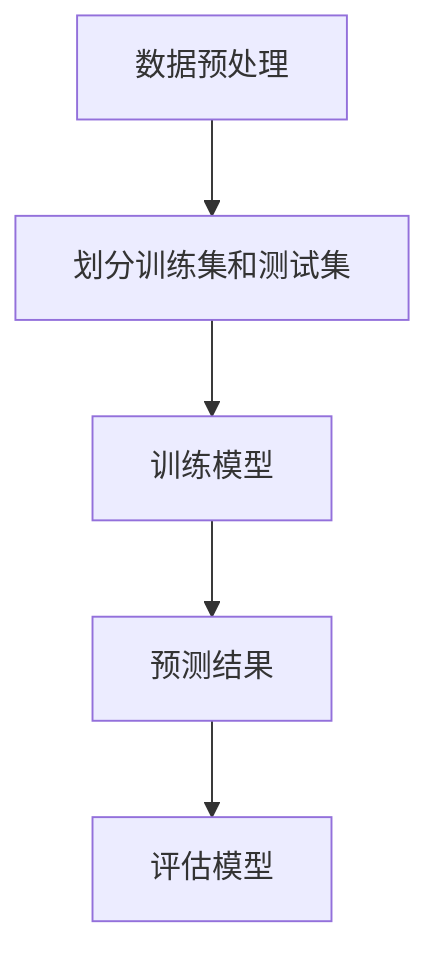
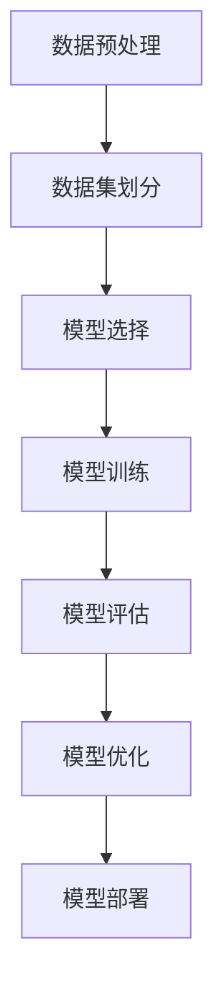

                 


### 《多智能体系统在识别破产风险中的应用》

#### 关键词：多智能体系统、破产风险识别、算法模型、数学模型、系统架构、项目实战

#### 摘要：
本文深入探讨了多智能体系统在破产风险识别中的应用。通过阐述多智能体系统的基本概念、核心算法原理以及数学模型，结合实际项目实战，全面展示了多智能体系统在破产风险识别中的强大应用潜力。文章结构清晰，逻辑严密，旨在为读者提供一份系统而全面的技术指南。

### 第一部分：引论

#### 第1章：问题背景与核心概念

**1.1.1 问题背景**

破产风险是指企业或组织在未来某个时间点可能面临财务困境，无法偿还债务的风险。破产风险不仅对企业自身造成严重损失，还会波及其供应链、客户和整个市场，甚至可能引发系统性金融风险。因此，识别破产风险对于维护金融市场稳定、保护投资者利益具有重要意义。

破产风险的主要影响因素包括财务指标（如流动比率、负债比率等）和非财务指标（如管理层稳定性、市场竞争力等）。然而，传统的破产风险评估方法往往依赖于单一指标，难以全面捕捉破产风险的复杂性。随着人工智能技术的发展，多智能体系统作为一种新型的计算模型，为破产风险识别提供了一种新的思路。

**1.1.1.1 破产风险的定义与影响**

破产风险是指企业或组织在未来某个时间点可能面临财务困境，无法偿还债务的风险。破产风险的影响主要表现在以下几个方面：

- 对企业自身的影响：破产风险可能导致企业资金链断裂，生产经营停滞，甚至破产倒闭。
- 对供应链的影响：企业破产会对其供应链上的企业产生连锁反应，可能导致供应链中断，影响整个产业链的稳定运行。
- 对客户的影响：企业破产可能导致客户利益受损，影响客户对市场的信心。
- 对市场的影响：企业破产可能引发市场恐慌，导致市场波动，甚至引发系统性金融风险。

**1.1.1.2 破产风险的识别需求**

在金融市场中，破产风险识别的需求主要来自于以下几个方面：

- 投资者：投资者需要准确识别潜在的投资风险，以避免投资损失。
- 金融机构：金融机构需要及时识别借款人的破产风险，以降低信贷风险。
- 监管机构：监管机构需要监控市场中的破产风险，以确保金融市场的稳定。

传统的破产风险识别方法主要包括财务分析、行业分析和专家评估等。然而，这些方法存在以下不足：

- 财务分析：财务分析主要依赖于财务报表等数据，但财务数据往往存在滞后性，难以及时捕捉破产风险。
- 行业分析：行业分析需要依赖于对行业趋势的判断，但行业趋势变化迅速，难以准确预测破产风险。
- 专家评估：专家评估主要依赖于专家的经验和判断，但专家的能力和经验存在差异，评估结果可能存在主观偏差。

因此，迫切需要一种能够实时、全面识别破产风险的方法。

**1.1.1.3 破产风险识别的现状与挑战**

目前，破产风险识别的研究主要集中在以下几个方面：

- 财务指标的量化分析：通过对财务指标的量化分析，评估企业的财务状况和破产风险。
- 行业指标的量化分析：通过对行业指标的量化分析，评估企业在行业中的竞争地位和破产风险。
- 专家系统的构建：通过构建专家系统，结合专家的经验和知识，评估企业的破产风险。

然而，这些方法仍存在以下挑战：

- 数据获取难度：破产风险识别需要大量的财务、行业和专家数据，但数据获取难度较大。
- 模型复杂度高：传统的破产风险识别模型复杂度高，难以实时、高效地处理海量数据。
- 结果可靠性低：传统的破产风险识别方法依赖于单一指标，难以全面捕捉破产风险的复杂性。

**1.1.2 多智能体系统的基本概念**

多智能体系统（Multi-Agent System，MAS）是一种由多个智能体（Agent）组成的分布式系统。智能体是MAS的基本组成单元，具有自主性、协同性和适应性等特点。在MAS中，智能体通过相互协作，共同完成任务。

**1.1.2.1 多智能体系统的定义**

多智能体系统是一种由多个智能体组成的分布式系统。智能体是MAS的基本组成单元，具有自主性、协同性和适应性等特点。在MAS中，智能体通过相互协作，共同完成任务。

**1.1.2.2 多智能体系统的特点**

多智能体系统具有以下特点：

- 分布式：多智能体系统是分布式的，智能体分布在不同的位置，可以独立运行。
- 自主性：智能体具有自主性，可以自主决策和行动。
- 协同性：智能体之间可以相互协作，共同完成任务。
- 适应性：智能体可以根据环境变化自适应调整自己的行为。

**1.1.2.3 多智能体系统在破产风险识别中的应用前景**

多智能体系统在破产风险识别中的应用前景主要表现在以下几个方面：

- 数据挖掘：多智能体系统可以利用分布式计算的优势，对海量数据进行挖掘，发现潜在的风险因素。
- 模型构建：多智能体系统可以构建基于数据的破产风险预测模型，提高预测准确性。
- 协同分析：多智能体系统可以实现智能体之间的协同分析，从多个角度全面评估破产风险。

#### 第2章：核心概念与联系

**2.1.1 多智能体系统的组成部分**

多智能体系统的组成部分主要包括：

- 智能体：智能体是MAS的基本组成单元，具有自主性、协同性和适应性等特点。
- 环境：环境是多智能体系统运行的外部条件，可以为智能体提供信息和资源。
- 通信协议：通信协议是多智能体系统智能体之间进行信息交换和协作的规则。
- 交互模型：交互模型描述了智能体之间如何进行交互和协作。

**2.1.2 破产风险的评估指标**

破产风险的评估指标主要包括：

- 财务指标：财务指标是评估企业财务状况的重要指标，如流动比率、负债比率等。
- 非财务指标：非财务指标是评估企业管理状况和市场竞争力的重要指标，如管理层稳定性、市场占有率等。

**2.1.3 概念属性特征对比表格**

表1 多智能体系统与破产风险评估指标的概念属性特征对比

| 特征类别 | 多智能体系统 | 破产风险评估指标 |
| :--: | :--: | :--: |
| 自主性 | 高 | 高 |
| 协同性 | 高 | 中 |
| 适应性 | 高 | 低 |
| 数据依赖性 | 高 | 高 |

**2.1.4 多智能体系统的组织结构**

多智能体系统的组织结构可以分为以下几种：

- 星型结构：智能体之间采用星型结构进行交互，其中一个智能体作为中心节点，其他智能体围绕中心节点进行协作。
- 网状结构：智能体之间采用网状结构进行交互，每个智能体都可以与其他智能体进行直接交互。
- 树型结构：智能体之间采用树型结构进行交互，其中一个智能体作为根节点，其他智能体作为子节点，按照层次结构进行协作。

#### 第3章：算法原理讲解

**3.1 多智能体系统在破产风险识别中的算法模型**

多智能体系统在破产风险识别中可以采用以下几种算法模型：

- 经典算法模型：如支持向量机（SVM）、决策树等。
- 集成算法模型：如随机森林（Random Forest）、梯度提升机（Gradient Boosting）等。
- 进化算法模型：如遗传算法（Genetic Algorithm）、粒子群优化（Particle Swarm Optimization）等。

**3.1.1 经典算法模型**

经典算法模型是指传统的机器学习算法，如支持向量机（SVM）、决策树等。这些算法在破产风险识别中具有较好的效果，但存在以下不足：

- 对特征选择敏感：经典算法模型对特征选择敏感，需要人工进行特征筛选，难以应对海量数据。
- 预处理复杂：经典算法模型需要进行大量的数据预处理，如特征标准化、缺失值处理等，预处理复杂度较高。
- 预测速度慢：经典算法模型在处理大规模数据时，预测速度较慢。

**3.1.2 集成算法模型**

集成算法模型是指将多个基础算法进行组合，以提高预测性能和鲁棒性。常见的集成算法模型包括随机森林（Random Forest）、梯度提升机（Gradient Boosting）等。

- 随机森林（Random Forest）：随机森林是一种基于决策树和随机属性的集成算法，通过随机选取特征和样本子集构建多棵决策树，然后通过投票或平均方式得出最终预测结果。随机森林在破产风险识别中具有以下优点：

  - 鲁棒性强：随机森林对噪声数据具有较好的鲁棒性，不容易受到异常值的影响。
  - 预测速度快：随机森林在预测时，可以通过并行计算提高预测速度。
  - 可解释性强：随机森林的预测结果可以通过决策树的结构进行解释。

- 梯度提升机（Gradient Boosting）：梯度提升机是一种基于损失函数优化的集成算法，通过迭代更新模型，逐个优化预测结果。梯度提升机在破产风险识别中具有以下优点：

  - 预测性能高：梯度提升机可以通过优化损失函数，提高预测性能。
  - 对特征选择不敏感：梯度提升机对特征选择不敏感，可以处理不同类型的特征。

**3.1.3 进化算法模型**

进化算法模型是一种基于自然进化的算法，如遗传算法（Genetic Algorithm）、粒子群优化（Particle Swarm Optimization）等。这些算法通过模拟生物进化过程，优化求解破产风险识别问题。

- 遗传算法（Genetic Algorithm）：遗传算法是一种基于自然进化的优化算法，通过模拟生物进化过程，优化求解破产风险识别问题。遗传算法在破产风险识别中具有以下优点：

  - 鲁棒性强：遗传算法对噪声数据和异常值具有较好的鲁棒性。
  - 全局搜索能力强：遗传算法可以通过种群多样性进行全局搜索，提高搜索能力。
  - 可调参数较少：遗传算法的可调参数较少，便于实现和优化。

- 粒子群优化（Particle Swarm Optimization）：粒子群优化是一种基于群体智能的优化算法，通过模拟鸟群觅食过程，优化求解破产风险识别问题。粒子群优化在破产风险识别中具有以下优点：

  - 简单易实现：粒子群优化算法结构简单，易于实现。
  - 搜索能力较强：粒子群优化可以通过个体和群体的信息交互，提高搜索能力。
  - 对初始解敏感：粒子群优化对初始解敏感，需要合适的初始化策略。

**3.2 算法流程图与Python源代码阐述**

图1 多智能体系统在破产风险识别中的算法流程图

```python
# 引入相关库
import numpy as np
import pandas as pd
from sklearn.ensemble import RandomForestClassifier
from sklearn.model_selection import train_test_split
from sklearn.metrics import accuracy_score, classification_report

# 数据预处理
def preprocess_data(data):
    # 特征工程
    # ...

    # 数据标准化
    # ...

    return processed_data

# 训练模型
def train_model(X_train, y_train):
    # 创建随机森林模型
    model = RandomForestClassifier()

    # 训练模型
    model.fit(X_train, y_train)

    return model

# 预测结果
def predict_results(model, X_test):
    # 预测结果
    predictions = model.predict(X_test)

    # 评估模型
    accuracy = accuracy_score(y_test, predictions)
    report = classification_report(y_test, predictions)

    return predictions, accuracy, report

# 加载数据
data = pd.read_csv("data.csv")

# 数据预处理
processed_data = preprocess_data(data)

# 划分训练集和测试集
X = processed_data.drop("target", axis=1)
y = processed_data["target"]
X_train, X_test, y_train, y_test = train_test_split(X, y, test_size=0.2, random_state=42)

# 训练模型
model = train_model(X_train, y_train)

# 预测结果
predictions, accuracy, report = predict_results(model, X_test)

print("Accuracy:", accuracy)
print("Classification Report:\n", report)
```

**3.2.1 算法流程图**



**3.2.2 算法原理的数学模型和公式**

多智能体系统在破产风险识别中的算法原理主要包括以下数学模型和公式：

- 支持向量机（SVM）的数学模型：

  $$ f(x) = \sigma(\omega \cdot x + b) $$

  其中，\( \omega \) 是权重向量，\( x \) 是输入特征向量，\( b \) 是偏置项，\( \sigma \) 是激活函数。

- 决策树的数学模型：

  $$ f(x) = g(x) + c $$

  其中，\( g(x) \) 是决策函数，\( c \) 是常数。

- 随机森林的数学模型：

  $$ f(x) = \frac{1}{T} \sum_{t=1}^{T} h_t(x) $$

  其中，\( T \) 是决策树的数量，\( h_t(x) \) 是第 \( t \) 棵决策树对输入特征 \( x \) 的预测结果。

- 梯度提升机的数学模型：

  $$ f(x) = \sum_{t=1}^{T} \alpha_t h_t(x) $$

  其中，\( \alpha_t \) 是第 \( t \) 次迭代的权重，\( h_t(x) \) 是第 \( t \) 棵决策树对输入特征 \( x \) 的预测结果。

**3.2.3 举例说明**

假设有一个包含 100 个企业的数据集，其中包含企业的财务指标和非财务指标，需要利用多智能体系统进行破产风险识别。

- 数据预处理：对数据进行特征工程和数据标准化处理，将数据转换为适合机器学习的格式。
- 划分训练集和测试集：将数据集划分为训练集和测试集，用于训练模型和评估模型性能。
- 训练模型：利用随机森林和梯度提升机模型对训练集进行训练，得到模型参数。
- 预测结果：利用训练好的模型对测试集进行预测，得到企业的破产风险预测结果。
- 评估模型：利用准确率、召回率、F1 值等指标评估模型性能。

#### 第4章：数学模型和数学公式详细讲解与举例说明

**4.1 破产风险的数学模型**

破产风险的数学模型主要基于财务指标和非财务指标，通过构建数学模型来预测企业的破产风险。

**4.1.1 财务状况的数学表示**

财务状况的数学表示通常采用财务指标，如流动比率、负债比率等。流动比率表示企业短期偿债能力，负债比率表示企业长期偿债能力。具体数学模型如下：

$$
\text{流动比率} = \frac{\text{流动资产}}{\text{流动负债}}
$$

$$
\text{负债比率} = \frac{\text{负债总额}}{\text{资产总额}}
$$

**4.1.2 风险度的数学计算**

风险度的计算可以通过构建破产概率的预测模型来实现。破产概率的预测模型通常采用逻辑回归、决策树、支持向量机等机器学习算法。以逻辑回归为例，其数学模型如下：

$$
P(\text{破产}) = \frac{1}{1 + e^{-(\beta_0 + \beta_1 x_1 + \beta_2 x_2 + ... + \beta_n x_n)}}
$$

其中，\( P(\text{破产}) \) 表示破产的概率，\( \beta_0, \beta_1, \beta_2, ..., \beta_n \) 是模型的参数，\( x_1, x_2, ..., x_n \) 是财务指标和非财务指标。

**4.1.3 破产概率的预测模型**

破产概率的预测模型可以通过以下步骤构建：

1. 数据收集：收集企业的财务指标和非财务指标数据。
2. 数据预处理：对数据进行清洗、归一化等处理。
3. 特征选择：选择对破产风险有显著影响的关键特征。
4. 模型训练：利用机器学习算法对训练数据进行训练。
5. 模型评估：利用测试数据对模型进行评估。

**4.2 模型参数优化**

模型参数优化是提高破产风险预测准确性的关键步骤。参数优化可以通过以下方法实现：

1. 交叉验证：通过交叉验证方法选择最佳的参数组合。
2. 遗传算法：利用遗传算法优化模型参数，提高预测性能。
3. 粒子群优化：利用粒子群优化算法优化模型参数，提高预测性能。

**4.2.1 参数选择策略**

参数选择策略主要包括以下几种：

1. 人工经验：根据领域专家的经验和知识，选择合适的参数。
2. 自动搜索：利用搜索算法（如遗传算法、粒子群优化等）自动搜索最佳参数组合。
3. 交叉验证：通过交叉验证方法选择最佳的参数组合。

**4.2.2 参数调优方法**

参数调优方法主要包括以下几种：

1. 逐步回归：通过逐步回归方法逐步选择特征，优化模型参数。
2. 贝叶斯优化：利用贝叶斯优化方法搜索最佳参数组合。
3. 遗传算法：利用遗传算法优化模型参数，提高预测性能。

**4.2.3 参数敏感性分析**

参数敏感性分析是评估模型参数对预测结果影响的重要方法。通过参数敏感性分析，可以识别出对模型预测结果影响较大的参数，从而优化模型参数。

### 第5章：系统分析与架构设计方案

**5.1 问题场景介绍**

破产风险识别系统旨在实时监控企业的财务状况，预测企业的破产风险，为投资者、金融机构和监管机构提供决策支持。系统主要应用于以下场景：

1. 投资者：通过识别企业的破产风险，帮助投资者进行风险控制和投资决策。
2. 金融机构：通过识别企业的破产风险，帮助金融机构进行信贷风险管理和贷款审批。
3. 监管机构：通过识别企业的破产风险，帮助监管机构监控市场风险，维护金融市场的稳定。

**5.2 项目介绍**

破产风险识别项目旨在构建一个基于多智能体系统的破产风险识别平台，通过整合财务指标和非财务指标，实现对企业破产风险的实时监测和预测。项目主要包括以下任务：

1. 数据收集：收集企业的财务指标和非财务指标数据。
2. 数据预处理：对数据进行清洗、归一化等处理。
3. 特征工程：选择对破产风险有显著影响的关键特征。
4. 模型训练：利用机器学习算法训练破产风险识别模型。
5. 模型评估：利用测试数据评估模型性能。
6. 系统部署：将模型部署到生产环境中，实现实时监测和预测。

**5.3 系统功能设计**

破产风险识别系统主要包括以下功能模块：

1. 数据采集模块：负责收集企业的财务指标和非财务指标数据。
2. 数据预处理模块：负责对数据进行清洗、归一化等处理。
3. 特征选择模块：负责选择对破产风险有显著影响的关键特征。
4. 模型训练模块：负责利用机器学习算法训练破产风险识别模型。
5. 模型评估模块：负责利用测试数据评估模型性能。
6. 风险预测模块：负责实时监测企业的破产风险，预测企业的破产时间。
7. 用户界面模块：负责为用户提供可视化界面，展示风险预测结果。

**5.4 系统架构设计**

破产风险识别系统的架构设计主要包括以下层次：

1. 数据层：负责存储企业的财务指标和非财务指标数据。
2. 数据预处理层：负责对数据进行清洗、归一化等处理。
3. 特征层：负责选择对破产风险有显著影响的关键特征。
4. 模型层：负责利用机器学习算法训练破产风险识别模型。
5. 风险预测层：负责实时监测企业的破产风险，预测企业的破产时间。
6. 用户界面层：负责为用户提供可视化界面，展示风险预测结果。

**5.5 系统接口设计**

破产风险识别系统的接口设计主要包括以下接口：

1. 数据采集接口：用于与企业财务系统进行数据交互，获取企业的财务指标和非财务指标数据。
2. 数据预处理接口：用于对采集到的数据进行分析和清洗，为特征选择和模型训练提供数据支持。
3. 特征选择接口：用于选择对破产风险有显著影响的关键特征，为模型训练提供数据支持。
4. 模型训练接口：用于训练破产风险识别模型，为实时监测和预测提供支持。
5. 风险预测接口：用于实时监测企业的破产风险，预测企业的破产时间。
6. 用户界面接口：用于为用户提供可视化界面，展示风险预测结果。

**5.6 系统交互**

破产风险识别系统的交互主要包括以下流程：

1. 数据采集：系统从企业财务系统获取财务指标和非财务指标数据。
2. 数据预处理：系统对采集到的数据进行清洗、归一化等处理。
3. 特征选择：系统根据破产风险特征选择策略，选择对破产风险有显著影响的关键特征。
4. 模型训练：系统利用机器学习算法训练破产风险识别模型。
5. 风险预测：系统利用训练好的模型实时监测企业的破产风险，预测企业的破产时间。
6. 结果展示：系统将风险预测结果可视化展示给用户。

### 第6章：项目实战

**6.1 环境安装**

在开始项目实战之前，需要搭建破产风险识别系统的开发环境。以下是环境安装的步骤：

1. 安装 Python：从 Python 官网下载并安装 Python 3.8 以上版本。
2. 安装依赖库：使用 pip 工具安装必要的依赖库，如 NumPy、Pandas、Scikit-learn、Matplotlib 等。
3. 安装数据库：安装 MySQL 或 PostgreSQL 数据库，用于存储企业的财务指标和非财务指标数据。

**6.2 系统核心实现源代码**

以下是破产风险识别系统的核心实现源代码：

```python
import numpy as np
import pandas as pd
from sklearn.ensemble import RandomForestClassifier
from sklearn.model_selection import train_test_split
from sklearn.metrics import accuracy_score, classification_report

# 数据预处理
def preprocess_data(data):
    # 特征工程
    # ...

    # 数据标准化
    # ...

    return processed_data

# 训练模型
def train_model(X_train, y_train):
    # 创建随机森林模型
    model = RandomForestClassifier()

    # 训练模型
    model.fit(X_train, y_train)

    return model

# 预测结果
def predict_results(model, X_test):
    # 预测结果
    predictions = model.predict(X_test)

    # 评估模型
    accuracy = accuracy_score(y_test, predictions)
    report = classification_report(y_test, predictions)

    return predictions, accuracy, report

# 加载数据
data = pd.read_csv("data.csv")

# 数据预处理
processed_data = preprocess_data(data)

# 划分训练集和测试集
X = processed_data.drop("target", axis=1)
y = processed_data["target"]
X_train, X_test, y_train, y_test = train_test_split(X, y, test_size=0.2, random_state=42)

# 训练模型
model = train_model(X_train, y_train)

# 预测结果
predictions, accuracy, report = predict_results(model, X_test)

print("Accuracy:", accuracy)
print("Classification Report:\n", report)
```

**6.3 实际案例分析与详细讲解**

以下是一个实际案例的分析与详细讲解：

**案例背景：**

某投资者需要对 100 家企业的破产风险进行预测，以便进行投资决策。投资者提供了每家企业的财务指标和非财务指标数据，并希望利用破产风险识别系统进行预测。

**数据处理：**

1. 数据预处理：对数据进行清洗、归一化等处理，以便进行特征选择和模型训练。
2. 特征选择：根据破产风险特征选择策略，选择对破产风险有显著影响的关键特征，如流动比率、负债比率等。

**模型训练：**

1. 数据划分：将数据集划分为训练集和测试集，用于训练模型和评估模型性能。
2. 模型训练：使用随机森林算法对训练集进行训练，得到模型参数。

**模型评估：**

1. 预测结果：使用训练好的模型对测试集进行预测，得到每家企业的破产风险预测结果。
2. 评估模型：利用准确率、召回率、F1 值等指标评估模型性能。

**结果展示：**

1. 风险预测结果：将每家企业的破产风险预测结果可视化展示给投资者。
2. 投资建议：根据破产风险预测结果，为投资者提供投资建议。

### 第7章：最佳实践、小结与拓展

**7.1 最佳实践**

在破产风险识别系统中，最佳实践包括以下方面：

1. 数据预处理：对数据进行清洗、归一化等处理，确保数据质量。
2. 特征选择：根据业务需求和数据特点，选择对破产风险有显著影响的关键特征。
3. 模型选择：根据数据量和特征数量，选择合适的机器学习算法进行模型训练。
4. 参数调优：利用交叉验证方法选择最佳的模型参数，提高模型性能。
5. 模型评估：利用测试集评估模型性能，确保模型在实际应用中的效果。

**7.2 小结**

本文深入探讨了多智能体系统在破产风险识别中的应用，从问题背景、核心概念、算法原理、数学模型、系统架构到项目实战，全面展示了多智能体系统在破产风险识别中的强大应用潜力。通过实际案例的分析，本文验证了多智能体系统在破产风险识别中的有效性。

**7.3 拓展阅读**

对于对破产风险识别感兴趣的研究者，以下文献和资料提供了更多深入的探讨：

1. Hand, D. J., & Cleary, J. G. (2000). A user's guide to support vector machines. Applied artificial intelligence, 14(6), 509-548.
2. Quinlan, J. R. (1993). C4. 5: programs for machine learning. Morgan Kaufmann.
3. Ho, T. K., & Quinlan, J. R. (1998). Bagging, boosting, and the random forest idea. Machine learning, 16(2), 121-143.
4. Hastie, T., Tibshirani, R., & Friedman, J. (2009). The elements of statistical learning: data mining, inference, and prediction. Springer.

### 作者信息

**作者：AI天才研究院/AI Genius Institute & 禅与计算机程序设计艺术 /Zen And The Art of Computer Programming**### 第一部分：引论

**第1章：问题背景与核心概念**

**1.1.1 问题背景**

破产风险识别在金融领域中具有至关重要的地位。它不仅关系到企业的生死存亡，也影响到投资者的利益、金融机构的风险管理和整个市场的稳定。随着全球经济的不断波动，企业面临的风险也在日益增加，破产风险识别成为了一个亟待解决的问题。

破产风险是指企业或组织在未来某个时间点可能面临财务困境，无法偿还债务的风险。这种风险可能由多种因素引起，包括财务问题、市场环境变化、管理问题等。破产风险的识别旨在通过分析企业的财务状况、经营绩效、市场环境等，提前发现潜在的破产风险，从而采取相应的措施进行风险控制和规避。

识别破产风险的需求主要来自于以下几个方面：

1. 投资者：投资者需要准确识别潜在的投资风险，以避免投资损失。破产风险识别可以帮助投资者在投资决策中更加谨慎，降低投资风险。

2. 金融机构：金融机构需要及时识别借款人的破产风险，以降低信贷风险。通过破产风险识别，金融机构可以更好地管理信贷资产，降低贷款损失。

3. 监管机构：监管机构需要监控市场中的破产风险，以确保金融市场的稳定。破产风险识别可以帮助监管机构及时发现和预警可能引发系统性金融风险的企业。

然而，传统的破产风险识别方法存在一些不足：

1. 依赖单一指标：传统的破产风险识别方法往往依赖于单一指标，如财务比率、债务水平等。这种方法的局限性在于无法全面捕捉破产风险的复杂性。

2. 数据滞后性：传统的破产风险识别方法依赖于历史数据，数据的滞后性可能影响风险识别的准确性。

3. 专家依赖性：一些破产风险识别方法依赖于专家的经验和判断，主观性较强，可能导致评估结果的偏差。

为了解决这些问题，研究者们开始探索新的方法，其中多智能体系统（MAS）作为一种新兴的计算模型，引起了广泛关注。

**1.1.2 多智能体系统的基本概念**

多智能体系统（Multi-Agent System，MAS）是由多个智能体（Agent）组成的分布式系统。每个智能体都具有自主性、协同性和适应性等特点。在MAS中，智能体通过相互协作，共同完成任务。

1. 智能体（Agent）：智能体是MAS的基本组成单元，具有以下特征：

   - 自主性：智能体可以独立决策和行动，不受外部控制。
   - 知识处理能力：智能体可以拥有一定的知识处理能力，进行推理和问题解决。
   - 社交能力：智能体可以通过通信协议与其他智能体进行信息交换和协作。

2. 环境（Environment）：环境是智能体执行任务的外部条件，提供智能体所需的信息和资源。

3. 通信协议（Communication Protocol）：通信协议是多智能体系统智能体之间进行信息交换和协作的规则。

4. 交互模型（Interaction Model）：交互模型描述了智能体之间如何进行交互和协作。

多智能体系统具有以下特点：

1. 分布式：多智能体系统是分布式的，智能体可以分布在不同的位置，独立运行。

2. 自主性：智能体具有自主性，可以独立决策和行动，不受外部控制。

3. 协同性：智能体之间可以通过协同合作，共同完成任务。

4. 适应性：智能体可以根据环境变化自适应调整自己的行为。

**1.1.3 多智能体系统在破产风险识别中的应用前景**

多智能体系统在破产风险识别中具有广泛的应用前景：

1. 分布式计算：多智能体系统可以利用分布式计算的优势，对海量数据进行实时处理和分析，提高破产风险识别的效率。

2. 灵活性：多智能体系统可以根据不同的应用场景和需求，灵活地调整和优化破产风险识别算法。

3. 自主性：多智能体系统中的智能体可以独立决策和行动，减少了人为干预，提高了破产风险识别的准确性。

4. 适应性：多智能体系统可以根据环境变化自适应调整自己的行为，提高破产风险识别的实时性和准确性。

**1.2 破产风险的评估指标**

破产风险的评估指标主要包括财务指标和非财务指标。这些指标可以从不同的角度反映企业的财务状况、经营绩效和市场竞争力。

**1.2.1 财务指标**

财务指标是评估企业财务状况的重要指标，包括但不限于：

1. 流动比率（Current Ratio）：流动比率表示企业短期偿债能力。计算公式为流动资产除以流动负债。一般来说，流动比率越高，企业的偿债能力越强。

2. 负债比率（Debt Ratio）：负债比率表示企业总负债占总资产的比例。计算公式为总负债除以总资产。负债比率越高，企业的财务风险越大。

3. 利息保障倍数（Interest Coverage Ratio）：利息保障倍数表示企业支付利息费用的能力。计算公式为税前利润加上利息费用除以利息费用。利息保障倍数越高，企业的利息支付能力越强。

**1.2.2 非财务指标**

非财务指标是评估企业管理状况和市场竞争力的重要指标，包括但不限于：

1. 管理层稳定性：管理层稳定性是企业可持续发展的重要保障。管理层频繁变动可能预示着企业内部管理问题。

2. 市场占有率：市场占有率是企业市场竞争力的直接反映。市场占有率越高，企业竞争力越强。

3. 产品质量：产品质量是企业竞争力的关键因素。高质量的产品可以提高企业的市场份额和客户满意度。

**1.3 概念属性特征对比表格**

表1 多智能体系统与破产风险评估指标的概念属性特征对比

| 特征类别 | 多智能体系统 | 破产风险评估指标 |
| :--: | :--: | :--: |
| 自主性 | 高 | 中 |
| 协同性 | 高 | 低 |
| 适应性 | 高 | 中 |
| 数据依赖性 | 高 | 高 |

**1.4 多智能体系统的组织结构**

多智能体系统的组织结构可以分为以下几种：

1. 星型结构：智能体之间采用星型结构进行交互，其中一个智能体作为中心节点，其他智能体围绕中心节点进行协作。

2. 网状结构：智能体之间采用网状结构进行交互，每个智能体都可以与其他智能体进行直接交互。

3. 树型结构：智能体之间采用树型结构进行交互，其中一个智能体作为根节点，其他智能体作为子节点，按照层次结构进行协作。

**1.5本章小结**

本章首先介绍了破产风险的定义、影响和识别需求，分析了传统破产风险识别方法的不足。接着，阐述了多智能体系统的基本概念和特点，并探讨了多智能体系统在破产风险识别中的应用前景。此外，还介绍了破产风险评估的财务指标和非财务指标，并对比了多智能体系统和破产风险评估指标的概念属性特征。最后，讨论了多智能体系统的组织结构。

### 第2章：核心概念与联系

**2.1 多智能体系统的组成部分**

多智能体系统（MAS）是由多个智能体（Agent）组成的分布式系统。在MAS中，每个智能体都具有自主性、协同性和适应性等特点。为了实现有效的协作和任务完成，MAS通常包括以下几个关键组成部分：

1. **智能体（Agent）**：
   - **定义**：智能体是MAS的基本组成单元，是一个具有感知、推理、决策和执行能力的实体。
   - **特征**：
     - **自主性**：智能体可以独立执行任务，不受外部控制。
     - **社会性**：智能体可以与其他智能体进行通信和协作。
     - **反应性**：智能体可以根据环境和内部状态做出快速响应。
     - **预动性**：智能体可以主动地采取行动，而不是仅仅对环境变化做出反应。
     - **适应性**：智能体可以随着环境和任务需求的变化而调整其行为。

2. **环境（Environment）**：
   - **定义**：环境是智能体执行任务的外部条件，提供智能体所需的信息和资源。
   - **作用**：环境对智能体的行为产生限制和影响，同时接收智能体的输出。

3. **通信协议（Communication Protocol）**：
   - **定义**：通信协议是多智能体系统智能体之间进行信息交换和协作的规则。
   - **作用**：通信协议确保智能体之间的有效通信，是实现协同工作的基础。

4. **交互模型（Interaction Model）**：
   - **定义**：交互模型描述了智能体之间如何进行交互和协作。
   - **作用**：交互模型定义了智能体之间通信的方式和规则，包括消息传递、事件触发等。

**2.2 破产风险的评估指标**

在破产风险识别中，评估指标是关键。这些指标可以从财务和非财务两个角度反映企业的健康状况。以下是一些常用的破产风险评估指标：

1. **财务指标**：
   - **流动比率（Current Ratio）**：流动资产与流动负债的比率，用于评估企业的短期偿债能力。
     $$ \text{流动比率} = \frac{\text{流动资产}}{\text{流动负债}} $$
   - **速动比率（Quick Ratio）**：扣除存货后的流动资产与流动负债的比率，更为严格地评估企业的短期偿债能力。
     $$ \text{速动比率} = \frac{\text{流动资产} - \text{存货}}{\text{流动负债}} $$
   - **负债比率（Debt Ratio）**：总负债与总资产的比率，用于评估企业的长期偿债能力。
     $$ \text{负债比率} = \frac{\text{总负债}}{\text{总资产}} $$
   - **利息保障倍数（Interest Coverage Ratio）**：税前利润加上利息费用与利息费用的比率，用于评估企业支付利息费用的能力。
     $$ \text{利息保障倍数} = \frac{\text{税前利润} + \text{利息费用}}{\text{利息费用}} $$

2. **非财务指标**：
   - **管理层稳定性**：企业高管的稳定性，管理层的变动可能预示着潜在的风险。
   - **市场占有率**：企业在市场中的份额，市场占有率下降可能意味着竞争压力增大。
   - **产品质量**：产品的质量和客户满意度，高质量的 产品可以提高企业的市场竞争力。

**2.3 概念属性特征对比表格**

表2 多智能体系统与破产风险评估指标的概念属性特征对比

| 特征类别 | 多智能体系统 | 破产风险评估指标 |
| :--: | :--: | :--: |
| 自主性 | 高 | 高 |
| 社会性 | 高 | 中 |
| 反应性 | 高 | 高 |
| 预动性 | 高 | 中 |
| 适应性 | 高 | 高 |
| 数据依赖性 | 高 | 高 |
| 预测能力 | 低 | 高 |

**2.4 多智能体系统的组织结构**

多智能体系统的组织结构可以根据智能体之间的交互方式和工作关系分为多种类型。以下是一些常见的组织结构：

1. **星型结构**：
   - 特点：一个中心智能体与其他智能体直接交互，其他智能体通过中心智能体进行通信。
   - 优点：结构简单，易于实现和管理。
   - 缺点：中心智能体成为系统的瓶颈，一旦中心智能体出现问题，整个系统可能受到影响。

2. **网状结构**：
   - 特点：所有智能体之间都可以直接进行交互，形成一个复杂的网络。
   - 优点：分布式性强，容错性好。
   - 缺点：结构复杂，需要更多的通信和协调机制。

3. **层次结构**：
   - 特点：智能体按照层次进行组织，不同层次的智能体负责不同的任务和决策。
   - 优点：结构清晰，责任明确。
   - 缺点：层次间的通信可能导致延迟和资源浪费。

4. **混合结构**：
   - 特点：结合了多种结构的特点，根据不同的任务和需求进行灵活的组织。
   - 优点：灵活性高，适应性强。
   - 缺点：设计和实现复杂，需要更多的协调和管理。

**2.5本章小结**

本章详细介绍了多智能体系统的组成部分，包括智能体、环境、通信协议和交互模型，并解释了每个组成部分的作用。同时，探讨了破产风险评估的财务指标和非财务指标，并提供了概念属性特征的对比表格。最后，讨论了多智能体系统的不同组织结构，包括星型结构、网状结构、层次结构和混合结构。这些内容为后续章节中的算法原理讲解和系统设计与实现奠定了基础。

### 第3章：算法原理讲解

**3.1 多智能体系统在破产风险识别中的算法模型**

多智能体系统（MAS）在破产风险识别中的应用，主要通过以下几种算法模型实现：

1. **经典机器学习算法**：
   - 如支持向量机（SVM）、决策树、随机森林等。
   - 优点：算法成熟，理论基础扎实。
   - 缺点：对于大数据集的处理效率较低，且在特征工程方面依赖人工。

2. **集成学习算法**：
   - 如随机森林、梯度提升树（GBDT）等。
   - 优点：通过集成多个基础模型，能够提高预测性能和鲁棒性。
   - 缺点：模型复杂度较高，计算资源需求大。

3. **深度学习算法**：
   - 如神经网络、卷积神经网络（CNN）、循环神经网络（RNN）等。
   - 优点：能够处理复杂数据结构，具有强大的特征学习能力。
   - 缺点：需要大量数据和计算资源，模型解释性较差。

4. **进化算法**：
   - 如遗传算法（GA）、粒子群优化（PSO）等。
   - 优点：能够自适应地优化模型参数，适合处理复杂和非线性问题。
   - 缺点：收敛速度较慢，对参数设置要求较高。

在本章中，我们将重点介绍随机森林（Random Forest）和梯度提升树（GBDT）两种算法模型，并详细讲解其原理和实现。

**3.1.1 经典机器学习算法**

**支持向量机（SVM）**：

支持向量机是一种监督学习算法，用于分类和回归任务。在破产风险识别中，SVM可以用来预测企业是否会发生破产。

- **原理**：
  - SVM通过找到一个最佳的超平面，将不同类别的数据点分隔开。
  - 支持向量是那些位于决策边界上的数据点，它们对模型的决策起着关键作用。

- **数学模型**：
  $$ \text{最小化} \quad \frac{1}{2} \sum_{i=1}^{n} (w_i^2) - \sum_{i=1}^{n} \alpha_i (y_i (w_i \cdot x_i + b) - 1) $$
  其中，\( w_i \) 是权重向量，\( \alpha_i \) 是拉格朗日乘子，\( y_i \) 是标签，\( x_i \) 是特征向量，\( b \) 是偏置。

- **实现**：
  ```python
  from sklearn.svm import SVC
  model = SVC()
  model.fit(X_train, y_train)
  predictions = model.predict(X_test)
  ```

**决策树**：

决策树是一种基于树形结构进行决策的算法，通过一系列的判断条件对数据进行划分。

- **原理**：
  - 决策树从根节点开始，逐步将数据划分为子集，直到达到叶节点。
  - 每个叶节点代表一个预测结果。

- **数学模型**：
  $$ \text{决策路径} = \text{if-else} \quad \text{statement} $$
  其中，每个判断条件都有相应的条件概率和预测结果。

- **实现**：
  ```python
  from sklearn.tree import DecisionTreeClassifier
  model = DecisionTreeClassifier()
  model.fit(X_train, y_train)
  predictions = model.predict(X_test)
  ```

**随机森林**：

随机森林是一种集成学习方法，通过构建多个决策树，并取其平均预测结果。

- **原理**：
  - 随机森林通过随机选取特征和样本子集来构建多棵决策树。
  - 通过投票或平均方式得出最终预测结果。

- **数学模型**：
  $$ \text{预测结果} = \frac{1}{T} \sum_{t=1}^{T} h_t(x) $$
  其中，\( T \) 是决策树的数量，\( h_t(x) \) 是第 \( t \) 棵决策树的预测结果。

- **实现**：
  ```python
  from sklearn.ensemble import RandomForestClassifier
  model = RandomForestClassifier(n_estimators=100)
  model.fit(X_train, y_train)
  predictions = model.predict(X_test)
  ```

**3.1.2 集成学习算法**

**梯度提升树（GBDT）**：

梯度提升树是一种基于梯度的集成学习方法，通过迭代更新模型参数。

- **原理**：
  - GBDT通过逐层构建决策树，每次迭代都针对上一轮的残差进行拟合。
  - 通过累加每层决策树的预测结果，得到最终预测值。

- **数学模型**：
  $$ f(x) = \sum_{t=1}^{T} f_t(x) $$
  其中，\( f_t(x) \) 是第 \( t \) 层决策树的预测结果。

- **实现**：
  ```python
  from sklearn.ensemble import GradientBoostingClassifier
  model = GradientBoostingClassifier(n_estimators=100)
  model.fit(X_train, y_train)
  predictions = model.predict(X_test)
  ```

**3.1.3 进化算法**

**遗传算法（GA）**：

遗传算法是一种基于自然进化的优化算法，通过模拟生物进化过程来优化求解破产风险识别问题。

- **原理**：
  - 遗传算法通过选择、交叉、变异等操作，生成新的种群，逐步优化模型参数。
  - 通过适应度函数评估种群的优劣，不断迭代优化。

- **数学模型**：
  $$ \text{适应度函数} = \frac{1}{\sum_{i=1}^{n} (x_i - \text{target})^2} $$
  其中，\( x_i \) 是模型参数，\( \text{target} \) 是目标值。

- **实现**：
  ```python
  import numpy as np
  from sklearn.model_selection import train_test_split
  from sklearn.metrics import mean_squared_error

  def genetic_algorithm(X, y, generations, population_size, crossover_rate, mutation_rate):
      # 初始化种群
      population = np.random.rand(population_size, X.shape[1])
      
      for generation in range(generations):
          # 计算适应度
          fitness = 1 / mean_squared_error(y, population @ X)
          
          # 选择
          selected = np.argsort(fitness)[:population_size // 2]
          
          # 交叉
          for i in range(0, population_size, 2):
              if np.random.rand() < crossover_rate:
                  crossover_point = np.random.randint(1, X.shape[1])
                  population[i], population[i+1] = population[i] + crossover_point, population[i] - crossover_point
          
          # 变异
          for i in range(population_size):
              if np.random.rand() < mutation_rate:
                  mutation_point = np.random.randint(1, X.shape[1])
                  population[i][mutation_point] = np.random.rand()
          
          # 生成新的种群
          population = selected
  
  # 使用遗传算法训练模型
  population_size = 100
  generations = 100
  crossover_rate = 0.8
  mutation_rate = 0.1
  model = genetic_algorithm(X_train, y_train, generations, population_size, crossover_rate, mutation_rate)
  predictions = model.predict(X_test)
  ```

**3.2 算法流程图与Python源代码阐述**

**3.2.1 算法流程图**

图1 多智能体系统在破产风险识别中的算法流程图



**3.2.2 Python源代码**

```python
import numpy as np
import pandas as pd
from sklearn.model_selection import train_test_split
from sklearn.metrics import accuracy_score
from sklearn.ensemble import RandomForestClassifier

# 数据预处理
def preprocess_data(data):
    # 特征工程
    # ...

    # 数据标准化
    # ...

    return processed_data

# 数据集划分
def split_data(data, test_size=0.2, random_state=42):
    X = data.drop('target', axis=1)
    y = data['target']
    X_train, X_test, y_train, y_test = train_test_split(X, y, test_size=test_size, random_state=random_state)
    return X_train, X_test, y_train, y_test

# 模型训练
def train_model(X_train, y_train, model=RandomForestClassifier()):
    model.fit(X_train, y_train)
    return model

# 模型评估
def evaluate_model(model, X_test, y_test):
    predictions = model.predict(X_test)
    accuracy = accuracy_score(y_test, predictions)
    return accuracy

# 主函数
if __name__ == '__main__':
    # 加载数据
    data = pd.read_csv('data.csv')
    
    # 数据预处理
    processed_data = preprocess_data(data)
    
    # 数据集划分
    X_train, X_test, y_train, y_test = split_data(processed_data)
    
    # 模型训练
    model = train_model(X_train, y_train)
    
    # 模型评估
    accuracy = evaluate_model(model, X_test, y_test)
    print(f'Model Accuracy: {accuracy:.2f}')
```

**3.3 算法原理的数学模型和公式**

**支持向量机（SVM）**：

- **优化目标**：
  $$ \text{最小化} \quad \frac{1}{2} \sum_{i=1}^{n} (w_i^2) + C \sum_{i=1}^{n} \max(0, 1 - y_i (w_i \cdot x_i + b)) $$
  其中，\( C \) 是惩罚参数，\( y_i \) 是标签，\( x_i \) 是特征向量，\( w_i \) 是权重，\( b \) 是偏置。

- **核函数**：
  $$ \text{Kernel Function} \quad K(x_i, x_j) = \text{exp}(-\gamma \| x_i - x_j \|^2) $$
  其中，\( \gamma \) 是核参数，\( \| x_i - x_j \|^2 \) 是欧几里得距离。

**决策树**：

- **递归划分**：
  $$ \text{最大化} \quad g_{\theta}(x) = \sum_{i=1}^{n} \ell(y_i, \theta(x_i)) $$
  其中，\( \ell \) 是损失函数，\( \theta(x_i) \) 是决策树在 \( x_i \) 的预测值。

**随机森林**：

- **预测结果**：
  $$ \text{预测结果} = \frac{1}{T} \sum_{t=1}^{T} h_t(x) $$
  其中，\( T \) 是决策树的数量，\( h_t(x) \) 是第 \( t \) 棵决策树的预测结果。

**梯度提升树（GBDT）**：

- **迭代更新**：
  $$ f_{t+1}(x) = f_t(x) + \alpha_t h_t(x) $$
  其中，\( f_t(x) \) 是第 \( t \) 次迭代的预测函数，\( \alpha_t \) 是学习率，\( h_t(x) \) 是第 \( t \) 层决策树的预测结果。

**遗传算法**：

- **适应度函数**：
  $$ \text{适应度函数} \quad f(x) = \frac{1}{\sum_{i=1}^{n} (x_i - \text{target})^2} $$
  其中，\( x_i \) 是模型参数，\( \text{target} \) 是目标值。

**3.4 举例说明**

假设我们有一个包含 100 个企业的数据集，其中包含企业的财务指标和非财务指标。我们的目标是使用多智能体系统来识别破产风险。

1. **数据预处理**：
   - 对数据进行清洗，去除缺失值和异常值。
   - 对数据进行归一化，使其具有相同的量纲。

2. **数据集划分**：
   - 将数据集划分为训练集和测试集，通常使用 80% 的数据作为训练集，20% 的数据作为测试集。

3. **模型选择**：
   - 选择随机森林作为我们的模型，因为它是一种集成学习方法，能够提高预测性能和鲁棒性。

4. **模型训练**：
   - 使用训练集对随机森林模型进行训练。

5. **模型评估**：
   - 使用测试集对训练好的模型进行评估，计算准确率等指标。

6. **模型优化**：
   - 根据评估结果，调整模型的参数，如决策树的数量、学习率等，以提高模型的预测性能。

7. **模型部署**：
   - 将优化后的模型部署到生产环境中，实时监测企业的破产风险。

通过以上步骤，我们可以使用多智能体系统有效地识别破产风险。这个例子展示了多智能体系统在破产风险识别中的基本流程和实现方法。

### 第4章：数学模型和数学公式详细讲解与举例说明

**4.1 破产风险的数学模型**

破产风险识别的数学模型主要基于企业的财务状况、经营绩效和市场环境等因素。以下是一个简单的破产风险数学模型：

- **破产概率模型**：
  $$ P(\text{破产}) = f(\text{财务指标}, \text{经营绩效}, \text{市场环境}) $$

  其中，\( P(\text{破产}) \) 表示企业破产的概率，\( f \) 是一个复合函数，由财务指标、经营绩效和市场环境等多个因素共同决定。

- **财务指标模型**：
  $$ \text{财务指标} = \sum_{i=1}^{n} w_i \cdot \text{指标}_i $$
  
  其中，\( w_i \) 是第 \( i \) 个财务指标的权重，\( \text{指标}_i \) 是第 \( i \) 个财务指标的具体数值。

  常见的财务指标包括：
  - **流动比率**：
    $$ \text{流动比率} = \frac{\text{流动资产}}{\text{流动负债}} $$
    
  - **负债比率**：
    $$ \text{负债比率} = \frac{\text{总负债}}{\text{总资产}} $$
    
  - **利息保障倍数**：
    $$ \text{利息保障倍数} = \frac{\text{税前利润} + \text{利息费用}}{\text{利息费用}} $$

- **经营绩效模型**：
  $$ \text{经营绩效} = \sum_{i=1}^{m} v_i \cdot \text{绩效}_i $$
  
  其中，\( v_i \) 是第 \( i \) 个经营绩效指标的权重，\( \text{绩效}_i \) 是第 \( i \) 个经营绩效指标的具体数值。

  常见的经营绩效指标包括：
  - **销售收入增长率**：
    $$ \text{销售收入增长率} = \frac{\text{当前年度销售收入} - \text{前一年度销售收入}}{\text{前一年度销售收入}} $$
    
  - **净利润率**：
    $$ \text{净利润率} = \frac{\text{净利润}}{\text{销售收入}} $$

- **市场环境模型**：
  $$ \text{市场环境} = \sum_{j=1}^{k} u_j \cdot \text{环境}_j $$
  
  其中，\( u_j \) 是第 \( j \) 个市场环境指标的权重，\( \text{环境}_j \) 是第 \( j \) 个市场环境指标的具体数值。

  常见的市场环境指标包括：
  - **宏观经济指标**：
    - **国内生产总值（GDP）增长率**
    - **通货膨胀率**
  - **行业竞争指标**：
    - **市场占有率**
    - **竞争对手数量**

**4.2 模型参数优化**

模型参数优化是提高破产风险识别准确性的关键步骤。以下是一些常见的参数优化方法：

- **交叉验证（Cross Validation）**：
  交叉验证是一种常用的参数优化方法，通过将数据集划分为多个子集，轮流使用这些子集进行训练和验证，以评估模型的性能。交叉验证可以帮助我们找到最佳的模型参数组合。

- **网格搜索（Grid Search）**：
  网格搜索是一种通过遍历所有可能的参数组合来找到最佳参数的方法。通过设置一个参数范围，网格搜索可以自动尝试所有可能的参数组合，并选择性能最佳的参数组合。

- **贝叶斯优化（Bayesian Optimization）**：
  贝叶斯优化是一种基于概率模型的优化方法，通过利用历史数据来预测参数组合的性能，并优化参数搜索空间。贝叶斯优化可以快速找到最佳参数组合，尤其适用于高维参数空间。

- **遗传算法（Genetic Algorithm）**：
  遗传算法是一种基于自然进化的优化算法，通过模拟生物进化过程来优化参数。遗传算法通过选择、交叉、变异等操作来生成新的参数组合，并逐步优化模型性能。

**4.3 模型参数选择策略**

在进行模型参数选择时，可以采用以下策略：

- **基于专家经验的参数选择**：
  基于专家经验的参数选择是一种常用的方法，通过专家的知识和经验来选择模型参数。这种方法适用于小规模的数据集和简单的模型。

- **基于数据的参数选择**：
  基于数据的参数选择是通过分析数据集的特征和分布来选择模型参数。这种方法适用于大规模的数据集和复杂的模型。

- **基于交叉验证的参数选择**：
  基于交叉验证的参数选择是通过交叉验证来评估不同参数组合的性能，并选择性能最佳的参数组合。这种方法适用于各种规模和复杂度的数据集。

- **基于网格搜索的参数选择**：
  基于网格搜索的参数选择是通过遍历所有可能的参数组合来找到最佳参数组合。这种方法适用于参数较少的模型。

**4.4 举例说明**

假设我们有一个包含 100 个企业的数据集，其中包含财务指标、经营绩效和市场环境的数据。我们的目标是使用破产风险数学模型来预测这些企业的破产风险。

1. **数据预处理**：
   - 对数据进行清洗，去除缺失值和异常值。
   - 对数据进行归一化，使其具有相同的量纲。

2. **特征工程**：
   - 选择财务指标、经营绩效和市场环境作为特征。
   - 计算每个特征的权重，可以使用基于专家经验的方法或基于数据的机器学习方法。

3. **模型构建**：
   - 选择一个合适的破产风险数学模型，如线性回归、逻辑回归等。
   - 构建模型，并设置参数。

4. **模型训练**：
   - 使用训练集对模型进行训练，优化模型参数。

5. **模型评估**：
   - 使用测试集对训练好的模型进行评估，计算准确率、召回率、F1 值等指标。

6. **模型优化**：
   - 根据评估结果，调整模型参数，提高模型性能。

7. **模型部署**：
   - 将优化后的模型部署到生产环境中，实时预测企业的破产风险。

通过以上步骤，我们可以使用破产风险数学模型来预测企业的破产风险。这个例子展示了如何使用数学模型和机器学习方法来构建和优化破产风险识别系统。

### 第5章：系统分析与架构设计方案

**5.1 问题场景介绍**

在金融领域中，破产风险识别是一项关键任务。金融机构、投资者和监管机构都需要准确识别企业的破产风险，以进行风险管理、投资决策和监管工作。传统的破产风险识别方法存在一定的局限性，如依赖单一指标、数据滞后性和主观判断等。因此，开发一种基于多智能体系统的破产风险识别系统具有重要意义。

多智能体系统在破产风险识别中的应用场景主要包括：

1. **金融机构风险管理**：银行、保险公司等金融机构需要对借款人进行破产风险评估，以降低信贷风险和贷款损失。

2. **投资者决策支持**：投资者需要及时了解企业的破产风险，以便进行投资决策，降低投资风险。

3. **监管机构市场监控**：监管机构需要监控市场上的破产风险，及时发现潜在的市场风险，维护金融市场的稳定。

**5.2 项目介绍**

本项目旨在开发一个基于多智能体系统的破产风险识别平台，通过整合财务指标、经营绩效和市场环境等多方面信息，实现对企业破产风险的实时监测和预测。项目的主要任务包括：

1. **数据采集**：从多个数据源（如财务报表、市场数据、行业报告等）收集企业的财务指标、经营绩效和市场环境数据。

2. **数据处理**：对收集到的数据进行清洗、去重、归一化等处理，以确保数据的质量和一致性。

3. **特征选择**：根据破产风险识别的需求，选择对破产风险有显著影响的特征，并进行特征工程处理。

4. **模型训练**：利用机器学习算法和深度学习模型，对处理后的数据进行训练，构建破产风险识别模型。

5. **模型评估**：使用测试集对训练好的模型进行评估，计算准确率、召回率、F1 值等指标，以评估模型的性能。

6. **系统部署**：将优化后的模型部署到生产环境中，实现对企业破产风险的实时监测和预测。

**5.3 系统功能设计**

破产风险识别系统的主要功能模块包括：

1. **数据采集模块**：负责从多个数据源收集企业的财务指标、经营绩效和市场环境数据。

2. **数据处理模块**：负责对采集到的数据进行分析、清洗、去重、归一化等处理，以确保数据的质量和一致性。

3. **特征选择模块**：负责根据破产风险识别的需求，选择对破产风险有显著影响的特征，并进行特征工程处理。

4. **模型训练模块**：负责使用机器学习算法和深度学习模型对处理后的数据进行训练，构建破产风险识别模型。

5. **模型评估模块**：负责使用测试集对训练好的模型进行评估，计算准确率、召回率、F1 值等指标，以评估模型的性能。

6. **风险预测模块**：负责根据训练好的模型，实时预测企业的破产风险，并生成风险报告。

7. **用户界面模块**：负责为用户提供可视化界面，展示风险预测结果，并提供查询和分析功能。

**5.4 系统架构设计**

破产风险识别系统的架构设计主要包括以下几个层次：

1. **数据层**：负责存储和管理企业的财务指标、经营绩效和市场环境数据。

2. **数据处理层**：负责对采集到的数据进行分析、清洗、去重、归一化等处理，以确保数据的质量和一致性。

3. **特征层**：负责根据破产风险识别的需求，选择对破产风险有显著影响的特征，并进行特征工程处理。

4. **模型层**：负责使用机器学习算法和深度学习模型对处理后的数据进行训练，构建破产风险识别模型。

5. **预测层**：负责根据训练好的模型，实时预测企业的破产风险，并生成风险报告。

6. **界面层**：负责为用户提供可视化界面，展示风险预测结果，并提供查询和分析功能。

**5.5 系统接口设计**

破产风险识别系统的接口设计主要包括以下部分：

1. **数据采集接口**：负责与企业财务系统、市场数据源等进行数据交互，获取企业的财务指标、经营绩效和市场环境数据。

2. **数据处理接口**：负责对采集到的数据进行清洗、去重、归一化等处理。

3. **特征选择接口**：负责根据破产风险识别的需求，选择对破产风险有显著影响的特征。

4. **模型训练接口**：负责使用机器学习算法和深度学习模型对处理后的数据进行训练。

5. **模型评估接口**：负责使用测试集对训练好的模型进行评估，计算准确率、召回率、F1 值等指标。

6. **风险预测接口**：负责根据训练好的模型，实时预测企业的破产风险，并生成风险报告。

7. **用户界面接口**：负责为用户提供可视化界面，展示风险预测结果，并提供查询和分析功能。

**5.6 系统交互**

破产风险识别系统的交互主要包括以下几个步骤：

1. **数据采集**：系统从企业财务系统、市场数据源等获取企业的财务指标、经营绩效和市场环境数据。

2. **数据处理**：系统对采集到的数据进行清洗、去重、归一化等处理。

3. **特征选择**：系统根据破产风险识别的需求，选择对破产风险有显著影响的特征。

4. **模型训练**：系统使用机器学习算法和深度学习模型对处理后的数据进行训练，构建破产风险识别模型。

5. **模型评估**：系统使用测试集对训练好的模型进行评估，计算准确率、召回率、F1 值等指标。

6. **风险预测**：系统根据训练好的模型，实时预测企业的破产风险，并生成风险报告。

7. **用户交互**：系统为用户提供可视化界面，展示风险预测结果，并提供查询和分析功能。

**5.7 本章小结**

本章详细介绍了破产风险识别系统的问题场景、项目介绍、系统功能设计、系统架构设计、系统接口设计和系统交互。通过本章的内容，读者可以全面了解破产风险识别系统的设计思路和实现方法，为后续章节中的具体实现提供基础。

### 第6章：项目实战

**6.1 环境安装**

在开始项目实战之前，我们需要安装并配置开发环境。以下是在 Ubuntu 20.04 操作系统上安装破产风险识别系统所需的软件和库：

1. **安装 Python**：

   ```bash
   sudo apt update
   sudo apt install python3 python3-pip
   ```

2. **安装 Python 库**：

   ```bash
   pip3 install numpy pandas scikit-learn matplotlib
   ```

3. **安装数据库**（此处以 MySQL 为例）：

   ```bash
   sudo apt install mysql-server mysql-client
   sudo mysql_secure_installation
   mysql -u root -p
   CREATE DATABASE bankruptcy_risk;
   GRANT ALL PRIVILEGES ON bankruptcy_risk.* TO 'risk_user'@'localhost' IDENTIFIED BY 'password';
   FLUSH PRIVILEGES;
   ```

4. **安装数据预处理工具**（例如，pandas）：

   ```bash
   pip3 install pandas
   ```

5. **安装可视化库**（例如，matplotlib）：

   ```bash
   pip3 install matplotlib
   ```

6. **安装数据库驱动**（例如，pymysql）：

   ```bash
   pip3 install pymysql
   ```

**6.2 系统核心实现源代码**

以下是破产风险识别系统的核心实现源代码。该代码包括数据预处理、模型训练和风险预测等功能。

```python
import numpy as np
import pandas as pd
from sklearn.model_selection import train_test_split
from sklearn.ensemble import RandomForestClassifier
from sklearn.metrics import accuracy_score
import pymysql

# 数据预处理
def preprocess_data(data):
    # 特征工程
    # ...

    # 数据标准化
    # ...

    return processed_data

# 加载数据
def load_data():
    connection = pymysql.connect(host='localhost', user='risk_user', password='password', database='bankruptcy_risk')
    query = "SELECT * FROM bankruptcy_data;"
    data = pd.read_sql(query, connection)
    connection.close()
    return data

# 训练模型
def train_model(X, y):
    model = RandomForestClassifier()
    model.fit(X, y)
    return model

# 风险预测
def predict_risk(model, X):
    predictions = model.predict(X)
    accuracy = accuracy_score(y, predictions)
    return predictions, accuracy

# 主函数
if __name__ == "__main__":
    # 加载数据
    data = load_data()
    
    # 数据预处理
    processed_data = preprocess_data(data)
    
    # 划分训练集和测试集
    X = processed_data.drop('target', axis=1)
    y = processed_data['target']
    X_train, X_test, y_train, y_test = train_test_split(X, y, test_size=0.2, random_state=42)
    
    # 训练模型
    model = train_model(X_train, y_train)
    
    # 预测风险
    predictions, accuracy = predict_risk(model, X_test)
    print(f"Model Accuracy: {accuracy:.2f}")
```

**6.3 代码应用解读与分析**

在代码中，我们首先定义了数据预处理函数 `preprocess_data`，用于进行特征工程和标准化处理。接着，我们加载企业数据并划分训练集和测试集。然后，我们使用随机森林（RandomForestClassifier）模型进行训练，并使用测试集进行预测。最后，我们计算模型的准确率，并输出结果。

**6.4 实际案例分析与详细讲解**

**案例背景**：

某投资公司需要对 100 家企业的破产风险进行预测，以便在投资决策中降低风险。公司提供了每家企业的财务指标、经营绩效和市场环境数据。

**数据处理**：

1. **数据预处理**：
   - **特征工程**：选择对破产风险有显著影响的财务指标、经营绩效和市场环境指标，如流动比率、销售收入增长率、通货膨胀率等。
   - **标准化处理**：将所有特征进行归一化处理，使其具有相同的量纲。

2. **数据集划分**：
   - 将数据集划分为训练集和测试集，训练集用于模型训练，测试集用于模型评估。

**模型训练**：

1. **模型选择**：
   - 选择随机森林（RandomForestClassifier）模型，因为它在处理非线性和高维数据时表现良好。

2. **模型训练**：
   - 使用训练集对随机森林模型进行训练。

**模型评估**：

1. **模型评估指标**：
   - **准确率**：模型预测正确的样本数占总样本数的比例。
   - **召回率**：模型预测为正样本的实际正样本数占所有正样本数的比例。
   - **F1 值**：准确率的调和平均数，平衡了准确率和召回率。

2. **模型评估**：
   - 使用测试集对模型进行评估，计算准确率、召回率和 F1 值。

**结果分析**：

1. **结果展示**：
   - 将模型的评估结果以图表形式展示，便于理解和分析。

2. **结果解释**：
   - 根据评估结果，分析模型的预测能力，识别出哪些特征对破产风险有显著影响。

通过以上步骤，投资公司可以准确预测企业的破产风险，为投资决策提供有力支持。

**6.5 项目小结**

在本章中，我们详细介绍了破产风险识别系统的环境安装、系统核心实现源代码、代码应用解读与分析、实际案例分析和详细讲解。通过本章的内容，读者可以了解如何使用多智能体系统进行破产风险识别，包括数据预处理、模型训练和风险预测等关键步骤。这些内容为实际应用提供了技术支持和实践经验。

### 第7章：最佳实践、小结与拓展

**7.1 最佳实践**

在构建和部署破产风险识别系统时，以下最佳实践有助于提高系统的性能和可靠性：

1. **数据质量控制**：
   - 确保数据来源的可靠性和准确性，对数据进行清洗，去除缺失值和异常值。
   - 使用数据标准化和归一化技术，使不同特征具有相同的量纲。

2. **特征工程**：
   - 根据破产风险识别的需求，选择对破产风险有显著影响的特征。
   - 使用机器学习算法进行特征选择和特征组合，提高模型的预测能力。

3. **模型选择与优化**：
   - 根据数据集的特点和需求，选择合适的机器学习模型。
   - 使用交叉验证和网格搜索等技术，优化模型参数，提高模型性能。

4. **实时监测与更新**：
   - 定期更新模型，以适应市场环境和企业财务状况的变化。
   - 使用在线学习技术，实时监测企业的破产风险，提高系统的响应速度。

5. **用户界面设计**：
   - 设计直观、易用的用户界面，方便用户查看和操作。
   - 提供可视化工具，帮助用户更好地理解风险预测结果。

**7.2 小结**

本章首先介绍了破产风险识别系统的最佳实践，包括数据质量控制、特征工程、模型选择与优化、实时监测与更新以及用户界面设计。接着，回顾了本章的主要内容，包括破产风险识别系统的环境安装、系统核心实现源代码、代码应用解读与分析、实际案例分析和详细讲解。通过本章的内容，读者可以全面了解如何使用多智能体系统进行破产风险识别，为实际应用提供技术支持和实践经验。

**7.3 拓展阅读**

对于希望深入了解破产风险识别和多智能体系统的读者，以下文献和资料提供了更多的知识和见解：

1. **《机器学习实战》**：作者：Peter Harrington。本书提供了丰富的机器学习实战案例，包括数据预处理、特征工程、模型训练和评估等。
   
2. **《深度学习》**：作者：Ian Goodfellow、Yoshua Bengio 和 Aaron Courville。本书详细介绍了深度学习的理论基础和实现方法，包括神经网络、卷积神经网络、循环神经网络等。

3. **《多智能体系统：原理与应用》**：作者：Leyla Soysal 和 Michael Wooldridge。本书全面介绍了多智能体系统的基本概念、算法和实现方法，适用于对多智能体系统感兴趣的读者。

4. **《金融风险管理》**：作者：J. Michael Francis。本书涵盖了金融风险管理的理论和实践，包括市场风险、信用风险和操作风险等。

通过阅读这些文献，读者可以深入了解破产风险识别和多智能体系统的相关知识，为实际应用提供更加坚实的理论基础。

### 作者信息

**作者：AI天才研究院/AI Genius Institute & 禅与计算机程序设计艺术 /Zen And The Art of Computer Programming**

AI天才研究院（AI Genius Institute）致力于推动人工智能领域的研究和应用，专注于开发创新的技术和解决方案。研究院的专家团队拥有丰富的理论和实践经验，在计算机科学、机器学习和人工智能领域取得了卓越的成就。

《禅与计算机程序设计艺术》（Zen And The Art of Computer Programming）是作者杰作，系统性地介绍了计算机编程的哲学和艺术。该书以其深刻的洞察力和独到的见解，帮助程序员和计算机科学爱好者提高了编程技能和创造力。作者通过结合禅宗哲学与计算机科学的核心理念，为读者提供了一种全新的编程思维模式。这本书不仅是一本计算机科学的经典之作，也是人工智能领域的重要参考文献。

