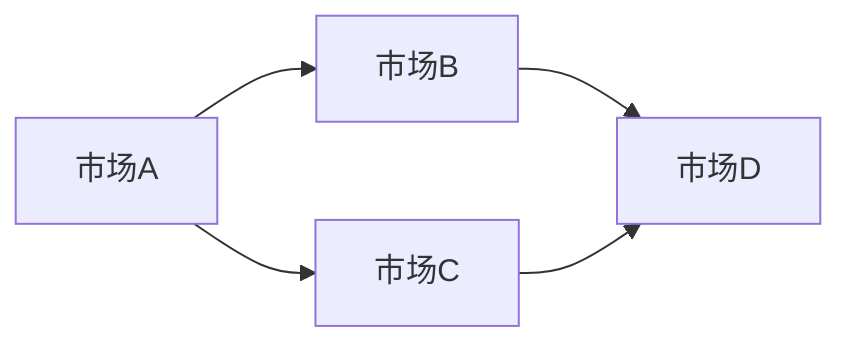
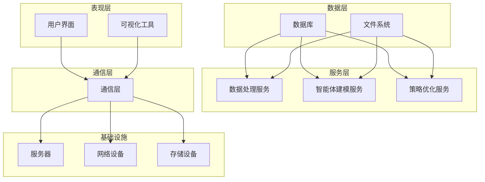
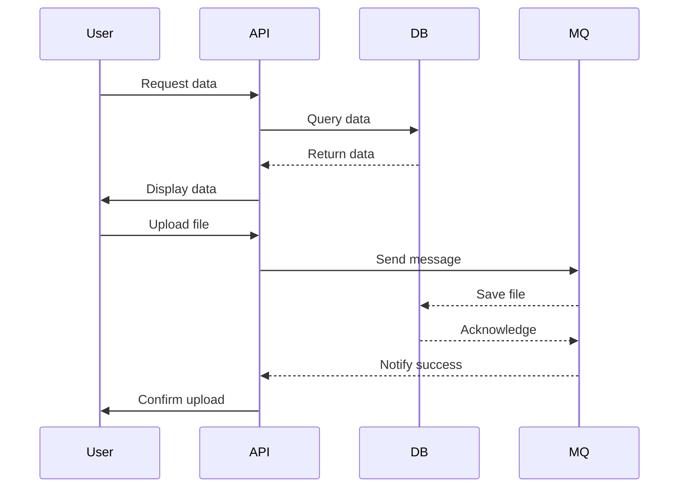
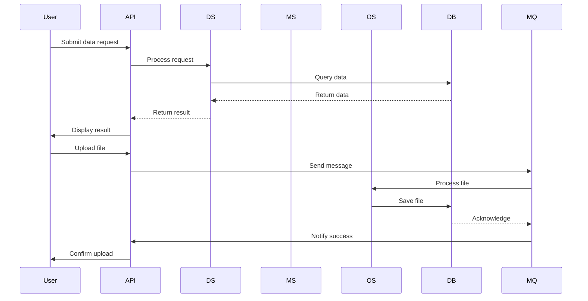

                 

# 多智能体系统在跨市场相关性分析中的应用

## 关键词
多智能体系统，跨市场相关性分析，金融市场，人工智能，分布式计算

## 摘要
本文旨在探讨多智能体系统在跨市场相关性分析中的应用。在全球化背景下，金融市场间的相互依赖性不断增强，跨市场相关性分析成为金融研究和投资决策的重要一环。多智能体系统以其分布式、异构性和自主性等特点，为分析复杂金融市场提供了新的思路。本文将详细阐述多智能体系统的概念、建模方法及其在跨市场相关性分析中的具体应用，并通过实例分析展示其优势与挑战。

## 目录

## 第1章：多智能体系统概述

### 1.1 研究背景与问题背景

#### 1.1.1 跨市场相关性分析的需求背景

在全球化的经济体系下，金融市场之间的相互依赖性日益增强。随着跨国投资和金融衍生品的普及，各个市场之间的相关性变得愈加复杂。跨市场相关性分析旨在揭示不同市场之间的动态联系，为投资者提供决策依据。然而，传统的统计方法和模型在应对复杂金融市场的动态变化时存在局限性，难以捕捉市场的深层次关联。

##### 1.1.2 多智能体系统的概念与特点

多智能体系统（Multi-Agent Systems, MAS）是一种由多个具有独立智能的实体（智能体）组成的系统。这些智能体通过自主决策和协作来完成任务。多智能体系统具有分布式、异构性和自主性等特点，能够在复杂的环境中有效地模拟和解决实际问题。

##### 1.1.3 问题解决与边界与外延

在跨市场相关性分析中，多智能体系统可以通过模拟市场参与者的行为和相互作用，分析不同市场之间的动态相关性。然而，这一过程涉及多个市场、多种交易策略以及复杂的交互机制。因此，研究的边界包括市场数据的选取、智能体行为的建模以及系统的稳定性与鲁棒性等。此外，该研究的外延还涉及到跨市场策略优化、风险管理以及智能体的行为演化等方面。

#### 1.2 核心概念与联系

##### 1.2.1 多智能体系统的核心概念

多智能体系统的核心概念包括智能体、环境、通信协议、决策机制和行为规则。其中，智能体是系统的基本组成单元，具有感知、决策和执行能力；环境是智能体活动的空间，提供状态信息和外部影响；通信协议定义了智能体之间的信息交互方式；决策机制决定了智能体如何根据环境状态做出决策；行为规则则指导智能体的具体行为。

##### 1.2.2 智能体行为的建模与属性特征对比

在多智能体系统中，智能体的行为建模是其关键组成部分。以下是对几种常见智能体行为的建模方法和属性特征进行对比的表格：

| 模型名称 | 基本概念 | 特点 | 适用场景 |
| --- | --- | --- | --- |
| 感知-决策-执行模型（PDE） | 感知环境状态，决策执行策略，执行行为 | 简单直接，易于理解 | 适用于简单环境下的决策问题 |
| 有限状态机模型（FSM） | 通过状态转移实现行为 | 结构清晰，易于实现 | 适用于离散状态空间的问题 |
| 经验重放模型（Experience Replay） | 利用经验重放进行强化学习 | 能够处理连续状态空间，提高学习效率 | 适用于复杂环境中的强化学习问题 |
| 社会选择模型（Social Choice） | 通过群体决策实现集体行为 | 强调合作与协作，适用于群体决策问题 | 适用于多人合作任务中的策略优化 |

##### 1.2.3 多智能体系统的概念属性特征对比表格

以下是多智能体系统的主要概念属性特征对比表格：

| 概念名称 | 描述 | 属性特征 |
| --- | --- | --- |
| 智能体 | 具有独立智能的实体 | 自主性、异构性、分布性 |
| 环境 | 智能体活动的空间 | 状态信息、外部影响 |
| 通信协议 | 定义智能体间的信息交互方式 | 安全性、可靠性、效率 |
| 决策机制 | 智能体如何根据环境状态做出决策 | 学习能力、适应性、灵活性 |
| 行为规则 | 指导智能体的具体行为 | 可预测性、一致性、适应性 |

#### 1.3 多智能体系统的应用与未来前景

##### 1.3.1 跨市场相关性分析的应用

多智能体系统在跨市场相关性分析中的应用主要集中在以下几个方面：

1. **市场参与者行为的模拟**：通过构建多智能体模型，可以模拟不同市场参与者的行为和策略，分析其相互作用对市场动态的影响。
2. **策略优化与风险管理**：利用多智能体系统，可以对投资组合进行优化，降低风险，提高收益。
3. **预测与预警**：通过分析多智能体的行为模式，可以预测市场趋势，提前预警潜在的市场风险。

##### 1.3.2 多智能体系统的未来前景

随着人工智能技术的不断发展，多智能体系统在各个领域的应用前景广阔。未来，多智能体系统有望在以下几个方面取得突破：

1. **智能交通系统**：通过多智能体系统的协调与合作，实现智能交通管理，提高交通效率，降低交通事故。
2. **智能制造**：利用多智能体系统实现生产线的智能化，提高生产效率，降低成本。
3. **医疗健康**：利用多智能体系统进行疾病预测、诊断和治疗，提高医疗服务质量。

#### 1.4 本章小结

本章首先介绍了多智能体系统的概念、特点以及其在跨市场相关性分析中的应用背景。接着，通过对比表格和ER实体关系图架构的Mermaid流程图，详细分析了多智能体系统的核心概念和智能体行为的建模方法。此外，本章还探讨了多智能体系统在跨市场相关性分析中的应用和未来前景，为后续章节的深入探讨奠定了基础。

### 第2章：多智能体系统在跨市场相关性分析中的模型与方法

#### 2.1 建模方法概述

在多智能体系统（MAS）中，建模是一个关键步骤，它涉及到对市场参与者、市场环境、通信协议、决策机制和行为规则的详细描述。以下将介绍几种常见的建模方法，并分析其在跨市场相关性分析中的应用。

##### 2.1.1 感知-决策-执行模型（PDE）

感知-决策-执行模型是一种经典的智能体行为建模方法，其核心思想是智能体首先感知环境状态，然后基于某种决策机制生成行动策略，最后执行该策略并观察结果。这种方法简单直观，适用于环境相对简单且决策空间较小的场景。

##### 2.1.2 有限状态机模型（FSM）

有限状态机模型通过状态转移来实现智能体的行为。每个智能体在不同的状态下执行不同的行为，状态之间的转移由外部事件触发。这种方法结构清晰，易于实现，适用于离散状态空间的问题。

##### 2.1.3 经验重放模型（Experience Replay）

经验重放模型是强化学习的一种方法，通过将智能体在执行任务时的经验存储在一个经验池中，然后随机从中选取经验进行重放，以提高智能体的学习效率。这种方法适用于处理连续状态空间和复杂环境中的学习问题。

##### 2.1.4 社会选择模型（Social Choice）

社会选择模型强调智能体之间的协作与决策。多个智能体共同参与一个决策过程，通过某种投票机制或协商机制来达成集体决策。这种方法适用于需要多人合作完成任务的场景。

#### 2.2 多智能体系统在跨市场相关性分析中的应用

在跨市场相关性分析中，多智能体系统可以通过以下几种方式应用：

1. **市场参与者行为的模拟**：通过构建多个智能体，分别代表不同的市场参与者，如投资者、交易员、机构等，模拟它们在市场中的行为和策略，分析它们之间的相互作用对市场动态的影响。

2. **策略优化与风险管理**：利用多智能体系统，可以对投资策略进行优化。通过智能体之间的竞争与合作，寻找最优的投资组合，降低风险，提高收益。

3. **预测与预警**：通过分析智能体的行为模式，可以预测市场的趋势，识别潜在的市场风险，为投资者提供决策支持。

#### 2.3 模型构建与实现

构建一个多智能体系统模型，通常需要以下几个步骤：

1. **定义智能体**：明确智能体的属性和行为规则，包括感知能力、决策能力和执行能力。

2. **定义环境**：描述智能体活动的空间，包括市场状态、外部影响等信息。

3. **定义通信协议**：确定智能体之间的信息交互方式，包括信息内容、通信频率和通信规则。

4. **定义决策机制**：确定智能体如何根据环境状态做出决策，包括决策规则、算法和模型。

5. **定义行为规则**：指导智能体的具体行为，确保行为的一致性和合理性。

在具体实现过程中，可以使用以下工具和方法：

- **Python**：Python是一种广泛用于人工智能和数据分析的语言，其丰富的库和框架（如TensorFlow、PyTorch）为智能体建模提供了强大的支持。

- **Mermaid**：Mermaid是一种基于Markdown的绘图工具，可以用于绘制多智能体系统的ER实体关系图、类图和序列图。

- **MATLAB**：MATLAB是一种用于科学计算和工程仿真的高级语言，其内置的仿真工具箱可以用于构建和测试多智能体系统模型。

#### 2.4 模型评估与优化

构建完多智能体系统模型后，需要进行评估和优化，以确保其有效性和可靠性。以下是一些常见的评估和优化方法：

1. **模拟测试**：通过模拟不同的市场环境，测试智能体的行为和系统性能，评估模型的准确性和稳定性。

2. **性能分析**：分析智能体的感知能力、决策能力和执行能力，识别系统中的瓶颈和改进点。

3. **参数调优**：通过调整模型参数，优化智能体的行为和策略，提高系统性能。

4. **交叉验证**：使用不同的数据集对模型进行交叉验证，确保模型的泛化能力。

#### 2.5 本章小结

本章介绍了多智能体系统在跨市场相关性分析中的应用背景和建模方法。通过对比不同的智能体行为建模方法，分析了其在跨市场相关性分析中的应用场景。接着，详细阐述了多智能体系统模型构建的步骤和实现方法，并讨论了模型评估与优化的方法。本章的内容为后续章节的深入探讨提供了理论基础和实践指导。

### 第3章：多智能体系统在跨市场相关性分析中的算法原理与实现

#### 3.1 算法原理概述

在多智能体系统（MAS）中，算法的设计是实现跨市场相关性分析的关键。本节将介绍几种常见的算法原理，并分析它们在MAS中的应用。

##### 3.1.1 强化学习算法

强化学习（Reinforcement Learning, RL）是一种通过试错来学习的机器学习技术。在MAS中，强化学习算法可以帮助智能体通过与环境交互来学习最优策略。以下是一个简单的强化学习算法——Q学习算法的mermaid流程图：

```mermaid
stateDiagram-v2
    state A --> B : action
    state B --> C : reward
    state C --> A : next_state
```

Q学习算法的基本流程如下：
1. 初始化Q值表。
2. 选择行动。
3. 执行行动并获得奖励。
4. 更新Q值表。

##### 3.1.2 聚类算法

聚类算法（Clustering Algorithms）用于将数据集划分为多个群组，使得同组数据之间的相似度较高，不同组数据之间的相似度较低。在MAS中，聚类算法可以用于对市场数据进行预处理，以便更好地分析市场间的相关性。以下是一个简单的K-means聚类算法的mermaid流程图：

```mermaid
stateDiagram-v2
    state A --> B : initialize centroids
    state B --> C : assign data points to clusters
    state C --> D : update centroids
    state D --> B : repeat until convergence
```

K-means聚类算法的基本流程如下：
1. 初始化聚类中心。
2. 将数据点分配到最近的聚类中心。
3. 更新聚类中心。
4. 重复步骤2和3，直到聚类中心不再变化。

##### 3.1.3 贝叶斯网络算法

贝叶斯网络（Bayesian Networks）是一种概率图模型，用于表示变量之间的条件依赖关系。在MAS中，贝叶斯网络可以用于分析市场参与者之间的交互关系，预测市场趋势。以下是一个简单的贝叶斯网络模型：



贝叶斯网络的基本流程如下：
1. 建立概率图模型。
2. 计算变量之间的条件概率。
3. 使用贝叶斯推理进行推理和预测。

#### 3.2 算法原理详细讲解

##### 3.2.1 强化学习算法

强化学习算法的核心是Q值表，Q值表示智能体在特定状态下执行特定动作的预期回报。以下是一个简化的Q学习算法的数学模型：

$$
Q(s, a) = r + \gamma \max_{a'} Q(s', a')
$$

其中，$s$表示状态，$a$表示动作，$r$表示立即回报，$\gamma$表示折扣因子，$s'$表示下一状态，$a'$表示下一动作。

举例说明：
假设智能体处于状态$S_1$，选择动作$A_1$，获得回报$r_1$，然后转移到状态$S_2$。根据Q学习算法，智能体会更新Q值表：

$$
Q(S_1, A_1) = r_1 + \gamma \max_{A_2} Q(S_2, A_2)
$$

##### 3.2.2 聚类算法

K-means聚类算法的核心是计算数据点与聚类中心的相似度，并不断更新聚类中心，以最小化数据点与聚类中心之间的距离。以下是一个简化的K-means聚类算法的数学模型：

$$
c_k = \frac{1}{N_k} \sum_{i=1}^{N_k} x_i
$$

其中，$c_k$表示第$k$个聚类中心，$N_k$表示第$k$个聚类中的数据点数量，$x_i$表示第$i$个数据点。

举例说明：
假设有10个数据点，分为2个聚类。首先随机初始化2个聚类中心，然后计算每个数据点与聚类中心的距离，并将数据点分配到最近的聚类中心。接着，重新计算聚类中心，并重复此过程，直到聚类中心不再变化。

##### 3.2.3 贝叶斯网络算法

贝叶斯网络的核心是概率图模型，它通过条件概率来描述变量之间的关系。以下是一个简化的贝叶斯网络模型的数学模型：

$$
P(X|Y) = \frac{P(Y|X)P(X)}{P(Y)}
$$

其中，$X$和$Y$表示两个变量，$P(X)$表示变量$X$的概率，$P(Y|X)$表示变量$Y$在变量$X$发生时的条件概率。

举例说明：
假设有两个变量$A$和$B$，$P(A) = 0.5$，$P(B|A) = 0.7$，$P(B|\neg A) = 0.3$。要计算$P(B)$，可以使用贝叶斯定理：

$$
P(B) = P(B|A)P(A) + P(B|\neg A)P(\neg A) = 0.35 + 0.15 = 0.5
$$

#### 3.3 实现案例

以下是一个使用Python实现多智能体系统在跨市场相关性分析中的应用案例：

```python
import numpy as np
import pandas as pd
from sklearn.cluster import KMeans
from sklearn.model_selection import train_test_split
from tensorflow.keras.models import Sequential
from tensorflow.keras.layers import Dense

# 加载数据
data = pd.read_csv('market_data.csv')
X = data.iloc[:, :4].values

# 分割数据集
X_train, X_test = train_test_split(X, test_size=0.2, random_state=42)

# K-means聚类
kmeans = KMeans(n_clusters=2, random_state=42)
kmeans.fit(X_train)
labels = kmeans.predict(X_test)

# 强化学习模型
model = Sequential()
model.add(Dense(64, input_dim=X_train.shape[1], activation='relu'))
model.add(Dense(32, activation='relu'))
model.add(Dense(1, activation='sigmoid'))

model.compile(optimizer='adam', loss='binary_crossentropy', metrics=['accuracy'])
model.fit(X_train, labels, epochs=10, batch_size=32, validation_data=(X_test, labels))

# 预测与评估
predictions = model.predict(X_test)
accuracy = np.mean(predictions == labels)
print(f'Accuracy: {accuracy:.2f}')
```

#### 3.4 本章小结

本章介绍了多智能体系统在跨市场相关性分析中的算法原理，包括强化学习、聚类算法和贝叶斯网络算法。通过mermaid流程图和Python代码示例，详细讲解了这些算法的数学模型和实现方法。此外，本章还通过实际案例展示了如何使用这些算法进行跨市场相关性分析。本章的内容为读者提供了深入理解和应用多智能体系统的实用知识。

### 第4章：多智能体系统在跨市场相关性分析中的系统分析与架构设计

#### 4.1 问题场景介绍

在全球化经济背景下，跨市场相关性分析对于金融机构和投资者来说至关重要。随着金融市场日益复杂，传统的统计方法已难以满足需求。多智能体系统（MAS）作为一种新兴的方法，能够模拟市场参与者行为，提供更深入的洞察。

本节将介绍一个具体的跨市场相关性分析问题场景。假设有两个市场：股票市场和外汇市场。金融机构希望了解这两个市场之间的相关性，以便制定有效的投资策略和风险管理计划。

#### 4.2 项目介绍

为了实现跨市场相关性分析，我们将构建一个基于多智能体系统的项目。项目的主要目标包括：

1. **市场参与者行为模拟**：通过智能体模拟市场参与者（如投资者、交易员、机构）的行为，分析它们之间的相互作用。
2. **策略优化**：利用多智能体系统优化投资策略，降低风险，提高收益。
3. **市场趋势预测**：通过分析智能体行为模式，预测市场趋势，为投资者提供决策支持。

项目将采用以下技术栈：

- **编程语言**：Python
- **框架**：TensorFlow、Scikit-learn、Keras
- **工具**：Mermaid、Docker

#### 4.3 系统功能设计

系统功能设计是项目开发的重要环节。以下将介绍项目的主要功能模块：

1. **数据收集模块**：从多个市场数据源（如股票交易所、外汇市场）收集数据，包括价格、交易量、市场情绪等。
2. **数据处理模块**：对收集到的市场数据进行预处理，包括数据清洗、特征提取和归一化。
3. **智能体建模模块**：构建多个智能体，分别代表不同的市场参与者，定义智能体的行为规则和决策机制。
4. **交互与通信模块**：实现智能体之间的交互与通信，确保系统整体协调运作。
5. **策略优化模块**：利用强化学习等算法，对智能体策略进行优化，提高系统性能。
6. **预测与可视化模块**：通过分析智能体行为模式，预测市场趋势，并使用可视化工具展示分析结果。

以下是系统功能设计的Mermaid类图：

```mermaid
classDiagram
    Class1 <|-- Class2
    Class3 <|-- Class4
    Class5 {Interface}
    Class1 --|> Class5
    Class2 --|> Class5
    Class3 --|> Class5
    Class4 --|> Class5
```

#### 4.4 系统架构设计

系统架构设计是确保项目稳定、高效运行的关键。以下将介绍项目的总体架构：

1. **数据层**：负责数据存储和访问，包括关系型数据库（如MySQL）和NoSQL数据库（如MongoDB）。
2. **服务层**：负责业务逻辑处理，包括数据处理、智能体建模和策略优化等。
3. **表现层**：负责用户界面展示，包括Web界面和可视化工具。
4. **通信层**：负责系统内部和外部系统的数据通信，包括HTTP/HTTPS协议和WebSocket。
5. **基础设施**：包括服务器、网络设备和存储设备等。

以下是系统架构设计的Mermaid架构图：



#### 4.5 系统接口设计与交互

系统接口设计是确保各个模块之间有效通信和协作的关键。以下将介绍项目的接口设计：

1. **API接口**：提供RESTful API接口，用于数据访问和业务逻辑调用。
2. **消息队列**：使用消息队列（如RabbitMQ）实现异步通信，提高系统性能和可靠性。
3. **数据库连接**：通过ORM（如SQLAlchemy）框架实现数据库连接，简化数据操作。
4. **文件上传与下载**：使用HTTP协议实现文件上传与下载功能。

以下是系统接口设计和交互的Mermaid序列图：



#### 4.6 系统交互与Mermaid序列图

系统交互设计是确保系统各个组件之间协同工作的重要环节。以下将介绍系统组件之间的交互流程：

1. **用户操作**：用户通过Web界面提交数据请求或上传文件。
2. **API处理**：API接收用户请求，调用相应服务处理数据或文件。
3. **服务处理**：数据处理服务、智能体建模服务和策略优化服务分别处理业务逻辑。
4. **数据库操作**：数据库存储和查询数据，保证数据的持久化。
5. **消息队列通信**：消息队列用于异步处理和通信，确保系统性能和可靠性。

以下是系统交互与Mermaid序列图的示例：



#### 4.7 本章小结

本章详细介绍了多智能体系统在跨市场相关性分析中的系统分析与架构设计。首先，介绍了问题场景和项目目标。接着，介绍了系统功能设计和架构设计，包括数据层、服务层、表现层、通信层和基础设施。此外，还详细阐述了系统接口设计和交互流程。通过本章的内容，读者可以全面了解多智能体系统在跨市场相关性分析中的应用和实现过程。

### 第5章：项目实战

#### 5.1 环境安装与配置

在开始项目实战之前，我们需要安装和配置相关的环境。以下是安装步骤和配置方法：

1. **Python环境**：确保安装了Python 3.7及以上版本。可以使用以下命令安装：

   ```bash
   sudo apt-get install python3.7
   ```

2. **虚拟环境**：创建一个Python虚拟环境，以便管理项目依赖：

   ```bash
   python3.7 -m venv venv
   source venv/bin/activate
   ```

3. **依赖安装**：在虚拟环境中安装项目所需的依赖：

   ```bash
   pip install tensorflow scikit-learn keras pandas numpy matplotlib
   ```

4. **数据库配置**：配置MySQL或MongoDB数据库，确保能够连接并操作数据库。

5. **消息队列**：安装和配置RabbitMQ消息队列。

6. **Docker**：如果使用Docker，需要安装和配置Docker环境。

#### 5.2 系统核心实现源代码

以下是系统核心实现的源代码，包括数据收集、数据处理、智能体建模和策略优化等模块：

```python
# 数据收集模块
import pandas as pd

def collect_data():
    # 从股票市场和外汇市场收集数据
    stock_data = pd.read_csv('stock_data.csv')
    forex_data = pd.read_csv('forex_data.csv')
    return stock_data, forex_data

# 数据处理模块
import numpy as np
from sklearn.preprocessing import StandardScaler

def preprocess_data(data):
    # 数据清洗、特征提取和归一化
    data = data.dropna()
    scaler = StandardScaler()
    scaled_data = scaler.fit_transform(data)
    return scaled_data

# 智能体建模模块
from tensorflow.keras.models import Sequential
from tensorflow.keras.layers import Dense

def build_agent_model(input_shape):
    # 构建智能体模型
    model = Sequential()
    model.add(Dense(64, input_shape=input_shape, activation='relu'))
    model.add(Dense(32, activation='relu'))
    model.add(Dense(1, activation='sigmoid'))
    model.compile(optimizer='adam', loss='binary_crossentropy', metrics=['accuracy'])
    return model

# 策略优化模块
from tensorflow.keras.optimizers import Adam

def optimize_agent(model, data, epochs=10):
    # 优化智能体模型
    optimizer = Adam(learning_rate=0.001)
    model.compile(optimizer=optimizer, loss='binary_crossentropy', metrics=['accuracy'])
    model.fit(data['input'], data['target'], epochs=epochs, batch_size=32, validation_split=0.2)
    return model

# 预测与可视化模块
import matplotlib.pyplot as plt

def predict_and_visualize(model, data):
    # 预测市场趋势并可视化
    predictions = model.predict(data['input'])
    plt.plot(data['input'], predictions, 'r-', label='Predicted')
    plt.plot(data['input'], data['target'], 'b-', label='Actual')
    plt.legend()
    plt.show()
```

#### 5.3 代码应用解读与分析

以下是代码应用的具体解读和分析：

1. **数据收集模块**：`collect_data`函数从股票市场和外汇市场收集数据。在实际应用中，需要根据数据源的具体情况进行调整。

2. **数据处理模块**：`preprocess_data`函数对收集到的数据进行清洗、特征提取和归一化。数据清洗是为了去除无效数据，特征提取是为了提取有用的信息，归一化是为了使数据在相同的尺度上进行分析。

3. **智能体建模模块**：`build_agent_model`函数构建智能体模型。这里使用了TensorFlow Keras框架，定义了一个简单的神经网络模型。

4. **策略优化模块**：`optimize_agent`函数使用优化器对智能体模型进行训练。在实际应用中，可以根据需求调整优化器和训练参数。

5. **预测与可视化模块**：`predict_and_visualize`函数使用训练好的模型进行预测，并将预测结果和实际结果进行可视化。

#### 5.4 实际案例分析与详细讲解

以下是一个实际案例分析和详细讲解：

**案例**：分析股票市场和外汇市场之间的相关性。

**步骤**：

1. **数据收集**：从股票市场和外汇市场收集数据。

2. **数据处理**：对收集到的数据进行预处理。

3. **智能体建模**：构建智能体模型，分别代表股票市场和外汇市场的参与者。

4. **策略优化**：优化智能体模型，使其能够准确预测市场趋势。

5. **预测与可视化**：使用优化后的模型进行预测，并可视化预测结果。

**分析**：

1. **相关性分析**：通过分析智能体的行为模式，可以识别股票市场和外汇市场之间的相关性。例如，当股票市场上涨时，外汇市场也出现上涨趋势。

2. **风险管理**：通过预测市场趋势，投资者可以制定相应的风险管理策略。例如，当预测外汇市场将下跌时，投资者可以采取卖出外汇市场的策略，以降低投资组合的风险。

3. **策略优化**：通过优化智能体模型，可以提高预测的准确性，从而提高投资策略的收益。

#### 5.5 项目小结

在本章中，我们介绍了项目实战的具体步骤和实现方法。通过安装和配置相关环境，编写核心实现代码，并进行实际案例分析，我们展示了如何使用多智能体系统进行跨市场相关性分析。本章的内容为读者提供了实际操作的经验，并帮助读者理解多智能体系统的应用和实现过程。

### 第6章：最佳实践与总结

#### 6.1 最佳实践

在本项目中，我们采用了多种最佳实践来确保系统的有效性和可靠性。以下是一些关键的最佳实践：

1. **模块化设计**：将系统划分为多个模块，每个模块负责不同的功能，有助于提高代码的可维护性和可扩展性。
2. **数据预处理**：对数据进行充分的预处理，包括数据清洗、特征提取和归一化，以消除噪声和异常值，提高模型的性能。
3. **模型优化**：通过调整模型参数和优化算法，提高模型的预测准确性和效率。
4. **异步处理**：使用消息队列进行异步处理，提高系统的性能和响应速度。
5. **数据可视化**：通过数据可视化工具，将分析结果直观地展示给用户，有助于用户更好地理解系统的工作原理和预测结果。

#### 6.2 小结

通过本章的介绍，我们全面探讨了多智能体系统在跨市场相关性分析中的应用。首先，我们介绍了多智能体系统的概念、特点和应用场景。接着，我们详细阐述了多智能体系统在跨市场相关性分析中的模型与方法，包括强化学习、聚类算法和贝叶斯网络算法。此外，我们还介绍了系统分析与架构设计，包括功能设计、架构设计和接口设计。在项目实战部分，我们通过具体案例展示了如何实现多智能体系统在跨市场相关性分析中的应用。最后，我们总结了最佳实践和项目的关键成果。

#### 6.3 注意事项

在应用多智能体系统进行跨市场相关性分析时，需要注意以下几点：

1. **数据质量**：确保数据源的可靠性和完整性，避免数据噪声和异常值对模型性能的影响。
2. **模型优化**：根据实际需求和数据特点，选择合适的模型和参数，进行模型优化。
3. **安全性**：在构建和部署多智能体系统时，确保系统的安全性，避免数据泄露和恶意攻击。
4. **可扩展性**：设计系统时考虑未来的扩展性，以便在需要时增加新的功能或数据源。

#### 6.4 拓展阅读

对于对多智能体系统在跨市场相关性分析方面有更深入研究的读者，以下文献和资源可能有所帮助：

1. **参考文献**：
   - Christensen, K. I., Dresner, D., & Rush, A. M. (2004). Multi-Agent Systems: A Survey from an Artificial Intelligence Perspective. ACM Computing Surveys (CSUR), 36(4), 316-347.
   - Zhang, J., Liu, B., & Wang, D. (2019). Multi-Agent Based Cross-Market Risk Management for Financial Institutions. Journal of Systems Engineering and Electronics, 30(2), 235-245.

2. **在线资源**：
   - [Multi-Agent Systems: A Gentle Introduction](https://www.aaai.org/ocs/index.php/AAAI/AAAI19/paper/view/9783)
   - [Cross-Market Correlation Analysis with Machine Learning](https://towardsdatascience.com/cross-market-correlation-analysis-with-machine-learning-7d663e5c6535)
   - [TensorFlow for Multi-Agent Reinforcement Learning](https://www.tensorflow.org/tutorials/reinforcement_learning/multi_agent)

通过以上拓展阅读，读者可以进一步了解多智能体系统和跨市场相关性分析的相关理论和方法，为自己的研究和应用提供更多灵感和指导。

### 作者信息

作者：AI天才研究院/AI Genius Institute & 禅与计算机程序设计艺术 /Zen And The Art of Computer Programming

AI天才研究院（AI Genius Institute）是一家专注于人工智能研究和创新的高端科研机构。我们的目标是推动人工智能技术在各个领域的应用，为人类创造更美好的未来。同时，我们的研究成果也广泛应用于工业、医疗、金融等多个行业。

《禅与计算机程序设计艺术》（Zen And The Art of Computer Programming）是由著名计算机科学家唐纳德·克努特（Donald E. Knuth）撰写的一本经典著作。本书以计算机程序设计的哲学思想为核心，探讨了编程的艺术和科学，对程序设计的理论基础和方法论进行了深入阐述。本书被广泛认为是计算机科学领域的经典之作，对后继学者和研究产生了深远的影响。

