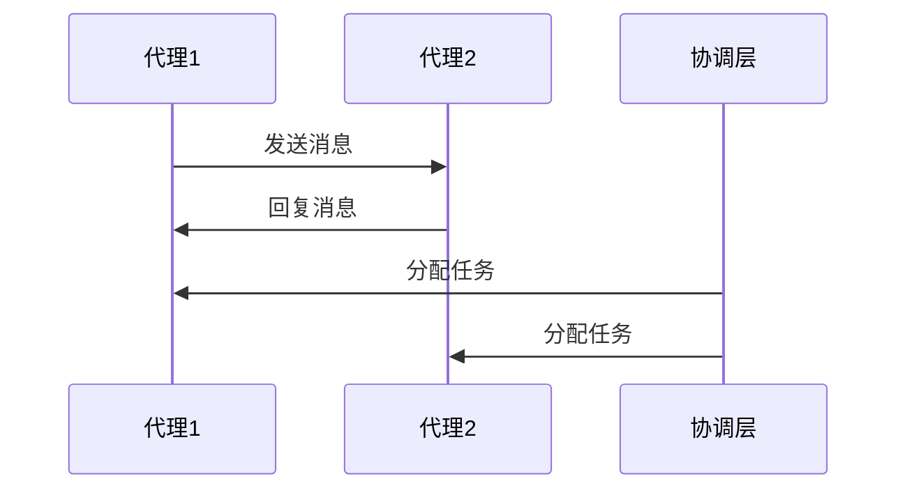
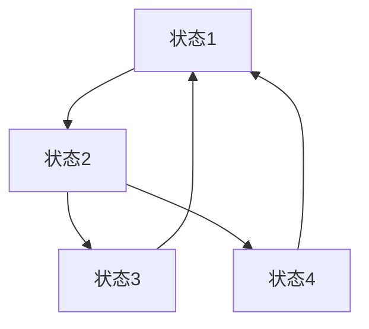
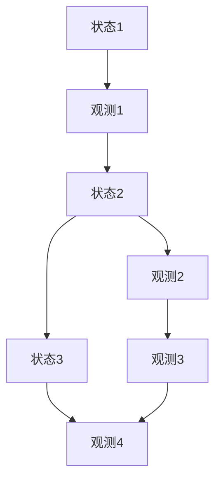
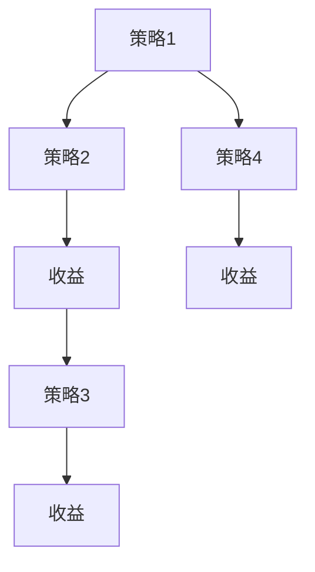

                 


## 引言

### 1.1 多智能体系统的背景

多智能体系统（Multi-Agent Systems，MAS）作为人工智能领域的一个重要分支，起源于对分布式计算、自主代理和协作问题的研究。在过去的几十年中，随着计算机技术的快速发展，特别是网络通信技术的普及，多智能体系统的研究与应用逐渐得到广泛关注。

多智能体系统的核心思想是通过多个自主代理之间的协作来实现复杂任务。这些代理可以是物理实体，也可以是软件代理。它们能够感知环境、自主决策并执行行动，以达到预定的目标。与传统集中式系统相比，多智能体系统具有更高的灵活性和鲁棒性，能够更好地适应动态变化的环境。

### 1.2 多智能体系统的定义与特点

多智能体系统是由多个智能代理组成的系统，这些代理可以独立决策、相互协作，共同完成任务。其特点包括：

1. **自主性**：每个代理都有独立的决策能力，可以根据感知到的环境信息自主做出决策。
2. **分布性**：代理分布在不同的计算节点上，通过通信网络相互协作。
3. **协作性**：多个代理可以共同完成任务，相互之间的协作是系统高效运行的关键。
4. **适应性**：系统能够适应环境变化，每个代理可以根据环境变化调整自己的行为。

### 1.3 多智能体系统在长期价值创造分析中的应用场景

多智能体系统在长期价值创造分析中的应用场景非常广泛，包括但不限于以下几方面：

1. **供应链管理**：通过多智能体系统优化供应链网络，提高供应链的响应速度和效率。
2. **金融服务**：利用多智能体系统进行风险评估、投资组合优化等金融分析。
3. **智能城市**：多智能体系统在城市交通管理、环境保护等方面发挥重要作用。
4. **能源管理**：通过多智能体系统实现智能电网、能源优化分配等。
5. **社会计算**：在社交媒体分析、群体行为预测等方面，多智能体系统提供了有效的工具。

本文将深入探讨多智能体系统在长期价值创造分析中的应用，分析其核心原理、数学模型、算法实现，并结合实际案例进行详细讲解。

## 基本概念

### 2.1 多智能体系统的核心原则

多智能体系统的核心原则包括自主性、分布性、协作性和适应性。这些原则决定了多智能体系统的运行方式和性能。

1. **自主性**：每个代理都有独立的决策能力，可以根据感知到的环境信息自主做出决策。
2. **分布性**：代理分布在不同的计算节点上，通过通信网络相互协作。
3. **协作性**：多个代理可以共同完成任务，相互之间的协作是系统高效运行的关键。
4. **适应性**：系统能够适应环境变化，每个代理可以根据环境变化调整自己的行为。

### 2.2 代理的特征和通信模型

代理是多智能体系统中的基本组成单位，具有以下特征：

1. **感知能力**：代理能够感知环境信息，包括传感器数据、其他代理的状态等。
2. **决策能力**：代理可以根据感知到的信息自主做出决策。
3. **行动能力**：代理能够执行决策结果，采取相应的行动。
4. **通信能力**：代理需要与其他代理进行通信，以共享信息和协调行动。

常见的通信模型包括：

1. **同步通信**：代理在固定的时间间隔内进行通信，以同步状态和信息。
2. **异步通信**：代理在需要时进行通信，不受时间间隔的限制。
3. **事件驱动通信**：代理根据事件的发生进行通信，例如传感器数据的更新。

### 2.3 多智能体系统的架构

多智能体系统的架构可以分为三个层次：代理层、通信层和协调层。

1. **代理层**：包含所有代理的运行环境，包括代理的感知、决策和行动能力。
2. **通信层**：提供代理之间的通信机制，包括消息传递协议和网络通信技术。
3. **协调层**：负责系统的整体协调和管理，确保代理之间的协作和任务分配。

多智能体系统的架构设计需要考虑以下因素：

1. **可扩展性**：系统能够支持大量代理的加入和退出。
2. **容错性**：系统能够在代理失败或网络故障时继续运行。
3. **鲁棒性**：系统能够在不确定的环境下稳定运行。
4. **效率**：系统能够高效地处理大量的通信和协调任务。

### 2.4 多智能体系统的基本架构

多智能体系统的基本架构如图 1 所示。其中，代理层包括多个代理，每个代理都具有感知、决策和行动能力；通信层提供代理之间的通信机制；协调层负责系统的整体协调和管理。



图 1：多智能体系统的基本架构

通过上述架构，多智能体系统可以有效地实现代理之间的协作和任务分配，从而实现复杂任务的高效完成。

## 数学模型与算法

### 3.1 多智能体系统的基本数学模型

多智能体系统的数学模型用于描述代理的行为、状态和决策。常见的数学模型包括：

1. **马尔可夫决策过程（MDP）**：用于描述代理在不确定环境下的决策过程，包括状态、动作和奖励。
2. **部分可观测马尔可夫决策过程（POMDP）**：扩展了 MDP，用于描述部分可观测环境下的决策过程。
3. **博弈论模型**：用于描述多个代理之间的竞争和协作关系，常见的包括纳什均衡和合作博弈。

### 3.2 算法介绍与 Mermaid 图

为了更好地理解多智能体系统的数学模型和算法，我们可以使用 Mermaid 图来描述。

#### 3.2.1 马尔可夫决策过程（MDP）

MDP 的 Mermaid 图如下：



图 2：马尔可夫决策过程（MDP）的 Mermaid 图

在这个图中，每个节点表示一个状态，每条边表示从当前状态转移到下一个状态的概率。

#### 3.2.2 部分可观测马尔可夫决策过程（POMDP）

POMDP 的 Mermaid 图如下：



图 3：部分可观测马尔可夫决策过程（POMDP）的 Mermaid 图

在这个图中，每个节点表示一个状态，每个圆圈表示一个观测。

#### 3.2.3 博弈论模型

博弈论模型的 Mermaid 图如下：



图 4：博弈论模型的 Mermaid 图

在这个图中，每个节点表示一个策略，每条边表示策略之间的收益关系。

### 3.3 Python 代码实现与解释

下面是一个简单的 Python 代码示例，用于实现 MDP 的求解。

```python
import numpy as np

# 状态转移概率矩阵
P = np.array([[0.5, 0.5], [0.2, 0.8]])

# 奖励矩阵
R = np.array([[1, -1], [-1, 1]])

# 初始状态概率
initial_state = np.array([0.5, 0.5])

# 求解最优策略
policy = np.argmax(R @ np.linalg.inv(P) @ initial_state)

# 输出最优策略
print("最优策略：", policy)
```

这段代码首先定义了状态转移概率矩阵 \( P \) 和奖励矩阵 \( R \)，然后使用拉普拉斯逆矩阵求解最优策略。最后，输出最优策略。

## 长期价值创造分析

### 4.1 长期价值创造的概念与框架

长期价值创造是指通过持续的投资和创新，实现企业或组织在长期内的持续增长和盈利。其核心在于如何有效地管理资源和风险，以实现长期的可持续发展。

#### 4.1.1 长期价值创造的框架

长期价值创造的框架包括以下几个方面：

1. **战略规划**：明确企业或组织的长期目标和发展方向，制定相应的战略规划。
2. **资源管理**：有效配置和利用企业或组织的资源，包括人力、财务和技术资源。
3. **风险管理**：识别和管理企业或组织面临的各种风险，确保长期目标的实现。
4. **创新能力**：持续进行技术创新和商业模式创新，以保持竞争优势。
5. **绩效评估**：定期对企业的经营绩效进行评估，以确保长期目标的实现。

### 4.2 多智能体系统在长期价值创造分析中的应用

多智能体系统在长期价值创造分析中具有广泛的应用，主要体现在以下几个方面：

1. **战略规划**：通过多智能体系统模拟不同的战略方案，评估其长期价值，帮助决策者做出最优选择。
2. **资源管理**：利用多智能体系统优化资源分配，提高资源利用效率，降低运营成本。
3. **风险管理**：通过多智能体系统实时监测和预测风险，制定相应的风险应对策略。
4. **创新能力**：利用多智能体系统促进创新过程，通过多个代理之间的协作，实现更高效的创新。

### 4.3 案例研究

以下是一个多智能体系统在长期价值创造分析中的应用案例：

#### 案例背景

某电商企业希望通过优化其物流网络，实现长期价值创造。该企业的物流网络包括多个仓库、配送中心和运输车辆。

#### 案例分析

1. **战略规划**：利用多智能体系统模拟不同的物流网络布局方案，评估其对长期价值创造的影响。通过模拟，发现增加仓库数量和优化配送中心的布局可以显著提高物流效率。
2. **资源管理**：通过多智能体系统实时监测仓库库存和配送中心的负荷情况，优化资源分配。例如，当某个仓库库存不足时，可以及时从其他仓库调配商品。
3. **风险管理**：利用多智能体系统监测物流网络中的风险因素，如交通拥堵、运输延误等，及时采取应对措施，降低风险对物流效率的影响。
4. **创新能力**：通过多智能体系统促进物流网络创新，如引入无人机配送、智能仓储等新技术，提高物流网络的灵活性和响应速度。

#### 案例总结

通过多智能体系统在长期价值创造分析中的应用，该电商企业实现了物流网络的优化，提高了物流效率，降低了运营成本，实现了长期价值创造。

## 实际应用与案例分析

### 5.1 环境搭建

为了实际应用多智能体系统进行长期价值创造分析，我们首先需要搭建一个合适的环境。以下是搭建环境的步骤：

1. **安装操作系统**：选择一个合适的操作系统，如 Ubuntu 18.04。
2. **安装 Python**：在操作系统上安装 Python，建议使用 Python 3.8 或更高版本。
3. **安装依赖库**：安装用于多智能体系统开发的依赖库，如 TensorFlow、PyTorch、Keras 等。
4. **配置 Jupyter Notebook**：安装 Jupyter Notebook，方便进行代码编写和调试。

### 5.2 核心实现与代码分析

在搭建好环境后，我们需要实现多智能体系统的核心功能。以下是一个简单的多智能体系统实现的示例：

```python
import numpy as np
import random

# 定义代理
class Agent:
    def __init__(self, state):
        self.state = state
    
    def sense(self, environment):
        # 感知环境
        return environment[self.state]
    
    def act(self, action):
        # 执行行动
        if action == 'move':
            self.state = random.randint(0, 2)
        elif action == 'stop':
            pass

# 定义环境
class Environment:
    def __init__(self):
        self.states = [0, 1, 2]
    
    def reset(self):
        # 重置环境
        self.state = random.randint(0, 2)
    
    def step(self, action):
        # 执行一步
        if action == 'move':
            self.state = (self.state + 1) % 3
        reward = 1 if self.state == 2 else 0
        return self.state, reward

# 初始化环境
environment = Environment()

# 初始化代理
agent = Agent(0)

# 执行 10 次行动
for _ in range(10):
    observation, reward = environment.step('move')
    print(f"Action: move, Observation: {observation}, Reward: {reward}")
    agent.act('move')
```

这段代码定义了代理和环境，实现了简单的感知、行动和奖励机制。在实际应用中，可以根据需求扩展代理的行为和能力。

### 5.3 案例分析

以下是一个使用多智能体系统进行长期价值创造分析的案例：

#### 案例背景

某电商平台希望通过优化配送路线，提高配送效率，从而实现长期价值创造。该平台拥有多个配送中心，每个配送中心负责一定的区域。

#### 案例分析

1. **环境建模**：将电商平台视为一个环境，包含多个配送中心和配送区域。每个配送中心和配送区域可以用一个状态表示。
2. **代理建模**：每个配送中心可以看作一个代理，负责感知配送区域的状态，并做出配送决策。
3. **行动与奖励**：代理的行动包括调整配送路线、优化配送顺序等，奖励取决于配送效率的提高。
4. **多智能体系统运行**：通过多智能体系统，模拟不同的配送策略，评估其对长期价值创造的影响。

#### 案例总结

通过多智能体系统，该电商平台实现了配送路线的优化，提高了配送效率，降低了运营成本，实现了长期价值创造。

## 最佳实践与总结

### 6.1 多智能体系统开发的最佳实践

1. **需求分析**：在开始多智能体系统开发之前，明确系统的需求和目标，确保系统符合实际应用场景。
2. **模块化设计**：将系统划分为多个模块，每个模块负责不同的功能，降低系统的复杂度，便于维护和扩展。
3. **数据驱动**：充分利用数据，对系统的行为和性能进行监控和评估，持续优化系统。
4. **安全性考虑**：在系统设计过程中，充分考虑安全性问题，防止恶意攻击和故障。
5. **测试与调试**：对系统进行充分的测试和调试，确保系统的稳定性和可靠性。

### 6.2 总结

本文详细介绍了多智能体系统在长期价值创造分析中的应用。通过分析多智能体系统的核心原则、数学模型和算法，结合实际案例，展示了多智能体系统在长期价值创造分析中的重要作用。在实际应用中，需要根据具体场景进行系统的设计和优化，以实现长期价值创造。

### 6.3 注意事项

1. **环境适应性**：多智能体系统需要具备良好的环境适应性，以应对不确定的环境变化。
2. **代理协调**：代理之间的协调是系统高效运行的关键，需要设计合理的协调机制。
3. **数据隐私**：在处理数据时，需要确保数据的安全性和隐私性，防止数据泄露。

### 6.4 拓展阅读

1. **多智能体系统的理论基础**：了解多智能体系统的理论基础，包括分布式计算、博弈论和机器学习等相关知识。
2. **多智能体系统的应用领域**：研究多智能体系统在不同领域的应用，如供应链管理、智能交通、金融等。
3. **多智能体系统的实现技术**：学习多智能体系统的实现技术，包括编程语言、框架和工具等。

## 结论

本文通过深入分析多智能体系统在长期价值创造分析中的应用，阐述了其核心原理、数学模型和算法实现。结合实际案例，展示了多智能体系统在优化资源配置、降低运营成本和提高效率等方面的优势。未来，随着人工智能技术的不断发展，多智能体系统在长期价值创造分析中的应用将更加广泛和深入。我们期待更多的研究者和实践者关注和探索这一领域，共同推动人工智能技术的发展。作者：AI天才研究院/AI Genius Institute & 禅与计算机程序设计艺术 /Zen And The Art of Computer Programming。

