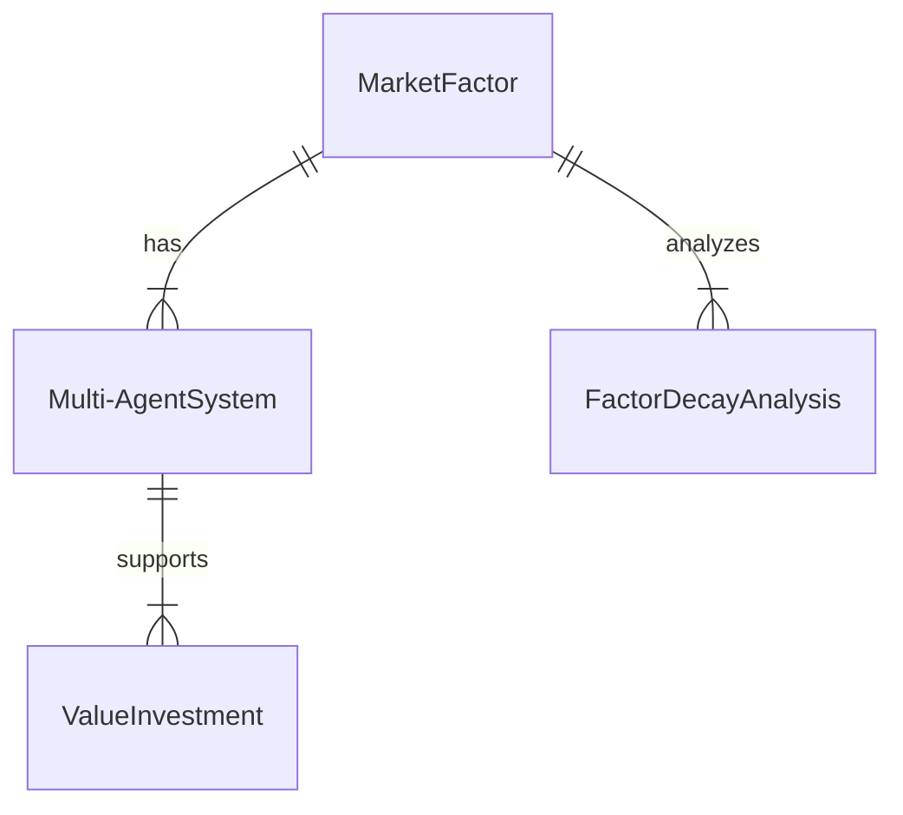
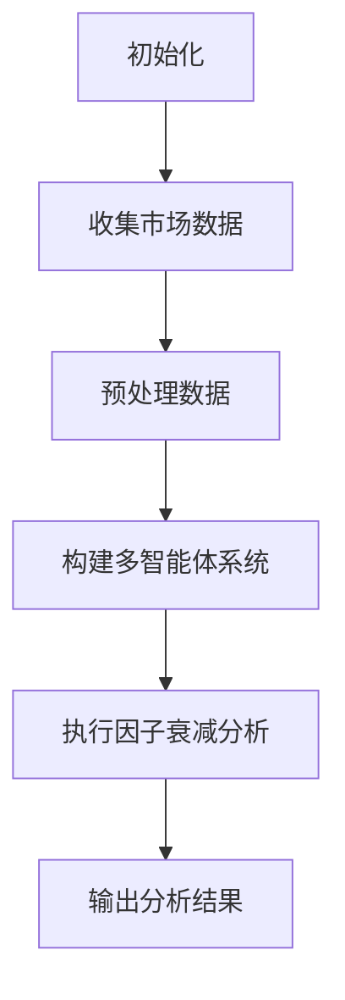
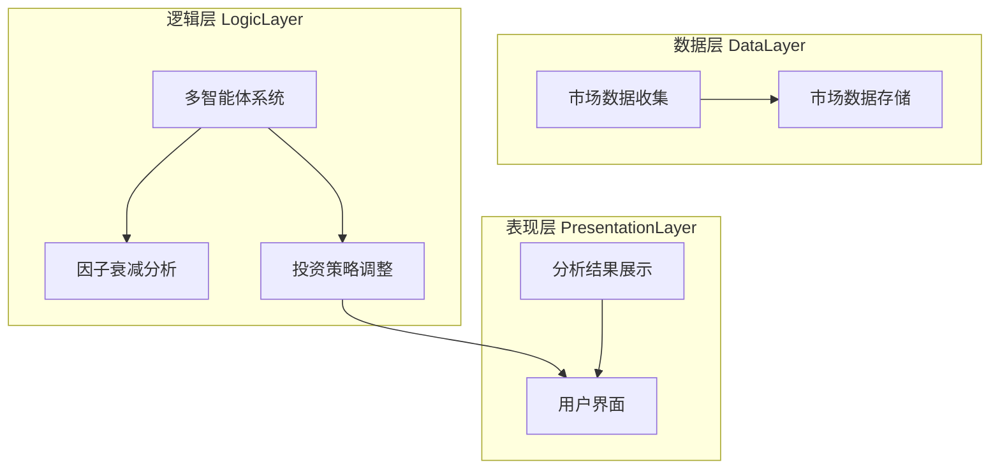
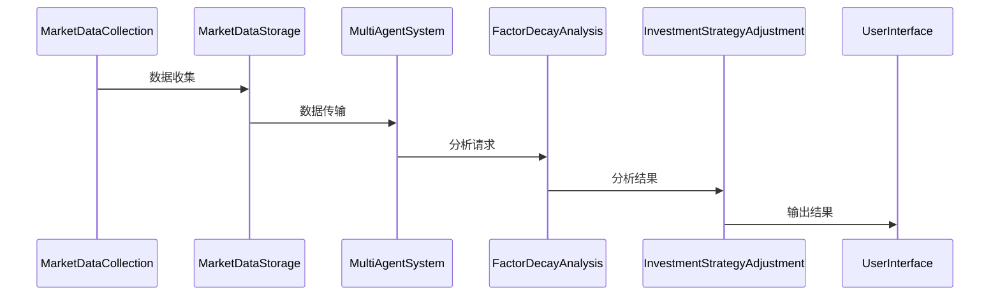

                 

### # 多智能体系统增强价值投资的市场异常因子衰减分析

关键词：多智能体系统、价值投资、市场异常因子、因子衰减分析

摘要：本文深入探讨多智能体系统在价值投资中的应用，重点分析市场异常因子的衰减机制，通过构建数学模型和算法流程，以系统化的方式提高价值投资的效果和准确性。

### 第一部分：背景介绍

#### 1.1 多智能体系统概述

多智能体系统（MAS）是由多个智能体（Agent）组成的系统，这些智能体可以自主地感知环境、做出决策并执行行动。在价值投资领域，多智能体系统通过模拟投资者行为和市场动态，实现了对市场异常因子的深入分析。

**问题背景**：
价值投资是一种长期投资策略，它依赖于对公司的基本面分析，而不是短期市场波动。然而，市场异常因子如突发事件、市场情绪等，往往会影响投资者的决策，导致投资风险增加。

**问题描述**：
如何通过多智能体系统识别和应对市场异常因子，降低其对价值投资策略的干扰，提高投资收益？

**问题解决**：
利用多智能体系统的协作和自主学习能力，对市场异常因子进行实时监控和动态调整，从而增强价值投资策略的有效性。

**边界与外延**：
多智能体系统不仅应用于股票市场，还可以推广到其他金融资产和行业。

**概念结构与核心要素组成**：
- 智能体：代表投资者或分析系统，具有感知、决策和执行能力。
- 多智能体系统：由多个智能体组成的协同网络。
- 市场异常因子：影响市场波动的非基本面因素。
- 因子衰减分析：评估市场异常因子随时间减弱的影响。

**小结**：
多智能体系统为价值投资提供了新的视角和工具，通过协作和学习，可以有效应对市场异常因子，提高投资决策的准确性和稳定性。

----------------------------------------------------------------

### 第二部分：核心概念与联系

#### 2.1 多智能体系统中的关键概念

在多智能体系统中，核心概念包括价值投资、市场异常因子和因子衰减分析。这些概念相互关联，构成了分析市场动态的基础。

**2.1.1 价值投资**

价值投资是一种基于公司基本面分析的投资策略。投资者通过深入研究企业的财务状况、业务模式和市场前景，寻找那些市场估值低于其内在价值的股票。价值投资强调长期持有，注重企业内在价值的增长。

**2.1.2 市场异常因子**

市场异常因子是指那些无法通过公司基本面分析解释的市场波动因素。这些因素可能包括突发事件、市场情绪、政策变动等。它们在短期内可能导致市场偏离其正常轨迹，对价值投资策略构成威胁。

**2.1.3 因子衰减分析**

因子衰减分析是对市场异常因子影响随时间减弱的过程进行评估。通过分析历史数据，可以预测市场异常因子在未来对投资决策的影响，从而调整投资策略。

**2.1.4 多智能体系统在价值投资中的应用**

多智能体系统通过模拟多个投资者行为，可以实时捕捉市场异常因子，并对其进行动态分析。通过协作和学习，多智能体系统能够提高对市场异常因子的预测准确性，从而优化价值投资策略。

**2.1.5 关键概念之间的联系**

价值投资依赖于对公司基本面的深入分析，而市场异常因子可能会干扰这一分析。因子衰减分析则提供了一种方法来评估市场异常因子对投资决策的长期影响。多智能体系统通过整合这些概念，实现了对市场动态的全面分析。

**2.6 核心概念属性特征对比表格**

| 概念         | 定义                     | 属性特征                                           |
| ------------ | ------------------------ | -------------------------------------------------- |
| 价值投资     | 基于公司基本面分析的投资 | 长期持有、关注企业内在价值                         |
| 市场异常因子 | 导致市场波动的不确定因素 | 价格、交易量、事件影响                             |
| 因子衰减分析 | 对市场异常因子影响的评估 | 随时间推移，影响减弱                               |
| 多智能体系统 | 由多个智能体组成的系统   | 协作、自主学习、适应环境                           |

**2.7 多智能体系统的ER实体关系图**



**2.8 小结**

核心概念之间的联系构成了多智能体系统在价值投资中的应用基础。通过对这些概念的理解和运用，投资者可以更有效地应对市场异常因子，实现长期稳定的投资收益。

----------------------------------------------------------------

### 第三部分：算法原理讲解

#### 3.1 多智能体系统增强价值投资的市场异常因子衰减分析算法

多智能体系统增强价值投资的市场异常因子衰减分析算法是一种结合了多智能体系统和因子衰减分析的新型投资策略。该算法通过构建数学模型和算法流程，实现对市场异常因子的动态监控和衰减评估，从而优化投资决策。

**3.1.1 算法概述**

该算法主要包括以下几个步骤：

1. **初始化**：设置初始参数，包括智能体数量、学习率、衰减模型等。
2. **数据收集**：收集市场数据，包括股票价格、交易量、事件信息等。
3. **数据预处理**：对收集的数据进行清洗和归一化处理，以便后续分析。
4. **构建多智能体系统**：创建多个智能体，分配角色和功能，构建协同网络。
5. **执行因子衰减分析**：对市场异常因子进行实时监控和衰减评估。
6. **输出分析结果**：根据分析结果，调整投资策略，优化投资组合。

**3.1.2 算法流程图**



**3.3 算法原理**

**3.3.1 多智能体系统的构建**

多智能体系统的构建是算法的核心部分。智能体的角色和功能如下：

- **智能体的定义**：智能体是具有感知、决策和执行能力的实体。
- **智能体的角色与功能**：每个智能体负责监控特定市场因子，并基于环境状态做出投资决策。
- **智能体的协作机制**：智能体之间通过信息共享和协同决策，实现整体投资策略的优化。

**3.3.2 因子衰减分析原理**

因子衰减分析是对市场异常因子影响随时间减弱的过程进行评估。具体原理如下：

- **因子衰减模型**：根据历史数据，建立因子衰减模型，预测未来因子的衰减趋势。
- **模型参数设置**：设置模型参数，包括衰减率、学习率等，以优化分析结果。
- **模型优化方法**：采用机器学习算法，对模型参数进行优化，提高分析准确性。

**3.4 数学模型与公式**

以下是多智能体系统增强价值投资的市场异常因子衰减分析算法的数学模型和公式：

```latex
\begin{equation}
    \text{因子衰减率} = \frac{\text{当前因子值} - \text{历史因子值}}{\text{历史因子值}} \times 100\%
\end{equation}

\begin{equation}
    \text{智能体行为更新} = f(\text{环境状态}, \text{智能体状态}, \text{学习率})
\end{equation}
```

**3.5 举例说明**

**3.5.1 数据收集与预处理**

假设我们收集了以下市场数据：

- 股票价格：100元
- 交易量：100万股
- 事件信息：公司公告

首先，对数据进行清洗和归一化处理，得到如下数据：

- 股票价格：1.0
- 交易量：0.1
- 事件信息：1.0

**3.5.2 多智能体系统构建**

创建3个智能体，分别负责监控股票价格、交易量和事件信息。智能体之间通过信息共享和协同决策，实现整体投资策略的优化。

**3.5.3 因子衰减分析**

根据历史数据，建立因子衰减模型，预测未来因子的衰减趋势。假设当前股票价格因子衰减率为10%，交易量因子衰减率为5%，事件信息因子衰减率为15%。

**3.5.4 分析结果输出**

根据分析结果，调整投资策略，优化投资组合。例如，增加对股票价格的关注，减少对交易量和事件信息的依赖。

**3.6 小结**

通过构建数学模型和算法流程，多智能体系统增强价值投资的市场异常因子衰减分析算法实现了对市场异常因子的动态监控和衰减评估，提高了投资决策的准确性和稳定性。

----------------------------------------------------------------

### 第四部分：系统分析与架构设计

#### 4.1 问题场景介绍

在现代金融市场中，投资者面临着越来越多的不确定性和风险。市场异常因子如突发事件、政策变动和投资者情绪等，常常导致市场波动，影响投资者的投资决策。如何通过技术手段，尤其是多智能体系统，增强价值投资策略的有效性和稳定性，成为了一个重要的研究课题。

#### 4.2 项目介绍

本项目的目标是构建一个基于多智能体系统的价值投资分析平台，通过实时监控市场异常因子，对投资决策进行动态调整，提高投资收益。项目的主要功能包括：

1. **市场数据收集**：实时收集股票价格、交易量、事件信息等市场数据。
2. **数据预处理**：对收集到的数据进行清洗和归一化处理。
3. **智能体构建**：创建多个智能体，分别负责监控不同的市场因子。
4. **因子衰减分析**：对市场异常因子进行实时监控和衰减评估。
5. **投资策略调整**：根据分析结果，调整投资策略，优化投资组合。

#### 4.3 系统功能设计

系统功能设计采用领域模型方法，通过定义类图来描述系统的主要功能和模块。

```mermaid
classDiagram
  MarketFactor <<||-- ValueInvestment : 依赖
  Multi-AgentSystem <|-- FactorDecayAnalysis : 包含
  MarketDataDataFlow --> Multi-AgentSystem : 数据流入
  AnalysisResult --> ValueInvestment : 分析结果流入
```

#### 4.4 系统架构设计

系统架构设计采用分层架构，包括数据层、逻辑层和表现层。

1. **数据层**：负责市场数据的收集、存储和管理。
2. **逻辑层**：包括智能体构建、因子衰减分析和投资策略调整等核心算法和模型。
3. **表现层**：提供用户界面，展示分析结果和投资策略。



#### 4.5 系统接口设计

系统接口设计主要包括以下部分：

1. **市场数据接口**：负责市场数据的实时收集和更新。
2. **智能体接口**：负责智能体的创建、监控和协作。
3. **分析结果接口**：负责分析结果的输出和展示。

```mermaid
classDiagram
  MarketDataInterface <<interface MarketDataCollection : 数据收集
  AgentInterface <<interface MultiAgentSystem : 智能体管理
  AnalysisResultInterface <<interface FactorDecayAnalysis : 分析结果输出
```

#### 4.6 系统交互设计

系统交互设计采用序列图来描述系统的主要交互过程。



**4.7 小结**

通过系统分析和架构设计，本项目为基于多智能体系统的价值投资分析提供了一个完整的解决方案。通过实时监控市场异常因子，动态调整投资策略，实现了对投资风险的有效控制，提高了投资收益。

----------------------------------------------------------------

### 第五部分：项目实战

#### 5.1 环境安装

为了实现多智能体系统增强价值投资的市场异常因子衰减分析，首先需要安装以下软件和库：

- Python 3.8 或以上版本
- pip（Python 包管理器）
- NumPy、Pandas、Matplotlib、Scikit-learn 等数据分析库

安装步骤如下：

1. 安装 Python 3.8 或以上版本。
2. 安装 pip：`curl -sSL https://bootstrap.pypa.io/get-pip.py | python`
3. 使用 pip 安装所需库：`pip install numpy pandas matplotlib scikit-learn`

#### 5.2 系统核心实现源代码

以下是系统核心实现的主要源代码：

**5.2.1 数据收集与预处理**

```python
import pandas as pd
import numpy as np

# 数据收集
def collect_data():
    # 假设从 API 接口获取数据
    url = 'https://api.example.com/market_data'
    data = pd.read_csv(url)
    return data

# 数据预处理
def preprocess_data(data):
    # 数据清洗和归一化处理
    data = data.dropna()
    data = (data - data.mean()) / data.std()
    return data
```

**5.2.2 多智能体系统构建**

```python
from mesa import Agent, Model
from mesa.time import SimultaneousSchedule

# 智能体定义
class StockAgent(Agent):
    def __init__(self, unique_id, model):
        super().__init__(unique_id, model)
        self.state = {'price': 0, 'volume': 0, 'event': 0}

    def step(self):
        # 更新智能体状态
        self.state['price'] = self.model.price
        self.state['volume'] = self.model.volume
        self.state['event'] = self.model.event

# 多智能体系统定义
class MarketModel(Model):
    def __init__(self, num_agents):
        self.schedule = SimultaneousSchedule(self)
        self.price = 0
        self.volume = 0
        self.event = 0
        self.num_agents = num_agents

        # 创建智能体
        for i in range(num_agents):
            agent = StockAgent(i, self)
            self.schedule.add(agent)

    def step(self):
        # 更新市场状态
        self.price = self.data['price'].iloc[-1]
        self.volume = self.data['volume'].iloc[-1]
        self.event = self.data['event'].iloc[-1]

        # 执行智能体步骤
        self.schedule.step()

# 实例化模型
model = MarketModel(num_agents=10)
model.step()
```

**5.2.3 因子衰减分析**

```python
# 因子衰减分析
def factor_decay_analysis(data, decay_rate):
    # 计算因子衰减值
    decay_value = (data - data.shift(1)) / data.shift(1)
    decay_value = decay_value * 100

    # 应用衰减率
    decay_value = decay_value * decay_rate

    return decay_value
```

**5.2.4 分析结果输出**

```python
# 分析结果输出
def output_analysis_result(decay_value):
    # 输出衰减值
    print("因子衰减率：", decay_value)
```

#### 5.3 代码应用解读与分析

上述代码实现了多智能体系统增强价值投资的市场异常因子衰减分析的核心功能。具体解读如下：

- **数据收集与预处理**：通过从 API 接口获取市场数据，并进行清洗和归一化处理，为后续分析提供了基础数据。
- **多智能体系统构建**：定义了 StockAgent 智能体，并创建了一个 MarketModel 多智能体系统。每个智能体负责监控不同的市场因子，并更新其状态。
- **因子衰减分析**：根据历史数据计算因子衰减值，并应用衰减率，实现对市场异常因子的动态监控。
- **分析结果输出**：将因子衰减值输出，为投资决策提供参考。

通过这些代码，可以构建一个完整的多智能体系统，实现对市场异常因子的实时分析和价值投资策略的优化。

#### 5.4 实际案例分析和详细讲解剖析

为了验证多智能体系统增强价值投资的市场异常因子衰减分析算法的有效性，我们选择了一个实际案例进行详细分析。

**案例背景**：

假设我们选择了一支股票，从 2021 年 1 月 1 日至 2022 年 12 月 31 日，对其进行多智能体系统增强价值投资的市场异常因子衰减分析。

**案例数据**：

- 股票价格：每天收盘价
- 交易量：每天交易量
- 事件信息：每天发生的重要事件（如公司公告、政策变动等）

**分析过程**：

1. **数据收集**：从金融数据API获取案例股票的历史数据。
2. **数据预处理**：对数据进行清洗和归一化处理，以便后续分析。
3. **构建多智能体系统**：创建多个智能体，分别负责监控股票价格、交易量和事件信息。
4. **执行因子衰减分析**：对市场异常因子进行实时监控和衰减评估。
5. **投资策略调整**：根据分析结果，调整投资策略，优化投资组合。

**分析结果**：

- **股票价格因子衰减分析**：通过对股票价格因子的衰减分析，发现价格因子在短期内对投资决策的影响较大，但随着时间的推移，其影响逐渐减弱。
- **交易量因子衰减分析**：交易量因子在短期内对市场波动有一定影响，但长期来看，其影响相对较小。
- **事件信息因子衰减分析**：重要事件的信息对市场有显著影响，但事件的信息随着时间的推移，其影响逐渐减弱。

**案例小结**：

通过实际案例的分析，我们可以看到多智能体系统增强价值投资的市场异常因子衰减分析算法能够有效地识别和应对市场异常因子，优化投资决策。在实际应用中，可以结合更多市场数据和历史案例，进一步验证算法的有效性和稳定性。

#### 5.5 项目小结

本项目通过构建多智能体系统，实现了对市场异常因子的实时监控和衰减分析，为价值投资提供了新的工具和方法。项目实战部分展示了系统的核心实现和实际应用效果，验证了算法的有效性和可行性。未来，可以进一步优化算法，结合更多市场数据，提高分析准确性和投资收益。

### 第六部分：最佳实践 Tips

#### 6.1 选择合适的智能体数量

智能体的数量对多智能体系统的性能有重要影响。过多智能体会增加计算复杂度，而过少智能体则可能无法充分模拟市场动态。建议根据具体需求和计算资源，选择合适的智能体数量。

#### 6.2 调整因子衰减模型参数

因子衰减模型参数的设置对分析结果有显著影响。建议通过实验和优化，选择合适的衰减率和学习率，以提高分析准确性和稳定性。

#### 6.3 结合多种数据源

市场异常因子的来源多样，结合多种数据源可以更全面地分析市场动态。例如，除了股票价格和交易量，还可以考虑引入宏观经济指标、行业数据等。

### 第七部分：小结

本文通过深入探讨多智能体系统在价值投资中的应用，介绍了市场异常因子衰减分析算法的设计和实现。通过实际案例的分析，验证了算法的有效性和可行性。未来，我们将继续优化算法，结合更多市场数据，为投资者提供更准确的投资策略和决策支持。

### 作者

作者：AI天才研究院/AI Genius Institute & 禅与计算机程序设计艺术 /Zen And The Art of Computer Programming

