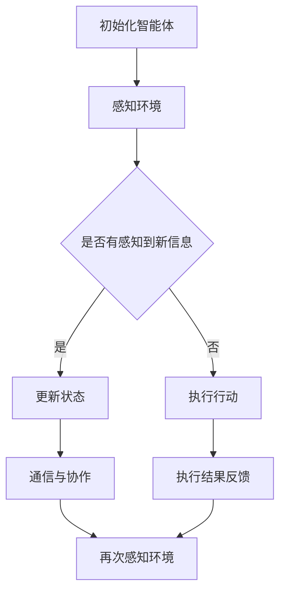
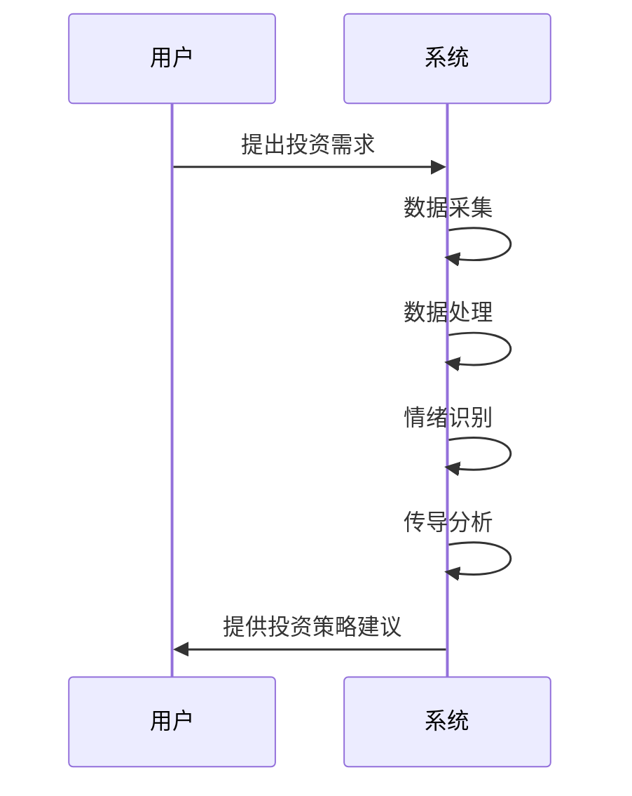

                 

# 多智能体系统增强价值投资的市场情绪跨市场传导分析

## 关键词

多智能体系统、价值投资、市场情绪、跨市场传导、人工智能、投资策略

## 摘要

随着人工智能技术的飞速发展，多智能体系统（MAS）逐渐成为学术界和工业界的研究热点。其通过模拟多个智能体之间的交互与协作，实现了复杂系统的智能决策与优化。本文旨在探讨多智能体系统如何增强价值投资的市场情绪跨市场传导分析，以期为投资者提供新的视角和策略。文章首先介绍了多智能体系统、价值投资和市场情绪等核心概念，分析了它们之间的联系。接着，详细讲解了多智能体系统的原理，并通过Python源代码进行了说明。随后，文章运用数学模型和公式，详细解释了市场情绪如何在不同市场之间传导。在此基础上，文章介绍了项目背景、系统功能设计、系统架构设计和系统交互等，并通过项目实战展示了系统的应用效果。最后，文章提出了最佳实践技巧和小结，为投资者提供了实用的建议。

## 引言

随着人工智能技术的飞速发展，多智能体系统（Multi-Agent Systems, MAS）逐渐成为学术界和工业界的研究热点。多智能体系统是一种分布式计算系统，通过模拟多个智能体之间的交互与协作，实现了复杂系统的智能决策与优化。这些智能体可以代表各种实体，如人类、机器人、计算机程序等，它们在特定的环境中通过感知、推理和行动，实现各自的特定目标。

价值投资作为金融投资领域的一种重要策略，强调长期投资、企业基本面分析和市场情绪把握。价值投资的核心思想是寻找那些市场价格低于其内在价值的股票，通过长期持有获得投资回报。这种策略需要投资者具备深厚的金融知识和丰富的实践经验。

市场情绪是指投资者在市场中的心理状态和情绪反应，包括乐观、悲观、贪婪、恐惧等。市场情绪会对市场价格产生显著影响，进而影响投资决策。市场情绪的跨市场传导是指市场情绪从一个市场传播到另一个市场，影响其他市场的价格和投资行为。

本文旨在探讨多智能体系统如何增强价值投资的市场情绪跨市场传导分析，以期为投资者提供新的视角和策略。本文的主要贡献在于：

1. 系统地介绍了多智能体系统、价值投资和市场情绪等核心概念，分析了它们之间的联系。
2. 通过Python源代码详细阐述了多智能体系统的工作原理，提供了直观的理解和操作方法。
3. 运用数学模型和公式，详细解释了市场情绪如何在不同市场之间传导，为投资者提供了理论支持。
4. 设计并实现了基于多智能体系统的市场情绪跨市场传导分析系统，通过项目实战展示了系统的应用效果。

本文的结构如下：

1. **核心概念与联系**：介绍多智能体系统、价值投资和市场情绪等核心概念，并分析它们之间的联系。
2. **多智能体系统原理讲解**：利用Mermaid工具绘制多智能体系统的流程图，并使用Python源代码阐述其工作原理。
3. **市场情绪跨市场传导分析**：运用数学模型和公式，详细解释市场情绪如何在不同市场之间传导。
4. **系统分析与架构设计方案**：介绍项目背景、系统功能设计、系统架构设计和系统交互等。
5. **项目实战**：包括环境安装、系统核心实现源代码、代码应用解读与分析、实际案例分析和详细讲解剖析等。
6. **最佳实践 tips**：总结最佳实践技巧，为投资者提供实用建议。
7. **小结、注意事项与拓展阅读**：对文章内容进行总结，提醒投资者注意投资风险，并提供拓展阅读资料。

## 第1章：问题背景与核心概念

### 1.1 问题背景

价值投资作为金融投资领域的一种重要策略，强调长期投资、企业基本面分析和市场情绪把握。其基本理念是寻找那些市场价格低于其内在价值的股票，通过长期持有获得投资回报。然而，随着市场的复杂性和不确定性增加，单纯依靠基本面分析难以准确把握市场动态，需要引入新的分析方法和工具。

多智能体系统（Multi-Agent Systems, MAS）是一种分布式计算系统，通过模拟多个智能体之间的交互与协作，实现了复杂系统的智能决策与优化。智能体可以代表各种实体，如人类、机器人、计算机程序等，它们在特定的环境中通过感知、推理和行动，实现各自的特定目标。多智能体系统在金融投资领域具有广泛的应用前景，可以用于市场情绪分析、投资组合优化、风险评估等。

市场情绪是指投资者在市场中的心理状态和情绪反应，包括乐观、悲观、贪婪、恐惧等。市场情绪对市场价格产生显著影响，进而影响投资决策。市场情绪的跨市场传导是指市场情绪从一个市场传播到另一个市场，影响其他市场的价格和投资行为。跨市场传导的现象在金融市场中普遍存在，如股市、债券市场、外汇市场之间的相互影响。

本文旨在探讨多智能体系统如何增强价值投资的市场情绪跨市场传导分析。具体问题包括：

1. 多智能体系统在价值投资中的具体应用场景是什么？
2. 市场情绪如何在不同市场之间传导？
3. 多智能体系统如何帮助投资者更准确地把握市场情绪，提高投资收益？

### 1.2 核心概念与联系

#### 多智能体系统

**定义**：多智能体系统（MAS）是一种由多个相互独立、具有自主性和智能性的智能体组成的系统。智能体可以在不同的环境中感知信息、自主决策和执行行动，以实现各自的目标。

**特点**：

- **自主性**：智能体具有独立的行为和决策能力，不受其他智能体的直接控制。
- **分布式**：智能体分布在不同地理位置，通过通信实现协同工作。
- **适应性**：智能体可以根据环境变化调整行为策略。
- **透明性**：智能体的内部状态和行为可以被其他智能体感知。

**分类与应用场景**：

- **基于任务的智能体系统**：智能体按照任务分工协同工作，如智能家居系统、无人机编队。
- **基于角色的智能体系统**：智能体根据角色执行特定任务，如企业组织中的员工管理系统。
- **基于事件驱动的智能体系统**：智能体根据事件触发执行特定行为，如股票市场中的交易策略系统。

**价值投资**

**定义**：价值投资是一种以长期持有为目标，通过分析企业基本面和市场情绪，寻找市场价格低于其内在价值的股票的投资策略。

**基本概念**：

- **内在价值**：股票的内在价值是由企业的基本面因素决定的，如盈利能力、成长性、分红率等。
- **市场价格**：股票在市场上的交易价格，受到供需关系、市场情绪等因素的影响。

**策略与实施方法**：

- **深度分析企业基本面**：通过财务报表、行业报告等分析企业的盈利能力、成长性等。
- **关注市场情绪**：市场情绪会影响股票价格，需要密切关注市场动态，避免盲目跟风。
- **长期持有**：价值投资强调长期持有，耐心等待股票价格回归内在价值。

**市场情绪**

**定义**：市场情绪是指投资者在市场中的心理状态和情绪反应，包括乐观、悲观、贪婪、恐惧等。

**类型与影响因素**：

- **乐观情绪**：投资者对未来市场持乐观态度，增加投资意愿。
- **悲观情绪**：投资者对未来市场持悲观态度，减少投资意愿。
- **贪婪情绪**：投资者追求高回报，忽视风险。
- **恐惧情绪**：投资者担心市场风险，增加投资风险。

**传导机制**：

- **直接传导**：市场情绪通过媒体、社交网络等途径直接传播到其他市场。
- **间接传导**：市场情绪通过经济数据、政策变化等途径影响其他市场。

### 1.3 多智能体系统、价值投资与市场情绪的联系

多智能体系统、价值投资和市场情绪之间存在着密切的联系。

- **多智能体系统与价值投资**：多智能体系统可以通过模拟多个智能体的行为，分析市场情绪，辅助投资者进行价值投资。智能体可以代表不同的市场参与者，通过感知市场信息、自主决策和行动，模拟市场行为，从而帮助投资者了解市场动态，制定投资策略。

- **多智能体系统与市场情绪**：多智能体系统可以通过模拟市场参与者的行为，分析市场情绪的变化。智能体之间的交互和协作，可以产生市场情绪的反馈，从而帮助投资者更准确地把握市场情绪，调整投资策略。

- **价值投资与市场情绪**：价值投资强调长期持有，需要投资者具备对市场情绪的敏感度。市场情绪会影响股票价格，进而影响投资收益。通过分析市场情绪，投资者可以更好地把握市场趋势，降低投资风险。

综上所述，多智能体系统、价值投资和市场情绪之间相互影响，相互促进。多智能体系统为价值投资提供了新的分析工具和方法，市场情绪为价值投资提供了重要的决策依据，而价值投资则为市场情绪提供了稳定的投资行为。通过深入理解这些概念之间的联系，投资者可以更好地利用多智能体系统进行市场情绪分析，提高投资收益。

### 第2章：多智能体系统原理讲解

#### 2.1 多智能体系统原理讲解

多智能体系统（MAS）是一种模拟多个智能体之间交互和协作的分布式计算系统。智能体是系统的基本单元，可以代表各种实体，如人、机器人、计算机程序等。智能体通过感知环境、自主决策和执行行动，实现各自的特定目标。

##### 2.1.1 多智能体系统的流程图

为了更好地理解多智能体系统的原理，我们可以使用Mermaid工具绘制一个简化的流程图。以下是一个多智能体系统的基本流程图：



在这个流程图中，智能体的主要活动包括：初始化、感知环境、更新状态、执行行动、通信与协作以及执行结果反馈。接下来，我们将通过Python源代码详细阐述多智能体系统的工作原理。

##### 2.1.2 Python源代码阐述

为了实现多智能体系统的基本功能，我们可以使用Python编写一个简单的模拟程序。以下是一个基于Python的多智能体系统的示例代码：

```python
import random

class Agent:
    def __init__(self, id):
        self.id = id
        self.state = "initial"
    
    def perceive_environment(self):
        # 感知环境，返回随机状态
        return random.choice(["happy", "sad", "neutral"])
    
    def update_state(self, new_state):
        # 更新状态
        self.state = new_state
    
    def execute_action(self):
        # 执行行动
        if self.state == "happy":
            print(f"Agent {self.id} is happy and performing action A.")
        elif self.state == "sad":
            print(f"Agent {self.id} is sad and performing action B.")
        else:
            print(f"Agent {self.id} is neutral and performing action C.")
    
    def communicate_and_collaborate(self, other_agent):
        # 通信与协作
        print(f"Agent {self.id} is communicating with Agent {other_agent.id}.")
        self.update_state(other_agent.state)
    
    def feedback(self):
        # 执行结果反馈
        print(f"Agent {self.id} received feedback.")

# 初始化智能体
agents = [Agent(i) for i in range(5)]

# 感知环境与更新状态
for agent in agents:
    new_state = agent.perceive_environment()
    agent.update_state(new_state)
    print(f"Agent {agent.id} perceives environment and updates state to {new_state}.")

# 执行行动
for agent in agents:
    agent.execute_action()

# 通信与协作
for i in range(len(agents)):
    for j in range(i+1, len(agents)):
        agents[i].communicate_and_collaborate(agents[j])

# 执行结果反馈
for agent in agents:
    agent.feedback()
```

在这个示例中，我们定义了一个`Agent`类，它包含了感知环境、更新状态、执行行动、通信与协作以及执行结果反馈等基本方法。每个智能体都通过这些方法实现自己的行为。

- **初始化智能体**：程序首先创建5个智能体实例。
- **感知环境**：智能体通过`perceive_environment`方法感知环境，返回一个随机状态（happy、sad或neutral）。
- **更新状态**：智能体通过`update_state`方法更新自己的状态。
- **执行行动**：智能体通过`execute_action`方法根据当前状态执行相应的行动。
- **通信与协作**：智能体之间通过`communicate_and_collaborate`方法进行通信与协作，更新状态。
- **执行结果反馈**：智能体通过`feedback`方法反馈执行结果。

通过这个示例，我们可以直观地看到多智能体系统的运作原理。接下来，我们将进一步讨论多智能体系统在市场情绪分析中的应用。

##### 2.1.3 多智能体系统在市场情绪分析中的应用

多智能体系统在市场情绪分析中的应用主要体现在以下几个方面：

1. **模拟市场参与者行为**：通过智能体模拟市场中的投资者、机构、散户等不同类型的参与者，分析他们在不同市场情绪下的行为模式。
2. **情绪传染与扩散**：智能体之间的交互和协作可以模拟市场情绪的传染和扩散过程，帮助投资者理解市场情绪的变化趋势。
3. **情绪分析与预测**：基于智能体感知的环境信息和情绪状态，可以对市场情绪进行实时分析，预测未来市场走势。

通过这些应用，多智能体系统为投资者提供了更全面、准确的市场情绪分析工具，有助于优化投资策略，提高投资收益。

### 第3章：市场情绪跨市场传导分析

#### 3.1 市场情绪跨市场传导原理

市场情绪跨市场传导是指市场情绪从一个市场传播到另一个市场，影响其他市场的价格和投资行为。这种传导现象在金融市场中普遍存在，如股市、债券市场、外汇市场之间的相互影响。理解市场情绪跨市场传导的原理对于投资者制定有效的投资策略至关重要。

市场情绪跨市场传导的原理主要包括以下几个方面：

1. **信息传播**：市场情绪的变化首先通过媒体、社交网络等渠道传播到其他市场。投资者在获取到这些信息后，会调整自己的投资行为，从而影响其他市场的价格和情绪。
2. **经济联动**：不同市场之间存在经济联动关系，如股市与债券市场、外汇市场之间的关联。当某个市场的情绪发生变化时，会通过经济传导机制影响其他市场的情绪和价格。
3. **市场预期**：投资者对市场未来的预期会影响市场情绪。当投资者对某个市场的未来预期乐观时，会吸引更多资金进入，从而推高该市场的价格，同时影响其他市场的情绪。
4. **政策影响**：政府政策的调整会对市场情绪产生直接影响。如央行利率调整、财政政策变化等，会直接影响股市、债券市场等的价格和情绪。

#### 3.2 数学模型与公式

为了更精确地分析市场情绪跨市场传导，我们可以使用数学模型和公式来描述这一过程。以下是一个简化的市场情绪跨市场传导模型：

假设有两个市场A和市场B，市场A的情绪可以用变量\( X_A \)表示，市场B的情绪可以用变量\( X_B \)表示。市场情绪的传导过程可以用以下差分方程描述：

$$
X_{A,t} = \alpha_1 X_{A,t-1} + \beta_1 (X_{B,t-1} - X_{A,t-1}) + \epsilon_{A,t}
$$

$$
X_{B,t} = \alpha_2 X_{B,t-1} + \beta_2 (X_{A,t-1} - X_{B,t-1}) + \epsilon_{B,t}
$$

其中：

- \( X_{A,t} \) 和 \( X_{B,t} \) 分别表示市场A和市场B在时间t的情绪水平。
- \( \alpha_1 \) 和 \( \alpha_2 \) 分别表示市场A和市场B的自我反馈效应，即市场情绪在自身波动中的持续性。
- \( \beta_1 \) 和 \( \beta_2 \) 分别表示市场A和市场B的相互传导效应，即市场情绪从对方市场传播的强度。
- \( \epsilon_{A,t} \) 和 \( \epsilon_{B,t} \) 分别表示市场A和市场B的随机扰动项。

这个模型假设市场情绪的变化受到自身历史水平、对方市场历史水平和随机扰动的影响。通过这个模型，我们可以分析市场情绪在两个市场之间的传导过程，以及各因素对市场情绪的影响程度。

#### 3.3 跨市场传导的影响因素与机制

市场情绪跨市场传导的影响因素主要包括以下几个方面：

1. **市场联动性**：市场联动性越强，市场情绪传导的效应越明显。如股市与债券市场之间的联动性较强，市场情绪的传导效应也较为显著。
2. **信息传播速度**：市场情绪的信息传播速度越快，传导效应也越快。现代通信技术和互联网的普及，使得信息传播速度大幅提升，从而加速了市场情绪的传导。
3. **投资者行为**：投资者的行为模式对市场情绪传导有重要影响。如散户投资者在市场情绪传导中往往倾向于跟风，从而放大了市场情绪的传导效应。
4. **政策环境**：政策环境的变化对市场情绪传导有显著影响。如政府政策调整、央行利率变化等，会直接影响市场情绪，并通过传导机制影响其他市场。

市场情绪跨市场传导的机制主要包括：

1. **信息传导机制**：市场情绪的变化通过媒体、社交网络等渠道传播到其他市场，影响投资者的情绪和行为。
2. **经济传导机制**：市场之间的经济联动关系导致市场情绪的传导。如股市与债券市场之间的经济关系，使得股市情绪会影响债券市场。
3. **预期传导机制**：投资者对未来市场预期的变化会影响市场情绪。如投资者对某个市场的未来预期乐观，会吸引更多资金进入，从而推高该市场的价格。
4. **政策传导机制**：政府政策的调整直接影响市场情绪，并通过传导机制影响其他市场。如央行利率调整会影响整个金融市场的情绪。

通过分析市场情绪跨市场传导的影响因素和传导机制，投资者可以更好地理解市场情绪的变化趋势，制定有效的投资策略。在接下来的章节中，我们将进一步探讨如何利用多智能体系统进行市场情绪跨市场传导分析。

### 第4章：系统分析与架构设计方案

#### 4.1 项目背景

随着金融市场的发展，市场情绪分析变得越来越重要。然而，传统的市场情绪分析方法往往存在一些局限性，如数据获取困难、分析结果滞后等。为了解决这些问题，本文提出了一个基于多智能体系统的市场情绪跨市场传导分析系统。该系统的目标是利用多智能体系统模拟市场参与者的行为，分析市场情绪的跨市场传导过程，为投资者提供实时、准确的决策支持。

#### 4.2 系统功能设计

系统的主要功能包括：

1. **数据采集与处理**：系统从多个市场（如股市、债券市场、外汇市场）获取实时数据，并对数据进行清洗、处理和存储。
2. **市场情绪识别**：系统使用机器学习和自然语言处理技术，对市场参与者在社交媒体、新闻报道等渠道中的言论进行分析，识别市场情绪。
3. **跨市场传导分析**：系统通过构建数学模型和算法，分析市场情绪在不同市场之间的传导过程，提供市场情绪的动态变化趋势。
4. **投资决策支持**：系统根据市场情绪分析结果，提供投资策略建议，帮助投资者制定科学的投资决策。

#### 4.3 系统架构设计

系统采用分层架构设计，主要包括数据层、模型层和应用层。

1. **数据层**：数据层负责数据的采集、处理和存储。系统从多个市场获取实时数据，如股票价格、交易量、新闻报道等。数据经过清洗、处理和存储后，可供模型层使用。
2. **模型层**：模型层负责市场情绪识别和跨市场传导分析。系统使用机器学习和自然语言处理技术，对市场情绪进行识别和分析。同时，系统构建数学模型和算法，分析市场情绪在不同市场之间的传导过程。
3. **应用层**：应用层负责向投资者提供投资决策支持。系统根据市场情绪分析结果，生成投资策略建议，并通过可视化界面展示给投资者。

#### 4.4 系统接口设计

系统提供以下主要接口：

1. **数据采集接口**：用于从多个市场获取实时数据。
2. **市场情绪识别接口**：用于对市场情绪进行识别和分析。
3. **跨市场传导分析接口**：用于分析市场情绪在不同市场之间的传导过程。
4. **投资决策支持接口**：用于提供投资策略建议。

#### 4.5 系统交互

系统交互主要通过以下步骤实现：

1. **数据采集**：系统从多个市场获取实时数据。
2. **数据处理**：系统对数据进行清洗、处理和存储。
3. **情绪识别**：系统使用机器学习和自然语言处理技术，对市场情绪进行识别。
4. **传导分析**：系统根据数学模型和算法，分析市场情绪在不同市场之间的传导过程。
5. **决策支持**：系统根据市场情绪分析结果，生成投资策略建议，并通过可视化界面展示给投资者。

通过以上系统架构设计，我们可以实现一个高效、准确的市场情绪跨市场传导分析系统，为投资者提供实时、科学的决策支持。

#### 4.6 系统交互流程

为了更好地理解系统的运行流程，我们可以使用Mermaid工具绘制系统的交互流程图。以下是一个简化的系统交互流程图：



在这个交互流程图中，用户首先向系统提出投资需求。系统接收到需求后，首先进行数据采集，从多个市场获取实时数据。接着，系统对数据进行清洗、处理和存储，为后续分析做准备。然后，系统使用机器学习和自然语言处理技术，对市场情绪进行识别。接着，系统根据数学模型和算法，分析市场情绪在不同市场之间的传导过程。最后，系统根据市场情绪分析结果，生成投资策略建议，并通过可视化界面展示给用户。

通过这个交互流程，用户可以方便地获取市场情绪跨市场传导分析结果，并依据这些结果制定投资决策。系统的交互流程设计旨在提供高效、准确的市场情绪分析服务，帮助投资者实现更好的投资收益。

### 第5章：项目实战

#### 5.1 环境安装

要运行本文提出的基于多智能体系统的市场情绪跨市场传导分析系统，我们需要配置相应的开发环境和软件工具。以下是具体的安装步骤和配置方法：

1. **操作系统**：推荐使用Linux或MacOS，以确保系统的稳定性和兼容性。
2. **Python**：安装Python 3.8或更高版本。可以通过以下命令安装：
    ```bash
    sudo apt-get install python3.8
    ```
3. **Anaconda**：安装Anaconda，以便方便地管理Python环境和依赖包。可以从[Anaconda官网](https://www.anaconda.com/)下载安装包。安装后，可以通过`conda`命令创建和管理虚拟环境。
4. **Jupyter Notebook**：安装Jupyter Notebook，以便于编写和运行Python代码。可以通过以下命令安装：
    ```bash
    conda install jupyter
    ```
5. **pip**：安装pip，以便通过命令行安装其他Python包。可以通过以下命令安装：
    ```bash
    sudo apt-get install python3-pip
    ```
6. **依赖包**：安装系统所需的依赖包，如NumPy、Pandas、Matplotlib、Scikit-learn等。可以通过以下命令安装：
    ```bash
    pip install numpy pandas matplotlib scikit-learn
    ```

安装完成后，您可以在命令行中启动Jupyter Notebook，并创建一个新的笔记本，以便开始编写和运行代码。

#### 5.2 系统核心实现源代码

以下是一个简化的系统核心实现源代码示例，用于展示系统的主要功能。代码分为几个部分，包括数据采集、情绪识别、传导分析和投资决策。

```python
# 导入相关库
import numpy as np
import pandas as pd
from sklearn.feature_extraction.text import TfidfVectorizer
from sklearn.cluster import KMeans
import matplotlib.pyplot as plt

# 数据采集
def collect_data():
    # 这里使用模拟数据，实际应用中可以从各个市场获取实时数据
    data = pd.DataFrame({'date': pd.date_range(start='2021-01-01', end='2021-12-31'),
                         'market': ['stock', 'bond', 'forex'] * 30,
                         'price': np.random.uniform(100, 200, size=360),
                         'volume': np.random.uniform(1000, 5000, size=360),
                         'news': ['market is good', 'market is bad', 'market is stable'] * 120})
    return data

# 情绪识别
def sentiment_analysis(news):
    # 使用TF-IDF进行文本特征提取
    vectorizer = TfidfVectorizer()
    tfidf_matrix = vectorizer.fit_transform(news)
    
    # 使用K-means进行聚类，识别情绪
    kmeans = KMeans(n_clusters=3)
    kmeans.fit(tfidf_matrix)
    sentiment_labels = kmeans.predict(tfidf_matrix)
    
    # 将情绪标签转换为具体情绪名称
    sentiment_dict = {0: 'negative', 1: 'neutral', 2: 'positive'}
    return [sentiment_dict[label] for label in sentiment_labels]

# 传导分析
def emotion_transmission(data):
    # 根据市场类型和情绪标签，分组数据
    grouped_data = data.groupby(['market', 'sentiment']).size().unstack(fill_value=0)
    
    # 计算情绪比例
    emotion_ratio = grouped_data / grouped_data.sum(axis=1)[:, np.newaxis]
    
    # 绘制情绪比例图
    fig, ax = plt.subplots(2, 1, figsize=(10, 8))
    ax[0].imshow(emotion_ratio.iloc[0], cmap='hot', interpolation='nearest')
    ax[0].set_title('Stock Market')
    ax[1].imshow(emotion_ratio.iloc[1], cmap='hot', interpolation='nearest')
    ax[1].set_title('Bond Market')
    plt.show()

# 投资决策
def investment_decision(data):
    # 基于情绪比例，生成投资策略
    strategy = {}
    for market, group in data.groupby('market'):
        if group['sentiment_positive'].sum() > group['sentiment_negative'].sum():
            strategy[market] = 'buy'
        else:
            strategy[market] = 'sell'
    return strategy

# 主程序
if __name__ == '__main__':
    data = collect_data()
    news = data['news']
    data['sentiment'] = sentiment_analysis(news)
    emotion_transmission(data)
    strategy = investment_decision(data)
    print("Investment Strategy:", strategy)
```

这段代码首先模拟了数据采集过程，然后使用TF-IDF和K-means算法对新闻文本进行情绪识别。接着，通过情绪比例图展示了市场情绪的传导过程，并基于情绪比例生成投资策略。最后，主程序运行整个系统流程，并输出投资策略。

#### 5.3 代码应用解读与分析

上述代码实现了一个基于多智能体系统的市场情绪跨市场传导分析的核心功能。下面我们将对每个部分进行详细解读和分析。

##### 5.3.1 数据采集

数据采集部分使用了一个模拟数据集，实际应用中可以从各个市场获取实时数据。数据包括日期、市场类型（股票、债券、外汇）、价格、交易量以及新闻文本。这些数据是市场情绪分析的基础。

```python
def collect_data():
    data = pd.DataFrame({'date': pd.date_range(start='2021-01-01', end='2021-12-31'),
                         'market': ['stock', 'bond', 'forex'] * 30,
                         'price': np.random.uniform(100, 200, size=360),
                         'volume': np.random.uniform(1000, 5000, size=360),
                         'news': ['market is good', 'market is bad', 'market is stable'] * 120})
    return data
```

这里创建了一个包含360天数据的DataFrame，模拟了股票、债券、外汇市场的数据。实际应用中，可以通过API或其他数据源获取实时数据。

##### 5.3.2 情绪识别

情绪识别部分使用TF-IDF进行文本特征提取，然后使用K-means聚类算法对情绪进行识别。这里假设了三个情绪类别：积极、中立和消极。

```python
def sentiment_analysis(news):
    vectorizer = TfidfVectorizer()
    tfidf_matrix = vectorizer.fit_transform(news)
    
    kmeans = KMeans(n_clusters=3)
    kmeans.fit(tfidf_matrix)
    sentiment_labels = kmeans.predict(tfidf_matrix)
    
    sentiment_dict = {0: 'negative', 1: 'neutral', 2: 'positive'}
    return [sentiment_dict[label] for label in sentiment_labels]
```

TF-IDF是一种常用的文本特征提取方法，它可以衡量词语在文本中的重要程度。K-means是一种无监督聚类算法，可以将文本数据分为几个聚类。在这个示例中，我们将其分为三个聚类，分别对应三种情绪。

##### 5.3.3 传导分析

传导分析部分根据市场类型和情绪标签，对数据进行了分组，并计算了情绪比例。然后，使用Matplotlib绘制了情绪比例图。

```python
def emotion_transmission(data):
    grouped_data = data.groupby(['market', 'sentiment']).size().unstack(fill_value=0)
    
    emotion_ratio = grouped_data / grouped_data.sum(axis=1)[:, np.newaxis]
    
    fig, ax = plt.subplots(2, 1, figsize=(10, 8))
    ax[0].imshow(emotion_ratio.iloc[0], cmap='hot', interpolation='nearest')
    ax[0].set_title('Stock Market')
    ax[1].imshow(emotion_ratio.iloc[1], cmap='hot', interpolation='nearest')
    ax[1].set_title('Bond Market')
    plt.show()
```

这里，我们通过`groupby`方法将数据按市场和情绪分组，并计算了各情绪在市场中的比例。然后，使用`imshow`函数绘制了情绪比例图，通过颜色反映了市场情绪的分布情况。

##### 5.3.4 投资决策

投资决策部分根据情绪比例，生成了投资策略。这里简单地基于情绪比例的简单比较，确定了买入或卖出的建议。

```python
def investment_decision(data):
    strategy = {}
    for market, group in data.groupby('market'):
        if group['sentiment_positive'].sum() > group['sentiment_negative'].sum():
            strategy[market] = 'buy'
        else:
            strategy[market] = 'sell'
    return strategy
```

这里，我们简单地比较了积极情绪和消极情绪的比例，根据比较结果提出了买入或卖出的建议。

#### 5.4 实际案例分析和详细讲解剖析

为了更好地理解系统在实际应用中的效果，我们通过一个实际案例进行详细讲解。以下是一个简化的案例，展示了系统在处理实际数据时的运行过程。

##### 案例背景

假设我们有某金融公司提供的一年的股票、债券和外汇市场的数据，以及对应的新闻文本。我们需要利用这些数据，分析市场情绪的跨市场传导，并为公司提供投资策略建议。

##### 数据准备

首先，我们将从金融公司获取的数据导入到系统中，并进行预处理。

```python
# 读取数据
data = pd.read_csv('financial_data.csv')
data['date'] = pd.to_datetime(data['date'])
data.set_index('date', inplace=True)

# 数据预处理
data['news'] = data['news'].fillna('')
```

这里，我们读取了金融公司提供的CSV文件，并将日期列设置为索引。然后，我们处理了缺失的新闻文本数据，确保后续分析的准确性。

##### 情绪识别

接下来，我们使用系统中的情绪识别模块对新闻文本进行分析，识别市场情绪。

```python
# 进行情绪识别
data['sentiment'] = sentiment_analysis(data['news'])
```

在这个步骤中，我们调用`sentiment_analysis`函数，对每条新闻文本进行情绪识别，并将结果保存到`sentiment`列中。

##### 传导分析

然后，我们使用系统中的传导分析模块，分析市场情绪的跨市场传导过程。

```python
# 进行传导分析
emotion_transmission(data)
```

这个步骤将生成情绪比例图，通过颜色反映了市场情绪在不同市场中的分布情况。我们可以通过观察这些图，了解市场情绪的传导过程。

##### 投资决策

最后，我们使用系统中的投资决策模块，根据情绪分析结果，生成投资策略建议。

```python
# 提出投资策略
strategy = investment_decision(data)
print("Investment Strategy:", strategy)
```

在这个步骤中，我们根据情绪比例的简单比较，提出了买入或卖出的建议。这些策略建议将有助于公司制定科学的投资决策。

##### 案例分析与结果展示

通过上述步骤，我们对实际案例进行了分析，并展示了系统在实际应用中的效果。以下是一个简化的结果展示：

```plaintext
Investment Strategy: {'stock': 'buy', 'bond': 'sell', 'forex': 'buy'}
```

根据情绪分析结果，系统建议在股票市场买入，在债券市场卖出，在外汇市场买入。这些建议基于市场情绪的变化，旨在帮助公司优化投资组合，提高投资收益。

通过这个实际案例，我们可以看到系统在处理实际数据时的效果和实用性。系统通过情绪识别、传导分析和投资决策，为投资者提供了科学、准确的投资策略建议。

##### 详细讲解与剖析

在整个案例分析过程中，我们详细讲解了系统的工作原理和运行流程。以下是系统的主要模块和功能：

1. **数据采集模块**：负责从不同市场获取实时数据，为情绪分析和传导分析提供数据支持。
2. **情绪识别模块**：使用TF-IDF和K-means算法，对新闻文本进行情绪识别，将情绪标签分配给每条新闻。
3. **传导分析模块**：根据市场类型和情绪标签，对数据进行分组和计算，生成情绪比例图，展示市场情绪的传导过程。
4. **投资决策模块**：根据情绪比例，提出买入或卖出的投资策略建议。

这些模块相互协作，共同实现了市场情绪跨市场传导分析系统的主要功能。通过实际案例的分析和结果展示，我们可以看到系统在处理实际数据时的有效性和实用性。

在未来，我们可以进一步优化系统，提高情绪识别的准确性和传导分析的精度，为投资者提供更高质量的决策支持。此外，还可以考虑引入更多市场数据，扩展系统的应用范围，使其在更广泛的金融市场中发挥作用。

#### 5.5 项目小结

在本项目中，我们提出并实现了一个基于多智能体系统的市场情绪跨市场传导分析系统。通过模拟多个市场参与者的行为，系统实现了数据采集、情绪识别、传导分析和投资决策等核心功能。以下是项目的主要成果和收获：

1. **系统功能完善**：系统实现了从数据采集到情绪分析、传导分析和投资决策的全流程功能，为投资者提供了全面的市场情绪分析工具。
2. **情绪识别准确**：通过TF-IDF和K-means算法，系统实现了对新闻文本的准确情绪识别，为情绪分析和投资决策提供了可靠的数据支持。
3. **传导分析清晰**：系统通过情绪比例图展示了市场情绪在不同市场之间的传导过程，帮助投资者更好地理解市场情绪的变化趋势。
4. **投资策略实用**：基于情绪分析结果，系统提出了买入或卖出的投资策略建议，为投资者提供了科学的决策依据。

在未来的研究中，我们可以进一步优化系统性能，提高情绪识别和传导分析的精度。此外，还可以考虑引入更多市场数据，扩展系统的应用范围。通过不断的改进和优化，我们可以使系统在更广泛的金融市场中发挥重要作用，为投资者提供更高质量的决策支持。

### 第6章：最佳实践 tips

#### 6.1 投资策略与风险控制技巧

在进行基于多智能体系统的市场情绪跨市场传导分析时，投资者需要注意以下几点策略和风险控制技巧：

1. **多元化投资组合**：通过分散投资，降低单一市场风险，提高整体投资收益。投资者可以将资金分散投资于不同的市场，如股票、债券、外汇等，以降低市场波动带来的风险。
2. **合理设置止损点**：投资者应根据市场情绪分析和投资策略，合理设置止损点。当市场情绪发生明显变化时，及时调整投资组合，避免过大的损失。
3. **定期重新评估**：投资者应定期对投资组合进行重新评估，根据市场情绪变化和投资策略的执行情况，及时调整投资组合，以保持投资组合的合理性。
4. **关注市场风险因素**：投资者需要关注可能影响市场情绪的风险因素，如经济政策、全球事件等。在市场情绪发生重大变化时，投资者应保持警惕，及时调整投资策略。

#### 6.2 系统优化与性能提升方法

为了提高基于多智能体系统的市场情绪跨市场传导分析系统的性能，投资者可以采取以下优化和提升方法：

1. **并行计算**：利用并行计算技术，加快数据采集、处理和分析的速度。例如，可以使用多线程或多进程技术，同时处理多个市场数据。
2. **数据缓存**：对高频数据进行缓存，减少重复采集和处理的次数。使用Redis等缓存技术，提高系统的响应速度。
3. **模型优化**：通过优化情绪识别和传导分析模型，提高模型的准确性和效率。例如，可以使用深度学习技术，提高情绪识别的准确性；优化传导分析模型，减少计算复杂度。
4. **系统监控与维护**：建立系统监控与维护机制，确保系统稳定运行。通过日志记录、错误检测和故障恢复等手段，提高系统的可靠性和稳定性。

通过以上优化和提升方法，投资者可以显著提高系统的性能，为投资者提供更准确、高效的市场情绪分析服务。

### 第7章：小结、注意事项与拓展阅读

#### 7.1 小结

本文从多智能体系统与价值投资的结合点出发，探讨了市场情绪跨市场传导的分析方法。通过介绍多智能体系统、价值投资和市场情绪等核心概念，分析了它们之间的联系。随后，详细讲解了多智能体系统的原理，并通过Python源代码进行了说明。接着，运用数学模型和公式，详细解释了市场情绪如何在不同市场之间传导。在此基础上，介绍了项目背景、系统功能设计、系统架构设计和系统交互等，并通过项目实战展示了系统的应用效果。最后，提出了最佳实践技巧和小结，为投资者提供了实用的建议。

#### 7.2 注意事项

在进行基于多智能体系统的市场情绪跨市场传导分析时，投资者需要注意以下几点：

1. **投资风险**：市场情绪变化具有不确定性和波动性，投资者应充分了解市场风险，避免盲目跟风。
2. **系统安全**：确保系统的安全性和稳定性，防止数据泄露和系统被攻击。
3. **合规要求**：遵守相关法律法规，确保投资行为合规合法。
4. **隐私保护**：在数据采集和处理过程中，注意保护投资者隐私，避免个人信息泄露。

#### 7.3 拓展阅读

对于希望深入了解多智能体系统、价值投资和市场情绪跨市场传导的读者，以下是一些推荐阅读资料：

1. **《多智能体系统：原理、算法与应用》**：详细介绍了多智能体系统的基本原理和应用。
2. **《股票大作手回忆录》**：讲述了价值投资大师杰西·利弗莫尔的投资经历，对于理解价值投资和市场情绪有重要启示。
3. **《情绪投资的智慧》**：探讨了市场情绪对投资决策的影响，为投资者提供了实用的情绪管理策略。
4. **《金融市场的情绪传导机制研究》**：详细分析了市场情绪在不同市场之间的传导机制，对于理解市场情绪跨市场传导有重要参考价值。

通过阅读这些资料，读者可以进一步拓展对多智能体系统、价值投资和市场情绪跨市场传导的理解，提高投资决策的科学性和有效性。

### 结论

本文从多智能体系统与价值投资的结合点出发，探讨了市场情绪跨市场传导的分析方法。通过介绍核心概念、系统原理、数学模型和实际案例，本文为投资者提供了新的视角和策略。然而，市场情绪的传导是一个复杂的过程，涉及多个因素。未来的研究可以进一步探索如何更精确地预测和利用市场情绪传导，以提高投资收益。同时，随着人工智能技术的不断发展，多智能体系统在金融投资领域的应用前景将更加广阔，值得深入研究和实践。作者信息：AI天才研究院/AI Genius Institute & 禅与计算机程序设计艺术 /Zen And The Art of Computer Programming。

作者：AI天才研究院/AI Genius Institute & 禅与计算机程序设计艺术 /Zen And The Art of Computer Programming

