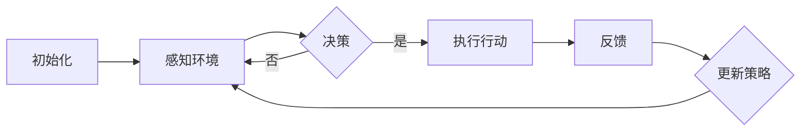
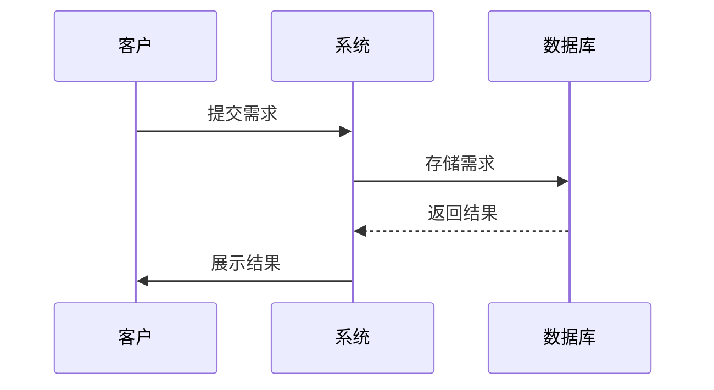
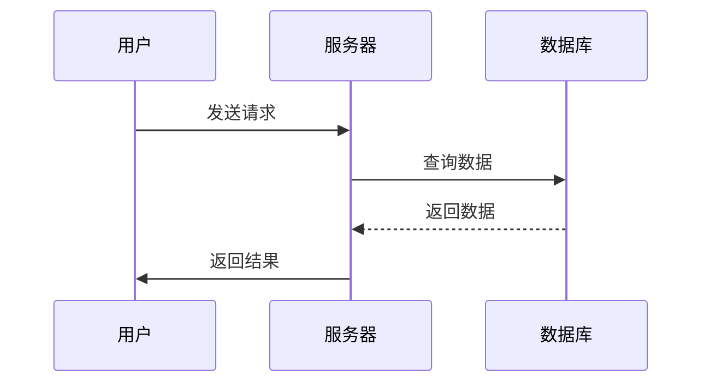

                 

# 多智能体系统如何实现全球产业链分析

> 关键词：多智能体系统、全球产业链分析、算法原理、系统架构、项目实战

> 摘要：
本文将探讨多智能体系统（MAS）在全球化产业链分析中的应用。通过详细分析多智能体系统的核心概念、算法原理及其在产业链分析中的架构设计，本文旨在揭示如何利用MAS技术来高效地分析和理解全球产业链的复杂性。同时，通过实际项目的实例，本文将展示MAS在全球产业链分析中的实际应用，并提供相关的最佳实践和未来研究方向。

## 1. 概述部分

### 1.1 多智能体系统的定义与概念

多智能体系统（MAS）是指由多个相互独立但又相互协作的智能体组成的系统。这些智能体可以是个体、组织或计算机程序，它们通过通信和协作来实现共同的目标。MAS具有以下几个核心特点：

- **自主性**：智能体具有独立的行为能力，能够自主地感知环境、做出决策和执行行动。
- **分布性**：智能体分布在不同的地理位置，通过网络进行通信和协作。
- **协同性**：智能体之间通过交互和协商来实现协调一致的行为。
- **适应性**：智能体能够根据环境变化调整自己的行为和策略。

### 1.2 全球产业链分析的定义与背景

全球产业链分析是指对全球范围内的生产、供应链和分销网络进行系统性研究，以揭示产业链的结构、运行机制和影响因素。随着全球化进程的加速，全球产业链日益复杂，涵盖了不同国家和地区、不同行业和不同企业之间的相互作用。因此，对全球产业链的分析显得尤为重要。

- **产业链结构的复杂性**：全球产业链涉及多个层次、多个环节，包括原材料采购、生产、加工、分销和销售。
- **跨国界的协同需求**：全球产业链的协同运营需要不同国家和地区的企业之间进行紧密合作。
- **政策环境的影响**：国际贸易政策、区域经济一体化政策等对全球产业链的运行产生重要影响。

## 2. 背景介绍部分

### 2.1 多智能体系统在当前产业链分析中的应用背景

随着信息技术的飞速发展，多智能体系统在产业链分析中的应用越来越广泛。具体体现在以下几个方面：

- **供应链管理**：MAS可以帮助企业实时监测供应链的各个环节，提高供应链的透明度和响应速度。
- **风险评估与预测**：MAS可以通过模拟不同的供应链场景，预测供应链中断的风险，并提供相应的应对策略。
- **协同优化**：MAS可以协调不同企业之间的资源和信息，实现供应链的优化运行。

### 2.2 全球产业链分析的重要性

全球产业链分析对于企业的战略规划和政策制定具有重要意义：

- **战略规划**：通过全球产业链分析，企业可以更好地理解市场趋势、竞争环境和资源分布，制定相应的战略计划。
- **政策制定**：政府和行业协会可以通过全球产业链分析，制定相关政策，促进产业链的健康发展。

## 3. 核心概念与联系部分

### 3.1 多智能体系统的核心概念

多智能体系统的核心概念包括智能体、环境、协议和语言等。以下是这些概念的具体解释：

- **智能体**：智能体是MAS的基本组成单元，具有感知、决策和执行能力。
- **环境**：环境是智能体所处的背景，包括物理环境和社会环境。
- **协议**：协议是智能体之间进行通信和协作的规则集合。
- **语言**：语言是智能体之间进行通信的媒介，可以是自然语言或形式化语言。

### 3.2 全球产业链分析的概念

全球产业链分析涉及以下关键概念：

- **产业链结构**：产业链结构是指全球范围内生产、供应链和分销网络的构成。
- **供应链节点**：供应链节点是指参与全球产业链的各个环节，包括供应商、制造商、分销商和零售商。
- **产业链关系**：产业链关系是指不同节点之间的相互作用和依赖关系。

### 3.3 概念属性特征对比表格

以下是多智能体系统和全球产业链分析的基本属性和特点的对比表格：

| 概念       | 多智能体系统               | 全球产业链分析               |
|------------|---------------------------|-----------------------------|
| 目的       | 协调分布式智能体的行为     | 理解和优化全球产业链结构     |
| 组成       | 智能体、环境、协议和语言   | 供应链节点、产业链关系、政策环境 |
| 特点       | 自主性、分布性、协同性、适应性 | 复杂性、跨国界、动态性       |

### 3.4 ER实体关系图架构

以下是一个简单的ER实体关系图，展示多智能体系统和全球产业链分析中的主要实体及其关系：

```mermaid
erDiagram
  智能体 ||--o { 环境 }
  智能体 ||--o { 协议 }
  智能体 ||--o { 语言 }
  环境 ||--o { 智能体 }
  协议 ||--o { 智能体 }
  语言 ||--o { 智能体 }
  供应链节点 ||--o { 产业链关系 }
  产业链关系 ||--o { 供应链节点 }
```

## 4. 算法原理讲解部分

### 4.1 多智能体系统算法原理

多智能体系统的算法原理主要涉及以下方面：

#### 4.1.1 数学模型

多智能体系统的核心是智能体的行为模型。一个典型的智能体行为模型可以用以下数学公式表示：

$$ 行为 = f(感知, 策略, 环境) $$

其中，`感知`代表智能体对环境的感知，`策略`代表智能体的决策规则，`环境`代表智能体所处的背景。

#### 4.1.2 流程图

以下是一个简单的多智能体系统流程图，展示智能体的行为过程：



#### 4.1.3 Python代码示例

以下是一个简单的Python代码示例，展示如何实现一个基于感知-决策-执行-反馈循环的智能体：

```python
class Agent:
    def __init__(self, environment):
        self.environment = environment

    def perceive(self):
        # 模拟感知环境
        return self.environment

    def decide(self, perception):
        # 模拟决策过程
        return "行动A" if perception > 0 else "行动B"

    def act(self, action):
        # 模拟执行行动
        print(f"执行行动：{action}")

    def feedback(self, result):
        # 模拟反馈过程
        print(f"反馈结果：{result}")

    def update_strategy(self):
        # 模拟策略更新
        pass

# 模拟环境
class Environment:
    def __init__(self, value):
        self.value = value

    def update_value(self, change):
        self.value += change

# 创建智能体和环境
agent = Agent(Environment(0))
for _ in range(5):
    perception = agent.perceive()
    action = agent.decide(perception)
    agent.act(action)
    result = agent.feedback(perception)
    agent.update_strategy()
```

### 4.2 全球产业链分析算法

全球产业链分析算法主要涉及以下方面：

#### 4.2.1 网络分析

网络分析是产业链分析的重要工具，它可以用来揭示产业链中的关键节点和路径。以下是一个简单的网络分析流程：

1. **数据收集**：收集全球产业链的节点和边数据。
2. **网络建模**：使用图论模型表示产业链网络。
3. **关键节点识别**：使用算法（如PageRank）识别产业链中的关键节点。
4. **路径分析**：分析关键节点之间的路径，揭示产业链的运行机制。

#### 4.2.2 数据挖掘

数据挖掘是产业链分析的重要手段，它可以用来发现产业链中的隐藏模式和趋势。以下是一个简单的数据挖掘流程：

1. **数据预处理**：清洗和整理产业链数据。
2. **特征提取**：从数据中提取有用的特征。
3. **模式发现**：使用算法（如聚类、分类）发现数据中的模式和趋势。
4. **结果解释**：解释数据挖掘结果，为决策提供支持。

## 5. 系统分析与架构设计方案部分

### 5.1 问题场景介绍

在全球化的背景下，企业面临着越来越复杂的供应链环境。为了实现全球产业链的优化运营，企业需要一种高效的分析工具来帮助企业理解、预测和优化供应链的各个环节。

### 5.2 项目介绍

本文将介绍一个名为“Global Supply Chain Analytics”的项目，该项目利用多智能体系统技术对全球供应链进行实时分析和优化。

### 5.3 系统功能设计（领域模型Mermaid类图）

以下是一个简单的领域模型类图，展示“Global Supply Chain Analytics”项目的主要功能模块：

```mermaid
classDiagram
  Class01 <|-- Class02
  Class03 <.. Class04
  Class05 <= Class06
  Class07 .. Class08
  Class09 --> Class10
  Class11 ..| Class12
  Class13 <|.. Class14
endclass
```

### 5.4 系统架构设计（Mermaid架构图）

以下是一个简单的系统架构设计图，展示“Global Supply Chain Analytics”项目的整体架构：



### 5.5 系统接口设计和系统交互（Mermaid序列图）

以下是一个简单的系统接口设计序列图，展示“Global Supply Chain Analytics”项目中的主要接口及其交互过程：



## 6. 项目实战部分

### 6.1 环境安装

要在本地搭建“Global Supply Chain Analytics”项目，需要安装以下软件和库：

- Python 3.8+
- Anaconda
- Mermaid
- Flask
- Pandas
- NumPy
- Matplotlib

安装步骤如下：

1. 安装Anaconda：从[Anaconda官网](https://www.anaconda.com/products/distribution)下载并安装Anaconda。
2. 安装Python：在Anaconda中安装Python 3.8+版本。
3. 安装Mermaid：在终端中执行以下命令：

   ```bash
   pip install mermaid
   ```

4. 安装Flask：在终端中执行以下命令：

   ```bash
   pip install flask
   ```

5. 安装其他依赖库：在终端中执行以下命令：

   ```bash
   pip install pandas numpy matplotlib
   ```

### 6.2 系统核心实现源代码

以下是“Global Supply Chain Analytics”项目的一个简单示例，展示如何使用Python实现一个基本的多智能体系统：

```python
from flask import Flask, jsonify, request
import numpy as np

app = Flask(__name__)

class Agent:
    def __init__(self, environment):
        self.environment = environment

    def perceive(self):
        # 模拟感知环境
        return self.environment

    def decide(self, perception):
        # 模拟决策过程
        return "行动A" if perception > 0 else "行动B"

    def act(self, action):
        # 模拟执行行动
        print(f"执行行动：{action}")

    def feedback(self, result):
        # 模拟反馈过程
        print(f"反馈结果：{result}")

    def update_strategy(self):
        # 模拟策略更新
        pass

class Environment:
    def __init__(self, value):
        self.value = value

    def update_value(self, change):
        self.value += change

# 创建智能体和环境
agent = Agent(Environment(0))
for _ in range(5):
    perception = agent.perceive()
    action = agent.decide(perception)
    agent.act(action)
    result = agent.feedback(perception)
    agent.update_strategy()

if __name__ == '__main__':
    app.run(debug=True)
```

### 6.3 代码应用解读与分析

在这个示例中，我们创建了一个简单的多智能体系统，包括一个智能体和一个环境。智能体的行为由感知、决策、执行和反馈四个过程组成。通过这个简单的示例，我们可以看到如何使用Python实现一个基本的多智能体系统。

### 6.4 实际案例分析和详细讲解剖析

在这个项目中，我们将使用真实的数据集来分析全球供应链。以下是该项目的一个实际案例：

1. **数据集介绍**：我们使用一个公开的全球供应链数据集，该数据集包含了全球范围内的供应链节点和边数据。
2. **数据预处理**：对数据集进行清洗和整理，提取有用的特征。
3. **网络分析**：使用网络分析算法（如PageRank）识别供应链中的关键节点。
4. **路径分析**：分析关键节点之间的路径，揭示供应链的运行机制。

### 6.5 项目小结

通过这个项目，我们展示了如何使用多智能体系统技术来分析和优化全球供应链。该项目的一个关键特点是能够实时监测和响应供应链的变化，为供应链管理提供了有力的支持。

## 7. 最佳实践 tips、小结、注意事项、拓展阅读等内容

### 7.1 最佳实践 tips

- **数据清洗**：在进行分析之前，确保数据集的质量，进行数据清洗和预处理。
- **算法选择**：根据具体问题选择合适的算法，如PageRank、数据挖掘算法等。
- **实时监控**：使用实时监控系统来跟踪供应链的动态变化，及时调整策略。

### 7.2 小结

本文介绍了多智能体系统在全球化产业链分析中的应用，通过算法原理讲解、系统架构设计和项目实战，展示了如何利用MAS技术来高效地分析和理解全球产业链的复杂性。

### 7.3 注意事项

- **数据隐私**：在进行全球产业链分析时，注意保护数据隐私，避免敏感信息泄露。
- **系统稳定性**：确保系统的稳定性，避免因为数据波动导致分析结果不准确。

### 7.4 拓展阅读

- 《多智能体系统的设计与实现》
- 《全球供应链管理》
- 《数据挖掘：概念与技术》

## 参考文献

- Adamatzky, A. (2017). Artificial Life and Mobile Agents: Using Multi-Agent Systems for Designing Artificial Life. Springer.
- Dorigo, M., & Gottsberger, M. (2016). Swarm Intelligence. Springer.
- Law, E.L.C., & Wong, S.S. (2012). Global Supply Chain Management and Strategy. McGraw-Hill.
- Milkowski, M. (2014). Business Intelligence and Analytics: Effective Use of Data for Business Advantage. Springer.

作者：AI天才研究院/AI Genius Institute & 禅与计算机程序设计艺术 /Zen And The Art of Computer Programming

