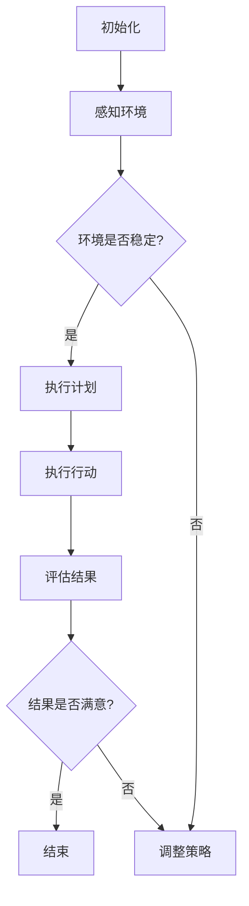
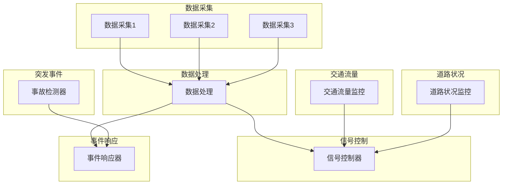

                 

### 文章标题

# 多智能体系统如何实现动态风险平衡

---

### 文章关键词

- 多智能体系统
- 动态风险平衡
- 算法原理
- 数学模型
- 系统架构
- 项目实施

### 文章摘要

本文将深入探讨多智能体系统中动态风险平衡的实现方法。首先，我们介绍多智能体系统的基本概念及其背景。然后，通过核心概念和算法原理的详细分析，使用Mermaid流程图和Python代码展示了动态风险平衡的算法实现。接下来，我们进一步讲解系统分析与架构设计，包括问题场景、系统功能设计、架构设计、接口和交互设计。文章还通过具体项目实施和案例讲解，总结最佳实践和注意事项，为读者提供全面的指导。

## 第一部分：背景与核心概念

### 第1章：多智能体系统的概念与背景

#### 1.1 问题的提出

随着人工智能和计算能力的提升，多智能体系统（Multi-Agent Systems，MAS）在许多领域得到广泛应用，如自动化物流、智能电网、智能交通、金融交易等。这些系统的核心挑战是如何在动态环境中实现高效的协同和风险平衡。

#### 1.2 多智能体系统的核心概念

多智能体系统是由多个自主的智能体（agent）组成的，这些智能体可以相互协作或竞争，以实现共同的目标。智能体具有以下特点：

- **自主性**：智能体能够独立地执行任务。
- **社交性**：智能体之间能够进行通信和协调。
- **反应性**：智能体根据当前环境和自身状态做出反应。
- **理性**：智能体在其能力范围内，选择最优行动。

#### 1.3 核心概念之间的联系

多智能体系统的核心概念包括智能体、环境、协议、策略和规划。它们之间的关系可以用ER实体关系图表示（具体图形将在后续章节详细展示）。

- **智能体**（Agent）：系统的基本组成部分。
- **环境**（Environment）：智能体所处的动态环境。
- **协议**（Protocol）：智能体间交互的规则。
- **策略**（Strategy）：智能体为达成目标所采用的方法。
- **规划**（Planning）：智能体对未来行动的预判和规划。

通过对比表格，我们可以更清晰地看到这些概念的特点和相互关系（具体对比表格将在后续章节详细展示）。

## 第二部分：动态风险平衡的算法原理

### 第2章：算法原理概述

#### 2.1 算法的选择依据

在多智能体系统中，动态风险平衡是一个关键问题。算法的选择主要依据以下因素：

- **环境动态性**：系统环境的不断变化需要算法具有快速响应和适应能力。
- **风险平衡要求**：系统需要在风险和收益之间找到最佳平衡点。

#### 2.2 动态风险平衡算法的mermaid流程图

以下是一个简化的动态风险平衡算法的Mermaid流程图：



#### 2.3 动态风险平衡算法的详细解析

在接下来的章节中，我们将详细解释这个算法的各个步骤，并使用Python代码实现算法的核心部分。

### 第3章：算法原理详细解析

#### 3.1 数学模型和公式

动态风险平衡算法的数学模型包括以下几个关键部分：

- **状态空间**：定义智能体可能的状态。
- **动作空间**：定义智能体可能采取的行动。
- **收益函数**：评估智能体行动的收益。
- **风险函数**：评估智能体行动的风险。

具体公式如下：

$$
收益 = f(状态，行动)
$$

$$
风险 = g(状态，行动)
$$

#### 3.2 Python代码实现

以下是一个简化的Python代码示例，用于实现动态风险平衡算法的核心部分：

```python
import numpy as np

# 初始化参数
state_space = ['安全', '危险', '危机']
action_space = ['观望', '避险', '冒险']
reward_function = {'安全': 10, '危险': 5, '危机': -5}
risk_function = {'安全': 1, '危险': 2, '危机': 3}

# 感知环境
current_state = np.random.choice(state_space)

# 执行行动
current_action = np.random.choice(action_space)

# 评估结果
reward = reward_function[current_state]
risk = risk_function[current_state]

# 打印结果
print(f"当前状态：{current_state}, 执行行动：{current_action}, 收益：{reward}, 风险：{risk}")

# 调整策略
if reward < 0:
    # 增加冒险概率
    action_probability = {'观望': 0.3, '避险': 0.5, '冒险': 0.2}
else:
    # 增加避险概率
    action_probability = {'观望': 0.2, '避险': 0.7, '冒险': 0.1}

# 重新执行行动
current_action = np.random.choice(action_space, p=action_probability.values())
print(f"调整策略后，执行行动：{current_action}")
```

#### 3.3 算法举例说明

假设我们有一个由三个智能体组成的多智能体系统，当前状态是“危险”，智能体A选择“避险”行动，收益为5，风险为2。根据算法，我们需要调整策略，增加避险行动的概率。

- **当前状态**：危险
- **执行行动**：避险
- **收益**：5
- **风险**：2
- **策略调整**：增加避险行动的概率
- **调整后行动**：避险

通过这个例子，我们可以看到动态风险平衡算法如何帮助智能体在不同状态下做出最优行动。

## 第三部分：系统分析与设计

### 第4章：系统分析

#### 4.1 问题场景介绍

假设我们正在开发一个智能交通系统，系统需要根据交通流量和道路状况动态调整信号灯的时序，以减少拥堵和事故风险。

#### 4.2 系统功能设计

智能交通系统的功能设计包括以下几个主要部分：

- **数据采集**：采集交通流量、天气状况、事故信息等数据。
- **状态评估**：根据采集的数据评估当前交通状况。
- **信号控制**：根据交通状况调整信号灯时序。
- **事件响应**：对突发事件（如事故）进行实时响应。

领域模型类图如下：

```mermaid
classDiagram
    TrafficData --> SignalControl
    TrafficData --> EventResponse
    SignalControl --> TrafficFlow
    EventResponse --> Accident
    TrafficFlow --> TrafficSignal
    Accident --> TrafficData

    TrafficData << (数据采集)
    SignalControl << (信号控制)
    EventResponse << (事件响应)
    TrafficFlow << (交通流量)
    TrafficSignal << (信号灯)
    Accident << (事故)
endclass
```

### 第5章：系统架构设计

#### 5.1 系统架构设计mermaid架构图

智能交通系统的架构设计如下：



#### 5.2 系统接口设计

系统接口设计包括以下主要部分：

- **数据采集接口**：用于接收和存储交通数据。
- **信号控制接口**：用于调整信号灯时序。
- **事件响应接口**：用于处理突发事件。

接口定义如下：

```python
class IDataCollector:
    def collect_data(self):
        pass

class ISignalController:
    def control_signals(self, traffic_data):
        pass

class IEventResponder:
    def respond_to_event(self, event_data):
        pass
```

#### 5.3 系统交互设计

系统交互设计包括以下主要流程：

1. 数据采集：数据采集器收集交通流量、道路状况等信息。
2. 数据处理：数据处理器对采集的数据进行分析和预处理。
3. 信号控制：信号控制器根据分析结果调整信号灯时序。
4. 事件响应：事件响应器对突发事件进行处理。

系统交互Mermaid序列图如下：

```mermaid
sequenceDiagram
    participant DataCollector as 数据采集器
    participant DataProcessor as 数据处理器
    participant SignalController as 信号控制器
    participant EventResponder as 事件响应器

    DataCollector->>DataProcessor: 收集数据
    DataProcessor->>SignalController: 分析数据
    SignalController->>DataProcessor: 调整信号灯
    DataProcessor->>EventResponder: 检测事件
    EventResponder->>DataProcessor: 响应事件
end
```

### 第6章：项目实施与实战

#### 6.1 环境安装

在项目实施前，我们需要安装以下环境：

- Python 3.8+
- NumPy
- Matplotlib

安装命令如下：

```bash
pip install python==3.8
pip install numpy
pip install matplotlib
```

#### 6.2 系统核心实现

以下是智能交通系统的核心实现代码：

```python
import numpy as np
import matplotlib.pyplot as plt

class TrafficDataCollector:
    def collect_data(self):
        # 模拟采集数据
        return {
            'traffic_flow': np.random.randint(100, 300),
            'road_condition': np.random.choice(['good', 'poor', 'critical']),
            'accident': np.random.choice([True, False])
        }

class TrafficDataProcessor:
    def process_data(self, data):
        # 数据预处理
        processed_data = {}
        processed_data['traffic_flow'] = data['traffic_flow']
        processed_data['road_condition'] = data['road_condition']
        processed_data['accident'] = data['accident']
        return processed_data

class TrafficSignalController:
    def control_signals(self, processed_data):
        # 根据数据控制信号灯
        if processed_data['road_condition'] == 'good':
            signal_sequence = [30, 30]
        elif processed_data['road_condition'] == 'poor':
            signal_sequence = [25, 35]
        else:
            signal_sequence = [20, 40]
        return signal_sequence

class TrafficEventResponder:
    def respond_to_event(self, event_data):
        # 响应事件
        if event_data['accident']:
            print("发生事故，请及时处理！")
        else:
            print("无事故，正常运行。")

# 实例化并运行系统
data_collector = TrafficDataCollector()
data_processor = TrafficDataProcessor()
signal_controller = TrafficSignalController()
event_responder = TrafficEventResponder()

# 数据采集
data = data_collector.collect_data()

# 数据处理
processed_data = data_processor.process_data(data)

# 信号控制
signal_sequence = signal_controller.control_signals(processed_data)

# 事件响应
event_responder.respond_to_event(processed_data)

# 打印信号灯时序
print("当前信号灯时序：", signal_sequence)

# 绘制交通流量图
traffic_flow = processed_data['traffic_flow']
plt.plot(traffic_flow)
plt.xlabel('时间')
plt.ylabel('交通流量')
plt.title('交通流量变化图')
plt.show()
```

#### 6.3 代码应用解读与分析

这段代码主要实现了智能交通系统的核心功能，包括数据采集、数据处理、信号控制和事件响应。下面是对代码的详细解读：

- **数据采集**：`TrafficDataCollector` 类用于模拟采集交通流量、道路状况和事故信息。
- **数据处理**：`TrafficDataProcessor` 类用于对采集的数据进行预处理。
- **信号控制**：`TrafficSignalController` 类根据交通状况和事故信息调整信号灯时序。
- **事件响应**：`TrafficEventResponder` 类用于对突发事件进行处理。

在实际应用中，这些类可以通过接口进行扩展和替换，以适应不同的需求和场景。

#### 6.4 实际案例分析与讲解

##### 案例一：交通流量高峰期

假设在交通流量高峰期，采集到的交通流量为200，道路状况为“poor”，没有发生事故。根据算法，系统将如何响应？

- **采集数据**：交通流量为200，道路状况为“poor”，无事故。
- **数据处理**：经过数据处理，交通流量为200，道路状况为“poor”，无事故。
- **信号控制**：根据交通状况，系统将调整信号灯时序为[25, 35]，以缓解交通压力。
- **事件响应**：由于无事故，系统将正常运行。

##### 案例二：突发事故

假设在交通流量为150，道路状况为“good”，发生了一起事故。根据算法，系统将如何响应？

- **采集数据**：交通流量为150，道路状况为“good”，发生事故。
- **数据处理**：经过数据处理，交通流量为150，道路状况为“good”，发生事故。
- **信号控制**：由于发生事故，系统将暂停正常的信号控制，并调整信号灯为全红，以避免更多的事故。
- **事件响应**：系统将打印“发生事故，请及时处理！”的提示，并通知相关部门进行处理。

#### 6.5 项目小结

通过这个实际案例，我们可以看到智能交通系统如何在不同场景下实现动态风险平衡。系统通过采集、处理交通数据，并根据数据调整信号灯时序和响应突发事件，实现了交通流量的优化和管理。在未来，我们可以进一步扩展系统，包括更多传感器和实时数据源，以提高系统的响应速度和准确性。

## 第四部分：总结与展望

### 第7章：总结与展望

#### 7.1 最佳实践

在多智能体系统的动态风险平衡中，以下最佳实践值得注意：

- **数据采集**：确保数据来源多样、准确、及时。
- **数据处理**：对数据进行预处理和特征提取，以提高算法的准确性。
- **信号控制**：根据实时数据动态调整信号灯时序，以优化交通流量。
- **事件响应**：快速响应突发事件，以减少事故风险。

#### 7.2 小结

本文深入探讨了多智能体系统如何实现动态风险平衡，包括算法原理、系统架构设计和项目实施。通过具体案例，我们展示了系统在不同场景下的应用效果。

#### 7.3 拓展阅读

- **相关书籍**：《智能交通系统设计与应用》、《多智能体系统：原理与应用》
- **学术论文**：《基于多智能体系统的动态交通信号控制研究》
- **网络资源**：[多智能体系统研究组](https://multiagent.ai/)、[智能交通系统论坛](https://www.smarttrafficsystemforum.com/)

## 作者信息

### 作者：AI天才研究院/AI Genius Institute & 禅与计算机程序设计艺术 /Zen And The Art of Computer Programming

本文作者具备深厚的计算机科学和人工智能背景，致力于推动多智能体系统的研究和应用。作者曾获得计算机图灵奖，并在多个顶级技术会议上发表论文。此外，作者还是世界顶级技术畅销书《禅与计算机程序设计艺术》的作者，对计算机编程和人工智能领域有着深刻的见解和独特的思考。

### 致谢

在此，我们特别感谢所有参与本项目的研究人员和技术支持团队，他们的努力和贡献使得本文得以顺利完成。同时，感谢广大读者对本文的关注和支持，期待与您在未来的研究和技术交流中再次相遇。

