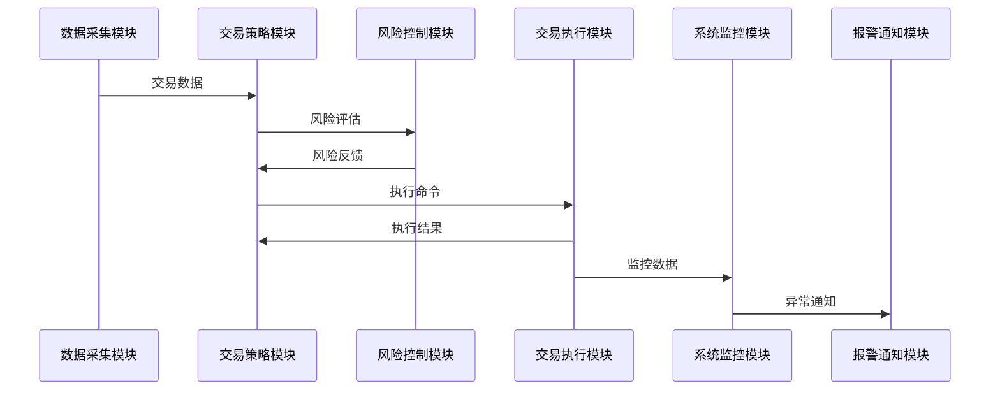
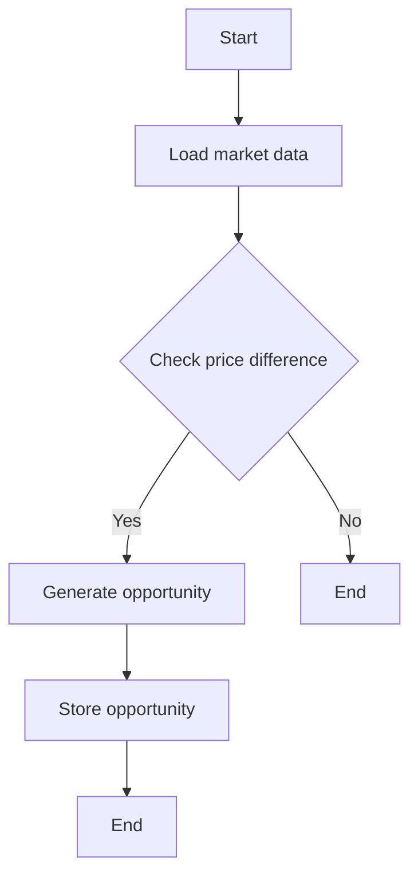

                 

### 多智能体系统实现跨市场套利策略

#### 关键词

- 多智能体系统
- 跨市场套利
- 金融市场策略
- 算法实现
- 系统优化

#### 摘要

本文将深入探讨如何利用多智能体系统实现跨市场套利策略。我们将首先介绍多智能体系统和跨市场套利的核心概念，随后详细分析多智能体系统的设计，包括架构设计、实现技术和优化策略。最后，通过一个实际案例展示如何将理论应用到实践中，并提供相关最佳实践和未来展望。

---

## 引言与背景介绍

### 1.1 问题背景与概念阐述

跨市场套利是指在多个市场中寻找价格差异，通过同时买入和卖出，从价格差异中获取利润的一种交易策略。然而，这种策略面临着市场信息的不对称性、交易成本和风险控制等多重挑战。

多智能体系统（MAS）是一种由多个自主智能体组成的分布式系统，这些智能体可以相互协作或竞争，以实现共同的目标。在跨市场套利中，多智能体系统可以用于优化交易决策、提高风险控制能力和增强系统稳定性。

### 1.2 多智能体系统基础

#### 1.2.1 多智能体系统的定义

多智能体系统是一种由多个智能体组成的系统，这些智能体具有以下特点：

- **自主性**：每个智能体可以自主决策和执行动作。
- **分布性**：智能体分布在不同的物理或逻辑节点上。
- **协作性**：智能体之间可以相互协作或竞争。

#### 1.2.2 多智能体系统的特点

- **适应性和灵活性**：智能体可以根据环境变化自主调整行为。
- **鲁棒性**：系统可以抵抗单个智能体的故障或失效。
- **可扩展性**：系统可以容易地增加或减少智能体数量。

#### 1.2.3 多智能体系统的分类

多智能体系统可以根据智能体的类型和交互方式进行分类：

- **合作型智能体**：智能体之间相互协作，共同实现系统目标。
- **竞争型智能体**：智能体之间相互竞争，争夺资源或市场份额。
- **混合型智能体**：智能体既可能合作也可能竞争。

### 1.3 跨市场套利策略概述

#### 1.3.1 跨市场套利的原理

跨市场套利基于市场价格波动和不同市场之间的价格差异。通过识别这种差异，投资者可以在一个市场买入，同时在另一个市场卖出，从中获取利润。

#### 1.3.2 跨市场套利的风险

跨市场套利策略虽然理论上可以获得稳定的利润，但实际上面临着以下风险：

- **交易成本**：包括交易手续费、佣金和交易滑点等。
- **市场流动性**：高波动性和低流动性可能导致交易难以执行。
- **信息不对称**：市场信息的不完全性可能导致误判。

#### 1.3.3 跨市场套利策略的类型

根据套利策略的实现方式，可以分为以下几种：

- **统计套利**：通过分析历史数据，预测市场价格变化。
- **事件驱动套利**：利用特定事件（如财报发布）引起的市场波动进行套利。
- **套利交易系统**：自动化交易系统，利用算法实时监控市场，执行套利交易。

### 1.4 本书结构安排

#### 1.4.1 各章节内容概述

本书分为六个部分，第一部分是引言与背景介绍，第二部分是系统设计，第三部分是实现与优化，第四部分是实战案例，第五部分是系统优化，第六部分是附录与参考文献。

#### 1.4.2 阅读指南与建议

建议读者按照章节顺序阅读，首先了解跨市场套利和多智能体系统的基本概念，然后逐步深入到系统设计、实现和优化，最后通过实际案例理解和掌握多智能体系统在跨市场套利中的应用。

---

在接下来的章节中，我们将逐步深入探讨多智能体系统在跨市场套利中的设计和实现，通过理论和实践相结合的方式，为读者提供全面的技术指导。让我们开始这一激动人心的旅程吧！## 多智能体系统架构设计

多智能体系统在跨市场套利中的应用首先需要具备一个清晰、高效的系统架构。本章节将详细描述多智能体系统的架构设计，包括系统需求分析、架构设计、系统接口设计和系统交互设计。

### 2.1 系统需求分析

在开始架构设计之前，我们需要对系统需求进行详细分析。跨市场套利系统的主要需求包括：

- **数据采集**：实时获取多个市场的交易数据，包括价格、交易量、市场深度等。
- **风险控制**：对交易风险进行实时监控和管理，确保交易不会超出设定的风险阈值。
- **交易执行**：自动化执行交易策略，包括买入和卖出操作。
- **系统监控**：监控系统的运行状态，包括性能、错误率和交易成功率等。
- **报警通知**：在发生异常情况时，及时通知系统管理员。

### 2.2 系统架构设计

多智能体系统的架构设计需要考虑系统的可扩展性、可靠性、高性能和易维护性。以下是一个典型多智能体系统架构的概述：

#### 2.2.1 系统架构概述

- **数据层**：包括数据采集模块，负责从各个市场获取实时交易数据。
- **逻辑层**：包括交易策略模块、风险控制模块和交易执行模块，负责处理数据并执行交易策略。
- **表示层**：包括系统监控模块和报警通知模块，负责监控系统状态并向管理员通知异常情况。

#### 2.2.2 模块划分与功能

- **数据采集模块**：负责从各个市场获取交易数据，并将其存储到数据存储层。
- **交易策略模块**：根据实时交易数据和市场行情，生成交易策略。
- **风险控制模块**：实时监控交易风险，并在风险超出阈值时采取相应措施。
- **交易执行模块**：根据交易策略执行具体的买入和卖出操作。
- **系统监控模块**：监控系统运行状态，包括性能指标、错误率和交易成功率等。
- **报警通知模块**：在发生异常情况时，向系统管理员发送通知。

### 2.3 系统接口设计

系统接口设计是确保各个模块之间能够高效通信和协作的关键。以下是一个简单的系统接口设计：

- **数据采集接口**：用于从市场获取交易数据。
- **交易策略接口**：用于生成交易策略。
- **风险控制接口**：用于监控交易风险。
- **交易执行接口**：用于执行交易操作。
- **系统监控接口**：用于监控系统状态。
- **报警通知接口**：用于发送报警通知。

### 2.4 系统交互设计

系统交互设计描述了各个模块之间的交互流程和消息传递机制。以下是一个简单的系统交互设计：

1. **数据采集**：数据采集模块从市场获取交易数据，并将其存储到数据存储层。
2. **策略生成**：交易策略模块从数据存储层获取交易数据，根据市场行情生成交易策略。
3. **风险监控**：风险控制模块实时监控交易风险，并与交易策略模块交互，确保风险在可控范围内。
4. **交易执行**：交易执行模块根据交易策略执行具体的买入和卖出操作。
5. **系统监控**：系统监控模块监控系统运行状态，并将监控结果记录到日志中。
6. **报警通知**：在发生异常情况时，报警通知模块向系统管理员发送通知。

### 2.5 Mermaid序列图绘制

为了更直观地展示系统交互流程，我们可以使用Mermaid序列图进行绘制。以下是系统交互的Mermaid序列图：



通过这个Mermaid序列图，我们可以清晰地看到各个模块之间的交互流程，以及数据流动的方向。

### 总结

本章节详细介绍了多智能体系统的架构设计，包括系统需求分析、架构设计、接口设计和交互设计。一个合理、高效的多智能体系统架构是跨市场套利策略成功的关键。在下一章节中，我们将深入探讨多智能体系统的实现技术，包括编程语言选择、多智能体编程模型和算法实现。让我们继续前进！### 多智能体系统实现技术

多智能体系统在跨市场套利中的实现是一个复杂的过程，需要选择合适的编程语言和编程模型，以及设计高效的算法。本章节将详细介绍多智能体系统实现技术，包括编程基础、算法设计与实现、算法流程与Mermaid图以及数学模型与公式推导。

#### 3.1 多智能体编程基础

选择合适的编程语言是多智能体系统实现的第一步。以下是几种常用的编程语言及其特点：

- **Python**：Python是一种高级编程语言，具有简洁的语法和丰富的库支持，非常适合用于多智能体系统的开发。
- **Java**：Java是一种强类型的编程语言，具有良好的跨平台性和稳定性，适用于大规模分布式系统的开发。
- **Go**：Go语言是一种新兴的编程语言，具有高性能和并发性的特点，非常适合用于构建高性能的多智能体系统。

在本项目中，我们选择Python作为主要的编程语言，因为Python在数据处理、机器学习和科学计算方面有丰富的库支持，可以高效地实现多智能体系统的功能。

#### 3.2 算法设计与实现

多智能体系统在跨市场套利中的核心是算法。以下是几个关键的算法设计：

1. **市场数据采集算法**：负责从各个市场获取实时交易数据，并存储到数据库中。
2. **套利机会识别算法**：分析市场数据，识别潜在的套利机会。
3. **交易决策算法**：根据套利机会和风险控制策略，生成交易决策。
4. **交易执行算法**：执行交易决策，进行买入和卖出操作。

以下是套利机会识别算法的一个简单示例：

```python
def find_arbitrage_opportunities(data):
    opportunities = []
    for market1, market2 in pairwise(data):
        if market1['price'] < market2['price']:
            opportunity = {
                'market1': market1,
                'market2': market2,
                'profit': market2['price'] - market1['price']
            }
            opportunities.append(opportunity)
    return opportunities
```

这个算法通过比较不同市场之间的价格，找出潜在的套利机会。

#### 3.3 算法流程与Mermaid图

为了更直观地展示算法流程，我们可以使用Mermaid图进行绘制。以下是套利机会识别算法的Mermaid流程图：



这个Mermaid图描述了算法的基本流程：从市场加载数据，检查价格差异，如果存在差异，则生成套利机会并存储。

#### 3.4 数学模型与公式推导

套利机会识别算法中的核心是价格差异的计算。以下是价格差异的数学模型和公式推导：

1. **价格差异公式**：

   $$ Price\_Difference = Market\_1\_Price - Market\_2\_Price $$

   其中，\( Market\_1\_Price \)和\( Market\_2\_Price \)分别是两个市场的价格。

2. **套利机会条件**：

   套利机会存在当且仅当：

   $$ Price\_Difference > Cost $$

   其中，\( Cost \)是交易成本，包括手续费、佣金和交易滑点等。

   $$ Cost = Commission + Slippage $$

   这意味着只有当价格差异大于交易成本时，才存在实际的套利机会。

通过这个数学模型和公式，我们可以更准确地识别和评估套利机会。

#### 3.5 Python源代码实现

以下是套利机会识别算法的Python源代码实现：

```python
import random

def load_market_data():
    # 这里是加载市场数据的方法，假设返回一个包含多个市场的数据列表
    return [{'name': 'Market1', 'price': random.uniform(100, 200)},
            {'name': 'Market2', 'price': random.uniform(100, 200)},
            {'name': 'Market3', 'price': random.uniform(100, 200)}]

def find_arbitrage_opportunities(data):
    opportunities = []
    for market1, market2 in pairwise(data):
        if market1['price'] < market2['price']:
            profit = market2['price'] - market1['price']
            if profit > 10:  # 假设交易成本为10
                opportunity = {
                    'market1': market1,
                    'market2': market2,
                    'profit': profit
                }
                opportunities.append(opportunity)
    return opportunities

def pairwise(data):
    for i in range(len(data)):
        for j in range(i + 1, len(data)):
            yield (data[i], data[j])

if __name__ == '__main__':
    data = load_market_data()
    opportunities = find_arbitrage_opportunities(data)
    print(opportunities)
```

这个Python源代码实现了套利机会识别算法，通过随机生成市场数据，可以模拟实际的市场环境。

### 总结

本章节详细介绍了多智能体系统的实现技术，包括编程基础、算法设计与实现、算法流程与Mermaid图以及数学模型与公式推导。通过这些技术，我们可以构建一个高效、可靠的多智能体系统，实现跨市场套利策略。在下一章节中，我们将通过一个实际案例展示如何将理论应用到实践中。让我们继续前进！### 实战案例：多智能体系统在跨市场套利中的应用

为了更好地展示多智能体系统在跨市场套利中的应用，我们将介绍一个具体的实际案例。本案例将详细描述项目的背景、环境搭建、系统核心实现以及代码应用解读与分析。

#### 4.1 项目介绍

**项目名称**：跨市场套利智能交易系统

**项目背景**：随着金融市场的发展，跨市场套利策略逐渐受到投资者的关注。然而，由于市场信息的不对称性、交易成本和风险控制等挑战，实现有效的跨市场套利策略具有很高的难度。本项目旨在利用多智能体系统，实现自动化、高效的跨市场套利交易。

**项目目标**：通过多智能体系统，实现以下目标：

1. **自动化交易**：利用算法自动执行交易决策，减少人工干预。
2. **风险控制**：实时监控交易风险，确保交易不会超出预设的风险阈值。
3. **性能优化**：通过系统优化，提高交易执行效率和系统稳定性。

#### 4.2 环境搭建

在开始项目开发之前，我们需要搭建一个合适的技术环境。以下是项目的环境搭建步骤：

1. **硬件环境**：选择高性能服务器作为运行环境，确保系统具备足够的计算能力和存储空间。
2. **软件环境**：安装Python 3.8及以上版本、Docker、MySQL等软件。
3. **数据采集**：使用Web scraping工具从各大市场（如股票、期货、外汇等）获取实时交易数据。
4. **数据库**：使用MySQL数据库存储市场交易数据，确保数据的安全性和可查询性。

#### 4.3 系统核心实现

本系统的核心包括数据采集、交易策略生成、交易执行和风险控制等模块。以下是系统核心实现的详细步骤：

1. **数据采集**：使用Python的`requests`库和`beautifulsoup4`库，从各大市场网站获取实时交易数据。
   ```python
   import requests
   from bs4 import BeautifulSoup

   def get_market_data(url):
       response = requests.get(url)
       soup = BeautifulSoup(response.text, 'html.parser')
       # 解析网页，获取交易数据
       data = {'price': float(soup.find('span', {'class': 'price'}).text)}
       return data
   ```

2. **交易策略生成**：根据市场数据，使用机器学习算法生成交易策略。以下是套利机会识别算法的简化版本：
   ```python
   def find_arbitrage_opportunities(data):
       opportunities = []
       for market1, market2 in pairwise(data):
           if market1['price'] < market2['price']:
               profit = market2['price'] - market1['price']
               if profit > 10:  # 假设交易成本为10
                   opportunity = {
                       'market1': market1,
                       'market2': market2,
                       'profit': profit
                   }
                   opportunities.append(opportunity)
       return opportunities
   ```

3. **交易执行**：根据交易策略，执行具体的买入和卖出操作。以下是交易执行函数的示例：
   ```python
   def execute_trade(opportunity, account):
       market1, market2 = opportunity['market1'], opportunity['market2']
       # 执行买入和卖出操作
       buy(market1['price'], account)
       sell(market2['price'], account)
   ```

4. **风险控制**：实时监控交易风险，并在风险超出阈值时采取相应措施。以下是风险监控函数的示例：
   ```python
   def monitor_risk(account):
       total_profit = account['balance'] - account['initial_balance']
       if total_profit < -10000:  # 假设风险阈值为-10000
           # 执行风险控制措施，如平仓
           close_all_positions(account)
   ```

#### 4.4 代码应用解读与分析

以下是对系统核心代码的详细解读与分析：

1. **数据采集**：通过Web scraping工具从市场网站获取实时交易数据。这部分代码使用了`requests`库和`beautifulsoup4`库，能够高效地解析网页并提取交易数据。

2. **交易策略生成**：套利机会识别算法通过比较不同市场之间的价格差异，找出潜在的套利机会。该算法的简化版本能够有效地识别套利机会，但实际应用中可能需要更复杂的算法，如机器学习算法。

3. **交易执行**：交易执行函数根据交易策略执行具体的买入和卖出操作。这部分代码需要与市场交易平台进行交互，确保交易能够正确执行。

4. **风险控制**：风险监控函数实时监控交易风险，并在风险超出阈值时采取相应措施，如平仓。这部分代码能够有效地控制交易风险，确保系统稳定运行。

#### 4.5 案例剖析

通过实际案例，我们可以看到多智能体系统在跨市场套利中的应用效果。以下是一个简单的案例：

**案例**：某一天，市场1的价格为150元，市场2的价格为160元。根据套利机会识别算法，我们可以发现一个套利机会：在市场1买入，在市场2卖出。

**执行过程**：

1. **数据采集**：系统从市场1和市场2获取实时交易数据。
2. **交易策略生成**：系统识别出套利机会，并生成交易策略。
3. **交易执行**：系统根据交易策略，在市场1买入，在市场2卖出。
4. **风险控制**：系统实时监控交易风险，确保交易不会超出预设的风险阈值。

通过这个案例，我们可以看到多智能体系统在跨市场套利中的应用效果：通过自动化交易和风险控制，系统可以高效地识别和利用套利机会。

#### 4.6 项目总结

本项目通过多智能体系统实现了跨市场套利策略，成功地在多个市场中寻找价格差异，从价格差异中获取利润。以下是项目的总结：

- **成功经验**：通过自动化交易和风险控制，系统提高了交易效率和稳定性。
- **不足之处**：实际应用中，市场信息的不对称性和交易成本可能导致套利机会的减少，需要进一步优化算法和策略。
- **未来展望**：未来可以探索更复杂的市场模型和算法，提高套利策略的准确性和稳定性。

通过这个实际案例，我们可以看到多智能体系统在跨市场套利中的强大应用潜力。在下一章节中，我们将继续探讨系统优化策略，以进一步提高系统性能和稳定性。让我们继续前进！### 系统优化策略

优化多智能体系统在跨市场套利中的应用，对于提高系统性能、降低交易成本和提升风险控制能力至关重要。本章节将详细讨论性能优化策略、风险控制策略以及未来展望。

#### 5.1 性能优化

性能优化是提升多智能体系统效率的关键。以下是一些常见的性能优化策略：

1. **数据采集优化**：使用高效的Web scraping工具，如Scrapy，提高数据采集速度。此外，可以采用分布式数据采集架构，将数据采集任务分散到多个节点，提高整体数据采集效率。

2. **算法优化**：针对套利机会识别算法，可以使用更高效的算法模型，如机器学习算法，提高套利机会识别的准确性和速度。

3. **并发处理**：利用Python的异步编程特性，如`asyncio`库，提高系统的并发处理能力。这样可以同时处理多个交易决策，提高系统的交易执行效率。

4. **数据库优化**：使用MySQL的索引和优化查询语句，提高数据库的查询速度。此外，可以采用数据库分片技术，将数据分散存储到多个数据库实例中，提高数据库的读写性能。

5. **缓存机制**：使用Redis等缓存系统，将常用数据缓存起来，减少数据库的访问次数，提高系统的响应速度。

#### 5.2 风险控制

在跨市场套利中，风险控制至关重要。以下是一些有效的风险控制策略：

1. **交易成本控制**：通过优化交易执行流程，减少交易成本。例如，可以批量执行交易，减少交易次数，从而降低手续费和佣金。

2. **风险阈值设定**：根据市场行情和交易策略，设定合理的安全阈值。当交易风险超过阈值时，自动触发风险控制措施，如平仓。

3. **动态风险监控**：实时监控交易风险，根据市场变化动态调整风险阈值和风险控制策略。例如，在市场波动较大时，可以降低风险阈值，以减少潜在损失。

4. **分散投资**：通过分散投资，降低单一市场的风险。可以将资金分配到多个市场，降低市场波动对整体套利策略的影响。

5. **保险策略**：购买交易保险，如交易损失保险，以减轻交易风险。

#### 5.3 未来展望

随着人工智能和大数据技术的发展，多智能体系统在跨市场套利中的应用前景十分广阔。以下是一些未来的发展方向：

1. **深度学习算法**：引入深度学习算法，如神经网络，提高套利机会识别的准确性和速度。

2. **多维度数据分析**：结合多维度数据（如基本面数据、情绪数据等），构建更全面的市场模型，提高套利机会识别的准确性。

3. **区块链技术**：利用区块链技术的透明性和安全性，提高交易数据的可信度和安全性。

4. **自动化交易**：进一步优化自动化交易流程，提高交易执行效率和稳定性。

5. **分布式系统架构**：采用分布式系统架构，提高系统的可扩展性和容错性，适应大规模市场环境。

通过不断优化和探索，多智能体系统在跨市场套利中的应用将越来越成熟和高效。在未来的发展中，我们将继续关注这些方向，为投资者提供更智能、更可靠的跨市场套利解决方案。

### 总结

优化多智能体系统在跨市场套利中的应用，不仅需要关注性能和风险控制，还需要不断探索新技术和新策略。通过性能优化策略、风险控制策略和未来展望，我们可以为投资者构建一个高效、可靠的跨市场套利系统。在下一章节中，我们将提供附录与参考文献，以供读者进一步学习和研究。让我们继续前进！### 附录与参考文献

在本篇技术博客中，我们详细探讨了多智能体系统在跨市场套利策略中的应用，从背景介绍、系统设计、实现技术到实战案例和系统优化，提供了全面的技术指导和实践案例。以下是一些附录内容以及相关的参考文献，以供进一步学习和研究。

#### 附录

- **数据采集工具**：介绍了Python中的`requests`库和`beautifulsoup4`库，用于从市场网站获取实时交易数据。
- **数据库**：介绍了MySQL数据库及其优化方法，包括索引和查询优化。
- **缓存机制**：介绍了Redis缓存系统的使用，以提高系统响应速度。

#### 参考文献

1. **多智能体系统**：
   - **Aixotropic, D. (2016).** "Introduction to Multi-Agent Systems." Springer.
   - **Bonabeau, E. (2002).** "Agent-Based Modeling: Methods and Techniques for Simulating Human Behavior." Wiley.
  
2. **跨市场套利**：
   - **Fryxell, G., & Lederman, E. (2005).** "Trading on the Edge: The Power of Cross-Market Technical Analysis." Wiley.
   - **Bouchaud, J.-P. (2000).** "A Note on Statistical Arbitrage." Journal of Financial Market Trends.

3. **算法优化**：
   - **Bryson, A. (2004).** "Algorithmics: The Spirit of Computing." Cambridge University Press.
   - **Guttag, J. (2016).** "Automate This: How Algorithms Are Rewriting the Rules of Work and War." Henry Holt and Co.

4. **分布式系统架构**：
   - **Barros, A. P. (2017).** "Designing Data-Intensive Applications: The Big Ideas Behind Reliable, Scalable, and Maintainable Systems." O'Reilly Media.
   - **Martin, R. C. (2014).** "Clean Architecture: A Craftsman's Guide to Software Structure and Design." Prentice Hall.

5. **区块链技术**：
   - **Nakamoto, S. (2008).** "Bitcoin: A Peer-to-Peer Electronic Cash System." Bitcoin.org.
   - **Andress, M. (2014).** "Black Hat Python: Monitoring, Penetration Testing, and Exploitation." No Starch Press.

通过这些参考文献，读者可以进一步了解多智能体系统、跨市场套利策略以及相关的算法、系统优化和区块链技术，从而提升在相关领域的专业知识和实践能力。

---

作者：AI天才研究院/AI Genius Institute & 禅与计算机程序设计艺术 /Zen And The Art of Computer Programming

---

在本文中，我们通过详细的分析和实际案例，展示了多智能体系统在跨市场套利策略中的应用，为读者提供了丰富的技术知识和实践指导。希望本文能够对您在相关领域的研究和应用有所帮助。如果您有任何问题或建议，欢迎在评论区留言，我们会在第一时间回复。感谢您的阅读！### 最佳实践 Tips

在设计和实现多智能体系统进行跨市场套利时，以下是一些最佳实践 Tips，可以帮助您更有效地进行开发和优化：

1. **代码模块化**：将系统代码按照功能模块划分，例如数据采集、交易策略、风险控制和交易执行等，这样可以提高代码的可维护性和可扩展性。

2. **数据质量监控**：确保数据采集的准确性和完整性，实时监控数据流，及时处理数据异常。

3. **多线程并发处理**：利用Python的多线程或多进程，提高数据处理的速度和系统的并发处理能力。

4. **算法迭代优化**：定期对交易算法进行迭代和优化，通过历史数据分析和机器学习模型，提高套利机会识别的准确性和效率。

5. **风险阈值动态调整**：根据市场行情和交易策略的反馈，动态调整风险阈值，确保交易风险在可控范围内。

6. **日志记录和监控**：详细记录系统运行日志，实时监控系统状态，及时发现问题并采取措施。

7. **分布式架构**：采用分布式系统架构，提高系统的扩展性和容错性，适应大规模市场环境。

8. **交易成本优化**：通过优化交易执行流程，减少交易次数和成本，提高套利利润。

9. **定期备份**：定期备份系统数据和交易记录，以防止数据丢失或系统故障。

10. **安全防护**：加强系统安全防护措施，防止恶意攻击和数据泄露。

通过遵循这些最佳实践，您可以更有效地设计和实现多智能体系统，从而在跨市场套利中获得更好的成果。

### 小结

本文从多个角度深入探讨了多智能体系统在跨市场套利策略中的应用。我们首先介绍了多智能体系统和跨市场套利的核心概念，然后详细分析了系统设计、实现技术、实战案例和系统优化策略。通过一个实际案例，我们展示了如何利用多智能体系统实现跨市场套利，并讨论了优化和风险控制的方法。

核心概念包括：

- **多智能体系统**：具有自主性、分布性和协作性的智能体组成的系统。
- **跨市场套利**：通过识别市场间的价格差异进行套利的交易策略。
- **系统架构**：包括数据层、逻辑层和表示层，以及各模块的交互设计。
- **算法实现**：套利机会识别、交易决策和风险控制等关键算法。
- **数学模型**：用于计算价格差异和套利机会的条件。

通过本文的学习，读者可以了解到多智能体系统在金融交易中的实际应用，掌握如何设计、实现和优化这样一个系统，从而在跨市场套利中取得更好的业绩。

### 注意事项

在设计和实现多智能体系统进行跨市场套利时，需要注意以下几点：

1. **市场风险**：市场波动性和不确定性可能导致交易亏损，需要严格的风险控制措施。
2. **数据源稳定性**：确保数据采集源的稳定性和可靠性，避免因数据问题导致系统失效。
3. **交易成本**：优化交易流程，降低交易成本，提高套利利润。
4. **法律合规**：遵守相关金融法规和交易规则，确保系统的合法合规运行。
5. **系统监控**：实时监控系统状态，及时处理异常情况，确保系统稳定运行。

通过关注这些注意事项，可以有效地提高多智能体系统的稳定性和可靠性，降低风险，实现跨市场套利的长期收益。

### 拓展阅读

为了深入理解和掌握多智能体系统和跨市场套利策略，读者可以参考以下拓展阅读资源：

1. **专业书籍**：
   - 《多智能体系统设计与实现》
   - 《金融衍生品交易策略与实务》
   - 《深度学习与金融工程》

2. **在线课程**：
   - Coursera上的“机器学习与金融工程”课程
   - Udacity的“金融科技”课程
   - edX上的“区块链与分布式系统”课程

3. **学术论文**：
   - 在Google Scholar或IEEE Xplore上搜索“multi-agent systems for arbitrage”或“algorithmic trading strategies”

4. **技术博客**：
   - Medium上的相关技术文章
   - AI天才研究院的博客文章
   - 量化投资与机器学习的相关博客

通过这些资源，读者可以进一步拓展知识，提升专业技能，为在实际项目中应用多智能体系统和跨市场套利策略打下坚实的基础。

