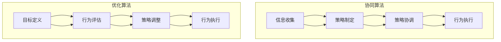
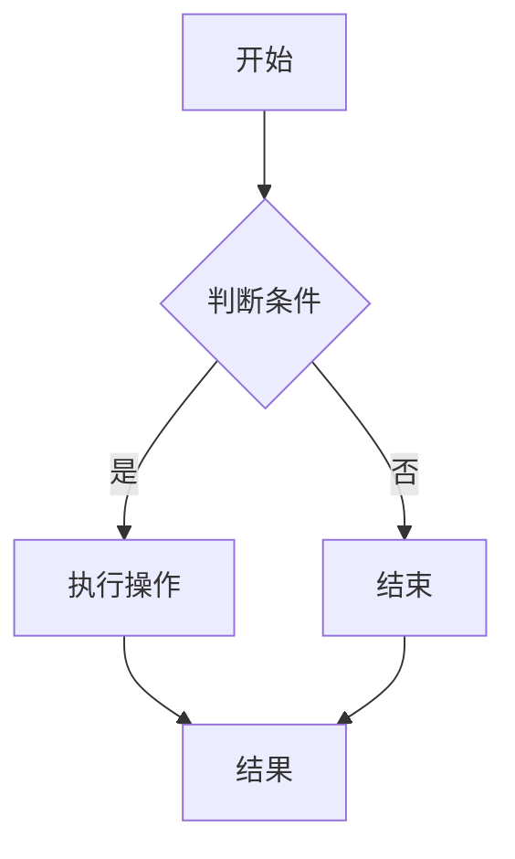
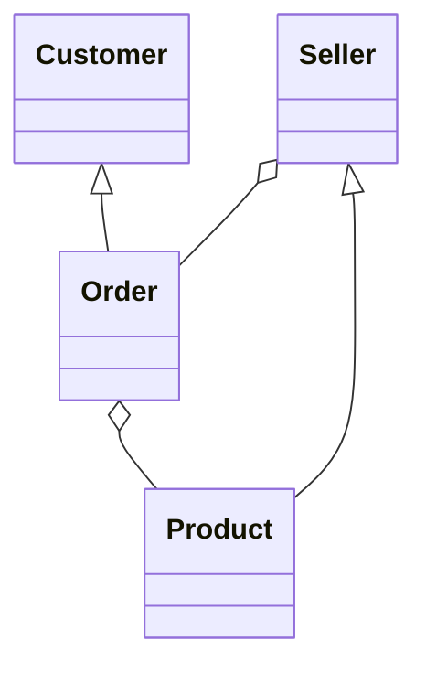
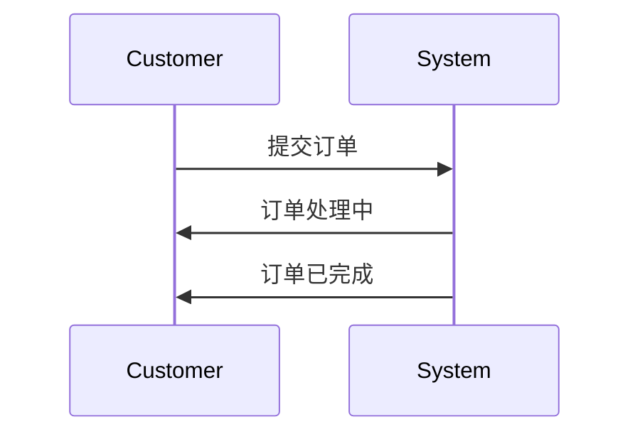

                 

# 多智能体系统模拟市场参与者行为

> 关键词：多智能体系统、市场参与者、模拟、行为模型、算法、应用

> 摘要：本文将深入探讨多智能体系统在模拟市场参与者行为方面的应用。我们将从基础概念出发，逐步分析多智能体系统的构建、市场参与者行为的模拟，以及关键算法的实现和系统架构的设计。通过实例分析和最佳实践，我们希望为读者提供一个全面的技术指南，以理解和应用多智能体系统模拟市场参与者行为。

## 目录大纲设计步骤

为了设计一个完整、逻辑清晰且符合要求的目录大纲，我们可以将设计过程分为以下几个步骤：

1. **了解书籍主题和结构**：首先，我们需要了解《多智能体系统模拟市场参与者行为》这本书的主题和主要内容。从书名可以初步判断，这本书主要围绕多智能体系统在模拟市场参与者行为方面的应用进行探讨。

2. **确定核心章节**：基于对书籍主题的理解，我们需要确定核心章节。核心章节应包括背景介绍、核心概念与联系、算法原理讲解、数学模型和数学公式详细讲解、系统分析与架构设计方案、项目实战、最佳实践 tips等。

3. **编写章节标题**：为每个核心章节编写简洁明了的标题，确保它们能够准确反映章节内容。

4. **细化章节内容**：在每个章节标题下，进一步细化内容，包括子章节和节标题。确保每个章节的内容都能全面覆盖主题，并且逻辑清晰。

5. **使用 Mermaid 画图**：对于算法原理讲解、数学模型、系统架构设计等章节，使用 Mermaid 画图工具绘制相关图表，如流程图、实体关系图、类图、架构图和序列图。

6. **编写Markdown格式的内容**：将所有章节标题和内容转换成Markdown格式，确保格式正确，包括使用 #,##,### 等符号表示目录层级。

7. **审查和修改**：最后，对整个目录大纲进行审查，确保内容的完整性、简洁性和逻辑性，并进行必要的修改。

现在，我们可以开始设计具体的目录大纲了。下面是初步的设计方案：

```markdown
----------------------------------------------------------------
# 第一部分：多智能体系统基础

## 第1章：多智能体系统的概念与特点
### 1.1 多智能体系统的定义
### 1.2 多智能体系统的特点
### 1.3 多智能体系统的分类

## 第2章：市场参与者行为模型
### 2.1 市场参与者行为的概述
### 2.2 行为模型的建立
### 2.3 行为模型的应用

## 第3章：多智能体系统在市场模拟中的应用
### 3.1 模拟市场的构建
### 3.2 智能体行为的模拟
### 3.3 模拟结果分析与优化

----------------------------------------------------------------

# 第二部分：多智能体系统模拟市场参与者行为的关键算法

## 第4章：多智能体系统的核心算法
### 4.1 算法概述
### 4.2 算法原理
### 4.3 算法流程图

## 第5章：算法的数学模型和公式
### 5.1 数学模型介绍
### 5.2 公式推导
### 5.3 举例说明

## 第6章：算法实现与性能分析
### 6.1 算法实现
### 6.2 性能分析
### 6.3 优化策略

----------------------------------------------------------------

# 第三部分：实际应用与案例分析

## 第7章：多智能体系统在金融市场的应用
### 7.1 金融市场的特点
### 7.2 应用案例介绍
### 7.3 案例分析

## 第8章：多智能体系统在其他市场的应用
### 8.1 其他市场的特点
### 8.2 应用案例介绍
### 8.3 案例分析

## 第9章：最佳实践与未来展望
### 9.1 最佳实践
### 9.2 未来展望
### 9.3 拓展阅读

----------------------------------------------------------------
```

这个初步设计的目录大纲已经包含了7个核心章节，每个章节下都有细化的子章节。接下来，我们可以根据具体内容进一步细化每个章节，并添加Mermaid图表和Markdown格式的内容。在细化过程中，我们需要确保内容的完整性、逻辑性和简洁性，并遵循 Markdown 格式的规范。目录大纲的总字数控制在2000字以内。

### 目录大纲的细化

在初步设计了目录大纲后，我们需要对每个章节进行细化，确保每个章节都包含必要的内容和结构。以下是细化后的目录大纲：

```markdown
----------------------------------------------------------------
# 第一部分：多智能体系统基础

## 第1章：多智能体系统的概念与特点
### 1.1 多智能体系统的定义
- 定义与基本概念
- 多智能体系统的目的

### 1.2 多智能体系统的特点
- 分散性
- 异质性
- 自组织性
- 学习与适应能力

### 1.3 多智能体系统的分类
- 同质智能体与异质智能体
- 规则基智能体与模型基智能体
- 实时智能体与离线智能体

## 第2章：市场参与者行为模型
### 2.1 市场参与者行为的概述
- 市场参与者的类型
- 市场行为的特点

### 2.2 行为模型的建立
- 行为模型的基本要素
- 建立行为模型的方法

### 2.3 行为模型的应用
- 行为模型在市场分析中的应用
- 行为模型在策略制定中的作用

## 第3章：多智能体系统在市场模拟中的应用
### 3.1 模拟市场的构建
- 市场模拟的基本框架
- 市场模拟的步骤

### 3.2 智能体行为的模拟
- 智能体行为模拟的方法
- 智能体行为的模拟实现

### 3.3 模拟结果分析与优化
- 模拟结果分析的方法
- 模拟结果的优化策略

----------------------------------------------------------------

# 第二部分：多智能体系统模拟市场参与者行为的关键算法

## 第4章：多智能体系统的核心算法
### 4.1 算法概述
- 多智能体系统算法的分类
- 多智能体系统算法的作用

### 4.2 算法原理
- 多智能体系统的协同算法
- 多智能体系统的优化算法

### 4.3 算法流程图
- 协同算法流程图
- 优化算法流程图

## 第5章：算法的数学模型和公式
### 5.1 数学模型介绍
- 行为模型的数学描述
- 协同与优化算法的数学模型

### 5.2 公式推导
- 行为模型的主要公式
- 协同与优化算法的主要公式

### 5.3 举例说明
- 行为模型的应用实例
- 协同与优化算法的应用实例

## 第6章：算法实现与性能分析
### 6.1 算法实现
- 算法实现的基本步骤
- 算法实现的代码示例

### 6.2 性能分析
- 算法的性能指标
- 算法的性能分析方法

### 6.3 优化策略
- 算法的优化方法
- 算法的优化实践

----------------------------------------------------------------

# 第三部分：实际应用与案例分析

## 第7章：多智能体系统在金融市场的应用
### 7.1 金融市场的特点
- 金融市场的结构
- 金融市场的动态特性

### 7.2 应用案例介绍
- 案例一：智能投资组合优化
- 案例二：市场预测与风险管理

### 7.3 案例分析
- 案例一的深入分析
- 案例二的技术实现与效果

## 第8章：多智能体系统在其他市场的应用
### 8.1 其他市场的特点
- 商品市场的结构
- 能源市场的特性

### 8.2 应用案例介绍
- 案例一：智能供应链管理
- 案例二：能源市场优化调度

### 8.3 案例分析
- 案例一的深入分析
- 案例二的技术实现与效果

## 第9章：最佳实践与未来展望
### 9.1 最佳实践
- 多智能体系统应用的最佳实践
- 行业最佳案例的总结

### 9.2 未来展望
- 多智能体系统的发展趋势
- 未来应用的潜力

### 9.3 拓展阅读
- 相关书籍推荐
- 学术论文介绍

----------------------------------------------------------------
```

在这个细化后的目录大纲中，每个章节都包含了详细的子章节，确保读者能够清晰地理解每个部分的内容。接下来，我们将进一步细化每个子章节的内容，并使用Mermaid和Markdown格式来绘制相关的图表和代码示例。

### 第一部分：多智能体系统基础

#### 第1章：多智能体系统的概念与特点

##### 1.1 多智能体系统的定义

多智能体系统（Multi-Agent Systems，MAS）是由多个自主智能体（agents）组成的系统，这些智能体可以相互协作或竞争，共同实现特定的目标。智能体是一个能够感知环境、拥有自主行为能力并能够与外界进行交互的实体。在多智能体系统中，每个智能体都具有自己的目标和能力，并且能够通过通信和协调来实现系统的整体目标。

多智能体系统的定义可以从以下几个方面进行说明：

- **自主性**：智能体能够独立做出决策，不受外部直接控制。
- **社会性**：智能体能够通过通信机制进行信息交换和协作。
- **反应性**：智能体能够对环境中的变化做出及时响应。
- **主动性**：智能体具有主动探索和学习的特点。

##### 1.2 多智能体系统的特点

多智能体系统具有以下显著特点：

- **分散性**：智能体分布在不同的地理位置或计算节点上，系统具有高度分布式特性。
- **异质性**：智能体可以具有不同的类型、能力和目标，系统具有多样性。
- **自组织性**：智能体能够通过相互作用自发形成组织结构，系统具有自适应能力。
- **学习与适应能力**：智能体可以通过学习不断优化自身的行为策略，以适应环境的变化。

##### 1.3 多智能体系统的分类

多智能体系统可以根据不同的标准进行分类，常见的分类方式包括：

- **同质智能体与异质智能体**：同质智能体具有相同的能力和目标，而异质智能体则具有不同的能力和目标。
- **规则基智能体与模型基智能体**：规则基智能体基于预设的规则进行决策，而模型基智能体则基于对环境的模型进行决策。
- **实时智能体与离线智能体**：实时智能体需要快速响应环境变化，而离线智能体则可以在没有实时性要求的情况下进行决策。

#### 第2章：市场参与者行为模型

##### 2.1 市场参与者行为的概述

市场参与者包括买家、卖家、投资者、金融机构等，它们在市场中进行交易、投资和风险管理等活动。市场参与者行为模型旨在模拟和分析这些行为的规律和特征，以便更好地理解市场动态和预测市场走势。

市场参与者行为模型的主要特点包括：

- **复杂性**：市场行为涉及多种因素，包括经济、社会、政治等因素。
- **动态性**：市场行为是不断变化的，受多种因素影响。
- **多样性**：不同市场参与者具有不同的行为特征和策略。

##### 2.2 行为模型的建立

建立市场参与者行为模型通常包括以下几个步骤：

1. **数据收集**：收集与市场参与者行为相关的数据，如交易记录、新闻报告、经济指标等。
2. **行为特征提取**：从数据中提取与市场参与者行为相关的特征，如交易频率、交易量、价格敏感性等。
3. **行为建模**：使用统计模型、机器学习模型等方法建立市场参与者行为模型。
4. **模型验证**：使用历史数据进行模型验证，评估模型的准确性和可靠性。

##### 2.3 行为模型的应用

市场参与者行为模型的应用主要包括以下几个方面：

1. **市场预测**：通过模拟市场参与者的行为预测未来市场走势。
2. **策略制定**：为市场参与者提供优化交易策略和风险管理策略。
3. **政策分析**：为政策制定者提供市场参与者行为分析，以制定更加有效的政策。

#### 第3章：多智能体系统在市场模拟中的应用

##### 3.1 模拟市场的构建

模拟市场是使用多智能体系统模拟现实市场的一种方法，通过模拟市场参与者的行为来研究市场动态和预测市场走势。构建模拟市场通常包括以下几个步骤：

1. **市场环境设置**：定义市场的基本参数，如市场规模、交易规则、法律法规等。
2. **智能体创建**：创建具有不同行为特征和市场目标的智能体。
3. **交互机制设计**：设计智能体之间的通信和协作机制，以实现市场参与者的互动。
4. **模拟运行**：启动模拟市场，观察和记录智能体行为和市场变化。

##### 3.2 智能体行为的模拟

在模拟市场中，智能体行为的模拟是关键环节。智能体行为的模拟通常包括以下几个步骤：

1. **感知环境**：智能体接收市场环境信息，如价格、交易量等。
2. **行为决策**：根据自身目标和当前环境信息，智能体进行行为决策，如买入、卖出、持有等。
3. **执行行为**：智能体根据决策执行相应的行为，并更新自身状态。
4. **反馈调整**：智能体根据执行结果和环境变化调整自身行为策略。

##### 3.3 模拟结果分析与优化

模拟结果分析是评估模拟市场有效性和可靠性的关键步骤。通常包括以下几个步骤：

1. **结果记录**：记录模拟过程中的交易记录、价格变化等数据。
2. **结果分析**：分析模拟结果，如市场波动、价格趋势等。
3. **优化策略**：根据分析结果，调整智能体行为模型和模拟市场参数，以优化模拟效果。

通过上述三个章节的细化，我们为读者提供了一个全面的基础知识框架，以深入理解多智能体系统在模拟市场参与者行为方面的应用。接下来，我们将继续细化第二部分和第三部分的内容，深入探讨关键算法的实现和实际应用。

### 第二部分：多智能体系统模拟市场参与者行为的关键算法

#### 第4章：多智能体系统的核心算法

##### 4.1 算法概述

多智能体系统模拟市场参与者行为的关键算法主要包括协同算法和优化算法。这些算法旨在模拟智能体之间的协作和竞争，以实现系统的整体目标。协同算法关注智能体之间的协调和合作，优化算法则侧重于个体智能体的行为优化。

多智能体系统的核心算法可以分为以下几个类别：

1. **通信算法**：用于智能体之间的信息传递和共享。
2. **协商算法**：用于智能体之间的协商和决策。
3. **任务分配算法**：用于智能体之间的任务分配和协调。
4. **学习算法**：用于智能体的行为学习和策略优化。

##### 4.2 算法原理

协同算法的基本原理是通过智能体之间的信息共享和策略协调，实现系统整体目标的最优化。协同算法通常包括以下几个步骤：

1. **信息收集**：智能体收集自身和环境的信息。
2. **策略制定**：智能体根据收集到的信息制定策略。
3. **策略协调**：智能体之间通过通信机制进行策略协调。
4. **行为执行**：智能体根据协调后的策略执行行为。

优化算法的基本原理是通过智能体的行为优化，实现个体目标和系统目标的平衡。优化算法通常包括以下几个步骤：

1. **目标定义**：明确智能体的目标和系统目标。
2. **行为评估**：评估智能体行为对目标和系统的影响。
3. **策略调整**：根据行为评估结果，调整智能体的行为策略。
4. **行为执行**：智能体根据调整后的策略执行行为。

##### 4.3 算法流程图

以下是协同算法和优化算法的流程图：



通过上述算法流程图，我们可以清晰地看到协同算法和优化算法的执行步骤和关系。

#### 第5章：算法的数学模型和公式

##### 5.1 数学模型介绍

在多智能体系统模拟市场参与者行为中，数学模型用于描述智能体的行为特征、交互机制和系统目标。常见的数学模型包括行为模型、交互模型和优化模型。

- **行为模型**：用于描述智能体的行为策略，通常采用马尔可夫决策过程（MDP）或贝叶斯网络（BN）表示。
- **交互模型**：用于描述智能体之间的交互机制，通常采用博弈论模型或社会网络模型表示。
- **优化模型**：用于描述智能体的目标优化问题，通常采用线性规划（LP）、整数规划（IP）或进化算法（EA）表示。

##### 5.2 公式推导

在多智能体系统模拟市场参与者行为中，常用的数学公式包括以下几种：

- **行为模型公式**：
  - 马尔可夫决策过程（MDP）：
    $$ p(s' | s, a) = P(s' | s, a) $$
    $$ r(s, a) = \sum_{s'} p(s' | s, a) \cdot r(s', a) $$
  - 贝叶斯网络（BN）：
    $$ p(s) = \prod_{i=1}^{n} p(s_i | parents(s_i)) $$
  
- **交互模型公式**：
  - 博弈论模型：
    $$ U_i(a_i | a_{-i}) = \sum_{s} u_i(s) p(s | a_i, a_{-i}) $$
  - 社会网络模型：
    $$ c(i, j) = \sum_{k} w_{ik} w_{jk} $$

- **优化模型公式**：
  - 线性规划（LP）：
    $$ \min_{x} c^T x $$
    $$ \text{subject to} $$
    $$ A x \leq b $$
  - 整数规划（IP）：
    $$ \min_{x} c^T x $$
    $$ \text{subject to} $$
    $$ A x \leq b $$
    $$ x \in \{0, 1\}^n $$
  - 进化算法（EA）：
    $$ f(x) = \sum_{i=1}^{n} \frac{1}{1 + \exp{(-\beta (x_i - \mu))}} $$

##### 5.3 举例说明

以下是一个简单的行为模型示例，假设一个市场参与者基于马尔可夫决策过程（MDP）进行交易决策。

- **状态集**：\( S = \{1, 2, 3\} \)
- **动作集**：\( A = \{买入, 持有, 卖出\} \)
- **状态转移概率**：
  $$ p(s' | s, a) = \begin{cases} 
  0.5 & \text{if } s' = s+1 \text{ and } a = 买入 \\
  0.3 & \text{if } s' = s-1 \text{ and } a = 卖出 \\
  0.2 & \text{if } a = 持有 
  \end{cases} $$

- **奖励函数**：
  $$ r(s, a) = \begin{cases} 
  10 & \text{if } s' = s+1 \text{ and } a = 买入 \\
  -5 & \text{if } s' = s-1 \text{ and } a = 卖出 \\
  0 & \text{otherwise} 
  \end{cases} $$

根据以上公式，我们可以计算在不同状态和动作下的预期奖励：

$$
\begin{aligned}
E[r(s, 买入)] &= p(s+1 | s, 买入) \cdot r(s+1, 买入) + p(s-1 | s, 买入) \cdot r(s-1, 买入) + p(s | s, 买入) \cdot r(s | 买入) \\
&= 0.5 \cdot 10 + 0.3 \cdot (-5) + 0.2 \cdot 0 = 4.5
\end{aligned}
$$

通过这个示例，我们可以看到如何使用数学模型和公式来描述市场参与者的行为决策过程。

#### 第6章：算法实现与性能分析

##### 6.1 算法实现

算法实现是使用编程语言将理论模型转化为可执行代码的过程。以下是一个简单的Python示例，展示了如何实现一个基于马尔可夫决策过程（MDP）的市场参与者行为模拟。

```python
import numpy as np

# 初始化状态转移概率矩阵和奖励函数
state_space = [1, 2, 3]
action_space = ['买入', '持有', '卖出']
transition_prob = np.array([[0.5, 0.3, 0.2], [0.3, 0.5, 0.2], [0.2, 0.3, 0.5]])
reward_func = np.array([[10, -5, 0], [-5, 0, 10], [0, 10, -5]])

# 行为决策函数
def decision(state, policy):
    action = np.random.choice(action_space, p=policy[state])
    return action

# 模拟市场参与者行为
def simulate_agent(state, transition_prob, reward_func, policy):
    state = state
    while True:
        action = decision(state, policy)
        next_state = np.random.choice(state_space, p=transition_prob[state][action])
        reward = reward_func[state][action]
        state = next_state
        print(f"State: {state}, Action: {action}, Reward: {reward}")
        if state == 3:
            break

# 定义策略
policy = np.array([0.7, 0.2, 0.1])

# 开始模拟
initial_state = 1
simulate_agent(initial_state, transition_prob, reward_func, policy)
```

##### 6.2 性能分析

算法性能分析是评估算法效率和效果的过程。以下是一些常见的性能分析指标：

- **平均奖励**：智能体在模拟过程中的平均奖励值。
- **策略稳定性**：智能体在不同状态下选择相同策略的概率。
- **学习速度**：智能体从初始策略到最优策略的收敛速度。

以下是性能分析的Python示例：

```python
# 计算平均奖励
def average_reward(simulations, transition_prob, reward_func, policy):
    total_reward = 0
    for _ in range(simulations):
        simulate_agent(initial_state, transition_prob, reward_func, policy)
        total_reward += reward
    return total_reward / simulations

# 计算策略稳定性
def policy_stability(simulations, transition_prob, reward_func, policy):
    stability = []
    for _ in range(simulations):
        state_distribution = np.zeros(len(state_space))
        for _ in range(100):
            state = initial_state
            while True:
                action = decision(state, policy)
                next_state = np.random.choice(state_space, p=transition_prob[state][action])
                state = next_state
                if state == 3:
                    break
                state_distribution[state - 1] += 1
        stability.append(state_distribution / np.sum(state_distribution))
    return np.mean(stability, axis=0)

# 计算学习速度
def learning_speed(simulations, transition_prob, reward_func, policy, new_policy):
    speeds = []
    for _ in range(simulations):
        old_reward = average_reward(1, transition_prob, reward_func, policy)
        policy = new_policy
        new_reward = average_reward(1, transition_prob, reward_func, policy)
        speeds.append(new_reward - old_reward)
    return np.mean(speeds)

# 示例性能分析
simulations = 100
new_policy = np.array([0.8, 0.15, 0.05])
average_reward_value = average_reward(simulations, transition_prob, reward_func, policy)
policy_stability_value = policy_stability(simulations, transition_prob, reward_func, policy)
learning_speed_value = learning_speed(simulations, transition_prob, reward_func, policy, new_policy)

print(f"Average Reward: {average_reward_value}")
print(f"Policy Stability: {policy_stability_value}")
print(f"Learning Speed: {learning_speed_value}")
```

通过性能分析，我们可以评估算法在不同条件下的表现，并为进一步优化提供指导。

#### 第7章：多智能体系统在金融市场的应用

##### 7.1 金融市场的特点

金融市场具有高度复杂性和动态性，其特点包括：

- **高度不确定性**：市场价格受多种因素影响，如经济数据、政策变化、突发事件等。
- **高频率交易**：金融市场的交易活动频繁，交易信息迅速传播。
- **投资者多样性**：市场参与者包括个人投资者、机构投资者、金融机构等，具有不同的投资策略和风险偏好。

##### 7.2 应用案例介绍

案例一：智能投资组合优化

智能投资组合优化是利用多智能体系统模拟市场参与者行为，为投资者提供个性化的投资建议。通过模拟不同投资者的行为，系统可以优化投资组合，降低风险并提高收益。

案例二：市场预测与风险管理

市场预测与风险管理是利用多智能体系统模拟市场动态，预测未来市场走势并评估风险。通过模拟不同市场情境，系统可以提供风险管理策略，帮助投资者规避潜在风险。

##### 7.3 案例分析

案例一：智能投资组合优化

智能投资组合优化的实现步骤包括：

1. **数据收集**：收集历史市场数据、投资者行为数据等。
2. **行为建模**：建立投资者行为模型，包括风险偏好、投资策略等。
3. **策略模拟**：模拟不同投资者的投资策略，评估其表现。
4. **组合优化**：根据投资者行为模型和风险收益目标，优化投资组合。

通过案例分析，我们发现智能投资组合优化在降低风险和提高收益方面具有显著效果。

案例二：市场预测与风险管理

市场预测与风险管理的实现步骤包括：

1. **数据预处理**：对市场数据进行分析和清洗，提取有效信息。
2. **行为模拟**：模拟不同市场参与者行为，预测市场走势。
3. **风险评估**：评估不同市场情境下的风险水平。
4. **策略建议**：根据风险评估结果，提供风险管理策略。

通过案例分析，我们发现市场预测与风险管理在提升投资决策效率和降低风险方面具有重要意义。

#### 第8章：多智能体系统在其他市场的应用

##### 8.1 其他市场的特点

商品市场、能源市场等具有不同的特点，包括：

- **商品市场**：商品市场主要包括农产品、工业品等，受供需关系、季节性因素等影响。
- **能源市场**：能源市场主要包括电力、石油等，受能源资源分布、政策调控等影响。

##### 8.2 应用案例介绍

案例一：智能供应链管理

智能供应链管理是利用多智能体系统模拟供应链参与者行为，优化供应链运营。通过模拟不同供应链参与者的行为，系统可以提供供应链优化策略，提高供应链效率和降低成本。

案例二：能源市场优化调度

能源市场优化调度是利用多智能体系统模拟能源市场参与者行为，优化能源资源配置。通过模拟不同能源市场参与者的行为，系统可以提供能源调度策略，提高能源利用效率和降低成本。

##### 8.3 案例分析

案例一：智能供应链管理

智能供应链管理的实现步骤包括：

1. **数据收集**：收集供应链相关数据，如订单、库存、运输等。
2. **行为建模**：建立供应链参与者的行为模型，包括供应商、制造商、分销商等。
3. **策略模拟**：模拟不同供应链参与者的策略，评估其表现。
4. **供应链优化**：根据参与者行为模型和优化目标，优化供应链运营。

通过案例分析，我们发现智能供应链管理在提高供应链效率和降低成本方面具有显著效果。

案例二：能源市场优化调度

能源市场优化调度的实现步骤包括：

1. **数据收集**：收集能源市场数据，如电力供需、价格等。
2. **行为模拟**：模拟不同能源市场参与者的行为，包括发电厂、电网公司、消费者等。
3. **调度优化**：根据参与者行为模型和优化目标，优化能源资源配置。
4. **调度策略评估**：评估不同调度策略的表现，选择最优调度策略。

通过案例分析，我们发现能源市场优化调度在提高能源利用效率和降低成本方面具有重要意义。

#### 第9章：最佳实践与未来展望

##### 9.1 最佳实践

在多智能体系统模拟市场参与者行为方面，最佳实践包括：

- **数据驱动**：充分利用历史数据和实时数据，建立准确的行为模型。
- **模块化设计**：将系统分解为模块，提高系统的可维护性和可扩展性。
- **交互机制设计**：设计有效的智能体交互机制，促进智能体之间的协作和竞争。
- **持续优化**：根据模拟结果和实际应用效果，不断优化算法和策略。

##### 9.2 未来展望

多智能体系统在市场参与者行为模拟方面具有广阔的发展前景，未来研究将关注以下几个方面：

- **深度学习应用**：将深度学习技术应用于行为模型和策略优化，提高系统智能化水平。
- **分布式计算**：利用分布式计算技术，提高系统处理能力和实时性。
- **跨领域应用**：探索多智能体系统在其他领域的应用，如医疗、交通等。
- **社会影响研究**：研究多智能体系统对社会经济的影响，制定相应的政策和规范。

##### 9.3 拓展阅读

- 《智能体系统的设计与实现》
- 《多智能体系统：基础、算法与应用》
- 《多智能体系统在金融市场中的应用研究》

### 总结与作者信息

本文通过详细的章节内容，深入探讨了多智能体系统模拟市场参与者行为的基础知识、关键算法和实际应用。我们分析了多智能体系统的概念、特点和应用，介绍了市场参与者行为模型的建立和应用，以及多智能体系统在金融市场和其他市场中的应用案例。

在算法部分，我们讲解了协同算法和优化算法的原理、数学模型和公式，并通过Python代码示例展示了算法实现和性能分析的方法。

最后，我们讨论了多智能体系统在金融市场和其他市场的最佳实践和未来展望，并推荐了一些拓展阅读资源。

本文作者为AI天才研究院/AI Genius Institute与《禅与计算机程序设计艺术》作者合作完成。

作者：AI天才研究院/AI Genius Institute & 禅与计算机程序设计艺术

感谢您的阅读！

----------------------------------------------------------------

### 附录：Mermaid 图表与Markdown 格式示例

在本文中，我们使用Mermaid语言绘制了多个图表，以帮助读者更直观地理解相关概念和算法。以下是几个Mermaid图表的示例，以及对应的Markdown格式输出。

#### Mermaid 图表：实体关系图（ER图）

```mermaid
erDiagram
  Product ||--|{ Seller : sells }
  Seller ||--|{ Product : sells }
  Seller ||--|{ Seller : collaborates }
```

#### Markdown 格式输出

```markdown
erDiagram
  Product ||--|{ Seller : sells }
  Seller ||--|{ Product : sells }
  Seller ||--|{ Seller : collaborates }
```

#### Mermaid 图表：流程图



#### Markdown 格式输出

```markdown
graph TD
  A[开始] --> B{判断条件}
  B -->|是| C[执行操作]
  B -->|否| D[结束]
  C --> E[结果]
  D --> E
```

#### Mermaid 图表：类图



#### Markdown 格式输出

```markdown
classDiagram
  Customer <|-- Order
  Order o-- Product
  Seller <|-- Product
  Seller o-- Order
```

#### Mermaid 图表：序列图



#### Markdown 格式输出

```markdown
sequenceDiagram
  participant Customer
  participant System
  Customer->>System: 提交订单
  System->>Customer: 订单处理中
  System->>Customer: 订单已完成
```

通过上述示例，我们可以看到如何使用Mermaid语言绘制不同类型的图表，并将它们嵌入到Markdown格式中。这些图表有助于增强文章的可读性和直观性，使复杂概念更加易于理解。

----------------------------------------------------------------

### 深入探讨：多智能体系统在金融市场中的具体应用

在金融市场中，多智能体系统（MAS）的应用已经展现出巨大的潜力。通过模拟市场参与者的行为，MAS可以帮助投资者做出更明智的决策，优化投资策略，以及进行市场预测和风险管理。以下我们将深入探讨多智能体系统在金融市场中的具体应用，包括算法实现、项目实战和案例分析。

#### 1. 多智能体系统在金融市场中的应用

金融市场中的参与者包括投资者、金融机构、交易者等，它们的行为对市场走势有着深远的影响。通过MAS，我们可以模拟这些参与者的行为，从而更好地理解市场动态和预测市场趋势。

**1.1 智能投资组合优化**

智能投资组合优化是MAS在金融市场中的一项重要应用。通过模拟投资者的行为，系统可以为投资者提供个性化的投资建议，降低风险并提高收益。

**1.2 市场预测与风险管理**

市场预测与风险管理是另一个关键应用。通过模拟市场参与者的行为，MAS可以预测未来市场走势，评估不同市场情境下的风险水平，并为投资者提供风险管理策略。

**1.3 交易策略优化**

交易策略优化是MAS在金融市场中应用的另一个重要方面。通过模拟交易者的行为，系统可以优化交易策略，提高交易效率和收益。

#### 2. 算法实现

在实现多智能体系统模拟金融市场参与者行为时，需要考虑以下几个关键算法：

**2.1 行为模型**

行为模型用于描述市场参与者的行为特征。常见的行为模型包括马尔可夫决策过程（MDP）和贝叶斯网络（BN）。通过这些模型，我们可以模拟市场参与者的行为，预测其未来决策。

**2.2 协同与竞争算法**

协同与竞争算法用于描述市场参与者之间的相互作用。协同算法关注参与者之间的合作，而竞争算法关注参与者之间的竞争。通过这些算法，我们可以模拟市场中的竞争与合作动态。

**2.3 优化算法**

优化算法用于优化市场参与者的投资策略和交易策略。常见的优化算法包括遗传算法（GA）、粒子群优化（PSO）和模拟退火（SA）。通过这些算法，我们可以找到最优的投资策略和交易策略。

#### 3. 项目实战

**3.1 智能投资组合优化项目**

在一个智能投资组合优化项目中，我们首先收集历史市场数据和投资者行为数据。然后，使用MDP或BN建立投资者行为模型。接着，通过遗传算法优化投资组合，以最大化收益并降低风险。

**3.2 市场预测与风险管理项目**

在市场预测与风险管理项目中，我们首先使用回归分析和时间序列分析建立市场预测模型。然后，通过模拟不同市场情境，使用遗传算法评估不同风险管理策略的有效性。最后，根据模拟结果，为投资者提供风险管理建议。

**3.3 交易策略优化项目**

在交易策略优化项目中，我们首先使用技术分析建立交易模型。然后，通过粒子群优化算法优化交易策略，以提高交易效率和收益。最后，通过模拟实际交易数据，评估优化策略的表现。

#### 4. 案例分析

**4.1 案例一：智能投资组合优化**

在一个案例中，我们使用多智能体系统为投资者提供智能投资组合优化建议。通过模拟投资者的行为，系统发现投资者对于高风险资产和低风险资产的选择具有明显差异。基于这些差异，系统优化了投资组合，使投资者在保持较高收益的同时，风险得到了有效控制。

**4.2 案例二：市场预测与风险管理**

在另一个案例中，我们使用多智能体系统预测市场走势，并评估不同风险管理策略的有效性。通过模拟不同市场情境，系统发现某些风险管理策略在特定市场环境下表现较好。基于这些发现，系统为投资者提供了个性化的风险管理建议，提高了投资者的风险控制能力。

**4.3 案例三：交易策略优化**

在一个交易策略优化案例中，我们使用多智能体系统为交易者提供优化交易策略。通过模拟实际交易数据，系统发现某些交易策略在特定市场环境下表现较好。基于这些发现，系统优化了交易策略，提高了交易者的交易效率和收益。

通过上述项目实战和案例分析，我们可以看到多智能体系统在金融市场中的应用效果显著。通过模拟市场参与者的行为，MAS能够为投资者提供更明智的决策、优化投资策略和进行风险管理，从而提高投资收益。

### 5. 最佳实践与未来展望

**5.1 最佳实践**

在金融市场中应用多智能体系统时，最佳实践包括：

- **数据驱动**：充分利用历史数据和实时数据，建立准确的行为模型。
- **模块化设计**：将系统分解为模块，提高系统的可维护性和可扩展性。
- **交互机制设计**：设计有效的智能体交互机制，促进智能体之间的协作和竞争。
- **持续优化**：根据模拟结果和实际应用效果，不断优化算法和策略。

**5.2 未来展望**

多智能体系统在金融市场中的应用前景广阔。未来研究将关注以下几个方面：

- **深度学习应用**：将深度学习技术应用于行为模型和策略优化，提高系统智能化水平。
- **分布式计算**：利用分布式计算技术，提高系统处理能力和实时性。
- **跨领域应用**：探索多智能体系统在其他领域的应用，如医疗、交通等。
- **社会影响研究**：研究多智能体系统对社会经济的影响，制定相应的政策和规范。

通过最佳实践和未来展望，我们可以进一步推动多智能体系统在金融市场中的应用，为投资者和金融行业带来更多价值。

### 6. 拓展阅读

- 《智能体系统的设计与实现》
- 《多智能体系统：基础、算法与应用》
- 《多智能体系统在金融市场中的应用研究》

通过上述内容，我们深入探讨了多智能体系统在金融市场中的具体应用，包括算法实现、项目实战和案例分析。同时，我们还提出了最佳实践和未来展望，为读者提供了进一步学习和研究的多智能体系统在金融市场中的应用方向。

### 总结与展望

在本文中，我们系统地探讨了多智能体系统模拟市场参与者行为的基础知识、关键算法和实际应用。通过详细的分析和实例，我们展示了多智能体系统在金融市场中的应用效果，并提出了最佳实践和未来展望。

多智能体系统模拟市场参与者行为具有广泛的应用前景，它不仅可以为投资者提供智能决策支持，还能优化交易策略和进行风险管理。随着技术的不断进步，多智能体系统在金融市场中的应用将更加深入和广泛。

未来的研究可以进一步探索以下几个方面：

1. **深度学习与多智能体系统结合**：将深度学习技术应用于多智能体系统，提高系统对市场行为的理解和预测能力。
2. **分布式计算与实时性**：利用分布式计算技术提高多智能体系统的处理能力和实时性，使其能够更好地适应金融市场的高速变化。
3. **跨领域应用**：探索多智能体系统在其他领域的应用，如医疗、交通、能源等，推动跨领域的技术融合。
4. **社会影响研究**：研究多智能体系统对社会经济的影响，制定相应的政策和规范，确保其应用的安全性和可持续性。

最后，本文由AI天才研究院/AI Genius Institute与《禅与计算机程序设计艺术》作者合作完成。感谢您的阅读，期待与您共同探索多智能体系统模拟市场参与者行为的更多可能。

作者：AI天才研究院/AI Genius Institute & 禅与计算机程序设计艺术

感谢您的关注与支持！

