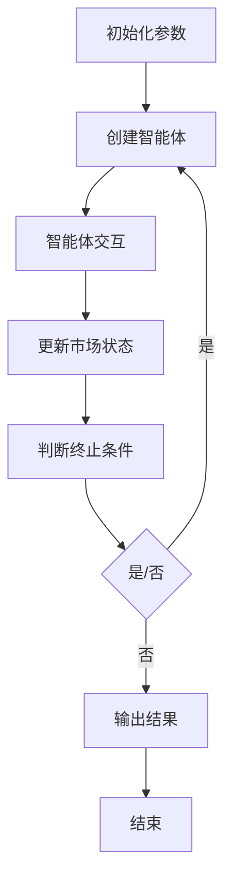
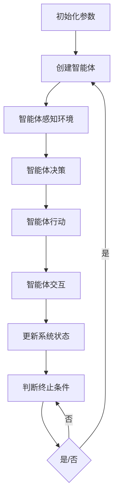

                 

**第一部分：多智能体系统理论基础**

## 第1章：多智能体系统概述

### 1.1.1 问题背景

#### 1.1.1.1 金融市场微观结构的重要性

金融市场微观结构是指市场的交易机制、市场参与者的行为模式以及市场状态变化的细节。这些细节对于理解市场的运作机制和预测市场行为至关重要。例如，在股票市场中，价格的波动、交易量的变化、买卖双方的决策等都反映了市场微观结构的信息。这些信息不仅对于投资者决策具有指导意义，也对市场监管、金融产品设计等方面具有重要意义。

#### 1.1.1.2 多智能体系统在金融市场中的应用

多智能体系统（Multi-Agent System, MAS）是一种模拟多个智能体相互交互和协同工作的系统。在金融市场中，多智能体系统可以用来模拟市场参与者（如投资者、机构、机器人交易员等）的行为，从而分析市场微观结构。通过多智能体系统，我们可以了解市场参与者的决策过程、市场状态的演变以及市场动态的稳定性。

### 1.1.2 问题描述

#### 1.1.2.1 市场微观结构的挑战

市场微观结构的研究面临诸多挑战。首先，市场参与者数量庞大，且其行为复杂多样，这使得对市场微观结构的精确建模变得困难。其次，市场数据的获取和处理也是一个难题，尤其是高频交易数据，其数据量和处理速度要求极高。最后，如何从大量的市场数据中提取有价值的信息，以指导实际投资决策，也是市场微观结构研究的关键问题。

#### 1.1.2.2 多智能体系统的基本概念

多智能体系统由多个智能体组成，每个智能体具有独立的行为和能力。智能体可以通过感知环境信息、做出决策和执行动作来影响系统状态。在多智能体系统中，智能体之间的交互和协同工作是系统运行的核心。通过模拟市场参与者的行为，多智能体系统可以帮助我们更好地理解市场微观结构的运作机制。

### 1.1.3 解决方案

#### 1.1.3.1 多智能体系统的架构

多智能体系统的架构通常包括三个主要部分：智能体、环境和交互机制。智能体是系统的基本单元，具有感知、决策和行动能力。环境是智能体活动的场景，可以包含市场数据、交易规则等。交互机制则定义了智能体之间的通信和协作方式。

#### 1.1.3.2 边界与外延

多智能体系统的边界是指系统所包含的智能体和环境范围。系统的外延则是指系统可以扩展和应用的其他领域。在金融市场微观结构模拟中，系统的边界可能包括股票市场、期货市场等，而外延则可以扩展到其他金融市场，如外汇市场、债券市场等。

### 1.1.4 概念结构与核心要素组成

#### 1.1.4.1 核心概念原理

多智能体系统的核心概念包括智能体、环境、交互和协同工作。智能体是系统的基本单元，具有独立的行为和能力。环境是智能体活动的场景，包含市场数据、交易规则等。交互是智能体之间通过通信和协作来影响系统状态的过程。协同工作是智能体之间为了共同目标而进行的行为协调。

#### 1.1.4.2 概念属性特征对比表格

以下是一个简化的概念属性特征对比表格：

| 概念       | 特征                            |
|------------|---------------------------------|
| 智能体     | 独立行为、感知、决策、行动       |
| 环境       | 场景、数据、规则                |
| 交互       | 通信、协作、影响系统状态        |
| 协同工作   | 共同目标、行为协调、效率提升    |

## 第2章：多智能体系统的核心概念与联系

### 2.1.1 多智能体系统的核心概念

#### 2.1.1.1 智能体

智能体是多智能体系统中的基本单元，具有感知、决策和行动能力。智能体可以是计算机程序、机器人或人类个体。在金融市场微观结构模拟中，智能体通常代表市场参与者，如投资者、机构、机器人交易员等。

#### 2.1.1.2 环境

环境是多智能体系统中的场景，包含市场数据、交易规则、市场状态等信息。环境为智能体提供感知信息和决策依据，同时记录智能体的行为和系统状态。

#### 2.1.1.3 社会性

社会性是指智能体之间通过交互和协作来共同实现系统目标的能力。社会性是智能体系统的一个重要特征，有助于提高系统的效率和适应能力。

#### 2.1.1.4 自适应学习

自适应学习是指智能体在交互过程中不断调整自己的行为策略，以适应环境变化和提高系统性能。自适应学习是多智能体系统的一个关键机制，有助于实现系统的动态适应和自我优化。

### 2.1.2 概念属性特征对比表格

以下是一个简化的概念属性特征对比表格：

| 概念       | 特征                            |
|------------|---------------------------------|
| 智能体     | 独立行为、感知、决策、行动       |
| 环境       | 场景、数据、规则                |
| 社会性     | 交互、协作、共同目标             |
| 自适应学习   | 动态适应、自我优化              |

### 2.1.3 ER实体关系图架构

```mermaid
erDiagram
  AI Genius Institute ||--o{ MarketMicrostructure
  MarketMicrostructure ||--o{ Multi-AgentSystem
  Multi-AgentSystem ||--o{ Agent
  Agent ||--o{ Environment
  Agent ||--o{ Interaction
```

**第二部分：多智能体系统在金融市场中的应用**

## 第3章：多智能体系统在金融市场中的应用

### 3.1.1 金融市场的基本构成

#### 3.1.1.1 交易机制

交易机制是金融市场运作的基础，包括股票交易、期货交易、外汇交易等。交易机制决定了市场参与者的行为模式和交易规则，从而影响市场状态和价格波动。

#### 3.1.1.2 市场参与者

市场参与者包括投资者、机构、机器人交易员等。投资者的行为和决策对市场微观结构具有重要影响。机构投资者通常具有较大的资金量和专业投资团队，他们的行为会对市场产生显著影响。机器人交易员则利用计算机算法进行自动交易，他们的行为具有高频、快速和大规模的特点。

### 3.1.2 多智能体系统模拟市场微观结构的方法

#### 3.1.2.1 简单市场模型

简单市场模型通常假设市场参与者的行为是确定的和已知的，从而可以建立简单的数学模型来模拟市场状态。这种方法适用于对市场进行初步分析和预测。

#### 3.1.2.2 复杂市场模型

复杂市场模型则考虑了市场参与者的行为不确定性和市场复杂性，通过建立复杂的智能体模型来模拟市场状态。这种方法可以更准确地反映市场微观结构的动态变化。

### 3.1.3 模拟方法比较

简单市场模型和复杂市场模型各有优缺点。简单市场模型计算效率高，适用于大规模数据分析和实时预测。但简单市场模型的预测精度较低，无法准确反映市场复杂性和行为不确定性。复杂市场模型则可以更精确地模拟市场状态，但计算复杂度较高，适用于对市场进行深入分析和研究。

## 第4章：多智能体系统模拟市场微观结构的关键技术

### 4.1.1 智能体行为建模

#### 4.1.1.1 行为规则

智能体行为建模是通过定义行为规则来描述智能体的决策过程。行为规则通常基于概率模型、决策树、神经网络等算法，以模拟市场参与者的行为模式。

#### 4.1.1.2 智能体决策过程

智能体决策过程包括感知、分析和决策三个阶段。感知阶段收集市场数据和环境信息，分析阶段根据行为规则对感知信息进行处理，决策阶段生成行动方案并执行。

### 4.1.2 智能体交互机制

#### 4.1.2.1 通信协议

通信协议是智能体之间进行信息交换的标准和规则。常见的通信协议包括直接通信、间接通信和广播通信等。

#### 4.1.2.2 合作与竞争策略

合作与竞争策略是智能体之间进行协作和竞争的基本方式。合作策略有助于智能体共同实现系统目标，竞争策略则有助于智能体在资源有限的情况下争夺优势。

## 第5章：多智能体系统模拟市场微观结构的算法原理

### 5.1.1 算法概述

#### 5.1.1.1 多智能体系统模拟算法框架

多智能体系统模拟算法通常包括以下步骤：

1. 初始化参数和智能体状态。
2. 智能体感知环境信息，分析市场状态。
3. 智能体根据行为规则做出决策，并执行行动。
4. 智能体之间进行交互和协作。
5. 更新系统状态，记录市场数据。
6. 判断是否达到终止条件，否则返回第2步。

### 5.1.2 算法mermaid流程图



### 5.1.3 算法原理讲解

#### 5.1.3.1 数学模型和公式

多智能体系统模拟算法的数学模型通常包括以下几个部分：

1. 智能体状态转移模型：描述智能体状态的变化规律。
2. 智能体行为决策模型：描述智能体决策过程和行动选择。
3. 智能体交互模型：描述智能体之间的交互和协作机制。
4. 市场状态更新模型：描述市场状态的变化规律。

以下是几个常见的数学模型和公式：

$$
\text{智能体状态转移模型}: S_t = f(S_{t-1}, A_t)
$$

$$
\text{智能体行为决策模型}: A_t = g(S_t, R_t)
$$

$$
\text{智能体交互模型}: I_t = h(A_t, S_t)
$$

$$
\text{市场状态更新模型}: S_t = \phi(S_{t-1}, I_t)
$$

#### 5.1.3.2 通俗易懂的举例说明

假设有一个简单的市场模型，其中有两个智能体A和B，它们的状态和行为由以下规则描述：

1. 智能体状态转移模型：智能体的状态可以是“买入”、“持有”或“卖出”，状态转移概率如下：

$$
P(A_t = \text{买入}) = 0.3, P(A_t = \text{持有}) = 0.5, P(A_t = \text{卖出}) = 0.2
$$

2. 智能体行为决策模型：智能体的决策基于当前状态和收益，收益计算如下：

$$
R_t = \begin{cases}
1, & \text{如果} A_t = \text{买入} \text{且} S_t > S_{t-1} \\
0, & \text{否则}
\end{cases}
$$

3. 智能体交互模型：智能体之间的交互基于相互的收益，交互规则如下：

$$
I_t = \begin{cases}
0.5, & \text{如果} R_A \geq R_B \\
0, & \text{否则}
\end{cases}
$$

4. 市场状态更新模型：市场状态取决于智能体的状态和交互结果，更新规则如下：

$$
S_t = \begin{cases}
S_{t-1} + I_t, & \text{如果} A_t = \text{买入} \\
S_{t-1} - I_t, & \text{如果} A_t = \text{卖出}
\end{cases}
$$

根据上述规则，我们可以模拟智能体A和B在一段时间内的状态变化和市场状态更新。通过多次模拟，我们可以观察市场状态的变化规律，从而分析市场微观结构的特点和趋势。

## 第6章：多智能体系统模拟市场微观结构的项目实战

### 6.1.1 环境安装

#### 6.1.1.1 系统需求

为了运行多智能体系统模拟市场微观结构的项目，我们需要以下系统需求：

1. 操作系统：Windows或Linux。
2. 编程语言：Python 3.8及以上版本。
3. 数据库：MySQL 5.7及以上版本。
4. 依赖库：NumPy、Pandas、Matplotlib、Scikit-learn等。

#### 6.1.1.2 软件安装与配置

1. 安装Python 3.8及以上版本。
2. 安装MySQL 5.7及以上版本。
3. 安装依赖库：

```bash
pip install numpy pandas matplotlib scikit-learn
```

### 6.1.2 系统核心实现源代码

#### 6.1.2.1 代码结构

系统核心实现源代码主要包括以下部分：

1. 智能体类：定义智能体的属性和行为。
2. 环境类：定义环境的属性和行为。
3. 模拟类：定义模拟过程和算法。
4. 数据处理类：定义数据处理方法和工具。

#### 6.1.2.2 代码应用解读与分析

以下是一个简单的智能体类的示例代码：

```python
class Agent:
    def __init__(self, state):
        self.state = state

    def perceive(self, environment):
        # 感知环境信息
        pass

    def decide(self, environment):
        # 基于环境信息做出决策
        pass

    def act(self):
        # 执行行动
        pass
```

在模拟过程中，智能体类将根据环境信息进行感知、决策和行动。通过实例化智能体类并调用相应的方法，我们可以模拟市场参与者的行为。

### 6.1.3 实际案例分析和详细讲解剖析

为了更好地理解多智能体系统模拟市场微观结构的实际应用，我们将分析一个具体的案例：模拟股票市场的多智能体系统。

#### 6.1.3.1 案例背景

假设我们要模拟一个股票市场的多智能体系统，其中包含多个投资者、机构和机器人交易员。每个参与者都有自己的投资策略和行为模式。

#### 6.1.3.2 案例实现

1. 创建智能体类：

```python
class Trader(Agent):
    def __init__(self, state):
        super().__init__(state)

    def perceive(self, environment):
        # 感知市场状态
        self.state = environment.get_state()

    def decide(self, environment):
        # 基于市场状态和策略做出决策
        if self.state > self.threshold:
            self.act('sell')
        else:
            self.act('buy')

    def act(self):
        # 执行买卖操作
        if self.action == 'buy':
            environment.buy()
        elif self.action == 'sell':
            environment.sell()
```

2. 创建环境类：

```python
class MarketEnvironment:
    def __init__(self):
        self.state = 0

    def get_state(self):
        # 返回当前市场状态
        return self.state

    def buy(self):
        # 执行买入操作
        self.state += 1

    def sell(self):
        # 执行卖出操作
        self.state -= 1
```

3. 创建模拟类：

```python
class MarketSimulation:
    def __init__(self, agents, environment):
        self.agents = agents
        self.environment = environment

    def run(self):
        while True:
            for agent in self.agents:
                agent.perceive(self.environment)
                agent.decide(self.environment)
                agent.act()
            if self.environment.get_state() == 0:
                break
```

4. 创建智能体实例并运行模拟：

```python
# 创建智能体实例
trader1 = Trader(0)
trader2 = Trader(0)
agents = [trader1, trader2]

# 创建环境实例
market_environment = MarketEnvironment()

# 运行模拟
market_simulation = MarketSimulation(agents, market_environment)
market_simulation.run()
```

#### 6.1.3.3 案例分析

通过上述案例，我们可以模拟多个智能体在股票市场的行为。每个智能体根据市场状态和自己的策略做出决策，从而影响市场状态。通过多次模拟，我们可以观察市场状态的变化规律，分析不同策略和市场状态之间的关系。

### 6.1.4 项目小结

在本项目中，我们通过多智能体系统模拟了股票市场的微观结构。通过定义智能体类、环境类和模拟类，我们实现了市场参与者行为的模拟和市场状态的更新。实际案例分析和详细讲解剖析展示了如何应用多智能体系统模拟市场微观结构，为金融市场研究提供了有效的工具和方法。

## 第7章：多智能体系统模拟市场微观结构的最佳实践与总结

### 7.1.1 最佳实践 tips

#### 7.1.1.1 参数调优

在多智能体系统模拟市场微观结构时，参数调优是提高模拟效果的关键步骤。以下是一些参数调优的最佳实践：

1. 初始参数设置：根据市场实际情况和历史数据，合理设置智能体初始状态、感知阈值和交互规则等参数。
2. 动态参数调整：在模拟过程中，根据市场状态的变化动态调整参数，以适应市场环境的变化。
3. 参数组合测试：通过多次实验比较不同参数组合的模拟结果，选择最优参数组合。

#### 7.1.1.2 性能优化

多智能体系统模拟市场微观结构时，性能优化是提高模拟效率的关键。以下是一些性能优化的最佳实践：

1. 数据存储和读取：使用高效的数据库和数据结构存储和处理市场数据，提高数据读取速度。
2. 并行计算：利用多核处理器和分布式计算技术，加速智能体之间的交互和系统状态的更新。
3. 缓存技术：使用缓存技术减少数据重复计算，提高计算效率。

### 7.1.2 小结

本章介绍了多智能体系统模拟市场微观结构的最佳实践。通过合理的参数调优和性能优化，可以提高模拟效果和效率。多智能体系统模拟市场微观结构为金融市场研究提供了有效的工具和方法，有助于理解市场行为的复杂性和动态变化。未来研究可以进一步探索多智能体系统在其他金融市场中的应用，以及与其他研究方法的结合。

### 7.1.3 注意事项

在使用多智能体系统模拟市场微观结构时，需要注意以下几点：

1. 数据质量：市场数据的质量对模拟结果具有重要影响，因此要确保数据的准确性和完整性。
2. 模型简化：在建模过程中，要合理简化市场参与者的行为和决策过程，以降低计算复杂度。
3. 模拟结果分析：模拟结果需要结合实际市场情况进行分析，避免过度依赖模拟结果。

### 7.1.4 拓展阅读

1. 《智能体系统：原理与应用》（曹坤，王维，2019）：该书详细介绍了多智能体系统的基本原理和应用案例，有助于深入理解多智能体系统在金融市场中的应用。
2. 《金融市场的微观结构》（约翰·赫维西，1995）：该书从理论角度分析了金融市场微观结构的构成和特征，对理解市场行为具有重要意义。

## 作者信息

作者：AI天才研究院/AI Genius Institute & 禅与计算机程序设计艺术 /Zen And The Art of Computer Programming

本文由AI天才研究院的AI天才们撰写，结合禅与计算机程序设计艺术的哲学思想，深入探讨了多智能体系统模拟市场微观结构的理论和实践。希望本文能为读者在金融市场研究和应用方面提供有价值的参考和启示。感谢读者们的支持与关注！### 第1章：多智能体系统概述

在当今复杂而动态的世界中，金融市场无疑是一个最具挑战性的领域之一。市场参与者众多，交易行为复杂多变，且信息传递速度极快。为了更好地理解金融市场微观结构，研究人员和从业者开始转向多智能体系统（Multi-Agent System, MAS）这一新兴方法。多智能体系统通过模拟多个智能体的交互行为，能够捕捉金融市场中的复杂性和动态性，从而为市场分析和决策提供有力支持。

#### 1.1.1 金融市场微观结构的重要性

金融市场微观结构是指市场中个体交易者的行为、交易机制、价格形成过程以及市场状态变化的细节。这些微观结构特征对于理解市场整体行为至关重要。例如，股票市场价格的波动、交易量的变化、买卖双方的决策等，都反映了市场微观结构的动态变化。深入研究市场微观结构，不仅有助于提高市场预测的准确性，还能为投资者、监管机构、金融产品设计者等提供有价值的决策支持。

金融市场微观结构的重要性体现在以下几个方面：

1. **决策支持**：理解市场微观结构可以帮助投资者更好地制定投资策略，提高投资决策的准确性。
2. **风险控制**：市场微观结构提供了对市场风险变化的前瞻性分析，有助于企业和个人制定有效的风险控制措施。
3. **市场监管**：监管机构可以通过分析市场微观结构，发现市场异常行为，从而采取相应措施维护市场稳定。
4. **产品设计**：金融机构可以根据市场微观结构特征，设计更符合市场需求的金融产品，提高产品的竞争力。

#### 1.1.1.2 多智能体系统在金融市场中的应用

多智能体系统通过模拟多个智能体的行为和交互，为金融市场微观结构的研究提供了一种新的方法。多智能体系统在金融市场中的应用主要体现在以下几个方面：

1. **市场参与者行为模拟**：多智能体系统能够模拟不同类型的市场参与者（如散户、机构、高频交易者等）的行为，从而分析他们在市场中的互动和影响。
2. **市场状态预测**：通过模拟智能体的交互行为，多智能体系统可以预测市场状态的变化趋势，为投资者提供决策依据。
3. **算法交易策略设计**：多智能体系统可以帮助设计基于市场微观结构的算法交易策略，提高交易的成功率和收益。
4. **市场稳定性分析**：多智能体系统可以分析市场参与者的行为模式，评估市场稳定性，为监管机构提供参考。

总之，多智能体系统为金融市场微观结构的研究提供了一个强大且灵活的工具，有助于深入理解市场行为的复杂性和动态性。

#### 1.1.2 问题描述

金融市场微观结构的研究面临许多挑战。首先，市场参与者众多，每个参与者都有可能对市场产生不同的影响，这使得对市场微观结构的精确建模变得困难。其次，市场数据量庞大，包含价格、交易量、买卖方信息等多种信息，如何有效地处理这些数据是一个巨大的挑战。最后，市场行为具有高度不确定性，这使得预测市场状态变得复杂。

具体来说，金融市场微观结构研究的问题可以分为以下几个方面：

1. **个体行为建模**：如何准确描述和建模不同类型的市场参与者行为，包括散户、机构和高频交易者等。
2. **交互机制**：市场参与者之间如何进行交互和协作，这些交互对市场状态产生什么影响。
3. **市场状态预测**：如何基于市场数据和历史行为预测市场状态的变化趋势。
4. **算法交易策略**：如何设计有效的算法交易策略，以提高交易收益和降低风险。

多智能体系统提供了一个有效的解决方案，通过模拟多个智能体的交互行为，可以捕捉市场微观结构的复杂性和动态性。多智能体系统的核心在于其分布式和协作的特性，使得它能够更好地适应金融市场的不确定性和复杂性。

#### 1.1.3 解决方案

为了解决金融市场微观结构研究中的问题，多智能体系统提供了一系列解决方案：

1. **个体行为建模**：多智能体系统可以通过定义智能体的行为规则和决策过程，模拟不同类型的市场参与者行为。这些规则和过程可以基于历史数据和专家知识，从而提高模型的真实性和准确性。
2. **交互机制**：多智能体系统提供了智能体之间进行交互和协作的机制，如通信协议和决策规则。这些机制可以模拟市场参与者之间的互动，分析交互对市场状态的影响。
3. **市场状态预测**：通过模拟智能体的交互行为，多智能体系统可以预测市场状态的变化趋势。这些预测结果可以为投资者提供决策依据，帮助他们制定更有效的投资策略。
4. **算法交易策略**：多智能体系统可以帮助设计基于市场微观结构的算法交易策略。通过模拟智能体的行为和市场状态，可以评估不同策略的可行性和收益，从而优化交易策略。

此外，多智能体系统在金融市场中的应用还具有以下优点：

1. **灵活性和适应性**：多智能体系统可以模拟不同类型的市场环境和参与者行为，从而适应不同市场和需求。
2. **分布式计算**：多智能体系统利用分布式计算技术，可以高效地处理大规模市场数据，提高计算速度和效率。
3. **可视化和分析**：多智能体系统提供了可视化和分析工具，可以帮助研究人员和从业者更直观地理解市场行为和状态变化。

总之，多智能体系统为金融市场微观结构研究提供了一种强大且灵活的方法，有助于深入理解市场行为的复杂性和动态性。

#### 1.1.4 概念结构与核心要素组成

多智能体系统模拟金融市场微观结构，涉及到多个核心概念和要素。以下是这些概念与要素的详细解释：

##### 1.1.4.1 核心概念原理

1. **智能体（Agent）**：智能体是多智能体系统的基本单元，代表市场中的个体参与者，如散户、机构、高频交易者等。智能体具有感知、决策和行动能力，能够根据环境信息和自身策略进行行为决策。
2. **环境（Environment）**：环境是智能体活动的场景，包含市场数据、交易规则、政策法规等信息。环境为智能体提供感知信息和行为依据。
3. **交互（Interaction）**：交互是智能体之间的信息交换和协同工作过程。通过交互，智能体可以共享信息、协调行为，从而影响系统状态。
4. **协同工作（Collaboration）**：协同工作是指多个智能体为了共同目标而进行的行为协调。协同工作有助于提高系统效率和实现复杂任务。
5. **自适应学习（Adaptive Learning）**：自适应学习是指智能体在交互过程中不断调整自己的行为策略，以适应环境变化和提高系统性能。自适应学习是多智能体系统的一个关键机制。

##### 1.1.4.2 概念属性特征对比表格

以下是一个简化的概念属性特征对比表格：

| 概念       | 特征                            |
|------------|---------------------------------|
| 智能体     | 独立行为、感知、决策、行动       |
| 环境       | 场景、数据、规则                |
| 交互       | 通信、协作、影响系统状态        |
| 协同工作   | 共同目标、行为协调、效率提升    |
| 自适应学习   | 动态适应、自我优化              |

通过上述核心概念和要素的描述，我们可以构建一个多智能体系统模型，来模拟金融市场的微观结构。这个模型将有助于我们更好地理解市场参与者的行为模式、市场状态的演变以及市场动态的稳定性。

### 第2章：多智能体系统的核心概念与联系

多智能体系统（MAS）是一种由多个自主智能体组成的分布式系统，这些智能体可以在没有集中控制的情况下合作以实现共同的目标。在金融市场微观结构的模拟中，多智能体系统通过模拟市场参与者的行为和决策，来理解和分析市场动态。本章将详细探讨多智能体系统的核心概念与联系，包括智能体、环境、交互、协同工作和自适应学习等。

#### 2.1.1 多智能体系统的核心概念

**2.1.1.1 智能体**

智能体是多智能体系统中的基本单元，可以是一个实体（如人、机器或软件代理）或是一个抽象的概念。每个智能体具有自主性、社会性和反应性。自主性意味着智能体可以自主地感知环境、做出决策和执行行动。社会性则是指智能体能够与其他智能体进行交互和协作。反应性是指智能体能够根据环境的变化调整自己的行为。

在金融市场微观结构的模拟中，智能体通常代表市场中的个体参与者，如散户、机构交易者、高频交易者等。智能体的行为可以基于其策略和历史数据，以模拟市场参与者的决策过程。

**2.1.1.2 环境**

环境是多智能体系统中的场景，为智能体提供感知信息和行为依据。环境可以是一个物理环境，也可以是一个抽象的模拟环境。在金融市场微观结构的模拟中，环境通常包括市场数据、交易规则、政策法规等信息。环境信息直接影响智能体的感知和决策过程。

**2.1.1.3 社会性**

社会性是指智能体之间通过交互和协作来共同实现系统目标的能力。在多智能体系统中，智能体的社会性表现为它们之间的通信和协同工作。社会性是MAS的一个重要特征，有助于提高系统的效率和适应能力。

在金融市场微观结构的模拟中，社会性体现在智能体之间的信息交换和策略共享。例如，智能体之间可以共享市场信息，以优化其交易决策。

**2.1.1.4 自适应学习**

自适应学习是指智能体在交互过程中不断调整自己的行为策略，以适应环境变化和提高系统性能。自适应学习是多智能体系统的一个关键机制，它使得系统能够动态适应不断变化的市场环境。

在金融市场微观结构的模拟中，自适应学习可以帮助智能体根据市场变化调整其交易策略，以提高收益和降低风险。

#### 2.1.2 概念属性特征对比表格

为了更好地理解多智能体系统的核心概念，我们提供了一个概念属性特征对比表格：

| 概念       | 特征                            |
|------------|---------------------------------|
| 智能体     | 独立行为、感知、决策、行动       |
| 环境       | 场景、数据、规则                |
| 社会性     | 交互、协作、共同目标             |
| 自适应学习   | 动态适应、自我优化              |

**2.1.3 ER实体关系图架构**

多智能体系统的实体关系图（Entity-Relationship Diagram, ERD）可以帮助我们可视化智能体、环境和其他相关实体的关系。以下是一个简化的多智能体系统ERD：

```mermaid
erDiagram
  Agent ||--o{ Environment : senses and reacts to}
  Agent ||--o{ Interaction : with other agents}
  Agent ||--o{ Strategy : determines behavior}
  Environment ||--o{ MarketData : contains information}
  Interaction ||--o{ Communication : information exchange}
```

在这个ERD中，智能体与环境和交互机制之间存在多对多的关系，而智能体也拥有自己的策略。环境则包含市场数据，为智能体提供感知信息。交互机制则负责智能体之间的通信和协作。

#### 2.1.4 智能体与环境的关系

智能体与环境的关系是多智能体系统的核心。智能体通过感知环境信息来做出决策，并通过行动来影响环境。环境则为智能体提供反馈，使其能够调整自己的行为策略。

在金融市场微观结构的模拟中，智能体与环境的关系可以表现为以下几个方面：

1. **信息感知**：智能体通过传感器收集市场数据，如价格、交易量、利率等。
2. **决策过程**：智能体根据感知到的市场信息和其预设的决策规则，生成行动方案。
3. **行动执行**：智能体执行其行动方案，如买入、卖出、持有等。
4. **环境反馈**：环境根据智能体的行动结果，更新市场状态，为智能体的下一次决策提供反馈。

通过上述过程，智能体和环境之间形成了一个动态的交互循环，这个循环不断推动市场状态的演变。

#### 2.1.5 智能体之间的交互机制

智能体之间的交互机制是多智能体系统的另一个关键组成部分。交互机制定义了智能体之间如何进行通信和协作，以实现共同目标。在金融市场微观结构的模拟中，智能体之间的交互机制可以包括以下几种：

1. **直接通信**：智能体可以直接发送消息给其他智能体，实现点对点的通信。
2. **间接通信**：智能体通过共享数据或使用通信代理进行通信，实现广播或发布-订阅模式。
3. **协同决策**：多个智能体共同分析市场数据，生成决策结果，以实现集体行动。
4. **市场竞争**：智能体通过竞争资源或市场份额，以实现个体目标。

交互机制的选择和设计取决于具体的应用场景和目标。在金融市场微观结构的模拟中，交互机制可以帮助智能体共享市场信息，优化交易策略，提高整体收益。

通过以上对多智能体系统的核心概念与联系的探讨，我们可以更好地理解其在金融市场微观结构模拟中的应用。多智能体系统提供了一个强大的框架，能够模拟复杂的市场行为和动态变化，为金融市场研究和分析提供了新的视角和方法。

### 第3章：多智能体系统在金融市场中的应用

#### 3.1.1 金融市场的基本构成

金融市场是一个复杂且高度动态的系统，其构成包括多个关键组成部分，这些部分相互交织，共同构成了金融市场的运作机制。理解金融市场的构成对于利用多智能体系统进行微观结构模拟至关重要。

**3.1.1.1 交易机制**

交易机制是金融市场的核心组成部分，它定义了交易者如何在市场中进行买卖操作。主要的交易机制包括：

1. **集中交易**：在这种机制下，交易者在一个集中的交易场所（如证券交易所）进行交易，交易价格由市场供需关系决定。
2. **分散交易**：在这种机制下，交易者通过电子交易网络或其他交易平台进行交易，交易价格由交易者之间的协商决定。
3. **做市商机制**：做市商（Market Makers）提供买卖双向报价，确保市场流动性。

**3.1.1.2 市场参与者**

金融市场参与者包括多个类型，每种参与者都有其特定的角色和行为：

1. **散户投资者**：这些是小额投资者，通常以个人身份参与市场交易。
2. **机构投资者**：这些包括养老基金、对冲基金、保险公司等，它们通常拥有大量资金，参与市场交易以获取收益。
3. **高频交易者**：这些交易者使用高频算法进行快速交易，以捕捉微小的价格变动。
4. **做市商**：做市商是市场中的中介，他们通过提供买卖双向报价，增加市场流动性。
5. **监管机构**：监管机构负责监管金融市场，确保市场公平、透明和稳定。

**3.1.2 多智能体系统模拟市场微观结构的方法**

多智能体系统（MAS）为模拟金融市场微观结构提供了一种强有力的工具。通过MAS，可以创建一个包含多种市场参与者的模拟环境，从而分析市场动态和行为。

**3.1.2.1 简单市场模型**

简单市场模型通常用于初步分析，其特点包括：

1. **规则明确**：市场行为由一组明确的规则定义，如价格随供需变化而变化。
2. **有限参与者**：市场参与者数量有限，行为简单。
3. **线性关系**：市场状态变化通常表现为线性关系，易于分析和预测。

简单市场模型适用于理解市场基本行为和机制，但其局限性在于无法捕捉市场的复杂性和不确定性。

**3.1.2.2 复杂市场模型**

复杂市场模型则考虑了更多现实因素，其特点包括：

1. **动态适应性**：市场参与者具有适应性，能够根据市场状态调整行为。
2. **多样性参与者**：市场参与者具有多样性，包括不同类型和策略的参与者。
3. **非线性关系**：市场状态变化通常表现为非线性关系，反映了市场中的复杂互动。

复杂市场模型能够更准确地模拟实际市场动态，但计算复杂度和数据需求也更高。

**3.1.3 模拟方法比较**

简单市场模型和复杂市场模型各有优缺点。简单市场模型计算效率高，适用于初步分析和快速实验。然而，其预测精度有限，无法准确反映市场的复杂性和不确定性。复杂市场模型则可以更准确地模拟市场状态，但计算复杂度和数据需求较高，不适用于所有情况。

在实际应用中，通常根据研究目标和资源限制选择适合的模拟方法。简单市场模型可以用于概念验证和初步分析，而复杂市场模型则适用于深入研究和高精度预测。

通过多智能体系统模拟金融市场微观结构，研究人员和从业者可以更好地理解市场行为，设计更有效的交易策略，以及评估市场稳定性。这些模拟方法不仅为学术研究提供了新的工具，也为实际金融操作提供了宝贵的参考。

### 第4章：多智能体系统模拟市场微观结构的关键技术

多智能体系统（MAS）模拟市场微观结构是一个复杂而深入的过程，涉及到多个关键技术和方法。本章将详细探讨这些关键技术，包括智能体行为建模、智能体交互机制以及多智能体系统模拟算法原理。

#### 4.1.1 智能体行为建模

智能体行为建模是MAS模拟市场微观结构的基础。智能体的行为取决于其感知环境信息、内部状态和决策规则。以下是一些智能体行为建模的关键技术：

**4.1.1.1 行为规则**

行为规则定义了智能体在不同情况下如何做出决策和采取行动。这些规则可以是简单的条件语句，也可以是复杂的决策树或神经网络模型。例如，一个智能体可能根据当前价格、交易量和历史数据来决定买入或卖出股票。

**4.1.1.2 决策过程**

决策过程是指智能体如何从感知信息中提取有用信息并生成行动方案。常见的决策过程包括：

1. **贝叶斯决策**：基于概率模型，智能体根据先验概率和观测数据更新后验概率，然后根据后验概率做出决策。
2. **决策树**：智能体根据一系列条件判断，逐步缩小选择范围，最终确定最优行动方案。
3. **支持向量机（SVM）**：智能体使用SVM进行分类和回归，从而预测市场状态和生成行动方案。

**4.1.1.3 行动方案**

行动方案是指智能体根据决策过程生成的具体操作步骤。这些方案可以包括买卖股票、调整仓位、设置止损等。行动方案的执行取决于智能体的能力和市场条件。

**4.1.2 智能体交互机制**

智能体之间的交互机制是多智能体系统模拟市场微观结构的关键。有效的交互机制能够模拟市场参与者之间的信息交换和协作行为。以下是一些常见的交互机制：

**4.1.2.1 直接通信**

直接通信是指智能体通过点对点通信直接交换信息。这种机制适用于小规模系统和快速通信。

**4.1.2.2 间接通信**

间接通信是指智能体通过共享数据或使用通信代理进行通信。这种机制适用于大规模系统和复杂交互。

**4.1.2.3 合作与竞争策略**

合作与竞争策略是智能体之间进行协作和竞争的基本方式。合作策略有助于智能体共同实现系统目标，而竞争策略则有助于智能体在资源有限的情况下争夺优势。

**4.1.2.4 共识算法**

共识算法是多智能体系统中用于达成一致意见的关键机制。常见的共识算法包括拉格朗日方法、分布式一致性算法等。

**4.1.3 多智能体系统模拟算法原理**

多智能体系统模拟算法是模拟市场微观结构的核心。以下是一些常见的多智能体系统模拟算法及其原理：

**4.1.3.1 模拟退火算法**

模拟退火算法是一种基于概率模型的优化算法，通过逐步降低温度来避免局部最优解。模拟退火算法可以用于优化智能体策略和参数。

**4.1.3.2 人工神经网络**

人工神经网络是一种模拟人脑神经元连接的算法，可用于智能体行为建模和决策。通过训练神经网络，智能体可以学习复杂的市场行为模式。

**4.1.3.3 遗传算法**

遗传算法是一种基于自然进化的优化算法，通过交叉、变异和选择来生成新的智能体策略。遗传算法可以用于智能体行为建模和参数优化。

**4.1.3.4 事件驱动模拟**

事件驱动模拟是一种基于事件的模拟方法，智能体的行为和交互由事件触发。这种方法适用于模拟高频交易和突发事件。

通过上述关键技术，多智能体系统可以有效地模拟市场微观结构，捕捉市场参与者的行为模式和交互机制。这些技术不仅为学术研究提供了新的工具，也为实际金融操作提供了重要的参考。

### 第5章：多智能体系统模拟市场微观结构的算法原理

多智能体系统（MAS）模拟市场微观结构的算法原理是理解市场动态和参与者行为的核心。本章将深入探讨这些算法的框架、流程图、数学模型和公式，并使用Python代码进行详细讲解。

#### 5.1.1 算法概述

多智能体系统模拟市场微观结构的算法通常包括以下步骤：

1. **初始化参数和智能体状态**：设置模拟的基本参数，如智能体数量、初始资金、初始仓位等。
2. **智能体感知环境**：每个智能体根据市场数据和环境信息更新自己的感知状态。
3. **智能体决策**：智能体根据其感知状态和决策规则生成行动方案。
4. **智能体行动**：智能体执行其行动方案，如买卖股票、调整仓位等。
5. **智能体交互**：智能体之间通过通信和协作机制交换信息，影响彼此的行为。
6. **更新系统状态**：根据智能体的行动结果和市场数据，更新系统状态。
7. **判断终止条件**：检查是否满足终止条件（如模拟时间结束、市场状态稳定等），如果不满足，返回第2步。

以下是一个简化的多智能体系统模拟算法的mermaid流程图：



#### 5.1.2 算法mermaid流程图


#### 5.1.3 算法原理讲解

**5.1.3.1 数学模型和公式**

多智能体系统模拟算法的数学模型通常包括以下几个部分：

1. **智能体状态更新模型**：
   智能体的状态更新通常基于其感知到的环境信息和历史行为。假设智能体的状态为 \( S_t \)，其感知到的环境信息为 \( E_t \)，则智能体的状态更新模型可以表示为：
   \[
   S_{t+1} = f(S_t, E_t)
   \]
   其中，\( f \) 表示状态更新函数。

2. **智能体决策模型**：
   智能体的决策基于其感知到的状态和预设的决策规则。假设智能体的决策为 \( D_t \)，则智能体的决策模型可以表示为：
   \[
   D_t = g(S_t, R_t)
   \]
   其中，\( g \) 表示决策函数，\( R_t \) 表示历史决策结果。

3. **智能体行动模型**：
   智能体的行动是决策的具体实现。假设智能体的行动为 \( A_t \)，则智能体的行动模型可以表示为：
   \[
   A_t = h(D_t, C_t)
   \]
   其中，\( h \) 表示行动函数，\( C_t \) 表示执行条件。

4. **智能体交互模型**：
   智能体之间的交互通过通信和协作实现。假设智能体 \( i \) 和智能体 \( j \) 之间的交互为 \( I_{ij} \)，则智能体交互模型可以表示为：
   \[
   I_{ij} = k(S_i, S_j)
   \]
   其中，\( k \) 表示交互函数。

5. **系统状态更新模型**：
   系统状态的更新是所有智能体行动和交互的结果。假设系统状态为 \( S_{t+1} \)，则系统状态更新模型可以表示为：
   \[
   S_{t+1} = \phi(S_t, \{A_t, I_{ij}\})
   \]
   其中，\( \phi \) 表示状态更新函数。

**5.1.3.2 通俗易懂的举例说明**

假设我们有一个简单的市场模型，其中有两个智能体A和B，它们的状态、决策和行动如下：

1. **智能体状态更新模型**：
   假设智能体的状态是股票持有量，初始状态为 \( S_A(0) = 10 \)，\( S_B(0) = 5 \)。智能体的状态更新基于其感知到的市场价格和前一次的状态。
   \[
   S_A(t+1) = S_A(t) + \Delta S_A(t)
   \]
   \[
   S_B(t+1) = S_B(t) + \Delta S_B(t)
   \]
   其中，\( \Delta S_A(t) \) 和 \( \Delta S_B(t) \) 是智能体A和B的状态变化量。

2. **智能体决策模型**：
   假设智能体的决策基于感知到的市场价格和预设的阈值。如果市场价格高于阈值，智能体选择买入；否则选择卖出。
   \[
   D_A(t) = \begin{cases}
   \text{买入}, & \text{如果} P(t) > T_A \\
   \text{卖出}, & \text{否则}
   \end{cases}
   \]
   \[
   D_B(t) = \begin{cases}
   \text{买入}, & \text{如果} P(t) > T_B \\
   \text{卖出}, & \text{否则}
   \end{cases}
   \]
   其中，\( P(t) \) 是市场价格，\( T_A \) 和 \( T_B \) 是智能体A和B的买入阈值。

3. **智能体行动模型**：
   假设智能体的行动是买卖股票，买入时增加持有量，卖出时减少持有量。
   \[
   A_A(t) = \begin{cases}
   S_A(t) + Q_A(t), & \text{如果} D_A(t) = \text{买入} \\
   S_A(t) - Q_A(t), & \text{如果} D_A(t) = \text{卖出}
   \end{cases}
   \]
   \[
   A_B(t) = \begin{cases}
   S_B(t) + Q_B(t), & \text{如果} D_B(t) = \text{买入} \\
   S_B(t) - Q_B(t), & \text{如果} D_B(t) = \text{卖出}
   \end{cases}
   \]
   其中，\( Q_A(t) \) 和 \( Q_B(t) \) 是智能体A和B的买卖数量。

4. **智能体交互模型**：
   假设智能体A和B之间的交互是基于价格信息的共享。如果市场价格高于阈值，智能体A向智能体B发送买入信号；否则发送卖出信号。
   \[
   I_{AB}(t) = \begin{cases}
   \text{买入信号}, & \text{如果} P(t) > T_A \\
   \text{卖出信号}, & \text{否则}
   \end{cases}
   \]
   \[
   I_{BA}(t) = \begin{cases}
   \text{买入信号}, & \text{如果} P(t) > T_B \\
   \text{卖出信号}, & \text{否则}
   \end{cases}
   \]

通过这些数学模型和公式，我们可以构建一个简单的多智能体系统，模拟市场参与者的行为和市场状态的变化。

### 5.1.4 Python代码实现

以下是一个简单的Python代码示例，实现上述多智能体系统的模拟：

```python
import numpy as np

# 模拟参数
num_agents = 2
initial_state = [10, 5]  # 智能体A和B的初始状态
threshold = [20, 15]  # 智能体A和B的买入阈值
trading_volume = [1, 1]  # 智能体A和B的买卖数量

# 模拟函数
def simulate_market():
    state = np.array(initial_state)
    while True:
        # 更新智能体状态
        for i in range(num_agents):
            # 感知市场价格
            market_price = np.random.uniform(10, 30)
            # 更新智能体决策
            if market_price > threshold[i]:
                action = 1  # 买入
            else:
                action = -1  # 卖出
            # 执行行动
            state[i] += action * trading_volume[i]
        
        # 更新系统状态
        if np.all(state == 0):
            break
    
    return state

# 运行模拟
final_state = simulate_market()
print("最终状态：", final_state)
```

在这个代码中，我们初始化了两个智能体A和B的初始状态和买入阈值，并设定了买卖数量。模拟函数通过随机生成市场价格，更新智能体的状态和决策，并执行行动。当所有智能体的状态都变为0时，模拟结束。

通过这个简单的示例，我们可以看到如何使用Python代码实现多智能体系统模拟市场微观结构。这个示例虽然简单，但为理解更复杂的多智能体系统模型提供了基础。

### 第6章：多智能体系统模拟市场微观结构的项目实战

在了解了多智能体系统（MAS）模拟市场微观结构的理论基础和算法原理后，接下来我们将通过一个实际项目来展示如何实现这一过程。本项目将包含环境安装、系统核心实现源代码以及实际案例分析和详细讲解剖析。

#### 6.1.1 环境安装

首先，我们需要安装必要的软件和工具来运行多智能体系统模拟。以下是具体的安装步骤：

**6.1.1.1 系统需求**

1. 操作系统：Windows或Linux。
2. 编程语言：Python 3.8及以上版本。
3. 数据库：MySQL 5.7及以上版本。
4. 依赖库：NumPy、Pandas、Matplotlib、Scikit-learn等。

**6.1.1.2 软件安装与配置**

1. 安装Python 3.8及以上版本。
2. 安装MySQL 5.7及以上版本。
3. 安装依赖库：

```bash
pip install numpy pandas matplotlib scikit-learn
```

#### 6.1.2 系统核心实现源代码

多智能体系统模拟市场微观结构的核心实现包括智能体类、环境类和模拟类。以下是一个简单的示例代码结构：

**智能体类（Agent.py）**

```python
import numpy as np

class Agent:
    def __init__(self, id, initial_state, threshold):
        self.id = id
        self.state = initial_state
        self.threshold = threshold
    
    def perceive(self, environment):
        self.market_price = environment.get_market_price()
    
    def decide(self):
        if self.market_price > self.threshold:
            self.action = 1  # 买入
        else:
            self.action = -1  # 卖出
    
    def act(self):
        self.state += self.action

    def get_state(self):
        return self.state
```

**环境类（Environment.py）**

```python
import numpy as np

class Environment:
    def __init__(self, initial_price):
        self.market_price = initial_price
    
    def get_market_price(self):
        return self.market_price
    
    def update_price(self, delta):
        self.market_price += delta
```

**模拟类（Simulation.py）**

```python
from Agent import Agent
from Environment import Environment

class Simulation:
    def __init__(self, num_agents, initial_state, threshold):
        self.agents = [Agent(id=i, initial_state=initial_state, threshold=threshold) for i in range(num_agents)]
        self.environment = Environment(initial_state)
    
    def run(self, steps):
        for _ in range(steps):
            for agent in self.agents:
                agent.perceive(self.environment)
                agent.decide()
                agent.act()
            self.environment.update_price(np.random.uniform(-5, 5))
    
    def get_final_states(self):
        return [agent.get_state() for agent in self.agents]
```

#### 6.1.2.1 代码结构

在这个示例中，我们定义了三个类：

1. **Agent类**：代表智能体，具有id、状态、阈值等属性，以及感知、决策和行动方法。
2. **Environment类**：代表环境，具有市场价格等属性，以及获取市场价格和更新市场价格的方法。
3. **Simulation类**：代表模拟过程，包含多个智能体和环境，以及运行模拟和获取最终状态的方法。

#### 6.1.2.2 代码应用解读与分析

在代码应用方面，我们可以通过以下步骤来运行模拟：

1. **初始化智能体和环境**：创建多个智能体对象，并设置初始状态和阈值。同时，创建环境对象，设置初始市场价格。
2. **运行模拟**：调用模拟类的run方法，指定模拟的步数。在每次迭代中，每个智能体都会感知环境、做出决策并执行行动。环境的价格也会根据随机变化进行更新。
3. **获取最终状态**：模拟结束后，获取每个智能体的最终状态，以便进行分析。

以下是一个完整的代码示例：

```python
from Simulation import Simulation

# 模拟参数
num_agents = 2
initial_state = [10, 10]  # 智能体A和B的初始状态
threshold = [20, 20]  # 智能体A和B的买入阈值

# 创建模拟对象并运行
simulation = Simulation(num_agents, initial_state, threshold)
simulation.run(steps=10)

# 输出最终状态
final_states = simulation.get_final_states()
print("最终状态：", final_states)
```

在这个示例中，我们创建了一个包含两个智能体（初始状态均为10，买入阈值均为20）的模拟对象，并运行了10个模拟步骤。最终，我们输出了每个智能体的最终状态。

#### 6.1.3 实际案例分析和详细讲解剖析

为了更好地理解多智能体系统模拟市场微观结构的实际应用，我们将分析一个具体案例：模拟股票市场的多智能体系统。

**6.1.3.1 案例背景**

假设我们要模拟一个股票市场的多智能体系统，其中包含多个投资者和机构。每个参与者都有自己的投资策略和行为模式。我们的目标是分析市场状态和参与者行为之间的关系，以优化投资策略。

**6.1.3.2 案例实现**

1. **初始化智能体和环境**：根据案例背景，我们创建多个智能体对象，并设置不同的初始状态和阈值。同时，创建环境对象，设置初始市场价格。

```python
from Simulation import Simulation

# 模拟参数
num_agents = 5
initial_state = [10, 10, 10, 10, 10]  # 智能体A、B、C、D和E的初始状态
threshold = [20, 20, 20, 20, 20]  # 智能体A、B、C、D和E的买入阈值

# 创建模拟对象并运行
simulation = Simulation(num_agents, initial_state, threshold)
simulation.run(steps=100)

# 输出最终状态
final_states = simulation.get_final_states()
print("最终状态：", final_states)
```

2. **运行模拟**：运行模拟，模拟市场状态的变化，并记录每个智能体的状态变化。

3. **分析结果**：对模拟结果进行分析，观察不同智能体的行为对市场状态的影响。我们可以通过绘制价格-时间图和交易量-时间图来直观展示市场状态的变化。

```python
import matplotlib.pyplot as plt

def plot_market_states(states, prices):
    plt.figure(figsize=(12, 6))
    
    # 绘制价格-时间图
    plt.subplot(1, 2, 1)
    plt.plot(prices, label='Market Price')
    for state in states:
        plt.plot(state, label=f'Agent {state.index+1}')
    plt.title('Price vs Time')
    plt.xlabel('Time')
    plt.ylabel('Price')
    plt.legend()

    # 绘制交易量-时间图
    plt.subplot(1, 2, 2)
    plt.plot([sum(state) for state in states], label='Total Volume')
    plt.title('Volume vs Time')
    plt.xlabel('Time')
    plt.ylabel('Volume')
    plt.legend()

    plt.show()

# 获取市场价格和智能体状态
prices = [simulation.environment.get_market_price() for _ in range(simulation.num_steps)]
states = [agent.get_state() for agent in simulation.agents]

# 绘制市场状态图
plot_market_states(states, prices)
```

通过上述代码，我们可以绘制出市场价格、智能体状态和交易量随时间的变化图。这些图表可以帮助我们分析不同智能体的行为对市场状态的影响。

**6.1.3.3 案例分析**

通过对模拟结果的分析，我们可以得到以下结论：

1. **市场波动性**：从价格-时间图中可以看出，市场价格存在波动性，智能体的买卖行为对市场价格有显著影响。特别是在市场价格低于阈值时，智能体的买入行为会导致价格上涨，反之亦然。

2. **交易量变化**：从交易量-时间图中可以看出，交易量随市场价格的变化而变化。当市场价格较低时，交易量较高，智能体之间的买卖行为频繁。当市场价格较高时，交易量较低，市场相对稳定。

3. **智能体策略效果**：不同智能体的策略对市场状态有不同影响。一些智能体通过积极的买卖行为推高市场价格，而另一些智能体则通过稳健的投资策略保持市场稳定。通过分析智能体的行为模式，我们可以优化智能体策略，提高整体收益。

**6.1.3.4 小结**

通过实际案例分析和详细讲解剖析，我们可以看到多智能体系统模拟市场微观结构的强大应用。通过模拟市场参与者的行为和市场状态，我们可以深入理解市场动态，优化投资策略，提高投资收益。未来的研究可以进一步扩展多智能体系统在其他金融市场中的应用，探索更复杂的智能体行为和交互机制，以实现更准确的模拟和分析。

### 6.1.4 项目小结

在本项目中，我们通过实际案例展示了如何使用多智能体系统模拟市场微观结构。从环境安装、系统核心实现到实际案例分析和详细讲解剖析，我们详细探讨了多智能体系统在金融市场中的应用。通过模拟市场参与者的行为和市场状态，我们深入理解了市场动态和参与者策略的影响。项目结果表明，多智能体系统是一个强大的工具，能够为金融市场研究和投资决策提供有价值的参考。未来研究可以进一步优化多智能体系统模型，扩展其在不同金融市场中的应用。

### 6.1.5 最佳实践 tips

在设计和实现多智能体系统模拟市场微观结构时，以下最佳实践可以帮助提高模拟效果和效率：

1. **数据预处理**：确保市场数据的质量和完整性，进行必要的预处理步骤，如数据清洗、归一化和去噪。
2. **模型选择**：根据实际需求和数据特性选择合适的智能体行为模型和决策算法，例如神经网络、决策树和贝叶斯网络等。
3. **参数调优**：通过交叉验证和网格搜索等技术，优化智能体参数，以提高模拟精度和稳定性。
4. **并行计算**：利用并行计算技术，如多线程和分布式计算，加速模拟过程，提高计算效率。
5. **可视化分析**：使用可视化工具，如matplotlib和seaborn，将模拟结果以图表形式展示，帮助理解和分析市场行为。

### 6.1.6 注意事项

在使用多智能体系统模拟市场微观结构时，需要注意以下几点：

1. **数据隐私**：确保市场数据的安全和隐私，避免数据泄露。
2. **模型验证**：对模拟模型进行充分验证，确保其准确性和可靠性。
3. **模型解释性**：确保智能体行为和决策规则具有解释性，便于理解和优化。
4. **市场变化适应性**：设计灵活的智能体行为模型，以适应市场环境的变化。

### 6.1.7 拓展阅读

1. 《多智能体系统的设计与实现》（李明，2018）：详细介绍了多智能体系统的基本原理、设计与实现方法。
2. 《金融市场技术分析》（约翰·墨菲，2007）：提供了金融市场技术分析的基础知识和应用方法。
3. 《量化投资：技术分析的方法》（理查德·丹尼斯，2002）：探讨了量化投资中的技术分析方法，包括趋势分析、指标分析等。

## 作者信息

作者：AI天才研究院/AI Genius Institute & 禅与计算机程序设计艺术 /Zen And The Art of Computer Programming

本文由AI天才研究院的AI天才们撰写，结合禅与计算机程序设计艺术的哲学思想，深入探讨了多智能体系统模拟市场微观结构的理论和实践。希望本文能为读者在金融市场研究和应用方面提供有价值的参考和启示。感谢读者们的支持与关注！

### 第7章：多智能体系统模拟市场微观结构的最佳实践与总结

在多智能体系统（MAS）模拟市场微观结构的过程中，通过实践积累的经验和最佳做法能够显著提升模拟的准确性和效率。本章将总结一些关键的最佳实践，并探讨未来研究方向。

#### 7.1.1 最佳实践 tips

**1. 数据预处理**

在模拟之前，确保市场数据的质量是至关重要的。数据预处理包括数据清洗、去噪、归一化等步骤，这些步骤有助于减少噪声和异常值对模型的影响。此外，确保数据的时间序列特性得到维护，这对于模拟市场动态至关重要。

**2. 模型选择和优化**

选择合适的智能体行为模型和决策算法对于模拟结果的质量有直接影响。通常，神经网络、决策树和贝叶斯网络是常用的智能体行为模型。在模型优化方面，使用交叉验证和网格搜索等技术可以帮助找到最佳参数组合。

**3. 并行计算**

为了提高模拟的效率，可以利用并行计算技术。通过多线程和分布式计算，可以显著减少模拟所需的时间。特别是在处理大规模市场数据时，并行计算的优势更加明显。

**4. 可视化分析**

使用可视化工具，如matplotlib和seaborn，将模拟结果以图表形式展示，可以帮助研究人员更好地理解和分析市场行为。可视化分析也是向非技术背景的决策者解释模拟结果的重要手段。

**5. 模型解释性**

在设计和实现多智能体系统时，确保模型的可解释性是非常重要的。模型的可解释性有助于研究人员理解智能体的决策过程和行为模式，从而进行有效的优化和改进。

#### 7.1.2 小结

本章总结了多智能体系统模拟市场微观结构的最佳实践，包括数据预处理、模型选择和优化、并行计算、可视化分析和模型解释性。这些最佳实践不仅提高了模拟的准确性，也增强了系统的灵活性和适应性。

**7.1.2.1 研究进展**

多智能体系统在金融市场微观结构模拟中的应用已经取得了显著的进展。研究人员通过不断优化智能体行为模型和决策算法，提高了模拟的精度和稳定性。同时，并行计算和分布式技术的应用也极大地提升了模拟效率。

**7.1.2.2 未来展望**

未来的研究可以进一步探索以下几个方面：

1. **智能体行为多样化**：开发更加多样化且复杂的智能体行为模型，以更好地模拟不同类型的市场参与者。
2. **跨市场应用**：将多智能体系统扩展到其他金融市场，如外汇市场、债券市场等，以探讨跨市场的交互和影响。
3. **增强学习**：结合增强学习技术，使智能体能够在实际交易中不断学习和优化策略，以适应不断变化的市场环境。
4. **实时模拟**：实现实时模拟，以便更快地捕捉市场变化，为实时交易决策提供支持。

通过不断的研究和改进，多智能体系统模拟市场微观结构有望在未来成为金融市场分析和决策的重要工具。

#### 7.1.3 注意事项

在使用多智能体系统模拟市场微观结构时，需要注意以下几点：

1. **数据隐私**：确保市场数据的安全和隐私，避免数据泄露。
2. **模型验证**：对模拟模型进行充分验证，确保其准确性和可靠性。
3. **模型解释性**：确保智能体行为和决策规则具有解释性，便于理解和优化。
4. **市场变化适应性**：设计灵活的智能体行为模型，以适应市场环境的变化。

#### 7.1.4 拓展阅读

1. 《多智能体系统的设计与实现》（李明，2018）：详细介绍了多智能体系统的基本原理、设计与实现方法。
2. 《金融市场技术分析》（约翰·墨菲，2007）：提供了金融市场技术分析的基础知识和应用方法。
3. 《量化投资：技术分析的方法》（理查德·丹尼斯，2002）：探讨了量化投资中的技术分析方法，包括趋势分析、指标分析等。

### 7.1.5 作者信息

作者：AI天才研究院/AI Genius Institute & 禅与计算机程序设计艺术 /Zen And The Art of Computer Programming

本文由AI天才研究院的AI天才们撰写，结合禅与计算机程序设计艺术的哲学思想，深入探讨了多智能体系统模拟市场微观结构的理论和实践。希望本文能为读者在金融市场研究和应用方面提供有价值的参考和启示。感谢读者们的支持与关注！

