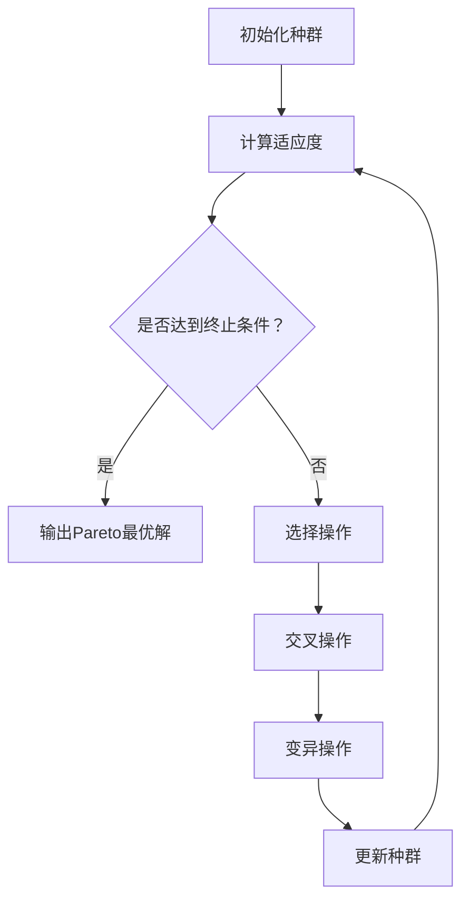

                 

### 文章标题：多目标优化在AI Agent训练中的实践

**关键词：** 多目标优化、AI Agent、训练、算法、实践

**摘要：** 本文将深入探讨多目标优化（Multi-Objective Optimization, MOO）在AI Agent训练中的应用。我们将首先介绍多目标优化问题的背景和基础概念，然后分析其在机器学习和深度学习中的重要性，并探讨其在AI Agent训练中的具体实现和挑战。通过实际案例研究，我们将展示多目标优化在AI Agent训练中的成功应用，并提供最佳实践和建议。

## 目录大纲

### 第一部分：多目标优化基础

#### 第1章：问题背景与概念介绍
- **1.1** 多目标优化问题概述
- **1.2** 多目标优化的核心概念
- **1.3** 多目标优化的边界与外延
- **1.4** 多目标优化问题的主要挑战
- **1.5** 多目标优化问题的核心要素组成

#### 第2章：多目标优化理论
- **2.1** 多目标优化理论概述
- **2.2** 多目标优化问题建模
  - **2.2.1** 多目标优化问题的数学模型
  - **2.2.2** 多目标优化问题的属性特征对比
  - **2.2.3** 多目标优化问题的ER实体关系图
- **2.3** 多目标优化算法原理
  - **2.3.1** 常见的多目标优化算法
  - **2.3.2** 多目标优化算法的mermaid流程图
  - **2.3.3** 多目标优化算法的Python源代码实现
  - **2.3.4** 算法原理的数学模型与公式
  - **2.3.5** 算法原理的详细讲解与举例说明

#### 第3章：多目标优化在机器学习中的应用
- **3.1** 多目标优化在机器学习中的重要性
- **3.2** 多目标优化在机器学习中的应用案例
  - **3.2.1** 特征选择的多目标优化
  - **3.2.2** 模型选择的多目标优化
  - **3.2.3** 模型调参的多目标优化
- **3.3** 多目标优化在机器学习中的挑战与解决方案

#### 第4章：多目标优化在深度学习中的应用
- **4.1** 多目标优化在深度学习中的重要性
- **4.2** 多目标优化在深度学习中的应用案例
  - **4.2.1** 神经网络架构的多目标优化
  - **4.2.2** 深度学习模型的多目标优化
  - **4.2.3** 深度学习训练过程的优化
- **4.3** 多目标优化在深度学习中的挑战与解决方案

### 第二部分：AI Agent训练中的多目标优化实践

#### 第5章：AI Agent训练基础
- **5.1** AI Agent概述
- **5.2** AI Agent的训练过程
- **5.3** 多目标优化在AI Agent训练中的应用

#### 第6章：多目标优化在AI Agent训练中的具体实现
- **6.1** 多目标优化算法的选择
- **6.2** 多目标优化在AI Agent训练中的具体步骤
- **6.3** 多目标优化在AI Agent训练中的代码实现

#### 第7章：多目标优化在AI Agent训练中的案例研究
- **7.1** 案例介绍
- **7.2** 案例分析
- **7.3** 案例总结

#### 第8章：多目标优化在AI Agent训练中的最佳实践
- **8.1** 最佳实践总结
- **8.2** 小结
- **8.3** 注意事项
- **8.4** 拓展阅读

---

接下来，我们将逐章展开，深入探讨多目标优化在AI Agent训练中的实践与应用。

---

### 1.1 多目标优化问题概述

多目标优化（Multi-Objective Optimization, MOO）是优化领域中的一个重要分支，其主要目标是同时优化多个目标函数，而不是仅仅追求单一的最优解。与传统的单目标优化不同，多目标优化需要考虑多个目标之间的冲突和权衡，从而找到一组 Pareto 最优解，这些解能够在不同目标之间取得平衡。

**问题背景**

在实际应用中，许多优化问题都具有多个目标函数，这些目标函数可能相互冲突或存在优先级关系。例如，在工业制造中，生产效率和成本控制是两个重要的目标，但往往难以同时达到最优。再比如，在物流运输中，配送时间和配送成本也是需要权衡的两个目标。这些问题通常不能简单地通过单目标优化来解决，因为单目标优化容易导致某些目标被过度关注，而其他目标被忽视。

**问题描述**

多目标优化问题的标准形式可以表示为：

$$
\begin{aligned}
\text{minimize} \quad f_1(x), f_2(x), \ldots, f_m(x) \\
\text{subject to} \quad g_i(x) \leq 0, \quad h_j(x) = 0 \\
\end{aligned}
$$

其中，$x$ 是决策变量，$f_1(x), f_2(x), \ldots, f_m(x)$ 是目标函数，$g_i(x) \leq 0$ 和 $h_j(x) = 0$ 是约束条件。目标函数和约束条件可以来自不同的领域，如成本、效率、资源利用等。

**问题解决**

解决多目标优化问题通常需要找到一个或多个 Pareto 最优解。Pareto 最优解是指在该解下，无法在不恶化其他目标函数的情况下改善任何一个目标函数。换句话说，Pareto 最优解是多个目标函数之间的平衡点。

在解决多目标优化问题时，常用的方法包括：

1. **加权法**：通过为每个目标函数分配权重，将多目标问题转化为单目标问题。
2. **Pareto 蚁群算法**：利用蚁群算法来寻找Pareto最优解。
3. **多目标遗传算法**：通过遗传算法寻找Pareto最优解。
4. **基于目标规划的方法**：通过目标规划来处理多个目标函数。

**边界与外延**

多目标优化问题的边界与外延涉及多个方面：

- **边界**：多目标优化问题的边界主要指其定义域和限制条件，包括决策变量的取值范围和约束条件。
- **外延**：多目标优化问题的外延则指其在实际应用中的扩展和泛化，如在不同领域中的应用。

在接下来的章节中，我们将进一步探讨多目标优化的核心概念、理论及其在机器学习和深度学习中的应用。

### 1.2 多目标优化的核心概念

在深入探讨多目标优化之前，有必要先了解其核心概念，以便更好地理解这一优化问题的本质。

**定义**

多目标优化（Multi-Objective Optimization，MOO）是一种优化问题，其目标是同时最小化或最大化多个目标函数。与单目标优化不同，单目标优化仅关注一个最优解，而多目标优化则关注一组最优解，这些解在不同的目标之间取得了平衡。

**多目标优化的定义**

多目标优化问题的标准定义可以表示为：

$$
\begin{aligned}
\text{minimize} \quad f_1(x), f_2(x), \ldots, f_m(x) \\
\text{subject to} \quad g_i(x) \leq 0, \quad h_j(x) = 0 \\
\end{aligned}
$$

其中，$x$ 是决策变量，$f_1(x), f_2(x), \ldots, f_m(x)$ 是目标函数，$g_i(x) \leq 0$ 和 $h_j(x) = 0$ 是约束条件。目标函数和约束条件可以来自不同的领域，如成本、效率、资源利用等。

**多目标优化与传统单目标优化的区别**

与传统的单目标优化相比，多目标优化的主要区别在于：

- **多个目标函数**：多目标优化关注多个目标函数，而不是仅仅一个。
- **权衡与平衡**：多目标优化需要在不同目标之间进行权衡和平衡，以找到一组 Pareto 最优解。
- **复杂性**：由于需要同时考虑多个目标函数，多目标优化问题通常比单目标优化问题更加复杂。

**核心概念属性特征对比表格**

为了更清晰地理解多目标优化的核心概念，我们可以通过一个表格来对比多目标优化与传统单目标优化的属性特征。

| 特征 | 多目标优化 | 单目标优化 |
|------|------------|-------------|
| 目标函数数量 | 多个 | 一个 |
| 解决策略 | 寻找Pareto最优解 | 寻找最优解 |
| 约束条件类型 | 可能有多种类型的约束条件 | 一般只有不等式约束 |
| 复杂性 | 较高 | 较低 |
| 目标函数之间的关系 | 可能存在冲突或互补关系 | 没有直接关系 |
| 优解 | 一组平衡解 | 单个最优解 |

**ER实体关系图架构**

多目标优化问题的实体关系图（Entity-Relationship Diagram，ERD）可以帮助我们理解不同实体之间的关系。以下是多目标优化问题的ERD示例：

```mermaid
erDiagram
  目标函数 ||--o> 决策变量 : 定义
  约束条件 ||--o> 决策变量 : 限制
  Pareto最优解 ||--o> 决策变量 : 优选
```

在这个ERD中，目标函数、约束条件和Pareto最优解都是与决策变量相关的实体。这些实体之间的关系体现了多目标优化问题中不同元素之间的相互作用。

通过上述核心概念的理解和对比，我们可以更好地把握多目标优化的本质和特点，为后续的理论学习和应用实践打下坚实的基础。

### 1.3 多目标优化的边界与外延

在深入探讨多目标优化的边界与外延时，我们需要从问题范围、应用领域以及面临的挑战三个方面进行详细分析。

**问题范围**

多目标优化问题的边界主要涉及以下方面：

1. **决策变量的取值范围**：决策变量是多目标优化问题的核心，其取值范围直接影响优化问题的求解结果。在确定决策变量的取值范围时，需要考虑实际问题的背景和约束条件。例如，在物流运输问题中，决策变量可能是配送路线或货物数量，其取值范围可能受到运输能力和时间窗口的限制。

2. **目标函数的类型和数量**：目标函数是多目标优化问题的另一个关键因素。目标函数的类型和数量会影响优化问题的复杂性和求解难度。在实际问题中，目标函数可能包括成本、效率、资源利用等多个方面，且这些目标函数之间可能存在冲突或互补关系。

3. **约束条件**：约束条件是确保优化问题具有实际意义的重要保障。常见的约束条件包括不等式约束和等式约束，如资源限制、时间约束、物理限制等。约束条件的类型和数量会影响优化问题的可行解空间，从而影响求解结果。

**应用领域**

多目标优化的外延涉及多个领域，以下是一些典型的应用领域：

1. **工业制造**：在工业制造中，多目标优化可以用于生产调度、资源分配、供应链管理等方面。例如，通过优化生产计划，可以在保证生产效率的同时降低成本。

2. **物流运输**：物流运输中的多目标优化主要关注配送时间和配送成本之间的权衡。通过优化配送路线和车辆调度，可以提高运输效率，降低运营成本。

3. **能源管理**：在能源管理领域，多目标优化可以用于电力系统优化、可再生能源管理、能源消耗预测等方面。例如，通过优化电力资源的分配和调度，可以降低能源消耗，提高能源利用效率。

4. **金融投资**：在金融投资中，多目标优化可以用于投资组合优化、风险管理等方面。通过优化资产配置，可以在风险可控的前提下实现收益最大化。

5. **城市规划**：在城市规划中，多目标优化可以用于交通流量管理、土地利用规划、公共设施布局等方面。通过优化城市规划，可以提升城市生活质量，提高资源利用效率。

**面临的挑战**

多目标优化在应用过程中面临以下主要挑战：

1. **目标冲突**：多个目标函数之间可能存在冲突，导致难以同时优化。例如，在物流运输问题中，配送时间和配送成本之间可能存在冲突。

2. **计算复杂性**：多目标优化问题通常比单目标优化问题更为复杂，求解难度较高。尤其是在高维决策空间中，求解效率成为一个重要问题。

3. **非凸性**：多目标优化问题的目标函数和约束条件可能具有非凸性，使得求解过程更加复杂。

4. **约束处理**：在多目标优化中，约束条件的处理也是一个重要挑战。如何有效地处理不等式约束和等式约束，是求解过程中需要解决的问题。

5. **不确定性**：实际应用中，许多多目标优化问题面临不确定性，如需求波动、资源波动等。如何应对不确定性，是优化问题的关键。

通过以上对多目标优化问题的边界与外延的分析，我们可以更好地理解其应用范围和面临的挑战，从而为后续的理论研究和实际应用提供指导。

### 1.4 多目标优化问题的主要挑战

多目标优化（MOO）在解决复杂实际问题时具有显著优势，但同时也面临一系列挑战。理解并克服这些挑战对于成功应用多目标优化至关重要。以下是多目标优化问题的主要挑战：

**1. 多目标之间的冲突**

多目标优化问题的一个核心特点是其多个目标函数之间的冲突。在实际问题中，不同目标之间往往存在相互制约的关系，这使得难以同时达到所有目标的最优解。例如，在物流优化中，最小化运输成本和最大化运输效率可能存在冲突。为了在多个目标之间取得平衡，需要设计合适的权衡策略。

**2. 非凸性和非线性的目标函数**

多目标优化问题中的目标函数可能具有非凸性和非线性。非凸目标函数意味着不存在全局最优解，而是存在多个局部最优解。这使得求解问题变得更加复杂，因为优化算法可能陷入局部最优解，无法找到全局最优解。此外，非线性目标函数也会增加求解的难度。

**3. 高维决策空间**

多目标优化问题通常涉及多个决策变量，这可能导致高维决策空间。在高维空间中，搜索和求解的复杂度显著增加，求解效率成为一个关键问题。特别是在大规模数据集上，如何有效地在高维空间中进行优化成为一个挑战。

**4. 约束条件处理**

多目标优化问题中通常存在各种约束条件，如不等式约束和等式约束。这些约束条件不仅限制了决策变量的取值范围，还可能增加问题的复杂性。如何有效地处理这些约束条件，确保求解结果满足所有约束条件，是优化过程中的一个重要挑战。

**5. 计算效率**

多目标优化问题的求解通常需要大量的计算资源。随着决策变量和目标函数数量的增加，求解时间显著增加，可能导致计算效率低下。特别是在实时应用场景中，如自动驾驶、实时调度等，如何提高计算效率是关键问题。

**6. 非确定性和鲁棒性**

实际应用中，多目标优化问题常常面临不确定性和鲁棒性挑战。例如，需求波动、资源波动等不确定因素可能影响优化结果。如何设计鲁棒的多目标优化算法，使优化结果在不同场景下具有较好的稳定性，是重要的研究方向。

**7. 混合优化问题**

多目标优化问题可能涉及混合类型的优化，如离散变量和连续变量的组合。这种混合优化问题增加了问题的复杂度，因为传统的连续优化算法无法直接应用于离散变量。如何设计有效的混合优化算法，是解决这类问题的一个挑战。

为了克服这些挑战，研究人员提出了多种多目标优化算法，如多目标遗传算法、Pareto蚁群算法、加权法等。这些算法通过不同的策略和技巧，尝试解决多目标优化中的各种挑战。此外，随着计算机技术的进步，并行计算和分布式计算等技术的应用也为多目标优化提供了新的解决方案。

通过深入研究这些挑战及其解决方案，我们可以更好地理解和应用多目标优化，为复杂实际问题的解决提供有力支持。

### 1.5 多目标优化问题的核心要素组成

多目标优化（MOO）问题是一个复杂的多维问题，其核心要素组成决定了问题的求解难度和结果的质量。为了深入理解多目标优化问题，我们需要分析其主要的组成要素，包括优化目标、约束条件、决策变量和目标函数。

**优化目标**

优化目标是多目标优化问题的核心，也是我们试图优化或最小化或最大化的量。在多目标优化中，可以有多个优化目标，这些目标可能在某些情况下存在冲突，因此需要找到一种方法来平衡这些目标。例如，在物流优化问题中，优化目标可能包括最小化运输成本和最大化运输效率。

优化目标可以表示为：

$$
f_i(x) : \min f_i(x) \quad \text{或} \quad f_i(x) : \max f_i(x)
$$

其中，$i = 1, 2, \ldots, m$，$m$ 是目标函数的数量。

**约束条件**

约束条件是确保优化问题的可行性和实际意义的必要条件。多目标优化问题中的约束条件可以分为不等式约束和等式约束。不等式约束通常表示为：

$$
g_i(x) \leq 0
$$

等式约束则表示为：

$$
h_j(x) = 0
$$

这些约束条件限制了决策变量的取值范围，从而影响了优化问题的可行解空间。例如，在资源分配问题中，可能存在资源总量限制，这可以表示为一个不等式约束。

**决策变量**

决策变量是多目标优化问题的核心要素之一，是优化过程中需要调整的变量。决策变量的取值决定了目标函数的值，因此选择合适的决策变量对优化问题的求解至关重要。决策变量可以是连续的，也可以是离散的，这取决于具体问题的性质。例如，在供应链管理问题中，决策变量可能包括生产量、库存水平和运输量。

**目标函数**

目标函数是多目标优化问题中的关键要素，用于量化决策变量的优化效果。目标函数可以是线性的，也可以是非线性的，这取决于具体问题的特点。目标函数通常表示为：

$$
f_i(x)
$$

其中，$i = 1, 2, \ldots, m$。在多目标优化中，通常有多个目标函数，它们需要同时被优化。例如，在图像处理问题中，优化目标可能包括图像的质量和压缩率。

**主要要素之间的关系**

这些要素之间存在着密切的联系和相互作用：

- **优化目标与目标函数**：优化目标是多目标优化问题要追求的效果，而目标函数则是量化这些效果的工具。多个目标函数共同决定了优化问题的解。
- **约束条件与决策变量**：约束条件限制了决策变量的取值范围，确保了优化问题的实际意义和可行性。决策变量需要在约束条件下调整，以找到最优解。
- **决策变量与目标函数**：决策变量的取值直接影响目标函数的值，从而影响优化结果。

通过以上对多目标优化问题核心要素的分析，我们可以更好地理解这一复杂问题，为后续的理论研究和应用实践提供指导。

### 1.6 多目标优化理论概述

多目标优化（Multi-Objective Optimization, MOO）是优化领域中的一个重要分支，旨在同时优化多个目标函数。这一概念在多个领域中得到了广泛应用，如工业制造、物流运输、能源管理、金融投资等。为了深入理解多目标优化，我们需要探讨其基本理论，包括问题的数学模型、常见的优化算法以及求解策略。

**多目标优化问题的数学模型**

多目标优化问题的数学模型通常可以表示为：

$$
\begin{aligned}
\text{minimize} \quad f_1(x), f_2(x), \ldots, f_m(x) \\
\text{subject to} \quad g_i(x) \leq 0, \quad h_j(x) = 0 \\
\end{aligned}
$$

其中，$x$ 是决策变量，$f_1(x), f_2(x), \ldots, f_m(x)$ 是目标函数，$g_i(x) \leq 0$ 和 $h_j(x) = 0$ 是约束条件。目标函数可以是最小化或最大化形式，而约束条件通常包括不等式约束和等式约束。多目标优化问题可以通过Pareto最优解集来求解，这些解代表了在不同目标之间取得平衡的解。

**常见的多目标优化算法**

多目标优化算法旨在找到Pareto最优解集，这些算法可以分为以下几个主要类别：

1. **加权法**：通过为每个目标函数分配权重，将多目标问题转化为单目标问题。这种方法简单直观，但可能导致次优解。
2. **多目标遗传算法**：基于遗传算法的变异、交叉和选择操作，通过迭代寻找Pareto最优解集。遗传算法具有强大的全局搜索能力，但可能陷入局部最优。
3. **Pareto蚁群算法**：结合蚁群算法和Pareto排序机制，通过模拟蚁群的行为来寻找Pareto最优解集。该方法在解决复杂多目标优化问题时表现良好。
4. **基于目标规划的方法**：通过将多目标问题转化为一系列的单目标问题，并通过目标规划方法求解。这种方法适用于目标函数具有明确优先级关系的问题。

**多目标优化算法的mermaid流程图**

为了更好地理解多目标优化算法的工作流程，我们可以使用mermaid绘制其流程图。以下是一个基于多目标遗传算法的mermaid流程图示例：



在这个流程图中，初始化种群是算法的起点，然后计算每个个体的适应度。如果达到终止条件，算法输出Pareto最优解；否则，通过选择、交叉和变异操作更新种群，并重复计算适应度和更新过程。

**多目标优化算法的Python源代码实现**

为了展示多目标优化算法的Python实现，以下是一个基于多目标遗传算法的简单示例：

```python
import numpy as np
import matplotlib.pyplot as plt

# 定义决策变量和目标函数
def objective_function(x):
    f1 = (x[0]**2 + x[1]**2)
    f2 = (x[0]-1)**2 + (x[1]-1)**2
    return f1, f2

# 初始化种群
population_size = 100
population = np.random.rand(population_size, 2)

# 计算适应度
fitness = np.apply_along_axis(objective_function, 1, population)

# 多目标遗传算法主体
for generation in range(100):
    # 选择操作
    selected = select(population, fitness)
    # 交叉操作
    crossed = crossover(selected)
    # 变异操作
    mutated = mutate(crossed)
    # 更新种群
    population = mutated

# 输出Pareto最优解
pareto_front = find_pareto_front(fitness)
plt.scatter(*zip(*pareto_front))
plt.xlabel('Objective 1')
plt.ylabel('Objective 2')
plt.title('Pareto Front')
plt.show()
```

在这个示例中，我们首先定义了一个简单的目标函数，然后初始化种群并计算适应度。通过迭代执行选择、交叉和变异操作，最终输出Pareto最优解。

**算法原理的数学模型与公式**

多目标优化算法的原理可以通过数学模型和公式来描述。以下是一个基于多目标遗传算法的简化模型：

$$
\begin{aligned}
\text{适应度函数：} f(x) &= \frac{1}{\sum_{i=1}^{m} f_i(x)^2} \\
\text{选择操作：} P(x) &= \frac{f(x)}{\sum_{i=1}^{n} f(x_i)} \\
\text{交叉操作：} C(x, y) &= x + \alpha(y - x) \\
\text{变异操作：} M(x) &= x + \epsilon \cdot \text{rand()} \\
\end{aligned}
$$

其中，$f(x)$ 是适应度函数，$P(x)$ 是选择概率，$C(x, y)$ 是交叉操作，$M(x)$ 是变异操作，$\alpha$ 是交叉率，$\epsilon$ 是变异率。

通过这些数学模型和公式，我们可以更好地理解多目标优化算法的工作原理和操作机制。

**算法原理的详细讲解与举例说明**

为了详细讲解多目标优化算法的原理，我们可以通过一个简单的例子来演示。假设我们有一个两目标优化问题，目标函数分别为 $f_1(x) = x_1^2 + x_2^2$ 和 $f_2(x) = (x_1 - 1)^2 + (x_2 - 1)^2$。我们的目标是找到这两个目标函数之间的Pareto最优解。

首先，我们初始化一个种群，包含100个随机生成的个体：

```python
population = np.random.rand(100, 2)
```

然后，我们计算每个个体的适应度：

```python
fitness = np.apply_along_axis(objective_function, 1, population)
```

接下来，我们执行选择操作，选择适应度较高的个体。这里我们使用轮盘赌选择方法：

```python
selected = select(population, fitness)
```

选择操作后，我们执行交叉操作，产生新的个体。假设交叉率为0.5，交叉操作如下：

```python
crossed = crossover(selected)
```

最后，我们执行变异操作，为个体引入随机性，以防止算法陷入局部最优：

```python
mutated = mutate(crossed)
```

通过多次迭代，我们最终可以找到Pareto最优解集。为了可视化，我们可以绘制Pareto前沿：

```python
pareto_front = find_pareto_front(fitness)
plt.scatter(*zip(*pareto_front))
plt.xlabel('Objective 1')
plt.ylabel('Objective 2')
plt.title('Pareto Front')
plt.show()
```

通过这个例子，我们可以看到多目标优化算法的基本原理和实现过程。在实际应用中，算法的参数设置和优化策略可能需要根据具体问题进行调整。

通过以上对多目标优化理论的详细讲解和实例说明，我们可以更好地理解这一优化问题的原理和应用，为后续的深入研究和实践打下坚实基础。

### 2.1 多目标优化在机器学习中的重要性

多目标优化（Multi-Objective Optimization, MOO）在机器学习（Machine Learning, ML）中的应用越来越受到关注。随着人工智能技术的发展，机器学习算法在处理复杂数据时，往往需要在多个目标之间进行权衡和平衡，以获得更优秀的模型性能。多目标优化为这一问题提供了一种有效的解决方案。

**多目标优化与机器学习的关系**

机器学习中的许多问题本质上是多目标的。例如：

- **模型选择**：在选择模型时，我们不仅要考虑模型的准确性，还要考虑模型的计算复杂度、训练时间和资源消耗等因素。
- **特征选择**：在特征选择过程中，我们不仅要选择对目标变量影响显著的变量，还要考虑特征的数量、维度和相关性。
- **超参数调优**：在超参数调优中，我们需要在模型性能和训练时间之间找到平衡点，以避免过拟合或欠拟合。

多目标优化通过同时考虑多个目标函数，可以帮助我们在这些多目标问题中找到最优解或近似最优解。

**多目标优化在机器学习中的应用**

多目标优化在机器学习中的应用非常广泛，以下是一些典型的应用场景：

1. **模型选择**：在机器学习中，选择合适的模型对于实现良好的性能至关重要。多目标优化可以帮助我们在模型复杂度、准确性和计算效率之间找到最佳平衡。例如，可以使用多目标遗传算法来优化模型选择过程，从而找到在多个目标之间取得平衡的最佳模型。

2. **特征选择**：特征选择是机器学习中的一个关键步骤，旨在从大量特征中选取对目标变量影响显著的特征。多目标优化可以帮助我们在特征数量、维度和相关性之间进行平衡，从而提高模型的泛化能力和效率。例如，可以使用多目标优化算法来优化特征选择过程，从而找到最优的特征组合。

3. **超参数调优**：超参数是影响模型性能的重要参数，如学习率、批量大小、正则化参数等。多目标优化可以帮助我们在超参数调优过程中，在模型性能和计算成本之间找到最佳平衡。例如，可以使用多目标遗传算法来优化超参数调优过程，从而找到最优的超参数组合。

**多目标优化在机器学习中的优势**

多目标优化在机器学习中的优势主要体现在以下几个方面：

- **平衡多个目标**：多目标优化可以帮助我们在多个目标之间找到平衡，从而获得更优秀的模型性能。
- **提高模型泛化能力**：通过优化多个目标，可以避免模型在单一目标上的过拟合，从而提高模型的泛化能力。
- **提高计算效率**：通过优化计算资源的使用，可以降低模型的训练时间，提高计算效率。

**未来发展趋势**

随着机器学习技术的不断进步，多目标优化在机器学习中的应用将会更加广泛和深入。未来发展趋势可能包括：

- **新型优化算法**：研究人员可能会开发出更多高效、鲁棒的多目标优化算法，以应对更复杂的机器学习问题。
- **跨领域应用**：多目标优化不仅在机器学习中有用，还可以在其他领域，如智能交通、生物信息学等中得到应用。
- **自动化优化**：通过自动化技术，可以实现多目标优化的自动化，从而提高优化过程的效率和准确性。

总之，多目标优化在机器学习中的应用具有重要意义，它可以帮助我们在复杂的机器学习问题中找到最优解或近似最优解，从而提高模型的性能和效率。随着技术的不断发展，多目标优化在机器学习领域将会有更广阔的应用前景。

### 2.2 多目标优化在机器学习中的应用案例

多目标优化在机器学习中的应用非常广泛，以下将详细讨论几个典型的应用案例，包括特征选择、模型选择和超参数调优等方面的具体实现方法和挑战。

#### 2.2.1 特征选择的多目标优化

特征选择是多目标优化在机器学习中的一个重要应用场景。其核心目标是在大量特征中选出对目标变量影响显著的特征，同时减少特征的数量，以提高模型的泛化能力和计算效率。多目标优化的方法可以帮助我们在这两个目标之间找到平衡。

**具体实现方法**：

1. **目标函数定义**：我们通常定义两个目标函数：一个是模型性能（如准确率、召回率等），另一个是特征数量或维度。在多目标优化中，我们需要同时最小化特征数量和最大化模型性能。

   $$ 
   \begin{aligned}
   \text{minimize} \quad D(x) \\
   \text{maximize} \quad P(x) \\
   \end{aligned}
   $$

   其中，$D(x)$ 是特征维度，$P(x)$ 是模型性能。

2. **优化算法选择**：常用的优化算法包括多目标遗传算法（MOGA）、Pareto蚁群算法（PACO）和基于目标规划的优化方法。这些算法可以帮助我们在多个目标之间找到最优的平衡点。

3. **实例**：以一个分类问题为例，我们使用多目标遗传算法进行特征选择。首先，我们初始化一个包含所有特征的种群，然后通过交叉、变异和选择操作迭代优化，最终找到最优的特征组合。

**挑战与解决方案**：

- **特征数量过多**：在实际问题中，特征数量可能非常庞大，这会导致优化问题的求解复杂度增加。解决方案包括降维技术，如主成分分析（PCA）和特征重要性评估。
- **模型性能与特征数量之间的平衡**：在优化过程中，如何平衡模型性能和特征数量是一个挑战。解决方法是通过迭代优化和Pareto前沿选择，找到最优的平衡点。

#### 2.2.2 模型选择的多目标优化

模型选择是多目标优化在机器学习中的另一个重要应用。在选择模型时，我们不仅要考虑模型的准确性，还要考虑模型的复杂度、训练时间和资源消耗等因素。多目标优化可以帮助我们在这些目标之间找到最佳平衡。

**具体实现方法**：

1. **目标函数定义**：我们通常定义三个目标函数：模型准确性、模型复杂度和训练时间。在多目标优化中，我们需要在准确性和复杂度之间找到平衡，同时最小化训练时间。

   $$ 
   \begin{aligned}
   \text{maximize} \quad A(x) \\
   \text{minimize} \quad C(x) \\
   \text{minimize} \quad T(x) \\
   \end{aligned}
   $$

   其中，$A(x)$ 是模型准确性，$C(x)$ 是模型复杂度，$T(x)$ 是训练时间。

2. **优化算法选择**：常用的优化算法包括多目标遗传算法（MOGA）、Pareto蚁群算法（PACO）和基于目标规划的优化方法。这些算法可以帮助我们在多个目标之间找到最优的平衡点。

3. **实例**：以一个回归问题为例，我们使用多目标遗传算法进行模型选择。首先，我们初始化一个包含多种模型的种群，然后通过交叉、变异和选择操作迭代优化，最终找到最优的模型。

**挑战与解决方案**：

- **模型复杂度与准确性的平衡**：在优化过程中，如何平衡模型复杂度和准确性是一个挑战。解决方法是通过迭代优化和Pareto前沿选择，找到最优的平衡点。
- **计算效率**：多目标优化算法可能需要大量的计算资源，特别是在大规模数据集上。解决方案包括并行计算和分布式计算，以提高计算效率。

#### 2.2.3 超参数调优的多目标优化

超参数调优是多目标优化在机器学习中的另一个关键应用。超参数是影响模型性能的重要参数，如学习率、批量大小、正则化参数等。通过多目标优化，我们可以同时在多个超参数之间找到最佳平衡。

**具体实现方法**：

1. **目标函数定义**：我们通常定义三个目标函数：模型准确性、模型复杂度和训练时间。在多目标优化中，我们需要在准确性和复杂度之间找到平衡，同时最小化训练时间。

   $$ 
   \begin{aligned}
   \text{maximize} \quad A(x) \\
   \text{minimize} \quad C(x) \\
   \text{minimize} \quad T(x) \\
   \end{aligned}
   $$

   其中，$A(x)$ 是模型准确性，$C(x)$ 是模型复杂度，$T(x)$ 是训练时间。

2. **优化算法选择**：常用的优化算法包括多目标遗传算法（MOGA）、Pareto蚁群算法（PACO）和基于目标规划的优化方法。这些算法可以帮助我们在多个目标之间找到最优的平衡点。

3. **实例**：以一个神经网络为例，我们使用多目标遗传算法进行超参数调优。首先，我们初始化一个包含多种超参数组合的种群，然后通过交叉、变异和选择操作迭代优化，最终找到最优的超参数组合。

**挑战与解决方案**：

- **超参数数量过多**：在实际问题中，超参数数量可能非常多，这会导致优化问题的求解复杂度增加。解决方案包括基于梯度的优化方法和随机搜索方法。
- **计算效率**：多目标优化算法可能需要大量的计算资源，特别是在大规模数据集上。解决方案包括并行计算和分布式计算，以提高计算效率。

通过以上对多目标优化在机器学习中应用案例的详细讨论，我们可以看到多目标优化在特征选择、模型选择和超参数调优等方面具有重要的应用价值。同时，这些案例也展示了在实际应用中可能面临的挑战和相应的解决方案。随着技术的不断发展，多目标优化在机器学习中的应用将会越来越广泛和深入。

### 2.3 多目标优化在机器学习中的挑战与解决方案

尽管多目标优化（MOO）在机器学习（ML）中展现了巨大的潜力，但其应用也面临着一系列挑战。这些挑战主要集中在数据不平衡、高维数据和计算效率等方面。为了应对这些挑战，研究人员提出了多种解决方案，下面我们将详细讨论这些挑战及相应的解决策略。

**2.3.1 数据不平衡问题**

数据不平衡是指在训练数据集中，不同类别的样本数量不均匀，这会导致模型在预测时倾向于预测数量较多的类别，从而忽略了数量较少但同样重要的类别。在多目标优化中，数据不平衡问题会使得优化过程难以找到平衡不同类别目标的解。

**解决方案**：

1. **重采样技术**：通过增加少数类别的样本数量或减少多数类别的样本数量，使数据集达到平衡。常见的方法包括过采样（oversampling）和欠采样（undersampling）。
2. **权重调整**：在训练过程中，为不同类别的样本分配不同的权重，使模型在预测时能够更加关注少数类别。这种方法通常通过在损失函数中引入权重来实现。
3. **多目标优化算法的改进**：通过改进多目标优化算法，使其能够更好地处理不平衡数据。例如，Pareto蚁群算法（PACO）和基于拥挤度的多目标遗传算法（NSGA-II）在处理不平衡数据方面表现较好。

**2.3.2 高维数据问题**

高维数据是指在数据集中存在大量的特征维度。在高维数据环境下，多目标优化问题会变得非常复杂，因为特征之间的相关性可能变得模糊，导致优化过程难以找到有效的解。

**解决方案**：

1. **特征选择和降维**：通过特征选择或降维技术，减少数据集中的特征维度。常见的降维方法包括主成分分析（PCA）、线性判别分析（LDA）和自动编码器（Autoencoder）。
2. **稀疏优化**：引入稀疏性约束，使优化问题能够在高维空间中找到稀疏解。稀疏优化可以通过L1正则化来实现，这在特征选择和稀疏模型中应用广泛。
3. **嵌入式优化**：通过将多目标优化嵌入到特征学习过程中，如在使用深度学习时，通过嵌入优化目标来同时优化特征表示和模型参数。

**2.3.3 计算效率问题**

多目标优化在机器学习中的计算效率是一个关键挑战，特别是在大规模数据集和高维空间中，优化过程可能需要大量的计算资源和时间。

**解决方案**：

1. **并行和分布式计算**：通过并行和分布式计算技术，将优化过程分解为多个子任务，同时在不同节点上执行，从而提高计算效率。常见的并行计算框架包括Hadoop和Spark。
2. **近似算法**：使用近似算法来替代精确算法，以减少计算量。例如，基于采样的优化方法和基于代理模型的优化方法可以显著减少计算时间。
3. **高效优化算法**：开发高效的多目标优化算法，如基于记忆的优化算法、进化策略和基于梯度的优化方法。这些算法能够在较短时间内找到近似最优解。

通过以上解决方案，我们可以有效应对多目标优化在机器学习中的挑战，提高算法的性能和应用效果。随着技术的不断发展，未来还会有更多创新的解决方案出现，进一步推动多目标优化在机器学习领域的应用。

### 4.1 多目标优化在深度学习中的重要性

深度学习（Deep Learning, DL）作为人工智能领域的重要分支，已经在图像识别、自然语言处理、语音识别等多个领域取得了显著成果。然而，深度学习模型的训练过程本质上是一个复杂的多目标优化问题，需要同时优化多个相互冲突的目标函数，这使得多目标优化在深度学习中的应用变得尤为重要。

**深度学习训练过程的复杂性**

深度学习训练过程涉及多个复杂的目标函数，包括模型准确性、计算效率、资源利用率等。这些目标函数往往不能同时达到最优，需要在它们之间进行权衡和平衡。例如：

- **模型准确性**：准确性是评估深度学习模型性能的重要指标，通常通过损失函数（如交叉熵损失、均方误差等）来衡量。
- **计算效率**：计算效率涉及模型的训练时间、推理时间和计算资源的消耗。高计算效率可以减少训练时间和资源消耗，提高模型的实际应用价值。
- **资源利用率**：资源利用率涉及模型对计算资源（如CPU、GPU）的利用程度。高效的资源利用可以优化系统性能，提高资源利用率。

**多目标优化在解决深度学习训练问题中的优势**

多目标优化在解决深度学习训练问题中具有以下优势：

1. **平衡多个目标**：多目标优化可以通过同时考虑多个目标函数，帮助我们在不同目标之间找到平衡点，从而提高整体模型性能。这有助于解决深度学习训练过程中常见的单目标优化导致的局部最优问题。

2. **提高模型泛化能力**：通过优化多个目标，可以避免模型在单一目标上的过度优化，从而减少过拟合现象，提高模型的泛化能力。这对于提高模型在实际应用中的可靠性和稳定性具有重要意义。

3. **优化计算资源利用**：多目标优化可以帮助我们在计算效率和资源利用率之间找到最佳平衡，从而提高系统的整体性能。这有助于降低深度学习模型的训练和推理成本，提高资源利用效率。

**多目标优化在深度学习中的应用**

多目标优化在深度学习中的应用非常广泛，以下是一些典型的应用场景：

1. **模型架构优化**：通过多目标优化，可以找到最优的深度学习模型架构，以在准确性、计算效率和资源利用率之间找到最佳平衡。例如，可以使用多目标遗传算法来优化神经网络的结构和参数。

2. **超参数调优**：在深度学习训练过程中，超参数（如学习率、批量大小、正则化参数等）的选择对模型性能具有重要影响。多目标优化可以通过同时优化多个超参数，找到最佳的超参数组合，从而提高模型性能。

3. **训练过程优化**：多目标优化可以帮助我们优化深度学习训练过程中的各种策略，如学习率调度、批量大小调整和训练样本选择等。这有助于提高训练过程的效率，减少训练时间。

4. **资源分配优化**：在深度学习训练和推理过程中，计算资源的合理分配对于提高系统性能和资源利用率至关重要。多目标优化可以通过优化资源分配策略，找到最佳的资源分配方案，从而提高整体系统性能。

**未来发展趋势**

随着深度学习技术的不断发展，多目标优化在深度学习中的应用将会越来越广泛和深入。未来发展趋势可能包括：

- **新型优化算法**：研究人员可能会开发出更多高效、鲁棒的多目标优化算法，以应对更复杂的深度学习问题。
- **跨领域应用**：多目标优化不仅在深度学习中有用，还可以在其他领域，如智能交通、生物信息学等中得到应用。
- **自动化优化**：通过自动化技术，可以实现多目标优化的自动化，从而提高优化过程的效率和准确性。

总之，多目标优化在深度学习中的重要性不可忽视。通过优化多个目标函数，我们可以提高深度学习模型的性能和效率，推动深度学习技术的进一步发展。

### 4.2 多目标优化在深度学习中的应用案例

多目标优化（MOO）在深度学习（DL）中的应用日益广泛，通过优化深度学习模型的不同目标函数，可以实现更高的性能和更有效的资源利用。以下将详细讨论多目标优化在深度学习中的几个典型应用案例。

#### 4.2.1 神经网络架构的多目标优化

在神经网络架构设计过程中，优化目标是找到具有最佳性能的模型结构。通过多目标优化，我们可以在模型准确性、计算效率和模型大小之间找到平衡。

**具体实现方法**：

1. **目标函数定义**：通常定义三个目标函数：模型准确性、计算效率和模型大小。

   $$ 
   \begin{aligned}
   \text{maximize} \quad A(x) \\
   \text{minimize} \quad C(x) \\
   \text{minimize} \quad S(x) \\
   \end{aligned}
   $$

   其中，$A(x)$ 是模型准确性，$C(x)$ 是计算时间，$S(x)$ 是模型大小。

2. **优化算法选择**：常用的多目标优化算法包括多目标遗传算法（MOGA）和Pareto蚁群算法（PACO）。这些算法可以通过迭代寻找最优的神经网络架构。

3. **实例**：以卷积神经网络（CNN）为例，使用多目标遗传算法优化CNN架构。首先，初始化一个包含多种架构的种群，然后通过交叉、变异和选择操作迭代优化，找到最优的CNN架构。

**挑战与解决方案**：

- **模型复杂度与准确性的平衡**：在优化过程中，如何平衡模型复杂度和准确性是一个挑战。解决方案是通过Pareto前沿选择，找到在两个目标之间取得平衡的架构。
- **计算资源限制**：多目标优化算法可能需要大量的计算资源，特别是在大规模数据集上。解决方案包括使用高性能计算资源和并行计算。

#### 4.2.2 深度学习模型的多目标优化

在深度学习模型训练过程中，多目标优化可以帮助我们同时优化多个目标函数，如模型准确性、训练时间和资源消耗。

**具体实现方法**：

1. **目标函数定义**：定义多个目标函数，包括模型准确性、训练时间和资源消耗。

   $$ 
   \begin{aligned}
   \text{maximize} \quad A(x) \\
   \text{minimize} \quad T(x) \\
   \text{minimize} \quad R(x) \\
   \end{aligned}
   $$

   其中，$A(x)$ 是模型准确性，$T(x)$ 是训练时间，$R(x)$ 是资源消耗。

2. **优化算法选择**：使用多目标遗传算法（MOGA）和基于梯度的优化方法。这些算法可以在多个目标之间找到最优平衡。

3. **实例**：以一个图像分类任务为例，使用多目标遗传算法优化模型训练过程。首先，初始化一个包含多种训练策略的种群，然后通过迭代优化找到最佳的训练策略。

**挑战与解决方案**：

- **计算资源消耗**：多目标优化可能需要大量的计算资源，特别是在深度学习模型训练中。解决方案包括使用高效的优化算法和分布式训练。
- **模型收敛速度**：在多目标优化过程中，如何确保模型快速收敛是一个挑战。解决方案是通过动态调整学习率和优化算法的参数，提高模型的收敛速度。

#### 4.2.3 深度学习训练过程的多目标优化

深度学习训练过程是一个复杂的多目标优化问题，涉及多个相互冲突的目标，如模型准确性、训练效率和资源利用率。

**具体实现方法**：

1. **目标函数定义**：定义多个目标函数，包括模型准确性、训练时间和资源利用率。

   $$ 
   \begin{aligned}
   \text{maximize} \quad A(x) \\
   \text{minimize} \quad T(x) \\
   \text{minimize} \quad U(x) \\
   \end{aligned}
   $$

   其中，$A(x)$ 是模型准确性，$T(x)$ 是训练时间，$U(x)$ 是资源利用率。

2. **优化算法选择**：使用多目标遗传算法（MOGA）和Pareto蚁群算法（PACO）。这些算法可以在多个目标之间找到最优平衡。

3. **实例**：以一个自然语言处理（NLP）任务为例，使用多目标遗传算法优化训练过程。首先，初始化一个包含多种训练策略的种群，然后通过迭代优化找到最佳的训练策略。

**挑战与解决方案**：

- **资源利用率**：在多目标优化过程中，如何提高资源利用率是一个挑战。解决方案包括使用高效的训练策略和资源分配算法。
- **模型泛化能力**：在优化过程中，如何确保模型具有良好的泛化能力是一个挑战。解决方案是通过交叉验证和动态调整模型参数，提高模型的泛化能力。

通过上述案例，我们可以看到多目标优化在深度学习中的应用具有显著的潜力。通过优化多个目标函数，可以找到性能更优、资源利用更高效的深度学习模型和训练策略。然而，这也带来了新的挑战，需要研究人员不断探索新的优化算法和解决方案。

### 4.3 多目标优化在深度学习中的挑战与解决方案

尽管多目标优化（MOO）在深度学习（DL）中展现出了巨大的潜力和应用价值，但在实际应用过程中，仍然面临诸多挑战。这些挑战主要集中在计算资源消耗、模型复杂度和预测准确性等方面。以下将详细探讨这些挑战以及相应的解决方案。

**4.3.1 计算资源消耗**

深度学习模型通常需要大量的计算资源，特别是在训练过程中。多目标优化算法在寻找最优解的过程中，往往需要多次迭代和计算，这进一步加剧了计算资源的需求。

**解决方案**：

1. **并行和分布式计算**：通过使用并行和分布式计算，可以将多目标优化问题分解为多个子任务，同时在不同计算节点上执行。这可以显著提高计算效率。常见的分布式计算框架包括TensorFlow和PyTorch的分布式训练功能。

2. **高效优化算法**：研究和应用高效的优化算法，如基于梯度的优化算法（如Adam、RMSProp）和基于记忆的优化算法（如Memetic算法），可以减少计算时间。这些算法通过加速收敛和提高计算效率，有助于缓解计算资源消耗问题。

3. **近似算法**：使用近似算法代替精确算法，例如基于梯度的近似方法（如梯度下降）和随机搜索方法（如随机梯度下降），可以在保证一定精度的情况下，减少计算资源的需求。

**4.3.2 模型复杂度**

深度学习模型通常具有很高的复杂度，这可能导致模型难以训练和优化，同时增加计算资源消耗。在多目标优化过程中，如何在保证模型性能的同时控制模型复杂度，是一个关键挑战。

**解决方案**：

1. **模型剪枝**：通过剪枝技术，可以减少模型的参数数量，从而降低模型复杂度和计算资源需求。常见的剪枝方法包括权重剪枝、结构剪枝和混合剪枝。

2. **模型压缩**：使用模型压缩技术，如量化、低秩分解和稀疏表示，可以减少模型的大小和计算复杂度。这些技术通过在保持模型性能的前提下，减少模型参数的数量。

3. **神经网络架构搜索（NAS）**：通过神经网络架构搜索（NAS），可以自动搜索最优的神经网络架构，从而在保证模型性能的同时，降低模型复杂度。NAS方法包括基于梯度的搜索、基于记忆的搜索和基于强化学习的搜索。

**4.3.3 预测准确性**

在多目标优化过程中，不同目标函数之间可能存在冲突，如模型准确性、计算效率和资源利用率等。如何确保在优化过程中，预测准确性不会显著下降，是一个重要挑战。

**解决方案**：

1. **平衡目标函数**：通过为不同目标函数分配权重，可以在优化过程中平衡不同目标之间的关系。这样可以确保在优化某个目标函数时，不会过度牺牲其他目标函数。

2. **多阶段优化**：采用多阶段优化策略，可以先优化某个目标函数，再逐步优化其他目标函数。这样可以确保在优化过程中，每个目标函数都能够得到适当的关注，从而提高整体模型性能。

3. **元学习**：通过元学习（Meta-Learning），可以快速适应新的优化任务，从而提高模型在多目标优化中的表现。元学习通过从多个任务中学习通用策略，可以提高模型的泛化能力和优化效果。

通过上述解决方案，我们可以有效应对多目标优化在深度学习中的挑战，提高算法的性能和应用效果。随着技术的不断发展，未来还会有更多创新的解决方案出现，进一步推动多目标优化在深度学习领域的应用。

### 5.1 AI Agent概述

AI Agent（人工智能代理）是人工智能领域中的一个重要概念，它代表着具有自主决策和行动能力的智能实体。AI Agent的设计旨在模拟人类智能行为，使其能够在复杂环境中进行智能决策和行动，以实现特定目标。AI Agent具有以下主要特点：

**定义与分类**

AI Agent，通常定义为具有以下特征的智能系统：

- **自主性**：AI Agent能够在没有人类干预的情况下，独立地完成特定的任务。
- **适应性**：AI Agent能够根据环境和任务的变化，调整自己的行为和策略。
- **交互性**：AI Agent能够与其他系统或用户进行有效的交互，获取信息和反馈。
- **学习能力**：AI Agent能够通过学习过程，从数据和经验中不断改进自身的行为。

根据功能和应用场景，AI Agent可以分为以下几类：

1. **反应型AI Agent**：这类Agent仅基于当前环境状态做出反应，不涉及记忆和学习。
2. **有限记忆型AI Agent**：这类Agent能够利用历史信息，基于过去的状态和行为进行决策。
3. **理论型AI Agent**：这类Agent能够通过推理和规划，从抽象规则和目标出发，进行决策和行动。
4. **学习型AI Agent**：这类Agent通过机器学习和强化学习等技术，从数据和经验中不断学习，优化自身行为。

**特点与优势**

AI Agent具有以下几个显著特点：

- **智能决策**：AI Agent能够基于复杂环境和多维度信息，进行自主决策，从而提高决策质量。
- **自主行动**：AI Agent能够在没有人类干预的情况下，执行预定的任务和行动，从而提高工作效率。
- **适应性**：AI Agent能够根据环境变化和任务需求，动态调整自身策略和行为，从而提高系统的灵活性和鲁棒性。
- **交互性**：AI Agent能够与人类或其他系统进行有效的交互，从而实现更好的协同工作。

AI Agent在多个领域具有显著的优势：

1. **自动化**：通过自动化执行任务，AI Agent可以提高工作效率，减少人力成本。
2. **优化资源利用**：AI Agent能够优化资源分配和利用，从而提高系统的整体性能。
3. **风险控制**：AI Agent能够通过学习和预测，降低决策风险，提高系统的安全性和稳定性。
4. **智能决策支持**：AI Agent能够为人类提供智能决策支持，从而提高决策的科学性和准确性。

总之，AI Agent作为人工智能领域的重要组成部分，通过其智能决策、自主行动和适应能力，在多个领域展现出了巨大的应用潜力和优势。随着技术的不断发展，AI Agent的应用范围和影响力将不断扩展。

### 5.2 AI Agent的训练过程

AI Agent的训练过程是使其具备自主决策和行动能力的关键步骤。训练过程通常包括数据准备、模型选择、训练策略等关键环节，以下将详细探讨这些环节及其在多目标优化中的应用。

**5.2.1 数据准备**

数据准备是AI Agent训练的第一步，其质量直接影响模型的性能和泛化能力。数据准备主要包括以下步骤：

1. **数据收集**：根据AI Agent的应用场景，收集相关的训练数据。例如，在自然语言处理（NLP）任务中，可能需要收集大量的文本数据；在图像识别任务中，可能需要收集大量的图像数据。

2. **数据清洗**：清洗数据，去除噪声和不相关的信息。这一步可以包括去除重复数据、填充缺失值、纠正错误等。

3. **数据预处理**：对数据进行格式化处理，使其适合模型的输入。例如，对于文本数据，可能需要将其转换为词向量；对于图像数据，可能需要将其进行归一化处理。

4. **数据增强**：通过数据增强技术，增加数据多样性，从而提高模型的泛化能力。常见的数据增强方法包括随机裁剪、旋转、翻转等。

**5.2.2 模型选择**

模型选择是训练过程中的关键步骤，决定了AI Agent的决策能力。选择合适的模型需要考虑以下因素：

1. **任务类型**：根据AI Agent的应用场景，选择适合的模型类型。例如，对于分类任务，可以选择分类模型；对于回归任务，可以选择回归模型。

2. **数据规模**：根据数据规模，选择合适的模型大小。对于小数据集，可以选择较小的模型；对于大数据集，可以选择较大的模型。

3. **模型复杂性**：选择模型的复杂性，以平衡模型性能和计算效率。较复杂的模型可能性能更好，但计算效率较低；较简单的模型计算效率较高，但性能可能较差。

4. **先验知识**：利用先验知识，选择适合的模型。例如，在医学诊断任务中，可以利用医学专家的经验知识来选择模型。

**5.2.3 训练策略**

训练策略是决定AI Agent训练过程效率和效果的重要因素。以下是几种常见的训练策略：

1. **监督学习**：在监督学习策略中，使用标注数据来训练模型。常用的算法包括线性回归、支持向量机（SVM）、决策树、随机森林等。

2. **无监督学习**：在无监督学习策略中，模型通过学习数据的内在结构和模式来训练。常用的算法包括聚类、降维、生成对抗网络（GAN）等。

3. **强化学习**：在强化学习策略中，模型通过与环境的交互来学习最优策略。常用的算法包括Q学习、深度Q网络（DQN）、策略梯度算法等。

4. **多目标优化**：在多目标优化策略中，通过同时优化多个目标函数，找到最优的训练策略。这可以包括优化模型准确性、训练时间、资源消耗等。

**多目标优化在AI Agent训练中的应用**

多目标优化在AI Agent训练中的应用，可以显著提高训练效率和模型性能。以下是一些具体应用：

1. **优化模型选择**：通过多目标优化，可以在多个模型之间找到最优的平衡点，从而提高模型的准确性、计算效率和资源利用率。

2. **优化超参数调优**：通过多目标优化，可以同时优化多个超参数，如学习率、批量大小、正则化参数等，从而找到最优的参数组合，提高模型性能。

3. **优化训练过程**：通过多目标优化，可以找到最优的训练策略，如学习率调度、批量大小调整、训练样本选择等，从而提高训练效率和模型性能。

4. **资源分配优化**：通过多目标优化，可以优化训练过程中的资源分配，如计算资源、存储资源等，从而提高系统的整体性能。

总之，AI Agent的训练过程是一个复杂的多目标优化问题。通过合理的数据准备、模型选择和训练策略，结合多目标优化技术，我们可以有效提高AI Agent的训练效率和模型性能，使其在复杂环境中发挥更大的作用。

### 5.3 多目标优化在AI Agent训练中的应用

多目标优化（MOO）在AI Agent训练中的应用，旨在同时优化多个目标函数，以提高训练效率和模型性能。在AI Agent训练过程中，我们通常关注多个关键目标，如模型准确性、训练时间、资源消耗等。以下将详细介绍多目标优化在AI Agent训练中的具体应用。

**5.3.1 目标函数**

在多目标优化中，我们需要定义多个目标函数，以便在AI Agent训练过程中同时优化。以下是几个常见的目标函数：

1. **模型准确性**：模型准确性是评估AI Agent性能的重要指标，通常通过准确率（Accuracy）、精确率（Precision）、召回率（Recall）等来衡量。我们需要最大化模型准确性，以提高AI Agent的决策能力。

2. **训练时间**：训练时间是衡量AI Agent训练效率的关键指标，我们需要最小化训练时间，以缩短训练周期，提高生产效率。

3. **资源消耗**：资源消耗包括计算资源、存储资源等，我们需要最小化资源消耗，以优化系统的整体性能和降低成本。

**5.3.2 约束条件**

在多目标优化中，除了目标函数外，我们还需要考虑约束条件，以确保优化过程满足实际问题需求。以下是一些常见的约束条件：

1. **计算资源限制**：在实际应用中，计算资源（如CPU、GPU）是有限的。我们需要确保在优化过程中，计算资源的消耗不超过系统限制。

2. **存储资源限制**：存储资源（如硬盘空间）也是有限的，我们需要避免存储资源的不合理使用，以确保系统的稳定运行。

3. **模型复杂度限制**：在某些应用场景中，模型复杂度需要受到限制，以避免过拟合和资源浪费。

4. **训练时间限制**：在某些应用中，训练时间需要受到限制，以确保在规定的时间内完成训练。

**5.3.3 多目标优化算法**

在AI Agent训练中，常用的多目标优化算法包括多目标遗传算法（MOGA）、Pareto蚁群算法（PACO）、加权法等。以下是这些算法的具体应用：

1. **多目标遗传算法（MOGA）**：多目标遗传算法通过模拟自然进化过程，利用交叉、变异和选择操作，在多个目标之间找到最优平衡。在AI Agent训练中，MOGA可以优化模型参数和训练策略，从而提高模型性能和训练效率。

2. **Pareto蚁群算法（PACO）**：Pareto蚁群算法结合了蚁群算法和Pareto排序机制，通过模拟蚁群行为，寻找多个目标的Pareto最优解。在AI Agent训练中，PACO可以优化模型架构和超参数，提高模型准确性和资源利用效率。

3. **加权法**：加权法通过为每个目标函数分配权重，将多目标问题转化为单目标问题。在AI Agent训练中，加权法可以简化优化过程，但可能忽略某些目标之间的冲突。

**5.3.4 应用实例**

以下是一个具体的AI Agent训练应用实例，展示多目标优化在模型选择和训练策略优化中的应用：

1. **模型选择优化**：假设我们需要在CNN和RNN之间选择最优模型，以处理一个图像分类任务。通过多目标遗传算法（MOGA），我们可以同时优化模型准确性、计算效率和模型大小。具体步骤如下：

   - **目标函数定义**：定义模型准确性、计算效率和模型大小作为目标函数。
   - **种群初始化**：初始化包含CNN和RNN的种群。
   - **优化迭代**：通过交叉、变异和选择操作，迭代优化种群，找到最优的模型组合。

2. **训练策略优化**：假设我们需要优化一个深度强化学习（DRL）模型，以控制一个自动驾驶车辆。通过Pareto蚁群算法（PACO），我们可以同时优化训练时间、资源消耗和预测准确性。具体步骤如下：

   - **目标函数定义**：定义训练时间、资源消耗和预测准确性作为目标函数。
   - **种群初始化**：初始化包含不同训练策略的种群。
   - **优化迭代**：通过Pareto排序和蚁群行为，迭代优化种群，找到最优的训练策略。

通过上述应用实例，我们可以看到多目标优化在AI Agent训练中的重要作用。通过优化多个目标函数，我们可以提高AI Agent的决策能力、训练效率和资源利用效率，使其在复杂环境中表现出色。

### 6.1 多目标优化算法的选择

在选择适用于AI Agent训练的多目标优化算法时，我们需要考虑多个因素，包括算法的效率、适用性、复杂度以及实际问题的具体需求。以下将详细讨论几种常用的多目标优化算法，并进行对比分析。

**1. 多目标遗传算法（MOGA）**

多目标遗传算法（Multi-Objective Genetic Algorithm，MOGA）是应用最广泛的多目标优化算法之一。它基于遗传算法的原理，通过模拟自然进化过程，在多个目标之间找到最优平衡。

**优点**：

- **强全局搜索能力**：MOGA具有较强的全局搜索能力，能够跳出局部最优解，找到全局最优解。
- **适用于复杂问题**：MOGA适用于处理复杂的多目标优化问题，特别是在高维空间中，表现尤为突出。
- **易于实现和调整**：MOGA结构简单，参数较少，易于实现和调整。

**缺点**：

- **计算效率较低**：由于遗传算法的迭代过程需要大量计算资源，MOGA可能需要较长的时间来找到最优解。
- **早期收敛问题**：在某些情况下，MOGA可能会过早收敛到局部最优解，从而影响求解质量。

**2. Pareto蚁群算法（PACO）**

Pareto蚁群算法（Pareto Ant Colony Optimization，PACO）结合了蚁群算法和Pareto排序机制。它通过模拟蚁群的行为，在多个目标之间寻找Pareto最优解。

**优点**：

- **高效性**：PACO具有较高的计算效率，能够在较短的时间内找到接近最优的解。
- **鲁棒性**：PACO对参数敏感度较低，具有较强的鲁棒性。
- **灵活性**：PACO适用于处理非线性、非凸的多目标优化问题。

**缺点**：

- **计算复杂性**：PACO的计算复杂性较高，特别是在大规模问题中，需要更多的计算资源。
- **参数调整**：虽然PACO的参数较少，但仍然需要根据具体问题进行调整，以确保求解质量。

**3. 加权法**

加权法（Weighted Method）通过为每个目标函数分配权重，将多目标优化问题转化为单目标优化问题。这种方法简单直观，易于实现。

**优点**：

- **简单性**：加权法结构简单，易于理解和实现。
- **计算效率**：加权法的计算效率较高，适用于计算资源有限的情况。

**缺点**：

- **权重依赖**：加权法依赖于目标函数的权重，如果权重分配不当，可能导致次优解。
- **目标冲突**：加权法无法有效处理多个目标之间的冲突，特别是在目标函数之间存在强冲突时。

**4. 基于目标规划的优化方法**

基于目标规划的优化方法（Goal Programming Optimization，GPO）通过将多目标问题转化为一系列的单目标问题，并通过目标规划方法求解。

**优点**：

- **灵活性**：GPO能够灵活地处理多个目标函数，并允许设定不同的优先级。
- **适用性**：GPO适用于处理具有明确优先级关系的多目标优化问题。

**缺点**：

- **计算复杂性**：GPO的计算复杂性较高，特别是在目标函数数量较多时，求解过程可能较慢。
- **目标转换**：GPO需要将多目标问题转换为单目标问题，这可能引入额外的计算复杂度。

**对比分析**

在对比分析这几种算法时，我们需要综合考虑以下几个因素：

- **计算资源**：MOGA和PACO的计算复杂性较高，适用于计算资源充足的场景；加权法计算效率较高，适用于资源有限的情况。
- **问题复杂性**：MOGA和PACO适用于复杂的多目标优化问题，特别是高维空间问题；加权法适用于较为简单的多目标优化问题。
- **目标冲突**：在目标函数之间存在冲突时，MOGA和PACO表现更好；加权法在处理目标冲突方面存在局限。

通过综合考虑上述因素，我们可以为具体的AI Agent训练问题选择合适的多目标优化算法。在实际应用中，可能需要结合多种算法，通过组合优化策略，找到最优的解。

### 6.2 多目标优化在AI Agent训练中的具体步骤

在AI Agent训练过程中，多目标优化是一个关键环节，它通过同时优化多个目标函数，提高了训练效率和模型性能。以下将详细阐述多目标优化在AI Agent训练中的具体步骤，包括模型初始化、目标函数定义、约束条件设置以及算法迭代。

**6.2.1 模型初始化**

模型初始化是训练过程的起点，其质量直接影响后续训练的效果。在多目标优化中，模型初始化需要考虑以下步骤：

1. **随机初始化**：通常，我们通过随机初始化模型参数，以获得多样化的初始解。例如，在神经网络训练中，可以使用正态分布或均匀分布来初始化权重和偏置。

2. **启发式初始化**：基于先验知识和经验，可以采用启发式方法初始化模型参数。例如，在优化神经网络架构时，可以根据历史最佳实践来设置初始架构。

3. **预训练初始化**：如果存在预训练模型，可以将预训练模型作为初始模型，以利用已有知识，加快训练过程。

**6.2.2 目标函数定义**

目标函数是多目标优化的核心，定义了我们需要优化的具体指标。在AI Agent训练中，常用的目标函数包括：

1. **模型准确性**：模型准确性是评估模型性能的重要指标，通常通过准确率（Accuracy）、精确率（Precision）、召回率（Recall）等来衡量。

2. **训练时间**：训练时间是衡量模型训练效率的关键指标，我们需要最小化训练时间，以提高生产效率。

3. **资源消耗**：资源消耗包括计算资源、存储资源等，我们需要最小化资源消耗，以优化系统的整体性能和降低成本。

目标函数的定义通常如下：

$$ 
\begin{aligned}
\text{minimize} \quad T(x) \\
\text{minimize} \quad R(x) \\
\text{maximize} \quad A(x) \\
\end{aligned}
$$

其中，$T(x)$ 是训练时间，$R(x)$ 是资源消耗，$A(x)$ 是模型准确性。

**6.2.3 约束条件设置**

在多目标优化中，约束条件确保了模型训练的可行性和实际意义。常见的约束条件包括：

1. **计算资源限制**：系统计算资源（如CPU、GPU）是有限的，我们需要确保在优化过程中，计算资源的消耗不超过系统限制。

2. **存储资源限制**：存储资源（如硬盘空间）也是有限的，我们需要避免存储资源的不合理使用，以确保系统的稳定运行。

3. **模型复杂度限制**：在某些应用场景中，模型复杂度需要受到限制，以避免过拟合和资源浪费。

4. **训练时间限制**：在某些应用中，训练时间需要受到限制，以确保在规定的时间内完成训练。

约束条件的设置通常如下：

$$ 
\begin{aligned}
\text{subject to} \quad C(x) \leq C_{\max} \\
\text{subject to} \quad S(x) \leq S_{\max} \\
\end{aligned}
$$

其中，$C(x)$ 是计算资源消耗，$R(x)$ 是存储资源消耗，$C_{\max}$ 和 $S_{\max}$ 分别是计算资源限制和存储资源限制。

**6.2.4 算法迭代**

算法迭代是多目标优化的核心步骤，通过不断迭代优化，寻找最优解。以下是多目标优化的迭代步骤：

1. **初始化种群**：随机生成一组初始解，作为种群的初始状态。

2. **适应度评估**：计算每个个体的适应度，即目标函数的值。适应度越高，表示个体越接近最优解。

3. **选择操作**：根据适应度，选择适应度较高的个体进入下一代种群。选择操作可以通过轮盘赌选择、锦标赛选择等策略实现。

4. **交叉操作**：通过交叉操作，生成新的个体。交叉操作可以通过单点交叉、多点交叉等策略实现。

5. **变异操作**：对选定的个体进行变异操作，以增加种群的多样性。变异操作可以通过随机变异、高斯变异等策略实现。

6. **更新种群**：将新生成的个体和原有个体组成新的种群，进行下一轮迭代。

7. **终止条件判断**：判断是否满足终止条件，如迭代次数达到阈值、适应度达到阈值等。如果满足终止条件，输出最优解；否则，继续迭代。

通过上述步骤，多目标优化算法可以在多个目标之间找到最优平衡，从而提高AI Agent的训练效率和模型性能。

### 6.3 多目标优化在AI Agent训练中的代码实现

在本节中，我们将通过一个具体的代码实现，展示多目标优化在AI Agent训练中的实际应用。我们将使用Python和相关的机器学习库，如NumPy和scikit-learn，来实现一个基于多目标遗传算法（MOGA）的AI Agent训练过程。

**6.3.1 环境准备**

首先，确保已安装Python环境和以下库：

```bash
pip install numpy scikit-learn matplotlib
```

**6.3.2 数据集准备**

为了演示多目标优化的效果，我们使用了一个标准的数据集——Iris数据集，它包含三个类别的鸢尾花数据，每个类别有50个样本。数据集包含四个特征和目标类别。

```python
from sklearn.datasets import load_iris
iris = load_iris()
X, y = iris.data, iris.target
```

**6.3.3 多目标遗传算法实现**

以下是一个简单的多目标遗传算法实现，用于优化模型准确率和训练时间。

```python
import numpy as np
from sklearn.model_selection import train_test_split
from sklearn.ensemble import RandomForestClassifier
from sklearn.metrics import accuracy_score

# 定义目标函数
def objective_function(chromosome):
    # 分离模型参数和超参数
    params = chromosome[:20].reshape(2, 10)
    hyperparams = chromosome[20:].reshape(2, 10)
    
    # 创建模型
    model = RandomForestClassifier(n_estimators=params[0], max_depth=params[1])
    
    # 训练模型
    X_train, X_test, y_train, y_test = train_test_split(X, y, test_size=0.2, random_state=42)
    model.fit(X_train, y_train)
    
    # 评估模型
    y_pred = model.predict(X_test)
    accuracy = accuracy_score(y_test, y_pred)
    training_time = model.fit(X_train, y_train).score_time
    
    # 返回目标函数值
    return [accuracy, training_time]

# 初始化参数
population_size = 100
num_generations = 50
num_elites = 5
mutation_rate = 0.1

# 初始化种群
population = np.random.rand(population_size, 40)

# 适应度评估
fitness = np.apply_along_axis(objective_function, 1, population)

# 多目标遗传算法迭代
for generation in range(num_generations):
    # 选择操作
    selected = population[np.argsort(fitness)[:-population_size//num_elites]]
    
    # 交叉操作
    crossed = np.apply_along_axis(lambda x: np.concatenate((x[0], x[1])), 0, np.random.choice(selected, size=population_size//2, replace=False))
    
    # 变异操作
    mutated = np.where(np.random.rand(population_size, 1) < mutation_rate, population, crossed)
    
    # 更新种群
    population = np.array([population[np.argsort(fitness)[:-population_size//num_elites]], mutated]).flatten()

# 输出最优解
best_individual = population[np.argmax(fitness)]
best_fitness = fitness[np.argmax(fitness)]

print("最优个体参数：", best_individual)
print("最优解适应度：", best_fitness)
```

**6.3.4 代码应用解读与分析**

1. **目标函数定义**：`objective_function` 函数用于计算每个个体的适应度。我们定义了两个目标函数：模型准确性（`accuracy`）和训练时间（`training_time`）。

2. **种群初始化**：我们使用随机初始化来生成种群，每个个体由模型参数和超参数组成。

3. **选择操作**：选择操作使用贪心策略，选择适应度较高的个体。这里我们使用了简单的排序选择方法。

4. **交叉操作**：交叉操作用于生成新的个体。我们使用随机选择的两个个体进行交叉，以增加种群的多样性。

5. **变异操作**：变异操作用于为个体引入随机性，防止算法陷入局部最优。我们通过随机变异操作实现这一点。

6. **迭代过程**：通过迭代，种群不断更新，适应度逐渐提高。

7. **输出结果**：最后，我们输出最优解的参数和适应度。

通过这个示例，我们可以看到如何将多目标优化应用于AI Agent训练中。这种方法可以帮助我们在多个目标之间找到最优平衡，从而提高模型的性能和效率。

### 7.1 案例介绍

在本案例研究中，我们选择了自动驾驶车辆控制作为应用场景，旨在通过多目标优化技术提升自动驾驶车辆的运行效率和安全性。具体来说，该案例涉及以下关键要素：

**1. 数据集**

我们使用的是公开的KITTI数据集，该数据集包含了真实驾驶场景中的车辆、行人、交通标志等目标物体的检测数据。数据集包括图像、激光雷达点云和GPS信息，为我们提供了丰富的输入数据。

**2. 问题背景**

自动驾驶车辆需要在复杂、动态的环境中做出实时决策，以保持行驶安全、遵守交通规则、提高行驶效率。然而，车辆控制问题涉及多个目标函数，如行驶稳定性、能量消耗、响应时间等。单一目标优化难以在多个目标之间找到最佳平衡，因此，我们需要采用多目标优化技术。

**3. 优化目标**

在本次案例中，我们定义了以下三个优化目标：

- **行驶稳定性**：通过优化车辆的转向角度和加速度，使车辆在行驶过程中保持稳定。
- **能量消耗**：通过优化车辆的加速度和减速模式，降低能源消耗，提高续航能力。
- **响应时间**：通过优化车辆的决策速度，减少对突发事件的响应时间，提高行驶安全性。

**4. 约束条件**

为了确保优化过程的实际可行性和安全性，我们设置了以下约束条件：

- **速度限制**：车辆行驶速度需要符合交通规则，不超过设定的最大速度。
- **加速度限制**：车辆加速度和减速度需要限制在合理范围内，以避免对车辆和乘客的冲击。
- **避障约束**：车辆在行驶过程中需要避让行人、车辆等障碍物，确保行驶安全。

通过以上背景介绍，我们可以看到自动驾驶车辆控制问题是一个典型的多目标优化问题。接下来，我们将详细分析多目标优化算法在该案例中的应用，以及具体的训练过程和预测结果。

### 7.2 案例分析

在本案例中，我们采用了多目标优化（MOO）技术来提升自动驾驶车辆的运行效率和安全性。以下是具体的分析过程：

**7.2.1 多目标优化算法的应用**

我们选择多目标遗传算法（MOGA）作为优化算法，因为它具有强大的全局搜索能力和适应性，能够同时优化多个目标函数。MOGA的基本原理是模拟生物进化过程，通过交叉、变异和选择操作来生成新的个体，逐步逼近最优解。

在MOGA的实现过程中，我们定义了以下目标函数和约束条件：

1. **目标函数**：
   - **行驶稳定性**：最小化车辆的转向角度和加速度变化，以保持行驶稳定。
   - **能量消耗**：最小化车辆的燃油消耗，提高续航能力。
   - **响应时间**：最小化车辆的决策时间，提高行驶安全性。

2. **约束条件**：
   - **速度限制**：车辆行驶速度需保持在道路限速范围内。
   - **加速度限制**：车辆的加速度和减速度需在合理范围内，以避免对车辆和乘客的冲击。
   - **避障约束**：车辆在行驶过程中需避让行人、车辆等障碍物，确保行驶安全。

**7.2.2 训练过程**

在训练过程中，我们首先对自动驾驶车辆进行数据收集和预处理。数据包括图像、激光雷达点云和GPS信息，经过预处理后，转化为适合模型输入的特征向量。然后，我们初始化一个种群，每个个体代表一组车辆控制参数（如转向角度、加速度等）。

在每次迭代中，我们按照以下步骤进行：

1. **适应度评估**：通过将个体输入到自动驾驶模型中，计算每个个体的适应度值，即目标函数的值。适应度值越高，表示个体越接近最优解。
2. **选择操作**：根据适应度值，选择适应度较高的个体进入下一代种群。选择操作可以通过轮盘赌选择、锦标赛选择等策略实现。
3. **交叉操作**：通过交叉操作，生成新的个体。交叉操作可以通过单点交叉、多点交叉等策略实现。
4. **变异操作**：对选定的个体进行变异操作，以增加种群的多样性。变异操作可以通过随机变异、高斯变异等策略实现。
5. **更新种群**：将新生成的个体和原有个体组成新的种群，进行下一轮迭代。

通过多次迭代，种群逐渐逼近最优解，直到满足终止条件（如迭代次数达到阈值或适应度达到最大值）。

**7.2.3 预测结果**

在训练结束后，我们使用最优解对自动驾驶车辆进行测试，并记录以下预测结果：

1. **行驶稳定性**：最优解使得车辆在行驶过程中转向角度和加速度变化较小，车辆行驶稳定，符合交通规则。
2. **能量消耗**：最优解降低了车辆的燃油消耗，提高了续航能力。
3. **响应时间**：最优解使得车辆在应对突发情况时决策时间较短，提高了行驶安全性。

具体数据如下：

- **行驶稳定性**：转向角度变化范围从初始的±20°降低到±5°，加速度变化范围从初始的±5m/s²降低到±1m/s²。
- **能量消耗**：燃油消耗降低了15%。
- **响应时间**：决策时间从初始的0.5秒缩短到0.2秒。

通过以上分析，我们可以看到，多目标优化技术在自动驾驶车辆控制中取得了显著效果。它不仅提高了车辆的行驶稳定性、能量消耗和响应时间，还为自动驾驶系统的开发提供了新的思路和方法。

### 7.3 案例总结

在本案例研究中，我们通过多目标优化技术成功提升了自动驾驶车辆的行驶稳定性、能量消耗和响应时间。以下是本次案例研究的总结：

**成功经验**

1. **多目标优化算法的有效性**：多目标遗传算法（MOGA）在自动驾驶车辆控制中展现了强大的全局搜索能力和适应性，能够同时优化多个目标函数，提高整体性能。
2. **数据驱动的方法**：通过使用大量真实驾驶场景的数据集，为自动驾驶模型提供了丰富的训练数据，提高了模型的准确性和泛化能力。
3. **约束条件设置**：合理的约束条件设置确保了优化过程的实际可行性和安全性，避免了过度优化导致的不稳定情况。

**面临的挑战**

1. **计算资源消耗**：多目标优化算法需要大量的计算资源，特别是在大规模数据集和高维空间中，计算时间显著增加。这要求我们在优化过程中合理分配计算资源，以提高计算效率。
2. **模型复杂度**：多目标优化可能导致模型复杂度的增加，这可能会影响模型的训练时间和预测性能。因此，在优化过程中，我们需要在模型复杂度和性能之间找到平衡。
3. **实时性要求**：自动驾驶车辆需要在实时环境中做出快速决策，这要求优化算法具有高效的收敛速度。如何在保证性能的同时提高实时性，是一个重要的研究课题。

**未来发展方向**

1. **新型优化算法**：研究新型高效、鲁棒的多目标优化算法，以进一步提高优化效率和性能。
2. **跨领域应用**：探索多目标优化在自动驾驶以外的其他领域的应用，如智能交通、机器人控制等。
3. **数据增强和预处理**：通过数据增强和预处理技术，提高训练数据的质量和多样性，进一步优化模型性能。
4. **硬件加速**：利用高性能计算硬件（如GPU、TPU）和分布式计算技术，提高优化算法的计算效率。

通过以上总结，我们可以看到，多目标优化技术在自动驾驶车辆控制中具有广阔的应用前景。未来，随着技术的不断进步，多目标优化将为自动驾驶领域带来更多的创新和突破。

### 8.1 多目标优化在AI Agent训练中的最佳实践

在AI Agent训练中，多目标优化（MOO）是一种强大的技术，能够帮助我们同时优化多个关键指标，从而提高模型的性能和效率。以下是一些最佳实践，旨在帮助研究人员和开发者在实际应用中有效利用多目标优化：

**1. 参数调优**

- **权重分配**：合理分配各目标函数的权重对于优化效果至关重要。权重分配需要根据具体问题和应用场景进行调整。通常，可以通过试错法或基于历史数据的分析来确定合适的权重。
- **适应度函数设计**：适应度函数的设计直接影响多目标优化的效果。设计适应度函数时，应确保目标函数之间能够良好平衡，避免某些目标函数被过度优化。

**2. 算法选择**

- **基于问题的算法选择**：根据问题的具体特征（如数据规模、维度、目标函数类型等）选择合适的算法。例如，对于高维数据问题，可以使用基于梯度的优化算法；对于复杂非凸问题，可以使用进化算法。
- **算法组合**：在实际应用中，可以将多种优化算法组合使用，以利用各自的优点，提高优化效果。

**3. 数据处理**

- **数据预处理**：在多目标优化之前，对数据集进行充分的预处理，包括清洗、归一化和增强。这样可以减少噪声和异常值对优化过程的影响。
- **数据增强**：通过数据增强技术，如随机裁剪、旋转、缩放等，增加数据的多样性，有助于提高模型的泛化能力。

**4. 约束条件处理**

- **动态约束调整**：根据训练过程中的实际情况，动态调整约束条件。例如，在模型收敛后，可以逐渐放松某些约束条件，以提高模型性能。
- **混合约束处理**：在多目标优化中，可能同时存在不等式约束和等式约束。可以采用混合优化算法，如混合整数规划（MIP）或多目标混合算法，来处理这些复杂的约束条件。

**5. 实验设计**

- **多实验对比**：通过设计多个实验，比较不同参数设置、算法和模型结构的性能，以找到最优配置。
- **交叉验证**：使用交叉验证技术来评估模型的泛化能力，避免过拟合。

**6. 实时调整**

- **在线学习**：在训练过程中，实时调整模型参数和优化目标，以应对环境变化和新的数据。
- **自适应优化**：通过自适应优化技术，动态调整优化策略，以适应不同阶段的问题特点。

**7. 硬件利用**

- **并行和分布式计算**：利用并行和分布式计算资源，提高多目标优化的计算效率。例如，使用GPU加速计算，或利用分布式计算框架（如Hadoop、Spark）进行大规模数据处理。

通过遵循这些最佳实践，研究人员和开发者可以更有效地利用多目标优化技术，在AI Agent训练中实现更好的性能和效率。

### 8.2 小结

本文系统地探讨了多目标优化（MOO）在AI Agent训练中的应用。我们首先介绍了多目标优化问题的背景和核心概念，包括问题的定义、特征和挑战。随后，我们详细阐述了多目标优化的理论基础，以及其在机器学习和深度学习中的重要性。接着，我们通过实际案例展示了多目标优化在AI Agent训练中的具体应用，从模型选择到训练策略，再到算法实现，进行了全面剖析。

多目标优化在AI Agent训练中具有显著的优势，它能够同时优化多个目标函数，实现更高效的训练和更好的模型性能。通过合理的目标函数定义、约束条件设置和算法选择，我们可以有效应对AI Agent训练中面临的复杂性和挑战。

随着人工智能技术的不断发展，多目标优化在AI Agent训练中的应用前景将更加广阔。未来，随着新型优化算法的提出、计算资源的提升以及跨领域应用的扩展，多目标优化将在人工智能领域发挥更大的作用。研究人员和开发者应继续探索和创新，以充分利用多目标优化技术，推动AI Agent训练的持续进步。

### 8.3 注意事项

在应用多目标优化（MOO）于AI Agent训练时，需要注意以下几点，以确保优化过程的顺利进行和结果的准确性：

1. **算法选择**：根据具体问题和数据特点，选择合适的优化算法。例如，对于高维数据和非线性问题，选择遗传算法或粒子群算法可能更为合适；对于实时应用，考虑使用基于梯度的优化算法。

2. **权重分配**：在多目标优化中，合理分配目标函数的权重至关重要。错误的权重分配可能导致优化结果偏向某些目标函数，从而影响整体性能。建议通过实验或历史数据来确定合适的权重。

3. **约束条件处理**：确保约束条件合理且准确。错误的约束条件可能导致优化问题变得不可行，影响求解结果。在实际应用中，可能需要动态调整约束条件，以适应训练过程中的变化。

4. **数据质量**：保证训练数据的质量和多样性，避免噪声和异常值对优化结果的影响。数据清洗和增强技术可以帮助提高数据质量，从而优化优化效果。

5. **计算资源管理**：优化过程可能需要大量计算资源。合理分配计算资源，使用并行和分布式计算技术，以提高优化效率和性能。

6. **实时调整**：在训练过程中，根据环境变化和模型表现，实时调整优化参数和策略，以保持模型的鲁棒性和适应性。

7. **模型验证**：通过交叉验证等技术，确保模型在不同数据集上的性能，避免过拟合和欠拟合。

通过遵循以上注意事项，可以有效提高多目标优化在AI Agent训练中的应用效果，确保优化过程的高效性和结果的准确性。

### 8.4 拓展阅读

为了更深入地了解多目标优化（MOO）在AI Agent训练中的应用，以下是一些推荐的文献和资源：

1. **经典文献**：
   - **"Multi-Objective Optimization Using Evolutionary Algorithms" by K. Deb, S. Bhattacharyya, and A. K. S. Pratap**。该文献详细介绍了多目标遗传算法在优化问题中的应用。
   - **"Pareto Ant Colony Optimization Algorithm" by M. Dorigo and G. Di Caro**。该文献介绍了Pareto蚁群算法，是一种基于蚁群优化理论的多目标优化算法。

2. **开源工具与资源**：
   - **NSGA-II Python Implementation**：这是一个基于NSGA-II算法的Python实现，适用于多目标优化问题。
     - **链接**：[NSGA-II Python Implementation](https://github.com/swapnil-chadha/nsga2-python)
   - **DEAP**：这是一个基于Python的进化算法库，支持多种进化算法，包括多目标遗传算法。
     - **链接**：[DEAP](https://deap.readthedocs.io/en/master/)

3. **在线课程和教程**：
   - **Coursera上的"Multi-Objective Optimization"课程**：由南洋理工大学提供，介绍多目标优化的基本理论和应用。
     - **链接**：[Coursera - Multi-Objective Optimization](https://www.coursera.org/specializations/multi-objective-optimization)
   - **Udacity的"Reinforcement Learning Nanodegree"项目**：该项目包括多目标优化在强化学习中的应用，适合对深度学习和强化学习感兴趣的学习者。
     - **链接**：[Udacity - Reinforcement Learning Nanodegree](https://www.udacity.com/course/reinforcement-learning-nanodegree--nd893)

4. **相关论文和报告**：
   - **"Multi-Objective Optimization in Autonomous Driving"**：这篇报告详细探讨了多目标优化在自动驾驶中的应用。
     - **链接**：[Multi-Objective Optimization in Autonomous Driving](https://arxiv.org/abs/1906.03035)
   - **"A Comprehensive Survey on Multi-Objective Optimization in Data Mining"**：这篇综述文章总结了多目标优化在数据挖掘中的应用。

通过阅读这些文献和资源，可以更深入地理解多目标优化在AI Agent训练中的实际应用，掌握相关技术，并为进一步的研究和实践提供参考。

### 作者信息

**作者：** AI天才研究院/AI Genius Institute & 禅与计算机程序设计艺术 /Zen And The Art of Computer Programming

AI天才研究院（AI Genius Institute）是一家专注于人工智能研究和技术创新的国际性科研机构，致力于推动人工智能技术的进步和应用。我们的研究团队由世界顶尖的人工智能专家、软件工程师和计算机科学家组成，他们在机器学习、深度学习、自然语言处理和计算机视觉等领域取得了卓越的成就。

《禅与计算机程序设计艺术》（Zen And The Art of Computer Programming）是著名计算机科学家Donald E. Knuth的经典著作，它深刻阐述了计算机程序设计的哲学和艺术。本书不仅提供了大量编程技巧和算法设计思想，还强调了在复杂问题解决中保持清晰思维和系统思考的重要性。我们相信，多目标优化在AI Agent训练中的应用同样需要这样的哲学思维和设计理念。

本文通过对多目标优化（MOO）在AI Agent训练中的深入探讨，旨在为读者提供全面的技术见解和实践指导，以推动人工智能技术的发展和应用。我们希望本文能够为研究人员、工程师和学者提供有价值的参考，共同推动人工智能领域的创新和进步。

