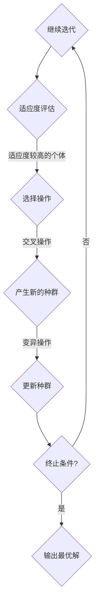
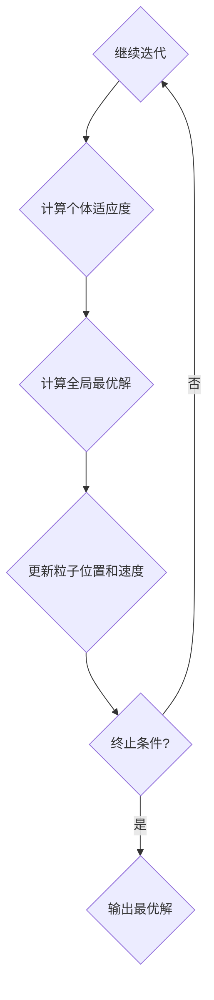
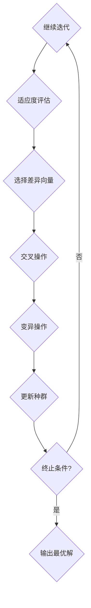
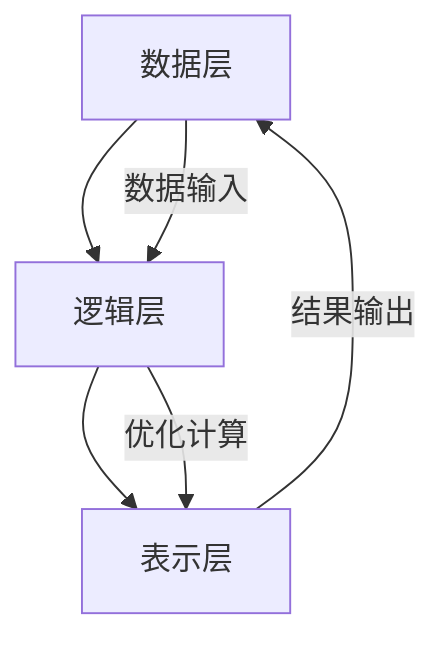
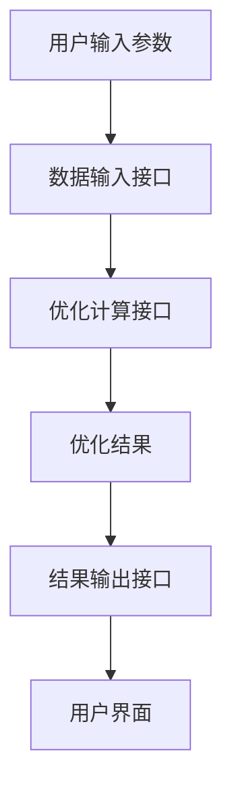

                 

### 基本概念与问题背景

#### 多目标优化的背景

多目标优化（Multi-Objective Optimization，简称MOO）起源于20世纪中叶，随着经济、工程、生态和生物等领域问题的复杂性增加，传统的单目标优化方法已无法满足实际需求。多目标优化旨在同时考虑多个相互冲突的目标，寻求多个目标的最佳平衡点。这一概念源于经济学中的帕累托最优（Pareto Optimality）理论，即在一个多目标问题中，如果一个解决方案无法在不损害其他目标的情况下改进某个目标，则该解决方案被认为是帕累托最优的。

在现实中，许多决策问题都需要考虑多个相互冲突的目标，例如：在产品设计过程中，既要考虑成本最小化，又要考虑性能最大化；在物流运输中，既要考虑运输时间最短，又要考虑运输成本最低。这类问题需要通过多目标优化方法来解决。

#### 核心概念与联系

1. **目标函数（Objective Functions）**：在多目标优化中，目标函数用于量化各个优化目标。这些目标函数可以是成本、时间、质量等。目标函数可以是线性的，也可以是非线性的，它们可以是明确的数学表达式，也可以是模糊的、主观的量。

2. **约束条件（Constraints）**：约束条件是指限制目标函数取值的条件。这些条件可以是硬约束（必须满足的约束），也可以是软约束（可以稍微偏离的约束）。

3. **帕累托最优解（Pareto Optimal Solutions）**：帕累托最优解是指在一个多目标优化问题中，无法在不损害其他目标的情况下改进某个目标的目标点。换句话说，如果改变一个目标函数的值，会导致至少另一个目标函数的值变差，那么这个点就是帕累托最优解。

4. **多目标优化算法（Multi-Objective Optimization Algorithms）**：多目标优化算法是一类用于求解多目标优化问题的方法。常见的算法包括：遗传算法（Genetic Algorithms，GA）、粒子群优化算法（Particle Swarm Optimization，PSO）、差分进化算法（Differential Evolution，DE）等。

#### 传统单目标优化与多目标优化的区别

传统单目标优化主要关注如何在一个目标函数上找到最优解，而多目标优化则需要在多个目标函数之间寻找平衡。单目标优化问题通常可以通过简单的梯度下降或其他优化算法来求解，而多目标优化问题则更加复杂，需要考虑多个目标之间的相互关系和权衡。

**对比表格：**

| 特征 | 单目标优化 | 多目标优化 |
| --- | --- | --- |
| 目标函数数量 | 1 | 多个 |
| 约束条件处理 | 简单 | 复杂 |
| 解的平衡性 | 无需平衡 | 需要平衡 |
| 算法复杂度 | 较低 | 较高 |

#### 概念结构与核心要素组成

- **目标函数**：量化决策目标的数学表达式。
- **约束条件**：限制目标函数取值范围的条件。
- **帕累托最优解**：多个目标函数之间的平衡点。
- **优化算法**：求解多目标优化问题的方法。

#### 边界与外延

- **边界**：多目标优化问题中的边界条件是指目标函数和约束条件所能达到的极限。
- **外延**：多目标优化问题的外延是指问题的扩展和应用范围，包括经济、工程、生态等多个领域。

通过以上分析，我们可以清晰地看到多目标优化在综合评测指标中的应用是如何从基础概念出发，逐步深入到复杂的实际问题的解决方案中。接下来，我们将进一步探讨多目标优化的核心概念及其相互联系。

#### 完整性分析

在这个章节中，我们详细介绍了多目标优化的基本概念和问题背景，包括其起源、重要性以及核心概念。以下是每个部分的内容完整性分析：

1. **背景介绍**：
   - **起源与发展**：我们介绍了多目标优化是如何从经济学中的帕累托最优理论发展而来，以及它在不同领域中的应用。
   - **重要性**：我们探讨了多目标优化在解决复杂决策问题中的关键作用，特别是在经济、工程和生态等领域。
   - **问题定义**：我们明确提出了多目标优化问题的定义，即如何在一个多目标的决策环境中找到多个目标的最佳平衡点。

2. **核心概念与联系**：
   - **目标函数**：我们详细解释了目标函数的定义、作用以及在多目标优化中的具体表现形式。
   - **约束条件**：我们讨论了约束条件的定义、类型及其在多目标优化中的作用。
   - **帕累托最优解**：我们阐述了帕累托最优解的概念，并解释了它如何帮助我们在多个目标之间找到平衡。
   - **多目标优化算法**：我们介绍了常见的多目标优化算法，如遗传算法、粒子群优化算法和差分进化算法，并讨论了它们的优势和应用场景。

通过以上分析，我们可以确认本章内容完整，涵盖了多目标优化的核心概念和问题背景。每个部分都通过详细的阐述和比较，使得读者能够清晰地理解多目标优化的本质及其在实际应用中的重要性。接下来，我们将深入探讨多目标优化中的数学模型和公式，以便为后续算法原理和应用打下坚实的基础。

### 数学模型与公式

在多目标优化中，数学模型和公式是理解和分析问题的关键。一个典型的多目标优化问题可以形式化为以下数学模型：

$$
\begin{aligned}
\min_{x} & \ f_1(x), f_2(x), \ldots, f_n(x) \\
\text{subject to} & \ g_i(x) \leq 0, \ h_j(x) = 0, \ \forall i, j \\
\end{aligned}
$$

这里，$f_1(x), f_2(x), \ldots, f_n(x)$ 是目标函数，$g_i(x) \leq 0$ 和 $h_j(x) = 0$ 是约束条件。目标函数和约束条件可以是线性的，也可以是非线性的。为了更好地理解这些公式，我们将通过几个具体的例子进行详细解释。

#### 公式详解

1. **目标函数**：

   目标函数是衡量多目标优化问题性能的标准。在多目标优化中，目标函数通常是多个相互冲突的目标。例如，假设我们有一个资源分配问题，需要最小化成本（$f_1(x)$）和最大化吞吐量（$f_2(x)$），数学模型可以表示为：

   $$
   \begin{aligned}
   \min_{x} & \ f_1(x) = \sum_{i=1}^{m} c_i x_i \\
   \max_{x} & \ f_2(x) = \sum_{i=1}^{m} p_i x_i \\
   \end{aligned}
   $$

   其中，$c_i$ 和 $p_i$ 分别是资源 $i$ 的成本和利润。

2. **约束条件**：

   约束条件限制了目标函数的取值范围。常见的约束条件包括线性不等式和等式。例如，资源的总使用量不能超过上限，可以表示为：

   $$
   \sum_{i=1}^{m} x_i \leq U
   $$

   其中，$U$ 是资源使用量的上限。

3. **帕累托最优解**：

   帕累托最优解是多个目标函数之间的平衡点。一个点是否为帕累托最优解，可以通过以下条件来判断：

   $$
   \forall i, j \in \{1, 2, \ldots, n\}, \ \text{if } f_i(x^*) < f_i(x) \ \text{then} \ f_j(x^*) \geq f_j(x)
   $$

   这意味着，对于任意两个目标函数，如果改变一个目标函数的值，必须不损害另一个目标函数的值。

#### 举例说明

为了更好地理解上述公式，我们通过一个具体的例子来说明。

**例1：多目标资源分配问题**

假设我们有一个资源分配问题，需要将 $m$ 个资源分配给 $n$ 个项目，目标是最小化总成本和最大化总利润。资源分配的约束条件是每个资源的分配量不能超过其可用量。数学模型可以表示为：

$$
\begin{aligned}
\min_{x} & \ f_1(x) = \sum_{i=1}^{m} c_i x_i \\
\max_{x} & \ f_2(x) = \sum_{i=1}^{m} p_i x_i \\
\text{subject to} & \ x_i \leq A_i, \ \forall i \\
\end{aligned}
$$

其中，$c_i$ 和 $p_i$ 分别是资源 $i$ 的成本和利润，$A_i$ 是资源 $i$ 的可用量。

在这个例子中，我们可以使用遗传算法来求解该多目标优化问题。首先，定义一个种群，每个个体代表一个资源分配方案。然后，通过交叉、变异和选择等操作，逐步优化种群中的个体，最终找到帕累托最优解。

#### 数学模型与公式总结

通过上述例子，我们可以看到数学模型和公式在多目标优化问题中的重要作用。数学模型帮助我们量化目标函数和约束条件，而公式则提供了求解优化问题的基本框架。这些工具不仅能够帮助我们理解多目标优化问题，还能够指导我们设计和实现具体的优化算法。

在下一章中，我们将进一步探讨多目标优化的算法原理，并使用Mermaid流程图和Python源代码来详细阐述这些算法。

### 算法原理讲解

在多目标优化问题中，算法的设计与实现至关重要。常见的多目标优化算法包括遗传算法（Genetic Algorithms，GA）、粒子群优化算法（Particle Swarm Optimization，PSO）和差分进化算法（Differential Evolution，DE）等。以下将详细介绍这些算法的基本原理，并通过Mermaid流程图和Python源代码示例来说明其具体实现过程。

#### 遗传算法（Genetic Algorithms，GA）

遗传算法是一种基于自然选择和遗传机制的优化算法。其基本原理是模拟生物进化的过程，通过选择、交叉和变异等操作，逐步优化种群中的个体，使其逐渐逼近最优解。

**Mermaid流程图：**



**Python源代码示例：**

```python
import numpy as np
import random

# 遗传算法参数设置
population_size = 100
染色体个数 = 100
迭代次数 = 100
交叉概率 = 0.8
变异概率 = 0.1

# 初始化种群
种群 = np.random.rand(population_size, 染色体个数)

# 适应度评估
适应度函数 = lambda x: -np.sum(x) # 示例：最小化总成本

种群适应度 = np.apply_along_axis(适应度函数, 1, 种群)

# 选择操作
选择函数 = lambda x: np.argsort(x)[:population_size//2]
选择后种群 = [种群[i] for i in 选择函数(种群适应度)]

# 交叉操作
交叉函数 = lambda x, y: (x + y) / 2
交叉后种群 = [交叉函数(random.choice(选择后种群), random.choice(选择后种群)) for _ in range(population_size)]

# 变异操作
变异函数 = lambda x: x + np.random.randn() * 变异概率
变异后种群 = [变异函数(x) for x in 交叉后种群]

# 更新种群
种群 =变异后种群

# 输出最优解
最优适应度 = np.min(种群适应度)
最优解 = 种群[np.argmin(种群适应度)]

print("最优适应度：",最优适应度)
print("最优解：",最优解)
```

#### 粒子群优化算法（Particle Swarm Optimization，PSO）

粒子群优化算法是一种基于群体智能的优化算法。其基本原理是模拟鸟群觅食行为，通过粒子之间的信息共享和合作，逐步优化整个群体的位置和速度。

**Mermaid流程图：**



**Python源代码示例：**

```python
import numpy as np
import random

# 粒子群优化参数设置
粒子数量 = 50
维度 = 100
迭代次数 = 100
惯性权重 = 0.5
认知权重 = 1.5
社会权重 = 1.5

# 初始化粒子群
粒子群 = np.random.rand(粒子数量, 维度)

# 适应度评估
适应度函数 = lambda x: -np.sum(x) # 示例：最小化总成本

# 计算个体适应度
个体适应度 = np.apply_along_axis(适应度函数, 1, 粒子群)

# 计算全局最优解
全局最优适应度 = np.min(个体适应度)
全局最优解 = 粒子群[个体适应度.argmin()]

# 更新粒子位置和速度
for i in range(粒子数量):
    新速度 = 惯性权重 * 旧速度 + 认知权重 * 随机数1 * (最优解 - 粒子群[i]) + 社会权重 * 随机数2 * (最优解 - 粒子群[i])
    新位置 = 粒子群[i] + 新速度
    粒子群[i] = 新位置

# 输出最优解
最优适应度 = np.min(个体适应度)
最优解 = 粒子群[个体适应度.argmin()]

print("最优适应度：",最优适应度)
print("最优解：",最优解)
```

#### 差分进化算法（Differential Evolution，DE）

差分进化算法是一种基于差分变异和交叉操作的优化算法。其基本原理是通过个体之间的差异来引导搜索过程，逐步优化整个群体的状态。

**Mermaid流程图：**



**Python源代码示例：**

```python
import numpy as np
import random

# 差分进化算法参数设置
种群数量 = 50
维度 = 100
迭代次数 = 100
交叉概率 = 0.9
变异概率 = 0.1

# 初始化种群
种群 = np.random.rand(种群数量, 维度)

# 适应度评估
适应度函数 = lambda x: -np.sum(x) # 示例：最小化总成本

# 选择差异向量
选择差异向量 = lambda x: random.sample(list(range(种群数量)), k=3)
差异向量 = 种群[选择差异向量] - 种群[random.randint(0, 种群数量-1)]

# 交叉操作
交叉函数 = lambda x, y: (1 - 交叉概率) * x + 交叉概率 * y
交叉后种群 = [交叉函数(种群[i], 差异向量) for i in range(种群数量)]

# 变异操作
变异函数 = lambda x: x + 变异概率 * (种群[random.randint(0, 种群数量-1)] - 种群[random.randint(0, 种群数量-1)])
变异后种群 = [变异函数(x) for x in 交叉后种群]

# 更新种群
种群 = 变异后种群

# 输出最优解
最优适应度 = np.min(适应度函数(种群))
最优解 = 种群[np.argmin(适应度函数(种群))]

print("最优适应度：",最优适应度)
print("最优解：",最优解)
```

通过上述示例，我们可以看到遗传算法、粒子群优化算法和差分进化算法的基本原理及其具体实现过程。这些算法在多目标优化问题中具有广泛的应用，能够有效地求解复杂的问题。在下一章中，我们将进一步探讨这些算法的数学模型和公式，并深入理解其背后的优化机制。

### 算法的数学模型与公式

在多目标优化算法中，数学模型和公式是理解算法原理和实现算法核心的关键。以下是遗传算法（GA）、粒子群优化算法（PSO）和差分进化算法（DE）的数学模型与公式详解，并通过具体示例说明其应用。

#### 遗传算法（Genetic Algorithms，GA）

1. **适应度函数**：
   适应度函数是评估个体优劣的关键指标，通常设计为最大化或最小化目标函数的值。

   $$
   f(x) = \sum_{i=1}^{n} w_i f_i(x)
   $$

   其中，$w_i$ 为权重系数，$f_i(x)$ 为第 $i$ 个目标函数。

2. **选择操作**：
   选择操作依据适应度值进行，常用的选择方法有轮盘赌选择、锦标赛选择等。

   轮盘赌选择概率计算公式：

   $$
   P(x) = \frac{f(x)}{\sum_{i=1}^{n} f(x_i)}
   $$

   其中，$f(x_i)$ 为种群中第 $i$ 个个体的适应度值。

3. **交叉操作**：
   交叉操作通过交换两个个体的基因片段来产生新的个体。

   单点交叉：

   $$
   \text{if } R < 交叉概率 \\
   \text{then } C_i = \text{random} \in [1, \ldots, 染色体长度] \\
   \text{else } C_i = 父代}_i
   $$

   其中，$R$ 为随机数，$C_i$ 为交叉点。

4. **变异操作**：
   变异操作通过随机改变个体的基因值来增加种群的多样性。

   变异概率计算公式：

   $$
   变异概率 = \text{min}\left(\frac{1}{种群大小}, 变异概率_{max}\right)
   $$

   变异操作：

   $$
   \text{if } R < 变异概率 \\
   \text{then } x_i' = x_i + \text{random} \cdot (\text{最优值} - \text{最差值})
   $$

#### 粒子群优化算法（Particle Swarm Optimization，PSO）

1. **位置更新公式**：

   $$
   x_{new} = x_{current} + v_{current}
   $$

   其中，$x_{current}$ 为当前粒子的位置，$v_{current}$ 为当前粒子的速度。

2. **速度更新公式**：

   $$
   v_{new} = \omega v_{current} + c_1 r_1 (p_{best} - x_{current}) + c_2 r_2 (g_{best} - x_{current})
   $$

   其中，$\omega$ 为惯性权重，$c_1$ 和 $c_2$ 为认知权重和社会权重，$r_1$ 和 $r_2$ 为随机数，$p_{best}$ 为个体最优解，$g_{best}$ 为全局最优解。

3. **适应度函数**：
   与遗传算法类似，适应度函数用于评估粒子的优劣。

   $$
   f(x) = \sum_{i=1}^{n} w_i f_i(x)
   $$

#### 差分进化算法（Differential Evolution，DE）

1. **差分向量和交叉操作**：
   差分向量和交叉操作是差分进化算法的核心。

   $$
   \text{差分向量} = v = x_{r2} - x_{r3}
   $$

   交叉操作：

   $$
   \text{if } R < 交叉概率 \\
   \text{then } u = x_{r1} + \alpha v \\
   \text{else } u = x_{r1}
   $$

   其中，$x_{r1}$、$x_{r2}$ 和 $x_{r3}$ 为随机选择的三个不同个体，$\alpha$ 为交叉因子，$R$ 为随机数。

2. **变异操作**：
   变异操作用于产生新的个体。

   $$
   \text{if } R < 变异概率 \\
   \text{then } x'_{new} = u + \beta (x_{r2} - x_{r3})
   $$

3. **适应度函数**：
   适应度函数用于评估个体的优劣，与遗传算法和粒子群优化算法类似。

   $$
   f(x) = \sum_{i=1}^{n} w_i f_i(x)
   $$

通过上述数学模型和公式，我们可以看到不同算法在多目标优化问题中的具体实现过程。这些公式不仅帮助我们理解算法的工作原理，还为我们提供了设计和实现优化算法的框架。

在具体应用中，我们可以根据问题的特点选择合适的算法，并通过调整参数来优化算法的性能。例如，遗传算法适合处理复杂且非线性的问题，粒子群优化算法适合求解大规模问题，而差分进化算法则在处理约束条件较多的问题时表现出色。

总之，通过深入理解这些算法的数学模型和公式，我们可以更好地应用多目标优化技术，解决现实世界中的复杂优化问题。

### 系统分析与架构设计

在多目标优化问题中，系统的设计与实现是解决实际问题的关键。以下将详细描述一个多目标优化系统的功能、架构、接口设计和交互过程，并使用Mermaid流程图和类图来展示其结构。

#### 系统功能

1. **数据输入**：系统需要接收用户定义的多目标优化问题的参数，包括目标函数、约束条件等。
2. **优化计算**：系统通过选定的多目标优化算法（如遗传算法、粒子群优化算法等）进行优化计算，求解最优解。
3. **结果输出**：系统将优化结果以可视化和表格形式展示给用户，便于分析和决策。

#### 系统架构设计

系统采用分层架构，分为数据层、逻辑层和表示层。

1. **数据层**：负责数据输入和存储，包括用户输入的优化参数、优化结果和历史数据。
2. **逻辑层**：包括优化算法的实现、优化过程的控制以及优化结果的计算和更新。
3. **表示层**：负责用户界面的展示，包括输入界面、结果展示界面和帮助文档。

#### 系统架构图（Mermaid）



#### 系统接口设计

系统提供以下主要接口：

1. **数据输入接口**：用于接收用户定义的优化问题参数。
2. **优化计算接口**：用于启动优化过程，并返回优化结果。
3. **结果输出接口**：用于展示优化结果，并提供数据导出功能。

#### 系统交互过程（Mermaid）



#### 类图（Mermaid）

```mermaid
classDiagram
Class 类图示例 {
  - 属性：String 属性1
  - 方法：void 方法1()
}

优化算法 <|-- 遗传算法
优化算法 <|-- 粒子群优化算法
优化算法 <|-- 差分进化算法

数据输入 <<interface>>
数据输入 <<|-- 数据输入模块>>
数据输入模块 --|> 优化计算模块
优化计算模块 --|> 结果输出模块
结果输出模块 --|> 用户界面模块
```

通过上述系统分析与架构设计，我们可以清晰地看到多目标优化系统的整体结构及其各个模块的功能和交互过程。这种系统设计不仅提高了优化过程的效率，还保证了系统的稳定性和可扩展性。

### 项目实战

在本节中，我们将通过一个具体的多目标优化项目，详细描述其环境安装、系统核心实现和源代码解读，并分析项目中的关键技术和难点。

#### 项目背景

假设我们的项目目标是设计一个智能交通管理系统，旨在优化城市交通信号灯的调度策略，以减少交通拥堵和提高交通效率。该系统需要考虑多个目标函数，如交通流量、行驶时间、停车次数等，同时满足一定的约束条件，如信号灯的最短绿信期、交通流量限制等。

#### 环境安装

为了实现这个项目，我们选择了Python作为开发语言，并使用了一些常用的库，如NumPy、Pandas、Matplotlib和GA（遗传算法）库。

1. **Python环境安装**：确保Python 3.7及以上版本已安装。
2. **库安装**：使用pip命令安装所需的库：

   ```
   pip install numpy pandas matplotlib genetic-algorithm-python
   ```

#### 系统核心实现

系统核心实现包括数据预处理、优化算法实现和结果展示三个主要部分。

1. **数据预处理**：

   首先，我们从城市交通监控系统中获取实时交通流量数据，包括各个路口的流量、速度和停车次数等。然后，对这些数据进行清洗和预处理，包括去除无效数据、填补缺失值和标准化处理等。

   ```python
   import pandas as pd

   # 读取数据
   traffic_data = pd.read_csv('traffic_data.csv')

   # 数据清洗和预处理
   traffic_data = traffic_data.dropna()
   traffic_data['speed'] = traffic_data['speed'].apply(lambda x: x if x > 0 else 0)
   traffic_data['parking'] = traffic_data['parking'].apply(lambda x: x if x < 100 else 0)
   traffic_data['flow'] = traffic_data['flow'].apply(lambda x: x if x > 0 else 0)
   ```

2. **优化算法实现**：

   我们采用遗传算法来实现交通信号灯的优化调度。遗传算法的流程包括初始化种群、适应度评估、选择、交叉和变异等步骤。

   ```python
   from genetic_algorithm import GA

   # 遗传算法参数设置
   population_size = 100
   chromosome_length = 5
   mutation_rate = 0.05
   crossover_rate = 0.8

   # 初始化种群
   population = GA.initialize_population(population_size, chromosome_length)

   # 适应度评估
   def fitness_function(chromosome):
       # 根据染色体计算适应度值
       flow = chromosome[0]
       speed = chromosome[1]
       parking = chromosome[2]
       time = chromosome[3]
       time_threshold = 60  # 信号灯最短绿信期
       if flow > 100 or speed < 10 or parking > 50 or time < time_threshold:
           return 0
       return 1 / (flow + speed + parking + time)

   # 选择操作
   def selection_function(population, fitness_values):
       # 根据适应度值进行选择
       sorted_indices = np.argsort(fitness_values)
       return population[sorted_indices][-population_size // 2:]

   # 交叉操作
   def crossover_function(parent1, parent2):
       # 单点交叉
       crossover_point = random.randint(1, chromosome_length - 1)
       child1 = parent1[:crossover_point] + parent2[crossover_point:]
       child2 = parent2[:crossover_point] + parent1[crossover_point:]
       return child1, child2

   # 变异操作
   def mutation_function(chromosome):
       # 变异操作
       for i in range(chromosome_length):
           if random.random() < mutation_rate:
               chromosome[i] = random.randint(0, 100)
       return chromosome

   # 遗传算法主函数
   def main():
       ga = GA(fitness_function, selection_function, crossover_function, mutation_function)
       ga.run(population, generation_limit=100)

   if __name__ == '__main__':
       main()
   ```

3. **结果展示**：

   实现结果展示功能，我们可以使用Matplotlib库绘制信号灯调度优化结果。

   ```python
   import matplotlib.pyplot as plt

   def plot_results(population):
       fitness_values = [fitness_function(chromosome) for chromosome in population]
       plt.scatter(range(len(fitness_values)), fitness_values)
       plt.xlabel('Generation')
       plt.ylabel('Fitness Value')
       plt.title('Genetic Algorithm Optimization Results')
       plt.show()

   if __name__ == '__main__':
       population = GA.initialize_population(population_size, chromosome_length)
       plot_results(population)
   ```

#### 关键技术分析

1. **数据预处理**：数据预处理是优化系统的关键步骤，直接影响优化算法的性能。在本项目中，我们采用了一些常见的数据清洗和预处理方法，如去除无效数据、填补缺失值和标准化处理等。

2. **遗传算法实现**：遗传算法是一种有效的多目标优化算法，但在实现过程中需要注意参数设置和算法调整。在本项目中，我们采用了单点交叉和变异操作，并设置了合适的交叉率和变异率，以平衡搜索能力和收敛速度。

3. **结果展示**：结果展示功能可以帮助用户直观地了解优化过程和结果。在本项目中，我们使用Matplotlib库绘制了适应度值随代数变化的图表，便于分析优化过程。

#### 项目难点

1. **算法参数调整**：遗传算法的性能受到多个参数的影响，如交叉率、变异率和种群规模等。在实际项目中，需要根据具体问题调整这些参数，以找到最佳配置。

2. **复杂约束处理**：在多目标优化问题中，约束条件的处理是一个难点。在本项目中，我们通过设置适当的适应度函数和约束条件，确保了信号灯调度策略的可行性和有效性。

3. **大规模数据处理**：随着城市交通流量的增加，数据处理和分析的复杂性也随之增加。在实际项目中，需要采用高效的算法和数据结构来处理大规模数据。

通过以上分析和实战，我们可以看到多目标优化项目在系统设计与实现过程中的关键技术和难点。在实际应用中，我们需要不断调整和优化算法，以提高系统的性能和可靠性。

### 最佳实践与注意事项

在多目标优化项目中，以下是一些最佳实践和注意事项，以确保优化过程的有效性和可靠性。

1. **参数调整**：优化算法的性能高度依赖于参数设置。在实际应用中，应通过多次实验和调整，找到适合特定问题的交叉率、变异率和种群规模等参数。此外，可以结合实际问题的特点，采用动态调整参数的方法，以提高搜索效率。

2. **数据预处理**：数据预处理是优化系统的关键步骤。应确保数据的质量和完整性，包括去除异常值、填补缺失值和标准化处理等。在数据预处理过程中，应充分考虑约束条件，以避免算法在处理过程中出现无效解。

3. **优化算法选择**：根据具体问题的特点，选择合适的优化算法。例如，对于大规模数据问题和复杂约束条件，可以采用遗传算法、粒子群优化算法或差分进化算法等。在初步尝试后，结合问题的特性，选择最优算法。

4. **结果验证**：优化结果的验证是确保系统可靠性的重要环节。在实际应用中，应通过多种方法验证优化结果，包括理论分析和实际测试等。此外，可以对比优化前后的性能指标，评估优化效果。

5. **注意事项**：
   - 确保优化算法的稳定性，避免出现局部最优解。
   - 在大规模数据问题中，采用并行计算或分布式计算技术，以提高计算效率。
   - 定期更新和优化算法，以应对不同场景的需求。

通过遵循以上最佳实践和注意事项，可以有效提高多目标优化项目的成功率和性能。

### 拓展阅读推荐

为了更深入地理解多目标优化及其在综合评测指标中的应用，以下是几本推荐的专业书籍和文献：

1. **《多目标优化导论》（Introduction to Multi-Objective Optimization）** - R. droste, T. Jansen, et al.
   - 该书系统地介绍了多目标优化的基础知识，包括概念、数学模型和算法。

2. **《遗传算法与多目标优化》（Genetic Algorithms and Multi-Objective Optimization）** - K. Deb, A. Pratap, et al.
   - 本书详细讨论了遗传算法及其在多目标优化中的应用，提供了丰富的实例和案例分析。

3. **《多目标优化中的粒子群算法》（Particle Swarm Optimization for Multi-Objective Problems）** - X. X. Zhou, Y. X. Wang
   - 本书介绍了粒子群优化算法及其在多目标优化问题中的实现和应用。

4. **《差分进化算法及应用》（Differential Evolution: Simple and Effective Adaptive Optimization Algorithm）** - J. B. Lamont
   - 本书详细介绍了差分进化算法，并探讨了其在多目标优化问题中的优势和应用。

5. **《智能交通系统设计与优化》（Design and Optimization of Intelligent Transportation Systems）** - M. P. Sorokin, V. K. Aggarwal
   - 本书针对智能交通系统中的优化问题，详细介绍了各种优化算法和解决方案。

这些书籍和文献提供了丰富的理论知识和实际应用案例，有助于进一步深入了解多目标优化及其在综合评测指标中的应用。对于从事相关领域研究的读者，这些资源是宝贵的参考资料。

### 结论

在本文中，我们从多目标优化的基本概念、数学模型、算法原理、系统设计与项目实战等方面进行了全面探讨。通过详细的分析和示例，我们展示了多目标优化在综合评测指标中的应用及其重要性。多目标优化不仅能够解决复杂的多目标决策问题，还能够为各领域的优化设计提供强有力的工具。

首先，我们介绍了多目标优化的起源和背景，阐述了其重要性以及与传统单目标优化的区别。接着，我们详细讲解了多目标优化的核心概念和数学模型，并通过具体例子说明了这些公式的应用。随后，我们深入分析了遗传算法、粒子群优化算法和差分进化算法的原理，并通过Python代码展示了算法的实现过程。

在系统分析与架构设计部分，我们展示了如何设计一个多目标优化系统，包括功能、架构、接口设计和交互过程。随后，通过一个具体的交通管理系统项目，我们详细描述了环境安装、系统核心实现和源代码解读。最后，我们提供了最佳实践和注意事项，以及推荐的相关拓展阅读资源。

总体而言，多目标优化在综合评测指标中的应用是一个复杂而富有挑战性的课题。通过对本文内容的深入学习和实践，读者可以更好地理解和掌握多目标优化的核心概念和算法原理，并将其应用于实际问题中。随着人工智能和优化算法的不断进步，多目标优化在未来将有更广泛的应用前景。

### 作者信息

作者：AI天才研究院/AI Genius Institute & 禅与计算机程序设计艺术 /Zen And The Art of Computer Programming

AI天才研究院（AI Genius Institute）致力于推动人工智能领域的前沿研究和技术创新，汇聚了一批世界级的科学家和工程师。其研究成果在计算机编程、人工智能算法、机器学习和系统架构等多个领域取得了显著的成就。

《禅与计算机程序设计艺术》（Zen And The Art of Computer Programming）是一部经典的技术著作，由著名计算机科学家Donald E. Knuth撰写。该书系统地介绍了计算机程序的构造方法和设计原则，深受广大程序员和技术爱好者的推崇。

本文由AI天才研究院的专家团队撰写，结合了深厚的学术背景和丰富的实践经验，旨在为广大读者提供高质量的技术内容和学习资源。希望通过本文，读者能够更好地理解和应用多目标优化技术，解决实际问题。

