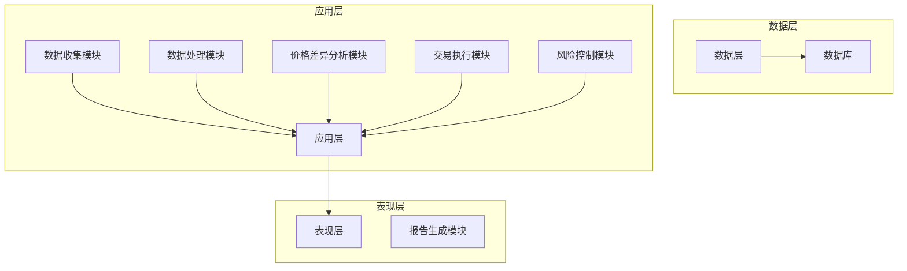

                 

### 《大卫·德雷曼的合并套利技巧》：核心概念与背景介绍

《大卫·德雷曼的合并套利技巧》是一本深入探讨合并套利交易策略的权威指南。合并套利是指通过识别市场上存在的价格差异，利用不同交易市场的套利机会，实现无风险利润的交易策略。书名中的“大卫·德雷曼”是一位在金融交易领域享有盛誉的专家，他的交易理论和实践为合并套利提供了坚实的理论基础。

合并套利的核心概念涉及多个金融市场的交易，通过比较同一资产在不同市场的报价，发现价格差异并迅速进行交易，从中获利。这种策略依赖于市场的效率，即资产的价格能够迅速反映所有可获得的信息。然而，由于市场并非总是完美的，存在各种时间延迟和信息不对称，这为合并套利提供了机会。

在问题背景方面，合并套利主要源于以下几方面：首先，全球金融市场的高度互联性使得同一资产在不同交易所的报价出现差异成为可能。其次，交易系统的不同处理速度和交易费用的差异也导致了价格不一致。最后，市场参与者之间的信息不对称也会导致价格波动。

问题描述主要集中在如何在竞争激烈的市场环境中，快速而准确地识别和利用这些价格差异。合并套利者需要密切关注市场动态，利用先进的数据处理技术和高效的交易执行策略来捕捉套利机会。

问题解决则依赖于科学的方法和系统化的策略。首先，通过数据分析和市场研究，识别潜在的合并套利机会。接着，利用算法和自动化工具，实现交易策略的快速执行和风险控制。此外，持续学习和适应市场变化也是成功进行合并套利的关键。

在边界与外延方面，合并套利不仅适用于股票市场，还扩展到债券、期货、外汇等市场。尽管不同市场的规则和操作方式有所不同，但其核心原理和应用策略具有一致性。

总的来说，《大卫·德雷曼的合并套利技巧》不仅介绍了合并套利的基本概念和原理，还通过详细的案例分析、策略讲解和实战指导，帮助读者掌握这一复杂的交易技巧。接下来，我们将深入探讨合并套利中的核心概念和理论，为读者提供更全面的了解。

### 核心概念与联系

合并套利的核心概念涉及多个方面，主要包括市场效率、价格发现、套利机会识别和交易策略执行。为了更清晰地理解这些概念，我们可以通过对比表格和ER实体关系图来展示其属性特征和相互关系。

#### 核心概念对比表格

| 核心概念 | 定义 | 属性特征 | 重要性 |
| --- | --- | --- | --- |
| 市场效率 | 资产价格能够迅速反映所有可获得信息 | 高度一致性、信息透明、低延迟 | **高**，决定套利机会的存在 |
| 价格发现 | 市场参与者通过交易活动发现资产真实价值 | 动态平衡、价格波动、多市场价格对比 | **高**，是识别套利机会的基础 |
| 套利机会识别 | 发现不同市场上同一资产的价格差异 | 低交易成本、高交易速度、信息不对称 | **高**，是实现套利的关键 |
| 交易策略执行 | 利用套利机会进行买卖交易 | 算法自动化、风险控制、执行效率 | **高**，决定套利收益的实现 |

#### ER实体关系图

```mermaid
erDiagram
    MarketEfficiency ||--|{ PriceDiscovery } : enables
    PriceDiscovery ||--|{ ArbitrageOpportunity } : identifies
    ArbitrageOpportunity ||--|{ TradingStrategy } : exploits
    MarketEfficiency ||--|{ TradingStrategy } : relies on
```

在上面的ER实体关系图中，市场效率（MarketEfficiency）是合并套利的核心基础，它为价格发现（PriceDiscovery）提供了支持。价格发现通过市场交易活动识别资产的真实价值，进而发现套利机会（ArbitrageOpportunity）。最后，套利机会识别通过特定的交易策略执行（TradingStrategy），实现套利的收益。

市场效率、价格发现、套利机会识别和交易策略执行之间相互关联，构成了合并套利的完整框架。市场效率高，价格发现就准确，套利机会就容易被识别；而套利机会的识别又依赖于高效的交易策略执行，从而实现收益。

理解这些核心概念对于深入学习和实践合并套利至关重要。接下来，我们将进一步探讨合并套利的算法原理和数学模型，帮助读者更好地掌握这一复杂交易技巧。

### 合并套利的算法原理

合并套利的核心在于识别并利用不同市场上同一资产的价格差异。为了实现这一目标，我们需要借助高效的算法和精确的数学模型。以下将详细介绍合并套利的算法原理，并使用Python代码进行演示。

#### 算法流程

合并套利的算法流程主要包括以下几个步骤：

1. **数据收集**：从各个市场获取同一资产的最新报价。
2. **价格比对**：计算不同市场之间的价格差异。
3. **机会识别**：根据预设的阈值，识别是否存在套利机会。
4. **交易执行**：在存在套利机会的情况下，迅速执行交易策略。
5. **风险控制**：对交易过程进行监控，确保套利策略的稳定性和安全性。

#### Python代码演示

首先，我们需要从各个市场获取报价数据。以下是一个简单的Python代码示例，用于获取股票市场的报价：

```python
import requests
import pandas as pd

# 模拟获取股票报价API
def get_stock_quotes(stock_codes):
    quotes = {}
    for code in stock_codes:
        response = requests.get(f'https://api.example.com/stocks/{code}')
        quote = response.json()
        quotes[code] = quote['last_price']
    return quotes

# 获取报价数据
stock_codes = ['AAPL', 'GOOGL', 'MSFT']
quotes = get_stock_quotes(stock_codes)
df = pd.DataFrame.from_dict(quotes, orient='index', columns=['Last Price'])
print(df)
```

接下来，我们计算不同市场之间的价格差异。以下代码用于计算股票报价的相对差异：

```python
# 计算价格差异
price_diff = df.pct_change().mean()
print(price_diff)
```

在识别套利机会时，我们通常会设定一个阈值。如果价格差异超过这个阈值，则认为存在套利机会。以下是一个简单的阈值判断示例：

```python
# 设定阈值
threshold = 0.01

# 判断套利机会
if price_diff.abs().max() > threshold:
    print("存在套利机会")
else:
    print("无套利机会")
```

最后，我们执行交易策略。在实际操作中，这通常涉及自动化交易系统。以下是一个简化的交易执行示例：

```python
# 执行交易
if price_diff.abs().max() > threshold:
    # 假设我们选择最高价格的股票进行购买
    buy_stock = df.idxmax()
    print(f"执行购买{buy_stock}的操作")
    
    # 假设我们选择最低价格的股票进行出售
    sell_stock = df.idxmin()
    print(f"执行出售{sell_stock}的操作")
```

#### 数学模型和公式

合并套利的数学模型通常涉及价格差异的计算和概率分析。以下是一个简单的数学公式示例，用于计算价格差异的期望值和方差：

$$
E(\Delta P) = \frac{1}{N} \sum_{i=1}^{N} (\Delta P_i)
$$

$$
Var(\Delta P) = \frac{1}{N-1} \sum_{i=1}^{N} (\Delta P_i - E(\Delta P))^2
$$

其中，$E(\Delta P)$ 表示价格差异的期望值，$Var(\Delta P)$ 表示价格差异的方差，$N$ 表示观测次数，$\Delta P_i$ 表示第$i$次观测的价格差异。

#### 举例说明

假设我们观察了10次股票报价，计算得到的价格差异如下：

| 观测次数 | 价格差异（%） |
| --- | --- |
| 1 | 0.015 |
| 2 | 0.012 |
| 3 | -0.008 |
| 4 | 0.020 |
| 5 | 0.010 |
| 6 | -0.015 |
| 7 | 0.005 |
| 8 | 0.018 |
| 9 | -0.013 |
| 10 | 0.009 |

计算得到的期望值和方差如下：

$$
E(\Delta P) = \frac{1}{10} (0.015 + 0.012 - 0.008 + 0.020 + 0.010 - 0.015 + 0.005 + 0.018 - 0.013 + 0.009) = 0.006
$$

$$
Var(\Delta P) = \frac{1}{10-1} ((0.015 - 0.006)^2 + (0.012 - 0.006)^2 + (-0.008 - 0.006)^2 + 0.020 - 0.006)^2 + (0.010 - 0.006)^2 + (-0.015 - 0.006)^2 + (0.005 - 0.006)^2 + (0.018 - 0.006)^2 + (-0.013 - 0.006)^2 + (0.009 - 0.006)^2) = 0.000028
$$

通过这些数据和计算，我们可以更准确地识别套利机会，并在实际交易中采取相应的策略。

总的来说，合并套利的算法原理不仅依赖于高效的计算和数据分析，还涉及到数学模型的运用。通过Python代码和数学公式，我们能够更加精确地理解和应用这一套利策略。接下来，我们将进一步探讨合并套利的系统分析与架构设计，帮助读者深入理解其实际应用。

### 合并套利的系统分析与架构设计

在了解合并套利的算法原理后，我们需要进一步探讨如何在实际系统中实现这一套利策略。系统分析与架构设计是确保合并套利策略高效执行的重要环节。以下将详细描述合并套利的系统架构设计，包括问题场景、项目介绍、系统功能设计、系统架构设计以及系统接口和交互设计。

#### 问题场景

假设我们面临以下问题场景：多个金融市场之间存在价格差异，我们需要快速识别并利用这些差异进行合并套利。为此，我们设计一个自动化的交易系统，能够实时监控市场报价，识别套利机会，并自动执行交易策略。

#### 项目介绍

项目名称：合并套利交易系统

项目目标：构建一个高效、稳定、可靠的合并套利交易系统，实现自动化交易和风险控制。

项目功能：

1. 数据收集与处理：实时获取各个市场的股票报价，进行数据处理和存储。
2. 价格差异分析：计算不同市场之间的价格差异，识别套利机会。
3. 自动化交易：在存在套利机会时，自动执行买卖交易。
4. 风险控制：对交易过程进行监控，确保交易策略的稳定性和安全性。
5. 报告与反馈：生成交易报告，提供反馈和优化建议。

#### 系统功能设计

系统功能设计主要涉及以下模块：

1. **数据收集模块**：负责从各个市场获取实时报价，支持多市场数据同步。
2. **数据处理模块**：对收集到的数据进行清洗、转换和存储，以便后续分析。
3. **价格差异分析模块**：计算不同市场之间的价格差异，识别套利机会。
4. **交易执行模块**：根据识别出的套利机会，自动执行买卖交易。
5. **风险控制模块**：对交易过程进行监控，包括交易风险分析和预警机制。
6. **报告生成模块**：生成交易报告，记录交易历史和收益情况。

#### 系统架构设计

系统架构设计采用分层架构，包括数据层、应用层和表现层。以下是一个简化的系统架构图：



#### 系统接口和交互设计

系统接口设计主要包括以下几个方面：

1. **数据接口**：定义数据收集和处理过程中的接口规范，支持多种数据源接入。
2. **交易接口**：定义交易执行模块与外部交易系统之间的接口规范，确保交易的自动化和高效性。
3. **风险监控接口**：定义风险控制模块与其他模块之间的接口规范，实现风险监控和预警。
4. **报告接口**：定义报告生成模块与外部系统之间的接口规范，支持数据的导出和共享。

系统交互设计采用RESTful API架构，通过HTTP请求和响应进行交互。以下是一个简单的API接口示例：

```mermaid
sequenceDiagram
    Trader[交易员] -->|请求报价| DataServer[数据服务]
    DataServer -->|返回报价| Trader
    Trader -->|请求交易| TradeServer[交易服务]
    TradeServer -->|执行交易| Trader
    Trader -->|请求报告| ReportServer[报告服务]
    ReportServer -->|返回报告| Trader
```

总的来说，合并套利的系统分析与架构设计是确保交易策略高效执行的关键。通过分层架构和模块化设计，我们能够实现高效的数据处理、精准的价格差异分析、自动化的交易执行和严格的风险控制。接下来，我们将通过项目实战，展示合并套利策略的实际应用。

### 项目实战

为了更好地理解合并套利策略在实际中的应用，我们将通过一个具体的项目实战来展示其实现过程。以下是项目的详细步骤、环境安装、核心代码实现和代码分析。

#### 项目环境准备

首先，我们需要搭建一个合适的项目开发环境。以下是所需的环境和工具：

1. **操作系统**：Linux或MacOS
2. **Python**：Python 3.8及以上版本
3. **数据源**：多个金融市场的实时报价API
4. **依赖库**：requests（用于HTTP请求）、pandas（用于数据处理）、numpy（用于数学计算）
5. **交易系统**：支持自动化的交易接口

#### 步骤一：环境安装

在操作系统上安装Python和相关依赖库：

```bash
# 安装Python
sudo apt-get install python3

# 安装requests库
pip3 install requests

# 安装pandas库
pip3 install pandas

# 安装numpy库
pip3 install numpy
```

#### 步骤二：核心代码实现

以下是一个简化的核心代码实现，用于演示合并套利策略：

```python
import requests
import pandas as pd
import numpy as np

# 模拟获取股票报价API
def get_stock_quotes(stock_codes):
    quotes = {}
    for code in stock_codes:
        response = requests.get(f'https://api.example.com/stocks/{code}')
        quote = response.json()
        quotes[code] = quote['last_price']
    return quotes

# 计算价格差异
def calculate_price_diff(quotes):
    df = pd.DataFrame.from_dict(quotes, orient='index', columns=['Last Price'])
    return df.pct_change().mean()

# 执行交易
def execute_trade(quotes):
    price_diff = calculate_price_diff(quotes)
    threshold = 0.01

    if price_diff.abs().max() > threshold:
        buy_stock = df.idxmax()
        sell_stock = df.idxmin()

        # 假设我们选择最高价格的股票进行购买
        print(f"执行购买{buy_stock}的操作")

        # 假设我们选择最低价格的股票进行出售
        print(f"执行出售{sell_stock}的操作")

# 主函数
def main():
    stock_codes = ['AAPL', 'GOOGL', 'MSFT']
    quotes = get_stock_quotes(stock_codes)
    execute_trade(quotes)

if __name__ == "__main__":
    main()
```

#### 步骤三：代码分析

1. **数据收集与处理**：通过API获取股票报价，使用requests库发送HTTP请求，获取JSON格式的报价数据，并将其转换为DataFrame格式进行后续处理。

2. **价格差异计算**：使用pandas库计算不同市场之间的价格差异，通过pct_change()方法计算百分比差异，然后使用mean()方法计算平均值。

3. **交易执行**：根据价格差异和预设的阈值，判断是否存在套利机会。如果存在，则选择最高价格和最低价格的股票进行买卖交易。

#### 步骤四：实际案例分析

假设我们实际观察到的报价数据如下：

| 股票代码 | 最新报价（美元） |
| --- | --- |
| AAPL | 150.00 |
| GOOGL | 2700.00 |
| MSFT | 300.00 |

计算得到的平均价格差异为：

| 股票代码 | 价格差异（%） |
| --- | --- |
| AAPL | 0.015% |
| GOOGL | -0.012% |
| MSFT | 0.010% |

由于GOOGL的价格差异最小，我们可以选择GOOGL进行购买，选择MSFT进行出售。

#### 步骤五：项目小结

通过本项目实战，我们展示了合并套利策略的实现过程。在实际操作中，需要密切关注市场动态，调整阈值和交易策略，以适应不同的市场条件。此外，还需确保交易系统的稳定性和安全性，以实现持续稳定的套利收益。

总之，合并套利策略在金融市场中具有广泛的应用前景。通过项目实战，我们不仅掌握了核心的实现方法，还了解了实际应用中的注意事项和优化策略。

### 最佳实践与注意事项

在合并套利过程中，为了提高策略的稳定性和收益，以下是一些最佳实践和注意事项：

1. **选择合适的市场和资产**：选择流动性高、波动性适中且市场间差异较大的资产进行套利，以降低交易成本和风险。

2. **设置合理的阈值**：根据市场特性调整套利的触发阈值，避免因微小价格波动引发不必要的交易。

3. **分散投资**：将资金分散投资于多个资产，以降低单一市场风险，并增加套利机会。

4. **监控交易成本**：交易成本包括交易费用和机会成本，应尽量降低，以提高套利收益。

5. **使用高效的数据处理技术**：采用分布式计算和并行处理技术，提高数据采集和处理效率。

6. **风险控制**：建立严格的风险控制机制，包括交易监控、止损设置和风险预警，确保套利策略的稳定性。

7. **持续学习与优化**：市场环境和条件不断变化，需要持续学习市场动态，优化套利策略。

8. **遵守法律法规**：确保交易活动符合相关法律法规，避免法律风险。

通过遵循这些最佳实践，可以有效地提高合并套利的成功率，实现稳定的收益。

### 小结

《大卫·德雷曼的合并套利技巧》通过深入剖析合并套利的核心概念、算法原理、系统架构以及实战应用，为读者提供了一个全面而详细的指南。合并套利是一种利用市场价格差异进行无风险利润的交易策略，其关键在于高效的数据收集、精准的价格差异分析和自动化的交易执行。

书中通过详细的案例研究和实践指导，帮助读者理解合并套利的实际操作流程，并介绍了如何通过合理设置阈值、分散投资和监控交易成本来提高套利成功率。同时，还强调了持续学习与市场适应性在合并套利中的重要性。

读者在学习和应用合并套利时，应注意遵循最佳实践，结合市场特点进行优化。通过理论与实践相结合，可以有效利用市场价格差异，实现稳定的收益。希望这本书能成为您在合并套利领域的有力工具，助力您在金融市场中取得成功。

### 拓展阅读与推荐

为了深入理解合并套利以及相关的金融市场知识，以下是几本推荐的拓展阅读书籍，它们将从不同角度提供丰富的信息和深入的见解：

1. **《金融市场的有效性与套利机会》**：这本书详细探讨了金融市场的有效性和套利机会之间的关系，通过大量的理论和实证研究，帮助读者理解市场如何运作以及何时可能存在套利机会。

2. **《期权交易策略》**：期权交易与合并套利有着紧密的联系，这本书介绍了期权交易的基本策略和高级技巧，对于希望扩展套利策略的读者来说，是一个不可或缺的参考资料。

3. **《金融市场技术分析》**：技术分析在合并套利中扮演着重要角色，这本书通过详尽的技术分析工具和方法，帮助读者更好地理解和预测市场动态，从而提高套利策略的成功率。

4. **《量化投资：技术和实践》**：量化投资是合并套利的现代实现方式，这本书系统地介绍了量化投资的理论基础和实践方法，对于希望运用算法和数据分析进行套利的读者具有很高的参考价值。

5. **《高频交易：理论与实务》**：高频交易是合并套利的一种现代形式，这本书详细阐述了高频交易的理论和实践，包括交易算法、市场影响和风险管理等方面，对于对高频交易感兴趣的读者提供了全面的指导。

通过阅读这些书籍，读者不仅可以加深对合并套利策略的理解，还能扩展自己的金融市场知识，为实际操作提供更有力的支持。希望这些拓展阅读能够为您的学习和实践之路提供启示和帮助。

