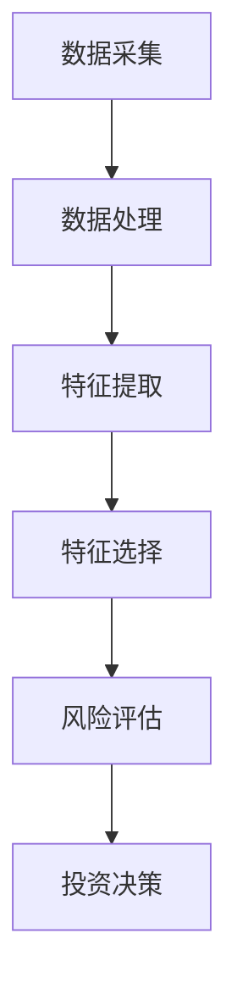

                 


**准备写作《大卫·德雷曼的地缘政治因素投资分析》**

**1. 确定文章总体结构**

首先，我们需要对文章进行整体构思，确定文章的结构。这篇文章将分为以下几个部分：

- **引言**：介绍地缘政治因素投资分析的基本概念、背景和重要性。
- **核心概念与联系**：详细阐述地缘政治因素的核心概念、属性特征以及与其他因素的联系。
- **算法原理讲解**：介绍地缘政治因素投资分析的基本算法原理，使用mermaid画出流程图，并用Python源代码进行详细讲解。
- **数学模型与公式**：使用LaTeX格式给出相关的数学模型和公式，并进行解释。
- **系统分析与架构设计方案**：介绍地缘政治因素投资分析系统的设计思路和架构，使用mermaid画出相关的类图、架构图和序列图。
- **项目实战**：介绍一个具体的地缘政治因素投资分析项目，包括环境安装、系统实现、代码解析和案例分析。
- **最佳实践与总结**：总结文章的主要观点，提供一些实用的实践建议，并对未来研究方向进行展望。

**2. 设计文章的markdown格式**

在确定文章结构后，我们需要设计markdown格式的文章。以下是文章的结构示意：

```markdown
# 大卫·德雷曼的地缘政治因素投资分析

> 关键词：地缘政治、投资分析、算法原理、数学模型、系统设计、项目实战

> 摘要：本文将从地缘政治因素投资分析的基本概念入手，详细阐述其核心概念、算法原理、数学模型和系统设计，并通过实际项目进行实战分析，最后总结最佳实践和未来研究方向。

## 引言

### 地缘政治因素投资分析的定义

### 地缘政治因素投资分析的重要性

### 本文目的与结构安排

## 核心概念与联系

### 地缘政治的定义与特征

### 地缘政治与经济的关系

### 地缘政治因素的核心要素

### 核心概念属性特征对比表格

### ER实体关系图架构的Mermaid流程图

## 算法原理讲解

### 地缘政治因素投资分析的基本算法原理

### Mermaid流程图

### Python源代码讲解

### 算法原理的数学模型和公式

### 通俗易懂地举例说明

## 数学模型与公式

### 地缘政治风险数学建模

### 影响投资收益的地缘政治因素

### 数学公式的详细讲解

## 系统分析与架构设计方案

### 问题场景介绍

### 项目介绍

### 系统功能设计（领域模型Mermaid类图）

### 系统架构设计（Mermaid架构图）

### 系统接口设计和系统交互（Mermaid序列图）

## 项目实战

### 实战环境搭建

### 系统核心实现源代码

### 代码应用解读与分析

### 实际案例分析和详细讲解剖析

### 项目小结

## 最佳实践与总结

### 最佳实践技巧

### 注意事项

### 拓展阅读与未来研究方向

## 作者信息

### 作者：AI天才研究院/AI Genius Institute & 禅与计算机程序设计艺术 /Zen And The Art of Computer Programming
```

**3. 撰写每个章节的具体内容**

接下来，我们需要根据每个章节的结构，撰写具体的内容。在撰写过程中，需要注意以下几点：

- **完整性**：每个章节的内容都要完整，不能有遗漏。
- **逻辑性**：内容要条理清晰，逻辑严谨。
- **通俗易懂**：使用简单易懂的语言进行讲解，避免使用过于专业的术语。
- **丰富性**：每个章节都要有具体的案例、数据和图表，以增强文章的实证性和可读性。

例如，在撰写“算法原理讲解”这一章节时，可以按照以下结构进行：

```markdown
## 算法原理讲解

### 地缘政治因素投资分析的基本算法原理

#### 1. 数据采集与处理

#### 2. 特征提取与选择

#### 3. 风险评估与投资决策

### Mermaid流程图



### Python源代码讲解

```python
# Python源代码示例

# 数据采集与处理
data = ...

# 特征提取与选择
features = ...

# 风险评估与投资决策
risk_score = ...
investment_decision = ...

# 输出投资决策结果
print("Investment Decision:", investment_decision)
```

### 算法原理的数学模型和公式

#### 地缘政治风险数学建模

$$
R = f(E, P, C)
$$

其中，\( R \) 表示地缘政治风险，\( E \)，\( P \)，\( C \) 分别表示地缘政治因素的三要素。

#### 影响投资收益的地缘政治因素

$$
I = \sum_{i=1}^{n} w_i \cdot r_i
$$

其中，\( I \) 表示投资收益，\( w_i \) 和 \( r_i \) 分别表示地缘政治因素 \( i \) 的权重和收益。

### 通俗易懂地举例说明

假设我们有两个地缘政治因素 \( A \) 和 \( B \)，它们的权重分别为 \( 0.5 \) 和 \( 0.5 \)。根据上述数学模型，我们可以计算出地缘政治风险 \( R \) 和投资收益 \( I \)。

$$
R = f(A, B) = 0.5 \cdot A + 0.5 \cdot B
$$

$$
I = \sum_{i=1}^{2} w_i \cdot r_i = 0.5 \cdot A + 0.5 \cdot B
$$

如果 \( A \) 和 \( B \) 的收益分别为 \( 10 \) 和 \( 20 \)，那么地缘政治风险 \( R \) 和投资收益 \( I \) 分别为：

$$
R = 0.5 \cdot 10 + 0.5 \cdot 20 = 15
$$

$$
I = 0.5 \cdot 10 + 0.5 \cdot 20 = 15
$$
```

通过这样的结构，我们可以保证文章的逻辑性和易懂性，同时使得内容丰富且具有实证性。

**4. 完成整篇文章的撰写**

在完成每个章节的撰写后，我们需要对整篇文章进行通读和修改，确保文章的逻辑性和连贯性，同时确保内容的完整性。最后，在文章末尾添加作者信息，完成整篇文章的撰写。

**5. 检查与修改**

完成初稿后，我们需要对文章进行多次检查和修改，确保文章的质量。检查的内容包括：

- **逻辑性**：确保文章的每个部分都有明确的逻辑关系，内容连贯。
- **准确性**：确保所有的数据和公式都是准确的，没有错误。
- **易懂性**：确保文章的语言通俗易懂，没有过于专业的术语。
- **完整性**：确保文章的每个部分都有完整的内容，没有遗漏。

通过以上步骤，我们可以撰写出一篇逻辑清晰、内容丰富、易懂的专业技术博客文章。

