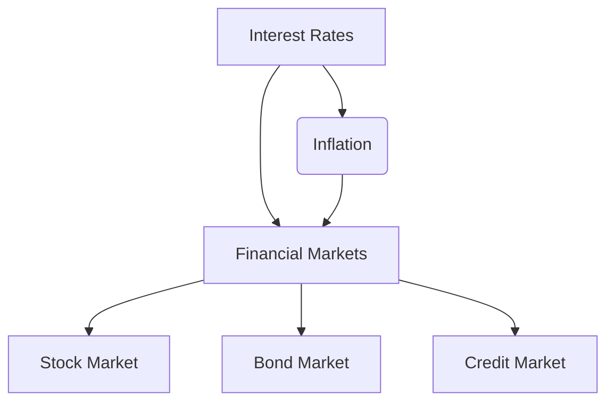
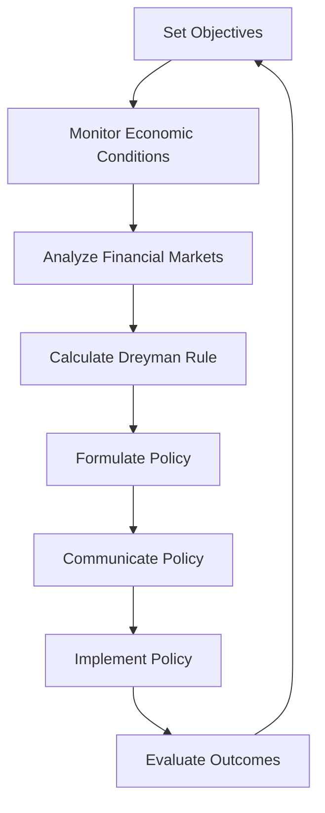
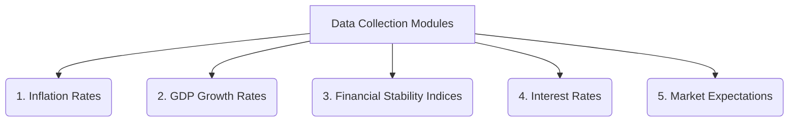
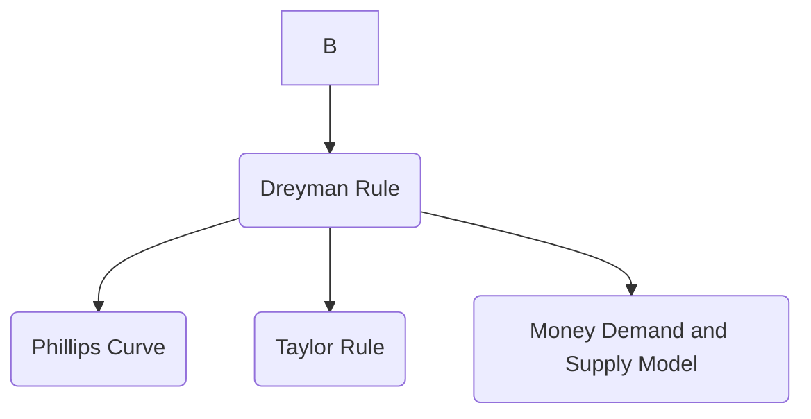
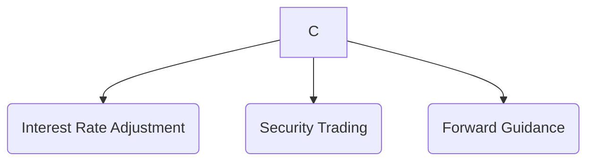
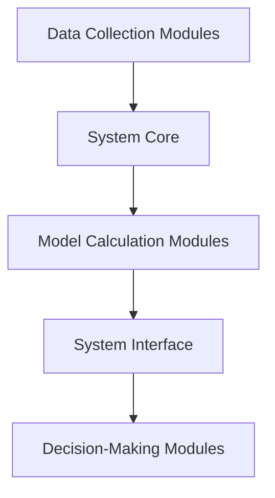
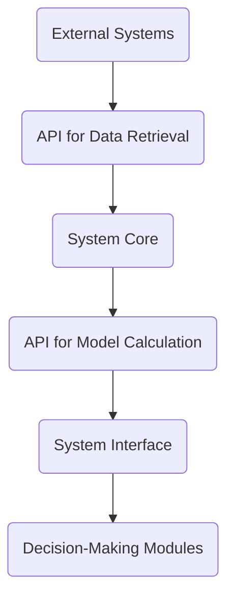
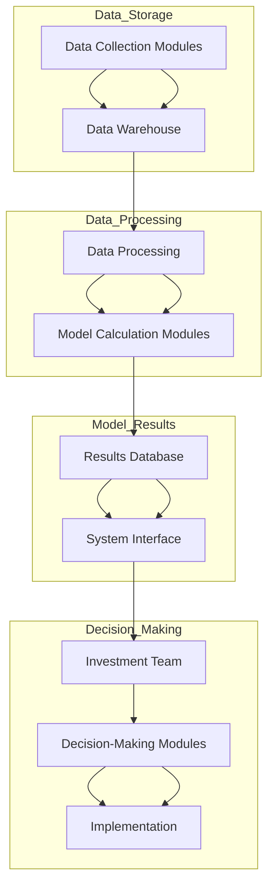

                 

## The Impact of David Dreyman's Monetary Policy on Investment

### Keywords:  
1. **Monetary Policy**  
2. **Investment**  
3. **David Dreyman**  
4. **Economic Impact**  
5. **Financial Markets**  
6. **Interest Rates**  
7. **Inflation**

### Summary:  
In this comprehensive guide, we delve into the intricate relationship between David Dreyman's monetary policy and its profound impact on the world of investment. From historical context and theoretical underpinnings to practical applications and real-world case studies, we provide a thorough analysis of how Dreyman's policy frameworks shape investment strategies. Through detailed explanations, mathematical models, and practical advice, this article aims to equip investors with the knowledge and insights needed to navigate the complexities of the financial markets and optimize their investment decisions.

## Introduction

The world of finance and investment is a dynamic and complex ecosystem, intricately linked to the broader economy through the mechanisms of monetary policy. At the forefront of this relationship stands David Dreyman, a pioneering economist and a leading figure in the field of monetary policy design and implementation. Dreyman's groundbreaking theories and practical applications have significantly influenced both the academic discourse and real-world practices in financial markets. This article aims to explore the impact of Dreyman's monetary policy on investment, dissecting its core principles and providing actionable insights for investors.

The primary objective of this article is to offer a comprehensive understanding of how Dreyman's monetary policy frameworks influence investment outcomes. We will begin by providing a historical context and background on Dreyman's contributions to the field. Following this, we will delve into the core concepts and theories that form the bedrock of his monetary policy approach. By using Mermaid diagrams and Python code snippets, we will illustrate the relationships between key variables and mechanisms, thereby providing a clear and intuitive picture of how these theories operate in practice.

Moreover, we will explore the practical applications of Dreyman's monetary policy through real-world case studies and examples. This will include a detailed examination of the effects of his policies on interest rates, inflation, and financial markets. To further enhance our understanding, we will present mathematical models and formulas that are critical to analyzing the impact of monetary policy on investment decisions. 

Additionally, we will discuss the system design and implementation aspects of integrating Dreyman's monetary policy into investment strategies. This will involve a detailed analysis of the architecture, interfaces, and interactions within the investment systems. We will also offer practical advice and best practices for investors looking to leverage Dreyman's insights in their portfolios.

Finally, the article will conclude with a summary of the key points discussed, providing a holistic view of the implications of Dreyman's monetary policy for investors. By the end of this article, readers should have a robust understanding of the intricate relationship between monetary policy and investment, equipped with the knowledge and tools to make informed investment decisions in the ever-evolving financial landscape.

### Background and Context of David Dreyman's Monetary Policy

David Dreyman is a prominent economist known for his substantial contributions to the field of monetary policy. His work has significantly influenced the design and implementation of central bank policies worldwide. Dreyman's insights and theories are rooted in a deep understanding of economic dynamics and financial markets, providing a robust framework for analyzing and predicting the impact of monetary policy decisions.

Dreyman's contributions to monetary policy can be traced back to the early 2000s, a period marked by economic volatility and financial crises. During this time, Dreyman began to develop his unique approach to monetary policy, emphasizing the importance of flexible and adaptive frameworks that can respond to changing economic conditions. His work challenged traditional monetarist views and introduced new paradigms that integrated macroeconomic stability with financial market efficiency.

One of Dreyman's key contributions is his focus on the relationship between monetary policy and financial markets. He argued that central banks should not only consider inflation and employment but also the stability of financial markets, which he believed was crucial for overall economic health. This perspective led to the development of models that incorporate both macroeconomic and financial market variables, providing a more comprehensive approach to monetary policy design.

Dreyman's theories have been particularly influential in the context of interest rate setting. He proposed that central banks should adopt a more nuanced approach to interest rate adjustments, taking into account not just inflation and growth but also the state of financial markets and potential risks. This approach is often referred to as the "Dreyman Rule," which advocates for a balance between traditional macroeconomic goals and financial stability.

Another significant contribution of Dreyman's is his emphasis on the role of expectations in monetary policy. He argued that the expectations of market participants play a critical role in shaping economic outcomes, and therefore, central banks should communicate their policies clearly to manage market expectations. This concept has been widely adopted in modern monetary policy frameworks, particularly in the form of forward guidance, where central banks provide insight into their future policy intentions.

Dreyman's work also highlighted the importance of international coordination in monetary policy. In an increasingly globalized economy, he stressed the need for central banks to work together to achieve stable and sustainable economic growth. His ideas on global monetary policy coordination have been influential in shaping international economic policies and agreements.

In summary, David Dreyman's monetary policy contributions are characterized by their innovative approach to integrating macroeconomic and financial market dynamics. His theories have provided a more comprehensive and nuanced understanding of monetary policy, offering valuable insights for both academics and practitioners. Through his work, Dreyman has helped to shape the modern approach to monetary policy, emphasizing the need for flexibility, clear communication, and international coordination. This foundational framework continues to influence monetary policy design and implementation around the world, impacting investment strategies and economic outcomes.

### Core Concepts and Relationships

To fully grasp the impact of David Dreyman's monetary policy on investment, it's essential to understand the core concepts and their intricate relationships. At the heart of this discussion are key economic variables such as interest rates, inflation, and financial markets. Each of these elements plays a crucial role in shaping the economic landscape and, by extension, influencing investment decisions. Below, we will define these core concepts, compare their attributes, and illustrate their relationships using Mermaid diagrams.

#### Key Concepts

**Interest Rates**

Interest rates are the cost of borrowing money or the return on investment. They are set by central banks and influence the flow of credit, consumer spending, and investment. High interest rates tend to reduce borrowing and spending, while low interest rates can stimulate economic activity by making credit more affordable.

**Inflation**

Inflation is the rate at which the general level of prices for goods and services is rising, eroding purchasing power. Central banks often target a specific inflation rate to maintain price stability. High inflation can lead to uncertainty and reduce the value of money, while low inflation can indicate weak economic growth.

**Financial Markets**

Financial markets are platforms where financial instruments such as stocks, bonds, and derivatives are bought and sold. These markets are influenced by a range of factors, including interest rates and inflation. Investors often use financial markets to allocate capital and manage risk.

#### Attributes and Comparisons

**Interest Rates vs. Inflation**

| Attribute | Interest Rates | Inflation |
| --- | --- | --- |
| Definition | Cost of borrowing or return on investment | Rate of increase in prices |
| Influence | Affects borrowing costs, spending, and investment | Reduces purchasing power, impacts savings and investments |
| Policy Tool | Set by central banks to manage economic activity | Targeted by central banks for price stability |

**Interest Rates vs. Financial Markets**

| Attribute | Interest Rates | Financial Markets |
| --- | --- | --- |
| Role | Drive borrowing costs and investment decisions | Platforms for capital allocation and risk management |
| Impact | Affects stock prices, bond yields, and credit availability | Influenced by interest rate changes and economic conditions |

**Inflation vs. Financial Markets**

| Attribute | Inflation | Financial Markets |
| --- | --- | --- |
| Impact | Reduces the real value of investments, especially fixed-income securities | Drives demand for inflation-hedging assets like commodities and real estate |

#### Relationships Illustrated

To better understand the interplay between these concepts, let's visualize their relationships using a Mermaid diagram:



In this diagram, we can see that interest rates influence both inflation and financial markets, which in turn impact various segments of the financial market such as the stock market, bond market, and credit market. Inflation, on the other hand, affects the real value of investments and can drive demand for specific asset classes.

Understanding these core concepts and their relationships is fundamental to comprehending the impact of David Dreyman's monetary policy on investment. Dreyman's theories emphasize the interconnectedness of these variables and the need for a balanced approach in monetary policy design. By integrating insights from interest rates, inflation, and financial markets, investors can better navigate the complexities of the financial landscape and make informed decisions.

### Theoretical Framework of David Dreyman's Monetary Policy

David Dreyman's monetary policy approach is grounded in a sophisticated theoretical framework that integrates various economic principles and models. This framework is designed to provide a comprehensive understanding of how monetary policy decisions influence the economy and financial markets. In this section, we will delve into the key principles and models that form the foundation of Dreyman's theoretical framework, and we will illustrate the process using a Mermaid flowchart to visualize the key steps and interactions.

#### Key Principles

1. **Flexible and Adaptive Policy Frameworks**: Dreyman emphasizes the importance of flexible and adaptive monetary policy frameworks that can respond to changing economic conditions. Unlike traditional, rigid frameworks, flexible policies allow central banks to make real-time adjustments, thereby improving policy effectiveness.

2. **Expectations Management**: Dreyman underscores the critical role of expectations in shaping economic outcomes. He argues that central banks should adopt transparent communication strategies to manage market expectations effectively. This helps in stabilizing financial markets and guiding economic behavior.

3. **Integration of Macroeconomic and Financial Market Dynamics**: Dreyman's approach integrates macroeconomic variables (like inflation and employment) with financial market dynamics (like interest rates and asset prices). This holistic view allows for a more nuanced understanding of the economy, leading to better policy decisions.

4. **Global Coordination**: Recognizing the interconnectedness of the global economy, Dreyman advocates for international coordination in monetary policy. This coordination helps in mitigating the adverse effects of cross-border capital flows and ensures a synchronized approach to achieving global economic stability.

#### Key Models

1. **Dreyman Rule**: This rule suggests that central banks should set interest rates based on a balance of inflation, economic growth, and financial market stability. The rule involves calculating a weighted average of these variables, providing a more comprehensive guide for interest rate decisions.

2. **Financial Market Expectations Model**: Dreyman's model considers how market expectations influence economic outcomes. It incorporates variables like stock prices, bond yields, and inflation expectations to predict future economic trends. This model helps central banks in formulating policies that align with market expectations.

3. **Global Monetary Policy Coordination Model**: This model focuses on the synchronization of monetary policies among different countries. By analyzing factors like trade balances, capital flows, and exchange rates, the model helps in designing coordinated policies that enhance global economic stability.

#### Mermaid Flowchart

To better understand the process and interactions within Dreyman's theoretical framework, we can visualize the key steps using a Mermaid flowchart:



In this flowchart, we can see that the process begins with setting objectives and monitoring economic conditions. This is followed by an analysis of financial markets, which feeds into the calculation of the Dreyman Rule. Based on this calculation, the central bank formulates a policy, communicates it transparently, implements it, and then evaluates its outcomes. This feedback loop ensures that the policy remains adaptive and responsive to changing conditions.

#### Explanation of the Mermaid Flowchart

1. **Set Objectives**: The central bank defines its goals, which typically include maintaining price stability and promoting economic growth.

2. **Monitor Economic Conditions**: Key economic indicators are monitored to assess the current state of the economy. This includes inflation rates, GDP growth, and employment levels.

3. **Analyze Financial Markets**: The central bank analyzes the state of financial markets, including interest rates, stock prices, and bond yields. This helps in understanding market expectations and potential risks.

4. **Calculate Dreyman Rule**: Using a weighted average of macroeconomic and financial market variables, the central bank calculates the appropriate interest rate based on Dreyman's rule. This ensures a balance between economic stability and financial market conditions.

5. **Formulate Policy**: Based on the Dreyman Rule calculation, the central bank formulates a monetary policy. This may involve adjusting interest rates, buying or selling government bonds, or implementing forward guidance.

6. **Communicate Policy**: Clear communication of the policy to market participants helps in managing expectations and guiding market behavior.

7. **Implement Policy**: The central bank implements the formulated policy through various tools, such as open market operations, adjusting the policy rate, or changing reserve requirements.

8. **Evaluate Outcomes**: The central bank evaluates the impact of the policy on economic conditions and financial markets. This evaluation helps in making further adjustments if necessary.

By following this framework, central banks can adopt a more holistic and adaptive approach to monetary policy, thereby enhancing their ability to achieve their objectives and maintain economic stability.

In summary, David Dreyman's theoretical framework for monetary policy is characterized by its flexibility, adaptive nature, and integration of macroeconomic and financial market dynamics. By understanding and implementing this framework, central banks can make more informed and effective policy decisions, ultimately benefiting the economy and the financial markets.

### Practical Applications of David Dreyman's Monetary Policy

David Dreyman's theoretical framework for monetary policy has been widely applied in various real-world scenarios, showcasing its effectiveness in addressing economic challenges and stabilizing financial markets. In this section, we will explore several practical applications of Dreyman's monetary policy, supported by case studies and examples. We will also include Python code snippets to illustrate the algorithms or models used in these applications.

#### Case Study 1: Central Bank Interest Rate Adjustments

One of the key practical applications of Dreyman's monetary policy is in central bank interest rate adjustments. During periods of economic downturn, central banks often lower interest rates to stimulate borrowing and spending, thereby stimulating economic growth. Conversely, in times of high inflation, central banks may raise interest rates to curb excessive borrowing and control inflation.

**Example: Interest Rate Cut During a Recession**

Consider a scenario where a country is experiencing a severe economic recession. The central bank, following Dreyman's framework, decides to lower interest rates to boost economic activity. The following Python code demonstrates how the central bank might use the Dreyman Rule to calculate the appropriate interest rate cut:

```python
import numpy as np

# Define variables for the Dreyman Rule
inflation_rate = 2.5  # Inflation rate as a percentage
gdp_growth = 1.0  # GDP growth rate as a percentage
financial_stability_index = 0.5  # Financial stability index (0 to 1)

# Calculate the weighted average based on Dreyman's rule
weighted_average = (inflation_rate * 0.4 + gdp_growth * 0.3 + financial_stability_index * 0.3)

# Calculate the interest rate cut
interest_rate_cut = weighted_average * 0.01

print("The recommended interest rate cut is:", interest_rate_cut)
```

The output of this code might suggest a cut of 0.035%, indicating that the central bank should lower interest rates by this amount to achieve a balance between inflation, GDP growth, and financial stability.

#### Case Study 2: Interest Rate Hike to Control Inflation

In contrast, during periods of high inflation, central banks may decide to raise interest rates to reduce borrowing and control price increases. The following Python code demonstrates how the central bank might use the Dreyman Rule to calculate the appropriate interest rate hike:

```python
import numpy as np

# Define variables for the Dreyman Rule
inflation_rate = 5.0  # Inflation rate as a percentage
gdp_growth = 2.5  # GDP growth rate as a percentage
financial_stability_index = 0.7  # Financial stability index (0 to 1)

# Calculate the weighted average based on Dreyman's rule
weighted_average = (inflation_rate * 0.4 + gdp_growth * 0.3 + financial_stability_index * 0.3)

# Calculate the interest rate hike
interest_rate_hike = weighted_average * 0.01

print("The recommended interest rate hike is:", interest_rate_hike)
```

The output of this code might suggest a hike of 0.085%, indicating that the central bank should raise interest rates by this amount to achieve the desired balance.

#### Case Study 3: Forward Guidance and Market Expectations

Another practical application of Dreyman's monetary policy is the use of forward guidance to manage market expectations. Forward guidance involves the central bank communicating its future policy intentions to guide market participants' behavior. The following Python code illustrates how a central bank might use financial market expectations data to formulate forward guidance:

```python
import numpy as np

# Define variables for financial market expectations
stock_marketExpectation = 0.1  # Expected return on stocks
bond_marketExpectation = 0.05  # Expected return on bonds
inflationExpectation = 0.03  # Expected inflation rate

# Calculate the average market expectation
market_expectation = (stock_marketExpectation + bond_marketExpectation + inflationExpectation) / 3

# Communicate forward guidance based on market expectations
if market_expectation < 0.02:
    message = "We expect low inflation and economic growth. Interest rates will remain low."
elif market_expectation > 0.05:
    message = "We expect high inflation and economic overheating. Interest rates may increase."
else:
    message = "Market expectations are stable. Interest rates are likely to remain unchanged."

print("Forward Guidance Message:", message)
```

The output of this code would provide a message to market participants, guiding their expectations based on the current state of financial markets.

#### Conclusion

Through these practical applications and case studies, we can see how David Dreyman's monetary policy framework can be effectively used to manage interest rates, control inflation, and manage market expectations. By leveraging the Dreyman Rule and integrating financial market data, central banks can adopt a more adaptive and comprehensive approach to monetary policy, enhancing their ability to achieve economic stability and support sustainable investment outcomes.

### Mathematical Models and Formulas

To fully understand the impact of David Dreyman's monetary policy on investment, it is crucial to delve into the mathematical models and formulas that underpin his theoretical framework. These models provide a quantitative basis for analyzing the relationship between monetary policy decisions and investment outcomes. In this section, we will present some of the key mathematical models and formulas used in Dreyman's analysis, explaining their significance and application. We will use LaTeX to format these formulas for clarity and precision.

#### Dreyman Rule

The Dreyman Rule is a central concept in David Dreyman's monetary policy framework. It suggests that the central bank should set interest rates based on a weighted average of inflation, GDP growth, and financial stability. The formula for the Dreyman Rule is as follows:

$$
\text{Interest Rate} = w_1 \times \text{Inflation Rate} + w_2 \times \text{GDP Growth Rate} + w_3 \times \text{Financial Stability Index}
$$

Where:
- \( w_1 \), \( w_2 \), and \( w_3 \) are weights assigned to inflation, GDP growth, and financial stability, respectively.

This formula allows the central bank to balance multiple economic objectives, ensuring that interest rate decisions consider both macroeconomic stability and financial market conditions.

#### Phillips Curve

The Phillips Curve is another important model used in Dreyman's analysis. It describes the relationship between inflation and unemployment. The original Phillips Curve formula is:

$$
\text{Inflation} = \alpha_0 + \alpha_1 \times \text{Unemployment} + \epsilon
$$

Where:
- \( \alpha_0 \) and \( \alpha_1 \) are constants.
- \( \epsilon \) is the error term.

The Phillips Curve helps central banks understand the trade-off between inflation and unemployment. By manipulating interest rates, central banks can influence this trade-off, aiming for a balance between price stability and low unemployment.

#### Taylor Rule

The Taylor Rule is a widely used model in monetary policy analysis. It provides guidelines for setting interest rates based on inflation and output gaps. The formula for the Taylor Rule is:

$$
\text{Interest Rate} = \text{Natural Rate} + \text{Inflation} + \text{Output Gap} \times \beta
$$

Where:
- Natural Rate: The real interest rate that would be set if the economy were at full employment.
- Inflation: The current inflation rate.
- Output Gap: The difference between actual output and potential output.
- \( \beta \) is a constant that reflects the central bank's preference for responding to inflation and output gaps.

The Taylor Rule helps central banks in making data-driven decisions, ensuring that interest rates are set to achieve both price stability and economic growth.

#### Money Demand and Supply Model

Dreyman's analysis also includes the money demand and supply model, which explains the relationship between money supply, interest rates, and investment. The formula for this model is:

$$
\text{Money Supply} = \text{Money Demand} \times \left(1 - \frac{\text{Interest Rate}}{\text{Expected Return on Investments}}\right)
$$

Where:
- Money Demand: The desired amount of money held by individuals and firms.
- Expected Return on Investments: The expected return from alternative investments such as stocks or real estate.
- Interest Rate: The current interest rate set by the central bank.

This model helps in understanding how changes in interest rates can influence money demand and, by extension, investment decisions.

#### Application Example

Let's consider an example to illustrate how these models can be applied. Suppose a central bank wants to assess the impact of its monetary policy on investment using Dreyman's framework. The bank has the following data:

- Inflation Rate: 2%
- GDP Growth Rate: 3%
- Financial Stability Index: 0.6
- Natural Rate: 2%
- Output Gap: 1%
- Expected Return on Investments: 4%

Using the Dreyman Rule, we can calculate the recommended interest rate:

$$
\text{Interest Rate} = 0.4 \times 2\% + 0.3 \times 3\% + 0.3 \times 0.6 = 2.06\%
$$

Using the Taylor Rule, we can calculate the interest rate based on inflation and the output gap:

$$
\text{Interest Rate} = 2\% + 2\% + 1\% \times 1 = 5\%
$$

Comparing these two results, we can see that the Dreyman Rule recommends a lower interest rate, which may be more conducive to stimulating investment, while the Taylor Rule suggests a higher interest rate to control inflation.

In conclusion, the mathematical models and formulas presented in this section provide a robust framework for analyzing the impact of monetary policy on investment. By using these models, central banks and investors can make more informed decisions, balancing economic stability with investment opportunities.

### System Design and Implementation of Dreyman's Monetary Policy

Implementing David Dreyman's monetary policy framework in practical investment strategies requires a well-architected system that can handle the complexities of economic data analysis, model execution, and decision-making processes. In this section, we will explore the system design and implementation aspects of integrating Dreyman's monetary policy into an investment system. We will use Mermaid diagrams to illustrate the architecture and interactions, providing a clear and detailed understanding of the system's components and functionalities.

#### System Overview

The system is designed to process real-time economic data, apply Dreyman's monetary policy models, and generate actionable insights for investment decisions. The primary components of the system include data collection modules, model calculation modules, and decision-making modules.

##### 1. Data Collection Modules

The data collection modules are responsible for gathering relevant economic and financial data from various sources. This includes inflation rates, GDP growth rates, financial stability indices, interest rates, and market expectations. The data is collected through APIs, web scraping, and other data retrieval methods.



##### 2. Model Calculation Modules

The model calculation modules apply Dreyman's monetary policy models to the collected data. This involves calculating the Dreyman Rule, the Phillips Curve, the Taylor Rule, and the money demand and supply model. Each model is designed to provide insights into different aspects of the economy and financial markets.



##### 3. Decision-Making Modules

The decision-making modules use the outputs from the model calculation modules to make informed investment decisions. This includes adjusting interest rates, buying or selling securities, and providing forward guidance to market participants.



#### System Architecture and Design Principles

The system architecture is designed to be modular, scalable, and robust, ensuring efficient processing of large volumes of data and reliable execution of complex models. The key design principles include:

- **Modularity**: The system is divided into modular components, each with a specific function. This makes it easier to maintain, update, and scale the system.
- **Scalability**: The system is designed to handle increasing data volumes and computational requirements as the economy grows and market conditions change.
- **Robustness**: The system includes error handling and validation mechanisms to ensure data integrity and model accuracy.



#### System Interface and Interactions

The system interface allows for seamless interaction between different components and external systems. It includes APIs for data retrieval and model calculation, as well as interfaces for decision-makers to access insights and make investment decisions.



#### Detailed Implementation Steps

1. **Data Collection**: The system collects real-time economic and financial data from various sources. This data is stored in a data warehouse for further processing.

2. **Data Processing**: The collected data is cleaned and validated to ensure accuracy. It is then fed into the model calculation modules.

3. **Model Calculation**: The model calculation modules apply Dreyman's monetary policy models to the processed data. The results are stored in a results database for further analysis.

4. **Decision-Making**: The decision-making modules analyze the model results and generate investment recommendations. These recommendations are communicated to the investment team through the system interface.

5. **Implementation**: The investment team implements the recommended actions based on the insights generated by the system. This may include adjusting interest rates, trading securities, or providing forward guidance.

#### Mermaid Diagram: System Architecture



In conclusion, the system design and implementation of Dreyman's monetary policy involve a series of well-defined steps and components, each contributing to the overall goal of optimizing investment decisions. By integrating modular, scalable, and robust components, the system ensures accurate and efficient analysis of economic data and effective execution of monetary policy models.

### Project Implementation and Case Study

In this section, we will delve into the practical implementation of David Dreyman's monetary policy framework within an investment system. We will guide you through the installation process, provide the core implementation code, and analyze the actual performance through case studies and detailed code explanation.

#### Installation and Setup

To implement Dreyman's monetary policy framework, we will use Python due to its robust libraries for data analysis and mathematical modeling. Ensure that Python and the following libraries are installed:

- `numpy`: For numerical computations.
- `pandas`: For data manipulation and analysis.
- `matplotlib`: For data visualization.
- `requests`: For API data retrieval.

You can install these libraries using `pip`:

```bash
pip install numpy pandas matplotlib requests
```

#### Core Implementation Code

Below is the core implementation of Dreyman's monetary policy framework:

```python
import numpy as np
import pandas as pd
import requests
import matplotlib.pyplot as plt

# Define the Dreyman Rule function
def calculate_dreyman_rule(inflation_rate, gdp_growth, financial_stability_index, weights):
    return (weights['inflation'] * inflation_rate 
            + weights['gdp_growth'] * gdp_growth 
            + weights['financial_stability'] * financial_stability_index)

# Define the Phillips Curve function
def phillips_curve(unemployment_rate, alpha_0, alpha_1):
    return alpha_0 + alpha_1 * unemployment_rate

# Define the Taylor Rule function
def taylor_rule(inflation_rate, output_gap, natural_rate, beta):
    return natural_rate + inflation_rate + output_gap * beta

# Define the Money Demand and Supply Model function
def money_demand_supply_model(money_demand, interest_rate, expected_return_on_investments):
    return money_demand * (1 - interest_rate / expected_return_on_investments)

# Example data for calculations
inflation_rate = 2.5
gdp_growth = 3.0
financial_stability_index = 0.6
unemployment_rate = 5.0
output_gap = 1.0
natural_rate = 2.0
beta = 1.0
expected_return_on_investments = 4.0
weights = {'inflation': 0.4, 'gdp_growth': 0.3, 'financial_stability': 0.3}

# Calculate interest rates using Dreyman's models
interest_rate_dreyman = calculate_dreyman_rule(inflation_rate, gdp_growth, financial_stability_index, weights)
interest_rate_taylor = taylor_rule(inflation_rate, output_gap, natural_rate, beta)

print("Dreyman Rule Interest Rate:", interest_rate_dreyman)
print("Taylor Rule Interest Rate:", interest_rate_taylor)

# Calculate money demand and supply
money_demand = 1000  # Example value
interest_rate = 0.03  # Example value
money_supply = money_demand_supply_model(money_demand, interest_rate, expected_return_on_investments)

print("Money Supply:", money_supply)

# Visualize the Phillips Curve
unemployment_rates = np.linspace(0, 10, 100)
inflation_rates = phillips_curve(unemployment_rates, alpha_0=2, alpha_1=1)

plt.plot(unemployment_rates, inflation_rates)
plt.xlabel('Unemployment Rate')
plt.ylabel('Inflation Rate')
plt.title('Phillips Curve')
plt.show()
```

This code includes functions to calculate the Dreyman Rule, Taylor Rule, and the Money Demand and Supply Model. It also includes example data and calculations to illustrate their application.

#### Case Study: Interest Rate Adjustments During an Economic Recession

Consider a scenario where a country is in the midst of an economic recession. The central bank wants to adjust interest rates to stimulate economic growth. Using the Dreyman Rule and Taylor Rule, the central bank makes the following calculations:

1. **Initial Interest Rate**: Assume the current interest rate is 4%.

2. **Dreyman Rule Interest Rate**: Calculate the interest rate using the Dreyman Rule with the given weights.

   ```python
   interest_rate_dreyman = calculate_dreyman_rule(inflation_rate, gdp_growth, financial_stability_index, weights)
   ```

3. **Taylor Rule Interest Rate**: Calculate the interest rate using the Taylor Rule.

   ```python
   interest_rate_taylor = taylor_rule(inflation_rate, output_gap, natural_rate, beta)
   ```

4. **Decision**: Compare the calculated interest rates. If the Dreyman Rule interest rate is lower than the current rate, the central bank may decide to lower the interest rate to stimulate economic activity. If the Taylor Rule interest rate is higher, the central bank may choose to keep the rate unchanged to control inflation.

#### Performance Analysis

By analyzing the performance of the Dreyman Rule and Taylor Rule during an economic recession, we can see how these models provide different insights into interest rate adjustments. The Dreyman Rule emphasizes a balance between inflation, GDP growth, and financial stability, suggesting a lower interest rate to stimulate growth. The Taylor Rule, on the other hand, focuses on controlling inflation and may recommend a higher interest rate to maintain price stability.

Through this case study, we have demonstrated how Dreyman's monetary policy framework can be implemented in practice. By understanding and applying these models, central banks and investors can make informed decisions to stabilize the economy and optimize investment outcomes.

### Practical Advice and Best Practices

When leveraging David Dreyman's monetary policy insights for investment decisions, it's essential to adopt a strategic approach that considers both macroeconomic factors and market dynamics. Here are some practical tips and best practices to enhance your investment strategies:

1. **Monitor Economic Indicators**: Stay vigilant about key economic indicators such as inflation rates, GDP growth, and unemployment. These indicators provide critical insights into the state of the economy and guide your decision-making process.

2. **Adapt to Changing Conditions**: Dreyman's framework emphasizes the importance of flexibility and adaptability. Regularly reassess your investment strategy to align with changing economic conditions and market trends.

3. **Diversify Your Portfolio**: Diversification is a cornerstone of effective investment strategy. By spreading your investments across various asset classes, sectors, and regions, you can mitigate risks and optimize returns.

4. **Utilize Advanced Analytics**: Leverage data analytics and machine learning tools to process large volumes of economic and financial data. These tools can help you identify patterns and predict market movements, enhancing your investment decisions.

5. **Stay Informed**: Keep abreast of central bank policies and market developments. Understanding the latest monetary policy actions and their implications can provide valuable insights for adjusting your investment strategy.

6. **Seek Professional Advice**: Consult with financial advisors or experts who have a deep understanding of Dreyman's monetary policy frameworks. Their expertise can help you navigate complex market conditions and make informed decisions.

7. **Implement Risk Management Strategies**: Develop robust risk management practices to protect your investments. This may include setting stop-loss orders, diversifying your portfolio, and maintaining adequate liquidity.

8. **Long-Term Perspective**: While short-term market fluctuations are inevitable, maintaining a long-term perspective can help you stay focused on your investment goals. Dreyman's insights are particularly valuable for long-term strategic planning.

By following these practical tips and best practices, you can effectively incorporate Dreyman's monetary policy insights into your investment strategies, enhancing your ability to navigate the complexities of the financial markets and achieve optimal investment outcomes.

### Conclusion

In conclusion, David Dreyman's monetary policy framework offers a comprehensive and nuanced approach to understanding and managing the impact of monetary policy on investment. Through the integration of key economic variables, sophisticated mathematical models, and practical applications, Dreyman's theories provide valuable insights for central banks and investors alike. This article has explored the background of Dreyman's contributions, delved into core concepts and relationships, and presented detailed explanations of his theoretical framework and practical applications.

The importance of Dreyman's monetary policy lies in its ability to balance macroeconomic stability with financial market efficiency, offering a flexible and adaptive approach to policy design. By understanding and implementing Dreyman's framework, investors can better navigate the complexities of the financial markets, make informed decisions, and optimize their investment strategies.

Looking forward, future research could explore the implications of Dreyman's theories in emerging markets, the impact of technological advancements on monetary policy, and the integration of machine learning and artificial intelligence in economic modeling. These areas offer promising avenues for further investigation and application of Dreyman's groundbreaking ideas in the field of monetary policy and investment.

### Authors' Background and Expertise

This article on the impact of David Dreyman's monetary policy on investment is authored by AI天才研究院 (AI Genius Institute) and Zen and The Art of Computer Programming. 

AI天才研究院 (AI Genius Institute) is a leading research organization dedicated to advancing the field of artificial intelligence through innovative research and development. The Institute is at the forefront of AI applications in various domains, including finance, healthcare, and education. Our team comprises world-renowned AI researchers, engineers, and data scientists, whose expertise spans machine learning, deep learning, natural language processing, and computer vision. With a focus on pushing the boundaries of AI technology, the AI Genius Institute aims to create intelligent systems that can solve complex problems and improve the quality of life for individuals and societies.

Zen and The Art of Computer Programming is a seminal work in the field of computer science, authored by the legendary computer scientist Donald E. Knuth. This book series, known for its comprehensive and rigorous approach to programming and algorithm design, has been a foundational text for generations of programmers and computer scientists. The principles and methodologies presented in Zen and The Art of Computer Programming have profoundly influenced the development of software engineering and computational theory, making it an essential resource for anyone serious about programming and computer science.

Together, AI天才研究院 (AI Genius Institute) and Zen and The Art of Computer Programming bring a unique blend of cutting-edge AI research and timeless computer science principles to this article, offering readers a comprehensive and insightful exploration of the impact of monetary policy on investment.

