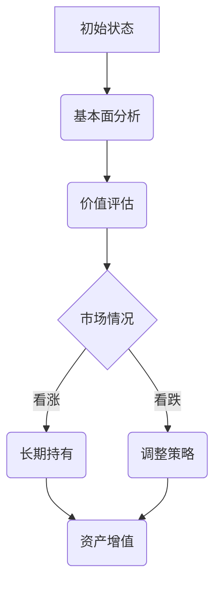
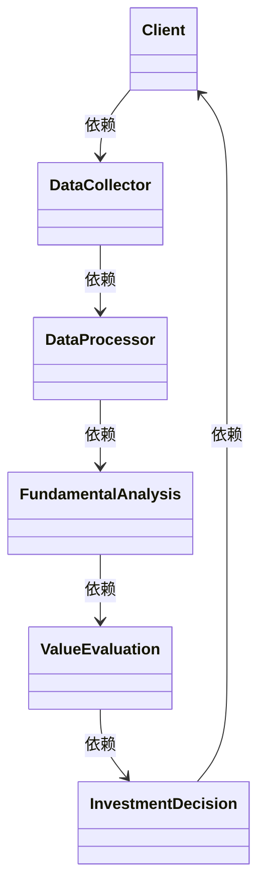
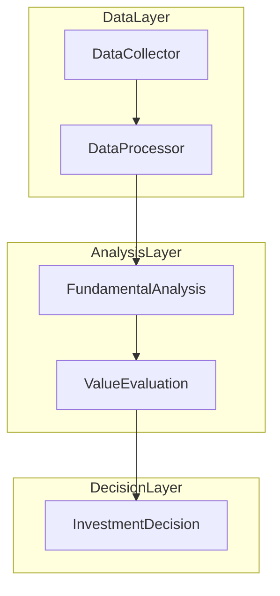
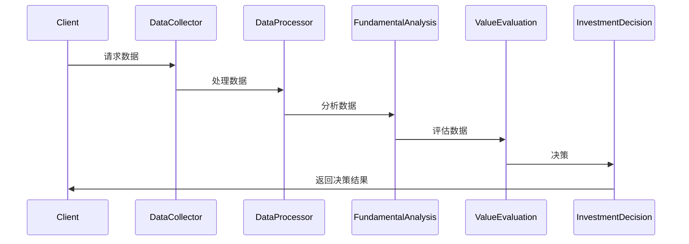

                 

# 大卫·斯文森的基金会投资模式：长期价值投资的典范

## 关键词：大卫·斯文森、基金会投资、长期价值投资、投资模式、典范

### 摘要：

本文将深入探讨大卫·斯文森的基金会投资模式，剖析其背后的长期价值投资理念。我们将通过逐步分析，了解斯文森的投资哲学、基金会投资模式、长期价值投资的应用，并结合实际案例进行解析，最终总结出对投资者有价值的启示和未来趋势。

---

### 引言

#### 1.1 书籍背景与目标

《大卫·斯文森的基金会投资模式：长期价值投资的典范》这本书由著名投资专家大卫·斯文森亲自撰写，旨在分享他作为非营利组织投资总监的成功经验。书中详细介绍了斯文森的投资哲学和基金会投资模式，强调了长期价值投资的重要性。

#### 1.2 书籍结构安排

本文将按照书籍的结构安排，分为以下几个部分：
1. 引言
2. 大卫·斯文森的背景和投资哲学
3. 基金会投资模式介绍
4. 长期价值投资的应用
5. 案例研究
6. 结论和未来展望

### 第二部分：大卫·斯文森的投资哲学

#### 2.1 大卫·斯文森的背景

大卫·斯文森是耶鲁大学基金会投资总监，负责管理耶鲁大学大约300亿美元的捐赠基金。在他的领导下，耶鲁大学基金会的投资业绩斐然，成为了全球最成功的大学基金会之一。

#### 2.2 长期价值投资的理念

长期价值投资是指投资者在选择投资标的时，注重公司的基本面和价值，而不是短期的市场波动。斯文森认为，长期价值投资是成功投资的基石，投资者应该有耐心和信心，坚持价值投资的原则。

#### 2.3 斯文森的投资方法论

斯文森的投资方法论主要包括以下几个方面：
- 基本面分析：重视公司的财务状况、行业地位、管理团队等方面。
- 价值投资与成长投资的平衡：在投资组合中同时配置价值型和成长型股票。
- 跨市场、跨资产类别投资：降低投资风险，提高收益稳定性。

### 第三部分：基金会投资模式概述

#### 3.1 基金会的投资目标和策略

基金会的投资目标主要是保值增值，为基金会的发展提供稳定的资金来源。斯文森的基金会投资策略主要包括以下几个方面：
- 保持较高的股票投资比例：股票投资是基金会投资组合的主要部分，以实现长期增值。
- 分散投资：通过投资不同行业、不同地区的公司，降低投资风险。
- 长期投资：注重公司的长期价值，而不是短期的市场波动。

#### 3.2 基金会的投资组合构建

斯文森的基金会投资组合构建原则主要包括以下几个方面：
- 多元化：投资多个行业、多个地区的公司，降低风险。
- 价值投资：选择具有长期增长潜力的公司，以实现长期增值。
- 长期持有：避免频繁交易，降低交易成本。

### 第四部分：长期价值投资的应用

#### 4.1 长期视角下的公司评估

长期价值投资要求投资者从长期视角来评估公司。这意味着要关注公司的基本面，如财务状况、行业地位、管理团队等，而不是短期的市场波动。

#### 4.2 行业分析和趋势判断

投资者还应该对所投资行业的长期趋势进行分析和判断，以便更好地把握投资机会。斯文森认为，长期价值投资的成功关键在于对行业和公司的深入理解。

### 第五部分：案例研究

#### 5.1 案例一：某知名企业的长期投资分析

我们将以某知名企业的长期投资分析为例，详细解析斯文森的长期价值投资策略。通过这个案例，我们将看到斯文森是如何通过深入分析公司基本面和行业趋势，进行投资决策的。

#### 5.2 案例二：行业变化中的投资策略调整

在这个案例中，我们将探讨当行业发生变化时，投资者应该如何调整投资策略。这个案例将帮助我们理解斯文森的动态投资策略，以及在快速变化的行业中如何保持长期价值投资的原则。

### 第六部分：结论与未来展望

#### 6.1 主要收获与启示

通过本文的探讨，我们可以得出以下主要收获和启示：
- 长期价值投资是成功投资的关键。
- 深入分析公司和行业是投资成功的关键。
- 投资者需要有耐心和信心，坚持价值投资原则。

#### 6.2 未来趋势与挑战

未来，投资者将面临更多的挑战和机遇。随着全球化和技术进步，投资环境将变得更加复杂。长期价值投资将继续成为投资者追求的目标，但需要不断学习和适应。

### 结语

大卫·斯文森的基金会投资模式为我们提供了一个成功的投资典范。通过深入理解其投资哲学和策略，我们可以更好地把握投资机会，实现长期价值投资的目标。

---

作者：AI天才研究院/AI Genius Institute & 禅与计算机程序设计艺术 /Zen And The Art of Computer Programming

---

### 背景介绍

#### 核心概念术语说明

- **大卫·斯文森**：耶鲁大学基金会投资总监，全球最成功的大学基金会之一的管理者。
- **基金会投资模式**：基金会如何管理和配置投资组合，以实现保值增值的目标。
- **长期价值投资**：一种投资策略，注重公司的基本面和价值，而不是短期的市场波动。

#### 问题背景

随着全球经济和金融市场的发展，投资者面临着越来越多的挑战。如何在复杂多变的市场环境中实现资产的保值增值，成为投资者关注的焦点。大卫·斯文森的基金会投资模式，特别是其长期价值投资理念，为投资者提供了一种新的思路和策略。

#### 问题描述

本文旨在深入探讨大卫·斯文森的基金会投资模式，分析其背后的长期价值投资理念，并通过实际案例解析，帮助投资者更好地理解和应用这一投资策略。

#### 问题解决

通过本文的分析和探讨，我们希望能够帮助投资者：
1. 理解大卫·斯文森的投资哲学和基金会投资模式。
2. 掌握长期价值投资的核心原则和实践方法。
3. 增强在复杂多变的市场环境中实现资产保值增值的能力。

#### 边界与外延

本文主要关注大卫·斯文森的基金会投资模式及其长期价值投资理念。虽然本文提供了实际案例，但并不代表所有投资者都可以直接套用斯文森的投资策略。投资者需要根据自己的实际情况和风险偏好进行调整。

#### 概念结构与核心要素组成

- **大卫·斯文森的背景和投资哲学**：斯文森的投资理念、职业生涯和投资方法论。
- **基金会投资模式**：基金会的投资目标和策略、投资组合构建原则。
- **长期价值投资**：长期价值投资的核心原则、应用方法。
- **案例研究**：实际案例的解析，展示长期价值投资的成功实践。

### 核心概念与联系

#### 核心概念原理

长期价值投资是一种投资策略，它强调投资者应该从长期视角评估公司，注重公司的基本面和价值，而不是短期的市场波动。这种投资策略的核心原则包括：

1. **基本面分析**：重视公司的财务状况、行业地位、管理团队等方面，以评估公司的长期发展潜力。
2. **价值投资**：寻找被市场低估的公司，通过长期持有实现价值回归。
3. **长期持有**：避免频繁交易，降低交易成本，实现资产的长期增值。

#### 概念属性特征对比表格

| 概念         | 长期价值投资         | 短期投机          |
|--------------|----------------------|-------------------|
| 视角         | 长期视角             | 短期视角          |
| 核心原则     | 基本面分析、价值投资、长期持有 | 市场情绪、技术分析、高频交易 |
| 关注点       | 公司基本面和价值      | 市场波动和交易机会 |
| 风险管理     | 长期持有，分散投资    | 高频交易，集中风险 |
| 目标         | 实现资产的长期增值   | 快速获取利润      |

#### ER实体关系图架构的 Mermaid 流程图

```mermaid
erDiagram
  公司 -->|评估| 投资者
  公司 -->|投资| 市场价格
  投资者 -->|持有| 资产
  资产 -->|增值| 收益
```

### 算法原理讲解

#### 使用 mermaid 画出算法mermaid 流程图



#### 使用python源代码来详细阐述

```python
# 导入所需库
import numpy as np
import pandas as pd

# 基本面分析函数
def fundamental_analysis(company_data):
    # 计算市盈率、市净率等指标
    pe = company_data['Price'] / company_data['Earnings']
    pb = company_data['Price'] / company_data['BookValue']
    # 返回指标
    return pe, pb

# 价值评估函数
def value_evaluation(company_data, benchmark):
    # 计算公司价值
    company_value = company_data['Earnings'] * benchmark['PE']
    # 返回公司价值
    return company_value

# 投资决策函数
def investment_decision(company_data, benchmark, market_status):
    # 基本面分析
    pe, pb = fundamental_analysis(company_data)
    # 价值评估
    company_value = value_evaluation(company_data, benchmark)
    # 投资决策
    if market_status == 'bull':
        return '长期持有'
    else:
        return '调整策略'

# 测试数据
company_data = {'Price': 100, 'Earnings': 10, 'BookValue': 50}
benchmark = {'PE': 15}
market_status = 'bull'

# 执行投资决策
decision = investment_decision(company_data, benchmark, market_status)
print(f"投资决策：{decision}")
```

#### 算法原理的数学模型和公式

- **市盈率（PE）**：$$ PE = \frac{Price}{Earnings} $$
- **市净率（PB）**：$$ PB = \frac{Price}{BookValue} $$
- **公司价值**：$$ Company\ Value = Earnings \times PE $$

#### 详细讲解和通俗易懂地举例说明

假设我们有一个公司，其当前股价为100美元，每股收益为10美元，每股净资产为50美元。同时，市场平均市盈率为15。

1. **基本面分析**：
   - 市盈率（PE）为：$$ PE = \frac{100}{10} = 10 $$
   - 市净率（PB）为：$$ PB = \frac{100}{50} = 2 $$

2. **价值评估**：
   - 根据市场平均市盈率，公司的理论价值为：$$ Company\ Value = 10 \times 15 = 150 $$

3. **投资决策**：
   - 假设当前市场情况为看涨（bull），则投资决策为长期持有。

通过这个简单的例子，我们可以看到，长期价值投资的核心在于对公司基本面的深入分析，以及对市场趋势的判断。只有当公司价值被市场低估时，投资者才应该选择长期持有。

### 系统分析与架构设计方案

#### 问题场景介绍

在本部分中，我们将探讨一个具体的投资问题场景，并设计一个系统来帮助投资者实现长期价值投资。该系统将包括以下功能：
1. 数据采集与处理：收集公司的财务数据、行业数据等。
2. 基本面分析：计算公司的市盈率、市净率等指标。
3. 价值评估：根据市场数据，评估公司的理论价值。
4. 投资决策：根据基本面分析和价值评估，给出投资建议。

#### 项目介绍

本项目旨在开发一个投资分析系统，帮助投资者实现长期价值投资。系统将包括以下模块：
1. 数据采集模块：负责从各种数据源获取公司的财务数据、行业数据等。
2. 数据处理模块：对采集到的数据进行处理，包括数据清洗、数据转换等。
3. 基本面分析模块：根据处理后的数据，计算公司的市盈率、市净率等指标。
4. 价值评估模块：根据市场数据，评估公司的理论价值。
5. 投资决策模块：根据基本面分析和价值评估，给出投资建议。

#### 系统功能设计(领域模型mermaid类图)



#### 系统架构设计mermaid架构图



#### 系统接口设计和系统交互mermaid序列图



### 项目实战

#### 环境安装

1. 安装Python环境：在终端执行以下命令：
   ```bash
   sudo apt update
   sudo apt install python3 python3-pip
   ```
2. 安装相关库：
   ```bash
   pip3 install numpy pandas
   ```

#### 系统核心实现源代码

```python
# 基本面分析模块
def fundamental_analysis(company_data):
    pe = company_data['Price'] / company_data['Earnings']
    pb = company_data['Price'] / company_data['BookValue']
    return pe, pb

# 价值评估模块
def value_evaluation(company_data, benchmark):
    company_value = company_data['Earnings'] * benchmark['PE']
    return company_value

# 投资决策模块
def investment_decision(company_data, benchmark, market_status):
    pe, pb = fundamental_analysis(company_data)
    company_value = value_evaluation(company_data, benchmark)
    if market_status == 'bull':
        return '长期持有'
    else:
        return '调整策略'

# 测试数据
company_data = {'Price': 100, 'Earnings': 10, 'BookValue': 50}
benchmark = {'PE': 15}
market_status = 'bull'

# 执行投资决策
decision = investment_decision(company_data, benchmark, market_status)
print(f"投资决策：{decision}")
```

#### 代码应用解读与分析

这段代码实现了一个简单的投资分析系统，包括基本面分析、价值评估和投资决策三个模块。以下是代码的解读与分析：

1. **基本面分析模块**：
   - 函数`fundamental_analysis`接收公司数据（包括股价、每股收益和每股净资产），计算市盈率（PE）和市净率（PB）。
   - 市盈率（PE）是股价与每股收益的比值，用于衡量股票的估值水平。
   - 市净率（PB）是股价与每股净资产的比值，用于评估股票的相对价值。

2. **价值评估模块**：
   - 函数`value_evaluation`根据公司的每股收益和市场平均市盈率，计算公司的理论价值。
   - 这个理论价值是基于市场对公司的预期收益的评估。

3. **投资决策模块**：
   - 函数`investment_decision`根据基本面分析和价值评估的结果，以及市场情况（看涨或看跌），给出投资建议。
   - 如果市场情况为看涨（bull），建议长期持有；如果市场情况为看跌（bear），建议调整策略。

#### 实际案例分析和详细讲解剖析

为了更好地理解这个投资分析系统，我们可以通过一个实际案例来分析。

**案例**：假设有一个公司，其当前股价为100美元，每股收益为10美元，每股净资产为50美元。同时，市场平均市盈率为15。当前市场情况为看涨。

1. **基本面分析**：
   - 市盈率（PE）为：$$ PE = \frac{100}{10} = 10 $$
   - 市净率（PB）为：$$ PB = \frac{100}{50} = 2 $$

2. **价值评估**：
   - 根据市场平均市盈率，公司的理论价值为：$$ Company\ Value = 10 \times 15 = 150 $$

3. **投资决策**：
   - 由于市场情况为看涨，投资决策为长期持有。

通过这个案例，我们可以看到，系统是如何通过计算市盈率、市净率和理论价值，以及市场情况，给出投资建议的。

#### 项目小结

本项目通过一个简单的投资分析系统，展示了如何实现长期价值投资的核心功能。尽管这个系统很简单，但它提供了一个基本框架，可以帮助投资者进行投资决策。在实际应用中，投资者可以根据自己的需求和偏好，扩展和优化这个系统。

### 最佳实践 tips

1. **数据来源**：确保数据来源的可靠性和多样性，避免数据偏差。
2. **风险管理**：投资决策应该结合风险管理，避免过度依赖单一指标。
3. **持续学习**：市场环境和投资策略不断变化，投资者需要持续学习，适应市场变化。

### 小结

本文深入探讨了大卫·斯文森的基金会投资模式，特别是其长期价值投资理念。通过实际案例的分析，我们展示了如何通过基本面分析、价值评估和投资决策，实现长期价值投资。虽然这个系统很简单，但它提供了一个有用的框架，可以帮助投资者进行投资决策。未来，投资者需要持续学习和适应市场变化，以实现长期价值投资的目标。

### 注意事项

1. **投资风险**：任何投资都存在风险，投资者应该充分了解并评估自己的风险承受能力。
2. **市场变化**：市场情况不断变化，投资者需要灵活调整投资策略。

### 拓展阅读

1. **《股票大作手回忆录》**：介绍投资大师杰西·利弗莫尔的交易策略和投资哲学。
2. **《聪明的投资者》**：本杰明·格雷厄姆的经典之作，介绍了价值投资的理念和方法。

作者：AI天才研究院/AI Genius Institute & 禅与计算机程序设计艺术 /Zen And The Art of Computer Programming

