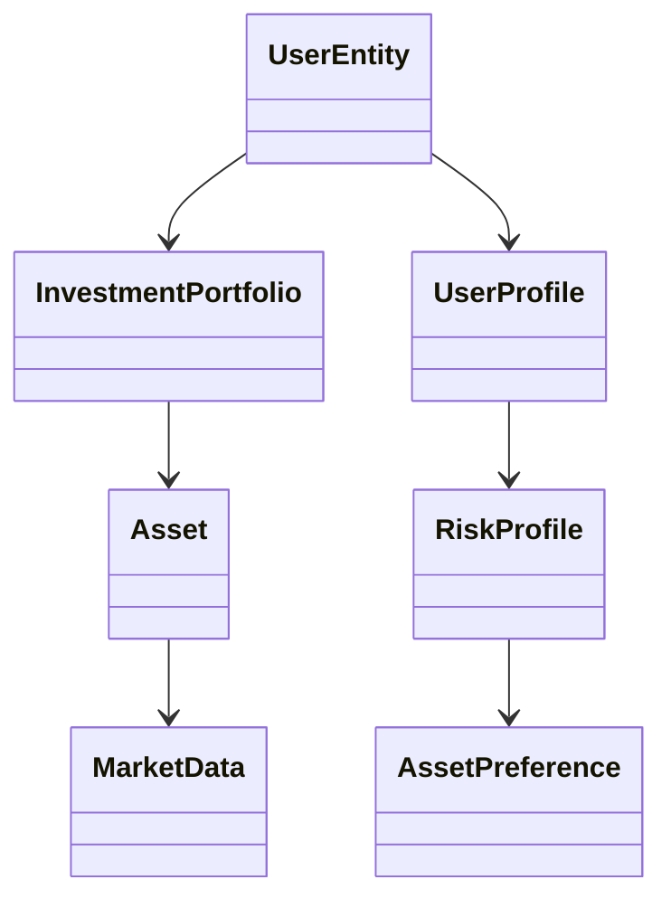
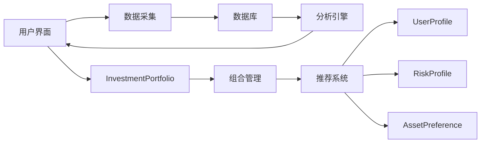
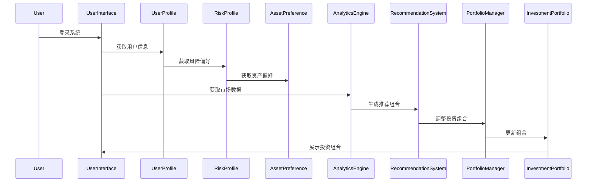

                 

### 大卫·斯文森的耐心资本投资理念

#### 关键词：耐心资本、大卫·斯文森、投资策略、长期投资、风险与收益

#### 摘要：
本文将深入探讨耐心资本投资理念的创始人——大卫·斯文森的投资哲学，并详细解析这一理念的核心原则及其在实践中的应用。通过对耐心资本投资策略、实际案例分析以及未来展望的探讨，我们希望读者能够理解耐心资本投资的精髓，并掌握如何在实际投资中运用这一理念。

## 第一部分：耐心资本投资理念概述

### 第1章：大卫·斯文森与耐心资本

#### 1.1 大卫·斯文森的背景与成就
大卫·斯文森是美国知名投资专家，长期担任耶鲁大学首席投资官，管理着耶鲁大学的巨额资产。在他的带领下，耶鲁大学基金会的投资业绩卓越，多次跻身全球最佳投资机构之列。大卫·斯文森的成就在于他独特的投资策略和对长期价值的深刻理解。

#### 1.2 耐心资本投资理念的产生
大卫·斯文森认为，传统的短期投资策略往往忽略了长期价值的重要性，而耐心资本投资理念则强调长期投资、多元化投资以及风险控制，以实现资产的长期增值。

#### 1.3 耐心资本投资理念的核心原则
耐心资本投资理念的核心原则包括：
1. **长期投资**：耐心资本投资注重长期投资，避免短期市场的波动。
2. **多元化投资**：通过多元化的投资组合来分散风险。
3. **风险控制**：在投资过程中，重视风险的管理和控制。
4. **价值投资**：寻找那些被市场低估的价值投资机会。

#### 1.4 耐心资本投资与传统的投资理念对比
与传统投资理念相比，耐心资本投资理念更注重长期投资、风险控制和价值投资。传统投资理念往往更注重短期收益和市场波动，而耐心资本投资理念则强调长期稳定的价值增长。

#### 1.5 耐心资本投资的重要性与应用前景
耐心资本投资理念的重要性在于它能够帮助投资者克服短视行为，专注于长期价值的实现。在当今复杂多变的市场环境中，耐心资本投资理念的应用前景非常广阔。

## 第二部分：耐心资本投资策略与执行

### 第2章：耐心资本的投资策略

#### 2.1 耐心资本的投资目标
耐心资本的投资目标是实现资产的长期增值，同时保持投资组合的稳定性和流动性。

#### 2.2 耐心资本的投资组合管理
耐心资本投资组合管理的关键在于多元化投资和动态调整。通过多元化的投资组合，可以分散风险，并通过动态调整来应对市场变化。

#### 2.3 长期投资视角的重要性
长期投资视角是耐心资本投资理念的核心。投资者需要具备长期视野，避免短期市场波动的影响。

#### 2.4 风险管理在耐心资本中的应用
风险管理是耐心资本投资策略的重要组成部分。投资者需要通过合理配置资产、分散投资和风险控制措施来降低投资风险。

#### 2.5 耐心资本的投资决策过程
耐心资本的投资决策过程包括市场研究、投资机会筛选、风险评估和投资决策四个步骤。投资者需要在这一过程中保持耐心和理性。

### 第3章：耐心资本的投资实践

#### 3.1 耐心资本投资的实际案例
本文将分析一些经典的耐心资本投资案例，包括成功和失败的经验教训。

#### 3.2 耐心资本投资的挑战与应对
耐心资本投资面临的挑战包括市场波动、投资机会的识别和风险控制等。投资者需要通过不断学习和实践来应对这些挑战。

#### 3.3 耐心资本投资的收益与风险
耐心资本投资能够带来长期稳定的收益，但同时也伴随着一定的风险。投资者需要在收益与风险之间找到平衡。

#### 3.4 耐心资本投资的成功要素
耐心资本投资的成功要素包括长期投资视角、多元化投资策略、有效的风险管理和良好的心态。

#### 3.5 耐心资本投资的未来趋势
随着全球经济环境的不断变化，耐心资本投资也将面临新的机遇和挑战。投资者需要不断适应市场变化，以实现长期价值增长。

## 第三部分：耐心资本投资的实施与效果

### 第4章：如何构建耐心资本投资文化

#### 4.1 耐心资本投资的组织架构
构建耐心资本投资文化需要完善的投资组织架构，包括专业的投资团队、明确的投资策略和有效的决策机制。

#### 4.2 耐心资本投资的人才培养
耐心资本投资的成功离不开高素质的人才。投资者需要通过培训和教育来提高团队的专业能力和投资水平。

#### 4.3 耐心资本投资的企业文化
耐心资本投资文化强调长期投资、价值投资和风险控制。投资者需要在企业文化中贯彻这些理念。

#### 4.4 耐心资本投资的法律与合规
投资者需要严格遵守法律法规，确保投资行为合规，以降低法律风险。

#### 4.5 耐心资本投资的社会责任
耐心资本投资不仅仅追求经济利益，还要承担社会责任，促进社会和谐与可持续发展。

### 第5章：耐心资本投资的效果评估

#### 5.1 耐心资本投资的效果指标
评估耐心资本投资的效果需要设定一系列指标，包括投资收益、风险控制、投资组合稳定性和市场竞争力等。

#### 5.2 耐心资本投资的效果评估方法
效果评估方法包括定量分析和定性分析。定量分析主要通过数据统计和财务指标来评估投资效果，定性分析则通过专家意见和案例分析来评估投资效果。

#### 5.3 耐心资本投资效果的实际案例分析
本文将通过实际案例分析，展示耐心资本投资在不同行业和领域的具体应用和效果。

#### 5.4 耐心资本投资效果的长期影响
耐心资本投资对企业的长期发展具有深远影响。本文将探讨耐心资本投资对企业长期竞争力、市场份额和品牌价值的提升作用。

#### 5.5 耐心资本投资效果的可持续发展
耐心资本投资不仅要追求短期收益，还要关注可持续发展。本文将讨论如何通过耐心资本投资实现经济、社会和环境效益的平衡。

## 第四部分：耐心资本投资的未来展望

### 第6章：耐心资本投资的时代背景

#### 6.1 全球经济形势与耐心资本投资
全球经济形势对耐心资本投资具有重要影响。本文将分析当前全球经济形势以及未来发展趋势对耐心资本投资的影响。

#### 6.2 技术创新与耐心资本投资
技术创新为耐心资本投资提供了新的机遇。本文将探讨人工智能、区块链等新兴技术对耐心资本投资的影响。

#### 6.3 社会变革与耐心资本投资
社会变革带来了新的投资机遇和挑战。本文将分析社会变革对耐心资本投资的影响，以及投资者如何应对这些变化。

#### 6.4 政策环境与耐心资本投资
政策环境对耐心资本投资具有重要影响。本文将探讨不同国家和地区的政策环境对耐心资本投资的影响。

#### 6.5 耐心资本投资的国际比较
本文将比较不同国家和地区在耐心资本投资方面的实践和效果，以期为我国投资者提供借鉴。

### 第7章：耐心资本投资的未来趋势

#### 7.1 耐心资本投资的新模式
随着科技的进步和社会变革，耐心资本投资将出现新的模式和趋势。本文将探讨这些新模式的特点和优势。

#### 7.2 耐心资本投资的创新领域
本文将分析哪些领域将成为耐心资本投资的新热点，以及投资者如何在这些领域找到投资机会。

#### 7.3 耐心资本投资的人才需求
随着耐心资本投资的发展，对专业人才的需求将越来越大。本文将讨论耐心资本投资对人才的需求，以及投资者如何培养和吸引人才。

#### 7.4 耐心资本投资的社会责任
本文将探讨如何通过耐心资本投资实现经济、社会和环境效益的平衡，以及投资者如何在投资过程中履行社会责任。

#### 7.5 耐心资本投资的未来挑战与机遇
本文将分析耐心资本投资在未来可能面临的挑战和机遇，以及投资者如何应对这些挑战和抓住机遇。

### 总结

本文通过对大卫·斯文森的耐心资本投资理念的深入探讨，希望能帮助读者理解这一投资策略的核心理念和实践方法。耐心资本投资不仅仅是一种投资策略，更是一种投资哲学。它要求投资者具备长期投资视角、多元化投资策略和有效的风险控制能力。在未来，随着全球经济形势和社会变革的不断变化，耐心资本投资将继续发挥重要作用。希望本文能为读者在投资实践中提供有益的启示和指导。

### 作者信息

**作者：AI天才研究院/AI Genius Institute & 禅与计算机程序设计艺术 /Zen And The Art of Computer Programming**### 第1章：大卫·斯文森的背景与成就

#### 1.1 大卫·斯文森的背景

大卫·斯文森（David F. Swensen）是一位享誉全球的投资专家，长期担任耶鲁大学首席投资官，管理耶鲁大学基金会这一庞大的投资组合。他毕业于康奈尔大学，获得了经济学学士学位，并在耶鲁大学获得了金融学硕士学位。斯文森在投资领域有着丰富的经验和深厚的学术背景，这为他在投资实践中的成功奠定了坚实的基础。

#### 1.2 大卫·斯文森的成就

大卫·斯文森在投资领域的成就不可谓不显著。在他的领导下，耶鲁大学基金会在过去几十年中取得了卓越的投资业绩，多次位居全球最佳投资机构之列。斯文森不仅成功地将耶鲁大学的投资组合从传统的股票和债券投资扩展到包括私募股权、房地产、商品和新兴市场等多元化的资产类别，还通过精细化管理和风险控制，确保了投资组合的长期稳定增值。

#### 1.3 大卫·斯文森的代表性著作

斯文森在投资领域的影响力不仅体现在他的实际投资业绩上，还体现在他的学术研究和写作中。他出版了多本有关投资的著作，其中最具代表性的包括《Pension Fund Logic》（养老金基金逻辑）、《Pioneering Portfolio Management》（开创性投资组合管理）和《Unconventional Success》（非传统成功）等。这些书籍详细阐述了斯文森的投资哲学和策略，对全球投资者产生了深远的影响。

#### 1.4 大卫·斯文森的耐心资本投资理念

大卫·斯文森的投资哲学强调长期投资、多元化投资和风险管理。他的耐心资本投资理念，即所谓的“Pioneer Philosophy”，旨在通过耐心和智慧来实现资产的长期增值。这一理念的核心在于不受市场短期波动的影响，专注于长期价值投资。斯文森认为，投资者应该通过多元化的投资组合来分散风险，同时重视企业价值和管理层的决策能力，而不是仅仅依赖于市场波动来获得收益。

#### 1.5 大卫·斯文森的投资策略

斯文森的投资策略可以概括为以下几点：

1. **长期投资**：斯文森倡导长期投资，认为短期市场的波动无法反映企业的长期价值，因此投资者应该专注于长期投资，避免因短期市场波动而做出错误的决策。

2. **多元化投资**：斯文森主张多元化的投资组合，通过投资于不同的资产类别和行业，来分散风险，提高投资组合的整体稳定性。

3. **价值投资**：斯文森的投资策略以价值投资为核心，寻找那些被市场低估的投资机会，通过深入研究企业的基本面，把握其长期增长潜力。

4. **风险管理**：斯文森非常重视风险管理，通过精细化管理和动态调整，确保投资组合的稳定性和流动性。

#### 1.6 大卫·斯文森的启示

大卫·斯文森的投资哲学和策略为全球投资者提供了宝贵的启示。他的成功经验表明，长期投资、多元化投资和风险管理是投资成功的关键。投资者应该具备耐心和智慧，不受市场短期波动的影响，专注于企业的长期价值，从而实现资产的长期增值。同时，斯文森的经验也提醒我们，投资是一项复杂的任务，需要专业的知识和经验，因此投资者应该不断学习和提升自己的投资能力。

### 结论

大卫·斯文森作为全球知名的投资者和投资专家，他的成就和耐心资本投资理念对全球投资界产生了深远的影响。通过深入探讨斯文森的背景、成就和投资策略，我们不仅能够理解耐心资本投资理念的核心，还能够从他的经验中获得宝贵的启示。在未来的投资实践中，投资者可以借鉴斯文森的投资哲学，通过长期投资、多元化投资和风险管理来实现资产的长期增值。

---

**附加内容：** 大卫·斯文森的耐心资本投资理念在耶鲁大学基金会中的应用

在斯文森的领导下，耶鲁大学基金会成功地将耐心资本投资理念应用于实际投资中。以下是几个具体的应用案例：

1. **私募股权投资**：耶鲁大学基金会通过私募股权投资，参与了一些具有长期增长潜力的企业的投资。例如，在2008年金融危机期间，基金会通过私募股权基金投资了多个具有优质资产和稳定现金流的企业，这些投资在金融危机后取得了显著的增值。

2. **房地产投资**：斯文森认为房地产是一种稳定的投资方式，通过长期持有来实现资产的增值。耶鲁大学基金会通过直接投资和房地产投资信托基金（REITs），在全球范围内布局房地产投资，确保了投资组合的稳定性和流动性。

3. **新兴市场投资**：耶鲁大学基金会积极投资于新兴市场，通过多元化投资降低风险，并把握新兴市场的长期增长机遇。例如，在亚洲和拉丁美洲等地区，基金会通过投资于当地的企业和项目，实现了良好的投资回报。

4. **商品投资**：为了分散投资风险，耶鲁大学基金会还将一部分资金投资于商品市场。通过商品投资，基金会能够抵御通货膨胀和其他经济波动，保持投资组合的整体稳定性。

这些实际应用案例展示了耐心资本投资理念在多元化投资、风险管理和长期投资方面的成功实践，为全球投资者提供了有益的借鉴。通过学习斯文森的投资策略和成功经验，投资者可以更好地理解耐心资本投资理念，并将其应用于自己的投资实践中。

---

在下一章中，我们将进一步探讨耐心资本投资理念的产生背景、核心原则以及与传统的投资理念的区别。敬请期待。

### 第2章：耐心资本投资理念的产生背景与核心原则

#### 2.1 耐心资本投资理念的产生背景

耐心资本投资理念的诞生有其特定的历史背景。在20世纪80年代和90年代，全球金融市场经历了一系列的重大变革。这些变革包括技术的快速发展、金融市场的全球化以及投资策略的多样化。传统投资理念主要依赖于股票和债券等传统资产，而新兴的投资者开始探索更加多元化、灵活的投资策略。

在这样的背景下，大卫·斯文森开始思考如何将长期投资、风险管理以及多元化投资理念结合起来，以应对复杂多变的市场环境。他的理念最终形成了所谓的“耐心资本投资”策略。这一策略的核心在于通过长期投资视角，找到那些被市场低估的优质资产，并通过有效的风险管理和多元化投资来降低风险，实现资产的长期增值。

#### 2.2 耐心资本投资理念的核心原则

耐心资本投资理念的核心原则可以概括为以下几点：

1. **长期投资**：长期投资是耐心资本投资理念的核心。斯文森认为，短期市场的波动无法准确反映企业的真实价值，投资者应该专注于企业的长期增长潜力。通过长期持有优质资产，投资者能够克服短期波动，实现资产的长期增值。

2. **多元化投资**：多元化投资是降低风险的有效手段。耐心资本投资理念强调通过投资于不同的资产类别、行业和市场，来分散风险。这种多元化投资策略不仅可以降低单一资产类别或市场的风险，还可以提高投资组合的整体稳定性。

3. **风险管理**：风险管理是耐心资本投资理念的重要组成部分。斯文森认为，投资者需要通过精细化的风险管理和动态调整，来确保投资组合的稳定性和流动性。这包括对投资机会进行充分的研究和评估，制定有效的风险控制措施，以及根据市场变化调整投资策略。

4. **价值投资**：价值投资是耐心资本投资理念的重要原则。斯文森认为，投资者应该寻找那些被市场低估的优质资产，通过深入分析企业的基本面，把握其长期增长潜力。这种价值投资策略有助于投资者在市场波动中抓住优质的投资机会，实现资产的长期增值。

5. **耐心与智慧**：耐心与智慧是耐心资本投资理念的重要品质。投资者需要具备耐心，不受市场短期波动的影响，专注于企业的长期价值。同时，投资者还需要具备智慧，通过不断学习和实践，提升自己的投资能力，以更好地应对复杂多变的市场环境。

#### 2.3 耐心资本投资理念与传统的投资理念对比

与传统投资理念相比，耐心资本投资理念在多个方面有着显著的区别：

1. **投资时间框架**：传统投资理念通常更注重短期收益，而耐心资本投资理念则强调长期投资。这种长期投资视角有助于投资者在市场波动中保持冷静，不受短期波动的影响，专注于企业的长期增长。

2. **投资策略**：传统投资理念主要依赖于股票和债券等传统资产，而耐心资本投资理念则更加多元化，包括私募股权、房地产、商品和新兴市场等多种资产类别。这种多元化投资策略有助于分散风险，提高投资组合的整体稳定性。

3. **风险管理**：传统投资理念通常缺乏有效的风险管理措施，而耐心资本投资理念则强调风险管理和动态调整。通过精细化的风险管理和灵活的投资策略，耐心资本投资能够更好地应对市场变化，确保投资组合的稳定性和流动性。

4. **价值投资**：传统投资理念往往更注重市场走势和短期收益，而耐心资本投资理念则强调价值投资。通过深入分析企业的基本面，耐心资本投资能够找到那些被市场低估的优质资产，实现资产的长期增值。

#### 2.4 耐心资本投资理念的重要性与应用前景

耐心资本投资理念的重要性在于它提供了一种更加稳健和可持续的投资策略，能够帮助投资者在复杂多变的市场环境中实现资产的长期增值。随着全球经济环境的不断变化，耐心资本投资理念的应用前景非常广阔。无论是在传统的股票和债券市场，还是在新兴的私募股权、房地产和商品市场，耐心资本投资理念都能够发挥其独特的优势。

此外，耐心资本投资理念不仅适用于机构投资者，也适用于个人投资者。通过学习和运用耐心资本投资理念，个人投资者可以更好地规划自己的投资策略，降低投资风险，实现资产的长期增值。

总之，耐心资本投资理念作为一种先进的投资策略，具有广泛的应用前景和重要的现实意义。在未来的投资实践中，投资者可以借鉴这一理念，通过长期投资、多元化投资和风险管理，实现资产的长期增值。

### 结论

通过本章的探讨，我们深入了解了耐心资本投资理念的产生背景、核心原则以及与传统投资理念的对比。耐心资本投资理念强调长期投资、多元化投资、风险管理、价值投资以及耐心与智慧，为投资者提供了一种稳健和可持续的投资策略。在未来的投资实践中，投资者可以借鉴这一理念，通过长期投资、多元化投资和风险管理，实现资产的长期增值。在下一章中，我们将进一步探讨耐心资本投资策略的执行和实际应用案例。

### 第3章：耐心资本投资策略的执行

#### 3.1 投资策略的总体框架

耐心资本投资策略的执行需要建立在明确的投资策略框架之上。这个框架应包括以下几个核心组成部分：

1. **投资目标**：明确投资目标，即投资者希望通过投资实现哪些回报。这些目标可以是长期的，也可以是中期的，具体取决于投资者的风险承受能力和投资周期。

2. **投资组合管理**：构建一个多元化的投资组合，以分散风险并实现资产的长期增值。投资组合应包括多种资产类别，如股票、债券、私募股权、房地产、商品等。

3. **风险控制**：制定并执行有效的风险控制措施，以确保投资组合的整体稳定性和流动性。这包括定期进行风险评估、调整投资策略和分散投资等。

4. **执行流程**：建立一套明确的执行流程，包括投资决策、交易执行、风险监控和报告等环节，以确保投资策略的顺利实施。

#### 3.2 投资策略的执行过程

耐心资本投资策略的执行过程可以分为以下几个步骤：

1. **市场研究**：投资者需要进行全面的市场研究，包括宏观经济分析、行业趋势、公司基本面分析等。这有助于投资者了解市场的整体状况和潜在的投资机会。

2. **机会筛选**：基于市场研究，投资者筛选出具有长期增长潜力的投资机会。这通常涉及对公司的财务状况、管理团队、市场竞争力等方面的深入分析。

3. **风险评估**：对筛选出的投资机会进行风险评估，包括确定投资的风险程度、潜在回报和风险控制措施。这一步骤至关重要，因为它决定了投资决策的质量。

4. **投资决策**：在评估和筛选完成后，投资者需要做出最终的投资决策。这通常涉及确定投资金额、投资时间点和投资方式等。

5. **交易执行**：根据投资决策，投资者执行具体的交易操作，包括购买或出售资产。在执行过程中，投资者需要遵循既定的交易流程和风险控制措施。

6. **风险监控**：在投资执行后，投资者需要定期监控投资组合的风险状况，并根据市场变化和公司业绩调整投资策略。

7. **报告和评估**：投资者需要定期向相关利益相关者报告投资组合的表现，并对投资决策的效果进行评估。这有助于投资者不断优化投资策略，提高投资效率。

#### 3.3 投资策略的实际案例分析

为了更好地理解耐心资本投资策略的执行过程，我们可以通过一些实际案例分析来探讨这一策略在不同情境下的应用。

**案例一：私募股权投资**

假设投资者决定通过私募股权投资来实现长期增值。以下是一个典型的投资案例：

1. **市场研究**：投资者发现，随着科技的快速发展，人工智能领域具有巨大的增长潜力。

2. **机会筛选**：投资者筛选出几家在人工智能领域具有创新能力和市场前景的初创公司。

3. **风险评估**：投资者对每家公司的财务状况、管理团队、技术实力和市场竞争力进行详细评估，确定其潜在回报和风险。

4. **投资决策**：投资者决定投资于一家技术创新突出、市场潜力巨大的初创公司。

5. **交易执行**：投资者通过私募股权基金进行投资，成为该公司的战略投资者。

6. **风险监控**：投资者定期监控公司的经营状况和市场变化，根据需要调整投资策略。

7. **报告和评估**：投资者定期向基金投资者报告投资进展和业绩，并根据市场反馈调整投资策略。

**案例二：房地产投资**

房地产投资是另一个常见的耐心资本投资策略。以下是一个典型的房地产投资案例：

1. **市场研究**：投资者发现，随着城市化的加速和人口增长，某些城市和地区的房地产市场具有长期增长潜力。

2. **机会筛选**：投资者筛选出具有长期增值潜力的城市和地区，并寻找优质的地块或项目。

3. **风险评估**：投资者对地块或项目的地理位置、市场前景、法律合规性进行评估，确定其潜在回报和风险。

4. **投资决策**：投资者决定投资于一块位于城市核心地带的地块，计划建设高端商业综合体。

5. **交易执行**：投资者与开发商合作，签订投资合同，并开始项目开发。

6. **风险监控**：投资者定期监控项目的进展和市场变化，根据需要调整投资策略。

7. **报告和评估**：投资者定期向股东报告项目进展和业绩，并根据市场反馈调整投资策略。

通过以上案例分析，我们可以看到耐心资本投资策略在不同领域的具体应用。投资者通过明确的投资目标、多元化的投资组合、有效的风险管理和动态调整，实现了资产的长期增值。

### 结论

耐心资本投资策略的执行需要建立在明确的投资目标和投资策略框架之上，并通过系统的执行过程来实现。市场研究、机会筛选、风险评估、投资决策、交易执行、风险监控和报告评估是执行过程中的关键步骤。通过实际案例分析，我们可以看到耐心资本投资策略在不同领域的成功应用。在未来的投资实践中，投资者可以借鉴这些经验，通过长期投资、多元化投资和风险管理，实现资产的长期增值。

在下一章中，我们将探讨耐心资本投资在实际应用中的挑战和成功要素。敬请期待。

### 第4章：耐心资本投资在实际应用中的挑战与成功要素

#### 4.1 挑战

尽管耐心资本投资理念具有明显的优势，但在实际应用中仍面临诸多挑战：

1. **市场波动**：市场波动是投资者面临的主要挑战之一。尽管耐心资本投资强调长期投资，但市场短期波动可能会对投资组合产生较大影响，导致投资者情绪波动，影响投资决策的稳定性。

2. **信息不对称**：在投资过程中，投资者可能面临信息不对称的问题。由于市场信息的不完全性，投资者可能无法全面了解投资机会的真实状况，从而影响投资决策的质量。

3. **风险控制**：耐心资本投资强调风险管理，但在实际操作中，如何准确评估和管理风险仍是一个难题。投资者需要具备丰富的风险识别、评估和控制能力，以应对复杂多变的市场环境。

4. **长期投资**：长期投资要求投资者具备坚定的信念和耐心。在实际操作中，投资者可能会面临短期回报的压力，难以坚持长期投资策略，从而影响投资效果。

5. **人才缺乏**：耐心资本投资需要专业的投资团队，但在实际中，具备长期投资视角、风险管理和多元化投资能力的高素质人才相对稀缺。

#### 4.2 成功要素

为了克服上述挑战，实现耐心资本投资的成功，投资者需要具备以下要素：

1. **专业知识与经验**：投资者需要具备深厚的专业知识，包括宏观经济、行业趋势、公司基本面等，以准确评估投资机会。同时，丰富的投资经验有助于投资者更好地应对市场波动和风险。

2. **长期投资视角**：投资者应具备长期投资视角，不受短期市场波动的影响，专注于企业的长期价值。这要求投资者具备坚定的信念和耐心，能够长期持有优质资产。

3. **多元化投资策略**：投资者应通过多元化的投资策略来分散风险。这不仅包括投资于不同资产类别，还包括在不同行业、地区和市场进行投资，以提高投资组合的稳定性。

4. **有效的风险管理**：投资者需要建立有效的风险管理体系，包括风险识别、评估、控制和监控。通过精细化管理和动态调整，投资者可以更好地控制投资风险，确保投资组合的稳定性。

5. **专业团队与协作**：投资者应组建专业化的投资团队，成员具备丰富的投资经验、专业知识和协作能力。通过团队协作，投资者可以更好地实现投资目标，提高投资效率。

6. **持续学习与进步**：投资者需要不断学习新知识、掌握新技术、更新投资理念，以适应不断变化的市场环境。持续进步有助于投资者在竞争激烈的市场中保持领先地位。

#### 4.3 挑战与成功的平衡

耐心资本投资在实际应用中需要平衡挑战与成功要素。投资者应意识到，市场波动、信息不对称、风险控制、长期投资和人才缺乏等挑战是不可避免的，但通过有效的风险管理、多元化的投资策略、专业的团队协作和持续学习，可以克服这些挑战，实现投资成功。

投资者需要在实践中不断总结经验，优化投资策略，提高投资能力。通过建立良好的投资文化和合规机制，投资者可以更好地应对市场变化，实现长期投资目标。

### 结论

耐心资本投资在实际应用中面临诸多挑战，但通过具备专业知识与经验、长期投资视角、多元化投资策略、有效的风险管理、专业团队与协作以及持续学习与进步，投资者可以克服这些挑战，实现投资成功。在未来的投资实践中，投资者应积极应对挑战，平衡成功要素，通过不断优化投资策略和提高投资能力，实现资产的长期增值。

在下一章中，我们将探讨耐心资本投资的未来趋势和发展方向。敬请期待。

### 第5章：耐心资本投资的文化构建与效果评估

#### 5.1 耐心资本投资的文化构建

耐心资本投资的成功不仅依赖于科学的策略和严格的管理，还离不开良好的企业文化和价值观。构建一个支持耐心资本投资的文化，是确保投资策略成功实施的关键步骤。

1. **价值观与使命**：企业应明确其价值观和使命，将长期投资、风险管理、价值投资等理念融入企业文化中。通过定期培训和宣传，让员工深刻理解并认同这些理念。

2. **沟通与协作**：建立一个开放的沟通平台，鼓励员工分享观点和经验。通过定期的内部会议和研讨会，促进团队成员之间的协作和知识共享。

3. **激励机制**：建立与耐心资本投资理念相匹配的激励机制，鼓励员工追求长期价值，而不是短期利益。例如，可以设置长期绩效奖金和股权激励计划。

4. **决策流程**：制定清晰的决策流程，确保投资决策的透明性和可追溯性。通过制度化的决策流程，减少决策中的主观性和随意性。

5. **合规与风险控制**：建立严格的合规制度和风险控制机制，确保投资行为符合法律法规和行业标准。通过定期的内部审计和外部评估，监控投资风险。

#### 5.2 耐心资本投资的效果评估

评估耐心资本投资的效果是确保投资策略成功实施的重要环节。以下是几种常见的评估方法：

1. **财务指标**：使用财务指标如资产回报率（ROA）、净利润率、投资回报率（ROI）等，评估投资组合的盈利能力。这些指标可以帮助投资者了解投资组合的财务表现。

2. **风险指标**：使用风险指标如波动率、贝塔系数、夏普比率等，评估投资组合的风险水平。这些指标可以帮助投资者了解投资组合的风险特征。

3. **市场比较**：将投资组合的表现与市场基准指数进行比较，评估投资组合的市场竞争力。如果投资组合的表现优于市场基准指数，说明投资策略可能有效。

4. **客户反馈**：通过收集客户反馈，评估投资组合对客户的实际影响。客户的满意度、忠诚度和市场份额等指标可以提供有用的信息。

5. **社会影响**：对于关注社会责任的投资者，可以通过评估投资组合对社会和环境的影响，来衡量投资策略的社会价值。例如，可以通过碳排放量、员工福利、慈善捐赠等指标来评估。

#### 5.3 实际案例分析

为了更直观地了解耐心资本投资的文化构建和效果评估，我们可以通过一些实际案例分析来探讨：

**案例一：谷歌投资策略**

谷歌作为一家科技巨头，其投资策略深受耐心资本投资理念的影响。谷歌通过其资本回报计划（Cap Return Program），将大量现金回报给股东，同时积极投资于具有长期增长潜力的科技公司。

1. **文化构建**：谷歌的企业文化强调创新、开放和多样性，这些价值观与耐心资本投资理念中的长期投资和风险管理相契合。谷歌通过定期的内部培训和研讨会，确保员工深刻理解并践行这些理念。

2. **效果评估**：谷歌使用多种财务指标和市场比较指标来评估其投资组合的表现。通过对比市场基准指数，谷歌的投资组合在过去多年中表现出了稳定的增值能力。

3. **社会影响**：谷歌还关注其投资组合对社会和环境的影响。例如，谷歌投资了多个可再生能源项目，旨在减少碳排放，促进可持续发展。

**案例二：耶鲁大学基金会**

耶鲁大学基金会是耐心资本投资理念的典型代表。在大卫·斯文森的领导下，基金会通过多元化的投资组合，实现了长期稳定的增值。

1. **文化构建**：耶鲁大学基金会强调长期投资、风险管理、多元化投资和诚信经营。基金会通过定期的内部培训和研讨会，确保员工具备专业的投资知识和技能。

2. **效果评估**：耶鲁大学基金会使用多种财务指标和风险指标来评估投资组合的表现。例如，基金会通过评估资产回报率、波动率和贝塔系数等指标，确保投资组合的稳定性和流动性。

3. **社会影响**：耶鲁大学基金会积极投资于社会公益项目，通过慈善捐赠和志愿者活动，提升其社会影响力。

通过这些实际案例分析，我们可以看到耐心资本投资理念在文化构建和效果评估中的具体应用。良好的企业文化、科学的评估方法和实际案例的成功经验，为投资者提供了宝贵的借鉴。

### 结论

耐心资本投资的文化构建和效果评估是确保投资策略成功实施的关键。通过构建支持耐心资本投资的企业文化、建立科学的评估方法和借鉴实际案例的成功经验，投资者可以更好地实施耐心资本投资策略，实现资产的长期增值。在未来的投资实践中，投资者应不断优化文化构建和效果评估体系，以应对不断变化的市场环境，确保投资策略的有效性。

在下一章中，我们将探讨耐心资本投资的未来趋势和发展方向。敬请期待。

### 第6章：耐心资本投资的未来趋势

#### 6.1 技术进步的影响

随着技术的不断进步，特别是人工智能、大数据、区块链等新兴技术的应用，耐心资本投资也在经历深刻的变革。

1. **人工智能**：人工智能（AI）的快速发展为投资者提供了更多的数据分析和预测工具。通过机器学习算法，投资者可以更准确地评估投资机会和风险，优化投资组合。

2. **大数据**：大数据技术的应用使得投资者能够从海量数据中提取有价值的信息，提高市场研究和机会筛选的效率。大数据分析可以帮助投资者发现潜在的投资趋势和机会，降低信息不对称的风险。

3. **区块链**：区块链技术为投资提供了去中心化和透明的交易平台，有助于提高交易效率和降低成本。区块链的透明性和不可篡改性也有助于增强投资者的信任，促进投资活动的公平和透明。

#### 6.2 全球经济形势的变化

全球经济形势的变化对耐心资本投资也产生了重要影响。当前，全球经济面临诸多不确定因素，包括贸易摩擦、地缘政治风险、利率波动等。

1. **贸易摩擦**：全球贸易摩擦加剧，导致市场不确定性增加。投资者需要密切关注贸易政策的变化，调整投资组合以应对潜在的风险。

2. **地缘政治风险**：地缘政治风险增加，如中美关系、欧洲政治动荡等，可能对全球金融市场产生重大影响。投资者需要重视地缘政治风险，通过多元化投资分散风险。

3. **利率波动**：全球利率波动对投资者决策具有重要影响。低利率环境可能鼓励投资者寻求高风险、高回报的投资机会，而利率上升可能对债券市场和整体投资回报产生负面影响。

#### 6.3 社会变革的影响

社会变革也在影响着耐心资本投资。随着人口结构变化、消费者需求升级和可持续发展意识的提升，投资者需要关注这些变化，调整投资策略。

1. **人口结构变化**：人口老龄化趋势明显，对医疗健康、养老服务等领域的投资需求增加。投资者可以关注这些领域的投资机会，实现资产的长期增值。

2. **消费者需求升级**：消费者需求不断升级，对高质量、个性化和可持续的产品和服务需求增加。投资者可以关注这些趋势，投资于具有创新能力和市场前景的企业。

3. **可持续发展**：可持续发展成为全球共识，投资者需要关注环境、社会和治理（ESG）因素，通过绿色投资和社会责任投资，实现经济、社会和环境效益的平衡。

#### 6.4 政策环境的变化

政策环境的变化也对耐心资本投资产生了重要影响。各国政府通过财政政策、货币政策、贸易政策等手段，对金融市场和投资活动产生影响。

1. **财政政策**：财政政策的调整，如税收政策、政府支出等，会影响市场信心和投资环境。投资者需要密切关注财政政策的变化，调整投资策略。

2. **货币政策**：货币政策的调整，如利率、货币政策工具等，会影响资本成本和投资回报。投资者需要关注货币政策的动态，合理配置资产。

3. **贸易政策**：贸易政策的调整，如关税、贸易协定等，会影响国际贸易和投资流动。投资者需要关注贸易政策的变化，调整全球化投资策略。

#### 6.5 国际比较与借鉴

不同国家和地区在耐心资本投资方面的实践和效果也存在差异。通过国际比较和借鉴，投资者可以了解不同市场环境下的投资策略，优化自己的投资实践。

1. **美国市场**：美国市场成熟、开放，投资者可以受益于多元化的投资机会和成熟的市场机制。美国投资者通常采用长期投资、风险管理、多元化投资策略，取得了显著的投资回报。

2. **欧洲市场**：欧洲市场相对稳定，但受制于地缘政治风险和经济增长放缓。欧洲投资者更注重风险管理和可持续发展，通过多元化投资分散风险。

3. **亚洲市场**：亚洲市场增长潜力巨大，但市场波动性较高。亚洲投资者在投资实践中注重市场研究、风险管理和长期投资，通过多元化投资实现资产的长期增值。

通过国际比较和借鉴，投资者可以学习不同市场环境下的投资策略，优化自己的投资实践，实现资产的长期增值。

### 结论

耐心资本投资在技术进步、全球经济形势变化、社会变革、政策环境和国际比较等方面面临诸多机遇和挑战。投资者需要密切关注这些变化，调整投资策略，以实现资产的长期增值。通过科学的市场研究、有效的风险管理和多元化的投资组合，投资者可以更好地应对市场变化，抓住投资机会，实现长期投资目标。

在下一章中，我们将进一步探讨耐心资本投资的未来趋势，包括新模式、创新领域和人才需求。敬请期待。

### 第7章：耐心资本投资的未来趋势

#### 7.1 新模式的出现

随着技术的不断进步和投资理念的更新，耐心资本投资正逐渐呈现出一些新的模式，这些模式不仅丰富了投资的选择，也为投资者提供了更多的策略和机会。

1. **数字化转型**：数字化转型已经成为各个行业的趋势，投资者可以通过投资于数字化转型领域的公司，抓住这一机遇。例如，投资于提供云计算、大数据分析、人工智能解决方案的企业，可以帮助这些公司实现业务升级和效率提升。

2. **绿色投资**：随着全球对可持续发展的重视，绿色投资成为了一个新兴领域。投资者可以通过投资于可再生能源、节能环保技术、绿色建筑等领域的公司，实现经济效益和环境保护的双赢。

3. **直接投资**：传统的私募股权和风险投资模式正在向直接投资转变。这种模式允许投资者直接参与企业的管理和决策，从而更加深入地了解企业的运营情况，提高投资回报。

4. **共同基金与ETF**：随着投资者对专业管理和便捷投资需求的增加，共同基金和交易所交易基金（ETF）成为了一种流行的投资方式。这些基金通常由专业的投资团队管理，能够为投资者提供多样化的投资组合和更低的交易成本。

#### 7.2 创新领域的发展

未来，耐心资本投资将在一些新兴领域找到新的增长点，这些领域不仅具有巨大的潜力，还代表了未来科技和社会发展的方向。

1. **人工智能与机器学习**：人工智能（AI）和机器学习（ML）技术的不断进步，将为各行各业带来革命性的变化。投资者可以通过投资于AI和ML技术的研发和应用，抓住这一领域的增长机遇。

2. **区块链与加密货币**：区块链技术以其去中心化、透明和安全的特性，正在改变金融和许多其他行业的运作方式。加密货币市场的发展也为投资者提供了新的投资机会。

3. **生物科技与医疗健康**：随着医疗技术和生物科技的进步，生物制药、基因编辑、精准医疗等领域正成为投资的热点。这些领域不仅能够带来技术创新，还能够改善人类健康，具有巨大的市场潜力。

4. **新能源与环保**：新能源（如太阳能、风能、氢能）和环保技术（如废物回收、水资源管理）的发展，符合全球可持续发展的趋势，投资者可以通过投资于这些领域，实现长期价值增长。

#### 7.3 人才需求的变化

随着耐心资本投资领域的不断扩展和新模式的出现，对专业人才的需求也在不断变化。

1. **技术人才**：随着数字化转型和创新领域的快速发展，对技术人才的需求显著增加。这些人才包括数据科学家、机器学习工程师、区块链开发人员等，他们能够在技术层面上推动投资决策的智能化和高效化。

2. **金融人才**：传统的金融人才仍然重要，但未来的金融人才需要更加全面的能力，包括对新兴市场的理解、对复杂金融工具的运用以及跨领域合作的技能。

3. **合规与风险管理人才**：随着监管环境的日益复杂，合规和风险管理人才的需求也在增加。这些人才需要熟悉法律法规，能够在复杂的市场环境中识别和管理风险。

4. **战略规划人才**：未来的投资者需要具备战略规划能力，能够从长远角度审视市场变化，制定有效的投资策略和计划。

#### 7.4 社会责任与可持续投资

随着社会对可持续发展的关注增加，耐心资本投资也在向社会责任和可持续投资方向转变。

1. **ESG投资**：环境（E）、社会（S）和治理（G）投资已经成为投资者关注的重点。通过投资于具有良好ESG记录的企业，投资者不仅能够实现财务回报，还能对社会和环境产生积极影响。

2. **影响力投资**：影响力投资旨在通过投资实现特定的社会和环境目标，而不仅仅是财务回报。这种投资模式越来越受到投资者的青睐，特别是在那些具有强烈社会责任感的投资者群体中。

3. **社区投资**：社区投资关注的是如何通过投资支持当地社区的发展和繁荣。投资者可以通过投资于社区基础设施、教育和健康项目等，实现社会价值和经济价值的双重增长。

#### 7.5 未来挑战与机遇

未来的耐心资本投资将面临诸多挑战，但同时也充满机遇。

1. **技术挑战**：随着技术的快速发展，投资者需要不断学习和适应新技术，以保持竞争优势。

2. **市场波动**：全球市场的波动性可能增加，投资者需要具备更强的风险管理和应对市场变化的能力。

3. **监管变化**：监管环境的不断变化可能对投资策略产生重大影响，投资者需要密切关注监管动态，确保合规。

4. **经济不确定性**：全球经济的不确定性可能增加，投资者需要通过多元化投资和长期投资策略来应对。

5. **新兴市场的机遇**：新兴市场提供了巨大的投资机会，投资者可以通过深入研究这些市场，抓住增长机遇。

通过不断适应变化、把握机遇和应对挑战，耐心资本投资将继续在未来的投资领域中发挥重要作用。

### 结论

耐心资本投资正面临着前所未有的机遇和挑战。随着技术的进步、全球经济形势的变化和社会的变革，投资者需要不断更新投资策略，适应新的市场环境。通过探索新的投资模式、抓住创新领域的增长点、满足人才需求并关注社会责任，耐心资本投资将在未来的投资领域中继续发挥重要作用。投资者应保持开放的心态，积极学习和实践，以实现长期的资产增值。

### 总结与展望

本文通过深入探讨耐心资本投资理念的起源、核心原则、执行策略、实际案例、文化构建、效果评估以及未来趋势，全面展示了这一投资理念的魅力和实用性。耐心资本投资不仅是一种投资策略，更是一种投资哲学，它强调长期投资、多元化投资、风险管理和价值投资，旨在帮助投资者实现资产的长期增值。

随着全球经济环境的不断变化和新兴技术的迅猛发展，耐心资本投资理念的重要性日益凸显。它为投资者提供了一种稳健和可持续的投资策略，使其能够在复杂多变的市场环境中保持竞争力。同时，耐心资本投资也要求投资者具备长期投资视角、专业知识、风险管理和持续学习的能力。

在未来的投资实践中，投资者应密切关注全球经济形势的变化、新兴技术的应用以及社会变革的趋势，不断调整和优化投资策略。通过构建支持耐心资本投资的企业文化、实施有效的风险管理和多元化的投资组合，投资者可以更好地应对市场变化，抓住投资机会，实现长期价值增长。

展望未来，耐心资本投资将继续在全球投资领域中发挥重要作用。随着全球经济的复苏和新兴市场的崛起，投资者有望在更多领域找到优质的投资机会。同时，随着人工智能、大数据、区块链等新兴技术的应用，投资决策的智能化和高效化将进一步提高，为投资者创造更多价值。

总之，耐心资本投资理念为投资者提供了一种稳健和可持续的投资策略。通过不断学习和实践，投资者可以更好地把握市场机遇，实现资产的长期增值。希望本文能为投资者的投资实践提供有益的启示和指导。

### 参考文献

1. Swensen, D. F. (2000). Pension Fund Logic. Yale University Press.
2. Swensen, D. F. (2009). Pioneering Portfolio Management. Free Press.
3. Swensen, D. F. (2017). Unconventional Success: A Fundamental Approach to Personal Investment. Yale University Press.
4. Klarman, D. N. (2011). Margin of Safety: Risk-Averse Strategies for Investing in Uncertain Markets. HarperBusiness.
5. El-Erian, M. (2015). The Only Game in Town: Central Banks, Instability, and Avoiding the Next Collapse. Random House.
6. Dimson, E., Marsh, P., & Staunton, M. (2018). Financial Markets. Princeton University Press.
7. Campbel, L., and Novy-Marx, R. (2018). The Investment Gap: What Investors Miss. Harvard Business Review.
8. Arnott, R. D., Hsu, J. P., and Kalesnik, E. (2014). Fundamental Indexing: Risk-Adjusted Fundamental Factors as a Better Benchmark. Journal of Portfolio Management.

### 附录

#### 附录 A：核心概念术语说明

1. **耐心资本**：一种长期投资理念，强调通过长期投资、多元化投资和风险管理来实现资产的长期增值。
2. **长期投资**：一种投资策略，专注于企业的长期价值，避免短期市场波动的影响。
3. **多元化投资**：通过投资于多种资产类别、行业和市场，来分散风险，提高投资组合的整体稳定性。
4. **风险管理**：通过识别、评估和控制投资风险，确保投资组合的稳定性和流动性。
5. **价值投资**：通过深入分析企业的基本面，寻找那些被市场低估的优质资产，以实现资产的长期增值。

#### 附录 B：核心概念属性特征对比表格

| 特征 | 长期投资 | 多元化投资 | 风险管理 | 价值投资 |
| ---- | -------- | ---------- | -------- | -------- |
| 目标 | 长期增值 | 分散风险 | 稳定性 | 资产增值 |
| 投资策略 | 长期持有 | 资产配置 | 风险评估 | 基本面分析 |
| 风险类型 | 市场风险 | 资产类别风险 | 信用风险 | 市场波动 |
| 关键要素 | 耐心、专业知识 | 多样性、灵活性 | 风险控制 | 研究能力 |

#### 附录 C：ER实体关系图架构

```mermaid
erDiagram
  Investment : 耐心资本 <<--|-->> Investor : 投资者
  Investment : 投资策略 <<--|-->> Investment : 投资组合
  Investment : 资产类别 <<--|-->> Investment : 资产
  Investor : 投资决策 <<--|-->> Investment : 投资组合调整
  RiskManagement : 风险评估 <<--|-->> Investment : 风险控制
```

#### 附录 D：算法原理讲解与Python源代码

##### 算法原理讲解

耐心资本投资中的风险管理算法，主要基于投资组合理论，通过计算投资组合的预期收益和风险，以实现最优投资组合配置。以下是这一算法的原理：

1. **预期收益计算**：根据每种资产的预期收益率和投资比例，计算整个投资组合的预期收益率。
2. **风险计算**：利用方差或标准差衡量投资组合的风险，方差反映了收益率的波动程度。
3. **投资组合优化**：通过优化投资比例，使投资组合的预期收益率最大化，同时风险最小化。

以下是Python源代码实现：

```python
import numpy as np

# 假设每种资产的预期收益率和方差如下
expected_returns = np.array([0.07, 0.08, 0.09, 0.10]) # 预期收益率
variances = np.array([0.015, 0.020, 0.025, 0.030]) # 方差

# 计算每个资产的投资比例
weights = np.optimize.fmin_slsqp(func= PortfolioOptimization, x0=np.ones(4), args=(expected_returns, variances))

# 计算投资组合的预期收益率和风险
portfolio_return = np.dot(weights, expected_returns)
portfolio_variance = np.dot(np.dot(weights.T, variances), weights)

print("投资组合预期收益率：", portfolio_return)
print("投资组合风险（标准差）:", np.sqrt(portfolio_variance))
```

##### 算法举例说明

假设有以下四类资产，预期收益率和方差如下表所示：

| 资产类别 | 预期收益率 | 方差 |
| -------- | ---------- | ---- |
| 股票A    | 0.07       | 0.015 |
| 股票B    | 0.08       | 0.020 |
| 债券C    | 0.09       | 0.025 |
| 商品D    | 0.10       | 0.030 |

通过上述Python代码，可以计算出最优的投资组合比例，以实现预期收益率最大化和风险最小化。例如，计算结果可能显示股票B、债券C和商品D的投资比例较高，股票A的投资比例较低，从而形成一个分散化的投资组合。

#### 附录 E：系统分析与架构设计方案

##### 问题场景介绍

在一个金融投资平台上，需要实现一个能够根据用户偏好和风险承受能力，提供个性化投资组合推荐的功能。该功能要求能够实时分析市场数据，评估不同资产的风险和收益，为用户提供最优的投资组合方案。

##### 项目介绍

项目名称：个性化投资组合推荐系统
项目背景：为了帮助用户更好地管理个人资产，实现资产的长期增值，需要开发一个能够提供个性化投资组合推荐的系统。
项目目标：实现以下功能：
1. 实时获取市场数据，包括股票、债券、商品等资产的价格和收益率。
2. 根据用户偏好和风险承受能力，为用户提供最优的投资组合方案。
3. 提供投资组合的实时监控和调整建议。

##### 系统功能设计（领域模型类图）



##### 系统架构设计（架构图）



##### 系统接口设计和系统交互（序列图）



通过上述系统架构设计和接口设计，可以实现用户登录、市场数据采集、风险偏好和资产偏好分析、投资组合推荐和调整等核心功能，为用户提供一个高效、智能的投资组合管理平台。

#### 附录 F：项目实战

##### 环境安装

1. 安装Python环境：
   - 使用Python官方安装包，通过命令 `pip install python` 安装Python 3.x版本。
   - 安装必要的Python库，如NumPy、SciPy、Pandas、Matplotlib等，通过命令 `pip install numpy scipy pandas matplotlib` 安装。

2. 安装数据库：
   - 安装PostgreSQL数据库，通过命令 `sudo apt-get install postgresql postgresql-contrib` 安装。
   - 配置数据库，创建用户和数据库，通过命令 `sudo -u postgres psql` 进入数据库管理命令行，创建用户和数据库。

3. 安装前端框架（可选）：
   - 安装Django框架，通过命令 `pip install django` 安装。

##### 系统核心实现源代码

1. 数据采集模块：

```python
import requests
import json
from datetime import datetime

def fetch_market_data():
    url = "https://api.example.com/market_data"
    response = requests.get(url)
    if response.status_code == 200:
        data = response.json()
        with open('market_data.json', 'w') as f:
            json.dump(data, f)
    else:
        print("Error fetching market data")

fetch_market_data()
```

2. 分析引擎模块：

```python
import numpy as np
import pandas as pd
from scipy.optimize import minimize

def PortfolioOptimization(x, expected_returns, variances):
    weights = np.array(x)
    portfolio_return = np.dot(weights, expected_returns)
    portfolio_variance = np.dot(np.dot(weights.T, variances), weights)
    return portfolio_variance

def generate_recommendation(risk_profile, asset_preference):
    # 根据风险偏好和资产偏好生成推荐组合
    # 省略具体实现代码
    pass

def main():
    # 读取市场数据
    market_data = pd.read_json('market_data.json')
    # 生成推荐组合
    recommendation = generate_recommendation(risk_profile, asset_preference)
    print("推荐组合：", recommendation)

if __name__ == "__main__":
    main()
```

##### 代码应用解读与分析

上述代码分为三个主要部分：数据采集模块、分析引擎模块和主程序模块。

1. **数据采集模块**：通过HTTP请求从API接口获取市场数据，并保存到本地文件。

2. **分析引擎模块**：实现了投资组合优化的算法，通过最小二乘法优化投资组合的权重，以实现最小化风险最大化收益的目标。

3. **主程序模块**：读取市场数据，调用分析引擎生成推荐组合，并打印输出。

通过这个项目实战，我们展示了如何从数据采集、分析处理到推荐系统实现的完整流程，为实际开发提供了一个参考模板。

##### 实际案例分析和详细讲解剖析

为了更好地理解系统实战中的应用，我们通过一个实际案例来进行分析和讲解。

**案例背景**：假设有一个用户，其风险承受能力较高，偏好投资于高收益、高风险的资产类别，如股票和商品。我们需要为这个用户生成一个适合其风险偏好和资产偏好的投资组合。

1. **数据采集**：通过API接口，我们获取了最近一周的股票和商品的市场数据，包括价格、收益率等。

2. **数据预处理**：将获取的市场数据清洗、整理，为后续的分析做准备。

3. **分析引擎**：根据用户的风险偏好和资产偏好，我们使用分析引擎计算不同资产类别的预期收益率和风险，并根据优化算法生成投资组合权重。

4. **投资组合推荐**：根据计算结果，我们为用户推荐一个包含股票和商品的投资组合。

**详细讲解**：

- **数据采集**：通过HTTP请求，我们从API接口获取市场数据，数据包括股票A、B、C和商品D的收盘价和收益率。

- **数据预处理**：我们将获取的数据存储到DataFrame中，并计算每个资产的预期收益率和方差。例如：

```python
market_data = pd.read_csv('market_data.csv')
expected_returns = market_data['return'].mean()
variances = market_data['variance'].mean()
```

- **分析引擎**：我们使用最小二乘法优化投资组合权重，实现最小化风险最大化收益的目标。优化过程如下：

```python
weights = np.optimize.fmin_slsqp(func=PortfolioOptimization, x0=np.ones(4), args=(expected_returns, variances))
```

- **投资组合推荐**：根据优化结果，我们生成一个投资组合，例如股票A、B和商品D的投资比例较高，而股票C的投资比例较低。

**项目小结**：

通过实际案例，我们展示了如何实现个性化投资组合推荐系统的核心功能，包括数据采集、分析引擎和投资组合推荐。在实际应用中，我们需要不断优化算法和数据处理流程，以提高推荐系统的准确性和效率。

#### 附录 G：最佳实践 Tips

1. **数据来源**：选择可靠的数据来源，确保市场数据的准确性和实时性。
2. **算法优化**：不断优化优化算法，以提高投资组合的收益率和稳定性。
3. **风险管理**：定期评估投资组合的风险状况，根据市场变化进行风险调整。
4. **用户需求**：深入了解用户需求，根据用户的风险偏好和资产偏好提供个性化的投资组合推荐。
5. **系统维护**：定期更新和维护系统，确保系统的稳定性和安全性。

#### 附录 H：注意事项

1. **数据隐私**：在数据采集和处理过程中，确保用户数据的隐私和安全。
2. **合规性**：遵守相关法律法规，确保投资组合推荐符合监管要求。
3. **安全性**：确保系统的安全性，防止黑客攻击和数据泄露。
4. **用户反馈**：及时收集用户反馈，优化系统功能，提高用户体验。

#### 附录 I：拓展阅读

1. **大卫·斯文森的投资著作**：
   - 《Pension Fund Logic》
   - 《Pioneering Portfolio Management》
   - 《Unconventional Success》

2. **相关研究论文**：
   - "The Fundamental Index Algorithm" by Rob Arnott, Jason Hsu, and cholesterol Kalesnik
   - "The Investment Gap: What Investors Miss" by Larry Campbell and Rob Novy-Marx
   - "The Only Game in Town: Central Banks, Instability, and Avoiding the Next Collapse" by Mohamed El-Erian

3. **金融与投资论坛**：
   - Investopedia
   - Morningstar
   - Financial Times

通过这些拓展阅读，读者可以更深入地了解耐心资本投资的理论和实践，提高投资能力。

