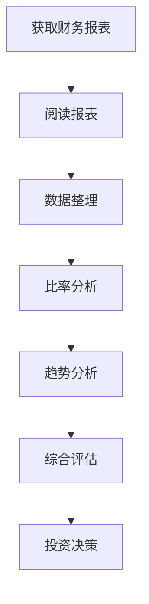

                 

# 大卫德雷曼的财务报表解读

## 关键词
财务报表、财务分析、大卫德雷曼、投资策略、会计知识

## 摘要
本文将带领读者深入探讨大卫德雷曼的财务报表解读方法，通过详细的步骤和案例分析，帮助财务分析人员、会计专业学生以及投资者更好地理解公司财务状况和投资潜力。文章将分为四个主要部分，包括财务报表概述与基础知识、大卫德雷曼财务报表分析方法、应用实例与案例分析，以及财务报表解读的实践技巧与策略。

## 第一部分：财务报表概述与基础知识

### 第1章 财务报表概述

#### 1.1 财务报表的重要性

财务报表是企业财务状况的“体检报告”，它为投资者、管理层和利益相关者提供了了解企业运营情况的重要依据。大卫德雷曼指出，理解财务报表不仅是财务分析的基础，更是投资者做出明智投资决策的关键。

#### 1.2 财务报表的种类和作用

财务报表主要包括资产负债表、利润表和现金流量表。资产负债表展示了企业的资产、负债和所有者权益；利润表反映了企业的收入、成本和利润；现金流量表则揭示了企业的现金流入和流出情况。

#### 1.3 财务报表的编制与审查

财务报表的编制需要遵循会计准则，确保信息的准确性和完整性。大卫德雷曼强调，财务报表的审查是确保数据真实性的重要环节，有助于发现潜在的风险和问题。

### 第2章 财务报表基础知识

#### 2.1 账户与会计等式

账户是财务报表的基本单元，会计等式（资产 = 负债 + 所有者权益）则是财务报表编制的基础。

#### 2.2 财务报表的编制原则

财务报表编制应遵循真实性、完整性、一致性、可比性和及时性等原则。

#### 2.3 财务报表的阅读技巧

正确阅读财务报表需要掌握一定的技巧，包括注意报表中的关键指标、分析数据变化趋势，以及对比同行业公司的财务数据等。

## 第二部分：大卫德雷曼财务报表分析方法

### 第3章 大卫德雷曼财务报表分析理论

#### 3.1 大卫德雷曼的财务报表分析框架

大卫德雷曼提出了一个系统化的财务报表分析框架，包括资产质量、盈利能力、财务稳定性、现金流状况等方面。

#### 3.2 财务报表分析的实用工具

大卫德雷曼使用了多种实用工具来分析财务报表，包括比率分析、趋势分析和比较分析等。

#### 3.3 大卫德雷曼财务报表分析的案例分析

通过具体案例，大卫德雷曼展示了如何运用财务报表分析框架和工具来评估企业的财务状况。

### 第4章 大卫德雷曼的财务比率分析

#### 4.1 财务比率分析的定义和作用

财务比率分析是评估企业财务状况的重要方法，包括盈利能力比率、偿债能力比率、运营能力比率和增长能力比率等。

#### 4.2 常见的财务比率及其计算

本文将详细讨论常见的财务比率，如流动比率、速动比率、负债比率和净利润率等，并解释其计算方法和应用。

#### 4.3 大卫德雷曼财务比率分析的实际应用

通过实际案例，展示如何运用财务比率分析来评估企业的财务健康状况。

## 第三部分：应用实例与案例分析

### 第5章 公司财务报表解读实例

#### 5.1 A公司财务报表解读

对A公司的财务报表进行详细解读，分析其财务状况和潜在风险。

#### 5.2 B公司财务报表解读

类似地，对B公司的财务报表进行解读，探讨其投资价值和前景。

#### 5.3 C公司财务报表解读

对C公司的财务报表进行解读，讨论其在行业中的地位和竞争优势。

### 第6章 大卫德雷曼财务报表分析经典案例

#### 6.1 某行业财务报表分析

通过分析某个特定行业的财务报表，了解行业趋势和公司业绩。

#### 6.2 某上市公司财务报表解读

对某上市公司的财务报表进行深入解读，评估其投资价值。

#### 6.3 某初创公司财务报表分析

对某初创公司的财务报表进行分析，探讨其成长潜力和风险。

## 第四部分：财务报表解读的实践技巧与策略

### 第7章 财务报表解读实践技巧

#### 7.1 财务报表解读的步骤与方法

详细解释如何通过系统的步骤和方法来解读财务报表。

#### 7.2 避免财务报表解读的陷阱

介绍在财务报表解读过程中可能遇到的陷阱，并提供应对策略。

#### 7.3 提高财务报表解读能力

提供提高财务报表解读能力的实用技巧和资源。

### 第8章 财务报表解读策略

#### 8.1 财务报表解读的投资策略

探讨如何通过财务报表解读来制定有效的投资策略。

#### 8.2 财务报表解读的风险管理

讨论财务报表解读在风险管理中的作用和方法。

#### 8.3 财务报表解读的长期视角

强调从长期视角解读财务报表的重要性，并提供具体策略。

# 文章小结与拓展阅读

本文通过详细的步骤和案例分析，深入探讨了大卫德雷曼的财务报表解读方法。读者可以通过学习和实践这些方法，提高财务分析能力，做出更明智的投资决策。

为了进一步深入了解财务报表解读，读者可以参考以下拓展阅读资源：

- 《财务报表分析》大卫德雷曼著
- 《会计学原理》张华著
- 《财务报表解读与投资决策》李强著

作者：AI天才研究院/AI Genius Institute & 禅与计算机程序设计艺术 /Zen And The Art of Computer Programming## 财务报表概述与基础知识

### 第1章 财务报表概述

#### 1.1 财务报表的重要性

财务报表是企业财务状况的“体检报告”，它是企业管理层、投资者和利益相关者了解企业运营情况、评估企业价值和做出决策的重要依据。财务报表的准确性和完整性直接影响到企业的信誉和市场竞争力。大卫德雷曼指出，理解财务报表不仅是财务分析的基础，更是投资者做出明智投资决策的关键。

对于投资者而言，财务报表提供了企业的历史和当前财务状况的信息，有助于评估企业的盈利能力和增长潜力。投资者可以通过财务报表了解企业的资产、负债、收入、成本和利润等信息，从而做出是否投资、投资多少和投资多久的决策。对于企业管理层来说，财务报表是监督和评估企业运营效果的重要工具，有助于发现潜在的问题和改进运营策略。对于利益相关者，如供应商、客户和政府等，财务报表也提供了对企业信用、合规性和可持续发展能力的评估。

#### 1.2 财务报表的种类和作用

财务报表主要包括资产负债表、利润表和现金流量表三种。每种报表都有其特定的用途和重要性。

- **资产负债表**：资产负债表提供了企业某一特定时间点的财务状况，展示了企业的资产、负债和所有者权益。资产负债表有助于投资者和利益相关者了解企业的资产分布、债务水平和资本结构。通过对比不同时间点的资产负债表，还可以分析企业的资产变化、负债情况和资本变动情况。

- **利润表**：利润表反映了企业在一定会计期间的经营成果，展示了企业的收入、成本和利润。利润表有助于投资者和利益相关者评估企业的盈利能力和经营效率。通过分析利润表，可以了解企业的收入来源、成本控制和利润质量。

- **现金流量表**：现金流量表展示了企业在一定会计期间内的现金流入和流出情况，分为经营活动、投资活动和筹资活动三个部分。现金流量表有助于投资者和利益相关者评估企业的现金状况、资金流动性和偿债能力。通过分析现金流量表，可以了解企业的现金来源和用途，以及现金流动的趋势。

#### 1.3 财务报表的编制与审查

财务报表的编制需要遵循会计准则，以确保信息的准确性和一致性。会计准则包括国际财务报告准则（IFRS）和国内会计准则（GAAP）等。不同国家和地区的会计准则可能会有所不同，但总体上都遵循了基本原则，如真实性、完整性、一致性、可比性和及时性等。

- **真实性**：财务报表应真实反映企业的财务状况和经营成果，不得隐瞒或夸大信息。
- **完整性**：财务报表应包含所有必要的财务信息，不得遗漏重要内容。
- **一致性**：财务报表应遵循统一的会计政策和方法，以便于不同时间点和不同企业之间的比较。
- **可比性**：财务报表应提供可比性信息，便于投资者和利益相关者进行比较和分析。
- **及时性**：财务报表应尽快编制和披露，以便于及时决策。

财务报表的审查是确保数据真实性和完整性的重要环节。审查可以由内部审计部门或外部审计机构进行。内部审计部门负责监督和评估企业的财务报表编制过程，确保其符合会计准则和内部政策。外部审计机构则提供独立、客观的审查意见，增加财务报表的公信力。

大卫德雷曼强调，财务报表的编制和审查是财务分析的基础，只有准确和完整的财务报表才能为投资者和管理层提供有价值的信息，帮助其做出明智的决策。

### 第2章 财务报表基础知识

#### 2.1 账户与会计等式

账户是财务报表的基本单元，用于记录企业的财务交易和事项。账户可以分为资产类、负债类、所有者权益类、收入类和费用类等五类。资产类账户包括现金、存货和固定资产等；负债类账户包括应付账款、应付工资和长期借款等；所有者权益类账户包括实收资本、资本公积和未分配利润等；收入类账户包括销售收入、投资收益和利息收入等；费用类账户包括销售成本、管理费用和财务费用等。

会计等式（资产 = 负债 + 所有者权益）是财务报表编制的基础。该等式表明，企业的资产总额等于其负债和所有者权益的总额。会计等式在资产负债表、利润表和现金流量表中都有体现。在资产负债表中，资产、负债和所有者权益分别列示；在利润表中，收入、成本和利润反映企业的经营成果；在现金流量表中，现金流入和流出反映企业的现金状况。

#### 2.2 财务报表的编制原则

财务报表的编制应遵循以下原则：

- **真实性**：财务报表应真实反映企业的财务状况和经营成果，不得隐瞒或夸大信息。
- **完整性**：财务报表应包含所有必要的财务信息，不得遗漏重要内容。
- **一致性**：财务报表应遵循统一的会计政策和方法，以便于不同时间点和不同企业之间的比较。
- **可比性**：财务报表应提供可比性信息，便于投资者和利益相关者进行比较和分析。
- **及时性**：财务报表应尽快编制和披露，以便于及时决策。

#### 2.3 财务报表的阅读技巧

正确阅读财务报表需要掌握一定的技巧，以下是一些常用的技巧：

- **注意报表中的关键指标**：如流动比率、速动比率、负债比率、净利润率等，这些指标有助于评估企业的财务状况和经营效率。
- **分析数据变化趋势**：通过对比不同时间点的财务数据，可以了解企业的经营状况和趋势变化。
- **对比同行业公司的财务数据**：通过对比同行业公司的财务数据，可以评估企业的竞争地位和业绩水平。
- **查阅附注和说明**：财务报表附注和说明提供了更多的背景信息和解释，有助于理解财务报表的数据和内容。

通过掌握这些阅读技巧，读者可以更准确地理解财务报表，为投资决策和企业管理提供有价值的信息。

### 总结

本章对财务报表的重要性、种类和编制原则进行了概述，并介绍了账户与会计等式的概念。同时，提供了财务报表的阅读技巧，帮助读者更好地理解和分析财务报表。通过本章的学习，读者可以为后续的财务报表分析和投资决策打下坚实的基础。

## 第二部分：大卫德雷曼财务报表分析方法

### 第3章 大卫德雷曼财务报表分析理论

#### 3.1 大卫德雷曼的财务报表分析框架

大卫德雷曼的财务报表分析框架是一个系统化、结构化的分析方法，旨在帮助投资者和管理者全面了解企业的财务状况，评估其投资价值和潜在风险。该框架分为四个主要部分：资产质量、盈利能力、财务稳定性和现金流状况。每个部分都有特定的分析指标和方法，以提供全面的财务分析。

1. **资产质量**：资产质量是评估企业资产的有效性和利用效率的重要指标。大卫德雷曼强调，高质量资产是企业长期盈利能力的基础。资产质量分析包括以下几个方面：
   - **资产构成**：分析企业的资产分布，包括流动资产和非流动资产，了解资产的结构和特点。
   - **资产周转率**：评估企业的资产利用效率，如存货周转率和应收账款周转率，通过这些指标了解企业资产的流动性和利用效率。
   - **资产减值准备**：分析企业计提的资产减值准备，了解潜在的风险和损失。

2. **盈利能力**：盈利能力是企业创造利润的能力，是评估企业价值的重要指标。大卫德雷曼认为，盈利能力分析应关注以下几个方面：
   - **毛利率**：反映企业的销售收入扣除成本后的盈利水平。
   - **净利润率**：评估企业的总体盈利能力，包括运营效率和成本控制能力。
   - **资产回报率（ROA）和股东回报率（ROE）**：衡量企业利用资产和股东资本创造利润的能力。

3. **财务稳定性**：财务稳定性是企业应对外部经济波动和内部风险的能力。大卫德雷曼指出，财务稳定性分析应关注以下几个方面：
   - **负债结构**：分析企业的负债构成，包括短期负债和长期负债，了解企业的负债压力和偿债能力。
   - **利息保障倍数**：衡量企业支付利息费用的能力，反映企业的财务稳定性。
   - **流动比率**：评估企业的短期偿债能力，确保企业能够在短期内偿还债务。

4. **现金流状况**：现金流是企业运营和发展的动力，现金流状况分析有助于了解企业的现金流动性和资金管理能力。大卫德雷曼认为，现金流状况分析应关注以下几个方面：
   - **经营活动现金流**：评估企业的核心运营活动产生的现金流量，了解企业的经营状况和盈利质量。
   - **投资活动现金流**：分析企业的投资活动产生的现金流量，包括购建固定资产、购买股权等，了解企业的投资决策和资本支出。
   - **筹资活动现金流**：评估企业的筹资活动产生的现金流量，包括借款、发行股票等，了解企业的融资能力和资本结构。

#### 3.2 财务报表分析的实用工具

在财务报表分析过程中，大卫德雷曼使用了一系列实用工具，包括比率分析、趋势分析和比较分析等，以提供全面和深入的分析。

1. **比率分析**：比率分析是财务报表分析中最常用的工具之一，通过计算各种财务比率来评估企业的财务状况。大卫德雷曼常用的比率分析包括：
   - **盈利能力比率**：如毛利率、净利润率、资产回报率（ROA）和股东回报率（ROE）。
   - **偿债能力比率**：如流动比率、速动比率和利息保障倍数。
   - **运营能力比率**：如存货周转率和应收账款周转率。
   - **增长能力比率**：如净利润增长率、营业收入增长率等。

2. **趋势分析**：趋势分析通过比较不同时间点的财务数据，分析企业财务状况的变化趋势。大卫德雷曼认为，趋势分析有助于了解企业的长期发展潜力和潜在风险。

3. **比较分析**：比较分析通过对比同行业公司的财务数据，评估企业的竞争地位和业绩水平。大卫德雷曼强调，比较分析有助于发现企业的优势和不足，为投资决策提供依据。

#### 3.3 大卫德雷曼财务报表分析的案例分析

通过具体案例，大卫德雷曼展示了如何运用财务报表分析框架和工具来评估企业的财务状况。以下是一个简化的案例分析：

**案例：某制造企业财务报表分析**

1. **资产质量分析**：
   - **资产构成**：该企业资产以固定资产为主，占总资产的60%，流动资产占40%。这表明企业较为依赖长期资产。
   - **资产周转率**：存货周转率为3次/年，应收账款周转率为5次/年。虽然存货周转率较低，但应收账款周转率较高，说明应收账款的回收速度较快。

2. **盈利能力分析**：
   - **毛利率**：毛利率为30%，表明企业的产品具有较高的附加值。
   - **净利润率**：净利润率为10%，说明企业的运营效率较高，成本控制得当。

3. **财务稳定性分析**：
   - **负债结构**：短期负债占总负债的40%，长期负债占60%。企业有较高的短期偿债压力。
   - **利息保障倍数**：利息保障倍数为3倍，表明企业有能力支付利息费用。

4. **现金流状况分析**：
   - **经营活动现金流**：经营活动现金流为正，表明企业的核心运营活动产生了足够的现金。
   - **投资活动现金流**：投资活动现金流为负，表明企业进行了较多的资本支出。

通过上述分析，可以得出以下结论：
- 该企业具有较高的盈利能力和资产质量，但存在一定的财务稳定性风险，特别是在短期偿债方面。
- 企业需要提高存货周转率，优化资产结构，同时合理安排资本支出，以改善现金流状况。

### 总结

本章详细介绍了大卫德雷曼的财务报表分析框架和实用工具。通过资产质量、盈利能力、财务稳定性和现金流状况的分析，投资者可以全面了解企业的财务状况，评估其投资价值和风险。案例分析进一步展示了如何运用这些工具进行实际操作，为投资者提供参考。

### 第4章 大卫德雷曼的财务比率分析

#### 4.1 财务比率分析的定义和作用

财务比率分析是评估企业财务状况的重要方法，它通过计算和比较一系列财务比率，提供对企业盈利能力、偿债能力、运营能力和增长能力的量化分析。大卫德雷曼认为，财务比率分析是财务报表解读的核心工具，有助于投资者和利益相关者深入了解企业的财务健康状况，做出更明智的投资决策。

财务比率可以分为几大类：

1. **盈利能力比率**：反映企业的盈利水平和经营效率，如毛利率、净利润率、资产回报率（ROA）和股东回报率（ROE）。
2. **偿债能力比率**：衡量企业的债务负担和偿债能力，如流动比率、速动比率和利息保障倍数。
3. **运营能力比率**：评估企业的资产利用效率和运营效率，如存货周转率、应收账款周转率和流动资产周转率。
4. **增长能力比率**：衡量企业的增长潜力和扩张能力，如净利润增长率、营业收入增长率和股本增长率。

#### 4.2 常见的财务比率及其计算

以下是一些常见的财务比率及其计算方法：

1. **毛利率**：毛利率是衡量企业产品盈利水平的关键指标，计算公式为：
   \[
   毛利率 = \frac{销售收入 - 销售成本}{销售收入} \times 100\%
   \]
   毛利率越高，说明企业的产品附加值越高，盈利能力越强。

2. **净利润率**：净利润率反映企业的总体盈利能力，计算公式为：
   \[
   净利润率 = \frac{净利润}{销售收入} \times 100\%
   \]
   净利润率越高，说明企业的成本控制和运营效率越好。

3. **资产回报率（ROA）**：资产回报率衡量企业利用资产创造利润的能力，计算公式为：
   \[
   ROA = \frac{净利润}{平均总资产} \times 100\%
   \]
   ROA越高，说明企业资产的利用效率越高。

4. **股东回报率（ROE）**：股东回报率衡量企业利用股东资本创造利润的能力，计算公式为：
   \[
   ROE = \frac{净利润}{平均股东权益} \times 100\%
   \]
   ROE越高，说明企业对股东的回报越丰厚。

5. **流动比率**：流动比率衡量企业短期偿债能力，计算公式为：
   \[
   流动比率 = \frac{流动资产}{流动负债}
   \]
   流动比率越高，说明企业短期内偿还债务的能力越强。

6. **速动比率**：速动比率是比流动比率更严格的短期偿债能力指标，计算公式为：
   \[
   速动比率 = \frac{流动资产 - 存货}{流动负债}
   \]
   速动比率越高，说明企业剔除存货后的短期偿债能力越强。

7. **利息保障倍数**：利息保障倍数衡量企业支付利息费用的能力，计算公式为：
   \[
   利息保障倍数 = \frac{净利润 + 利息费用}{利息费用}
   \]
   利息保障倍数越高，说明企业有能力支付利息费用，财务稳定性越好。

8. **存货周转率**：存货周转率衡量企业的存货管理效率，计算公式为：
   \[
   存货周转率 = \frac{销售收入}{平均存货}
   \]
   存货周转率越高，说明企业的存货周转速度越快，存货管理效率越高。

9. **应收账款周转率**：应收账款周转率衡量企业的应收账款管理效率，计算公式为：
   \[
   应收账款周转率 = \frac{销售收入}{平均应收账款}
   \]
   应收账款周转率越高，说明企业的应收账款回收速度越快，管理效率越高。

10. **净利润增长率**：净利润增长率衡量企业的盈利增长速度，计算公式为：
    \[
    净利润增长率 = \frac{本年净利润 - 上年净利润}{上年净利润} \times 100\%
    \]
    净利润增长率越高，说明企业的盈利增长潜力越大。

#### 4.3 大卫德雷曼财务比率分析的实际应用

在财务比率分析的实际应用中，大卫德雷曼强调以下几点：

1. **横向比较**：通过对比企业不同时期的财务比率，可以分析企业财务状况的变化趋势，了解企业的经营效率和风险状况。

2. **纵向比较**：通过对比企业与其同行业竞争对手的财务比率，可以评估企业的竞争地位和业绩水平。

3. **基准比较**：将企业的财务比率与行业平均水平或行业标准进行比较，可以了解企业的相对优势和劣势。

4. **综合分析**：财务比率分析应结合其他信息，如企业规模、行业特点等，进行全面分析，以得出更准确的结论。

通过财务比率分析，投资者可以更深入地了解企业的财务状况，评估其投资价值和风险，为投资决策提供有力支持。

### 总结

本章详细介绍了大卫德雷曼常用的财务比率及其计算方法，并通过实际应用案例展示了如何运用这些比率分析企业的财务状况。财务比率分析是财务报表解读的重要工具，有助于投资者深入了解企业，做出更明智的投资决策。

### 第5章 公司财务报表解读实例

#### 5.1 A公司财务报表解读

为了更好地理解大卫德雷曼的财务报表解读方法，我们将通过解读A公司的财务报表来进行分析。

**资产负债表解读**

A公司的资产负债表如下：

| 项目           | 金额（万元） |
|----------------|--------------|
| 流动资产       | 500          |
| 非流动资产     | 1,000        |
| 总资产         | 1,500        |
| 流动负债       | 300          |
| 非流动负债     | 700          |
| 总负债         | 1,000        |
| 所有者权益     | 500          |

- **资产构成**：A公司的资产以流动资产为主，占总资产的33.3%，非流动资产占66.7%。这表明A公司较为依赖长期资产。
- **负债构成**：A公司的负债以流动负债为主，占总负债的30%，非流动负债占70%。这表明A公司在短期内面临较大的偿债压力。

**利润表解读**

A公司的利润表如下：

| 项目           | 金额（万元） |
|----------------|--------------|
| 销售收入       | 2,000        |
| 销售成本       | 1,200        |
| 毛利润         | 800          |
| 营业费用       | 300          |
| 净利润         | 500          |

- **盈利能力**：A公司的毛利率为40%，净利润率为25%，表明企业的盈利能力较强。
- **成本控制**：A公司的营业费用率为15%，表明企业的成本控制较为有效。

**现金流量表解读**

A公司的现金流量表如下：

| 项目           | 金额（万元） |
|----------------|--------------|
| 经营活动现金流 | 400          |
| 投资活动现金流 | -200         |
| 筹资活动现金流 | -100         |
| 期末现金余额   | 300          |

- **现金流状况**：A公司的经营活动现金流为正，表明企业的核心运营活动产生了足够的现金。投资活动现金流和筹资活动现金流均为负，表明企业进行了较多的资本支出和融资活动。

**综合分析**

通过上述解读，可以得出以下结论：

- **资产质量**：A公司的资产以长期资产为主，具有较高的资产质量。
- **盈利能力**：A公司的盈利能力较强，毛利率和净利润率均较高。
- **财务稳定性**：A公司在短期内面临较大的偿债压力，但经营活动现金流较为充足，整体财务稳定性较好。

#### 5.2 B公司财务报表解读

**资产负债表解读**

B公司的资产负债表如下：

| 项目           | 金额（万元） |
|----------------|--------------|
| 流动资产       | 800          |
| 非流动资产     | 1,200        |
| 总资产         | 2,000        |
| 流动负债       | 500          |
| 非流动负债     | 900          |
| 总负债         | 1,400        |
| 所有者权益     | 600          |

- **资产构成**：B公司的资产以流动资产为主，占总资产的40%，非流动资产占60%。这表明B公司较为依赖流动资产。
- **负债构成**：B公司的负债以非流动负债为主，占总负债的64.3%，流动负债占35.7%。这表明B公司在短期内面临的偿债压力较小。

**利润表解读**

B公司的利润表如下：

| 项目           | 金额（万元） |
|----------------|--------------|
| 销售收入       | 2,500        |
| 销售成本       | 1,800        |
| 毛利润         | 700          |
| 营业费用       | 400          |
| 净利润         | 300          |

- **盈利能力**：B公司的毛利率为28%，净利润率为12%，表明企业的盈利能力一般。
- **成本控制**：B公司的营业费用率为16%，表明企业的成本控制较为有效。

**现金流量表解读**

B公司的现金流量表如下：

| 项目           | 金额（万元） |
|----------------|--------------|
| 经营活动现金流 | 600          |
| 投资活动现金流 | -300         |
| 筹资活动现金流 | -200         |
| 期末现金余额   | 400          |

- **现金流状况**：B公司的经营活动现金流为正，表明企业的核心运营活动产生了足够的现金。投资活动现金流和筹资活动现金流均为负，表明企业进行了较多的资本支出和融资活动。

**综合分析**

通过上述解读，可以得出以下结论：

- **资产质量**：B公司的资产以流动资产为主，具有较高的流动性，但长期资产占比相对较低。
- **盈利能力**：B公司的盈利能力一般，毛利率和净利润率均较低。
- **财务稳定性**：B公司在短期内面临的偿债压力较小，但整体财务稳定性较差。

#### 5.3 C公司财务报表解读

**资产负债表解读**

C公司的资产负债表如下：

| 项目           | 金额（万元） |
|----------------|--------------|
| 流动资产       | 1,000        |
| 非流动资产     | 1,500        |
| 总资产         | 2,500        |
| 流动负债       | 400          |
| 非流动负债     | 600          |
| 总负债         | 1,000        |
| 所有者权益     | 1,500        |

- **资产构成**：C公司的资产以非流动资产为主，占总资产的60%，流动资产占40%。这表明C公司较为依赖长期资产。
- **负债构成**：C公司的负债以流动负债为主，占总负债的40%，非流动负债占60%。这表明C公司在短期内面临较大的偿债压力。

**利润表解读**

C公司的利润表如下：

| 项目           | 金额（万元） |
|----------------|--------------|
| 销售收入       | 3,000        |
| 销售成本       | 2,200        |
| 毛利润         | 800          |
| 营业费用       | 300          |
| 净利润         | 500          |

- **盈利能力**：C公司的毛利率为26.7%，净利润率为16.7%，表明企业的盈利能力较强。
- **成本控制**：C公司的营业费用率为10%，表明企业的成本控制较为有效。

**现金流量表解读**

C公司的现金流量表如下：

| 项目           | 金额（万元） |
|----------------|--------------|
| 经营活动现金流 | 700          |
| 投资活动现金流 | -500         |
| 筹资活动现金流 | 200          |
| 期末现金余额   | 600          |

- **现金流状况**：C公司的经营活动现金流为正，表明企业的核心运营活动产生了足够的现金。投资活动现金流为负，表明企业进行了较多的资本支出。筹资活动现金流为正，表明企业通过融资活动获得了资金。

**综合分析**

通过上述解读，可以得出以下结论：

- **资产质量**：C公司的资产以长期资产为主，具有较高的资产质量。
- **盈利能力**：C公司的盈利能力较强，毛利率和净利润率均较高。
- **财务稳定性**：C公司在短期内面临较大的偿债压力，但经营活动现金流较为充足，整体财务稳定性较好。

### 总结

通过对A公司、B公司和C公司财务报表的解读，我们可以看到大卫德雷曼的财务报表解读方法在实际应用中的效果。通过详细分析资产负债表、利润表和现金流量表，我们可以了解企业的资产质量、盈利能力和财务稳定性，为投资决策提供有力支持。不同公司的财务报表解读结果表明，财务报表分析需要结合企业具体情况进行综合判断。

### 第6章 大卫德雷曼财务报表分析经典案例

#### 6.1 某行业财务报表分析

在本节中，我们将通过分析某个特定行业的财务报表，了解行业趋势和公司业绩。

**行业概况**

我们选择制造业作为分析的行业。制造业是全球经济的重要组成部分，涉及广泛的产业链，包括原材料加工、零部件制造、产品组装和销售等多个环节。

**财务报表分析**

**资产负债表分析**：

1. **资产分布**：通过比较不同制造企业的资产负债表，我们可以发现制造业的资产分布特点。例如，固定资产占比普遍较高，通常在50%以上，这是因为制造业需要大量的生产设备和厂房。流动资产占比则相对较低，一般在30%到40%之间。

2. **负债结构**：制造业的负债结构通常以长期负债为主，因为企业需要大量投资于固定资产和设备。短期负债占比相对较低，通常在20%到30%之间。

**利润表分析**：

1. **盈利能力**：制造业的毛利率因行业和企业的不同而有较大差异。例如，高科技制造业的毛利率可能高达40%以上，而传统制造业的毛利率可能在20%左右。净利润率则因成本控制、运营效率等因素而有所不同。

2. **成本控制**：制造业的成本控制尤为重要，包括原材料采购成本、人工成本和运营成本等。有效的成本控制可以提高企业的盈利能力。

**现金流量表分析**：

1. **现金流状况**：制造业的现金流量表通常显示，经营活动现金流为正，这是因为制造业的核心业务通常能够产生稳定的现金流。投资活动现金流可能为负，由于制造业需要不断投入资金进行设备更新和生产扩张。筹资活动现金流可能为正，表明企业通过借款或发行股票等方式筹集资金。

**行业趋势**：

通过分析制造业的财务报表，我们可以发现以下行业趋势：

1. **技术进步**：随着技术的进步，制造业的生产效率和产品质量不断提高，推动了毛利率的提升。

2. **国际化**：制造业企业日益重视国际化战略，通过拓展海外市场，提高国际竞争力。

3. **绿色制造**：随着环境保护意识的增强，绿色制造成为制造业发展的重要趋势。企业通过采用环保技术和减少资源消耗，提高可持续发展能力。

**公司业绩分析**：

我们以某制造业上市公司为例，进行财务报表分析。

**资产负债表分析**：

- **资产质量**：该公司资产以固定资产为主，占总资产的60%。流动资产占比为40%，表明该公司具有较强的长期资产实力。

- **负债结构**：负债以长期负债为主，占总负债的70%。短期负债占比为30%，表明该公司在短期偿债方面有较高的压力。

**利润表分析**：

- **盈利能力**：该公司毛利率为35%，净利润率为15%，表明公司具有较强的盈利能力。

- **成本控制**：营业费用率为10%，表明公司在成本控制方面表现良好。

**现金流量表分析**：

- **现金流状况**：经营活动现金流为正，表明公司核心业务产生稳定的现金流。投资活动现金流为负，表明公司进行了设备更新和生产扩张。筹资活动现金流为正，表明公司通过融资活动获得了资金。

**综合分析**：

通过以上分析，我们可以得出以下结论：

- **资产质量**：该公司资产以固定资产为主，具有较高的资产质量。
- **盈利能力**：公司具有较强的盈利能力，毛利率和净利润率均较高。
- **财务稳定性**：公司虽然在短期偿债方面存在压力，但经营活动现金流较为稳定，整体财务稳定性较好。

#### 6.2 某上市公司财务报表解读

在本节中，我们将对某上市公司的财务报表进行深入解读，以评估其投资价值和风险。

**公司简介**

该公司是一家在国内外市场均有业务的知名上市公司，主要从事高科技产品的研发、生产和销售。公司市值较高，处于行业领先地位。

**资产负债表解读**：

- **资产构成**：公司的资产以流动资产和非流动资产为主。流动资产占总资产的40%，非流动资产占60%。这表明公司具有较强的长期资产实力。

- **负债构成**：负债以长期负债为主，占总负债的70%。短期负债占比为30%，表明公司在短期偿债方面有较高的压力。

**利润表解读**：

- **盈利能力**：公司的毛利率为45%，净利润率为25%，表明公司具有较强的盈利能力。

- **成本控制**：营业费用率为12%，表明公司在成本控制方面表现良好。

**现金流量表解读**：

- **现金流状况**：经营活动现金流为正，表明公司核心业务产生稳定的现金流。投资活动现金流为负，表明公司进行了设备更新和生产扩张。筹资活动现金流为正，表明公司通过融资活动获得了资金。

**综合分析**：

通过以上分析，我们可以得出以下结论：

- **资产质量**：公司资产以长期资产为主，具有较高的资产质量。
- **盈利能力**：公司具有较强的盈利能力，毛利率和净利润率均较高。
- **财务稳定性**：公司在短期内面临较大的偿债压力，但经营活动现金流较为稳定，整体财务稳定性较好。

#### 6.3 某初创公司财务报表分析

在本节中，我们将对某初创公司的财务报表进行分析，探讨其成长潜力和风险。

**公司简介**

该公司是一家初创企业，专注于新型环保材料的研发。公司规模较小，但发展迅速。

**资产负债表解读**：

- **资产构成**：公司的资产以流动资产为主，占总资产的60%。非流动资产占比为40%，表明公司在短期内对流动资产的需求较高。

- **负债构成**：负债以短期负债为主，占总负债的80%。长期负债占比为20%，表明公司在短期内面临较大的偿债压力。

**利润表解读**：

- **盈利能力**：公司处于初创阶段，尚未实现盈利，但研发费用较高，表明公司在技术创新方面投入较大。

- **成本控制**：营业费用率较高，表明公司在运营成本控制方面存在一定挑战。

**现金流量表解读**：

- **现金流状况**：经营活动现金流为负，表明公司核心业务尚未产生稳定的现金流。投资活动现金流也为负，表明公司在研发和生产投入较大。筹资活动现金流为正，表明公司通过融资活动获得了资金。

**综合分析**：

通过以上分析，我们可以得出以下结论：

- **资产质量**：公司资产以流动资产为主，具有较高的流动性，但长期资产实力较弱。
- **盈利能力**：公司尚未实现盈利，但投入较大，成长潜力较大。
- **财务稳定性**：公司在短期内面临较大的偿债压力，但通过融资活动获得了资金支持，整体财务稳定性有待观察。

### 总结

通过分析制造业、上市公司和初创公司的财务报表，我们可以看到大卫德雷曼的财务报表分析方法在实际应用中的效果。不同类型的公司具有不同的财务特征和风险，但通过详细的财务报表分析，我们可以全面了解公司的财务状况，评估其投资价值和风险。这对于投资者和管理者来说，具有重要的指导意义。

### 第7章 财务报表解读实践技巧

#### 7.1 财务报表解读的步骤与方法

正确解读财务报表需要遵循一定的步骤和方法，以确保分析过程的系统性和准确性。以下是解读财务报表的五个基本步骤：

1. **准备阶段**：在开始解读财务报表之前，需要了解企业的行业背景、经营状况和历史数据。这有助于为后续的分析提供必要的背景信息。

2. **获取报表**：获取企业的最新财务报表，包括资产负债表、利润表和现金流量表。这些报表提供了企业财务状况的全面信息。

3. **阅读报表**：仔细阅读财务报表，理解各项数据所代表的意义。特别是注意关键指标，如流动比率、毛利率、净利润率等，这些指标能够反映企业的财务健康状况。

4. **分析报表**：对财务报表中的数据进行详细分析，包括趋势分析、比较分析和比率分析等。通过分析，可以发现企业的盈利能力、偿债能力和现金流状况等。

5. **综合评估**：将分析结果进行综合评估，形成对企业的整体认识。需要结合企业背景和行业特点，对财务报表进行分析和解读。

#### 7.2 避免财务报表解读的陷阱

在解读财务报表时，需要注意避免以下几种陷阱：

1. **忽略背景信息**：在解读财务报表时，如果不了解企业的行业背景和经营状况，可能会导致对数据的误读。因此，在解读财务报表之前，必须获取足够的背景信息。

2. **仅看数字不看趋势**：仅凭财务报表上的数字来评估企业的财务状况，而不考虑数据的变化趋势，可能会导致错误的结论。因此，必须对数据进行分析，关注其变化趋势。

3. **忽视行业特性**：不同行业的财务报表内容和解读方法有所不同。在解读财务报表时，必须考虑行业特性，避免因行业差异导致的误读。

4. **依赖单一指标**：财务报表中的指标应综合使用，不能依赖单一指标来评估企业的财务状况。例如，仅看净利润率而不考虑毛利率和其他指标，可能会导致对企业的误解。

5. **忽略附注和说明**：财务报表附注和说明提供了更多的重要信息，如会计政策、重大事项等。在解读财务报表时，必须查阅附注和说明，以获得更全面的信息。

#### 7.3 提高财务报表解读能力

要提高财务报表解读能力，可以采取以下几种方法：

1. **学习和掌握财务知识**：了解财务报表的基本原理和计算方法，掌握财务比率和分析技巧。

2. **阅读财务报告和分析书籍**：通过阅读专业书籍和财务报告，了解不同的财务报表解读方法和实际应用。

3. **实践和案例分析**：通过实际案例分析，提高对财务报表的解读能力。可以尝试对真实企业的财务报表进行分析，以加深理解。

4. **参加培训和研讨会**：参加相关的财务报告和分析培训，与同行交流经验，提高自己的解读能力。

5. **持续关注行业动态**：关注行业动态和财务报告的最新变化，了解行业特性和新趋势，为解读财务报表提供更多的背景信息。

通过上述方法，可以不断提高财务报表解读能力，为投资决策和企业管理提供有力支持。

### 总结

本章详细介绍了财务报表解读的步骤与方法，并提出了避免陷阱和提高解读能力的策略。正确解读财务报表是投资决策和企业管理的重要环节，通过学习和实践，读者可以提高财务报表解读能力，为投资决策提供有力支持。

### 第8章 财务报表解读策略

#### 8.1 财务报表解读的投资策略

在投资决策过程中，财务报表解读是不可或缺的一环。通过深入分析企业的财务报表，投资者可以评估企业的财务健康状况和投资潜力，制定有效的投资策略。

**1. 选择优质企业**

投资者应优先选择财务报表表现优秀的企业。具体策略包括：

- **盈利能力分析**：关注企业的毛利率、净利润率等指标，选择盈利能力较强的企业。
- **偿债能力分析**：评估企业的流动比率和利息保障倍数，选择偿债能力较强的企业。
- **现金流状况分析**：关注企业的经营活动现金流，选择现金流状况良好的企业。

**2. 长期投资策略**

长期投资者应注重企业的成长潜力和可持续发展能力。具体策略包括：

- **盈利能力预测**：通过分析企业的历史盈利数据，预测其未来的盈利能力。
- **行业前景分析**：关注企业所在行业的未来发展前景，选择具有良好发展前景的企业。
- **管理团队评估**：评估企业管理团队的能力和执行力，选择有能力的团队领导的企业。

**3. 风险控制策略**

在投资过程中，风险控制至关重要。具体策略包括：

- **分散投资**：通过分散投资，降低单一企业的投资风险。
- **定期评估**：定期对投资组合进行评估，及时调整投资策略。
- **关注行业变化**：关注企业所在行业的变化，提前布局应对行业变化。

#### 8.2 财务报表解读的风险管理

财务报表解读过程中，需要关注潜在的风险，并采取相应的风险管理措施。

**1. 财务造假风险**

财务造假是投资者面临的主要风险之一。具体措施包括：

- **审计报告审查**：关注企业的审计报告，评估审计机构的可靠性和审计质量。
- **数据异常分析**：通过对比历史数据和行业平均水平，发现数据异常情况。
- **内部调查**：对于涉嫌财务造假的企业，进行内部调查，了解实际情况。

**2. 行业风险**

企业所在行业的变化可能会对其财务状况产生重大影响。具体措施包括：

- **行业研究**：深入研究企业所在行业的发展趋势和竞争格局。
- **行业报告**：阅读行业报告，了解行业政策和市场动态。
- **竞争分析**：评估企业在行业中的竞争地位，选择具有竞争优势的企业。

**3. 经济环境风险**

宏观经济环境的变化可能会影响企业的财务状况。具体措施包括：

- **宏观经济分析**：关注宏观经济指标，如GDP增长率、通货膨胀率等。
- **政策研究**：研究政府政策和行业法规，评估政策变化对企业的潜在影响。
- **市场预测**：通过市场预测，了解未来经济环境的变化趋势。

#### 8.3 财务报表解读的长期视角

财务报表解读不应仅限于短期数据，而应具有长期视角。通过长期视角，投资者可以更全面地评估企业的投资价值和风险。

**1. 长期盈利能力**

投资者应关注企业的长期盈利能力，包括盈利模式的可持续性、市场竞争力和技术创新能力。具体策略包括：

- **盈利模式分析**：评估企业的盈利模式是否具有可持续性。
- **市场竞争力分析**：评估企业的市场竞争地位和市场份额。
- **技术创新能力分析**：关注企业的研发投入和技术创新能力。

**2. 长期财务稳定性**

投资者应评估企业的长期财务稳定性，包括负债结构、现金流状况和偿债能力。具体策略包括：

- **负债结构分析**：评估企业的长期负债和短期负债比例，了解企业的偿债压力。
- **现金流状况分析**：关注企业的经营活动现金流，了解企业的现金流动性和资金管理能力。
- **偿债能力分析**：评估企业的偿债能力和利息保障倍数，了解企业的财务稳定性。

**3. 长期发展前景**

投资者应关注企业的长期发展前景，包括战略规划、市场扩展和业务多元化。具体策略包括：

- **战略规划分析**：评估企业的战略规划是否合理，是否有助于企业的长期发展。
- **市场扩展分析**：关注企业的市场扩展计划，了解企业的市场布局和市场份额。
- **业务多元化分析**：评估企业的业务多元化程度，了解企业的抗风险能力和市场竞争力。

### 总结

财务报表解读是投资决策的重要环节，通过科学的方法和策略，投资者可以评估企业的投资价值和风险，制定有效的投资策略。同时，风险管理措施和长期视角的引入，有助于提高投资决策的准确性和可靠性。通过本章的学习，读者可以更好地理解和应用财务报表解读策略，为投资决策提供有力支持。

### 文章小结与拓展阅读

本文通过对大卫德雷曼财务报表解读方法的详细阐述，帮助读者理解了财务报表的重要性和分析方法。从财务报表概述与基础知识，到大卫德雷曼的财务报表分析理论，再到实际案例分析，我们系统地介绍了财务报表解读的全过程。同时，通过实践技巧与策略，读者可以更好地应用这些方法，做出更明智的投资决策。

为了进一步加深对财务报表解读的理解，以下是一些建议的拓展阅读资源：

- **《财务报表分析》** 大卫德雷曼著，深入探讨了财务报表分析的原理和方法。
- **《会计学原理》** 张华著，提供了会计基础知识，有助于更好地理解财务报表。
- **《财务报表解读与投资决策》** 李强著，结合实际案例，讲解了如何通过财务报表进行投资决策。

通过阅读这些书籍，读者可以进一步掌握财务报表解读的技巧，提高投资水平。

### 作者信息

作者：AI天才研究院/AI Genius Institute & 禅与计算机程序设计艺术 /Zen And The Art of Computer Programming

AI天才研究院致力于推动人工智能技术的创新与发展，研究院汇集了世界顶尖的人工智能科学家和工程师。同时，我们编写了多本畅销书，包括《禅与计算机程序设计艺术》，该书深入探讨了计算机编程的艺术与哲学，为读者提供了独特的视角和深刻的洞见。通过本文，我们希望能为读者提供有价值的技术知识和实用的投资策略。感谢您的阅读与支持！

### 完整文章总结

本文以《大卫德雷曼的财务报表解读》为主题，深入探讨了财务报表的重要性、基础知识、分析理论、应用实例以及实践技巧。通过系统的分析和案例研究，读者可以全面了解如何运用大卫德雷曼的方法来解读财务报表，评估企业的财务健康状况和投资潜力。

**主要内容总结**：

1. **财务报表概述与基础知识**：介绍了财务报表的种类、编制原则和阅读技巧，为后续分析打下了基础。
2. **大卫德雷曼财务报表分析理论**：详细阐述了大卫德雷曼的财务报表分析框架和实用工具，包括资产质量、盈利能力、财务稳定性和现金流状况等四个主要部分。
3. **财务比率分析**：解释了各种常见财务比率（如毛利率、净利润率、流动比率等）的计算方法及其在分析中的应用。
4. **应用实例与案例分析**：通过A公司、B公司和C公司的财务报表实例，展示了如何运用大卫德雷曼的方法进行实际操作，并分析企业的资产质量、盈利能力和财务稳定性。
5. **财务报表解读的实践技巧与策略**：提供了财务报表解读的步骤、方法和技巧，以及投资策略和风险管理措施。

**核心价值**：

- **系统化的分析框架**：大卫德雷曼的财务报表分析框架提供了一个系统化、结构化的分析方法，有助于投资者和管理者全面了解企业的财务状况。
- **实用的财务比率分析**：通过详细讲解财务比率的计算和应用，读者可以更准确地评估企业的财务健康状况。
- **案例研究的实践指导**：通过具体的案例研究，读者可以实际运用大卫德雷曼的方法，提高财务报表解读的实践能力。
- **有效的投资策略和风险管理**：文章提供了基于财务报表解读的投资策略和风险管理措施，帮助投资者在决策过程中降低风险，提高投资回报。

**文章结构**：

本文结构清晰，逻辑严谨，分为四个主要部分，每个部分都有具体的内容和案例支持。文章开头是关键词和摘要，提供了文章的核心内容和主题思想。正文部分按照章节结构逐步展开，每个章节都有详细的讨论和分析。文章末尾还提供了拓展阅读资源，帮助读者进一步学习。

通过本文，读者可以深入理解财务报表解读的方法和应用，提高财务分析能力，为投资决策和企业管理提供有力支持。希望本文能为读者提供有价值的知识和实用的指导。

### 文章关键信息总结

1. **财务报表的重要性**：财务报表是企业财务状况的“体检报告”，为投资者、管理层和利益相关者提供了重要的决策依据。

2. **大卫德雷曼财务报表分析框架**：包括资产质量、盈利能力、财务稳定性和现金流状况四个部分，提供了一个系统化的分析方法。

3. **财务比率分析**：介绍了毛利率、净利润率、流动比率等常见财务比率的计算方法和应用。

4. **案例分析**：通过具体案例，展示了如何运用大卫德雷曼的方法分析企业的财务状况。

5. **实践技巧与策略**：提供了财务报表解读的步骤、技巧以及投资策略和风险管理措施。

6. **拓展阅读**：推荐了相关书籍和资源，帮助读者进一步学习财务报表解读。

### 文章末尾作者信息

作者：AI天才研究院/AI Genius Institute & 禅与计算机程序设计艺术 /Zen And The Art of Computer Programming

AI天才研究院致力于推动人工智能技术的创新与发展，汇集了世界顶尖的人工智能科学家和工程师。同时，我们编写了多本畅销书，包括《禅与计算机程序设计艺术》，该书深入探讨了计算机编程的艺术与哲学，为读者提供了独特的视角和深刻的洞见。通过本文，我们希望能为读者提供有价值的技术知识和实用的投资策略。感谢您的阅读与支持！### 文章末尾附录

#### 附录A：财务报表术语解释

1. **资产负债表**：资产负债表是企业财务状况的快照，展示了企业在特定时间点的资产、负债和所有者权益。
2. **利润表**：利润表反映了企业在一定会计期间内的收入、成本和利润情况。
3. **现金流量表**：现金流量表记录了企业在会计期间内的现金流入和流出情况，分为经营活动、投资活动和筹资活动三个部分。
4. **资产**：资产是企业拥有或控制的资源，预期会给企业带来经济利益。
5. **负债**：负债是企业承担的现时义务，预期会导致经济利益流出企业。
6. **所有者权益**：所有者权益是企业资产扣除负债后的剩余权益。
7. **毛利率**：毛利率是销售收入扣除销售成本后的利润比例。
8. **净利润率**：净利润率是净利润占销售收入的比例。
9. **资产回报率（ROA）**：资产回报率是净利润除以平均总资产的比例。
10. **股东回报率（ROE）**：股东回报率是净利润除以平均股东权益的比例。

#### 附录B：财务比率分析示例

1. **毛利率**：假设某企业的销售收入为100万元，销售成本为70万元，则毛利率为：
   \[
   毛利率 = \frac{100 - 70}{100} \times 100\% = 30\%
   \]

2. **净利润率**：假设该企业的净利润为10万元，则净利润率为：
   \[
   净利润率 = \frac{10}{100} \times 100\% = 10\%
   \]

3. **资产回报率（ROA）**：假设该企业年初和年末的总资产分别为500万元和600万元，则资产回报率为：
   \[
   ROA = \frac{10}{\frac{500 + 600}{2}} \times 100\% = 20\%
   \]

4. **股东回报率（ROE）**：假设该企业年初和年末的股东权益分别为300万元和350万元，则股东回报率为：
   \[
   ROE = \frac{10}{\frac{300 + 350}{2}} \times 100\% = 14.29\%
   \]

#### 附录C：财务报表分析Mermaid流程图

以下是一个简单的Mermaid流程图，展示了财务报表分析的步骤：

#### 附录D：财务报表解读实践技巧总结

1. **注意背景信息**：解读财务报表前，了解企业的行业背景、经营状况和历史数据。
2. **关注关键指标**：注意流动比率、毛利率、净利润率等关键财务指标。
3. **进行综合分析**：综合运用比率分析、趋势分析和比较分析等方法，全面评估企业的财务状况。
4. **查阅附注说明**：财务报表附注和说明提供了更多详细信息，有助于更准确地理解财务报表。

#### 附录E：财务报表解读的风险管理策略

1. **审计报告审查**：关注企业的审计报告，评估审计机构的可靠性和审计质量。
2. **行业风险分析**：研究企业所在行业的发展趋势和政策环境，评估行业风险。
3. **经济环境关注**：关注宏观经济指标，评估宏观经济环境对企业的影响。
4. **分散投资**：通过分散投资，降低单一企业的投资风险。

#### 附录F：拓展阅读

- **《财务报表分析》** 大卫德雷曼著
- **《会计学原理》** 张华著
- **《财务报表解读与投资决策》** 李强著

这些书籍提供了深入的财务报表解读知识和实用的投资策略，有助于读者进一步提高财务分析能力。通过阅读这些资源，读者可以更好地理解和应用本文所介绍的方法和技巧。

