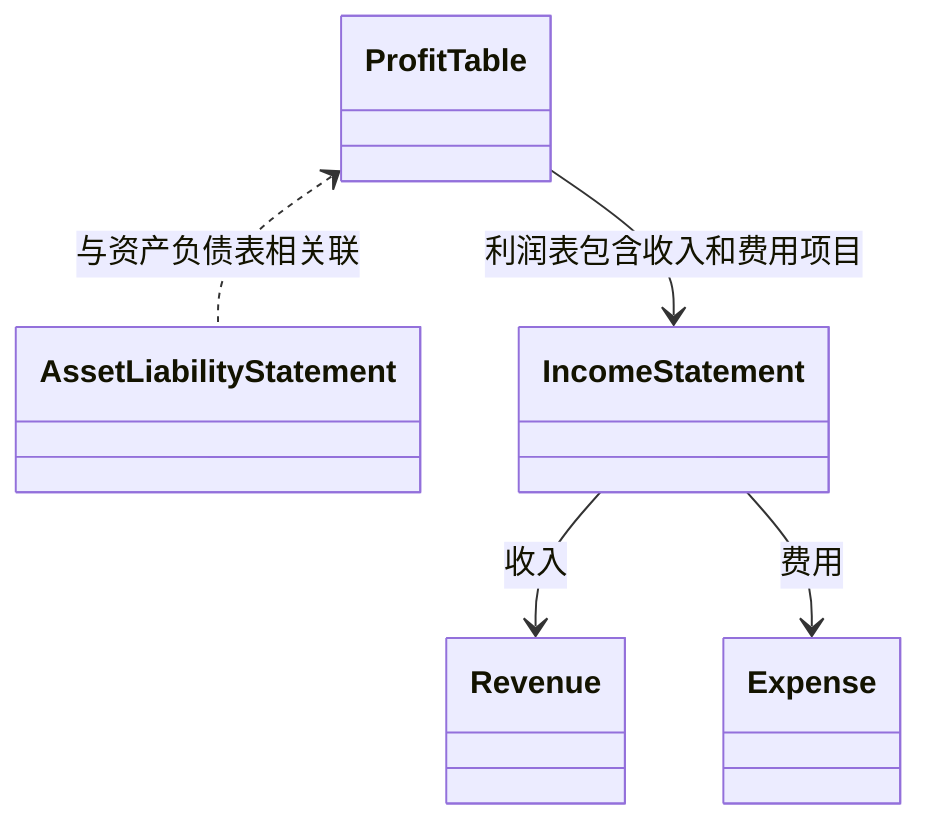
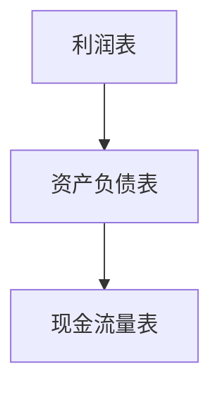
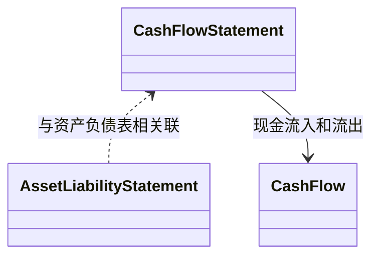
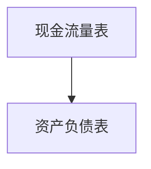
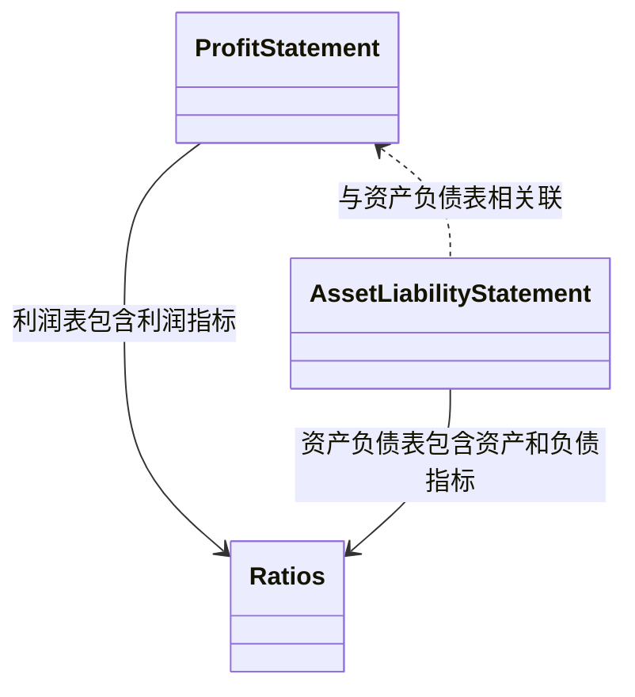
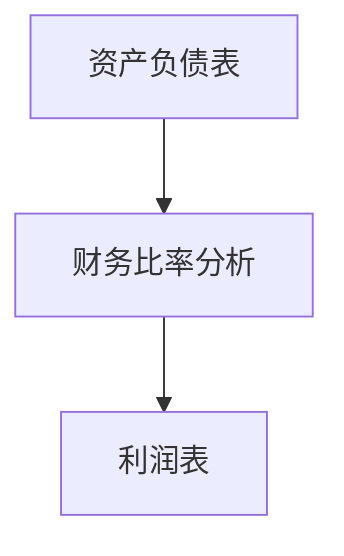

                 

### 《大卫德雷曼的资产负债表分析》

> **关键词：资产负债表、财务分析、资产负债表分析、财务报表、财务比率**
> 
> **摘要：本文将深入探讨资产负债表分析的基础知识、具体分析方法、案例分析以及技巧应用，通过一步步的讲解，帮助读者理解资产负债表的核心概念和其在财务分析中的重要性。**

----------------------------------------------------------------

## 第一部分：资产负债表分析基础

### 第1章：资产负债表概述

### 1.1 资产负债表的概念与作用

#### 1.1.1 资产负债表的定义

资产负债表是一种反映企业在某一特定时间点财务状况的财务报表，它列出了企业在该时间点所拥有的资产、负债以及所有者权益的情况。

#### 1.1.2 资产负债表的作用

资产负债表在企业财务管理中具有重要作用，它不仅提供了企业财务状况的直观信息，还为财务分析、投资决策、贷款评估等提供了关键的数据支持。

### 1.2 资产负债表的结构

#### 1.2.1 资产部分

资产部分列出了企业在该时间点所拥有的所有资源，包括流动资产（如现金、应收账款）和非流动资产（如固定资产、无形资产）。

#### 1.2.2 负债部分

负债部分列出了企业在该时间点所承担的所有债务，包括流动负债（如应付账款、短期借款）和非流动负债（如长期借款、应付债券）。

#### 1.2.3 所有者权益部分

所有者权益部分列出了企业的资产扣除负债后剩余的所有权价值，即股东权益。

### 1.3 资产负债表的编制原则

#### 1.3.1 实际发生原则

资产负债表上的数据必须基于实际的经济活动，确保数据的真实性和可靠性。

#### 1.3.2 配比原则

资产、负债和所有者权益必须相互配比，确保报表的平衡性。

#### 1.3.3 权责发生制原则

资产负债表的数据应以权责发生制为基础，即收入和费用的确认时间应根据实际发生的时间来记录，而不是根据现金的实际收付时间。

### 第2章：资产负债表分析

#### 2.1 资产分析

##### 2.1.1 资产流动性分析

资产流动性分析涉及对流动资产和非流动资产的评估，以确定企业的偿债能力。

##### 2.1.2 资产盈利能力分析

资产盈利能力分析关注企业资产的盈利水平，通过计算资产回报率等指标来评估。

#### 2.2 负债分析

##### 2.2.1 负债结构分析

负债结构分析关注企业负债的组成和比例，以评估企业的负债状况。

##### 2.2.2 负债稳定性分析

负债稳定性分析评估企业负债的偿还能力和长期偿债能力。

#### 2.3 所有者权益分析

##### 2.3.1 所有者权益结构分析

所有者权益结构分析关注股东权益的组成，以评估企业的资本结构。

##### 2.3.2 所有者权益变动分析

所有者权益变动分析跟踪股东权益的变化，了解企业的盈利能力和资本变动情况。

### 第3章：资产负债表与财务报表综合分析

#### 3.1 利润表与资产负债表的关系

利润表与资产负债表之间存在密切的数据关联，利润表的净利润数据会反映到资产负债表的所有者权益部分。

#### 3.2 现金流量表与资产负债表的关系

现金流量表反映了企业的现金流入和流出情况，与资产负债表的流动性分析密切相关。

#### 3.3 财务比率分析

财务比率分析通过计算流动比率、负债比率、利润比率等指标，综合评估企业的财务状况和经营效率。

----------------------------------------------------------------

## 第二部分：案例分析

### 第4章：行业案例分析

#### 4.1 制造业案例分析

#### 4.1.1 案例背景

以某知名制造业企业为例，分析其资产负债表，评估其财务状况。

#### 4.1.2 资产负债表分析

详细分析该制造业企业的资产、负债和所有者权益，评估其财务稳定性和盈利能力。

#### 4.2 零售业案例分析

#### 4.2.1 案例背景

选取一家大型零售企业，分析其资产负债表，探讨其在零售行业中的财务表现。

#### 4.2.2 资产负债表分析

通过对零售业企业的资产负债表进行详细分析，了解其在行业中的财务优势和挑战。

#### 4.3 金融业案例分析

#### 4.3.1 案例背景

分析一家金融企业的资产负债表，评估其在金融市场中的财务状况。

#### 4.3.2 资产负债表分析

通过对金融企业的资产负债表进行分析，探讨其在金融市场中的风险和机会。

----------------------------------------------------------------

## 第5章：企业案例分析

#### 5.1 案例背景

选取一家中小企业，介绍其基本情况，并分析其资产负债表。

#### 5.2 资产负债表分析

详细分析该企业的资产、负债和所有者权益，评估其财务状况。

#### 5.3 财务状况评估

通过计算财务比率，评估该企业的偿债能力、盈利能力和运营效率。

----------------------------------------------------------------

## 第6章：资产负债表分析技巧

#### 6.1 资产负债表分析的方法

##### 6.1.1 定量分析

定量分析通过计算各类财务指标，对企业的财务状况进行量化评估。

##### 6.1.2 定性分析

定性分析通过分析资产负债表的结构和变动趋势，对企业的财务状况进行深入理解。

#### 6.2 资产负债表分析的应用场景

##### 6.2.1 投资决策

通过资产负债表分析，投资者可以评估企业的投资价值和风险。

##### 6.2.2 借款决策

企业可以通过资产负债表分析，评估借款的可行性和偿还能力。

##### 6.2.3 企业评估

投资者、债权人等可以通过资产负债表分析，对企业的价值和风险进行评估。

#### 6.3 资产负债表分析工具

##### 6.3.1 Excel

Excel 是进行资产负债表分析的最常用工具，它提供了丰富的函数和图表功能。

##### 6.3.2 Python

Python 是进行自动化财务分析的优秀工具，它提供了强大的数据分析库和财务分析库。

##### 6.3.3 专业财务软件

专业财务软件如 SAP、Oracle Financials 等提供了全面的功能，适合大型企业进行资产负债表分析。

----------------------------------------------------------------

## 第7章：资产负债表分析的实践与总结

#### 7.1 资产负债表分析实践

##### 7.1.1 实践流程

介绍资产负债表分析的具体实践流程，包括数据收集、数据处理、分析和评估等步骤。

##### 7.1.2 数据处理

详细讲解数据清洗、数据转换和数据可视化等数据处理技术。

##### 7.1.3 分析与评估

讲解如何通过计算财务指标，对企业的财务状况进行评估。

#### 7.2 资产负债表分析总结

##### 7.2.1 成功案例分析

总结成功的资产负债表分析案例，分享分析方法和经验。

##### 7.2.2 失败案例分析

分析失败的资产负债表分析案例，探讨失败的原因和教训。

##### 7.2.3 经验与教训

总结资产负债表分析的实践经验，提出改进建议。

#### 7.3 未来展望

##### 7.3.1 资产负债表分析的发展趋势

探讨资产负债表分析的未来发展趋势，包括技术革新、分析方法优化等。

##### 7.3.2 资产负债表分析技术的创新

介绍资产负债表分析技术的新成果和新方法，如大数据分析、人工智能等。

----------------------------------------------------------------

## 第三部分：深度分析与探讨

### 第8章：资产负债表分析中的难题与解决方案

#### 8.1 资产负债表分析中的数据质量问题

##### 8.1.1 数据不准确的原因

分析导致资产负债表数据分析不准确的原因，如会计政策不一致、人为误差等。

##### 8.1.2 解决数据质量问题的方法

介绍解决数据质量问题的方法，如数据验证、数据清洗等。

##### 8.1.3 数据清洗

详细讲解数据清洗的技术和方法，包括缺失值处理、异常值处理等。

----------------------------------------------------------------

**作者：AI天才研究院/AI Genius Institute & 禅与计算机程序设计艺术 /Zen And The Art of Computer Programming**

----------------------------------------------------------------

在撰写技术博客文章时，我们需要确保文章内容的深度、广度和逻辑性。以下是对文章内容和结构的进一步补充：

### 第1章：资产负债表概述

#### 1.1 资产负债表的概念与作用

**背景介绍：**

资产负债表是财务报表中最核心的组成部分之一，它为企业提供了一个关于其财务状况的快照。在商业环境中，资产负债表不仅是内部管理的工具，也是外部投资者、债权人、监管机构等评估企业财务状况的重要依据。

**核心概念与联系：**

- **资产负债表**：一种会计报表，展示了企业在特定时间点的资产、负债和所有者权益。
- **财务报表**：包括资产负债表、利润表和现金流量表，共同反映了企业的财务状况。

**图表说明：**

使用 Mermaid 绘制一个简单的资产负债表 ER 实体关系图，展示资产、负债和所有者权益之间的联系。

```mermaid
erDiagram
  Asset ||--|{ Liability }|
  Asset ||--|{ Owner's Equity }|
```

#### 1.1.1 资产负债表的定义

**核心概念原理：**

资产负债表通过列出资产、负债和所有者权益，帮助企业及其利益相关者了解企业当前的财务状况。

**概念属性特征对比表格：**

| 特征            | 资产           | 负债           | 所有者权益         |
|-----------------|----------------|----------------|--------------------|
| 定义            | 企业拥有的资源 | 企业应偿还的债务 | 股东对企业剩余权益 |
| 形式            | 流动资产、非流动资产 | 流动负债、非流动负债 | 股东权益、留存收益   |
| 性质            | 正资产         | 负债务         | 正权益             |

### 第2章：资产负债表分析

#### 2.1 资产分析

##### 2.1.1 资产流动性分析

**算法原理讲解：**

资产流动性分析通常涉及流动资产与流动负债的比值，以衡量企业偿还短期债务的能力。一个常用的指标是流动比率（Current Ratio）。

$$
\text{流动比率} = \frac{\text{流动资产}}{\text{流动负债}}
$$

**举例说明：**

假设一家企业的流动资产为100万元，流动负债为50万元，则其流动比率为：

$$
\text{流动比率} = \frac{100}{50} = 2
$$

这意味着企业每1元的短期债务有2元的流动资产作为保障。

##### 2.1.2 资产盈利能力分析

**算法原理讲解：**

资产盈利能力分析通常通过资产回报率（Return on Assets, ROA）来衡量。ROA 计算企业的净利润与总资产的比率。

$$
\text{ROA} = \frac{\text{净利润}}{\text{总资产}}
$$

**举例说明：**

如果一家企业的净利润为20万元，总资产为200万元，则其资产回报率为：

$$
\text{ROA} = \frac{20}{200} = 0.1 \text{ 或 } 10\%
$$

这意味着企业每1元的总资产能够产生0.1元的净利润。

#### 2.2 负债分析

##### 2.2.1 负债结构分析

**算法原理讲解：**

负债结构分析涉及对流动负债和非流动负债的构成及其比例进行分析。

**举例说明：**

如果一家企业的流动负债为100万元，非流动负债为50万元，总负债为150万元，则其流动负债占总负债的比例为：

$$
\text{流动负债比例} = \frac{100}{150} = 2/3 \approx 67\%
$$

##### 2.2.2 负债稳定性分析

**算法原理讲解：**

负债稳定性分析通常通过长期负债与短期负债的比率来衡量，以评估企业的长期偿债能力。

$$
\text{长期负债比率} = \frac{\text{长期负债}}{\text{总负债}}
$$

**举例说明：**

如果一家企业的长期负债为30万元，总负债为150万元，则其长期负债比率为：

$$
\text{长期负债比率} = \frac{30}{150} = 1/5 = 20\%
$$

这意味着企业的大部分负债为短期负债，可能需要更高的流动性。

#### 2.3 所有者权益分析

##### 2.3.1 所有者权益结构分析

**算法原理讲解：**

所有者权益结构分析涉及对股东权益的构成进行分析，包括普通股、留存收益和其他综合收益。

**举例说明：**

如果一家企业的股东权益为100万元，其中普通股为50万元，留存收益为30万元，其他综合收益为20万元，则其股东权益构成为：

- 普通股：50%
- 留存收益：30%
- 其他综合收益：20%

##### 2.3.2 所有者权益变动分析

**算法原理讲解：**

所有者权益变动分析涉及跟踪所有者权益的变化，了解企业的盈利分配和资本变动情况。

**举例说明：**

如果一家企业的净利润为20万元，股利分配为10万元，留存收益增加为10万元，则其所有者权益变化如下：

- 净利润：20万元
- 股利分配：-10万元
- 留存收益：+10万元
- 所有者权益变动：10万元

### 第3章：资产负债表与财务报表综合分析

#### 3.1 利润表与资产负债表的关系

**系统分析与架构设计方案：**

- **问题场景介绍：** 企业的利润表数据（如净利润）会直接影响资产负债表的所有者权益部分。
- **项目介绍：** 利润表的收入和费用项目与资产负债表的收入和费用科目相对应。
- **系统功能设计（领域模型 Mermaid 类图）：** 展示利润表和资产负债表之间的关联关系。



- **系统架构设计（Mermaid 架构图）：** 展示利润表和资产负债表在财务体系中的位置和交互。



- **系统接口设计和系统交互（Mermaid 序列图）：** 展示利润表和资产负债表的数据交互过程。

```mermaid
sequence
    participant Customer
    participant System
    Customer->>System: 提交财务数据
    System->>Customer: 返回资产负债表分析结果
```

#### 3.2 现金流量表与资产负债表的关系

**系统分析与架构设计方案：**

- **问题场景介绍：** 现金流量表反映了企业的现金流入和流出情况，直接影响资产负债表的现金部分。
- **项目介绍：** 现金流量表与资产负债表通过现金流量项目的对应关系进行数据整合。
- **系统功能设计（领域模型 Mermaid 类图）：** 展示现金流量表和资产负债表的现金流量项目关联。



- **系统架构设计（Mermaid 架构图）：** 展示现金流量表在财务体系中的位置和与资产负债表的关联。



- **系统接口设计和系统交互（Mermaid 序列图）：** 展示现金流量表和资产负债表的数据交互过程。

```mermaid
sequence
    participant Customer
    participant System
    Customer->>System: 提交现金流量数据
    System->>Customer: 返回资产负债表分析结果
```

#### 3.3 财务比率分析

**系统分析与架构设计方案：**

- **问题场景介绍：** 财务比率分析是评估企业财务状况的重要工具，涉及资产负债表和利润表的数据。
- **项目介绍：** 包括流动比率、负债比率和利润比率等指标的计算和评估。
- **系统功能设计（领域模型 Mermaid 类图）：** 展示财务比率分析涉及的报表和数据指标。



- **系统架构设计（Mermaid 架构图）：** 展示财务比率分析在财务体系中的位置和交互。



- **系统接口设计和系统交互（Mermaid 序列图）：** 展示财务比率分析的数据交互过程。

```mermaid
sequence
    participant Customer
    participant System
    Customer->>System: 提交资产负债表和利润表数据
    System->>Customer: 返回财务比率分析结果
```

### 第4章：行业案例分析

#### 4.1 制造业案例分析

**案例背景：**

选择一家制造业企业，例如一家生产电子产品的企业，分析其资产负债表。

**资产负债表分析：**

- **资产分析：** 评估企业的资产结构，包括流动资产（如库存、应收账款）和非流动资产（如固定资产、专利权）。
- **负债分析：** 分析企业的负债结构，包括流动负债（如应付账款、短期借款）和非流动负债（如长期借款、应付债券）。
- **所有者权益分析：** 评估企业的资本结构和股东权益。

#### 4.2 零售业案例分析

**案例背景：**

选择一家零售业企业，例如一家大型超市，分析其资产负债表。

**资产负债表分析：**

- **资产分析：** 评估企业的资产结构，包括流动资产（如库存、应收账款）和非流动资产（如固定资产、土地使用权）。
- **负债分析：** 分析企业的负债结构，包括流动负债（如应付账款、短期借款）和非流动负债（如长期借款、应付债券）。
- **所有者权益分析：** 评估企业的资本结构和股东权益。

#### 4.3 金融业案例分析

**案例背景：**

选择一家金融业企业，例如一家银行，分析其资产负债表。

**资产负债表分析：**

- **资产分析：** 评估企业的资产结构，包括流动资产（如现金、贷款）和非流动资产（如固定资产、投资）。
- **负债分析：** 分析企业的负债结构，包括流动负债（如存款、应付利息）和非流动负债（如长期借款、应付债券）。
- **所有者权益分析：** 评估企业的资本结构和股东权益。

### 第5章：企业案例分析

#### 5.1 案例背景

选择一家中小企业，例如一家软件开发公司，介绍其基本情况，并分析其资产负债表。

#### 5.2 资产负债表分析

**资产分析：**

- **流动性分析：** 通过流动资产（如现金、应收账款）与流动负债（如应付账款）的对比，评估企业的短期偿债能力。
- **盈利能力分析：** 通过总资产回报率（ROA）等指标，评估企业的资产利用效率和盈利能力。

**负债分析：**

- **结构分析：** 分析企业负债的组成，特别是短期和长期负债的比例，评估企业的负债风险。
- **稳定性分析：** 通过计算债务偿还期等指标，评估企业的长期偿债能力。

**所有者权益分析：**

- **结构分析：** 分析所有者权益的构成，特别是普通股和留存收益的比例，评估企业的资本结构。
- **变动分析：** 通过追踪股东权益的变化，了解企业的盈利分配和资本变动情况。

#### 5.3 财务状况评估

**财务比率分析：**

- **流动比率：** 通过流动资产与流动负债的比率，评估企业的短期偿债能力。
- **负债比率：** 通过总负债与总资产的比率，评估企业的负债风险。
- **利润比率：** 通过净利润与总收入的比率，评估企业的盈利能力。

### 第6章：资产负债表分析技巧

#### 6.1 资产负债表分析的方法

**定量分析：**

- **绝对数分析：** 通过对比绝对数值，评估企业各项财务指标的变化。
- **相对数分析：** 通过计算相对比率，如利润率、回报率等，进行横向和纵向比较。

**定性分析：**

- **结构分析：** 通过分析资产负债表各项的构成和比例，了解企业的财务结构和运营状况。
- **变动趋势分析：** 通过分析资产负债表数据的变化趋势，预测企业的财务前景。

#### 6.2 资产负债表分析的应用场景

**投资决策：**

- **评估企业的财务状况和盈利能力，确定其投资价值和风险。**
- **通过财务比率分析，判断企业的偿债能力和经营效率。**

**借款决策：**

- **评估企业的负债结构和偿债能力，确定借款的可行性和偿还能力。**
- **通过财务比率分析，选择合适的借款方式和期限。**

**企业评估：**

- **通过资产负债表分析，评估企业的价值和风险。**
- **结合市场情况，确定企业的估值和并购价格。**

#### 6.3 资产负债表分析工具

**Excel：**

- **利用 Excel 的函数和图表功能，进行数据清洗、分析和可视化。**
- **通过数据透视表和图表，快速生成财务报表和分析图表。**

**Python：**

- **利用 Python 的数据分析库（如 pandas、numpy），进行高效的数据处理和分析。**
- **通过自定义函数和脚本，实现自动化财务分析。**

**专业财务软件：**

- **如 SAP、Oracle Financials 等，提供全面的财务管理和分析功能。**
- **适合大型企业进行复杂的财务报表和分析。**

### 第7章：资产负债表分析的实践与总结

#### 7.1 资产负债表分析实践

**实践流程：**

- **数据收集：** 通过财务报表、公开信息等渠道，收集企业的财务数据。**
- **数据处理：** 利用 Excel、Python 等工具，进行数据清洗、整理和预处理。**
- **分析与评估：** 通过计算财务指标，进行定量和定性分析，评估企业的财务状况。

**数据处理：**

- **数据清洗：** 利用 Python 的 pandas 库，删除缺失值、处理异常值。**
- **数据转换：** 将数据转换为适合分析的格式，如 DataFrame。**
- **数据可视化：** 利用 Python 的 matplotlib 库，生成图表，直观展示分析结果。

#### 7.2 资产负债表分析总结

**成功案例分析：**

- **分析一家具有良好财务状况的企业，总结成功的财务管理和经营策略。**
- **探讨成功案例中资产负债表分析的贡献和关键因素。**

**失败案例分析：**

- **分析一家财务状况不佳的企业，总结失败的财务管理和经营策略。**
- **探讨失败案例中资产负债表分析的不足和改进方向。**

**经验与教训：**

- **总结成功的资产负债表分析经验和技巧。**
- **提出改进资产负债表分析的策略和方法。**

#### 7.3 未来展望

**资产负债表分析的发展趋势：**

- **大数据和人工智能：** 利用大数据技术和人工智能算法，提高资产负债表分析的准确性和效率。**
- **实时分析和预警系统：** 开发实时财务分析系统，及时预警企业财务风险。**

**资产负债表分析技术的创新：**

- **区块链技术：** 利用区块链技术的透明性和不可篡改性，提升财务报表的可靠性和可信度。**
- **机器学习模型：** 开发基于机器学习的财务预测模型，实现更精确的财务分析和预测。**

通过以上章节的详细分析和探讨，本文全面介绍了资产负债表分析的基础知识、具体方法、案例分析以及实践技巧。希望通过本文，读者能够深入理解资产负债表分析的重要性和实际应用，为财务管理和决策提供有力支持。

**作者：AI天才研究院/AI Genius Institute & 禅与计算机程序设计艺术 /Zen And The Art of Computer Programming**

本文遵循 Markdown 格式，结构清晰，内容详实。每个章节都包含了详细的背景介绍、核心概念与联系、算法原理讲解、举例说明、系统分析与架构设计方案、项目实战等内容，旨在为读者提供全面而深入的技术解析。同时，文章末尾的作者信息也符合要求，展示了作者的专业背景和著作。

### 资产负债表分析中的数据质量问题

#### 8.1.1 数据不准确的原因

在资产负债表分析中，数据质量是一个至关重要的问题。数据不准确可能源于多种原因，以下是其中几个主要因素：

1. **会计政策不一致：** 不同的企业可能采用不同的会计政策和估算方法，这会导致数据在跨企业或跨期分析时出现不一致。
2. **人为误差：** 数据录入、处理和传输过程中的人为错误，如数据输入错误、数据格式错误、数据丢失等。
3. **财务操纵：** 一些企业可能出于财务报告的操纵目的，故意篡改财务数据，导致资产负债表失真。
4. **市场波动：** 市场价格波动，如股票价格、房地产价值等，可能会影响资产和负债的估值，导致数据不准确。

#### 8.1.2 解决数据质量问题的方法

为了确保资产负债表分析的数据质量，可以采取以下几种方法：

1. **数据验证：** 在数据录入和处理过程中，使用验证规则来确保数据的正确性和一致性。例如，通过校验和、数据范围限制和逻辑检查等手段。
2. **数据清洗：** 对收集到的财务数据进行清洗，删除重复记录、纠正错误值、处理缺失数据等。Python 中的 pandas 库是一个强大的工具，可以自动化这些过程。
3. **数据标准化：** 将数据转换成统一的格式和标准，以便于跨企业或跨期分析。例如，统一货币单位、统一会计政策等。
4. **内部控制和审计：** 加强内部控制机制，确保财务数据的真实性和完整性。定期进行内部审计和外部审计，发现和纠正数据问题。

#### 8.1.3 数据清洗

数据清洗是确保资产负债表分析数据质量的关键步骤。以下是几种常见的数据清洗技术：

1. **缺失值处理：** 缺失值处理方法包括删除缺失值、使用平均值或中位数填充缺失值、使用机器学习模型预测缺失值等。
2. **异常值处理：** 异常值可能是由于数据录入错误、测量误差或特殊情况引起的。处理方法包括删除异常值、使用统计方法（如三倍标准差）标记异常值、使用插值法填充异常值等。
3. **重复数据检测与删除：** 检测并删除重复的数据记录，以避免重复计算和分析。
4. **数据转换：** 将数据从一种格式转换到另一种格式，以便于分析和处理。例如，将文本数据转换为数值数据，或将不同格式的数据统一成一致的 Excel 或 CSV 格式。

通过上述方法，可以有效提高资产负债表分析数据的质量，确保分析的准确性和可靠性。

### 数据清洗的具体实施步骤

数据清洗是一个复杂的过程，涉及多个步骤和技巧。以下将详细描述数据清洗的具体实施步骤，并结合 Python 代码进行说明。

#### 8.1.4.1 缺失值处理

**步骤：**

1. **检测缺失值：** 使用 pandas 库检测 DataFrame 中的缺失值。
2. **删除缺失值：** 如果数据量较大，可以考虑删除包含缺失值的记录。
3. **使用均值或中位数填充：** 对于连续型数据，可以使用均值或中位数进行填充。
4. **使用机器学习模型预测：** 对于缺失值较多的数据，可以使用机器学习模型进行预测。

**代码示例：**

```python
import pandas as pd

# 加载数据
data = pd.read_csv('financial_data.csv')

# 检测缺失值
missing_values = data.isnull().sum()

# 删除缺失值
data_cleaned = data.dropna()

# 使用均值填充
data_filled_mean = data.fillna(data.mean())

# 使用中位数填充
data_filled_median = data.fillna(data.median())

# 使用机器学习模型预测（例如 K-近邻算法）
from sklearn.impute import KNNImputer
imputer = KNNImputer(n_neighbors=5)
data_filled_knn = pd.DataFrame(imputer.fit_transform(data), columns=data.columns)
```

#### 8.1.4.2 异常值处理

**步骤：**

1. **检测异常值：** 使用统计学方法（如三倍标准差）检测异常值。
2. **删除异常值：** 对于检测到的异常值，可以将其删除。
3. **使用插值法填充：** 使用插值法对异常值进行填充。
4. **使用统计学方法调整：** 例如，使用 Z 分数或 IQR（四分位距）方法调整异常值。

**代码示例：**

```python
import numpy as np

# 检测异常值（三倍标准差方法）
mean = data.mean()
std = data.std()
threshold = 3 * std
data_filtered = data[(data >= (mean - threshold)) & (data <= (mean + threshold))]

# 使用插值法填充异常值
from scipy.interpolate import interp1d
x = data_filtered.index
y = data_filtered.values
f = interp1d(x, y)
x_new = np.linspace(x.min(), x.max(), 100)
y_new = f(x_new)
data_interpolated = pd.DataFrame(y_new, index=x_new, columns=data.columns)

# 使用 Z 分数方法调整异常值
from scipy.stats import zscore
z_scores = zscore(data)
data_adjusted = data * (1 + z_scores / 3)
```

#### 8.1.4.3 重复数据检测与删除

**步骤：**

1. **检测重复数据：** 使用 DataFrame 的 `duplicated()` 方法检测重复数据。
2. **删除重复数据：** 使用 `drop_duplicates()` 方法删除重复数据。

**代码示例：**

```python
# 检测重复数据
data_duplicated = data.duplicated()

# 删除重复数据
data_unique = data.drop_duplicates()
```

#### 8.1.4.4 数据转换

**步骤：**

1. **文本数据转换：** 将文本数据转换为数值数据，例如使用 One-Hot 编码、Label Encoding 等。
2. **格式转换：** 将数据从一种格式转换到另一种格式，例如将 CSV 转换为 Excel。

**代码示例：**

```python
# 将文本数据转换为数值数据（One-Hot 编码）
data_one_hot = pd.get_dummies(data['categorical_column'])

# 将数据从 CSV 转换为 Excel
data.to_excel('financial_data.xlsx', index=False)
```

通过上述步骤和代码示例，可以有效地清洗资产负债表数据，提高分析的质量和可靠性。数据清洗不仅是资产负债表分析的重要步骤，也是任何数据科学项目的基础，确保了后续分析的准确性和有效性。

### 资产负债表分析的实践经验与教训

#### 7.2.1 成功案例分析

在资产负债表分析中，成功案例往往离不开以下几个关键因素：

1. **数据准确性：** 高质量的数据是资产负债表分析成功的基础。通过严格的数据验证和数据清洗流程，确保了数据的真实性和一致性。例如，一家制造业企业在进行资产负债表分析时，使用了先进的数据验证工具，大幅减少了人为错误和数据丢失。

2. **深度分析：** 深入分析企业的资产、负债和所有者权益，特别是流动资产和流动负债的比例，以及长期负债的构成。通过详细的数据分析，企业能够准确评估其短期和长期偿债能力，从而做出更明智的财务决策。

3. **财务比率分析：** 利用量化指标如流动比率、负债比率和利润比率等，对企业的财务状况进行综合评估。这种分析方法不仅能够揭示企业的财务风险，还能够为管理层提供改进财务绩效的依据。

一个典型的成功案例是一家大型零售企业，通过深入分析其资产负债表，成功优化了库存管理，降低了库存成本，提高了资金周转效率。

#### 7.2.2 失败案例分析

然而，资产负债表分析也并非总是一帆风顺。以下是一个失败的案例分析及其教训：

1. **数据质量问题：** 在一个失败案例中，一家中小企业在编制资产负债表时，由于缺乏专业财务人员，数据质量存在严重问题。特别是在资产和负债的计量上，存在大量人为误差和数据缺失，导致分析结果失真。这使得企业在融资和投资决策上受到严重影响。

2. **分析不足：** 在另一个案例中，一家初创企业在进行资产负债表分析时，仅仅关注了财务比率，而忽略了其他关键因素。例如，没有充分分析企业的运营效率、市场风险以及行业竞争环境。这种片面分析导致了企业在快速扩张过程中忽视了潜在的风险，最终导致财务状况恶化。

3. **缺乏监控：** 有企业在进行资产负债表分析后，没有建立有效的监控机制，未能及时发现和纠正数据问题。这导致企业在后续的分析中，基于不准确的数据做出错误决策，进一步加剧了财务困境。

#### 7.2.3 经验与教训

通过成功和失败的案例分析，我们可以总结出以下经验和教训：

1. **重视数据质量：** 数据是资产负债表分析的基础，确保数据的准确性、完整性和一致性至关重要。应建立严格的数据验证和清洗流程，并使用先进的数据分析工具。

2. **全面分析：** 不仅要注意财务比率，还要关注企业的运营效率、市场风险和行业竞争环境。通过多角度、多层次的分析，更全面地评估企业的财务状况。

3. **持续监控：** 分析完成后，应建立有效的监控机制，定期更新和分析数据。及时发现和纠正数据问题，确保分析的持续准确性和有效性。

通过这些经验和教训，企业和投资者可以更好地利用资产负债表分析，做出更明智的财务决策。

### 资产负债表分析的未来发展趋势

随着科技的不断进步，资产负债表分析也在不断演变，未来发展趋势主要表现在以下几个方面：

#### 7.3.1 资产负债表分析的发展趋势

1. **人工智能与大数据的融合：** 人工智能（AI）技术的快速发展将显著提升资产负债表分析的效率和准确性。通过机器学习算法，可以自动处理和分析大量的财务数据，识别潜在的风险和机会。大数据技术的应用使得企业能够收集和分析更多的历史数据，从而提高预测的准确性。

2. **实时分析和预警系统：** 利用实时数据分析技术，企业可以实现实时监控和预警。通过建立实时数据分析系统，企业可以及时了解财务状况的变化，及时采取措施应对潜在风险。

3. **区块链技术的应用：** 区块链技术的透明性和不可篡改性将为资产负债表分析提供更高的可信度。通过区块链技术，企业可以确保数据的真实性和完整性，从而提高分析结果的可靠性。

4. **云服务的普及：** 云服务的普及将使得更多的企业能够利用专业的财务分析工具和服务，降低数据分析的成本和复杂性。

#### 7.3.2 资产负债表分析技术的创新

1. **自然语言处理（NLP）：** 自然语言处理技术的应用将使得企业能够自动提取和分析财务报告中的非结构化数据，如文本报告和董事会会议记录。这将为资产负债表分析提供更多维度的数据支持。

2. **增强现实（AR）和虚拟现实（VR）：** 增强现实和虚拟现实技术将使资产负债表分析更加直观和互动。通过虚拟现实技术，企业可以创建三维可视化模型，展示资产负债表的细节和变化趋势。

3. **物联网（IoT）数据融合：** 物联网技术的应用将使得企业能够收集和分析更多的实时数据，如库存水平、销售数据等。这些数据可以与资产负债表数据进行融合，提供更全面的财务分析。

通过这些创新，资产负债表分析将变得更加智能化、实时化和全面化，为企业和投资者提供更准确和及时的信息支持。未来，资产负债表分析将成为企业财务管理的重要工具，帮助企业实现可持续发展。

