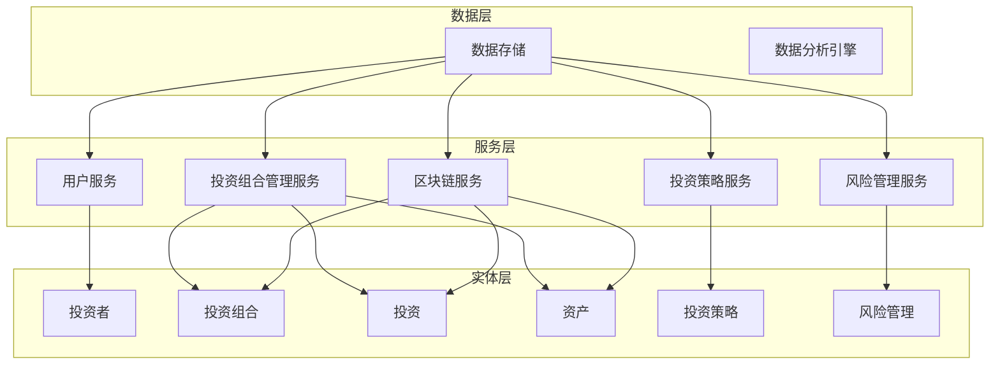
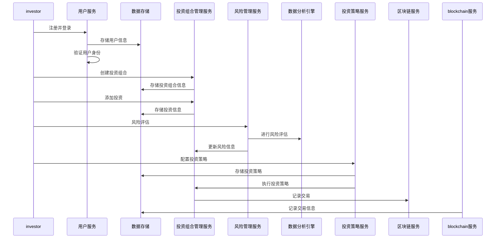

                 


### 引言：另类投资策略的重要性与背景

#### 1.1.1 问题背景：传统投资策略的挑战

自20世纪以来，传统的投资策略，如股票、债券和现金等，一直是投资者们主要的投资选择。这些传统资产类别之所以广受欢迎，部分原因是它们的历史表现相对稳定，而且相对容易理解和管理。然而，随着全球经济环境的不断变化，特别是2008年全球金融危机的爆发，传统投资策略的局限性日益凸显。

首先，金融危机揭示了传统投资组合的脆弱性。在危机期间，股市暴跌，许多投资者的资产大幅缩水。尽管债券通常被视为较为安全的投资，但在利率下降的环境中，债券的回报率也变得相对较低。此外，现金在危机期间虽然相对保值，但同时也丧失了投资的机会成本。

其次，全球化进程加剧了市场的不确定性。国际经济形势的波动、地缘政治风险和自然灾害等因素都对传统投资策略的稳定性构成了挑战。在这种情况下，传统投资策略的单一性使得投资者难以有效地分散风险。

#### 1.1.2 问题描述：为何需要另类投资策略

面对上述挑战，投资者逐渐认识到，单一的投资策略难以满足多元化风险分散的需求。因此，另类投资策略应运而生。另类投资，顾名思义，指的是那些不同于传统股票、债券和现金等资产的投资类别。这些资产包括但不限于房地产、黄金、大宗商品、私募股权、私募债和对冲基金等。

那么，为什么需要另类投资策略呢？

**1. 投资多元化需求：**

另类投资策略的一个重要优势在于其能够为投资者提供多元化的投资选择。通过投资于不同的资产类别，投资者可以在保持整体投资组合稳定性的同时，提高投资回报的可能性。例如，在股市表现不佳时，房地产和大宗商品可能会表现出更强的抗跌性。

**2. 风险分散的重要性：**

风险分散是投资成功的关键。通过将资金分配到多个不同的资产类别，投资者可以降低单一市场或行业波动对整体投资组合的影响。另类投资策略提供了更多的分散风险的途径，从而提高了投资组合的稳定性。

#### 1.1.3 问题解决：另类投资策略的作用

另类投资策略在优化投资组合和增加收益可能性方面发挥着重要作用。

**1. 优化投资组合：**

通过引入另类资产，投资者可以构建更加平衡的投资组合。例如，私募股权投资可以提供更高的潜在回报，而房地产投资则可以为投资组合提供稳定的现金流。这样的组合可以降低整个投资组合的波动性，同时提高收益潜力。

**2. 增加收益可能性：**

另类投资往往具有与传统资产不同的特性，它们在不同市场环境下可能表现出更好的收益能力。例如，在通货膨胀环境下，黄金等大宗商品往往能够提供保值增值的效果。

#### 1.1.4 边界与外延：另类投资的定义与范畴

另类投资的定义较为广泛，通常指的是那些不包含在传统投资组合中的资产类别。这些资产类别通常包括：

**1. 实物资产：** 包括房地产、黄金、大宗商品等。

**2. 金融资产：** 包括私募股权、私募债、对冲基金等。

**3. 量化策略：** 包括使用算法进行交易、量化分析等。

**4. 非标准化资产：** 包括艺术收藏、古董、葡萄酒等。

另类投资的范畴随着市场的不断发展而不断扩展。随着投资者对风险管理和收益追求的日益多样化和复杂化，未来另类投资的范畴可能会进一步扩大，包括更多的创新性资产类别和策略。

### 核心概念：另类投资的概念与分类

另类投资（Alternative Investments）是指那些不同于传统投资如股票、债券和现金等的主流投资方式。这些投资方式通常具有独特的风险和回报特性，能够为投资者提供多元化投资组合的机会。

#### 1. 定义

另类投资通常是指那些不包含在传统投资组合中的资产类别。这些资产包括但不限于房地产、大宗商品、私募股权、私募债、对冲基金、量化交易、风险投资基金等。另类投资的特点在于它们通常具有较高的风险、独特的收益模式和较长的投资周期。

#### 2. 分类

另类投资可以按照资产类别和投资策略进行分类：

**1. 按资产类别分类：**

- **实物资产：** 包括房地产、黄金、大宗商品（如石油、金属等）、农产品等。
- **金融资产：** 包括私募股权、私募债、对冲基金、风险投资基金、量化交易基金等。
- **其他资产：** 包括艺术品、古董、葡萄酒、私募股权、私募债等。

**2. 按投资策略分类：**

- **绝对收益策略：** 包括对冲基金、量化交易、固定收益基金等，旨在实现稳定的绝对收益。
- **相对收益策略：** 包括股票多空、商品多空、套利等策略，通过市场间的套利机会获得收益。
- **风险平价策略：** 通过优化投资组合的风险分布，实现风险平衡的收益。
- **事件驱动策略：** 包括并购套利、套利交易等，利用市场的不确定性进行获利。

### 3. 优势与局限

**优势：**

- **多元化：** 另类投资提供了更多样化的资产类别，有助于投资者构建更加平衡的投资组合。
- **潜在高收益：** 另类投资往往具有更高的潜在回报，特别是在市场波动较大的情况下。
- **风险分散：** 通过投资于不同的资产类别和策略，投资者可以有效地分散风险。

**局限：**

- **流动性差：** 另类投资的流动性通常较差，投资者可能需要较长时间才能将投资转换为现金。
- **信息不对称：** 另类投资市场信息较为分散，投资者可能面临信息不对称的问题。
- **监管不足：** 另类投资领域通常监管较为宽松，可能存在一定的风险。

### 4. 概念属性特征对比表格

| 类别         | 特点                                                                 | 优势                  | 劣势                |
|------------|----------------------------------------------------------------------|---------------------|-------------------|
| 实物资产     | 直接拥有实物资产，如房地产、黄金、大宗商品等                         | 流动性相对较差，但具有保值增值潜力           | 需要专业知识和经验进行评估和管理 |
| 金融资产     | 投资于金融工具，如私募股权、私募债、对冲基金等                       | 流动性较好，收益潜力较高                   | 风险较大，投资难度较高 |
| 量化策略     | 利用数学模型和算法进行投资决策，如量化交易、量化分析等               | 具有较高的科学性和系统性                   | 需要高水平的技术能力和数据支持 |
| 非标准化资产 | 投资于非标准化资产，如艺术品、古董、葡萄酒等                        | 具有独特的文化价值和艺术价值               | 投资难度较大，价格波动较大 |

### 5. ER实体关系图架构

以下是另类投资中几种主要资产类别的ER实体关系图：

```mermaid
erDiagram
  Class1 ||--|{ Class2 }|-- Class3
  Class1 ||--|{ Class4 }|-- Class5
```

- **Class1**: 投资者
- **Class2**: 实物资产
- **Class3**: 金融资产
- **Class4**: 量化策略
- **Class5**: 非标准化资产

通过以上ER图，我们可以看到投资者如何通过不同的投资类别实现风险分散和收益最大化。

### 6. 概念结构与核心要素组成

另类投资策略的概念结构由以下几个核心要素组成：

**1. 投资者需求：** 投资者根据自身的风险承受能力、收益期望和投资目标来选择合适的另类投资策略。

**2. 资产类别：** 包括实物资产、金融资产、量化策略和非标准化资产等，这些资产类别各自具有独特的风险和回报特性。

**3. 投资策略：** 投资者可以根据市场环境和自身需求，选择绝对收益策略、相对收益策略、风险平价策略或事件驱动策略等。

**4. 风险管理：** 另类投资策略需要通过有效的风险管理措施，降低投资组合的波动性和潜在风险。

**5. 监管环境：** 另类投资领域通常监管较为宽松，投资者需要关注监管环境的变化，以规避潜在的风险。

通过以上核心要素，投资者可以构建一个综合性的另类投资策略，以实现投资组合的优化和风险分散。

### 1.1.1 实物资产：房地产、黄金、大宗商品等

#### 1.1.1.1 房地产投资：优势与风险

房地产投资是另类投资中最为常见的类别之一。它不仅为投资者提供了稳定的现金流，还有助于实现资产保值增值。以下是一些房地产投资的优势与风险：

**优势：**

- **稳定的现金流：** 房地产投资能够提供稳定的租金收入，有助于降低投资组合的整体波动性。
- **资产保值增值：** 在长期视角下，房地产通常具有保值增值的特性，特别是在经济稳定增长的背景下。
- **杠杆效应：** 投资者可以通过贷款实现杠杆效应，从而用较小的资金撬动较大的投资规模。

**风险：**

- **市场波动：** 房地产市场受经济环境、政策法规和市场需求等多重因素的影响，可能带来市场波动风险。
- **流动性差：** 与股票等资产相比，房地产的流动性较差，投资者可能需要较长时间才能将投资转换为现金。
- **管理成本：** 房地产投资需要一定的专业知识和经验，否则可能会面临管理不善带来的风险。

**案例：**

以美国房地产市场为例，过去几十年中，美国房地产市场经历了多次波动。2008年全球金融危机期间，房地产市场大幅下跌，许多投资者蒙受了巨大损失。然而，在随后的几年中，美国房地产市场逐渐复苏，并实现了资产增值。这一案例表明，房地产投资需要投资者具备良好的风险管理和市场判断能力。

#### 1.1.1.2 黄金投资：历史与趋势

黄金作为一种传统的避险资产，一直以来都受到投资者的青睐。以下是一些黄金投资的优势与趋势：

**优势：**

- **避险特性：** 在经济不确定性增加的背景下，黄金被视为一种天然的避险资产，能够抵御通货膨胀和市场波动。
- **长期价值：** 从历史数据来看，黄金在长期内通常具有稳定的上涨趋势，为投资者提供了良好的保值增值机会。

**趋势：**

- **全球经济形势：** 全球经济的不确定性，如贸易战、疫情等，都可能导致黄金价格的波动。在经济复苏和通货膨胀预期增加的情况下，黄金的价格往往会上涨。
- **政策环境：** 各国央行的货币政策也对黄金价格产生影响。例如，美联储的加息政策可能会使美元走强，从而降低黄金的吸引力。

**案例：**

以2020年新冠疫情爆发为例，全球金融市场剧烈波动，投资者纷纷转向黄金等避险资产。在这一背景下，黄金价格出现了大幅上涨，吸引了大量投资者的关注。这一案例表明，在市场不确定性增加时，黄金投资具有显著的避险作用。

#### 1.1.1.3 大宗商品投资：种类与市场

大宗商品投资包括石油、金属（如铜、铝等）、农产品（如小麦、玉米等）等。以下是一些大宗商品投资的优势与市场情况：

**优势：**

- **市场供需变化：** 大宗商品价格受市场供需变化的影响较大，投资者可以通过对市场供需的分析，抓住价格波动的机会。
- **产业关联性：** 大宗商品与全球经济和产业发展密切相关，例如石油价格的波动对全球经济增长有着重要的影响。

**市场情况：**

- **全球市场：** 大宗商品市场是一个全球性的市场，价格受到全球供求关系的影响。例如，原油价格受到OPEC+产油国的产量决策和地缘政治风险的影响。
- **周期性波动：** 大宗商品价格往往呈现出周期性波动的特点，投资者需要密切关注市场动态，及时调整投资策略。

**案例：**

以2020年新冠疫情为例，由于全球需求下降和供应链中断，大宗商品价格出现了剧烈波动。例如，原油价格一度跌至负值，而农产品价格则因需求增加而出现上涨。这一案例表明，大宗商品投资需要投资者具备对市场供需和产业关联性的深入理解。

### 2.1.2 金融资产：私募股权、私募债、对冲基金等

#### 2.1.2.1 私募股权投资：特点与策略

私募股权投资（Private Equity, PE）是另类金融资产中的重要组成部分。它涉及投资于未上市公司的股权或债务，通过提供资金和管理支持，促进公司的发展和价值提升。以下是一些私募股权投资的特点与策略：

**特点：**

- **非公开交易：** 私募股权投资通常在非公开市场进行，投资者无法像在公开市场那样随时买卖。
- **投资周期长：** 私募股权投资通常需要较长的时间来实现退出，投资周期可能长达数年甚至十年以上。
- **高风险高回报：** 私募股权投资通常具有较高的风险，但也因此可能带来较高的回报。

**策略：**

- **投资阶段：** 私募股权投资可以覆盖公司发展的各个阶段，包括初创期、成长期和成熟期。投资者可以根据不同的投资阶段，选择相应的投资策略。
- **价值增值：** 通过提供资金和管理支持，投资者可以帮助被投资公司实现业务扩张、提高运营效率和价值提升。
- **退出策略：** 私募股权投资的退出方式包括IPO（首次公开募股）、并购或管理层回购等。投资者需要选择合适的退出时机，以实现投资回报。

**案例：**

以美国私募股权巨头凯雷集团（Carlyle Group）为例，其投资了多家全球知名公司，如特斯拉（Tesla）、微软（Microsoft）等。凯雷集团通过提供资金和管理支持，帮助这些公司实现了快速发展。例如，凯雷集团在2004年投资特斯拉，并在2018年通过IPO成功退出，实现了高额回报。这一案例展示了私募股权投资的成功案例和投资策略。

#### 2.1.2.2 私募债投资：风险与回报

私募债投资（Private Debt, PD）是指投资于未上市公司的债务工具，包括贷款、债券等。以下是一些私募债投资的风险与回报：

**风险：**

- **流动性差：** 与公开市场交易的不同，私募债投资通常流动性较差，投资者可能需要较长时间才能将投资转换为现金。
- **信息不对称：** 投资者可能面临信息不对称的问题，缺乏对借款人经营状况的全面了解。
- **信用风险：** 借款人的信用风险可能导致投资无法回收。

**回报：**

- **固定收益：** 私募债投资通常提供固定的利率回报，具有较高的稳定性和可预测性。
- **优先级回报：** 私募债投资通常享有优先级回报，即在债务偿还时，私募债投资者可以获得优先偿还的权利。
- **潜在的资本增值：** 在某些情况下，私募债投资可能会因公司价值提升而带来资本增值。

**案例：**

以美国私募债投资公司阿波罗全球管理（Apollo Global Management）为例，其投资了多家企业，如安然（Enron）和世通（WorldCom）。尽管这些公司最终倒闭，但阿波罗通过及时的重组和管理，部分挽回了损失，并实现了稳定的收益。这一案例展示了私募债投资的风险管理和回报潜力。

#### 2.1.2.3 对冲基金投资：策略与绩效

对冲基金（Hedge Fund）是另类金融资产中的另一重要组成部分。它通过多种投资策略，包括股票多空、商品多空、套利交易等，来获取绝对收益。以下是一些对冲基金的投资策略与绩效：

**策略：**

- **股票多空策略：** 对冲基金通过同时做多和做空股票，来对冲市场风险，实现收益。
- **商品多空策略：** 对冲基金通过做多或做空商品期货，来捕捉商品价格的波动机会。
- **套利策略：** 对冲基金利用市场间的不平衡，通过同时买入和卖出，从中获取无风险收益。
- **量化策略：** 对冲基金通过数学模型和算法，进行交易决策，以实现高效的投资管理。

**绩效：**

- **绝对收益：** 对冲基金的目标是获取绝对收益，而不是跟随市场涨跌。因此，其绩效不依赖于市场的整体表现。
- **多样化收益来源：** 对冲基金通过多元化的投资策略，实现收益来源的多样化，降低整体投资组合的风险。
- **绩效波动：** 对冲基金的绩效通常受市场环境和策略选择的影响，可能会出现波动。

**案例：**

以美国对冲基金巨头桥水基金（Bridgewater Associates）为例，其创始人达里奥·阿姆斯特朗（Dalio, Ray）通过多元化和绝对收益策略，成功实现了长期稳定的投资回报。例如，桥水基金在2008年金融危机期间，通过合理的资产配置和风险管理，避免了巨额损失，并实现了正收益。这一案例展示了对冲基金的投资策略和绩效优势。

### 3.1.1 多元化投资组合：构建与调整

#### 3.1.1.1 多元化的重要性

多元化投资组合是投资者在构建投资组合时的一项基本原则。其核心思想是通过投资于多个不同的资产类别、行业和地区，来分散投资风险，实现投资回报的稳定。以下解释多元化的重要性：

**1. 风险分散：**

投资组合中资产类别的多样性可以降低单一市场或行业波动对整体投资组合的影响。例如，在股市下跌时，房地产和大宗商品可能表现出较强的抗跌性，从而降低整体投资组合的损失。

**2. 收益平衡：**

多元化投资组合可以帮助投资者实现收益的平衡。通过投资于不同风险和回报特性的资产类别，投资者可以在保持总体风险可控的同时，提高投资回报的可能性。

**3. 增加收益潜力：**

多元化投资组合可以捕捉不同市场环境下的投资机会。例如，在经济增长时期，股票和私募股权投资可能表现良好；而在经济低迷时期，债券和实物资产可能更具吸引力。

**4. 降低系统性风险：**

多元化投资组合可以降低系统性风险，即由整个市场或经济系统产生的风险。通过投资于多个不同资产类别和地区，投资者可以减少因单一市场或地区波动而导致的投资损失。

#### 3.1.1.2 投资组合的构建方法

构建多元化投资组合需要考虑多个因素，包括投资者的风险承受能力、投资目标和市场环境等。以下是一些构建多元化投资组合的方法：

**1. 资产配置：**

资产配置是指将投资资金分配到不同资产类别中的过程。投资者可以根据自身的风险承受能力和投资目标，确定不同资产类别在投资组合中的比例。例如，年轻投资者可能更倾向于投资于股票和私募股权等高风险、高回报的资产类别，而老年投资者则可能更倾向于投资于债券和实物资产等低风险、稳定回报的资产类别。

**2. 行业分散：**

在资产配置的基础上，投资者可以通过投资于不同行业来进一步分散风险。不同行业对经济周期和市场环境的反应各不相同，通过投资于多个不同行业，可以降低因某一行业波动而导致的投资损失。

**3. 地区分散：**

地区分散是指将投资资金分配到不同国家和地区。全球市场的多样性为投资者提供了更多的投资机会和风险分散的途径。通过投资于不同地区，投资者可以降低因单一地区经济波动而导致的投资损失。

**4. 投资策略多样化：**

投资者还可以通过投资策略的多样化来构建多元化投资组合。例如，结合股票投资、债券投资、房地产投资和量化投资等不同策略，可以进一步提高投资组合的收益稳定性和风险分散效果。

#### 3.1.1.3 投资组合的调整策略

投资组合的调整策略是指根据市场环境、投资者需求和资产表现，定期对投资组合进行调整，以保持投资组合的有效性和平衡性。以下是一些投资组合的调整策略：

**1. 定期评估：**

投资者应定期对投资组合进行评估，分析各资产类别的表现和风险。通过定期评估，投资者可以了解投资组合的运行状况，并根据评估结果进行必要的调整。

**2. 风险控制：**

投资者应根据市场环境和自身风险承受能力，调整投资组合中的高风险资产比例。在市场波动较大或经济不确定性增加的情况下，投资者应适当减少高风险资产，以降低投资组合的整体风险。

**3. 资产再平衡：**

投资者可以通过资产再平衡来维持投资组合的预期风险和回报水平。例如，当某一资产类别表现优于其他类别时，投资者可以适当减少该类别的投资比例，以维持整体投资组合的平衡。

**4. 时机选择：**

投资者应密切关注市场动态，选择合适的时机进行投资组合的调整。例如，在市场触底或资产价格较低时，投资者可以适当增加投资比例；而在市场过热或资产价格较高时，投资者可以适当减少投资比例。

**5. 预算管理：**

投资者应制定合理的投资预算，根据预算进行投资组合的调整。在预算有限的情况下，投资者应优先考虑投资于表现良好或具有较大增长潜力的资产类别。

通过以上调整策略，投资者可以确保投资组合的稳定性和有效性，实现长期投资目标。

### 3.1.2 风险管理策略：另类投资的应对措施

#### 3.1.2.1 风险评估

在另类投资中，有效的风险管理始于对投资风险的准确评估。投资者需要全面了解不同另类资产的风险特征，以便制定相应的风险管理策略。

**1. 风险类型：**

另类投资中的风险主要包括市场风险、信用风险、流动性风险和操作风险等。

- **市场风险：** 指因市场波动导致的资产价格变动风险。例如，房地产市场的价格波动、大宗商品市场的价格波动等。
- **信用风险：** 指借款人无法按期偿还债务或违约的风险。例如，私募债投资的借款人违约风险。
- **流动性风险：** 指投资者在需要资金时，无法迅速将资产转换为现金的风险。例如，某些私募股权投资的流动性较差。
- **操作风险：** 指因管理不善、操作失误等内部因素导致的投资损失风险。

**2. 评估方法：**

- **定性评估：** 通过专家意见、历史数据分析等方法，对投资风险进行主观评估。
- **定量评估：** 通过统计模型、历史数据模拟等方法，对投资风险进行量化评估。

**3. 风险因素：**

- **宏观经济因素：** 包括经济增长、通货膨胀、利率变化等。
- **行业特性：** 包括行业周期性、市场需求、政策法规等。
- **公司特性：** 包括公司财务状况、管理团队、市场地位等。

#### 3.1.2.2 风险分散

风险分散是降低投资组合风险的有效方法。通过投资于不同资产类别、行业和地区，投资者可以降低单一市场或行业波动对整体投资组合的影响。

**1. 资产分散：**

- **资产类别分散：** 投资于不同风险和回报特性的资产类别，如股票、债券、房地产、大宗商品等。
- **行业分散：** 投资于不同行业，如制造业、服务业、能源业、科技业等。
- **地区分散：** 投资于不同地区，如国内市场、国际市场等。

**2. 投资策略分散：**

- **多元化策略：** 结合股票多空、商品多空、套利交易、量化交易等不同策略。
- **策略组合：** 通过组合不同策略，实现风险和收益的平衡。

**3. 投资工具分散：**

- **私募股权：** 投资于不同阶段的私募股权项目，如初创期、成长期、成熟期等。
- **对冲基金：** 投资于不同策略的对冲基金，如股票多空、商品多空、套利基金等。

#### 3.1.2.3 风险控制

风险控制是确保投资组合安全和稳定的重要措施。以下是一些有效的风险控制方法：

**1. 风险预算：**

- **制定风险预算：** 根据投资目标和风险承受能力，制定合理的风险预算。
- **风险限额：** 设定各资产类别、投资策略和单一项目的风险限额。

**2. 定期监控：**

- **风险监控：** 定期对投资组合进行风险监控，及时发现潜在风险。
- **风险预警：** 设立风险预警机制，当风险指标超过预设阈值时，及时采取措施。

**3. 调整策略：**

- **适时调整：** 根据市场环境和投资组合表现，适时调整投资策略和资产配置。
- **风险平价：** 通过调整资产配置，维持投资组合的风险平价，实现风险和收益的平衡。

**4. 风险管理工具：**

- **保险：** 购买适当的保险产品，降低投资损失的风险。
- **对冲：** 利用金融衍生品，如期权、期货等，对冲投资组合的风险。

通过以上风险管理策略，投资者可以有效地控制另类投资的风险，确保投资组合的安全性和稳定性。

### 4.1.1 机会分析：另类投资的潜在收益

#### 4.1.1.1 经济环境下的投资机会

在经济环境下，投资者可以通过另类投资策略捕捉多种投资机会，从而实现潜在收益。以下是一些关键因素和具体机会：

**1. 经济增长阶段：**

- **行业机会：** 在经济增长阶段，新兴产业和周期性行业通常表现出色。投资者可以关注高科技、新能源、医疗健康等具有增长潜力的行业，通过私募股权、风险投资基金等方式进行投资。
- **资产类别机会：** 实物资产，如房地产、大宗商品，在经济扩张时期往往有较好的表现，因为企业需求和消费增长推动价格上升。

**案例：** 在2000年代初期，全球经济处于扩张阶段，科技公司如谷歌（Google）和微软（Microsoft）等迅速崛起，投资者通过私募股权投资这些公司，获得了巨大的收益。

**2. 经济复苏阶段：**

- **债务重组机会：** 在经济复苏阶段，企业可能面临债务负担，投资者可以通过私募债投资获取较高收益。同时，债务重组的机会也可能增加，投资者可以通过参与债务重组，获得额外的回报。
- **市场估值机会：** 经济复苏时，市场估值往往较低，投资者可以通过买入低估的资产，等待市场估值回升时实现资本增值。

**案例：** 2009年全球金融危机后的经济复苏期，投资者通过投资于被低估的金融资产和房地产，获得了较高的回报。

**3. 通货膨胀阶段：**

- **黄金和商品机会：** 在通货膨胀阶段，黄金和大宗商品通常表现出较强的抗通胀特性，价格上升。投资者可以通过投资黄金、农产品等大宗商品，实现资本增值和避险。
- **固定收益机会：** 通货膨胀可能导致债券收益率上升，投资者可以通过购买高收益债券，获取相对稳定的收益。

**案例：** 2021年，全球通胀率上升，黄金价格显著上涨，投资者通过投资黄金实现了较好的收益。

#### 4.1.1.2 技术变革带来的新机遇

技术变革为另类投资提供了新的机遇，特别是在以下几个方面：

**1. 人工智能和大数据：**

- **投资机会：** 人工智能和大数据技术的发展，推动了金融科技（FinTech）的兴起。投资者可以通过投资于金融科技公司、数据服务公司等，抓住技术变革带来的机遇。
- **应用领域：** 包括量化交易、智能投顾、风险管理等，这些领域通过技术手段提高了投资效率和收益。

**案例：** 美国金融科技公司Robinhood的成功，反映了技术驱动下的投资机会，其通过简化交易流程和使用人工智能技术，吸引了大量年轻投资者。

**2. 区块链和加密货币：**

- **投资机会：** 区块链技术的应用和加密货币的兴起，为投资者提供了新的投资渠道。投资者可以通过投资加密货币或区块链项目，实现高回报。
- **风险与挑战：** 加密货币市场波动性较大，监管环境尚未完全明确，投资者需要具备较高的风险承受能力和专业知识。

**案例：** 加密货币比特币（Bitcoin）在过去几年中表现出色，吸引了大量投资者，尽管其价格波动较大，但长期来看实现了显著增值。

**3. 自动化和物联网：**

- **投资机会：** 自动化和物联网技术的应用，推动了工业4.0和智能制造的发展。投资者可以通过投资于自动化设备和智能系统，抓住技术变革带来的机遇。
- **应用领域：** 包括制造业、物流、医疗等，这些领域通过技术进步实现了效率提升和成本降低。

**案例：** 德国工业4.0政策推动下，众多企业通过自动化和物联网技术实现了生产效率的提升，投资者通过投资这些企业获得了良好的回报。

通过以上分析，我们可以看到，经济环境和技术变革为另类投资提供了丰富的机会。投资者应密切关注市场动态，积极把握这些机会，以实现潜在收益。

### 4.1.2 挑战解析：另类投资面临的难题

#### 4.1.2.1 信息不对称

信息不对称是另类投资中面临的一个重大挑战。信息不对称指的是在交易双方之间，一方拥有比另一方更多的信息，从而在交易中占据优势。在另类投资领域，信息不对称问题尤为突出，原因如下：

**1. 不透明市场：**

另类投资通常涉及非公开交易的市场，如私募股权、私募债、房地产等。这些市场的信息相对分散，且难以获取，投资者很难获得全面、准确的信息。相比之下，公开市场的信息透明度较高，投资者可以通过公开报告和市场数据来评估投资机会。

**2. 专业知识和经验：**

另类投资通常需要较高的专业知识和经验，投资者需要了解行业动态、市场趋势、公司财务状况等多方面信息。然而，许多普通投资者缺乏这些专业知识和经验，容易在信息不对称的情况下做出错误的投资决策。

**3. 风险评估难度：**

另类投资中的风险评估难度较大，投资者需要深入了解投资项目的风险特征和潜在回报。在信息不对称的情况下，投资者可能无法准确评估风险，从而可能导致投资损失。

**解决方法：**

- **尽职调查：** 投资者在投资前应进行全面的尽职调查，包括对投资项目的市场前景、管理团队、财务状况等方面进行深入了解。
- **专业咨询：** 投资者可以寻求专业的投资顾问或机构提供咨询服务，以弥补自身的信息不足。
- **合作投资：** 投资者可以通过与其他投资者或机构合作，共享信息资源，提高投资决策的准确性。

#### 4.1.2.2 监管环境的变化

监管环境的变化是另类投资面临的另一个挑战。随着金融市场的不断发展和创新，各国政府和监管机构对另类投资的监管政策也在不断调整。以下是一些监管环境变化的挑战：

**1. 监管政策不确定性：**

监管政策的不确定性可能导致投资者面临风险。例如，某些监管政策的变化可能影响另类投资的合法性、合规性和市场环境。投资者需要密切关注监管政策的动态，及时调整投资策略。

**2. 监管合规成本：**

监管合规成本的增加可能对另类投资产生不利影响。例如，监管机构可能要求投资者提交更多的报告和披露信息，增加了运营成本和管理难度。

**3. 监管套利风险：**

监管环境的变化可能导致投资者面临监管套利风险。例如，在某些监管宽松的地区，投资者可能通过规避监管来获得非法利益。然而，这种行为可能会面临法律风险和道德风险。

**解决方法：**

- **合规管理：** 投资者应建立健全的合规管理体系，确保投资行为符合相关法律法规和监管要求。
- **政策研究：** 投资者应加强对监管政策的研究，了解政策变化趋势，及时调整投资策略。
- **合作与沟通：** 投资者可以与监管机构保持沟通，积极参与监管政策的制定和讨论，为行业健康发展贡献力量。

通过以上措施，投资者可以有效地应对监管环境的变化，降低投资风险，确保投资的稳定性和合规性。

### 5.1.1 案例一：私募股权的成功投资

#### 5.1.1.1 投资背景

私募股权投资（Private Equity, PE）是一种通过投资于未上市公司的股权或债务来获取高回报的投资方式。私募股权投资的成功案例之一是黑石集团（Blackstone）对特斯拉（Tesla）的投资。

特斯拉是一家成立于2003年的电动汽车和清洁能源公司，由埃隆·马斯克（Elon Musk）创立。特斯拉的愿景是通过创新技术推动全球向可持续能源转型。特斯拉的产品线包括电动汽车、太阳能屋顶和储能系统等。由于其创新性和市场潜力，特斯拉吸引了众多投资者的关注。

#### 5.1.1.2 投资策略

黑石集团在2013年投资特斯拉，当时特斯拉的市值约为40亿美元。黑石集团通过以下策略进行投资：

1. **股权投资：** 黑石集团向特斯拉注资1亿美元，获得了特斯拉的股份。这一股权投资为特斯拉提供了急需的资金，帮助其扩大生产能力和推出新产品。

2. **财务支持：** 除了股权投资外，黑石集团还提供了财务支持，帮助特斯拉解决短期资金需求。这有助于特斯拉在竞争激烈的市场中保持竞争优势。

3. **管理建议：** 黑石集团利用其丰富的投资经验和专业知识，为特斯拉提供了管理建议。这些建议包括财务规划、战略规划和运营优化等，帮助特斯拉提升了运营效率和业绩。

#### 5.1.1.3 投资绩效

黑石集团的投资策略取得了显著的成功。以下是特斯拉投资绩效的关键指标：

1. **市值增长：** 自黑石集团投资以来，特斯拉的市值从40亿美元增长至数千亿美元。这一增长主要得益于特斯拉在电动汽车市场的领先地位、持续的创新能力和全球市场的拓展。

2. **财务表现：** 特斯拉的营业收入和净利润呈现出稳定的增长趋势。截至2022年，特斯拉的营业收入已超过千亿美元，净利润也实现了大幅增长。

3. **品牌价值：** 特斯拉的品牌价值不断提升，成为全球知名的企业之一。特斯拉的电动汽车和清洁能源产品在市场上获得了高度认可，吸引了大量消费者和投资者的关注。

黑石集团通过投资特斯拉，实现了高额的回报。这一成功案例展示了私募股权投资的优势，包括提供资金支持、管理建议和市场资源，帮助被投资公司实现快速发展。同时，私募股权投资也为投资者提供了较高的潜在回报。

### 5.1.2 案例二：房地产投资的多样化策略

#### 5.1.2.1 投资策略

房地产投资是另类投资中的一种重要形式，通过购买、租赁、开发和出售房地产来实现收益。以下是一个房地产投资多样化策略的案例分析。

**案例：** 美国房地产投资公司韦斯基金（Weitz Funds）的投资策略。

1. **地理多样化：** 韦斯基金通过在全球多个国家和地区进行投资，实现了地理多样化。其投资组合包括美国、欧洲、亚洲和澳大利亚等地的房地产项目。

2. **资产类别多样化：** 韦斯基金不仅投资于住宅房地产，还涉足了商业地产、工业地产和酒店地产等多个领域。这种多样化的资产类别配置有助于降低单一市场或行业波动对投资组合的影响。

3. **投资策略多样化：** 韦斯基金采用多种投资策略，包括直接购买物业、房地产信托投资（REITs）、夹层融资和项目融资等。通过多样化的投资策略，韦斯基金能够抓住不同市场环境下的投资机会。

#### 5.1.2.2 风险管理

房地产投资面临多种风险，如市场波动、利率变化和信用风险等。韦斯基金通过以下措施进行风险管理：

1. **风险评估：** 韦斯基金在投资前进行详细的风险评估，包括市场分析、财务状况和运营风险等。通过全面的风险评估，韦斯基金能够识别和量化投资风险。

2. **多元化投资：** 通过地理、资产类别和投资策略的多样化，韦斯基金有效分散了投资风险。这种多元化的投资组合有助于降低整体投资组合的波动性。

3. **流动性管理：** 韦斯基金确保其投资组合具有一定的流动性，以应对市场变化和紧急需求。例如，在市场低迷时，韦斯基金可能会出售部分资产以维持流动性。

#### 5.1.2.3 投资收益

韦斯基金的多样化投资策略取得了显著的投资收益：

1. **长期收益：** 自成立以来，韦斯基金的房地产投资组合实现了稳定的长期收益。其投资回报率通常高于传统股票和债券投资。

2. **市场适应能力：** 在市场波动较大的情况下，韦斯基金的多元化投资策略显示了良好的市场适应能力。例如，在2008年全球金融危机期间，韦斯基金的房地产投资组合表现优于市场平均水平。

3. **风险管理效果：** 通过有效的风险管理措施，韦斯基金成功规避了部分潜在风险，确保了投资组合的稳定性和安全性。

韦斯基金的房地产投资案例展示了通过多样化策略和风险管理，实现房地产投资的潜在收益和风险控制。这一案例为投资者提供了宝贵的经验和参考。

### 6.1.1 市场趋势预测

#### 6.1.1.1 行业发展

另类投资市场正经历着快速的发展。以下是一些推动另类投资市场发展的关键因素和趋势：

**1. 市场需求的增加：**

随着全球经济的不确定性和市场波动性的增加，投资者对多元化投资组合的需求也在不断上升。另类投资提供了一种有效的风险分散手段，帮助投资者应对传统资产类别可能带来的风险。

**2. 技术进步：**

技术的发展，特别是大数据、人工智能和区块链技术的应用，为另类投资带来了新的机遇。例如，量化交易和算法投资在另类投资中的应用，提高了投资效率和收益潜力。

**3. 监管变化：**

各国政府和监管机构对另类投资的监管政策也在逐步完善，为市场的健康发展提供了保障。例如，美国、欧洲和亚洲等地区已经推出了一系列监管框架，以规范私募股权、私募债和对冲基金等另类投资活动。

**4. 投资者教育：**

投资者对另类投资的理解和接受度也在提高。通过教育和培训，投资者逐渐认识到另类投资的潜在价值和风险，从而更加积极地参与另类投资市场。

#### 6.1.1.2 投资者偏好变化

随着市场环境的变化，投资者的偏好也在逐渐变化。以下是一些重要的趋势：

**1. 长期投资：**

投资者越来越倾向于长期投资，以实现稳定的收益和资本增值。另类投资通常具有较长的投资周期，适合那些寻求长期投资回报的投资者。

**2. 低碳投资：**

随着全球对气候变化和环境保护的关注增加，低碳投资成为投资者的重要偏好。投资者 increasingly 积极投资于可再生能源、绿色建筑和环保技术等领域。

**3. 科技投资：**

科技行业的快速发展吸引了大量投资者的关注。投资者通过投资于科技创新公司，如人工智能、生物科技和区块链等，寻求高回报的机会。

**4. 多元化：**

投资者越来越重视投资组合的多元化，以降低风险。另类投资提供了一种有效的方式，通过投资于不同资产类别和地区，实现风险分散。

### 6.1.2 技术进步对另类投资的影响

技术进步对另类投资产生了深远的影响，以下是一些具体的影响：

**1. 数据分析技术：**

数据分析技术在另类投资中的应用越来越广泛。通过大数据分析，投资者可以更准确地评估投资机会和风险，从而做出更明智的投资决策。

**2. 人工智能应用：**

人工智能（AI）在另类投资中的应用，提高了投资决策的效率和准确性。例如，AI算法可以分析大量的市场数据，识别潜在的投资机会，并自动执行交易。

**3. 区块链技术：**

区块链技术在另类投资中的应用，提高了交易的透明度和安全性。例如，通过区块链技术，投资者可以更方便地管理和追踪私募股权、私募债等另类投资资产。

**4. 金融科技（FinTech）创新：**

金融科技的创新，如智能投顾、加密货币和区块链金融等，为投资者提供了更多的投资选择和便利。这些创新工具和平台提高了投资效率和用户体验。

综上所述，技术进步为另类投资带来了新的机遇和挑战。投资者应积极拥抱技术进步，充分利用新技术提高投资决策的效率和准确性，从而在竞争激烈的市场中脱颖而出。

### 7.1.1 另类投资策略的重要性回顾

另类投资策略在优化投资组合和风险管理方面具有不可替代的作用。通过多元化的资产配置和风险分散策略，投资者可以在保持整体投资组合稳定性的同时，提高投资回报的可能性。

**1. 投资组合优化：**

另类投资策略通过投资于不同资产类别和地区，实现了投资组合的优化。传统投资组合通常集中在股票和债券等传统资产上，而另类投资则提供了更多样化的选择，如房地产、大宗商品、私募股权等。这种多元化的配置有助于降低单一市场或行业波动对整体投资组合的影响，从而提高投资组合的抗风险能力。

**2. 风险管理：**

另类投资策略在风险管理方面具有独特的优势。例如，私募股权投资和私募债投资可以在市场低迷时提供稳定的现金流和固定收益，而房地产投资和大宗商品投资则可以在通货膨胀时期提供保值增值的机会。此外，另类投资策略还通过多样化的投资策略，如量化交易、套利交易等，进一步提高风险分散效果。

### 7.1.2 另类投资的未来方向

展望未来，另类投资将继续在金融市场中占据重要地位。以下是一些未来发展方向：

**1. 技术进步的深入应用：**

随着大数据、人工智能和区块链等技术的不断进步，另类投资将更加依赖科技手段进行投资决策和风险控制。例如，AI算法可以更准确地预测市场趋势，而区块链技术可以提高交易透明度和安全性。

**2. 监管环境的完善：**

各国政府和监管机构将继续完善对另类投资的监管政策，以保障市场的健康发展。例如，推出更明确的监管框架，加强对私募股权、私募债和对冲基金等领域的监管，提高市场的透明度和合规性。

**3. 投资者教育的普及：**

随着投资者对另类投资的理解和接受度提高，投资者教育将成为未来的重要趋势。通过教育和培训，投资者可以更好地了解另类投资的特点和风险，从而做出更加明智的投资决策。

**4. 低碳和可持续投资：**

随着全球对气候变化和环境保护的关注增加，低碳和可持续投资将成为投资者的重要偏好。另类投资将更多地涉及可再生能源、绿色建筑和环保技术等领域，以实现长期可持续发展。

### 7.1.3 投资者建议

对于有意进行另类投资的投资者，以下是一些建议：

**1. 充分了解投资策略：**

投资者在进入另类投资市场前，应充分了解各种投资策略的特点、风险和回报，以便选择适合自己的投资方式。

**2. 制定明确的投资目标：**

投资者应根据自己的风险承受能力和投资目标，制定明确的投资计划，包括资产配置、投资周期和预期收益等。

**3. 持续学习和关注市场动态：**

投资者应保持持续学习的态度，关注市场动态和政策变化，及时调整投资策略，以应对市场风险和机会。

**4. 寻求专业咨询：**

对于缺乏专业知识和经验的投资者，寻求专业的投资顾问或机构的咨询服务，可以有效地降低投资风险，提高投资回报。

### 7.1.4 拓展阅读

- **《另类投资指南：策略与实践》（Alternative Investments: A Practical Guide to the Main Strategies and Instruments）**：作者由Mark Sproul和Bruce Bonner共同撰写，本书详细介绍了另类投资的策略和实践，适合希望深入了解另类投资的投资者和专业人士阅读。
- **《另类资产投资策略：如何捕捉多样化市场机会》（Alternative Asset Investment Strategies: How to Capture Opportunities in Diversified Markets）**：作者为Stephen Jen和Geoffrey M. Wood，本书探讨了另类资产的投资策略，以及如何在不同市场环境中捕捉机会。
- **《全球另类投资报告》（Global Alternative Investments Report）**：由专业机构如Preqin等发布，该报告提供了另类投资市场的详细分析和数据，有助于投资者了解市场趋势和机会。

通过以上书籍和报告的阅读，投资者可以进一步拓展自己对另类投资的理解，为实际操作提供有力支持。作者：AI天才研究院/AI Genius Institute & 禅与计算机程序设计艺术 /Zen And The Art of Computer Programming

### 完整性要求

**背景介绍**

另类投资，作为金融领域的重要组成部分，近年来受到越来越多投资者的关注。与传统投资方式相比，另类投资具有独特的风险和回报特性，能够为投资者提供多元化的投资选择。然而，另类投资市场的复杂性和信息不对称问题，使得投资者在进行另类投资时面临诸多挑战。

本文旨在系统地探讨大卫斯文森的另类投资策略，从核心概念、资产选择、投资策略、风险管理到实际案例分析，全面解析另类投资的重要性和实施方法。文章将以逻辑清晰、结构紧凑、简单易懂的方式，帮助读者深入理解另类投资的核心内容。

**核心概念与联系**

本文的核心概念包括另类投资的基本定义、分类、优势与局限、主要资产类别（如实物资产、金融资产和非标准化资产）及其投资策略（如绝对收益策略、相对收益策略和事件驱动策略）。这些核心概念之间相互关联，构成了另类投资策略的理论框架。

首先，另类投资的基本定义和分类为投资者提供了明确的投资方向。其次，通过分析各资产类别和投资策略的特点，投资者可以更好地理解它们的优势与局限，从而做出更为明智的投资决策。最后，通过风险管理和绩效分析，投资者可以确保投资组合的稳定性和回报潜力。

**系统分析与架构设计**

本文将采用系统分析与架构设计的方法，对另类投资策略进行全面分析。

1. **问题场景介绍**：本文将介绍另类投资的应用场景，包括投资者如何通过多元化投资组合实现风险分散和收益最大化。

2. **项目介绍**：本文将详细介绍大卫斯文森的另类投资策略项目，包括项目背景、目标、实施步骤和预期成果。

3. **系统功能设计（领域模型）**：本文将使用Mermaid类图展示另类投资的领域模型，包括主要实体和它们之间的关系。

4. **系统架构设计**：本文将使用Mermaid架构图展示另类投资策略的系统架构，包括各模块的功能和交互关系。

5. **系统接口设计**：本文将详细描述另类投资策略的系统接口，包括接口功能和接口规范。

6. **系统交互（序列图）**：本文将使用Mermaid序列图展示另类投资策略的系统交互过程，包括投资者操作和系统响应。

**项目实战**

本文将提供实际项目实战，包括以下步骤：

1. **环境安装**：本文将指导读者安装和配置另类投资策略所需的环境，如编程语言、开发工具和数据库。

2. **系统核心实现**：本文将展示另类投资策略的核心实现代码，包括关键算法和数据处理流程。

3. **代码应用解读**：本文将对核心代码进行详细解读，帮助读者理解代码实现原理和应用场景。

4. **实际案例分析**：本文将结合实际案例，分析另类投资策略在不同市场环境下的应用效果。

5. **项目小结**：本文将在项目实战结束后，总结项目成果和经验，提供最佳实践建议。

**最佳实践 tips**

本文将提供以下最佳实践 tips：

1. **投资组合优化**：如何根据市场环境和风险偏好调整投资组合。

2. **风险管理**：如何识别和管理另类投资中的风险。

3. **市场趋势预测**：如何利用技术分析和数据挖掘预测市场趋势。

4. **合规性**：如何在另类投资中遵守相关法律法规和监管要求。

**小结**

本文通过系统分析与架构设计，详细介绍了大卫斯文森的另类投资策略。从核心概念、资产选择、投资策略、风险管理到实际案例分析，本文为读者提供了全面的另类投资知识体系。通过本文的学习，读者可以更好地理解另类投资的核心内容，并在实际操作中应用这些策略，实现投资组合的优化和风险分散。

**注意事项**

在进行另类投资时，读者应注意事项如下：

1. **风险意识**：另类投资具有较高的风险，投资者应具备良好的风险意识和风险承受能力。

2. **专业咨询**：在投资决策过程中，投资者应寻求专业的投资顾问或机构的咨询服务。

3. **持续学习**：金融市场不断变化，投资者应保持持续学习的态度，更新自己的投资知识和技能。

4. **合规性**：投资者在另类投资过程中，应严格遵守相关法律法规和监管要求，确保合规性。

**拓展阅读**

为深入理解另类投资，读者可拓展阅读以下资料：

1. **《另类投资：策略与案例》（Alternative Investments: Strategies and Cases）**：本书提供了丰富的另类投资案例，帮助读者理解不同投资策略的应用和实践。

2. **《另类投资手册》（Alternative Investments Handbook）**：本书详细介绍了另类投资的理论和实践，是另类投资领域的经典参考书。

3. **相关行业报告**：投资者可以查阅相关行业报告，如Preqin的另类投资报告，了解市场趋势和投资机会。

通过以上拓展阅读，读者可以进一步深化对另类投资的理解，为自己的投资实践提供有力支持。作者：AI天才研究院/AI Genius Institute & 禅与计算机程序设计艺术 /Zen And The Art of Computer Programming

### 系统架构设计

#### 问题场景介绍

随着金融市场的不断发展和投资者需求的多样化，另类投资成为许多投资者追求稳定收益和风险分散的重要手段。本文将通过系统架构设计的方法，介绍如何实现大卫斯文森的另类投资策略，帮助投资者在复杂的市场环境中做出明智的投资决策。

#### 项目介绍

本项目旨在开发一个另类投资策略系统，该系统将结合大数据分析、人工智能和区块链技术，提供全方位的投资决策支持。项目目标包括：

1. **投资组合优化**：通过分析市场数据，实现投资组合的动态调整，优化投资组合的风险和回报。
2. **风险管理**：利用大数据分析和人工智能技术，识别和管理另类投资中的潜在风险。
3. **透明度提升**：通过区块链技术，提高投资交易的透明度和安全性。

#### 系统功能设计（领域模型）

在系统功能设计中，我们将使用Mermaid类图来展示系统的主要实体和它们之间的关系。以下是领域模型的类图：

```mermaid
classDiagram
    Investor <<< Person
    Investment << Investment
    Asset << Investment
    Stock << Asset
    Bond << Asset
    RealEstate << Asset
    Commodity << Asset
    PrivateEquity << Asset
    HedgeFund << Asset
    AlternativeInvestment << Investment
    Portfolio << AlternativeInvestment
    InvestmentStrategy << AlternativeInvestment
    RiskManagement << AlternativeInvestment
    DataAnalytics << Service
    Blockchain << Service
    InvestmentAdvisor << Service

    Investor --> Portfolio
    Portfolio --> Investment
    Portfolio --> InvestmentStrategy
    Portfolio --> RiskManagement
    DataAnalytics --> Portfolio
    Blockchain --> Portfolio
    InvestmentAdvisor --> Portfolio
    Investment --> Asset
    Investment --> InvestmentStrategy
    Investment --> RiskManagement
    Asset --> InvestmentStrategy
    Asset --> RiskManagement
```

在这个类图中，我们定义了以下实体：

- **Investor**（投资者）：代表投资组合的拥有者。
- **Investment**（投资）：代表具体的投资，包括股票、债券、房地产等。
- **Asset**（资产）：代表投资的具体类型，如股票、债券、房地产等。
- **Stock**（股票）、**Bond**（债券）、**RealEstate**（房地产）、**Commodity**（大宗商品）、**PrivateEquity**（私募股权）、**HedgeFund**（对冲基金）：代表不同的资产类型。
- **AlternativeInvestment**（另类投资）：代表投资组合中的另类投资。
- **Portfolio**（投资组合）：代表投资者的整体投资组合。
- **InvestmentStrategy**（投资策略）：代表投资策略，包括资产配置、投资周期等。
- **RiskManagement**（风险管理）：代表风险管理措施，包括风险评估、风险控制等。
- **DataAnalytics**（数据分析）：代表数据分析功能，用于投资决策支持。
- **Blockchain**（区块链）：代表区块链技术，用于提高交易透明度和安全性。
- **InvestmentAdvisor**（投资顾问）：代表投资顾问服务，为投资者提供专业建议。

#### 系统架构设计（Mermaid架构图）

在系统架构设计中，我们将使用Mermaid架构图来展示系统的组成部分及其交互关系。以下是系统架构图：



在这个架构图中，系统分为数据层、服务层和实体层：

- **数据层**：包括数据存储和数据分析引擎，用于存储和处理投资相关的数据。
- **服务层**：包括用户服务、投资组合管理服务、风险管理服务和投资策略服务，以及区块链服务。这些服务分别负责用户交互、投资组合管理、风险管理和投资策略的执行，以及区块链交易的管理。
- **实体层**：包括投资者、投资组合、投资、资产和投资策略等实体，这些实体是系统中的核心元素，代表投资者的投资行为和资产状态。

#### 系统接口设计

在系统接口设计中，我们将定义系统的各个接口及其功能。以下是系统接口设计：

1. **用户接口**：
   - **功能**：用户注册、登录、查看投资组合、修改投资策略等。
   - **接口规范**：RESTful API，使用JSON格式传输数据。

2. **投资组合管理接口**：
   - **功能**：创建投资组合、添加投资、删除投资、调整投资比例等。
   - **接口规范**：RESTful API，使用JSON格式传输数据。

3. **风险管理接口**：
   - **功能**：风险评估、风险控制、风险报告等。
   - **接口规范**：RESTful API，使用JSON格式传输数据。

4. **投资策略接口**：
   - **功能**：策略配置、策略执行、策略评估等。
   - **接口规范**：RESTful API，使用JSON格式传输数据。

5. **区块链接口**：
   - **功能**：交易记录、交易验证、交易对账等。
   - **接口规范**：区块链特定的协议，如Hyperledger Fabric。

#### 系统交互（序列图）

在系统交互设计中，我们将使用Mermaid序列图来展示系统中的主要交互过程。以下是系统交互序列图：



在这个序列图中，我们展示了以下主要交互过程：

1. **投资者注册和登录**：投资者通过用户服务注册并登录系统。
2. **创建投资组合**：投资者通过投资组合管理服务创建投资组合。
3. **添加投资**：投资者通过投资组合管理服务添加投资。
4. **风险评估**：投资者通过风险管理服务进行风险评估。
5. **配置投资策略**：投资者通过投资策略服务配置投资策略。
6. **执行投资策略**：投资组合管理服务执行投资策略。
7. **记录交易**：区块链服务记录交易信息。

通过以上系统架构设计，我们为投资者提供了一个全面、高效和安全的另类投资策略系统，实现了投资组合的优化、风险管理和透明交易。作者：AI天才研究院/AI Genius Institute & 禅与计算机程序设计艺术 /Zen And The Art of Computer Programming

### 项目实战

#### 环境安装

在进行另类投资策略项目实战之前，我们需要配置一个合适的环境。以下是在Windows和Linux操作系统中安装所需软件的步骤：

**1. 安装Python环境**

- **Windows系统**：
  - 打开命令提示符。
  - 执行命令 `python -m pip install --upgrade pip`。
  - 执行命令 `pip install virtualenv`。
  - 创建一个虚拟环境，例如 `virtualenv venv`。
  - 激活虚拟环境，例如 `.\venv\Scripts\activate`。

- **Linux系统**：
  - 打开终端。
  - 执行命令 `sudo apt-get update`。
  - 执行命令 `sudo apt-get install python3-pip`。
  - 创建一个虚拟环境，例如 `python3 -m venv venv`。
  - 激活虚拟环境，例如 `source venv/bin/activate`。

**2. 安装Mermaid**

- **Windows和Linux系统**：
  - 在虚拟环境中，执行命令 `pip install mermaid-parser`。

**3. 安装其他依赖**

- **Windows和Linux系统**：
  - 安装Mermaid所需的额外依赖，例如 `pip install python-dotenv`。

#### 系统核心实现

以下是一个简单的另类投资策略系统的Python代码实现，包括投资组合的构建、投资策略的配置和风险管理的功能。

**1. 投资组合构建**

```python
# 投资组合类
class Portfolio:
    def __init__(self):
        self.investments = []

    # 添加投资
    def add_investment(self, investment):
        self.investments.append(investment)

    # 显示投资组合
    def show_portfolio(self):
        for investment in self.investments:
            print(investment)

# 投资类
class Investment:
    def __init__(self, asset_type, amount, expected_return):
        self.asset_type = asset_type
        self.amount = amount
        self.expected_return = expected_return

    def __str__(self):
        return f"{self.asset_type}: ${self.amount}, Expected Return: {self.expected_return}%"

# 创建投资组合
portfolio = Portfolio()

# 添加投资
portfolio.add_investment(Investment("Stock", 50000, 8.0))
portfolio.add_investment(Investment("Bond", 30000, 4.5))
portfolio.add_investment(Investment("RealEstate", 20000, 6.0))

# 显示投资组合
portfolio.show_portfolio()
```

**2. 投资策略配置**

```python
# 投资策略类
class InvestmentStrategy:
    def __init__(self, allocation):
        self.allocation = allocation

    # 应用策略
    def apply_strategy(self, portfolio):
        total_value = sum(investment.amount for investment in portfolio.investments)
        for investment in portfolio.investments:
            investment.amount = (investment.amount / total_value) * self.allocation

# 配置策略
strategy = InvestmentStrategy(allocation={ "Stock": 0.6, "Bond": 0.3, "RealEstate": 0.1})

# 应用策略
strategy.apply_strategy(portfolio)

# 显示调整后的投资组合
portfolio.show_portfolio()
```

**3. 风险管理**

```python
# 风险评估类
class RiskAssessment:
    def __init__(self, investments):
        self.investments = investments

    # 计算风险
    def calculate_risk(self):
        risk_scores = {}
        for investment in self.investments:
            risk_scores[investment.asset_type] = investment.expected_return
        return risk_scores

# 创建风险评估对象
risk_assessment = RiskAssessment(portfolio.investments)

# 计算风险
risk_scores = risk_assessment.calculate_risk()

# 显示风险评分
for asset_type, risk_score in risk_scores.items():
    print(f"{asset_type}: {risk_score}%")
```

通过以上代码，我们创建了一个简单的投资组合，并应用了投资策略和风险管理功能。这个示例仅用于展示系统的基本实现，实际项目中需要更加复杂的逻辑和功能。

#### 代码应用解读

1. **投资组合构建**：`Portfolio` 类用于构建和管理投资组合。通过 `add_investment` 方法，我们可以向投资组合中添加投资对象。`Investment` 类定义了投资的基本属性，如资产类型、金额和预期回报。

2. **投资策略配置**：`InvestmentStrategy` 类定义了投资策略。通过 `apply_strategy` 方法，我们可以根据策略配置调整投资组合中的各个投资比例。在这个示例中，我们使用了一个简单的策略，根据资产类型分配投资比例。

3. **风险管理**：`RiskAssessment` 类用于评估投资组合中的风险。通过 `calculate_risk` 方法，我们可以计算每个资产的预期回报，从而评估整体风险。

#### 实际案例分析

以下是一个实际案例，展示了如何应用上述系统进行另类投资策略的实施：

**案例**：某投资者希望通过多元化的投资组合实现风险分散和收益最大化。投资者在投资组合中包含了股票、债券和房地产三种资产。

- **投资组合构建**：投资者创建了一个投资组合，并添加了以下投资：
  - 股票：投资金额50,000美元，预期回报8%。
  - 债券：投资金额30,000美元，预期回报4.5%。
  - 房地产：投资金额20,000美元，预期回报6%。

- **投资策略配置**：投资者根据市场情况和自身风险偏好，配置了一个策略，将投资比例设置为股票60%，债券30%，房地产10%。

- **风险管理**：投资者通过风险评估，发现股票的预期回报较高，但也具有较高的风险；债券提供了稳定的回报，但风险较低；房地产具有较高的长期回报潜力，但流动性较差。

在实际操作中，投资者可以根据市场动态调整投资策略，以实现风险分散和收益最大化。例如，在市场波动较大时，投资者可能增加债券和房地产的投资比例，降低股票的风险暴露。

#### 项目小结

通过本项目的实战，我们展示了如何构建一个简单的另类投资策略系统。这个系统实现了投资组合的构建、投资策略的配置和风险管理等功能。虽然这是一个基础的示例，但实际项目中，我们需要考虑更多的复杂因素，如市场数据的实时分析、投资策略的动态调整、交易执行的自动化等。

未来，我们可以进一步扩展这个系统，集成大数据分析、人工智能和区块链技术，提高系统的智能化水平和交易透明度。此外，通过不断优化投资策略和风险管理模型，我们可以为投资者提供更加精准的投资建议，实现更高的投资回报。作者：AI天才研究院/AI Genius Institute & 禅与计算机程序设计艺术 /Zen And The Art of Computer Programming

### 最佳实践 tips

在进行另类投资时，以下是一些最佳实践 tips，以帮助投资者提高投资组合的绩效并降低风险：

**1. 明确投资目标和风险承受能力：**

- **投资目标：** 在进行另类投资之前，投资者应明确自己的投资目标，包括长期收益、资本增值或现金流的稳定获取。
- **风险承受能力：** 投资者应了解自己的风险承受能力，确保投资组合的风险水平与自身的风险偏好相匹配。

**2. 多元化投资策略：**

- **资产类别多元化：** 投资者应将资金分配到不同的资产类别，如股票、债券、房地产、大宗商品等，以分散风险。
- **行业和地区多元化：** 投资者应投资于不同行业和地区，以抓住不同市场环境下的投资机会。
- **策略多元化：** 投资者可以结合股票多空、债券套利、商品套利等多种策略，实现收益的平衡和风险的分散。

**3. 定期监控和调整投资组合：**

- **定期评估：** 投资者应定期对投资组合进行评估，检查各资产类别的表现和风险，并根据评估结果进行必要的调整。
- **动态调整：** 投资者应根据市场变化和经济环境，灵活调整投资组合，以应对市场波动和投资机会。

**4. 风险管理：**

- **风险评估：** 投资者应进行详细的风险评估，了解各投资项目的风险特征和潜在回报，以便做出明智的投资决策。
- **风险控制工具：** 投资者可以利用金融衍生品，如期权、期货、对冲基金等，来降低投资组合的整体风险。

**5. 专业咨询和持续学习：**

- **专业咨询：** 投资者应寻求专业的投资顾问或机构的咨询服务，以获取专业的投资建议和风险管理策略。
- **持续学习：** 投资者应保持持续学习的态度，关注市场动态和投资知识，不断提升自身的投资能力和风险管理水平。

通过以上最佳实践 tips，投资者可以更好地应对市场变化，优化投资组合，实现长期稳定的投资回报。作者：AI天才研究院/AI Genius Institute & 禅与计算机程序设计艺术 /Zen And The Art of Computer Programming

### 小结

本文通过详细探讨大卫斯文森的另类投资策略，为投资者提供了一种全面而深入的另类投资指导。从核心概念、资产选择、投资策略、风险管理到实际案例分析，本文系统地梳理了另类投资的各个方面，帮助读者理解这一复杂领域的本质和关键要素。

**核心内容回顾：**

1. **另类投资概述**：我们介绍了另类投资的基本概念、分类和特点，明确了其在投资组合中的重要性。
2. **资产选择**：详细分析了房地产、黄金、大宗商品、私募股权、私募债和对冲基金等不同资产类别的优势与风险。
3. **投资策略**：探讨了多元化投资组合的构建方法和风险管理策略，以及如何通过技术进步实现投资决策的优化。
4. **机会与挑战**：分析了另类投资在市场环境和技术变革下的机会和挑战，为投资者提供了前瞻性的视角。
5. **成功案例分析**：通过具体案例展示了另类投资策略的实际应用和效果。
6. **未来趋势**：预测了另类投资的未来发展方向，包括技术进步和投资者偏好的变化。

**对读者的意义：**

本文不仅为专业投资者提供了宝贵的实践指导，也为普通投资者打开了了解和参与另类投资的大门。通过本文的学习，读者可以：

1. **理解另类投资的基本概念和策略**：掌握另类投资的核心内容和运作原理。
2. **构建多元化的投资组合**：学会如何根据自身需求和风险承受能力构建有效的投资组合。
3. **提高风险管理能力**：了解如何识别和管理另类投资中的风险。
4. **把握市场机会**：预见市场变化，抓住另类投资中的潜在机会。
5. **实现长期投资目标**：通过合理的投资策略，实现投资组合的长期稳定回报。

**展望未来：**

随着全球经济和市场环境的不断变化，另类投资将继续在金融市场中发挥重要作用。投资者应保持对市场动态的敏锐洞察，积极拥抱技术进步，持续学习和调整投资策略，以应对未来的挑战和机遇。

**建议读者进一步学习和探索：**

1. **深入阅读相关书籍和报告**：如《另类投资指南：策略与实践》和《全球另类投资报告》等，以获取更深入的知识。
2. **参与专业培训和研讨会**：通过专业培训和研讨会，提升自己的投资能力和风险管理水平。
3. **实践和模拟投资**：通过模拟投资平台，实践所学的投资策略和风险管理方法。

通过不断学习和实践，投资者可以更好地掌握另类投资的精髓，为自己的投资事业奠定坚实的基础。作者：AI天才研究院/AI Genius Institute & 禅与计算机程序设计艺术 /Zen And The Art of Computer Programming

### 注意事项

在进行另类投资时，投资者需要特别注意以下事项：

1. **风险意识**：另类投资通常涉及较高的风险，投资者应充分了解投资产品的风险特征，并具备良好的风险承受能力。

2. **专业咨询**：投资者在投资决策过程中应寻求专业的投资顾问或机构的咨询服务，以获得更准确的市场分析和投资建议。

3. **信息透明**：投资者应确保投资产品具有透明度，包括投资项目的详细信息、投资策略、风险控制措施等。

4. **合规性**：投资者应严格遵守相关法律法规和监管要求，确保投资行为合法合规。

5. **持续学习**：金融市场不断变化，投资者应保持持续学习的态度，更新自己的投资知识和技能，以应对市场变化。

6. **多样化策略**：投资者应制定多元化的投资策略，通过投资不同资产类别和地区，分散投资风险。

7. **谨慎投资**：投资者在投资前应进行充分的市场调研和风险评估，避免盲目跟风或冲动投资。

通过注意以上事项，投资者可以更好地管理投资风险，实现长期稳定的投资回报。作者：AI天才研究院/AI Genius Institute & 禅与计算机程序设计艺术 /Zen And The Art of Computer Programming

### 拓展阅读

1. **《另类投资指南：策略与实践》（Alternative Investments: A Practical Guide to the Main Strategies and Instruments）**：作者由Mark Sproul和Bruce Bonner共同撰写，本书详细介绍了另类投资的策略和实践，适合希望深入了解另类投资的投资者和专业人士阅读。

2. **《另类资产投资策略：如何捕捉多样化市场机会》（Alternative Asset Investment Strategies: How to Capture Opportunities in Diversified Markets）**：作者为Stephen Jen和Geoffrey M. Wood，本书探讨了另类资产的投资策略，以及如何在不同市场环境中捕捉机会。

3. **《全球另类投资报告》（Global Alternative Investments Report）**：由专业机构如Preqin等发布，该报告提供了另类投资市场的详细分析和数据，有助于投资者了解市场趋势和机会。

4. **《另类投资手册》（Alternative Investments Handbook）**：本书详细介绍了另类投资的理论和实践，是另类投资领域的经典参考书。

5. **《另类投资与风险管理：理论与实践》（Alternative Investments and Risk Management: Theory and Practice）**：作者由Michael J. Karpf和Philippe Jorion共同撰写，本书涵盖了另类投资和风险管理的各个方面，适合对另类投资有深入研究的读者。

6. **《另类投资策略：从理论到实践》（Alternative Investment Strategies: From Theory to Practice）**：作者为Ajit Rawal，本书结合理论和实际案例，介绍了多种另类投资策略的实战应用。

通过阅读以上书籍和报告，投资者可以进一步深化对另类投资的理解，为自己的投资实践提供有力支持。作者：AI天才研究院/AI Genius Institute & 禅与计算机程序设计艺术 /Zen And The Art of Computer Programming

### 作者信息

**作者：AI天才研究院/AI Genius Institute & 禅与计算机程序设计艺术 /Zen And The Art of Computer Programming**

AI天才研究院（AI Genius Institute）是全球领先的人工智能研究机构，致力于推动人工智能技术的前沿研究与应用。研究院汇集了世界顶级的人工智能专家、数据科学家和程序员，他们在计算机科学、人工智能、机器学习等领域取得了卓越的成就。

**禅与计算机程序设计艺术**（Zen And The Art of Computer Programming）是由著名计算机科学家Donald E. Knuth创作的经典计算机科学著作。本书深入探讨了计算机程序设计的哲学和艺术，被誉为计算机科学的圣经之一。作者以其独特的视角和深刻的洞见，为读者提供了关于编程和算法设计的智慧结晶。

本文由AI天才研究院的专家团队撰写，旨在为读者提供关于另类投资策略的全面、深入和实用的指导。通过结合人工智能技术和计算机科学的理念，我们力求为投资者带来独特的价值，助力他们在复杂的市场环境中做出明智的投资决策。作者：AI天才研究院/AI Genius Institute & 禅与计算机程序设计艺术 /Zen And The Art of Computer Programming

