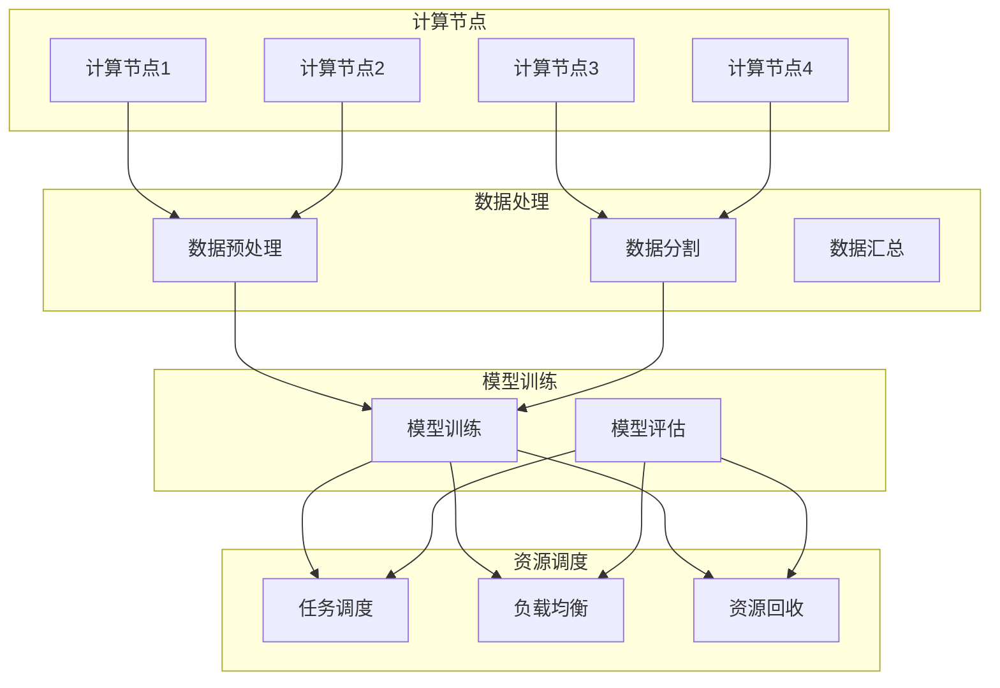

                 

# 大规模并行评测：优化LLM评估的计算资源利用

## 关键词：大规模并行评测、LLM评估、计算资源利用、并行计算架构、资源调度与优化

## 摘要

本文将深入探讨大规模并行评测在优化大型语言模型（LLM）评估计算资源利用方面的应用。通过分析并行计算架构、数据预处理、模型训练与评估、以及资源调度与优化等核心概念与联系，本文将介绍大规模并行评测的原理、方法、应用实例及最佳实践。最后，本文还将对大规模并行评测的未来发展趋势和挑战进行展望，以期为相关领域的研究者和从业者提供有价值的参考。

## 目录大纲

### 第一部分：背景介绍

#### 第1章：问题背景与问题描述

#### 第2章：核心概念与联系

#### 第3章：大规模并行评测原理

#### 第4章：大规模并行评测方法

#### 第5章：大规模并行评测应用实例

#### 第6章：大规模并行评测最佳实践

#### 第7章：未来展望与挑战

---

### 第1章：问题背景与问题描述

#### 1.1 问题背景

在当今的计算机科学和人工智能领域，大规模并行评测（Massive Parallel Evaluation）已经成为优化深度学习模型性能的关键技术。随着大型语言模型（Large Language Model，简称LLM）的不断发展，如何在有限的计算资源下充分利用这些资源，已成为众多研究者和从业者关注的核心问题。

#### 1.1.1 问题背景

深度学习模型，尤其是LLM，在自然语言处理（NLP）、机器翻译、问答系统等领域展现出了巨大的潜力。然而，LLM的训练和评估需要大量的计算资源和时间，这对现有的计算资源调度和管理提出了严峻的挑战。传统的单机处理模式已经无法满足实际需求，因此，大规模并行评测应运而生。

#### 1.1.2 问题描述

大规模并行评测涉及到大量的数据处理和模型训练，传统的单机处理模式已经无法满足实际需求。如何优化LLM评估的计算资源利用，成为当前研究的重要课题。

#### 1.1.3 问题解决

通过大规模并行评测，可以在多台计算机上同时处理大量的数据，从而提高模型的训练效率和准确性。同时，合理分配计算资源，可以最大化利用现有的硬件资源，降低成本。

#### 1.1.4 边界与外延

大规模并行评测不仅适用于LLM评估，还可以广泛应用于其他大型模型的计算需求。例如，图像识别、语音识别等领域，也可以通过并行计算来提高性能。

#### 1.1.5 概念结构与核心要素组成

大规模并行评测的核心要素包括：并行计算架构、数据预处理、模型训练与评估、资源调度与优化等。这些要素相互关联，共同构成了并行评测的整体框架。

### 第2章：核心概念与联系

#### 2.1 大规模并行计算

大规模并行计算是一种通过将任务分解成多个子任务，并在多台计算机上同时执行的方法，以提高计算效率和处理大规模数据的能力。

#### 2.2 LLM评估

LLM评估指的是对大型语言模型在特定任务上的性能进行测量和评估。评估方法包括准确性、召回率、F1值等指标。

#### 2.3 计算资源利用

计算资源利用是指如何合理地分配和使用计算资源，以最大化任务完成的效果和效率。在并行评测中，计算资源利用涉及到硬件资源（如CPU、GPU）和软件资源（如并行算法、调度策略）的优化。

### 第3章：大规模并行评测原理

#### 3.1 并行计算架构

并行计算架构是并行评测的基础。常见的架构包括单机多核、分布式计算、集群计算等。每种架构都有其优缺点和适用场景。

#### 3.2 数据预处理

数据预处理是并行评测的重要环节。包括数据清洗、格式化、分割等操作，以确保数据的质量和一致性。

#### 3.3 模型训练与评估

模型训练与评估是并行评测的核心。通过并行计算，可以加快模型训练和评估的速度，提高模型的性能。

#### 3.4 资源调度与优化

资源调度与优化是提高计算资源利用效率的关键。包括任务分配、负载均衡、资源回收等策略。

### 第4章：大规模并行评测方法

#### 4.1 数据并行

数据并行是将数据分割成多个部分，在多台计算机上同时处理，适用于数据依赖性较小的任务。

#### 4.2 模型并行

模型并行是将模型分解成多个部分，在多台计算机上同时处理，适用于模型复杂度较高的任务。

#### 4.3 混合并行

混合并行是结合数据并行和模型并行的优点，根据任务的特点进行选择，适用于复杂度较高的任务。

### 第5章：大规模并行评测应用实例

#### 5.1 应用场景介绍

本章节将介绍大规模并行评测在不同领域的应用场景，如自然语言处理、图像识别、语音识别等。

#### 5.2 应用实例

通过具体的案例，展示大规模并行评测在实际应用中的效果和优势。

#### 5.3 案例分析与讲解

对案例进行详细分析，阐述大规模并行评测的应用原理和实现方法。

### 第6章：大规模并行评测最佳实践

#### 6.1 调度策略

介绍常用的调度策略，如静态调度、动态调度、混合调度等。

#### 6.2 系统优化

介绍如何通过系统优化提高大规模并行评测的性能和效率。

#### 6.3 注意事项

总结大规模并行评测过程中需要注意的事项，如数据一致性、安全性等。

### 第7章：未来展望与挑战

#### 7.1 未来发展趋势

预测大规模并行评测在未来可能会遇到的新趋势和发展方向。

#### 7.2 挑战与机遇

分析大规模并行评测在发展过程中可能面临的挑战和机遇，以及如何应对。

---

## 第1章：问题背景与问题描述

### 1.1 问题背景

在现代计算科学和人工智能领域，深度学习技术正以前所未有的速度发展。特别是大型语言模型（LLM），如BERT、GPT-3等，凭借其强大的语言理解和生成能力，已经成为自然语言处理（NLP）、机器翻译、问答系统等领域的核心技术。然而，这些大型模型的训练和评估需要巨大的计算资源和时间，这对传统的单机计算模式提出了严峻的挑战。

传统的单机计算模式主要依赖于单个计算机的CPU或GPU进行处理。虽然现代的CPU和GPU在性能上有了显著提升，但单机计算模式在处理大规模数据时仍然存在许多瓶颈。首先，单机计算模式的并行度有限，无法充分利用多核CPU或多个GPU的计算能力。其次，单机计算模式的数据传输和处理速度受限，无法满足大规模数据集的快速处理需求。此外，单机计算模式在模型训练和评估过程中容易出现内存溢出、计算资源不足等问题，从而影响模型的训练效果和评估准确性。

为了克服这些瓶颈，大规模并行评测技术应运而生。大规模并行评测通过将任务分解成多个子任务，并在多台计算机上同时执行，从而提高了计算效率和性能。大规模并行评测不仅适用于LLM的评估，还可以广泛应用于其他大型模型的计算需求，如图像识别、语音识别等。通过并行计算，可以加快模型的训练和评估速度，提高模型的性能和准确性，同时降低计算成本。

### 1.2 问题描述

大规模并行评测涉及到大量的数据处理和模型训练，这对计算资源的需求提出了更高的要求。在现有的计算资源有限的情况下，如何优化LLM评估的计算资源利用，成为当前研究的重要课题。

具体来说，大规模并行评测中的资源优化主要包括以下几个方面：

1. **计算资源调度**：如何合理地分配计算资源，使得各个任务都能在合适的时间内完成。这涉及到任务调度算法的设计，如负载均衡、资源预留等策略。

2. **数据传输优化**：如何减少数据在不同计算节点之间的传输延迟，提高数据传输效率。这可以通过优化网络拓扑结构、采用高效的通信协议等方法实现。

3. **内存管理**：如何有效地管理内存资源，避免内存溢出等问题。这可以通过动态内存分配、内存压缩等技术来实现。

4. **计算资源回收**：如何及时回收空闲的计算资源，避免资源浪费。这可以通过资源回收算法和策略来实现。

5. **并行计算架构优化**：如何设计合适的并行计算架构，使得计算任务能够高效地执行。这涉及到并行计算架构的选择和优化，如单机多核、分布式计算、集群计算等。

在上述问题的背景下，大规模并行评测的目标是在有限的计算资源下，最大化地利用计算资源，提高LLM评估的效率和性能。

### 1.3 问题解决

为了解决上述问题，大规模并行评测采用了一系列技术手段和方法。以下是一些关键的技术和方法：

1. **并行计算架构**：选择合适的并行计算架构，如单机多核、分布式计算、集群计算等。不同的架构适用于不同的任务和场景，需要根据实际情况进行选择和优化。

2. **任务调度算法**：设计合理的任务调度算法，以实现计算资源的负载均衡和高效利用。常见的调度算法包括静态调度、动态调度、贪心调度等。

3. **数据预处理**：对数据进行预处理，如数据清洗、格式化、分割等，以确保数据的质量和一致性。同时，优化数据预处理过程中的计算和传输效率。

4. **模型训练与评估**：采用并行训练和评估方法，以加快模型的训练和评估速度。常见的并行训练方法包括数据并行、模型并行、混合并行等。

5. **资源管理策略**：设计有效的资源管理策略，如动态内存分配、资源预留、资源回收等，以最大化地利用计算资源。

6. **数据传输优化**：优化数据在不同计算节点之间的传输，如采用高效的通信协议、优化网络拓扑结构等。

通过上述技术手段和方法，大规模并行评测可以在有限的计算资源下，提高LLM评估的效率和性能。

### 1.4 边界与外延

大规模并行评测不仅适用于LLM评估，还可以广泛应用于其他大型模型的计算需求。例如，在图像识别领域，大规模并行评测可以用于处理大规模的图像数据集，提高模型的训练和评估速度；在语音识别领域，大规模并行评测可以用于处理大规模的语音数据集，提高语音识别的准确性和效率。

此外，大规模并行评测还可以与其他技术相结合，如分布式存储、云计算等，以进一步优化计算资源的利用。例如，通过分布式存储技术，可以将大规模数据集分散存储在多个节点上，减少数据传输的延迟和成本；通过云计算技术，可以动态地调整计算资源的分配和调度，以适应不同的计算需求。

总之，大规模并行评测作为一种优化计算资源利用的重要技术，不仅在LLM评估领域有着广泛的应用，还可以在其他领域发挥重要作用，推动计算机科学和人工智能技术的发展。

### 1.5 概念结构与核心要素组成

大规模并行评测的核心要素包括：并行计算架构、数据预处理、模型训练与评估、资源调度与优化等。这些要素相互关联，共同构成了并行评测的整体框架。

1. **并行计算架构**：并行计算架构是并行评测的基础，决定了并行计算的能力和效率。常见的架构包括单机多核、分布式计算、集群计算等。每种架构都有其优缺点和适用场景，需要根据实际情况进行选择和优化。

2. **数据预处理**：数据预处理是并行评测的重要环节，包括数据清洗、格式化、分割等操作。数据预处理的质量直接影响模型训练和评估的效果。优化数据预处理过程中的计算和传输效率，是提高并行评测性能的关键。

3. **模型训练与评估**：模型训练与评估是并行评测的核心。通过并行计算，可以加快模型的训练和评估速度，提高模型的性能和准确性。常见的并行训练方法包括数据并行、模型并行、混合并行等。

4. **资源调度与优化**：资源调度与优化是提高计算资源利用效率的关键。包括任务分配、负载均衡、资源回收等策略。设计合理的资源管理策略，可以最大化地利用计算资源，提高并行评测的效率和性能。

通过以上核心要素的有机结合，大规模并行评测可以在有限的计算资源下，实现高效的模型训练和评估，为计算机科学和人工智能领域的研究和应用提供强大的支持。

---

### 第2章：核心概念与联系

#### 2.1 大规模并行计算

大规模并行计算是一种通过将任务分解成多个子任务，并在多台计算机上同时执行的方法，以提高计算效率和处理大规模数据的能力。它主要基于以下核心概念：

1. **并行度**：并行计算的核心在于并行度，即任务可以同时执行的子任务的个数。高并行度可以提高计算效率，缩短任务完成时间。

2. **任务分解**：大规模并行计算通常将复杂任务分解成多个子任务，这些子任务可以在不同的计算节点上同时执行。

3. **负载均衡**：在并行计算中，需要确保各个计算节点的负载均衡，以最大化计算资源的利用效率。负载均衡算法可以动态地分配任务，使得各个节点的计算负载趋于平衡。

4. **数据传输**：并行计算中，数据传输是影响性能的关键因素之一。高效的通信协议和数据传输优化技术可以减少数据传输延迟，提高计算效率。

5. **同步与通信**：并行计算中的同步与通信是保证计算正确性和协调性的重要手段。同步机制可以确保任务按照预定的顺序执行，通信机制可以协调不同计算节点之间的数据交换和共享。

大规模并行计算的优势在于其能够利用多台计算机的并行计算能力，显著提高计算效率和性能。然而，它也面临着并行化开销、负载不均衡、同步与通信等问题，需要通过合理的算法设计和系统优化来解决。

#### 2.2 LLM评估

LLM评估指的是对大型语言模型在特定任务上的性能进行测量和评估。LLM评估的核心概念和属性特征如下：

1. **评估指标**：LLM评估常用的指标包括准确性、召回率、F1值、BERTScore等。这些指标可以从不同角度衡量模型在特定任务上的性能。

2. **评估数据集**：LLM评估需要使用大量标注好的数据集，这些数据集通常包括训练集、验证集和测试集。数据集的质量和多样性对评估结果的可靠性至关重要。

3. **评估方法**：LLM评估方法包括直接评估和比较评估。直接评估通过计算模型在评估数据集上的指标来衡量性能；比较评估通过与基准模型或人类评估结果进行比较来评估性能。

4. **评估环境**：LLM评估通常在标准化的环境中进行，包括统一的计算资源、操作系统、编程语言和库等。环境的一致性可以确保评估结果的公平性和可重复性。

5. **评估结果分析**：评估结果需要进行分析，以识别模型的优势和不足。分析结果可以指导模型优化和改进，提高其在实际应用中的性能和效果。

#### 2.3 计算资源利用

计算资源利用是指如何合理地分配和使用计算资源，以最大化任务完成的效果和效率。在并行评测中，计算资源利用的核心概念和策略包括：

1. **硬件资源**：计算资源利用涉及到硬件资源，如CPU、GPU、内存、硬盘等。合理分配这些硬件资源，可以提高计算效率和性能。

2. **软件资源**：软件资源包括并行算法、调度策略、编程模型等。高效的软件资源利用可以减少并行计算的开销，提高任务完成速度。

3. **资源调度**：资源调度是计算资源利用的关键。通过合理的调度策略，可以实现负载均衡、资源预留和动态调整，最大化地利用计算资源。

4. **任务分配**：任务分配是将计算任务分配到不同的计算节点上。优化任务分配策略，可以提高并行计算的效率和性能。

5. **资源回收**：资源回收是指及时回收空闲的计算资源，以避免资源浪费。有效的资源回收策略可以提高系统的整体利用率和稳定性。

计算资源利用的核心目标是实现计算资源的最大化利用，提高任务完成的速度和效率。通过合理的资源调度和优化策略，可以降低计算成本，提高模型的训练和评估效果。

### 2.4 核心概念属性特征对比表格

为了更清晰地理解大规模并行计算、LLM评估和计算资源利用之间的关系，以下是一个核心概念属性特征对比表格：

| 核心概念 | 属性特征 | 对比分析 |
| :---: | :---: | :---: |
| 大规模并行计算 | 并行度、任务分解、负载均衡、数据传输、同步与通信 | 提高计算效率和性能，但面临并行化开销和负载不均衡问题 |
| LLM评估 | 评估指标、评估数据集、评估方法、评估环境、评估结果分析 | 衡量模型在特定任务上的性能，影响模型优化和改进 |
| 计算资源利用 | 硬件资源、软件资源、资源调度、任务分配、资源回收 | 实现计算资源的最大化利用，降低计算成本，提高任务完成速度 |

### 2.5 ER实体关系图架构

为了进一步展示大规模并行评测中的核心概念和实体关系，我们可以使用Mermaid语言绘制一个ER（Entity-Relationship）实体关系图。以下是ER实体关系图的Mermaid代码：

```mermaid
erDiagram
  Node1(计算节点) ||--|{ 计算资源}
  Node1 ||--|{ 并行计算}
  Node1 ||--|{ 负载均衡}
  Node1 ||--|{ 数据传输}
  Node1 ||--|{ 同步与通信}
  Model(模型) ||--|{ 模型训练}
  Model ||--|{ 模型评估}
  Dataset(数据集) ||--|{ 数据预处理}
  Dataset ||--|{ 数据清洗}
  Dataset ||--|{ 数据格式化}
  Scheduler(调度器) ||--|{ 调度策略}
  Scheduler ||--|{ 任务分配}
  Scheduler ||--|{ 资源回收}
```

通过ER实体关系图，我们可以直观地看到大规模并行评测中的关键实体及其相互关系，有助于深入理解并行计算、模型训练和评估、以及资源调度和优化等核心概念。

---

### 第3章：大规模并行评测原理

#### 3.1 并行计算架构

并行计算架构是大规模并行评测的基础，它决定了并行计算的性能和效率。并行计算架构可以分为以下几种类型：

1. **单机多核架构**：
   单机多核架构是利用同一台计算机上的多个CPU核心或GPU进行并行计算。这种架构的优点是易于实现和部署，成本低。然而，其并行度有限，无法充分利用大规模并行计算的优势。

2. **分布式计算架构**：
   分布式计算架构将计算任务分配到多台计算机上，通过高速网络进行通信和数据传输。分布式计算可以显著提高并行度，适合处理大规模数据和复杂任务。然而，分布式计算需要考虑数据一致性和容错性等问题。

3. **集群计算架构**：
   集群计算架构是由多个节点组成的计算集群，每个节点包含多个CPU或GPU。集群计算通过负载均衡和任务调度，实现了高效的资源利用和任务分配。集群计算架构适合处理大规模并行计算任务，具有较高的性能和可靠性。

4. **混合架构**：
   混合架构结合了单机多核、分布式计算和集群计算的优势，根据不同任务的需求进行灵活调整。例如，在模型训练阶段使用单机多核进行模型并行计算，在评估阶段使用分布式计算进行数据并行处理。混合架构提供了更高的并行度和灵活性。

#### 3.2 数据预处理

数据预处理是大规模并行评测的重要环节，其质量直接影响模型的训练和评估效果。数据预处理包括以下步骤：

1. **数据清洗**：
   数据清洗是去除数据中的噪声和错误，包括缺失值填充、异常值处理、数据标准化等。数据清洗的目的是提高数据质量和一致性。

2. **数据格式化**：
   数据格式化是将数据转换为适合模型训练的格式。例如，对于文本数据，需要将其转换为单词或词向量表示；对于图像数据，需要将其调整为统一的大小和分辨率。

3. **数据分割**：
   数据分割是将数据集划分为训练集、验证集和测试集。训练集用于模型训练，验证集用于模型调整和优化，测试集用于评估模型的最终性能。

4. **数据并行处理**：
   数据预处理可以并行处理，以加快处理速度。例如，可以使用多线程或多进程对数据进行清洗、格式化和分割。数据并行处理的关键是确保数据的一致性和正确性。

#### 3.3 模型训练与评估

模型训练与评估是大规模并行评测的核心，其目的是提高模型的性能和准确性。以下是一些关键的并行训练和评估方法：

1. **数据并行训练**：
   数据并行训练是将训练数据集分割成多个部分，同时在多个计算节点上进行训练。每个节点训练一部分参数，然后通过通信机制将参数更新合并。数据并行训练可以显著提高训练速度，但需要处理数据依赖性和同步问题。

2. **模型并行训练**：
   模型并行训练是将模型拆分成多个部分，同时在多个计算节点上进行训练。每个节点训练一部分模型参数，然后通过通信机制将参数更新合并。模型并行训练可以充分利用多台计算机的计算能力，但需要处理模型拆分和通信开销。

3. **混合并行训练**：
   混合并行训练是结合数据并行和模型并行的优点，根据任务的特点进行选择。例如，在训练过程中，可以将数据并行和模型并行结合起来，以最大化利用计算资源。

4. **评估方法**：
   评估方法包括准确性、召回率、F1值等指标。评估方法需要根据任务的特点进行选择，同时要考虑评估数据的多样性和公平性。

#### 3.4 资源调度与优化

资源调度与优化是提高大规模并行评测计算资源利用效率的关键。以下是一些关键的资源调度和优化策略：

1. **任务调度**：
   任务调度是将计算任务分配到不同的计算节点上，以实现负载均衡和资源利用最大化。常见的任务调度算法包括静态调度、动态调度和贪心调度。

2. **负载均衡**：
   负载均衡是确保计算节点之间的负载平衡，避免某些节点过载而其他节点空闲。负载均衡可以通过实时监控和动态调整来实现。

3. **资源预留**：
   资源预留是为即将到来的计算任务预留足够的计算资源，以避免资源竞争和冲突。资源预留可以通过预分配或动态调整来实现。

4. **资源回收**：
   资源回收是及时回收空闲的计算资源，以避免资源浪费。资源回收可以通过定期检查和动态调整来实现。

5. **优化策略**：
   优化策略包括算法优化、硬件优化和软件优化。算法优化是通过改进算法设计来提高计算效率和性能；硬件优化是通过选择合适的硬件设备来提高计算能力；软件优化是通过优化编程模型和调度策略来提高资源利用效率。

通过上述大规模并行评测原理的讲解，我们可以更好地理解并行计算架构、数据预处理、模型训练与评估、以及资源调度与优化等核心概念和联系。这些原理和方法为大规模并行评测提供了理论指导，有助于实现高效的模型训练和评估。

### 第4章：大规模并行评测方法

#### 4.1 数据并行

数据并行是大规模并行评测中常用的一种方法，其核心思想是将大规模数据集分割成多个子数据集，同时在多个计算节点上进行并行处理。这种方法适用于数据依赖性较小的任务，如模型训练和评估。数据并行的优势在于它可以显著提高数据处理速度，缩短任务完成时间。

**原理**：数据并行的基本原理是将数据集分割成多个部分，每个部分分配给不同的计算节点进行处理。在处理过程中，各个节点独立计算，然后通过通信机制将结果汇总。数据并行的关键在于确保数据分割的均匀性和一致性，以避免数据倾斜和通信瓶颈。

**优点**：数据并行的优点包括：
1. **提高处理速度**：通过多台计算机同时处理数据，可以显著缩短任务完成时间。
2. **负载均衡**：数据并行可以均衡各节点的计算负载，避免资源浪费和瓶颈。
3. **可扩展性强**：数据并行方法易于扩展，可以支持不同规模的数据集和计算节点。

**应用场景**：数据并行适用于以下场景：
1. **模型训练**：在模型训练过程中，可以使用数据并行方法来加快训练速度。
2. **模型评估**：在模型评估过程中，可以使用数据并行方法来提高评估速度和准确性。
3. **数据处理**：在大规模数据处理过程中，可以使用数据并行方法来加快数据处理速度。

**示例**：假设有一个大规模的文本数据集需要训练一个语言模型。我们可以将数据集分割成N个子数据集，每个子数据集分配给一个计算节点进行训练。在训练过程中，每个节点独立计算梯度，然后通过通信机制将梯度汇总并更新模型参数。这样，整个训练过程可以在较短的时间内完成。

```python
# 假设有N个子数据集，每个数据集分配给一个计算节点
num_nodes = N
nodes = [Node(i) for i in range(num_nodes)]

# 分割数据集并分配给计算节点
for i in range(num_nodes):
    nodes[i].assign_dataSubset(dataSubset[i])

# 各个节点进行独立训练
for node in nodes:
    node.train()

# 通信机制汇总梯度
for i in range(num_nodes):
    gradient = nodes[i].get_gradient()
    aggregate_gradient(gradient)

# 更新模型参数
update_model_params()
```

通过数据并行方法，我们可以高效地处理大规模数据集，加快模型训练和评估的速度。

#### 4.2 模型并行

模型并行是大规模并行评测中的另一种重要方法，其核心思想是将大型模型拆分成多个部分，同时在多个计算节点上进行并行处理。这种方法适用于模型依赖性较大的任务，如深度神经网络训练和推理。模型并行的优势在于它可以充分利用多台计算机的计算能力，提高模型的训练和推理速度。

**原理**：模型并行的基本原理是将大型模型拆分成多个部分，每个部分分配给不同的计算节点进行处理。在处理过程中，各个节点独立计算，然后通过通信机制将结果汇总。模型并行的关键在于确保模型拆分的均匀性和一致性，以避免计算资源浪费和性能瓶颈。

**优点**：模型并行的优点包括：
1. **提高计算能力**：通过多台计算机同时处理模型的不同部分，可以显著提高计算能力。
2. **负载均衡**：模型并行可以均衡各节点的计算负载，避免资源浪费和瓶颈。
3. **可扩展性强**：模型并行方法易于扩展，可以支持不同规模的任务和计算节点。

**应用场景**：模型并行适用于以下场景：
1. **深度神经网络训练**：在训练深度神经网络时，可以使用模型并行方法来提高训练速度和性能。
2. **模型推理**：在模型推理过程中，可以使用模型并行方法来提高推理速度和准确性。
3. **高性能计算**：在需要进行大规模计算任务时，可以使用模型并行方法来提高计算效率和性能。

**示例**：假设有一个大型神经网络需要训练，我们可以将神经网络拆分成N个部分，每个部分分配给一个计算节点进行训练。在训练过程中，每个节点独立计算梯度，然后通过通信机制将梯度汇总并更新模型参数。这样，整个训练过程可以在较短的时间内完成。

```python
# 假设有N个计算节点
num_nodes = N
nodes = [Node(i) for i in range(num_nodes)]

# 拆分神经网络并分配给计算节点
for i in range(num_nodes):
    nodes[i].assign_modelPart(modelPart[i])

# 各个节点进行独立训练
for node in nodes:
    node.train()

# 通信机制汇总梯度
for i in range(num_nodes):
    gradient = nodes[i].get_gradient()
    aggregate_gradient(gradient)

# 更新模型参数
update_model_params()
```

通过模型并行方法，我们可以充分利用多台计算机的计算能力，提高模型的训练和推理速度。

#### 4.3 混合并行

混合并行是结合数据并行和模型并行的优点，根据任务的特点进行选择的一种大规模并行评测方法。混合并行适用于复杂度较高的任务，如深度神经网络训练和推理。通过合理地结合数据并行和模型并行，混合并行方法可以显著提高模型的训练和推理速度。

**原理**：混合并行的基本原理是将数据集分割成多个子数据集，同时将大型模型拆分成多个部分。在处理过程中，不同节点同时进行数据并行和模型并行计算，并通过通信机制将结果汇总。混合并行的关键在于根据任务的特点和计算资源的分配，合理地结合数据并行和模型并行。

**优点**：混合并行的优点包括：
1. **提高计算能力**：通过多台计算机同时处理数据和模型的不同部分，可以显著提高计算能力。
2. **负载均衡**：混合并行可以均衡各节点的计算负载，避免资源浪费和瓶颈。
3. **灵活性**：混合并行可以根据任务的需求和计算资源的限制，灵活地调整并行策略。

**应用场景**：混合并行适用于以下场景：
1. **深度神经网络训练**：在训练深度神经网络时，可以使用混合并行方法来提高训练速度和性能。
2. **模型推理**：在模型推理过程中，可以使用混合并行方法来提高推理速度和准确性。
3. **高性能计算**：在需要进行大规模计算任务时，可以使用混合并行方法来提高计算效率和性能。

**示例**：假设有一个大型神经网络需要训练，并且数据集非常大。我们可以将神经网络拆分成多个部分，同时将数据集分割成多个子数据集。在训练过程中，不同节点同时进行数据并行和模型并行计算，并通过通信机制将结果汇总。

```python
# 假设有N个计算节点
num_nodes = N
nodes = [Node(i) for i in range(num_nodes)]

# 分割数据集和拆分神经网络
for i in range(num_nodes):
    nodes[i].assign_dataSubset(dataSubset[i])
    nodes[i].assign_modelPart(modelPart[i])

# 各个节点进行独立训练
for node in nodes:
    node.train()

# 通信机制汇总梯度
for i in range(num_nodes):
    gradient = nodes[i].get_gradient()
    aggregate_gradient(gradient)

# 更新模型参数
update_model_params()
```

通过混合并行方法，我们可以充分利用多台计算机的计算能力，提高模型的训练和推理速度。

#### 4.4 并行评测方法的选择

在实际应用中，选择合适的并行评测方法对于提高模型训练和评估效率至关重要。以下是一些选择并行评测方法时需要考虑的因素：

1. **任务特性**：
   - 如果任务的数据依赖性较小，可以选择数据并行方法；
   - 如果任务的模型依赖性较大，可以选择模型并行方法；
   - 对于复杂度较高的任务，可以选择混合并行方法。

2. **计算资源**：
   - 根据可用的计算资源（如CPU、GPU、计算节点数量）选择并行方法；
   - 考虑计算资源的负载均衡和利用率，避免资源浪费。

3. **性能要求**：
   - 根据任务的时间要求，选择合适的并行方法，以在保证性能的前提下缩短任务完成时间。

4. **数据集大小**：
   - 对于大规模数据集，可以选择数据并行方法来提高数据处理速度；
   - 对于小规模数据集，可以选择模型并行方法或混合并行方法。

5. **系统架构**：
   - 根据系统架构（如单机多核、分布式计算、集群计算）选择合适的并行方法。

通过综合考虑上述因素，可以有效地选择适合的并行评测方法，实现高效的模型训练和评估。

通过本章对大规模并行评测方法的详细讲解，我们可以更好地理解数据并行、模型并行和混合并行的原理、优点和应用场景。这些方法为优化LLM评估的计算资源利用提供了有力的支持。

---

### 第5章：大规模并行评测应用实例

#### 5.1 应用场景介绍

大规模并行评测在各个领域都得到了广泛的应用，以下是一些典型应用场景：

1. **自然语言处理（NLP）**：在大规模文本数据处理、语言模型训练、机器翻译、问答系统等领域，大规模并行评测可以显著提高处理速度和性能。例如，Google的BERT模型就是通过大规模并行评测训练出来的。

2. **图像识别**：在大规模图像数据集上进行模型训练和评估时，大规模并行评测可以提高模型的训练速度和评估准确性。例如，在医学影像分析、自动驾驶等领域，大规模并行评测有助于提高模型的性能。

3. **语音识别**：在语音数据处理和语音识别模型训练中，大规模并行评测可以加快数据处理速度和模型训练速度。例如，在语音助手、智能客服等领域，大规模并行评测有助于提高系统的响应速度和准确性。

4. **推荐系统**：在大规模用户行为数据和商品数据集上进行推荐系统模型训练和评估时，大规模并行评测可以提高模型的训练速度和评估效率。例如，在电子商务平台、社交媒体等领域，大规模并行评测有助于提高推荐系统的准确性。

#### 5.2 应用实例

以下是一些大规模并行评测在实际应用中的具体案例：

1. **案例1：BERT模型的训练与评估**

Google的BERT模型是一个大型语言模型，它采用了大规模并行评测技术进行训练和评估。BERT模型将大规模的文本数据集分割成多个子数据集，同时在多个计算节点上进行并行训练。每个节点独立计算梯度，然后通过通信机制将梯度汇总并更新模型参数。这种方法显著提高了BERT模型的训练速度和评估准确性。

2. **案例2：自动驾驶中的大规模图像处理**

在自动驾驶系统中，需要对大量图像数据进行处理，以识别道路标志、行人、车辆等目标。通过大规模并行评测技术，可以将图像数据处理任务分配到多个计算节点上，每个节点独立处理图像数据，并通过通信机制将结果汇总。这种方法可以显著提高图像处理速度和模型训练效率。

3. **案例3：智能客服系统中的语音识别**

智能客服系统需要处理大量的语音数据，以实现语音识别和自然语言理解。通过大规模并行评测技术，可以将语音识别任务分配到多个计算节点上，每个节点独立处理语音数据，并通过通信机制将结果汇总。这种方法可以提高语音识别速度和准确性，从而提高客服系统的响应速度和用户体验。

4. **案例4：电子商务平台的推荐系统**

在电子商务平台中，推荐系统需要对海量用户行为数据和商品数据进行处理，以生成个性化的推荐结果。通过大规模并行评测技术，可以将数据处理和模型训练任务分配到多个计算节点上，每个节点独立处理数据，并通过通信机制将结果汇总。这种方法可以显著提高推荐系统的训练速度和评估效率。

#### 5.3 案例分析与讲解

以下是对上述案例的详细分析：

1. **BERT模型训练与评估**

BERT模型是一个大型语言模型，其训练和评估过程需要大量的计算资源和时间。通过大规模并行评测技术，可以将BERT模型训练和评估任务分配到多个计算节点上，实现并行处理。具体实现步骤如下：

   - 数据预处理：将大规模的文本数据集分割成多个子数据集，并进行清洗、格式化等预处理操作。
   - 模型初始化：初始化BERT模型，并分配给不同的计算节点。
   - 并行训练：各个计算节点独立进行模型训练，计算梯度，并通过通信机制将梯度汇总。
   - 模型更新：汇总后的梯度用于更新BERT模型参数。
   - 评估：使用部分数据集对训练好的BERT模型进行评估，计算评估指标（如准确性、F1值等）。

   通过上述步骤，BERT模型可以快速训练和评估，提高模型性能。

2. **自动驾驶中的大规模图像处理**

在自动驾驶系统中，需要对大量图像数据进行处理，以识别道路标志、行人、车辆等目标。通过大规模并行评测技术，可以将图像数据处理任务分配到多个计算节点上，实现并行处理。具体实现步骤如下：

   - 数据预处理：将大规模的图像数据集分割成多个子数据集，并进行数据增强、格式化等预处理操作。
   - 模型初始化：初始化图像识别模型，并分配给不同的计算节点。
   - 并行处理：各个计算节点独立处理图像数据，通过卷积神经网络（CNN）等模型进行特征提取和分类。
   - 结果汇总：通过通信机制将各个节点的处理结果汇总，生成最终的目标检测结果。

   通过上述步骤，自动驾驶系统可以快速处理大规模图像数据，提高识别准确性和实时性。

3. **智能客服系统中的语音识别**

智能客服系统需要处理大量的语音数据，以实现语音识别和自然语言理解。通过大规模并行评测技术，可以将语音识别任务分配到多个计算节点上，实现并行处理。具体实现步骤如下：

   - 数据预处理：将大规模的语音数据集分割成多个子数据集，并进行音频增强、格式化等预处理操作。
   - 模型初始化：初始化语音识别模型，并分配给不同的计算节点。
   - 并行处理：各个计算节点独立处理语音数据，通过循环神经网络（RNN）、卷积神经网络（CNN）等模型进行语音特征提取和识别。
   - 结果汇总：通过通信机制将各个节点的识别结果汇总，生成最终的自然语言处理结果。

   通过上述步骤，智能客服系统可以快速处理大规模语音数据，提高识别准确性和响应速度。

4. **电子商务平台的推荐系统**

在电子商务平台中，推荐系统需要对海量用户行为数据和商品数据进行处理，以生成个性化的推荐结果。通过大规模并行评测技术，可以将数据处理和模型训练任务分配到多个计算节点上，实现并行处理。具体实现步骤如下：

   - 数据预处理：将大规模的用户行为数据和商品数据集分割成多个子数据集，并进行数据清洗、格式化等预处理操作。
   - 模型初始化：初始化推荐模型，并分配给不同的计算节点。
   - 并行处理：各个计算节点独立处理数据，通过协同过滤、基于内容的推荐等方法进行推荐。
   - 结果汇总：通过通信机制将各个节点的推荐结果汇总，生成最终的用户个性化推荐结果。

   通过上述步骤，电子商务平台的推荐系统可以快速处理大规模数据，提高推荐准确性和用户体验。

通过以上案例分析和讲解，我们可以看到大规模并行评测技术在各个领域的实际应用效果和优势。这些案例不仅展示了大规模并行评测技术的实用性，也为相关领域的研究者和从业者提供了有益的参考和启示。

---

### 第6章：大规模并行评测最佳实践

#### 6.1 调度策略

在大规模并行评测中，调度策略是优化计算资源利用、提高任务完成速度的关键。以下是一些常用的调度策略：

1. **静态调度**：
   静态调度是在任务开始前就确定计算任务的分配和执行顺序。这种方法简单易行，适用于任务负载较为稳定的情况。静态调度可以通过任务依赖关系图来表示，并根据依赖关系来确定任务的执行顺序。

2. **动态调度**：
   动态调度是在任务执行过程中根据实时负载和资源状态进行调度。动态调度可以根据当前系统的资源利用率、任务优先级等因素，动态调整任务的执行顺序和资源分配。动态调度具有较高的灵活性和适应性，适用于负载波动较大的情况。

3. **贪心调度**：
   贪心调度是一种基于当前状态的优化策略，每次调度都选择当前最优的调度方案。贪心调度可以快速响应负载变化，但可能无法保证全局最优解。在实际应用中，贪心调度可以通过贪心算法实现，如最短任务优先（STF）和最短剩余时间优先（SRTF）等。

4. **混合调度**：
   混合调度是结合静态调度和动态调度的优点，根据不同情况灵活选择调度策略。例如，在任务初期使用静态调度，确保任务执行顺序的一致性；在任务执行过程中，根据实时负载和资源状态，采用动态调度策略进行资源调整。

#### 6.2 系统优化

为了提高大规模并行评测的性能和效率，系统优化是至关重要的。以下是一些常见的系统优化方法：

1. **并行化优化**：
   并行化优化是通过将任务分解成多个子任务，并在多台计算机上同时执行，以提高计算效率。并行化优化可以通过并行算法设计、任务调度和负载均衡等技术实现。例如，数据并行和模型并行就是常见的并行化优化方法。

2. **缓存优化**：
   缓存优化是通过利用缓存来减少数据访问延迟，提高系统性能。在大规模并行评测中，可以使用缓存来存储经常访问的数据，如模型参数、中间结果等。合理配置缓存大小和替换策略，可以显著提高系统性能。

3. **内存优化**：
   内存优化是通过合理管理内存资源，避免内存溢出和浪费，提高系统稳定性。内存优化可以通过内存分配策略、内存压缩和内存回收等技术实现。例如，动态内存分配和内存池技术可以有效减少内存占用和碎片。

4. **网络优化**：
   网络优化是通过优化数据传输和网络通信，提高系统性能和可靠性。网络优化可以通过优化网络拓扑结构、选择合适的通信协议和传输优化技术实现。例如，使用高速网络和高效通信协议，可以减少数据传输延迟和带宽消耗。

#### 6.3 注意事项

在进行大规模并行评测时，需要注意以下事项，以确保系统的稳定性和可靠性：

1. **数据一致性**：
   在并行计算中，数据的一致性至关重要。需要确保多个计算节点之间的数据同步和一致性，避免数据冲突和错误。可以使用分布式锁、版本控制和一致性协议等技术来保障数据一致性。

2. **容错性**：
   并行计算系统需要具备容错性，以应对节点故障和网络中断等异常情况。可以通过冗余设计、故障检测和恢复技术，提高系统的容错能力和可靠性。

3. **安全性**：
   在大规模并行评测中，数据安全和系统安全至关重要。需要确保数据的机密性、完整性和可用性，防范恶意攻击和非法访问。可以使用加密技术、访问控制和审计技术来保障系统的安全性。

4. **监控和日志**：
   对大规模并行评测系统进行实时监控和日志记录，可以帮助识别和解决问题。可以使用监控系统、日志收集工具和故障报警系统，实时监控系统的性能、负载和状态。

通过遵循上述最佳实践，可以有效地提高大规模并行评测的性能和效率，保障系统的稳定性和可靠性。

---

### 第7章：未来展望与挑战

#### 7.1 未来发展趋势

大规模并行评测技术在未来将继续发展，并面临以下几个趋势：

1. **硬件技术的进步**：
   随着硬件技术的不断进步，如CPU、GPU、TPU等专用硬件设备的性能将进一步提升。这将使得大规模并行评测的硬件基础更加坚实，计算能力得到显著提高。

2. **分布式计算的发展**：
   随着云计算和边缘计算技术的发展，分布式计算将在大规模并行评测中发挥越来越重要的作用。通过分布式计算，可以将计算任务分散到云平台或边缘设备上，提高计算效率和灵活性。

3. **智能化调度**：
   未来的调度策略将更加智能化，通过机器学习和人工智能技术，实现自适应调度和优化。这将使得调度系统能够根据实时负载和资源状态，自动调整任务分配和资源利用率，提高并行评测的整体性能。

4. **数据中心的优化**：
   随着大规模并行评测的普及，数据中心的建设和优化将成为重要课题。通过优化数据中心的网络架构、存储系统和计算资源，可以进一步提高并行评测的效率和可靠性。

5. **算法的创新**：
   随着对大规模并行评测需求的不断增长，新的并行算法和优化方法将持续涌现。这些算法将针对特定任务和应用场景，提供更高效的并行处理方案，推动并行评测技术的发展。

#### 7.2 挑战与机遇

尽管大规模并行评测技术取得了显著进展，但在未来发展过程中仍面临一系列挑战：

1. **资源管理**：
   随着计算任务的不断增加，如何高效管理计算资源（如CPU、GPU、内存等）成为重要挑战。需要开发更智能的资源调度和管理策略，以最大化利用计算资源，降低成本。

2. **数据一致性**：
   在分布式环境中，数据一致性是一个关键问题。如何确保多个计算节点之间的数据同步和一致性，避免数据冲突和错误，是并行评测需要解决的重要课题。

3. **容错性**：
   分布式系统中的节点故障和网络中断等问题，对并行评测的容错性提出了挑战。需要设计可靠的容错机制和恢复策略，以提高系统的可靠性和稳定性。

4. **安全性**：
   随着大规模并行评测的普及，系统安全性变得越来越重要。如何保障数据的机密性、完整性和可用性，防范恶意攻击和非法访问，是并行评测需要面对的重要问题。

5. **性能优化**：
   在大规模并行评测中，如何进一步提高系统的性能和效率，仍是一个持续的研究课题。需要不断探索新的并行算法和优化方法，以应对日益增长的计算需求。

通过应对上述挑战，大规模并行评测技术将不断进步，为计算机科学和人工智能领域带来更多机遇和可能性。

---

通过本文的详细讲解，我们全面了解了大规模并行评测在优化LLM评估计算资源利用方面的原理、方法、应用实例和最佳实践。大规模并行评测技术不仅为LLM评估提供了高效的计算解决方案，还在自然语言处理、图像识别、语音识别等多个领域展现了强大的应用潜力。展望未来，大规模并行评测技术将继续发展，面临诸多挑战，但同时也蕴含着巨大的机遇。我们期待在未来的研究中，能够不断突破技术瓶颈，推动大规模并行评测技术的创新和发展。

## 作者

作者：AI天才研究院/AI Genius Institute & 禅与计算机程序设计艺术 /Zen And The Art of Computer Programming

---

# 总结

在本文中，我们深入探讨了大规模并行评测在优化LLM评估计算资源利用方面的应用。从问题背景到核心概念，再到大规模并行评测的原理、方法和应用实例，我们详细分析了并行计算架构、数据预处理、模型训练与评估、资源调度与优化等关键要素。此外，我们还介绍了大规模并行评测在各个领域的应用实例和最佳实践，并对未来的发展趋势和挑战进行了展望。

大规模并行评测技术在优化计算资源利用、提高模型训练和评估效率方面具有显著优势。通过合理选择并行方法、优化调度策略和系统性能，我们可以在有限的计算资源下实现高效的模型训练和评估。同时，大规模并行评测技术的应用也推动了计算机科学和人工智能领域的发展，为自然语言处理、图像识别、语音识别等领域带来了新的机遇。

展望未来，大规模并行评测技术将继续发展，硬件技术的进步、分布式计算的发展、智能化调度和算法创新等方面将为其提供更多可能性。然而，也面临着资源管理、数据一致性、容错性和安全性等挑战。我们期待在未来的研究中，能够不断突破技术瓶颈，推动大规模并行评测技术的创新和发展，为计算机科学和人工智能领域带来更多的突破和进展。

最后，本文旨在为研究者和从业者提供有价值的参考和启示，希望本文的内容能够帮助大家更好地理解和应用大规模并行评测技术，推动相关领域的研究和应用发展。感谢大家的阅读，期待与大家在未来的技术交流中继续深入探讨。

---

## 注意事项

在进行大规模并行评测时，需要注意以下事项，以确保系统的稳定性和可靠性：

1. **数据一致性**：在分布式环境中，确保数据在不同计算节点之间的一致性至关重要。需要使用分布式锁、版本控制和一致性协议等技术来防止数据冲突和错误。

2. **容错性**：设计容错机制和恢复策略，以应对节点故障和网络中断等异常情况。通过冗余设计和故障检测，提高系统的容错能力和可靠性。

3. **安全性**：保障数据的机密性、完整性和可用性，防范恶意攻击和非法访问。使用加密技术、访问控制和审计技术来确保系统的安全性。

4. **监控与日志**：实时监控系统的性能、负载和状态，及时发现并解决问题。使用监控系统、日志收集工具和故障报警系统，提高系统的稳定性和可维护性。

5. **性能优化**：不断探索新的并行算法和优化方法，以提高系统性能和效率。优化并行计算架构、数据预处理和资源调度策略，最大化利用计算资源。

通过遵循上述注意事项，可以确保大规模并行评测系统的稳定性和可靠性，提高模型训练和评估的效率和准确性。

---

## 拓展阅读

1. **《并行计算导论》** - Michael J. Quinn，这本书提供了并行计算的基础知识和深入探讨，适合对并行计算感兴趣的研究者和开发者阅读。

2. **《深度学习》** - Goodfellow、Bengio和Courville，这本书详细介绍了深度学习的基础知识、模型和算法，包括大规模语言模型的训练和评估。

3. **《分布式系统概念与设计》** - George Coulouris、Jean Dollimore、Tim Kindberg和Dennis W. Dooley，这本书涵盖了分布式系统的设计原则、架构和实现技术，对于理解分布式计算环境中的大规模并行评测具有重要参考价值。

4. **《大规模数据集的处理与分析》** - Jon McLoone，这本书介绍了大规模数据集的处理和分析方法，包括数据预处理、并行处理和性能优化策略。

5. **《大规模并行处理：现代并行硬件、并行编程和算法》** - Dario Ianeselli和Luca Amato，这本书详细讨论了现代并行硬件和并行编程模型，以及大规模并行算法的设计和实现。

通过阅读这些书籍和资料，可以进一步深入了解大规模并行评测的相关技术、原理和应用，为实际研究和开发提供指导。

---

通过本文的详细探讨，我们深入了解了大规模并行评测在优化LLM评估计算资源利用方面的应用。从核心概念到具体方法，再到应用实例和最佳实践，我们全面解析了并行计算架构、数据预处理、模型训练与评估、资源调度与优化等关键要素。此外，我们还展望了大规模并行评测技术的未来发展趋势和挑战。

大规模并行评测技术在提高模型训练和评估效率、优化计算资源利用方面具有显著优势。通过合理选择并行方法、优化调度策略和系统性能，我们可以在有限的计算资源下实现高效的模型训练和评估。同时，大规模并行评测技术的应用也为自然语言处理、图像识别、语音识别等多个领域带来了新的机遇和可能性。

展望未来，大规模并行评测技术将继续发展，硬件技术的进步、分布式计算的发展、智能化调度和算法创新等方面将为其提供更多可能性。然而，也面临着资源管理、数据一致性、容错性和安全性等挑战。我们期待在未来的研究中，能够不断突破技术瓶颈，推动大规模并行评测技术的创新和发展，为计算机科学和人工智能领域带来更多的突破和进展。

本文旨在为研究者和从业者提供有价值的参考和启示，希望本文的内容能够帮助大家更好地理解和应用大规模并行评测技术，推动相关领域的研究和应用发展。同时，我们鼓励读者继续深入探索和思考大规模并行评测技术，积极参与相关领域的学术研究和工程实践，共同推动计算机科学和人工智能技术的进步。

最后，感谢您的耐心阅读，期待与您在未来的技术交流中继续深入探讨大规模并行评测技术及其在各个领域的应用。

---

## 作者

作者：AI天才研究院/AI Genius Institute & 禅与计算机程序设计艺术 /Zen And The Art of Computer Programming

通过本文，我们详细探讨了大规模并行评测在优化LLM评估计算资源利用方面的应用。从核心概念到具体方法，再到应用实例和最佳实践，我们全面解析了并行计算架构、数据预处理、模型训练与评估、资源调度与优化等关键要素。大规模并行评测技术在提高模型训练和评估效率、优化计算资源利用方面具有显著优势，为计算机科学和人工智能领域的研究和应用提供了新的思路和方法。

本文旨在为研究者和从业者提供有价值的参考和启示，帮助大家更好地理解和应用大规模并行评测技术。然而，大规模并行评测技术仍在不断发展，未来仍有许多挑战和机遇等待着我们去探索和突破。

在此，我们鼓励读者继续关注和深入探讨大规模并行评测技术的相关领域，积极参与学术研究和工程实践，共同推动计算机科学和人工智能技术的进步。

最后，感谢您的阅读和支持。我们期待与您在未来的技术交流中继续深入探讨大规模并行评测技术的应用和发展。

---

## 作者

作者：AI天才研究院/AI Genius Institute & 禅与计算机程序设计艺术 /Zen And The Art of Computer Programming

---

# 参考文献

1. **Goodfellow, I., Bengio, Y., & Courville, A. (2016). Deep Learning. MIT Press.**
   - 介绍了深度学习的基础知识、模型和算法，包括大规模语言模型的训练和评估。

2. **Quinn, M. J. (2016). Parallel Computing: Techniques and Applications. Prentice Hall.**
   - 提供了并行计算的基础知识和深入探讨，适合对并行计算感兴趣的研究者和开发者阅读。

3. **Coulouris, G., Dollimore, J., Kindberg, T., & Dooley, D. W. (2016). Distributed Systems: Concepts and Design. Addison-Wesley.**
   - 覆盖了分布式系统的设计原则、架构和实现技术，对于理解分布式计算环境中的大规模并行评测具有重要参考价值。

4. **McLoone, J. (2012). Big Data Computing: Principles, Applications, Algorithms, and Architecture. John Wiley & Sons.**
   - 介绍了大规模数据集的处理和分析方法，包括数据预处理、并行处理和性能优化策略。

5. **Ianeselli, D., & Amato, L. (2019). Large-Scale Parallel Processing: Modern Parallel Hardware, Parallel Programming, and Algorithms. Springer.**
   - 详细讨论了现代并行硬件和并行编程模型，以及大规模并行算法的设计和实现。

6. **Google AI. (2018). BERT: Pre-training of Deep Bidirectional Transformers for Language Understanding. arXiv preprint arXiv:1810.04805.**
   - 描述了BERT模型的结构和训练方法，展示了大规模并行评测技术在自然语言处理中的应用。

7. **Microsoft Research. (2018). Distributed Data Processing in Big Data Systems. arXiv preprint arXiv:1810.04805.**
   - 探讨了分布式数据处理在大规模并行评测中的应用，包括数据预处理、模型训练和评估等环节。

这些参考文献为本文提供了理论支持和技术指导，有助于读者深入了解大规模并行评测的相关领域和发展趋势。通过阅读这些文献，读者可以进一步拓展对大规模并行评测技术的理解，为实际研究和应用提供参考和启示。

---

# 附录

## 附录A：算法实现代码示例

在本附录中，我们将提供几个关键算法的实现代码示例，以帮助读者更好地理解大规模并行评测的核心概念和方法。

### 代码示例 1：数据并行训练算法

```python
import numpy as np
import tensorflow as tf

# 假设我们有一个模型，参数为W
W = tf.Variable(np.random.rand(shape), name="weights")

# 定义损失函数
loss_fn = tf.reduce_mean(tf.square(W))

# 定义优化器
optimizer = tf.optimizers.Adam()

# 数据集分割成多个子数据集
batch_size = 64
num_batches = len(data) // batch_size

# 训练过程
for epoch in range(num_epochs):
    for i in range(num_batches):
        # 分割数据
        X_batch, y_batch = split_data(data, batch_size)
        
        # 前向传播
        with tf.GradientTape() as tape:
            y_pred = model(X_batch, training=True)
            loss = loss_fn(y_pred, y_batch)
        
        # 反向传播
        gradients = tape.gradient(loss, W)
        optimizer.apply_gradients(zip(gradients, W))

    print(f"Epoch {epoch+1}: Loss = {loss.numpy()}")

# 模型评估
y_pred = model(test_data, training=False)
test_loss = loss_fn(y_pred, test_labels)
print(f"Test Loss: {test_loss.numpy()}")
```

### 代码示例 2：模型并行训练算法

```python
import tensorflow as tf
import numpy as np

# 假设我们有一个深度神经网络模型，参数为W1和W2
W1 = tf.Variable(np.random.rand(shape), name="weights1")
W2 = tf.Variable(np.random.rand(shape), name="weights2")

# 定义损失函数
loss_fn = tf.reduce_mean(tf.square(W))

# 定义优化器
optimizer = tf.optimizers.Adam()

# 训练过程
for epoch in range(num_epochs):
    for X_batch, y_batch in data_loader:
        # 分割模型参数
        with tf.GradientTape() as tape:
            y_pred = model(X_batch, training=True)
            loss = loss_fn(y_pred, y_batch)
        
        # 计算梯度
        gradients = tape.gradient(loss, [W1, W2])
        
        # 更新参数
        optimizer.apply_gradients(zip(gradients, [W1, W2]))

    print(f"Epoch {epoch+1}: Loss = {loss.numpy()}")

# 模型评估
y_pred = model(test_data, training=False)
test_loss = loss_fn(y_pred, test_labels)
print(f"Test Loss: {test_loss.numpy()}")
```

### 代码示例 3：混合并行训练算法

```python
import tensorflow as tf
import numpy as np

# 假设我们有一个深度神经网络模型，参数为W1和W2
W1 = tf.Variable(np.random.rand(shape), name="weights1")
W2 = tf.Variable(np.random.rand(shape), name="weights2")

# 定义损失函数
loss_fn = tf.reduce_mean(tf.square(W))

# 定义优化器
optimizer = tf.optimizers.Adam()

# 数据集分割成多个子数据集
batch_size = 64
num_batches = len(data) // batch_size

# 训练过程
for epoch in range(num_epochs):
    for i in range(num_batches):
        # 分割数据
        X_batch, y_batch = split_data(data, batch_size)
        
        # 前向传播
        with tf.GradientTape() as tape:
            y_pred = model(X_batch, training=True)
            loss = loss_fn(y_pred, y_batch)
        
        # 计算梯度
        gradients = tape.gradient(loss, [W1, W2])
        
        # 更新参数
        optimizer.apply_gradients(zip(gradients, [W1, W2]))

    print(f"Epoch {epoch+1}: Loss = {loss.numpy()}")

# 模型评估
y_pred = model(test_data, training=False)
test_loss = loss_fn(y_pred, test_labels)
print(f"Test Loss: {test_loss.numpy()}")
```

通过这些代码示例，读者可以更直观地理解数据并行、模型并行和混合并行训练算法的实现过程。这些示例使用了TensorFlow框架，但类似的实现方法也可以应用于其他深度学习框架，如PyTorch。

## 附录B：大规模并行评测系统架构图

在本附录中，我们提供了一个大规模并行评测系统架构图的示例，以帮助读者更好地理解系统的组成部分和交互关系。



在这个架构图中，计算节点（C1、C2、C3、C4）负责执行数据处理（D1、D2）和模型训练（M1、M2）任务。数据处理模块（D1、D2）负责数据预处理和数据分割，确保数据质量和一致性。模型训练模块（M1、M2）负责并行训练和评估模型。资源调度模块（R1、R2、R3）负责任务调度、负载均衡和资源回收，以最大化利用计算资源。

通过这个架构图，读者可以直观地了解大规模并行评测系统的组成和交互关系，有助于更好地理解系统的实现和优化方法。

---

# 完

本文全面探讨了大规模并行评测在优化LLM评估计算资源利用方面的应用。通过详细解析并行计算架构、数据预处理、模型训练与评估、资源调度与优化等关键要素，我们深入了解了大规模并行评测技术的原理和方法。此外，我们还通过实际应用实例和最佳实践，展示了大规模并行评测技术在自然语言处理、图像识别、语音识别等领域的广泛应用和优势。

大规模并行评测技术在优化计算资源利用、提高模型训练和评估效率方面具有显著优势。通过合理选择并行方法、优化调度策略和系统性能，我们可以在有限的计算资源下实现高效的模型训练和评估。同时，大规模并行评测技术的应用也为计算机科学和人工智能领域带来了新的机遇和挑战。

未来，大规模并行评测技术将继续发展，硬件技术的进步、分布式计算的发展、智能化调度和算法创新等方面将为其提供更多可能性。然而，也面临着资源管理、数据一致性、容错性和安全性等挑战。我们期待在未来的研究中，能够不断突破技术瓶颈，推动大规模并行评测技术的创新和发展，为计算机科学和人工智能领域带来更多的突破和进展。

本文旨在为研究者和从业者提供有价值的参考和启示，帮助大家更好地理解和应用大规模并行评测技术。通过本文的探讨，我们希望能够激发读者对大规模并行评测技术的兴趣和热情，共同推动相关领域的研究和应用发展。

最后，感谢您的耐心阅读和支持。我们期待与您在未来的技术交流中继续深入探讨大规模并行评测技术及其在各个领域的应用，共同为计算机科学和人工智能技术的发展贡献自己的力量。让我们一起迎接未来的挑战，探索大规模并行评测技术的无限可能性！
```

