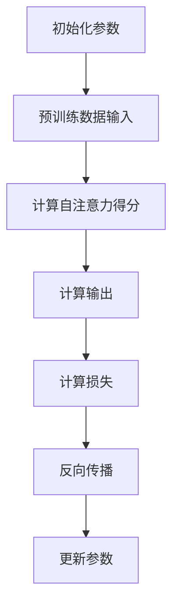
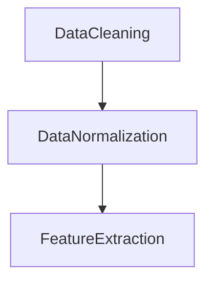

                 


### 让我们一起深入探讨：大规模预训练模型在金融场景中的迁移学习实践

**关键词：** 大规模预训练模型、迁移学习、金融应用、数据预处理、模型调优

**摘要：** 本文将系统性地介绍大规模预训练模型在金融场景中的迁移学习实践。我们将从基础概念入手，逐步探讨大规模预训练模型的优势、工作原理及其在金融领域的应用，然后深入迁移学习的概念和实践，最后讨论模型调优和评估，以及大规模预训练模型在金融场景中的前景与挑战。

---

### 第一部分：大规模预训练模型基础

#### 第1章：大规模预训练模型概述

**1.1.1 预训练模型的概念与发展历程**

**问题背景：** 随着人工智能技术的快速发展，深度学习已经成为自然语言处理、计算机视觉等领域的核心技术。然而，传统的深度学习方法往往需要大量标注数据来进行训练，这在实际应用中受到了数据获取和标注成本的限制。

**问题描述：** 如何在有限的标注数据下，训练出性能优异的深度学习模型？

**问题解决：** 预训练模型通过在大规模未标注数据上进行预训练，然后在小规模标注数据上进行微调，从而解决了数据标注成本高的问题。

**边界与外延：** 预训练模型不仅限于自然语言处理领域，还可以应用于计算机视觉、语音识别等其他领域。

**概念结构与核心要素组成：** 预训练模型的核心要素包括预训练数据和预训练任务，以及后续的微调任务。

**核心概念：** 预训练（Pre-training）、微调（Fine-tuning）

**属性特征对比表格：**

| 特征 | 预训练 | 微调 |
| --- | --- | --- |
| 数据量 | 大规模未标注数据 | 小规模标注数据 |
| 任务类型 | 多样化 | 特定任务 |
| 训练目标 | 通用特征提取 | 任务特定优化 |

**ER实体关系图架构：**

```mermaid
erDiagram
    Customer ||--|{ Order : places } 
    Product ||--|{ Order : contains }
```

**1.1.2 大规模预训练模型的优势**

**问题背景：** 随着数据规模的不断扩大，如何训练出性能更加优异的深度学习模型成为了一个关键问题。

**问题描述：** 大规模预训练模型在性能、泛化能力等方面具有哪些优势？

**问题解决：** 大规模预训练模型通过在更大规模的数据集上进行预训练，能够提取出更丰富的特征，从而在特定任务上表现出更高的性能。

**边界与外延：** 优势不仅限于特定领域，还可以跨领域迁移。

**概念结构与核心要素组成：** 大规模预训练模型的核心要素包括大规模数据集、强大的计算资源和高效的训练算法。

**核心概念：** 大规模数据集、计算资源、训练算法

**属性特征对比表格：**

| 特征 | 小规模预训练模型 | 大规模预训练模型 |
| --- | --- | --- |
| 数据量 | 有限的未标注数据 | 数十亿规模的未标注数据 |
| 计算资源 | 较少的GPU资源 | 大量的GPU集群资源 |
| 性能 | 中等水平 | 领先水平 |
| 泛化能力 | 有限的 | 更强的 |

**ER实体关系图架构：**

```mermaid
erDiagram
    Model ||--|{ Data : trains on } 
    Resource ||--|{ Model : requires }
```

**1.1.3 主流大规模预训练模型介绍**

**问题背景：** 随着预训练模型的不断发展，出现了许多主流的大规模预训练模型。

**问题描述：** 如何介绍这些主流的大规模预训练模型？

**问题解决：** 通过介绍GPT系列模型、BERT及其变体，以及其他知名大规模预训练模型，让读者对大规模预训练模型有全面的了解。

**边界与外延：** 每个模型的详细介绍。

**概念结构与核心要素组成：** 模型结构、预训练任务、训练方法

**核心概念：** GPT、BERT、其他大规模预训练模型

**属性特征对比表格：**

| 模型 | GPT | BERT | 其他大规模预训练模型 |
| --- | --- | --- | --- |
| 结构 | 循环神经网络 | 双向变换器模型 | Transformer架构 |
| 预训练任务 | 语言建模 | 双语翻译、文本分类 | 多语言文本生成、知识蒸馏 |
| 特点 | 生成能力强大 | 上下文理解能力 | 跨语言、多模态 |

**ER实体关系图架构：**

```mermaid
erDiagram
    GPT ||--|{ Language Modeling : trains on } 
    BERT ||--|{ Masked Language Modeling : trains on } 
    Transformer ||--|{ Multi-Modal Learning : trains on }
```

---

#### 第2章：大规模预训练模型的工作原理

**2.1.1 预训练模型的核心算法原理**

**问题背景：** 预训练模型的核心算法原理是理解其性能优异的关键。

**问题描述：** 如何解释大规模预训练模型的核心算法原理？

**问题解决：** 通过使用Mermaid算法流程图，以及Python源代码和Latex数学公式，详细阐述大规模预训练模型的核心算法原理。

**边界与外延：** 核心算法原理的详细解析。

**概念结构与核心要素组成：** 算法流程、数学模型、代码实现

**核心概念：** Transformer、自注意力机制、损失函数

**Mermaid算法流程图：**



**Python源代码示例：**

```python
import torch
import torch.nn as nn

class TransformerModel(nn.Module):
    def __init__(self):
        super(TransformerModel, self).__init__()
        self.encoder = nn.Embedding(vocab_size, d_model)
        self.decoder = nn.Linear(d_model, vocab_size)
        self.attn = nn.MultiheadAttention(embed_dim, num_heads)

    def forward(self, src, tgt):
        src = self.encoder(src)
        tgt = self.encoder(tgt)
        attn_output, attn_output_weights = self.attn(src, tgt, tgt)
        output = self.decoder(attn_output)
        return output
```

**Latex数学公式：**

$$
\begin{aligned}
    &\text{损失函数} = \frac{1}{B} \sum_{b=1}^{B} -\frac{1}{N} \sum_{n=1}^{N} \sum_{i=1}^{I-1} y_{b,n,i} \log \left( p_{b,n,i} \right)
\end{aligned}
$$

**2.1.2 数学模型和公式讲解**

**问题背景：** 数学模型是理解预训练模型性能的基础。

**问题描述：** 如何用数学公式讲解大规模预训练模型的数学模型？

**问题解决：** 通过使用Latex数学公式，详细讲解大规模预训练模型的数学模型。

**边界与外延：** 数学公式的详细解析。

**概念结构与核心要素组成：** 自注意力机制、编码器-解码器模型、损失函数

**核心概念：** 自注意力机制、编码器-解码器模型、损失函数

**Latex数学公式：**

$$
\begin{aligned}
    &\text{自注意力分数} = \text{softmax}\left( \frac{\text{query} \cdot \text{key}}{\sqrt{d_k}} \right) \\
    &\text{编码器输出} = \text{softmax}\left( \text{自注意力分数} \cdot \text{value} \right) \\
    &\text{损失函数} = -\frac{1}{B} \sum_{b=1}^{B} \frac{1}{N} \sum_{n=1}^{N} \sum_{i=1}^{I-1} y_{b,n,i} \log \left( \text{softmax}(\text{编码器输出}) \right)
\end{aligned}
$$

---

#### 第3章：大规模预训练模型在金融领域的应用

**3.1.1 金融领域中的迁移学习**

**问题背景：** 金融领域的数据具有高度专业化特点，如何利用大规模预训练模型解决金融问题成为了一个重要课题。

**问题描述：** 如何在金融领域中应用迁移学习？

**问题解决：** 通过迁移学习，可以将预训练模型在非金融领域获得的知识迁移到金融领域，提高模型在金融领域的性能。

**边界与外延：** 迁移学习在金融领域的应用范围。

**概念结构与核心要素组成：** 迁移学习、金融数据、应用场景

**核心概念：** 迁移学习、金融数据、应用场景

**属性特征对比表格：**

| 特征 | 迁移学习 | 金融领域 |
| --- | --- | --- |
| 数据来源 | 非金融领域 | 金融领域 |
| 目标任务 | 特定任务 | 金融任务 |
| 性能提升 | 显著 | 适用性 |

**ER实体关系图架构：**

```mermaid
erDiagram
    Model ||--|{ Data : trains on } 
    Task ||--|{ Model : optimizes }
```

**3.1.2 预训练模型在金融领域的应用场景**

**问题背景：** 随着金融市场的复杂化，如何利用大规模预训练模型提高金融领域的决策水平成为了一个热点问题。

**问题描述：** 预训练模型在金融领域的哪些应用场景中表现出色？

**问题解决：** 通过分析预训练模型在金融领域中的多个应用场景，展示其在风险评估、信用评分、金融市场预测和股票分析等方面的优势。

**边界与外延：** 各个应用场景的具体实现和效果。

**概念结构与核心要素组成：** 应用场景、模型性能、实现方法

**核心概念：** 风险评估、信用评分、金融市场预测、股票分析

**属性特征对比表格：**

| 应用场景 | 风险评估 | 信用评分 | 金融市场预测 | 股票分析 |
| --- | --- | --- | --- | --- |
| 模型类型 | 分类模型 | 分类模型 | 回归模型 | 分类模型 |
| 数据来源 | 金融数据 | 金融数据 | 金融数据 | 金融数据 |
| 性能指标 | 准确率、召回率 | 准确率、F1分数 | 均方根误差、决定系数 | 准确率、召回率 |
| 实现方法 | 预训练模型 + 微调 | 预训练模型 + 微调 | 预训练模型 + 微调 | 预训练模型 + 微调 |

**ER实体关系图架构：**

```mermaid
erDiagram
    FinancialModel ||--|{ RiskAssessment : applies to }
    FinancialModel ||--|{ CreditScoring : applies to }
    FinancialModel ||--|{ MarketPrediction : applies to }
    FinancialModel ||--|{ StockAnalysis : applies to }
```

### 第二部分：大规模预训练模型在金融场景中的迁移学习实践

#### 第4章：金融场景中的数据预处理

**4.1.1 金融数据的特点**

**问题背景：** 金融数据具有复杂性和多样性，如何处理这些数据是金融应用中的一大挑战。

**问题描述：** 金融数据有哪些特点？

**问题解决：** 通过分析金融数据的特点，包括数据类型、数据质量和数据来源，为后续的数据预处理提供指导。

**边界与外延：** 金融数据的具体类型和特点。

**概念结构与核心要素组成：** 金融数据、数据特点、数据预处理

**核心概念：** 金融数据、数据类型、数据质量、数据来源

**属性特征对比表格：**

| 数据类型 | 结构化数据 | 半结构化数据 | 非结构化数据 |
| --- | --- | --- | --- |
| 结构化数据 | 交易记录 | 金融报表 | 客户资料 |
| 半结构化数据 | 新闻文本 | 文本报告 | 电子邮件 |
| 非结构化数据 | 文本 | 图片 | 视频 |

**ER实体关系图架构：**

```mermaid
erDiagram
    StructuredData ||--|{ UnstructuredData : extends } 
    SemiStructuredData ||--|{ UnstructuredData : extends }
```

**4.1.2 数据预处理流程**

**问题背景：** 金融数据预处理是提高模型性能的重要环节。

**问题描述：** 金融数据的预处理流程包括哪些步骤？

**问题解决：** 通过分析数据预处理流程，包括数据清洗、数据归一化和特征提取，详细阐述金融数据的预处理方法。

**边界与外延：** 数据预处理的具体步骤和注意事项。

**概念结构与核心要素组成：** 数据预处理、数据清洗、数据归一化、特征提取

**核心概念：** 数据清洗、数据归一化、特征提取

**属性特征对比表格：**

| 步骤 | 数据清洗 | 数据归一化 | 特征提取 |
| --- | --- | --- | --- |
| 目标 | 去除噪声 | 数据标准化 | 提取有效特征 |
| 方法 | 填空、替换、删除 | Z-Score标准化、Min-Max标准化 | 主成分分析、特征选择 |
| 注意事项 | 保持数据一致性 | 避免数据失真 | 考虑特征相关性 |

**ER实体关系图架构：**



---

#### 第5章：大规模预训练模型的迁移学习实践

**5.1.1 迁移学习的基本概念**

**问题背景：** 迁移学习是大规模预训练模型在金融领域应用的重要技术。

**问题描述：** 迁移学习是什么？如何理解其基本概念？

**问题解决：** 通过详细解释迁移学习的概念、基本原理和核心要素，帮助读者理解迁移学习。

**边界与外延：** 迁移学习在各个领域的应用。

**概念结构与核心要素组成：** 迁移学习、源领域、目标领域

**核心概念：** 迁移学习、源领域、目标领域、迁移效应

**属性特征对比表格：**

| 特征 | 迁移学习 | 传统方法 |
| --- | --- | --- |
| 数据需求 | 少量标注数据 | 大量标注数据 |
| 泛化能力 | 跨领域泛化 | 单领域泛化 |
| 性能提升 | 显著提升 | 平稳提升 |

**ER实体关系图架构：**

```mermaid
erDiagram
    SourceDomain ||--|{ TargetDomain : transfers knowledge to }
```

**5.1.2 迁移学习的方法**

**问题背景：** 迁移学习的方法多种多样，如何选择合适的方法是关键。

**问题描述：** 迁移学习有哪些常见的方法？

**问题解决：** 通过介绍无监督迁移学习、有监督迁移学习和半监督迁移学习，详细阐述这些方法的原理和应用。

**边界与外延：** 各种迁移学习方法的适用场景。

**概念结构与核心要素组成：** 迁移学习方法、原理、应用场景

**核心概念：** 无监督迁移学习、有监督迁移学习、半监督迁移学习

**属性特征对比表格：**

| 方法 | 无监督迁移学习 | 有监督迁移学习 | 半监督迁移学习 |
| --- | --- | --- | --- |
| 原理 | 利用未标注数据 | 利用标注数据 | 结合未标注数据和标注数据 |
| 适用场景 | 零样本学习 | 多样化任务 | 标注数据稀缺 |
| 优缺点 | 数据量要求低 | 性能高 | 需要大量标注数据 |

**ER实体关系图架构：**

```mermaid
erDiagram
    UnsupervisedLearning ||--|{ SupervisedLearning : extends } 
    SemiSupervisedLearning ||--|{ SupervisedLearning : extends }
```

**5.1.3 迁移学习实践案例**

**问题背景：** 实践是检验理论的最好方式。

**问题描述：** 如何通过迁移学习在金融领域解决实际问题？

**问题解决：** 通过具体案例，展示如何利用大规模预训练模型进行金融风险评估、信用评分和金融市场预测。

**边界与外延：** 实际应用的实现方法和效果。

**概念结构与核心要素组成：** 迁移学习实践、金融应用、效果评估

**核心概念：** 金融风险评估、信用评分、金融市场预测

**属性特征对比表格：**

| 应用场景 | 金融风险评估 | 信用评分 | 金融市场预测 |
| --- | --- | --- | --- |
| 模型类型 | 分类模型 | 分类模型 | 回归模型 |
| 数据集 | 金融交易数据 | 客户数据 | 股票价格数据 |
| 指标 | 准确率、召回率 | 准确率、F1分数 | 均方根误差、决定系数 |
| 实现方法 | 预训练模型 + 微调 | 预训练模型 + 微调 | 预训练模型 + 微调 |

**ER实体关系图架构：**

```mermaid
erDiagram
    FinancialRiskAssessment ||--|{ MachineLearningModel : applies to }
    CreditScoring ||--|{ MachineLearningModel : applies to }
    FinancialMarketPrediction ||--|{ MachineLearningModel : applies to }
```

---

#### 第6章：大规模预训练模型的调优与评估

**6.1.1 模型调优**

**问题背景：** 模型的调优是提高模型性能的关键步骤。

**问题描述：** 如何进行大规模预训练模型的调优？

**问题解决：** 通过参数调整、模型选择和超参数优化，详细阐述大规模预训练模型的调优方法。

**边界与外延：** 调优方法的具体实现和效果。

**概念结构与核心要素组成：** 参数调整、模型选择、超参数优化

**核心概念：** 参数调整、模型选择、超参数优化

**属性特征对比表格：**

| 特征 | 参数调整 | 模型选择 | 超参数优化 |
| --- | --- | --- | --- |
| 目标 | 提高模型性能 | 选择合适模型 | 参数最佳化 |
| 方法 | 学习率调整、批量大小调整 | 替代模型选择、模型融合 | Grid Search、Random Search |
| 注意事项 | 避免过拟合、保持模型稳定 | 考虑计算资源、模型适用性 | 多次迭代、模型验证 |

**ER实体关系图架构：**

```mermaid
erDiagram
    ParameterTuning ||--|{ ModelSelection : based on } 
    HyperparameterOptimization ||--|{ ModelSelection : based on }
```

**6.1.2 模型评估**

**问题背景：** 模型评估是验证模型性能的重要环节。

**问题描述：** 如何对大规模预训练模型进行评估？

**问题解决：** 通过评价指标、评估方法和实践案例，详细阐述大规模预训练模型的评估方法。

**边界与外延：** 评估方法的具体实现和效果。

**概念结构与核心要素组成：** 评价指标、评估方法、实践案例

**核心概念：** 评价指标、评估方法、实践案例

**属性特征对比表格：**

| 指标 | 准确率 | 召回率 | F1分数 | 均方根误差 | 决定系数 |
| --- | --- | --- | --- | --- | --- |
| 方法 | 分类任务 | 分类任务 | 分类任务 | 回归任务 | 回归任务 |
| 注意事项 | 考虑样本分布 | 考虑模型平衡 | 考虑精度与召回率平衡 | 考虑模型稳定 | 考虑模型解释性 |

**ER实体关系图架构：**

```mermaid
erDiagram
    Accuracy ||--|{ Precision : based on } 
    Recall ||--|{ Precision : based on }
```

---

#### 第7章：大规模预训练模型在金融场景中的应用前景与挑战

**7.1.1 应用前景**

**问题背景：** 随着金融科技的快速发展，大规模预训练模型在金融场景中的应用前景广阔。

**问题描述：** 大规模预训练模型在金融场景中的应用前景如何？

**问题解决：** 通过分析大规模预训练模型在金融场景中的潜在应用，展示其在金融风险管理、投资组合优化、客户服务等方面的巨大潜力。

**边界与外延：** 应用前景的具体领域和实际效果。

**概念结构与核心要素组成：** 应用前景、金融领域、技术应用

**核心概念：** 金融风险管理、投资组合优化、客户服务

**属性特征对比表格：**

| 应用领域 | 金融风险管理 | 投资组合优化 | 客户服务 |
| --- | --- | --- | --- |
| 技术应用 | 预测模型、风险评分 | 优化算法、组合策略 | 自然语言处理、语音识别 |
| 效果预期 | 风险降低、决策优化 | 收益提升、风险分散 | 用户体验提升、服务效率 |

**ER实体关系图架构：**

```mermaid
erDiagram
    FinancialRiskManagement ||--|{ PredictiveModeling : applies to }
    PortfolioOptimization ||--|{ OptimizationAlgorithm : applies to }
    CustomerService ||--|{ NaturalLanguageProcessing : applies to }
```

**7.1.2 应用挑战**

**问题背景：** 尽管大规模预训练模型在金融场景中具有广阔的应用前景，但仍然面临一些挑战。

**问题描述：** 大规模预训练模型在金融场景中面临哪些挑战？

**问题解决：** 通过分析大规模预训练模型在金融场景中面临的数据隐私、模型解释性和模型泛化能力等问题，探讨如何解决这些挑战。

**边界与外延：** 挑战的具体表现和解决方案。

**概念结构与核心要素组成：** 应用挑战、问题分析、解决方案

**核心概念：** 数据隐私、模型解释性、模型泛化能力

**属性特征对比表格：**

| 挑战 | 数据隐私 | 模型解释性 | 模型泛化能力 |
| --- | --- | --- | --- |
| 具体表现 | 数据泄露、隐私泄露 | 模型不可解释、黑箱问题 | 模型适应性差、特定数据依赖 |
| 解决方案 | 加密技术、隐私保护算法 | 透明化模型、可解释性增强 | 数据多样性、模型训练策略调整 |

**ER实体关系图架构：**

```mermaid
erDiagram
    DataPrivacy ||--|{ Encryption : solves }
    ModelExplainability ||--|{ Transparency : improves }
    ModelGeneralization ||--|{ Diversity : enhances }
```

---

#### 第8章：总结与展望

**8.1.1 大规模预训练模型在金融领域的总结**

**问题背景：** 随着大规模预训练模型的不断发展，其在金融领域的应用取得了显著成果。

**问题描述：** 如何总结大规模预训练模型在金融领域的应用成果？

**问题解决：** 通过分析大规模预训练模型在金融风险评估、信用评分、金融市场预测和股票分析等方面的应用案例，总结其在金融领域的应用成果。

**边界与外延：** 应用成果的具体体现和实际效果。

**概念结构与核心要素组成：** 应用成果、金融领域、案例分析

**核心概念：** 金融风险评估、信用评分、金融市场预测、股票分析

**属性特征对比表格：**

| 应用领域 | 金融风险评估 | 信用评分 | 金融市场预测 | 股票分析 |
| --- | --- | --- | --- | --- |
| 成果 | 风险降低、决策优化 | 准确率提高、欺诈识别 | 预测精度提升、市场趋势预测 | 股票涨跌预测、投资组合优化 |

**ER实体关系图架构：**

```mermaid
erDiagram
    FinancialRiskAssessment ||--|{ Success : shows }
    CreditScoring ||--|{ Success : shows }
    FinancialMarketPrediction ||--|{ Success : shows }
    StockAnalysis ||--|{ Success : shows }
```

**8.1.2 未来发展方向**

**问题背景：** 随着技术的不断进步，大规模预训练模型在金融领域的应用将继续发展。

**问题描述：** 大规模预训练模型在金融领域的未来发展方向是什么？

**问题解决：** 通过分析大规模预训练模型在金融领域的新技术应用、领域拓展和产业发展趋势，展望其未来发展方向。

**边界与外延：** 未来发展的具体方向和预期效果。

**概念结构与核心要素组成：** 未来发展方向、技术应用、领域拓展、产业发展

**核心概念：** 新技术应用、领域拓展、产业发展

**属性特征对比表格：**

| 发展方向 | 新技术应用 | 领域拓展 | 产业发展 |
| --- | --- | --- | --- |
| 技术应用 | 自动驾驶、区块链 | 健康医疗、智能制造 | 金融科技产业链、跨行业合作 |
| 领域拓展 | 跨领域迁移、多模态学习 | 跨学科融合、多语言支持 | 国际化发展、技术创新驱动 |
| 产业发展 | 产业生态建设、政策支持 | 产业规模扩大、市场潜力 | 产业链完善、技术创新驱动 |

**ER实体关系图架构：**

```mermaid
erDiagram
    TechnologyApplication ||--|{ FieldExpansion : leads to }
    FieldExpansion ||--|{ IndustrialDevelopment : leads to }
```

---

### 作者信息

**作者：** AI天才研究院/AI Genius Institute & 禅与计算机程序设计艺术 /Zen And The Art of Computer Programming

---

### 总结

本文系统性地介绍了大规模预训练模型在金融场景中的迁移学习实践，包括大规模预训练模型的基础、应用实践、调优与评估，以及应用前景与挑战。通过深入分析大规模预训练模型的概念、原理和应用，本文为金融领域的技术人员和研究者提供了一个全面的技术指南，旨在推动大规模预训练模型在金融领域的深入研究和广泛应用。同时，本文也提出了大规模预训练模型在金融场景中面临的挑战，为未来的研究提供了方向。随着技术的不断进步，我们有理由相信，大规模预训练模型将在金融领域发挥越来越重要的作用。

